# NANSY++: Unified Voice Synthesis with Neural Analysis and Synthesis

Hyeong-Seok Choi Affiliation: Seoul National University
Affiliation: Supertone, Inc.,kekepa15@snu.ac.kr,
yangyangii@supertone.ai,juheon2@snu.ac.kr, hyeongju@supertone.ai   
Jinhyeok Yang Affiliation: Supertone, Inc.,kekepa15@snu.ac.kr,
yangyangii@supertone.ai,juheon2@snu.ac.kr, hyeongju@supertone.ai   
Juheon Lee Affiliation: Seoul National University
Affiliation: Supertone, Inc.,kekepa15@snu.ac.kr,
yangyangii@supertone.ai,juheon2@snu.ac.kr, hyeongju@supertone.ai   
Hyeongju Kim Affiliation: Supertone, Inc.,kekepa15@snu.ac.kr,
yangyangii@supertone.ai,juheon2@snu.ac.kr, hyeongju@supertone.ai

###### Abstract

Various applications of voice synthesis have been developed
independently despite the fact that they generate “voice” as output in
common. In addition, most of the voice synthesis models still require a
large number of audio data paired with annotated labels (e.g., text
transcription and music score) for training. To this end, we propose a
unified framework of synthesizing and manipulating voice signals from
analysis features, dubbed NANSY++. The backbone network of NANSY++ is
trained in a self-supervised manner that does not require any
annotations paired with audio. After training the backbone network, we
efficiently tackle four voice applications - i.e. voice conversion,
text-to-speech, singing voice synthesis, and voice designing - by
partially modeling the analysis features required for each task.
Extensive experiments show that the proposed framework offers
competitive advantages such as controllability, data efficiency, and
fast training convergence, while providing high quality synthesis. Audio
samples: [](tinyurl.com/8tnsy3uc)tinyurl.com/8tnsy3uc.

## 1 Introduction

^(†)^(†) \*Equal contribution

Most deep learning-based voice synthesis models consist of two parts:
generating a mel spectrogram from an acoustic model that takes labeled
annotations as input (e.g., text, music score, etc.), and converting the
mel spectrogram into a waveform using a vocoder (Wang et al. 2017; Kim
et al. 2020; Jeong et al. 2021; Lee et al. 2019; Liu et al. 2022).
However, this usually suffers from poor synthesis quality due to the
training/inference mismatch of the acoustic model and vocoder.
End-to-end training methods has been recently proposed to tackle such
issues (Bińkowski et al. 2020; Weiss et al. 2021; Donahue et al. 2021;
Kim et al. 2021). Despite the high quality, however, the training
process of end-to-end models is often costly, as the waveform synthesis
part needs to be trained again when training each different model.
Furthermore, regardless of the training strategies of previous studies
(end-to-end or not), most of the standard voice synthesis models are not
modular enough in that most of the desirable control features are
entangled in a single mid-level representation, or so-called latent
space. This limits the controllability of such features and restrains
the possibility of models being used as co-creation tools between
creators and machines. Lastly, although many voice synthesis tasks are
analogous in that they are meant to synthesize or control certain
attributes of voice, the methodologies developed for each application
remain scattered in research fields. These problems call for the need of
developing a unified voice synthesis framework.

We stick to three objectives for designing the unified synthesis
framework, that is, 1. data-scalable: the training procedure should be
done via a minimum amount of labeled dataset while exploiting abundant
audio recordings without labels, 2. modular: the training for each
application should be done in a modularized way by sharing a universal
parameterized synthesizer, 3. high quality: the synthesis quality must
persist high standard even by abiding by the modularized training
procedure. To this end, we make a core assumption that most of the voice
synthesis tasks can be defined by synthesizing and controlling four
aspects of voice, that is, pitch, amplitude, linguistic, and timbre.
This motivates us to develop a backbone network that can analyze voice
into the four properties and then synthesize them back into an waveform.
On that account, we propose NANSY++, which is improved upon the previous
Neural ANalysis and SYnthesis (NANSY) framework (Choi et al. 2021a), by
putting forward a new end-to-end self-supervised training method.

First, we propose a self-supervised fundamental frequency ($`F_{0}`$)
estimation training method that can be trained without any post
processing or synthetic datasets. Next, we adopt two self-supervised
training methods - information perturbation and bottleneck - to extract
a linguistic representation that is disentangled from other
representations (Choi et al. 2021a; Qian et al. 2022). Then, we propose
to encode timbre information using a content-dependent time-varying
speaker embedding, which successfully captures timbre information of
unseen target speaker during training. Finally, we propose a high
quality synthesis network to convert the 4 analysis representations into
a waveform by adopting an inductive bias of human voice production
model.

We assume that by exploiting the proposed self-supervised disentangled
representation learning strategies on the backbone network, we can
encourage several downstream generative tasks to be more data efficient,
while not losing the modularity and synthesis quality. Therefore, after
training the backbone network, we introduce 4 exemplar applications -
voice conversion, text-to-speech (TTS), singing voice synthesis (SVS),
voice designing (VOD) - that can be tackled by sharing analysis
representations and synthesis network of the backbone. Each application
can be simplified and substituted into the task of synthesizing a subset
of analysis representations. Through extensive experiments, we verify
that NANSY++ enjoys a lot of advantages at once that existing
methodologies cannot: high quality output, fast training of modularized
application models, data efficiency, and controllability over
disentangled voice features.

## 2 NANSY++

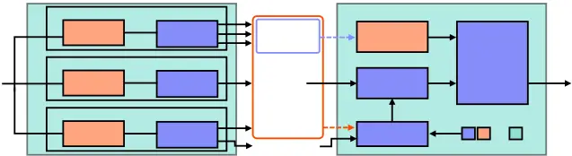

Figure 1: Overview of proposed NANSY++ backbone architecture. All
modules in the backbone network is trained in an end-to-end manner
within a single analysis and synthesis loop.

### 2.1 Self-Supervised Learning of Pitch

We represent pitch with fundamental frequency $`F_{0}`$ because it is
explicitly controllable. In addition, we found that using sinsuoidal
signal made by $`F_{0}`$ as an input signal for synthesizer can greatly
reduce glitches. To train $`F_{0}`$ estimator in a self-supervised
manner, we first adopt the auto-encoding approach of Engel et al. 2020b.
Pitch encoder $`f_{\theta_{P}}`$ takes Constant-Q Transform (CQT) as an
input feature and outputs probability distribution over 64 frequency
bins where it spans from 50Hz to 1000Hz logarithmically (approximately
0.79 semitone per bin). The $`F_{0}`$ is estimated by weighted averaging
the probability distribution over the frequency bins. The pitch encoder
also outputs two amplitude values, periodic amplitude $`A_{p}[n]`$ and
aperiodic amplitude $`A_{ap}[n]`$. $`F_{0}[n]`$ and $`A_{p}[n]`$ are
linearly upsampled into a sample-level, $`F_{0}[t]`$ and $`A_{p}[t]`$,
and transformed into a sinusoidal waveform
$`x[t]=A_{p}[t]\sin\left(\sum_{k=1}^{t}2\pi\frac{F_{0}[k]}{N_{s}}\right)`$,
where $`N_{s}`$ denotes sampling rate. We also linearly upsample
$`A_{ap}[n]`$ into $`A_{ap}[t]`$ and generate shaped noise
$`y[t]=A_{ap}[t]\cdot n[t]`$, where $`n[t]\sim U[-1,1]`$. Finally the
two siganls, $`x[t]`$ and $`y[t]`$, are added to form an input
excitation signal $`z[t]=x[t]+y[t]`$ for a synthesizer. After the
synthesizer reconstructs the input signal, the pitch encoder is trained
with reconstruction loss.

The training solely depending on reconstruction, however, was unstable,
and showed poor pitch estimation quality, which was also reported in
(Engel et al. 2020b), and as a result they ended up utilizing synthetic
audio datasets with pitch labels. While collecting synthetic audio
datasets paired with pitch labels is not difficult for musical
instruments, it is problematic for speech or singing voice because we
cannot obtain such synthetic datasets. To address this issue, we adopt
another self-supervised pitch estimation method that utilizes relative
pitch difference between two CQT inputs (Gfeller et al. 2020). First, we
extract CQT $`\bf{X}`$ $`\in`$ $`\mathbb{R}^{N\times F}`$, where $`N`$
and $`F`$ denote the size of time and frequency, respectively. One
frequency bin of CQT feature amounts to 0.5 semitone. Next, we crop the
frequency axis of $`\bf{X}`$ to obtain two CQT matrices with same size
$`\tilde{\bf{X}}^{(1)}`$, $`\tilde{\bf{X}}^{(2)}`$ $`\in`$
$`\mathbb{R}^{N\times F^{scope}}`$. The frequency range of
$`\tilde{\bf{X}}^{(1)}`$ consistently spans from $`f_{min}`$ to
$`f_{max}`$, whereas $`\tilde{\bf{X}}^{(2)}`$ is obtained by randomly
shifting the frequency-axis index of $`\tilde{\bf{X}}^{(1)}`$ by
$`d\sim\mathcal{U}\left(d_{\min},d_{\max}\right)`$. Then, the two
cropped CQT features are passed through the pitch encoder and outputs
two fundamental frequency sequences $`\tilde{F}_{0}^{(1)}`$ and
$`\tilde{F}_{0}^{(2)}`$. Finally, relative pitch difference loss
$`\mathcal{L}_{pitch}`$ is computed as follows:
$`\mathcal{L}_{pitch}=h(\lvert\log_{2}(\tilde{F}_{0}^{(1)})-\log_{2}(\tilde{F}_{0}^{(2)})-0.5d\rvert`$,
where $`h(\cdot)`$ denotes huber norm (Huber 1992). Note that by
integrating two self-supervised pitch estimation methods into the
end-to-end analysis-synthesis training loop, we achieve absolute pitch
estimation without any synthetic datasets. For more detailed CQT
configurations and neural architecture of pitch encoder, see Appendix
A.1 and A.3.

### 2.2 Disentangled Linguistic Representation

In order to ensure that the linguistic representation is disentangled
from other analysis representations, we combine information perturbation
method proposed by Choi et al. 2021a and contrastive loss proposed by
Qian et al. 2022. First, a signal is transformed into two different
signals using perturbation functions that does not significantly harm
the linguistic information. Then, wav2vec features (Babu et al. 2022)
extracted from each perturbed signal are passed into linguistic
information encoder $`f_{\theta_{L}}`$. Finally, the two linguistic
representations, $`\bm{L}_{n}^{(1)}`$ and $`\bm{L}_{n}^{(2)}`$, are then
used to compute contrastive loss as follows:

```math
\mathcal{L}_{\text{contr}}=\sum_{i=1}^{2}\left(-\log\left(\sum_{n=1}^{N}\frac{\exp\left(d\left(\bm{L}_{n}^{(1)},\bm{L}_{n}^{(2)}\right)/k\right)}{\sum_{\nu\in\{n\}\cup\mathcal{I}_{n}}\exp\left(d(\bm{L}_{n}^{(i)},\bm{L}_{\nu}^{(i)})/k\right)}\right)\right), \tag{1}
```

where $`k`$ denotes a temperature parameter, $`d`$ denotes cosine
similarity, and $`\mathcal{I}_{n}`$ denotes the set of randomly selected
frame indices for negative samples. The intuition of the contrastive
loss is that the difference between $`\bm{L}^{(1)}`$ and
$`\bm{L}^{(2)}`$ should be minimized, while the similarity within
$`\bm{L}^{(i)}`$ is minimized so that the consistent information within
an utterance (e.g., timbre information) can be minimized. Note that we
pass $`\bm{L}^{(1)}`$ to synthesizer so that $`f_{\theta_{L}}`$ is
jointly trained with reconstruction loss within the whole end-to-end
analysis-synthesis loop, which is different from Qian et al. 2022 where
they only focused on representation learning for discriminative tasks.
As we will show later in section 4.2 and 4.3, the learned linguistic
representation is extremely helpful for fast training and data
efficiency on synthesis tasks such as TTS and SVS. For more details on
information perturbation functions, neural architecture of linguistic
information encoder, and hyperparameters for
$`\mathcal{L}_{\text{contr}}`$, see Appendix A.1 and A.3.

### 2.3 Time-Varying Timbre Embeddings

To synthesize waveform from disentangled pitch and linguistic
representation, it is important to encode timbre information well enough
to fully reconstruct the input signal. Although the timbre information
is usually encoded with a single vector, we assume that the capacity of
the single vector is not enough to capture the wide variety of timbral
characteristics. In addition, we assume that timber is not static but
rather varies over time, depending on time-varying contents such as
pitch, amplitude, and linguistic information. Therefore, we breakdown
timbre features into two - global timbre embedding and timbre tokens -
using timbre encoder $`f_{\theta_{T}}`$. $`f_{\theta_{T}}`$ takes mel
spectrogram as an input and produces global timbre embedding $`\bf{g}`$,
a single vector summarized with attentive statistical time-pooling
(Okabe et al. 2018), which is expected to capture overall timbral
characteristics within an utterance. The timbre tokens $`\bm{v}_{i}`$,
$`i=1,...,I`$, are expected to capture diverse timbral characteristics
into a fixed number of tokens. The timbre tokens are extracted by
adopting a cross-attention mechanism introduced by Jaegle et al. 2021,
where trainable latent vectors are used as queries, and key and value
are extracted from timbre encoder as illustrated in Appendix A.3, Fig. 6.

After extracting timbre features, we adopt another cross-attention
mechanism by Yin et al. 2022 to extract time-varying timbre embeddings
that depends on other analysis content representations. Specifically, we
used the concatenation of $`[F_{0},A_{p},A_{ap},\bm{L},\bf{g}]`$ as a
query. Keys are composed of $`I`$ trainable vectors and the timbre
tokens are used as values. Finally, the output of the cross-attention
mechanism and $`\bf{g}`$ is interpolated using spherical linear
interpolation to make time-varying timbre embeddings. For more details
of time-varying timbre embeddings, see Appendix A.3.

### 2.4 Waveform Synthesis

The synthesis modules are composed of two synthesizers, frame-level and
sample-level synthesizer. The frame-level synthesizer first takes
linguistic feature and time-varying speaker embeddings to produce a
frame-level condition for a sample-level synthesizer. After that, the
frame-level condition are linearly upsampled into sample-level features
for sample-level conditioning. The sample-level synthesizer then takes
the excitation signal and sample-level features to reconstruct an input
waveform. For the sample-level synthesizer architecture, we adopt the
generator architecture of Parallel WaveGAN (Yamamoto et al. 2020). The
whole analysis and synthesis modules are then trained with
reconstruction loss. For the reconstruction loss, we used multi-scale
spectrogram (MSS) loss (Wang et al. 2019) and mel spectrogram loss (Kong
et al. 2020). Note that it was crucial to use linear frequency scale
spectrogram for MSS loss rather than log-scale spectrogram for the
stable training of pitch encoder, which shares similar observations to
what Turian & Henry 2020 has reported. We also used adversarial loss and
feature matching loss for high quality synthesis. Multi-period
discriminator (MPD) was used as a discriminator architecture (Kong
et al. 2020). For more details of synthesizers, please refer to
Appendix. Note that we downsample input waveforms into 16 kHz before
passing into analysis modules and let the synthesizer produces the
original 44.1 kHz waveforms. This enables 16 kHz to 44.1 kHz audio
upsampling.

## 3 Experiments on Backbone

We trained the backbone model on 10,571 hours (speech: 10,092 hours,
singing: 479 hours) of proprietary 44.1 kHz audio recordings composed of
6,176 speakers and 624 singers. We trained the backbone model for 1M
iterations with Adam optimizer (Kingma & Ba 2014) with the learning rate
of $`10^{-4}`$. The learning rate for MPD was $`2\times 10^{-4}`$. The
batch size was set to 60 using 10 RTX 3090 GPUs.

### 3.1 Fundamental Frequency Detection

|       |      |      |       |
| ----- | ---- | ---- | ----- |
| praat | rapt | pyin | crepe |
| 89.8  | 88.8 | 84.6 | 71.1  |

Table 1: ABX results (%)

To evaluate the robustness of the proposed pitch encoder in harsh
conditions, we tested the performance of the pitch encoder on noisy
speech testset. We sampled 30 speech and noise recordings from the VCTK
and DEMAND dataset (Veaux et al. 2017; Thiemann et al. 2013),
respectively, and mixed them with 5 dB signal-to-noise ratio (SNR). For
the baseline models, we chose 4 popular $`F_{0}`$ estimators, that is,
praat, rapt, pyin, and crepe (Boersma et al. 1993; Boersma & Van Heuven
2001; Jadoul et al. 2018; Talkin & Kleijn 1995; Mauch & Dixon 2014; Kim
et al. 2018). We conducted ABX test, where 15 participants were asked
which of the two samples (A and B) sounds more similar to the original
sample (X). One of the two samples was generated by reconstructing the
original sample using the NANSY++ backbone, and another sample was
reconstructed by simply replacing only the original $`F_{0}`$ sequence
into the ones that were extracted from one of the 4 baseline models. We
conducted the experiments on Mechanical Turk (MTurk). The results are
shown in Table 1. The results clearly show that $`F_{0}`$ estimated by
NANSY++ pitch encoder outperforms other pitch estimators significantly.

### 3.2 Reconstruction

|         |                 |                 |
| ------- | --------------- | --------------- |
|         | Speech          | Singing         |
| GT      | 4.39$`\pm`$0.05 | 4.35$`\pm`$0.05 |
| BL\_(H) | 4.00$`\pm`$0.06 | 3.26$`\pm`$0.06 |
| Ours    | 4.37$`\pm`$0.05 | 4.36$`\pm`$0.05 |

Table 2: Reconstruction results.

In order to use the backbone synthesizer as a synthesis module for
various applications, it is important to test the reconstruction
performance. We randomly selected 5 audio recordings for each of 25
unseen speakers and 25 unseen singers during training. 20 participants
were involved for the evaluation on MTurk. As a baseline model (BL\_(H)),
we chose HiFi-GAN as it is the most widely used mel-to-waveform
converter (Kong et al. 2020). We trained HiFi-GAN using the same
training set to NANSY++. For a fair comparison, we doubled the
upsampling rate of the penultimate block of the HiFi-GAN generator, so
that it can produce 44.1kHz waveform. The results are shown in Table 2.
The results clearly show that NANSY++ synthesizer produces better
waveforms for both speech and singing voice. Especially, significant
improvement was observed on singing voice.

## 4 Applications

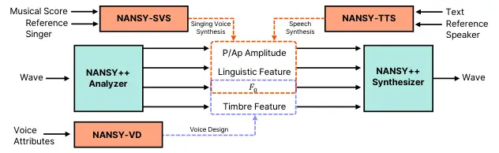

Figure 2: Overview of exemplar applications integrated into the NANSY++
backbone architecture. Each application can be substituted into a
problem of estimating analysis features from the backbone.

We introduce 4 exemplar applications that can be integrated with
NANSY++. Various conditional generative models can be integrated by
generating analysis features from conditions.

### 4.1 Voice Conversion

|                   |                 |                 |
| ----------------- | --------------- | --------------- |
| MODEL             | MOS             | SSIM            |
| TGT as TGT        | 4.08$`\pm`$0.05 | 3.47$`\pm`$0.06 |
| BL\_(Y)           | 3.23$`\pm`$0.06 | 2.78$`\pm`$0.12 |
| Ours ($`vctk`$)   | 3.72$`\pm`$0.06 | 2.99$`\pm`$0.12 |
| Ours ($`entire`$) | 3.79$`\pm`$0.05 | 3.16$`\pm`$0.10 |

Table 3: Voice conversion results.

We perform zero-shot voice conversion by simply replacing the original
timbre features into the timbre features extracted from a single
utterance of a target speaker. To further match the style of the target
speaker, we also transformed the $`F_{0}`$ statistics of the source
speaker into the target speaker’s. As a baseline model (BL\_(Y)), we
selected the state-of-the-art zero-shot voice conversion model, YourTTS
(Casanova et al. 2022). Note that YourTTS requires paired (text, audio)
dataset to train the model. Other than the NANSY++ trained with the
entire dataset (Ours ($`entire`$)) explained in section 3, we trained
additional model solely on VCTK dataset (Ours ($`vctk`$)) to match the
training dataset setting of the baseline model. We tested each model
using 11 unseen speakers during training following EXP. 1 of Casanova
et al. 2022. Each speaker was converted into 4 different speakers,
resulting in 44 conversion pairs. For each source-target conversion
pair, we randomly selected 5 utterances, resulting in 220 audio samples
in total. We tested the naturalness (MOS) and speaker similarity (SSIM)
following Wester et al. 2016. The evaluation was done by 20 participants
on MTurk. Note that we downsampled the 44.1 kHz NANSY++ outputs into 16
kHz for a fair comparison to YourTTS as it only supports 16 kHz
synthesis. The results are shown in Table 3. TGT as TGT denotes the
setting where the target speakers are compared with their own
utterances. The results clearly show that NANSY++ can change the voice
with better naturalness and speaker similarity then the baseline model
even though the model was trained without any text transcripts paired
with audio recordings. In addition, we could achieve a noticeable
speaker similarity improvement when trained with more audio recordings,
showing the data scalability of the training method of NANSY++.

### 4.2 Text-To-Speech

In this section, we describe NANSY-TTS, a text to speech (TTS)
application utilizing NANSY++ framework. NANSY-TTS is independently
trained using NANSY++ analysis features. We show that this modular
training approach is data efficient, while maintaining high-fidelity
synthesis quality.

#### 4.2.1 Method

##### Architecture

NANSY-TTS consists of a phoneme encoder, style encoder, linguistic
decoder, $`F_{0}`$ decoder, amplitude decoder, and length regulator. All
modules operate in a non-autoregressive manner. By utilizing the timbre
encoder of NANSY++ analyzer, there is no need to consider the timbre
representation for NANSY-TTS. Therefore, the style encoder only handles
the prosody (e.g., speaking pace, pitch, and loudness). The output style
vector is used for duration predictor and all decoders. More details and
the overview figure can be found at Appendix B.1.

##### Training and inference

To train the proposed TTS module, we optimize Mean Absolute Error(MAE)
for linguistic features, $`F_{0}`$, $`A_{p}`$, and $`A_{ap}`$ extracted
from NANSY++ analyzer. The aligner is trained independently to other
modules in NANSY-TTS. The duration predictor is optimized by minimizing
MAE for the duration of each phoneme using the alignment calculated by
the monotonic alignment algorithm (MAS) (Kim et al. 2020) with the
aligner module. In the inference stage, the TTS module first generates
linguistic feature, P/Ap amplitudes, and $`F_{0}`$. Then, NANSY++
synthesizer takes these generated features and timbre features to
generate an waveform. More details can be found at Appendix B.2

#### 4.2.2 Experiments

##### Data efficiency

| MODEL                     | MOS                               | CER (%)      |
| ------------------------- | --------------------------------- | ------------ |
| GT                        | 4.47$`\pm`$0.09                   | 1.93         |
| BL\_(G) / Ours ($`5`$)    | 1.37$`\pm`$0.07 / 3.31$`\pm`$0.10 | 42.50 / 3.29 |
| BL\_(G) / Ours ($`10`$)   | 2.07$`\pm`$0.11 / 3.39$`\pm`$0.10 | 18.59 / 3.05 |
| BL\_(G) / Ours ($`30`$)   | 2.78$`\pm`$0.11 / 3.64$`\pm`$0.10 | 5.34 / 2.20  |
| BL\_(G) / Ours ($`full`$) | 3.38$`\pm`$0.11 / 4.07$`\pm`$0.09 | 2.65 / 1.68  |

Table 4: TTS data efficiency evaluation.

To evaluate data efficiency, we used a single speaker (reader id: 8051)
from the Hi-Fi multi-speaker english TTS dataset (Bakhturina et al.
2021). The dataset has 30 hours of speech audio sampled at 44.1kHz. We
made three subsets with data of 5, 10 and 30 minutes, and the larger
subsets include small subsets. First, we measured character error rate
(CER) to evaluate the intelligibility of the speech according to the
size of the dataset. The synthesized speech from the 100 test sentences
were transcribed by the pretrained speech recognition model (Silero
2021). As a baseline model (BL\_(G)), the official implementation of
Glow-TTS was used as an acoustic model. We used the same 44.1 kHz
HiFi-GAN as a baseline vocoder mentioned in section 3.2. The training
configuration of NANSY-TTS (Ours) was set to be the same as that of the
baseline model. As shown in Table 4, NANSY-TTS preserved relatively high
MOS and low CER regardless of the size of the dataset, whereas
evaluation results of the baseline model showed significantly dropped
performance as the size of the dataset became smaller. In particular,
NANSY-TTS trained with the 30 minutes subset outperforms the baseline
model trained with the full dataset. This indicates the proposed modular
training approach offers a significant data efficiency for TTS with high
synthesis quality.

|                   |                 |                 |
| ----------------- | --------------- | --------------- |
| MODEL             | MOS             | SSIM            |
| TGT as TGT        | 3.98$`\pm`$0.07 | 2.91$`\pm`$0.09 |
| BL\_(Y)           | 3.33$`\pm`$0.08 | 2.21$`\pm`$0.09 |
| Ours ($`vctk`$)   | 4.27$`\pm`$0.07 | 2.55$`\pm`$0.09 |
| Ours ($`entire`$) | 4.28$`\pm`$0.07 | 2.65$`\pm`$0.09 |

Table 5: Zero-shot TTS results.

##### Zero-shot TTS

The setting for this evaluation is the same as section 4.1, but with
three differences. First, the model generates speech samples using one
randomly selected reference speech per speaker as the style input.
Second, we randomly selected 9 utterances for each of 11 unseen
speakers, resulting in 99 audio samples in total. Finally, we trained
NANSY-TTS on VCTK using two versions of NANSY++ as mentiond in section
4.1, respectively. As shown in Table 5, NANSY-TTS outperforms the
baseline. Interestingly, NANSY-TTS even achieved significantly better
MOS than actual recordings. We conjecture that this is because some
speakers in the VCTK datasets speak in rather unnatural prosody, while
NANSY-TTS learns how to speak in natural prosody given the text
transcription. We discuss the details in the Appendix B.3 further.

### 4.3 Singing Voice Synthesis

In this section, we describe a singing voice synthesis (SVS) application
that generates NANSY++ analysis features from a musical score, namely
NANSY-SVS. The two major challenges of SVS are (i) limited amount of
labeled data and (ii) unpleasant glitches of synthesized voice. The
first problem stems from the difficulty of dataset collection process.
Labeling singing data often demands more human labor and time compared
to speech data. Another issue is that generating high-fidelity singing
voice from mel spectrogram is well known to be difficult owing to a wide
pitch range, long continuous pronunciation, and high sampling rate (Chen
et al. 2020a; Perrotin et al. 2021; Morrison et al. 2022). To tackle
these problems, we introduce NANSY-SVS that builds upon the benefits of
NANSY++ framework. NANSY-SVS addresses both concerns regarding the
dataset size and high-fidelity synthesis by modeling the disentangled
NANSY++ analysis features.

#### 4.3.1 Method

##### Architecture

NANSY-SVS uses a phoneme sequence, MIDI-pitch sequence, and global
timbre embedding (from NANSY++ analyzer) as conditional inputs to
generate linguistic features and $`F_{0}`$ contours in an autoregressive
manner. The linguistic feature at the $`t`$-th frame $`\bm{L}_{t}`$ is
inferred from $`\bm{L}_{<t}`$, phoneme sequence, MIDI-pitch sequence,
and singer-ID embedding. For the $`F_{0}`$ contour, we predicted the
difference (residual-$`F_{0}`$) between input MIDI-pitch and target
$`F_{0}`$ contour instead of modeling it directly. The
residual-$`F_{0}`$ range ending in -1200 cents to 1200 cents is
quantized in 100 cents increments, yielding 241 possible values. The
241-dimensional residual-$`F_{0}`$, $`RF_{t}`$, was inferred from
$`RF_{<t}`$, MIDI-pitch sequence, phoneme sequence, and singer-ID
embedding. The amplitude predictor module infers P/Ap amplitudes from
the generated linguistic features and $`F_{0}`$ contour. More details of
NANSY-SVS can be found in Appendix C.1.

##### Training and inference

To train NANSY-SVS, we optimize MAE for linguistic features, P/Ap
amplitude, and cross-entropy for residual-$`F_{0}`$ classification. At
inference time, linguistic features and residual-$`F_{0}`$ are first
generated in autoregressive way, and then P/Ap amplitudes are inferred
from the generated results. Finally, the generated features are passed
through the NANSY++ synthesizer along with the timbre features extracted
from the reference audio to produce a final waveform.

#### 4.3.2 Experiments

##### Experimental setup

We trained the model using OpenCPOP dataset (Wang et al. 2022), a public
singing dataset of 100 songs from a single female singer with aligned
phoneme and MIDI-pitch sequence. We followed the official train/test
split of Wang et al. 2022, i.e. 95 songs and 5 songs for training and
evaluation, respectively. To verify that our proposed model can be
trained to synthesize high-quality singing voice using a limited amount
of training data, we constructed a subset by extracting 80, 160, and 320
segments from the original dataset consisting of 3550 segments in total.
This corresponds to 10%, 5%, and 2.5% of the entire dataset, and we
trained 4 models in total using each subset. Note that each subset was
constructed to include all phonemes and MIDI-pitch at least once. As a
baseline model (BL\_(D)), we chose Diffsinger (Liu et al. 2022), which
showed state-of-the-art performance with a diffusion-based model
structure. We trained the baseline model with the same setting as
NANSY-SVS using the official implementation for both acoustic model and
vocoder.

| MODEL                     | MOS                                   |
| ------------------------- | ------------------------------------- |
| BL\_(D) / Ours ($`80`$)   | 2.67$`\pm`$0.08 / 3.81$`\pm`$0.06     |
| BL\_(D) / Ours ($`160`$)  | 3.05$`\pm`$0.08 / 3.86$`\pm`$0.05     |
| BL\_(D) / Ours ($`320`$)  | 3.49$`\pm`$0.06 / 3.85$`\pm`$0.05     |
| BL\_(D) / Ours ($`full`$) | 3.83$`\pm`$0.06 / 3.87$`\pm`$0.06     |
| GT / Recon.               | 4.026$`\pm`$0.056 / 4.031$`\pm`$0.053 |

Table 6: SVS data efficiency evaluation.

##### Evaluation

We conducted a listening test to evaluate the quality of generated
singing voice. We randomly selected 12 segments from each of the 5 test
songs, and generated 60 singing voice segments in total for each model.
The singing-ID embedding was obtained from a randomly sampled 30-second
segment in the training set. 15 participants were asked to assess the
naturalness of each audio on a 5-point scale. Table 6 shows that the
perceptual quality of the NANSY-SVS outperforms the baseline in all
training conditions. As the size of the training data decreased, the MOS
of Diffsinger decreased by up to 1.16 while the MOS of NANSY-SVS
decreased by only 0.06. From this, we confirm that the proposed
modularized training method with NANSY++ backbone is efficient in
data-limited training condition. Other experiments on SVS can be found
at Appendix C.2.

### 4.4 Voice Designing

To further explore the usability of disentangled NANSY++ features, we
tackle the challenging problems of manipulating voice such as creating
new voice identities and editing voice attributes. Previous works have
investigated extrapolating of speaker embedding space using Gaussian
mixture models (GMMs) (Bilinski et al. 2022) or learning a speaker
embedding prior within a variational autoencoder (VAE)
framework (Stanton et al. 2022) to synthesize new speakers. In this
section, we develop a voice designing system, namely NANSY-VOD, that can
both change voice attributes and generate novel voice identities. We
also show that NANSY-VOD enables fine-grained control over voice
manipulation in an interpretable way by leveraging speaker’s gender and
age as conditioning variables.

#### 4.4.1 Method

##### Model

NANSY-VOD consists of three normalizing flow networks that learn the
distribution of $`F_{0}`$ statistics (e.g., median and variance), a
global timbre embedding, and timbre tokens, respectively. The first
network estimates the conditional distribution of the $`F_{0}`$
statistics given gender and age, and is trained according to the maximum
likelihood. The second network is optimized to maximize the likelihood
of the global timbre embedding conditioned on the $`F_{0}`$ statistics,
gender, and age. Similarly, the third network models the distribution of
the timbre tokens given the global timbre embedding, the $`F_{0}`$
statistics, gender, and age. Since the timbre tokens consist of multiple
column vectors lying in a common feature space, we choose to use each
vector as individual input to the network. To distinguish these vectors,
a token index is used as an additional conditioning term. By sharing
parameters, the third network is trained more efficiently compared to
the naive implementation that models the entire timbre tokens at once.
More details can be found in Appendix D.1.

##### Continuous gender

We use continuous real values instead of binary values to represent
gender. The intuition is that (i) voices of pre-pubertal children may
not be gender distinct, and (ii) some people’s voices sound neutral. By
allowing relaxed labels for gender, we expect that the gradual control
of the gender attribute of voice can be implemented at inference time.
To get continuous gender labels, another network called SPNet is
employed and more details can be found at Appendix D.4.

##### Training and inference

Input data is obtained from NANSY++ analysis modules and conditioning
data (i.e. gender and age) is labeled by SPNet for training. The
negative log-likelihoods of the three networks are summed to compute the
total loss and NANSY-VOD is optimized in the same way as a typical
normalizing flow. At inference time, NANSY-VOD supports two
functionalities: voice attribute control and new voice generation. To
edit voice attributes, first, the inputs are transformed to flow latent
variables conditioned on the source speaker’s gender and age. The edited
NANSY++ features are then retrieved by converting the latent variables
back conditioned on different age and gender. To create a new voice
identity, latent variables are sampled from the normal distribution and
transformed via the inverse pass of NANSY-VOD with target age and
gender.

#### 4.4.2 Experiments

##### Experimental setup

To evaluate the proposed method, we used the NANSY++ backbone dataset
and three AI-Hub conversation datasets (https://aihub.or.kr): kids,
adults, and elderly people. The AI-Hub datasets consist of approximately
6821 hours of Korean recordings with gender and age labels. There are a
total of 6001 speakers whose ages range from 3 to 91. We randomly
selected 4800 and 600 speakers, and constructed training and validation
sets respectively by merging their utterances and speech data of the
NANSY++ backbone dataset. From the remaining 601 speakers, we prepared a
set of 320 unseen speakers by sampling 40 male and female speakers from
each age group of (0, 10\], (10, 30\], (30, 50\], and (50, 70\]. We
trained NANSY-VOD for about 250K iterations with the AdamW
optimizer (Loshchilov & Hutter 2017) of learning rate
$`2\times 10^{-4}`$. A batch size was set to 256 for each of four RTX
3090 GPUs. Other experimental settings such as model architecture and
hyperparameters are attached at Appendix D.1.

![[Uncaptioned
image]](arxiv-2211-09407v1--ff79143f74f2.figures/figure-3.webp)\captionof

figureAge shift evaluation.

![[Uncaptioned
image]](arxiv-2211-09407v1--ff79143f74f2.figures/figure-4.webp)\captionof

figureGender shift evaluation.

##### Voice attribute control

NANSY-VOD controls voice attributes by using different conditioning
inputs for the forward and inverse processes of normalizing flows.
First, we edited the age attributes of the 320 unseen speakers by adding
or subtracting different values to their original ages. The synthesizer
reconstructed audio using the linguistic feature of a source speaker and
the other edited features. Then, the ages of the converted voices were
estimated by SPNet. We report the estimated age distributions of the
original voices and the edited voices in Fig. 4.4.2. A shift in the age
distribution was observed as the target age shifts, supporting the age
controllability of NANSY-VOD.

We also edited the gender attribute and investigated the gender of the
converted voices using SPNet. Since NANSY-VOD leverages a continuous
gender, SPNet was used again to label the gender of a source speaker.
Fig. 4.4.2 shows the gender distributions of the original and converted
voices. We observed the gender distribution varies as we shift the
gender values accordingly. This shows that NANSY-VOD can transform a
voice into a more masculine or feminine voice by controlling the gender
attribute.

##### Voice identity generation

| $`n_{s}`$=320 | $`n_{s}`$=240 | $`n_{s}`$=160 | $`n_{s}`$=1 | Ours |
| ------------- | ------------- | ------------- | ----------- | ---- |
| 0.51          | 0.46          | 0.39          | 0.17        | 0.46 |

Table 7: Speaker diversity. $`n_{s}`$ denotes the number of speakers in
comparison set.

We evaluated the performance of voice identity generation in terms of
speaker diversity. To measure how diverse speakers NANSY-VOD can
generate, we utilized the speaker distance metric proposed by Stanton
et al. 2022, which is reformulated as
$`\underset{i}{\mathrm{median}}\min_{j\neq i}d(V_{i},V_{j})`$, where
$`d(\cdot,\cdot)`$ denotes the cosine distance and $`V_{i}`$ represents
the speaker feature of the $`i`$-th utterance extracted from
ECAPA-TDNN (Desplanques et al. 2020). We synthesized 320 speakers from
NANSY-VOD and synthesized audio using the linguistic features of the
utterances in the test set. For comparison, we constructed four sets of
320 utterances consisting of different numbers of speakers (320, 240,
160, and 1). Table 7 shows the speaker diversities of the set generated
by NANSY-VOD and the other sets. The set consisting of 320 speakers
records the highest diversity and we use this score as an estimate of
the speaker diversity of the real speaker distribution. As the number of
speakers in the set decreases, the speaker diversity gets reduced as
expected. The speaker diversity of NANSY-VOD is close to that of the 240
speakers set. This implies that NANSY-VOD can generate various speakers
having 75% diversity compared to the real speaker distribution.

## 5 Related Works

Self-supervised representation training methods for speech has recently
been widely studied in the goal of training rich representations mostly
for downstream tasks such as automatic speech recognition (Baevski
et al. 2020; Babu et al. 2022; Hsu et al. 2021; Huang et al. 2022).
There has also been studies that utilized the self-supervised speech
representation on synthesis task such as voice conversion (Lin et al.
2021; hao Lin et al. 2021). For TTS applications, Siuzdak et al. 2022
proposed to employ wav2vec 2.0 feature as a mid-level representation of
a TTS model. However, they used the representation from wav2vec 2.0
network finetuned on English text transcriptions, hence might not be
sufficient for training on languages without labeled datasets. Kim
et al. 2022 has proposed to apply transfer learning framework using
pseudo phoneme sequence extracted from wav2vec 2.0 feature and showed
that the model can be trained using a small amount of dataset.

Previous works have shown that state-of-the-art vocoder such as HiFi-GAN
produces glitches, especially on long notes (Morrison et al. 2022; Chen
et al. 2020a). Morrison et al. 2022 showed that an autoregressive neural
architecture can reduce this issue. Another line of vocoders are the
ones that take sinusoidal signal as a network input (Wang et al. 2019;
Hono et al. 2021). These types of vocoders do not exhibit such glitches
on long notes even without the autoregressive nature in the
architecture.

## 6 Conclusion

In this work, we proposed a unified voice synthesis framework NANSY++
that can analyze signal into disentangled representations and synthesize
high-quality waveform. Because the training only requires audio
recordings, we can achieve data scalability. We have also proposed to
integrate various voice synthesis applications in a modularized way. By
integrating the applications into the centralized backbone network, we
found that we can train models for each application using only a small
amount of dataset. Although each module is not trained in an end-to-end
manner, the proposed modularized training strategy does not suffer from
the common performance drop phenomenon induced by training/inference
mismatch. We believe that the proposed framework provides useful
representations for synthesis tasks. Therefore, we hope that the
proposed framework will help to move away from the current predominant
training strategy (text-to-mel acoustic model & mel-to-wav vocoder) and
expand the scope of research.

## 7 Reproducibility Statement

Details of neural architectures for every models used in this paper are
described in Appendix. We have also included every hyperparameters used
for training in Appendix.

## 8 Ethics Statement

There is a possibility of the proposed method being used with harmful
intentions by anonymous users. Because the proposed method can clone
arbitrary voice in a zero-shot manner, we believe the technology should
be released only to the identified and authorized users.

As the voice synthesis technologies advance rapidly, attempts have been
made to counteract the concerns surrounding the harmful intents of the
voice synthesis technology. Recently, anti-spoofing challenges have
drawn attentions from many fields because of its importance, and showed
promising results on anti-spoofing for speech (Yamagishi et al. 2021).
We hope to see more domain experts to engage and develop a voice
verification system to prevent abuse of fake voice.

Despite the concerns on negative consequences of the technology, there
is also a bright side of such technologies when used properly. One such
example is when used as an interactive tool between humans and machines.
Because the proposed methods enable controls on voice, we believe it can
foster human creativity in various aspects.

## References

- Babu et al. (2022) Arun Babu, Changhan Wang, Andros Tjandra, Kushal
  Lakhotia, Qiantong Xu, Naman Goyal, Kritika Singh, Patrick von Platen,
  Yatharth Saraf, Juan Pino, Alexei Baevski, Alexis Conneau, and Michael
  Auli. XLS-R: Self-supervised Cross-lingual Speech Representation
  Learning at Scale. In _Proc. Interspeech 2022_, pp. 2278–2282, 2022.
  doi: 10.21437/Interspeech.2022-143.
- Baevski et al. (2020) Alexei Baevski, Yuhao Zhou, Abdelrahman Mohamed,
  and Michael Auli. wav2vec 2.0: A framework for self-supervised
  learning of speech representations. _Advances in Neural Information
  Processing Systems_, 33:12449–12460, 2020.
- Bakhturina et al. (2021) Evelina Bakhturina, Vitaly Lavrukhin, Boris
  Ginsburg, and Yang Zhang. Hi-fi multi-speaker english tts dataset.
  _arXiv preprint arXiv:2104.01497_, 2021.
- Bilinski et al. (2022) Piotr Bilinski, Thomas Merritt, Abdelhamid
  Ezzerg, Kamil Pokora, Sebastian Cygert, Kayoko Yanagisawa, Roberto
  Barra-Chicote, and Daniel Korzekwa. Creating New Voices using
  Normalizing Flows. In _Proc. Interspeech 2022_, pp. 2958–2962, 2022.
  doi: 10.21437/Interspeech.2022-10195.
- Bińkowski et al. (2020) Mikołaj Bińkowski, Jeff Donahue, Sander
  Dieleman, Aidan Clark, Erich Elsen, Norman Casagrande, Luis C. Cobo,
  and Karen Simonyan. High fidelity speech synthesis with adversarial
  networks. In _International Conference on Learning
  Representations_, 2020. URL
  [https://openreview.net/forum?id=r1gfQgSFDr](https://openreview.net/forum?id=r1gfQgSFDr).
- Boersma & Van Heuven (2001) Paul Boersma and Vincent Van Heuven. Speak
  and unspeak with praat. _Glot International_, 5:341–347, 2001.
- Boersma et al. (1993) Paul Boersma et al. Accurate short-term analysis
  of the fundamental frequency and the harmonics-to-noise ratio of a
  sampled sound. In _Proceedings of the institute of phonetic sciences_,
  volume 17, pp. 97–110. Citeseer, 1993.
- Casanova et al. (2022) Edresson Casanova, Julian Weber, Christopher D
  Shulby, Arnaldo Candido Junior, Eren Gölge, and Moacir A Ponti.
  Yourtts: Towards zero-shot multi-speaker tts and zero-shot voice
  conversion for everyone. In _International Conference on Machine
  Learning_, pp. 2709–2720. PMLR, 2022.
- Chen et al. (2020a) Jiawei Chen, Xu Tan, Jian Luan, Tao Qin, and
  Tie-Yan Liu. Hifisinger: Towards high-fidelity neural singing voice
  synthesis. _arXiv preprint arXiv:2009.01776_, 2020a.
- Chen et al. (2020b) Mingjian Chen, Xu Tan, Bohan Li, Yanqing Liu, Tao
  Qin, Tie-Yan Liu, et al. Adaspeech: Adaptive text to speech for custom
  voice. In _International Conference on Learning Representations_,
  2020b.
- Choi et al. (2021a) Hyeong-Seok Choi, Juheon Lee, Wansoo Kim, Jie Lee,
  Hoon Heo, and Kyogu Lee. Neural analysis and synthesis: Reconstructing
  speech from self-supervised representations. _Advances in Neural
  Information Processing Systems_, 34:16251–16265, 2021a.
- Choi et al. (2021b) Hyeong-Seok Choi, Sungjin Park, Jie Hwan Lee, Hoon
  Heo, Dongsuk Jeon, and Kyogu Lee. Real-time denoising and
  dereverberation wtih tiny recurrent u-net. In _ICASSP 2021-2021 IEEE
  International Conference on Acoustics, Speech and Signal Processing
  (ICASSP)_, pp. 5789–5793. IEEE, 2021b.
- Dauphin et al. (2017) Yann N Dauphin, Angela Fan, Michael Auli, and
  David Grangier. Language modeling with gated convolutional networks.
  In _International conference on machine learning_, pp. 933–941.
  PMLR, 2017.
- Desplanques et al. (2020) Brecht Desplanques, Jenthe Thienpondt, and
  Kris Demuynck. ECAPA-TDNN: Emphasized Channel Attention, propagation
  and aggregation in TDNN based speaker verification. In _Interspeech
  2020_, pp. 3830–3834, 2020.
- Donahue et al. (2021) Jeff Donahue, Sander Dieleman, Mikolaj
  Binkowski, Erich Elsen, and Karen Simonyan. End-to-end adversarial
  text-to-speech. In _International Conference on Learning
  Representations_, 2021. URL
  [https://openreview.net/forum?id=rsf1z-JSj87](https://openreview.net/forum?id=rsf1z-JSj87).
- Engel et al. (2020a) Jesse Engel, Lamtharn (Hanoi) Hantrakul, Chenjie
  Gu, and Adam Roberts. Ddsp: Differentiable digital signal processing.
  In _International Conference on Learning Representations_, 2020a. URL
  [https://openreview.net/forum?id=B1x1ma4tDr](https://openreview.net/forum?id=B1x1ma4tDr).
- Engel et al. (2020b) Jesse Engel, Rigel Swavely, Lamtharn Hanoi
  Hantrakul, Adam Roberts, and Curtis Hawthorne. Self-supervised pitch
  detection by inverse audio synthesis. In _ICML 2020 Workshop on
  Self-supervision in Audio and Speech_, 2020b. URL
  [https://openreview.net/forum?id=RlVTYWhsky7](https://openreview.net/forum?id=RlVTYWhsky7).
- Gfeller et al. (2020) Beat Gfeller, Christian Frank, Dominik Roblek,
  Matt Sharifi, Marco Tagliasacchi, and Mihajlo Velimirović. Spice:
  Self-supervised pitch estimation. _IEEE/ACM Transactions on Audio,
  Speech, and Language Processing_, 28:1118–1128, 2020.
- hao Lin et al. (2021) Jheng hao Lin, Yist Y. Lin, Chung-Ming Chien,
  and Hung yi Lee. S2VC: A Framework for Any-to-Any Voice Conversion
  with Self-Supervised Pretrained Representations. In _Proc. Interspeech
  2021_, pp. 836–840, 2021. doi: 10.21437/Interspeech.2021-1356.
- Hono et al. (2021) Yukiya Hono, Shinji Takaki, Kei Hashimoto,
  Keiichiro Oura, Yoshihiko Nankaku, and Keiichi Tokuda. Periodnet: A
  non-autoregressive waveform generation model with a structure
  separating periodic and aperiodic components. In _ICASSP 2021-2021
  IEEE International Conference on Acoustics, Speech and Signal
  Processing (ICASSP)_, pp. 6049–6053. IEEE, 2021.
- Hsu et al. (2021) Wei-Ning Hsu, Benjamin Bolte, Yao-Hung Hubert Tsai,
  Kushal Lakhotia, Ruslan Salakhutdinov, and Abdelrahman Mohamed.
  Hubert: Self-supervised speech representation learning by masked
  prediction of hidden units. _IEEE/ACM Transactions on Audio, Speech,
  and Language Processing_, 29:3451–3460, 2021.
- Huang et al. (2022) Wenyong Huang, Zhenhe Zhang, Yu Ting Yeung, Xin
  Jiang, and Qun Liu. SPIRAL: Self-supervised perturbation-invariant
  representation learning for speech pre-training. In _International
  Conference on Learning Representations_, 2022. URL
  [https://openreview.net/forum?id=TBpg4PnXhYH](https://openreview.net/forum?id=TBpg4PnXhYH).
- Huber (1992) Peter J Huber. Robust estimation of a location parameter.
  In _Breakthroughs in statistics_, pp. 492–518. Springer, 1992.
- Jadoul et al. (2018) Yannick Jadoul, Bill Thompson, and Bart De Boer.
  Introducing parselmouth: A python interface to praat. _Journal of
  Phonetics_, 71:1–15, 2018.
- Jaegle et al. (2021) Andrew Jaegle, Felix Gimeno, Andy Brock, Oriol
  Vinyals, Andrew Zisserman, and Joao Carreira. Perceiver: General
  perception with iterative attention. In Marina Meila and Tong Zhang
  (eds.), _Proceedings of the 38th International Conference on Machine
  Learning_, volume 139 of _Proceedings of Machine Learning Research_,
  pp. 4651–4664. PMLR, 18–24 Jul 2021. URL
  [https://proceedings.mlr.press/v139/jaegle21a.html](https://proceedings.mlr.press/v139/jaegle21a.html).
- Jeong et al. (2021) Myeonghun Jeong, Hyeongju Kim, Sung Jun Cheon,
  Byoung Jin Choi, and Nam Soo Kim. Diff-tts: A denoising diffusion
  model for text-to-speech. _arXiv preprint arXiv:2104.01409_, 2021.
- Kim et al. (2020) Jaehyeon Kim, Sungwon Kim, Jungil Kong, and Sungroh
  Yoon. Glow-tts: A generative flow for text-to-speech via monotonic
  alignment search. _Advances in Neural Information Processing Systems_,
  33:8067–8077, 2020.
- Kim et al. (2021) Jaehyeon Kim, Jungil Kong, and Juhee Son.
  Conditional variational autoencoder with adversarial learning for
  end-to-end text-to-speech. In _International Conference on Machine
  Learning_, pp. 5530–5540. PMLR, 2021.
- Kim et al. (2018) Jong Wook Kim, Justin Salamon, Peter Li, and
  Juan Pablo Bello. Crepe: A convolutional representation for pitch
  estimation. In _2018 IEEE International Conference on Acoustics,
  Speech and Signal Processing (ICASSP)_, pp. 161–165. IEEE, 2018.
- Kim et al. (2022) Minchan Kim, Myeonghun Jeong, Byoung Jin Choi,
  Sunghwan Ahn, Joun Yeop Lee, and Nam Soo Kim. Transfer Learning
  Framework for Low-Resource Text-to-Speech using a Large-Scale
  Unlabeled Speech Corpus. In _Proc. Interspeech 2022_, pp.
  788–792, 2022. doi: 10.21437/Interspeech.2022-225.
- Kingma & Ba (2014) Diederik P Kingma and Jimmy Ba. Adam: A method for
  stochastic optimization. _arXiv preprint arXiv:1412.6980_, 2014.
- Kong et al. (2020) Jungil Kong, Jaehyeon Kim, and Jaekyoung Bae.
  Hifi-gan: Generative adversarial networks for efficient and high
  fidelity speech synthesis. _Advances in Neural Information Processing
  Systems_, 33:17022–17033, 2020.
- Lee et al. (2019) Juheon Lee, Hyeong-Seok Choi, Chang-Bin Jeon,
  Junghyun Koo, and Kyogu Lee. Adversarially trained end-to-end korean
  singing voice synthesis system. In Gernot Kubin and Zdravko Kacic
  (eds.), _Interspeech 2019, 20th Annual Conference of the International
  Speech Communication Association, Graz, Austria, 15-19 September
  2019_, pp. 2588–2592. ISCA, 2019. doi: 10.21437/Interspeech.2019-1722.
  URL
  [https://doi.org/10.21437/Interspeech.2019-1722](https://doi.org/10.21437/Interspeech.2019-1722).
- Lin et al. (2021) Yist Y Lin, Chung-Ming Chien, Jheng-Hao Lin, Hung-yi
  Lee, and Lin-shan Lee. Fragmentvc: Any-to-any voice conversion by
  end-to-end extracting and fusing fine-grained voice fragments with
  attention. In _ICASSP 2021-2021 IEEE International Conference on
  Acoustics, Speech and Signal Processing (ICASSP)_, pp. 5939–5943.
  IEEE, 2021.
- Liu et al. (2022) Jinglin Liu, Chengxi Li, Yi Ren, Feiyang Chen, and
  Zhou Zhao. Diffsinger: Singing voice synthesis via shallow diffusion
  mechanism. In _Proceedings of the AAAI Conference on Artificial
  Intelligence_, volume 36, pp. 11020–11028, 2022.
- Loshchilov & Hutter (2017) Ilya Loshchilov and Frank Hutter. Decoupled
  weight decay regularization. _arXiv preprint arXiv:1711.05101_, 2017.
- Mauch & Dixon (2014) Matthias Mauch and Simon Dixon. pyin: A
  fundamental frequency estimator using probabilistic threshold
  distributions. In _2014 ieee international conference on acoustics,
  speech and signal processing (icassp)_, pp. 659–663. IEEE, 2014.
- Min et al. (2021) Dongchan Min, Dong Bok Lee, Eunho Yang, and Sung Ju
  Hwang. Meta-stylespeech: Multi-speaker adaptive text-to-speech
  generation. In _International Conference on Machine Learning_, pp.
  7748–7759. PMLR, 2021.
- Morrison et al. (2022) Max Morrison, Rithesh Kumar, Kundan Kumar, Prem
  Seetharaman, Aaron Courville, and Yoshua Bengio. Chunked
  autoregressive GAN for conditional waveform synthesis. In
  _International Conference on Learning Representations_, 2022. URL
  [https://openreview.net/forum?id=v3aeIsY_vVX](https://openreview.net/forum?id=v3aeIsY_vVX).
- Okabe et al. (2018) Koji Okabe, Takafumi Koshinaka, and Koichi
  Shinoda. Attentive statistics pooling for deep speaker embedding. In
  _Proc. Interspeech 2018_, pp. 2252–2256, 2018. doi:
  10.21437/Interspeech.2018-993.
- Perrotin et al. (2021) Olivier Perrotin, Hussein Amouri, Gérard
  Bailly, and Thomas Hueber. Evaluating the extrapolation capabilities
  of neural vocoders to extreme pitch values. In _Interspeech 2021_, pp.
  11–15. ISCA, 2021.
- Qian et al. (2022) Kaizhi Qian, Yang Zhang, Heting Gao, Junrui Ni,
  Cheng-I Lai, David Cox, Mark Hasegawa-Johnson, and Shiyu Chang.
  Contentvec: An improved self-supervised speech representation by
  disentangling speakers. In _International Conference on Machine
  Learning_, pp. 18003–18017. PMLR, 2022.
- Silero (2021) Silero. Silero models: pre-trained enterprise-grade stt
  / tts models and benchmarks.
  [https://github.com/snakers4/silero-models](https://github.com/snakers4/silero-models), 2021.
- Siuzdak et al. (2022) Hubert Siuzdak, Piotr Dura, Pol van Rijn, and
  Nori Jacoby. Wavthruvec: Latent speech representation as intermediate
  features for neural speech synthesis. _arXiv preprint
  arXiv:2203.16930_, 2022.
- Stanton et al. (2022) Daisy Stanton, Matt Shannon, Soroosh Mariooryad,
  RJ Skerry-Ryan, Eric Battenberg, Tom Bagby, and David Kao. Speaker
  generation. In _ICASSP 2022-2022 IEEE International Conference on
  Acoustics, Speech and Signal Processing (ICASSP)_, pp. 7897–7901.
  IEEE, 2022.
- Talkin & Kleijn (1995) David Talkin and W Bastiaan Kleijn. A robust
  algorithm for pitch tracking (rapt). _Speech coding and synthesis_,
  495:518, 1995.
- Thiemann et al. (2013) Joachim Thiemann, Nobutaka Ito, and Emmanuel
  Vincent. Demand: a collection of multi-channel recordings of acoustic
  noise in diverse environments. In _Proc. Meetings Acoust_, pp.
  1–6, 2013.
- Turian & Henry (2020) Joseph Turian and Max Henry. I’m sorry for your
  loss: Spectrally-based audio distances are bad at pitch. _arXiv
  preprint arXiv:2012.04572_, 2020.
- Vaswani et al. (2017) Ashish Vaswani, Noam Shazeer, Niki Parmar, Jakob
  Uszkoreit, Llion Jones, Aidan N Gomez, Łukasz Kaiser, and Illia
  Polosukhin. Attention is all you need. _Advances in neural information
  processing systems_, 30, 2017.
- Veaux et al. (2017) Christophe Veaux, Junichi Yamagishi, Kirsten
  MacDonald, et al. Cstr vctk corpus: English multi-speaker corpus for
  cstr voice cloning toolkit. _University of Edinburgh. The Centre for
  Speech Technology Research (CSTR)_, 2017.
- Wang et al. (2019) Xin Wang, Shinji Takaki, and Junichi Yamagishi.
  Neural source-filter waveform models for statistical parametric speech
  synthesis. _IEEE/ACM Transactions on Audio, Speech, and Language
  Processing_, 28:402–415, 2019.
- Wang et al. (2022) Yu Wang, Xinsheng Wang, Pengcheng Zhu, Jie Wu,
  Hanzhao Li, Heyang Xue, Yongmao Zhang, Lei Xie, and Mengxiao Bi.
  Opencpop: A high-quality open source chinese popular song corpus for
  singing voice synthesis. _arXiv preprint arXiv:2201.07429_, 2022.
- Wang et al. (2017) Yuxuan Wang, RJ Skerry-Ryan, Daisy Stanton, Yonghui
  Wu, Ron J Weiss, Navdeep Jaitly, Zongheng Yang, Ying Xiao, Zhifeng
  Chen, Samy Bengio, et al. Tacotron: Towards end-to-end speech
  synthesis. _arXiv preprint arXiv:1703.10135_, 2017.
- Weiss et al. (2021) Ron J Weiss, RJ Skerry-Ryan, Eric Battenberg,
  Soroosh Mariooryad, and Diederik P Kingma. Wave-tacotron:
  Spectrogram-free end-to-end text-to-speech synthesis. In _ICASSP
  2021-2021 IEEE International Conference on Acoustics, Speech and
  Signal Processing (ICASSP)_, pp. 5679–5683. IEEE, 2021.
- Wester et al. (2016) Mirjam Wester, Zhizheng Wu, and Junichi
  Yamagishi. Analysis of the voice conversion challenge 2016 evaluation
  results. In _Interspeech_, pp. 1637–1641, 2016.
- Yamagishi et al. (2021) Junichi Yamagishi, Xin Wang, Massimiliano
  Todisco, Md Sahidullah, Jose Patino, Andreas Nautsch, Xuechen Liu,
  Kong Aik Lee, Tomi Kinnunen, Nicholas Evans, and Héctor Delgado.
  Asvspoof 2021: accelerating progress in spoofed and deepfake speech
  detection. In _Proc. 2021 Edition of the Automatic Speaker
  Verification and Spoofing Countermeasures Challenge_, pp. 47–54, 2021.
  doi: 10.21437/ASVSPOOF.2021-8.
- Yamamoto et al. (2020) Ryuichi Yamamoto, Eunwoo Song, and Jae-Min Kim.
  Parallel wavegan: A fast waveform generation model based on generative
  adversarial networks with multi-resolution spectrogram. In _ICASSP
  2020-2020 IEEE International Conference on Acoustics, Speech and
  Signal Processing (ICASSP)_, pp. 6199–6203. IEEE, 2020.
- Yin et al. (2022) Dacheng Yin, Xuanchi Ren, Chong Luo, Yuwang Wang,
  Zhiwei Xiong, and Wenjun Zeng. Retriever: Learning content-style
  representation as a token-level bipartite graph. In _International
  Conference on Learning Representations_, 2022. URL
  [https://openreview.net/forum?id=AXWygMvuT6Q](https://openreview.net/forum?id=AXWygMvuT6Q).

## Appendix A Backbone

### A.1 Training details

##### Linguistic feature

In the training stage of the backbone architecture, it is important to
perturb the information before extracting the linguistic feature so that
it does not contain any information related to timbre. We adopted the
four perturbation functions - i.e. formant shift, pitch randomization,
parametric equalizer - used in Choi et al. 2021a along with two more
perturabtion functions, breathiness perturabtion, and additive noise.
The noise was randomly selected from the DEMAND dataset (Thiemann et al.
2013).

We decide indice set $`\mathcal{I}_{n}`$ for negative samples by
generating random mask that does not contain the nearby 10 frames of the
linguistic feature so that the negative frames are not sampled from the
ones that contain the same linguistic characteristics to the positive
frame. We set the temperature $`k`$ to 0.1 and the coefficient for
$`L_{contr}`$ was linearly scheduled from $`10^{-5}`$ to 10, following
(Qian et al. 2022).

##### Self-supervised $`F_{0}`$ estimation

The configurations for CQT $`\bf{X}`$ $`\in`$ $`\mathbb{R}^{N\times F}`$
and cropped CQT $`\tilde{\bf{X}}^{(1)}`$, $`\tilde{\bf{X}}^{(2)}`$
$`\in`$ $`\mathbb{R}^{N\times F^{scope}}`$ are as follows. The number of
bins per octave is set to 24. The frequency range spans from 32.7 Hz to
8000 Hz. The size of frequency-axis of CQT feature before crop $`F`$ is 191. The frequency size of the cropped CQT features $`F^{scope}`$ is 160. The minimum and maximum bound for sampling distribution
$`d\sim\mathcal{U}\left(d_{\min},d_{\max}\right)`$ for index shift was
set to -12 and +12, which amounts to -6 and +6 semitone.

### A.2 Qualitative Results on pitch estimation

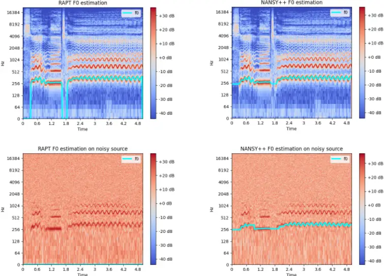

Figure 3: The qualitative results on $`F_{0}`$ estimation. Left column
shows the $`F_{0}`$ estimation results from rapt algorithm. Right column
shows the $`F_{0}`$ estimation results from NANSY++ pitch encoder. First
row shows the $`F_{0}`$ estimation results from clean signal. Second row
shows the $`F_{0}`$ estimation results from noisy signal. The results
clearly demonstrates that the pitch encoder is indeed estimating
$`F_{0}`$, even robustly for noisy signal.

In order to show that the output from the pitch encoder is really
estimating fundamental frequency, we show the results of the estimated
fundamental frequency in Figure 3. We can see that for clean signals,
rapt algorithm and NANSY++ pitch encoder are estimating the same
$`F_{0}`$ trajectory, showing that the pitch encoder trained in a
self-supervised manner is actually estimating $`F_{0}`$. Additionally,
we have also tested the algorithms on a noisy signal to demonstrate the
robustness of the proposed pitch encoder on noise. The second row shows
that NANSY++ pitch encoder can estimate $`F_{0}`$ even in the harsh
environment, whereas rapt algorithm completely fails.

### A.3 Neural Architectures

##### Pitch encoder

For the architectural design of pitch encoder, we used 1D-CNN blocks
operating in frequency-axis combined with bi-directional gated recurrent
unit similar to Choi et al. 2021b. The architecture is illustrated in
Fig. 4. For the last activation function of P/Ap amplitude heads, we
used exponential sigmoid used in Engel et al. 2020a.

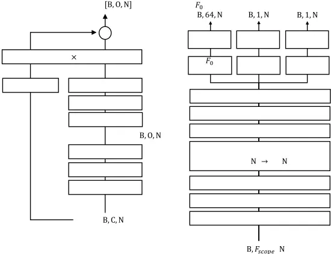

Figure 4: Pitch encoder architecture. k, d, s in Conv1d (k, d, s)
denotes kernel size, dilation, and stride. k, O in ResBlock (k, O)
denotes kernel size and output channel size. C, O in Linear (C, O)
denote input and output channel size.

##### Linguistic information encoder

For the architectural design of linguistic information encoder, we used
Convolutional Gated Linear Unit (ConvGLU) blocks (Dauphin et al. 2017).
The architecture is illustrated in Fig. 5.

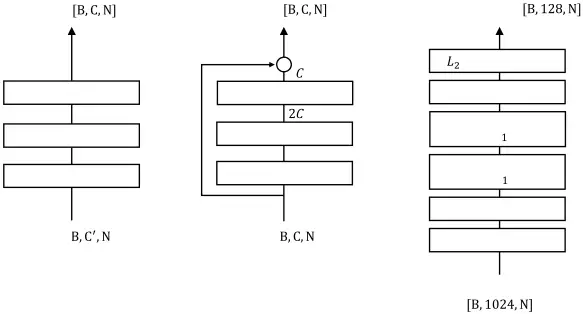

Figure 5: Linguistic information encoder architecture. C’ and C in
PreConv denote input channel and output channel size. k, d, s in Conv1d
(k, d, s) denotes kernel size, dilation, and stride.

##### Time-varying Speaker Embeddings

The architectural details of timbre encoder and time-varying timbre
encoder are shown in Fig. 6. We borrowed the neural architecture for
timbre encoder from ECAPA-TDNN (Desplanques et al. 2020). The timbre
tokens are extracted via cross-attention mechanism, where 50 trainable
latent vectors are used a query, and features from multilayer feature
aggregation (MFA) block of ECAPA-TDNN is transformed into key and value.
We also extract global timbre embedding via attentive statistical
pooling (ASP). Time-varying timbre encoder then utilizes another
cross-attention mechanism by taking content queries, a concatenation of
$`[F_{0},A_{p},A_{ap},\bm{L},\bf{g}]`$, trainable 50 latent keys, and
timbre tokens as values. The output of the cross-attention and global
timbre embedding is then interpolated on a spherical surface to produce
the final time-varying timbre embeddings.

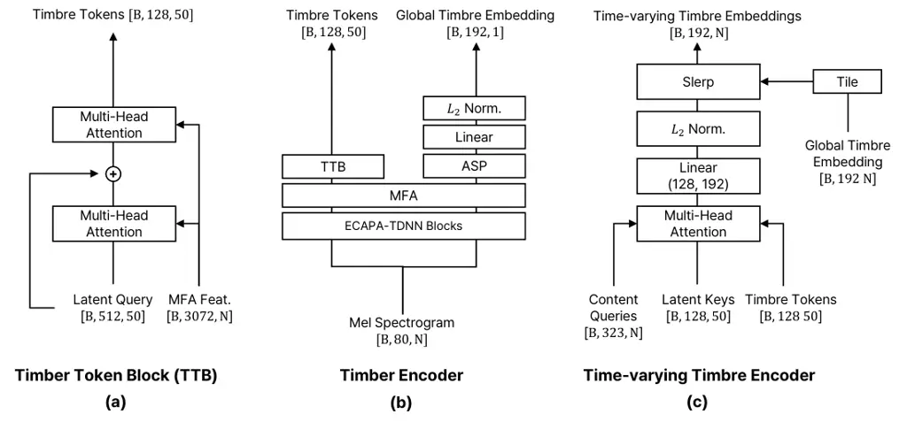

Figure 6: The architecture of timbre encoder and time-varying timbre
encoder. MFA denotes Multilayer Feature Aggregation block of ECAPA-TDNN.
ASP denotes Attentive Statistical Pooling.

##### Synthesizer

The architectural details of frame-level and sample-level synthesizers
are shown in Fig. A.3. The frame-level synthesizer takes the linguistic
feature and time-varying speaker embeddings and outputs frame-level
condition. The frame-level condition is then passed through the
sample-level synthesizer along with $`F_{0}`$, periodic amplitude (P
amp), aperiodic amplitude (Ap amp) to produce a waveform. We borrowed
the neural architecture of parallel wavegan (PWGAN) for the sample-level
synthesizer (Yamamoto et al. 2020).

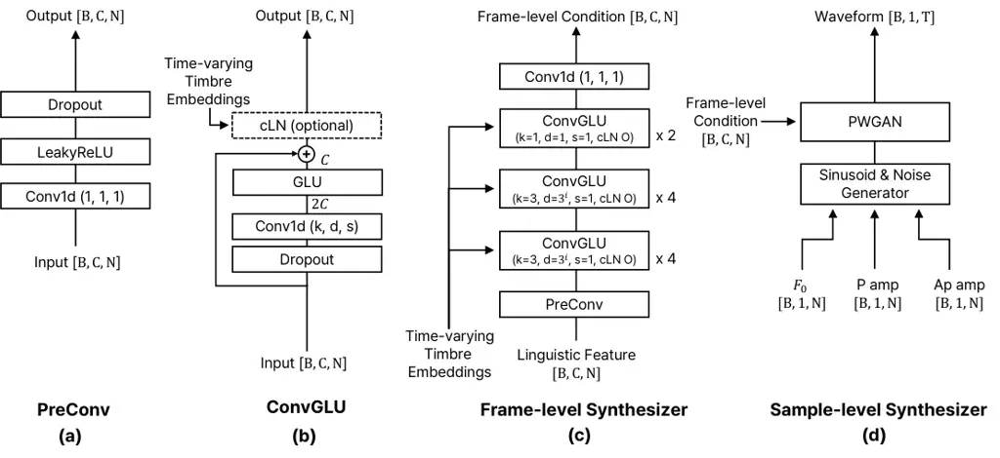

Figure 7: The architecture of frame-level synthesizer and sample-level
synthesizer. cLN denotes conditional Layer Normalization.

## Appendix B Text-to-speech

### B.1 Detailed architecture

##### Encoder

The architectural details of encoders are shown in Fig. 9. Similar to
Min et al. 2021, NANSY-TTS uses the style encoder and conditional layer
normalization (cLN) to train the various prosody. However, we use the
hidden feature extracted from the third layer of wav2vec network (Babu
et al. 2022) instead of mel spectrogram as the style input. The output
vector encoded by the style encoder is used by all cLNs in NANSY-TTS.
The phoneme encoder is composed of a lookup embedding table, 3
ConvReLUNorm blocks, 3 Transformer(Vaswani et al. 2017) blocks, and a
final linear layer with LeakyReLU.

##### Decoder

The architectural details of decoders are shown in Fig. 10. First, the
phoneme feature sequences are upsampled using the duration predicted by
the duration predictor or extracted by the aligner. The upsampled
sequences are then fed to all decoders. The amplitude decoder is
composed of 3 ConvReLUNorm blocks with cLNs and a final linear layer. To
predict $`F_{0}`$ more elaborately, the $`F_{0}`$ decoder also use the
hidden features from the amplitude decoder as an additional input. The
$`F_{0}`$ decoder consists of 2 ConvReLUNorm blocks with cLNs, GRU and a
final linear layer.

##### Aligner

We train an aligner independently of the TTS model. It consists of an
encoder and a decoder. The encoder is composed of 5
ConvReLUNorm(k=3,3,3,1 and 1) blocks as shown in Fig. 9. The decoder is
the same as in Kim et al. 2020 except for three differences. First, it
has only 2 blocks instead of 12 blocks of the original version.
Secondly, it uses the linguistic feature as the output instead of mel
spectrogram. Finally, the aligner including the decoder is only used
during training, and the value calculated by MAS is used as the phoneme
duration.

Figure 8: Overview of NANSY-TTS.

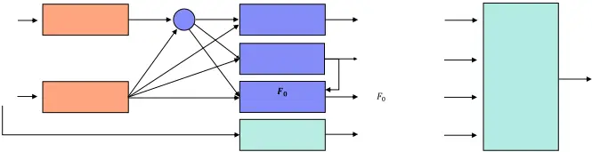

Figure 9: NANSY-TTS encoder architecture. k, d, and s of the Conv1d
layer denotes kernel size, dilation, and stride, respectively.

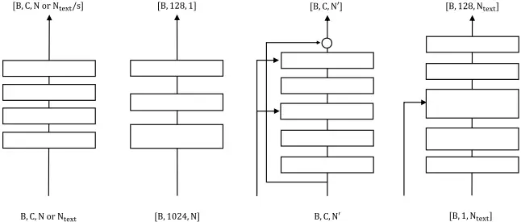

Figure 10: NANSY-TTS decoder architecture.

### B.2 Training details

All models were trained for 200K iterations using Adam optimizer (Kingma
& Ba 2014) with the learning rate of $`10^{-4}`$. In the training stage,
we use randomly sliced ground truth waveform as the style reference
input. This helps to ensure robust performance even when a nonparallel
reference, which has a different content from the input text, is used as
the style input in the inference stage. To train the prosody components
efficiently, we apply the min-max normalization for $`A_{p}`$,
$`A_{ap}`$ and $`F_{0}`$.

### B.3 Detailed evaluation result

##### Training efficiency

Figure 11: Fast training convergence.

To verify the efficiency of training time, we measured character error
rate (CER (%)) at each training step. The experimental setting is the
same as the setting for the full single-speaker dataset in section
4.2.2. As shown in Fig. 11, NANSY-TTS achieved low CER even though it
was trained for only a few thousand steps. In comparison, the baseline
model (Glow-TTS) showed relatively slower training convergence. In
particular, NANSY-TTS trained for only 2k steps outperformed Glow-TTS
trained for 200k steps. In addition, NANSY-TTS trained for 10k steps
achieved lower CER than actual recordings. We speculate that this is
because the NANSY++ analysis features are easier to model compared to
the mel spectrogram, which is an entangled representation of amplitudes,
pitch, linguistic information, and timbre.

##### Zero-shot TTS results for each speaker

As shown in Table 5, NANSY-TTS achieved better MOS than actual
recordings. This means that the raters felt that the speech generated by
NANSY-TTS were more natural than the actual recordings. Actual
recordings often have diverse styles (e.g., speaking speed, pauses,
intonation, etc.), which made the listener feel unnatural. In
particular, it is noticeable in certain speakers of VCTK dataset, as
shown in Table 8. The audio samples are provided in the demo page:
[tinyurl.com/8tnsy3uc](tinyurl.com/8tnsy3uc).

|         |               |             |             |             |              |
| ------- | ------------- | ----------- | ----------- | ----------- | ------------ |
|         | Model         | GT          | YourTTS     | NANSY-TTS   | NANSY-TTS    |
| Speaker | Accent        |             |             | ($`vctk`$)  | ($`entire`$) |
| p225    | English       | 3.93 / 2.67 | 3.27 / 2.56 | 4.29 / 2.93 | 4.40 / 3.04  |
| p234    | Scottish      | 3.89 / 2.47 | 3.91 / 2.64 | 4.31 / 2.73 | 4.31 / 3.27  |
| p238    | NorthernIrish | 4.22 / 3.11 | 3.58 / 2.44 | 4.31 / 2.24 | 4.36 / 2.02  |
| p245    | Irish         | 4.29 / 2.44 | 3.11 / 2.07 | 4.36 / 2.42 | 4.11 / 2.42  |
| p248    | Indian        | 3.60 / 3.13 | 2.93 / 1.78 | 4.33 / 1.80 | 4.36 / 2.29  |
| p261    | NorthernIrish | 4.09 / 2.98 | 2.89 / 1.91 | 4.20 / 2.84 | 4.33 / 3.29  |
| p294    | American      | 4.16 / 3.00 | 3.84 / 2.20 | 4.16 / 3.20 | 3.93 / 2.49  |
| p302    | Canadian      | 3.80 / 2.69 | 2.89 / 3.00 | 4.44 / 2.42 | 4.36 / 2.80  |
| p326    | Australian    | 3.91 / 3.22 | 3.51 / 1.96 | 4.38 / 3.16 | 4.20 / 3.27  |
| p335    | NewZealand    | 3.93 / 3.13 | 3.00 / 1.67 | 4.22 / 2.38 | 4.33 / 2.13  |
| p347    | SouthAfrican  | 3.96 / 3.18 | 3.64 / 2.09 | 4.02 / 1.93 | 4.38 / 2.16  |

Table 8: Zero-shot TTS results for each speaker. MOS(left) and
SSIM(right)

## Appendix C Singing voice synthesis

### C.1 Detailed architecture of NANSY-SVS

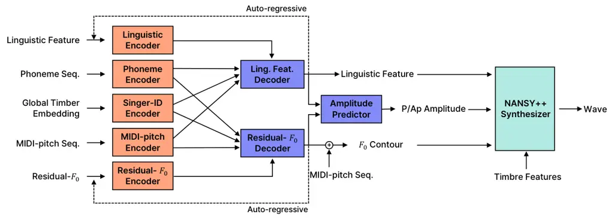

Figure 12: Overview of NANSY-SVS.

NANSY-SVS generates linguistic features and residual-$`F_{0}`$ in an
autoregressive manner using a MIDI-pitch and phoneme sequence obtained
from a musical score. In particular, to speed up an autoregressive
inference, we first generate linguistic and residual-$`F_{0}`$ features
downsampled to 1/4 time-resolution, and then upsample them with the
original time-resolution through an neural upsampler module. The
dimensions of the input and output tensors of the model are shown in the
table 9.

| Name                              | Shape           |
| --------------------------------- | --------------- |
| Input                             |                 |
| midi-pitch sequence               | \[B, 1, T\]     |
| phoneme sequence                  | \[B, 1, T\]     |
| linguisitic feature (downsampled) | \[B, 128, T/4\] |
| residual feature (downsampled)    | \[B, 241, T/4\] |
| singer embedding                  | \[B, 192, 1\]   |
| Output                            |                 |
| linguistic feature (downsampled)  | \[B, 128, T/4\] |
| linguistic feature                | \[B, 128, T\]   |
| residual-$`F_{0}`$ (downsampled)  | \[B, 241, T/4\] |
| residual-$`F_{0}`$                | \[B, 241, T\]   |
| P amplitude                       | \[B, 1, T\]     |
| Ap amplitude                      | \[B, 1, T\]     |

Table 9: The dimensions of the input and output tensors of NANSY-SVS.
$`B`$ and $`T`$ denotes batch size and frame length, respectively.

As shown in Fig. 12, the NANSY-SVS model consists of five encoders, two
decoder blocks, and an amplitude predictor. This section describes the
detailed structure of each module in the order of encoder, decoder, and
amplitude predictor.

##### Encoder

Each encoder of NANSY-SVS is composed of a combination of PreConv and
ConvGLU modules. PreConv consists of LeakyReLU activation and Dropout
followed by a 1x1 1d convolutional layer. Unless otherwise stated, the
dropout rate was fixed at 0.05. The ConvGLU module consists of Dropout,
padding, 1d convolutional layer, and Gated Linear Unit. For the
implementation of casual and non-causal characteristics, we used two
different padding methods. For the causal module, padding was added to
the front of the input sequence, and for the non-causal module, the
total padding length was divided in half and added to both sides. In
order to optionally condition the singer ID embedding, a conditional
layer normalization layer Chen et al. 2020b is added at the end of the
module. Since the linguistic feature and residual-$`F_{0}`$ are
generated in an autoregressive manner, they have to be causally encoded
in the encoding step. Therefore, as shown in Figure 13-(c), Linguistic
feature encoder and residual-$`F_{0}`$ encoder are designed to go
through a total of 10 causal ConvGLU blocks after two preconv and a
point-wise convolutional layer. To widen the receptive field, we
increase the dilation of the ConvGLU block to a power of 3. Similarly,
the encoder that processes the phoneme sequence and MIDI-pitch sequence
is designed as shown in Figure 13-(d). Since phoneme and MIDI-pitch is
categorical information, the embedding lookup table is added at the
beginning of the module. In addition, a 1d convolutional layer with
stride of 2 was added between ConvGLU modules to match the
time-resolution of encoded feature with the downsampled target feature.
We used the NANSY++ backbone timbre embedding as the singer ID embedding
for NANSY-SVS. We assume that this embedding already contains enough
information about the speaker, so the singer-ID encoder is designed as a
simple fully-connected layer with ReLU activation.

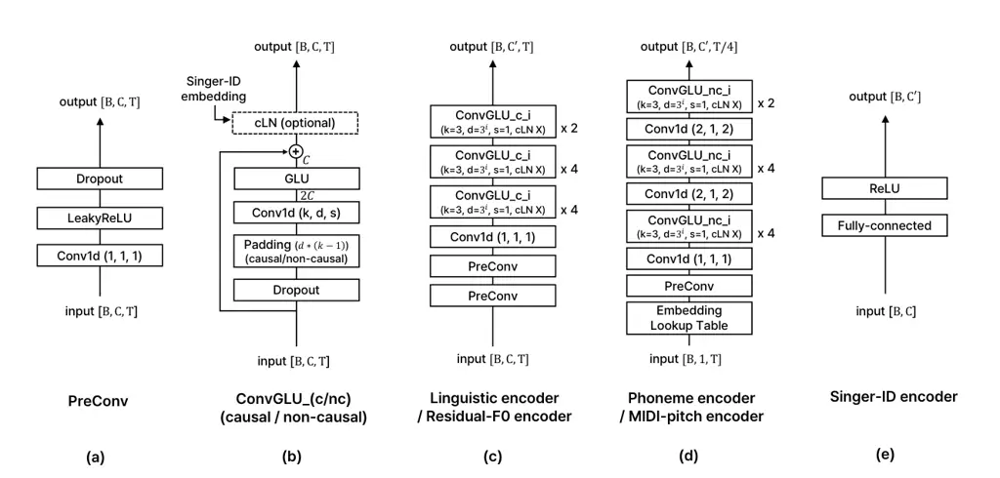

Figure 13: NANSY-SVS encoder architecture. $`k`$, $`d`$, and $`s`$ of
the Conv1d layer denotes kernel size, dilation, and stride,
respectively.

##### Decoder

Each decoder block of NANSY-SVS consists of casual and non-causal
decoders and upsamplers as shown in Figure 14-(d). Both the casual and
non-causal decoders (Figure 14-(a, b)) consist of 10 ConvGLU blocks and
the last convolutional layer after PreConv module, and only the
causality of ConvGLU is different. Singer-ID embedding is input as a
condition to all ConvGLU blocks, and is reflected through the
conditional layer norm layer. The upsampler (Figure 14-(c)) consists of
the nearest upsample layers following the ConvGLU block to upsample the
time-resolution of the input by 4 times. In the linguistic feature
decoder block, the output of {Ling., MIDI-pitch, phoneme} encoder and
singer-ID embedding are input to the causal decoder, and the output of
the phoneme encoder and singer-ID embedding are input to the non-causal
decoder. Similarly, in the residual-$`F_{0}`$ decoder block, the output
of the {Residual-$`F_{0}`$, phoneme, MIDI-pitch} encoder and singer
embedding are input to the causal decoder, and the output of the
MIDI-pitch encoder and singer embedding are input to the non-causal
decoder. Finally, the model is trained so that the sum of the causal
decoder and the non-causal decoder equals to the downsampled target
feature, and the sum of the outputs of the two upsamplers equals to the
original time-resolution target feature.

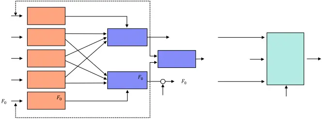

Figure 14: NANSY-SVS decoder architecture

##### Amplitude Predictor

The amplitude predictor has the same structure as Figure 8-(b)
Non-causal decoder, except that singer embedding is not used as an
conditional input. The predicted linguistic feature and
residual-$`F_{0}`$ are concatenated and used as input, and P amplitude
and Ap amplitude, one of the analysis features of the NANSY++ backbone,
are predicted. For training stability, the amplitude predictor was
trained independently using a stop gradient layer instead of training
with the entire network.

### C.2 Evaluation on pitch estimation and VUV decision

For quantitative evaluation, we measured the $`F_{0}`$ RMSE and
voiced/unvoiced decision error rate between the ground truth and the
generated singing voice. To extract $`F_{0}`$ from singing voice, we
used rapt (Talkin & Kleijn 1995) pitch tracking algorithm. The
evaluation results are shown in Table 10. When all the training data
were used, both models achieved similar performance. However, as the
volume of training size was set to be smaller, $`F_{0}`$ RMSE and VUV
error rate of Diffsinger got degenerated significantly while those of
NANSY-SVS did not. This demonstrates that NANSY-SVS faithfully reflects
the input musical score condition even when trained with the small
amount of data.

| MODEL                | $`F_{0}`$ RMSE (cent) | VUV error rate (%) |
| -------------------- | --------------------- | ------------------ |
| BL / Ours ($`80`$)   | 233.69 / 91.18        | 12.93 / 5.67       |
| BL / Ours ($`160`$)  | 200.41 / 101.46       | 9.05 / 4.95        |
| BL / Ours ($`320`$)  | 125.97 / 94.96        | 7.39 / 5.35        |
| BL / Ours ($`full`$) | 97.96 / 96.90         | 4.79 / 4.89        |

Table 10: $`F_{0}`$ and VUV difference between ground-truth and
generated singing voice.

## Appendix D Voice designing

### D.1 Detailed architecture of NANSY-VOD

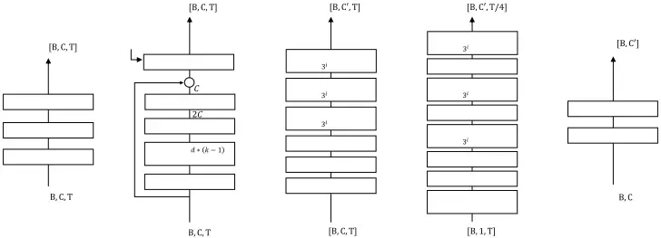

Figure 15: Flow architecture of NANSY-VOD.

Fig. 15 presents the detailed structures of the flow networks used in
NANSY-VOD. Each flow layer conducts three processing steps; (i)
normalization of input with learnable parameters (ActNorm), (ii)
shuffling input across channel dimension (ShuffleLayer), and (iii)
applying an invertible bijective function (AffineCouplingLayer). ActNorm
normalizes data by using the process $`y=\frac{(x-\beta)}{\gamma}`$
where $`\beta`$ and $`\gamma`$ are learnable parameters of the same
dimension as the input dimension. $`\beta`$ and $`\gamma`$ are
initialized such that $`y`$ has zero mean and unit variance given an
initial training batch. ShuffleLayer swaps the first half of the
channels with the other half. AffineCouplingLayer transforms the half of
the input channels while keeping the other part as follows:

```math
\displaystyle(\alpha,\omega) \displaystyle=\text{CondMLP}(x_{b}) \tag{2}
```

```math
\displaystyle y_{a} \displaystyle=\alpha\odot x_{a}+\omega \tag{3}
```

```math
\displaystyle y_{b} \displaystyle=x_{b} \tag{4}
```

where $`x_{a}`$ and $`x_{b}`$ denotes the first and second part of the
input respectively.

NANSY-VOD consists of three flow networks; $`F_{0}`$ flow, timber
embedding flow, and timbre tokens flow. $`F_{0}`$ flow employs 8 flow
layers and uses age and gender as conditional variables. Similarly, time
embedding flow is constructed of 12 flow layers conditioned by age,
gender, and $`F_{0}`$ statistics. Timbre tokens flow consists of 16
flows layers with age, gender, $`F_{0}`$ statistics, global timbre
embedding and token index as conditional terms. Timbre tokens are
reshaped to form multiple individual data points, passed to 16 layers of
timbre tokens flow, and processed independently. To distinguish timbre
tokens, the corresponding token index is used as an additional
conditional input.

### D.2 Age control

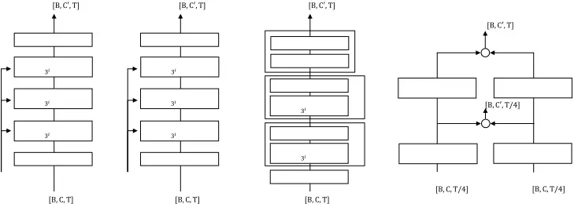

Figure 16: Estimated age and gender distribution on test set samples.
The gender distribution appears to have bi-modal distribution for the
people who are older than 10 years old, while children who are younger
than 10 years old appears to have uni-modal distribution around 0.

We note that gender labels estimated by SPNet show a different trend
depending on age. We annotated continuous gender labels of the 320
utterances using SPNet and report the result in Fig. 16. The gender
labels of children under age of 10 are clustered around \[-5, 5\] while
the other gender labels are scattered on both sides. From this, instead
of adjusting an age value only, we devise an age control algorithm for
NANSY-VOD taking into account the dependency between age and continuous
gender. When the age value is adjusted from under 10 to over 10 years
(i.e., from a child voice to a mature voice), the gender value is
multiplied by 8. When the age value is edited from over 10 to under 10
years (i.e., from a mature voice to a child voice), the gender value is
divided by 8. In other cases, we simply control the age value only. In
our preliminary experiments, we empirically verified that this algorithm
significantly improves the age editing performance of NANSY-VOD.

### D.3 Inference overview

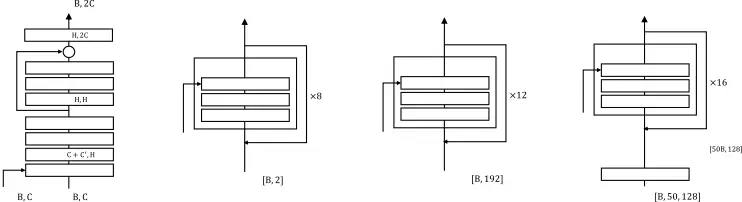

Figure 17: Overview of inference procedure of NANSY-VOD.

Fig. 17 demonstrates the inference procedure of NANSY-VOD. To edit the
voice attributes of source audio, NANSY-VOD transforms F0 statistics,
global timbre embedding, and timbre tokens into latent variables, and
converts them back to analysis features. Note that NANSY-VOD uses a
source speaker’s age and gender for the forward process, and the target
age and gender for the inverse process. To generate a new voice
identity, latent variables are sampled from the normal distribution and
transformed into analysis features according to the target age and
gender.

### D.4 SPNet

SPNet is a neural network for estimating speech parameters such as age
and gender given speech. SPNet employs the same architecture as
ECAPA-TDNN (Desplanques et al. 2020) and stacks a projection layer on
top of it. The last layer projects 192 dimension to 2 dimension, and
each output is used to estimate age and gender. Mean absolute error and
soft margin loss are employed as an objective function for age and
gender estimation, respectively. AI-Hub conversation datasets were used
for both training and evaluation. We initialized SPNet with the
pretrained ECAPA-TDNN weights and trained it using the AdamW
optimizer (Loshchilov & Hutter 2017) of learning rate
$`2\times 10^{-4}`$ for about 33K iterations. Each audio data was
randomly cropped to one second and used to construct a mini batch of
size 256. At test time, we sampled 320 utterances from various age and
gender groups, and estimated speakers’ age and gender using SPNet. The
average absolute error of age estimation was 4.095 and the average
accuracy of gender estimation was 93.75%. Since voices of pre-pubescent
children may not be gender distinct, we also evaluated gender estimates
for people over the age of 10. In this case, the average accuracy
recorded 99.17%.
