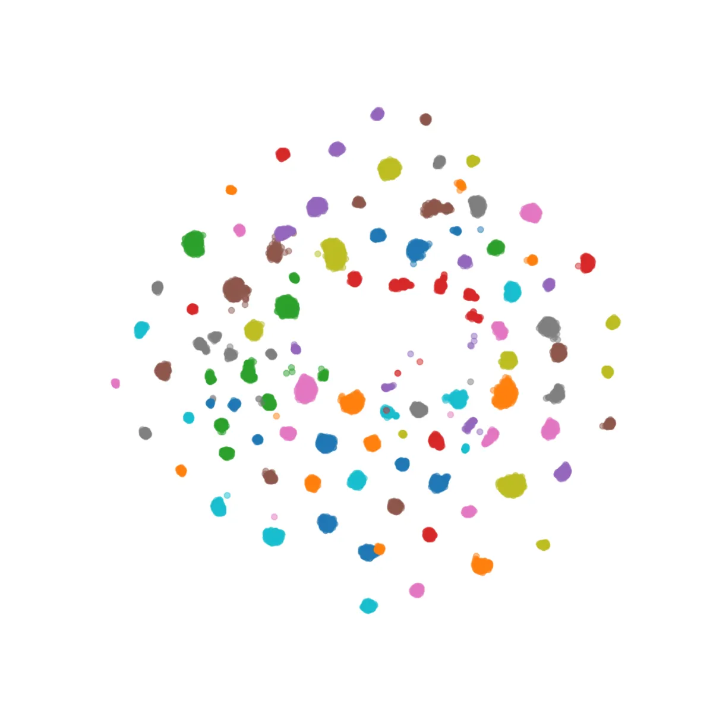
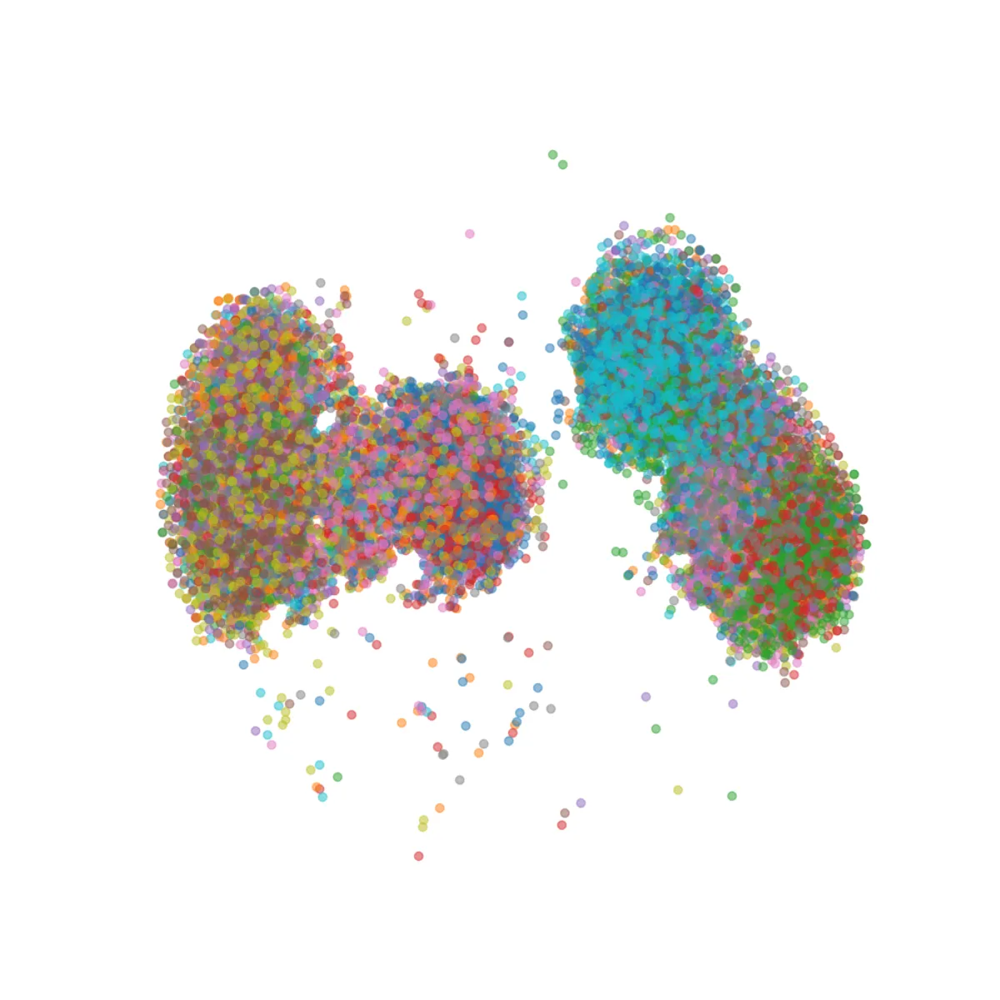

# PromptTTS++: Controlling Speaker Identity in Prompt-Based Text-to-Speech Using Natural Language Descriptions

###### Abstract

We propose PromptTTS++, a prompt-based text-to-speech (TTS) synthesis
system that allows control over speaker identity using natural language
descriptions. To control speaker identity within the prompt-based TTS
framework, we introduce the concept of speaker prompt, which describes
voice characteristics (e.g., gender-neutral, young, old, and muffled)
designed to be approximately independent of speaking style. Since there
is no large-scale dataset containing speaker prompts, we first construct
a dataset based on the LibriTTS-R corpus with manually annotated speaker
prompts. We then employ a diffusion-based acoustic model with mixture
density networks to model diverse speaker factors in the training data.
Unlike previous studies that rely on style prompts describing only a
limited aspect of speaker individuality, such as pitch, speaking speed,
and energy, our method utilizes an additional speaker prompt to
effectively learn the mapping from natural language descriptions to the
acoustic features of diverse speakers. Our subjective evaluation results
show that the proposed method can better control speaker characteristics
than the methods without the speaker prompt. Audio samples are available
at
[https://reppy4620.github.io/demo.promptttspp/](https://reppy4620.github.io/demo.promptttspp/).

###### Index Terms: 

Text-to-speech, speech synthesis, speaker generation, mixture model,
diffusion model

^(†)^(†)address: ¹Tohoku University, Japan, ²LINE Corp., Japan.

## 1 Introduction

|                |                                                                                             |
| -------------- | ------------------------------------------------------------------------------------------- |
| Prompt         | Example                                                                                     |
| Style prompt   | A woman speaks slowly with low volume and low pitch.                                        |
| Speaker prompt | The speaker identity is described as soft, adult-like, gender-neutral and slightly muffled. |

Table 1: Examples of prompts. The style prompt is defined for each
utterance, whereas the speaker prompt is defined for each speaker.

Deep-learning-based text-to-speech (TTS) technology has seen significant
advancements, becoming a fundamental technology for numerous voice
interaction applications. Since the quality of synthetic speech has
become nearly close to human voices \[1, 2\], recent TTS research
focuses on more challenging speech generation tasks, including
controllable TTS \[3\].

Recently, prompt-based controllable TTS systems, which use a natural
language description (referred to as a prompt) to control voice
characteristics such as speaking style, have attracted considerable
interest \[4, 5, 6\]. These systems offer an intuitive user interface
and leverage the powerful language understanding capabilities of large
language models (LLMs) \[7, 8, 9\] to enhance the flexibility of
controllable TTS.

Despite the promising capability of prompt-based TTS systems, previous
works have lacked controllability over speaker identity. For instance,
PromptTTS \[4\] uses a prompt describing speaking styles (referred to as
style prompt) such as gender, pitch, speaking speed, energy, and
emotion. Given that the style prompt predominantly correlates with the
prosody of utterances and only describes a limited aspect of speaker
individuality, it becomes challenging to finely control the speaker
identity to synthesize the desired speech. Some other methods, such as
InstructTTS \[5\] and PromptStyle \[6\], also use the style prompt to
control speaking styles. In those systems, speaker ID is used as the
basis of multi-speaker prompt-based TTS. Therefore, they cannot generate
new speakers other than the ones used in the training data, which
greatly limits the controllability.

To address these issues, we propose PromptTTS++, a prompt-based TTS
system that enables more control over speaker identity by text-based
prompt. Our method is inspired by PromptTTS \[4\], but we have made two
key changes. (1) We introduce the concept of speaker prompt, which is
designed to be approximately independent of the style prompt and
describes speaker identity with natural language descriptions. Table 1
illustrates the difference between style and speaker prompts. (2) We
employ mixture density networks (MDNs) \[10\] based on Gaussian mixture
models (GMMs) for modeling style/speaker embedding extracted from a
global style token (GST)-based reference encoder \[11, 12\], allowing to
learn rich and diverse speaker representations conditioned on the text
prompt information. Additionally, we use a diffusion-based acoustic
model for enhancing the quality of synthesized speech.

Since there is no appropriate database for our task, we first construct
a dataset with annotated speaker prompts for the speakers in the
LibriTTS-R corpus \[13\]. Then, we apply our proposed method to the
dataset. Our subjective evaluation results on prompt-to-speech
consistency confirm that the proposed method can generate speech closer
to the specified speaker characteristics than the methods without the
speaker prompt. Furthermore, by visualizing the learned embedding space,
we show that using only the style prompt is insufficient for controlling
speaker identity, and using the speaker prompt alleviates this
insufficiency. We plan to publish our annotated prompts for future
research.

## 2 Method

Figure 1: Overview of PromptTTS++. During training, the style embedding
is extracted from the reference speech, while it is predicted from the
input speaker/style prompt during inference. The style embedding is used
as the conditional information of the acoustic model (in blue) to
generate mel-spectrogram. The output waveform is generated by a vocoder.

Figure 1 provides an overview of our proposed model, which consists of a
reference encoder, prompt encoder, and acoustic model. Our method
generates output speech from a given input text (referred to as a
content prompt) and speaker/style prompt. Details are described in the
following sections.

### 2.1 Reference encoder

To uncover latent acoustic variations related to speakers, we employ a
GST-based reference encoder and extract style embeddings¹¹ 1 Following
GST \[11\], we use the term style embedding for the rest of this paper.
However, note that the learned embeddings will reveal not only the style
factors but also speaker factors. from speech signals \[11\]. The
GST-based reference encoder takes log-scale mel-spectrogram as input and
outputs a fixed-dimensional style embedding. This style embedding is a
weighted combination of the learned style tokens, which will be used as
the conditional features of the acoustic model.

### 2.2 Prompt encoder

The prompt encoder is a key module in the prompt-based TTS systems and
is responsible for predicting the style embedding from the input
speaker/style prompts. Our prompt encoder is mainly composed of a
pre-trained language model and MDN.

Previous works, such as PromptTTS \[4\] and PromptStyle \[6\], adopt
BERT \[14\] as a pre-trained language model to extract prompt
embeddings. Following these works, we also adopt BERT as a fundamental
building block of the prompt encoder. We concatenate the speaker and
style prompts into a single one. Subsequently, the prompt embedding is
obtained using BERT, followed by three linear layers.

During training, PromptStyle \[6\] utilizes a cosine similarity loss to
minimize the difference between embeddings predicted from the reference
encoder and prompt encoder. However, using the cosine similarity loss
significantly limits the capability of TTS to generate diverse speakers.
To resolve this problem, we employ GMM-based MDN \[15\] to model the
conditional distribution of embeddings given the prompt information.
Specifically, an MDN layer is added on top of BERT combined with linear
layers, where the output consists of the parameters of GMMs. Using MDN
allows the model to learn diverse characteristics of speakers as a
probabilistic distribution and enables novel speaker generation by
sampling from the distribution \[12\].

### 2.3 Acoustic model

As depicted in the left side of Fig. 1, our acoustic model generates a
mel-spectrogram from the content prompt and style embedding. The model
comprises a content encoder, variance adaptor, and diffusion decoder. We
use a Conformer \[16\] as the content encoder.

The structure of the variance adaptor mirrors that of FastSpeech
2 \[17\], except that the energy predictor is not used for simplicity.
The variance adaptor contains a duration predictor and pitch predictor.
The pitch predictor predicts logarithmic fundamental frequency
(log-$`F_{0}`$) and voiced/unvoiced flags (V/UV). For the diffusion
decoder, we adopt the same model as DiffSinger \[18\], a mel-spectrogram
generation model based on a denoising diffusion probabilistic
model \[19\]. During training, the diffusion decoder learns to denoise a
given noisy mel-spectrogram, whereas the decoder generates a clean
mel-spectrogram from noise at inference time. Further details can be
found in previous studies \[19, 18\]. Although the improvement of
naturalness is not the focus of this paper, our preliminary experiments
confirmed a relatively low level of synthetic naturalness with the
Transformer-based decoder used in PromptTTS \[4\]. As a result, we
replaced the decoder with the diffusion model. Similarly, we add an MDN
layer to the duration predictor for improving naturalness \[20\].

### 2.4 Training

To train our model, we minimize the following loss function:

```math
\displaystyle L=L_{\mathrm{dec}}+L_{\mathrm{dur}}+L_{\mathrm{pitch}}+L_{\mathrm{style}} \tag{1}
```

where $`L_{\mathrm{dec}}`$, $`L_{\mathrm{dur}}`$,
$`L_{\mathrm{pitch}}`$, and $`L_{\mathrm{style}}`$ represent the loss
functions for the diffusion decoder, duration predictor, pitch
predictor, and prompt encoder, respectively. We use log-likelihood
losses for $`L_{\mathrm{dur}}`$ and $`L_{\mathrm{style}}`$. For
$`L_{\mathrm{dec}}`$, and $`L_{\mathrm{pitch}}`$, we use a weighted
variational lower bound \[19\] and L1 loss, respectively. Note that
$`L_{\mathrm{pitch}}`$ includes two L1 losses for log-$`F_{0}`$ and
V/UV. We use stop-gradient operation on the output of the reference
encoder when optimizing $`L_{\mathrm{style}}`$ to emulate the separate
training of the the prompt encoder and the rest of the models \[12\].

## 3 Dataset

Given that there is no large-scale dataset containing speaker prompts,
we create a database by manually annotating speaker prompts. As the base
database, we use LibriTTS-R \[13\], a high-quality multi-speaker corpus
that is produced by applying a text-informed speech restoration
method \[21\] to the LibriTTS corpus \[22\]. This corpus includes 585
hours of speech data from 2,456 English speakers. For this study, we
randomly select 404 speakers and have their speaker prompts annotated by
speech experts.

The speaker prompt is annotated for each speaker individually. We
randomly select five audio samples from each speaker and ask experts to
annotate the speaker prompts describing the speaker’s characteristics.
To simplify the labeling process, we present a set of pre-defined words
associated with speaker identity \[23, 24\] and allow the annotators to
create speaker prompts based on these words. The pre-defined words
include terms such as young, old, gender-neutral, deep, weak, muffled,
raspy, clear, cool, wild, and sweet, among others.

Similar to PromptTTS \[4\], we also use the style prompt describing
pitch, speaking speed, and energy. We automatically generate pseudo
style prompts by analyzing the statistics of $`F_{0}`$, speaking speed,
and loudness for each gender. Specifically, we add labels of pitch,
speed, and loudness with three levels (e.g., low-normal-high) for each
utterance and convert it to our pre-defined style prompts (e.g., a woman
speaks with low pitch, normal speed, and high volume). To increase the
variations of style prompts, we generate semantically identical but
different prompts²² 2 We found that only 154 unique prompts were used
for the PromptSpeech dataset of real speech samples \[4\]. Therefore, we
decided not to use them directly and instead manually make new style
prompts ourselves. using LLama2 \[9\]. In total, we create 1,349 unique
style prompts.

## 4 Experimental evaluations

|        |                                          |        |         |     |                           |                              |                           |     |
| ------ | ---------------------------------------- | ------ | ------- | --- | ------------------------- | ---------------------------- | ------------------------- | --- |
| Model  |                                          |        |         |     | Naturalness               | Prompt-to-speech consistency |                           |     |
| System | Name                                     | Style  | Speaker | MDN | Dataset                   |                              |                           |     |
|        |                                          | prompt | prompt  |     | Test                      | Train                        | Test                      |     |
| B1     | Baseline                                 | ✓      |         |     | $`1.54\pm 0.07`$          | $`2.52\pm 0.10`$             | $`2.36\pm 0.10`$          |     |
| P1     | Proposed (PromptTTS++)                   | ✓      | ✓       | ✓   | $`3.88\pm 0.08`$          | $`\mathbf{3.52\pm 0.06}`$    | $`\mathbf{3.37\pm 0.07}`$ |     |
| P2     | Proposed w/o speaker prompt              | ✓      |         | ✓   | $`3.82\pm 0.09`$          | $`3.36\pm 0.07`$             | $`3.21\pm 0.07`$          |     |
| P3     | Proposed w/o MDN                         | ✓      | ✓       |     | $`3.91\pm 0.09`$          | $`3.51\pm 0.06`$             | $`3.27\pm 0.07`$          |     |
| P4     | Proposed w/o both MDN and speaker prompt | ✓      |         |     | $`\mathbf{3.99\pm 0.08}`$ | $`3.42\pm 0.07`$             | $`3.25\pm 0.07`$          |     |
| R1     | Proposed w/ reference speech             |        |         |     | $`3.84\pm 0.09`$          | $`3.58\pm 0.06`$             | $`3.32\pm 0.07`$          |     |
| R2     | BigVGAN-base (analysis-synthesis)        |        |         |     | $`4.71\pm 0.05`$          | -                            | -                         |     |
| R3     | Ground truth                             | -      | -       | -   | $`4.80\pm 0.04`$          | $`3.57\pm 0.06`$             | $`3.50\pm 0.07`$          |     |

Table 2: Naturalness and prompt-to-speech consistency MOS test results.
Naturalness tests were performed for the test set, while the consistency
tests were performed for both the training and test sets. Averaged
scores among 10 speakers were reported. Bold font denotes the best score
among all prompt-based TTS systems.

### 4.1 Data

We used the LibriTTS-R dataset with text prompt information, as
described in Section 3. All audio samples were sampled at 24 kHz. We
separated 10 speakers for evaluation, specifically with the speaker IDs:
121, 237, 260, 908, 1089, 1188, 1284, 1580, 1995 and 2300. Those test
speakers had speaker prompt annotations. The rest of the dataset was
split into training and validation sets, with the split based on 2% of
the speakers for validation. Although the speaker prompts were only
available for 404 speakers, we used all the speakers’ data for
training³³ 3 Our preliminary experiments found that using the partially
annotated full dataset was more beneficial than using only the annotated
data.. For speakers without available speaker prompts, we solely used
the style prompt as the input for the prompt encoder. Note that the
style prompt for each utterance was sampled from our handcrafted style
prompts based on gender and the three-level labels of pitch, speed, and
energy for each training iteration. For training our duration model, we
extracted phone durations by the Montreal forced aligner (MFA) \[25\].
We extracted 80-dimensional log-scale mel-spectrograms with a 10 msec
frame shift and 40 msec window size as acoustic features. We used
WORLD \[26\] to compute continuous log-$`F_{0}`$ and V/UV \[27\].

### 4.2 Models

For our GST-based reference encoder \[11\], we used six convolutional
layers with output channels set to 128, 128, 256, 256, 512, and 512,
respectively. The number of hidden units in a gated recurrent unit was
set to 256. We set the number of style tokens, their dimensionality, and
the number of attention heads to 10, 256, and 4, respectively. The
output style embedding was normalized to have a unit norm.

As the prompt encoder, we used a pre-trained BERT ⁴⁴ 4
[https://huggingface.co/bert-base-uncased](https://huggingface.co/bert-base-uncased).
To obtain a prompt embedding, the final hidden state corresponding to
the special classification token \[14\] from BERT was passed to three
linear layers interleaved by ReLU activation \[28\]. An MDN layer was
used for modeling the style embedding, where the number of mixtures was
set to 10. During training, we fixed the parameters of BERT except for
the last attention layer \[6\].

The diffusion decoder was based on non-causal WaveNet \[18\]. The model
contained 20 layers of one-dimensional residual convolution layers with
skip connections. The channel size was set to 256. The number of
diffusion steps was set to 100. The details of the duration predictor
and pitch predictor were the same as those in FastSpeech 2 \[17\],
except that we added an MDN layer to the duration predictor. The number
of mixtures was set to four.

We trained the proposed model for 100 epochs (680 K steps). We used
AdamW optimizer \[29\] with a batch size of 30 K frames, and adopted a
warmup learning rate scheduler \[30\] with an initial learning rate of
0.001. The number of warmup steps was 4000. As the vocoder, we used
BigVGAN-base \[31\], which was trained using the same data as the
acoustic model. To stabilize the pitch generation, we incorporated the
source excitation module from the neural source filter model \[32\]. We
trained the vocoder for 2.5 M steps using the AdamW optimizer with a
batch size of 32.

To evaluate the effectiveness of the proposed method, we investigated
the models without the speaker prompt and the MDN layer in the prompt
encoder. For the models without MDN, we used a cosine similarity loss
for $`L_{\mathrm{style}}`$ in the same manner as PromptStyle \[6\]. We
used the same model architecture for a fair comparison except for the
MDN module. Furthermore, we trained a baseline model that resembles
PromptTTS \[4\], where the non-autoregressive Transformer-based
decoder \[30\] was used instead of the diffusion decoder. We trained the
baseline model for the same number of iterations as the other models.

### 4.3 Evaluation

We conducted two subjective listening tests: 5-point naturalness mean
opinion score (MOS) and 4-point prompt-to-speech consistency MOS tests.
For the former, raters are asked to make quality judgments about the
speech samples using the following five possible responses: 1 = Bad; 2 =
Poor; 3 = Fair; 4 = Good; and 5 = Excellent. For the latter, given a
pair of a speech sample and corresponding speaker prompt, raters are
asked to judge the prompt-to-speech consistency with the following
choices: 1 = Inconsistent; 2 = Somewhat inconsistent; 3 = Somewhat
consistent; and 4 = Consistent. Note that we did not evaluate the
consistency of the style prompt, as the primary focus of our study is on
the controllability of speaker individuality.

We asked native Japanese raters for evaluations. The number of subjects
for each MOS test was 16 and 14. For all the tests, we selected three
random utterances for each speaker. Each utterance had a duration of 3
to 8 seconds. In total, we evaluated 30 utterances for each method. We
assessed samples from both the training and test speakers for the
prompt-to-speech consistency MOS test, aiming to evaluate the system’s
ability to generalize to unseen speakers. We also evaluated the
analysis-synthesis samples for the naturalness MOS test, which were
generated by the vocoder using the ground truth mel-spectrogram.
Additionally, we evaluated the speech samples generated with the
reference encoder, where the style embedding was computed from the
reference speech instead of the speaker/style prompt.

### 4.4 Results

Table 2 shows the subjective evaluation results. In terms of
naturalness, all the proposed methods significantly outperformed the
baseline system (B1). Among the proposed prompt-based TTS systems, the
models without MDN worked better than the others (P1 vs. P3 and
P2 vs. P4). This result can be attributed to the fact that human raters
preferred the averaged voice characteristics generated by the non-MDN
models, likely due to the inability to capture various speaker
characteristics without using MDN. Note that the non-MDN models do not
have the sampling capability.

As for prompt-to-speech consistency, the proposed method (P1) achieved
the best performance among all the prompt-based TTS systems for both the
training and test speakers. Specifically, the proposed method
significantly outperformed the models without the speaker prompt
(P1 vs. P2 and P1 vs. P4) in a student’s $`t`$-test with a 5 %
significance level, demonstrating the effectiveness of the proposed
method in terms of controllability and generalization capability.
Another observation is that there was no statistical significance
between the proposed model and the model without MDN (P1 vs. P3). This
result suggests that while MDN enables the sampling capability, it does
not necessarily enhance controllability. Lastly, a comparison between
the proposed method and the one that uses reference speech input (R1)
reveals that the performance of the prompt-based system is on par with
the method based on reference speech.



(a) Proposed PromptTTS++



(b) Proposed w/o speaker prompt

Figure 2: t-SNE plots of the style embeddings for 100 speakers,
extracted by the prompt encoders. Each speaker is represented by a
different color. Best viewed in color.

To further analyze our proposed methods, we compared the t-SNE plots of
the style embeddings derived from the training data⁵⁵ 5 We omitted the
t-SNE plots for our non-MDN models due to their inability to learn
complex distributions, making the results difficult to interpret. .
Fig2-(a) illustrates that our method generates distinctly clustered
embeddings for each different speaker, whereas the method without the
speaker prompt, as shown in Fig 2-(b), generates embeddings with
approximately two clusters corresponding to gender, making different
speakers non-distinguishable. These observations suggest that (1)
without the speaker prompt, it becomes challenging to control speaker
individuality beyond gender distinctions; (2) by incorporating the
additional speaker prompt, it becomes possible to map the input prompt
to the desired speaker characteristics.

## 5 Conclusion

In this paper, we proposed PromptTTS++, a prompt-based TTS system that
allows control over speaker identity. We introduced the speaker prompt
to control speaker identity and constructed a dataset based on the
LibriTTS-R dataset with manual annotations. Our experimental results
demonstrated that our method enabled speaker identity control using the
additional speaker prompt. Future work includes conducting larger-scale
annotations of speaker prompts for all LibriTTS-R speakers and
disentangling speaker and style factors from the learned embedding for
more refined control. Furthermore, investigating the prompt-based TTS
for novel speaker generation tasks is an interesting research direction.

## 6 References

## References

- \[1\] Jonathan Shen et al. “Natural TTS Synthesis by Conditioning
  WaveNet on Mel Spectrogram Predictions” In _Proc. ICASSP_, 2018, pp.
  4779–4783
- \[2\] Xu Tan et al. “Naturalspeech: End-to-end text to speech
  synthesis with human-level quality” In _arXiv preprint
  arXiv:2205.04421_, 2022
- \[3\] Xu Tan et al. “A survey on neural speech synthesis” In _arXiv
  preprint arXiv:2106.15561_, 2021
- \[4\] Zhifang Guo et al. “PromptTTS: Controllable text-to-speech with
  text descriptions” In _Proc. ICASSP_, 2023, pp. 1–5
- \[5\] Dongchao Yang et al. “InstructTTS: Modelling expressive tts in
  discrete latent space with natural language style prompt” In _arXiv
  preprint arXiv:2301.13662_, 2023
- \[6\] Guanghou Liu et al. “PromptStyle: Controllable Style Transfer
  for Text-to-Speech with Natural Language Descriptions” In _arXiv
  preprint arXiv:2305.19522_, 2023
- \[7\] Tom Brown et al. “Language models are few-shot learners” In
  _Proc. NeurIPS_, 2020, pp. 1877–1901
- \[8\] Long Ouyang et al. “Training language models to follow
  instructions with human feedback” In _Proc. NeurIPS_ 35, 2022, pp.
  27730–27744
- \[9\] Hugo Touvron et al. “Llama 2: Open foundation and fine-tuned
  chat models” In _arXiv preprint arXiv:2307.09288_, 2023
- \[10\] Christopher Bishop “Mixture density networks” In _Aston
  University, Birmingham UK_, 1994
- \[11\] Yuxuan Wang et al. “Style tokens: unsupervised style modeling,
  control and transfer in end-to-end speech synthesis” In _Proc. ICML_,
  2018, pp. 5180–5189
- \[12\] Daisy Stanton et al. “Speaker generation” In _Proc. ICASSP_,
  2022, pp. 7897–7901
- \[13\] Yuma Koizumi et al. “LibriTTS-R: A restored multi-speaker
  text-to-speech corpus” In _Proc. Interspeech_, 2023, pp. 5496–5500
  DOI:
  [10.21437/Interspeech.2023-1584](https://dx.doi.org/10.21437/Interspeech.2023-1584)
- \[14\] J. Devlin et al. “BERT: Pre-training of Deep Bidirectional
  Transformers for Language Understanding” In _Proc. NAACL-HLT_, 2019,
  pp. 4171–4186
- \[15\] Christopher. Bishop “Mixture density networks”, 1994
- \[16\] Anmol Gulati et al. “Conformer: Convolution-augmented
  transformer for speech recognition” In _Proc. Interspeech_, 2020, pp.
  5036–5040 DOI:
  [10.21437/Interspeech.2020-3015](https://dx.doi.org/10.21437/Interspeech.2020-3015)
- \[17\] Yi Ren et al. “FastSpeech 2: Fast and High-Quality End-to-End
  Text-to-Speech” In _Proc. ICLR_, 2021
- \[18\] Jinglin Liu et al. “DiffSinger: Singing voice synthesis via
  shallow diffusion mechanism” In _AAAI_ 36.10, 2022, pp. 11020–11028
- \[19\] Jonathan Ho, Ajay Jain and Pieter Abbeel “Denoising diffusion
  probabilistic models” In _Proc. NeurIPS_ 33, 2020, pp. 6840–6851
- \[20\] Chenpeng Du and Kai Yu “Phone-level prosody modelling with
  GMM-based MDN for diverse and controllable speech synthesis” In
  _IEEE/ACM Trans. on Audio, Speech, and Lang. Process._ 30, 2021, pp.
  190–201
- \[21\] Yuma Koizumi et al. “Miipher: A Robust Speech Restoration Model
  Integrating Self-Supervised Speech and Text Representations” In _arXiv
  preprint arXiv:2303.01664_, 2023
- \[22\] Heiga Zen et al. “LibriTTS: A corpus derived from LibriSpeech
  for text-to-speech” In _Proc. Interspeech_, 2019, pp. 1526–1530 DOI:
  [10.21437/Interspeech.2019-2441](https://dx.doi.org/10.21437/Interspeech.2019-2441)
- \[23\] Hiroshi Kido and Kasuya Hideki “Extraction of everyday
  expression associated with voice quality of normal utterance” In
  _Journal of. Acous. Soc. (in Japanese)_ 55.6, 1999, pp. 405–411
- \[24\] Ohtani Yamato and Koichiro Mori “Text-to-speech technology to
  control speaker indivisuality with intuitive expressions” In _Toshiba
  Review (in Japanese)_ 71, 2016, pp. 80–83
- \[25\] Michael McAuliffe et al. “Montreal forced aligner: Trainable
  text-speech alignment using kaldi.” In _Proc. Interspeech_ 2017, 2017,
  pp. 498–502
- \[26\] Masanori Morise, Fumiya Yokomori and Kenji Ozawa “WORLD: a
  vocoder-based high-quality speech synthesis system for real-time
  applications” In _IEICE Trans. on Information and Systems_ 99.7, 2016,
  pp. 1877–1884
- \[27\] Kai Yu and Steve Young “Continuous F0 modeling for HMM based
  statistical parametric speech synthesis” In _IEEE Trans. on Audio,
  Speech, and Lang. Process._ 19.5, 2010, pp. 1071–1079
- \[28\] Vinod Nair and Geoffrey Hinton “Rectified linear units improve
  restricted boltzmann machines” In _Proc. ICML_, 2010, pp. 807–814
- \[29\] Ilya Loshchilov and Frank Hutter “Decoupled weight decay
  regularization” In _Proc. ICLR_, 2019
- \[30\] Ashish Vaswani et al. “Attention is all you need” In _Proc.
  NIPS_, 2017, pp. 5998–6008
- \[31\] Sang-gil Lee et al. “BigVGAN: A Universal Neural Vocoder with
  Large-Scale Training” In _Proc. ICLR_, 2023
- \[32\] Xin Wang, Shinji Takaki and Junichi Yamagishi “Neural
  source-filter waveform models for statistical parametric speech
  synthesis” In _IEEE/ACM Trans. on Audio, Speech, and Lang. Process._
  28, 2019, pp. 402–415
