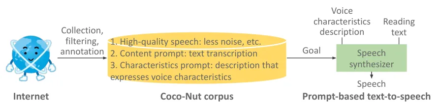
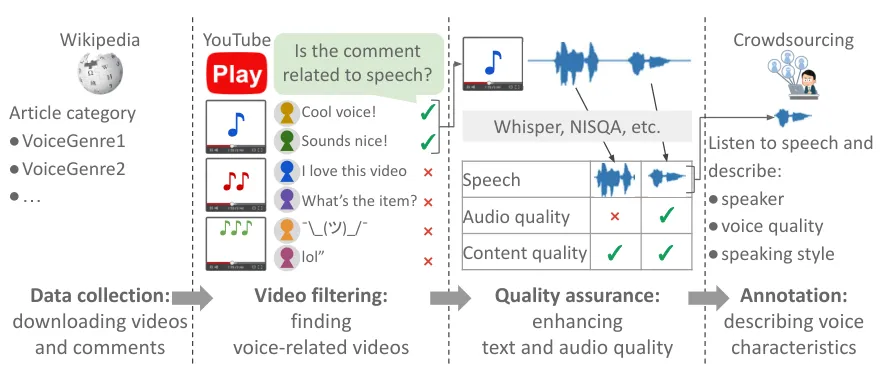
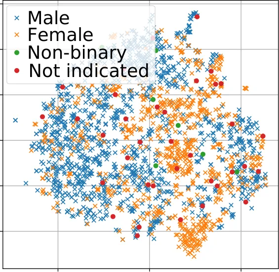
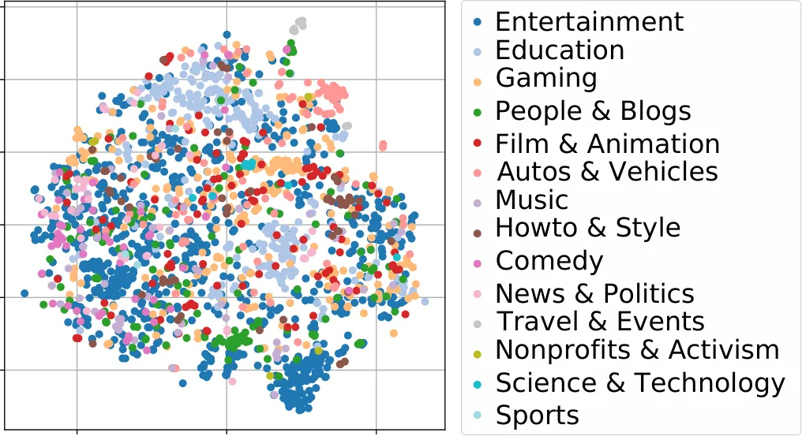
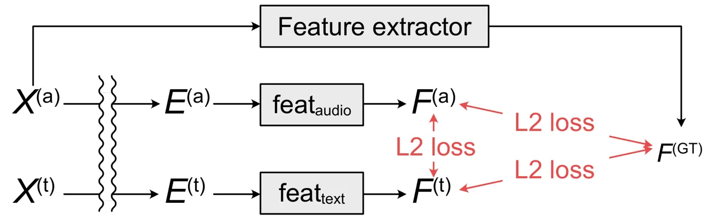

# Building speech corpus with diverse voice characteristics for its prompt-based representation

Aya Watanabe    Shinnosuke Takamichi    Yuki Saito    Wataru Nakata   
Detai Xin    and Hiroshi Saruwatari ^(†)^(†)thanks: The authors are with
the Graduate School of Information Science and Technology, The
University of Tokyo, Bunkyo-ku, Tokyo 113-8656, Japan (e-mail:
aya-watnabe@g.ecc.u-tokyo.ac.jp;
shinnosuke_takamichi@ipc.i.u-tokyo.ac.jp;
yuuki_saito@ipc.i.u-tokyo.ac.jp; nakata-wataru855@g.ecc.u-tokyo.ac.jp;
detai_xin@ipc.i.u-tokyo.ac.jp;
hiroshi_saruwatari@ipc.i.u-tokyo.ac.jp).^(†)^(†)thanks: Manuscript
received April 19, 2005.

###### Abstract

In text-to-speech synthesis, the ability to control voice
characteristics is vital for various applications. By leveraging
thriving text prompt-based generation techniques, it should be possible
to enhance the nuanced control of voice characteristics. While previous
research has explored the prompt-based manipulation of voice
characteristics, most studies have used pre-recorded speech, which
limits the diversity of voice characteristics available. Thus, we aim to
address this gap by creating a novel corpus and developing a model for
prompt-based manipulation of voice characteristics in text-to-speech
synthesis, facilitating a broader range of voice characteristics.
Specifically, we propose a method to build a sizable corpus pairing
voice characteristics descriptions with corresponding speech samples.
This involves automatically gathering voice-related speech data from the
Internet, ensuring its quality, and manually annotating it using
crowdsourcing. We implement this method with Japanese language data and
analyze the results to validate its effectiveness. Subsequently, we
propose a construction method of the model to retrieve speech from voice
characteristics descriptions based on a contrastive learning method. We
train the model using not only conservative contrastive learning but
also feature prediction learning to predict quantitative speech features
corresponding to voice characteristics. We evaluate the model
performance via experiments with the corpus we constructed above.

## I Introduction

In human speech production, the speaker’s voice conveys not only
linguistic information but also non-linguistic cues. These include voice
characteristics such as voice quality resulting from vocal tract shape
and speaking styles reflecting emotions, speaking situations etc.
Text-to-speech (TTS), the task to automatically imitate speech
production, involves two significant challenges: synthesizing highly
intelligible speech from the provided text and controlling the voice
characteristics. In recent years, the introduction of deep neural
network (DNN)-based methods \[1, 2, 3\] has led to tremendous
improvements in terms of the first challenge, enabling the generation of
highly faithful voices that closely resemble human speech. However,
there is still room for improvement in controlling voice
characteristics, which have a significant influence on the listener’s
perception and affect their understanding of the speaker’s personality,
emotion, and overall impression. Several elements for methods that
control voice characteristics have been proposed, such as a speaker
index \[4\], speaker attributes \[5, 6\], personality \[7\], and so
on \[8, 9, 10, 11\]. However, these methods are limited in that they
only enable control over a narrow and simplistic range of voice
characteristics.

These days, there has been significant advancement in techniques for
media generation utilizing free-form text descriptions, commonly
referred to as text prompts. This progress is evident in fields such as
text-to-image \[12\], text-to-audio \[13\], text-to-music \[14\], and
text-to-video \[15\]. These kinds of prompt-based media generation are
beneficial for controlling complicated media components, and they come
with the advantage of large language models (LLMs) \[16, 13\], which are
also improving these days thanks to using abundant amounts of
web-crawled data \[17, 18, 19, 20, 21\]. Following these trends,
free-form description-based voice characteristics control is poised to
open new doors for TTS tasks. Hence, our goal is to develop TTS capable
of controlling voice characteristics by free-form descriptions.
Hereafter, we refer to this free-form description and TTS synthesizer as
the “voice characteristics descriptions” and “prompt-based TTS,”
respectively.

While there are already some methods of prompt-based TTS \[22, 23, 24,
25\], they use corpora based on the existing TTS corpora \[26, 27\],
which tend to cover only a limited range of voice characteristics. Given
the significant advancements in prompt-based generation facilitated by
LLMs in other domains, the corpus for prompt-based TTS should ideally
encompass a wide range of voice characteristics, but neither an open
corpus nor a scalable methodology to construct such a corpus is
currently available (see Table I).



Fig. 1: Our Coco-Nut corpus towards prompt-based TTS. Voice
characteristics description and reading text are, for example,
“middle-aged man’s voice speaking in a clear and polite tone” and
“Welcome to our office!”, respectively. A speech synthesizer synthesizes
the speech of the prompted content on the basis of the prompted voice
characteristics.

|                     | Data source              | Public corpus |
| ------------------- | ------------------------ | ------------- |
| Guo et al. \[22\]   | Public TTS corpus \[26\] | ✓             |
| Yang et al. \[23\]  | Internal TTS corpus      | –             |
| Zhang et al. \[24\] | Internal TTS corpus      | –             |
| Ours                | Internet (diverse data)  | ✓             |

TABLE I: Comparison of corpora of speech-voice characteristics
description.

In this paper, we propose a methodology for constructing a corpus toward
prompt-based TTS featuring plentiful voice characteristics by utilizing
in-the-wild speech data from the Internet. Our methodology consists of
three main steps: 1) automatic collection of voice-related audio data
from the Internet, 2) quality assurance to enhance both the linguistic
and acoustic quality of speech in the corpus, and 3) manual annotation
of voice characteristics descriptions using crowdsourcing. With this
methodology, we construct an open corpus, Coco-Nut¹¹ 1 Corpus of
connecting Nihongo utterance and text. “Nihongo” means “the Japanese
language” in Japanese., which is available on our project page²² 2
[https://sites.google.com/site/shinnosuketakamichi/research-topics/coconut_corpus](https://sites.google.com/site/shinnosuketakamichi/research-topics/coconut_corpus).
Figure 1 shows the total process from corpus construction to
synthesizing speech that aligns with the prompted linguistic content and
voice characteristics with our corpus.

We also propose a method to construct a retrieval model to encode speech
and voice characteristics descriptions into embedding and retrieve
speech from descriptions by using our in-the-wild corpus. The model is
trained based on contrastive learning \[16, 13\] and a new objective to
predict features related to voice characteristics. This augmentation is
aimed at improving the performance of embedding. Experimental
evaluations on the Coco-Nut corpus reveal the effectiveness of this
training method.

The contributions of this work can be summarized as follows.

- •
  We propose a method to construct a paired corpus of speech and voice
  characteristics descriptions with a broad range of voice
  characteristics from the Internet. The proposed method includes data
  collection, quality assurance, and annotation.
- •
  We open-sourced the corpus, which is the first corpus that covers
  diverse in-the-wild voice characteristics.
- •
  We propose a training method for aligning speech and voice
  characteristics descriptions.

The construction method and some analysis of the corpus have previously
been published in an international conference paper \[28\]. In the
current paper, we provide a deeper analysis of the corpus and present a
novel training for aligning the speech and voice characteristics
descriptions.

## II Related work

### II-A Sequence generation from text

In contrast to generating images, which lack a temporal dimension,
generating sequential data such as text-to-video and text-to-audio
requires a consideration of the following aspects: 1) overall concepts
that represent characteristics of the entire sequence and 2) sequence
concepts that represent characteristics of changes in the sequence.

There are two approaches for describing these concepts by free-form
texts. The first is to put both concepts into a single text, e.g.,
“wooden figurine surfing on a surfboard in space” \[15\] in
text-to-video and “hip-hop features rap with an electronic
backing” \[14\] in text-to-music. This method is well-suited for
applications that generate sequences based on general descriptions ³³ 3
For enhancement, MusicLM \[29\] switches the description at fixed
intervals (as noted in the paper, every 15 seconds). This adjustment
enables finer control over the changes in the generated sequences.. The
second is to describe each concept separately. Examples of this include
“bat hitting” (overall concept) and “ki-i-i-n” (sequence concept) in
text-to-audio \[30\]⁴⁴ 4 In LAION-Audio-630K \[31\], the approach
involves overall concepts for non-speech environmental sounds and
sequence concepts (transcriptions) for speech-containing sounds. and “A
toy fireman is lifting weights” (sequence concept) in
text-to-video \[32\]⁵⁵ 5 In the paper, overall concept is given by an
image.. These methods are well-suited for applications demanding precise
control over sequences, such as TTS, where linguistic content and voice
characteristics are frequently managed independently \[22, 23, 24\].
Therefore, prompt-based TTS utilizes corpora annotated with voice
characteristics descriptions independent of transcriptions.

### II-B Dataset for text-to-image

Text-to-image models require pairs of an image and text prompt that
describes the image content for training them. DALL-E \[12\], known as a
pioneer in text-to-image, is trained using the image captioning set of
the MS-COCO dataset \[17\] and web-crawled data \[18\]. MS-COCO is a
dataset of manually annotated images including texts that describe the
image content (called captions), used for image captioning. In addition
to MS-COCO, using a wide range of data from the Internet in training
improves the image diversity of synthesis \[12\]. Although HTML images
and their accompanying alt-tag texts are remarkably beneficial in terms
of providing plenty of text-image pairs, data filtering is required due
to the noisiness of the Internet data. For data filtering, contrastive
learning (see Section II-D)-based models such as CLIP \[16\] are often
used. Following the success in the image field, data diversity and
contrastive learning are presumably important in other domains as well,
e.g., voice characteristics in this paper.

### II-C Dataset for text-to-audio and text-to-music

As with images, datasets for captioning are also available for
text-to-audio. Typical examples are AudioCaps \[19\] and Clotho \[20\].
Additionally, the text-audio version of CLIP, CLAP \[13\], is also used
for data filtering \[21\] before the training. In text-to-music,
MuLan \[14\] introduces a method for extracting music videos from the
Internet and developing a machine learning model to determine if the
accompanying text accurately describes the music. This approach can
potentially be extended to other forms of acoustic media beyond music.

Unlike the text-to-audio and text-to-music cases, datasets for
prompt-based TTS are very limited⁶⁶ 6 Audio captioning datasets \[19,
20\] include human voices as an environmental sound, but the voices do
not strongly specify linguistic content.. In many existing
methodologies, corpora utilized for training consist of resources
tailored for TTS applications, such as LibriTTS \[26\], with manual
annotation of voice characteristics descriptions \[22\], or internally
collected speech recorded from a small number of speakers \[23\].
However, these approaches suffer from several limitations, including a
lack of diversity in voice characteristics and the prevalence of
non-public corpora. Considering the contribution of Internet data
discussed in Section II-B, it is necessary to establish a methodology of
corpus construction from Internet data. Also, the accessibility of the
corpus is important.

### II-D Contrastive learning for text-audio

Fig. 2: CLAP overview. Embedding vectors from text and audio are learned
by contrastive learning.

Contrastive learning, exemplified by CLIP \[16\], aims to learn
correspondences between different forms of media and embed them into the
same space. An example of this is CLAP \[13\], which conducts
contrastive learning for environmental sounds and their captions. An
overview of the structure of CLAP is depicted in the top row of
Figure 2. CLAP encodes the waveform $`X^{(\text{a})}`$ and its
corresponding caption $`X^{(\text{t})}`$ using pretrained encoders
$`f_{\text{audio}}(\cdot)`$ and $`f_{\text{text}}(\cdot)`$,
respectively, transforming them into vectors $`E^{(\text{a})}`$ and
$`E^{(\text{t})}`$ of the same dimensionality using multi-layer
perceptrons $`\text{MLP}_{\text{audio}}(\cdot)`$ and
$`\text{MLP}_{\text{text}}(\cdot)`$. During training, utilizing pairs of
waveforms and captions $`(X^{(\text{a})}_{i},X^{(\text{t})}_{i})`$,
where $`i`$ denotes the $`i`$th pair, the model is trained by minimizing
the following loss function:

```math
\displaystyle L_{\rm{CLAP}} \displaystyle=\frac{1}{2N}\sum_{i=1}^{N}\left(L_{{(\rm{a}\to\rm{t})}i}+L_{{(\rm{t}\to\rm{a})}i}\right), \tag{1}
```

where

```math
\displaystyle L_{({\rm a\to t})i} \displaystyle=\log\frac{\exp\left(E^{(\rm{a})}_{i}\cdot E^{(\rm{t})}_{i}/\tau\right)}{\sum_{j=1}^{N}\exp\left(E^{(\rm{a})}_{i}\cdot E^{(\rm{t})}_{j}/\tau\right)}, \tag{2}
```

```math
\displaystyle L_{({\rm t\to a})i} \displaystyle=\log\frac{\exp\left(E^{(\rm{t})}_{i}\cdot E^{(\rm{a})}_{i}/\tau\right)}{\sum_{j=1}^{N}\exp\left(E^{(\rm{t})}_{i}\cdot E^{(\rm{a})}_{j}/\tau\right)}. \tag{3}
```

Here, $`N`$ denotes the total number of training pairs used in a single
loss computation (or batch size in mini-batch training), and $`\tau`$
represents the temperature parameter. Through training, positive pairs
tend to be embedded closer to each other.

CLAP was originally proposed for environmental sounds, but it can be
extended to other tasks, e.g., speech and voice characteristics
descriptions \[33, 34\]. Also, additional training objectives can
enhance the performance of the contrastive learning models \[35\]

## III Corpus construction



Fig. 3: Procedure of corpus construction.

The corpus for prompt-based TTS should include:

1.  1.  High-quality speech. Speech data suitable for TTS. Unlike data in
        speech-to-text (automatic speech recognition) corpora \[36, 37,
        38\], it should be high-quality, e.g., contain less noise.
2.  2.  Transcription. Text transcriptions of speech, corresponding to the
        “sequence concept” described in Section II-A.
3.  3.  Voice characteristics description. Free-form descriptions that
        express the characteristics of speech, corresponding to the “overall
        concept” described in Section II-A.

As mentioned in Section II-C, conventional prompt-based TTS
methods \[22, 23, 24, 25\] use corpora based on existing TTS corpora
including high-quality speech and their transcriptions \[27, 26\], with
additional annotation of voice characteristics descriptions. Since such
corpora often lack diversity of voice characteristics, we propose a
method that builds a corpus from very noisy but diverse Internet data.

It consists of the following four steps following below, as illustrated
in Figure 3.

1.  1.  Data collection. Speech data candidates, in the form of videos, are
        searched out and downloaded from the Internet.
2.  2.  Video filtering. Impressive voice data are filtered from the
        candidates. Here, “impressive voice” refers to voices those that
        have received a sufficiently large number of responses on the
        Internet. Such data are expected to be characteristic voices, which
        will help improve the diversity of the corpus and can easily be
        annotated with voice characteristics descriptions.
3.  3.  Quality assurance. Speech are further filtered to guarantee the
        quality of the corpus, in both linguistic and acoustic aspects.
4.  4.  Manual annotation. Voice characteristics descriptions are manually
        annotated to the speech data.

While the demonstration in Section IV focuses on Japanese, it is
important to note that the method itself is applicable to languages
other than Japanese.

The subsequent subsections explain these steps in detail.

### III-A Data collection

To collect speech data candidates, we make search keywords and phrases
and input them to the search engines of video-sharing platforms such as
YouTube⁷⁷ 7 [https://www.youtube.com](https://www.youtube.com). From
Wikipedia⁸⁸ 8 [https://en.wikipedia.org](https://en.wikipedia.org) in
English., we choose article categories related to speech⁹⁹ 9 For
example,
[https://en.wikipedia.org/wiki/List_of_YouTubers](https://en.wikipedia.org/wiki/List_of_YouTubers)
in English. in the target language, utilizing the titles of Wikipedia
articles within those categories as search keywords. Additionally, we
make search phrases by concatenating the collected keywords with
relevant phrases (e.g., “\[article title\] short clip”). Upon conducting
the search, we obtain audio data extracted from found videos and, in
addition, various metadata of videos e.g., video IDs, video titles, and
viewer comments.

### III-B Video filtering

After collecting the video data as described above, we filter the data
to acquire videos featuring “impressive voices.” We focus on videos that
have a significant number of viewer comments on the speech heard in the
videos. This filtering process involves two stages described below to
ensure precision.

1.  1.  Keyword matching-based pre-filtering. Some collected videos may lack
        distinctive voices or may not contain any speech at all. To address
        this, we implement a rule-based video filter. This filter relies on
        a predefined set of keywords associated with voice characteristics
        (e.g., “listen”) to assess whether viewer comments mention these
        keywords. If the number of comments containing these keywords for a
        particular video surpasses a specified threshold, the video is
        adopted.
2.  2.  Machine learning-based filtering. After filtering by
        keyword-matching, machine learning-based speech-related comment
        classification is utilized for further detailed filtering. We create
        a small dataset for training the classifier. We randomly extract
        some viewer comments from videos and annotate them by using
        crowdsourcing. A pair of comment and title of the video are shown to
        the crowdworkers¹⁰¹⁰ 10 For example, “Video title: My daily voice
        training method. Comment: Cool Voice!” The correct answer is “1)
        related to speaking voice.” Presenting the title helps crowdworkers
        annotate by giving the imagination of the content of the video., who
        then answer whether the shown comment is 1) related to speaking
        voice, 2) related to singing voice, or 3) others. Before annotating,
        we instruct crowdworkers that “1)” encompasses comments discussing
        voice characteristics but excludes comments about what is said.

    Then, the speech-related comment classifier is trained with
    annotated data. This model is based on BERT \[39\] followed by a
    linear layer. The input comprises a video title and comment
    concatenated with a “\[SEP\]” token, indicating sentence separation
    in BERT. The output is binary, categorizing comments into either
    whether speech-related or any other labels (including 2) related to
    singing voice and 3) others). To enhance the classification
    performance, we utilize the auxiliary keywords. We re-utilize the
    keyword set that was used in the keyword matching-based filtering to
    make a subset of keywords and restrict training and evaluation of
    the classifier to comments that match one of the words in the
    subset.

Subsequently, the voices from the filtered videos proceed to the next
stage of “quality assurance.”

### III-C Quality assurance

Since we collect data from the Internet, there are some speech samples
of low quality that would be difficult to use. To ensure the quality of
speech in the constructed corpus from the viewpoints of of both acoustic
and linguistic quality, we conduct the following processes.

#### III-C1 Audio quality

To ensure the acoustic quality of speech, the following operations are
performed.

1.  1.  Voice activity detection (VAD). VAD is performed to extract only the
        segments of speech from the entire audio of video. We use
        inaSpeechSegmenter \[40\] to detect speech segments from the whole
        video. As a result, each video is processed into multiple segmented
        speech segments.
2.  2.  Denoising. We use Demucs¹¹¹¹ 11
        [https://github.com/facebookresearch/demucs](https://github.com/facebookresearch/demucs)
        source separation model to extract the voices from
        noise-contaminated segments.
3.  3.  Audio quality assessment. The speech obtained through web crawling
        have variations in audio quality due to differences in recording
        device quality and effective frequency band. Additionally, the
        denoising process may occasionally suppress speech components. To
        assess the degradation in quality resulting from these factors, we
        utilize NISQA \[41\], a multidimensional speech quality predictor.
        NISQA scores are computed for each speech segment, and segments with
        scores below a predetermined threshold are filtered out¹²¹² 12 We
        found that speech component drop can be evaluated by the NISQA
        score..
4.  4.  Threshold for duration and audio volume. We establish acceptable
        duration ranges to exclude excessively long or short speech
        segments. Additionally, we set a volume threshold to filter out
        inaudible (low-volume) speech.
5.  5.  Detection of multi-speaker voice and singing voice. We manually
        exclude data not intended for TTS, specifically singing voices and
        multi-speaker voices (including short nods).
6.  6.  Voice characteristics variation. To ensure the corpus encompasses a
        diverse range of voice characteristics, we implement hierarchical
        clustering utilizing Ward’s method \[42\] based on the distances of
        $`x`$-vectors \[43\]. These vectors not only reflect voice quality
        but also speech style, as suggested by \[44\]. $`x`$-vectors are
        extracted for each speech segment using a pretrained $`x`$-vector
        extractor. Given that speech segments with similar voice
        characteristics are anticipated to be grouped together, we randomly
        select one speech segment to serve as the representative of each
        cluster.

#### III-C2 Content quality

To ensure the linguistic quality of speech, the following operations are
performed.

1.  1.  Speech-to-text and language identification. To transcribe speech, we
        utilize pre-trained Whisper speech-to-text models \[45\].
        Concurrently, we identify the language of the speech by Whisper and
        filter out any speech not in the target language. Additionally,
        manual language identification is conducted to further enhance the
        corpus quality¹³¹³ 13 We observed that relying solely on Whisper for
        language identification would result in the inclusion of many
        non-target language voices..
2.  2.  NSFW (not safe for work) word detection. We exclude transcriptions
        containing NSFW words. This is achieved through keyword
        matching-based NSFW word detection, where the text is filtered out
        if the lemmatized word is found in the NSFW word dictionary.
        Additionally, further manual detection is carried out to improve the
        quality of the corpus.
3.  3.  Non-verbal voice detection. Since TTS systems typically do not
        handle non-verbal voices, such as screams, we filter them out using
        an LLM on transcriptions. Masked language model (MLM) scores \[46\]
        based on BERT \[39\] are computed for each segment’s transcription.
        Given that the masked tokens of transcriptions are highly
        predictable from the adjacent tokens¹⁴¹⁴ 14 For example, with
        “aa\[MASK\]aaaa,” a partially masked content prompt of a scream, it
        can easily be predicted that “\[MASK\]” will be “aa.”, the MLM score
        of the non-verbal voice tends to be higher. We manually set a
        threshold against the MLM score and filter out speech with a score
        exceeding this threshold.

### III-D Manual annotation

Finally, we utilize crowdsourcing to add voice characteristics
descriptions to the collected speech. Crowdworkers listen to the
presented speech and describe its voice characteristics, including
speaker attributes, voice quality, and speaking style (e.g., angry,
fast) in a free-form description within some instructional
parameters¹⁵¹⁵ 15 The actual English-translated instruction is “Describe
the kind of speaker (age, gender, etc.), voice quality (brisk, low,
etc.), and speaking style (angry, fast, etc.) in a free-form description
of at least $`20`$ characters. Do not include the linguistic content of
the speech, and do not use expressions that indicate personal likes and
dislikes (e.g., my favorite voice or disliked way of speaking).”. .

After collecting the voice characteristics descriptions, we manually
filtered out ones including proper nouns and persons’ name, e.g., “The
voice is similar to \[celebrity’s real name\].” We undertake these steps
to prevent models trained on this corpus from generating specific
individuals’ speech by inputting their name. Additionally, we perform
text normalization to clean up the descriptions.

## IV Corpus construction settings and results

Using the process outlined in Section III, we constructed the Coco-Nut
corpus. In this section, we provide detailed descriptions of the
construction conditions and analyze the developed corpus.

### IV-A Data collection

The target language was Japanese. The data collection was conducted from
July 2022 to March 2023. The number of downloaded comments per video was
limited to the top $`100`$ comments, sorted in descending order by the
number of “Likes.” After extracting comments only in the target language
using rule-based language identification, only comments with more than
$`3`$ and less than $`50`$ characters were retained. Table II shows the
results of the data collection.

| Retrieved item                    | Value           |
| --------------------------------- | --------------- |
| No. of article-categories         | $`180`$         |
| No. of search-phrases             | $`0.10`$M       |
| No. of videos found in the search | $`1.14`$M       |
| Audio duration                    | $`0.30`$M hours |
| No. of comments                   | $`24.2`$M       |

TABLE II: Results of data collection

### IV-B Filtering

We used eight words for keyword matching-based pre-filtering: “

声”, “

ボイス”, “

ヴォイス” (three versions of voice), “

響” (resonance), “

音” (sound), “

聴” (listen), “

聞” (hear), and “

歌” (song). We set the threshold for the number of keyword-matching
comments per video to $`10`$.

We utilized pre-trained BERT \[39\] model¹⁶¹⁶ 16
[https://huggingface.co/cl-tohoku/bert-base-japanese](https://huggingface.co/cl-tohoku/bert-base-japanese)
for machine learning-based filtering. For fine-tuning, we collected
$`32{,}453`$ labels for comments, out of which $`11{,}647`$ were
“speech-related.” A total of $`80`$% of labels were used for training
and $`20`$% for evaluation. To determine the best selection of subset,
we evaluated the model performance on all combinations of the subsets.
Finally, seven different subsets were selected based on high precision
of classifiers, as we needed to exclude non-desirable comments rather
than to prevent accurate comments from being excluded. The average
precision of the seven classifiers was $`54.3`$%. Given that the
classifier without the keyword subsets performed with the average
precision of just $`38.6`$%, we conclude it is effective to use the
keyword subsets. We classified unlabeled comments with trained
classifiers. Videos were retained if they had $`10`$ or more comments
classified as “speech-related” by any of the seven classifiers.
Hereafter, $`1{,}523`$ videos were used for further processing. These
are the videos remaining from the subset collected in Section IV-A,
after the process outlined in this subsection.

### IV-C Quality assurance

After implementing VAD, we obtained $`54{,}610`$ speech segments from
$`1{,}523`$ videos. Figure 5 shows the distribution of predicted mean
opinion scores (MOSs) on audio quality by NISQA. We set the threshold to
$`2`$ because it is the most frequent score. Also, only segments with a
duration between $`2`$ and $`10`$ seconds were retained. We used
Pydub¹⁷¹⁷ 17
[https://github.com/jiaaro/pydub](https://github.com/jiaaro/pydub) to
check the audio volume, and segments with a volume of $`-55`$ dB or
lower were excluded.

For transcription, we utilized both the tiny and large models of
Whisper \[45\], as the former tends to prioritize fidelity to the speech
while the latter prioritizes grammatical correctness¹⁸¹⁸ 18 The average
word error rate (WER) of transcriptions from the Whisper large model was
22.1%. Upon final publication, we corrected transcriptions manually to
ensure a WER of 0%..

The NSFW detection was performed with MeCab¹⁹¹⁹ 19
[https://taku910.github.io/mecab/](https://taku910.github.io/mecab/) and
the Japanese NSFW dictionary²⁰²⁰ 20
[https://github.com/MosasoM/inappropriate-words-ja](https://github.com/MosasoM/inappropriate-words-ja).

We set the MLM score threshold for non-verbal voice detection to
$`-0.01`$. Figure 5 shows the distribution of MLM scores calculated by
the transcriptions from the Whisper large model. According to this
analysis, the MLM scores of collected segments are distributed around
the peak of $`-3`$, with a range of roughly $`\pm 2`$ intervals. We
observe that the percentage of segments whose MLM scores exceed
$`-0.01`$ was approximately $`0.05`$%, which is extremely low frequency.

Fig. 4: Histogram of NISQA-predicted MOS on speech quality.

Fig. 5: Histogram of MLM scores.

We utilized the $`x`$-vectors obtained from xvector_jtubespeech²¹²¹ 21
[https://github.com/sarulab-speech/xvector_jtubespeech](https://github.com/sarulab-speech/xvector_jtubespeech)
for analyzing variations in voice characteristics. Hierarchical
clustering was performed, resulting in the creation of $`11{,}000`$
clusters based on similarities in voice characteristics. A single speech
segment was randomly chosen from each cluster. Subsequently, manual
annotation was carried out through crowdsourcing to identify segments
containing NSFW words, non-target language, and multiple speakers.
Ultimately, a total of $`7{,}667`$ segments, amounting to $`30{,}661`$
seconds in length, were selected for further analysis.

### IV-D Annotation

We hired workers through the Lancers²²²² 22
[https://www.lancers.jp](https://www.lancers.jp). Each worker annotated
$`10`$ segments. There were a total of $`1{,}318`$ workers, and each was
paid $`200`$ yen as reward.

Before annotation, for the machine learning usage, we designed the
training, validation, and test sets to prevent data leakage stemming
from similar voice characteristics within the same video or YouTube
channel, and we ensured that the sets had no overlap in YouTube channels
and comprised a varied selection of segments. Consequently, we acquired
training, validation, and test sets containing $`6{,}463`$, $`593`$, and
$`611`$ segments, respectively²³²³ 23 We conducted quality evaluations
by professional annotators, leading to the exclusion of several segments
for public distributed version.. We designed our corpus to incorporate
variations introduced by workers. In particular, for the training set,
we included one voice characteristics description per segment, while for
the other sets, we included five descriptions per segment, following
previous studies \[20, 47\].

### IV-E Corpus analysis

Fig. 6: Categories of speech.

Fig. 7: Gender of speech.



Fig. 8: $`x`$-vector distributions colored by gender.



Fig. 9: $`x`$-vector distributions colored by category.

We analyze the constructed corpus focusing primarily on the diversity of
data, which is the main purpose of the corpus, and examine the features
of the collected voice characteristics descriptions.

#### IV-E1 Video categories

We examined the video category to which speech segments in the corpus
belonged. Each segment’s source video was categorized based on YouTube
video categories. The results are shown in Figure 7. The corpus
encompasses $`14`$ categories, indicating a broad coverage. The top
three categories (Entertainment, Education and Gaming) constitute
roughly $`70`$%, while minor categories such as Science & Technology are
also represented.

#### IV-E2 Gender distributions

We conducted automatic annotation of gender based on the voice
characteristics descriptions to examine gender diversity. We labeled the
descriptions based on the presence of gender-indicating characters (“

男” for male, “

女” for female). In this labeling scheme, if only one gender-indicating
character is present, the label will be assigned as male or female
accordingly. If both are present, the label will be non-binary, and if
neither is present, the label will be not-indicated. Figure 7 depicts
the distribution of gender. While the majority of characteristic prompts
are labeled as male or female, instances of non-binary and prompts not
indicating gender (not-indicated) also exist. Similar to a typical TTS
corpus, distinct clusters can be observed for male and female voices.
However, non-binary and not-indicated categories do not form distinct
clusters but are scattered throughout. For a more detailed analysis, we
provide a t-SNE visualization of $`x`$-vectors colored by gender in
Figure 9. Clusters representing male and female voices are discernible,
while the non-binary and not-indicated categories do not form clusters
and are instead dispersed.


Fig. 10: Word cloud of collected voice characteristics descriptions
(nouns, verbs, and adjectives, from left).

| Word            | Voice characteristics descriptions                           | Translations                                                                          |
| --------------- | ------------------------------------------------------------ | ------------------------------------------------------------------------------------- |
| 早口            | 中年の男性が、ハキハキした声で、早口で喋っている。           | The middle-aged man is speaking rapidly and with a clear voice.                       |
| (fast-speaking) | 若い女性が少し慌てた様子で早口で話している。                 | A young woman speaks hurriedly with a slightly flustered demeanor.                    |
| 落ち着く        | 高齢の女性が低い落ち着いた声でゆっくり喋っている。           | An elderly woman speaks slowly in a calm, low voice.                                  |
| (to calm down)  | 壮年の男性が、高い声で、落ち着いて説明するように喋っている。 | A middle-aged man speaks with a high-pitched voice, calmly delivering an explanation. |
| 若い            | 若そうな男性が、セリフのようなことをしゃべっている。         | A youthful male speaks in a scripted manner.                                          |
| (young)         | 若い女性が少年のような口調で喋っている。                     | A young woman speaks with a boyish tone.                                              |

TABLE III: Examples of voice characteristics descriptions.

#### IV-E3 Voice characteristics of video categories

To explore the relationship between $`x`$-vectors and video categories,
we provide a t-SNE visualization of $`x`$-vectors colored by video
category in Figure 9. In the Entertainment and Education categories,
distinct clusters are noticeable, particularly in the bottom-right and
top-central regions. This suggests that typical voice characteristics
are aggregated within each category. However, for the majority of the
scatter plot, no prominent clusters are observed. This indicates that
the speech in this corpus encompasses both typical voices within
categories and voices that are shared across categories.

#### IV-E4 Linguistic analysis

We conducted an analysis of word frequency in voice characteristics
descriptions tokenized by MeCab. Trivial words such as “

いる” (to be), “

する” (to do), and “

ある” (to exist) were excluded, as well as words that frequently appear
due to collection conditions, such as “

男”(male) and “

女”(female), “

声” (voice), and “

喋る” (to speak). A word cloud visualizing the frequency is presented in
Figure 10. Additionally, examples containing the top-frequency words “

早口” (fast-speaking), “

落ち着く” (to calm down), and “

若い” (young) within each part of speech are provided in Table III.

High-frequency words not only indicate prevalent voice characteristics
features within the corpus but also highlight aspects that are often
observed in voice characteristics descriptions. For example, the high
frequency of “

早口” as a noun suggests the prevalence of fast-speaking speakers in the
YouTube domain and emphasizes the aspect of speech rate, which tends to
draw attention. Furthermore, expressions related to multiple qualitative
features also frequently appear. For example, “

落ち着く” is associated with both the depth of the voice, as in “

落ち着いた低い声” (a calm low voice), and with speaking at a calm and
slow pace, as in “

落ち着いてゆっくり喋っている” (speaking within a calm, slow voice).
However, there are also instances where phrases like “

高い声で、落ち着いて” (calmly with a high voice) exist, indicating the
usage of the word “

落ち着く” even with a higher pitch, suggesting the necessity for efforts
to predict voice characteristics from expressions that frequently appear
across evaluators and are associated with qualitative features but are
not entirely deterministic.

## V Training algorithm of model to retrieve speech from voice characteristics description

We build a model to retrieve speech from voice characteristics
descriptions. The straightforward approach would be to implement a
contrastive learning such as CLAP, as explained in Section II-D.
However, since the naive contrastive learning just makes the text
embedding and audio embedding closer, the learned embedding is not
guaranteed to accurately represent voice characteristics. Therefore,
inspired by \[35\], we propose an additional training objective: the
prediction of speech features from embeddings. The idea here is that the
use of perceptible speech features for voice characteristics will
enhance the training.

### V-A Model construction



Fig. 11: Feature prediction learning.

The model architecture adheres to CLAP \[13\]. However, while CLAP
employs HTS-AT \[48\], which is specialized for environmental sounds, as
$`f_{\text{audio}}(\cdot)`$, we use HuBERT \[49\]. Also, we use
RoBERTa \[50\] as $`f_{\text{text}}(\cdot)`$.

The basic objective of the model training is contrastive learning, and
we add the future prediction learning specialized for voice
characteristics. We use networks $`\text{feat}_{\text{audio}}(\cdot)`$
and $`\text{feat}_{\text{text}}(\cdot)`$, which transform the model
outputs $`E^{(\text{a})}`$ and $`E^{(\text{t})}`$ into predicted feature
vectors $`F^{(\text{a})}`$ and $`F^{(\text{t})}`$, respectively. The
training criterion is to minimize $`L_{\text{feat}}`$, where the
ground-truth speech features obtained from the $`i`$th pair data
$`(X^{(\text{a})}_{i},X^{(\text{t})}_{i})`$ are denoted as
$`F^{(\text{GT})}_{i}`$, and the predicted feature vectors are
$`F^{(\text{a})}_{i}`$ and $`F^{(\text{t})}_{i}`$.

```math
\displaystyle L_{\rm{feat\mathchar 45audio}} \displaystyle=\sum_{i=1}^{N}||F^{(\rm{GT})}_{i}-F^{(\rm{a})}_{i}||_{2} \tag{4}
```

```math
\displaystyle L_{\rm{feat\mathchar 45text}} \displaystyle=\sum_{i=1}^{N}||F^{(\rm{GT})}_{i}-F^{(\rm{t})}_{i}||_{2} \tag{5}
```

```math
\displaystyle L_{\rm{feat\mathchar 45cross}} \displaystyle=\sum_{i=1}^{N}||F^{(\rm{a})}_{i}-F^{(\rm{t})}_{i}||_{2} \tag{6}
```

```math
\displaystyle L_{\rm{feat}} \displaystyle=L_{\rm{feat\mathchar 45audio}}+L_{\rm{feat\mathchar 45text}}+L_{\rm{feat\mathchar 45cross}} \tag{7}
```

Eqs.4 and 5 represent the distances between the predictions from
$`E^{(\text{a})}`$ and $`E^{(\text{t})}`$ respectively, and the
ground-truth features. Eq. (6) indicates the difference between
predictions. Figure 11 shows the overview of this learning.

The total training objective is the sum of the contrastive learning loss
$`L_{\text{CLAP}}`$ (Eq. 1) and the feature prediction loss
$`L_{\text{feat}}`$ with a coefficient $`\alpha`$:

```math
\displaystyle L=L_{\rm{CLAP}}+\alpha L_{\rm{feat}}. \tag{8}
```

The gradients of not only $`L_{\text{CLAP}}`$ but also
$`L_{\text{feat}}`$ are backpropagated. Therefore,
$`\text{MLP}_{\text{audio}}(\cdot)`$ and
$`\text{MLP}_{\text{feat}}(\cdot)`$ are trained to learn embeddings that
are relevant to voice characteristics.

### V-B Evaluation tasks

Fig. 12: Overview of evaluation tasks. Top: speech retrieval from voice
characteristics description. Bottom: zero-shot speech classification.

Following the CLAP paper \[13\], we evaluate the trained model and
obtained embeddings. Figure 12 presents an overview of the evaluation
tasks.

Speech retrieval from the voice characteristics description. We
calculate the cosine similarity between the embeddings of the input
description and the set of embeddings of target speech segments. A
higher cosine similarity value indicates a higher-ranked retrieval
result. We evaluate whether the proper segment can be retrieved by the
description.

Zero-shot speech classification. We generate template-based voice
characteristics phrases, such as “a voice of \[label\].” Then, a phrase
closest to the audio segment in the embedding space is selected. The
label associated with that phrase is considered the classification label
for that speech. We evaluate whether the correct label can be obtained
without additional training.

### V-C Experimental setup

The model was built based on an open-source implementation ²⁴²⁴ 24
[https://github.com/LAION-AI/CLAP](https://github.com/LAION-AI/CLAP). We
used RoBERTa and HuBERT pre-trained models for Japanese²⁵²⁵ 25
[https://huggingface.co/rinna/japanese-roberta-base](https://huggingface.co/rinna/japanese-roberta-base)²⁶²⁶
26
[https://huggingface.co/rinna/japanese-hubert-base](https://huggingface.co/rinna/japanese-hubert-base).
The encoder weights were frozen during training.
Training/validation/test sets followed the Coco-Nut settings. The
embedding dimensionality was set to $`512`$, and the initial value of
the temperature parameter $`\tau`$ was set to $`1/\log(1/0.07)`$. For
speech feature prediction, we utilized a $`3`$-dimensional vector
consisting of utterance-level $`F_{0}`$ mean, utterance-level standard
deviation of energy, and speaking rate. Since our target language is
Japanese, a mora-timed language, the speaking rate is calculated as the
number of moras per second in an utterance. These features were chosen
based on the analysis in Section IV-E2, which identified them as being
closely associated with perceptually salient voice characteristics. The
feature prediction network consisted of two linear layers with a ReLU
activation function \[51\] sandwiched in between. The coefficient
$`\alpha`$ for the feature prediction loss function was set to $`0.0`$,
$`0.5`$, and $`1.0`$. We confirmed that the values of
$`L_{\text{clap}}`$ and $`L_{\text{feat}}`$ are approximately within the
same range. Therefore, $`\alpha=1.0`$ corresponds to equally weighting
these losses. In contrast, $`\alpha=0.0`$ indicates that
$`L_{\text{feat}}`$ is not considered at all. The learning rate was set
to $`5\times 10^{-6}`$, the batch size to $`48`$, and the number of
training epochs to $`90`$, with model checkpoints saved every $`5`$
epochs.

Prior to experimental evaluations, a preliminary investigation was
conducted to determine $`\alpha`$. Subsequently, subjective evaluations
of speech retrieval and objective evaluations of zero-shot speech
classification were performed as the experimental evaluation.

### V-D Preliminary experiment for $`\alpha`$

We conducted a preliminary experiment to investigate the impact of
$`\alpha`$ and determine the optimal number of training epochs. Gender
identification in the top $`10`$ retrievals was computed at each epoch
of model training. The identification score indicates how well the model
classified segments of the Coco-Nut validation set to the correct
gender. The identification is binary; only male and female gender labels
were used.

Fig. 13: Macro average gender accuracy among the top $`10`$ acquired
results.

The results are presented in Figure 13.

From the results, the performance ceilings are generally similar for
$`\alpha=1.0`$ and $`\alpha=0.5`$. Moreover, $`\alpha>0`$ settings
converge faster and better than $`\alpha=0.0`$. Hereafter, we used the
best settings of model training: $`35`$ epochs for $`\alpha=1.0`$ and
$`60`$ epochs for $`\alpha=0.0`$.

### V-E Subjective evaluation on speech retrieval from the voice characteristics description

Subjective evaluation of the speech retrieval results involved
subjective evaluation of the correspondence between the voice
characteristics description and the retrieved speech segment. The
Coco-Nut test set was used for evaluation, utilizing $`100`$ randomly
selected voice characteristics descriptions and targeting all speech
segments in the evaluation set for retrieval. The combined voice
characteristics description and retrieved speech segment were presented
for evaluation of their correspondence on a $`9`$-point scale ranging
from $`1`$ (no correspondence) to $`9`$ (excellent correspondence). In
addition to the top-ranked retrieval result, experiments were conducted
for the $`2`$nd to $`5`$th and $`6`$th to $`10`$th retrieval results.
Moreover, experiments were performed for pairs of description and speech
segment selected completely randomly from the evaluation set, as well as
for correct or ground-truth pairs within the test set. Listeners were
recruited through Lancers²⁷²⁷ 27
[https://www.lancers.jp/](https://www.lancers.jp/), with $`16`$
evaluations assigned per listener and $`20`$ listeners assigned per
pair.

Fig. 14: Mean and standard deviation of subjective evaluation on each
description-speech pair. Blue circles indicate retrieved pairs of the
figure title, and gray ones indicates ground-truth. “$`+`$” marks
indicate average mean and standard deviation of same color plots.

Fig. 15: Subjective evaluation results, showing the distribution of
average ratings for each pair of models and retrieval methods.

| Retrieval text                                                                                               | Score (GT) | 1st retrieval candidate ($`\alpha=0.0`$)                                                        | Score    | 1st retrieval candidate ($`\alpha=1.0`$)                                                                  | Score    |
| ------------------------------------------------------------------------------------------------------------ | ---------- | ----------------------------------------------------------------------------------------------- | -------- | --------------------------------------------------------------------------------------------------------- | -------- |
| 20代くらいの若い女性が楽しそうな声で訴えるようなしゃべり方をしている。                                       | $`6.75`$   | 20代くらいの女性が、コソコソした声で、指示するように話している。                                | $`4.86`$ | 若い女性が、明るくはきはきした声で、少年のように喋っている。                                              | $`5.74`$ |
| (A young woman in her twenties speaks with an appealing tone, expressing herself in an engaging manner.)     |            | (A woman in her twenties speaks in a hushed tone, giving instructions in a clandestine manner.) |          | (The young woman speaks in a bright and brisk tone, resembling that of a boy.)                            |          |
| 若い男性が、早口で、何かを説明しながら喋っている。                                                           | $`8.55`$   | ３０代男性が抑えた口調で子供に語りかけている。                                                  | $`5.90`$ | 50代の男性が、明瞭な声で少し迷いながらも落ち着いて説明している。                                          | $`6.57`$ |
| (The young man speaks rapidly while explaining something.)                                                   |            | (A man in his thirties speaks to a child in a restrained tone.)                                 |          | (A man in his fifties is speaking clearly with a slightly hesitant yet composed manner while explaining.) |          |
| 10代くらいの若い男性が友達と話すような声のトーンで楽しそうに喋っている。                                     | $`7.58`$   | 若い女性がのんびりした声で、楽しそうに自分の話に笑いながら喋っている。                          | $`1.95`$ | 20代の男性が感情を押さえながら話している。                                                                | $`3.19`$ |
| (A young man in his teens speaks with a tone resembling a conversation with friends, expressing excitement.) |            | (The young woman speaks in a relaxed tone, laughing while joyfully narrating her story.)        |          | (A man in his twenties speaks while controlling his emotions.)                                            |          |

TABLE IV: Examples of retrieval. “retrieval candidate” indicates the
voice characteristics description paired with retrieved speech.

The results are illustrated in Figure 14. It can be observed that,
across all rankings from $`1`$st to $`10`$th, there is a general trend
indicating better scores when using feature prediction learning. This
can be attributed to the distribution of average ratings per pair shown
in Figure 15. It is evident that there are numerous low-rated pairs when
feature prediction learning is not used, whereas there is a higher
proportion of moderately rated pairs when it is used. This suggests that
by incorporating a training objective related to voice characteristics,
the occurrence of discordant retrieval results is reduced, leading to a
more favorable subjective evaluation.

Examples of retrieval results are provided in Table IV. “Scores (GT)”
refers to the average evaluation score for ground-truth pairs. As seen
in the example in the third row, evaluations for voice clips with
mismatched gender compared to the voice quality expression sentences
tend to be lower, regardless of other matching elements. The improvement
in gender match rate as shown in Figure 13 likely contributed to the
overall stability of evaluations. In essence, feature prediction
learning serves to effectively reflect easily perceptible elements such
as gender, thereby contributing to the improvement of performance.

However, even in the case of $`1`$st results, the scores of ground truth
pairs are significantly higher compared to the retrieved results. This
is potentially due to the high quality of the collected voice
characteristics descriptions, but it also suggests room for improvement
in the proposed method.

### V-F Objective evaluation on zero-shot speech classification

Objective evaluation involved assessing binary label classification
performance using gender and speaking rate. The evaluation targeted the
parallel100 set from JVS \[27\], comprising a gender label and speaking
rate of each of $`100`$ speakers. The phrases were “

男性が喋っている” (a man is speaking) and “

女性が喋っている” (a woman is speaking) for gender classification and “

ゆっくり喋っている” (speaking slowly) and “

早口で喋っている” (speaking rapidly) for speaking rate. We used all
$`100`$ speakers for gender identification. For speaking rate
identification, we used the $`20`$ fastest-speaking and $`20`$
slowest-speaking speakers. Since the JVS fast-speaking speakers speak
slower than Coco-Nut fast-speaking ones, we sped up the speech of
fast-speaking speakers to $`1.5`$ times their original speed using
WSOLA \[52\].

| Label         | $`\alpha`$ | Accuracy              |
| ------------- | ---------- | --------------------- |
| Male / Female | $`0.0`$    | $`0.998`$ / $`0.941`$ |
|               | $`1.0`$    | $`0.986`$ / $`1.000`$ |
| Fast / Slow   | $`0.0`$    | $`0.984`$ / $`0.997`$ |
|               | $`1.0`$    | $`0.990`$ / $`1.000`$ |

TABLE V: Results of zero-shot classification.

The results are shown in Table V. Here, utilizing feature prediction
learning results in higher accuracy rates overall.

## VI Conclusion

In this paper, we developed a paired corpus of speech and voice
characteristics descriptions. This corpus is now available publicly and
will promote research on prompt-based TTS. Also, we proposed a retrieval
model training incorporating feature prediction learning into
contrastive learning and experimentally validated its performance. We
leave the construction of prompt-based TTS with the proposed corpus and
retrieval model to future work.

## Acknowledgment

This work was supported by JSPS KAKENHI 21H04900, 22H03639, 23H03418
(practical experiment), JST FOREST JPMJFR226V, and Moon-shot R&D Grant
Number JPMJPS2011 (algorithm development). We appreciate Takaaki Saeki
and Yuta Matsunaga of the University of Tokyo for their help. We also
wish to thank Masaki Sato, Kazuki Yamauchi, Hiroaki Hyodo, Osamu Take of
the University of Tokyo for their assistance in manual quality
assurance.

## References

- \[1\] A. van den Oord, S. Dieleman, H. Zen, K. Simonyan, O. Vinyals,
  A. Graves, N. Kalchbrenner, A. Senior, and K. Kavukcuoglu, “WaveNet: A
  generative model for raw audio,” in _Proc. SSW_, Sunnyvale, U.S.A.,
  2016, p. 125.
- \[2\] Y. Wang, R. Skerry-Ryan, D. Stanton, Y. Wu, R. J. Weiss,
  N. Jaitly, Z. Yang, Y. Xiao, Z. Chen, S. Bengio, Q. Le,
  Y. Agiomyrgiannakis, R. Clark, and R. A. Saurous, “Tacotron: Towards
  End-to-End Speech Synthesis,” in _Proc. INTERSPEECH_, Stockholm,
  Sweden, 2017, pp. 4006–4010.
- \[3\] Y. Ren, Y. Ruan, X. Tan, T. Qin, S. Zhao, Z. Zhao, and T.-Y.
  Liu, “FastSpeech: Fast, robust and controllable text to speech,”
  _Proc. NeurIPS_, vol. 32, 2019.
- \[4\] N. Hojo, Y. Ijima, and H. Mizuno, “DNN-based speech synthesis
  using speaker codes,” _IEICE TRANSACTIONS on Information and Systems_,
  vol. E101-D, no. 2, pp. 462–472, 2017.
- \[5\] D. Stanton, M. Shannon, S. Mariooryad, R. Skerry-Ryan,
  E. Battenberg, T. Bagby, and D. Kao, “Speaker generation,” in _Proc.
  ICASSP_, 2022, pp. 7897–7901.
- \[6\] A. Watanabe, S. Takamichi, Y. Saito, D. Xin, and H. Saruwatari,
  “Mid-attribute speaker generation using optimal-transport-based
  interpolation of gaussian mixture models,” in _Proc. ICASSP_. IEEE,
  2023, pp. 1–5.
- \[7\] J. Gustafson, J. Beskow, and E. Szekely, “Personality in the
  mix - investigating the contribution of fillers and speaking style to
  the perception of spontaneous speech synthesis,” in _Proc. Speech
  Synthesis Workshop_, 2021, pp. 48–53.
- \[8\] Y. Zhang, R. J. Weiss, H. Zen, Y. Wu, Z. Chen, R. Skerry-Ryan,
  Y. Jia, A. Rosenberg, and B. Ramabhadran, “Learning to Speak Fluently
  in a Foreign Language: Multilingual Speech Synthesis and
  Cross-Language Voice Cloning,” in _Proc. Interspeech_, Graz, Austria,
  Sep. 2019, pp. 2080–2084.
- \[9\] R. Liu, B. Sisman, and H. Li, “Reinforcement learning for
  emotional text-to-speech synthesis with improved emotion
  discriminability,” in _Proc. Interspeech_, Aug. 2021, pp. 4648–4652.
- \[10\] K. Ohta, T. Toda, Y. Ohtani, H. Saruwatari, and K. Shikano,
  “Adaptive voice-quality control based on one-to-many eigenvoice
  conversion,” in _Proc. Interspeech_, 2010, pp. 2158–2161.
- \[11\] T. Raitio, R. Rasipuram, and D. Castellani, “Controllable
  Neural Text-to-Speech Synthesis Using Intuitive Prosodic Features,” in
  _Proc. Interspeech_, 2020, pp. 4432–4436.
- \[12\] A. Ramesh, M. Pavlov, G. Goh, S. Gray, C. Voss, A. Radford,
  M. Chen, and I. Sutskever, “Zero-shot text-to-image generation,”
  _arXiv:2102.12092_, 2021.
- \[13\] B. Elizalde, S. Deshmukh, M. A. Ismail, and H. Wang, “CLAP:
  Learning audio concepts from natural language supervision,”
  _arXiv:2206.04769_, 2022.
- \[14\] Q. Huang, A. Jansen, J. Lee, R. Ganti, J. Y. Li, and D. P. W.
  Ellis, “MuLan: A joint embedding of music audio and natural language,”
  _arXiv:2208.12415_, 2022.
- \[15\] J. Ho, W. Chan, C. Saharia, J. Whang, R. Gao, A. Gritsenko,
  D. P. Kingma, B. Poole, M. Norouzi, D. J. Fleet, and T. Salimans,
  “Imagen Video: High definition video generation with diffusion
  models,” _arXiv:2210.02303_, 2022.
- \[16\] A. Radford, J. W. Kim, C. Hallacy, A. Ramesh, G. Goh,
  S. Agarwal, G. Sastry, A. Askell, P. Mishkin, J. Clark, G. Krueger,
  and I. Sutskever, “Learning transferable visual models from natural
  language supervision,” in _Proceedings of the 38th International
  Conference on Machine Learning_, ser. Proceedings of Machine Learning
  Research, M. Meila and T. Zhang, Eds., vol. 139. PMLR, 18–24 Jul 2021,
  pp. 8748–8763. \[Online\]. Available:
  [https://proceedings.mlr.press/v139/radford21a.html](https://proceedings.mlr.press/v139/radford21a.html)
- \[17\] T.-Y. Lin, M. Maire, S. Belongie, L. Bourdev, R. Girshick,
  J. Hays, P. Perona, D. Ramanan, C. L. Zitnick, and P. Dollár,
  “Microsoft COCO: Common objects in context,” _arXiv:1405.0312_, 2014.
- \[18\] P. Sharma, N. Ding, S. Goodman, and R. Soricut, “Conceptual
  captions: A cleaned, hypernymed, image alt-text dataset for automatic
  image captioning,” in _Proceedings of the 56th Annual Meeting of the
  Association for Computational Linguistics (Volume 1: Long
  Papers)_. Melbourne, Australia: Association for Computational
  Linguistics, Jul. 2018, pp. 2556–2565. \[Online\]. Available:
  [https://aclanthology.org/P18-1238](https://aclanthology.org/P18-1238)
- \[19\] C. D. Kim, B. Kim, H. Lee, and G. Kim, “Audiocaps: Generating
  captions for audios in the wild,” in _NAACL-HLT_, 2019.
- \[20\] K. Drossos, S. Lipping, and T. Virtanen, “Clotho: an audio
  captioning dataset,” in _Proc. ICASSP_, 2020, pp. 736–740.
- \[21\] Y. Wu, K. Chen, T. Zhang, Y. Hui, T. Berg-Kirkpatrick, and
  S. Dubnov, “Large-scale contrastive language-audio pretraining with
  feature fusion and keyword-to-caption augmentation,”
  _arXiv:2211.06687_, 2022.
- \[22\] Z. Guo, Y. Leng, Y. Wu, S. Zhao, and X. Tan, “PromptTTS:
  Controllable text-to-speech with text descriptions,”
  _arXiv:2211.12171_, 2022.
- \[23\] D. Yang, S. Liu, R. Huang, G. Lei, C. Weng, H. Meng, and D. Yu,
  “InstructTTS: Modelling expressive TTS in discrete latent space with
  natural language style prompt,” _arXiv:2301.13662_, 2023.
- \[24\] Y. Zhang, G. Liu, Y. Lei, Y. Chen, H. Yin, L. Xie, and Z. Li,
  “Promptspeaker: Speaker generation based on text descriptions,” _arXiv
  preprint arXiv:2310.05001_, 2023.
- \[25\] D. Lyth and S. King, “Natural language guidance of
  high-fidelity text-to-speech with synthetic annotations,” _arXiv
  preprint arXiv:2402.01912_, 2024.
- \[26\] H. Zen, V. Dang, R. Clark, Y. Zhang, R. J. Weiss, Y. Jia,
  Z. Chen, and Y. Wu, “LibriTTS: A corpus derived from LibriSpeech for
  text-to-speech,” in _Proc. Interspeech_, 2019, pp. 1526–1530.
- \[27\] S. Takamichi, R. Sonobe, K. Mitsui, Y. Saito, T. Koriyama,
  N. Tanji, and H. Saruwatari, “JSUT and JVS: Free Japanese voice
  corpora for accelerating speech synthesis research,” _Acoustical
  Science and Technology_, vol. 41, no. 5, pp. 761–768, 2020.
- \[28\] A. Watanabe, S. Takamichi, Y. Saito, W. Nakata, D. Xin, and
  H. Saruwatari, “Coco-nut: Corpus of japanese utterance and voice
  characteristics description for prompt-based control,” in _2023 IEEE
  Automatic Speech Recognition and Understanding Workshop (ASRU)_, 2023,
  pp. 1–8.
- \[29\] A. Agostinelli, T. I. Denk, Z. Borsos, J. Engel, M. Verzetti,
  A. Caillon, Q. Huang, A. Jansen, A. Roberts, M. Tagliasacchi,
  M. Sharifi, N. Zeghidour, and C. Frank, “MusicLM: Generating music
  from text,” _arXiv:2301.11325_, 2023.
- \[30\] H. Ohnaka, S. Takamichi, K. Imoto, Y. Okamoto, K. Fujii, and
  H. Saruwatari, “Visual onoma-to-wave: environmental sound synthesis
  from visual onomatopoeias and sound-source images,” in _Proc.
  ICASSP_. IEEE, 2023, pp. 1–5.
- \[31\] Y. Wu, K. Chen, T. Zhang, M. Nezhurina, and Y. Hui,
  “LAION-Audio-630K,” 2022,
  [https://github.com/LAION-AI/audio-dataset](https://github.com/LAION-AI/audio-dataset).
- \[32\] E. Molad, E. Horwitz, D. Valevski, A. R. Acha, Y. Matias,
  Y. Pritch, Y. Leviathan, and Y. Hoshen, “Dreamix: Video diffusion
  models are general video editors,” _arXiv:2302.01329_, 2023.
- \[33\] A. Nagrani, J. S. Chung, W. Xie, and A. Zisserman, “Voxceleb:
  Large-scale speaker verification in the wild,” _Computer Speech &
  Language_, vol. 60, p. 101027, 2020.
- \[34\] K. Maekawa, “Corpus of spontaneous japanese : its design and
  evaluation,” _Proceedings of The ISCA & IEEE Workshop on Spontaneous
  Speech Processing and Recognition (SSPR 2003)_, pp. 7–12, 2003.
- \[35\] C.-F. Yeh, P.-Y. Huang, V. Sharma, S.-W. Li, and G. Gosh,
  “Flap: Fast language-audio pre-training,” _arXiv preprint
  arXiv:2311.01615_, 2023.
- \[36\] G. Chen, S. Chai, G. Wang, J. Du, W.-Q. Zhang, C. Weng, D. Su,
  D. Povey, J. Trmal, J. Zhang _et al._, “GigaSpeech: An evolving,
  multi-domain asr corpus with 10,000 hours of transcribed audio,”
  _arXiv preprint arXiv:2106.06909_, 2021.
- \[37\] S. Takamichi, L. Kürzinger, T. Saeki, S. Shiota, and
  S. Watanabe, “JTubeSpeech: corpus of Japanese speech collected from
  YouTube for speech recognition and speaker verification,”
  _arXiv:2112.09323_, 2021.
- \[38\] S. F. Yue Yin, Daijiro Mori, “ReazonSpeech: A free and massive
  corpus for Japanese ASR,” in _Annual meetings of the Association for
  Natural Language Processing_, 2023.
- \[39\] J. Devlin, M.-W. Chang, K. Lee, and K. Toutanova, “Bert:
  Pre-training of deep bidirectional transformers for language
  understanding,” _arXiv preprint arXiv:1810.04805_, 2018.
- \[40\] D. Doukhan, J. Carrive, F. Vallet, A. Larcher, and S. Meignier,
  “An open-source speaker gender detection framework for monitoring
  gender equality,” in _Proc. ICASSP_. IEEE, 2018.
- \[41\] G. Mittag, B. Naderi, A. Chehadi, and S. Möller, “NISQA: A deep
  CNN-self-attention model for multidimensional speech quality
  prediction with crowdsourced datasets,” in _Proc. Interspeech_, 2021,
  pp. 2127–2131.
- \[42\] J. H. W. Jr., “Hierarchical grouping to optimize an objective
  function,” _Journal of the American Statistical Association_, vol. 58,
  no. 301, pp. 236–244, 1963.
- \[43\] D. Snyder, D. Garcia-Romero, G. Sell, D. Povey, and
  S. Khudanpur, “X-vectors: Robust dnn embeddings for speaker
  recognition,” in _Proc. ICASSP_. IEEE, 2018, pp. 5329–5333.
- \[44\] A. Brown, J. Huh, A. Nagrani, J. S. Chung, and A. Zisserman,
  “Playing a part: Speaker verification at the movies,” in _Proc.
  ICASSP_. IEEE, 2021, pp. 6174–6178.
- \[45\] A. Radford, J. W. Kim, T. Xu, G. Brockman, C. McLeavey, and
  I. Sutskever, “Robust speech recognition via large-scale weak
  supervision,” _arXiv preprint arXiv:2212.04356_, 2022.
- \[46\] J. Salazar, D. Liang, T. Q. Nguyen, and K. Kirchhoff, “Masked
  language model scoring,” in _Proceedings of the 58th Annual Meeting of
  the Association for Computational Linguistics_. Online: Association
  for Computational Linguistics, Jul. 2020, pp. 2699–2712. \[Online\].
  Available:
  [https://aclanthology.org/2020.acl-main.240](https://aclanthology.org/2020.acl-main.240)
- \[47\] C. D. Kim, B. Kim, H. Lee, and G. Kim, “Audiocaps: Generating
  captions for audios in the wild,” in _NAACL-HLT_, 2019.
- \[48\] K. Chen, X. Du, B. Zhu, Z. Ma, T. Berg-Kirkpatrick, and
  S. Dubnov, “Hts-at: A hierarchical token-semantic audio transformer
  for sound classification and detection,” in _Proc. ICASSP_. IEEE,
  2022, pp. 646–650.
- \[49\] W.-N. Hsu, B. Bolte, Y.-H. H. Tsai, K. Lakhotia,
  R. Salakhutdinov, and A. Mohamed, “Hubert: Self-supervised speech
  representation learning by masked prediction of hidden units,”
  _IEEE/ACM Transactions on Audio, Speech, and Language Processing_,
  vol. 29, pp. 3451–3460, 2021.
- \[50\] Y. Liu, M. Ott, N. Goyal, J. Du, M. Joshi, D. Chen, O. Levy,
  M. Lewis, L. Zettlemoyer, and V. Stoyanov, “Roberta: A robustly
  optimized bert pretraining approach,” _arXiv preprint
  arXiv:1907.11692_, 2019.
- \[51\] X. Glorot, A. Bordes, and Y. Bengio, “Deep sparse rectifier
  neural networks,” in _Proceedings of the fourteenth international
  conference on artificial intelligence and statistics_. JMLR Workshop
  and Conference Proceedings, 2011, pp. 315–323.
- \[52\] W. Verhelst and M. Roelands, “An overlap-add technique based on
  waveform similarity (wsola) for high quality time-scale modification
  of speech,” in _1993 IEEE International Conference on Acoustics,
  Speech, and Signal Processing_, vol. 2. IEEE, 1993, pp. 554–557.

|                                                                                |                                                                                                                                                                                                                                                                                                                                                                                                                                                                                                           |
| ------------------------------------------------------------------------------ | --------------------------------------------------------------------------------------------------------------------------------------------------------------------------------------------------------------------------------------------------------------------------------------------------------------------------------------------------------------------------------------------------------------------------------------------------------------------------------------------------------- |
| ![[Uncaptioned image]](arxiv-2403-13353v1--5bce866da220.figures/figure-9.webp) | Aya Watanabe received a B.E. degree from Waseda University, Tokyo, Japan in 2022. She is now a master’s course student at the Graduate School of Information Science and Technology, The University of Tokyo, Tokyo, Japan. Her research interest lies in speech synthesis, with a particular focus on the voice characteristics of synthesized speech. She is currently a Student Member of the Acoustical Society of Japan (ASJ). She received the 27th best student presentation award of ASJ in 2023. |

|                                                                                 |                                                                                                                                                                                                                                                                                                                                                         |
| ------------------------------------------------------------------------------- | ------------------------------------------------------------------------------------------------------------------------------------------------------------------------------------------------------------------------------------------------------------------------------------------------------------------------------------------------------- |
| ![[Uncaptioned image]](arxiv-2403-13353v1--5bce866da220.figures/figure-10.webp) | Shinnosuke Takamichi received the Ph.D. degree from the Graduate School of Information Science, Nara Institute of Science and Technology, Japan, in 2016. He is currently a Lecturer at The University of Tokyo. He has received more than 20 paper/achievement awards including the 2020 IEEE Signal Processing Society Young Author Best Paper Award. |

|                                                                                 |                                                                                                                                                                                                                                                                                                                                                                                                                                                                                                                                               |
| ------------------------------------------------------------------------------- | --------------------------------------------------------------------------------------------------------------------------------------------------------------------------------------------------------------------------------------------------------------------------------------------------------------------------------------------------------------------------------------------------------------------------------------------------------------------------------------------------------------------------------------------- |
| ![[Uncaptioned image]](arxiv-2403-13353v1--5bce866da220.figures/figure-11.webp) | Yuki Saito received the Ph.D. degree in Information Science and Technology in 2021 from the Graduate School of Information Science and Technology, The University of Tokyo, Japan. His research interests include speech synthesis, voice conversion, and machine learning. He was the recipient of eight paper awards including the 2020 IEEE SPS Young Author Best Paper Award. He is a Member of the Acoustical Society of Japan, a Member of IEEE SPS, and a Member of Institute of Electronics, Information and Communication Engineers. |

|                                                                                 |                                                                                                                                                                                                                                                                                                                                                                              |
| ------------------------------------------------------------------------------- | ---------------------------------------------------------------------------------------------------------------------------------------------------------------------------------------------------------------------------------------------------------------------------------------------------------------------------------------------------------------------------- |
| ![[Uncaptioned image]](arxiv-2403-13353v1--5bce866da220.figures/figure-12.webp) | Wataru Nakata received the B.E. degree from The University of Tokyo, Tokyo, Japan, in 2023. He is now a M.E. sutdent at the University of Tokyo. His research interests include, speech synthesis, natural language processing and deep learning. He is a Student Member of the Acoustical Society of Japan. He recieved the best student presentation award of ASJ in 2022. |

|                                                                                 |                                                                                                                                                                                                                                                                                                                                                                                                                                                                                                                                                                               |
| ------------------------------------------------------------------------------- | ----------------------------------------------------------------------------------------------------------------------------------------------------------------------------------------------------------------------------------------------------------------------------------------------------------------------------------------------------------------------------------------------------------------------------------------------------------------------------------------------------------------------------------------------------------------------------- |
| ![[Uncaptioned image]](arxiv-2403-13353v1--5bce866da220.figures/figure-13.webp) | Detai Xin received the B.E. degree from Beihang University (former Beijing University of Aeronautics and Astronautics), Beijing, China, in 2019, and the M.E. degree from the Graduate School of Information Science and Technology, The University of Tokyo, Japan, in 2021. He is now a PhD student at the University of Tokyo. His research interests include speech synthesis, speech processing, and deep learning. He has publicated more than 10 papers on speech synthesis and speech processing. He received the IEEE SPS Tokyo Joint Chapter Student Award in 2022. |

|                                                                                 |                                                                                                                                                                                                                                                                                                                                                                                                                                                                                                                                                                                                                                                                                                                                                                                                                                                                                                                                                                                                                                                                                                                                                                                  |
| ------------------------------------------------------------------------------- | -------------------------------------------------------------------------------------------------------------------------------------------------------------------------------------------------------------------------------------------------------------------------------------------------------------------------------------------------------------------------------------------------------------------------------------------------------------------------------------------------------------------------------------------------------------------------------------------------------------------------------------------------------------------------------------------------------------------------------------------------------------------------------------------------------------------------------------------------------------------------------------------------------------------------------------------------------------------------------------------------------------------------------------------------------------------------------------------------------------------------------------------------------------------------------- |
| ![[Uncaptioned image]](arxiv-2403-13353v1--5bce866da220.figures/figure-14.webp) | Hiroshi Saruwatari received the B.E., M.E., and Ph.D. degrees from Nagoya University, Nagoya, Japan, in 1991, 1993, and 2000, respectively. In 1993, he joined SECOM IS Laboratory, Tokyo, Japan, and in 2000, Nara Institute of Science and Technology, Ikoma, Japan. Since 2014, he has been a Professor with The University of Tokyo, Tokyo, Japan. His research interests include statistical audio signal processing, blind source separation, and speech enhancement. He has put his research into the world’s first commercially available independent-component-analysis-based BSS microphone in 2007. He was the recipient of several paper awards from IEICE in 2001 and 2006, from TAF in 2004, 2009, 2012, and 2018, from IEEE-IROS2005 in 2006, and from APSIPA in 2013 and 2018, and also the DOCOMO Mobile Science Award in 2011, Ichimura Award in 2013, Commendation for Science and Technology by the Minister of Education in 2015, Achievement Award from IEICE in 2017, and Hoko-Award in 2018. He has been professionally involved in various volunteer works for IEEE, EURASIP, IEICE, and ASJ. Since 2018, he has been an APSIPA Distinguished Lecturer. |
