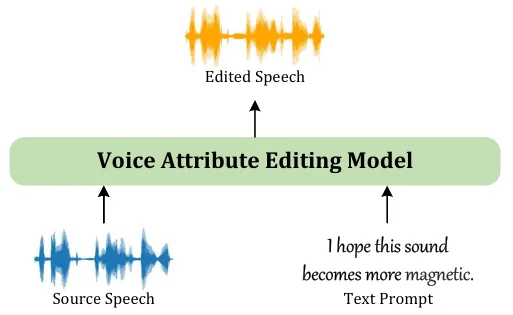
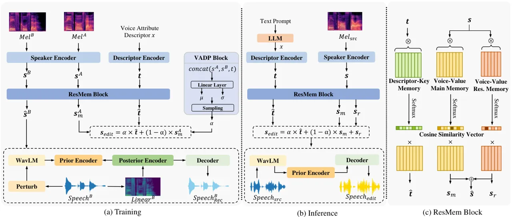
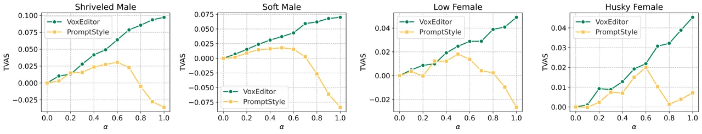
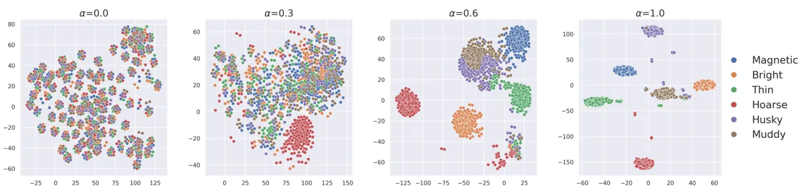

# Voice Attribute Editing with Text Prompt

Corresponding author

Zhengyan Sheng Affiliation: National Engineering Research Center of
Speech and Language Information Processing,  
University of Science and Technology of China, Hefei, China    Yang Ai
Affiliation: National Engineering Research Center of Speech and Language
Information Processing,  
University of Science and Technology of China, Hefei, China    Li-Juan
Liu Affiliation: iFLYTEK Research, Hefei, China    Jia Pan
Affiliation: iFLYTEK Research, Hefei, China    Zhen-Hua Ling
Affiliation: zysheng@mail.ustc.edu.cn, {yangai, zhling}@ustc.edu.cn,  
{ljliu, jiapan}@iflytek.com Affiliation: National Engineering Research
Center of Speech and Language Information Processing,  
University of Science and Technology of China, Hefei, China

###### Abstract

Despite recent advancements in speech generation with text prompt
providing control over speech style, voice attributes in synthesized
speech remain elusive and challenging to control. This paper introduces
a novel task: voice attribute editing with text prompt, with the goal of
making relative modifications to voice attributes according to the
actions described in the text prompt. To solve this task, VoxEditor, an
end-to-end generative model, is proposed. In VoxEditor, addressing the
insufficiency of text prompt, a Residual Memory (ResMem) block is
designed, that efficiently maps voice attributes and these descriptors
into the shared feature space. Additionally, the ResMem block is
enhanced with a voice attribute degree prediction (VADP) block to align
voice attributes with corresponding descriptors, addressing the
imprecision of text prompt caused by non-quantitative descriptions of
voice attributes. We also establish the open-source VCTK-RVA dataset,
which leads the way in manual annotations detailing voice characteristic
differences among different speakers. Extensive experiments demonstrate
the effectiveness and generalizability of our proposed method in terms
of both objective and subjective metrics. The dataset and audio samples
are available on the website ¹¹ 1
[https://anonymous.4open.science/w/VoxEditor_demo-ACL/](https://anonymous.4open.science/w/VoxEditor_demo-ACL/).

## 1 Introduction

Voice characteristics, serving as an expression of the speaker’s
identity, is a crucial component of speech. Effectively controlling
voice characteristics in speech has consistently been a focal point in
research. Voice conversion (VC) Mohammadi and Kain (2017) stands out as
a representative technology that seeks to change the voice
characteristics from a source speaker to a target speaker while
preserving the linguistic content. Traditional VC tasks depend on
reference audio, but finding suitable reference audio is always
challenging, especially for the applications like personalized voice
creation for virtual characters and automatic movie dubbing. Given that
natural language acts as a convenient interface for users to express the
voice attributes, which refer to human perception of voice
characteristics (e.g., "husky", "bright", "magnetic"), using text
prompts Guo et al. (2023); Ji et al. (2023) as guidance is a more viable
approach to flexible voice creation.



Figure 1: Illustration of voice attribute editing with text prompt.

This paper introduces a novel task: voice attribute editing with text
prompt. As shown in Figure 1, given source speech and a text prompt that
describes the desired editing actions, i.e., relative modifications on
specific voice attributes, the task aims to alter the source speech
according to the text prompt while keeping the linguistic content
unchanged. The voice attribute editing task fundamentally differs from
recent speech generation tasks with text prompt Ji et al. (2023);
Watanabe et al. (2023); Yang et al. (2023). These related tasks utilize
text prompt for voice control rather than reference audio, resulting in
speech style (e.g., gender, emotion and rhythm) that roughly matches the
input text prompt, but they lack the ability to finely modify specific
voice attributes. Specific distinctions are outlined in Section 2.1.

The primary two challenges encountered in the voice attribute editing
task are the insufficiency and imprecision of text prompt. First, the
insufficiency refers to the challenge posed by the multi-dimensional
nature of the voice perception space, making it difficult for text
prompt to fully capture all voice characteristics. This difficulty is
exacerbated in the voice attribute editing task that only modifies
specific voice attributes, thus further complicating the establishment
of mapping from the text prompt to corresponding voice attributes.
Second, the imprecision means that we always express our perception of
voice characteristics through qualitative descriptors rather than
relying on quantitative physical descriptors Wallmark and Kendall
(2018). For the voice attribute editing task, this results in ambiguity
when expressing the detailed differences in particular voice attributes
between speakers.

To address the aforementioned challenges, we propose VoxEditor, the
first model to deal with the voice attribute editing task. To tackle the
insufficiency issue, we propose a Residual Memory (ResMem)-based
text-voice alignment module. The ResMem consists of two components: the
main memory, which utilizes trainable slots to quantize the common space
for text and voice characteristics, and the residual memory, which
compensates for challenging-to-describe aspects in voice
characteristics. To address the imprecision issue, the ResMem block is
enhanced with the voice attribute degree prediction (VADP) module,
designed to predict the difference degree of the specific voice
attribute between two speakers. During inference, with the assistance of
a large language model (LLM), we first extract voice attribute
descriptors from the text prompt. Subsequently, we perform semantically
meaningful interpolation between the descriptor embedding and the source
speaker embedding, resulting in the edited speaker embedding for
generating speech.

To facilitate research on the voice attribute editing task, this paper
presents a manually annotated dataset, VCTK-RVA, which annotates
Relative Voice Attribute differences between same-gender speakers based
on the VCTK Veaux et al. (2023) corpus. Initially, speech experts
distilled a descriptor set from a large-scale internal speech dataset to
describe common voice attributes. Then, speech experts conducted
pairwise comparisons of voice characteristics among same-gender speakers
in the open-source VCTK corpus and selected suitable descriptors from
the set to effectively capture the major differences in voice
characteristics.

To validate the effectiveness and generalizability of our method, we
meticulously devised several metrics for the task. Experimental results
show that VoxEditor can generate high-quality speech that align well
with the input text prompt and preserve voice characteristics of the
source speech to some extent. These results highlight the
controllability, generality, and quality of VoxEditor.

We summarize our main contributions as follows. Firstly, we introduce a
new task: voice attribute editing with text prompt. This task enables
users to make relative modifications to voice attributes in source
speech based on the provided text prompt, offering a convenient method
for creating desired voice characteristics. Secondly, we construct the
VCTK-RVA dataset, an open-source resource that pioneers in describing
differences in voice characteristics between speakers. Thirdly,
VoxEditor is proposed for the VE task, which integrates ResMem and VADP
modules to overcome challenges caused by the insufficiency and
imprecision of text prompt.

## 2 Related Work

### 2.1 Speech Generation with Text Prompt

Considering the success of text-guided generation in both text and
images, many recent works have explored speech generation with text
prompt Guo et al. (2023); Leng et al. (2023); Ji et al. (2023). However,
only a few of these works focus on specific aspects of voice
characteristics Shimizu et al. (2023); Zhang et al. (2023); Yao et al.
(2023), primarily addressing speech style factors such as gender,
speaking speed, energy, and emotion.

In the context of methods, these studies commonly incorporated
BERTDevlin et al. (2019) to extract textual embeddings from the input
text prompt and utilized supervised training with reference speech to
establish a mapping from textual embeddings to speaker embeddings.
Prompttts2 Leng et al. (2023) introduced Diffusion Ho et al. (2020)
sampling to mitigate the insufficiency of text prompt. Nevertheless, the
diversity achieved during inference remains both elusive and beyond
control. The proposed VoxEditor employs the ResMem and VADP blocks to
address the insufficiency and imprecision issues of text prompt,
allowing users to relatively modify the target voice attribute.

Several speech datasets Ji et al. (2023); Watanabe et al. (2023); Yang
et al. (2023) enriched with text prompt have also been established.
These datasets provided the individual text descriptions of speech style
for each speech sample, which failed to convey the detailed differences
in voice attributes between speakers and were unsuitable for the voice
attribute editing task. In contrast, relative attribute annotations in
the VCTK-RVA dataset allow the speech to be ranked across various voice
attributes, facilitating alignment between independent voice attributes
and the corresponding descriptors.

| Descriptor  | Freq. | Descriptor | Freq. |
| ----------- | ----- | ---------- | ----- |
| Bright      | 17.10 | Thin       | 13.03 |
| Coarse      | 11.62 | Slim       | 11.31 |
| Low         | 7.43  | Pure       | 5.48  |
| Rich        | 4.71  | Magnetic   | 3.64  |
| Muddy       | 3.59  | Hoarse     | 3.32  |
| Round       | 2.48  | Flat       | 2.15  |
| Shrill      | 2.08  | Shriveled  | 1.74  |
| Muffled     | 1.44  | Soft       | 0.82  |
| Transparent | 0.66  | Husky      | 0.59  |

Table 1: The descriptor set is used for describing the common voice
attributes, and the Freq. represent frequency (%) of each descriptor in
VCTK-RVA.

### 2.2 Memory Network

Memory Network Weston et al. (2015) incorporates a long-term memory
module with the ability to be both read from and written to. Recently,
Key-value memory has been employed for cross-modal alignment across
various tasks Chen et al. (2021); Sheng et al. (2023). However, these
methods often neglect the information gap between different modalities.
Given the insufficiency issue of text prompt, we propose the ResMem
block to bridge the gap between the text prompt and voice
characteristics.

## 3 VCTK-RVA Dataset

### 3.1 Descriptors for Voice Attributes

To construct a dataset suitable for the voice attribute editing task,
manual annotations are necessary to express voice perception. However,
systematic research on the voice perception space is currently lacking.
Therefore, for practicality, we adopt a descriptor set to describe the
differences in voice characteristics among speakers. Here, the
descriptor set refers to the keywords commonly used in natural language
to describe voice characteristics. In terms of engineering
implementation, the descriptor set should be concise and cover the most
commonly used voice characteristic descriptions.

Specifically, we engaged 10 speech experts with professional backgrounds
in acoustic research to describe the voice characteristics of 1500
speakers based on internal 26-hour recordings in natural language. Then
we merged synonyms of keywords in these descriptions and summarized the
descriptor set based on word frequency statistics, as shown in Table 1.



Figure 2: The overall flowchart of our proposed VoxEditor. During the
training process, two speech segments ($`Speech^{A}`$ and
$`Speech^{B}`$) are used, along with voice attribute descriptor $`x`$.
In the inference process, the model takes source speech and the text
prompt as inputs to generate edited speech. Here $`Mel`$ denotes the Mel
spectrograms, $`Linear`$ denotes the linear spectrograms, $`\bm{s}_{m}`$
demotes the recalled main speaker embeddings, $`\bm{s}_{r}`$ denotes the
recalled residual speaker embeddings and $`\hat{\bm{s}}`$ denotes the
recalled speaker embeddings.

### 3.2 Voice Attribute Annotations

We choose the publicly available VCTK (version 0.92) dataset Veaux
et al. (2023), which has been widely utilized in VC and text-to-speech
studies, as the materials for annotation. The VCTK dataset consists of
speech sentences of 110 speakers, including 62 females and 48 males.
Each speaker utters approximately 400 sentences in a reading style,
resulting in a total of 43,475 sentences.

We hired four speech experts to conduct pairwise comparisons of voice
characteristics of same-gender speakers. When presented with speech
samples from $`SpeakerA`$ and $`SpeakerB`$, speech experts listened to
the samples to identify the differences in voice attributes between
these two speakers. Subsequently, these experts selected an unrestricted
number of descriptors $`\bm{v}`$ from the descriptor set built in
Section 3.1 to express that $`SpeakerB`$ exhibits more prominent voice
attributes $`\bm{v}`$ when compared to $`SpeakerA`$. This forms an
annotated tuple, $`\{SpeakerA,SpeakerB,\bm{v}\}`$, where
$`\bm{v}\in D\cup\text{"Similar"}`$, with $`D`$ representing the
descriptor set and "Similar" indicating that speech experts perceived
the voice characteristics of two speakers as highly similar. In cases of
annotation discrepancies, experts engaged in discussions to reach a
final consensus. The current annotation only considers a one-way form,
highlighting the more prominent voice attributes and not annotating the
diminished voice attributes. Overall, through same-gender pairwise
comparisons among 62 male and 48 female speakers, we collected a total
of $`62\times 61+48\times 47=6038`$ annotated data points. In the entire
dataset, the percentages of $`\bm{v}`$ corresponding to one, two, and
three descriptors are 71.19%, 26.84%, and 1.97%, respectively. The
"Similar" label accounts for 6.81 %.

We randomly selected 200 annotated samples and uploaded them on Amazon
Mechanical Turk (AMT), inviting ordinary individuals to evaluate the
annotations. Specifically, we provided multiple speech samples from two
speakers along with our voice attribute annotations. Listeners were
instructed to listen to the speech using headphones and determine
whether they agreed with our annotations. A total of 40 listeners from
AMT participated in the test, and their average agreement rate reached
an impressive 91.78 %.

## 4 VoxEditor

### 4.1 Overall Architecture

Our proposed VoxEditor adopts the end-to-end auto-encoder paradigm Li
et al. (2023), that decomposes speech into content and speaker
embeddings, subsequently re-synthesizing the content and edited speaker
embeddings into new speech. As shown in Figure 2 (b), during inference,
the LLM initially analyzes the input text prompt to obtain a specific
descriptor indicating the desired voice attribute for modification.
Subsequently, the descriptor embedding and speaker embedding are
extracted from the descriptor and the Mel spectrograms of the source
speech using a descriptor encoder and a speaker encoder. These
embeddings are then input into the ResMem block (described in Section
4.2), and the output is combined through linear interpolation to derive
the edited speaker embeddings. Simultaneously, the pretrained WavLM Chen
et al. (2022) and prior encoder are employed to extract the content
embedding from source speech. Finally, the content and speaker
embeddings are fed into the decoder, which generates the edited speech.
It is worth noting that when the text prompt contains multiple voice
attribute descriptors, the source speech needs to be edited sequentially
based on these descriptors.

During training, VoxEditor is provided with an annotated tuple
$`\{SpeakerA,SpeakerB,\bm{v}\}`$. As shown in Figure 2 (a), it takes
speech segments $`Speech^{A}`$ and $`Speech^{B}`$, along with a randomly
selected voice attribute descriptor $`x\in\bm{v}`$, as input. These
speech segments are randomly segmented from the respective speaker’s
speech. In addition to the mentioned modules, the VADP block (described
in Section 4.3) is employed to predict the difference degree of the
specific voice attribute between two speakers. Other model modules and
the autoencoder training strategy follow FreeVC Li et al. (2023), which
adopts variational inference augmented with a normalizing flow and an
adversarial training process. Further details about the perturb-based
data augmentation, prior encoder, posterior encoder and pretraining
strategy can be found in Appendix A.

### 4.2 ResMem Block

Considering the insufficiency issue of text prompt, we employ a ResMem
block to establish a mapping between voice attributes and their
corresponding descriptors within the same feature space. Illustrated in
Figure 2(c), the ResMem module accepts either the speaker embedding
$`{\bm{s}\in\mathbb{R}^{D}}`$ or the descriptor embedding
$`{\bm{t}\in\mathbb{R}^{D}}`$ as input, where $`{\bm{s}}`$ and
$`{\bm{t}}`$ are derived from the pretrained speaker encoder and the
descriptor encoder, respectively, and $`D`$ represents the dimension of
descriptor or speech embeddings. The ResMem block is composed of a main
voice-value memory $`\bm{M}_{mv}\in\mathbb{R}^{M\times D}`$, a residual
voice-value memory $`\bm{M}_{rv}\in\mathbb{R}^{N\times D}`$ and a
descriptor-key memory $`{\bm{M}_{k}\in\mathbb{R}^{M\times D}}`$, where
$`M`$ denotes the number of the slots in $`{\bm{M}_{mv}}`$ and
$`{\bm{M}_{k}}`$, $`N`$ denotes the number of slots in $`{\bm{M}_{rv}}`$
and $`D`$ is the dimension for each slot, which equals to the dimension
of the descriptor and speaker embeddings.

$`{\bm{M}_{mv}}`$ is designed to capture the main voice characteristics
that can be articulated with voice descriptors, while $`{\bm{M}_{rv}}`$
is utilized to address aspects of voice characteristics that are
challenging to describe in text. Specifically, when a speaker embedding
$`{\bm{s}}`$ is given as a query, the cosine similarity between the
query and each slot in $`{\bm{M}_{mv}}`$ is computed, followed by
softmax normalization function, expressed as follows,

```math
w_{mv}^{i}=softmax(\frac{\bm{s}^{\top}\bm{m}_{mv}^{i}}{\left\|\bm{s}\right\|_{2}\left\|\bm{m}_{mv}^{i}\right\|_{2}}), \tag{1}
```

where $`\bm{m}_{mv}^{i}`$ denotes the $`i`$-th slot in $`{\bm{M}_{mv}}`$
and $`w_{mv}^{i}`$ represents the degree of relevance between the
$`\bm{m}_{mv}^{i}`$ and the speaker embedding $`{\bm{s}}`$. We then
obtain the cosine similarity vector
$`{\bm{w}_{mv}}=[w_{mv}^{1},w_{mv}^{2},\cdots,w_{mv}^{M}]^{\top}\in\mathbb{R}^{M}`$
by computing cosine similarity with all slots. Next, we generate the
recalled main speaker embedding as follows,

```math
\hat{\bm{s}}_{m}=\bm{M}_{mv}^{\top}\bm{w}_{mv}. \tag{2}
```

Similarly, we generate the recalled residual speaker embedding as
follows,

```math
w_{rv}^{j}=softmax(\frac{\bm{s}^{\top}\bm{m}_{rv}^{j}}{\left\|\bm{s}\right\|_{2}\left\|\bm{m}_{rv}^{j}\right\|_{2}}), \tag{3}
```

```math
\bm{w}_{rv}=[w_{rv}^{1},w_{rv}^{2},\cdots,w_{rv}^{N}]^{\top}\in\mathbb{R}^{N}, \tag{4}
```

```math
\hat{\bm{s}}_{r}=\bm{M}_{rv}^{\top}\bm{w}_{rv}, \tag{5}
```

where $`\bm{m}_{rv}^{j}`$ denotes the $`j`$-th slot in
$`{\bm{M}_{rv}}`$. Then, we obtain the recalled speaker embedding
$`\hat{\bm{s}}`$ and calculate the mean square error (MSE) between
$`\bm{s}`$ and $`\hat{\bm{s}}`$ as well as the MSE between $`\bm{s}`$
and $`\hat{\bm{s}}_{m}`$.

```math
\hat{\bm{s}}=\hat{\bm{s}}_{m}+\hat{\bm{s}}_{r}, \tag{6}
```

```math
\mathcal{L}_{rec}=\|\bm{s}-\hat{\bm{s}}\|_{2}^{2}+\|\bm{s}-\hat{\bm{s}}_{m}\|_{2}^{2}. \tag{7}
```

In this manner, the slots within the $`{\bm{M}_{mv}}`$ and
$`{\bm{M}_{rv}}`$ can serve as foundational vectors for constructing the
entire voice characteristics space, allowing for various combinations of
these slots to represent a wide range of voices.

Then, we utilize the slots in $`\bm{M}_{mv}`$ as a streamlined bridge to
map descriptor embeddings onto the voice space. In detail, given the
descriptor embedding $`\bm{t}`$, we generate the recalled descriptor
embedding $`\hat{\bm{t}}`$ in a similar way as the recalled main speaker
embedding as follows,

```math
w_{t}^{i}=softmax(\frac{\bm{t}^{\top}\bm{m}_{k}^{i}}{\left\|\bm{t}\right\|_{2}\left\|\bm{m}_{k}^{i}\right\|_{2}}), \tag{8}
```

```math
\bm{w}_{t}=[w_{t}^{1},w_{t}^{2},\cdots,w_{t}^{M}]^{\top}\in\mathbb{R}^{M}, \tag{9}
```

```math
\hat{\bm{t}}=\bm{M}_{mv}^{\top}\bm{w}_{t}, \tag{10}
```

where $`m_{k}^{i}`$ denotes the $`i`$-th slot in $`\bm{M}_{k}`$, cosine
similarity is calculated with the slots in the descriptor-key memory
$`{\bm{M}_{k}}`$ and aligned with the main voice-value memory
$`{\bm{M}_{mv}}`$. In this way, descriptor embeddings are mapped to the
main voice characteristics space, with the slots in $`\bm{M}_{mv}`$
serving as the basis vectors.

### 4.3 VADP Block

Considering the imprecision inherent in text prompt, we propose the VADP
block, designed to predict the difference degree of the specific voice
attribute between two speakers. Voice characteristics can exhibit local
variations Zhou et al. (2022) due to factors such as content, rhythm,
and emotion. Therefore, we assume that the differences in voice
attributes between different speech samples from two speakers are not
deterministic but follows a Gaussian distribution.

As shown in Figure 2(a), given the speaker embedding $`{\bm{s}^{A}}`$
from $`Speech^{A}`$, speaker embedding $`{\bm{s}^{B}}`$ from
$`Speech^{B}`$ and descriptor embedding $`t`$, we concatenate three
embeddings to obtain a cross-modal embedding, We then use linear layers
and ReLU activation functions to predict the mean and variance of a
Gaussian distribution. Subsequently, we sample from this Gaussian
distribution to obtain the difference degree of specific voice
attributes, which we map through a sigmoid activation function to derive
the editing degree $`\alpha\in[0,1]`$. Similar to Imagic Kawar et al.
(2023), we linearly interpolate between the recalled descriptor
embedding $`\hat{\bm{t}}`$ and the recalled main speaker embedding
$`\hat{\bm{s}}_{m}^{A}`$ from $`Speech^{A}`$ to derive the edited
speaker embedding $`{\bm{s}_{edit}}`$,

```math
{\bm{s}_{edit}}=\alpha\cdot\hat{\bm{t}}+(1-\alpha)\cdot\hat{\bm{s}}_{m}^{A}. \tag{11}
```

Additionally, we align the slot-weights distributions between the
recalled main speaker embedding $`\hat{\bm{s}}_{m}^{B}`$ and
$`{\bm{s}_{edit}}`$ using Kullback-Leibler (KL) divergence,

```math
\mathcal{L}_{align}=D_{KL}(\bm{w}_{mv}^{B}||\alpha\cdot\bm{w}_{t}+(1-\alpha)\cdot\bm{w}_{mv}^{A}), \tag{12}
```

where $`\bm{w}_{mv}^{A}`$ and $`\bm{w}_{mv}^{B}`$ denote the cosine
similarity vectors in the main voice-value memory $`{\bm{M}_{mv}}`$ for
$`Speech^{A}`$ and $`Speech^{B}`$, respectively. In this way, we
explicitly align the voice attributes with their corresponding
descriptors.

### 4.4 Speaker Embedding Editing

As shown in Figure. 2(b), we utilize a LLM (GPT-3.5-TURBO) to scrutinize
the input text prompt and extract target voice attribute descriptors. In
cases where the descriptor is absent from the set, the LLM is employed
to locate the closest matching descriptor within the set for
substitution. For further elucidation, please refer to Appendix B. Next,
we input both the target voice attribute descriptor and source speech to
obtain the recalled descriptor embedding $`\hat{\bm{t}}`$, recalled main
speaker embedding $`\hat{\bm{s}}_{m}`$ and recalled residual speaker
embedding $`\hat{\bm{s}}_{r}`$. Subsequently, we achieve edited speaker
embedding through linear interpolation,

```math
{\bm{s}_{edit}}=\alpha\cdot\hat{\bm{t}}+(1-\alpha)\cdot\hat{\bm{s}}_{m}+\hat{\bm{s}}_{r}, \tag{13}
```

where the value of editing degree $`\alpha`$ is initially set to its
recommended value 0.7 (refer to Figure 5). The editing degree can be
further adjusted within the range $`[0,1]`$, and increasing $`\alpha`$
will progressively enhance the prominence of the target voice attribute.

## 5 Experiments

### 5.1 Implementation Details

Our experiments were conducted using the VCTK-RVA dataset, consisting of
98 speakers for both the training and validation sets. Among these, 200
sentences were randomly selected for validation, while the remaining
sentences were utilized for training. For testing, speech samples were
categorized into two sets: the seen speaker set, comprising speakers
from the training set, and the unseen speaker set, consisting of
speakers not encountered during training. Each set comprised 12
speakers, each contributing three sentences. During the evaluation,
source speech underwent voice attribute editing for each voice attribute
in the descriptor set, with $`\alpha`$ varying from 0 to 1 in increments
of 0.1. We devised 10 predefined sentence patterns, such as "I want this
sound to become more \[Descriptor\]". For each edit, a sentence pattern
was randomly chosen, and \[Descriptor\] was replaced with the target
voice attribute descriptor to form the text prompt.

All speech samples were downsampled to 16k Hz. Linear spectrograms and
80-band Mel spectrograms were computed using a short-time Fourier
transform (STFT) with FFT, window, and hop sizes set to 1280, 1280, and
320, respectively. The dimensions of descriptor embeddings, speaker
embeddings and slots were equal to $`D=256`$. The numbers of slots in
the ResMem Block were set to $`M=32`$ and $`N=4`$. We put more
information about $`M`$ and $`N`$ in Appendix C.

|                |        |         |          |          |        |         |          |          |
| -------------- | ------ | ------- | -------- | -------- | ------ | ------- | -------- | -------- |
| Model          | Seen   |         |          |          | Unseen |         |          |          |
|                | TVAS   | MOS-Nat | MOS-Cons | MOS-Corr | TVAS   | MOS-Nat | MOS-Cons | MOS-Corr |
| PromptStyle    | 0.0089 | 3.9200  | 2.0542   | 2.0321   | 0.0047 | 3.9112  | 1.9914   | 2.5532   |
| VoxEditor      | 0.0574 | 3.9147  | 3.5333   | 3.7100   | 0.0561 | 3.9077  | 3.4701   | 3.7036   |
| w/o Voice Res. | 0.0559 | 3.9194  | 3.4942   | 3.4739   | 0.0553 | 3.9069  | 3.4586   | 3.4357   |
| w/o ResMem     | 0.0102 | 3.8906  | 2.1142   | 2.1934   | 0.0098 | 3.9073  | 2.3038   | 2.6086   |
| w/o VADP       | 0.0526 | 3.9146  | 3.4342   | 3.6967   | 0.0504 | 3.9105  | 3.3176   | 3.6786   |

Table 2: Objective and subjective evaluation results of comparison
methods. The definitions of all metrics can be found in Section 5.2.



Figure 3: The variation of the TAVS metric for generated speech edited
with different attributes under various values of editing degree
$`\alpha`$.

### 5.2 Metrics

#### Objective Metrics

To objectively assess whether the edited voice characteristics align
with the text prompt, we introduced Target Voice Attribute Similarity
(TVAS) metrics. Since there were no target speakers, we statistically
derived reference speakers for each gender corresponding to each voice
attribute. Specifically, a speaker occurring as the $`SpeakerB`$ in an
annotated tuple $`\{SpeakerA,SpeakerB,\bm{v}\}`$ was defined as one of
the reference speakers for the descriptor $`x`$, where $`x\in\bm{v}`$.
We traversed the entire dataset to obtain the reference weight
$`\eta_{x}^{j}=\frac{occ_{j}}{number_{x}}`$ of the $`j`$-th reference
speaker of voice attribute $`x`$, where $`j\in[1,k]`$, $`k`$ was the
number of reference speakers of the voice attribute $`x`$, $`{occ_{j}}`$
represented the occurrence number of the $`j`$-th reference speaker of
voice attribute $`x`$ and $`number_{x}`$ was the total occurrence number
of voice attribute $`x`$. A higher reference weight indicated a more
prominent voice attribute of the reference speaker. Additionally, we
applied the well-known open-source speaker verification toolkit,
WeaSpeaker²² 2 https://github.com/wenet-e2e/wespeaker, to extract
speaker embeddings of edited speech and obtain mean speaker embeddings
of each reference speaker. When source speech was edited with target
voice attribute $`x`$, we calculated the cosine similarity scores
$`o^{j}`$ between the speaker embeddings of edited speech and the mean
speaker embedding of the $`j`$-th reference speaker of the attribute
$`x`$. Then all cosine similarity scores were weighted with
corresponding reference weight, resulting in the Absolute Target Voice
Attribute Similarity metrics under difference value of $`\alpha`$
($`\text{ATVAS}_{\alpha}=\sum_{j=1}^{j=k}o^{j}\cdot\eta_{x}^{j}`$).
Then, to better focus on the relative change of voice attribute
similarities, we calculated the TVAS metrics with varying editing degree
$`\alpha`$,
$`\text{TVAS}_{\alpha}=\text{ATVAS}_{\alpha}-\text{ATVAS}_{0}`$, and
averaged $`\text{TVAS}_{\alpha}`$ over all $`\alpha`$ to obtain the
final TVAS metric for editing a source speech sample on the target voice
attribute.

#### Subjective Metrics

We employed three mean opinion scores to assess various aspects of the
generated speech: speech naturalness (MOS-Nat), descriptor-voice
consistency (MOS-Cons), and correlation between source and generated
speech (MOS-Corr). MOS-Nat quantitatively measured the naturalness of
the generated speech, with scores ranging from 1 (completely unnatural)
to 5 (completely natural). MOS-Cons evaluated the consistency between
the voice characteristics of the generated speech and the text prompt,
with scores ranging from 1 (completely inconsistent) to 5 (completely
consistent). Additionally, when the editing degree approaches 1, the
generated speech should still retain some voice characteristics of the
source speech. Therefore, MOS-Corr was introduced to assess the voice
characteristics similarity between the generated speech and source
speech when the editing degree approaches 1, with the score ranging from
1 (completely unrelated voice) to 5 (very similar voice). 100 generated
speech samples covering each voice attribute were randomly selected for
each subjective evaluation. Three subjective metrics were evaluated on
the AMT platform, and 20 listeners participated in the test each time.

### 5.3 Evaluation Results

As pioneers in addressing the voice attribute editing task with no
existing comparable methods, we conducted a thorough comparative
analysis of our proposed method against the following baseline and
ablation models to evaluate its effectiveness: (1) PromptStyle Liu
et al. (2023): We utilized its style embedding generation module to
replace the edited speaker embedding generation module in VoxEditor.
Specifically, the original prompt encoder was modified to a speaker
encoder and a descriptor encoder. MSE loss was employed to minimize the
distance between $`\bm{s}^{A}+\bm{t}`$ and $`\bm{s}^{B}`$. (2) w/o Voice
Res., (3) w/o ResMem, (4)w/o VADP. More details about these ablation
models can be found in Appendix D. All objective and subjective
evaluation results are summarized in Table. 2.



Figure 4: The t-SNE visualization of the speaker embeddings extracted
from generated speech edited with different attributes under various
values of $`\alpha`$.

We can observe that VoxEditor outperformed other methods significantly
in all metrics ($`{p<0.05}`$ in paired t-tests) except for MOS-Nat. When
the ResMem block was not utilized (PromptStyle and w/o ResMem), the
model’s performance sharply declined. This is attributed to the
inability to effectively align the voice attributes with their
corresponding descriptors. Furthermore, the TVAS metric for same-gender
speakers with different editing degrees $`\alpha`$ is illustrated in
Figure 3. We noticed that as $`\alpha`$ increases, the speech generated
by our method became increasingly prominent in the specified voice
attributes. In contrast, for the PromptStyle method, the direction of
editing was not consistent with the specified voice attributes.

We found that the performance of the w/o Voice Res. was comparable to
that of our method in terms of TVAS and MOS-Cons, but there was a
significant difference in MOS-Corr. For same-gender speakers, the voice
characteristics of the generated speech by w/o Voice Res. were very
similar when edited in the same voice attribute with $`\alpha`$
approaching 1, and the correlation in voice characteristics between the
generated speech and the source speech was almost nonexistent. The
removal of the VADP block prevented the model from modelling refined
edited speaker embeddings during training, resulting in compromised
descriptor embeddings. Consequently, during inference, even when the
editing degree approached 1, the edited voice attributes were not
prominent enough, leading to a decrease in the TVAS and MOS-Cons scores.
In addition, since these methods follow the same auto-encoder paradigm,
their performance in terms of MOS-Nat was quite comparable.

### 5.4 Visual Analysis

We randomly selected an additional set of 100 utterances from an unseen
speaker and visualized the speaker embeddings of the generated speech
edited with different voice attributes through t-SNE Chan et al. (2019),
as shown in Figure 4. We observed that, as the editing degree $`\alpha`$
increased, generated speech edited with the same target voice attribute
gradually formed distinct clusters, which demonstrated the stability of
our method. Additionally, due to variations in the number of voice
attribute annotations and differences in the prominence of voice
attributes, there were variations in the editing performance of
different voice attributes. When $`\alpha`$ equalled 0.3, the speech
edited on the "Hoarse" attribute already exhibited clear voice features,
forming clusters, while generated speech edited with other voice
attributes predominantly retained the voice characteristics of the
source speech.

### 5.5 User Study

While the optimal value for editing degree $`\alpha`$ may vary depending
on different requirements, we aim to determine the optimal editing range
for $`\alpha`$. The ideal voice attribute editing should involve a
change toward the specified voice attribute direction while still
preserving some voice characteristics of the source speaker. To this
end, we selected an additional 100 speech samples from unseen speakers
and performed editing with weights $`\alpha`$ ranging from 0 to 1 across
various attributes. We evaluated the MOS-Cons and Mos-Corr scores of all
generated speech and show the average results in Figure 5.

Figure 5: MOS-Cons and MOS-Corr scores with varying editing degrees
$`\alpha`$. Edited speech tend to match both the source speech and text
prompt in the highlighted area.

We observed that when the editing degree was less than 0.4, the
generated speech closely resembled the source speech, and the editing
had a small impact. For $`\alpha\in[0.6,0.8]`$, the generated speech
aligned well with the text prompt while also preserving the some voice
characteristics of source speech. However, when the weight exceeded 0.8,
there was a significant decrease in the similarity of voice
characteristics between the generated speech and the source speech.
Therefore, we considered the optimal editing range to be between 0.6 and
0.8, setting the recommended value of $`\alpha`$ to 0.7.

## 6 Conclusion

In this work, we proposed VoxEditor, the first voice attribute editing
model with text prompt. Built upon an auto-encoder framework, we propose
the ResMem and VADP blocks to effectively align voice attributes and the
corresponding descriptors, facilitating quantifiable editing of speaker
embeddings. Through experiments, we showcase the performance and
generalization capability of VoxEditor on both seen and unseen speakers.
Experimental results demonstrate that, with an appropriate editing
degree, the generated speech not only meets the requirements of the text
prompt but also retains the voice characteristics of source speech.

## Limitations

There are still limitations in data annotation and pre-training model
aspects. In terms of data annotation, we only annotated the prominent
voice attributes during pairwise comparisons of the speaker’s voice
characteristics, while disregarding those diminished voice attributes.
Those diminished voice attributes may be described by the text prompts
such as "I hope this sound becomes less magnetic". If bidirectional
annotations can be established, the model would also gain the capability
for bidirectional voice attribute editing, thereby enhancing its overall
performance. Additionally, the number of annotated speakers in our
dataset remains limited. Consequently, for descriptors with low
frequency in the dataset, the corresponding voice attribute editing
overly relies on a few specific speakers, thereby constraining the
model’s performance. In the future, we plan to explore automatic
annotation models for voice characteristics, facilitating efficient
dataset expansion. Furthermore, constrained by the zero-shot capability
of the pre-trained VC network, VoxEditor exhibits slightly lower
performance on the MOS-Cons and MOS-Corr metrics under unseen conditions
compared to seen conditions. Therefore, scaling up our pretrained model
will be our future work to further enhance performance.

## References

- Chan et al. (2019) David M. Chan, Roshan Rao, Forrest Huang, and
  John F. Canny. 2019. [GPU accelerated t-distributed stochastic
  neighbor embedding](https://doi.org/10.1016/J.JPDC.2019.04.008). _J.
  Parallel Distributed Comput._, 131:1–13.
- Chen et al. (2022) Sanyuan Chen, Chengyi Wang, Zhengyang Chen, Yu Wu,
  Shujie Liu, Zhuo Chen, Jinyu Li, Naoyuki Kanda, Takuya Yoshioka, Xiong
  Xiao, Jian Wu, Long Zhou, Shuo Ren, Yanmin Qian, Yao Qian, Jian Wu,
  Michael Zeng, Xiangzhan Yu, and Furu Wei. 2022. [Wavlm: Large-scale
  self-supervised pre-training for full stack speech
  processing](https://doi.org/10.1109/JSTSP.2022.3188113). _IEEE J. Sel.
  Top. Signal Process._, 16(6):1505–1518.
- Chen et al. (2021) Zhihong Chen, Yaling Shen, Yan Song, and Xiang
  Wan. 2021. [Cross-modal memory networks for radiology report
  generation](https://doi.org/10.18653/V1/2021.ACL-LONG.459). In
  _Proceedings of the 59th Annual Meeting of the Association for
  Computational Linguistics and the 11th International Joint Conference
  on Natural Language Processing, ACL/IJCNLP 2021, (Volume 1: Long
  Papers), Virtual Event, August 1-6, 2021_, pages 5904–5914.
  Association for Computational Linguistics.
- Desplanques et al. (2020) Brecht Desplanques, Jenthe Thienpondt, and
  Kris Demuynck. 2020. [ECAPA-TDNN: emphasized channel attention,
  propagation and aggregation in TDNN based speaker
  verification](https://doi.org/10.21437/INTERSPEECH.2020-2650). In
  _Interspeech 2020, 21st Annual Conference of the International Speech
  Communication Association, Virtual Event, Shanghai, China, 25-29
  October 2020_, pages 3830–3834. ISCA.
- Devlin et al. (2019) Jacob Devlin, Ming-Wei Chang, Kenton Lee, and
  Kristina Toutanova. 2019. [BERT: pre-training of deep bidirectional
  transformers for language
  understanding](https://doi.org/10.18653/V1/N19-1423). In _Proceedings
  of the 2019 Conference of the North American Chapter of the
  Association for Computational Linguistics: Human Language
  Technologies, NAACL-HLT 2019, Minneapolis, MN, USA, June 2-7, 2019,
  Volume 1 (Long and Short Papers)_, pages 4171–4186. Association for
  Computational Linguistics.
- Guo et al. (2023) Zhifang Guo, Yichong Leng, Yihan Wu, Sheng Zhao, and
  Xu Tan. 2023. [Prompttts: Controllable text-to-speech with text
  descriptions](https://doi.org/10.1109/ICASSP49357.2023.10096285). In
  _IEEE International Conference on Acoustics, Speech and Signal
  Processing ICASSP 2023, Rhodes Island, Greece, June 4-10, 2023_, pages
  1–5. IEEE.
- Ho et al. (2020) Jonathan Ho, Ajay Jain, and Pieter Abbeel. 2020.
  [Denoising diffusion probabilistic
  models](https://proceedings.neurips.cc/paper/2020/hash/4c5bcfec8584af0d967f1ab10179ca4b-Abstract.html).
  In _Advances in Neural Information Processing Systems 33: Annual
  Conference on Neural Information Processing Systems 2020, NeurIPS
  2020, December 6-12, 2020, virtual_.
- Ji et al. (2023) Shengpeng Ji, Jialong Zuo, Minghui Fang, Ziyue Jiang,
  Feiyang Chen, Xinyu Duan, Baoxing Huai, and Zhou Zhao. 2023.
  [Textrolspeech: A text style control speech corpus with codec language
  text-to-speech models](https://doi.org/10.48550/ARXIV.2308.14430).
  _CoRR_, abs/2308.14430.
- Kawar et al. (2023) Bahjat Kawar, Shiran Zada, Oran Lang, Omer Tov,
  Huiwen Chang, Tali Dekel, Inbar Mosseri, and Michal Irani. 2023.
  [Imagic: Text-based real image editing with diffusion
  models](https://doi.org/10.1109/CVPR52729.2023.00582). In _IEEE/CVF
  Conference on Computer Vision and Pattern Recognition, CVPR 2023,
  Vancouver, BC, Canada, June 17-24, 2023_, pages 6007–6017. IEEE.
- Kong et al. (2020) Jungil Kong, Jaehyeon Kim, and Jaekyoung Bae. 2020.
  [Hifi-gan: Generative adversarial networks for efficient and high
  fidelity speech
  synthesis](https://proceedings.neurips.cc/paper/2020/hash/c5d736809766d46260d816d8dbc9eb44-Abstract.html).
  In _Advances in Neural Information Processing Systems 33: Annual
  Conference on Neural Information Processing Systems 2020, NeurIPS
  2020, December 6-12, 2020, virtual_.
- Leng et al. (2023) Yichong Leng, Zhifang Guo, Kai Shen, Xu Tan, Zeqian
  Ju, Yanqing Liu, Yufei Liu, Dongchao Yang, Leying Zhang, Kaitao Song,
  Lei He, Xiang-Yang Li, Sheng Zhao, Tao Qin, and Jiang Bian. 2023.
  [Prompttts 2: Describing and generating voices with text
  prompt](https://doi.org/10.48550/ARXIV.2309.02285). _CoRR_,
  abs/2309.02285.
- Li et al. (2023) Jingyi Li, Weiping Tu, and Li Xiao. 2023. [Freevc:
  Towards high-quality text-free one-shot voice
  conversion](https://doi.org/10.1109/ICASSP49357.2023.10095191). In
  _IEEE International Conference on Acoustics, Speech and Signal
  Processing ICASSP 2023, Rhodes Island, Greece, June 4-10, 2023_, pages
  1–5. IEEE.
- Liu et al. (2023) Guanghou Liu, Yongmao Zhang, Yi Lei, Yunlin Chen,
  Rui Wang, Zhifei Li, and Lei Xie. 2023. [Promptstyle: Controllable
  style transfer for text-to-speech with natural language
  descriptions](https://doi.org/10.48550/ARXIV.2305.19522). _CoRR_,
  abs/2305.19522.
- Mohammadi and Kain (2017) Seyed Hamidreza Mohammadi and Alexander
  Kain. 2017. [An overview of voice conversion
  systems](https://doi.org/10.1016/J.SPECOM.2017.01.008). _Speech
  Commun._, 88:65–82.
- Sheng et al. (2023) Zhengyan Sheng, Yang Ai, Yan-Nian Chen, and
  Zhen-Hua Ling. 2023. [Face-driven zero-shot voice conversion with
  memory-based face-voice
  alignment](https://doi.org/10.1145/3581783.3613825). In _Proceedings
  of the 31st ACM International Conference on Multimedia, MM 2023,
  Ottawa, ON, Canada, 29 October 2023- 3 November 2023_, pages
  8443–8452. ACM.
- Shimizu et al. (2023) Reo Shimizu, Ryuichi Yamamoto, Masaya Kawamura,
  Yuma Shirahata, Hironori Doi, Tatsuya Komatsu, and Kentaro
  Tachibana. 2023. [Prompttts++: Controlling speaker identity in
  prompt-based text-to-speech using natural language
  descriptions](https://doi.org/10.48550/ARXIV.2309.08140). _CoRR_,
  abs/2309.08140.
- Veaux et al. (2023) Christophe Veaux, Junichi Yamagishi, and Kirsten
  MacDonald. 2023. [Cstr vctk corpus: English multi-speaker corpus for
  cstr voice cloning
  toolkit](https://datashare.ed.ac.uk/handle/10283/3443).
- Wallmark and Kendall (2018) Zachary Wallmark and Roger A
  Kendall. 2018. [Describing sound: The cognitive linguistics of
  timbre](https://d1wqtxts1xzle7.cloudfront.net/57886949/Wallmark___Kendall_OH_-_2019-libre.pdf?1543544045=&response-content-disposition=inline%3B+filename%3DDescribing_Sound_The_Cognitive_Linguisti.pdf&Expires=1707921528&Signature=GgnOdrrm2xtQ8sriRB3Z2IqIKx8dWjfXgy1FQGDcab0JcOIeRPCYeLrJGGbovcsAqGjTKxuvvTJlscAaYhKI6W34VSirMDQbnNEASm55AhxUBwLVk1JEh8GMTZum-dgkuJ7QZ-VAu6YIZgcHUhhdCDdtXv66IMPSgyNzlWtnFbU~xUXsZjJrM0z4C1vYmfhk8FX59PQ5nzMwU6YB1lv2onAFYM58DG-BEpVM4oURWygFSIPs7qnS6ge~3QRpUzCJme5lItYwZH8EotVzVHk0fiiQJyvHZkbVSIDHfSH52tpIYkP3pAHFPqzUMxwSKDmZXM5VBrWXhwTnOVedcwP5ew__&Key-Pair-Id=APKAJLOHF5GGSLRBV4ZA).
- Watanabe et al. (2023) Aya Watanabe, Shinnosuke Takamichi, Yuki Saito,
  Wataru Nakata, Detai Xin, and Hiroshi Saruwatari. 2023. [COCO-NUT:
  corpus of japanese utterance and voice characteristics description for
  prompt-based
  control](https://doi.org/10.1109/ASRU57964.2023.10389693). In _IEEE
  Automatic Speech Recognition and Understanding Workshop, ASRU 2023,
  Taipei, Taiwan, December 16-20, 2023_, pages 1–8. IEEE.
- Weston et al. (2015) Jason Weston, Sumit Chopra, and Antoine
  Bordes. 2015. [Memory networks](http://arxiv.org/abs/1410.3916). In
  _3rd International Conference on Learning Representations, ICLR 2015,
  San Diego, CA, USA, May 7-9, 2015, Conference Track Proceedings_.
- Yang et al. (2023) Dongchao Yang, Songxiang Liu, Rongjie Huang,
  Guangzhi Lei, Chao Weng, Helen Meng, and Dong Yu. 2023. [Instructtts:
  Modelling expressive TTS in discrete latent space with natural
  language style prompt](https://doi.org/10.48550/ARXIV.2301.13662).
  _CoRR_, abs/2301.13662.
- Yao et al. (2023) Jixun Yao, Yuguang Yang, Yi Lei, Ziqian Ning, Yanni
  Hu, Yu Pan, Jingjing Yin, Hongbin Zhou, Heng Lu, and Lei Xie. 2023.
  [Promptvc: Flexible stylistic voice conversion in latent space driven
  by natural language
  prompts](https://doi.org/10.48550/ARXIV.2309.09262). _CoRR_,
  abs/2309.09262.
- Zhang et al. (2023) Yongmao Zhang, Guanghou Liu, Yi Lei, Yunlin Chen,
  Hao Yin, Lei Xie, and Zhifei Li. 2023. [Promptspeaker: Speaker
  generation based on text
  descriptions](https://doi.org/10.1109/ASRU57964.2023.10389772). In
  _IEEE Automatic Speech Recognition and Understanding Workshop, ASRU
  2023, Taipei, Taiwan, December 16-20, 2023_, pages 1–7. IEEE.
- Zhou et al. (2022) Yixuan Zhou, Changhe Song, Xiang Li, Luwen Zhang,
  Zhiyong Wu, Yanyao Bian, Dan Su, and Helen Meng. 2022.
  [Content-dependent fine-grained speaker embedding for zero-shot
  speaker adaptation in text-to-speech
  synthesis](https://doi.org/10.21437/INTERSPEECH.2022-10054). In
  _Interspeech 2022, 23rd Annual Conference of the International Speech
  Communication Association, Incheon, Korea, 18-22 September 2022_,
  pages 2573–2577. ISCA.

## Appendix A Model Details

### A.1 Perturb-based Data Augmentation

Following FreeVC, we distort the speaker information in the source
waveform through three steps: (1) Obtain the original Mel spectrograms
$`mel_{ori}`$ from the source speech waveform. (2) Apply
spectrogram-resize (SR) to the original Mel spectrograms $`mel_{ori}`$
to obtain $`mel_{sr}`$. (3) Reconstruct the waveform from $`mel_{sr}`$.
The SR process involves resizing the original Mel spectrograms along the
frequency axis by a certain ratio $`r`$, followed by adjusting the
resized Mel spectrograms to match the original size through padding or
cutting. When $`r>1`$, frequencies at the top are randomly removed, and
when $`r<1`$, the top part of the Mel spectrogram is supplemented with
Gaussian white noise atop the high-frequency portion.

### A.2 Speaker Encoder and Descriptor Encoder

To enhance the generalization of speaker embeddings, the speaker encoder
in the model borrows the neural architecture from a speaker recognition
network Desplanques et al. (2020), which is based on 1D-convolutional
neural networks (1D-CNN) with an attentive statistics pooling layer. The
descriptor encoder comprises an embedding layer, a linear layer, and a
ReLU activation function.

### A.3 Prior Encoder

The prior encoder contains a bottleneck extractor and a normalizing
flow. In order to remove the speaker information in self-supervised
learning (SSL) feature extracted from the pretraind WavLM, we use a
bottleneck extractor to map the 1024-dimension SSL feature into
192-dimension content embedding. The huge dimension gap is designed to
discard non-essential content like noise or speaker information. The
linear projection layer above the blocks produces the mean and variance
of the normal posterior distribution. The normalizing flow is used to
improve the complexity of prior distribution.

| Diglogue     |                                                                                                                                                                                                                                                                                                                                                                                                                                                                                                                                                                                                                             |
| ------------ | --------------------------------------------------------------------------------------------------------------------------------------------------------------------------------------------------------------------------------------------------------------------------------------------------------------------------------------------------------------------------------------------------------------------------------------------------------------------------------------------------------------------------------------------------------------------------------------------------------------------------- |
| LLM prompts: | Given a descriptor set for describing the common voice attribute: \[Bright, Thin, Coarse, Delicate, Low, Pure, Rich, Magnetic, Muddy, Hoarse, Round, Flat, Shrill, Shriveled, Muffled, Soft, Transparent, Husky\], you will receive text prompt about relative modifications on specific voice attributes. Please search for the descriptors about the timbre attributes in the text prompt, and find the closest descriptors from the descriptor set as the answer, if there are more than one, please search in turn. Please reply in the following format: 1.voice attribute desciprot 1, 2. voice attribute descripor2. |
| Response:    | Sure, please provide the text prompt for me to analyze and extract the relevant voice attribute descriptors.                                                                                                                                                                                                                                                                                                                                                                                                                                                                                                                |
| LLM prompts: | I want the sound to be more magnetic                                                                                                                                                                                                                                                                                                                                                                                                                                                                                                                                                                                        |
| Response:    | From the provided text prompt "I want the sound to be more magnetic," the closest descriptor from the given set would be: 1. Magnetic                                                                                                                                                                                                                                                                                                                                                                                                                                                                                       |
| LLM prompts: | I want the sound to be more magnetic and bright                                                                                                                                                                                                                                                                                                                                                                                                                                                                                                                                                                             |
| Response:    | From the provided text prompt "I want the sound to be more magnetic and bright," the closest descriptors from the given set would be: 1. Magnetic 2. Bright                                                                                                                                                                                                                                                                                                                                                                                                                                                                 |
| LLM prompts: | I want the sound to become more magnetic, bright and transparent                                                                                                                                                                                                                                                                                                                                                                                                                                                                                                                                                            |
| Response:    | From the provided text prompt "I want the sound to become more magnetic, bright, and transparent," the closest descriptors from the given set would be: 1. Magnetic 2. Bright 3. Transparent                                                                                                                                                                                                                                                                                                                                                                                                                                |
| LLM prompts: | I want the voice to be hoarse and at the same time deeper                                                                                                                                                                                                                                                                                                                                                                                                                                                                                                                                                                   |
| Response:    | From the provided text prompt "I want the voice to be hoarse and at the same time deeper," the closest descriptors from the given set would be: 1. Hoarse 2. Low                                                                                                                                                                                                                                                                                                                                                                                                                                                            |
| LLM prompts: | I want to achieve a lower-pitch sound.                                                                                                                                                                                                                                                                                                                                                                                                                                                                                                                                                                                      |
| Response:    | From the provided text prompt "I want to achieve a lower-pitch sound," the closest descriptor from the given set would be: 1.Low                                                                                                                                                                                                                                                                                                                                                                                                                                                                                            |
| LLM prompts: | I’d like to add a touch of coarseness to this voice.                                                                                                                                                                                                                                                                                                                                                                                                                                                                                                                                                                        |
| Response:    | From the provided text prompt "I’d like to add a touch of coarseness to this voice," the closest descriptor from the given set would be: 1. Coarse                                                                                                                                                                                                                                                                                                                                                                                                                                                                          |

Table 3: The examples of voice attributes extraction by the LLM.

The bottleneck extractor is consists of non-causal WaveNet residual
blocks, containing layers of dilated convolutions with a gated
activation unit and skip connection. The normalizing flow is a stack of
affine coupling layers consisting of a stack of WaveNet residual blocks.

### A.4 Posterior Encoder and Decoder

In the posterior encoder, we employ non-causal WaveNet residual blocks
following FreeVC Li et al. (2023). The decoder essentially adopts the
HiFi-GAN Kong et al. (2020) generator structure, comprising stacked
transposed convolutions, each followed by a multi-receptive field fusion
module (MRF). The MRF’s output is the aggregate of residual block
outputs with varying receptive field sizes.

### A.5 Pretraining Strategy

VoxEditor pipeline consists of two training stages. Firstly, we pretrain
the FreeVC following the traditional VC task and then transfer the
modules in FreeVC to VoxEditor. During the training process of
VoxEditor, we freeze the pretrained bottleneck extractor and speaker
encoder to achieve speech representation disentanglement. The networks
were trained using the AdamW optimizer with $`\beta_{1}=0.8`$,
$`\beta_{2}=0.99`$ and weight decay $`\lambda=0.01`$, with an initial
learning rate of $`2\times 10^{-4}`$. The pre-trained VC and VoxEditor
were both trained on a single NVIDIA 4090 GPU with a batch size of 64
and a maximum segment length of 128 frames, for 900k steps and 150k
steps, respectively.

### A.6 Training Loss

In general, the training loss of VoxEditor is divided into CVAE-related
loss $`\mathcal{L}_{cvae}`$, Text-Voice alignment-related loss and
GAN-related loss $`\mathcal{L}_{gan}`$. The $`\mathcal{L}_{cvae}`$ and
$`\mathcal{L}_{gan}`$ follows autoencoder training loss functions of
FreeVC. The GAN-related loss consists of adversarial loss
$`\mathcal{L}_{adv}(D)`$ and $`\mathcal{L}_{adv}(G)`$ for discriminator
$`D`$ and generator $`G`$ and feature matching loss
$`\mathcal{L}_{fm}(G)`$ for generator $`G`$. The Text-Voice
alignment-related loss contains $`\mathcal{L}_{rec}`$ in Equation 7 and
$`{\mathcal{L}_{align}}`$ in Equation 12. The final loss function during
the training process of VoxEditor is as follows,

```math
\mathcal{L(G)}=\mathcal{L}_{cvae}+\lambda_{1}\mathcal{L}_{rec}+\lambda_{2}\mathcal{L}_{align}\\
+\mathcal{L}_{adv}(G)+\mathcal{L}_{fm}(G), \tag{14}
```

```math
\mathcal{L(D)}=\mathcal{L}_{adv}(D), \tag{15}
```

where $`{\lambda_{1}}`$ and $`{\lambda_{2}}`$ in Equation 14 were
respectively set to be 20 and 200.

| M   | N   | Seen   |        | Unseen |        |
| --- | --- | ------ | ------ | ------ | ------ |
|     |     | TVAS   | SS     | TVAS   | SS     |
| 16  | 4   | 0.0546 | 0.8361 | 0.0537 | 0.7012 |
| 32  | 4   | 0.0574 | 0.8830 | 0.0561 | 0.7252 |
| 64  | 8   | 0.0561 | 0.8428 | 0.0554 | 0.7202 |
| 96  | 16  | 0.0568 | 0.8831 | 0.0559 | 0.7251 |

Table 4: The performance evaluation for the VoxEditor with different
hyperparameters for the ResMem block.

## Appendix B LLM Prompts for Descriptor Extraction from Text Prompt

Table 3 provides a detailed example of voice attribute extraction,
illustrating the LLM prompts and responses.

## Appendix C Hyperparameter Selection for the ResMem Block

In this section, we provide a detailed explanation of the hyperparameter
selection for the ResMem Block introduced in Section 4.2. The ResMem
block primarily comprises two key hyperparameters: the slot number $`M`$
in the main voice-value memory $`\bm{M}_{mv}`$ and slot number $`N`$ in
the residual voice-value memory $`\bm{M}_{rv}`$. We trained the
VoxEditor using various combinations of $`M`$ and $`N`$, evaluating the
TVAS and speaker similarity between source speech with reconstructed
speech (SS). Here, the reconstructed speech refers to the edited speech
with $`\alpha=0`$. As depicted in Table 4, the optimal overall
performance of the VoxEditor is achieved when $`M=32`$ and $`N=4`$.

## Appendix D Ablation Models

We extensively discussed the configuration of the ablation methods in
Section 5.3 as follows.

#### w/o Voice Res.

: Voice-value residual memory in the ResMem block was removed, making
recalled speaker embeddings equal to the recalled main speaker
embeddings. The original Equation 7 and Equation 13 were transformed as
follows,

```math
\mathcal{L}_{rec}=\|\bm{s}-\hat{\bm{s}}\|_{2}^{2}. \tag{16}
```

```math
{\bm{s}_{edit}}=\alpha\cdot\hat{\bm{t}}+(1-\alpha)\cdot\hat{\bm{s}}_{m}. \tag{17}
```

#### w/o ResMem

: the ResMem block was removed and the output of speaker encoder and
descriptor encoder was directly interpolate.

#### w/o VADP

: the VADP block was removed. The original Equation 11 and Equation 12
were transformed as follows,

```math
{\bm{s}_{edit}}=\hat{\bm{t}}+\hat{\bm{s}}_{m}^{A}, \tag{18}
```

```math
\mathcal{L}_{align}=D_{KL}(\bm{w}_{mv}^{B}||\bm{w}_{t}+\bm{w}_{mv}^{A}). \tag{19}
```
