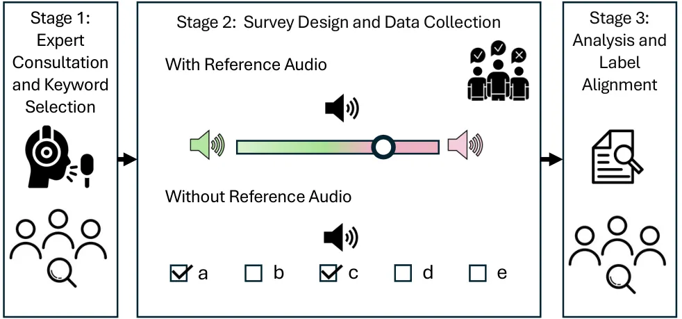
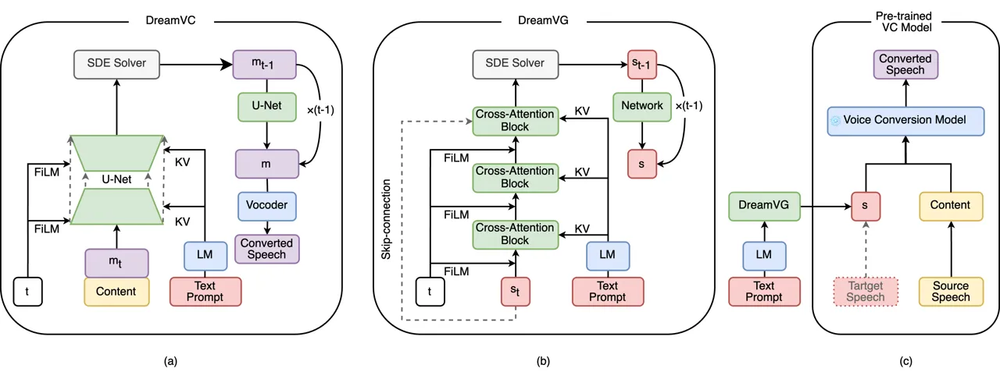

# DreamVoice: Text-Guided Voice Conversion Thanks: ^(†)Indicates equal contribution.Thanks: ^(⋆)This work was supported in part by ONR N00014-23-1-2050 and N00014-23- 1-2086.

Jiarui Hai    Karan Thakkar    Helin Wang    Zengyi Qin    Mounya
Elhilali

###### Abstract

Generative voice technologies are rapidly evolving, offering
opportunities for more personalized and inclusive experiences.
Traditional one-shot voice conversion (VC) requires a target recording
during inference, limiting ease of usage in generating desired voice
timbres. Text-guided generation offers an intuitive solution to convert
voices to desired “DreamVoices” according to the users’ needs. Our paper
presents two major contributions to VC technology: (1) DreamVoiceDB, a
robust dataset of voice timbre annotations for 900 speakers from VCTK
and LibriTTS. (2) Two text-guided VC methods: DreamVC, an end-to-end
diffusion-based text-guided VC model; and DreamVG, a versatile
text-to-voice generation plugin that can be combined with any one-shot
VC models. The experimental results demonstrate that our proposed
methods trained on the DreamVoiceDB dataset generate voice timbres
accurately aligned with the text prompt and achieve high-quality VC.

###### keywords

voice conversion, voice timbre, prompt, diffusion probabilistic models

^(†)^(†)address: ¹Electrical and Computer Engineering, Johns Hopkins
University, Baltimore, MD, USA  
²Massachusetts Institute of Technology, Cambridge, MA, USA  
³MyShell.ai, USA^(†)^(†)email: jhai2@jhu.edu, kthakka2@jhu.edu,
hwang258@jhu.edu, qinzy@mit.edu, mounya@jhu.edu

## 1 Introduction

The emergence of augmented reality devices and accessible virtual
environments marks a significant technological shift \[1, 2\]. This
transformation underscores the need to develop tools that enhance user
experience in these virtual spaces, ensuring safety and engagement.
Therefore highlighting the need for more intuitive interaction methods
with such technologies. Imagine a world where a user (source) can
effortlessly modify their voice to suit their digital persona (target),
from specifying “a young male voice with a dark tone and smooth texture”
to customizing auditory experiences like making “player A’s voice less
harsh”. This technology holds particular significance for individuals
with gender dysphoria or speech impairments, offering them avenues for
expression that were previously inaccessible.

An essential aspect of VC is providing the model with a robust and
accessible representation of the target voice during inference or
training. Traditionally, one-shot VC models rely on the availability of
target recording to extract pre-trained speaker embeddings \[3, 4, 5,
6\] during inference. However, the accessibility of the target recording
or embeddings is not always feasible for all applications. Recently,
there has been a shift towards using text-guided control or conditioning
for generative audio tasks like expressive Text-to-Speech \[7, 8\],
Text-to-Audio \[9\] and Style Transfer \[10\]. Ultimately, the shift
towards text-guided control, while offering scalability and flexibility,
hinges critically on the quality of text annotations.

Previous research studies \[10, 7, 8\] have attempted to annotate voice
timbre, also recognized as tone or color of voice, using text-based
methods. However, these datasets often face limitations such as small
scale, synthetic markings, restricted access, or opaque collection
strategies. PromptTTS++ \[7\] employs a keyword-based marking strategy
on a subset of speakers in the LibriTTS dataset \[11\]. However, the
annotation details are not clearly stated and the annotated data has not
been released to the best of our knowledge. Promptspeaker \[8\] uses an
semi-synthetic Mandarin dataset, of which only the internal subset of 74
speakers contains detailed timbre annotations and the remaining data
merely contains gender or age information, based on the actual ground
truth labels, rather than the perceived timbre. PromptVC \[10\] uses an
internal Mandarin dataset that only contains six speakers and lacks
detailed documentation on the control of the text annotations of style
and timbre. Hence, creating a comprehensive, meticulously detailed, and
open-source dataset of text annotations will play a pivotal role in
advancing text-based voice control and conditioning.

This study explores the task of text-guided voice generation and
conversion, unlike \[10, 7\] that use text-guidance for speech content
control and generation. Our main contributions ¹¹ 1 Demos and source
code: https://research.myshell.ai/dreamvoice are summarized as follows:

1.  1.  We release DreamVoiceDB, an extensive, open-source voice timbre
        dataset of 900 speakers sampled from LibriTTS-R \[11\] and VCTK
        \[12\] dataset, annotated by speech and language experts for
        high-quality research applications.
2.  2.  We propose two text-guided voice generation and conversion models:
        DreamVC, an innovative text-guided voice timbre conversion model
        using Diffusion Probabilistic Models (DPM) \[13\] and
        Classifier-Free Guidance (CFG) \[14\] for effective condition
        controllability; DreamVG, a light and plug-and-play text-to-voice
        generation plugin model compatible with one-shot VC models. DreamVG
        also uses DPM with CFG to generate speaker embeddings.
3.  3.  We experimentally demonstrate that the proposed dataset and models
        can achieve high-quality voice conversion with timbres that are
        precisely aligned with the text description.

## 2 DreamVoiceDB: Voice Timbre Dataset

Voice timbre emerges from a combination of factors, including age,
gender, physical properties of the vocal tract and vocal cord, and
perceptual characteristics. To accurately capture the rich
characteristics of timbre we followed a comprehensive three-stage
process as summarized in Figure 1.

In the first stage, 900 speakers were sampled from existing
multi-speaker datasets LibriTTS-R \[11\] and VCTK \[12\]. Following
this, an expert voice actor guided us through the selection of keywords
that best represent voice timbre. A total of 10 keywords were split into
two categories based on their level of subjectivity. The first category
focuses on basic, more objective timbre aspects like age, gender,
brightness, and roughness, while the second encompasses subjective
characteristics such as perceived strength, warmth, and authority. In
addition to these keywords, we extended our inquiry to include the
perceived voice’s suitability of voice-related professions such as
Storytelling and Client Interaction, linking qualities that make each
voice distinct and memorable.



Figure 1: Schematic diagram of DreamVoiceDB survey method.

The second stage involved combining the expert’s knowledge of the
keywords deeply into our survey methodology. Questions were designed
with reference audio examples to facilitate objective category
annotations based on relative comparison. Assessment of subtler
attributes like brightness and roughness was conducted using a Likert
scale defined based on expert knowledge. The second category responses
were measured using a binary scale for all the keywords in that category
in compliance with their subjective nature. Following the survey design
and release, a test run was conducted to recruit the best annotators. A
total of 8 expert annotators, comprising 4 females and males, were
selected for the study. Annotator’s expertise spanned speech-related
fields such as speech and language pathology, speech and accent
coaching, singing coaching, and transcription work. All 900 speakers
were annotated once by each expert annotator.

Lastly, a comprehensive procedure was employed after data collection to
align and investigate the identified keywords, prioritizing those based
on their respective agreement scores. Keywords that garnered unanimous
consensus among annotators were seamlessly integrated into the dataset.
Conversely, keywords exhibiting moderate agreement levels were subjected
to rigorous reassessment based on their agreement distribution and
combination of manual self-reported scores. This process significantly
augmented the dataset’s precision and authenticity, keeping in mind the
richness and diversity of the dataset. Following keyword annotations, we
used OpenAI’s GPT4 \[15\] API to generate approximately 50 natural
language descriptors for each speaker depending on the combinations of
the keywords. The prompts generated included all leave-one-out and
leave-many-out combinations to cover a wide range of practical inputs.
Further details about the keyword distribution and analysis code are
available ²² 2 Dataset and data analysis:
https://research.myshell.ai/dreamvoice.

## 3 Method



Figure 2: Overview of the (a) DreamVC, (b) DreamVG, and (c) Plugin
Strategy. Modules in blue are pre-trained models and remain frozen
during training, while modules in yellow are trained. Green blocks
represent the source speaker information while red blocks represent the
target speaker information. Purple blocks correspond to the converted
speech. Dashed lines represent skip connections. LM represents the
Language Model. $`KV`$ represents Cross-Attention \[16\] and FiLM
represents Feature-wise Linear Modulation layers \[17\] used for fusing
Text Prompt and diffusion step $`t`$ respectively. SDE solver is the
stochastic differential equations for the diffusion sampling. Text
Prompt is the text description about the desired target voice. $`t`$ is
the diffusion step. $`content`$ is the content embedding of the source
speaker. $`s`$ is the speaker embedding of the target voice. $`m`$ is
the mel-spectrogram. $`m_{t}`$ and $`s_{t}`$ represent the noisy
versions of the mel-spectrogram and the speaker embedding at the
diffusion step $`t`$.

### 3.1 General Voice Conversion Pipeline

Voice conversion models work by taking the content of the source speech,
mixing it with the target speaker’s timbre, and then generating the
converted voice. Recent VC methods often use latent features extracted
from large pre-trained Speech Language Models (SLMs), which contain
limited speaker information but rich content information \[18\], as the
content embedding for the source speaker. In the case of one-shot VC, a
pre-trained speaker verification model, trained on datasets with a large
number of speakers, is utilized to extract the speaker embedding of the
target speaker. The content embedding and the speaker embedding are then
used to condition a VC model to synthesize speech with the content of
the source speaker and the voice timbre of the target speaker.
Researchers have deployed discriminative \[4\] and generative models for
this task including GANs \[19, 20\] and Diffusion models \[21, 22\].
While GANs \[23\] are fragile in convergence and relatively hard to
train, Diffusion \[24\] models provide a more stable alternative for
training generative VC models. In addition, recent diffusion have shown
promising performance in both diversity and quality on various
text-guided generation tasks.

### 3.2 Diffusion Models and Classifier-free Guidance

Diffusion Probabilistic Models (DPMs) are characterized by a two-fold
process: a forward process and a backward process. The forward process
operates by incrementally introducing Gaussian noise into the data
according to schedule $`\beta_{1},\ldots,\beta_{T}`$.

```math
q\left(x_{1:T}\mid x_{0}\right):=\prod_{t=1}^{T}q\left(x_{t}\mid x_{t-1}\right)\\
 \tag{1}
```

```math
q\left(x_{t}\mid x_{t-1}\right):=\mathcal{N}\left(x_{t};\sqrt{1-\beta_{t}}x_{t-1},\beta_{t}\mathbf{I}\right) \tag{2}
```

The forward process facilitates the sampling of the data $`x_{t}`$ at an
arbitrary timestep $`t`$ based on the closed form as:

```math
q\left(x_{t}\mid x_{0}\right):=\mathcal{N}\left(x_{t};\sqrt{\bar{\alpha}_{t}}x_{0},\left(1-\bar{\alpha}_{t}\right)\mathbf{I}\right) \tag{3}
```

Equivalently:

```math
x_{t}:=\sqrt{\bar{\alpha}_{t}}x_{0}+\sqrt{1-\bar{\alpha}_{t}}\epsilon,\quad\text{ where }\epsilon\sim\mathcal{N}(\mathbf{0},\mathbf{I}) \tag{4}
```

where $`\alpha_{t}:=1-\beta_{t}`$ and $`\bar{\alpha}_{t}:=`$
$`\prod_{s=1}^{t}\alpha_{s}`$.

The backward process is essential for iteratively recovering
information, thereby enabling the generation of new data from random
Gaussian noise. The key parameter in this process is $`\beta_{t}`$,
representing the noise variance at each timestep. When $`\beta_{t}`$ is
small, the reverse step aligns with a Gaussian distribution,
facilitating the gradual denoising of the data.

```math
p_{\theta}\left(x_{0:T}\right):=p\left(x_{T}\right)\prod_{t=1}^{T}p_{\theta}\left(x_{t-1}\mid x_{t}\right) \tag{5}
```

```math
p_{\theta}\left(x_{t-1}\mid x_{t}\right):=\mathcal{N}\left(x_{t-1};\tilde{\mu}_{t},\tilde{\beta}_{t}\mathbf{I}\right) \tag{6}
```

where variance $`\tilde{\beta}_{t}`$ can be calculated from the forward
process posteriors:
$`\tilde{\beta}_{t}:=\frac{1-\bar{\alpha}_{t-1}}{1-\bar{\alpha}_{t}}\beta_{t}`$

Following method proposed in \[25\] which has shown improvements in
audio generation \[26\], we apply a fixed noisy schedule to
$`\beta_{t}`$ and $`\alpha_{t}`$ and use velocity $`v_{t}`$ instead of
noise $`\epsilon`$ as the neural network’s prediction target:

```math
v_{t}:=\sqrt{\bar{\alpha}_{t}}\epsilon-\sqrt{1-\bar{\alpha}_{t}}x_{0} \tag{7}
```

According to (4) and (7), the backward process is then performed by the
following functions:

```math
x_{0}:=\sqrt{\bar{\alpha}_{t}}x_{t}-\sqrt{1-\bar{\alpha}_{t}}v_{t} \tag{8}
```

```math
\tilde{\mu}_{t}:=\frac{\sqrt{\bar{\alpha}_{t-1}}\beta_{t}}{1-\bar{\alpha}_{t}}x_{0}+\frac{\sqrt{\alpha_{t}}\left(1-\bar{\alpha}_{t-1}\right)}{1-\bar{\alpha}_{t}}x_{t} \tag{9}
```

CFG \[14\] is increasingly being adopted to steer the sampling process
in diffusion models. This technique modifies the model output $`v`$
during sampling, as described by the equation:

```math
v_{cfg}=v_{neg}+w(v_{pos}-v_{neg}) \tag{10}
```

where $`w`$ represents the guidance scale, and $`v_{pos}`$ and
$`v_{neg}`$ denote the model outputs under positive and negative
conditions, respectively. And $`v_{cfg}`$ is the classifier-free guided
velocity.

To further refine this process, a rescaling method proposed in \[25\] is
applied to $`v_{cfg}`$ to enhance its effectiveness and mitigate
over-exposure when $`w`$ is large.

```math
v_{re}=v_{cfg}\cdot\frac{std(v_{pos})}{std(v_{cfg})}\\
 \tag{11}
```

```math
v^{\prime}_{cfg}=\phi\cdot v_{re}+(1-\phi)\cdot v_{cfg} \tag{12}
```

Here, $`\phi`$ is a hyperparameter used to control the strength of the
rescale adjustment. $`v^{\prime}_{cfg}`$ is the rescaled CFG velocity
used for diffusion sampling.

|                  |                |                    |                    |                 |                    |                    |                    |
| ---------------- | -------------- | ------------------ | ------------------ | --------------- | ------------------ | ------------------ | ------------------ |
| Method           | Text-Guided VC | WER $`\downarrow`$ | PER $`\downarrow`$ | RIS$`\uparrow`$ | MOS-Q $`\uparrow`$ | MOS-N $`\uparrow`$ | MOS-C $`\uparrow`$ |
| Grount-Truth     | /              | /                  | /                  | /               | $`4.42\pm 0.11`$   | $`4.26\pm 0.11`$   | $`4.12\pm 0.13`$   |
| FreeVC           | $`\times`$     | $`6.37`$           | $`9.79`$           | /               | $`4.09\pm 0.12`$   | $`3.98\pm 0.13`$   | /                  |
| ReDiffVC         | $`\times`$     | $`3.45`$           | $`8.26`$           | /               | $`3.67\pm 0.14`$   | $`3.76\pm 0.13`$   | /                  |
| DreamVC          | $`\checkmark`$ | 4.10               | 8.08               | 1.00x           | $`3.62\pm 0.14`$   | $`3.61\pm 0.14`$   | 3.72 $`\pm`$ 0.15  |
| DreamVG+FreeVC   | ✓              | $`7.58`$           | $`10.05`$          | 2.71x           | 3.90 $`\pm`$ 0.13  | 3.85 $`\pm`$ 0.14  | $`3.43\pm 0.16`$   |
| DreamVG+ReDiffVC | ✓              | $`5.11`$           | $`8.65`$           | 1.08x           | $`3.80\pm 0.14`$   | $`3.70\pm 0.13`$   | $`3.66\pm 0.15`$   |

Table 1: Comparison of Objective scores: Word Error Rate (WER), Phoneme
Error Rate (PER), Relative Inference Speed (RIS), and Mean Opinion
Scores (MOS) with their 95% confidence intervals (CI): Q-Quality,
N-Naturalness, C-Prompt-Voice-Consistency.

### 3.3 DreamVC: Text-to-Voice Conversion Model

The DreamVC model leverages a text-guided process to modify the timbre
of the source speech based on the given text prompt. The model is based
on a conditional diffusion model that uses speech content and text
prompt as dual conditions to guide the generation of the output as
detailed in Figure 2(a). The output mel-spectrogram is converted to
waveform using the pre-trained neural Vocoder. This model distinguishes
itself from DiffVC \[21\] in several key aspects: it eschews the use of
an average-voice encoder and instead uses a pre-trained SLM for
disentangling voice and content, integrates cross-attention layers to
merge text prompts effectively, and employs the CFG to control the
impact of conditions.

### 3.4 DreamVG: Text-to-Voice Generation Plugin

However, as an end-to-end text-guided voice conversion model based on
the diffusion model, DreamVC faces limitations in real-world
applications due to its drawbacks such as slow inference speed, high
memory usage, expensive training, and difficulty in reproducing a
desirable voice that was once generated. To address these issues, we
introduce DreamVG, an alternative model that adopts a plug-and-use
strategy. DreamVG efficiently generates latent speaker embeddings from
text prompts using a conditional diffusion model, enhancing its
practicality and application scope, as illustrated in Figure 2(b). This
module can act as a replacement for any one-shot VC model that uses
latent speaker embeddings to generate the target voice, as shown in
Figure 2(c). The plugin method of DreamVG boosts the functionality of
pre-trained one-shot voice conversion models, rendering it a flexible
solution to enable text guidance.

## 4 Experiments

### 4.1 Experimental Settings

For this study, we used the recordings of 900 speakers from VCTK \[12\]
and LibriTTS-R \[11\] datasets and their text prompts from the proposed
annotated dataset DreamVoiceDB as mentioned in Section 2 for training,
and used speakers from LibriTTS-R dev set for validation and test. All
the audio files were sampled at 24KHz for synthesis and 16KHz for
content and speaker embedding extraction.

The U-Net model \[27\] used in DreamVC has 3 downsampling and 3
upsampling blocks configured with 128, 256, and 512 channels
respectively, and each of the 4 blocks in the middle has a
cross-attention layer, totaling 103.2M parameters. The pre-trained T5
base \[28\], noted for its excellence in various generative tasks, is
used to process text prompts. The pre-trained ContentVec \[18\] is used
for content embedding extraction and a pre-trained BigVGAN \[29\] is
employed as the neural vocoder. Based on the configuration of the
BigVGAN vocoder, the mel-spectrogram has 100 mel-spectrograms, a window
size of 1024, and a hop size of 256. Embeddings extracted from ContenVec
are duplicated by hard mapping to match the sample rate of
mel-spectrogram. The diffusion steps and inference steps for the default
DreamVC are 1000 and 50 respectively, and the corresponding variance
$`\beta`$ is set from 0.0001 to 0.02. During sampling, we found the
value of guidance scale $`w`$ as 3, a rescaling factor $`\phi`$ of 0.7,
and setting an unconditional prompt as the negative condition can lead
to better generation quality.

The neural network in DreamVG has three blocks configured with 128, 256,
and 256 channels, where each block has a cross-attention layer, totaling
26.2M parameters. Similar to DreamVC, we use the T5 base model to
generate the prompt embeddings. We adopted the speaker verification
model commonly applied in one-shot VC models \[22, 30\] as the model
output for DreamVG. The diffusion steps and inference steps for the
default DreamVG are 1000 and 100 respectively, and the corresponding
variance $`\beta`$ is set from 0.0001 to 0.02. During sampling, we use a
guidance scale $`w`$ of 3 and a rescaling factor $`\phi`$ of 0.7. The
DreamVG is integrated with two pre-trained one-shot VC models to
facilitate text-guided control in VC: (1) FreeVC \[22\] is one of the
state-of-the-art one-shot voice conversion models that utilizes the VITS
\[31\] architecture enhanced by GAN training. (2) ReDiffVC is a
variation of DreamVC designed for one-shot voice conversion, which
replaces cross-attention blocks with self-attention blocks. ReDiffVC
incorporates the one-shot speaker embedding by adding it to the
diffusion step embedding. Additionally, it employs CFG with a guidance
scale of 3 and a rescaling factor of 0.7, using an empty speaker
embedding as the negative condition during sampling.

### 4.2 Evaluation Metrics

For objective evaluation, we chose 120 utterances from the LibriTTS-R
development set, each with a new, randomly generated text prompt. For
subjective evaluations, we selected 15 utterances from this set, each
with a unique, manually created sentence prompt. In addition, 15 targets
from the training set with their prompts are also used for MOS
evaluation.

The proposed models were evaluated to assess their quality (MOS-Q),
naturalness (MOS-N), prompt-voice consistency (MOS-C), and relative
inference speed (RIS). Specifically, for MOS-C, listeners evaluated how
well the generated speaker’s timbre in synthetic speech aligned with
provided text descriptions, assigning scores ranging from 1 (total
mismatch) to 5 (perfect match). The MOS-Q assesses the quality of
synthesized audio, focusing on aspects like noise and artifacts, while
the MOS-N evaluates the naturalness of the generated voice. A total of
15 English speakers, hired online, participated in these subjective
evaluations. In addition to the above subjective measures, objective
intelligibility of the converted speech is estimated using WER and PER
from the words and phonemes transcribed by Whisper-medium \[32\] and
Allosaurus \[33\] respectively.

### 4.3 Experimental Results

As shown in the Table 1, the DreamVG+FreeVC demonstrated a higher WER
and PER compared to DreamVC, indicating a decrease in the
intelligibility. Conversely, for subjective aspects like voice quality
and naturalness, the combination of DreamVG and FreeVC outperformed
others. This is likely due to FreeVC’s simpler single-stage process, as
opposed to the more complex two-stage Diffusion-based model that relies
heavily on a Neural Vocoder trained independently. The gap in
naturalness and sound quality of ReDiffVC and DreamVC could also be
caused by the mismatch issue of content embedding’s sample rate and
mel-spectorgram’s sample rate.

DreamVC is superior in maintaining prompt-voice consistency in
comparison with DreamVG plugin based methods. DreamVG+FreeVC exhibited
the lowest MOS-C, likely because FreeVC struggled to effectively
disentangle speaker information from the content embedding. The superior
performance of DreamVC can be attributed to the effectiveness of CFG in
removing speaker information from source more effectively.

Interestingly, combining the plugin method with a very light VC variant
resulted in faster inference speeds when compared to the more
comprehensive end-to-end DreamVC approach. However, this combination
might slightly compromise the performance of the one-shot voice
conversion model.

## 5 Conclusion and Future Work

In conclusion, our research introduces the DreamVoiceDB, a
comprehensive, open-source voice timbre dataset annotated by
professionals that can be leveraged as a valuable resource for the next
generation of generative voice applications. In addition, we propose two
novel text-guided voice generation models utilizing DPM and CFG:
DreamVC, an innovative voice timbre conversion model for enhanced
controllability, and DreamVG, a versatile text-to-voice generation
plugin model, compatible with one-shot VC models for speaker embeddings
generation.

Our experiments demonstrate the effectiveness of these models and the
proposed dataset in generating voice timbres precisely aligned with text
descriptions. While DreamVG shows adaptability in integration with other
models, DreamVC performs decently on prompt-voice consistency and
suffers from sound quality and naturalness issues. This can be
attributed to the sampling rate mismatch between the neural vocoder and
content encoder, and the complexities of its two-stage structure without
directly optimizing the waveform signal. In the future, there is
considerable scope for improving the overall performance and the speed
of these models to enable the generation of one’s “DreamVoice”.

## References

- \[1\] A. Hamad and B. Jia, “How virtual reality technology has changed
  our lives: an overview of the current and potential applications and
  limitations,” _International journal of environmental research and
  public health_, vol. 19, no. 18, p. 11278, 2022.
- \[2\] I. Hupont Torres, V. Charisi, G. de Prato, K. Pogorzelska,
  S. Schade, A. Kotsev, M. Sobolewski, N. Duch Brown, E. Calza,
  C. Dunker _et al._, “Next generation virtual worlds: Societal,
  technological, economic and policy challenges for the eu,” Joint
  Research Centre (Seville site), Tech. Rep., 2023.
- \[3\] B. Sisman, J. Yamagishi, S. King, and H. Li, “An overview of
  voice conversion and its challenges: From statistical modeling to deep
  learning,” _IEEE/ACM Transactions on Audio, Speech, and Language
  Processing_, vol. 29, pp. 132–157, 2020.
- \[4\] K. Qian, Y. Zhang, S. Chang, X. Yang, and M. Hasegawa-Johnson,
  “Autovc: Zero-shot voice style transfer with only autoencoder loss,”
  in _International Conference on Machine Learning_. PMLR, 2019, pp.
  5210–5219.
- \[5\] K. Qian, Z. Jin, M. Hasegawa-Johnson, and G. J. Mysore,
  “F0-consistent many-to-many non-parallel voice conversion via
  conditional autoencoder,” in _ICASSP 2020-2020 IEEE International
  Conference on Acoustics, Speech and Signal Processing (ICASSP)_. IEEE,
  2020, pp. 6284–6288.
- \[6\] S. Nercessian, “Improved zero-shot voice conversion using
  explicit conditioning signals.” in _INTERSPEECH_, 2020, pp. 4711–4715.
- \[7\] R. Shimizu, R. Yamamoto, M. Kawamura, Y. Shirahata, T. Komatsu,
  K. Tachibana _et al._, “Prompttts++: Controlling speaker identity in
  prompt-based text-to-speech using natural language descriptions,”
  _arXiv preprint arXiv:2309.08140_, 2023.
- \[8\] Y. Zhang, G. Liu, Y. Lei, Y. Chen, H. Yin, L. Xie, and Z. Li,
  “Promptspeaker: Speaker generation based on text descriptions,” in
  _2023 IEEE Automatic Speech Recognition and Understanding Workshop
  (ASRU)_. IEEE, 2023, pp. 1–7.
- \[9\] R. Huang, J. Huang, D. Yang, Y. Ren, L. Liu, M. Li, Z. Ye,
  J. Liu, X. Yin, and Z. Zhao, “Make-an-audio: Text-to-audio generation
  with prompt-enhanced diffusion models,” in _International Conference
  on Machine Learning_. PMLR, 2023, pp. 13 916–13 932.
- \[10\] J. Yao, Y. Yang, Y. Lei, Z. Ning, Y. Hu, Y. Pan, J. Yin,
  H. Zhou, H. Lu, and L. Xie, “Promptvc: Flexible stylistic voice
  conversion in latent space driven by natural language prompts,” _arXiv
  preprint arXiv:2309.09262_, 2023.
- \[11\] Y. Koizumi, H. Zen, S. Karita, Y. Ding, K. Yatabe, N. Morioka,
  M. Bacchiani, Y. Zhang, W. Han, and A. Bapna, “Libritts-r: A restored
  multi-speaker text-to-speech corpus,” _arXiv preprint
  arXiv:2305.18802_, 2023.
- \[12\] J. Yamagishi, C. Veaux, and K. MacDonald, “Cstr vctk corpus:
  English multi-speaker corpus for cstr voice cloning toolkit (version
  0.92),” 2019. \[Online\]. Available:
  [https://api.semanticscholar.org/CorpusID:213060286](https://api.semanticscholar.org/CorpusID:213060286)
- \[13\] J. Ho, A. Jain, and P. Abbeel, “Denoising diffusion
  probabilistic models,” _Advances in neural information processing
  systems_, vol. 33, pp. 6840–6851, 2020.
- \[14\] J. Ho and T. Salimans, “Classifier-free diffusion guidance,” in
  _NeurIPS 2021 Workshop on Deep Generative Models and Downstream
  Applications_, 2021.
- \[15\] J. Achiam, S. Adler, S. Agarwal, L. Ahmad, I. Akkaya, F. L.
  Aleman, D. Almeida, J. Altenschmidt, S. Altman, S. Anadkat _et al._,
  “Gpt-4 technical report,” _arXiv preprint arXiv:2303.08774_, 2023.
- \[16\] A. Vaswani, N. Shazeer, N. Parmar, J. Uszkoreit, L. Jones,
  A. N. Gomez, Ł. Kaiser, and I. Polosukhin, “Attention is all you
  need,” _Advances in neural information processing systems_,
  vol. 30, 2017.
- \[17\] E. Perez, F. Strub, H. De Vries, V. Dumoulin, and A. Courville,
  “Film: Visual reasoning with a general conditioning layer,” in
  _Proceedings of the AAAI conference on artificial intelligence_,
  vol. 32, no. 1, 2018.
- \[18\] K. Qian, Y. Zhang, H. Gao, J. Ni, C.-I. Lai, D. Cox,
  M. Hasegawa-Johnson, and S. Chang, “Contentvec: An improved
  self-supervised speech representation by disentangling speakers,” in
  _International Conference on Machine Learning_. PMLR, 2022, pp.
  18 003–18 017.
- \[19\] C.-C. Hsu, H.-T. Hwang, Y.-C. Wu, Y. Tsao, and H.-M. Wang,
  “Voice conversion from unaligned corpora using variational
  autoencoding wasserstein generative adversarial networks,” _arXiv
  preprint arXiv:1704.00849_, 2017.
- \[20\] H. Kameoka, T. Kaneko, K. Tanaka, and N. Hojo, “Stargan-vc:
  Non-parallel many-to-many voice conversion using star generative
  adversarial networks,” in _2018 IEEE Spoken Language Technology
  Workshop (SLT)_. IEEE, 2018, pp. 266–273.
- \[21\] V. Popov, I. Vovk, V. Gogoryan, T. Sadekova, M. S. Kudinov, and
  J. Wei, “Diffusion-based voice conversion with fast maximum likelihood
  sampling scheme,” in _International Conference on Learning
  Representations_, 2021.
- \[22\] J. Li, W. Tu, and L. Xiao, “Freevc: Towards high-quality
  text-free one-shot voice conversion,” in _ICASSP 2023-2023 IEEE
  International Conference on Acoustics, Speech and Signal Processing
  (ICASSP)_. IEEE, 2023, pp. 1–5.
- \[23\] D. Saxena and J. Cao, “Generative adversarial networks (gans)
  challenges, solutions, and future directions,” _ACM Computing Surveys
  (CSUR)_, vol. 54, no. 3, pp. 1–42, 2021.
- \[24\] L. Yang, Z. Zhang, Y. Song, S. Hong, R. Xu, Y. Zhao, W. Zhang,
  B. Cui, and M.-H. Yang, “Diffusion models: A comprehensive survey of
  methods and applications,” _ACM Computing Surveys_, vol. 56, no. 4,
  pp. 1–39, 2023.
- \[25\] S. Lin, B. Liu, J. Li, and X. Yang, “Common diffusion noise
  schedules and sample steps are flawed,” in _Proceedings of the
  IEEE/CVF Winter Conference on Applications of Computer Vision_, 2024,
  pp. 5404–5411.
- \[26\] J. Hai, H. Wang, D. Yang, K. Thakkar, N. Dehak, and
  M. Elhilali, “Dpm-tse: A diffusion probabilistic model for target
  sound extraction,” in _ICASSP 2024-2024 IEEE International Conference
  on Acoustics, Speech and Signal Processing (ICASSP)_. IEEE, 2024, pp.
  1196–1200.
- \[27\] O. Ronneberger, P. Fischer, and T. Brox, “U-net: Convolutional
  networks for biomedical image segmentation,” in _Medical image
  computing and computer-assisted intervention–MICCAI 2015: 18th
  international conference, Munich, Germany, October 5-9, 2015,
  proceedings, part III 18_. Springer, 2015, pp. 234–241.
- \[28\] C. Raffel, N. Shazeer, A. Roberts, K. Lee, S. Narang,
  M. Matena, Y. Zhou, W. Li, and P. J. Liu, “Exploring the limits of
  transfer learning with a unified text-to-text transformer,” _Journal
  of machine learning research_, vol. 21, no. 140, pp. 1–67, 2020.
- \[29\] S.-g. Lee, W. Ping, B. Ginsburg, B. Catanzaro, and S. Yoon,
  “Bigvgan: A universal neural vocoder with large-scale training,” in
  _The Eleventh International Conference on Learning
  Representations_, 2022.
- \[30\] S. Liu, Y. Cao, D. Wang, X. Wu, X. Liu, and H. Meng,
  “Any-to-many voice conversion with location-relative
  sequence-to-sequence modeling,” _IEEE/ACM Transactions on Audio,
  Speech, and Language Processing_, vol. 29, pp. 1717–1728, 2021.
- \[31\] J. Kim, J. Kong, and J. Son, “Conditional variational
  autoencoder with adversarial learning for end-to-end text-to-speech,”
  in _International Conference on Machine Learning_. PMLR, 2021, pp.
  5530–5540.
- \[32\] A. Radford, J. W. Kim, T. Xu, G. Brockman, C. McLeavey, and
  I. Sutskever, “Robust speech recognition via large-scale weak
  supervision,” in _International Conference on Machine Learning_. PMLR,
  2023, pp. 28 492–28 518.
- \[33\] X. Li, S. Dalmia, J. Li, M. Lee, P. Littell, J. Yao,
  A. Anastasopoulos, D. R. Mortensen, G. Neubig, A. W. Black _et al._,
  “Universal phone recognition with a multilingual allophone system,” in
  _ICASSP 2020-2020 IEEE International Conference on Acoustics, Speech
  and Signal Processing (ICASSP)_. IEEE, 2020, pp. 8249–8253.
