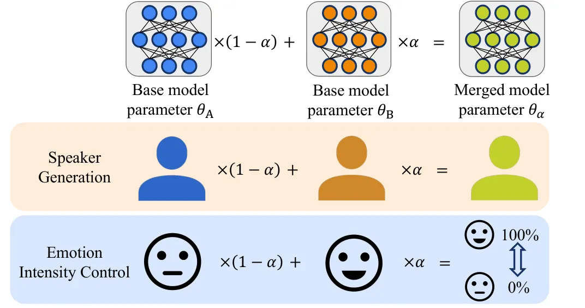

# An Attribute Interpolation Method in Speech Synthesis by Model Merging

Masato Murata    Koichi Miyazaki    Tomoki Koriyama

###### Abstract

With the development of speech synthesis, recent research has focused on
challenging tasks, such as speaker generation and emotion intensity
control. Attribute interpolation is a common approach to these tasks.
However, most previous methods for attribute interpolation require
specific modules or training methods. We propose an attribute
interpolation method in speech synthesis by model merging. Model merging
is a method that creates new parameters by only averaging the parameters
of base models. The merged model can generate an output with an
intermediate feature of the base models. This method is easily
applicable without specific modules or training methods, as it uses only
existing trained base models. We merged two text-to-speech models to
achieve attribute interpolation and evaluated its performance on speaker
generation and emotion intensity control tasks. As a result, our
proposed method achieved smooth attribute interpolation while keeping
the linguistic content in both tasks.

###### keywords

attribute interpolation, speech synthesis, model merging, speaker
generation, emotion intensity control

^(†)^(†)address: CyberAgent, Inc., Japan^(†)^(†)email:
murata_masato@cyberagent.co.jp, miyazaki_koichi_xa@cyberagent.co.jp,
koriyama_tomoki@cyberagent.co.jp

## 1 Introduction

With the development of deep learning, text-to-speech (TTS) systems have
achieved human-level naturalness. Recent research has focused on more
challenging tasks for generating variety types of voices, such as
speaker generation \[1, 2\], which involves generating speech with
nonexistent speaker attributes, and emotion intensity control \[3\],
which aims to control the intensity of emotions in a synthesized speech.
These technologies can be applied to the character voice creation in
video or game contents, conversational assistants, and audiobook
narration. Various approaches have been proposed for these tasks,
including global style token (GST)-based method \[4, 5\],
speaker/emotion embedding-based method \[1, 2\], and Variational
Autoencoder (VAE)-based methods \[6\]. To generate a nonexistent speaker
or control the emotion intensity, another common approach is to use an
attribute interpolation method, which perform interpolation between two
base attributes, such as speaker or emotion style. However, most
conventional attribute interpolation methods require specific training
methods or modules, such as introducing speaker/emotion classifier
loss \[3\] or pre-trained speaker/emotion encoders \[1, 2, 7\].

Therefore, we focus on a model merging method as an attribute
interpolation approach that does not require any specific training
methods or modules. Model merging is a method that creates new model
parameters by simply averaging the parameters of multiple base models
trained with different attributes \[8\]. In most cases, the base models
have the same model architecture but are trained with different
configurations or datasets. Recent studies \[9\] have shown that a
merged model between two generative models can generate an output with
an intermediate feature of base models. This method is easily applicable
because it uses only the existing trained base models. Hence, it also
does not require preparing the target dataset and computing resources
for training. The recent trend of openly sharing weight parameters
enhances the utility of the model merging method. With the development
of large machine learning models such as the large language model \[10\]
and diffusion-based text-to-image model \[11, 12\], many fine-tuned
weights are distributed via some platforms such as huggingface¹¹ 1
[https://huggingface.co/](https://huggingface.co/) without their
datasets. Considering this trend, the model merging method can be more
commonly used because it only requires distributed trained weights to
apply with no need to target training data or computing resources.
Therefore, now users can create their original models by easily applying
model merging to the existing distributed weights on such platforms.



Figure 1: Overview of the attribute interpolation method by model
merging.

In this research, to manipulate speech-related attributes, we propose an
attribute interpolation method for TTS models. Our method merges two TTS
models as base models while adjusting the merging coefficient. Inspired
by the capability of the merged model to generate the output with the
intermediate feature, we consider that the merged TTS model can be used
for speaker generation and emotion intensity control tasks. This is
because the intermediate acoustic feature can represent the intermediate
speaker/emotion between the two base models. To evaluate the performance
of our proposed method, we conduct experiments on two tasks: speaker
generation and emotion intensity control. The experimental results show
that our proposed method achieves smooth attribute interpolation while
maintaining the linguistic content. Audio samples are available on our
demo page²² 2
[https://muramasa2.github.io/model-merge-tts/](https://muramasa2.github.io/model-merge-tts/).

Our contributions of this study are as follows:

- •
  We propose an attribute interpolation method in speech synthesis by
  model merging.
- •
  In the two experiments: speaker generation and emotion intensity
  control, we demonstrate the capability of our proposed method across
  various metrics in the speech domain.

## 2 Related work

### 2.1 Speaker Generation

Stanton et al. \[1\] defined a task to synthesize speech of a
nonexistent speaker as “speaker generation”. Speaker generation can be
used for audiobook readers, speech assistants, and character voice
creation in video or game content. For the task, several deep neural
networks (DNN)-based approaches have been proposed in previous studies.
There are two major approaches, a sampling-based method that samples
latent speaker embeddings from learned speaker distributions \[1, 2\],
and an attribute interpolation-based method that performs speaker
interpolation between two reference speakers.

As the attribute interpolation-based methods, Saito et al. \[13\] and
Kerle et al. \[14\] used linear interpolation of two base speaker
embeddings obtained from a speaker encoder trained on speaker
verification task. Flowtron \[15\] and VAE-Loop \[6\] used latent
variable interpolation to generate new speaker features.

In this study, we use a naive attribute interpolation-based method as a
baseline which conditions the model on the linear interpolation of base
speaker embeddings to compare with the proposed method.

### 2.2 Emotion Intensity Control

Emotion intensity control is a task that aims to control the intensity
of emotion in synthesized speech from 0 to 100 %.

Wang et al. proposed GST, which learns style representation \[16\]. They
controlled the intensity of a specific emotion by scaling the extracted
GST embeddings. To control the emotion intensity, there are other
several approaches including learning an emotion embedding space by
using an external voice emotion recognition model \[7\], and using soft
emotion labels obtained by a trained ranking function \[3\].

### 2.3 Model Merging Method

Model merging is a method that creates new parameters by simply
averaging the parameters of multiple base models trained with different
hyperparameter configurations or datasets. Let
Train$`\left(\theta_{0},h,d\right)`$ denote training from the initial
parameter $`\theta_{0}`$ with hyperparameter configuration $`h`$ and
target dataset $`d`$. The merged model parameters are defined as
follows:

```math
\displaystyle\mathbf{\theta}_{m}:=\frac{1}{k}\sum^{k}_{i}{\mathbf{\theta}_{i}}, \displaystyle\mathbf{\theta}_{i}=\text{Train}(\mathbf{\theta}_{0},h_{i},d_{i}) \tag{1}
```

where $`\mathbf{\theta}_{m}`$ is the parameters of the merged model,
$`\mathbf{\theta}_{0}`$ is the initial parameters, and $`k`$ is the
number of base models. The notations $`h_{i}`$ and $`d_{i}`$ denote the
$`i`$-th hyperparameter configuration and target dataset out of $`k`$.

Wortsman et al. \[8\] proposed the model merging method in
discriminative tasks. They showed that the merged model achieved better
accuracy and robustness than each base model, regardless of the
architectures of the image and text classification tasks. Even in
cross-dataset settings, they merged multiple base models which are
trained on several datasets such as CIFAR-10 \[17\] and Food-101 \[18\],
and demonstrated that the merged model outperformed each base model
performance in both in-domain and zero-shot scenarios.

Avrahami et al. \[9\] applied the model merging method to the image
generation task. They merged two base models that are trained on the
datasets belonging to different classes from LSUN \[19\] dataset, such
as cat and dog. They demonstrated that the merged model can generate an
output including an intermediate semantic feature between the features
of base models. Thus, this method is easily applicable without any
specific training method or modules for attribute interpolation, as it
only uses the existing trained base model. Hence, it also does not
require preparing the target dataset and computing resources for
training.

## 3 Attribute Interpolation Method by Model Merging

Our proposed attribute interpolation method is based on model merging
shown in Figure 1. Inspired by the characteristics of the merged model
being able to generate the output with the intermediate feature between
two base models, we consider that the merged TTS model could be used for
speaker generation and emotion intensity control tasks because the
intermediate acoustic feature can represent the intermediate
speaker/emotion feature between two base models. In this study, we
introduce a simple weighted average model merging between two base
models. This method enables us to create new speakers or control the
emotion intensity by merging two base model attributes while controlling
the merging coefficient. Since it does not require any additional
training, there is no need to access the target dataset and computing
resources because we only use shared trained models as base models. The
attribute interpolation method by model merging between the base TTS
models A and B is defined as follows:

```math
\displaystyle\mathbf{\theta}_{\alpha}:=(1-\alpha)\mathbf{\theta}_{A}+\alpha\mathbf{\theta}_{B}, \displaystyle 0\leq\alpha\leq 1 \tag{2}
```

where $`\alpha`$ is the merging coefficient, $`\mathbf{\theta}_{A}`$ and
$`\mathbf{\theta}_{B}`$ are the existing trained weight parameters of
each base TTS model.

## 4 Experiments

In this paper, we verified the performance of the proposed method on two
tasks: speaker generation and emotion intensity control. For speaker
generation, we used two different single-speaker TTS models as base
models A and B. For emotion intensity control, we used the Neutral style
TTS model as base model A and its emotion style TTS model as base model
B.

### 4.1 Experimental settings

We used two different datasets for each experiment but used the same
model architecture for both experiments.

#### 4.1.1 Datasets

In this research, we used two datasets for each experiment: the
VCTK \[20\] dataset for the speaker generation experiment and the
ESD \[21, 22\] dataset for the emotion intensity control experiment.

VCTK: VCTK \[20\] dataset contains approximately 44 hours of English
speech from 109 individual speakers. We designed
training/validation/test splits of approximately 90%/5%/5% of the
original dataset. For the speaker generation experiment, we first
created a multi-speaker TTS model conditioned with speaker IDs as a
pre-trained model by training with the VCTK training set. The detailed
training process is referred to the training recipe of ESPnet³³ 3
[https://github.com/espnet/espnet/blob/master/egs2/vctk/tts1/run.sh](https://github.com/espnet/espnet/blob/master/egs2/vctk/tts1/run.sh).
Subsequently, we chose 10 speakers from the VCTK dataset as target
speaker for each base model, which consists of 5 female speakers
(speaker IDs: p225, p228, p229, p230, and p231) and 5 male speakers
(p226, p227, p232, p237, and p241). We fine-tuned the pre-trained model
with these speakers’ data to create each single-speaker TTS model.

ESD: ESD \[21, 22\] dataset contains approximately 29 hours of English
and 30 hours of Chinese speech uttered by 10 native English and Chinese
speakers with 5 emotion styles (Neutral, Angry, Happy, Sad, and
Surprise). For emotion intensity control experiment, we first used the
English speaker subset (speaker IDs: 0011–0020) to create a
multi-speaker TTS model conditioned with speaker IDs and emotion style
IDs as a pre-trained model. Following that, we chose 5 speakers (0014,
0015, 0018, 0019, and 0020) with 5 emotion styles to fine-tune the
pre-trained model to create each speaker’s emotion style TTS model.

In both experiments, we used these fine-tuned models as existing trained
base models.

#### 4.1.2 Model Architecture

We emploied the implementation of Conformer-FastSpeech2 (CFS2) \[23\]
from ESPnet \[24\] with the configurations⁴⁴ 4
[https://github.com/espnet/espnet/blob/master/egs2/vctk/tts1/conf/tuning/train_xvector_conformer_fastspeech2.yaml](https://github.com/espnet/espnet/blob/master/egs2/vctk/tts1/conf/tuning/train_xvector_conformer_fastspeech2.yaml).
In TTS applications, single-speaker models are commonly created by
fine-tuning from a multi-speaker pre-trained model. Therefore, in this
study, we created each base model fine-tuned from a multi-speaker
pre-trained model. As a pre-trained model, we prepared a speaker/emotion
style ID-conditioned multi-speaker TTS model.

Following the prior research \[13, 14\], we also used the speaker
embedding conditioning model with a speaker encoder module as a
baseline. As a speaker embedding, we used x-vector \[25\] embedding
obtained from pre-trained speaker encoder of speechbrain⁵⁵ 5
[https://speechbrain.github.io/](https://speechbrain.github.io/) which
is trained on VoxCeleb 1 \[26\] and VoxCeleb2 \[27\]. For waveform
generation, we used the pre-trained HiFi-GAN \[28\] vocoder
(vctk_hifigan.v1) on ParallelWaveGAN repository⁶⁶ 6
[https://github.com/kan-bayashi/ParallelWaveGAN](https://github.com/kan-bayashi/ParallelWaveGAN)
trained with the VCTK dataset.

### 4.2 Speaker generation

Our proposed method performs speaker generation by an attribute
interpolation-based approach, called speaker interpolation. To
investigate the performance of the proposed method in the speaker
generation task, we merged base models on several speaker combination
settings, and evaluated the synthesized speech of each merged model.
Specifically, we first prepared three types of speaker-gender
combinations using speaker subsets of the VCTK corpus: Female-Female,
Male-Male, and Male-Female. The female speaker subset consists of the
five female speakers, and the male speaker subset also consists of the
five speakers described in Section 4.1.1. Then, we created each
single-speaker base model by fine-tuning from the same pre-trained
model. By merging these base models, we generated the speech of
nonexistent speakers. We evaluated the generated speech of the merged
models from two perspectives: speech quality and speaker interpolation
smoothness.

#### 4.2.1 Speech quality evaluation

Since it is not guaranteed that the output of merged models can keep the
naturalness and linguistic content of base models, we evaluated the
synthetic speeches generated by merged models based on their naturalness
and capability to maintain linguistic content (intelligibility). In this
experiment, we used the mean opinion score (MOS) for naturalness
evaluation and the word error rate (WER) for intelligibility evaluation.
We evaluated the synthesized speech output of the merged model
($`\alpha`$ = 0.5) and that of each base model. We also evaluated the
baseline model conditioned with the average speaker embeddings of two
base speakers. These models are denoted as “model merge” and “spk emb”
respectively.

For the MOS test, participants rated the naturalness of the given speech
samples on a 5-point scale. For each gender combination, we randomly
selected two base speakers from each gender speaker subset and generated
speech samples of interpolated speakers and base speakers. We asked 40
participants to evaluate five different generated speeches (including
interpolated speaker’s speech and base speaker’s speech). The sentence
of each sample was randomly selected from 10 test sentences in the VCTK
test set. Participants were recruited from the crowdsourcing site Amazon
Mechanical Turk (AMT)⁷⁷ 7
[https://www.mturk.com/](https://www.mturk.com/). For the
intelligibility evaluation, we calculated the WER score by using a
pre-trained Conformer model \[29\] on espnet model zoo⁸⁸ 8
[https://github.com/espnet/espnet_model_zoo](https://github.com/espnet/espnet_model_zoo).

| MOS                 |                   |                   |                   |                   |
| ------------------- | ----------------- | ----------------- | ----------------- | ----------------- |
| Speaker combination | spk emb           |                   | model merge       |                   |
|                     | base speakers     | interpolation     | base speakers     | interpolation     |
| Female-Female       | 4.02 $`\pm`$ 0.14 | 4.25 $`\pm`$ 0.12 | 3.92 $`\pm`$ 0.13 | 4.24 $`\pm`$ 0.12 |
| Male-Male           | 3.75 $`\pm`$ 0.13 | 3.92 $`\pm`$ 0.13 | 3.75 $`\pm`$ 0.14 | 3.91 $`\pm`$ 0.14 |
| Male-Female         | 3.99 $`\pm`$ 0.12 | 3.75 $`\pm`$ 0.14 | 4.03 $`\pm`$ 0.12 | 3.45 $`\pm`$ 0.13 |
| WER                 |                   |                   |                   |                   |
| Speaker combination | spk emb           |                   | model merge       |                   |
|                     | base speakers     | interpolation     | base speakers     | interpolation     |
| Female-Female       | 11.2              | 11.5              | 12.9              | 10.9              |
| Male-Male           | 10.7              | 10.4              | 9.3               | 9.5               |
| Male-Female         | 11.0              | 10.7              | 11.1              | 11.2              |

Table 1: MOS score with 95% confidence interval (CI) and WER score with
several gender combination settings.

Table 1 shows the evaluation results of MOS and WER. The MOS scores
indicate that the output of the merged model between same-gender base
models (Female-Female, Male-Male) achieved comparable naturalness with
that of single-speaker base models and speaker-embedding conditioned
baseline models. The WER results show that the generated speech of the
merged model for all combinations can maintain high intelligibility
compared to each base model and baseline. This suggests that the model
merging method can change only the speaker’s identity while keeping the
linguistic content. In contrast, the MOS of the merged model of the
different-gender combination (Female-Male) was deteriorated from base
models. We think that the deterioration is caused by the pitch
normalization in the variance adapter of CFS2. Since the target pitch of
the variance adaptor was normalized depending on each speaker’s
statistic value in the CFS2 implementation we used, it is not guaranteed
that the intermediate output value of the pitch predictor represents the
intermediate pitch height.

#### 4.2.2 Speaker interpolation smoothness

To evaluate the smoothness of speaker interpolation by model merging, we
evaluated the speaker encoder cosine similarity (SECS) score between the
average x-vector of the synthetic speeches generated by the merged model
and that of the ground truth (GT) speech of the original base speaker.
We merged each base model while changing the merging coefficient
$`\alpha`$ in range of 0 to 1 in steps of 0.1 and synthesized speech by
using the merged models with 10 sentences from the VCTK test set.
Figure 2 shows the SECS values on each gender base model combination:
Female-Female, Male-Male, and Female-Male. For all combinations, we
observed that the SECS scores of the proposed method changed as smoothly
as those of the baseline. The results indicate that the model merging
method can easily generate various nonexistent speakers with
intermediate characteristics of any two base speakers.

(a) Female-Female (spk emb)

(b) Female-Female (model merge)

(c) Male-Male (spk emb)

(d) Male-Male (model merge)

(e) Male-Female (spk emb)

(f) Male-Female (model merge)

Figure 2: SECS score with 95% confidence interval (CI) between the
x-vectors of synthesized speech of the interpolated speaker and base
speakers. Each row corresponds to the SECS in Female-Female, Male-Male,
and Male-Female gender combination settings. The left column is the
results of speaker embedding conditioned baseline model and the right
column is that of model merging.

### 4.3 Emotion intensity control

To investigate the controllability of the proposed method, we conducted
experiments on the emotion intensity control task. We merged each
emotion-style TTS model with a Neutral style model to control the
intensity of emotion in synthesized speech. In this experiment, we first
created each base model by using speech data from the five speakers with
the five emotions described in Section 4.1.1. The base models were
obtained by fine-tuning from the same pre-trained model trained on the
ESD dataset. We merged one of the four emotion-style TTS models (except
for Neutral style) with the Neutral style model of the same speaker,
respectively. As a result, we obtained 20 types of merged models (5
speakers $`\times`$ 4 emotions). To control the emotion intensity of
synthesized speech, we changed the merging coefficient $`\alpha`$ from 0
to 1 in steps of 0.25. We conducted a rearrangement ranking subjective
evaluation. We evaluated the controllability of the emotion intensity
control task on the average of the ranks metrics. In this subjective
evaluation, participants listened to randomly arranged voice samples
with five levels of emotion intensity and rearranged them in order of
emotion intensity. In the experiment, we asked 50 participants to
rearrange 8 sample sets (each sample set contains 5 voice samples).
Participants for this experiment were also recruited through AMT.

Table 2 shows the results of the average of the ranks on each emotion
style setting. The results show that our proposed method achieved smooth
emotion intensity control. However, in the Sad style setting, the range
of evaluated average ranks was smaller than that of other style
settings. This indicates that the controllability in the Sad style
setting is limited compared with other emotion styles settings. We think
that this is because of the diversity between the emotion style voice
and the Neutral voice in the original dataset. If the difference is
small in the original dataset, it can be more difficult to control the
emotion intensity. This suggests that the diversity of emotional
expression in the training dataset is important for emotion intensity
control by using our method.

|          | 1st               | 2nd               | 3rd               | 4th               | 5th               |
| -------- | ----------------- | ----------------- | ----------------- | ----------------- | ----------------- |
| Angry    | 1.83 $`\pm`$ 0.22 | 2.08 $`\pm`$ 0.20 | 3.06 $`\pm`$ 0.17 | 3.63 $`\pm`$ 0.17 | 4.40 $`\pm`$ 0.24 |
| Happy    | 2.14 $`\pm`$ 0.25 | 2.33 $`\pm`$ 0.23 | 2.91 $`\pm`$ 0.21 | 3.52 $`\pm`$ 0.23 | 4.10 $`\pm`$ 0.26 |
| Sad      | 2.17 $`\pm`$ 0.19 | 2.69 $`\pm`$ 0.17 | 2.95 $`\pm`$ 0.13 | 3.35 $`\pm`$ 0.15 | 3.83 $`\pm`$ 0.17 |
| Surprise | 1.56 $`\pm`$ 0.19 | 2.09 $`\pm`$ 0.17 | 2.76 $`\pm`$ 0.13 | 3.93 $`\pm`$ 0.15 | 4.65 $`\pm`$ 0.17 |

Table 2: The average ranking with each emotion intensity in 4 emotions
settings

## 5 Conclusions

In this paper, we proposed an attribute interpolation method that merges
two existing trained TTS models as base models while adjusting the
merging coefficient. We demonstrated that our proposed method achieves
smooth attribute interpolation while maintaining the linguistic content.

We conducted subjective and objective experiments in speaker generation
and emotion intensity control tasks to evaluate the attribute
interpolation performance of the proposed method. In the speaker
generation experiment, we merged two single-speaker TTS models as base
models with the same/different gender combination settings. As a result,
though our proposed method does not require specific modules for
attribute interpolation, the merged model between same-gender base
models achieved comparable performance to base models and the baseline
model using an external module. In the emotion intensity control
experiment, we verified the controllability of the emotion intensity in
synthesized speech by merging each emotion style model and the Neutral
emotion style model. As a result, we could control the intensity of each
emotion smoothly by using our proposed method.

As a future work, high-quality speaker interpolation between different
gender settings and a multi-attribute interpolation method, such as
speaker and emotion, are required for application usage such as
character voice creation. Therefore, we plan to develop a more robust
attribute interpolation method and a multi-attribute interpolation
methods.

## References

- \[1\] D. Stanton, M. Shannon, S. Mariooryad _et al._, “Speaker
  generation,” in _Proc. ICASSP_, 2022, pp. 7897–7901.
- \[2\] A. Watanabe, S. Takamichi, Y. Saito _et al._, “Mid-attribute
  speaker generation using optimal-transport-based interpolation of
  gaussian mixture models,” in _Proc. ICASSP_, 2023, pp. 1–5.
- \[3\] Y. Lei, S. Yang, X. Wang _et al._, “Msemotts: Multi-scale
  emotion transfer, prediction, and control for emotional speech
  synthesis,” _IEEE/ACM Trans. Audio, Speech, Lang. Process._, vol. 30,
  pp. 853–864, 2022.
- \[4\] D. Stanton, Y. Wang, and R. Skerry-Ryan, “Predicting expressive
  speaking style from text in end-to-end speech synthesis,” in _Proc.
  SLT_, 2018, pp. 595–602.
- \[5\] P. Wu, Z. Ling, L. Liu _et al._, “End-to-end emotional speech
  synthesis using style tokens and semi-supervised training,” in _Proc.
  APSIPA ASC_, 2019, pp. 623–627.
- \[6\] Akuzawa, Iwasawa, and Matsuo, “Expressive speech synthesis via
  modeling expressions with variational autoencoder,” in _Proc.
  Interspeech_, 2018.
- \[7\] X. Cai, D. Dai, Z. Wu _et al._, “Emotion controllable speech
  synthesis using emotion-unlabeled dataset with the assistance of
  cross-domain speech emotion recognition,” in _Proc. ICASSP_, 2021, pp.
  5734–5738.
- \[8\] M. Wortsman, G. Ilharco, S. Y. Gadre _et al._, “Model soups:
  averaging weights of multiple fine-tuned models improves accuracy
  without increasing inference time,” in _Proc. ICML_, 2022, pp.
  23 965–23 998.
- \[9\] O. Avrahami, D. Lischinski, and O. Fried, “Gan cocktail: mixing
  gans without dataset access,” in _Proc. ECCV_, 2022, pp. 205–221.
- \[10\] L. Floridi and M. Chiriatti, “Gpt-3: Its nature, scope, limits,
  and consequences,” _Minds Mach._, vol. 14, no. 4, p. 681–694, 2020.
- \[11\] J. Ho, A. Jain, and P. Abbeel, “Denoising diffusion
  probabilistic models,” in _Proc. NeurIPS_, vol. 33, 2020, pp.
  6840–6851.
- \[12\] R. Rombach, A. Blattmann, D. Lorenz _et al._, “High-resolution
  image synthesis with latent diffusion models,” in _Proc. CVPR_, 2022,
  pp. 10 684–10 695.
- \[13\] Y. Saito, S. Takamichi, and H. Saruwatari,
  “Perceptual-similarity-aware deep speaker representation learning for
  multi-speaker generative modeling,” _IEEE/ACM Trans. Audio, Speech,
  Lang. Process._, vol. 29, pp. 1033–1048, 2021.
- \[14\] L. Kerle, M. Pucher, and B. Schuppler, “Speaker interpolation
  based data augmentation for automatic speech recognition,” in _Proc.
  ICPhS_, 2023, pp. 3126–3130.
- \[15\] R. Valle, K. J. Shih, R. Prenger _et al._, “Flowtron: an
  autoregressive flow-based generative network for text-to-speech
  synthesis,” in _Proc. ICLR_, 2021.
- \[16\] Y. Wang, D. Stanton, Y. Zhang _et al._, “Style tokens:
  Unsupervised style modeling, control and transfer in end-to-end speech
  synthesis,” in _Proc. ICML_, 2018, pp. 5180–5189.
- \[17\] A. Krizhevsky and G. Hinton, “Learning multiple layers of
  features from tiny images,” _Master’s thesis, Department of Computer
  Science, University of Toronto_, 2009.
- \[18\] L. Bossard, M. Guillaumin, and L. Van Gool, “Food-101–mining
  discriminative components with random forests,” in _Proc. ECCV_, 2014,
  pp. 446–461.
- \[19\] F. Yu, Y. Zhang, S. Song _et al._, “Lsun: Construction of a
  large-scale image dataset using deep learning with humans in the
  loop,” _arXiv preprint arXiv:1506.03365_, 2015.
- \[20\] J. Yamagishi, C. Veaux, and K. MacDonald, “CSTR VCTK Corpus:
  English multi-speaker corpus for CSTR voice cloning toolkit,”
  _University of Edinburgh. The Centre for Speech Technology Research
  (CSTR)_, 2016.
- \[21\] “Emotional voice conversion: Theory, databases and esd,”
  _Speech Communication_, vol. 137, pp. 1–18, 2022.
- \[22\] K. Zhou, B. Sisman, R. Liu _et al._, “Seen and unseen emotional
  style transfer for voice conversion with a new emotional speech
  dataset,” in _Proc. ICASSP_, 2021, pp. 920–924.
- \[23\] P. Guo, F. Boyer, X. Chang _et al._, “Recent developments on
  espnet toolkit boosted by conformer,” in _Proc. ICASSP_, 2021, pp.
  5874–5878.
- \[24\] S. Watanabe, T. Hori, S. Karita _et al._, “ESPnet: End-to-end
  speech processing toolkit,” in _Proc. Interspeech_, 2018, pp.
  2207–2211.
- \[25\] D. Snyder, D. Garcia-Romero, G. Sell _et al._, “X-vectors:
  Robust dnn embeddings for speaker recognition,” in _Proc. ICASSP_,
  2018, pp. 5329–5333.
- \[26\] A. Nagrani, J. S. Chung, and A. Zisserman, “VoxCeleb: A
  Large-Scale Speaker Identification Dataset,” in _Proc. Interspeech_,
  2017, pp. 2616–2620.
- \[27\] J. S. Chung, A. Nagrani, and A. Zisserman, “VoxCeleb2: Deep
  Speaker Recognition,” in _Proc. Interspeech_, 2018, pp. 1086–1090.
- \[28\] J. Kong, J. Kim, and J. Bae, “HiFi-GAN: Generative adversarial
  networks for efficient and high fidelity speech synthesis,” in _Proc.
  NeurIPS_, vol. 33, 2020, pp. 17 022–17 033.
- \[29\] A. Gulati, C.-C. Chiu, J. Qin _et al._, “Conformer:
  Convolution-augmented transformer for speech recognition,” in _Proc.
  Interspeech_, 2020, pp. 5036–5040.
