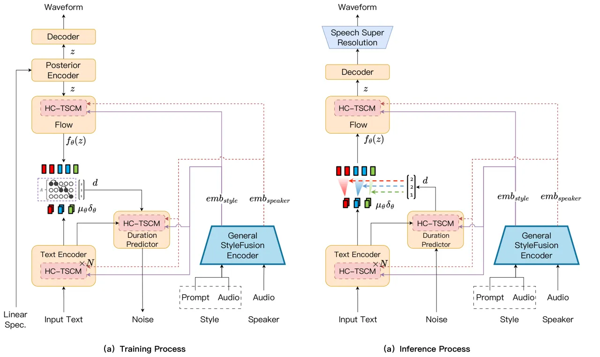
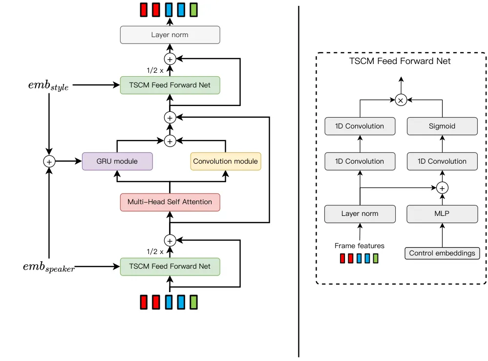
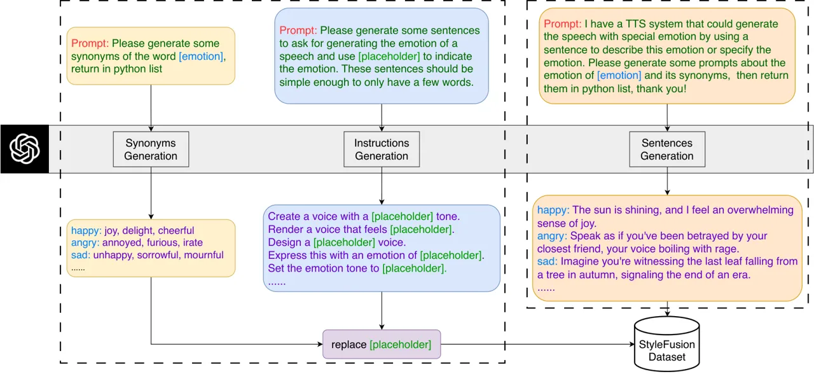
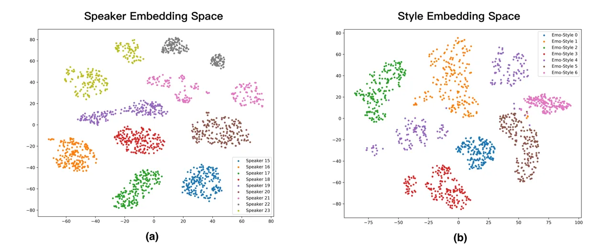
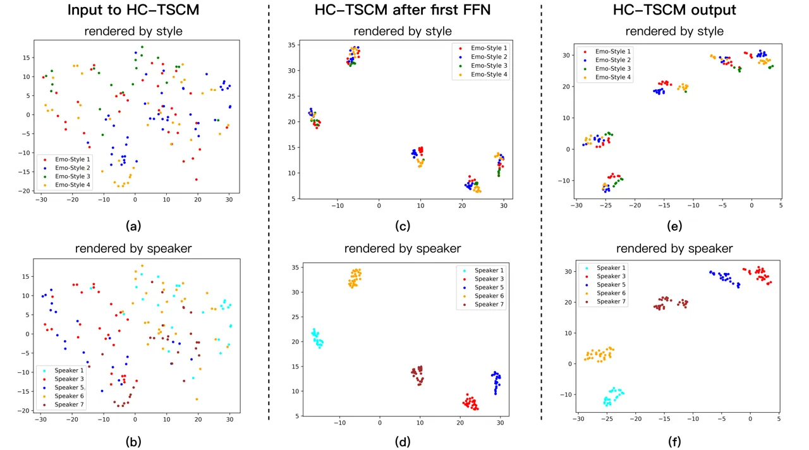

# StyleFusion TTS: Multimodal Style-control and Enhanced Feature Fusion for Zero-shot Text-to-speech Synthesis

Zhiyong
Chen[![](data:image/svg+xml;base64,PHN2ZyBjbGFzcz0ibHR4X29yY2lkbG9nbyIgaGVpZ2h0PSIxZW0iIHZlcnNpb249IjEuMSIgdmlld2JveD0iMCAwIDcyIDcyIiB3aWR0aD0iMWVtIj48cGF0aCBzdHlsZT0iLS1sdHgtZmlsbC1jb2xvcjojQTZDRTM5OyIgZD0iTTcyLDM2IEM3Miw1NS44ODQzNzUgNTUuODg0Mzc1LDcyIDM2LDcyIEMxNi4xMTU2MjUsNzIgMCw1NS44ODQzNzUgMCwzNiBDMCwxNi4xMTU2MjUgMTYuMTE1NjI1LDAgMzYsMCBDNTUuODg0Mzc1LDAgNzIsMTYuMTE1NjI1IDcyLDM2IFoiIGZpbGw9IiNBNkNFMzkiIC8+PGcgc3R5bGU9Ii0tbHR4LWZpbGwtY29sb3I6I0ZGRkZGRjsiIGZpbGw9IiNGRkZGRkYiIHRyYW5zZm9ybT0idHJhbnNsYXRlKDE4Ljg2ODk2NiwgMTIuOTEwMzQ1KSI+PHBvbHlnb24gcG9pbnRzPSI1LjAzNzM0OTI5IDM5LjEyNTA4NzggMC42OTU0Mjk4NjEgMzkuMTI1MDg3OCAwLjY5NTQyOTg2MSA5LjE0NDMxNzg3IDUuMDM3MzQ5MjkgOS4xNDQzMTc4NyA1LjAzNzM0OTI5IDIyLjY5MzA1MDUgNS4wMzczNDkyOSAzOS4xMjUwODc4Ij48L3BvbHlnb24+PHBhdGggZD0iTTExLjQwOTI1Nyw5LjE0NDMxNzg3IEwyMy4xMzgwNzg0LDkuMTQ0MzE3ODcgQzM0LjMwMzAxNCw5LjE0NDMxNzg3IDM5LjIwODgxOTEsMTcuMDY2NDA3NCAzOS4yMDg4MTkxLDI0LjE0ODY5OTUgQzM5LjIwODgxOTEsMzEuODQ2ODQzIDMzLjE0NzA0ODUsMzkuMTUzMDgxMSAyMy4xOTQ0NjY5LDM5LjE1MzA4MTEgTDExLjQwOTI1NywzOS4xNTMwODExIEwxMS40MDkyNTcsOS4xNDQzMTc4NyBaIE0xNS43NTExNzY1LDM1LjI2MjAxOTQgTDIyLjY1ODc3NTYsMzUuMjYyMDE5NCBDMzIuNDk4NTgsMzUuMjYyMDE5NCAzNC43NTQxMjI2LDI3Ljg0MzgwODQgMzQuNzU0MTIyNiwyNC4xNDg2OTk1IEMzNC43NTQxMjI2LDE4LjEzMDE1MDkgMzAuODkxNTA1OSwxMy4wMzUzNzk1IDIyLjQzMzIyMTMsMTMuMDM1Mzc5NSBMMTUuNzUxMTc2NSwxMy4wMzUzNzk1IEwxNS43NTExNzY1LDM1LjI2MjAxOTQgWiIgLz48cGF0aCBkPSJNNS43MTQwMTIwNiwyLjkwMTgyMzI5IEM1LjcxNDAxMjA2LDQuNDQxNDUyIDQuNDQ1MjY5MzcsNS43MjkxNDE0NiAyLjg2NjM4OTU4LDUuNzI5MTQxNDYgQzEuMjg3NTA5NzgsNS43MjkxNDE0NiAwLjAxODc2NzA5MTgsNC40NDE0NTIgMC4wMTg3NjcwOTE4LDIuOTAxODIzMjkgQzAuMDE4NzY3MDkxOCwxLjMzNDIwMTMzIDEuMjg3NTA5NzgsMC4wNzQ1MDUxMDk2IDIuODY2Mzg5NTgsMC4wNzQ1MDUxMDk2IEM0LjQ0NTI2OTM3LDAuMDc0NTA1MTA5NiA1LjcxNDAxMjA2LDEuMzYyMTk0NTggNS43MTQwMTIwNiwyLjkwMTgyMzI5IFoiIC8+PC9nPjwvc3ZnPg==)](https://orcid.org/0000-0002-9629-6111)
^(†)^(†)thanks: These authors contributed equally to this work.   
Xinnuo
Li[![](data:image/svg+xml;base64,PHN2ZyBjbGFzcz0ibHR4X29yY2lkbG9nbyIgaGVpZ2h0PSIxZW0iIHZlcnNpb249IjEuMSIgdmlld2JveD0iMCAwIDcyIDcyIiB3aWR0aD0iMWVtIj48cGF0aCBzdHlsZT0iLS1sdHgtZmlsbC1jb2xvcjojQTZDRTM5OyIgZD0iTTcyLDM2IEM3Miw1NS44ODQzNzUgNTUuODg0Mzc1LDcyIDM2LDcyIEMxNi4xMTU2MjUsNzIgMCw1NS44ODQzNzUgMCwzNiBDMCwxNi4xMTU2MjUgMTYuMTE1NjI1LDAgMzYsMCBDNTUuODg0Mzc1LDAgNzIsMTYuMTE1NjI1IDcyLDM2IFoiIGZpbGw9IiNBNkNFMzkiIC8+PGcgc3R5bGU9Ii0tbHR4LWZpbGwtY29sb3I6I0ZGRkZGRjsiIGZpbGw9IiNGRkZGRkYiIHRyYW5zZm9ybT0idHJhbnNsYXRlKDE4Ljg2ODk2NiwgMTIuOTEwMzQ1KSI+PHBvbHlnb24gcG9pbnRzPSI1LjAzNzM0OTI5IDM5LjEyNTA4NzggMC42OTU0Mjk4NjEgMzkuMTI1MDg3OCAwLjY5NTQyOTg2MSA5LjE0NDMxNzg3IDUuMDM3MzQ5MjkgOS4xNDQzMTc4NyA1LjAzNzM0OTI5IDIyLjY5MzA1MDUgNS4wMzczNDkyOSAzOS4xMjUwODc4Ij48L3BvbHlnb24+PHBhdGggZD0iTTExLjQwOTI1Nyw5LjE0NDMxNzg3IEwyMy4xMzgwNzg0LDkuMTQ0MzE3ODcgQzM0LjMwMzAxNCw5LjE0NDMxNzg3IDM5LjIwODgxOTEsMTcuMDY2NDA3NCAzOS4yMDg4MTkxLDI0LjE0ODY5OTUgQzM5LjIwODgxOTEsMzEuODQ2ODQzIDMzLjE0NzA0ODUsMzkuMTUzMDgxMSAyMy4xOTQ0NjY5LDM5LjE1MzA4MTEgTDExLjQwOTI1NywzOS4xNTMwODExIEwxMS40MDkyNTcsOS4xNDQzMTc4NyBaIE0xNS43NTExNzY1LDM1LjI2MjAxOTQgTDIyLjY1ODc3NTYsMzUuMjYyMDE5NCBDMzIuNDk4NTgsMzUuMjYyMDE5NCAzNC43NTQxMjI2LDI3Ljg0MzgwODQgMzQuNzU0MTIyNiwyNC4xNDg2OTk1IEMzNC43NTQxMjI2LDE4LjEzMDE1MDkgMzAuODkxNTA1OSwxMy4wMzUzNzk1IDIyLjQzMzIyMTMsMTMuMDM1Mzc5NSBMMTUuNzUxMTc2NSwxMy4wMzUzNzk1IEwxNS43NTExNzY1LDM1LjI2MjAxOTQgWiIgLz48cGF0aCBkPSJNNS43MTQwMTIwNiwyLjkwMTgyMzI5IEM1LjcxNDAxMjA2LDQuNDQxNDUyIDQuNDQ1MjY5MzcsNS43MjkxNDE0NiAyLjg2NjM4OTU4LDUuNzI5MTQxNDYgQzEuMjg3NTA5NzgsNS43MjkxNDE0NiAwLjAxODc2NzA5MTgsNC40NDE0NTIgMC4wMTg3NjcwOTE4LDIuOTAxODIzMjkgQzAuMDE4NzY3MDkxOCwxLjMzNDIwMTMzIDEuMjg3NTA5NzgsMC4wNzQ1MDUxMDk2IDIuODY2Mzg5NTgsMC4wNzQ1MDUxMDk2IEM0LjQ0NTI2OTM3LDAuMDc0NTA1MTA5NiA1LjcxNDAxMjA2LDEuMzYyMTk0NTggNS43MTQwMTIwNiwyLjkwMTgyMzI5IFoiIC8+PC9nPjwvc3ZnPg==)](https://orcid.org/0009-0003-9600-868X)
   Zhiqi
Ai[![](data:image/svg+xml;base64,PHN2ZyBjbGFzcz0ibHR4X29yY2lkbG9nbyIgaGVpZ2h0PSIxZW0iIHZlcnNpb249IjEuMSIgdmlld2JveD0iMCAwIDcyIDcyIiB3aWR0aD0iMWVtIj48cGF0aCBzdHlsZT0iLS1sdHgtZmlsbC1jb2xvcjojQTZDRTM5OyIgZD0iTTcyLDM2IEM3Miw1NS44ODQzNzUgNTUuODg0Mzc1LDcyIDM2LDcyIEMxNi4xMTU2MjUsNzIgMCw1NS44ODQzNzUgMCwzNiBDMCwxNi4xMTU2MjUgMTYuMTE1NjI1LDAgMzYsMCBDNTUuODg0Mzc1LDAgNzIsMTYuMTE1NjI1IDcyLDM2IFoiIGZpbGw9IiNBNkNFMzkiIC8+PGcgc3R5bGU9Ii0tbHR4LWZpbGwtY29sb3I6I0ZGRkZGRjsiIGZpbGw9IiNGRkZGRkYiIHRyYW5zZm9ybT0idHJhbnNsYXRlKDE4Ljg2ODk2NiwgMTIuOTEwMzQ1KSI+PHBvbHlnb24gcG9pbnRzPSI1LjAzNzM0OTI5IDM5LjEyNTA4NzggMC42OTU0Mjk4NjEgMzkuMTI1MDg3OCAwLjY5NTQyOTg2MSA5LjE0NDMxNzg3IDUuMDM3MzQ5MjkgOS4xNDQzMTc4NyA1LjAzNzM0OTI5IDIyLjY5MzA1MDUgNS4wMzczNDkyOSAzOS4xMjUwODc4Ij48L3BvbHlnb24+PHBhdGggZD0iTTExLjQwOTI1Nyw5LjE0NDMxNzg3IEwyMy4xMzgwNzg0LDkuMTQ0MzE3ODcgQzM0LjMwMzAxNCw5LjE0NDMxNzg3IDM5LjIwODgxOTEsMTcuMDY2NDA3NCAzOS4yMDg4MTkxLDI0LjE0ODY5OTUgQzM5LjIwODgxOTEsMzEuODQ2ODQzIDMzLjE0NzA0ODUsMzkuMTUzMDgxMSAyMy4xOTQ0NjY5LDM5LjE1MzA4MTEgTDExLjQwOTI1NywzOS4xNTMwODExIEwxMS40MDkyNTcsOS4xNDQzMTc4NyBaIE0xNS43NTExNzY1LDM1LjI2MjAxOTQgTDIyLjY1ODc3NTYsMzUuMjYyMDE5NCBDMzIuNDk4NTgsMzUuMjYyMDE5NCAzNC43NTQxMjI2LDI3Ljg0MzgwODQgMzQuNzU0MTIyNiwyNC4xNDg2OTk1IEMzNC43NTQxMjI2LDE4LjEzMDE1MDkgMzAuODkxNTA1OSwxMy4wMzUzNzk1IDIyLjQzMzIyMTMsMTMuMDM1Mzc5NSBMMTUuNzUxMTc2NSwxMy4wMzUzNzk1IEwxNS43NTExNzY1LDM1LjI2MjAxOTQgWiIgLz48cGF0aCBkPSJNNS43MTQwMTIwNiwyLjkwMTgyMzI5IEM1LjcxNDAxMjA2LDQuNDQxNDUyIDQuNDQ1MjY5MzcsNS43MjkxNDE0NiAyLjg2NjM4OTU4LDUuNzI5MTQxNDYgQzEuMjg3NTA5NzgsNS43MjkxNDE0NiAwLjAxODc2NzA5MTgsNC40NDE0NTIgMC4wMTg3NjcwOTE4LDIuOTAxODIzMjkgQzAuMDE4NzY3MDkxOCwxLjMzNDIwMTMzIDEuMjg3NTA5NzgsMC4wNzQ1MDUxMDk2IDIuODY2Mzg5NTgsMC4wNzQ1MDUxMDk2IEM0LjQ0NTI2OTM3LDAuMDc0NTA1MTA5NiA1LjcxNDAxMjA2LDEuMzYyMTk0NTggNS43MTQwMTIwNiwyLjkwMTgyMzI5IFoiIC8+PC9nPjwvc3ZnPg==)](https://orcid.org/0009-0005-1034-9972)
   Shugong
Xu[![](data:image/svg+xml;base64,PHN2ZyBjbGFzcz0ibHR4X29yY2lkbG9nbyIgaGVpZ2h0PSIxZW0iIHZlcnNpb249IjEuMSIgdmlld2JveD0iMCAwIDcyIDcyIiB3aWR0aD0iMWVtIj48cGF0aCBzdHlsZT0iLS1sdHgtZmlsbC1jb2xvcjojQTZDRTM5OyIgZD0iTTcyLDM2IEM3Miw1NS44ODQzNzUgNTUuODg0Mzc1LDcyIDM2LDcyIEMxNi4xMTU2MjUsNzIgMCw1NS44ODQzNzUgMCwzNiBDMCwxNi4xMTU2MjUgMTYuMTE1NjI1LDAgMzYsMCBDNTUuODg0Mzc1LDAgNzIsMTYuMTE1NjI1IDcyLDM2IFoiIGZpbGw9IiNBNkNFMzkiIC8+PGcgc3R5bGU9Ii0tbHR4LWZpbGwtY29sb3I6I0ZGRkZGRjsiIGZpbGw9IiNGRkZGRkYiIHRyYW5zZm9ybT0idHJhbnNsYXRlKDE4Ljg2ODk2NiwgMTIuOTEwMzQ1KSI+PHBvbHlnb24gcG9pbnRzPSI1LjAzNzM0OTI5IDM5LjEyNTA4NzggMC42OTU0Mjk4NjEgMzkuMTI1MDg3OCAwLjY5NTQyOTg2MSA5LjE0NDMxNzg3IDUuMDM3MzQ5MjkgOS4xNDQzMTc4NyA1LjAzNzM0OTI5IDIyLjY5MzA1MDUgNS4wMzczNDkyOSAzOS4xMjUwODc4Ij48L3BvbHlnb24+PHBhdGggZD0iTTExLjQwOTI1Nyw5LjE0NDMxNzg3IEwyMy4xMzgwNzg0LDkuMTQ0MzE3ODcgQzM0LjMwMzAxNCw5LjE0NDMxNzg3IDM5LjIwODgxOTEsMTcuMDY2NDA3NCAzOS4yMDg4MTkxLDI0LjE0ODY5OTUgQzM5LjIwODgxOTEsMzEuODQ2ODQzIDMzLjE0NzA0ODUsMzkuMTUzMDgxMSAyMy4xOTQ0NjY5LDM5LjE1MzA4MTEgTDExLjQwOTI1NywzOS4xNTMwODExIEwxMS40MDkyNTcsOS4xNDQzMTc4NyBaIE0xNS43NTExNzY1LDM1LjI2MjAxOTQgTDIyLjY1ODc3NTYsMzUuMjYyMDE5NCBDMzIuNDk4NTgsMzUuMjYyMDE5NCAzNC43NTQxMjI2LDI3Ljg0MzgwODQgMzQuNzU0MTIyNiwyNC4xNDg2OTk1IEMzNC43NTQxMjI2LDE4LjEzMDE1MDkgMzAuODkxNTA1OSwxMy4wMzUzNzk1IDIyLjQzMzIyMTMsMTMuMDM1Mzc5NSBMMTUuNzUxMTc2NSwxMy4wMzUzNzk1IEwxNS43NTExNzY1LDM1LjI2MjAxOTQgWiIgLz48cGF0aCBkPSJNNS43MTQwMTIwNiwyLjkwMTgyMzI5IEM1LjcxNDAxMjA2LDQuNDQxNDUyIDQuNDQ1MjY5MzcsNS43MjkxNDE0NiAyLjg2NjM4OTU4LDUuNzI5MTQxNDYgQzEuMjg3NTA5NzgsNS43MjkxNDE0NiAwLjAxODc2NzA5MTgsNC40NDE0NTIgMC4wMTg3NjcwOTE4LDIuOTAxODIzMjkgQzAuMDE4NzY3MDkxOCwxLjMzNDIwMTMzIDEuMjg3NTA5NzgsMC4wNzQ1MDUxMDk2IDIuODY2Mzg5NTgsMC4wNzQ1MDUxMDk2IEM0LjQ0NTI2OTM3LDAuMDc0NTA1MTA5NiA1LjcxNDAxMjA2LDEuMzYyMTk0NTggNS43MTQwMTIwNiwyLjkwMTgyMzI5IFoiIC8+PC9nPjwvc3ZnPg==)](https://orcid.org/0000-0003-1905-6269)
Affiliation: School of Communication and Information Engineering,
Shanghai University, Shanghai, China
E-mail <%7Bzhiyongchen,bingpohun,aizhiqi-work,shugong%7D@shu.edu.cn>

###### Abstract

We introduce StyleFusion-TTS, a prompt and/or audio referenced, style-
and speaker-controllable, zero-shot text-to-speech (TTS) synthesis
system designed to enhance the editability and naturalness of current
research literature. We propose a general front-end encoder as a compact
and effective module to utilize multimodal inputs—including text
prompts, audio references, and speaker timbre references—in a fully
zero-shot manner and produce disentangled style and speaker control
embeddings. Our novel approach also leverages a hierarchical conformer
structure for the fusion of style and speaker control embeddings, aiming
to achieve optimal feature fusion within the current advanced TTS
architecture. StyleFusion-TTS is evaluated through multiple metrics,
both subjectively and objectively. The system shows promising
performance across our evaluations, suggesting its potential to
contribute to the advancement of the field of zero-shot text-to-speech
synthesis. A project website provides detailed information for
demonstration and reproduction¹¹ 1 ProjectPage:
https://srplplus.github.io/StyleFusionTTS-demo.

###### Keywords: 

Text-to-speech synthesis Voice cloning Zero-shot learning Multimodal
learning.

## 1 Introduction

Text-to-speech (TTS) synthesis has experienced significant advancements
in recent years, leading to enhancements in a variety of applications
ranging from virtual assistants to accessibility tools. These
innovations are exemplified by state-of-the-art expert models \[12\] and
transformer decoder-only models \[23\]. Parallel developments in
generative technologies, such as OpenAI’s GPT \[1\] and AI-generated
content (AIGC) using prompt control like StableDiffusion3 \[7\], reflect
similar progress in adjacent fields.

There is a growing demand for generating audio that can zero-shot mimic
the voice timbre of a given reference speaker, while allowing for the
customization of content, known as zero-shot TTS (ZS-TTS) or voice
cloning \[3\]\[14\]. This capability significantly enhances system
flexibility and scalability.

A major challenge in ZS-TTS systems is the accurate reproduction of the
speaker’s voice timbre, along with control over speech styles, such as
emotion, accent, or characteristics like speed and volume, and
maintaining high editability. One method involves using an audio sample
for style reference \[30\]\[29\], which allows for high customization.
However, obtaining such emotional audio can be challenging and may not
reliably guide style generation due to the deep entanglement of voice
print and stylistic or other acoustic information. Label control is
prevalent for style manipulation \[21\], though it often limits
variability compared to audio references. Some works utilize prompts to
generate speech directly \[16\]\[20\], but this approach compromise the
precision of cloning the voice timbre from the speaker’s audio.

To address these challenges, we introduce StyleFusion-TTS, an advanced
framework designed for zero-shot, style-controlled TTS synthesis. Our
methodology combines three input modalities: text prompts for natural,
interactive dialogue, and/or style-reference audio for precise style
customization, and speaker-reference audio for accurate zero-shot
speaker identity cloning. This triple-control-input approach enhances
precise control over both the stylistic elements and the distinct voice
timbre of the speaker, fully realizing a zero-shot capability in a
multi-modal context.

We introduce a compact front-end termed General Style Fusion encoder to
encode and disentangle multiple control embeddings for speaker identity
and emotions, improving disentanglement for speaker and style modeling.
This module facilitates the seamless integration of multi-modal inputs,
including text style prompts, audio style references, and speaker voice
print or timbre references, all in a fully zero-shot manner.
Furthermore, by integrating a novel style control fusion module named
HC-TSCM (Hierarchical Conformer Two-Branch Style Control Module) into
the state-of-the-art conditional CVAE-based VITS \[13\] TTS model,
ensuring optimal feature fusion and maintain high naturalness in speech
synthesis. Our contributions can be summarized as follows:

- •
  A generalized front-end block capable of representing speaker voice
  timbre and speech emotional style in a multi-modal and zero-shot
  manner.
- •
  An enhanced Hierarchical Conformer Two-Branch Style Control Module
  (HC-TSCM) that ensures effective feature fusion for zero-shot TTS.
- •
  The introduction of StyleFusion-TTS, an advancement of existing TTS
  architecture, designed to produce controllable and natural-sounding
  speech.

## 2 Related Work

The field of style-controllable speech synthesis has seen significant
advancements aimed at increasing expressiveness, naturalness, and
controllability. Methods such as PromptVC \[25\] explore voice
conversion, while others like Daisy-TTS \[5\] focus on emotion transfer
for single speakers. However, these approaches often fall short in
effectively capturing content information or accurately representing
speaker identity, primarily concentrating on style conversion and thus
restricting their broader applicability.

In multi-speaker text-to-speech (Multi-TTS) synthesis, prompt control
has become popular for facilitating natural interaction with human
input. Innovations like PromptSpeaker \[27\] use prompt information to
convey speaker details, while other approaches employ prompts to guide
the general style of the speech without disentangling speaker identity
and style elements, as seen in Parler-TTS \[20\], EmotiVoice \[6\],
PromptTTS2 \[9\]\[16\], and PromptStyle \[19\]. MM-TTS systems \[8\]
extend this by incorporating visual modalities alongside textual prompts
for style guidance. However, the lack of explicit modeling of speaker
timbre and the absence of style and speaker disentanglement in these
systems restrict their capabilities for precise speaker cloning,
limiting their versatility in TTS scenarios.

Zero-shot TTS (ZS-TTS) and voice cloning technologies aim to accurately
mimic a speaker’s voice print, a critical feature for TTS systems.
Notable contributions in this area include VALLE \[23\], Hierspeech++
\[14\], and StyleTTS2 \[17\], which focus on precise speaker modeling
for effective voice cloning. Additionally, systems like ExpressiveSpeech
\[30\], Vec-Tok Speech \[31\], and METTS \[29\] introduce style or
emotion control by using reference audio. However, despite their
customizability, they often lack the flexibility offered by prompt-based
systems. To enhance control flexibility and style robustness, approaches
like ZET-Speech \[11\] and OpenVoice \[21\] employ emotion labels for
additional control, though this sometimes restricts user input’s ease
and expressiveness.

These collective developments underscore a significant evolution towards
systems like StyleFusion-TTS, which integrate flexible text prompts
and/or audio references for comprehensive style control alongside
speaker modeling in zero-shot learning contexts. Leveraging the
naturalness of existing ZS-TTS models and incorporating multimodal
inputs, StyleFusion-TTS aims to substantially improve speech synthesis
customization, enabling more natural and engaging human-computer
interactions.

| Methods                 | ZS Speaker-clone | Prompt Style-control | Audio Style-control | Disentanglement | Ease of Reproduction |
| ----------------------- | ---------------- | -------------------- | ------------------- | --------------- | -------------------- |
| ExpressiveSpeech \[30\] | ✓                |                      | ✓                   |                 |                      |
| PromptSpeaker \[27\]    |                  | ✓                    |                     |                 |                      |
| PromptStyle \[18\]      |                  | ✓                    |                     | ✓               |                      |
| Vec-Tok \[31\]          | ✓                |                      | ✓                   |                 |                      |
| ZET-Speech \[11\]       | ✓                | (Label Only)         |                     |                 |                      |
| StyleTTS2 \[17\]        | ✓                |                      | ✓                   |                 |                      |
| PromptTTS2 \[16\]       |                  | ✓                    |                     |                 |                      |
| METTS \[29\]            | ✓                |                      | ✓                   |                 |                      |
| ParlerTTS \[20\]        |                  | ✓                    |                     |                 | ✓                    |
| OpenVoice \[21\]        | ✓                | (Label Only)         |                     |                 | ✓                    |
| EmotiVoice \[6\]        |                  | ✓                    |                     |                 | ✓                    |
| MMTTS \[8\]             |                  | ✓                    | ✓                   |                 | ✓                    |
| StyleFusion-TTS(Ours)   | ✓                | ✓                    | ✓                   | ✓               | ✓                    |

Table 1: Comparison of recent related work on style-controllable ZS-TTS

| Methods                 | ZS Speaker-clone | Prompt Style-control | Audio Style-control | Disentanglement | Ease of Reproduction |
| ----------------------- | ---------------- | -------------------- | ------------------- | --------------- | -------------------- |
| ExpressiveSpeech \[30\] | ✓                |                      | ✓                   |                 |                      |
| PromptSpeaker \[27\]    |                  | ✓                    |                     |                 |                      |
| PromptStyle \[18\]      |                  | ✓                    |                     | ✓               |                      |
| Vec-Tok \[31\]          | ✓                |                      | ✓                   |                 |                      |
| ZET-Speech \[11\]       | ✓                | (Label Only)         |                     |                 |                      |
| StyleTTS2 \[17\]        | ✓                |                      | ✓                   |                 |                      |
| PromptTTS2 \[16\]       |                  | ✓                    |                     |                 |                      |
| METTS \[29\]            | ✓                |                      | ✓                   |                 |                      |
| ParlerTTS \[20\]        |                  | ✓                    |                     |                 | ✓                    |
| OpenVoice \[21\]        | ✓                | (Label Only)         |                     |                 | ✓                    |
| VALL-E \[21\]           | ✓                |                      |                     |                 | ✓                    |
| HierSpeech++ \[21\]     | ✓                |                      |                     |                 | ✓                    |
| NaturalSpeech3 \[21\]   | ✓                |                      |                     |                 | ✓                    |
| EmotiVoice \[6\]        |                  | ✓                    |                     |                 | ✓                    |
| MMTTS \[8\]             |                  | ✓                    | ✓                   |                 | ✓                    |
| StyleFusion-TTS(Ours)   | ✓                | ✓                    | ✓                   | ✓               | ✓                    |
| TSCM-VITS(Ours)         | ✓                |                      |                     |                 | ✓                    |
| StableTTS(Ours)         | ✓                |                      |                     |                 | ✓                    |
| StableTTS++(Ours)       | ✓                | ✓                    | ✓                   | ✓               | ✓                    |

Table 2: Comparison of recent related work on style-controllable ZS-TTS

## 3 StyleFusion-TTS: Multimodal Style and Speaker Control Enhanced TTS

Figures 1 illustrate the overall architecture of StyleFusion-TTS for
training and inference, respectively. The incorporation of the
multimodal reference into the VITS architecture \[13\] aims to enable
optimal naturalness and enhanced controllability for speaker and style
information. Our model is a flow-conditional-VAE architecture used to
synthesize the audio $`x`$, conditioned on the input text $`t`$ and
control embeddings $`c=[emb_{style},emb_{speaker}]`$. The
text-to-acoustic distribution is modeled as a normalized flow $`f(z)`$,
which projects acoustic features $`z`$ to the text features. The
optimization of the backbone model involves maximizing the evidence
lower bound (ELBO), in alignment with the implementation in original
VITS \[12\]:

```math
\displaystyle\log p(x|t,c)\geq\mathbb{E}_{q(f(z)|x,t,c)} \displaystyle\left[\log p_{\theta}(x|z,t,c)\right]-D_{KL}\left[q(f(z)|x,t,c)\|p(z|t,c)\right] \tag{1}
```

```math
\displaystyle L_{syn} \displaystyle=maximize(ELBO(\cdot)). \tag{2}
```

During training, optimization is conducted with end-to-end training
using a HiFi-GAN vocoder and its discriminator. During inference, the
output of is upsampled to higher quality using the pretrained SpeechSR
module \[14\].



Figure 1: Model overview for StyleFusion-TTS

### 3.1 General Style Fusion Front-end Encoder (GSF-enc)

As illustrated in Figure 2, we propose the General Style Fusion Encoder
(GSF-enc) to accurately generate style and speaker embeddings. These
embeddings effectively control the style and speaker-related aspects of
the backbone models and disentangle these two types of information from
multimodal inputs. The text of the input is modeled with the CLIP \[22\]
text encoder. The reference text training data is augmented with
OpenAI’s \[1\] LLM to enhance the training text prompts for the style
labels in the training datasets. The main procedures are illustrated in
Figure 4. This process includes generating synonyms for the styles in
the dataset to produce multiple keywords (figure left), generating
instructions with keywords from the generated keywords (figure middle),
and instructing the LLM to directly generate sentences describing each
style in the dataset to further augment data variety (figure right). For
reference audio, including audio for speaker cloning and style guiding,
the audio linear spectrum is extracted as front-end features.

For optimizing the GSF-enc, the $`L_{text\_style}`$ and
$`L_{audio\_style}`$ jointly supervise the training of the style
embedding space output. The $`L_{spk}`$ supervises the training of the
speaker identity, modeling the speaker embedding space and generating
the speaker embedding $`emb_{speaker}`$. While the multimodal inputs are
entangled with multiple speech information \[10\], a Gradient Reversal
Layer (GRL) is employed, supervised with $`L_{style\_grl}`$, to
disentangle the embedding spaces of the speaker and style embeddings.
This ensures that the representations of the speaker and style are
separated. These components constitute the front-end encoder loss,
represented as $`L_{GSFenc}`$. Following the design pattern noted in
related tasks \[15\], the prompt (text modality) provides a more stable
and coarse guidance, while the audio serves as a supplementary reference
for better customization of style. To facilitate and/or feature these
two style control inputs, a dropout mechanism for generating the final
style embedding $`emb_{style}`$ is used. This mechanism combines the
audio emotion embedding $`emb_{style\_audio}`$ and the prompt emotion
embedding $`emb_{style\_prompt}`$ during training. Therefore:

```math
\displaystyle emb_{style}=p_{drop}\cdot emb_{style\_audio}+emb_{style\_prompt} \tag{3}
```

```math
\displaystyle L_{GSFenc}=L_{text\_style}+L_{audio\_style}+L_{spk}+L_{style\_grl} \tag{4}
```

```math
\displaystyle L_{total}=L_{GSFenc}+L_{syn}. \tag{5}
```

The core learning target for StyleFusion-TTS consists of training the
$`L_{GSFenc}`$, and the total loss $`L_{total}`$ for optimization is the
combination of the front-end encoder loss and the original speech
synthesis loss as defined in Equation (2).

Figure 2: Front-end general style fusion encoder (GSF-enc) for speaker
and style representation and disentanglement

### 3.2 Control-fusion with Hierachical Conformer TSCM (HC-TSCM)

The Two-branch Style Control Module (TSCM) \[4\] is proposed as a fusion
method used for advanced style or speaker control, significantly
improving speech naturalness for TTS models. We propose using the
Hierarchical Conformer TSCM (HC-TSCM), a significant upgrade upon TSCM,
to accommodate the case of double control embeddings for disentangled
speaker and style embeddings. This method fuses the control embeddings
from the GSF-enc into optimal positions within the backbone. As shown in
Figure 3, the fusion method of HC-TSCM takes the input style vector
$`emb_{style}`$ and $`emb_{speaker}`$, which are hierarchically fused
with $`\mathbf{w}_{in}`$, the frame-level feature inputs fitting all
positions in the backbone. The $`\mathbf{w}_{out}`$ represents the
output of the HC-TSCM module:

```math
\displaystyle\mathbf{w}=MSA(FFN_{1}(\mathbf{w}_{in},emb_{speaker})) \tag{6}
```

```math
\displaystyle\mathbf{w}=GRU(\mathbf{w},emb_{speaker}+emb_{style})+Conv(\mathbf{w}) \tag{7}
```

```math
\displaystyle\mathbf{w}_{out}=LN(FFN_{2}(\mathbf{w},emb_{style})), \tag{8}
```

combining multi-head attention (MSA), GRU, ConvNet for local and
utterance-wide focusing \[4\]. The HC-TSCM is adapted as an effective
fusion strategy that first renders the speaker information, then the
style information, in a hierarchical manner, making the style as
variants of the intra-class variation within the modeling of each
speaker. StyleFusion-TTS uses HC-TSCM with the goal to precisely control
the speaker identity and then make style a flexible variation for each
speaker, without losing speaker timbre similarity, thereby achieving
superior naturalness (as proven in later experimental studies).



Figure 3: Hierachical conformer TSCM (HC-TSCM) for control-fusion



Figure 4: Style-control prompt generation pipline with LLM

### 3.3 Control Implementation with Backbone

The incorporation of HC-TSCM into the VITS backbone aims to enable
optimized style and speaker control. This is implemented within its
three core modules: the text content encoder, duration predictor, and
text-to-acoustic flow. Figures 1 illustrate the overall implementation
of our model and the integration of HC-TSCM.

#### Text Content Encoder

Text content for synthesis is highly relevant to different speakers and
emotional styles. Therefore, the transformer block in the original work
is smoothly substituted with HC-TSCM. For input $`h_{content}`$ to each
of the text transformer blocks, the result is given by:

```math
h_{content}=\text{HC-TSCM}(h_{content},emb_{style},emb_{spk}) \tag{9}
```

#### Duration Predictor

The duration predictor module is designed to predict the optimal
alignments for text-content-frames to acoustic-frames, highly related to
the content $`h_{content}`$, style, and speaker. Therefore, we
pre-condition the duration input as the combination of the content,
style, and speaker, resulting in the procedure (exemplified by the
inference stage):

```math
\displaystyle h_{dur\_in}=\text{HC-TSCM}(h_{content},emb_{style},emb_{spk}) \tag{10}
```

```math
\displaystyle d_{predict}=\text{Flow}^{-1}_{dur}(h_{dur\_in},\epsilon), \tag{11}
```

where $`\epsilon`$ is sampled from random noise for prediction
variability. The control-rendered $`h_{dur_{i}n}`$ is then input to the
duration flow model $`\text{Flow}^{-1}{dur}(\cdot)`$ to accurately
predict the duration $`d{predict}`$ for each text-content-frame
conditioned on the multiple control embeddings.

#### Text-to-acuoustic Flow

The text-to-acoustic normalizing flow \[13\] is a module designed to
project text to speech at the feature level, highly relevant to speaker
and style, to generate optimal prosody and timbre acoustic codes to
decode for the final waveform. Modeled as
$`f(z)=f_{n}\circ f_{n-1}\circ\cdots\circ f_{1}(z)`$ using the residual
coupling layers, where $`f(z)`$ represents the content frames and $`z`$
represents the acoustic frames. We define the operation of each flow
function $`f_{i}(z_{0:C})`$ for $`C`$ channels of input features with
the HC-TSCM as:

```math
\displaystyle m(z_{0:c}),\sigma(z_{0:c})=\text{HC-TSCM}(z_{0:c};{emb}_{style},{emb}_{spk}) \tag{12}
```

```math
\displaystyle z_{0:c}\leftarrow z_{0:c} \tag{13}
```

```math
\displaystyle z_{c+1:C}\leftarrow m(z_{0:c})+\sigma(z_{0:c})\cdot z_{c+1:C}. \tag{14}
```

HC-TSCM is implemented for generating the projection elements
$`m[z_{0:c}]`$ and $`\sigma[z_{0:c}]`$ in text-to-acoustic flow,
involving style and speaker control for guiding precise and editable
speech synthesis.

## 4 Experimental Settings

Our StyleFusion-TTS system was trained on the ESD and EmoDB \[2\]\[28\]
multi-speaker TTS corpus. For the purpose of zero-shot speaker cloning
testing, we randomly selected 12 speakers, comprising an equal number of
males and females. The remaining data was used for the training phase.

In our experiments, all utterances are output at a frequency of 48000
Hz. Our proposed models are trained for 1,000,000 steps. We adhere to
the protocols described in the original VITS settings \[12\] for other
training considerations, such as losses and data processing strategies.

The evaluation consists of well-established metrics, including
subjective evaluations of MOS, Speaker-MOS for speaker similarity, and
Emotion-MOS for style adherence. These are conducted with a series of
sample utterances and evaluated by 20 guests who assign scores from 0 to
5 on these three metrics. The subjective testing phoneme content and
style prompt align with the online demonstration of \[8\] for fair
comparison and to evaluate MOS and Emotion-MOS. Note that \[8\] does not
perform speaker cloning. For systems that support speaker cloning, we
conduct secondary subjective testing while maintaining these phoneme
contents and use the kept-out speakers for enrollment to evaluate their
MOS and Speaker-MOS. For systems participating in both tests, their MOS
scores are averaged.

Objective evaluations include mean square error in spectrum with ground
truth (MCD), word error rate for speech recognition (WER), model-based
speaker similarity²² 2 https://github.com/resemble-ai/Resemblyzer
(SECS), and model-based emotional style accuracy³³ 3 wav2vec2 emotion
recognition:
https://huggingface.co/ehcalabres/wav2vec2-lg-xlsr-en-speech-emotion-recognition
(EMO-Acc), aligning with \[8\]\[23\]. For evaluating systems that
support style control, the same testing set used in the subjective
evaluation is employed. For evaluating systems that support speaker
cloning, a testing set of 100 utterances is composed, as ground truth is
needed for calculating MCD. More implementation details can be found on
our project website¹.

## 5 Results

#### Main results and comparison

For the comparison of our proposed StyleFusion-TTS models with other
state-of-the-art (SOTA) or strong baselines, we demonstrate model
comparisons and subjective evaluations, as illustrated in Table 3. The
comparing models can be split into three categories: SOTA systems
focusing on zero-shot speaker cloning (ZS-TTS) which are well-studied,
systems optimized for style control that cannot clone speakers, and
systems that support both. Our models excel in both areas, and our
training data usage is efficient, indicating the superior modeling
ability of VITS-based models and great potential for scaling in the
future.

Compared with VALLE and HierSpeech++, which are spotlight
representatives for transformer-decoder based TTS and CVAE based TTS
models respectively, our proposed method outperforms these two SOTA
ZS-TTS methods. StyleFusion-TTS still excels and furthermore, they lack
the ability for further style control. Systems including MM-TTS, and
EmotiVoice-based systems, though capable of controlling the emotional
style of speech, are not feasible for performing ZS-TTS tasks and
perform suboptimally. Although the OpenVoice system supports both
speaker cloning and emotional style control, its performance is not
optimal.

Similar results are illustrated for objective evaluation, as shown in
Tables 5 and 5, where we group the comparing systems into those feasible
to evaluate speaker identity and style control, and ours participate in
both. StyleFusion-TTS demonstrates overall better performance, except in
WER compared with the SOTA system HierSpeech++, due to its slow prosody
and extremely clear pronunciation of words, trained on 100 times the
data compared with ours. Many hard words are modeled, which highlights
the necessity for us to scale-up in the next step.

|                        |                          |                  |                  |                          |                          |
| ---------------------- | ------------------------ | ---------------- | ---------------- | ------------------------ | ------------------------ |
| Methods                | Training Data            | Feasible Control | MOS $`\uparrow`$ | Speaker-MOS $`\uparrow`$ | Emotion-MOS $`\uparrow`$ |
| VALLE \[23\]           | LibriLight (60000hrs)    | Speaker          | 3.74             | 3.35                     | N/S                      |
| HierSpeech++ \[26\]    | Multiple (2796hrs)       | Speaker          | 4.00             | 3.68                     | N/S                      |
| MM-StyleSpeech \[8\]   | MEAD (40hrs) \[24\]      | Style            | 3.55             | N/S                      | 3.60                     |
| MM-TTS \[8\]           | MEAD (40hrs) \[24\]      | Style            | 3.56             | N/S                      | 3.60                     |
| EmotiVoice \[6\]       | LibriTTS/HifiTTS(400hrs) | Style            | 4.32             | N/S                      | 3.50                     |
| OpenVoice \[21\]       | LibriTTS(360hrs)         | Speaker+Style    | 4.17             | 3.58                     | 3.81                     |
| StyleFusion T (Ours)   | ESD/EmoDB(30hrs)         | Speaker+Style    | 4.34             | 4.19                     | 4.23                     |
| StyleFusion A (Ours)   | ESD/EmoDB(30hrs)         | Speaker+Style    | 4.25             | 4.01                     | 4.16                     |
| StyleFusion T+A (Ours) | ESD/EmoDB(30hrs)         | Speaker+Style    | 4.29             | 4.19                     | 4.28                     |

Table 3: Subjective evaluations and model comparisons for our system and
strong baselines, with N/S indicating not supported features

| Methods                | MCD $`\downarrow`$ | SECS $`\uparrow`$ | WER % $`\downarrow`$ |
| ---------------------- | ------------------ | ----------------- | -------------------- |
| VALLE \[23\]           | 11.360             | 0.707             | 14.165               |
| OpenVoice \[21\]       | 8.562              | 0.686             | 12.619               |
| HierSpeech++ \[26\]    | 10.726             | 0.748             | 6.229                |
| StyleFusion T (Ours)   | 5.775              | 0.807             | 14.644               |
| StyleFusion A (Ours)   | 5.825              | 0.795             | 14.134               |
| StyleFusion T+A (Ours) | 5.762              | 0.810             | 13.960               |

Table 4: Objective evaluations for our models and strong baselines
feasible for speaker voice cloning (ZS-TTS)

|                        |                      |                        |
| ---------------------- | -------------------- | ---------------------- |
| Methods                | WER % $`\downarrow`$ | EMO-Acc % $`\uparrow`$ |
| MM-StyleSpeech \[8\]   | 19.17                | 13 (-37)               |
| MM-TTS \[8\]           | 16.12                | 6 (-44)                |
| OpenVoice \[21\]       | 13.66                | 25 (-25)               |
| EmotiVoice \[6\]       | 22.53                | 12 (-37)               |
| StyleFusion T+A (Ours) | 13.96                | 50 (0)                 |

Table 5: Objective evaluations for our model and strong baselines for
emotional style control



Figure 5: (a)-(b) The style and speaker embeddings of GSF-enc



Figure 6: (a)-(f) Embedding visualization for HC-TSCM modules at three
positions in the last acoustic-flow layer, rendered in different colors
for various speakers or styles

| Methods         | Fusion Modules    | MCD $`\downarrow`$ | SECS $`\uparrow`$ | WER % $`\downarrow`$ |
| --------------- | ----------------- | ------------------ | ----------------- | -------------------- |
| StyleFusion T+A | HC-TSCM (Ours)    | 5.762              | 0.810             | 13.961               |
| w/o HC-TSCM T   | TSCM \[4\]        | 6.007              | 0.737             | 25.950               |
| w/o HC-TSCM A   | TSCM \[4\]        | 11.069             | 0.550             | 95.963               |
| w/o HC-TSCM T+A | TSCM \[4\]        | 6.008              | 0.755             | 19.762               |
| w/o TSCM T      | Naive VITS \[23\] | 6.594              | 0.693             | 17.857               |
| w/o TSCM A      | Naive VITS \[23\] | 6.470              | 0.714             | 17.857               |
| w/o TSCM T+A    | Naive VITS \[23\] | 6.422              | 0.742             | 20.358               |

Table 6: Ablation studies comparing models with and without
HC-TSCM-based speaker and style-aware fusion

| Style Control                                                    | EMO-Acc % $`\uparrow`$ |
| ---------------------------------------------------------------- | ---------------------- |
| Neutral text prompt + Emotional audio prompt                     | 63.5                   |
| Emotional text prompt + Neutral audio prompt                     | 77.8                   |
| Emotional text prompt + Emotional audio prompt                   | 83.3                   |
| Negative emotional text prompt + Positive emotional audio prompt | 36.4                   |
| Positive emotional text prompt + Negative emotional audio prompt | 36.0                   |

Table 7: Study of control effects with contradictory versus consistent
text and audio modalities

#### Auxiliary studies

We conducted additional evaluations and analyses to assess the
effectiveness of each module we proposed. As illustrated in Table 6,
using our proposed HC-TSCM for control fusion performs overall better
than the baseline TSCM and the naive VITS original control fusion method
(i.e., simple concatenation of $`emb_{style}`$ and $`emb_{speaker}`$).
In Figure 5, we demonstrated that the embeddings for style and speaker
control are effective (a) & (b) for representing the speakers and
styles. For the plots in Figure 6 (a)-(f), we observe a clearer view of
the effectiveness of the HC-TSCM module, using the visualization of the
HC-TSCM from the last flow module. Each point represents an
utterance-level mean. By hierarchically adding speaker and style
information, we observe a transformation from a chaotic distribution at
input in (a) & (b), to a more clustered distribution for speakers in (c)
& (d), and finally clustered features for speakers with intra-speaker
distinguishable features for emotional styles in (e) & (f). These
results demonstrate the effective generation of speaker and style
control by using the HC-TSCM modul and GSF-enc, highlighting the
effectiveness of our design.

In Table 7, we conduct experiments with 100 prompt and audio pairs for
each scenario of using prompts and audio, and we evaluate the EMO-Acc
for the synthesized speech. This demonstrates that the audio and prompt
style control modalities are complementary when both emotions express
the same tendency, and if set to be contradictory, the emotional effect
will be neutralized, as indicated by the degradation in EMO-Acc metric.
This highlights the effective multimodal modeling capability for style
control embedding representation of our proposed GSF-enc and its
expected traits.

## 6 Conclusions

We proposed StyleFusion-TTS, a prompt and/or audio referenced, style-
and speaker-controllable, zero-shot TTS system. By innovatively
employing the HC-TSCM fusion module, our system achieves optimal
integration of speaker and style control embeddings. The introduction of
the general front-end encoder facilitates the effective utilization of
multimodal inputs, including both prompt and reference audio, and
improves disentanglement. These proposed methods significantly broaden
the applicability and flexibility of TTS technologies while maintaining
naturalness. Our comprehensive evaluations, with both subjective and
objective metrics, confirm the performance of StyleFusion-TTS. Looking
ahead, as we continue to refine and expand this framework,
StyleFusion-TTS will extend to a multilingual version, enhancing its
precision and expressiveness for improved effectiveness.

## Acknowledgements

This work was supported in part by the National High Quality Program
grant TC220H07D, the National Natural Science Foundation of China (NSFC)
under Grant 61871262, the National Key R&D Program of China grants
2022YFB2902000, the Innovation Program of Shanghai Municipal Science and
Technology Commission under Grant 20511106603, Foshan Science and
Technology Innovation Team Project grant FS0AAKJ919-4402-0060.

## References

- \[1\] Achiam, J., Adler, S., Agarwal, S., Ahmad, L., Akkaya, I.,
  Aleman, F.L., Almeida, D., Altenschmidt, J., Altman, S., Anadkat, S.,
  et al.: Gpt-4 technical report. arXiv preprint arXiv:2303.08774 (2023)
- \[2\] Adigwe, A., Tits, N., Haddad, K.E., Ostadabbas, S., Dutoit, T.:
  The emotional voices database: Towards controlling the emotion
  dimension in voice generation systems. arXiv preprint
  arXiv:1806.09514 (2018)
- \[3\] Casanova, E., Weber, J., Shulby, C.D., Junior, A.C., Gölge, E.,
  Ponti, M.A.: YourTTS: Towards zero-shot multi-speaker TTS and
  zero-shot voice conversion for everyone. In: Proceedings of the 39th
  International Conference on Machine Learning. pp. 2709–2720. PMLR,
  [https://proceedings.mlr.press/v162/casanova22a.html](https://proceedings.mlr.press/v162/casanova22a.html),
  ISSN: 2640-3498
- \[4\] Chen, Z., Ai, Z., Ma, Y., Li, X., Xu, S.: Optimizing feature
  fusion for improved zero-shot adaptation in text-to-speech synthesis.
  EURASIP Journal on Audio, Speech, and Music Processing 2024(1),
   28 (2024)
- \[5\] Chevi, R., Aji, A.F.: Daisy-TTS: Simulating wider spectrum of
  emotions via prosody embedding decomposition,
  [http://arxiv.org/abs/2402.14523](http://arxiv.org/abs/2402.14523)
- \[6\] emotivoice: Emotivoice system (2024),
  [https://replicate.com/bramhooimeijer/emotivoice](https://replicate.com/bramhooimeijer/emotivoice)
- \[7\] Esser, P., Kulal, S., Blattmann, A., Entezari, R., Müller, J.,
  Saini, H., Levi, Y., Lorenz, D., Sauer, A., Boesel, F., et al.:
  Scaling rectified flow transformers for high-resolution image
  synthesis. arXiv preprint arXiv:2403.03206 (2024)
- \[8\] Guan, W., Li, Y., Li, T., Huang, H., Wang, F., Lin, J., Huang,
  L., Li, L., Hong, Q.: Mm-tts: Multi-modal prompt based style transfer
  for expressive text-to-speech synthesis. In: Proceedings of the AAAI
  Conference on Artificial Intelligence. vol. 38, pp. 18117–18125 (2024)
- \[9\] Guo, Z., Leng, Y., Wu, Y., Zhao, S., Tan, X.: Prompttts:
  Controllable text-to-speech with text descriptions. In: ICASSP
  2023-2023 IEEE International Conference on Acoustics, Speech and
  Signal Processing (ICASSP). pp. 1–5. IEEE (2023)
- \[10\] Ju, Z., Wang, Y., Shen, K., Tan, X., Xin, D., Yang, D., Liu,
  Y., Leng, Y., Song, K., Tang, S., et al.: Naturalspeech 3: Zero-shot
  speech synthesis with factorized codec and diffusion models. arXiv
  preprint arXiv:2403.03100 (2024)
- \[11\] Kang, M., Han, W., Hwang, S.J., Yang, E.: ZET-speech: Zero-shot
  adaptive emotion-controllable text-to-speech synthesis with diffusion
  and style-based models,
  [http://arxiv.org/abs/2305.13831](http://arxiv.org/abs/2305.13831)
- \[12\] Kim, J., Kong, J., Son, J.: Conditional variational autoencoder
  with adversarial learning for end-to-end text-to-speech. In:
  International Conference on Machine Learning. pp. 5530–5540.
  PMLR (2021)
- \[13\] Kong, J., Park, J., Kim, B., Kim, J., Kong, D., Kim, S.: Vits2:
  Improving quality and efficiency of single-stage text-to-speech with
  adversarial learning and architecture design. arXiv preprint
  arXiv:2307.16430 (2023)
- \[14\] Lee, S.H., Choi, H.Y., Kim, S.B., Lee, S.W.: HierSpeech++:
  Bridging the gap between semantic and acoustic representation of
  speech by hierarchical variational inference for zero-shot speech
  synthesis,
  [http://arxiv.org/abs/2311.12454](http://arxiv.org/abs/2311.12454)
- \[15\] Lee, Y.H., Cho, N.: PhonMatchNet: Phoneme-Guided Zero-Shot
  Keyword Spotting for User-Defined Keywords. In: Proc.
  INTERSPEECH 2023. pp. 3964–3968 (2023).
  https://doi.org/10.21437/Interspeech.2023-597
- \[16\] Leng, Y., Guo, Z., Shen, K., Tan, X., Ju, Z., Liu, Y., Liu, Y.,
  Yang, D., Zhang, L., Song, K., He, L., Li, X.Y., Zhao, S., Qin, T.,
  Bian, J.: PromptTTS 2: Describing and generating voices with text
  prompt,
  [http://arxiv.org/abs/2309.02285](http://arxiv.org/abs/2309.02285)
- \[17\] Li, Y.A., Han, C., Raghavan, V.S., Mischler, G., Mesgarani, N.:
  StyleTTS 2: Towards human-level text-to-speech through style diffusion
  and adversarial training with large speech language models
- \[18\] Liu, G., Zhang, Y., Lei, Y., Chen, Y., Wang, R., Li, Z., Xie,
  L.: PromptStyle: Controllable style transfer for text-to-speech with
  natural language descriptions,
  [http://arxiv.org/abs/2305.19522](http://arxiv.org/abs/2305.19522)
- \[19\] Liu, G., Zhang, Y., Lei, Y., Chen, Y., Wang, R., Li, Z., Xie,
  L.: Promptstyle: Controllable style transfer for text-to-speech with
  natural language descriptions. arXiv preprint arXiv:2305.19522 (2023)
- \[20\] Lyth, D., King, S.: Natural language guidance of high-fidelity
  text-to-speech with synthetic annotations. arXiv preprint
  arXiv:2402.01912 (2024)
- \[21\] Qin, Z., Zhao, W., Yu, X., Sun, X.: Openvoice: Versatile
  instant voice cloning. arXiv preprint arXiv:2312.01479 (2023)
- \[22\] Radford, A., Kim, J.W., Hallacy, C., Ramesh, A., Goh, G.,
  Agarwal, S., Sastry, G., Askell, A., Mishkin, P., Clark, J., et al.:
  Learning transferable visual models from natural language supervision.
  In: International conference on machine learning. pp. 8748–8763.
  PMLR (2021)
- \[23\] Wang, C., Chen, S., Wu, Y., Zhang, Z., Zhou, L., Liu, S., Chen,
  Z., Liu, Y., Wang, H., Li, J., et al.: Neural codec language models
  are zero-shot text to speech synthesizers. arXiv preprint
  arXiv:2301.02111 (2023)
- \[24\] Wang, K., Wu, Q., Song, L., Yang, Z., Wu, W., Qian, C., He, R.,
  Qiao, Y., Loy, C.C.: Mead: A large-scale audio-visual dataset for
  emotional talking-face generation. In: ECCV (2020)
- \[25\] Yao, J., Yang, Y., Lei, Y., Ning, Z., Hu, Y., Pan, Y., Yin, J.,
  Zhou, H., Lu, H., Xie, L.: PromptVC: Flexible stylistic voice
  conversion in latent space driven by natural language prompts,
  [http://arxiv.org/abs/2309.09262](http://arxiv.org/abs/2309.09262)
- \[26\] Zhang, X., Zhang, D., Li, S., Zhou, Y., Qiu, X.:
  Speechtokenizer: Unified speech tokenizer for speech large language
  models. arXiv preprint arXiv:2308.16692 (2023)
- \[27\] Zhang, Y., Liu, G., Lei, Y., Chen, Y., Yin, H., Xie, L., Li,
  Z.: Promptspeaker: Speaker generation based on text descriptions. In:
  2023 IEEE Automatic Speech Recognition and Understanding Workshop
  (ASRU). pp. 1–7. IEEE (2023)
- \[28\] Zhou, K., Sisman, B., Liu, R., Li, H.: Seen and unseen
  emotional style transfer for voice conversion with a new emotional
  speech dataset. In: ICASSP 2021-2021 IEEE International Conference on
  Acoustics, Speech and Signal Processing (ICASSP). pp. 920–924.
  IEEE (2021)
- \[29\] Zhu, X., Lei, Y., Li, T., Zhang, Y., Zhou, H., Lu, H., Xie, L.:
  METTS: Multilingual emotional text-to-speech by cross-speaker and
  cross-lingual emotion transfer 32, 1506–1518.
  https://doi.org/10.1109/TASLP.2024.3363444,
  [https://ieeexplore.ieee.org/document/10423864/](https://ieeexplore.ieee.org/document/10423864/)
- \[30\] Zhu, X., Lei, Y., Song, K., Zhang, Y., Li, T., Xie, L.:
  Multi-speaker expressive speech synthesis via multiple factors
  decoupling,
  [http://arxiv.org/abs/2211.10568](http://arxiv.org/abs/2211.10568)
- \[31\] Zhu, X., Lv, Y., Lei, Y., Li, T., He, W., Zhou, H., Lu, H.,
  Xie, L.: Vec-tok speech: speech vectorization and tokenization for
  neural speech generation,
  [http://arxiv.org/abs/2310.07246](http://arxiv.org/abs/2310.07246)
