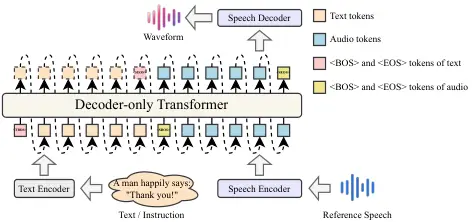
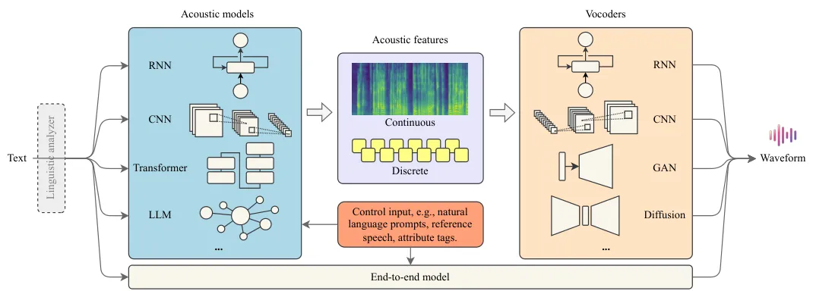

# Towards Controllable Speech Synthesis in the Era of Large Language Models: A Systematic Survey

Tianxin Xie Affiliation: The Hong Kong University of Science and
Technology (Guangzhou)    Yan Rong Affiliation: The Hong Kong University
of Science and Technology (Guangzhou)    Pengfei Zhang Affiliation: The
Hong Kong University of Science and Technology (Guangzhou)    Wenwu Wang
Affiliation: University of Surrey
Correspondence:[avrillliu@hkust-gz.edu.cn](mailto:email@domain)    Li
Liu Affiliation: The Hong Kong University of Science and Technology
(Guangzhou)

###### Abstract

Text-to-speech (TTS) has advanced from generating natural-sounding
speech to enabling fine-grained control over attributes like emotion,
timbre, and style. Driven by rising industrial demand and breakthroughs
in deep learning, e.g., diffusion and large language models (LLMs),
controllable TTS has become a rapidly growing research area. This survey
provides the first comprehensive review of controllable TTS methods,
from traditional control techniques to emerging approaches using natural
language prompts. We categorize model architectures, control strategies,
and feature representations, while also summarizing challenges,
datasets, and evaluations in controllable TTS. This survey aims to guide
researchers and practitioners by offering a clear taxonomy and
highlighting future directions in this fast-evolving field. One can
visit
[https://github.com/imxtx/awesome-controllabe-speech-synthesis](https://github.com/imxtx/awesome-controllabe-speech-synthesis)
for a comprehensive paper list and updates.

## 1 Introduction

Speech synthesis, also known as text-to-speech (TTS), aims to generate
human-like speech from text Dutoit (1997), and has found broad
applications in personal assistants López et al. (2018),
entertainment Wang et al. (2019), and robotics Marge et al. (2022).
Recently, the success of large language models such as ChatGPT OpenAI
(2022) has renewed interest in TTS for natural and intuitive
human-computer interaction. Meanwhile, fine-grained control over speech
attributes, such as emotion, timbre, and style, has become a key focus
in both academia and industry, unlocking more expressive and
personalized voice generation.

In the past decade, deep learning has driven remarkable advances in TTS,
enabling high-quality synthesis Tan et al. (2024); Ren et al. (2019); Du
et al. (2024) and stronger control over speech attributes Wang et al.
(2018); Li et al. (2021); Zhou et al. (2024). Recent methods have
expanded TTS to multi-modal inputs, including images Rong and Liu (2025)
and videos Choi et al. (2023). Meanwhile, the rise of LLMs Zhao et al.
(2023) has enabled controllable TTS guided by language prompts Guo
et al. (2023); Huang et al. (2024a), opening new possibilities for
customized voice synthesis. Integrating TTS into LLMs has also gained
extensive attention Peng et al. (2024a). This rapid progress underscores
the need for a comprehensive and timely survey to clarify current trends
and guide future directions in controllable TTS.

Figure 1: Recent trends in controllable TTS regarding architectures,
feature representations, and control abilities.

While several surveys have examined parametric Zen et al. (2009) and
deep learning–based TTS Triantafyllopoulos et al. (2023), they overlook
TTS controllability and recent advances such as description–based
methods Guo et al. (2023); Yamamoto et al. (2024). The key differences
between our survey and earlier work are: 1) Different Scope:  Klatt
(1987) provided the first review of formant-based, concatenative, and
articulatory TTS, with a strong focus on text analysis. Later,  Tabet
and Boughazi (2011); King (2014) explored statistics-based techniques.
With the advent of neural networks,  Ning et al. (2019); Tan et al.
(2021b); Zhang et al. (2023a) surveyed neural model–based TTS, focusing
on acoustics and vocoders. However, they rarely discuss the
controllability. 2) Closer to Current Demands: The need for controllable
TTS is rapidly growing in industries like filmmaking, gaming, robotics,
and virtual assistants. Yet, existing surveys rarely explore the gaps
between current control techniques and real-world demands.

To fill this gap, we present the first comprehensive survey of emerging
controllable TTS methods. We first define the core tasks (Sec. 2) and,
as shown in Fig. 1, trace the evolution of methods across model
architectures (Sec. 3.1), control strategies (Sec. 3.2), and feature
representations (Sec. 3.3). We further summarize relevant datasets and
evaluation metrics (Sec. 4), and discuss current challenges and future
research directions (Sec. 5). For a history of controllable TTS and an
overview of the TTS pipeline, see Appendices A.1 and A.2.

## 2 Main Tasks in Controllable TTS

Prosody Control is the most basic task in controllable TTS, aiming to
manipulate low-level acoustic features such as pitch Łańcucki (2021),
duration Wang et al. (2025a), and energy Chen et al. (2025). Prosody
control ensures naturalness and expressiveness in TTS and is essential
for rendering emphasis, rhythm, and nuance in speech.

Timbre Control aims to manipulate the acoustic characteristics that
define voice quality (e.g., gender, age, nasality), enabling control
over how a voice sounds beyond content and prosody. It supports
personalized TTS Du et al. (2024), voice conversion Zhang et al.
(2025b), and speaker identity editing Huang et al. (2024a).

Emotion Control aims to enable the synthesis of emotional speech by
manipulating the affective state of the generated voice Kim et al.
(2021). This improves human-computer interaction, storytelling Rong
et al. (2025), and supports emotionally adaptive systems such as virtual
assistants.

Style Control aims to control higher-level attributes of speech such as
tone, formality, and discourse mode (e.g., newscast) Zhou et al. (2024);
Yang et al. (2024b). This is critical for adapting the speaking behavior
of TTS systems to different contexts, audiences, and communication
goals.

Language Control aims to enable TTS systems to synthesize speech in
multiple languages Zhang et al. (2023d), dialects Di et al. (2024), or
code-switched contexts Chen et al. (2024d). It facilitates cross-lingual
communication, multilingual agents, and regionally tailored speech
applications.

Environment Control aims to simulate the acoustic characteristics of a
specific setting, such as a park, office, or seaside, by conditioning
synthesis on background noise and spatial cues Lee et al. (2024); Kim
et al. (2024b). Speech environment control is useful in filmmaking and
audiobooks.

## 3 Methods in Controllable TTS

|                                            |           |                |      |      |      |      |      |      |      |                                      |                                         |                    |         |
| ------------------------------------------ | --------- | -------------- | ---- | ---- | ---- | ---- | ---- | ---- | ---- | ------------------------------------ | --------------------------------------- | ------------------ | ------- |
| Method (Non-autoregressive)                | Zero-shot | Controlability |      |      |      |      |      |      |      | Model Architectures                  |                                         | Feature            | Release |
|                                            |           | Pit.           | Ene. | Spe. | Pro. | Tim. | Emo. | Env. | Des. | Acoustic Model                       | Vocoder                                 |                    |         |
| FastSpeech Ren et al. (2019)               |           |                |      | ✓    | ✓    |      |      |      |      | Transformer                          | WaveGlow Prenger et al. (2019)          | MelS               | 2019.05 |
| FastSpeech 2 Ren et al. (2021a)            |           | ✓              | ✓    | ✓    | ✓    |      |      |      |      | Transformer                          | Parallel WaveGAN Yamamoto et al. (2020) | MelS               | 2020.06 |
| FastPitch Łańcucki (2021)                  |           | ✓              |      |      | ✓    |      |      |      |      | Transformer                          | WaveGlow                                | MelS               | 2020.06 |
| Parallel Tacotron Elias et al. (2021a)     |           |                |      |      | ✓    |      |      |      |      | Transformer + VAE + CNN              | WaveRNN Kalchbrenner et al. (2018)      | MelS               | 2020.10 |
| StyleTagging-TTS Kim et al. (2021)         | ✓         |                |      |      |      | ✓    | ✓    |      |      | Transformer + CNN                    | HiFi-GAN Kong et al. (2020)             | MelS               | 2021.04 |
| SC-GlowTTS Casanova et al. (2021)          | ✓         |                |      |      |      | ✓    |      |      |      | Transformer + Flow                   | HiFi-GAN                                | MelS               | 2021.06 |
| Meta-StyleSpeech Min et al. (2021)         | ✓         |                |      |      |      | ✓    |      |      |      | Transformer                          | MelGAN Kumar et al. (2019)              | MelS               | 2021.06 |
| DelightfulTTS Liu et al. (2021)            |           | ✓              |      | ✓    | ✓    |      |      |      |      | Transformer + CNN                    | HiFiNet Liu et al. (2021)               | MelS               | 2021.11 |
| YourTTS Casanova et al. (2022)             | ✓         |                |      |      |      | ✓    |      |      |      | Transformer + Flow                   | HiFi-GAN                                | LinS               | 2021.12 |
| StyleTTS Li et al. (2025b)                 | ✓         |                |      |      |      | ✓    |      |      |      | CNN + RNN                            | HiFi-GAN                                | MelS               | 2022.05 |
| GenerSpeech Huang et al. (2022b)           | ✓         |                |      |      |      | ✓    |      |      |      | Transformer + Flow                   | HiFi-GAN                                | MelS               | 2022.05 |
| Cauliflow Abbas et al. (2022)              |           |                |      | ✓    | ✓    |      |      |      |      | BERT + Flow                          | UP WaveNet Jiao et al. (2021)           | MelS               | 2022.06 |
| CLONE Liu et al. (2022)                    |           | ✓              |      | ✓    | ✓    |      |      |      |      | Transformer + CNN                    | WaveNet Van Den Oord et al. (2016)      | MelS + LinS        | 2022.07 |
| PromptTTS Guo et al. (2023)                |           | ✓              | ✓    | ✓    | ✓    | ✓    | ✓    |      | ✓    | BERT + Transformer                   | HiFi-GAN                                | MelS               | 2022.11 |
| Grad-StyleSpeech Kang et al. (2023)        | ✓         |                |      |      |      | ✓    |      |      |      | Score-based Diffusion                | HiFi-GAN                                | MelS               | 2022.11 |
| NaturalSpeech 2 Shen et al. (2024)         | ✓         |                |      |      |      | ✓    |      |      |      | Diffusion                            | RVQ-based Shen et al. (2024)            | Latent Feature     | 2023.04 |
| PromptStyle Liu et al. (2023a)             | ✓         | ✓              |      |      | ✓    | ✓    | ✓    |      | ✓    | VITS + Flow                          | HiFi-GAN                                | MelS               | 2023.05 |
| StyleTTS 2 Li et al. (2023)                | ✓         |                |      |      | ✓    | ✓    | ✓    |      |      | Flow-based Diffusion + GAN           | HifiGAN / iSTFTNet Kaneko et al. (2022) | MelS               | 2023.06 |
| VoiceBox Le et al. (2024)                  | ✓         |                |      |      |      | ✓    |      |      |      | Transformer + Flow                   | HiFi-GAN                                | MelS               | 2023.06 |
| MegaTTS 2 Jiang et al. (2024)              | ✓         |                |      |      | ✓    | ✓    | ✓    |      |      | Decoder-only Transformer + GAN       | HiFi-GAN                                | MelS               | 2023.07 |
| PromptTTS 2 Leng et al. (2023)             |           | ✓              | ✓    | ✓    | ✓    | ✓    |      |      | ✓    | Diffusion                            | RVQ-based Leng et al. (2023)            | Latent Feature     | 2023.09 |
| VoiceLDM Lee et al. (2024)                 |           | ✓              |      |      | ✓    | ✓    | ✓    | ✓    | ✓    | Diffusion                            | HiFi-GAN                                | MelS               | 2023.09 |
| DurIAN-E Gu et al. (2023)                  |           | ✓              |      | ✓    | ✓    |      |      |      |      | CNN + RNN                            | HiFi-GAN                                | MelS               | 2023.09 |
| PromptTTS++ Shimizu et al. (2024)          |           | ✓              |      | ✓    | ✓    | ✓    | ✓    |      | ✓    | Transformer + Diffusion              | BigVGAN gil Lee et al. (2023)           | MelS               | 2023.09 |
| SpeechFlow Liu et al. (2024a)              | ✓         |                |      |      |      | ✓    |      |      |      | Transformer + Flow                   | HiFi-GAN                                | MelS               | 2023.10 |
| P-Flow Kim et al. (2024c)                  | ✓         |                |      |      |      | ✓    |      |      |      | Transformer + Flow                   | HiFi-GAN                                | MelS               | 2023.10 |
| E3 TTS Gao et al. (2023)                   | ✓         |                |      |      |      | ✓    |      |      |      | Diffusion                            | Not required                            | Waveform           | 2023.11 |
| HierSpeech++ Lee et al. (2023b)            | ✓         |                |      |      |      | ✓    |      |      |      | Transformer + VAE + Flow             | BigVGAN                                 | MelS               | 2023.11 |
| Audiobox Vyas et al. (2023)                | ✓         | ✓              |      | ✓    | ✓    | ✓    |      | ✓    | ✓    | Transformer + Flow                   | HiFi-GAN                                | MelS               | 2023.12 |
| FlashSpeech Ye et al. (2024)               | ✓         |                |      |      |      | ✓    |      |      |      | Latent Consistency Model             | EnCodec                                 | Token              | 2024.04 |
| NaturalSpeech 3 Ju et al. (2024)           | ✓         |                |      | ✓    | ✓    | ✓    |      |      |      | Transformer + Diffusion              | FACodec Ju et al. (2024)                | Token              | 2024.04 |
| InstructTTS Yang et al. (2024b)            |           | ✓              |      | ✓    | ✓    | ✓    | ✓    |      | ✓    | Transformer + Diffusion              | HiFi-GAN                                | Token              | 2024.05 |
| ControlSpeech Ji et al. (2024c)            | ✓         | ✓              | ✓    | ✓    | ✓    | ✓    | ✓    |      | ✓    | Transformer + Diffusion              | FACodec                                 | Token              | 2024.06 |
| AST-LDM Kim et al. (2024b)                 |           |                |      |      |      | ✓    |      | ✓    | ✓    | Diffusion + VAE                      | HiFi-GAN                                | MelS               | 2024.06 |
| SimpleSpeech Yang et al. (2024c)           | ✓         |                |      |      |      | ✓    |      |      |      | Transformer + Diffusion              | SQ Codec Yang et al. (2024c)            | Token              | 2024.06 |
| DiTTo-TTS Lee et al. (2025)                | ✓         |                |      | ✓    |      | ✓    |      |      |      | DiT + VAE                            | BigVGAN                                 | MelS               | 2024.06 |
| E2 TTS Eskimez et al. (2024)               | ✓         |                |      |      |      | ✓    |      |      |      | Transformer + Flow                   | BigVGAN                                 | MelS               | 2024.06 |
| MobileSpeech Ji et al. (2024a)             | ✓         |                |      |      |      | ✓    |      |      |      | Transformer                          | Vocos Siuzdak (2024)                    | Token              | 2024.06 |
| DEX-TTS Park et al. (2024a)                | ✓         |                |      |      |      | ✓    |      |      |      | Diffusion                            | HiFi-GAN                                | MelS               | 2024.06 |
| ArtSpeech Wang et al. (2024)               | ✓         |                |      |      |      | ✓    |      |      |      | RNN + CNN                            | HiFI-GAN                                | MelS + Energy + F0 | 2024.07 |
| CCSP Xiao et al. (2024)                    | ✓         |                |      |      |      | ✓    |      |      |      | Diffusion                            | RVQ-based Xiao et al. (2024)            | Token              | 2024.07 |
| SimpleSpeech 2 Yang et al. (2024a)         | ✓         |                |      | ✓    |      | ✓    |      |      |      | Flow-based DiT                       | SQ Codec                                | Token              | 2024.08 |
| E1 TTS Liu et al. (2025b)                  | ✓         |                |      |      |      | ✓    |      |      |      | DiT + Flow                           | BigVGAN                                 | Token + MelS       | 2024.09 |
| StyleTTS-ZS Li et al. (2024)               | ✓         |                |      |      |      | ✓    |      |      |      | Flow-based Diffusion + GAN           | Mel-based Decoder Li et al. (2024)      | MelS               | 2024.09 |
| NansyTTS Yamamoto et al. (2024)            | ✓         | ✓              |      | ✓    | ✓    | ✓    |      |      | ✓    | Transformer                          | NANSY++ Yamamoto et al. (2024)          | MelS               | 2024.09 |
| NanoVoice Park et al. (2024b)              | ✓         |                |      |      |      | ✓    |      |      |      | Diffusion                            | BigVGAN                                 | MelS               | 2024.09 |
| MS²KU-VTTS He et al. (2024)                |           |                |      |      |      |      |      | ✓    | ✓    | Transformer                          | BigVGAN                                 | MelS               | 2024.10 |
| MaskGCT Wang et al. (2025b)                | ✓         |                |      | ✓    |      | ✓    |      |      |      | Transformer + Flow                   | Vocos                                   | Token              | 2024.10 |
| EmoSphere++ Cho et al. (2024)              | ✓         |                |      |      | ✓    | ✓    | ✓    |      |      | Transformer + Flow                   | BigVGAN                                 | MelS               | 2024.11 |
| EmoDubber Cong et al. (2024)               | ✓         |                |      |      | ✓    | ✓    | ✓    |      |      | Transformer + Flow                   | Flow-based Cong et al. (2024)           | MelS               | 2024.12 |
| HED Inoue et al. (2024)                    | ✓         |                |      |      |      |      | ✓    |      |      | Flow-based Diffusion                 | Vocos                                   | MelS               | 2024.12 |
| DiffStyleTTS Liu et al. (2025a)            |           | ✓              | ✓    | ✓    | ✓    | ✓    |      |      |      | Transformer + Diffusion              | HiFi-GAN                                | MelS               | 2025.01 |
| DrawSpeech Chen et al. (2025)              |           |                | ✓    |      | ✓    |      |      |      |      | Diffusion                            | HiFi-GAN                                | MelS               | 2025.01 |
| ProEmo Zhang et al. (2025a)                |           | ✓              | ✓    |      |      |      | ✓    |      | ✓    | Transformer                          | HiFi-GAN                                | MelS               | 2025.01 |
| Method (Autoregressive)                    | Zero-shot | Controlability |      |      |      |      |      |      |      | Model Architectures                  |                                         | Feature            | Release |
|                                            |           | Pit.           | Ene. | Spe. | Pro. | Tim. | Emo. | Env. | Des. | Acoustic Model                       | Vocoder                                 |                    |         |
| Prosody-Tacotron Skerry-Ryan et al. (2018) |           | ✓              |      |      | ✓    |      |      |      |      | RNN                                  | WaveNet                                 | MelS               | 2018.03 |
| GST-Tacotron Stanton et al. (2018)         |           | ✓              |      |      | ✓    |      |      |      |      | CNN + RNN                            | Griffin-Lim                             | LinS               | 2018.03 |
| GMVAE-Tacotron Hsu et al. (2018)           |           | ✓              |      | ✓    | ✓    |      |      | ✓    |      | VAE                                  | WaveRNN                                 | MelS               | 2018.12 |
| VAE-Tacotron Zhang et al. (2019)           |           | ✓              |      | ✓    | ✓    |      |      |      |      | VAE + CNN + RNN                      | WaveNet                                 | MelS               | 2019.02 |
| DurIAN Yu et al. (2020)                    |           | ✓              |      | ✓    | ✓    |      |      |      |      | CNN + RNN                            | Multi-band WaveRNN Yu et al. (2020)     | MelS               | 2019.09 |
| Flowtron Valle et al. (2020)               |           | ✓              |      | ✓    | ✓    |      |      |      |      | CNN + RNN                            | WaveGlow                                | MelS               | 2020.07 |
| MsEmoTTS Lei et al. (2022)                 |           | ✓              |      |      | ✓    |      | ✓    |      |      | CNN + RNN                            | WaveRNN                                 | MelS               | 2022.01 |
| VALL-E Wang et al. (2023a)                 | ✓         |                |      |      |      | ✓    |      |      |      | Decoder-only Transformer             | EnCodec                                 | Token              | 2023.01 |
| SpearTTS Kharitonov et al. (2023)          | ✓         |                |      |      |      | ✓    |      |      |      | Decoder-only Transformer             | SoundStream Zeghidour et al. (2021)     | Token              | 2023.02 |
| VALL-E X Zhang et al. (2023d)              | ✓         |                |      |      |      | ✓    |      |      |      | Decoder-only Transformer             | EnCodec                                 | Token              | 2023.03 |
| Make-A-Voice Huang et al. (2023b)          | ✓         |                |      |      |      | ✓    |      |      |      | Encoder-decoder Transformer          | Unit-based Huang et al. (2023b)         | Token              | 2023.05 |
| TorToise Betker (2023)                     |           |                |      |      |      | ✓    |      |      |      | Decoder-only Transformer + Diffusion | UnivNet Jang et al. (2021)              | MelS               | 2023.05 |
| MegaTTS Jiang et al. (2023)                | ✓         |                |      |      |      | ✓    |      |      |      | Decoder-only Transformer + GAN       | HiFi-GAN                                | MelS               | 2023.06 |
| SC VALL-E Kim et al. (2023)                | ✓         | ✓              |      | ✓    | ✓    | ✓    | ✓    |      |      | Decoder-only Transformer             | EnCodec                                 | Token              | 2023.07 |
| Salle Ji et al. (2024b)                    |           | ✓              | ✓    | ✓    | ✓    | ✓    | ✓    |      | ✓    | Decoder-only Transformer             | EnCodec                                 | Token              | 2023.08 |
| UniAudio Yang et al. (2023b)               | ✓         | ✓              |      | ✓    | ✓    | ✓    |      |      | ✓    | Decoder-only Transformer             | EnCodec                                 | Token              | 2023.10 |
| ELLA-V Song et al. (2024)                  | ✓         |                |      |      |      | ✓    |      |      |      | Decoder-only Transformer             | EnCodec                                 | Token              | 2024.01 |
| Base TTS Łajszczak et al. (2024)           | ✓         |                |      |      |      | ✓    |      |      |      | Decoder-only Transformer             | HiFi-GAN + BigVGAN                      | Token              | 2024.02 |
| CLaM-TTS Kim et al. (2024a)                | ✓         |                |      |      |      | ✓    |      |      |      | Encoder-decoder Transformer          | BigVGAN                                 | Token + MelS       | 2024.04 |
| RALL-E Xin et al. (2024)                   | ✓         |                |      |      |      | ✓    |      |      |      | Decoder-only Transformer             | SoundStream                             | Token              | 2024.05 |
| ARDiT Liu et al. (2024b)                   | ✓         |                |      | ✓    |      | ✓    |      |      |      | Decoder-only DiT                     | BigVGAN                                 | MelS               | 2024.06 |
| VALL-E R Han et al. (2024)                 | ✓         |                |      |      |      | ✓    |      |      |      | Decoder-only Transformer             | Vocos                                   | Token              | 2024.06 |
| VALL-E 2 Chen et al. (2024a)               | ✓         |                |      |      |      | ✓    |      |      |      | Decoder-only Transformer             | Vocos                                   | Token              | 2024.06 |
| Seed-TTS Anastassiou et al. (2024)         | ✓         |                |      |      |      | ✓    | ✓    |      |      | Decoder-only Transformer + DiT       | Unknown                                 | Latent Feature     | 2024.06 |
| VoiceCraft Peng et al. (2024b)             | ✓         |                |      |      |      | ✓    |      |      |      | Decoder-only Transformer             | HiFi-GAN                                | Token              | 2024.06 |
| XTTS Casanova et al. (2024)                | ✓         |                |      |      |      | ✓    |      |      |      | Decoder-only Transformer             | HiFi-GAN-based Casanova et al. (2024)   | Token + MelS       | 2024.06 |
| CosyVoice Du et al. (2024)                 | ✓         | ✓              |      | ✓    | ✓    | ✓    | ✓    |      | ✓    | Decoder-only Transformer + Flow      | HiFi-GAN                                | Token              | 2024.07 |
| MELLE Meng et al. (2024)                   | ✓         |                |      |      |      | ✓    |      |      |      | Decoder-only Transformer             | HiFi-GAN                                | MelS               | 2024.07 |
| VoxInstruct Zhou et al. (2024)             | ✓         | ✓              | ✓    | ✓    | ✓    | ✓    | ✓    |      | ✓    | Decoder-only Transformer             | Vocos                                   | Token              | 2024.08 |
| Emo-DPO Gao et al. (2024)                  |           |                |      |      |      |      | ✓    |      |      | Decoder-only Transformer             | HiFi-GAN                                | Token + MelS       | 2024.09 |
| FireRedTTS Guo et al. (2024a)              | ✓         |                |      |      | ✓    | ✓    |      |      |      | Decoder-only Transformer + Flow      | BigVGAN                                 | Token + MelS       | 2024.09 |
| CoFi-Speech Guo et al. (2024b)             | ✓         |                |      |      |      | ✓    |      |      |      | Decoder-only Transformer             | BigVGAN                                 | Token + MelS       | 2024.09 |
| Takin Chen et al. (2024b)                  | ✓         | ✓              |      | ✓    | ✓    | ✓    | ✓    |      | ✓    | Decoder-only Transformer + Flow      | HiFi-GAN                                | Token + MelS       | 2024.09 |
| HALL-E Nishimura et al. (2024)             | ✓         |                |      |      |      | ✓    |      |      |      | Decoder-only Transformer             | EnCodec                                 | Token              | 2024.10 |
| FishSpeech Liao et al. (2024)              | ✓         |                |      |      |      | ✓    |      |      |      | Decoder-only Transformer             | Firefly-GAN Liao et al. (2024)          | Token              | 2024.11 |
| SLAM-Omni Chen et al. (2024c)              | ✓         |                |      |      | ✓    | ✓    |      |      |      | Decoder-only Transformer             | HiFi-GAN                                | Token + MelS       | 2024.12 |
| IST-LM Yang et al. (2024e)                 | ✓         |                |      |      | ✓    | ✓    |      |      |      | Decoder-only Transformer             | HiFi-GAN                                | Token + MelS       | 2024.12 |
| KALL-E Zhu et al. (2024)                   | ✓         |                |      |      | ✓    | ✓    | ✓    |      |      | Decoder-only Transformer             | WaveVAE Zhu et al. (2024)               | Latent Feature     | 2024.12 |
| IDEA-TTS Lu et al. (2025)                  | ✓         |                |      |      |      | ✓    |      | ✓    |      | Transformer                          | Flow-based Lu et al. (2025)             | LinS + MelS        | 2024.12 |
| FleSpeech Li et al. (2025a)                | ✓         | ✓              | ✓    | ✓    | ✓    | ✓    | ✓    |      | ✓    | Flow-based DiT                       | WaveGAN Donahue et al. (2018)           | Latent Feature     | 2025.01 |
| Step-Audio Huang et al. (2025)             | ✓         |                |      |      | ✓    | ✓    | ✓    |      | ✓    | Decoder-only Transformer             | Flow-based Huang et al. (2025)          | Token              | 2025.02 |
| Vevo Zhang et al. (2025b)                  | ✓         |                |      |      | ✓    | ✓    | ✓    |      |      | Decoder-only Transformer             | BigVGAN                                 | Token + MelS       | 2025.02 |
| Spark-TTS Wang et al. (2025a)              | ✓         | ✓              |      | ✓    | ✓    | ✓    |      |      |      | Decoder-only Transformer             | BiCodec Wang et al. (2025a)             | Token              | 2025.03 |
| EmoVoice Yang et al. (2025)                |           |                |      |      |      |      | ✓    |      | ✓    | Decoder-only Transformer             | HiFi-GAN                                | Token              | 2025.04 |

Abbreviations: Pit(ch), Ene(rgy), Spe(ed), Pro(sody), Tim(bre),
Emo(tion), Env(ironment), Des(cription). MelS: Mel Spectrogram. LinS:
Linear Spectrogram.

Table 1: A summary of existing controllable neural-based methods.

This section reviews controllable TTS from three perspectives: model
architectures, feature representations, and control strategies, as shown
in Fig. 1.

### 3.1 Model Architectures

The architectures of controllable TTS are primarily divided into two
types, i.e., non-autoregressive (NAR) and autoregressive (AR) (See Table
1).

#### 3.1.1 Non-Autoregressive Approaches

Non-autoregressive TTS models generate the entire output speech sequence
$`\mathbf{y}=(y_{1},y_{2},\dots,y_{T})`$ in parallel given the input
$`\mathbf{x}=(x_{1},x_{2},\dots,x_{T})`$:

```math
\underset{\theta}{\arg\max}=P(\mathbf{y}|\mathbf{x};\theta), \tag{1}
```

where $`\theta`$ denotes model parameters. In this part, we investigate
the transformer, variational autoencoder (VAE), diffusion, and
flow-based methods.

Transformer-based Methods. Transformers enable efficient context
modeling and parallel TTS. FastSpeech Ren et al. (2019) introduced a
non-autoregressive transformer that improves inference speed and
stability via duration prediction. FastSpeech 2 Ren et al. (2021a) adds
pitch and energy control, removing the need for distillation and
boosting voice quality. FastPitch Łańcucki (2021) further incorporates
direct pitch prediction into its architecture, enabling pitch
manipulation.

VAE-based Methods. VAEs enable structured, continuous latent
representations by optimizing a variational lower bound. VAEs have been
leveraged to enhance prosody, emotion, and style control. Hsu et al.
(2018) proposed a hierarchical VAE to control noise and speaking rate.
Zhang et al. (2019) introduced disentangled VAE representations for
effective prosody and emotion transfer. Parallel Tacotron Elias et al.
(2021b) uses a VAE-based residual encoder with iterative spectrogram
loss to improve speech naturalness. CLONE Liu et al. (2022) further
improves prosody and energy modeling using conditional VAEs with
normalizing flows Kobyzev et al. (2020) and adversarial training,
achieving state-of-the-art quality and control. These advances
underscore VAEs’ versatility in expressive and controllable speech
synthesis.

Diffusion-based Methods. Diffusion models Ho et al. (2020) generate
speech by reversing a noise injection process: noise is gradually added
during the forward phase and removed in the reverse phase to synthesize
high-quality audio. NaturalSpeech 2 Shen et al. (2024) uses a latent
diffusion-based codec with quantized latent vectors, while NaturalSpeech
3 Ju et al. (2024) decomposes speech into independent attribute
subspaces with factorized diffusion-based codecs. DEX-TTS Park et al.
(2024a) improves diffusion transformer (DiT)-based networks via
overlapping patches and frequency-aware embeddings. E3 TTS Gao et al.
(2023) eliminates intermediate features by directly modeling waveforms
through diffusion. Text-to-audio models such as AudioLDM Liu et al.
(2023b) and Make-An-Audio Huang et al. (2023a) can also generate speech
using latent diffusion models.

Flow-based Methods. Flow models use invertible flows Rezende and Mohamed
(2015); Lipman et al. (2023) to map speech features to simple
distributions, typically Gaussians Prenger et al. (2019), enabling
direct, high-fidelity generation via inversion. Recent models adopt
flow-matching Lipman et al. (2023) for efficient, non-autoregressive
synthesis: Audiobox Vyas et al. (2023), P-Flow Kim et al. (2024c), and
VoiceBox Le et al. (2024) consider TTS as speech infilling tasks,
predicting masked mel-spectrograms. FlashSpeech Ye et al. (2024) trains
a latent consistency model using adversarial training, achieving one- or
two-step synthesis. Inspired by audio infilling, E2 TTS Eskimez et al.
(2024) uses filler-augmented text sequences to generate mel-spectrograms
with human-level quality. F5-TTS Chen et al. (2024d) builds on this with
ConvNeXt v2 Woo et al. (2023) to enhance text-speech alignment by
directly learning flows conditioned on text and reference speech. E1
TTS Liu et al. (2025b) distills rectified flow-based diffusion
models Liu et al. (2023c) into one-step generators via distribution
matching, reducing sampling cost.

#### 3.1.2 Autoregressive Approaches

Autoregressive TTS models predict the speech sequence
$`\mathbf{y}=(y_{1},\dots,y_{T})`$ given input $`\mathbf{x}`$ as:

```math
\underset{\theta}{\arg\max}=\prod_{t=1}^{T}P(y_{t}|y_{<t},\mathbf{x};\theta), \tag{2}
```

where each frame $`y_{t}`$ depends on all previous outputs $`y_{<t}`$
and the transcript $`\mathbf{x}`$. While this enables effective modeling
of implicit duration and long-range context, autoregressive TTS models
suffer from slower inference, making them more suitable for applications
where flexibility is prioritized over speed. This part investigates
recurrent neural networks (RNN) and LLM-based methods.

RNN-based Methods. RNNs enable natural-sounding speech synthesis with
adjustable prosody, pitch, and emotion. Prosody-Tacotron Skerry-Ryan
et al. (2018) extends Tacotron Wang et al. (2017) by introducing
explicit prosodic controls. Wang et al. (2018) proposed Global Style
Tokens (GST), enabling unsupervised style transfer. Emotion-controllable
models such as Li et al. (2021) introduced emotion embeddings and style
alignment to modulate emotional intensity. MsEmoTTS Lei et al. (2022)
refined this with a hierarchical structure capturing emotion at global,
utterance, and local levels, enabling more nuanced synthesis. These
developments bring synthetic speech significantly closer to human
expressiveness.



Figure 2: The typical architecture of LLM-based TTS.

LLM-based Methods. LLM-based TTS is inspired by the success of
in-context learning in LLMs. As illustrated in Fig. 2, these approaches
typically input target text or instructions with an optional reference
speech, using autoregressive decoder-only transformers to generate
speech tokens or features, which are then decoded into waveforms.
VALL-E Wang et al. (2023a) pioneered LLM-based zero-shot TTS by framing
it as a conditional language modeling task. It uses EnCodec Défossez
et al. (2023a) to discretize waveforms into tokens and adopts a
two-stage pipeline: an autoregressive model generates coarse audio
tokens, followed by a non-autoregressive model for iterative refinement.
This hierarchical modeling of semantic and acoustic tokens has laid the
groundwork for many subsequent methods, such as VALL-E X Zhang et al.
(2023d), ELLA-V Song et al. (2024), RALL-E Xin et al. (2024), VALL-E
R Han et al. (2024), MELLE Meng et al. (2024), and HALL-E Nishimura
et al. (2024). Beyond the VALL-E series, recent work has further
improved text-speech alignment, quality, and robustness.
SpearTTS Kharitonov et al. (2023) and Make-a-Voice Huang et al. (2023b)
leverage semantic tokens to better bridge text and acoustic features.
FireRedTTS Guo et al. (2024a) refines the tokenizer architecture for
improved reconstruction quality. CoFi-Speech Guo et al. (2024b) adopts a
coarse-to-fine, multi-scale generation strategy to produce natural,
intelligible speech.

#### 3.1.3 Research Trend

Traditional CNN/RNN TTS models face inherent constraints. RNNs (e.g.,
Tacotron) are slow due to autoregressive inference and struggle with
long-term dependencies. CNNs (e.g., Deep Voice) lack global prosody
modeling. Both require explicit feature engineering for attributes like
emotion and often trade synthesis quality for efficiency (e.g.,
WaveNet’s high fidelity but high latency). Flow-based models (e.g.,
Matcha-TTS, F5-TTS) enable non-autoregressive, parallel synthesis with
probabilistic control over acoustic features, improving speed and
flexibility but increasing training complexity and dataset requirements.
LLM-based models (e.g., VALL-E, InstructTTS) offer natural
language-driven control and zero-shot voice cloning, supporting
context-aware synthesis, but suffer from high computational cost and
potential acoustic artifacts from discrete tokenization. Hybrid
architectures (e.g., CosyVoice) integrate LLM-guided semantic
conditioning into flow-based generators, combining high-fidelity
synthesis with intuitive, instruction-based control. Users can specify
attributes like emotion or speaking style in natural language without
compromising audio quality. Future controllable TTS should balance
efficiency, fidelity, and expressiveness, generalizing across voices,
styles, and languages. Bridging instruction-based control and acoustic
precision remains a key challenge, motivating advances in modular
architectures, instruction grounding, and speech-text-instruction
alignment. Fig. 3 summarizes the evolution and future direction of TTS
model architectures.

### 3.2 Control Strategies

As illustrated in Fig. 4, control strategies in TTS can be broadly
categorized into four types: style tagging, reference speech prompt,
natural language descriptions, and instruction-guided control.

Figure 3: The evolution of TTS model architectures


Figure 4: A taxonomy of controllable TTS from the perspective of control
strategies.

#### 3.2.1 Style Tagging

This paradigm enables the adjustment of key attributes such as pitch,
energy, speech rate, and emotion, which can be controlled using either
categorical labels or continuous values. “Tagging” refers to using a
control signal to control a specific speech attribute. 1) Some
approaches use _discrete labels_ to control speech attributes. For
example, StyleTagging-TTS Kim et al. (2021) denotes speech styles with
short phrases or words (e.g., angry, happy), learning the relationship
between linguistic and style embeddings. Emo-DPO Gao et al. (2024)
enables emotion control through Direct Preference Optimization
(DPO) Rafailov et al. (2023) with LLMs. Spark-TTS Wang et al. (2025a)
provides coarse and fine-grained control, allowing pitch and speaking
rate modifications via specially designed tokens and reference speech. 2) Other methods adjust _continuous input signals_. DiffStyleTTS Liu
et al. (2025a) models prosody hierarchically, enabling control over
pitch, energy, duration, and style via guiding scale factors.
DrawSpeech Chen et al. (2025) lets users sketch prosody contours, which
are refined and converted into detailed speech by a diffusion model,
offering control over intonation. 3) Speech attributes can be controlled
by _modifying latent features_. Cauliflow Abbas et al. (2022) adjusts
speech rate and pausing through a flow-based model conditioned on
user-defined parameters. DiTTo-TTS Lee et al. (2025) uses a DiT to
control speech rate by modifying latent length predictions. These
methods show great potential in controlling speech attributes by
adjusting input signals or latent variables. However, these methods are
limited in expressive diversity, as they can only model a small set of
pre-defined attributes.

#### 3.2.2 Reference Speech Prompt

This paradigm aims to customize the synthesized voice using only a few
seconds of reference speech. Similar to LLM-based methods, it takes both
text and reference speech as input to a conditional TTS model, which
generates speech based on both semantic and acoustic features.
MetaStyleSpeech Min et al. (2021) employs adaptive normalization for
style conditioning, enabling robust zero-shot performance.
GenerSpeech Huang et al. (2022b) introduces a multilevel style adapter
for improved zero-shot style transfer to out-of-domain custom voices. SC
VALL-E Kim et al. (2023) integrates style tokens and scale factors for
controlling emotion, speaking style, and other acoustic features in the
generated speech. DEX-TTS Park et al. (2024a) separates time-invariant
and time-variant style components, allowing the extraction of diverse
styles. StyleTTS-ZS Li et al. (2024) uses distilled time-varying style
diffusion to capture varied speaker identities and prosodies. MegaTTS
2 Jiang et al. (2024) introduces an acoustic autoencoder to separate
prosody and timbre in the latent space, enabling style transfer to any
timbre. ControlSpeech Ji et al. (2024c) employs bidirectional attention
and parallel decoding to control timbre, style, and content in a
zero-shot manner.

#### 3.2.3 Natural Language Descriptions

Recent studies have explored controlling speech attributes using natural
language descriptions, offering better user-friendliness. PromptTTS Guo
et al. (2023) uses manually annotated prompts to describe five key
speech attributes. InstructTTS Yang et al. (2024b) introduces a
three-stage training procedure to extract semantics from natural
language prompts. NansyTTS Yamamoto et al. (2024) enables cross-lingual
control by pairing a TTS model with a description controller trained on
a different language using shared timbre and style representations. To
address the limitations of textual prompts in capturing speaker
characteristics, PromptTTS++ Shimizu et al. (2024) enhances prompt
richness by using additional speaker description prompts. PromptTTS
2 Leng et al. (2023) introduces a variation network to model residual
variability beyond the prompt. Further efforts extend controllability to
the environmental context. VoiceLDM Lee et al. (2024) and AST-LDM Kim
et al. (2024b) extend AudioLDM Liu et al. (2023b) by incorporating
content prompts to enable environmental conditioning. MS²KU-VTTS He
et al. (2024) further enhances environmental perception by mixing
environmental images into the prompt, enabling more immersive speech
generation.

#### 3.2.4 Instruction-Guided Synthesis

Description-based TTS methods separate inputs into content and
description prompts, diverging from the unified instruction formats used
in chatbots. To address this, VoxInstruct Zhou et al. (2024) reframes
TTS as a general instruction-to-speech task, where a single natural
language prompt conveys both content and style descriptions.
CosyVoice Du et al. (2024) enhances this paradigm using supervised
semantic tokens derived from ASR models. It combines LLM-driven token
generation with flow-matching synthesis, enabling precise control over
speaker identity, emotion, pitch, speed, and paralinguistic cues through
natural language instructions. AudioGPT Huang et al. (2024b) is a
multimodal LLM-based agent, incorporating multiple modules for speech
understanding, synthesis, and style conversion. StepAudio Huang et al.
(2025) introduces a speech-text model with an instruction-driven TTS
module, enabling dynamic control over dialects, emotions, singing,
rapping, and speaking styles. These advancements push toward more
intuitive, instruction-driven speech generation.

#### 3.2.5 Instruction-Guided Editing

Some methods also support speech editing via user instructions.
VoiceCraft Peng et al. (2024b) uses a decoder-only transformer with
causal masking and delayed stacking for bidirectional, context-aware
instruction-guided editing, such as insertion, deletion, and
substitution, while maintaining high naturalness. InstructSpeech Huang
et al. (2024a) trains a multi-task LLM on \<instruction, input, output\>
triplets with task embeddings and hierarchical adapters, allowing
content and acoustic attributes control. It supports flexible, free-form
speech editing and task adaptation by multi-step reasoning.

#### 3.2.6 Research Trend

The evolution of TTS control has moved from basic attribute manipulation
to sophisticated, instruction-guided synthesis, reflecting AI’s trend
toward intuitive, fine-grained control. Early methods like style tagging
controlled predefined attributes (e.g., pitch, emotion) but offered
limited expressive diversity. Reference speech prompts enabled zero-shot
TTS and voice cloning, separating timbre from style for greater
personalization. To improve user-friendliness, natural language
descriptions (e.g., PromptTTS) allowed users to specify vocal
characteristics through text. The latest advance, instruction-guided
control, leverages LLMs to interpret free-form instructions combining
content and style. Systems like VoxInstruct and CosyVoice generate
nuanced speech, including paralinguistic sounds, enabling highly
precise, user-centric synthesis. Overall, the progression from tags to
natural instructions shows a clear trajectory toward more expressive,
personalized, and intuitive TTS, driven by LLM integration. Table 2 in
the Appendix provides a summary of the strengths and weaknesses of each
control strategy.

### 3.3 Feature Representations

The learning and choice of feature representations critically affect
flexibility, naturalness, and controllability. This subsection discusses
speech attribute disentanglement and compares continuous and discrete
representations, highlighting their trade-offs.

Speech Attribute Disentanglement. Attribute disentanglement aims to
isolate distinct speech factors, such as speaker identity, emotion,
prosody, and content, into separate latent representations. The two main
approaches are: 1) *Adversarial training* Goodfellow et al. (2020) uses
auxiliary classifiers to penalize the presence of unwanted attributes in
a latent space. An encoder learns to “fool” these classifiers, resulting
in representations that are invariant to specific attributes like
speaker Yang et al. (2021); Hsu et al. (2019); Lee et al. (2021),
emotion Li et al. (2022), and style Li et al. (2023). 2) _Information
bottleneck_ uses small-capacity or independent encoder branches to
isolate attributes. Each branch encodes one factor (e.g., content,
prosody) Ju et al. (2024), often with adversarial or reconstruction
losses to discourage leakage of other information. These methods are
often combined. Regularization via KL divergence Lu et al. (2023) or
quantization Zhang et al. (2025b) also plays a key role in enforcing
disentanglement.

Continuous Representations. Continuous representations model speech in a
continuous feature space, preserving acoustic details. The key
advantages are: 1) Fine-grained detail retention for natural and
expressive synthesis; 2) Inherent encoding of prosody, pitch, and
emotion, aiding controllable and emotional TTS; 3) Enable smooth audio
reconstruction without quantization artifacts. GAN-based Kong et al.
(2020); Yamamoto et al. (2020), VAE-based Lee et al. (2023b); Lee et al.
(2025), flow-based Kim et al. (2024d); Casanova et al. (2022), and
diffusion-based methods Kong et al. (2021); Huang et al. (2022a) often
utilize continuous feature representations. However, they are
computationally intensive and demand large models and datasets for
high-fidelity audio generation.

Discrete Tokens. Discrete token-based TTS uses quantized units or
phoneme-like tokens as acoustic features, which are often derived from
quantization Zeghidour et al. (2021) or learned embeddings Hsu et al.
(2021). The advantages of discrete tokens are: 1) Discrete tokens can
encode phonemes or sub-word units, making them concise and
computationally efficient. 2) Discrete tokens often allow TTS systems to
require fewer samples to learn and generalize, compared with continuous
features. 3) Using discrete tokens simplifies cross-modal TTS
applications like description-based TTS, as they are suitable for LLM
training. LLM-based methods Zhou et al. (2024); Yang et al. (2024b); Du
et al. (2024) often adopt discrete tokens as acoustic features. However,
discrete feature learning may cause information loss or lack the nuanced
details in continuous features.

Table 1 summarizes the features used in existing methods. We also
compare speech quantization and tokenization in Appendix A.3 and
summarize open-source methods in Table 5 in the Appendix.

## 4 Datasets and Evaluation Methods

### 4.1 Datasets

Fully controllable TTS systems require large, diverse, and finely
annotated datasets to generate expressive, attribute-controllable
speech. There are mainly three types of datasets for controllable TTS:

Tag-based Datasets. Tag-based datasets contain speech recordings
annotated with predefined discrete attribute labels that describe
various aspects of the speech audio Zhou et al. (2022); Busso et al.
(2008); Ringeval et al. (2013); Bagher Zadeh et al. (2018). Common
attributes include pitch, energy, speaking rate, age, gender, emotion,
emphasis, accent, and topic. By leveraging attribute labels, models can
dynamically adjust specific speech characteristics, enabling more
expressive synthesis.

Description-based Datasets. Description-based datasets pair speech
samples with rich, free-form textual descriptions that capture nuanced
attributes such as intonation, prosody, speaking style, and emotional
tone Guo et al. (2023); Ji et al. (2024b); Jin et al. (2024); Lyth and
King (2024). Unlike tag-based datasets with predefined categorical
labels, these datasets allow models to interpret and generate speech
from natural language prompts, enabling context-aware and highly
expressive synthesis.

Dialogue Datasets. Dialogue datasets Byrne et al. (2019); Lee et al.
(2023a); Yang et al. (2022) contain multi-turn conversational speech
involving two or more speakers, emphasizing natural interaction features
such as turn-taking, contextual dependencies, speaker intent, pauses,
and prosodic variation. These datasets are essential for generating
dynamic and contextually appropriate speech for interactive systems.

By leveraging these datasets, researchers can develop more expressive,
context-aware, and highly controllable TTS models. Table 3 in the
Appendix summarizes publicly available datasets.

### 4.2 Evaluation Methods

#### 4.2.1 Objective and Subjective Metrics

Objective Metrics. Objective metrics enable automated and reproducible
evaluation. _Mel Cepstral Distortion_ (MCD) Kominek et al. (2008)
quantifies spectral distance between synthesized and reference speech.
MCD below 4 suggests good synthesis, while values above 6 imply
distortion. _Fréchet DeepSpeech Distance_ (FDSD) Bińkowski et al. (2020)
evaluates speech quality by measuring the distributional distance
between synthesized and real speech in the embedding space of a
pretrained speech recognition model, such as DeepSpeech Hannun et al.
(2014). It compares the mean and covariance of extracted features; thus,
a lower FDSD indicates higher perceptual similarity. _Word Error Rate_
(WER) Wikipedia (2024) quantifies speech intelligibility by comparing
recognized and reference transcripts. _Cosine Similarity_ assesses
speaker similarity by comparing speaker embeddings (extracted using
models like ECAPA-TDNN Desplanques et al. (2020) or x-vectors Snyder
et al. (2018)) of synthesized and reference speech. Higher values
indicate better voice cloning. _Perceptual Evaluation of Speech Quality_
(PESQ) Rix et al. (2001) evaluates the intelligibility and distortion of
synthesized speech by modeling human auditory perception.

Subjective Metrics. Subjective metrics assess the perceptual quality of
synthesized speech based on human judgments, capturing aspects like
expressiveness and style similarity. _Mean Opinion Score_ (MOS) rates
synthesized speech (e.g., naturalness) on a 1–5 scale. Though effective
in capturing human perception, MOS is costly for large-scale use.
_Comparison MOS_ (CMOS) Loizou (2011) assesses relative quality by
asking participants compare paired samples. Both are averaged across
listeners. _AB/ABX Tests_ present listeners with two samples (AB) by
different methods or two plus a reference (ABX) to judge preference or
closeness to the reference. They are very common in evaluating
fine-grained or zero-shot TTS. Appendix A.4 details the metric
computations, while Table 4 summarizes the most commonly used ones.

#### 4.2.2 Model-based Evaluation

Model-based evaluation is also an emerging technique, e.g., automatic
MOS evaluation Lian et al. (2025) and GPT-based evaluation Rong et al.
(2025). To evaluate the controllability of existing TTS models, we
designed a pipeline using Google Gemini to assess synthesized speech
along three dimensions, i.e., instruction following, naturalness, and
expressiveness, which are not well captured by traditional metrics.
Details of this evaluation are provided in Appendix A.5.

## 5 Challenges and Future Directions

### 5.1 Challenges

Fine-Grained Attribute Control. Emotion and other vocal traits are often
intertwined and span multiple granularities, making fine-grained control
especially difficult. This requires high-resolution annotations and
advanced models capable of capturing subtle attribute variations. While
description-based methods like VoxInstruct Zhou et al. (2024) allow
control via attribute descriptions, precisely targeting a specific
granularity or enabling multiscale, fine-grained control remains a big
challenge.

Feature Disentanglement. Fully controllable TTS requires effective
feature disentanglement, yet extracting meaningful and independent
speech attributes is challenging due to their interdependence and
context sensitivity. For instance, modifying pitch can also affect
emotion and naturalness. To address this, prior work An et al. (2022);
Wang et al. (2023b) leverages pre-trained models on tasks like emotion
classification and adversarial training to guide feature separation.
However, designing disentanglement methods for more subtle prosodic
attributes, such as sarcasm, remains an open challenge and merits
further research.

Scarcity of Datasets. Effective control requires training data that
spans a wide range of styles, emotions, accents, and prosodic patterns.
Large-scale datasets like GigaSpeech Chen et al. (2021) and
TextrolSpeech Ji et al. (2024b) exist, but lack the content and scenario
diversity, e.g., comedies, thrillers, and cartoons. Fine-grained,
attribute-specific annotations are another bottleneck. Manual labeling
is expensive, laborious, requires expertise, and is often inconsistent,
especially for subjective traits like emotion. Most datasets offer only
coarse labels (e.g., gender, age, emotions). While datasets like
SpeechCraft Jin et al. (2024) and Parler-TTS Lyth and King (2024)
include textual descriptions, none provide annotations across varying
conditions within the same speaker.

### 5.2 Future Directions

Instruction-Guided Fine-Grained Speech Synthesis and Editing. Natural
language-driven control of fine-grained speech attributes remains
underexplored. Most existing methods support only a limited set of
controllable attributes. While models like VoxInstruct Zhou et al.
(2024) and CosyVoice Du et al. (2024) show promise in controlling
emotion, timbre, and style, they often produce speech that deviates from
user intent, requiring multiple synthesis attempts. Similarly, speech
editing methods Tae et al. (2022); Tan et al. (2021a) typically rely on
conditional models with fixed inputs, offering limited flexibility for
fine-grained, instruction-guided modifications. Thus, developing
disentangled representations that support precise control through user
instructions is promising.

Expressive Multimodal Speech Synthesis. Synthesizing speech from
multimodal inputs such as texts, images, and videos has broad industrial
applications in storytelling, film, and gaming. While prior work Goto
et al. (2020); Lu et al. (2022); Rong and Liu (2025) explores this
direction, current methods struggle to effectively extract and utilize
rich multimodal information. Generating expressive, engaging speech for
complex visual content remains a promising area for future research.

Zero-shot Long Speech and Conversational Synthesis with Emotion
Consistency. Zero-shot TTS enables voice cloning and style transfer
without fine-tuning Wang et al. (2025b); Chen et al. (2024d); Du et al.
(2024), yet struggles with generating long, content-emotion consistent
speech due to limited reference input. Overcoming this challenge is key
to advancing long speech synthesis. Besides, conversational TTS, often
cascaded and context-unaware, produces robotic and unexpressive speech.
Recent advances leverage LLMs and discrete speech tokens Fang et al.
(2025); Zhang et al. (2023b), but context-aware, emotionally rich
conversational TTS remains underexplored.

Large-Scale Dataset Generation. Dataset construction is critical for
both fine-grained control and editing tasks. Researchers can leverage
pre-trained speech analysis models to annotate attributes like pitch,
energy, emotion, gender, and age. From these annotations, tools like
ChatGPT can generate diverse natural language descriptions of speech
characteristics. For speech editing, pre-trained models can assist with
tasks such as word substitution, pitch adjustment, and emotion
conversion, while ChatGPT can provide varied and semantically rich
editing instructions for training and evaluation. In addition,
multi-agent systems can also be utilized to generate long-form and
diverse speech content.

## 6 Conclusion

This survey provides a comprehensive review of controllable TTS methods,
covering model architectures, control strategies, and feature
representations. We also summarize commonly used datasets and evaluation
metrics, discuss major challenges, and highlight promising future
directions. To the best of our knowledge, this is the first
comprehensive survey dedicated to controllable TTS.

## 7 Limitations

We acknowledge several limitations that may affect the completeness of
our survey. First, this survey does not explore the interactions between
controllable attributes. Most existing studies focus on modeling each
factor, such as emotion, speaker identity, or prosody, as an independent
variable. However, understanding how these attributes influence one
another during synthesis could lead to more effective and flexible
control strategies. Second, we do not address the efficiency of current
controllable TTS systems. It is important to note that approaches guided
by descriptions or instructions often involve considerable computational
cost, largely due to their reliance on large language model-based codecs
and complex cross-modal architectures. Third, we have not discussed the
broader societal implications of controllable TTS, such as the risks
associated with deepfake generation or adversarial attacks. Finally,
this survey does not cover related research areas, including speech
enhancement, speech separation, speech pretraining, and speech-to-speech
translation, which may offer valuable insights or complementary
techniques. Overcoming these limitations presents important
opportunities for future research to deepen our understanding and
improve the design of controllable TTS systems.

## 8 Ethics Statements

The literature search and review were conducted using sources such as
Google Scholar, arXiv, DBLP, Scopus, and ChatGPT. All referenced papers
included in this survey were thoroughly read, analyzed, and categorized
by the authors. Portions of the original content in this survey were
paraphrased and refined with the assistance of ChatGPT.

## 9 Acknowledgement

This work was supported by the National Natural Science Foundation of
China (No. 62471420), GuangDong Basic and Applied Basic Research
Foundation (2025A1515012296), and CCF-Tencent Rhino-Bird Open Research
Fund.

## References

- Abbas et al. (2022) Ammar Abbas, Thomas Merritt, Alexis Moinet, Sri
  Karlapati, Ewa Muszynska, Simon Slangen, Elia Gatti, and Thomas
  Drugman. 2022. Expressive, variable, and controllable duration
  modelling in TTS. _arXiv preprint arXiv:2206.14165_.
- Allen et al. (1987) Jonathan Allen, M Sharon Hunnicutt, Dennis H
  Klatt, Robert C Armstrong, and David B Pisoni. 1987. _From Text to
  Speech: The MITalk System_. Cambridge University Press.
- Almeida and Xexéo (2019) Felipe Almeida and Geraldo Xexéo. 2019. Word
  embeddings: A survey. _arXiv preprint arXiv:1901.09069_.
- An et al. (2024) Keyu An, Qian Chen, Chong Deng, Zhihao Du, Changfeng
  Gao, Zhifu Gao, Yue Gu, Ting He, Hangrui Hu, Kai Hu, and 1
  others. 2024. FunAudioLLM: Voice understanding and generation
  foundation models for natural interaction between humans and LLMs.
  _arXiv preprint arXiv:2407.04051_.
- An et al. (2022) Xiaochun An, Frank K Soong, and Lei Xie. 2022.
  Disentangling style and speaker attributes for TTS style transfer.
  _IEEE/ACM Transactions on Audio, Speech, and Language Processing_,
  30:646–658.
- Anastassiou et al. (2024) Philip Anastassiou, Jiawei Chen, Jitong
  Chen, Yuanzhe Chen, Zhuo Chen, Ziyi Chen, Jian Cong, Lelai Deng,
  Chuang Ding, Lu Gao, and 1 others. 2024. Seed-TTS: A family of
  high-quality versatile speech generation models. _arXiv preprint
  arXiv:2406.02430_.
- Ardila et al. (2020) Rosana Ardila, Megan Branson, Kelly Davis,
  Michael Kohler, Josh Meyer, Michael Henretty, Reuben Morais, Lindsay
  Saunders, Francis Tyers, and Gregor Weber. 2020. Common Voice: A
  massively-multilingual speech corpus. In _Proceedings of the Twelfth
  Language Resources and Evaluation Conference_, pages 4218–4222.
- Baevski et al. (2022) Alexei Baevski, Wei-Ning Hsu, Qiantong Xu, Arun
  Babu, Jiatao Gu, and Michael Auli. 2022. Data2vec: A general framework
  for self-supervised learning in speech, vision and language. In
  _International Conference on Machine Learning_, pages 1298–1312.
- Baevski et al. (2020a) Alexei Baevski, Steffen Schneider, and Michael
  Auli. 2020a. vq-wav2vec: Self-supervised learning of discrete speech
  representations. In _International Conference on Learning
  Representations_.
- Baevski et al. (2020b) Alexei Baevski, Yuhao Zhou, Abdelrahman
  Mohamed, and Michael Auli. 2020b. wav2vec 2.0: A framework for
  self-supervised learning of speech representations. _Advances in
  Neural Information Processing Systems_, 33:12449–12460.
- Bagher Zadeh et al. (2018) AmirAli Bagher Zadeh, Paul Pu Liang,
  Soujanya Poria, Erik Cambria, and Louis-Philippe Morency. 2018.
  Multimodal language analysis in the wild: CMU-MOSEI dataset and
  interpretable dynamic fusion graph. In _Proceedings of the 56th Annual
  Meeting of the Association for Computational Linguistics (Volume 1:
  Long Papers)_, pages 2236–2246.
- Barrault et al. (2023) Loïc Barrault, Yu-An Chung, Mariano Coria
  Meglioli, David Dale, Ning Dong, Mark Duppenthaler, Paul-Ambroise
  Duquenne, Brian Ellis, Hady Elsahar, Justin Haaheim, and 1
  others. 2023. Seamless: Multilingual expressive and streaming speech
  translation. _arXiv preprint arXiv:2312.05187_.
- Betker (2023) James Betker. 2023. Better speech synthesis through
  scaling. _arXiv preprint arXiv:2305.07243_.
- Bińkowski et al. (2020) Mikołaj Bińkowski, Jeff Donahue, Sander
  Dieleman, Aidan Clark, Erich Elsen, Norman Casagrande, Luis C. Cobo,
  and Karen Simonyan. 2020. High fidelity speech synthesis with
  adversarial networks. In _International Conference on Learning
  Representations_.
- Brown et al. (2020) Tom Brown, Benjamin Mann, Nick Ryder, Melanie
  Subbiah, Jared D Kaplan, Prafulla Dhariwal, Arvind Neelakantan, Pranav
  Shyam, Girish Sastry, Amanda Askell, Sandhini Agarwal, Ariel
  Herbert-Voss, Gretchen Krueger, Tom Henighan, Rewon Child, Aditya
  Ramesh, Daniel Ziegler, Jeffrey Wu, Clemens Winter, and 12
  others. 2020. Language models are few-shot learners. In _Advances in
  Neural Information Processing Systems_, volume 33, pages 1877–1901.
- Bulut et al. (2002) Murtaza Bulut, Shrikanth S Narayanan, and Ann K
  Syrdal. 2002. Expressive speech synthesis using a concatenative
  synthesizer. In _Proceedings of the Annual Conference of the
  International Speech Communication Association_, pages 1265–1268.
- Busso et al. (2008) Carlos Busso, Murtaza Bulut, Chi-Chun Lee, Abe
  Kazemzadeh, Emily Mower, Samuel Kim, Jeannette N Chang, Sungbok Lee,
  and Shrikanth S Narayanan. 2008. IEMOCAP: Interactive emotional dyadic
  motion capture database. _Language Resources and Evaluation_,
  42:335–359.
- Byrne et al. (2019) Bill Byrne, Karthik Krishnamoorthi, Chinnadhurai
  Sankar, Arvind Neelakantan, Daniel Duckworth, Semih Yavuz, Ben
  Goodrich, Amit Dubey, Andy Cedilnik, and Kyu-Young Kim. 2019.
  Taskmaster-1: Toward a realistic and diverse dialog dataset. _arXiv
  preprint arXiv:1909.05358_.
- Casanova et al. (2024) Edresson Casanova, Kelly Davis, Eren Gölge,
  Görkem Göknar, Iulian Gulea, Logan Hart, Aya Aljafari, Joshua Meyer,
  Reuben Morais, Samuel Olayemi, and Julian Weber. 2024. XTTS: a
  massively multilingual zero-shot text-to-speech model. In _Conference
  of the International Speech Communication Association_, pages
  4978–4982.
- Casanova et al. (2021) Edresson Casanova, Christopher Shulby, Eren
  Gölge, Nicolas Michael Müller, Frederico Santos De Oliveira,
  Arnaldo Candido Junior, Anderson da Silva Soares, Sandra Maria
  Aluisio, and Moacir Antonelli Ponti. 2021. SC-GlowTTS: An efficient
  zero-shot multi-speaker text-to-speech model. _arXiv preprint
  arXiv:2104.05557_.
- Casanova et al. (2022) Edresson Casanova, Julian Weber, Christopher D
  Shulby, Arnaldo Candido Junior, Eren Gölge, and Moacir A Ponti. 2022.
  YourTTS: Towards zero-shot multi-speaker TTS and zero-shot voice
  conversion for everyone. In _International Conference on Machine
  Learning_, pages 2709–2720.
- Chen et al. (2021) Guoguo Chen, Shuzhou Chai, Guan-Bo Wang, Jiayu Du,
  Wei-Qiang Zhang, Chao Weng, Dan Su, Daniel Povey, Jan Trmal, Junbo
  Zhang, Mingjie Jin, Sanjeev Khudanpur, Shinji Watanabe, Shuaijiang
  Zhao, Wei Zou, Xiangang Li, Xuchen Yao, Yongqing Wang, Zhao You, and
  Zhiyong Yan. 2021. GigaSpeech: An evolving, multi-domain ASR corpus
  with 10,000 hours of transcribed audio. In _Annual Conference of the
  International Speech Communication Association_, pages 3670–3674.
- Chen et al. (2024a) Sanyuan Chen, Shujie Liu, Long Zhou, Yanqing Liu,
  Xu Tan, Jinyu Li, Sheng Zhao, Yao Qian, and Furu Wei. 2024a. VALL-E 2:
  Neural codec language models are human parity zero-shot text to speech
  synthesizers. _arXiv preprint arXiv:2406.05370_.
- Chen et al. (2024b) Sijing Chen, Yuan Feng, Laipeng He, Tianwei He,
  Wendi He, Yanni Hu, Bin Lin, Yiting Lin, Yu Pan, Pengfei Tan, and 1
  others. 2024b. Takin: A cohort of superior quality zero-shot speech
  generation models. _arXiv preprint arXiv:2409.12139_.
- Chen et al. (2025) Weidong Chen, Shan Yang, Guangzhi Li, and Xixin
  Wu. 2025. DrawSpeech: Expressive speech synthesis using prosodic
  sketches as control conditions. In _IEEE International Conference on
  Acoustics, Speech and Signal Processing_, pages 1–5.
- Chen et al. (2024c) Wenxi Chen, Ziyang Ma, Ruiqi Yan, Yuzhe Liang,
  Xiquan Li, Ruiyang Xu, Zhikang Niu, Yanqiao Zhu, Yifan Yang, Zhanxun
  Liu, and 1 others. 2024c. SLAM-Omni: Timbre-controllable voice
  interaction system with single-stage training. _arXiv preprint
  arXiv:2412.15649_.
- Chen et al. (2015) Xinxiong Chen, Lei Xu, Zhiyuan Liu, Maosong Sun,
  and Huan-Bo Luan. 2015. Joint learning of character and word
  embeddings. In _Twenty-fourth International Joint Conference on
  Artificial Intelligence_, pages 1236–1242.
- Chen et al. (2024d) Yushen Chen, Zhikang Niu, Ziyang Ma, Keqi Deng,
  Chunhui Wang, Jian Zhao, Kai Yu, and Xie Chen. 2024d. F5-TTS: A
  fairytaler that fakes fluent and faithful speech with flow matching.
  _arXiv preprint arXiv:2410.06885_.
- Cho et al. (2024) Deok-Hyeon Cho, Hyung-Seok Oh, Seung-Bin Kim, and
  Seong-Whan Lee. 2024. EmoSphere++: Emotion-controllable zero-shot
  text-to-speech via emotion-adaptive spherical vector. _arXiv preprint
  arXiv:2411.02625_.
- Choi et al. (2023) Jeongsoo Choi, Joanna Hong, and Yong Man Ro. 2023.
  DiffV2S: Diffusion-based video-to-speech synthesis with vision-guided
  speaker embedding. In _Proceedings of the IEEE/CVF International
  Conference on Computer Vision_, pages 7812–7821.
- Chowdhery et al. (2023) Aakanksha Chowdhery, Sharan Narang, Jacob
  Devlin, Maarten Bosma, Gaurav Mishra, Adam Roberts, Paul Barham,
  Hyung Won Chung, Charles Sutton, Sebastian Gehrmann, and 1
  others. 2023. PaLM: Scaling language modeling with pathways. _Journal
  of Machine Learning Research_, 24(240):1–113.
- Cong et al. (2024) Gaoxiang Cong, Jiadong Pan, Liang Li, Yuankai Qi,
  Yuxin Peng, Anton van den Hengel, Jian Yang, and Qingming Huang. 2024.
  EmoDubber: Towards high quality and emotion controllable movie
  dubbing. _arXiv preprint arXiv:2412.08988_.
- Cooper et al. (2020) Erica Cooper, Cheng-I Lai, Yusuke Yasuda, Fuming
  Fang, Xin Wang, Nanxin Chen, and Junichi Yamagishi. 2020. Zero-shot
  multi-speaker text-to-speech with state-of-the-art neural speaker
  embeddings. In _IEEE International Conference on Acoustics, Speech and
  Signal Processing_, pages 6184–6188.
- Défossez et al. (2023a) Alexandre Défossez, Jade Copet, Gabriel
  Synnaeve, and Yossi Adi. 2023a. High fidelity neural audio
  compression. _Transactions on Machine Learning Research_, pages 1–19.
- Défossez et al. (2023b) Alexandre Défossez, Jade Copet, Gabriel
  Synnaeve, and Yossi Adi. 2023b. High fidelity neural audio
  compression. _Transactions on Machine Learning Research_.
- Défossez et al. (2024) Alexandre Défossez, Laurent Mazaré, Manu
  Orsini, Amélie Royer, Patrick Pérez, Hervé Jégou, Edouard Grave, and
  Neil Zeghidour. 2024. Moshi: a speech-text foundation model for
  real-time dialogue. _arXiv preprint arXiv:2410.00037_.
- Desplanques et al. (2020) Brecht Desplanques, Jenthe Thienpondt, and
  Kris Demuynck. 2020. ECAPA-TDNN: emphasized channel attention,
  propagation and aggregation in TDNN based speaker verification. In
  _21st Annual Conference of the International Speech Communication
  Association_, pages 3830–3834.
- Devlin et al. (2019) Jacob Devlin, Ming-Wei Chang, Kenton Lee, and
  Kristina Toutanova. 2019. BERT: Pre-training of deep bidirectional
  transformers for language understanding. In _Proceedings of the
  Conference of the Association for Computational Linguistics_, pages
  4171–4186.
- Di et al. (2024) Xinhan Di, Zihao Chen, Yunming Liang, Junjie Zheng,
  Yihua Wang, and Chaofan Ding. 2024. Bailing-TTS: Chinese dialectal
  speech synthesis towards human-like spontaneous representation. _arXiv
  preprint arXiv:2408.00284_.
- Donahue et al. (2018) Chris Donahue, Julian McAuley, and Miller
  Puckette. 2018. Adversarial audio synthesis. In _International
  Conference on Learning Representations_.
- Du et al. (2024) Zhihao Du, Qian Chen, Shiliang Zhang, Kai Hu, Heng
  Lu, Yexin Yang, Hangrui Hu, Siqi Zheng, Yue Gu, Ziyang Ma, and 1
  others. 2024. CosyVoice: A scalable multilingual zero-shot
  text-to-speech synthesizer based on supervised semantic tokens. _arXiv
  preprint arXiv:2407.05407_.
- Dutoit (1997) Thierry Dutoit. 1997. _An Introduction to Text-to-Speech
  Synthesis_, volume 3. Springer Science & Business Media.
- Elias et al. (2021a) Isaac Elias, Heiga Zen, Jonathan Shen, Yu Zhang,
  Ye Jia, Ron J Weiss, and Yonghui Wu. 2021a. Parallel Tacotron:
  Non-autoregressive and controllable TTS. In _IEEE International
  Conference on Acoustics, Speech and Signal Processing_, pages
  5709–5713.
- Elias et al. (2021b) Isaac Elias, Heiga Zen, Jonathan Shen, Yu Zhang,
  Ye Jia, Ron J Weiss, and Yonghui Wu. 2021b. Parallel Tacotron:
  Non-autoregressive and controllable TTS. In _IEEE International
  Conference on Acoustics, Speech and Signal Processing_, pages
  5709–5713.
- Eskimez et al. (2024) Sefik Emre Eskimez, Xiaofei Wang, Manthan
  Thakker, Canrun Li, Chung-Hsien Tsai, Zhen Xiao, Hemin Yang, Zirun
  Zhu, Min Tang, Xu Tan, and 1 others. 2024. E2 TTS: Embarrassingly easy
  fully non-autoregressive zero-shot TTS. In _IEEE Spoken Language
  Technology Workshop_, pages 682–689.
- Fan et al. (2015) Yuchen Fan, Yao Qian, Frank K Soong, and Lei
  He. 2015. Multi-speaker modeling and speaker adaptation for DNN-based
  TTS synthesis. In _IEEE International Conference on Acoustics, Speech
  and Signal Processing_, pages 4475–4479.
- Fan et al. (2014) Yuchen Fan, Yao Qian, Feng-Long Xie, and Frank K
  Soong. 2014. TTS synthesis with bidirectional LSTM based recurrent
  neural networks. In _Proceedings of the Annual Conference of the
  International Speech Communication Association_, pages 1964–1968.
- Fang et al. (2025) Qingkai Fang, Shoutao Guo, Yan Zhou, Zhengrui Ma,
  Shaolei Zhang, and Yang Feng. 2025. LLaMA-Omni: Seamless speech
  interaction with large language models. In _International Conference
  on Learning Representations_, pages 1–18.
- Fukada et al. (1992) T Fukada, K Tokuda, T Kobayashi, and
  S Imai. 1992. An adaptive algorithm for mel-cepstral analysis of
  speech. In _IEEE International Conference on Acoustics, Speech, and
  Signal Processing_, volume 1, pages 137–140.
- Gao et al. (2024) Xiaoxue Gao, Chen Zhang, Yiming Chen, Huayun Zhang,
  and Nancy F Chen. 2024. Emo-DPO: Controllable emotional speech
  synthesis through direct preference optimization. _arXiv preprint
  arXiv:2409.10157_.
- Gao et al. (2023) Yuan Gao, Nobuyuki Morioka, Yu Zhang, and Nanxin
  Chen. 2023. E3 TTS: Easy end-to-end diffusion-based text to speech. In
  _IEEE Automatic Speech Recognition and Understanding Workshop_, pages
  1–8.
- gil Lee et al. (2023) Sang gil Lee, Wei Ping, Boris Ginsburg, Bryan
  Catanzaro, and Sungroh Yoon. 2023. BigVGAN: A universal neural vocoder
  with large-scale training. In _The Eleventh International Conference
  on Learning Representations_.
- Goodfellow et al. (2020) Ian Goodfellow, Jean Pouget-Abadie, Mehdi
  Mirza, Bing Xu, David Warde-Farley, Sherjil Ozair, Aaron Courville,
  and Yoshua Bengio. 2020. Generative adversarial networks.
  _Communications of the ACM_, 63(11):139–144.
- Goto et al. (2020) Shunsuke Goto, Kotaro Onishi, Yuki Saito, Kentaro
  Tachibana, and Koichiro Mori. 2020. Face2Speech: Towards multi-speaker
  text-to-speech synthesis using an embedding vector predicted from a
  face image. In _Proceedings of the Annual Conference of the
  International Speech Communication Association_, pages 1321–1325.
- Gu et al. (2023) Yu Gu, Yianrao Bian, Guangzhi Lei, Chao Weng, and Dan
  Su. 2023. DurIAN-E: Duration informed attention network for expressive
  text-to-speech synthesis. _arXiv preprint arXiv:2309.12792_.
- Guo et al. (2024a) Hao-Han Guo, Kun Liu, Fei-Yu Shen, Yi-Chen Wu,
  Feng-Long Xie, Kun Xie, and Kai-Tuo Xu. 2024a. FireRedTTS: A
  foundation text-to-speech framework for industry-level generative
  speech applications. _arXiv preprint arXiv:2409.03283_.
- Guo et al. (2024b) Haohan Guo, Fenglong Xie, Dongchao Yang, Xixin Wu,
  and Helen Meng. 2024b. Speaking from coarse to fine: Improving neural
  codec language model via multi-scale speech coding and generation.
  _arXiv preprint arXiv:2409.11630_.
- Guo et al. (2023) Zhifang Guo, Yichong Leng, Yihan Wu, Sheng Zhao, and
  Xu Tan. 2023. PromptTTS: Controllable text-to-speech with text
  descriptions. In _IEEE International Conference on Acoustics, Speech
  and Signal Processing_, pages 1–5.
- Han et al. (2024) Bing Han, Long Zhou, Shujie Liu, Sanyuan Chen,
  Lingwei Meng, Yanming Qian, Yanqing Liu, Sheng Zhao, Jinyu Li, and
  Furu Wei. 2024. VALL-E R: Robust and efficient zero-shot
  text-to-speech synthesis via monotonic alignment. _arXiv preprint
  arXiv:2406.07855_.
- Hannun et al. (2014) Awni Hannun, Carl Case, Jared Casper, Bryan
  Catanzaro, Greg Diamos, Erich Elsen, Ryan Prenger, Sanjeev Satheesh,
  Shubho Sengupta, Adam Coates, and 1 others. 2014. Deep Speech: Scaling
  up end-to-end speech recognition. _arXiv preprint arXiv:1412.5567_.
- He et al. (2024) Shuwei He, Rui Liu, and Haizhou Li. 2024.
  Multi-source spatial knowledge understanding for immersive visual
  text-to-speech. _arXiv preprint arXiv:2410.14101_.
- Heusel et al. (2017) Martin Heusel, Hubert Ramsauer, Thomas
  Unterthiner, Bernhard Nessler, and Sepp Hochreiter. 2017. GANs trained
  by a two time-scale update rule converge to a local Nash equilibrium.
  _Advances in Neural Information Processing Systems_, 30.
- Ho et al. (2020) Jonathan Ho, Ajay Jain, and Pieter Abbeel. 2020.
  Denoising diffusion probabilistic models. _Advances in Neural
  Information Processing Systems_, 33:6840–6851.
- Hsu et al. (2021) Wei-Ning Hsu, Benjamin Bolte, Yao-Hung Hubert Tsai,
  Kushal Lakhotia, Ruslan Salakhutdinov, and Abdelrahman Mohamed. 2021.
  HuBERT: Self-supervised speech representation learning by masked
  prediction of hidden units. _IEEE/ACM Transactions on Audio, Speech,
  and Language Processing_, 29:3451–3460.
- Hsu et al. (2019) Wei-Ning Hsu, Yu Zhang, Ron J. Weiss, Yu-An Chung,
  Yuxuan Wang, Yonghui Wu, and James Glass. 2019. [Disentangling
  correlated speaker and noise for speech synthesis via data
  augmentation and adversarial
  factorization](https://doi.org/10.1109/ICASSP.2019.8683561). In
  _ICASSP 2019 - 2019 IEEE International Conference on Acoustics, Speech
  and Signal Processing (ICASSP)_, pages 5901–5905.
- Hsu et al. (2018) Wei-Ning Hsu, Yu Zhang, Ron J Weiss, Heiga Zen,
  Yonghui Wu, Yuxuan Wang, Yuan Cao, Ye Jia, Zhifeng Chen, Jonathan
  Shen, and 1 others. 2018. Hierarchical generative modeling for
  controllable speech synthesis. In _International Conference on
  Learning Representations_.
- Huang et al. (2025) Ailin Huang, Boyong Wu, Bruce Wang, Chao Yan, Chen
  Hu, Chengli Feng, Fei Tian, Feiyu Shen, Jingbei Li, Mingrui Chen, and
  1 others. 2025. Step-Audio: Unified understanding and generation in
  intelligent speech interaction. _arXiv preprint arXiv:2502.11946_.
- Huang et al. (2024a) Rongjie Huang, Ruofan Hu, Yongqi Wang, Zehan
  Wang, Xize Cheng, Ziyue Jiang, Zhenhui Ye, Dongchao Yang, Luping Liu,
  Peng Gao, and Zhou Zhao. 2024a. InstructSpeech: Following speech
  editing instructions via large language models. In _Forty-first
  International Conference on Machine Learning_.
- Huang et al. (2023a) Rongjie Huang, Jiawei Huang, Dongchao Yang,
  Yi Ren, Luping Liu, Mingze Li, Zhenhui Ye, Jinglin Liu, Xiang Yin, and
  Zhou Zhao. 2023a. Make-An-Audio: Text-to-audio generation with
  prompt-enhanced diffusion models. In _International Conference on
  Machine Learning_, pages 13916–13932.
- Huang et al. (2022a) Rongjie Huang, Max W. Y. Lam, Jun Wang, Dan Su,
  Dong Yu, Yi Ren, and Zhou Zhao. 2022a. FastDiff: A fast conditional
  diffusion model for high-quality speech synthesis. In _Proceedings of
  the Thirty-First International Joint Conference on Artificial
  Intelligence_, pages 4157–4163.
- Huang et al. (2024b) Rongjie Huang, Mingze Li, Dongchao Yang, Jiatong
  Shi, Xuankai Chang, Zhenhui Ye, Yuning Wu, Zhiqing Hong, Jiawei Huang,
  Jinglin Liu, and 1 others. 2024b. AudioGPT: Understanding and
  generating speech, music, sound, and talking head. In _Proceedings of
  the AAAI Conference on Artificial Intelligence_, volume 38, pages
  23802–23804.
- Huang et al. (2022b) Rongjie Huang, Yi Ren, Jinglin Liu, Chenye Cui,
  and Zhou Zhao. 2022b. GenerSpeech: Towards style transfer for
  generalizable out-of-domain text-to-speech. In _Advances in Neural
  Information Processing Systems_, pages 1–14.
- Huang et al. (2023b) Rongjie Huang, Chunlei Zhang, Yongqi Wang,
  Dongchao Yang, Luping Liu, Zhenhui Ye, Ziyue Jiang, Chao Weng, Zhou
  Zhao, and Dong Yu. 2023b. Make-A-Voice: Unified voice synthesis with
  discrete representation. _arXiv preprint arXiv:2305.19269_.
- Hunt and Black (1996) Andrew J. Hunt and Alan W. Black. 1996. Unit
  selection in a concatenative speech synthesis system using a large
  speech database. In _IEEE International Conference on Acoustics,
  Speech, and Signal Processing_, volume 1, pages 373–376.
- Inoue et al. (2024) Sho Inoue, Kun Zhou, Shuai Wang, and Haizhou
  Li. 2024. Hierarchical control of emotion rendering in speech
  synthesis. _arXiv preprint arXiv:2412.12498_.
- Itakura (1975) Fumitada Itakura. 1975. Line spectrum representation of
  linear predictor coefficients of speech signals. _The Journal of the
  Acoustical Society of America_, 57(S1):S35–S35.
- Jang et al. (2021) Won Jang, Dan Lim, Jaesam Yoon, Bongwan Kim, and
  Juntae Kim. 2021. UnivNet: A neural vocoder with multi-resolution
  spectrogram discriminators for high-fidelity waveform generation. In
  _Annual Conference of the International Speech Communication
  Association_, pages 2207–2211.
- Jeong et al. (2021) Myeonghun Jeong, Hyeongju Kim, Sung Jun Cheon,
  Byoung Jin Choi, and Nam Soo Kim. 2021. Diff-TTS: A denoising
  diffusion model for text-to-speech. In _Proceedings of the Annual
  Conference of the International Speech Communication Association_,
  pages 3605–3609.
- Ji et al. (2024a) Shengpeng Ji, Ziyue Jiang, Hanting Wang, Jialong
  Zuo, and Zhou Zhao. 2024a. MobileSpeech: A fast and high-fidelity
  framework for mobile zero-shot text-to-speech. In _The 62nd Annual
  Meeting of the Association for Computational Linguistics_, pages
  13588–13600.
- Ji et al. (2025) Shengpeng Ji, Ziyue Jiang, Wen Wang, Yifu Chen,
  Minghui Fang, Jialong Zuo, Qian Yang, Xize Cheng, Zehan Wang, Ruiqi
  Li, Ziang Zhang, Xiaoda Yang, Rongjie Huang, Yidi Jiang, Qian Chen,
  Siqi Zheng, and Zhou Zhao. 2025. WavTokenizer: an efficient acoustic
  discrete codec tokenizer for audio language modeling. In _The
  Thirteenth International Conference on Learning Representations_.
- Ji et al. (2024b) Shengpeng Ji, Jialong Zuo, Minghui Fang, Ziyue
  Jiang, Feiyang Chen, Xinyu Duan, Baoxing Huai, and Zhou Zhao. 2024b.
  TextrolSpeech: A text style control speech corpus with codec language
  text-to-speech models. In _IEEE International Conference on Acoustics,
  Speech and Signal Processing_, pages 10301–10305.
- Ji et al. (2024c) Shengpeng Ji, Jialong Zuo, Wen Wang, Minghui Fang,
  Siqi Zheng, Qian Chen, Ziyue Jiang, Hai Huang, Zehan Wang, Xize Cheng,
  and 1 others. 2024c. ControlSpeech: Towards simultaneous zero-shot
  speaker cloning and zero-shot language style control with decoupled
  codec. _arXiv preprint arXiv:2406.01205_.
- Jiang et al. (2024) Ziyue Jiang, Jinglin Liu, Yi Ren, Jinzheng He,
  Zhenhui Ye, Shengpeng Ji, Qian Yang, Chen Zhang, Pengfei Wei, Chunfeng
  Wang, and 1 others. 2024. Mega-TTS 2: Boosting prompting mechanisms
  for zero-shot speech synthesis. In _The Twelfth International
  Conference on Learning Representations_.
- Jiang et al. (2023) Ziyue Jiang, Yi Ren, Zhenhui Ye, Jinglin Liu, Chen
  Zhang, Qian Yang, Shengpeng Ji, Rongjie Huang, Chunfeng Wang, Xiang
  Yin, and 1 others. 2023. Mega-TTS: Zero-shot text-to-speech at scale
  with intrinsic inductive bias. _arXiv preprint arXiv:2306.03509_.
- Jiao et al. (2021) Yunlong Jiao, Adam Gabryś, Georgi Tinchev, Bartosz
  Putrycz, Daniel Korzekwa, and Viacheslav Klimkov. 2021. Universal
  neural vocoding with parallel WaveNet. In _IEEE International
  Conference on Acoustics, Speech and Signal Processing_, pages
  6044–6048.
- Jin et al. (2024) Zeyu Jin, Jia Jia, Qixin Wang, Kehan Li, Shuoyi
  Zhou, Songtao Zhou, Xiaoyu Qin, and Zhiyong Wu. 2024. SpeechCraft: A
  fine-grained expressive speech dataset with natural language
  description. In _Proceedings of the 32nd ACM International Conference
  on Multimedia_, pages 1255–1264.
- Ju et al. (2024) Zeqian Ju, Yuancheng Wang, Kai Shen, Xu Tan, Detai
  Xin, Dongchao Yang, Eric Liu, Yichong Leng, Kaitao Song, Siliang Tang,
  Zhizheng Wu, Tao Qin, Xiangyang Li, Wei Ye, Shikun Zhang, Jiang Bian,
  Lei He, Jinyu Li, and sheng zhao. 2024. NaturalSpeech 3: Zero-shot
  speech synthesis with factorized codec and diffusion models. In
  _International Conference on Machine Learning_, pages 1–19.
- Kalchbrenner et al. (2018) Nal Kalchbrenner, Erich Elsen, Karen
  Simonyan, Seb Noury, Norman Casagrande, Edward Lockhart, Florian
  Stimberg, Aaron Oord, Sander Dieleman, and Koray Kavukcuoglu. 2018.
  Efficient neural audio synthesis. In _International Conference on
  Machine Learning_, pages 2410–2419.
- Kaneko et al. (2022) Takuhiro Kaneko, Kou Tanaka, Hirokazu Kameoka,
  and Shogo Seki. 2022. istftnet: Fast and lightweight mel-spectrogram
  vocoder incorporating inverse short-time Fourier transform. In _IEEE
  International Conference on Acoustics, Speech and Signal Processing_,
  pages 6207–6211.
- Kang et al. (2023) Minki Kang, Dongchan Min, and Sung Ju Hwang. 2023.
  Grad-StyleSpeech: Any-speaker adaptive text-to-speech synthesis with
  diffusion models. In _IEEE International Conference on Acoustics,
  Speech and Signal Processing_, pages 1–5.
- Kawahara et al. (1999) Hideki Kawahara, Ikuyo Masuda-Katsuse, and
  Alain De Cheveigne. 1999. Restructuring speech representations using a
  pitch-adaptive time–frequency smoothing and an
  instantaneous-frequency-based F0 extraction: Possible role of a
  repetitive structure in sounds. _Speech Communication_,
  27(3-4):187–207.
- Kharitonov et al. (2023) Eugene Kharitonov, Damien Vincent, Zalán
  Borsos, Raphaël Marinier, Sertan Girgin, Olivier Pietquin, Matt
  Sharifi, Marco Tagliasacchi, and Neil Zeghidour. 2023. Speak, read and
  prompt: High-fidelity text-to-speech with minimal supervision.
  _Transactions of the Association for Computational Linguistics_,
  11:1703–1718.
- Kim et al. (2023) Daegyeom Kim, Seongho Hong, and Yong-Hoon
  Choi. 2023. SC VALL-E: Style-controllable zero-shot text to speech
  synthesizer. _arXiv preprint arXiv:2307.10550_.
- Kim et al. (2024a) Jaehyeon Kim, Keon Lee, Seungjun Chung, and
  Jaewoong Cho. 2024a. CLaM-TTS: Improving neural codec language model
  for zero-shot text-to-speech. _arXiv preprint arXiv:2404.02781_.
- Kim et al. (2021) Minchan Kim, Sung Jun Cheon, Byoung Jin Choi,
  Jong Jin Kim, and Nam Soo Kim. 2021. Expressive text-to-speech using
  style tag. _Annual Conference of the International Speech
  Communication Association_, pages 4663–4667.
- Kim et al. (2024b) Miseul Kim, Soo-Whan Chung, Youna Ji, Hong-Goo
  Kang, and Min-Seok Choi. 2024b. Speak in the Scene: Diffusion-based
  acoustic scene transfer toward immersive speech generation. In _Annual
  Conference of the International Speech Communication Association_,
  pages 4883–4887.
- Kim et al. (2024c) Sungwon Kim, Kevin Shih, Joao Felipe Santos,
  Evelina Bakhturina, Mikyas Desta, Rafael Valle, Sungroh Yoon, Bryan
  Catanzaro, and 1 others. 2024c. P-Flow: a fast and data-efficient
  zero-shot TTS through speech prompting. _Advances in Neural
  Information Processing Systems_, 36.
- Kim et al. (2024d) Sungwon Kim, Kevin Shih, Joao Felipe Santos,
  Evelina Bakhturina, Mikyas Desta, Rafael Valle, Sungroh Yoon, Bryan
  Catanzaro, and 1 others. 2024d. P-Flow: a fast and data-efficient
  zero-shot TTS through speech prompting. _Advances in Neural
  Information Processing Systems_, 36:74213–74228.
- King (2014) Simon King. 2014. Measuring a decade of progress in
  text-to-speech. _Loquens_, 1(1):e006–e006.
- Klatt (1987) Dennis H Klatt. 1987. Review of text-to-speech conversion
  for english. _The Journal of the Acoustical Society of America_,
  82(3):737–793.
- Kobyzev et al. (2020) Ivan Kobyzev, Simon JD Prince, and Marcus A
  Brubaker. 2020. Normalizing flows: An introduction and review of
  current methods. _IEEE Transactions on Pattern Analysis and Machine
  Intelligence_, 43(11):3964–3979.
- Kominek et al. (2008) John Kominek, Tanja Schultz, and Alan W
  Black. 2008. Synthesizer voice quality of new languages calibrated
  with mean mel cepstral distortion. In _Spoken Language Technologies
  for Under-Resourced Languages_, pages 63–68.
- Kong et al. (2020) Jungil Kong, Jaehyeon Kim, and Jaekyoung Bae. 2020.
  HiFi-GAN: Generative adversarial networks for efficient and high
  fidelity speech synthesis. _Advances in Neural Information Processing
  Systems_, 33:17022–17033.
- Kong et al. (2021) Zhifeng Kong, Wei Ping, Jiaji Huang, Kexin Zhao,
  and Bryan Catanzaro. 2021. DiffWave: A versatile diffusion model for
  audio synthesis. In _International Conference on Learning
  Representations_, pages 1–17.
- Kumar et al. (2019) Kundan Kumar, Rithesh Kumar, Thibault
  De Boissiere, Lucas Gestin, Wei Zhen Teoh, Jose Sotelo, Alexandre
  De Brebisson, Yoshua Bengio, and Aaron C Courville. 2019. MelGAN:
  Generative adversarial networks for conditional waveform synthesis.
  _Advances in Neural Information Processing Systems_, 32:14920–14921.
- Kumar et al. (2024) Rithesh Kumar, Prem Seetharaman, Alejandro Luebs,
  Ishaan Kumar, and Kundan Kumar. 2024. High-fidelity audio compression
  with improved RVQGAN. _Advances in Neural Information Processing
  Systems_, 36.
- Łajszczak et al. (2024) Mateusz Łajszczak, Guillermo Cámbara, Yang Li,
  Fatih Beyhan, Arent van Korlaar, Fan Yang, Arnaud Joly, Álvaro
  Martín-Cortinas, Ammar Abbas, Adam Michalski, and 1 others. 2024. BASE
  TTS: Lessons from building a billion-parameter text-to-speech model on
  100k hours of data. _arXiv preprint arXiv:2402.08093_.
- Łańcucki (2021) Adrian Łańcucki. 2021. FastPitch: Parallel
  text-to-speech with pitch prediction. In _IEEE International
  Conference on Acoustics, Speech and Signal Processing_, pages
  6588–6592.
- Le et al. (2024) Matthew Le, Apoorv Vyas, Bowen Shi, Brian Karrer,
  Leda Sari, Rashel Moritz, Mary Williamson, Vimal Manohar, Yossi Adi,
  Jay Mahadeokar, and 1 others. 2024. Voicebox: Text-guided multilingual
  universal speech generation at scale. _Advances in Neural Information
  Processing Systems_, 36.
- Lee et al. (2025) Keon Lee, Dong Won Kim, Jaehyeon Kim, Seungjun
  Chung, and Jaewoong Cho. 2025. [DiTTo-TTS: Diffusion transformers for
  scalable text-to-speech without domain-specific
  factors](https://openreview.net/forum?id=hQvX9MBowC). In _The
  Thirteenth International Conference on Learning Representations_.
- Lee et al. (2023a) Keon Lee, Kyumin Park, and Daeyoung Kim. 2023a.
  DailyTalk: Spoken dialogue dataset for conversational text-to-speech.
  In _IEEE International Conference on Acoustics, Speech and Signal
  Processing_, pages 1–5.
- Lee et al. (2023b) Sang-Hoon Lee, Ha-Yeong Choi, Seung-Bin Kim, and
  Seong-Whan Lee. 2023b. HierSpeech++: Bridging the gap between semantic
  and acoustic representation of speech by hierarchical variational
  inference for zero-shot speech synthesis. _arXiv preprint
  arXiv:2311.12454_.
- Lee et al. (2021) Sang-Hoon Lee, Hyun-Wook Yoon, Hyeong-Rae Noh,
  Ji-Hoon Kim, and Seong-Whan Lee. 2021. Multi-spectrogan:
  High-diversity and high-fidelity spectrogram generation with
  adversarial style combination for speech synthesis. In _Proceedings of
  the AAAI Conference on Artificial Intelligence_, volume 35, pages
  13198–13206.
- Lee et al. (2024) Yeonghyeon Lee, Inmo Yeon, Juhan Nam, and Joon Son
  Chung. 2024. VoiceLDM: Text-to-speech with environmental context. In
  _IEEE International Conference on Acoustics, Speech and Signal
  Processing_, pages 12566–12571.
- Lei et al. (2022) Yi Lei, Shan Yang, Xinsheng Wang, and Lei Xie. 2022.
  MsEmoTTS: Multi-scale emotion transfer, prediction, and control for
  emotional speech synthesis. _IEEE/ACM Transactions on Audio, Speech,
  and Language Processing_, 30:853–864.
- Leng et al. (2023) Yichong Leng, Zhifang Guo, Kai Shen, Xu Tan, Zeqian
  Ju, Yanqing Liu, Yufei Liu, Dongchao Yang, Leying Zhang, Kaitao Song,
  and 1 others. 2023. PromptTTS 2: Describing and generating voices with
  text prompt. In _The Twelfth International Conference on Learning
  Representations_.
- Li et al. (2025a) Hanzhao Li, Yuke Li, Xinsheng Wang, Jingbin Hu,
  Qicong Xie, Shan Yang, and Lei Xie. 2025a. FleSpeech: Flexibly
  controllable speech generation with various prompts. _arXiv preprint
  arXiv:2501.04644_.
- Li et al. (2022) Tao Li, Xinsheng Wang, Qicong Xie, Zhichao Wang, and
  Lei Xie. 2022. Cross-speaker emotion disentangling and transfer for
  end-to-end speech synthesis. _IEEE/ACM Transactions on Audio, Speech,
  and Language Processing_, 30:1448–1460.
- Li et al. (2021) Tao Li, Shan Yang, Liumeng Xue, and Lei Xie. 2021.
  Controllable emotion transfer for end-to-end speech synthesis. In
  _12th International Symposium on Chinese Spoken Language Processing_,
  pages 1–5.
- Li et al. (2025b) Yinghao Aaron Li, Cong Han, and Nima Mesgarani.
  2025b. StyleTTS: A style-based generative model for natural and
  diverse text-to-speech synthesis. _IEEE Journal of Selected Topics in
  Signal Processing_, 19(1):283–296.
- Li et al. (2023) Yinghao Aaron Li, Cong Han, Vinay S Raghavan, Gavin
  Mischler, and Nima Mesgarani. 2023. StyleTTS 2: Towards human-level
  text-to-speech through style diffusion and adversarial training with
  large speech language models. In _37th Conference on Neural
  Information Processing Systems_, pages 1–28.
- Li et al. (2024) Yinghao Aaron Li, Xilin Jiang, Cong Han, and Nima
  Mesgarani. 2024. StyleTTS-ZS: Efficient high-quality zero-shot
  text-to-speech synthesis with distilled time-varying style diffusion.
  _arXiv preprint arXiv:2409.10058_.
- Lian et al. (2025) Zhicheng Lian, Lizhi Wang, and Hua Huang. 2025.
  APG-MOS: Auditory perception guided-MOS predictor for synthetic
  speech. _arXiv preprint arXiv:2504.20447_.
- Liao et al. (2024) Shijia Liao, Yuxuan Wang, Tianyu Li, Yifan Cheng,
  Ruoyi Zhang, Rongzhi Zhou, and Yijin Xing. 2024. Fish-Speech:
  Leveraging large language models for advanced multilingual
  text-to-speech synthesis. _arXiv preprint arXiv:2411.01156_.
- Ling et al. (2009) Zhen-Hua Ling, Korin Richmond, Junichi Yamagishi,
  and Ren-Hua Wang. 2009. Integrating articulatory features into
  HMM-based parametric speech synthesis. _IEEE Transactions on Audio,
  Speech, and Language Processing_, 17(6):1171–1185.
- Lipman et al. (2023) Yaron Lipman, Ricky T. Q. Chen, Heli Ben-Hamu,
  Maximilian Nickel, and Matthew Le. 2023. [Flow matching for generative
  modeling](https://openreview.net/forum?id=PqvMRDCJT9t). In _The
  Eleventh International Conference on Learning Representations_.
- Liu et al. (2024a) Alexander H Liu, Matthew Le, Apoorv Vyas, Bowen
  Shi, Andros Tjandra, and Wei-Ning Hsu. 2024a. Generative pre-training
  for speech with flow matching. In _The Twelfth International
  Conference on Learning Representations_.
- Liu et al. (2023a) Guanghou Liu, Yongmao Zhang, Yi Lei, Yunlin Chen,
  Rui Wang, Zhifei Li, and Lei Xie. 2023a. PromptStyle: Controllable
  style transfer for text-to-speech with natural language descriptions.
  _arXiv preprint arXiv:2305.19522_.
- Liu et al. (2023b) Haohe Liu, Zehua Chen, Yi Yuan, Xinhao Mei, Xubo
  Liu, Danilo Mandic, Wenwu Wang, and Mark D Plumbley. 2023b. AudioLDM:
  text-to-audio generation with latent diffusion models. In _Proceedings
  of the 40th International Conference on Machine Learning_, pages
  21450–21474.
- Liu et al. (2025a) Jiaxuan Liu, Zhaoci Liu, Yajun Hu, Yingying Gao,
  Shilei Zhang, and Zhenhua Ling. 2025a. DiffStyleTTS: Diffusion-based
  hierarchical prosody modeling for text-to-speech with diverse and
  controllable styles. In _Proceedings of the 31st International
  Conference on Computational Linguistics_, pages 5265–5272.
- Liu et al. (2023c) Xingchao Liu, Chengyue Gong, and qiang liu. 2023c.
  [Flow straight and fast: Learning to generate and transfer data with
  rectified flow](https://openreview.net/forum?id=XVjTT1nw5z). In _The
  Eleventh International Conference on Learning Representations_.
- Liu et al. (2021) Yanqing Liu, Zhihang Xu, Gang Wang, Kuan Chen, Bohan
  Li, Xu Tan, Jinzhu Li, Lei He, and Sheng Zhao. 2021. DelightfulTTS:
  The Microsoft speech synthesis system for blizzard challenge 2021.
  _arXiv preprint arXiv:2110.12612_.
- Liu et al. (2022) Zhengxi Liu, Qiao Tian, Chenxu Hu, Xudong Liu,
  Menglin Wu, Yuping Wang, Hang Zhao, and Yuxuan Wang. 2022.
  Controllable and lossless non-autoregressive end-to-end
  text-to-speech. _arXiv preprint arXiv:2207.06088_.
- Liu et al. (2024b) Zhijun Liu, Shuai Wang, Sho Inoue, Qibing Bai, and
  Haizhou Li. 2024b. Autoregressive diffusion transformer for
  text-to-speech synthesis. _arXiv preprint arXiv:2406.05551_.
- Liu et al. (2025b) Zhijun Liu, Shuai Wang, Pengcheng Zhu, Mengxiao Bi,
  and Haizhou Li. 2025b. E1 TTS: Simple and fast non-autoregressive TTS.
  In _IEEE International Conference on Acoustics, Speech and Signal
  Processing_, pages 1–5.
- Livingstone and Russo (2018) Steven R Livingstone and Frank A
  Russo. 2018. The ryerson audio-visual database of emotional speech and
  song (RAVDESS): A dynamic, multimodal set of facial and vocal
  expressions in North American English. _PloS One_, 13(5):e0196391.
- Loizou (2011) Philipos C Loizou. 2011. Speech quality assessment. In
  _Multimedia Analysis, Processing and Communications_, pages 623–654.
  Springer.
- López et al. (2018) Gustavo López, Luis Quesada, and Luis A.
  Guerrero. 2018. Alexa vs. Siri vs. Cortana vs. Google assistant: A
  comparison of speech-based natural user interfaces. In _Advances in
  Human Factors and Systems Interaction_, pages 241–250.
- Lu et al. (2023) Hui Lu, Xixin Wu, Zhiyong Wu, and Helen Meng. 2023.
  SpeechTripleNet: End-to-end disentangled speech representation
  learning for content, timbre and prosody. In _Proceedings of the 31st
  ACM International Conference on Multimedia_, pages 2829–2837.
- Lu et al. (2022) Junchen Lu, Berrak Sisman, Rui Liu, Mingyang Zhang,
  and Haizhou Li. 2022. VisualTTS: TTS with accurate lip-speech
  synchronization for automatic voice over. In _IEEE International
  Conference on Acoustics, Speech and Signal Processing_, pages
  8032–8036.
- Lu et al. (2025) Ye-Xin Lu, Hui-Peng Du, Zheng-Yan Sheng, Yang Ai, and
  Zhen-Hua Ling. 2025. Incremental disentanglement for environment-aware
  zero-shot text-to-speech synthesis. In _IEEE International Conference
  on Acoustics, Speech and Signal Processing_, pages 1–5.
- Lyth and King (2024) Dan Lyth and Simon King. 2024. Natural language
  guidance of high-fidelity text-to-speech with synthetic annotations.
  _arXiv preprint arXiv:2402.01912_.
- Marge et al. (2022) Matthew Marge, Carol Espy-Wilson, Nigel G Ward,
  Abeer Alwan, Yoav Artzi, Mohit Bansal, Gil Blankenship, Joyce Chai,
  Hal Daumé III, Debadeepta Dey, and 1 others. 2022. Spoken language
  interaction with robots: Recommendations for future research.
  _Computer Speech & Language_, 71:101255.
- Meng et al. (2024) Lingwei Meng, Long Zhou, Shujie Liu, Sanyuan Chen,
  Bing Han, Shujie Hu, Yanqing Liu, Jinyu Li, Sheng Zhao, Xixin Wu, and
  1 others. 2024. Autoregressive speech synthesis without vector
  quantization. _arXiv preprint arXiv:2407.08551_.
- Min et al. (2021) Dongchan Min, Dong Bok Lee, Eunho Yang, and Sung Ju
  Hwang. 2021. Meta-StyleSpeech: Multi-speaker adaptive text-to-speech
  generation. In _International Conference on Machine Learning_, pages
  7748–7759. PMLR.
- Mittag et al. (2021) Gabriel Mittag, Babak Naderi, Assmaa Chehadi, and
  Sebastian Möller. 2021. [Nisqa: A deep cnn-self-attention model for
  multidimensional speech quality prediction with crowdsourced
  datasets](https://doi.org/10.21437/Interspeech.2021-299). In
  _Interspeech 2021_, pages 2127–2131.
- Ning et al. (2019) Yishuang Ning, Sheng He, Zhiyong Wu, Chunxiao Xing,
  and Liang-Jie Zhang. 2019. A review of deep learning based speech
  synthesis. _Applied Sciences_, 9(19):4050.
- Nishimura et al. (2024) Yuto Nishimura, Takumi Hirose, Masanari Ohi,
  Hideki Nakayama, and Nakamasa Inoue. 2024. HALL-E: Hierarchical neural
  codec language model for minute-long zero-shot text-to-speech
  synthesis. _arXiv preprint arXiv:2410.04380_.
- Nose et al. (2007) Takashi Nose, Junichi Yamagishi, Takashi Masuko,
  and Takao Kobayashi. 2007. A style control technique for HMM-based
  expressive speech synthesis. _IEICE Transactions on Information and
  Systems_, 90(9):1406–1413.
- OpenAI (2022) OpenAI. 2022. Introducing ChatGPT.
  [https://openai.com/index/chatgpt/](https://openai.com/index/chatgpt/).
  Accessed: 2024-10-22.
- Park et al. (2024a) Hyun Joon Park, Jin Sob Kim, Wooseok Shin, and
  Sung Won Han. 2024a. DEX-TTS: Diffusion-based expressive
  text-to-speech with style modeling on time variability. _arXiv
  preprint arXiv:2406.19135_.
- Park et al. (2024b) Nohil Park, Heeseung Kim, Che Hyun Lee, Jooyoung
  Choi, Jiheum Yeom, and Sungroh Yoon. 2024b. NanoVoice: Efficient
  speaker-adaptive text-to-speech for multiple speakers. _arXiv preprint
  arXiv:2409.15760_.
- Peng et al. (2024a) Jing Peng, Yucheng Wang, Yu Xi, Xu Li, Xizhuo
  Zhang, and Kai Yu. 2024a. A survey on speech large language models.
  _arXiv preprint arXiv:2410.18908_.
- Peng et al. (2024b) Puyuan Peng, Po-Yao Huang, Shang-Wen Li,
  Abdelrahman Mohamed, and David Harwath. 2024b. VoiceCraft: Zero-shot
  speech editing and text-to-speech in the wild. In _Proceedings of the
  62nd Annual Meeting of the Association for Computational Linguistics
  (Volume 1: Long Papers)_, pages 12442–12462.
- Prenger et al. (2019) Ryan Prenger, Rafael Valle, and Bryan
  Catanzaro. 2019. WaveGlow: A flow-based generative network for speech
  synthesis. In _IEEE International Conference on Acoustics, Speech and
  Signal Processing_, pages 3617–3621.
- Purcell and Munhall (2006) David W Purcell and Kevin G Munhall. 2006.
  Adaptive control of vowel formant frequency: Evidence from real-time
  formant manipulation. _The Journal of the Acoustical Society of
  America_, 120(2):966–977.
- Rabiner (1968) Lawrence R Rabiner. 1968. Digital-formant synthesizer
  for speech-synthesis studies. _The Journal of the Acoustical Society
  of America_, 43(4):822–828.
- Radford et al. (2023) Alec Radford, Jong Wook Kim, Tao Xu, Greg
  Brockman, Christine McLeavey, and Ilya Sutskever. 2023. Robust speech
  recognition via large-scale weak supervision. In _International
  Conference on Machine Learning_, pages 28492–28518.
- Rafailov et al. (2023) Rafael Rafailov, Archit Sharma, Eric Mitchell,
  Christopher D Manning, Stefano Ermon, and Chelsea Finn. 2023. Direct
  preference optimization: Your language model is secretly a reward
  model. _Advances in Neural Information Processing Systems_,
  36:53728–53741.
- Raffel et al. (2020) Colin Raffel, Noam Shazeer, Adam Roberts,
  Katherine Lee, Sharan Narang, Michael Matena, Yanqi Zhou, Wei Li, and
  Peter J Liu. 2020. Exploring the limits of transfer learning with a
  unified text-to-text transformer. _Journal of Machine Learning
  Research_, 21(140):1–67.
- Ren et al. (2021a) Yi Ren, Chenxu Hu, Xu Tan, Tao Qin, Sheng Zhao,
  Zhou Zhao, and Tie-Yan Liu. 2021a. FastSpeech 2: Fast and high-quality
  end-to-end text to speech. In _International Conference on Learning
  Representations_.
- Ren et al. (2021b) Yi Ren, Chenxu Hu, Xu Tan, Tao Qin, Sheng Zhao,
  Zhou Zhao, and Tie-Yan Liu. 2021b. FastSpeech 2: Fast and high-quality
  end-to-end text to speech. In _International Conference on Learning
  Representations_, pages 1–15.
- Ren et al. (2019) Yi Ren, Yangjun Ruan, Xu Tan, Tao Qin, Sheng Zhao,
  Zhou Zhao, and Tie-Yan Liu. 2019. FastSpeech: Fast, robust and
  controllable text to speech. _Advances in Neural Information
  Processing Systems_, 32:1–10.
- Rezende and Mohamed (2015) Danilo Rezende and Shakir Mohamed. 2015.
  Variational inference with normalizing flows. In _International
  Conference on Machine Learning_, pages 1530–1538.
- Ringeval et al. (2013) Fabien Ringeval, Andreas Sonderegger, Juergen
  Sauer, and Denis Lalanne. 2013. Introducing the RECOLA multimodal
  corpus of remote collaborative and affective interactions. In _10th
  IEEE International Conference and Workshops on Automatic Face and
  Gesture Recognition_, pages 1–8.
- Rix et al. (2001) A.W. Rix, J.G. Beerends, M.P. Hollier, and A.P.
  Hekstra. 2001. Perceptual evaluation of speech quality-a new method
  for speech quality assessment of telephone networks and codecs. In
  _2001 IEEE International Conference on Acoustics, Speech, and Signal
  Processing. Proceedings_, pages 749–752.
- Rong and Liu (2025) Yan Rong and Li Liu. 2025. Seeing your speech
  style: A novel zero-shot identity-disentanglement face-based voice
  conversion. In _Proceedings of the AAAI Conference on Artificial
  Intelligence_, volume 39, pages 25092–25100.
- Rong et al. (2025) Yan Rong, Shan Yang, Guangzhi Lei, and
  Li Liu. 2025. Dopamine audiobook: A training-free MLLM agent for
  emotional and human-like audiobook generation. _arXiv preprint
  arXiv:2504.11002_.
- Saeki et al. (2022) Takaaki Saeki, Detai Xin, Wataru Nakata, Tomoki
  Koriyama, Shinnosuke Takamichi, and Hiroshi Saruwatari. 2022. [Utmos:
  Utokyo-sarulab system for voicemos challenge
  2022](https://doi.org/10.21437/Interspeech.2022-439). In _Interspeech
  2022_, pages 4521–4525.
- Shen et al. (2018) Jonathan Shen, Ruoming Pang, Ron J Weiss, Mike
  Schuster, Navdeep Jaitly, Zongheng Yang, Zhifeng Chen, Yu Zhang,
  Yuxuan Wang, Rj Skerrv-Ryan, and 1 others. 2018. Natural TTS synthesis
  by conditioning WaveNet on mel spectrogram predictions. In _IEEE
  International Conference on Acoustics, Speech and Signal Processing_,
  pages 4779–4783.
- Shen et al. (2024) Kai Shen, Zeqian Ju, Xu Tan, Eric Liu, Yichong
  Leng, Lei He, Tao Qin, sheng zhao, and Jiang Bian. 2024. NaturalSpeech
  2: Latent diffusion models are natural and zero-shot speech and
  singing synthesizers. In _International Conference on Learning
  Representations_, pages 1–25.
- Shi et al. (2021) Yao Shi, Hui Bu, Xin Xu, Shaoji Zhang, and Ming
  Li. 2021. AISHELL-3: A multi-speaker mandarin TTS corpus. In
  _Conference of the International Speech Communication Association_,
  pages 2756–2760.
- Shimizu et al. (2024) Reo Shimizu, Ryuichi Yamamoto, Masaya Kawamura,
  Yuma Shirahata, Hironori Doi, Tatsuya Komatsu, and Kentaro
  Tachibana. 2024. PromptTTS++: Controlling speaker identity in
  prompt-based text-to-speech using natural language descriptions. In
  _IEEE International Conference on Acoustics, Speech and Signal
  Processing_, pages 12672–12676.
- Siuzdak (2024) Hubert Siuzdak. 2024. Vocos: Closing the gap between
  time-domain and Fourier-based neural vocoders for high-quality audio
  synthesis. In _The Twelfth International Conference on Learning
  Representations_.
- Skerry-Ryan et al. (2018) RJ Skerry-Ryan, Eric Battenberg, Ying Xiao,
  Yuxuan Wang, Daisy Stanton, Joel Shor, Ron Weiss, Rob Clark, and Rif A
  Saurous. 2018. Towards end-to-end prosody transfer for expressive
  speech synthesis with tacotron. In _International Conference on
  Machine Learning_, pages 4693–4702.
- Snyder et al. (2018) David Snyder, Daniel Garcia-Romero, Gregory Sell,
  Daniel Povey, and Sanjeev Khudanpur. 2018. X-Vectors: Robust dnn
  embeddings for speaker recognition. In _IEEE International Conference
  on Acoustics, Speech and Signal Processing_, pages 5329–5333.
- Song et al. (2024) Yakun Song, Zhuo Chen, Xiaofei Wang, Ziyang Ma, and
  Xie Chen. 2024. ELLA-V: Stable neural codec language modeling with
  alignment-guided sequence reordering. _arXiv preprint
  arXiv:2401.07333_.
- Stanton et al. (2018) Daisy Stanton, Yuxuan Wang, and
  RJ Skerry-Ryan. 2018. Predicting expressive speaking style from text
  in end-to-end speech synthesis. In _IEEE Spoken Language Technology
  Workshop_, pages 595–602. IEEE.
- Tabet and Boughazi (2011) Youcef Tabet and Mohamed Boughazi. 2011.
  Speech synthesis techniques. a survey. In _International Workshop on
  Systems, Signal Processing and their Applications_, pages 67–70.
- Tae et al. (2022) Jaesung Tae, Hyeongju Kim, and Taesu Kim. 2022.
  EdiTTS: Score-based editing for controllable text-to-speech. In
  _Annual Conference of the International Speech Communication
  Association_, pages 421–425.
- Tan et al. (2021a) Daxin Tan, Liqun Deng, Yu Ting Yeung, Xin Jiang,
  Xiao Chen, and Tan Lee. 2021a. EditSpeech: A text based speech editing
  system using partial inference and bidirectional fusion. In _IEEE
  Automatic Speech Recognition and Understanding Workshop_, pages
  626–633.
- Tan et al. (2024) Xu Tan, Jiawei Chen, Haohe Liu, Jian Cong, Chen
  Zhang, Yanqing Liu, Xi Wang, Yichong Leng, Yuanhao Yi, Lei He, Sheng
  Zhao, Tao Qin, Frank Soong, and Tie-Yan Liu. 2024. NaturalSpeech:
  End-to-end text-to-speech synthesis with human-level quality. _IEEE
  Transactions on Pattern Analysis and Machine Intelligence_,
  46(6):4234–4245.
- Tan et al. (2021b) Xu Tan, Tao Qin, Frank Soong, and Tie-Yan Liu.
  2021b. A survey on neural speech synthesis. _arXiv preprint
  arXiv:2106.15561_.
- Tokuda et al. (2000) K. Tokuda, T. Yoshimura, T. Masuko, T. Kobayashi,
  and T. Kitamura. 2000. Speech parameter generation algorithms for
  HMM-based speech synthesis. In _IEEE International Conference on
  Acoustics, Speech, and Signal Processing_, volume 3, pages 1315–1318.
- Toloka (2024) Toloka. 2024. Crowd labeled emotions and speech
  characteristics.
  [https://huggingface.co/datasets/toloka/CLESC](https://huggingface.co/datasets/toloka/CLESC).
  Accessed: 2024-03-23.
- Triantafyllopoulos et al. (2023) Andreas Triantafyllopoulos, Björn W
  Schuller, Gökçe İymen, Metin Sezgin, Xiangheng He, Zijiang Yang,
  Panagiotis Tzirakis, Shuo Liu, Silvan Mertes, Elisabeth André, and 1
  others. 2023. An overview of affective speech synthesis and conversion
  in the deep learning era. _Proceedings of the IEEE_,
  111(10):1355–1381.
- Um et al. (2020) Se-Yun Um, Sangshin Oh, Kyungguen Byun, Inseon Jang,
  ChungHyun Ahn, and Hong-Goo Kang. 2020. Emotional speech synthesis
  with rich and granularized control. In _IEEE International Conference
  on Acoustics, Speech and Signal Processing_, pages 7254–7258.
- Valle et al. (2020) Rafael Valle, Kevin Shih, Ryan Prenger, and Bryan
  Catanzaro. 2020. Flowtron: an autoregressive flow-based generative
  network for text-to-speech synthesis. _arXiv preprint
  arXiv:2005.05957_.
- Van Den Oord et al. (2016) Aaron Van Den Oord, Sander Dieleman, Heiga
  Zen, Karen Simonyan, Oriol Vinyals, Alex Graves, Nal Kalchbrenner,
  Andrew Senior, Koray Kavukcuoglu, and 1 others. 2016. WaveNet: A
  generative model for raw audio. In _9th ISCA Speech Synthesis
  Workshop_, volume 12, page 125.
- Vyas et al. (2023) Apoorv Vyas, Bowen Shi, Matthew Le, Andros Tjandra,
  Yi-Chiao Wu, Baishan Guo, Jiemin Zhang, Xinyue Zhang, Robert Adkins,
  William Ngan, and 1 others. 2023. Audiobox: Unified audio generation
  with natural language prompts. _arXiv preprint arXiv:2312.15821_.
- Wang et al. (2023a) Chengyi Wang, Sanyuan Chen, Yu Wu, Ziqiang Zhang,
  Long Zhou, Shujie Liu, Zhuo Chen, Yanqing Liu, Huaming Wang, Jinyu Li,
  and 1 others. 2023a. Neural codec language models are zero-shot text
  to speech synthesizers. _arXiv preprint arXiv:2301.02111_.
- Wang et al. (2023b) Wenbin Wang, Yang Song, and Sanjay Jha. 2023b.
  Generalizable zero-shot speaker adaptive speech synthesis with
  disentangled representations. In _Annual Conference of the
  International Speech Communication Association 2023_, pages 4454–4458.
- Wang et al. (2025a) Xinsheng Wang, Mingqi Jiang, Ziyang Ma, Ziyu
  Zhang, Songxiang Liu, Linqin Li, Zheng Liang, Qixi Zheng, Rui Wang,
  Xiaoqin Feng, and 1 others. 2025a. Spark-TTS: An efficient llm-based
  text-to-speech model with single-stream decoupled speech tokens.
  _arXiv preprint arXiv:2503.01710_.
- Wang et al. (2025b) Yuancheng Wang, Haoyue Zhan, Liwei Liu, Ruihong
  Zeng, Haotian Guo, Jiachen Zheng, Qiang Zhang, Xueyao Zhang, Shunsi
  Zhang, and Zhizheng Wu. 2025b. MaskGCT: Zero-shot text-to-speech with
  masked generative codec transformer. In _International Conference on
  Learning Representations_, pages 1–24.
- Wang et al. (2019) Yujia Wang, Wenguan Wang, Wei Liang, and Lap-Fai
  Yu. 2019. Comic-guided speech synthesis. _ACM Transactions on
  Graphics_, 38(6):1–14.
- Wang et al. (2017) Yuxuan Wang, R. J. Skerry-Ryan, Daisy Stanton,
  Yonghui Wu, Ron J. Weiss, Navdeep Jaitly, Zongheng Yang, Ying Xiao,
  Zhifeng Chen, Samy Bengio, Quoc V. Le, Yannis Agiomyrgiannakis, Rob
  Clark, and Rif A. Saurous. 2017. Tacotron: Towards end-to-end speech
  synthesis. In _Annual Conference of the International Speech
  Communication Association_, pages 4006–4010.
- Wang et al. (2018) Yuxuan Wang, Daisy Stanton, Yu Zhang, RJ-Skerry
  Ryan, Eric Battenberg, Joel Shor, Ying Xiao, Ye Jia, Fei Ren, and
  Rif A Saurous. 2018. Style Tokens: Unsupervised style modeling,
  control and transfer in end-to-end speech synthesis. In _International
  Conference on Machine Learning_, pages 5167–5176.
- Wang et al. (2024) Zhongxu Wang, Yujia Wang, Mingzhu Li, and Hua
  Huang. 2024. ArtSpeech: Adaptive text-to-speech synthesis with
  articulatory representations. In _Proceedings of the 32nd ACM
  International Conference on Multimedia_, pages 535–544.
- Wikipedia (2024) Wikipedia. 2024. Word error rate.
  [https://en.wikipedia.org/wiki/Word_error_rate](https://en.wikipedia.org/wiki/Word_error_rate).
  Accessed: 2024-12-07.
- Wikipedia (2025) Wikipedia. 2025. Mean opinion score.
  [https://en.wikipedia.org/wiki/Mean_opinion_score](https://en.wikipedia.org/wiki/Mean_opinion_score).
  Accessed: 2024-12-07.
- Woo et al. (2023) Sanghyun Woo, Shoubhik Debnath, Ronghang Hu, Xinlei
  Chen, Zhuang Liu, In So Kweon, and Saining Xie. 2023. ConvNeXt V2:
  Co-designing and scaling convnets with masked autoencoders. In
  _Proceedings of the IEEE/CVF Conference on Computer Vision and Pattern
  Recognition_, pages 16133–16142.
- Wouters and Macon (2001) Johan Wouters and Michael W Macon. 2001.
  Control of spectral dynamics in concatenative speech synthesis. _IEEE
  Transactions on Speech and Audio Processing_, 9(1):30–38.
- Xiao et al. (2024) Yujia Xiao, Xi Wang, Xu Tan, Lei He, Xinfa Zhu,
  Sheng Zhao, and Tan Lee. 2024. Contrastive context-speech pretraining
  for expressive text-to-speech synthesis. In _Proceedings of the 32nd
  ACM International Conference on Multimedia_, pages 2099–2107.
- Xin et al. (2024) Detai Xin, Xu Tan, Kai Shen, Zeqian Ju, Dongchao
  Yang, Yuancheng Wang, Shinnosuke Takamichi, Hiroshi Saruwatari, Shujie
  Liu, Jinyu Li, and 1 others. 2024. RALL-E: Robust codec language
  modeling with chain-of-thought prompting for text-to-speech synthesis.
  _arXiv preprint arXiv:2404.03204_.
- Yamagishi et al. (2009) Junichi Yamagishi, Takashi Nose, Heiga Zen,
  Zhen-Hua Ling, Tomoki Toda, Keiichi Tokuda, Simon King, and Steve
  Renals. 2009. Robust speaker-adaptive HMM-based text-to-speech
  synthesis. _IEEE Transactions on Audio, Speech, and Language
  Processing_, 17(6):1208–1230.
- Yamagishi et al. (2003) Junichi Yamagishi, Koji Onishi, Takashi
  Masuko, and Takao Kobayashi. 2003. Modeling of various speaking styles
  and emotions for HMM-based speech synthesis. In _Proceedings of the
  Annual Conference of the International Speech Communication
  Association_, pages 2461–2464.
- Yamamoto et al. (2024) Ryuichi Yamamoto, Yuma Shirahata, Masaya
  Kawamura, and Kentaro Tachibana. 2024. Description-based controllable
  text-to-speech with cross-lingual voice control. _arXiv preprint
  arXiv:2409.17452_.
- Yamamoto et al. (2020) Ryuichi Yamamoto, Eunwoo Song, and Jae-Min
  Kim. 2020. Parallel WaveGAN: A fast waveform generation model based on
  generative adversarial networks with multi-resolution spectrogram. In
  _IEEE International Conference on Acoustics, Speech and Signal
  Processing_, pages 6199–6203.
- Yang et al. (2024a) Dongchao Yang, Rongjie Huang, Yuanyuan Wang,
  Haohan Guo, Dading Chong, Songxiang Liu, Xixin Wu, and Helen Meng.
  2024a. SimpleSpeech 2: Towards simple and efficient text-to-speech
  with flow-based scalar latent transformer diffusion models. _arXiv
  preprint arXiv:2408.13893_.
- Yang et al. (2023a) Dongchao Yang, Songxiang Liu, Rongjie Huang,
  Jinchuan Tian, Chao Weng, and Yuexian Zou. 2023a. HiFi-Codec:
  Group-residual vector quantization for high fidelity audio codec.
  _arXiv preprint arXiv:2305.02765_.
- Yang et al. (2024b) Dongchao Yang, Songxiang Liu, Rongjie Huang, Chao
  Weng, and Helen Meng. 2024b. InstructTTS: Modelling expressive TTS in
  discrete latent space with natural language style prompt. _IEEE/ACM
  Transactions on Audio, Speech, and Language Processing_, 32:2913–2925.
- Yang et al. (2023b) Dongchao Yang, Jinchuan Tian, Xu Tan, Rongjie
  Huang, Songxiang Liu, Xuankai Chang, Jiatong Shi, Sheng Zhao, Jiang
  Bian, Xixin Wu, and 1 others. 2023b. UniAudio: An audio foundation
  model toward universal audio generation. _arXiv preprint
  arXiv:2310.00704_.
- Yang et al. (2024c) Dongchao Yang, Dingdong Wang, Haohan Guo, Xueyuan
  Chen, Xixin Wu, and Helen Meng. 2024c. SimpleSpeech: Towards simple
  and efficient text-to-speech with scalar latent transformer diffusion
  models. In _Proceedings of the Annual Conference of the International
  Speech Communication Association_, pages 4398–4402.
- Yang et al. (2025) Guanrou Yang, Chen Yang, Qian Chen, Ziyang Ma,
  Wenxi Chen, Wen Wang, Tianrui Wang, Yifan Yang, Zhikang Niu, Wenrui
  Liu, and 1 others. 2025. EmoVoice: LLM-based emotional text-to-speech
  model with freestyle text prompting. _arXiv preprint
  arXiv:2504.12867_.
- Yang et al. (2021) Jinhyeok Yang, Jae-Sung Bae, Taejun Bak, Young-Ik
  Kim, and Hoon-Young Cho. 2021. GANSpeech: Adversarial training for
  high-fidelity multi-speaker speech synthesis. In _22nd Annual
  Conference of the International Speech Communication Association_,
  pages 2202–2206.
- Yang et al. (2024d) Qian Yang, Jialong Zuo, Zhe Su, Ziyue Jiang,
  Mingze Li, Zhou Zhao, Feiyang Chen, Zhefeng Wang, and Baoxing Huai.
  2024d. MSceneSpeech: A multi-scene speech dataset for expressive
  speech synthesis. In _Annual Conference of the International Speech
  Communication Association 2024_, pages 1845–1849.
- Yang et al. (2024e) Yifan Yang, Ziyang Ma, Shujie Liu, Jinyu Li, Hui
  Wang, Lingwei Meng, Haiyang Sun, Yuzhe Liang, Ruiyang Xu, Yuxuan Hu,
  and 1 others. 2024e. Interleaved speech-text language models are
  simple streaming text to speech synthesizers. _arXiv preprint
  arXiv:2412.16102_.
- Yang et al. (2022) Zehui Yang, Yifan Chen, Lei Luo, Runyan Yang,
  Lingxuan Ye, Gaofeng Cheng, Ji Xu, Yaohui Jin, Qingqing Zhang,
  Pengyuan Zhang, and 1 others. 2022. Open Source MagicData-RAMC: A rich
  annotated mandarin conversational (RAMC) speech dataset. _arXiv
  preprint arXiv:2203.16844_.
- Ye et al. (2024) Zhen Ye, Zeqian Ju, Haohe Liu, Xu Tan, Jianyi Chen,
  Yiwen Lu, Peiwen Sun, Jiahao Pan, Weizhen Bian, Shulin He, and 1
  others. 2024. FlashSpeech: Efficient zero-shot speech synthesis. In
  _Proceedings of the 32nd ACM International Conference on Multimedia_,
  pages 6998–7007.
- Yoshimura et al. (1999) Takayoshi Yoshimura, Keiichi Tokuda, Takashi
  Masuko, Takao Kobayashi, and Tadashi Kitamura. 1999. Simultaneous
  modeling of spectrum, pitch and duration in HMM-based speech
  synthesis. In _6th European Conference on Speech Communication and
  Technology_, pages 2347–2350.
- Yu et al. (2020) Chengzhu Yu, Heng Lu, Na Hu, Meng Yu, Chao Weng, Kun
  Xu, Peng Liu, Deyi Tuo, Shiyin Kang, Guangzhi Lei, and 1 others. 2020.
  DurIAN: Duration informed attention network for speech synthesis. In
  _Proceedings of the Annual Conference of the International Speech
  Communication Association_, pages 2027–2031.
- Zeghidour et al. (2021) Neil Zeghidour, Alejandro Luebs, Ahmed Omran,
  Jan Skoglund, and Marco Tagliasacchi. 2021. SoundStream: An end-to-end
  neural audio codec. _IEEE/ACM Transactions on Audio, Speech, and
  Language Processing_, 30:495–507.
- Zen et al. (2013) Heiga Zen, Andrew Senior, and Mike Schuster. 2013.
  Statistical parametric speech synthesis using deep neural networks. In
  _IEEE International Conference on Acoustics, Speech and Signal
  Processing_, pages 7962–7966.
- Zen et al. (2009) Heiga Zen, Keiichi Tokuda, and Alan W Black. 2009.
  Statistical parametric speech synthesis. _Speech Communication_,
  51(11):1039–1064.
- Zhang et al. (2022) Binbin Zhang, Hang Lv, Pengcheng Guo, Qijie Shao,
  Chao Yang, Lei Xie, Xin Xu, Hui Bu, Xiaoyu Chen, Chenchen Zeng, and 1
  others. 2022. WenetSpeech: A 10000+ hours multi-domain mandarin corpus
  for speech recognition. In _IEEE International Conference on
  Acoustics, Speech and Signal Processing_, pages 6182–6186.
- Zhang et al. (2023a) Chenshuang Zhang, Chaoning Zhang, Sheng Zheng,
  Mengchun Zhang, Maryam Qamar, Sung-Ho Bae, and In So Kweon. 2023a. A
  survey on audio diffusion models: Text to speech synthesis and
  enhancement in generative AI. _arXiv preprint arXiv:2303.13336_.
- Zhang et al. (2023b) Dong Zhang, Shimin Li, Xin Zhang, Jun Zhan,
  Pengyu Wang, Yaqian Zhou, and Xipeng Qiu. 2023b. SpeechGPT: Empowering
  large language models with intrinsic cross-modal conversational
  abilities. In _Findings of the Association for Computational
  Linguistics: EMNLP_, pages 15757–15773.
- Zhang et al. (2025a) Shaozuo Zhang, Ambuj Mehrish, Yingting Li, and
  Soujanya Poria. 2025a. PROEMO: Prompt-driven text-to-speech synthesis
  based on emotion and intensity control. _arXiv preprint
  arXiv:2501.06276_.
- Zhang et al. (2024) Xin Zhang, Dong Zhang, Shimin Li, Yaqian Zhou, and
  Xipeng Qiu. 2024. SpeechTokenizer: Unified speech tokenizer for speech
  language models. In _The Twelfth International Conference on Learning
  Representations_.
- Zhang et al. (2025b) Xueyao Zhang, Xiaohui Zhang, Kainan Peng, Zhenyu
  Tang, Vimal Manohar, Yingru Liu, Jeff Hwang, Dangna Li, Yuhao Wang,
  Julian Chan, Yuan Huang, Zhizheng Wu, and Mingbo Ma. 2025b. Vevo:
  Controllable zero-shot voice imitation with self-supervised
  disentanglement. In _The Thirteenth International Conference on
  Learning Representations_.
- Zhang et al. (2019) Ya-Jie Zhang, Shifeng Pan, Lei He, and Zhen-Hua
  Ling. 2019. Learning latent representations for style control and
  transfer in end-to-end speech synthesis. In _IEEE International
  Conference on Acoustics, Speech and Signal Processing_, pages
  6945–6949.
- Zhang et al. (2023c) Yongmao Zhang, Guanghou Liu, Yi Lei, Yunlin Chen,
  Hao Yin, Lei Xie, and Zhifei Li. 2023c. Promptspeaker: Speaker
  generation based on text descriptions. In _IEEE Automatic Speech
  Recognition and Understanding Workshop_, pages 1–7. IEEE.
- Zhang et al. (2023d) Ziqiang Zhang, Long Zhou, Chengyi Wang, Sanyuan
  Chen, Yu Wu, Shujie Liu, Zhuo Chen, Yanqing Liu, Huaming Wang, Jinyu
  Li, and 1 others. 2023d. Speak foreign languages with your own voice:
  Cross-lingual neural codec language modeling. _arXiv preprint
  arXiv:2303.03926_.
- Zhao et al. (2023) Wayne Xin Zhao, Kun Zhou, Junyi Li, Tianyi Tang,
  Xiaolei Wang, Yupeng Hou, Yingqian Min, Beichen Zhang, Junjie Zhang,
  Zican Dong, and 1 others. 2023. A survey of large language models.
  _arXiv preprint arXiv:2303.18223_, 1(2).
- Zhou et al. (2022) Kun Zhou, Berrak Sisman, Rui Liu, and Haizhou
  Li. 2022. Emotional voice conversion: Theory, databases and ESD.
  _Speech Communication_, 137:1–18.
- Zhou et al. (2024) Yixuan Zhou, Xiaoyu Qin, Zeyu Jin, Shuoyi Zhou,
  Shun Lei, Songtao Zhou, Zhiyong Wu, and Jia Jia. 2024. VoxInstruct:
  Expressive human instruction-to-speech generation with unified
  multilingual codec language modelling. In _Proceedings of the 32nd ACM
  International Conference on Multimedia_, pages 554–563.
- Zhu et al. (2024) Xinfa Zhu, Wenjie Tian, and Lei Xie. 2024.
  Autoregressive speech synthesis with next-distribution prediction.
  _arXiv preprint arXiv:2412.16846_.

|                               |                                                    |                                                                              |                                                                                                                                                |
| ----------------------------- | -------------------------------------------------- | ---------------------------------------------------------------------------- | ---------------------------------------------------------------------------------------------------------------------------------------------- |
| Control Strategy              | Core Idea                                          | Key Features                                                                 | Pros & Cons                                                                                                                                    |
| Style Tagging                 | Control specific attributes using predefined tags. | Direct control over attributes like emotion and pitch.                       | Pros: Simple to implement. Cons: Limited expressive diversity, cannot achieve fine-grained or combined control.                                |
| Reference Speech Prompts      | Use a short audio clip as a reference for style.   | Enables zero-shot TTS and voice cloning; separates timbre and style.         | Pros: High degree of personalization, more flexible control. Cons: Relies on high-quality reference audio, less intuitive control dimensions.  |
| Natural Language Descriptions | Describe desired voice characteristics in text.    | User-friendly control via natural language (e.g., "speak calmly").           | Pros: High interpretability, user-friendly. Cons: Limited freedom and accuracy of description, potential for model misunderstanding.           |
| Instruction-Guided Control    | Use LLMs to interpret free-form instructions.      | Combines content and style instructions; can generate paralinguistic sounds. | Pros: Extremely high control precision and freedom, understands complex instructions. Cons: Strong dependency on LLMs, high system complexity. |

Table 2: Summary of the pros and cons of each control strategy.

|                                      |                  |                       |        |      |      |     |      |      |      |      |      |      |      |       |              |
| ------------------------------------ | ---------------- | --------------------- | ------ | ---- | ---- | --- | ---- | ---- | ---- | ---- | ---- | ---- | ---- | ----- | ------------ |
| Dataset                              | Hours (at least) | \#Speakers (at least) | Labels |      |      |     |      |      |      |      |      |      |      | Lang  | Release Time |
|                                      |                  |                       | Pit.   | Ene. | Spe. | Age | Gen. | Emo. | Emp. | Acc. | Top. | Des. | Dia. |       |              |
| IEMOCAP Busso et al. (2008)          | 12               | 10                    | ✓      | ✓    | ✓    |     | ✓    | ✓    |      |      |      |      |      | en    | 2008         |
| RECOLA Ringeval et al. (2013)        | 3.8              | 46                    |        |      |      |     |      | ✓    |      |      |      |      |      | fr    | 2013         |
| RAVDESS Livingstone and Russo (2018) | /                | 24                    |        |      |      | ✓   |      | ✓    |      |      |      |      |      | en    | 2018         |
| CMU-MOSEI Bagher Zadeh et al. (2018) | 65               | 1,000                 |        |      |      |     |      | ✓    |      |      |      |      |      | en    | 2018         |
| Taskmaster-1 Byrne et al. (2019)     | /                | /                     |        |      |      |     |      |      |      |      |      |      | ✓    | en    | 2019         |
| AISHELL-3 Shi et al. (2021)          | 85               | 218                   |        |      |      | ✓   | ✓    |      |      | ✓    |      |      |      | zh    | 2020         |
| Common Voice Ardila et al. (2020)    | 2,500            | 50,000                |        |      |      | ✓   | ✓    |      |      | ✓    |      |      |      | multi | 2020         |
| ESD Zhou et al. (2022)               | 29               | 10                    |        |      |      |     |      | ✓    |      |      |      |      |      | en,zh | 2021         |
| GigaSpeech Chen et al. (2021)        | 10,000           | /                     |        |      |      |     |      |      |      |      | ✓    |      |      | en    | 2021         |
| WenetSpeech Zhang et al. (2022)      | 10,000           | /                     |        |      |      |     |      |      |      |      | ✓    |      |      | zh    | 2021         |
| PromptSpeech Guo et al. (2023)       | /                | /                     | ✓      | ✓    | ✓    |     | ✓    |      |      |      |      | ✓    |      | en    | 2022         |
| MagicData-RAMC Yang et al. (2022)    | 180              | 663                   |        |      |      |     |      |      |      |      | ✓    |      | ✓    | zh    | 2022         |
| DailyTalk Lee et al. (2023a)         | 20               | 2                     |        |      |      |     |      | ✓    |      |      | ✓    |      | ✓    | en    | 2023         |
| TextrolSpeech Ji et al. (2024b)      | 330              | 1,324                 | ✓      | ✓    | ✓    |     | ✓    | ✓    |      |      |      | ✓    |      | en    | 2023         |
| CLESC Toloka (2024)                  | $`<`$1           | /                     | ✓      | ✓    | ✓    |     |      | ✓    |      |      |      |      |      | en    | 2024         |
| VccmDataset Ji et al. (2024c)        | 330              | 1,324                 | ✓      | ✓    | ✓    |     | ✓    | ✓    |      |      |      | ✓    |      | en    | 2024         |
| MSceneSpeech Yang et al. (2024d)     | 13               | 13                    |        |      |      |     |      |      |      |      | ✓    |      |      | zh    | 2024         |
| Parler-TTS Lyth and King (2024)      | 50,000           | /                     | ✓      |      | ✓    |     | ✓    | ✓    |      | ✓    |      | ✓    |      | en    | 2024         |
| SpeechCraft Jin et al. (2024)        | 2,391            | 3,200                 | ✓      | ✓    | ✓    | ✓   | ✓    | ✓    | ✓    |      | ✓    | ✓    |      | en,zh | 2024         |

Abbreviations: Pit(ch), Ene(rgy)=volume, Spe(ed), Gen(der), Emo(tion),
Emp(hasis), Acc(ent), Top(ic), Des(cription), Dia(logue).

Table 3: A summary of publicly available speech datasets for
controllable TTS.

|                                                |            |                       |             |
| ---------------------------------------------- | ---------- | --------------------- | ----------- |
| Metric                                         | Type       | Eval Target           | GT Required |
| MCD Kominek et al. (2008)$`\downarrow`$        | Objective  | Acoustic similarity   | ✓           |
| FDSD Bińkowski et al. (2020)$`\downarrow`$     | Objective  | Acoustic similarity   | ✓           |
| WER Wikipedia (2024)$`\downarrow`$             | Objective  | Intelligibility       | ✓           |
| Cosine Desplanques et al. (2020)$`\downarrow`$ | Objective  | Speaker similarity    | ✓           |
| PESQ Rix et al. (2001)$`\uparrow`$             | Objective  | Perceptual quality    | ✓           |
| MOS Wikipedia (2025)$`\uparrow`$               | Subjective | Preference            |             |
| CMOS Loizou (2011)$`\uparrow`$                 | Subjective | Preference            |             |
| AB Test                                        | Subjective | Preference            |             |
| ABX Test                                       | Subjective | Perceptual similarity | ✓           |

GT: Ground truth, $`\downarrow`$: Lower is better, $`\uparrow`$: Higher
is better.

Table 4: Widely used evaluation metrics.

## Appendix A Appendix

### A.1 The History of Controllable TTS

Controllable TTS aims to steer various aspects of synthesized speech,
including pitch, energy, speed, prosody, timbre, emotion, gender, and
speaking style. This subsection briefly reviews its development, from
early methods to recent advancements.

Early Methods. Early controllable TTS systems were primarily based on
rule-based, concatenative, and statistical approaches. Rule-based
systems, such as formant synthesis Rabiner (1968); Allen et al. (1987);
Purcell and Munhall (2006), used handcrafted rules to adjust acoustic
parameters like pitch and duration, enabling basic prosody control.
Concatenative systems Hunt and Black (1996); Wouters and Macon (2001);
Bulut et al. (2002) generated speech by stitching pre-recorded speech
units together, allowing prosody modifications through pitch and timing
adjustments. Later, Hidden Markov model (HMM)-based statistical
methods Nose et al. (2007); Ling et al. (2009); Tokuda et al. (2000)
modeled the relationship between linguistic features and acoustic
outputs, offering greater flexibility in controlling prosody and
speaking rate. These systems also introduced speaker
adaptation Yamagishi et al. (2009) and limited emotional
control Yamagishi et al. (2003), and require less storage and provide
smoother transitions than concatenative methods.

Neural Synthesis. The emergence of deep learning revolutionized TTS,
leading to the development of neural model-based systems capable of
producing more natural, expressive, and controllable speech. Early
models like WaveNet Van Den Oord et al. (2016) and Tacotron Wang et al.
(2017) demonstrated the potential for prosody control through explicit
conditioning Shen et al. (2018); Ren et al. (2021b). Neural TTS further
enhanced speaker control through speaker embeddings and adaptation
techniques Fan et al. (2015); Casanova et al. (2022), while advances in
emotional modeling Lei et al. (2022); Um et al. (2020) enabled the
synthesis of speech with specific affective tones. Recent models have
also achieved manipulation of timbre Wang et al. (2025b); Shen et al.
(2024) and style Li et al. (2025b); Huang et al. (2022b), fostering the
research in zero-shot TTS and voice cloning Cooper et al. (2020). In
addition, methods for fine-grained content control Peng et al. (2024b);
Tan et al. (2021a) have made it possible to emphasize or edit specific
words in synthesized speech.

LLM-based Synthesis. More recently, LLM-based approaches have further
advanced controllable TTS. Leveraging models like BERT Devlin et al.
(2019), GPT Brown et al. (2020), T5 Raffel et al. (2020), and
PaLM Chowdhery et al. (2023), LLMs bring superior context modeling and
intuitive control to speech synthesis Guo et al. (2023); Zhou et al.
(2024). By interpreting natural language prompts, such as describing a
speaker’s emotion, age, or style, LLMs can infer nuanced attributes and
steer the generation process accordingly. This enables dynamic,
fine-grained control over prosody, emotion, style, and speaker
identity Yang et al. (2024b); Gao et al. (2024), marking a big step
toward more flexible and intuitive TTS systems.



Figure 5: General pipeline of controllable TTS from the perspective of
network structure. Linguistic analysis is necessary for parametric and a
few neural methods but is no longer needed for most modern neural
methods. In this paper, we only review neural model-based controllable
TTS methods and do not investigate acoustic features (e.g., MFCC Fukada
et al. (1992), LSP Itakura (1975), F0 Kawahara et al. (1999)) used in
early TTS methods.

|                                          |          |                                                                                                                                                                        |      |
| ---------------------------------------- | -------- | ---------------------------------------------------------------------------------------------------------------------------------------------------------------------- | ---- |
| Method                                   | Modeling | Code                                                                                                                                                                   | Year |
| VQ-Wav2Vec Baevski et al. (2020a)        | SSCP     | [https://github.com/facebookresearch/fairseq/tree/main/examples/wav2vec#vq-wav2vec](https://github.com/facebookresearch/fairseq/tree/main/examples/wav2vec#vq-wav2vec) | 2019 |
| Wav2Vec 2.0 Baevski et al. (2020b)       | SSCP     | [https://github.com/facebookresearch/fairseq/tree/main/examples/wav2vec](https://github.com/facebookresearch/fairseq/tree/main/examples/wav2vec)                       | 2019 |
| HuBERT Hsu et al. (2021)                 | SSCP     | [https://github.com/facebookresearch/fairseq/tree/main/examples/hubert](https://github.com/facebookresearch/fairseq/tree/main/examples/hubert)                         | 2021 |
| Whisper Encoder Radford et al. (2023)    | SSCP     | [https://github.com/openai/whisper](https://github.com/openai/whisper)                                                                                                 | 2022 |
| Data2vec Baevski et al. (2022)           | SSCP     | [https://github.com/facebookresearch/fairseq/tree/main/examples/data2vec](https://github.com/facebookresearch/fairseq/tree/main/examples/data2vec)                     | 2022 |
| W2v-BERT 2.0 Barrault et al. (2023)      | SSCP     | [https://huggingface.co/facebook/w2v-bert-2.0](https://huggingface.co/facebook/w2v-bert-2.0)                                                                           | 2023 |
| SoundStream Zeghidour et al. (2021)      | RVQ-GAN  | [https://github.com/wesbz/SoundStream](https://github.com/wesbz/SoundStream)                                                                                           | 2021 |
| Encodec Défossez et al. (2023b)          | RVQ-GAN  | [https://github.com/facebookresearch/encodec](https://github.com/facebookresearch/encodec)                                                                             | 2022 |
| HiFi-Codec Yang et al. (2023a)           | RVQ-GAN  | [https://github.com/yangdongchao/AcademiCodec](https://github.com/yangdongchao/AcademiCodec)                                                                           | 2023 |
| SpeechTokenizer Zhang et al. (2024)      | RVQ-GAN  | [https://github.com/ZhangXInFD/SpeechTokenizer](https://github.com/ZhangXInFD/SpeechTokenizer)                                                                         | 2023 |
| Descript Audio Codec Kumar et al. (2024) | RVQ-GAN  | [https://github.com/descriptinc/descript-audio-codec](https://github.com/descriptinc/descript-audio-codec)                                                             | 2023 |
| Mimi Codec Défossez et al. (2024)        | RVQ-GAN  | [https://github.com/kyutai-labs/moshi](https://github.com/kyutai-labs/moshi)                                                                                           | 2024 |
| WavTokenizer Ji et al. (2025)            | VQ-GAN   | [https://github.com/jishengpeng/WavTokenizer](https://github.com/jishengpeng/WavTokenizer)                                                                             | 2024 |

SSCP: Self-supervised context (token) prediction, RVQ: Residual vector
quantization Zeghidour et al. (2021).

Table 5: Popular open-source speech quantization and tokenization
methods.

### A.2 Overview of the TTS Pipeline

In this section, we provide an overview of the general pipeline that
supports controllable TTS technologies. Fig. 5 depicts the general
pipeline of controllable TTS, containing various model architectures and
feature representations.

A TTS pipeline generally contains three key components, i.e., linguistic
analyzer, acoustic model, and speech vocoder, where a conditional input,
e.g., prompts, can be processed for controllable speech synthesis.
_Linguistic analyzer_ aims to extract linguistic features, e.g., phoneme
duration and position, syllable stress, and utterance level, from the
input text, which is a necessary step in HMM-based methods Yoshimura
et al. (1999); Tokuda et al. (2000) and a few neural model-based
methods Zen et al. (2013); Fan et al. (2014), but is time-consuming and
error-prone. _Acoustic model_ is a parametric or neural model that
predicts the acoustic features from the input texts. Modern neural
acoustic models like Tacotron Wang et al. (2017) and later works Ren
et al. (2019); Ren et al. (2021b); Jeong et al. (2021) directly take
character Chen et al. (2015) or word embeddings Almeida and Xexéo (2019)
as input, which is much more efficient than previous methods. _Speech
vocoder_ is the last component that converts the intermediate acoustic
features into a waveform that can be played back. This step bridges the
gap between the acoustic features and the actual sounds produced,
helping to generate high-quality, natural-sounding speech Van Den Oord
et al. (2016); Kong et al. (2020). Besides, some end-to-end methods use
a single model to encode the input and decode the speech waveforms
without generating intermediate features like mel-spectrograms. One can
refer to  Tan et al. (2021b) for a more comprehensive and detailed
review of acoustic models and vocoders.

### A.3 Speech Quantization vs. Tokenization.

It is worth noting that quantization and tokenization serve distinct
purposes in speech processing. Quantization is primarily used for
high-fidelity compression, reducing the precision of numerical
representations (e.g., from 32-bit floating point to 8-bit integers)
while preserving model performance. In speech synthesis, quantization is
often used in waveform generation (e.g., codec-based approaches like
EnCodec Défossez et al. (2023b)) and neural vocoders to compress audio
signals without significant loss of perceptual quality. Tokenization, on
the other hand, is a discretization process that segments continuous
data into meaningful units. In speech tasks, tokenization extracts
semantically relevant representations such as phonemes, characters, or
learned speech units (e.g., HuBERT Hsu et al. (2021) and Wav2Vec
2.0 Baevski et al. (2020b)). This makes tokenization particularly
suitable for speech-to-text (ASR), TTS, and multimodal NLP tasks, where
aligning speech with textual information is crucial. Tokenization also
facilitates training language models on speech data by enabling
linguistic or learned unit-based processing rather than raw audio
waveform modeling. Table 5 in Appendix A.3 summarizes popular
open-source speech quantization and tokenization methods. Table 1
summarizes the acoustic features of representative methods.

### A.4 Evaluation Metric Computations

The performance of controllable TTS often requires objective and
subjective evaluation. We introduce common evaluation metrics in this
subsection.

Objective Evaluation Metrics. Objective metrics offer automated and
reproducible evaluations. Mel Cepstral Distortion (MCD) Kominek et al.
(2008) measures the spectral distance between synthesized and reference
speech, reflecting how closely the generated audio matches the target in
terms of acoustic features. A lower MCD value indicates a higher
similarity between synthesized and reference speech, meaning better
speech synthesis quality. Typically, an MCD value below 4 suggests good
quality, while values above 6 may indicate significant distortion. The
MCD is computed as follows:

```math
MCD=\frac{10}{\ln 10}\cdot\sqrt{2\sum_{d=1}^{D}(c_{d}^{(syn)}-c_{d}^{(ref)})^{2}}, \tag{3}
```

where $`c_{d}^{(syn)}`$ represents the d-th Mel Cepstral Coefficient
(MCC) of the synthesized speech, $`c_{d}^{(ref)}`$ represents the d-th
MCC of the reference speech, $`D`$ is the number of MCC, and
$`\frac{10}{\ln 10}\approx 4.342`$ is a constant factor that converts
the logarithm to a decibel scale.

Fréchet DeepSpeech Distance (FDSD) Bińkowski et al. (2020) is another
metric designed to evaluate the quality and naturalness of synthesized
speech. It is inspired by the Fréchet Inception Distance (FID) Heusel
et al. (2017) used in image generation but adapted to speech by
leveraging a deep speech recognition model. FDSD measures the
statistical distance between the distributions of real (reference) and
synthesized speech in the feature space of a pretrained speech
recognition model, such as Deep Speech Hannun et al. (2014). By
comparing the mean and covariance of the extracted feature
representations, FDSD provides a perceptually relevant assessment of
speech synthesis quality. A lower FDSD means the synthesized speech is
more similar to real speech. FDSD can be computed as:

```math
FDSD=||\mu_{s}-\mu_{r}||^{2}+\text{Tr}(\Sigma_{s}+\Sigma_{r}-2(\Sigma_{s}\Sigma_{r})^{1/2}), \tag{4}
```

where $`\mu_{s}`$ and $`\Sigma_{s}`$ are the mean and covariance of the
embeddings from the synthesized speech, $`\mu_{r}`$ and $`\Sigma_{r}`$
are the mean and covariance of the embeddings from the real (reference)
speech, $`||\mu_{s}-\mu_{r}||^{2}`$ represents the squared Euclidean
distance between the means, $`\text{Tr}(\cdot)`$ denotes the trace of a
matrix, and $`(\Sigma_{s}\Sigma_{r})^{1/2}`$ is the geometric mean of
the covariance matrices.

For intelligibility, the Word Error Rate (WER) Wikipedia (2024) is used.
It measures the difference between the recognized transcript and the
reference transcript by computing the number of errors made in the
transcription process. WER is computed as:

```math
WER=\frac{S+D+I}{N}, \tag{5}
```

where $`S`$ is the number of substitutions (wrong word in place of the
correct word), $`D`$ is the number of deletions (missed words), $`I`$ is
the number of insertions (extra words added), and $`N`$ is the total
number of words in the reference transcript.

Cosine similarity (on speaker embeddings) measures similarity between
the speaker embeddings of synthesized and reference speech. It can be
used to evaluate zero-shot TTS (voice cloning) methods, where higher
values indicate better speaker similarity. Given two speaker embeddings,
$`\mathbf{e_{1}}`$ and $`\mathbf{e_{2}}`$, their cosine similarity is
defined as:

```math
CosSim(\mathbf{e_{1}},\mathbf{e_{2}})=\frac{\mathbf{e_{1}}\cdot\mathbf{e_{2}}}{\|\mathbf{e_{1}}\|\|\mathbf{e_{2}}\|}, \tag{6}
```

where speaker embeddings can be extracted from a pre-trained speaker
embedding model (e.g., ECAPA-TDNN Desplanques et al. (2020) and
x-vectors Snyder et al. (2018)).

Perceptual Evaluation of Speech Quality (PESQ) Rix et al. (2001) is
another objective metric designed to evaluate speech quality by
comparing degraded audio with a clean reference. It is widely used in
telecommunications and speech synthesis. PESQ models human auditory
perception, producing a score in the range $`[-0.5,-4.5]`$ that reflects
intelligibility and distortion under various conditions, including noise
or compression. PESQ involves complex perceptual modeling, its core
components can be summarized as:

```math
PESQ=a_{0}+a_{1}\cdot D_{frame}+a_{2}\cdot D_{time}, \tag{7}
```

where $`D_{frame}`$ is the frame-by-frame perceptual distortion,
$`D_{time}`$ is the time-domain distortion, and $`a_{0},a_{1},a_{2}`$
are regression coefficients. One can refer to Rix et al. (2001) for
details.

Signal-to-Noise Ratio (SNR) measures the ratio of signal power to noise
power. A higher SNR indicates a cleaner signal with less noise, while a
lower SNR suggests that noise is dominating the signal. However, in TTS,
noise can come from different sources, such as artifacts from vocoders,
neural network distortions, or background noise in dataset recordings. A
direct computation of SNR in TTS requires a reference clean speech
signal ($`x[n]`$), a synthesized (or noisy) speech signal ($`y[n]`$),
and extracting the noise component ($`e[n]=y[n]-x[n]`$) from the
synthesized signal. The SNR for TTS systems can be computed as:

```math
SNR=10\log_{10}\left(\frac{P_{\text{signal}}}{P_{\text{noise}}}\right), \tag{8}
```

where $`P_{\text{signal}}=\frac{1}{N}\sum_{n=1}^{N}x[n]^{2}`$ and
$`P_{\text{noise}}=\frac{1}{N}\sum_{n=1}^{N}e[n]^{2}`$.

Subjective Evaluation Metrics. The Mean Opinion Score (MOS) Wikipedia
(2025) is the most commonly used subjective metric. In MOS evaluations,
listeners rate various aspects, such as naturalness, expressiveness,
quality, intelligibility, et al., of synthesized speech on a scale from
1 to 5, where higher scores indicate better quality. MOS captures human
perception effectively, but is expensive for large-scale evaluations.

Comparison Mean Opinion Score (CMOS) Loizou (2011) further evaluates
relative quality differences between two TTS audio samples. Participants
listen to paired samples and rate their preference on a scale (e.g., -3
to +3, where negative values favor the first sample). CMOS is used to
measure subtle improvements in TTS systems, complementing absolute MOS
ratings. MOS and CMOS scores are computed as the average scores across
all listeners:

```math
MOS/CMOS=\frac{1}{N}\sum_{i=1}^{N}s_{i}, \tag{9}
```

where $`s_{i}`$ is the score given by the $`i`$-th listener, and $`N`$
is the number of listeners.

AB and ABX tests are also popular in evaluating TTS methods. An AB test
involves presenting two versions of a synthesized speech (from different
TTS models) to human listeners and asking them to choose which they
prefer. The goal is to assess which model produces better-sounding
speech based on certain criteria, such as naturalness, intelligibility,
or clarity. In an ABX test, listeners compare two synthesized speech
samples to a reference speech sample and determine which one is closer
in terms of timbre, prosody, emotion, and other relevant features. ABX
tests are widely used in evaluating zero-shot TTS methods. The AB/ABX
test score for a model $`m`$ is:

```math
Score_{AB}/Score_{ABX}=\frac{N_{m}}{N}, \tag{10}
```

where $`N_{m}`$ represents the number of listeners who prefer the speech
synthesized by model $`m`$, and $`N`$ denotes the total number of
listeners.

Table 4 summarizes widely used metrics for TTS.

### A.5 A Google Gemini-Based Experimental Evaluation of TTS Controllability

We designed an evaluation pipeline using Gemini to assess synthesized
speech in terms of instruction following, naturalness, and
expressiveness, because these dimensions are not well captured by
traditional metrics. Conventional scores like MCD, WER, PESQ, speaker
similarity, and MOS/CMOS are excluded, as our goal is to explore the
feasibility of using multimodal large language models (MLLMs) as
subjective evaluators.

#### A.5.1 Implementation details

Models. Due to time constraints, we only evaluate a total of 10 models:
8 open-source systems (F5-TTS, CosyVoice, CosyVoice2, Vevo, SparkTTS,
MaskGCT, PromptTTS, and VoxInstruct) and 2 commercial TTS systems
(ElevenLabs and MiniMax TTS).

Tasks. Zero-shot TTS and description-based synthesis. For each model, we
synthesize 20 speech samples (10 in English and 10 in Chinese) for each
task.

Dataset. For zero-shot TTS, we sampled 10 English utterances from the
MSP-Podcast dataset and 10 Chinese utterances from Emo-Emilia to serve
as reference speech prompts. For description-based synthesis, we used
ChatGPT to generate diverse textual descriptions as shown in Fig. 6.

Figure 6: Textual descriptions generated by ChatGPT

Metrics Clarification:

- •
  Instruction Following
  - –
    Purpose: To assess how accurately the synthesized audio follows the
    given instruction regarding speech characteristics such as timing,
    emphasis, and pacing.
  - –
    Focus: Measures the controllability and fidelity of the model in
    executing user-specified directives.

- •
  Naturalness
  - –
    Purpose: To evaluate how natural the audio sounds—whether it
    resembles human speech or exhibits synthetic, robotic qualities.
  - –
    Focus: Measures the perceptual audio quality and realism of the
    synthesized speech.

- •
  Expressiveness
  - –
    Purpose: To judge the emotional richness and prosodic variation in
    the audio, such as tone, intensity, and nuance.
  - –
    Focus: Measures the model’s ability to convey expressive and
    emotionally engaging speech.

Gemini Prompts.

The prompt we use for the evaluation is as follows:

SYSTEM_PROMPT: You are a strict quality evaluator for synthesized
speech. Given an audio file of a speech sample, its transcript, and an
instruction describing the intended speech characteristics, please rate
the audio based on the following three aspects, using the defined
criteria. Output ONLY a JSON dictionary with the keys
instruction_following, naturalness, and expressiveness, each assigned an
integer value from 1 to 5. The evaluation rubrics are as follows:

1.  1.  Instruction Following (1–5):
    - •
      1 point: The audio completely ignores the instruction; it does not
      follow the intended timing, emphasis, or pacing.
    - •
      2 points: It loosely follows the instructions but misses key
      elements or timing in parts.
    - •
      3 points: Generally follows the instruction with minor lapses in
      emphasis or pacing.
    - •
      4 points: Clearly follows the instruction with only slight
      deviations.
    - •
      5 points: Perfectly follows every aspect of the instruction with
      clear emphasis and precise pacing.

2.  2.  Naturalness (1–5):
    - •
      1 point: The audio sounds fully synthetic or robotic; extremely
      unnatural.
    - •
      2 points: Noticeably synthetic; some unnatural artifacts remain.
    - •
      3 points: Moderately natural with occasional synthetic artifacts.
    - •
      4 points: Largely natural sounding with minor imperfections.
    - •
      5 points: Completely natural; indistinguishable from a human
      recording.

3.  3.  Expressiveness (1–5):
    - •
      1 point: The audio is flat and monotone; no emotional variation.
    - •
      2 points: Minimal expressiveness; emotions are weak or
      inconsistent.
    - •
      3 points: Reasonably expressive with some highlights, but could be
      stronger.
    - •
      4 points: Clearly expressive with only slight under- or
      over-emphasis.
    - •
      5 points: Exceptionally expressive; full emotional richness and
      nuance.

USER_PROMPT: The synthesized speech is {audio}. The transcript of the
audio is: “{transcript}". The instruction for the audio is:
“{instruction}".

|                   |             |                                                  |                                        |                                           |
| ----------------- | ----------- | ------------------------------------------------ | -------------------------------------- | ----------------------------------------- |
| Task              | Method      | Instruction Following (Gemeni 2.5 Flash / Human) | Naturalness (Gemeni 2.5 Flash / Human) | Expressiveness (Gemeni 2.5 Flash / Human) |
| Zero-shot         | F5-TTS      | \-                                               | 4.27±0.87                              | 4.21±0.78                                 |
|                   | CosyVoice   | \-                                               | 4.20±0.82                              | 4.17±0.83                                 |
|                   | CosyVoice 2 | \-                                               | 4.25±0.58                              | 4.20±0.63                                 |
|                   | Vevo        | \-                                               | 4.43±0.55                              | 4.32±0.75                                 |
|                   | SparkTTS    | \-                                               | 3.68±0.80                              | 3.83±0.79                                 |
|                   | MaskGCT     | \-                                               | 3.91±0.88                              | 4.08±0.81                                 |
| Instruction-based | CosyVoice   | 4.81±0.28                                        | 4.92±0.24                              | 4.78±0.29                                 |
|                   | CosyVoice 2 | 4.61±0.49                                        | 4.85±0.31                              | 4.63±0.52                                 |
|                   | EmoVoice    | 4.67±0.44                                        | 4.80±0.36                              | 4.67±0.44                                 |
|                   | VoxInstruct | 4.45±0.50                                        | 4.83±0.32                              | 4.50±0.52                                 |
|                   | ElevenLabs  | 4.52±0.67                                        | 4.85±0.31                              | 4.63±0.57                                 |
|                   | MiniMax TTS | 4.67±0.36                                        | 4.87±0.27                              | 4.63±0.44                                 |

Table 6: The evaluation of the controllability of open-source and
commercial TTS systems.

|                            |                       |             |                |
| -------------------------- | --------------------- | ----------- | -------------- |
|                            | Instruction Following | Naturalness | Expressiveness |
| NISQA Mittag et al. (2021) | \-                    | 0.01        | -0.03          |
| UTMOS Saeki et al. (2022)  | \-                    | -0.10       | -0.17          |
| Ours                       | 0.12                  | 0.17        | 0.14           |

Table 7: The alignment between model-based evaluation and human
preference.

#### A.5.2 Results: Model-level Performance Comparison

As shown in Table 6, in the zero-shot setting, among the six models,
Vevo performs best in both naturalness (4.43±0.55) and expressiveness
(4.32±0.75), indicating strong general quality without explicit
guidance. CosyVoice, CosyVoice 2, and F5-TTS follow closely with similar
scores ( 4.2), while SparkTTS and MaskGCT lag behind, especially in
naturalness.

In the instruction-based setting, all models show a clear improvement
across all metrics. CosyVoice achieves the highest overall scores, with
instruction following at 4.81±0.28, naturalness at 4.92±0.24, and
expressiveness at 4.78±0.29. Other strong performers include MiniMax TTS
and EmoVoice, both exceeding 4.6 in most dimensions. Even the
lowest-scoring instruction-based method (VoxInstruct) outperforms the
best zero-shot model in every aspect.

#### A.5.3 Results: The Reliability of Multimodal LLM-based Evaluation

We also compare the proposed metrics with existing automated evaluation
methods, namely NISQA Mittag et al. (2021) and UTMOS Saeki et al.
(2022). Specifically, we use 96 synthesized samples to compute the
Pearson correlation coefficients between the predicted scores from each
method and human ratings, aiming to assess how well each method aligns
with human perception.

As shown in Table 7, although the absolute Pearson correlation
coefficients of our method are relatively modest, our approach
consistently outperforms both NISQA and UTMOS across all three
evaluation dimensions: instruction following, naturalness, and
expressiveness.

These results suggest that existing automated metrics like NISQA and
UTMOS, which are primarily designed for general speech quality
assessment, may not capture nuanced attributes such as speaker intent or
expressive delivery in controllable TTS tasks.

In contrast, our metric, tailored for instruction-based synthesis
evaluation, better reflects human judgments, particularly in aspects
beyond raw audio quality. This supports the need for task-specific
evaluation frameworks when benchmarking modern controllable TTS systems.

#### A.5.4 Conclusion

To some extent, the proposed MLLM-based evaluation pipeline is able to
predict human-aligned scores for instruction following, naturalness, and
expressiveness. We also find that it offers promising potential for
automated evaluation of controllable TTS.

In future work, we plan to enhance our survey by designing a more robust
and reliable MLLM-based evaluation framework and conducting a
comprehensive benchmark of existing controllable TTS methods.
