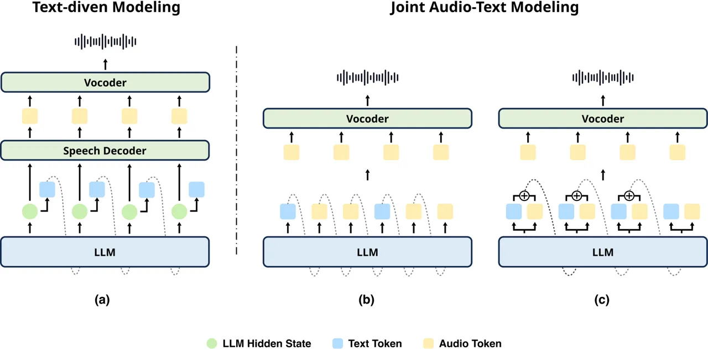
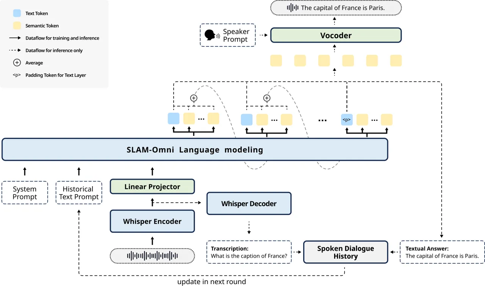
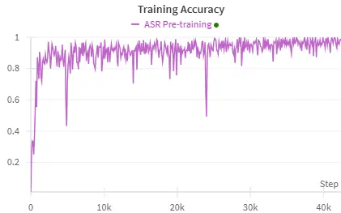
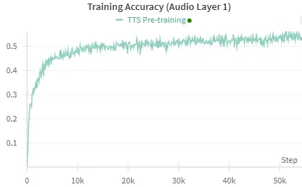

# SLAM-Omni: Timbre-Controllable Voice Interaction System with Single-Stage Training

Wenxi Chen Email: [1029713857@sjtu.edu.cn](mailto:)    Ziyang Ma
Affiliation: MoE Key Lab of Artificial Intelligence, X-LANCE Lab,
Shanghai Jiao Tong University Email: [chenxie95@sjtu.edu.cn](mailto:)   
Ruiqi Yan Affiliation: MoE Key Lab of Artificial Intelligence, X-LANCE
Lab, Shanghai Jiao Tong University    Yuzhe Liang Affiliation: MoE Key
Lab of Artificial Intelligence, X-LANCE Lab, Shanghai Jiao Tong
University    Xiquan Li Affiliation: MoE Key Lab of Artificial
Intelligence, X-LANCE Lab, Shanghai Jiao Tong University    Ruiyang Xu
Affiliation: MoE Key Lab of Artificial Intelligence, X-LANCE Lab,
Shanghai Jiao Tong University    Zhikang Niu Affiliation: MoE Key Lab of
Artificial Intelligence, X-LANCE Lab, Shanghai Jiao Tong University   
Yanqiao Zhu Affiliation: MoE Key Lab of Artificial Intelligence, X-LANCE
Lab, Shanghai Jiao Tong University    Yifan Yang Affiliation: MoE Key
Lab of Artificial Intelligence, X-LANCE Lab, Shanghai Jiao Tong
University    Zhanxun Liu Affiliation: MoE Key Lab of Artificial
Intelligence, X-LANCE Lab, Shanghai Jiao Tong University    Kai Yu
Affiliation: MoE Key Lab of Artificial Intelligence, X-LANCE Lab,
Shanghai Jiao Tong University    Yuxuan Hu Affiliation: Microsoft
Corporation    Jinyu Li Affiliation: Microsoft Corporation    Yan Lu
Affiliation: Microsoft Corporation    Shujie Liu    Xie Chen

###### Abstract

Recent advancements highlight the potential of end-to-end real-time
spoken dialogue systems, showcasing their low latency and high quality.
In this paper, we introduce SLAM-Omni, a timbre-controllable, end-to-end
voice interaction system with single-stage training. SLAM-Omni achieves
zero-shot timbre control by modeling spoken language with semantic
tokens and decoupling speaker information to a vocoder. By predicting
grouped speech semantic tokens at each step, our method significantly
reduces the sequence length of audio tokens, accelerating both training
and inference. Additionally, we propose historical text prompting to
compress dialogue history, facilitating efficient multi-round
interactions. Comprehensive evaluations reveal that SLAM-Omni
outperforms prior models of similar scale, requiring only 15 hours of
training on 4 GPUs with limited data. Notably, it is the first spoken
dialogue system to achieve competitive performance with a single-stage
training approach, eliminating the need for pre-training on TTS or ASR
tasks. Further experiments validate its multilingual and multi-turn
dialogue capabilities on larger datasets.¹¹ 1 Demo at
[https://SLAM-Omni.github.io](https://SLAM-Omni.github.io)

^(†)^(†) \*This work was conducted during an internship at Microsoft
Research Asia.^(†)^(†) ^(†)Corresponding authors.

## 1 Introduction

With the advent of large language models (LLMs), recent developments
(Achiam et al., 2023; Dubey et al., 2024; Yang et al., 2024a) have
showcased their powerful capabilities in textual conversation. In spoken
dialogue systems, however, traditional methods rely on a cascaded
pipeline involving automatic speech recognition (ASR) to transcribe user
input, LLMs to generate textual responses, and text-to-speech (TTS)
models to produce audio outputs. This design faces two major issues: (1)
significantly increased interaction latency, and (2) reliance on
text-based interaction, which overlooks rich non-verbal information in
speech dialogue, such as emotions and prosody. The release of
GPT-4o OpenAI (2024b) has underscored the potential of real-time spoken
dialogue systems in delivering seamless interaction. In response,
several open-source frameworks, including Moshi (Défossez et al., 2024),
Mini-Omni (Xie and Wu, 2024a; Xie and Wu, 2024b), and LLaMA-Omni (Fang
et al., 2024), have been developed for effective end-to-end voice-based
interaction.

Existing spoken dialogue models (SDMs) primarily model speech with
discretized audio tokens. Some approaches (Fang et al., 2024; Wang
et al., 2024) rely on text embeddings to guide audio token generation,
which limits their ability to generate critical audio paralinguistic
attributes such as emotion and prosody. Others (Zeng et al., 2024b;
Zhang et al., 2024; Nguyen et al., 2024) adopt interleaved arrangements
of audio and text tokens to restructure language modeling, while
increasing training costs. A third category (Xie and Wu, 2024a; Xie and
Wu, 2024b; Mitsui et al., 2024) employs a parallel speech-text
generation method, which aligns closely with ours, balancing the
delivery of intrinsic audio attributes and consuming of computational
burden.



Figure 1: Illustration of existing end-to-end spoken dialogue modeling.
(a): Text-driven modeling. (b): Interleaved audio-text modeling. (c):
Parallel audio-text modeling.

A notable limitation of current SDMs is their disability to generate
responses with diverse speaker timbres. This restriction primarily stems
from the uniform timbre of responses in most training datasets and the
lack of explicit speaker modeling in existing frameworks. To address
this gap, we propose the first zero-shot timbre control solution for
dialogue systems. Drawing inspiration from zero-shot TTS (Wang et al.,
2023), our approach allows users to specify the desired output timbre by
providing an audio prompt, paving the way for interactive applications
such as personalized virtual assistants and customizable game character
voices.

In this paper, we propose SLAM-Omni, a timbre-controllable, end-to-end
spoken dialogue system with single-stage training. For user speech
input, the Whisper (Radford et al., 2023) encoder is employed to extract
audio representations, which are then aligned with text embeddings via a
projector and fed into the LLM. On the output side, semantic audio
tokens (Du et al., 2024) and text tokens are autoregressively predicted
in parallel. These audio tokens naturally decouple speaker information
into a separate vocoder, enabling zero-shot timbre control. Inspired by
VALL-E 2 (Chen et al., 2024a), SLAM-Omni predicts single-layer semantic
tokens in grouped units per audio frame, reducing audio sequence length
and accelerating training and inference. For multi-round spoken dialogue
modeling, we introduce historical text prompting, which leverages
text-only history rather than alternating audio-text streams. This
strategy significantly compresses the dialogue history, improves data
utilization, enables the model to handle more dialogue turns and
enhances its instruction-following ability. During inference,
instruction text is extracted from encoded audio embeddings with a
Whisper decoder and response text is directly obtained from the
generated text stream, both of which provide low-cost speech
transcription that enables efficient multi-round voice interactions.
Comprehensive evaluations demonstrate that ASR or TTS pre-training is
not necessary, while our SLAM-Omni, with only 15 hours of single-stage
training on 4 GPUs, greatly outperforms prior models of similar scale in
both speech content, quality and speech-text alignment.

Our contributions are summarized below:

- •
  We propose the first zero-shot timbre control solution for voice
  interaction systems with speaker-decoupled semantic tokens.
- •
  Semantic Group Modeling approach is proposed for accelerating
  single-layer semantic speech token generation and model training.
- •
  Historical Text Prompting is proposed for efficient multi-round
  history modeling in SDMs.
- •
  SLAM-Omni is the first voice assistant to achieve single-stage
  training, requiring minimal data and computational resources.
- •
  Experiments show that SLAM-Omni outperforms prior models of similar
  scale on text-related tasks, and shows superior performance on
  acoustic quality and speech-text alignment among all existing SDMs.
  Results on a larger dataset demonstrates its multilingual and
  multi-round dialogue capabilities.



Figure 2: Overview of SLAM-Omni. System prompt, historical text prompt,
followed by user speech embedding are concatenated as input for
multi-turn voice interaction, while speaker prompt controls timbre using
the vocoder. Semantic group modeling is used to accelerate speech token
synthesis in the autoregressive language model.

## 2 Related Work

### 2.1 End-to-End Spoken Dialogue Modeling

Existing end-to-end SDMs primarily model voice interaction by treating
text as either an intermediate output or a hidden state to leverage the
pre-trained knowledge of LLMs. As illustrated in Figure 1, these methods
can be categorized into text-driven modeling and joint audio-text
modeling. For text-driven modeling, as shown in Figure 1a, existing
methods (Fang et al., 2024; Wang et al., 2024) keep the original
architecture of LLMs to retain textual abilities, using their hidden
states as input to a speech decoder for audio generation. This approach
effectively preserves LLMs knowledge but struggles to capture rich audio
paralinguistic attributes such as emotion and prosody, since only text
tokens are used for autoregressive modeling. Joint audio-text modeling,
illustrated in Figure 1b and c, is further divided into interleaved and
parallel paradigms. Both paradigms incorporate audio tokens into the
autoregressive modeling, theoretically enhancing the ability to model
non-verbal information. In the interleaved paradigm, models (Zhang
et al., 2024; Zeng et al., 2024b; Nguyen et al., 2024) alternate between
text and audio tokens during generation. This method typically requires
extensive interleaved speech-text data and pre-training for re-modeling
LLMs. In contrast, the parallel paradigm, adopted by models like PSLM
(Mitsui et al., 2024), Mini-Omni (Xie and Wu, 2024a; Xie and Wu, 2024b),
and our proposed SLAM-Omni, employs autoregressive modeling of text and
audio tokens in parallel. However, unlike PSLM and Mini-Omni, SLAM-Omni
predicts single-layer grouped semantic tokens to accelerate audio
generation process. Combining semantic group modeling with single-stage
training, we achieve an end-to-end SDM built on a pre-trained LLM that
requires significantly less training costs compared to previous
solutions.

### 2.2 Speech Tokenization

Speech tokenization is a foundational technique in speech language
models (SLMs), typically categorized into acoustic tokens and semantic
tokens (Zhang et al., 2023; Borsos et al., 2023). Acoustic tokens,
derived from neural audio codecs (Défossez et al., 2022; Zeghidour
et al., 2021) and optimized for reconstructing high-quality audio, have
been widely adopted in SLMs for speech synthesis and editing (Wang
et al., 2023; Peng et al., 2024), as well as in SDMs for voice
interaction (Xie and Wu, 2024a; Xie and Wu, 2024b; Wang et al., 2024).
In contrast, semantic tokens are obtained by discretizing speech
representations extracted from self-supervised speech pre-trained models
(Hsu et al., 2021; Chung et al., 2021), focusing on capturing semantic
content rather than acoustic detail. These tokens are also extensively
used in SLMs (An et al., 2024; Ma et al., 2024a) and SDMs (Zeng et al.,
2024a; Fang et al., 2024). Among these approaches, CosyVoice (Du et al., 2024) leverages supervised semantic tokens to enable zero-shot TTS,
demonstrating the potential of semantic tokens for timbre control. This
insight inspires our work, which seeks to extend such functionality to
SDMs—a promising yet underexplored direction in the field.

## 3 SLAM-Omni

### 3.1 Overview

As shown in Figure 2, SLAM-Omni processes input speech using continuous
features and adopts parallel audio-text modeling with discrete semantic
audio tokens for speech output. This section details its modeling
strategies, covering speech input, speech output, timbre control, and
multi-round spoken dialogue, along with its training methodology.

### 3.2 Speech Input Modeling

SLAM-Omni employs the Whisper encoder (Radford et al., 2023) to extract
audio features $`\mathbf{A}=[a_{1},a_{2},\cdots,a_{N}]`$ from user
speech instructions at a frequency of 50 Hz. Whisper, a speech
recognition model trained on large-scale supervised cross-lingual speech
data, provides precise transcription and robust multilingual support,
serving as a foundational component for SLAM-Omni’s multi-turn and
multilingual dialogue capabilities. Following Ma et al. (2024b), we
downsample $`\mathbf{A}`$ by concatenating every $`k`$ consecutive
frames along the feature dimension, yielding intermediate features
$`\mathbf{A}^{I}=[a^{I}_{1},a^{I}_{2},\dots,a^{I}_{N^{\prime}}]`$, where
$`a^{I}_{i}=a_{(i-1)*k+1}\oplus a_{(i-1)*k+2}\oplus\cdots\oplus a_{i*k-1}`$
and $`N^{\prime}=N//k`$. A linear encoder projector then transforms
$`\mathbf{A}^{I}`$ into $`\mathbf{A}^{P}`$ to ensure alignment with
LLM’s embedding dimension, defined as
$`\mathbf{A^{P}}=\text{MLP}(\mathbf{A}^{I})`$. These reduced speech
features are concatenated with the prompt embeddings $`\mathbf{P}`$ and
serve as input to the LLM.

### 3.3 Semantic Group Modeling

For speech output, we adopt parallel audio-text modeling, predicting
single-layer semantic tokens (Du et al., 2024) alongside text tokens
autoregressively. To achieve this, the original LLM vocabulary $`V_{t}`$
and embedding space are extended with a new codebook $`V_{a}`$ for audio
tokens, resulting in an expanded vocabulary $`V_{j}=V_{t}\cup V_{a}`$.
The original word embedding matrix is preserved, while the embeddings
for audio tokens are randomly initialized.

Figure 3: Illustration of semantic group modeling with $`G=3`$. At each
step of the autoregressive process, embeddings of grouped semantic
tokens and text tokens are aggregated as the input to the LLMs.

At each generation step, the LLM outputs logits
$`L_{j}\in\mathbb{R}^{|V_{j}|}`$, which are partitioned into
$`L_{t}\in\mathbb{R}^{|V_{t}|}`$ and $`L_{a}\in\mathbb{R}^{|V_{a}|}`$,
representing predicted distributions for text and audio tokens,
respectively. However, generating text and audio tokens at the same rate
introduces a key challenge: there is a substantial frequency mismatch
between text tokens (~3Hz) and semantic tokens (50Hz). The high
frequency of audio tokens results in considerably longer sequences,
significantly increasing both training and inference costs, as well as
leading to higher latency in real-time speech generation.

To mitigate these issues, we propose semantic group modeling, which
allows the model to predict multiple audio tokens simultaneously at each
step, as illustrated in Figure 3. This approach projects the audio
logits $`L_{a}`$ into group-sized logits $`L_{g}`$ with a linear layer,
where $`L_{g}\in\mathbb{R}^{|V_{a}|\times G}`$, and $`G`$ denotes the
group size. During training, the original semantic token sequence
$`\mathbf{S}^{T}=[s_{0},s_{1},\dots,s_{T-1}]`$ is grouped as
$`\mathbf{G}^{T}=[g_{0},g_{1},\dots,g_{T^{\prime}-1}]`$, where:

```math
g_{i}=[s_{i\cdot G},s_{i\cdot G+1},\dots,s_{(i+1)\cdot G-1}],\quad T^{\prime}=T//G.
```

Given prompt embeddings $`\mathbf{P}`$, audio features
$`\mathbf{A}^{P}`$ and text token sequence
$`\mathbf{T}^{L}=[t_{0},t_{1},\dots,t_{L-1}]`$, the training objective
is defined as a weighted cross-entropy loss:

```math
\mathcal{L}=\lambda_{\text{text}}\mathcal{L}_{\text{text}}+\lambda_{\text{audio}}\mathcal{L}_{\text{audio}}
```

where:

```math
\mathcal{L}_{\text{text}}=-\frac{1}{L}\sum_{i=1}^{L}\log p(t_{i}\mid\mathbf{P},\mathbf{A}^{P},\mathbf{G}^{T}_{<i},\mathbf{T}^{L}_{<i})
```

```math
\mathcal{L}_{\text{audio}}=-\frac{1}{T^{\prime}G}\sum_{i=1}^{T^{\prime}}\sum_{j=1}^{G}\log p(s_{i\cdot G+j}\mid\mathbf{P},\mathbf{A}^{P},\mathbf{G}^{T}_{<i},\mathbf{T}^{L}_{<i})
```

Here, $`\mathcal{L}_{\text{text}}`$ and $`\mathcal{L}_{\text{audio}}`$
represent the losses for text and audio token predictions, respectively,
while $`\lambda_{\text{text}}`$ and $`\lambda_{\text{audio}}`$ are
corresponding weights.

### 3.4 Controllable Timbre Modeling

Previous approaches disentangle speech by modeling distinct subspaces
for different attributes (Ju et al., 2024) or predicting supervised
semantic tokens that separate content and speaker information (Du
et al., 2024). These methods enable timbre disentanglement from semantic
content, achieving zero-shot TTS where users can freely adjust the
system’s vocal timbre by providing audio prompts.

Building on these insights from TTS modeling, we extend zero-shot timbre
control to SDMs. By modeling speech content as semantic tokens,
SLAM-Omni inherently disentangles timbre from linguistic information.
Following techniques demonstrated in zero-shot TTS (e.g., CosyVoice), we
employ a conditional flow matching model to convert semantic tokens and
speaker prompts into mel spectrograms, which are then synthesized into
waveforms via HiFi-GAN (Kong et al., 2020). For real-time speech
generation, same as common practice like Zeng et al. (2024b), block
causal attention is adopted in the Transformer of flow matching.

### 3.5 Historical Text Prompting

Previous multi-turn spoken dialogue modeling often interleave text and
audio tokens as the LLM history (Wang et al., 2024; Zeng et al., 2024a).
However, the lengthy audio token sequences pose challenges for model
training, especially in joint audio-text modeling requiring full
fine-tuning, significantly increasing computational costs and limiting
the number of dialogue turns. Moreover, longer histories hinder
in-context learning and raise the risk of forgetting earlier dialogue
content.

To address these issues, we introduce Historical Text Prompting, which
exclusively utilizes text modality to represent dialogue history. As
shown in Figure 2, SLAM-Omni structures multi-turn interactions using
the template: \<System\> \<History\> \<Input\> \<Answer\>. Here, the
system prompt specifies the model’s role and the dialogue task, while
the history prompt stores past dialogue content in text form. This
approach aligns naturally with the training paradigm of LLMs, inheriting
their robust text-based in-context learning capabilities. Moreover, it
eliminates the burden of modeling long audio sequences as history,
enabling the model to handle more dialogue turns within a constrained
context window.

Figure 4: Illustration of the key-value cache mechanism in Historical
Text Prompting for multi-round dialogue.

During inference, speech features $`\mathbf{A}`$ extracted by Whisper
can be decoded into the transcription of the input speech, represented
as $`\text{Decoder}(\mathbf{A})`$. On the output side, the generated
text tokens are converted back into text using the tokenizer. Both the
textual question and answer are appended to the dialogue history for
subsequent turns. As illustrated in Figure 4, the transcription of the
first-round spoken dialogue is incorporated into the historical prompt.
During the second round of inference, the corresponding key-value cache
is generated and can be reused in the third and subsequent rounds of
dialogue, facilitating efficient multi-round inference.

### 3.6 Single-Stage Training

Current spoken dialogue models typically depend on multi-stage training,
including modality adaptation, modality alignment, and supervised
fine-tuning (Ji et al., 2024). These designs demand intricate training
strategies, such as coordinating module training across stages and
tuning numerous hyperparameters, leading to substantial time and
computational overhead.

Aligned with the goal of making SDMs training accessible to everyone,
SLAM-Omni achieves outstanding performance through one-stage training
with minimal data. In our experiments, both TTS and ASR training exhibit
rapid loss convergence (see Appendix A), underscoring that extensive
modality alignment pre-training is unnecessary in our modeling method.
Moreover, further experiments reveal that pre-training negatively
impacts model’s ability to follow instructions and retain general
knowledge, as detailed in Section 5.3.2.

## 4 Experimental Setup

### 4.1 Datasets

[TABLE]

Table 1: The statistics of training datasets.

As most publicly available dialogue datasets are text-based, we
synthesize spoken dialogue corpora using zero-shot TTS systems.
Specifically, we utilize discrete speech tokens from Du et al. (2024)
and employ CosyVoice²² 2
[https://github.com/FunAudioLLM/CosyVoice](https://github.com/FunAudioLLM/CosyVoice)
to generate dialogue utterances. For user inputs, the CosyVoice-300M
model is employed to produce corresponding speech. Vocal timbre is
controlled by randomly sampling speaker prompts from a timbre library,
which contains 1007 English and 1010 Chinese human audio prompts sourced
from seed-tts-eval³³ 3
[https://github.com/BytedanceSpeech/seed-tts-eval](https://github.com/BytedanceSpeech/seed-tts-eval)
(Anastassiou et al., 2024). For assistant responses, we use the
text-to-token LLM from CosyVoice-300M-SFT to generate semantic tokens,
which are used as target audio tokens during SLAM-Omni training.

Table 1 summarizes the datasets used to synthesize spoken dialogue
corpora. The training data include VoiceAssistant-400K⁴⁴ 4
[https://huggingface.co/datasets/gpt-omni/VoiceAssistant-400K](https://huggingface.co/datasets/gpt-omni/VoiceAssistant-400K)
from Mini-Omni (Xie and Wu, 2024a), the English multi-turn dataset
UltraChat⁵⁵ 5
[https://huggingface.co/datasets/stingning/ultrachat](https://huggingface.co/datasets/stingning/ultrachat)
(Ding et al., 2023), and the Chinese dialogue dataset
Belle_train_3.5M_CN⁶⁶ 6
[https://huggingface.co/datasets/BelleGroup/train_3.5M_CN](https://huggingface.co/datasets/BelleGroup/train_3.5M_CN)
(Ji et al., 2023). We clean the synthesized data by removing written
artifacts (e.g., emojis, URLs), and we limit the duration of
instructions and responses to a maximum of 30 and 60 seconds,
respectively, to better align with natural conversational scenarios. For
the primary experiments with SLAM-Omni, only VoiceAssistant-400K is
used, while the remaining datasets are incorporated in supplementary
experiments to evaluate the model’s performance in multi-turn and
multilingual dialogue tasks.

### 4.2 Training and Inference Details

To ensure a fair comparison in low-resource settings, particularly with
Mini-Omni (Xie and Wu, 2024a; Xie and Wu, 2024b), another parallel
audio-text modeling approach, we utilize Qwen2-0.5B⁷⁷ 7
[https://huggingface.co/Qwen/Qwen2-0.5B](https://huggingface.co/Qwen/Qwen2-0.5B)
(Yang et al., 2024a) as the LLM backbone and Whisper-small⁸⁸ 8
[https://huggingface.co/openai/whisper-small](https://huggingface.co/openai/whisper-small)
(Radford et al., 2023) as the speech encoder and decoder. Following Ma
et al. (2024b), user speech instructions are zero-padded to 30 seconds
before being processed by the Whisper encoder, with the resulting speech
features downsampled using $`k=5`$. In the main experiments, SLAM-Omni
adopts a semantic group size of $`G=3`$. For ablation studies on group
size, models with $`G>1`$ include an additional linear layer for
predicting grouped tokens.

During single-stage training, SLAM-Omni undergoes full fine-tuning, with
the Whisper encoder kept frozen. The weights for
$`\mathcal{L}_{\text{text}}`$ and $`\mathcal{L}_{\text{audio}}`$ are set
to 1. We use the AdamW optimizer (Loshchilov, 2017) with a peak learning
rate of $`1\times 10^{-4}`$ and a batch size of 24. Training spans
100,000 steps, with the first 1,000 steps used for warmup, followed by a
linear decay schedule. A validation set comprising 1% of the training
data is used, and validation is performed every 3,000 updates, saving
checkpoints based on the lowest validation loss. For a direct comparison
with Mini-Omni, our primary experiments are only conducted on
VoiceAssistant-400K, a subset of Mini-Omni’s training data. Details on
multilingual and multi-turn training are provided in Appendix D and
Appendix 10. The entire training process takes approximately 15 hours on
4 NVIDIA A100 GPUs.

For inference, we use greedy search decoding with a repetition penalty
of 1.2 applied to both audio and text layers. Consistent with (Fang
et al., 2024), models are evaluated using non-streaming decoding for
speech response generation.

|                   |              |           |              |                |
| ----------------- | ------------ | --------- | ------------ | -------------- |
| Types             | Datasets     | \#Samples | Avg. \#Words | Avg. Audio len |
| Understanding     | Repeat       | 252       | 21.76        | 8.04           |
|                   | Summary      | 118       | 58.93        | 20.38          |
| Reasoning         | StoralEval   | 201       | 66.46        | 20.52          |
|                   | TruthfulEval | 470       | 10.87        | 3.40           |
|                   | MLC          | 177       | 22.43        | 7.56           |
| Oral Conversation | AlpacaEval   | 199       | 16.37        | 5.67           |
|                   | CommonEval   | 200       | 8.16         | 4.83           |
|                   | WildchatEval | 349       | 14.68        | 4.75           |

Table 2: The statistics of main evaluation datasets.

|                         |           |               |         |            |              |       |                   |            |              |         |
| ----------------------- | --------- | ------------- | ------- | ---------- | ------------ | ----- | ----------------- | ---------- | ------------ | ------- |
| Models                  | LLM Scale | Understanding |         | Reasoning  |              |       | Oral Conversation |            |              | Overall |
|                         |           | Repeat        | Summary | StoralEval | TruthfulEval | MLC   | AlpacaEval        | CommonEval | WildchatEval |         |
| Qwen2-7B-instruct^(†)   | 7B        | 96.87         | 97.45   | 82.35      | 67.89        | 73.26 | 95.91             | 85.93      | 92.72        | 86.55   |
| Freeze-Omni             | 7B        | 70.89         | 78.87   | 57.74      | 46.95        | 42.56 | 52.23             | 48.70      | 55.80        | 56.72   |
| LLaMA-Omni              | 8B        | 45.62         | 80.68   | 50.65      | 45.13        | 44.44 | 64.36             | 58.40      | 72.19        | 57.68   |
| GLM-4-Voice             | 9B        | 90.95         | 91.07   | 73.80      | 59.28        | 57.82 | 80.77             | 63.07      | 78.76        | 74.44   |
| Qwen2-0.5B-instruct^(†) | 0.5B      | 60.12         | 78.59   | 49.82      | 39.73        | 52.92 | 58.93             | 57.50      | 63.97        | 57.70   |
| Mini-Omni               | 0.5B      | 5.07          | 32.20   | 23.25      | 25.06        | 2.82  | 30.99             | 29.80      | 31.42        | 22.58   |
| Mini-Omni2              | 0.5B      | 8.10          | 40.06   | 28.49      | 26.92        | 6.97  | 34.81             | 30.70      | 36.43        | 26.56   |
| SLAM-Omni (ours)        | 0.5B      | 12.26         | 66.21   | 36.95      | 34.65        | 21.85 | 48.98             | 41.03      | 52.61        | 39.32   |

Table 3: ChatGPT scores of SDMs and LLMs across three dimensions.
^(†)The Qwen2 series models are text-based, single-modal LLMs, with
transcription input generated by Whisper-large-v3.

### 4.3 Evaluation for Spoken Dialogue Models

Previous SDMs lacked a thorough evaluation of voice interaction
capabilities. VoiceBench (Chen et al., 2024b) is the first benchmark for
voice assistants, but it only assesses the model’s text output. To
bridge this gap, we propose a comprehensive evaluation framework that
directly measures the speech-to-speech capabilities of SDMs. Voice
interaction in SDMs can be broken down into three key stages:
understanding, reasoning, and oral conversation. We have designed eight
distinct test sets that assess SDMs across these three dimensions:

##### Understanding

To evaluate the model’s ability of comprehending and following user
instructions, we build two datasets to require the model to repeat the
user’s words or summarize a story.

##### Reasoning

We adapt samples from TruthfulQA (Lin et al., 2021) and STORAL (Guan
et al., 2022), and design additional questions on math, logic, and
common sense (MLC) to assess the model’s general knowledge and reasoning
ability.

##### Oral Conversation

We use AlpacaEval (Li et al., 2023) and CommonEval (Ardila et al., 2019)
from VoiceBench, along with real-life questions from WildChat (Zhao
et al., 2024), to test the model’s conversational ability in open-ended
scenarios.

The model’s inference results on these tasks are evaluated using the
following metrics:

##### ChatGPT Score

To assess the content quality of the model’s responses, we use
Whisper-large-v3⁹⁹ 9
[https://huggingface.co/openai/whisper-large-v3](https://huggingface.co/openai/whisper-large-v3)
to transcribe the speech output into text, followed by evaluation using
GPT-4o mini (OpenAI, 2024a). The model is prompted to score the
transcription based on predefined criteria, including accuracy,
relevance, clarity, and completeness, with detailed prompts provided in
Appendix C.

##### UTMOS Score

To measure the overall speech quality, we use the UTMOS (Saeki et al., 2022) model to predict mean opinion scores (MOS).

##### WER Score

To evaluate the speech-text alignment, we calculate the word error rate
(WER) between the speech transcription and the corresponding text
response, referred to as ASR-WER.

The overall scores for UTMOS and ASR-WER are calculated as the average
of their respective scores across these eight evaluation datasets.

Table 2 summarizes the evaluation datasets, with details and scoring
criteria in Appendices B and C. Descriptions for the multi-turn and
Chinese evaluation datasets are in Appendices D and 10. We assess
SLAM-Omni alongside the Mini-Omni (Xie and Wu, 2024a; Xie and Wu,
2024b), both using a 0.5B LLM backbone, and compare against larger SDMs
including Freeze-Omni (Wang et al., 2024), Llama-Omni (Fang et al.,
2024), and GLM-4-Voice (Zeng et al., 2024a), as well as LLMs such as
Qwen2-0.5B-instruct and Qwen2-7B-instruct (Yang et al., 2024a).

|                  |                            |                    |                        |
| ---------------- | -------------------------- | ------------------ | ---------------------- |
| Models           | ChatGPT Score $`\uparrow`$ | UTMOS $`\uparrow`$ | ASR-WER $`\downarrow`$ |
| Freeze-Omni      | 56.72                      | 4.37               | 16.32%                 |
| LLaMA-Omni       | 57.68                      | 4.02               | 10.42%                 |
| GLM-4-Voice      | 74.44                      | 4.15               | 12.71%                 |
| Mini-Omni        | 22.58                      | 4.42               | 6.05%                  |
| Mini-Omni2       | 26.56                      | 4.43               | 10.24%                 |
| SLAM-Omni (ours) | 39.32                      | 4.45               | 4.54%                  |

Table 4: Overall evaluation results for SDMs.

## 5 Experimental Results

### 5.1 Main Results

Tables 3 and 4 present the performance of SLAM-Omni compared to
mainstream SDMs. Given our focus on low-resource settings, we mainly
benchmark performance against models with the same size, while including
larger-scale SDMs and LLMs in gray as references. Results show that,
despite SLAM-Omni’s single-stage training on only the third-phase
Mini-Omni data, it significantly improves speech content, audio quality,
and speech-text alignment. Although gaps in textural abilities exist
compared to larger SDMs (which we believe derives from the pre-trained
LLM model size), SLAM-Omni notably surpasses them in UTMOS and ASR-WER
scores, demonstrating its advantages in audio modeling. Further
assessments of multi-turn spoken dialogues and performance on Chinese
voice interactions are detailed in Appendices D and 10, respectively.

In ChatGPT-based evaluations, SLAM-Omni surpasses Mini-Omni in
understanding, reasoning, and oral conversation, indicating that it
preserves more pre-trained LLM knowledge and instruction-following
capabilities. However, it still falls short of Qwen2-0.5B-instruct.
Although both models are fine-tuned from Qwen2-0.5B-base,
Qwen2-0.5B-instruct benefits from extensive text-based instruction
tuning, whereas SLAM-Omni relies solely on a 400K spoken-dialogue
dataset. Evaluations of larger-scale models reveal that current SDMs
consistently underperform relative to similarly sized LLMs. One possible
reason for this disparity is the relatively limited exploration of data
during SDMs training compared to the extensive pre-training, SFT, and
RLHF undertaken for LLMs. How to effectively preserve, or even enhance,
the original knowledge of the LLM while incorporating spoken dialogue
data during SDMs training remains a promising and important research
direction.

In terms of audio quality and speech-text alignment, SLAM-Omni surpasses
all other SDMs, particularly on ASR-WER metrics, which may be attributed
to our semantic group modeling strategy. By leveraging grouped semantic
tokens, SLAM-Omni achieves tighter speech-text alignment, ensuring that
the generated audio closely matches its textual counterpart. In
contrast, larger SDMs often generate audio that fails to align with
their intermediate textual outputs, as evidenced by their ASR-WER
exceeding 10%. More specifically, these models struggles with long-form
content generation, with sometimes audio generation interrupted midway,
or extended silence generated. These issues ultimately lower their UTMOS
and ASR-WER scores in our evaluations.

### 5.2 Multi-turn Interaction

Appendix D details the multi-turn spoken dialogues settings and results.
Our experiments suggests that exposing the model to multi-turn spoken
dialogues with historical text prompting can activate its underlying
textual in-context learning capabilities. As a result, even though the
model was fine-tuned exclusively on spoken instructions, it can
effectively interpret textual instructions.

### 5.3 Ablation Study

We conduct ablation studies to further validate the efficiency and
effectiveness of our modeling and training strategy. All experiments
were conducted on 4 NVIDIA A100 GPUs for fair comparisons.

|                  |                            |                    |                        |           |
| ---------------- | -------------------------- | ------------------ | ---------------------- | --------- |
| Group Size $`G`$ | ChatGPT Score $`\uparrow`$ | UTMOS $`\uparrow`$ | ASR-WER $`\downarrow`$ | GPU Hours |
| 1                | 34.17                      | 4.44               | 18.23%                 | 126       |
| 2                | 35.22                      | 4.46               | 8.00%                  | 78        |
| 3                | 39.32                      | 4.45               | 4.54%                  | 60        |
| 4                | 37.19                      | 4.45               | 4.31%                  | 52        |
| 5                | 33.93                      | 4.43               | 4.85%                  | 50        |

Table 5: Ablation study for the group size $`G`$.

#### 5.3.1 Effect of Group Size

Table 5 presents the impact of different group sizes in semantic group
modeling on model performance. The results indicate that semantic group
modeling significantly enhances the model’s speech-text alignment and
enables it to generate more helpful responses. Specifically, when
$`G\geq 3`$, the model achieves an ASR-WER below 5%, whereas the model
without grouping semantic tokens ($`G=1`$) shows a much higher ASR-WER
of 18.23%. This gap arises primarily due to the frequency mismatch
between audio tokens and text tokens, as discussed in Section 3.3. By
properly reducing the length of audio sequences, semantic group modeling
effectively alleviates this mismatch, enables better semantic alignment
between audio and text tokens. Moreover, it ensures better retention of
pre-trained LLM knowledge after dialogue data fine-tuning, as evidenced
by the improved ChatGPT scores.

Additionally, semantic group modeling substantially reduces training and
inference costs. During training, a lightweight group prediction layer
is employed to compresses audio sequences, drastically lowering GPU
memory consumption and training overhead. As a result, the model
achieves superior performance with less than half the GPU hours required
by baselines. This approach also accelerates inference. For instance,
when using a streaming vocoder with chunk sizes of 30 tokens, a model
with $`G=3`$ requires only 10 LLM inference steps to produce the first
audio packet. This reduced latency ensures seamless audio generation,
enhancing user experience in voice interactions.

|                        |                            |                    |                        |           |
| ---------------------- | -------------------------- | ------------------ | ---------------------- | --------- |
| Setting                | ChatGPT Score $`\uparrow`$ | UTMOS $`\uparrow`$ | ASR-WER $`\downarrow`$ | GPU Hours |
| SLAM-Omni              | 39.32                      | 4.45               | 4.54%                  | 60        |
| \- w/ ASR pre-training | 34.02                      | 4.45               | 4.38%                  | 132       |
| \- w/ TTS pre-training | 27.22                      | 4.46               | 4.53%                  | 160       |

Table 6: Ablation study for training strategy.

#### 5.3.2 Training Strategy

Previous voice interaction systems typically rely on a multi-stage
training pipeline, beginning with modality alignment pre-training tasks
(e.g., ASR or TTS) before transitioning to fine-tuning on dialogue data.
However, as shown in Table 6, while ASR and TTS pre-training slightly
improve audio-text alignment—evidenced by lower ASR-WER—they fail to
enhance overall performance on spoken interactive tasks. In contrast,
SLAM-Omni, trained using a single-stage strategy, significantly
outperforms pre-trained models in ChatGPT scores while maintaining
comparable audio quality. One possible explanation is that focusing
solely on a single pre-training task can diminish the model’s
instruction-following capability and erode its general knowledge base.
In contrast, our experiments demonstrate that applying single-stage
fine-tuning directly on speech-to-speech datasets helps SLAM-Omni retain
more of the original LLM’s pre-trained knowledge. This streamlined
approach also eliminates the need for a separate pre-training step and
more than doubles the training efficiency.

## 6 Conclusion

In this work, we propose SLAM-Omni, a timbre-controllable, end-to-end
spoken dialogue model with single-stage training. Through a novel
semantic group modeling, SLAM-Omni effectively aligns audio and text
modalities during audio generation, as well as accelerating both
training and inference. Employing supervised semantic tokens to
disentangle speaker information, SLAM-Omni is capable of zero-shot
timbre control. To address the issues posed by long audio histories, we
introduce historical text prompting technique, which stores dialogue
history as text and uses key-value caches for efficient multi-turn
inference. Despite limited data and only 60 GPU hours of training,
SLAM-Omni surpasses previous SDMs of similar scale on text-related
abilities, and exceeds all SDMs on acoustic quality and speech-text
alignment.

## Limitations

There are two limitations to this work. First, while historical text
prompting effectively mitigates the burden of handling long audio
sequences during training and inference, it sacrifices the rich
non-verbal information accumulated from previous dialogue turns. In
certain scenarios, retaining this historical context is crucial for
maintaining dialogue coherence and depth. Further exploration is needed
to efficiently retain such information in SDMs. Second, although
SLAM-Omni demonstrates efficient modeling for smaller-scale LLMs,
extending this approach to larger LLMs remain to be explored. Unlike
purely text-driven methods, joint audio-text modeling necessitates
substantially more training data for large-scale models. Striking a
balance between efficient audio-text joint modeling and minimizing the
loss of the original LLM’s inherent knowledge remains a critical
direction for future research.

## References

- Achiam et al. (2023) Josh Achiam, Steven Adler, Sandhini Agarwal, Lama
  Ahmad, Ilge Akkaya, Florencia Leoni Aleman, Diogo Almeida, Janko
  Altenschmidt, Sam Altman, Shyamal Anadkat, et al. 2023. Gpt-4
  technical report. _arXiv preprint arXiv:2303.08774_.
- An et al. (2024) Keyu An, Qian Chen, Chong Deng, Zhihao Du, Changfeng
  Gao, Zhifu Gao, Yue Gu, Ting He, Hangrui Hu, Kai Hu, et al. 2024.
  Funaudiollm: Voice understanding and generation foundation models for
  natural interaction between humans and llms. _arXiv preprint
  arXiv:2407.04051_.
- Anastassiou et al. (2024) Philip Anastassiou, Jiawei Chen, Jitong
  Chen, Yuanzhe Chen, Zhuo Chen, Ziyi Chen, Jian Cong, Lelai Deng,
  Chuang Ding, Lu Gao, et al. 2024. Seed-TTS: A Family of High-Quality
  Versatile Speech Generation Models. _arXiv preprint arXiv:2406.02430_.
- Ardila et al. (2019) Rosana Ardila, Megan Branson, Kelly Davis,
  Michael Henretty, Michael Kohler, Josh Meyer, Reuben Morais, Lindsay
  Saunders, Francis M Tyers, and Gregor Weber. 2019. Common voice: A
  massively-multilingual speech corpus. _arXiv preprint
  arXiv:1912.06670_.
- Bai et al. (2024) Ge Bai, Jie Liu, Xingyuan Bu, Yancheng He, Jiaheng
  Liu, Zhanhui Zhou, Zhuoran Lin, Wenbo Su, Tiezheng Ge, Bo Zheng,
  et al. 2024. Mt-bench-101: A fine-grained benchmark for evaluating
  large language models in multi-turn dialogues. _arXiv preprint
  arXiv:2402.14762_.
- Borsos et al. (2023) Zalán Borsos, Raphaël Marinier, Damien Vincent,
  Eugene Kharitonov, Olivier Pietquin, Matt Sharifi, Dominik Roblek,
  Olivier Teboul, David Grangier, Marco Tagliasacchi, et al. 2023.
  Audiolm: a language modeling approach to audio generation. _IEEE/ACM
  transactions on audio, speech, and language processing_, 31:2523–2533.
- Chen et al. (2024a) Sanyuan Chen, Shujie Liu, Long Zhou, Yanqing Liu,
  Xu Tan, Jinyu Li, Sheng Zhao, Yao Qian, and Furu Wei. 2024a. VALL-E 2:
  Neural Codec Language Models are Human Parity Zero-Shot Text to Speech
  Synthesizers. _arXiv preprint arXiv:2406.05370_.
- Chen et al. (2024b) Yiming Chen, Xianghu Yue, Chen Zhang, Xiaoxue Gao,
  Robby T Tan, and Haizhou Li. 2024b. Voicebench: Benchmarking llm-based
  voice assistants. _arXiv preprint arXiv:2410.17196_.
- Chung et al. (2021) Yu-An Chung, Yu Zhang, Wei Han, Chung-Cheng Chiu,
  James Qin, Ruoming Pang, and Yonghui Wu. 2021. W2v-bert: Combining
  contrastive learning and masked language modeling for self-supervised
  speech pre-training. In _2021 IEEE Automatic Speech Recognition and
  Understanding Workshop (ASRU)_, pages 244–250. IEEE.
- Défossez et al. (2022) Alexandre Défossez, Jade Copet, Gabriel
  Synnaeve, and Yossi Adi. 2022. High fidelity neural audio compression.
  _arXiv preprint arXiv:2210.13438_.
- Défossez et al. (2024) Alexandre Défossez, Laurent Mazaré, Manu
  Orsini, Amélie Royer, Patrick Pérez, Hervé Jégou, Edouard Grave, and
  Neil Zeghidour. 2024. Moshi: a speech-text foundation model for
  real-time dialogue. _arXiv preprint arXiv:2410.00037_.
- Ding et al. (2023) Ning Ding, Yulin Chen, Bokai Xu, Yujia Qin, Zhi
  Zheng, Shengding Hu, Zhiyuan Liu, Maosong Sun, and Bowen Zhou. 2023.
  Enhancing chat language models by scaling high-quality instructional
  conversations. _arXiv preprint arXiv:2305.14233_.
- Du et al. (2024) Zhihao Du, Qian Chen, Shiliang Zhang, Kai Hu, Heng
  Lu, Yexin Yang, Hangrui Hu, Siqi Zheng, Yue Gu, Ziyang Ma,
  et al. 2024. Cosyvoice: A scalable multilingual zero-shot
  text-to-speech synthesizer based on supervised semantic tokens. _arXiv
  preprint arXiv:2407.05407_.
- Dubey et al. (2024) Abhimanyu Dubey, Abhinav Jauhri, Abhinav Pandey,
  Abhishek Kadian, Ahmad Al-Dahle, Aiesha Letman, Akhil Mathur, Alan
  Schelten, Amy Yang, Angela Fan, et al. 2024. The llama 3 herd of
  models. _arXiv preprint arXiv:2407.21783_.
- Fang et al. (2024) Qingkai Fang, Shoutao Guo, Yan Zhou, Zhengrui Ma,
  Shaolei Zhang, and Yang Feng. 2024. Llama-Omni: Seamless speech
  interaction with large language models. _arXiv preprint
  arXiv:2409.06666_.
- Gao et al. (2022) Zhifu Gao, Shiliang Zhang, Ian McLoughlin, and
  Zhijie Yan. 2022. Paraformer: Fast and accurate parallel transformer
  for non-autoregressive end-to-end speech recognition. _arXiv preprint
  arXiv:2206.08317_.
- Guan et al. (2022) Jian Guan, Ziqi Liu, and Minlie Huang. 2022. A
  corpus for understanding and generating moral stories. _arXiv preprint
  arXiv:2204.09438_.
- Hsu et al. (2021) Wei-Ning Hsu, Benjamin Bolte, Yao-Hung Hubert Tsai,
  Kushal Lakhotia, Ruslan Salakhutdinov, and Abdelrahman Mohamed. 2021.
  Hubert: Self-supervised speech representation learning by masked
  prediction of hidden units. _IEEE/ACM transactions on audio, speech,
  and language processing_, 29:3451–3460.
- Hu et al. (2015) Baotian Hu, Qingcai Chen, and Fangze Zhu. 2015.
  LCSTS: A large scale Chinese short text summarization dataset. _arXiv
  preprint arXiv:1506.05865_.
- Ji et al. (2024) Shengpeng Ji, Yifu Chen, Minghui Fang, Jialong Zuo,
  Jingyu Lu, Hanting Wang, Ziyue Jiang, Long Zhou, Shujie Liu, Xize
  Cheng, et al. 2024. WavChat: A Survey of Spoken Dialogue Models.
  _arXiv preprint arXiv:2411.13577_.
- Ji et al. (2023) Yunjie Ji, Yong Deng, Yan Gong, Yiping Peng, Qiang
  Niu, Lei Zhang, Baochang Ma, and Xiangang Li. 2023. Exploring the
  impact of instruction data scaling on large language models: An
  empirical study on real-world use cases. _arXiv preprint
  arXiv:2303.14742_.
- Ju et al. (2024) Zeqian Ju, Yuancheng Wang, Kai Shen, Xu Tan, Detai
  Xin, Dongchao Yang, Yanqing Liu, Yichong Leng, Kaitao Song, Siliang
  Tang, et al. 2024. Naturalspeech 3: Zero-shot speech synthesis with
  factorized codec and diffusion models. _arXiv preprint
  arXiv:2403.03100_.
- Kong et al. (2020) Jungil Kong, Jaehyeon Kim, and Jaekyoung Bae. 2020.
  HiFi-GAN: Generative Adversarial Networks for Efficient and High
  Fidelity Speech Synthesis. _Advances in neural information processing
  systems_, 33:17022–17033.
- Li et al. (2023) Xuechen Li, Tianyi Zhang, Yann Dubois, Rohan Taori,
  Ishaan Gulrajani, Carlos Guestrin, Percy Liang, and Tatsunori B
  Hashimoto. 2023. Alpacaeval: An automatic evaluator of
  instruction-following models.
- Lin et al. (2021) Stephanie Lin, Jacob Hilton, and Owain Evans. 2021.
  Truthfulqa: Measuring how models mimic human falsehoods. _arXiv
  preprint arXiv:2109.07958_.
- Loshchilov (2017) I Loshchilov. 2017. Decoupled weight decay
  regularization. _arXiv preprint arXiv:1711.05101_.
- Ma et al. (2024a) Ziyang Ma, Yakun Song, Chenpeng Du, Jian Cong, Zhuo
  Chen, Yuping Wang, Yuxuan Wang, and Xie Chen. 2024a. Language Model
  Can Listen While Speaking. _arXiv preprint arXiv:2408.02622_.
- Ma et al. (2024b) Ziyang Ma, Guanrou Yang, Yifan Yang, Zhifu Gao,
  Jiaming Wang, Zhihao Du, Fan Yu, Qian Chen, Siqi Zheng, Shiliang
  Zhang, et al. 2024b. An Embarrassingly Simple Approach for LLM with
  Strong ASR Capacity. _arXiv preprint arXiv:2402.08846_.
- Mihaylov et al. (2018) Todor Mihaylov, Peter Clark, Tushar Khot, and
  Ashish Sabharwal. 2018. Can a suit of armor conduct electricity? a new
  dataset for open book question answering. _arXiv preprint
  arXiv:1809.02789_.
- Mitsui et al. (2024) Kentaro Mitsui, Koh Mitsuda, Toshiaki Wakatsuki,
  Yukiya Hono, and Kei Sawada. 2024. PSLM: Parallel Generation of Text
  and Speech with LLMs for Low-Latency Spoken Dialogue Systems. _arXiv
  preprint arXiv:2406.12428_.
- Nguyen et al. (2024) Tu Anh Nguyen, Benjamin Muller, Bokai Yu, Marta R
  Costa-Jussa, Maha Elbayad, Sravya Popuri, Paul-Ambroise Duquenne,
  Robin Algayres, Ruslan Mavlyutov, Itai Gat, et al. 2024. Spirit-lm:
  Interleaved spoken and written language model. _arXiv preprint
  arXiv:2402.05755_.
- OpenAI (2024a) OpenAI. 2024a. GPT-4o mini: advancing cost-efficient
  intelligence. _URL
  https://openai.com/index/gpt-4o-mini-advancing-cost-efficient-intelligence/_.
- OpenAI (2024b) OpenAI. 2024b. Hello GPT-4o. _URL https://openai.
  com/index/hello-gpt-4o/_.
- Peng et al. (2024) Puyuan Peng, Po-Yao Huang, Shang-Wen Li,
  Abdelrahman Mohamed, and David Harwath. 2024. Voicecraft: Zero-shot
  speech editing and text-to-speech in the wild. _arXiv preprint
  arXiv:2403.16973_.
- Radford et al. (2023) Alec Radford, Jong Wook Kim, Tao Xu, Greg
  Brockman, Christine McLeavey, and Ilya Sutskever. 2023. Robust speech
  recognition via large-scale weak supervision. In _International
  conference on machine learning_, pages 28492–28518. PMLR.
- Saeki et al. (2022) Takaaki Saeki, Detai Xin, Wataru Nakata, Tomoki
  Koriyama, Shinnosuke Takamichi, and Hiroshi Saruwatari. 2022. Utmos:
  Utokyo-sarulab system for voicemos challenge 2022. _arXiv preprint
  arXiv:2204.02152_.
- Sakshi et al. (2024) S Sakshi, Utkarsh Tyagi, Sonal Kumar, Ashish
  Seth, et al. 2024. MMAU: A massive multi-task audio understanding and
  reasoning benchmark. _arXiv preprint arXiv:2410.19168_.
- Wang et al. (2023) Chengyi Wang, Sanyuan Chen, Yu Wu, Ziqiang Zhang,
  Long Zhou, Shujie Liu, Zhuo Chen, Yanqing Liu, Huaming Wang, Jinyu Li,
  et al. 2023. Neural codec language models are zero-shot text to speech
  synthesizers. _arXiv preprint arXiv:2301.02111_.
- Wang et al. (2024) Xiong Wang, Yangze Li, Chaoyou Fu, Lei Xie, Ke Li,
  Xing Sun, and Long Ma. 2024. Freeze-Omni: A Smart and Low Latency
  Speech-to-speech Dialogue Model with Frozen LLM. _arXiv preprint
  arXiv:2411.00774_.
- Xie and Wu (2024a) Zhifei Xie and Changqiao Wu. 2024a. Mini-Omni:
  Language models can hear, talk while thinking in streaming. _arXiv
  preprint arXiv:2408.16725_.
- Xie and Wu (2024b) Zhifei Xie and Changqiao Wu. 2024b. Mini-Omni2:
  Towards Open-source GPT-4o with Vision, Speech and Duplex
  Capabilities. _arXiv preprint arXiv:2410.11190_.
- Yang et al. (2024a) An Yang, Baosong Yang, Binyuan Hui, Bo Zheng,
  Bowen Yu, Chang Zhou, Chengpeng Li, Chengyuan Li, Dayiheng Liu, Fei
  Huang, et al. 2024a. Qwen2 technical report. _arXiv preprint
  arXiv:2407.10671_.
- Yang et al. (2024b) Qian Yang, Jin Xu, Wenrui Liu, Yunfei Chu, Ziyue
  Jiang, Xiaohuan Zhou, Yichong Leng, Yuanjun Lv, Zhou Zhao, Chang Zhou,
  et al. 2024b. AIR-Bench: Benchmarking Large Audio-Language Models via
  Generative Comprehension. _arXiv preprint arXiv:2402.07729_.
- Zeghidour et al. (2021) Neil Zeghidour, Alejandro Luebs, Ahmed Omran,
  Jan Skoglund, and Marco Tagliasacchi. 2021. Soundstream: An end-to-end
  neural audio codec. _IEEE/ACM Transactions on Audio, Speech, and
  Language Processing_, 30:495–507.
- Zeng et al. (2024a) Aohan Zeng, Zhengxiao Du, Mingdao Liu, Kedong
  Wang, Shengmin Jiang, Lei Zhao, Yuxiao Dong, and Jie Tang. 2024a.
  Glm-4-voice: Towards intelligent and human-like end-to-end spoken
  chatbot. _arXiv preprint arXiv:2412.02612_.
- Zeng et al. (2024b) Aohan Zeng, Zhengxiao Du, Mingdao Liu, Lei Zhang,
  Shengmin Jiang, Yuxiao Dong, and Jie Tang. 2024b. Scaling Speech-Text
  Pre-training with Synthetic Interleaved Data. _arXiv preprint
  arXiv:2411.17607_.
- Zhang et al. (2023) Dong Zhang, Shimin Li, Xin Zhang, Jun Zhan, Pengyu
  Wang, Yaqian Zhou, and Xipeng Qiu. 2023. Speechgpt: Empowering large
  language models with intrinsic cross-modal conversational abilities.
  _arXiv preprint arXiv:2305.11000_.
- Zhang et al. (2024) Qinglin Zhang, Luyao Cheng, Chong Deng, Qian Chen,
  Wen Wang, Siqi Zheng, Jiaqing Liu, Hai Yu, and Chaohong Tan. 2024.
  OmniFlatten: An End-to-end GPT Model for Seamless Voice Conversation.
  _arXiv preprint arXiv:2410.17799_.
- Zhao et al. (2024) Wenting Zhao, Xiang Ren, Jack Hessel, Claire
  Cardie, Yejin Choi, and Yuntian Deng. 2024. Wildchat: 1m chatgpt
  interaction logs in the wild. _arXiv preprint arXiv:2405.01470_.

## Appendix A Pre-training Details

For ASR and TTS pre-training, we exclusively utilize the
VoiceAssistant-400K dataset to ensure consistency and avoid introducing
external data. During ASR pre-training, the speech instructions are
provided as input, with their corresponding transcriptions serving as
the target outputs. Conversely, for TTS pre-training, the transcriptions
of the speech responses are used as input text, while the corresponding
semantic tokens are set as the prediction targets. The optimization and
learning strategies align with those employed during fine-tuning, as
described in Section 4.2. Notably, only the text-layer loss is computed
during ASR pre-training, whereas TTS pre-training exclusively focuses on
the multi-layer audio loss as the training objective.



Figure 5: Training accuracy of the next text token prediction during ASR
pre-training.



Figure 6: Training accuracy of the next audio token prediction during
TTS pre-training.

Figures 5 and 6 depict the training curves for ASR and TTS pre-training
tasks, respectively. In TTS pre-training, group-based strategies are
employed, resulting in multiple audio layers. For clarity, only the
training curve for the first layer is presented, as the remaining layers
exhibit similar convergence behavior.

The curves reveal that both ASR and TTS tasks achieve rapid convergence,
demonstrating the model’s ability to effectively "understand" and
"generate" speech within a short training period. This observation
suggests that modality alignment in both comprehension and generation
tasks is inherently straightforward, requiring minimal pre-training
effort. Furthermore, as highlighted in Table 6, directly training on
speech-to-speech tasks yields superior performance while mitigating the
knowledge degradation often associated with pre-training.

## Appendix B Supplement to the Main Evaluation

Our evaluation datasets focus on several tasks in speech interaction
scenarios. The Repeat, Summary, and MLC datasets were custom-designed
using ChatGPT. The Repeat dataset evaluates the model’s ability to
repeat the user’s words verbatim, while the Summary dataset assesses the
model’s proficiency in summarizing a given story or statement. The MLC
dataset includes questions related to mathematics, logic, and common
sense across diverse domains such as history, sports, art, food, and
culture.

Other datasets include TruthfulEval¹⁰¹⁰ 10
[https://huggingface.co/datasets/truthfulqa/truthful_qa](https://huggingface.co/datasets/truthfulqa/truthful_qa)
(Lin et al., 2021), which focuses on answering factual questions about
various aspects of life, and StoralEval¹¹¹¹ 11
[https://huggingface.co/datasets/Jiann/STORAL](https://huggingface.co/datasets/Jiann/STORAL)
(Guan et al., 2022), which challenges the model to deduce morals or
lessons from a given story. Additionally, AlpacaEval¹²¹² 12
[https://huggingface.co/datasets/hlt-lab/voicebench/viewer/alpacaeval](https://huggingface.co/datasets/hlt-lab/voicebench/viewer/alpacaeval)
(Li et al., 2023), CommonEval¹³¹³ 13
[https://huggingface.co/datasets/hlt-lab/voicebench/viewer/commoneval](https://huggingface.co/datasets/hlt-lab/voicebench/viewer/commoneval)
(Ardila et al., 2019), and WildchatEval¹⁴¹⁴ 14
[https://huggingface.co/datasets/allenai/WildChat-1M](https://huggingface.co/datasets/allenai/WildChat-1M)
(Zhao et al., 2024) are open-ended question datasets designed to test
the model’s conversational capabilities.

All instructions in the datasets were synthesized into speech using the
CosyVoice model, with timbres randomly sampled from the timbre library,
following the methodology described in Section 4.1. Examples from these
datasets are presented below.


## Appendix C Evaluation Scoring Criteria

We employ a variety of scoring criteria tailored to different evaluation
datasets. Building on the evaluation prompt from VoiceBench (Chen
et al., 2024b), we further refined and adapted it to suit our needs. We
categorize our GPT-based scoring into four modes—open, semi-open, QA,
and multi-round—each corresponding to a distinct GPT prompt.

For the evaluation of the Repeat dataset, we compute the word error rate
(WER) between the speech transcription and the ground-truth text. We
then convert this WER into a score as follows:

```math
Score=\begin{cases}100\times(1-WER)&\text{if }WER\leq 0.5\\
0&\text{if }WER>0.5\end{cases}
```

For cases where the WER exceeds 0.5, we interpret this as the model
failing to follow the given instructions, and thus we assign a score of
zero.

To ensure consistency across evaluations, we normalize all scores to a
100-point scale. Detailed information on the scoring criteria and the
specific GPT prompts is provided below.

|                        |                                                                                |                   |
| ---------------------- | ------------------------------------------------------------------------------ | ----------------- |
| Criteria               | Description                                                                    | Datasets          |
| GPT Score: Open        | Open-ended questions without reference answers                                 | AlpacaEval        |
|                        |                                                                                | CommonEval        |
|                        |                                                                                | WildchatEval      |
|                        |                                                                                | AlpacaEval-zh^(†) |
|                        |                                                                                | Claude-zh^(†)     |
| GPT Score: Semi-open   | Questions with suggested answer, reasonable explanations are acceptable        | StoralEval        |
|                        |                                                                                | TruthfulEval      |
|                        |                                                                                | Summary           |
|                        |                                                                                | LCSTS^(†)         |
| GPT Score: QA          | Questions with a correct answer, responses must match the given answer exactly | MLC               |
|                        |                                                                                | MLC-zh^(†)        |
| GPT Score: Multi-round | Multi-round questions with suggested answer                                    | MtBenchEval       |
| WER Score              | $`Score=100\times\alpha_{\leq 0.5}\times(1-\overline{WER_{\leq 0.5}})`$        | Repeat            |
|                        |                                                                                | Repeat-zh^(†)     |

Table 7: Scoring criteria for different evaluation datasets. ^(†):
Datasets curated to evaluate model’s ability in Chinese dialogue
scenarios, with detailed description provided in Appendix 10.


## Appendix D Multi-round Spoken Dialogue Evaluation

### D.1 Dataset

For the multi-round spoken dialogue evaluation, we adapted samples from
MT-Bench-101¹⁵¹⁵ 15
[https://github.com/mtbench101/mt-bench-101](https://github.com/mtbench101/mt-bench-101)
(Bai et al., 2024) to construct our evaluation dataset, referred to as
MtBenchEval. The evaluation relies on GPT-based scoring, with a prompt
designed to assess SDMs on key aspects such as accuracy, context
retention, coherence, and engagement in multi-turn interactions.
Detailed information about the dataset and the GPT scoring prompt is
provided below.

|                 |           |              |                |
| --------------- | --------- | ------------ | -------------- |
| Dialogue Rounds | \#Samples | Avg. \#Words | Avg. Audio len |
| 2               | 111       | 8.17         | 2.65           |
| 3               | 43        | 7.47         | 2.53           |
| 4               | 21        | 7.14         | 2.43           |
| 5               | 15        | 5.81         | 2.14           |

Table 8: The statistics of MtBenchEval dataset


### D.2 Training Details

For the training of our multi-round dialogue model, we combined the
single-turn dialogue dataset VoiceAssistant-400K and the English
multi-turn dialogue dataset UltraChat, as described in Section 4.1. The
model was fine-tuned on this integrated dataset using a single-stage
approach, with a group size $`G=3`$. Training was conducted for up to
300,000 steps, employing a peak learning rate of $`5\times 10^{-4}`$ and
a warm-up phase of 3,000 steps. The batch size was set to 12. The entire
training process was carried out on four NVIDIA A100 GPUs, taking
approximately three days to complete.

### D.3 Results

Due to the lack of multi-turn dialogue capabilities in most existing
SDMs, we only evaluate SLAM-Omni and GLM-4-Voice (Zeng et al., 2024a),
along with Qwen2-0.5B-Instruct and Qwen2-7B-Instruct (Yang et al.,
2024a) as reference LLMs.

Table 9 presents the overall evaluation results on the MtBenchEval
dataset. The results demonstrate that SLAM-Omni excels in acoustic
quality and speech-text alignment during multi-round conversations,
achieving superior scores in both UTMOS and ASR-WER compared to
GLM-4-Voice. However, our model still exhibits a performance gap in
ChatGPT scores when compared to Qwen2-0.5B-Instruct. This discrepancy is
likely attributed to differences in training data. Specifically, while
both SLAM-Omni and Qwen2-0.5B-Instruct were fine-tuned on Qwen2-0.5B,
our training utilized only 400K single-turn dialogue samples and 300K
multi-turn dialogue samples, whereas Qwen2-0.5B-Instruct leveraged
large-scale text instruction data.

|                     |           |                            |                    |                        |
| ------------------- | --------- | -------------------------- | ------------------ | ---------------------- |
| Models              | LLM Scale | ChatGPT Score $`\uparrow`$ | UTMOS $`\uparrow`$ | ASR-WER $`\downarrow`$ |
| Qwen2-7B-Instruct   | 7B        | 79.65                      | -                  | -                      |
| GLM-4-Voice         | 9B        | 68.35                      | 4.22               | 7.99%                  |
| Qwen2-0.5B-Instruct | 0.5B      | 59.12                      | -                  | -                      |
| SLAM-Omni (ours)    | 0.5B      | 32.88                      | 4.45               | 7.61%                  |

Table 9: Evaluation results on MtBenchEval dataset.

## Appendix E Chinese Spoken Dialogue Evaluation

|                  |           |               |       |           |               |                   |           |
| ---------------- | --------- | ------------- | ----- | --------- | ------------- | ----------------- | --------- |
| Models           | LLM Scale | Understanding |       | Reasoning |               | Oral Conversation |           |
|                  |           | Repeat-zh     | LCSTS | MLC-zh    | OpenbookQA-zh | AlpacaEval-zh     | Claude-zh |
| Freeze-Omni      | 7B        | 3.66          | 70.33 | 32.43     | 10.89         | 59.40             | 67.76     |
| GLM-4-Voice      | 9B        | 79.10         | 77.14 | 46.08     | 49.93         | 69.26             | 84.02     |
| SLAM-Omni (ours) | 0.5B      | 22.02         | 36.97 | 15.88     | 8.17          | 42.53             | 48.40     |

Table 10: ChatGPT scores of SDMs across three dimensions on Chinese
evaluation dataset.

### E.1 Datasets

Existing Spoken Dialogue Models (SDMs) and Large Audio Language Models
(LALMs) lack a comprehensive multilingual evaluation framework, as most
existing benchmarks, including VoiceBench Chen et al. (2024b), MMAU
Sakshi et al. (2024), and AIR-Bench Yang et al. (2024b) focus only on
English. To broaden the scope of model evaluation, we propose a detailed
evaluation benchmark to assess SDM’s Chinese language capabilities.
Similar to the English evaluation framework introduced in Section 4.3,
the Chinese benchmark evaluates the performance of SDMs across three key
dimensions. Specifically, six carefully curated datasets were proposed,
targeting on SDMs’ proficiency in understanding, reasoning, and oral
conversation.

For understanding, in alignment with Section 4.3, we focus on the
model’s ability to repeat dialogue and summarize content in Chinese. We
select a broad spectrum of everyday conversation topics, including
greetings, work, hobbies, family, health, and weather, to prompt the
model to repeat the conversation. To further evaluate the model’s
comprehension and summarization abilities, we also draw samples from the
Chinese short text summarization dataset LCSTS Hu et al. (2015),
focusing on samples that are suitable for oral expression.

For reasoning, we meticulously created the MLC-zh dataset, which
specifically targets Math, Logic, and Commonsense reasoning within
Chinese dialogue contexts. In addition, we selected appropriate samples
from the Openbook-QA¹⁶¹⁶ 16
[https://huggingface.co/datasets/allenai/openbookqa](https://huggingface.co/datasets/allenai/openbookqa)
Mihaylov et al. (2018) test set that are relevant to conversational
scenarios. The question and answer pairs were translated into Chinese
using GPT-4o mini (OpenAI, 2024a), and their phrasing was modified to
ensure better alignment with daily conversation.

Fruthermore, to evaluate model’s oral conversational abilities, we chose
samples from AlpacaEval¹⁷¹⁷ 17
[https://huggingface.co/datasets/tatsu-lab/alpaca_eval/tree/main](https://huggingface.co/datasets/tatsu-lab/alpaca_eval/tree/main)
Li et al. (2023) and Claude-3-Opus-Instruct¹⁸¹⁸ 18
[https://huggingface.co/datasets/nothingiisreal/Claude-3-Opus-Instruct-15K](https://huggingface.co/datasets/nothingiisreal/Claude-3-Opus-Instruct-15K)
Li et al. (2023) that align with daily conversational contexts. Unlike
its English counterpart, samples from the oasst and koala subset of
AlpacaEval were chosen to construct the AlpacaEval-zh subset. The
detailed statistics of the Chinese evaluation dataset are provided in
Table 11.

|                   |               |           |              |                |
| ----------------- | ------------- | --------- | ------------ | -------------- |
| Types             | Datasets      | \#Samples | Avg. \#Words | Avg. Audio len |
| Understanding     | Repeat-zh     | 210       | 30.74        | 7.94           |
|                   | LCSTS         | 229       | 126.97       | 27.44          |
| Reasoning         | MLC-zh        | 149       | 21.99        | 6.06           |
|                   | OpenbookQA-zh | 257       | 86.95        | 19.07          |
| Oral Conversation | AlpacaEval-zh | 273       | 60.74        | 14.72          |
|                   | Claude-zh     | 200       | 28.92        | 7.41           |

Table 11: The statistics of Chinese evaluation datasets.

Similar to the English evaluation dataset in Appendix B, all
instructions in the datasets were synthesized into speech using the
CosyVoice model, with timbres randomly sampled from the timbre library,
following the methodology described in Section 4.1. Examples from the
Chinese evalaution datasets are presented below.


### E.2 Training Details

For training the Chinese voice interaction model, we utilized the
Chinese multi-turn dataset Belle_train_3.5M_CN, as detailed in Section
4.1. The model configurations were consistent with those used in the
main experiments and the multi-turn dialogue experiments. Specifically,
we employed Qwen2-0.5B as the LLM backbone and Whisper-small as the
speech encoder. The training process followed a single-stage fine-tuning
strategy on the specified dataset, with a group size of $`G=3`$. The
total training steps were set to 300,000, with a peak learning rate of
$`5\times 10^{-4}`$ and a warmup period of 3,000 steps. The batch size
was configured to 64. The training process was conducted on 32 Tesla
V100 GPUs and required approximately 30 hours to complete.

### E.3 Results

The Chinese language capabilities of SLAM-Omni are evaluated on the
aforementioned curated datasets. Due to the scarcity of multilingual
spoken dialogue models, we used GLM-4-Voice Zeng et al. (2024a) and
Freeze-Omni Wang et al. (2024), which are currently the only SDMs that
support both Chinese input and output. It should be noted that these
models feature larger LLM backbones and are trained on more diverse
data, resulting in their improved performance. We use paraformer-zh ¹⁹¹⁹
19
[https://huggingface.co/funasr/paraformer-zh](https://huggingface.co/funasr/paraformer-zh)
Gao et al. (2022) to transcribe audio outputs from SDMs into text, and
then evaluate the corresponding ChatGPT score and the CER (%). The
evaluation process and the scoring criteria are detailed in Appendix C.

|                  |                            |                    |                        |
| ---------------- | -------------------------- | ------------------ | ---------------------- |
| Models           | ChatGPT Score $`\uparrow`$ | UTMOS $`\uparrow`$ | ASR-CER $`\downarrow`$ |
| Freeze-Omni      | 35.34                      | 3.61               | 6.3%                   |
| GLM-4-Voice      | 67.59                      | 3.09               | 4.5%                   |
| SLAM-Omni (ours) | 25.12                      | 3.67               | 4.4%                   |

Table 12: Overall evaluation results for SDMs.

Table 10 and Table 12 present the evaluation results of SLAM-Omni on
Chinese evaluation datasets. The evaluation results are largely
consistent with the English benchmarks. SLAM-Omni excels in audio
quality, achieving superior performance in CER and UTMOS metrics,
reflecting its strong acoustic modeling ability. However, in reasoning
and comprehension tasks, its ChatGPT score falls short compared to the
larger SDM, highlighting the importance of the LLM backbone in SDM
construction.
