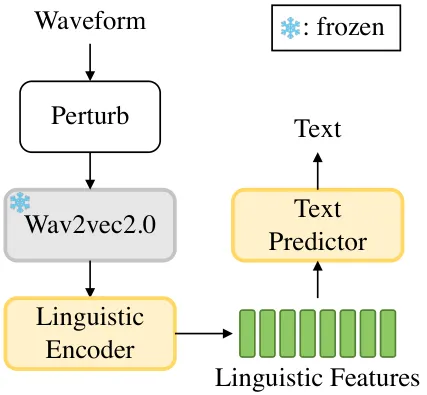
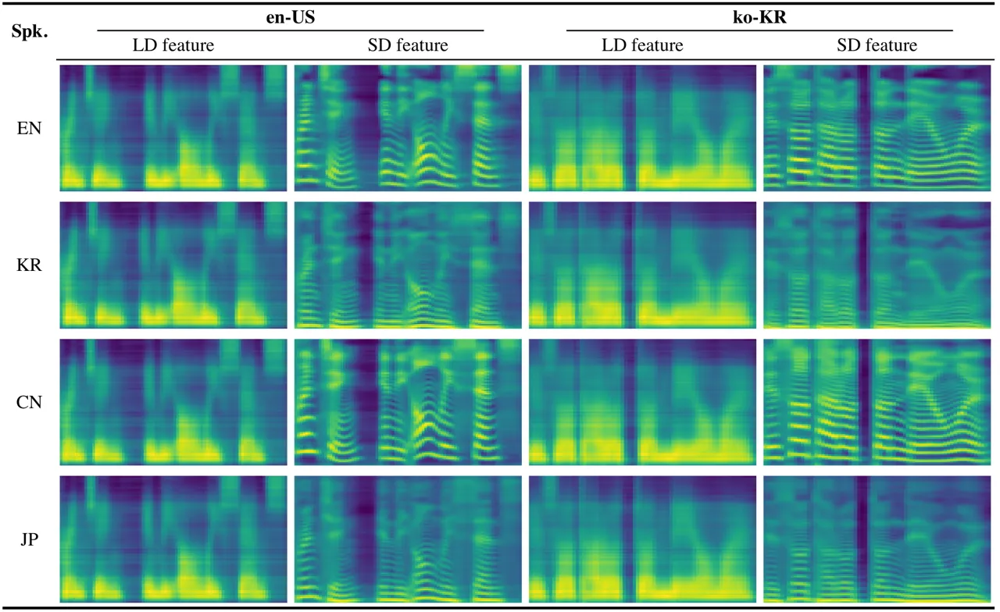
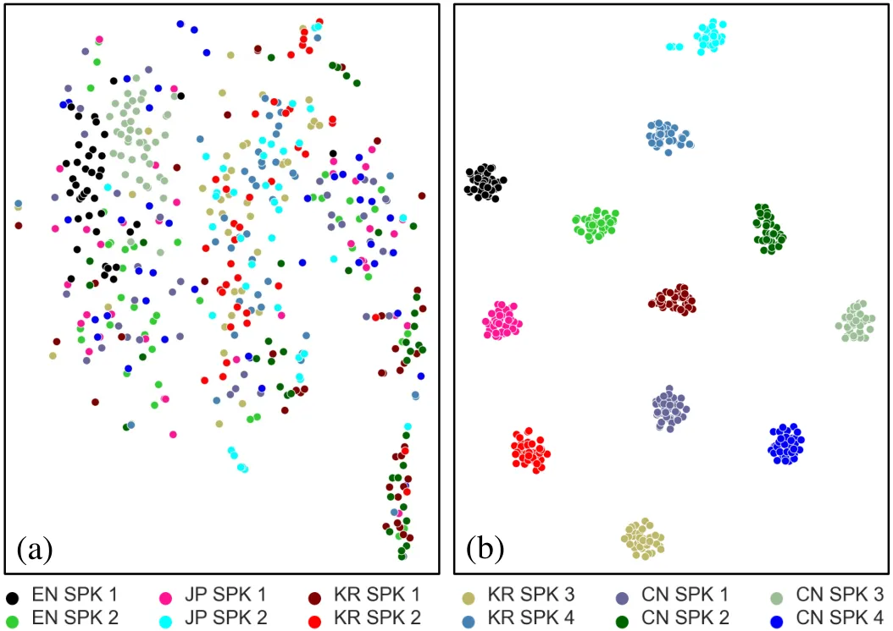

# CrossSpeech++: Cross-lingual Speech Synthesis with Decoupled Language and Speaker Generation

Ji-Hoon Kim    Hong-Sun Yang    Yoon-Cheol Ju    Il-Hwan Kim   
Byeong-Yeol Kim    Joon Son Chung ^(†)^(†)thanks: Ji-Hoon Kim and Joon
Son Chung are with School of Electric Engineering, Korea Advanced
Institute of Science and Technology, Daejeon 34141, Republic of Korea
(e-mail:jihoon@mm.kaist.ac.kr; joonson@kaist.ac.kr) Hong-Sun Yang,
Yoon-Cheol Ju, Il-Hwan Kim, and Byeong-Yeol Kim are with 42dot Inc.,
Seoul 06620, Republic of Korea (e-mail: hongsun.yang@42dot.ai;
yooncheol.ju@42dot.ai; cutekih@gmail.com; byeongyeol.kim@42dot.ai)

###### Abstract

The goal of this work is to generate natural speech in multiple
languages while maintaining the same speaker identity, a task known as
cross-lingual speech synthesis. A key challenge of cross-lingual speech
synthesis is the language-speaker entanglement problem, which causes the
quality of cross-lingual systems to lag behind that of intra-lingual
systems. In this paper, we propose CrossSpeech++, which effectively
disentangles language and speaker information and significantly improves
the quality of cross-lingual speech synthesis. To this end, we break the
complex speech generation pipeline into two simple components:
language-dependent and speaker-dependent generators. The
language-dependent generator produces linguistic variations that are not
biased by specific speaker attributes. The speaker-dependent generator
models acoustic variations that characterize speaker identity. By
handling each type of information in separate modules, our method can
effectively disentangle language and speaker representation. We conduct
extensive experiments using various metrics, and demonstrate that
CrossSpeech++ achieves significant improvements in cross-lingual speech
synthesis, outperforming existing methods by a large margin.

###### Index Terms: 

Speech synthesis, cross-lingual speech synthesis, speaker
generalization, prosody modelling.

## I Introduction

It is believed that over 60 percent of the global population speaks at
least two different languages \[1, 2\]. In line with the recent trends
in globalization, there has been growing interest in multi-lingual
speech processing such as multi-lingual speech recognition \[3, 4\] or
language identification \[5, 6\]. In particular, cross-lingual
Text-to-Speech (TTS) has attracted a large amount of attention due to
its a range of applications, such as creating language educational
content, developing conversational AI agents, and dubbing foreign
movies.

Cross-lingual TTS focuses on generating natural-sounding speech in
multiple languages while preserving the unique voice characteristics of
the target speaker (e.g., synthesizing fluent Korean, Chinese and
Japanese speech in the voice of Joe Biden). However, compared to
intra-lingual TTS, which achieves almost human-like generation quality,
the quality of cross-lingual TTS still lags far behind \[7, 8, 9\]. One
main challenge that degrades the generation quality of cross-lingual TTS
is the language-speaker entanglement problem. Specifically, since it is
common for each speaker in a training dataset to speak only one
language, there is a substantial risk of speaker identity becoming
intertwined with language information during the training process. In
the extreme scenario where there is only a single speaker per language
in the training data, the language identity perfectly matches the
speaker identity. These entangled representations hinder natural
cross-lingual speech generation when the language identity is switched
during the inference process, leading to unexpected speaker
characteristics or unnatural pronunciation in the generated
cross-lingual speech.

Numerous attempts have been made to disentangle language and speaker
representations during training. Instead of using language-dependent
text representation (e.g., graphemes), some works explore text
representations which can be generalized cross multiple languages \[10,
11, 12\]. Other works leverage domain generalization training techniques
such as domain adversarial training \[13\] or mutual information
minimization \[14\] or information bottleneck methods \[15\]. More
recently, other works have utilized Self-Supervised Learning (SSL)
speech representations based on the finding that SSL features capture
only specific aspects of speech \[16, 17\]. Although previous studies
have focused on decomposing language and speaker information, the
decomposition is limited to the input features and does not fully
address the entanglement problem. In other words, even if language and
speaker representations are separated in the input token space, they are
expected to be recombined when generating acoustic representations. This
reintegration of separated representations prevents the synthesis of
natural cross-lingual speech.

In this paper, we propose CrossSpeech++ which improves the quality of
synthesized cross-lingual speech by decomposing language and speaker
information in the output acoustic feature space. As depicted in Fig. 1,
CrossSpeech++ breaks intricate speech generation pipeline into two
simple generator: the Language-dependent Generator (LDG) and the
Speaker-dependent Generator (SDG), each of which produces the
corresponding representations in the output feature space. The
language-dependent representations capture linguistic variation in
speech, such as pronunciation and intonation, while speaker-dependent
representations characterize speaker attributes such as timbre and
pitch.

Specifically, the LDG includes three components: Mix Dynamic Speaker
Layer Normalization (MDSLN), the Language-Dependent Variance (LDV)
adaptor, and the linguistic adaptor. MDSLN modulates text features with
randomly mixed speaker information, mitigating language-speaker
entanglement. The LDV adaptor and linguistic adaptor model
linguistic-related variations, enhancing robust cross-lingual speech
generation. Similarly, the SDG comprises two modules: Dynamic Speaker
Layer Normalization (DSLN) and the Speaker-Dependent Variance (SDV)
adaptor. Different from MDSLN, DSLN conveys speaker information,
ensuring accurate speaker identity. The SDV adaptor introduces
speaker-specific acoustic variations, which are crucial for generating
natural prosody.

We conduct extensive experiments to validate the effectiveness of
CrossSpeech++, including subjective and objective evaluation metrics.
The results demonstrate that CrossSpeech++ significantly improves the
quality of generated cross-lingual speech, in terms of both subjective
and objective evaluation metrics. The synthesized audio samples can be
found on our demo page¹¹ 1
[https://mm.kaist.ac.kr/projects/CrossSpeechpp](https://mm.kaist.ac.kr/projects/CrossSpeechpp).

Fig. 1: CrossSpeech++ operates as follows: From text inputs, the
language-dependent generator produces language-dependent representations
that capture linguistic characteristics drived solely from text inputs.
The following speaker-dependent generator colorize speaker-specific
attributes, and the mel-spectrogram is produced by summing
representations from both generators. The output mel-spectrogram is then
converted to an audible waveform by a pre-trained neural vocoder.

## II Related Works

### II-A Speech Synthesis

Speech synthesis (text-to-speech, TTS), the process of synthesizing
human speech from text, has a long history of innovation. With the
development of deep neural networks, recent deep-learning based TTS
models have shown remarkable speech quality compared to early
concatenative \[18\] and statistical methods \[19\], reaching speech
quality close to that of real human utterance \[20\]. Typically, these
methods involve converting a text sequence into intermediate acoustic
representations and then transforming them to an audible waveform using
either an external vocoder \[21, 22\] or an internal decoder \[23, 24\].
They employ various backbone networks such as dilated CNN \[25\],
RNN \[26, 27\], and feed forward transformer \[28, 29\].

Recent advancements have prompted TTS research to explore various topics
such as multi-speaker \[30\], lightweight \[31\], and cross-lingual
TTS \[13\]. Among these topics, cross-lingual TTS, in particular,
demonstrates inferior synthetic quality compared to intra-lingual TTS
mainly due to the language-speaker entanglement problem. In this paper,
we focus on improving the quality of cross-lingual TTS to achieve
high-quality speech synthesis on par with intra-lingual TTS.

### II-B Cross-lingual Speech Synthesis

Cross-lingual TTS, a branch of TTS, aims to produce natural speech in
multiple languages while maintaining the same speaker identity. In
comparison to intra-lingual TTS, the quality of cross-lingual TTS
remains weak due to the challenges in producing accurate speaker timbre
and natural-sounding foreign accents. The inferior quality of
cross-lingual TTS primarily arises from the language-speaker
entanglement issue \[13\]. To address this, numerous efforts have been
made, which generally fall into two broad categories: one is to leverage
language-agnostic input representation, and the other seeks to learn
disentangled representation.

Instead of relying on language-dependent input representations such as
graphemes, some works present their cross-lingual systems based on
language-independent input representations, which can be commonly used
for multiple languages. Zhan et al. \[11\] employ the International
Phonetic Alphabet (IPA) and demonstrate its superiority over
language-dependent phonemes in enhancing the quality of cross-lingual
TTS. Li et al. \[10\] adopt UTF-8 byte representations for encoding
typographic information, distancing their system from language-specific
constraints. Staib et al. \[32\] and Lux & Vu \[12\] utilize input
representations derived from IPA articulation, specifically designed to
maintain consistent topology across different languages. Furthermore,
Saeki et al. \[33\] explore the cross-lingual transferability based on
BERT-like multilingual language model \[34\], pushing the boundaries of
cross-lingual transfer in TTS.

Another approach presents training strategy to learn disentangled
language and speaker representations. Zhang et al. \[13\] employ domain
adversarial training \[35\] to prevent the leakage of speaker
information from text encoding. Xin et al. \[14\] leverage mutual
information minimization loss \[36\] to remove common attributes between
language and speaker representation. SANE-TTS \[37\] proposes the
speaker regularization loss to avoid speaker bias in text duration
predictor, and GenerTTS \[15\] incorporates an information bottleneck to
disentangle timbre and speaker style. More recently, DSE-TTS \[16\] and
ZMM-TTS \[17\] utilize SSL-based speech representations, as their
discretized features contain less speaker-dependent information.
Although these previous works have attempted to address the
language-speaker entanglement problem, the level of disentanglement has
been limited to the input token space. To address this, in our previous
work, CrossSpeech \[38\], we explicitly divide the speech generation
pipeline into language-related and speaker-related components, with each
generating the corresponding representation in the output feature space.
In this paper, we further explore the advantages of splitting the speech
generation to develop a more natural cross-lingual TTS system. Moreover,
we incorporate additional language- and speaker-specific attributes to
further enhance generation quality.

### II-C Domain Generalization

Domain generalization focuses on training models to perform well on any
unseen domain, which is not accessible during training. Numerous seminal
works have collectively advanced the field of domain generalization.
Many cross-lingual TTS methods leverage domain generalization techniques
with the aim of enabling the models to effectively generalize well to
unseen language-speaker combinations.

One of the foundational works in domain generalization is domain
adversarial training (DAT) \[35\]. DAT introduces a gradient reversal
layer that ensures the feature extractor learns to produce features
indistinguisable across multiple domains by reversing the gradients from
a domain discriminator during backpropagation. Arjovsky et al. \[39\]
presents invariant risk minimization, a framework aims at learning
domain-invariant predictors by leveraging the principle of risk
invariance. Zhou et al. \[40\] propose a simple yet effective approach
to domain generalization called MixStyle. This technique involves mixing
feature statistics of training samples from different domains to
generate new feature statistics that do not exist in the training data.
By doing so, MixStyle simulates domain shifts at the feature level,
enabling the model to learn more generalized representations. Motivated
by this, in this work, we introduce a speaker-generalization module to
prevent speaker bias in text embedding, mitigating the language-speaker
entanglement problem in cross-lingual TTS.

Fig. 2: The overall architecutre of CrossSpeech++.
$`{\bf e}_{\text{l}}`$ and $`{\bf e}_{\text{s}}`$ denote the language
and speaker embeddings which are derived from trainable lookup tables.
Detailed architectures of Language-dependent (LD) conformer encoder and
Speaker-dependent (SD) conformer encoder are depicted in (b) and (c),
respectively. MHA means multi-head attention. We replace the final Layer
Normalization (LN) in the conformer with Mix-dynamic Speaker Layer
Normalization (MDSLN) in the LD encoder and Dynamic Speaker Layer
Normalization (DSLN) in the SD encoder.

## III Model Architecture

CrossSpeech++ is built upon FastPitch \[7\], a non-autoregressive TTS
model whose encoder and decoder are based on multiple feed-forward
transformer blocks. It takes a text sequence
$`{\bf x}\in\mathbb{R}^{L}`$ as input and produces a mel-spectrogram
$`{\bf y}\in\mathbb{R}^{T\times 80}`$, where $`L`$ and $`T`$ denote the
lengths of the text sequence and the output mel-spectrogram,
respectively. We adopt the online duration aligner \[41\], which allows
ground truth durations to be obtained without external sources. This
online aligner not only enables efficient training but also, more
importantly, removes the dependency on pre-computed aligners for each
language, which is highly beneficial for extending languages in
cross-lingual TTS \[41\]. In addition, we replace the transformer with
conformer blocks \[42\] due to their capability to model rich features
in a parameter-efficient way. To support multi-lingual and multi-speaker
settings, we adopt trainable lookup tables for language and speaker.

An intuitive way to avoid language-speaker entanglement in cross-lingual
TTS is to divide the generation pipeline into language-dependent and
speaker-dependent parts \[43, 44\]. As illustrated in Fig. 2,
CrossSpeech++ breaks the speech generation pipeline into LDG and SDG,
which model the language-dependent and speaker-dependent
representations, respectively. Each generator includes multiple
conformer blocks and other key components to obtain disentangled
representations, which are described in the following sections.

## IV Language-dependent Generator

In order to produce language-dependent representations, we specifically
design the LDG to include MDSLN. Additionally, to learn prosodic
variations that are dependent only on linguistic information (e.g.,
pronunciation and intonation), we introduce the LDV adaptor and the
linguistic adaptor. These collectively contribute to improving the
quality of synthesized cross-lingual speech.

### IV-A Speaker Generalization

The key to high-quality cross-lingual speech synthesis is to produce
text features that are not biased toward any specific speaker. To
achieve this, we propose MDSLN, which is an extended module of
DSLN \[45\]. DSLN adaptively modulates hidden features based on speaker
statistics, rather than simply conditioning the speaker embeddings
through summation or concatenation. Given hidden representations
$`\bf{h}`$ and speaker embeddings $`\bf{e}_{\text{s}}`$, the
speaker-conditioned representations are derived as follows:

```math
\text{DSLN}(\bf{h},{\bf e}_{\text{s}})=\mathbf{W}({\bf e}_{\text{s}})*\text{LN}(\bf{h})+\mathbf{b}({\bf e}_{\text{s}}), \tag{1}
```

where $`*`$ denotes 1D convolution, and LN refers to layer
normalization. The normalized hidden feature space is then shifted
according to speaker embedding statistics, the filter weight
$`\mathbf{W}`$ and bias $`\mathbf{b}`$, which are predicted by a single
linear layer using $`\bf{e}_{\text{s}}`$ as input.

Fig. 3: Batch-wise shuffle operation. $`{\bf e}_{\text{s}}`$ is the
speaker embeddings and $`\tilde{{\bf e}}_{\text{s}}`$ denotes the
shuffled speaker embeddings.

Intuitively, the model can learn speaker-generalizable text features
when the text features are continuously adapted by a random speaker
during training. This allows the model to selectively capture essential
text-related attributes, apart from speaker-related information. The
adaptation is achieved by conditioning the text representation with
random speaker information. Inspired by recent works \[40, 46, 44\], we
introduce MDSLN to continuously refine the text sequence with random
speaker information by mixing speaker distributions in the training
data, which can be formulated as follows:

```math
\text{MDSLN}(\bf{h},{\bf e}_{\text{s}})=\mathbf{W}_{\text{mix}}({\bf e}_{\text{s}})*\text{LN}(\bf{h})+\mathbf{b}_{\text{mix}}({\bf e}_{\text{s}}), \tag{2}
```

where $`\bf{W}_{\text{mix}}`$ and $`\bf{b}_{\text{mix}}`$ represent
filter weight and bias for a randomly mixed speaker distribution. The
mixed speaker statistics can be calculated as follows:

```math
\mathbf{W}_{\text{mix}}({\bf e}_{\text{s}})=\gamma\mathbf{W}({\bf e}_{\text{s}})+(1-\gamma)\mathbf{W}(\tilde{{\bf e}}_{\text{s}}), \tag{3}
```

```math
\mathbf{b}_{\text{mix}}({\bf e}_{\text{s}})=\gamma\mathbf{b}({\bf e}_{\text{s}})+(1-\gamma)\mathbf{b}(\tilde{{\bf e}}_{\text{s}}), \tag{4}
```

where $`\tilde{{\bf e}}_{\text{s}}`$ is acquired by randomly shuffling
$`{\bf e}_{\text{s}}`$ along the batch dimension (see Fig. 3), and
$`\gamma`$ is sampled from a Beta distribution:
$`\gamma\sim\text{Beta}(\alpha,\alpha)`$ (we set $`\alpha=2`$ in our
experiments). We substitute the LN at the end of the Language-dependent
(LD) conformer encoder block with MDSLN.

### IV-B Language-dependent Variance Adaptor

Although it is crucial to model rich speech variations to synthesize
expressive speech, predicting these variations in a cross-lingual
scenario is challenging due to the combinations of languages and
speakers that are unseen during training \[47, 48\]. To address this
issue, we introduce the LDV adaptor, which models text-driven speech
variations, a common attribute across multiple speakers. This adaptor
predicts binary pitch and energy variations, indicating whether these
values rise or fall \[11\]. The LDV adaptor consists of three
components: a duration predictor, an LD pitch predictor, and an LD
energy predictor, all sharing the same architecture. Pitch and energy
values are embedded using a single 1D convolutional layer and are then
added to the speaker-generalized text features. During training, we use
the target values, while during inference, we rely on the predicted
values. The target duration value is obtained through an internal
aligner \[41\], and targets for the LD pitch and energy predictors will
be detailed in the following paragraphs.

#### IV-B1 Pitch

To obtain the target value for the LD pitch predictor, we first extract
the ground truth pitch value for every frame using the pYIN
algorithm \[49\]. Since pitch is inherently speaker-dependent, we refer
to the ground truth pitch sequence as the speaker-dependent pitch
sequence, denoted as $`{\bf{p}^{(s)}}\in\mathbb{R}^{T}`$. We average
$`\bf p^{(s)}`$ across each input text token using the ground truth
duration, and convert the averaged sequence (denoted as
$`{\bf\bar{p}^{(s)}}\in\mathbb{R}^{L}`$) into a binary sequence. This
results in the language-dependent (speaker-independent) target pitch
sequence $`{\bf p^{(l)}}\in\mathbb{R}^{L}`$. The conversion to a binary
sequence is defined as follows:

```math
{p}^{(l)}_{i}=\begin{cases}1,&\mbox{if}~~{\bar{p}}^{(s)}_{i-1}<\bar{p}^{(s)}_{i},\\
0,&\mbox{otherwise},\end{cases} \tag{5}
```

where $`\bar{p}^{(s)}_{i}`$ denotes the $`i^{th}`$ value of
$`\bf\bar{p}^{(s)}`$, and $`p^{(l)}_{i}`$ represents the $`i^{th}`$
value of $`{\bf p^{(l)}}`$ for $`i\in\{1,2,3,\ldots,L\}`$. Using
$`\bf{p}^{(l)}`$ as the target, the LD pitch predictor is optimized with
a binary cross-entropy loss:

```math
\mathcal{L}_{\text{LDP}}=-\sum^{L}_{i=1}\big[p^{(l)}_{i}\text{log}\hat{p}^{(l)}_{i}+(1-p^{(l)}_{i})\text{log}(1-\hat{p}^{(l)}_{i})\big], \tag{6}
```

where $`\hat{p}_{i}^{(l)}`$ denotes the $`i^{th}`$ predicted
language-dependent pitch.

#### IV-B2 Energy

We extract the speaker-dependent energy, $`{\bf e^{(s)}}`$, by taking an
average from a target mel-spectrogram along the frequency axis \[50\].
Similar to pitch, we average $`{\bf{e}^{(s)}}\in\mathbb{R}^{T}`$ over
every text token and compute the language-dependent energy
$`{\bf e^{(l)}}\in\mathbb{R}^{L}`$ by transforming the averaged sequence
into a binary sequence. The Language-dependent Energy (LDE) predictor is
also trained through binary cross-entropy loss between the predicted and
target LD energy sequence:

```math
\mathcal{L}_{\text{LDE}}=-\sum^{L}_{i=1}\big[e^{(l)}_{i}\text{log}\hat{e}^{(l)}_{i}+(1-e^{(l)}_{i})\text{log}(1-\hat{e}^{(l)}_{i})\big], \tag{7}
```

where $`e_{i}^{(l)}`$ and $`\hat{e}_{i}^{(l)}`$ represent the $`i^{th}`$
the target and the predicted language-dependent energy value,
respectively.

The enriched hidden sequence is upsampled according to the token
durations and then fed to the Language-dependent (LD) conformer decoder.
Note that the duration predictor in CrossSpeech++ learns general
duration information because it takes speaker-generalized representation
as an input. As proven in the recent study \[37\], this leads to
predicting token duration independently from speaker identity and
stabilizes the duration prediction in cross-lingual TTS.

### IV-C Linguistic Adaptor

Text-dependent speech variations likely encompass a variety of complex
characteristics, motivating us to construct a linguistic adaptor that
further enriches text-related acoustic attributes beyond LD pitch and
energy. The linguistic adaptor shares the same teacher-forcing strategy
as the LDV adaptor but it has a distinct target features deliberately
designed to contain elaborate linguistic features independent of
speaker-specific characteristics. The linguistic adaptor contains
linguistic predictor that directly estimate the target linguistic
features from the output of the LD decoder, and it is trained with L1
loss:

```math
\mathcal{L}_{\text{L}}=||{\bf{l}}-{\bf{\hat{l}}}||_{1}, \tag{8}
```

where $`{\bf{l}}`$ and $`{\bf{\hat{l}}}`$ refer to the target and
predicted linguistic features, respectively.

As illustrated in Fig. 4, we extract the target linguistic features by
leveraging self-supervised speech representations. Previous studies have
shown that representations from the SSL speech models contain
comprehensive information, with each layer exhibiting different aspects
of speech \[51, 52\]. Based on empirical observations, we decide to
utilize the last hidden feature of MMS \[53\], a wav2vec2.0 model \[54\]
pre-trained on over 500k hours of speech across 1,400 languages. We also
employ information perturbation techniques \[50\] that can remove
speaker-dependent information in the waveform, such as formants, pitch,
and frequency response, through a series of formant shifting, pitch
randomization, and random frequency shaping functions. Subsequently, the
linguistic encoder extracts the target linguistic features, which are
fed into an auxiliary text predictor to strengthen linguistic
characteristics \[24\]. Both the linguistic encoder and the text
predictor are optimized with connectionist temporal classification (CTC)
loss \[55\] between the text sequence $`{\bf x}`$ and the linguistic
features $`{\bf z}`$:
$`\mathcal{L}_{\text{CTC}}=-\text{log}P({\bf x}|{\bf z})`$ \[24\]. Note
that the parameters of the pre-trained MMS are not updated.



Fig. 4: A pipeline for extracting the target linguistic features from
waveform. To eliminate speaker-related features, the perturbed waveform
is input to a multilingual wav2vec2.0. The following linguistic encoder
extracts solely linguistic features, which are fed into a text
predictor.

## V Speaker-dependent Generator

To colorize speaker-specific attributes constituting one half of natural
human speech, we construct an SDG that includes an SD encoder, an SDV
adaptor, and an SD decoder. SD encoder effectively aligns the
language-dependent representations to the speaker identity with the help
of DSLN \[45\]. We stack conformer blocks for the SD encoder and replace
the LN at the end of each conformer block with DSLN \[45\]. The
following SDV adapter consists of the speaker-dependent pitch (SDP) and
energy (SDE) predictor. This adds speaker-specific speech variations
such as formants and stress patterns. We extract the speaker-dependent
pitch $`{\bf p^{(s)}}`$ and energy $`{\bf e^{(s)}}`$ sequence as
described in Sec. IV-B, and optimize the SD predictors using L1 loss:

```math
\mathcal{L}_{\text{SDP}}=||{\bf{p}^{(s)}}-{\bf{\hat{p}}^{(s)}}||_{1}, \tag{9}
```

```math
\mathcal{L}_{\text{SDE}}=||{\bf{e}^{(s)}}-{\bf{\hat{e}}^{(s)}}||_{1}, \tag{10}
```

where $`{\bf{\hat{p}}^{(s)}}`$ and $`{\bf{\hat{e}}^{(s)}}`$ denotes the
predicted speaker-dependent pitch and energy sequences, respectively.
The speaker-dependent sequences are fed to the 1D convolutional layer
and summed to the speaker-specific hidden feature. The SD decoder then
produces speaker-dependent acoustic representation. The output mel
spectrogram is generated by adding language-dependent and
speaker-dependent features after they are projected through a single
convolutional layer.

To sum up, the overall training objectives
($`\mathcal{L}_{\text{all}}`$) are given:

```math
\begin{split}\mathcal{L}_{\text{all}}=&\mathcal{L}_{\text{mel}}+\mathcal{L}_{\text{align}}+\lambda_{\text{dur}}\mathcal{L}_{\text{dur}}\\
&+\lambda_{\text{LDP}}\mathcal{L}_{\text{LDP}}+\lambda_{\text{LDE}}\mathcal{L}_{\text{LDE}}+\lambda_{\text{L}}\mathcal{L}_{\text{L}}\\
&+\lambda_{\text{CTC}}\mathcal{L}_{\text{CTC}}+\lambda_{\text{SDP}}\mathcal{L}_{\text{SDP}}+\lambda_{\text{SDE}}\mathcal{L}_{\text{SDE}},\\
\end{split} \tag{11}
```

where $`\mathcal{L}_{\text{mel}}`$ means L1 loss between the target and
the predicted mel-spectrogram, $`\mathcal{L}_{\text{align}}`$ denotes
the alignment loss for the online aligner as described in \[41\].
$`\mathcal{L}_{dur}`$ is L1 loss between the target and the predicted
duration. In our experiments, we fix
$`\lambda_{\text{dur}}=\lambda_{\text{LDP}}=\lambda_{\text{LDE}}=\lambda_{\text{L}}=\lambda_{\text{CTC}}=\lambda_{\text{SDP}}=\lambda_{\text{SDE}}=0.1`$.

## VI Experimental Settings

|           |                  |            |        |
| --------- | ---------------- | ---------- | ------ |
| Languages | Source           | \#speakers | Hours  |
| en-US     | LJSpeech \[56\]  | 1          | 12.228 |
|           | VCTK \[57\]      | 3          |  0.581 |
| zh-CN     | Databaker \[58\] | 1          | 10.080 |
|           | AIShell3 \[59\]  | 9          |  3.614 |
| ja-JP     | CSS10 \[60\]     | 1          |  6.563 |
|           | JSUT \[61\]      | 1          |  7.458 |
| ko-KR     | koMulti \[62\]   | 6          | 14.095 |

TABLE I: Dataset description.

### VI-A Dataset

We conduct experiments on the mixture of the monolingual dataset in four
languages: English (en-US), Chinese (zh-CN), Japanese (ja-JP), and
Korean (ko-KR) as detailed in Table I. Since all the datasets have
different environments, we resample all the audio to 16kHz and convert
the corresponding transcripts to IPA symbols \[63\]. In our experiments,
the dataset is split into 80%-10%-10% for training, validation, and test
sets across all speakers. 80 bins mel-spectrogram is transformed with a
window size of 1280, a hop size of 320, and Fourier transform size of 1280.

### VI-B Model Configuration

All the encoders and decoders in our method are based on conformer
blocks. Except for the LD encoder, which consists of 4 conformer blocks,
the other modules are composed of 2 conformer blocks each. Each
conformer block is designed with a hidden dimension of 192 and a single
attention head. We also set a hidden dimension of 192 for the language
and speaker lookup tables, where each language and speaker ID is
converted into a 192-dimensional embedding vector. The variance
predictors share the same architecture, which consists of two 1D
convolutional layers with ReLU activation, each followed by layer
normalization and a dropout layer, as in FastSpeech2 \[28\]. Following
recent work on voice conversion \[64\], the linguistic encoder includes
a Convolutional Gated Linear Unit (ConvGLU) \[65\], and we add layer
normalization at the end of the linguistic encoder to stabilize the
linguistic feature prediction pipeline. We utilize pre-trained MMS from
Hugging Face²² 2 https://huggingface.co/facebook/mms-300m, and our text
predictor consists of 2 conformer blocks followed by a single projection
layer. The total number of learnable parameters is 12M.

### VI-C Training Details

CrossSpeech++ is trained for 500 epochs on 8 NVIDIA A6000 GPUs with a
batch size of 128. We use the AdamW optimizer with $`\beta_{1}=0.8`$,
$`\beta_{2}=0.99`$, $`\epsilon=10^{-9}`$, and an initial learning rate
of $`2\times 10^{-4}`$, decayed by $`0.999875`$ per epoch. Gradients are
accumulated and the optimizer steps after every two batches to enhance
training efficiency.

### VI-D Baseline Methods

CrossSpeech++ is compared against recent cross-lingual TTS systems. All
the systems are trained and evaluated with the same configurations,
including training and test datasets. The output mel-spectrogram is
converted to an audible waveform by pre-trained Fre-GAN \[66\] vocoder.

- •
  FastPitch (FP) \[7\] is the backbone network of CrossSpeech++. We
  follow the official implementation of FastPitch³³ 3
  https://github.com/NVIDIA/DeepLearningExamples/tree/master/PyTorch/  
  SpeechSynthesis/FastPitch with slight modifications. We incorporate
  trainable lookup tables to support multiple speakers and languages,
  and adopt the online duration aligner \[41\].
- •
  FP + DAT \[13\] adopts domain adversarial training (DAT) based on
  FastPitch. Given that the DAT speaker classifier proposed by Zhou et
  al. \[40\] can be easily applied to other systems, we integrated this
  DAT classifier into FastPitch.
- •
  FP + DAT + $`\mathbb{\mathcal{L}}_{\text{\bf reg}}`$ \[37\] leverages
  speaker regularization loss ($`\mathcal{L}_{\text{reg}}`$) along with
  the DAT classifier as in SANE-TTS \[37\]. Since the speaker
  regularization loss stabilizes the duration prediction process in
  non-autoregressive TTS systems, it can be applied to any
  non-autoregressive system that adopts a duration predictor. Therefore,
  we choose FastPitch as the backbone network.
- •
  CrossSpeech \[38\] is our previous work and serves as a strong and
  comparable baseline to our current model. While it shares similarities
  with CrossSpeech++ in dividing the speech generation process into
  speaker-independent and speaker-dependent modules, CrossSpeech++
  introduces more speech variation (i.e., LD and SD energy). More
  importantly, it incorporates SSL-based linguistic information which is
  the key to improving speech quality.

|                                     |                      |                      |                   |                  |                   |                      |                      |                   |                  |                   |
| ----------------------------------- | -------------------- | -------------------- | ----------------- | ---------------- | ----------------- | -------------------- | -------------------- | ----------------- | ---------------- | ----------------- |
| Method                              | Cross-lingual        |                      |                   |                  |                   | Intra-lingual        |                      |                   |                  |                   |
|                                     | MOS$`\uparrow`$      | SMOS$`\uparrow`$     | UTMOS$`\uparrow`$ | SECS$`\uparrow`$ | CER$`\downarrow`$ | MOS$`\uparrow`$      | SMOS$`\uparrow`$     | UTMOS$`\uparrow`$ | SECS$`\uparrow`$ | CER$`\downarrow`$ |
| Ground Truth                        | $`-`$                | $`-`$                | $`-`$             | $`-`$            | $`-`$             | $`4.55\pm 0.06`$     | $`4.93\pm 0.05`$     | $`4.052`$         | $`0.793`$        | $`8.57`$          |
| Vocoded                             | $`-`$                | $`-`$                | $`-`$             | $`-`$            | $`-`$             | $`4.38\pm 0.09`$     | $`4.78\pm 0.06`$     | $`3.833`$         | $`0.791`$        | $`8.88`$          |
| FP \[7\]                            | $`3.88\pm 0.07`$     | $`3.23\pm 0.09`$     | $`3.474`$         | $`0.711`$        | $`14.47`$         | $`3.65\pm 0.09`$     | $`3.92\pm 0.10`$     | $`3.074`$         | $`0.773`$        | $`11.11`$         |
| FP+DAT \[13\]                       | $`3.55\pm 0.09`$     | $`3.66\pm 0.09`$     | $`3.468`$         | $`0.738`$        | $`14.84`$         | $`3.49\pm 0.10`$     | $`3.88\pm 0.11`$     | $`3.086`$         | $`0.776`$        | $`10.73`$         |
| FP+DAT+$`\mathcal{L}_{reg}`$ \[37\] | $`3.71\pm 0.11`$     | $`3.65\pm 0.08`$     | $`3.490`$         | $`0.756`$        | $`14.26`$         | $`3.43\pm{0.11}`$    | $`3.82\pm 0.09`$     | $`3.087`$         | $`0.776`$        | $`10.65`$         |
| CrossSpeech \[38\]                  | $`3.93\pm 0.08`$     | $`\bf 3.87\pm 0.07`$ | $`3.279`$         | $`\bf 0.776`$    | $`16.15`$         | $`3.56\pm 0.12`$     | $`{3.86}\pm 0.09`$   | $`3.039`$         | $`\bf 0.781`$    | $`11.26`$         |
| CrossSpeech++                       | $`\bf 4.06\pm 0.09`$ | $`3.82\pm 0.10`$     | $`\bf 3.791`$     | $`{0.761}`$      | $`\bf 13.35`$     | $`\bf 3.85\pm 0.09`$ | $`\bf 3.94\pm 0.08`$ | $`\bf 3.343`$     | $`0.777`$        | $`\bf 10.14`$     |
|                                     |                      |                      |                   |                  |                   |                      |                      |                   |                  |                   |

TABLE II: Evaluation results. MOS and SMOS are presented with $`95\%`$
confidence interval. UTMOS is an automatic prediction model for MOS.
SECS denotes speaker embedding cosine similarity and CER refers to
character error rate. Lower is better for CER, and higher is better for
the other metrics. The bold value represents the best score for each
metric.

### VI-E Evaluation Metrics

We assessed the effectiveness of our method using extensive evaluation
metrics, including both subjective and objective measures. We used 50
random speech clips for subjective evaluation (i.e., MOS and SMOS), and
300 samples for objective evaluations (UTMOS, SECS, and CER).

- •
  MOS stands for Mean Opinion Score. To evaluate the naturalness of
  audio, we performed a MOS test in which 30 domain-expert subjects were
  asked to rate the naturalness on a scale from 1 to 5. Speech
  naturalness includes audio clarity and pronunciation accuracy.
- •
  SMOS denotes Similarity Mean Opinion Score. Similar to MOS, 30 raters
  assess the speaker similarity of speech pairs. The raters were
  instructed to focus solely on the voice similarity to the target
  speaker; high scores are given if the voices are similar, even if the
  quality of speech is degraded.
- •
  UTMOS\[67\] is an automatic MOS prediction neural network. While
  subjective evaluation is regarded as the gold standard in assessing
  speech naturalness\[68\], it requires high costs in terms of both time
  and money. As a remedy to this, UTMOS has been widely used because of
  its effectiveness in estimating subjective scores \[69, 70, 71\].
- •
  SECS denotes Speaker Embedding Cosine Similarity. It measures how
  similar the speaker characteristics of the generated speech are to
  those of the target speech. We extracted speaker representation using
  Resemblyzer⁴⁴ 4 https://github.com/resemble-ai/Resemblyzer from
  generated and the actual speech, then computed the cosine simliarity
  between them.
- •
  CER stands for Character Error Rate, which measures the
  intelligibility of speech by comparing the predicted text of speech to
  the target text sequence. We obtained the transcriptions of speech
  using a publicly available automatic speech recognition (ASR)
  system \[72\] that is pre-trained on 680k hours of speech from 99
  languages.

## VII Results and Analysis

### VII-A Quality Comparison

To show the effectiveness of CrossSpeech++, we compare the generation
performance of CrossSpeech++ against that of recent cross-lingual TTS
models on both cross-lingual and intra-lingual scenarios. For
cross-lingual evaluation, we randomly sample four representative
speakers per language, while all speaker IDs are used for intra-lingual
evaluation. The results are listed in Table II. Above all, CrossSpeech++
achieves significant improvements in cross-lingual speech. In
cross-lingual TTS, CrossSpeech++ obtains the best scroes in MOS as well
as UTMOS and CER, which underscores the ability of CrossSpeech++ to
generate highly natural speech. While CrossSpeech++ shows a slight
decrease in similarity scores (SMOS and SECS) compared to our previous
work, CrossSpeech, we posit that this difference is attributable to our
method generating more precise pronunciation and accent driven by text
inputs, which leads to a perceptible shift in speaker similarity to the
target speaker using a different language. CrossSpeech++ also
demonstrates superior quality compared to the baselines in intra-lingual
cases, confirming that our method is beneficial not only in
cross-lingual settings but also in intra-lingual scenarios.

### VII-B Analysis on Linguistic Features

To determine the optimal extraction pipeline for the target linguistic
features, we evaluate the output quality of CrossSpeech++ trained with
linguistic features from different layers of MMS \[53\]. Specifically,
we compare the linguistic features extracted from the
1$`{}^{\text{st}}`$, 6$`{}^{\text{th}}`$, 12$`{}^{\text{th}}`$,
18$`{}^{\text{th}}`$, and 24$`{}^{\text{th}}`$ layers. Table III
presents the evaluation results on our validation sets, indicating
trade-offs across different layers. When we inject hidden features from
the earlier layers into LDG, it brings about language-speaker
entanglement, resulting in the text embeddings learning pronunciation
along with the corresponding native speaker information. While this
leads to more intelligible speech (measured by CER), it results in
degraded naturalness (measured by UTMOS) and speaker similarity
(measured by SECS), which is not a desired outcome. However, when we
utilize the hidden features from the latter layers, it contributes more
to language-speaker disentanglement, leading to improved naturalness and
speaker similarity. Therefore, we use the features from the
24$`{}^{\text{th}}`$ layer because it provides improved naturalness and
speaker similarity with a slight reduction in intelligibility.

|  #  | Cross-lingual     |                  |                   | Intra-lingual     |                  |                   |
| --- | ----------------- | ---------------- | ----------------- | ----------------- | ---------------- | ----------------- |
|     | UTMOS$`\uparrow`$ | SECS$`\uparrow`$ | CER$`\downarrow`$ | UTMOS$`\uparrow`$ | SECS$`\uparrow`$ | CER$`\downarrow`$ |
| 1   | $`3.672`$         | $`0.710`$        | $`\bf{12.45}`$    | $`3.274`$         | $`0.774`$        |  $`\bf{9.42}`$    |
| 6   | $`3.796`$         | $`0.743`$        | $`12.99`$         | $`3.343`$         | $`0.774`$        | $`10.13`$         |
| 12  | $`3.799`$         | $`0.748`$        | $`13.10`$         | $`\bf{3.369}`$    | $`0.776`$        |  $`9.68`$         |
| 18  | $`3.800`$         | $`0.747`$        | $`13.01`$         | $`3.365`$         | $`0.777`$        |  $`9.77`$         |
| 24  | $`\bf{3.829}`$    | $`\bf{0.756}`$   | $`13.58`$         | $`\bf{3.369}`$    | $`\bf{0.778}`$   | $`10.10`$         |

TABLE III: Evaluation on different configurations of linguistic feature
extraction. \# represents the layer index of MMS \[53\].

### VII-C Ablation Study

We investigate the effect of each CrossSpeech++ component by conducting
an ablation study on its quality. We measure UTMOS, SECS, and CER in
both cross-lingual and intra-lingual cases. As indicated in Table IV,
each component contributes to enhancing the quality of CrossSpeech++.
Replacing MDSLN with the original LN in the LD encoder (w/o MDSLN)
results in relatively small yet consistent degradation across all
metrics in both cross-lingual and intra-lingual cases. This indicates
that MDSLN helps to learn speaker-generalizable features and facilitates
the training of the subsequent LDV adaptor. Moreover, the Linguistic
Adaptor (LA) significantly improves naturalness and intelligibility in
both cross-lingual and intra-lingual cases. While it slightly reduces
speaker similarity, we presume this is due to residual speaker
information entangled within the text representations. Removing audio
perturbation hinders the effectiveness of LA in disentangling language
and speaker information, resulting in noticeable degradation across all
metrics. The absence of the Text Predictor (TP) when extracting target
linguistic features also leads to inaccurate pronunciation. The
importance of modeling LD and SD speech variations (w/o LDV and w/o SDV
) is validated by the degraded quality observed when these variations
are overlooked.

|               |                   |                  |                   |                   |                  |                   |
| ------------- | ----------------- | ---------------- | ----------------- | ----------------- | ---------------- | ----------------- |
| Method        | Cross-lingual     |                  |                   | Intra-lingual     |                  |                   |
|               | UTMOS$`\uparrow`$ | SECS$`\uparrow`$ | CER$`\downarrow`$ | UTMOS$`\uparrow`$ | SECS$`\uparrow`$ | CER$`\downarrow`$ |
| CrossSpeech++ | $`\bf 3.791`$     | $`0.761`$        | $`\bf 13.35`$     | $`\bf 3.434`$     | $`0.777`$        | $`\bf 10.14`$     |
| _w/o_ MDSLN   | $`3.767`$         | $`0.752`$        | $`13.39`$         | $`3.422`$         | $`0.762`$        | $`11.32`$         |
| _w/o_ LDV     | $`3.763`$         | $`0.750`$        | $`13.43`$         | $`3.346`$         | $`0.770`$        | $`\bf 10.14`$     |
| _w/o_ LA      | $`3.443`$         | $`\bf 0.772`$    | $`13.54`$         | $`3.115`$         | $`\bf 0.783`$    | $`10.53`$         |
| _w/o_ Perturb | $`3.611`$         | $`0.706`$        | $`15.58`$         | $`3.343`$         | $`0.768`$        | $`10.43`$         |
| _w/o_ TP      | $`3.782`$         | $`0.751`$        | $`13.42`$         | $`3.311`$         | $`0.772`$        | $`\bf 10.13`$     |
| _w/o_ SDV     | $`3.695`$         | $`0.753`$        | $`14.02`$         | $`3.227`$         | $`0.765`$        | $`10.93`$         |

TABLE IV: Results for the ablation study. LA and TP refer to linguistic
adaptor and text predictor, respectively.



Fig. 5: Visualization of language-dependent (LD) and speaker-dependent
(SD) features. We visualize LD and SD features based on two different
languages (en-Us and ko-KR) and spoken by four different speakers, i.e.,
English (EN), Korean (KR), Chinese (CN), and Japaneses (JP). Note that
the LD feature remains invariant, while the SD feature varies across
different speakers.



Fig. 6: t-SNE plots of speaker feature space of (a) LD features and (b)
the output mel-spectrogram. Each color represents different speakers.

### VII-D Qualitative Evaluation

To intuitively demonstrate speaker generalization capability of LDG and
speaker transferability of SDG, we visualize the LD and SD features.
Fig. 5 illustrates the LD and SD features derived from text inputs in
two different languages (en-US and ko-KR) and spoken by four different
speakers (EN, KR, CN, and JP). As evident from the figure, the LD
feature does not contain speaker-specific characteristics (e.g.,
harmonics) and changes only according to the input text regardless of
speaker information. On the contrary, the SD feature includes
speaker-specific characteristics and varies with different speakers.
This indicates that CrossSpeech++ successfully disentangles language and
speaker-related information into acoustic representations, each
dependent on the corresponding information.

In addition, Fig. 6 depicts the speaker feature space of (a) LD features
and (b) the out mel-spectrogram by using t-Stochastic Neighbor embedding
(t-SNE) \[73\]. In Fig. 6(a), we observe that the embeddings are not
clustered by speakers but rather randomly spread out. This indicates
that the language-dependent representations are not biased to
speaker-related information but solely contain text-related variations.
On the other hand, the embeddings are well-clustered by speakers in
Fig. 6(b), demonstrating CrossSpeech++ can successfully learn and
transfer speaker-dependent characteristics through SDG.

|                 |                   |                  |                   |     |
| --------------- | ----------------- | ---------------- | ----------------- | --- |
| Method          | UTMOS$`\uparrow`$ | SECS$`\uparrow`$ | CER$`\downarrow`$ |     |
| VALL-E X \[74\] | 3.243             | 0.710            | 34.76             |     |
| XTTS-v2 \[75\]  | 3.450             | 0.763            | 17.80             |     |
| CrossSpeech++   | 3.863             | 0.767            | 21.22             |     |

TABLE V: Quality comparison with zero-shot cross-lingual models.

### VII-E Comparison with Zero-shot Models

We further evaluate our method in comparison to recent zero-shot
cross-lingual models: VALL-E X \[74\] and XTTS-v2 \[75\]. Using the
pre-trained checkpoints from the popular reproduction of VALL-E X⁵⁵ 5
[https://github.com/Plachtaa/VALL-E-X](https://github.com/Plachtaa/VALL-E-X)
and the official implementation of XTTS-v2⁶⁶ 6
[https://github.com/coqui-ai/TTS](https://github.com/coqui-ai/TTS), we
generate audio samples in a zero-shot manner and compute UTMOS, SECS,
and CER. Different from the experiments in Table II where we evaluate
using all languages, we focus on English, Chinese, and Japanese
sentences in this evaluation, as VALL-E X does not support Korean
synthesis. The evaluation results are presented in Table V. Although
CrossSpeech++ exhibits a slightly higher CER than XTTS-v2, our method
consistently outperforms all zero-shot baselines in terms of UTMOS and
SECS. This demonstrates that our approach generates more
natural-sounding speech with accurate speaker characteristics.

## VIII Broader Impact

By leveraging CrossSpeech++, we can achieve various positive societal
impacts, such as creating educational resources for foreign language
learning and developing conversational AI agents with multilingual
capabilities, all while preserving a consistent speaker identity.
However, it is crucial to recognize the potential threats that could
arise from the misuse of this technology. These threats include the
creation of hate speech and voice phishing attacks. Additionally, the
ability to convert text to speech in multiple languages poses a risk of
spreading misinformation globally in one’s own voice, thus amplifying
its reach and impact. These considerations highlight the necessity of
responsible use and the establishment of ethical guidelines in the
deployment of cross-lingual TTS systems.

## IX Conclusion and Discussion

In this paper, we propose CrossSpeech++, which achieves high-fidelity
cross-lingual speech synthesis with significantly improved speech
naturalness. We observed remain language-speaker disentanglement in
previous cross-lingual TTS systems and addressed the issue by separately
modeling language and speaker representations in the output acoustic
features. Experimental results demonstrated that CrossSpeech++
outperformed standard methods both in cross-lingual and intra-lingual
scenarios. Moreover, we verified the effectiveness of each CrossSpeech
component by conducting an ablation study.

CrossSpeech++ has demonstrated remarkable capabilities in synthesizing
both cross- and intra-lingual speech compared to previous works.
However, despite its advancements, CrossSpeech++ requires a substantial
corpus of text-to-speech pairs to produce speech in a target language,
making it less applicable to low-resource languages. Therefore, our
future research will focus on developing effective strategies to deploy
cross-lingual TTS systems, even in low-resource language.

## References

- \[1\] G. Vince, “The amazing benefits of being bilingual,”
  _BBC_, 2016.
- \[2\] K. Nam, Y. Kim, J. Huh, H.-S. Heo, J. weon Jung, and J. S.
  Chung, “Disentangled representation learning for multilingual speaker
  recognition,” in _Proc. Interspeech_, 2023, pp. 5316–5320.
- \[3\] R. Sahraeian and D. Van Compernolle, “Crosslingual and
  multilingual speech recognition based on the speech manifold,”
  _IEEE/ACM Trans. on Audio, Speech, and Language Processing_, vol. 25,
  pp. 2301–2312, 2017.
- \[4\] K. Choi and H.-M. Park, “Distilling a pretrained language model
  to a multilingual asr model,” in _Proc. Interspeech_, 2022, pp.
  2203–2207.
- \[5\] S. Punjabi, H. Arsikere, Z. Raeesy, C. Chandak, N. Bhave,
  A. Bansal, M. Müller, S. Murillo, A. Rastrow, A. Stolcke _et al._,
  “Joint ASR and language identification using RNN-T: An efficient
  approach to dynamic language switching,” in _Proc. ICASSP_, 2021, pp.
  7218–7222.
- \[6\] J. Park, H. Y. Kim, J. Park, B.-Y. Kim, S. Choi, and Y. Lim,
  “Joint unsupervised and supervised learning for context-aware language
  identification,” in _Proc. ICASSP_, 2023, pp. 1–5.
- \[7\] A. Łańcucki, “Fastpitch: Parallel text-to-speech with pitch
  prediction,” in _Proc. ICASSP_, 2021, pp. 6588–6592.
- \[8\] C. Du, Y. Guo, X. Chen, and K. Yu, “Speaker adaptive
  text-to-speech with timbre-normalized vector-quantized feature,”
  _IEEE/ACM Trans. on Audio, Speech, and Language Processing_, vol. 31,
  pp. 3446–3456, 2023.
- \[9\] C. Miao, Q. Zhu, M. Chen, J. Ma, S. Wang, and J. Xiao,
  “EfficientTTS 2: Variational end-to-end text-to-speech synthesis and
  voice conversion,” _IEEE/ACM Trans. on Audio, Speech, and Language
  Processing_, vol. 32, pp. 1650–1661, 2024.
- \[10\] B. Li, Y. Zhang, T. Sainath, Y. Wu, and W. Chan, “Bytes are all
  you need: End-to-end multilingual speech recognition and synthesis
  with bytes,” in _Proc. ICASSP_, 2019, pp. 5621–5625.
- \[11\] H. Zhan, H. Zhang, W. Ou, and Y. Lin, “Improve cross-lingual
  text-to-speech synthesis on monolingual corpora with pitch contour
  information,” in _Proc. Interspeech_, 2021, pp. 1599–1603.
- \[12\] F. Lux and N. T. Vu, “Language-agnostic meta-learning for
  low-resource text-to-speech with articulatory features,” in _Proc.
  ACL_, 2022, pp. 6858–6868.
- \[13\] Y. Zhang, R. J. Weiss, H. Zen, Y. Wu, Z. Chen, R. Skerry-Ryan,
  Y. Jia, A. Rosenberg, and B. Ramabhadran, “Learning to speak fluently
  in a foreign language: Multilingual speech synthesis and
  cross-language voice cloning,” in _Proc. Interspeech_, 2019, pp.
  2080–2084.
- \[14\] D. Xin, T. Komatsu, S. Takamichi, and H. Saruwatari,
  “Disentangled speaker and language representations using mutual
  information minimization and domain adaptation for cross-lingual TTS,”
  in _Proc. ICASSP_, 2021, pp. 6608–6612.
- \[15\] Y. Cong, H. Zhang, H. Lin, S. Liu, C. Wang, Y. Ren, X. Yin, and
  Z. Ma, “GenerTTS: Pronunciation disentanglement for timbre and style
  generalization in cross-lingual text-to-speech,” in _Proc.
  Interspeech_, 2023, pp. 5486–5490.
- \[16\] S. Liu, Y. Guo, C. Du, X. Chen, and K. Yu, “DSE-TTS: Dual
  speaker embedding for cross-lingual text-to-speech,” in _Proc.
  Interspeech_, 2023, pp. 616–620.
- \[17\] C. Gong, X. Wang, E. Cooper, D. Wells, L. Wang, J. Dang,
  K. Richmond, and J. Yamagishi, “ZMM-TTS: Zero-shot multilingual and
  multispeaker speech synthesis conditioned on self-supervised discrete
  speech representations,” _arXiv:2312.14398_, 2023.
- \[18\] A. J. Hunt and A. W. Black, “Unit selection in a concatenative
  speech synthesis system using a large speech database,” in _Proc.
  ICASSP_, 1996, pp. 373–376.
- \[19\] A. W. Black, H. Zen, and K. Tokuda, “Statistical parametric
  speech synthesis,” in _Proc. ICASSP_, 2007, pp. 1229–1232.
- \[20\] X. Tan, J. Chen, H. Liu, J. Cong, C. Zhang, Y. Liu, X. Wang,
  Y. Leng, Y. Yi, L. He _et al._, “Naturalspeech: End-to-end
  text-to-speech synthesis with human-level quality,” _IEEE Trans. on
  Pattern Analysis and Machine Intelligence_, vol. 46, no. 6, pp.
  1–12, 2024.
- \[21\] K. Matsubara, T. Okamoto, R. Takashima, T. Takiguchi, T. Toda,
  and H. Kawai, “Harmonic-net: Fundamental frequency and speech rate
  controllable fast neural vocoder,” _IEEE/ACM Trans. on Audio, Speech,
  and Language Processing_, vol. 31, pp. 1902–1915, 2023.
- \[22\] T. D. Nguyen, J.-H. Kim, Y. Jang, J. Kim, and J. S. Chung,
  “Fregrad: Lightweight and fast frequency-aware diffusion vocoder,” in
  _Proc. ICASSP_, 2024, pp. 10 736–10 740.
- \[23\] Y. Ju, I. Kim, H. Yang, J.-H. Kim, B. Kim, S. Maiti, and
  S. Watanabe, “TriniTTS: Pitch-controllable end-to-end TTS without
  external aligner.” in _Proc. Interspeech_, 2022, pp. 16–20.
- \[24\] S.-H. Lee, S.-B. Kim, J.-H. Lee, E. Song, M.-J. Hwang, and
  S.-W. Lee, “Hierspeech: Bridging the gap between text and speech by
  hierarchical variational inference using self-supervised
  representations for speech synthesis,” in _Proc. NeurIPS_, 2022, pp.
  16 624–16 636.
- \[25\] A. v. d. Oord, S. Dieleman, H. Zen, K. Simonyan, O. Vinyals,
  A. Graves, N. Kalchbrenner, A. Senior, and K. Kavukcuoglu, “Wavenet: A
  generative model for raw audio,” _arXiv:1609.03499_, 2016.
- \[26\] S. Ö. Arık, M. Chrzanowski, A. Coates, G. Diamos, A. Gibiansky,
  Y. Kang, X. Li, J. Miller, A. Ng, J. Raiman _et al._, “Deep voice:
  Real-time neural text-to-speech,” in _Proc. ICML_, 2017, pp. 195–204.
- \[27\] J. Shen, R. Pang, R. J. Weiss, M. Schuster, N. Jaitly, Z. Yang,
  Z. Chen, Y. Zhang, Y. Wang, R. Skerry-Ryan _et al._, “Natural TTS
  synthesis by conditioning wavenet on mel spectrogram predictions,” in
  _Proc. ICASSP_, 2018, pp. 4779–4783.
- \[28\] Y. Ren, C. Hu, X. Tan, T. Qin, S. Zhao, Z. Zhao, and T.-Y. Liu,
  “Fastspeech 2: Fast and high-quality end-to-end text to speech,” in
  _Proc. ICLR_, 2021.
- \[29\] S. Mehta, R. Tu, J. Beskow, É. Székely, and G. E. Henter,
  “Matcha-TTS: A fast TTS architecture with conditional flow matching,”
  in _Proc. ICASSP_, 2024, pp. 11 341–11 345.
- \[30\] M. Chen, X. Tan, Y. Ren, J. Xu, H. Sun, S. Zhao, and T. Qin,
  “Multispeech: Multi-speaker text to speech with transformer,” in
  _Proc. Interspeech_, 2020, pp. 4024–4028.
- \[31\] R. Luo, X. Tan, R. Wang, T. Qin, J. Li, S. Zhao, E. Chen, and
  T.-Y. Liu, “Lightspeech: Lightweight and fast text to speech with
  neural architecture search,” in _Proc. ICASSP_, 2021, pp. 5699–5703.
- \[32\] M. Staib, T. H. Teh, A. Torresquintero, D. S. R. Mohan,
  L. Foglianti, R. Lenain, and J. Gao, “Phonological features for 0-shot
  multilingual speech synthesis,” in _Proc. Interspeech_, 2020, pp.
  2942–2946.
- \[33\] T. Saeki, S. Maiti, X. Li, S. Watanabe, S. Takamichi, and
  H. Saruwatari, “Text-inductive graphone-based language adaptation for
  low-resource speech synthesis,” _IEEE/ACM Trans. on Audio, Speech, and
  Language Processing_, vol. 32, pp. 1829–1844, 2024.
- \[34\] J. D. M.-W. C. Kenton and L. K. Toutanova, “BERT: Pre-training
  of deep bidirectional transformers for language understanding,” in
  _Proc. NAACL_, 2019, pp. 4171–4186.
- \[35\] Y. Ganin, E. Ustinova, H. Ajakan, P. Germain, H. Larochelle,
  F. Laviolette, M. March, and V. Lempitsky, “Domain-adversarial
  training of neural networks,” _J. Mach. Learn. Res._, vol. 17, no. 59,
  pp. 1–35, 2016.
- \[36\] E. H. Sanchez, M. Serrurier, and M. Ortner, “Learning
  disentangled representations via mutual information estimation,” in
  _Proc. ECCV_, 2020, pp. 205–221.
- \[37\] H. Cho, W. Jung, J. Lee, and S. H. Woo, “SANE-TTS: Stable and
  natural end-to-end multilingual text-to-speech,” in _Proc.
  Interspeech_, 2022, pp. 1–5.
- \[38\] J.-H. Kim, H.-S. Yang, Y.-C. Ju, I.-H. Kim, and B.-Y. Kim,
  “Crossspeech: Speaker-independent acoustic representation for
  cross-lingual speech synthesis,” in _Proc. ICASSP_, 2023, pp. 1–5.
- \[39\] M. Arjovsky, L. Bottou, I. Gulrajani, and D. Lopez-Paz,
  “Invariant risk minimization,” in _Proc. ICLR_, 2019.
- \[40\] K. Zhou, Y. Yang, Y. Qiao, and T. Xiang, “Domain generalization
  with mixstyle,” in _Proc. ICLR_, 2021.
- \[41\] R. Badlani, A. Łańcucki, K. J. Shih, R. Valle, W. Ping, and
  B. Catanzaro, “One TTS alignment to rule them all,” in _Proc. ICASSP_,
  2022, pp. 3915–3924.
- \[42\] A. Gulati, J. Qin, C.-C. Chiu, N. Parmar, Y. Zhang, J. Yu,
  W. Han, S. Wang, Z. Zhang, Y. Wu _et al._, “Conformer:
  Convolution-augmented transformer for speech recognition,” in _Proc.
  Interspeech_, 2020, pp. 5036–5040.
- \[43\] Y. Li, Y. Yang, W. Zhou, and T. Hospedales, “Feature-critic
  networks for heterogeneous domain generalization,” in _Proc. ICML_,
  2019, pp. 3915–3924.
- \[44\] R. Huang, Y. Ren, J. Liu, C. Cui, and Z. Zhao, “Generspeech:
  Towards style transfer for generalizable out-of-domain
  text-to-speech,” in _Proc. NeurIPS_, 2022, pp. 10 970–10 983.
- \[45\] J.-H. Lee, S.-H. Lee, J.-H. Kim, and S.-W. Lee, “PVAE-TTS:
  Adaptive text-to-speech via progressive style adaptation,” in _Proc.
  ICASSP_, 2022, pp. 6312–6316.
- \[46\] X. Jin, C. Lan, W. Zeng, and Z. Chen, “Style normalization and
  restitution for domain generalization and adaptation,” _IEEE Trans. on
  Multimedia_, vol. 24, pp. 3636–3651, 2021.
- \[47\] Y. Ren, M. Lei, Z. Huang, S. Zhang, Q. Chen, Z. Yan, and
  Z. Zhao, “Prosospeech: Enhancing prosody with quantized vector
  pre-training in text-to-speech,” in _Proc. ICASSP_, 2022, pp.
  7577–7581.
- \[48\] H.-S. Oh, S.-H. Lee, and S.-W. Lee, “Diffprosody:
  Diffusion-based latent prosody generation for expressive speech
  synthesis with prosody conditional adversarial training,” _IEEE/ACM
  Trans. on Audio, Speech, and Language Processing_, vol. 32, pp.
  2654–2666, 2024.
- \[49\] M. Mauch and S. Dixon, “pYIN: A fundamental frequency estimator
  using probabilistic threshold distributions,” in _Proc. ICASSP_, 2014,
  pp. 659–663.
- \[50\] H.-S. Choi, J. Lee, W. Kim, J. Lee, H. Heo, and K. Lee, “Neural
  analysis and synthesis: Reconstructing speech from self-supervised
  representations,” in _Proc. NeurIPS_, 2021, pp. 16 251–16 265.
- \[51\] Z. Fan, M. Li, S. Zhou, and B. Xu, “Exploring wav2vec 2.0 on
  speaker verification and language identification,” in _Proc.
  Interspeech_, 2020, pp. 1509–1513.
- \[52\] J.-H. Kim, J. Kim, and J. S. Chung, “Let there be sound:
  Reconstructing high quality speech from silent videos,” in _Proc.
  AAAI_, 2024, pp. 2759–2767.
- \[53\] V. Pratap, A. Tjandra, B. Shi, P. Tomasello, A. Babu, S. Kundu,
  A. Elkahky, Z. Ni, A. Vyas, M. Fazel-Zarandi _et al._, “Scaling speech
  technology to 1,000+ languages,” _J. Mach. Learn. Res._, vol. 25,
  no. 97, pp. 1–52, 2024.
- \[54\] A. Baevski, Y. Zhou, A. Mohamed, and M. Auli, “Wav2vec 2.0: A
  framework for self-supervised learning of speech representations,” in
  _Proc. NeurIPS_, 2020, pp. 12 449–12 460.
- \[55\] A. Graves, S. Fernández, F. Gomez, and J. Schmidhuber,
  “Connectionist temporal classification: labelling unsegmented sequence
  data with recurrent neural networks,” in _Proc. ICML_, 2006, pp.
  369–376.
- \[56\] K. Ito and L. Johnson, “The LJ speech dataset,”
  [https://keithito.com/LJ-Speech-Dataset/](https://keithito.com/LJ-Speech-Dataset/), 2017.
- \[57\] J. Yamagishi, C. Veaux, and K. MacDonald, “CSTR VCTK corpus:
  English multi-speaker corpus for CSTR voice cloning toolkit,”
  [https://doi.org/10.7488/ds/2645](https://doi.org/10.7488/ds/2645), 2019.
- \[58\] D. T. Co., “The BIAOBEI dataset,”
  [https://en.data-baker.com/datasets/freeDatasets/](https://en.data-baker.com/datasets/freeDatasets/), 2022.
- \[59\] Y. Shi, H. Bu, X. Xu, S. Zhang, and M. Li, “AISHELL-3: A
  multi-speaker Mandarin TTS corpus,” in _Proc. Interspeech_, 2021, pp.
  2756–2760.
- \[60\] K. Park and T. Mulc, “CSS10: A collection of single speaker
  speech datasets for 10 languages,” in _Proc. Interspeech_, 2019, pp.
  1566–1570.
- \[61\] R. Sonobe, S. Takamichi, and H. Saruwatari, “JSUT corpus: free
  large-scale Japanese speech corpus for end-to-end speech synthesis,”
  _arXiv:1711.00354_, 2017.
- \[62\] M. U. Inc., “Multi-speaker TTS data,”
  [https://www.aihub.or.kr/aihubdata/data/view.do?currMenu=115&topMenu=100&aihubDataSe=realm&dataSetSn=542](https://www.aihub.or.kr/aihubdata/data/view.do?currMenu=115&topMenu=100&aihubDataSe=realm&dataSetSn=542), 2021.
- \[63\] M. Bernard and H. Titeux, “Phonemizer: Text to phones
  transcription for multiple languages in python,” _J. Open Source
  Softw._, vol. 6, no. 68, p. 3958, 2021.
- \[64\] H.-S. Choi, J. Yang, J. Lee, and H. Kim, “NANSY++: Unified
  voice synthesis with neural analysis and synthesis,” in _Proc.
  ICLR_, 2022.
- \[65\] Y. N. Dauphin, A. Fan, M. Auli, and D. Grangier, “Language
  modeling with gated convolutional networks,” in _Proc. ICML_, 2017,
  pp. 933–941.
- \[66\] J.-H. Kim, S.-H. Lee, J.-H. Lee, and S.-W. Lee, “Fre-GAN:
  Adversarial frequency-consistent audio synthesis,” in _Proc.
  Interspeech_, 2021, pp. 2197–2201.
- \[67\] T. Saeki, D. Xin, W. Nakata, T. Koriyama, S. Takamichi, and
  H. Saruwatari, “UTMOS: Utokyo-sarulab system for voicemos challenge
  2022,” in _Proc. Interspeech_, 2022, pp. 4521–4525.
- \[68\] A. Black and K. Tokuda, “The blizzard challenge 2005:
  Evaluating corpus-based speech synthesis on common databases,” in
  _Proc. Interspeech_, 2005, pp. 77–80.
- \[69\] W. Wang, Y. Song, and S. Jha, “USAT: A universal
  speaker-adaptive text-to-speech approach,” _IEEE/ACM Trans. on Audio,
  Speech, and Language Processing_, vol. 32, pp. 2590–2604, 2024.
- \[70\] L. Sun, S. Yuan, A. Gong, L. Ye, and E. S. Chng, “Dual-branch
  modeling based on state-space model for speech enhancement,” _IEEE/ACM
  Trans. on Audio, Speech, and Language Processing_, 2024.
- \[71\] H. Kameoka, T. Kaneko, K. Tanaka, N. Hojo, and S. Seki,
  “Voicegrad: Non-parallel any-to-many voice conversion with annealed
  langevin dynamics,” _IEEE/ACM Trans. on Audio, Speech, and Language
  Processing_, vol. 32, pp. 1457–1467, 2024.
- \[72\] A. Radford, J. W. Kim, T. Xu, G. Brockman, C. McLeavey, and
  I. Sutskever, “Robust speech recognition via large-scale weak
  supervision,” in _Proc. ICML_, 2023, pp. 28 492–28 518.
- \[73\] L. Van der Maaten and G. Hinton, “Visualizing data using
  t-SNE,” _J. Mach. Learn. Res._, vol. 9, no. 11, pp. 2579–2605, 2008.
- \[74\] Z. Zhang, L. Zhou, C. Wang, S. Chen, Y. Wu, S. Liu, Z. Chen,
  Y. Liu, H. Wang, J. Li _et al._, “Speak foreign languages with your
  own voice: Cross-lingual neural codec language modeling,”
  _arXiv:2303.03926_, 2023.
- \[75\] E. Casanova, K. Davis, E. Gölge, G. Göknar, I. Gulea, L. Hart,
  A. Aljafari, J. Meyer, R. Morais, S. Olayemi _et al._, “XTTS: a
  massively multilingual zero-shot text-to-speech model,”
  _arXiv:2406.04904_, 2024.

|                                                                                                                                                                                                                                                                                                                                             |
| ------------------------------------------------------------------------------------------------------------------------------------------------------------------------------------------------------------------------------------------------------------------------------------------------------------------------------------------- |
| Ji-Hoon Kim is a Ph.D. student in Electrical Engineering at the Korea Advanced Institute of Science and Technology, Daejeon, Republic of Korea. His main research interests include speech processing and multi-modal learning. He received the M.S. degree in Artificial Intelligence from the Korea University, Seoul, Republic of Korea. |

|                                                                                                                                                                                                        |
| ------------------------------------------------------------------------------------------------------------------------------------------------------------------------------------------------------ |
| Hong-Sun Yang is an AI Engineer at 42dot, Seoul, Republic of Korea. His main research interests include speech synthesis. He received the M.S. degree from Korea University, Seoul, Republic of Korea. |

|                                                                                                                                                                                                               |
| ------------------------------------------------------------------------------------------------------------------------------------------------------------------------------------------------------------- |
| Yoon-Cheol Ju is an AI Engineer at 42dot, Seoul, Republic of Korea. His main research interests include speech synthesis. He received the bachelor’s degree from Sogang University, Seoul, Republic of Korea. |

|                                                                                                                                                                                                                                                                                             |
| ------------------------------------------------------------------------------------------------------------------------------------------------------------------------------------------------------------------------------------------------------------------------------------------- |
| Il-Hwan Kim is an AI Engineer at 42dot, Seoul, Republic of Korea. His main research interests include zero-shot speech synthesis, the generation of sound effects, and applications of speech synthesis. He received the M.S. in Electronic Engineering from Kyungpook National University. |

|                                                                                                                                                                                                                                                                                                  |
| ------------------------------------------------------------------------------------------------------------------------------------------------------------------------------------------------------------------------------------------------------------------------------------------------ |
| Byeong-Yeol Kim is the group lead of audio group at 42dot. His main research interests include speech recognition, speech synthesis, and speech signal processing. He received the M.S. in Electrical Engineering from Korea Advanced Institute of Science and Technology, Daejeon, South Korea. |

|                                                                                                                                                                                                                                                                          |
| ------------------------------------------------------------------------------------------------------------------------------------------------------------------------------------------------------------------------------------------------------------------------ |
| Joon Son Chung is an assistant professor at Korea Advanced Institute of Science and Technology, where he is directing research in speech processing, computer vision and machine learning. He received the D.Phil. in Engineering Science from the University of Oxford. |
