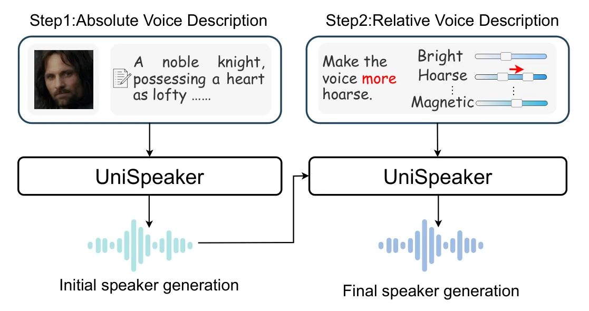
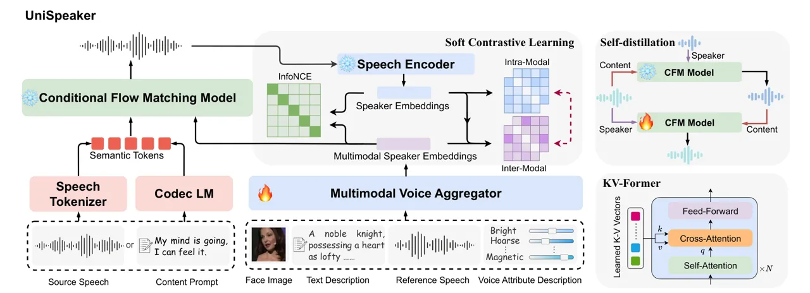
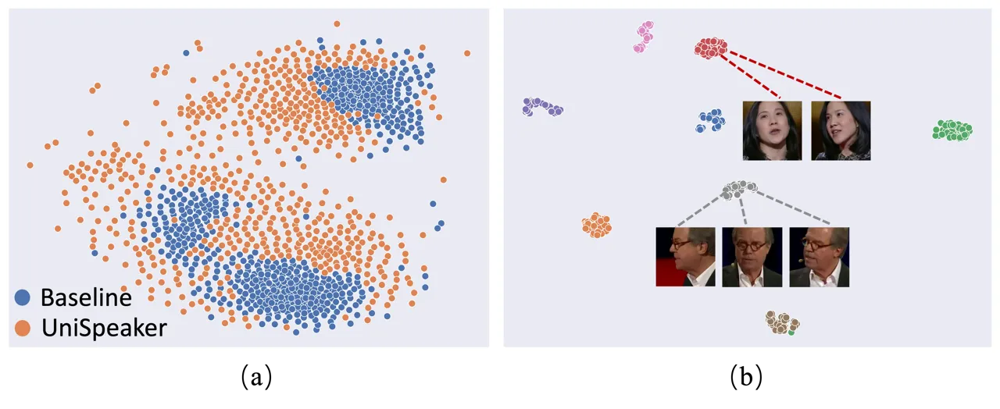
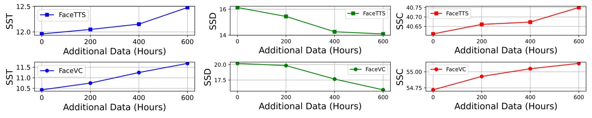

# UniSpeaker: A Unified Approach for Multimodality-driven Speaker Generation

Zhengyan Sheng Affiliation: University of Science and Technology of
China Email: <zysheng@mail.ustc.edu.cn>    Zhihao Du Affiliation: Speech
Lab, Alibaba Group, China Email: <%7Bneo.dzh>    Heng Lu
Affiliation: Speech Lab, Alibaba Group, China
Email: <sly.zsl%7D@alibaba-inc.com>    Shiliang Zhang
Affiliation: Speech Lab, Alibaba Group, China
Email: <zhling@ustc.edu.cn>    Zhen-Hua Ling

###### Abstract

Recent advancements in personalized speech generation have brought
synthetic speech increasingly close to the realism of target speakers’
recordings, yet multimodal speaker generation remains on the rise. This
paper introduces UniSpeaker, a unified approach for multimodality-driven
speaker generation. Specifically, we propose a unified voice aggregator
based on KV-Former, applying soft contrastive loss to map diverse voice
description modalities into a shared voice space, ensuring that the
generated voice aligns more closely with the input descriptions. To
evaluate multimodality-driven voice control, we build the first
multimodality-based voice control (MVC) benchmark, focusing on voice
suitability, voice diversity, and speech quality. UniSpeaker is
evaluated across five tasks using the MVC benchmark, and the
experimental results demonstrate that UniSpeaker outperforms previous
modality-specific models. Speech samples are available at
[https://UniSpeaker.github.io](https://UniSpeaker.github.io).

## 1 Introduction

In recent years, the field of speech synthesis has seen remarkable
progress Wang et al. (2023a); Du et al. (2024); Ju et al. (2024),
enabling the generated speech to closely resemble the actual recordings.
However, traditional zero-shot speech synthesis still faces limitations
in certain scenarios, such as providing voiceovers for virtual
characters, where obtaining ideal reference speech is very difficult or
even nonexistent Guo et al. (2023). Therefore, the voice control
abilities in generative models need to transition from speaker cloning
to speaker generation. Compared to cloning voice based on the reference
speech, using other more convenient modalities to express the intentions
holds great potential for creating the desired voice characteristics.

Recently, several studies Shimizu et al. (2024); Zhang et al. (2023); Lu
et al. (2021); Sheng et al. (2023) have explored speaker generation
based on text prompts or face images. These studies align specific modal
representations with speaker embeddings, thereby controlling the voice
characteristics using the aligned representations during inference. In
addition to the aforementioned absolute voice descriptions, VoxEditor
Sheng et al. (2024) introduces the relative descriptions for voice
attributes editing, allowing for more nuanced control over voice
characteristics.



Figure 1: The pipeline of Unispeaker for multiple modalities speaker
generation. Initial speaker generation is performed using absolute voice
descriptions. If the initial results are unsatisfactory, further voice
attributes editing can be done to achieve a finsal speaker generation.

Despite significant progress in these studies, previous methods often
explore different voice description modalities and generation approaches
independently, typically involving only one extra modality aligned with
the reference speech. This leads to two shortcomings: (1) Independent
modal alignments hindered collaborative speaker generation across
multiple modal descriptions. Actually, the mapping between modalities
other than the reference speech and voice characteristics is one-to-many
Leng et al. (2024), meaning the absolute voice description (a single
face or a text description) can often correspond to different reasonable
voice characteristics. If we combine the absolute voice description and
relative voice description, it is evident that the generated speaker
will better align with user needs. However, existing models can only
process absolute or relative descriptions. (2) Multimodal speech
alignment data is scarce and previous methods were trained from scratch
on such limited paired multimodal data. This leads to a sparse coverage
of the voice space and the limited diversity and consistency of the
voice characteristics generated.

To address these limitations, we introduce UniSpeaker, a unified speaker
generation model that integrates both absolute and relative voice
descriptions. As illustrated in Figure 2, UniSpeaker is capable of
processing inputs from facial and textual descriptions to generate voice
characteristics that meet the expectations set by these voice
descriptions. Recognizing the one-to-many issue, wherein users might
find the generated voice characteristics unsatisfactory based on the
aforementioned absolute descriptions, UniSpeaker enables precise voice
attribute editing on the generated speech until the desired voice is
attained. To achieve collaborative speaker generation, we propose a
unified multimodal voice aggregator (MFA), which aligns these multimodal
inputs into a coherent voice space. The MFA is based on the KV-Former
architecture, a streamlined variant of the Transformer model, utilizing
learnable key-value vectors to develop a shared multimodal voice space,
with multimodal representations serving as queries. These key-value
vectors encapsulate sufficient voice information, allowing the
multimodal voice description to extract the most pertinent information.
The output from the MFA is supplied to a subsequent generative model for
voice control and aligned with speaker embeddings. In light of the
correlation between the voice characteristics of different speakers,
soft contrastive learning (SoftCL) is employed during alignment
training, which relaxes strict one-to-one contrastive constraints and
utilizes intra-modal discriminative information for guidance. Similar
with ImageBind, this speech-anchoring mechanism facilitates the emergent
alignment of various modalities within the voice space without parallel
data across all modalities, which mitigated the impact of data scarcity
and ensure the diversity of the voice characteristics.

In addition, large-scale speech generation models excel in voice
control, but scalable multimodality integration is yet to be explored.
We use the open-source CosyVoice Du et al. (2024) as the backbone for
UniSpeaker and apply self-distillation Anastassiou et al. (2024) to
enhance voice disentanglement, maintaining its versatility across tasks.

Due to the lack of publicly accessible benchmarks for assessing
multimodality-driven voice control, we developed a multimodality-based
voice control (MVC) benchmark. This benchmark covers five fundamental
tasks: face-driven voice conversion (FaceVC), face-driven personalized
text-to-speech (FaceTTS), text description-driven voice conversion
(TextVC), text description-driven personalized text-to-speech (TextTTS),
and attribute-driven voice editing (AVE). Consistent with prior research
Yao et al. (2024), the MVC benchmark evaluates generated speech using
multimodal voice descriptions on three parameters: voice suitability,
voice diversity, and speech quality. We assessed UniSpeaker with the MVC
benchmark, where it outperformed previous modality-specific models in
the five fundamental tasks.

## 2 Relate Work

### 2.1 Multimodality-driven voice control for speech generation

Modeling diverse voice characteristics has consistently been a critical
focus in the field of speech synthesis. Recent works, such as PromptTTS2
Leng et al. (2024), Audiobox Vyas et al. (2023), InstructSpeechHuang et
al. (2024) and others Guan et al. (2024); Yang et al. (2024); Ji et al.
(2024), have explored using text prompts to control the style or emotion
of generated speech. However, only a few studies have specifically
targeted voice control with text prompt Shimizu et al. (2024); Zhang et
al. (2023). Text prompt-based style control TTS methods typically
convert speech attributes like pitch, energy, duration, and emotion into
natural style prompts using LLMs. Since these style prompts primarily
reflect prosody and capture minimal speaker individuality, achieving the
desired voice control remains challenging.

In the field of multimodal voice control, researchers have previously
attempted to align different voice description modalities with speaker
embeddings using models such as memory networks Sheng et al. (2023),
mixture density networks Shimizu et al. (2024), and latent diffusion Yao
et al. (2024), as well as loss functions like MSE loss Lu et al. (2021),
cosine similarity loss Zhang et al. (2023), and perceptual loss Weng et
al. (2023). However, these alignment methods relied on parallel datasets
and were challenging to extend directly to additional modalities.
Performance-wise, previous face-based methods Lee et al. (2023)
generally ensured gender accuracy but often produced incongruous voice
characteristics, such as generating a youthful voice for an elderly
face. Additionally, VoxEditor Sheng et al. (2024) is limited to
performing voice attribute editing on existing source speech, thus
offering restricted voice diversity. In response, the proposed
UniSpeaker employs a unified voice aggregator to construct a shared
voice space that can be easily extended to new modalities, achieving
versatile and diverse voice control.

### 2.2 Large speech generation models

As speech generation systems Tan et al. (2022); Kim et al. (2021) have
achieved remarkable levels of naturalness and robustness, recent
research Ju et al. (2024); Lee et al. (2024) has shifted focus towards
exploring novel generative models, advanced modeling objectives, and
larger-scale datasets to pursue voice diversity. When integrating
multimodal voice descriptions, it is crucial to preserve the performance
of pre-trained speech generation models in terms of naturalness,
robustness, and prosody. Some representative large-scale speech
generation Wang et al. (2023a); Kim et al. (2024); Chen et al. (2024)
models typically leverage a neural codec to convert speech waveforms
into discrete acoustic token sequences, along with an autoregressive
language model to generate discrete tokens from text. However, the
discrete acoustic token sequences entangle content, speaker, and
prosodic information in this approach, complicating the alignment of
multimodal voice characteristics without disrupting the content and
prosody of the generated speech. Recently, CosyVoice Du et al. (2024)
has utilized supervised semantic tokens Radford et al. (2023) as the
modeling objectives for a large language model (LLM). Subsequently, a
conditional flow matching model (CFM) generates speech based on semantic
tokens, speaker embeddings and mel spectrograms prompt. Since the
semantic tokens primarily encompass content and prosodic information,
the speaker information included is limited. This facilitates further
voice disentanglement and the integration of multimodal voice
descriptions, making CosyVoice well-suited as the backbone for the
UniSpeaker model proposed in this paper.



Figure 2: The pipeline of Unispeaker for multiple modalities speaker
generation. Initial speaker generation is performed using absolute voice
descriptions. If the initial results are unsatisfactory, further voice
attributes editing can be done to achieve a finsal speaker generation.

## 3 Methods

In this section, we first review the backbone CosyVoice, then introduce
how multimodal voice descriptions are integrated into a pre-trained
speech generation model.

### 3.1 Preliminaries

CosyVoice leverages supervised semantic tokens Radford et al. (2023); Ye
et al. (2024) as modeling objectives, utilizing an LLM for text-to-token
generation and a CFM for token-to-speech synthesis. Given a dataset
$`\mathcal{D}=\{\mathbf{x}_{i},\mathbf{y}_{i}\}`$, where $`\mathbf{x}`$
is a speech sample and $`\mathbf{y}`$ is the corresponding text
transcription, the sequence input to the LLM is mainly comprised of
$`\{\mathbf{s},\mathbf{Y},\mathbf{C}\}`$, where $`\mathbf{s}`$
represents the speaker embeddings of $`\mathbf{x}`$, $`\mathbf{Y}`$ is
the text embedding of $`\mathbf{y}`$ and $`\mathbf{C}`$ is the semantic
tokens of $`\mathbf{x}`$. The LLM is then trained in an autoregressive
manner to minimize the negative log-likelihood of semantic tokens
$`\mathbf{C}`$. The core of CFM is to construct a probability density
path from a prior distribution to $`p_{0}(\mathbf{X})`$ to the data
distribution of the Mel-spectrograms $`q(\mathbf{X})`$. The probability
density path is defined by a time-dependent vector field
$`\mathbf{v}_{t}(\mathbf{X})`$,which generates the flow $`\phi_{t}`$
through an ordinary differential equation (ODE). The flow matching model
is trained using optimal-transport conditional flow matching (OT-CFM)
Tong et al. (2023), which can be written as follows,

```math
\displaystyle\mathcal{L}_{\text{OT-CFM}}= \displaystyle\mathbb{E}_{t,p_{0}(\mathbf{X}_{0}),q(\mathbf{X}_{1})}\|\omega_{t}(\phi^{OT}_{t}(\mathbf{X}_{0},\mathbf{X}_{1})|\mathbf{X}_{1})- \tag{1}
```

```math
\displaystyle\nu_{t}(\phi^{OT}_{t}(\mathbf{X}_{0},\mathbf{X}_{1})|\theta_{CFM})\|_{1},
```

where

```math
\displaystyle\phi^{OT}_{t}(\mathbf{X}_{0},\mathbf{X}_{1})=(1-t)\mathbf{X}_{0}+t\mathbf{X}_{1}, \tag{2}
```

```math
\displaystyle\omega_{t}(\phi^{OT}_{t}(\mathbf{X}_{0},\mathbf{X}_{1})|\mathbf{X}_{1})=\mathbf{X}_{1}-\mathbf{X}_{0}.
```

The speaker embeddings $`\mathbf{s}`$, speech tokens $`\mathbf{C}`$, and
masked Mel-spectrogram prompt $`\tilde{\mathbf{X}}_{1}`$ are also fed
into the neural network to match the vector field with learnable
parameters $`\theta_{CFM}`$,

```math
\displaystyle\nu_{t}(\phi^{OT}_{t}(\mathbf{X}_{0},\mathbf{X}_{1})|\theta_{CFM})=\mathrm{NN}\left(\phi^{OT}_{t}(\mathbf{X}_{0},\mathbf{X}_{1}),t;\mathbf{s},\mathbf{C},\tilde{\mathbf{X}}_{1}\right). \tag{3}
```

The supervised semantic tokens contains only a small amount of speaker
information, and CosyVoice demonstrates good performance in voice
characteristics disentanglement. In our preliminary experiments, we
found that although the LLM received speaker embeddings, its impact on
voice characteristics was minimal. In contrast, the CFM module plays a
decisive role in influencing voice characteristics .

### 3.2 Multimodal Voice Description Integration

We incorporate multiple modalities into the CFM model, allowing various
inputs to control the voice characteristics of generated speech. As
shown in Figure , each modality is first processed by a pre-trained,
modality-specific encoder to obtain the corresponding representation.
Each kind of representation is then transformed into a latent vector via
adaptive average pooling or a multi-layer perceptron. Those vectors
across modalities are mapped into a unified voice space through a shared
MVA, producing the corresponding speaker embeddings. These speaker
embeddings are then fed into the CFM for speech generation.

#### Multimodal Voice Aggregator

Then global representations of different modalities should be aligned
with speaker embeddings within the voice space. Previous methods relied
on limited datasets that matched only two modalities for alignment,
resulting in a sparse distribution in the voice space and weak
generalization capabilities.

Inspired by Q-Former Li et al. (2023) and the memory mechanism Sheng et
al. (2023); Lee et al. (2021), we propose the KV-Former architecture as
a unified multimodal voice aggregator. This architecture integrates
learnable key-value vectors into a simplified Transformer, as shown in
Figure. The multimodal representations act as queries and perform
multi-head cross-attention with the learnable key-value vectors to
retrieve the most informative representation in the voice subspace. The
formulation of this process is as follows,

```math
\mathbf{q}=\mathbf{W}^{q}\mathbf{s}_{m},\mathbf{k}=\mathbf{W}^{k}\mathbf{f},\mathbf{v}=\mathbf{W}^{v}\mathbf{f},\mathbf{a}_{m}=\operatorname{Softmax}\left(\frac{\mathbf{q}\mathbf{k}^{T}}{\sqrt{d}}\right)\mathbf{v}, \tag{4}
```

where $`\mathbf{W}`$ are the projection matrices in attention,
$`\mathbf{s}_{m}\in\{\mathbf{s}_{f},\mathbf{s}_{r},\mathbf{s}_{t}\}`$
represents various state vectors, $`\mathbf{f}`$ are learnable key-value
vectors, $`d`$ is the dimension of $`\mathbf{f}`$, and
$`\mathbf{a}_{m}`$ is the output of cross attention. In this process,
the learnable key-value vectors create an information bottleneck,
interacting with the three modalities to build a shared voice space.
Additionally, MVA adopts a speech-anchoring mechanism, reference speech
is used as input for MVA with a 50% probability. In this way, even
without parallel data between all modalities, different modalities
achieves emergent alignment in the voice space through shared k-v
vectors and joint training, which mitigated the impact of data scarcity
and ensure the diversity of voice characteristics. In addition, our
module also allows for easy expansion to new modalities by adding the a
modality-specific encoder.

To integrate multimodal inputs for voice control without losing the
general abilities of CFM, we feed the output of MVA to the CFM and adapt
the model without changing the CFM weights. The MVA is trained to
optimize $`\mathcal{L}_{\text{OT-CFM}}`$ and Equation (3) is transformed
as follows to fit speaker embeddings,

```math
\displaystyle\nu_{t}(\phi^{OT}_{t}(\mathbf{X}_{0},\mathbf{X}_{1})|\theta_{MVA})=\mathrm{NN}\left(\phi^{OT}_{t}(\mathbf{X}_{0},\mathbf{X}_{1}),t;\mathbf{v}_{m},\mathbf{C}\right), \tag{5}
```

where
$`\mathbf{v}_{m}\in\{\mathbf{v}_{f},\mathbf{v}_{r},\mathbf{v}_{t}\}`$
and $`\mathbf{v}_{f},\mathbf{v}_{r},\mathbf{v}_{t}`$ are the outputs of
applying MVA to $`\mathbf{s}_{f},\mathbf{s}_{r},\mathbf{s}_{t}`$,
respectively. In this manner, CFM can integrate multiple modalities for
voice control and keep its ability to generate natural and robust
speech.

#### Soft Contrastive Learning

Relying solely on OT-CFM to optimize MVA leads to slow convergence, and
the generated speech may exhibit voice discordance with the input voice
descriptions. Inspired by previous studies Gao et al. (2024); Wang et
al. (2024), we additionally introduce the SoftCL strategy for
speech-anchoring multimodal alignment, including both inter-modal and
intra-modal alignment, as shown in Figure . For inter-modal alignment,
we employ InfoNCE Radford et al. (2021), which pulls the paired
multimodal and speaker embeddings closer together while pushing the
unpaired ones apart. In addition, to bring cross-modal similarities
closer to the distribution within each modality, intra-modal
similarities serve as soft labels. Specifically, given a batch of $`N`$
multimodal-voice speaker embeddings pairs
$`{\{(\mathbf{v}_{m}^{i},\mathbf{s}_{r}^{i})\}_{i=1}^{N}}`$, the
intra-model self-similarity vector
$`p_{i}(\mathbf{s}_{r},\mathbf{s}_{r})=\{p_{ij}(\mathbf{s}_{r},\mathbf{s}_{r})\}_{j=1}^{N}`$
can be obtained by:

```math
p_{ij}(\mathbf{s}_{r},\mathbf{s}_{r})=\frac{\exp\left(\operatorname{sim}\left(\mathbf{s}_{r}^{i},\mathbf{s}_{r}^{j}\right)/\tau\right)}{\sum_{j=1}^{N}\exp\left(\operatorname{sim}\left(\mathbf{s}_{r}^{i},\mathbf{s}_{r}^{j}\right)/\tau\right)}, \tag{6}
```

where $`\tau`$ is a learnable temperature coefficient, initialized to
0.07, and $`\operatorname{sim}()`$ denotes the dot product used to
calculate similarity. Despite intra-model self-similarity, the
confidence of positive samples still outweighs that of negatives,
potentially overshadowing negatives in cross-modal relation alignment.
To address this, we disentangle the negatives in the distribution to
boost the relation alignment. For the self-similarity vector
$`p_{i}(\mathbf{s}_{r},\mathbf{s}_{r})\in\mathbb{R}^{1\times N}`$, the
neg-disentangled
$`p_{i}^{*}(\mathbf{s}_{r},\mathbf{s}_{r})\in\mathbb{R}^{1\times(N-1)}`$
distribution is calculated as follows,

```math
p_{ij}^{*}=\frac{\exp\left(p_{ij}\right)}{\sum_{k=1,k\neq i}^{N}\exp\left(p_{ik}\right)}. \tag{7}
```

We also apply the above negative disentanglement to
$`p_{i}(\mathbf{s}_{r},\mathbf{v}_{m})`$, yielding
$`p_{i}^{*}(\mathbf{s}_{r},\mathbf{v}_{m})`$. Then, the intra-modality
alignment supervision can be achieved with negative disentanglement as
follows,

```math
\mathcal{L}_{\text{INTRA}}=\frac{1}{N}\sum_{i=1}^{N}\mathrm{KL}\left(p_{i}^{*}(\mathbf{s}_{r},\mathbf{s}_{r})\|p_{i}^{*}(\mathbf{s}_{r},\mathbf{v}_{m})\right), \tag{8}
```

where $`\mathrm{KL}`$ represents the Kullback-Leibler Divergence.
Generally, UniSpeaker is trained to optimize the following loss
function,

```math
\mathcal{L}=\mathcal{L}_{\text{OT-CFM}}+\lambda_{1}\mathcal{L}_{\text{INTRA}}+\lambda_{2}\mathcal{L}_{\text{INTER}}, \tag{9}
```

where $`\mathcal{L}_{\text{INTRA}}`$ is the InfoNCE loss,
$`\lambda_{1}`$ and $`\lambda_{2}`$ are hyper-parameters used to balance
each loss term.

#### Self-distillation

In our preliminary experiments, we observed that CFM usually draws
speaker information from semantic tokens, often overlooking speaker
information within the face image, due to the cross-modal gap.
Therefore, to enhance voice disentanglement before merging multimodal
voice descriptions, self-distillation is applied to fine-tune the CFM.
Initially, we employ semantic tokens from the original speech, along
with a Mel-spectrogram prompt and speaker embeddings from a randomly
chosen speaker, which are then inputted into the CFM for voice
conversion. Then, given the semantic tokens $`\bar{\mathrm{C}}`$ of
converted speech and speaker embeddings $`\mathbf{s}`$ of source speech,
the CFM is fine-tuned to predict the source speech. We removed the
masked Mel-spectrogram prompt to improve the voice control by the
speaker embeddings, transforming Equation (3) as follows,

```math
\displaystyle\nu_{t}(\phi^{OT}_{t}(\mathbf{X}_{0},\mathbf{X}_{1})|\theta_{FM})=\mathrm{NN}\left(\phi^{OT}_{t}(\mathbf{X}_{0},\mathbf{X}_{1}),t;\mathbf{s},\bar{\mathrm{C}}\right). \tag{10}
```

In this way, the voice characteristics of the generated speech is
controlled by the speaker embeddings input to the CFM. This allows the
integration of multimodal voice description directly into the CFM,
simplifying the process without requiring modifications to the LLM.

|         |                                     |                   |                  |                        |                    |                    |                      |
| ------- | ----------------------------------- | ----------------- | ---------------- | ---------------------- | ------------------ | ------------------ | -------------------- |
| Task    | Methods                             | Voice Suitability |                  |                        | Voice Diversity    | Speech Quality     |                      |
|         |                                     | SST $`\uparrow`$  | SSC $`\uparrow`$ | MOS-Match $`\uparrow`$ | SSD $`\downarrow`$ | WER $`\downarrow`$ | MOS-Nat $`\uparrow`$ |
| FaceTTS | Imaginary VoiceLee et al. (2023)    | 10.08             | 38.46            | 2.39 $`\pm`$ 0.09      | 32.17              | 8.23               | 2.45 $`\pm`$ 0.08    |
|         | Face-StyleSpeechKang et al. (2023)  | 11.02             | 37.09            | 2.78 $`\pm`$ 0.12      | 30.78              | 7.09               | 3.29 $`\pm`$ 0.10    |
|         | SYNTHE-SEESPark et al. (2024)       | 10.97             | 38.81            | 2.92 $`\pm`$ 0.11      | 31.09              | 9.14               | 3.39 $`\pm`$ 0.09    |
|         | UniSpeaker(Ours)                    | 12.48             | 40.75            | 3.18 $`\pm`$ 0.10      | 14.09              | 4.01               | 3.82 $`\pm`$ 0.08    |
| FaceVC  | FaceVCLu et al. (2021)              | 8.97              | 50.91            | 2.21 $`\pm`$ 0.11      | 30.19              | 10.90              | 2.79 $`\pm`$ 0.10    |
|         | SP-FaceVCWeng et al. (2023)         | 9.52              | 52.29            | 2.39 $`\pm`$ 0.09      | 29.86              | 14.92              | 3.04 $`\pm`$ 0.10    |
|         | FVMVCSheng et al. (2023)            | 9.49              | 51.33            | 2.69 $`\pm`$ 0.07      | 22.60              | 11.94              | 3.31 $`\pm`$ 0.08    |
|         | UniSpeaker(Ours)                    | 11.68             | 55.13            | 3.09 $`\pm`$ 0.10      | 15.91              | 4.98               | 3.80 $`\pm`$ 0.09    |
| TextTTS | PromptSpeakerZhang et al. (2023)    | 17.39             | \-               | 3.64 $`\pm`$ 0.13      | 29.84              | 14.70              | 3.37 $`\pm`$ 0.10    |
|         | Prompttts++Shimizu et al. (2024)    | 16.87             | \-               | 3.63 $`\pm`$ 0.12      | 35.42              | 15.08              | 3.41 $`\pm`$ 0.11    |
|         | CosyVoice-Instruct Du et al. (2024) | 14.51             | \-               | 3.71 $`\pm`$ 0.13      | 34.62              | 7.03               | 3.91 $`\pm`$ 0.09    |
|         | UniSpeaker (Ours)                   | 23.09             | \-               | 3.85 $`\pm`$ 0.11      | 21.10              | 6.46               | 3.87 $`\pm`$ 0.13    |
| TextVC  | PromptVCYao et al. (2024)           | 16.59             | \-               | 3.47 $`\pm`$ 0.07      | 36.98              | 7.08               | 3.64 $`\pm`$ 0.10    |
|         | UniSpeaker(Ours)                    | 24.45             | \-               | 3.81 $`\pm`$ 0.09      | 24.04              | 6.29               | 3.77 $`\pm`$ 0.11    |
| AVE     | VoxEditorSheng et al. (2024)        | 41.48             | \-               | 3.78 $`\pm`$ 0.09      | 49.92              | 8.01               | 3.57 $`\pm`$ 0.10    |
|         | UniSpeaker(Ours)                    | 49.04             | \-               | 3.79 $`\pm`$ 0.10      | 34.92              | 4.09               | 3.92 $`\pm`$ 0.09    |

Table 1: Objective and subjective evaluation results of comparison
systems. The definitions of all metrics can be found in Section 4. “-”
denotes the results are not available.

## 4 Dataset and Benchmark

Four modality-specific datasets were used to train the UniSpeaker,
including LRS3-TED Afouras et al. (2018), LibriTTS-P Kawamura et al.
(2024), VCTK-R Sheng et al. (2024), and inner speaker identity
description dataset collected from the internet, totaling about 1000
hours of audio data..

In the MVC Benchmark, for face-related evaluation, we randomly selected
600 face images from the test set of LRS3-TED. In terms of textual
descriptions, 600 sentences were randomly picked from the validation set
and rewritten by a LLM (GPT-3.5-TURBO), ensuring that the meaning of the
sentences remained unchanged. For voice attribute editing, 200 sentences
were randomly selected from VCTK and edited on all attributes for
evaluation. All above samples are unseen during training. The MVC
benchmark evaluates the generated speech from three perspectives: voice
suitability, voice diversity, and speech quality. 1) Voice suitability
evaluates whether the voice characteristics of the generated speech
align with the input multimodal voice description. This includes three
specific metrics: Speaker Similarity with Target (SST), Speaker
Similarity Consistency (SSC), and MOS-Match. 2) Voice diversity
evaluates the model’s ability to produce a diverse set of voice
characteristics based on the descriptions of different speakers, rather
than generating very similar ones. A metric named Speaker Similarity
Diversity (SSD) is employed for evaluating voice diversity, which
measures the speaker similarity between the speech generated from the
descriptions of different speakers. 3) Speech quality assesses the
robustness and naturalness of the generated speech, using two key
metrics: word error rate (WER) and MOS-Nat. We employ an automatic
speech recognition model¹¹ 1
[https://huggingface.co/openai/whisper-large-v3](https://huggingface.co/openai/whisper-large-v3)
to transcribe the generated speech and compute the WER. MOS-Nat is
determined through subjective listening tests for mean opinion scores to
evaluate the naturalness of the generated speech. Please refer to
Appendix for more details.

## 5 Experiments

### 5.1 Experiment Settings

We trained the UniSpeaker using 4 NVIDIA TESLA V100 32G GPUs for 30K
steps. The models were optimized using the AdamW optimizer with a
learning rate of 1e-5 and a 10K warmup steps. The weights
$`\lambda_{1}`$ and $`\lambda_{2}`$ in Equation (9) were set to 0.05.
FaceNetSchroff et al. (2015), T5Raffel et al. (2020), and CAM++Wang et
al. (2023b) serve as modality-specific encoders for face, text, and
speech, respectively. The speech tokenizer and codec LM were the same as
those used in CosyVoice. For TTS, the codec LM accepted only text inputs
without speaker embeddings. We compared our UniSpeaker with 11
task-specific expert models in five tasks. We used the official code or
pre-trained checkpoints of Imaginary Voice Lee et al. (2023), FaceVC Lu
et al. (2021), SP-FaceVC Weng et al. (2023), FVMVC Sheng et al. (2023),
and CosyVoice-Instruct Du et al. (2024). For the other methods, we
reproduced them according to their respective papers and evaluated them
on the same dataset. Please refer to Appendix for more details.

Figure 3: Average preference scores (%) of ABX tests about voice
suitability in comparison, where “N/P” stands for “no preference”.

### 5.2 Evaluation Results

In this section, we conduct experiments comparing the UniSpeaker with
the baselines and all objective and subjective evaluation results are
reported in Table 1.

In terms of voice suitability, our findings revealed that: 1) Across
five tasks, UniSpeaker outperformed previous approaches on all three
metrics, except for MOS-Match in the AVE task. While VoxEditor
incorporates a complex residual memory network, the performance of our
unified and scalable MVA remains competitive in MOS-Match. 2) In terms
of face-based voice control, previous methods were generally effective
in accurately controlling the gender of the voice characteristics but
often exhibited obvious voice inconsistencies in subjective aspects such
as age. In contrast, UniSpeaker achieved substantial improvements in
both voice-age matching and overall subjective perception. 3)
Additionally, we conducted an ABX test, as shown in Figure 3, the voice
characteristics generated by UniSpeaker sometimes can match the face
image even more closely than those of the actual speaker. We encourage
readers to listen to the samples on the demo page. 4) In text control,
CosyVoice-instruct concatenates voice characteristic descriptions with
the content prompt in the LLM without utilizing a pre-trained text
prompt, resulting in difficulties grasping semantic information
effectively and producing ambiguous voice characteristics. In contrast,
UniSpeaker achieves excellent semantic-to-voice consistency, where
similar semantics generate similar voice characteristics.

In terms of voice diversity, it is clear that UniSpeaker significantly
outperforms previous methods across 5 tasks. Furthermore, we visualized
the speaker embeddings of the generated speech from both SYNTHE-SEES and
UniSpeaker systems using t-SNE Chan et al. (2019), as shown in Figure 4
(a). The figure reveals that the voice space generated by our method is
significantly richer, whereas the voice space of the baseline is
relatively sparse. This indicates the voice characteristics generated by
the baseline for different faces may being very similar, greatly
limiting voice diversity.

In terms of speech quality, by freezing the CFM during training,
UniSpeaker preserve the general abilities of our backbone. Consequently,
UniSpeaker surpasses previous methods in overall speech quality, only
the MOS-Nat slightly lags behind CosyVoice-Instruct. This lag is due to
the CFM occasionally learning noise patterns from the dataset.
Conversely, CosyVoice-Instruct only integrate multimodal voice
descriptions in the LLM, resulting in minimal impact on speech quality.



Figure 4: The evaluation results about different multimodal data scales
on joint voice modeling

### 5.3 Ablation Study

Three ablation studies were conducted in our experiments. 1) To verify
the effectiveness of MVA, the output of modality-specific encoders was
mapped to the global representation, and it was directly fed into the
CFM. 2) To assess the effectiveness of SoftCL, we removed the
intra-class and inter-class contrastive losses from the output of MVA. 3) To validate the effectiveness of self-distillation, the performance
of UniSpeaker and the open-source CosyVoice model (without
self-distillation) was compared on TTS and VC tasks. We report the
evaluation results for certain tasks in Table 2, with more evaluation
results available in the Appendix.

We have the following observations: 1) MVA proved beneficial for voice
control with a shared multimodal voice space. It utilizes multimodal
data for joint modeling through shared k-v vectors, resulting in a
uniform distribution of the voice space. This promotes alignment between
different modalities and enhances the model’s performance in both voice
diversity and voice suitability. 2) Removing SoftCL resulted in a
decline across various metrics, specifically creating a significant
mismatch between the generated voice and the input voice descriptions. 3) Eliminating self-distillation also had notable effects. Experimental
results indicated that self-distillation significantly enhanced voice
control, particularly in terms of SST. However, due to the limited data
used for self-distillation, there was a slight reduction in voice
diversity.

| Task    | Methods                | SST $`\uparrow`$ | SSD $`\downarrow`$ | SSC $`\uparrow`$ |
| ------- | ---------------------- | ---------------- | ------------------ | ---------------- |
| FaceTTS | UniSpeaker             | 12.48            | 14.09              | 40.75            |
|         | w.o. MVA               | 11.40            | 15.07              | 40.61            |
|         | w.o. SoftCL            | 11.57            | 15.94              | 38.28            |
| FaceVC  | UniSpeaker             | 11.68            | 15.91              | 55.13            |
|         | w.o. MVA               | 10.70            | 19.07              | 54.61            |
|         | w.o. SoftCL            | 11.08            | 19.24              | 51.55            |
| TTS     | UniSpeaker             | 44.30            | 10.03              | 33.32            |
|         | w.o. self-distillation | 38.49            | 9.80               | 29.68            |
| VC      | UniSpeaker             | 39.37            | 10.34              | 50.64            |
|         | w.o. self-distillation | 31.07            | 10.16              | 43.62            |

Table 2: The ablation study of UniSpeaker, measured by SST, SSD and SSC.



Figure 5: The evaluation results about different multimodal data scales
on joint voice modeling. Here, the horizontal axis represents the amount
of additional multimodal data, with “0” indicating that only the LRS3
dataset was used.

### 5.4 Discussions

We investigated the impact of different multimodal data scales on the
shared voice space. For face-driven voice control, we trained UniSpeaker
using various datasets: solely LRS3, and additional datasets of varying
sizes. The results, presented in Figure 5, show that increasing the
amount of multimodal data improves the performance of FaceVC and
FaceTTS, highlighting the benefits of multimodal joint modeling.
Furthermore, the influence of additional multimodal data on SSC is less
pronounced for SST and SSD, as SSC primarily relies on intra-modal
relationships. We randomly selected 8 unseen speakers and sampled 100
different face images from each for FaceTTS. The t-SNE visualization of
speaker embeddings extracted from generated speech is presented in
Figure 4 (b). We observed that for each speaker, the voice remained
consistent across various facial images with different angles and
backgrounds. This indicates that UniSpeaker demonstrates strong
robustness to noisy information in facial images.

## 6 CONCLUSION

In this paper, we propose the UniSpeaker, a speech generation model that
leverages multimodal voice description for voice control. Through a
unified voice aggregator and designed training strategies, UniSpeaker
outperforms previous modality-specific models across five tasks,
generating voices that better match the input voice descriptions. In the
future, we will explore how to more effectively utilize multiple voice
descriptions of different modalities for one speaker simultaneously and
apply our method on other more modalities for voice control.

## References

- Afouras et al. \[2018\] Triantafyllos Afouras, Joon Son Chung, and
  Andrew Zisserman. LRS3-TED: a large-scale dataset for visual speech
  recognition. CoRR, abs/1809.00496, 2018.
- Anastassiou et al. \[2024\] Philip Anastassiou, Jiawei Chen, Jitong
  Chen, Yuanzhe Chen, Zhuo Chen, Ziyi Chen, Jian Cong, Lelai Deng,
  Chuang Ding, Lu Gao, Mingqing Gong, Peisong Huang, Qingqing Huang,
  Zhiying Huang, Yuanyuan Huo, Dongya Jia, Chumin Li, Feiya Li, Hui Li,
  Jiaxin Li, Xiaoyang Li, Xingxing Li, Lin Liu, Shouda Liu, Sichao Liu,
  Xudong Liu, Yuchen Liu, Zhengxi Liu, Lu Lu, Junjie Pan, Xin Wang,
  Yuping Wang, Yuxuan Wang, Zhen Wei, Jian Wu, Chao Yao, Yifeng Yang,
  Yuanhao Yi, Junteng Zhang, Qidi Zhang, Shuo Zhang, Wenjie Zhang, Yang
  Zhang, Zilin Zhao, Dejian Zhong, and Xiaobin Zhuang. Seed-tts: A
  family of high-quality versatile speech generation models. CoRR,
  abs/2406.02430, 2024.
- Chan et al. \[2019\] David M. Chan, Roshan Rao, Forrest Huang, and
  John F. Canny. GPU accelerated t-distributed stochastic neighbor
  embedding. J. Parallel Distributed Comput., 131:1–13, 2019.
- Chen et al. \[2024\] Sanyuan Chen, Shujie Liu, Long Zhou, Yanqing Liu,
  Xu Tan, Jinyu Li, Sheng Zhao, Yao Qian, and Furu Wei. VALL-E 2: Neural
  codec language models are human parity zero-shot text to speech
  synthesizers. CoRR, abs/2406.05370, 2024.
- Du et al. \[2024\] Zhihao Du, Qian Chen, Shiliang Zhang, Kai Hu, Heng
  Lu, Yexin Yang, Hangrui Hu, Siqi Zheng, Yue Gu, Ziyang Ma, Zhifu Gao,
  and Zhijie Yan. Cosyvoice: A scalable multilingual zero-shot
  text-to-speech synthesizer based on supervised semantic tokens. CoRR,
  abs/2407.05407, 2024.
- Gao et al. \[2024\] Yuting Gao, Jinfeng Liu, Zihan Xu, Tong Wu, Enwei
  Zhang, Ke Li, Jie Yang, Wei Liu, and Xing Sun. Softclip: Softer
  cross-modal alignment makes CLIP stronger. In Michael J. Wooldridge,
  Jennifer G. Dy, and Sriraam Natarajan, editors, Thirty-Eighth AAAI
  Conference on Artificial Intelligence, AAAI 2024, Thirty-Sixth
  Conference on Innovative Applications of Artificial Intelligence, IAAI
  2024, Fourteenth Symposium on Educational Advances in Artificial
  Intelligence, EAAI 2014, February 20-27, 2024, Vancouver, Canada,
  pages 1860–1868. AAAI Press, 2024.
- Guan et al. \[2024\] Wenhao Guan, Yishuang Li, Tao Li, Hukai Huang,
  Feng Wang, Jiayan Lin, Lingyan Huang, Lin Li, and Qingyang Hong.
  MM-TTS: multi-modal prompt based style transfer for expressive
  text-to-speech synthesis. In Michael J. Wooldridge, Jennifer G. Dy,
  and Sriraam Natarajan, editors, Thirty-Eighth AAAI Conference on
  Artificial Intelligence, AAAI 2024, Thirty-Sixth Conference on
  Innovative Applications of Artificial Intelligence, IAAI 2024,
  Fourteenth Symposium on Educational Advances in Artificial
  Intelligence, EAAI 2014, February 20-27, 2024, Vancouver, Canada,
  pages 18117–18125. AAAI Press, 2024.
- Guo et al. \[2023\] Zhifang Guo, Yichong Leng, Yihan Wu, Sheng Zhao,
  and Xu Tan. Prompttts: Controllable text-to-speech with text
  descriptions. In IEEE International Conference on Acoustics, Speech
  and Signal Processing ICASSP 2023, Rhodes Island, Greece, June 4-10,
  2023, pages 1–5. IEEE, 2023.
- Huang et al. \[2024\] Rongjie Huang, Ruofan Hu, Yongqi Wang, Zehan
  Wang, Xize Cheng, Ziyue Jiang, Zhenhui Ye, Dongchao Yang, Luping Liu,
  Peng Gao, et al. Instructspeech: Following speech editing instructions
  via large language models. In Forty-first International Conference on
  Machine Learning, 2024.
- Ji et al. \[2024\] Shengpeng Ji, Jialong Zuo, Minghui Fang, Ziyue
  Jiang, Feiyang Chen, Xinyu Duan, Baoxing Huai, and Zhou Zhao.
  Textrolspeech: A text style control speech corpus with codec language
  text-to-speech models. In IEEE International Conference on Acoustics,
  Speech and Signal Processing, ICASSP 2024, Seoul, Republic of Korea,
  April 14-19, 2024, pages 10301–10305. IEEE, 2024.
- Ju et al. \[2024\] Zeqian Ju, Yuancheng Wang, Kai Shen, Xu Tan, Detai
  Xin, Dongchao Yang, Eric Liu, Yichong Leng, Kaitao Song, Siliang Tang,
  Zhizheng Wu, Tao Qin, Xiangyang Li, Wei Ye, Shikun Zhang, Jiang Bian,
  Lei He, Jinyu Li, and Sheng Zhao. Naturalspeech 3: Zero-shot speech
  synthesis with factorized codec and diffusion models. In Forty-first
  International Conference on Machine Learning, ICML 2024, Vienna,
  Austria, July 21-27, 2024. OpenReview.net, 2024.
- Kang et al. \[2023\] Minki Kang, Wooseok Han, and Eunho Yang.
  Face-stylespeech: Improved face-to-voice latent mapping for natural
  zero-shot speech synthesis from a face image. CoRR,
  abs/2311.05844, 2023.
- Kawamura et al. \[2024\] Masaya Kawamura, Ryuichi Yamamoto, Yuma
  Shirahata, Takuya Hasumi, and Kentaro Tachibana. Libritts-p: A corpus
  with speaking style and speaker identity prompts for text-to-speech
  and style captioning. CoRR, abs/2406.07969, 2024.
- Kim et al. \[2021\] Jaehyeon Kim, Jungil Kong, and Juhee Son.
  Conditional variational autoencoder with adversarial learning for
  end-to-end text-to-speech. In Marina Meila and Tong Zhang, editors,
  Proceedings of the 38th International Conference on Machine Learning,
  ICML 2021, 18-24 July 2021, Virtual Event, volume 139 of Proceedings
  of Machine Learning Research, pages 5530–5540. PMLR, 2021.
- Kim et al. \[2024\] Jaehyeon Kim, Keon Lee, Seungjun Chung, and
  Jaewoong Cho. Clam-tts: Improving neural codec language model for
  zero-shot text-to-speech. In The Twelfth International Conference on
  Learning Representations, ICLR 2024, Vienna, Austria, May 7-11, 2024.
  OpenReview.net, 2024.
- Lee et al. \[2021\] Sangmin Lee, Hak Gu Kim, Dae Hwi Choi, Hyung-Il
  Kim, and Yong Man Ro. Video prediction recalling long-term motion
  context via memory alignment learning. In IEEE Conference on Computer
  Vision and Pattern Recognition, CVPR 2021, virtual, June 19-25, 2021,
  pages 3054–3063. Computer Vision Foundation / IEEE, 2021.
- Lee et al. \[2023\] Jiyoung Lee, Joon Son Chung, and Soo-Whan Chung.
  Imaginary voice: Face-styled diffusion model for text-to-speech. In
  IEEE International Conference on Acoustics, Speech and Signal
  Processing ICASSP 2023, Rhodes Island, Greece, June 4-10, 2023, pages
  1–5. IEEE, 2023.
- Lee et al. \[2024\] Keon Lee, Dong Won Kim, Jaehyeon Kim, and Jaewoong
  Cho. Ditto-tts: Efficient and scalable zero-shot text-to-speech with
  diffusion transformer. CoRR, abs/2406.11427, 2024.
- Leng et al. \[2024\] Yichong Leng, Zhifang Guo, Kai Shen, Zeqian Ju,
  Xu Tan, Eric Liu, Yufei Liu, Dongchao Yang, Leying Zhang, Kaitao Song,
  Lei He, Xiangyang Li, Sheng Zhao, Tao Qin, and Jiang Bian. Prompttts
  2: Describing and generating voices with text prompt. In The Twelfth
  International Conference on Learning Representations, ICLR 2024,
  Vienna, Austria, May 7-11, 2024. OpenReview.net, 2024.
- Li et al. \[2023\] Junnan Li, Dongxu Li, Silvio Savarese, and Steven
  C. H. Hoi. BLIP-2: bootstrapping language-image pre-training with
  frozen image encoders and large language models. In Andreas Krause,
  Emma Brunskill, Kyunghyun Cho, Barbara Engelhardt, Sivan Sabato, and
  Jonathan Scarlett, editors, International Conference on Machine
  Learning, ICML 2023, 23-29 July 2023, Honolulu, Hawaii, USA, volume
  202 of Proceedings of Machine Learning Research, pages 19730–19742.
  PMLR, 2023.
- Lu et al. \[2021\] Hsiao-Han Lu, Shao-En Weng, Ya-Fan Yen, Hong-Han
  Shuai, and Wen-Huang Cheng. Face-based voice conversion: Learning the
  voice behind a face. In Heng Tao Shen, Yueting Zhuang, John R. Smith,
  Yang Yang, Pablo César, Florian Metze, and Balakrishnan Prabhakaran,
  editors, MM ’21: ACM Multimedia Conference, Virtual Event, China,
  October 20 - 24, 2021, pages 496–505. ACM, 2021.
- Park et al. \[2024\] Jae Hyun Park, Joon-Gyu Maeng, Taejun Bak, and
  Young-Sun Joo. SYNTHE-SEES: face based text-to-speech for virtual
  speaker. In IEEE International Conference on Acoustics, Speech and
  Signal Processing, ICASSP 2024, Seoul, Republic of Korea, April 14-19,
  2024, pages 10321–10325. IEEE, 2024.
- Radford et al. \[2021\] Alec Radford, Jong Wook Kim, Chris Hallacy,
  Aditya Ramesh, Gabriel Goh, Sandhini Agarwal, Girish Sastry, Amanda
  Askell, Pamela Mishkin, Jack Clark, Gretchen Krueger, and Ilya
  Sutskever. Learning transferable visual models from natural language
  supervision. In Marina Meila and Tong Zhang, editors, Proceedings of
  the 38th International Conference on Machine Learning, ICML 2021,
  18-24 July 2021, Virtual Event, volume 139 of Proceedings of Machine
  Learning Research, pages 8748–8763. PMLR, 2021.
- Radford et al. \[2023\] Alec Radford, Jong Wook Kim, Tao Xu, Greg
  Brockman, Christine McLeavey, and Ilya Sutskever. Robust speech
  recognition via large-scale weak supervision. In Andreas Krause, Emma
  Brunskill, Kyunghyun Cho, Barbara Engelhardt, Sivan Sabato, and
  Jonathan Scarlett, editors, International Conference on Machine
  Learning, ICML 2023, 23-29 July 2023, Honolulu, Hawaii, USA, volume
  202 of Proceedings of Machine Learning Research, pages 28492–28518.
  PMLR, 2023.
- Raffel et al. \[2020\] Colin Raffel, Noam Shazeer, Adam Roberts,
  Katherine Lee, Sharan Narang, Michael Matena, Yanqi Zhou, Wei Li, and
  Peter J. Liu. Exploring the limits of transfer learning with a unified
  text-to-text transformer. J. Mach. Learn. Res.,
  21:140:1–140:67, 2020.
- Schroff et al. \[2015\] Florian Schroff, Dmitry Kalenichenko, and
  James Philbin. Facenet: A unified embedding for face recognition and
  clustering. In IEEE Conference on Computer Vision and Pattern
  Recognition, CVPR 2015, Boston, MA, USA, June 7-12, 2015, pages
  815–823. IEEE Computer Society, 2015.
- Sheng et al. \[2023\] Zhengyan Sheng, Yang Ai, Yan-Nian Chen, and
  Zhen-Hua Ling. Face-driven zero-shot voice conversion with
  memory-based face-voice alignment. In Abdulmotaleb El-Saddik, Tao Mei,
  Rita Cucchiara, Marco Bertini, Diana Patricia Tobon Vallejo,
  Pradeep K. Atrey, and M. Shamim Hossain, editors, Proceedings of the
  31st ACM International Conference on Multimedia, MM 2023, Ottawa, ON,
  Canada, 29 October 2023- 3 November 2023, pages 8443–8452. ACM, 2023.
- Sheng et al. \[2024\] Zhengyan Sheng, Yang Ai, Li-Juan Liu, Jia Pan,
  and Zhen-Hua Ling. Voice attribute editing with text prompt. CoRR,
  abs/2404.08857, 2024.
- Shimizu et al. \[2024\] Reo Shimizu, Ryuichi Yamamoto, Masaya
  Kawamura, Yuma Shirahata, Hironori Doi, Tatsuya Komatsu, and Kentaro
  Tachibana. Prompttts++: Controlling speaker identity in prompt-based
  text-to-speech using natural language descriptions. In IEEE
  International Conference on Acoustics, Speech and Signal Processing,
  ICASSP 2024, Seoul, Republic of Korea, April 14-19, 2024, pages
  12672–12676. IEEE, 2024.
- Tan et al. \[2022\] Xu Tan, Jiawei Chen, Haohe Liu, Jian Cong, Chen
  Zhang, Yanqing Liu, Xi Wang, Yichong Leng, Yuanhao Yi, Lei He,
  Frank K. Soong, Tao Qin, Sheng Zhao, and Tie-Yan Liu. Naturalspeech:
  End-to-end text to speech synthesis with human-level quality. CoRR,
  abs/2205.04421, 2022.
- Tong et al. \[2023\] Alexander Tong, Nikolay Malkin, Guillaume Huguet,
  Yanlei Zhang, Jarrid Rector-Brooks, Kilian Fatras, Guy Wolf, and
  Yoshua Bengio. Conditional flow matching: Simulation-free dynamic
  optimal transport. CoRR, abs/2302.00482, 2023.
- Vyas et al. \[2023\] Apoorv Vyas, Bowen Shi, Matthew Le, Andros
  Tjandra, Yi-Chiao Wu, Baishan Guo, Jiemin Zhang, Xinyue Zhang, Robert
  Adkins, William Ngan, Jeff Wang, Ivan Cruz, Bapi Akula, Akinniyi
  Akinyemi, Brian Ellis, Rashel Moritz, Yael Yungster, Alice
  Rakotoarison, Liang Tan, Chris Summers, Carleigh Wood, Joshua Lane,
  Mary Williamson, and Wei-Ning Hsu. Audiobox: Unified audio generation
  with natural language prompts. CoRR, abs/2312.15821, 2023.
- Wang et al. \[2023a\] Chengyi Wang, Sanyuan Chen, Yu Wu, Ziqiang
  Zhang, Long Zhou, Shujie Liu, Zhuo Chen, Yanqing Liu, Huaming Wang,
  Jinyu Li, Lei He, Sheng Zhao, and Furu Wei. Neural codec language
  models are zero-shot text to speech synthesizers. CoRR,
  abs/2301.02111, 2023.
- Wang et al. \[2023b\] Hui Wang, Siqi Zheng, Yafeng Chen, Luyao Cheng,
  and Qian Chen. CAM++: A fast and efficient network for speaker
  verification using context-aware masking. In Naomi Harte, Julie
  Carson-Berndsen, and Gareth Jones, editors, 24th Annual Conference of
  the International Speech Communication Association, Interspeech 2023,
  Dublin, Ireland, August 20-24, 2023, pages 5301–5305. ISCA, 2023.
- Wang et al. \[2024\] Qian Wang, Jia-Chen Gu, and Zhen-Hua Ling.
  Multiscale matching driven by cross-modal similarity consistency for
  audio-text retrieval. In IEEE International Conference on Acoustics,
  Speech and Signal Processing, ICASSP 2024, Seoul, Republic of Korea,
  April 14-19, 2024, pages 11581–11585. IEEE, 2024.
- Weng et al. \[2023\] Shao-En Weng, Hong-Han Shuai, and Wen-Huang
  Cheng. Zero-shot face-based voice conversion: Bottleneck-free speech
  disentanglement in the real-world scenario. In Brian Williams, Yiling
  Chen, and Jennifer Neville, editors, Thirty-Seventh AAAI Conference on
  Artificial Intelligence, AAAI 2023, Thirty-Fifth Conference on
  Innovative Applications of Artificial Intelligence, IAAI 2023,
  Thirteenth Symposium on Educational Advances in Artificial
  Intelligence, EAAI 2023, Washington, DC, USA, February 7-14, 2023,
  pages 13718–13726. AAAI Press, 2023.
- Yang et al. \[2024\] Dongchao Yang, Songxiang Liu, Rongjie Huang, Chao
  Weng, and Helen Meng. Instructtts: Modelling expressive TTS in
  discrete latent space with natural language style prompt. IEEE ACM
  Trans. Audio Speech Lang. Process., 32:2913–2925, 2024.
- Yao et al. \[2024\] Jixun Yao, Yuguang Yang, Yi Lei, Ziqian Ning,
  Yanni Hu, Yu Pan, Jingjing Yin, Hongbin Zhou, Heng Lu, and Lei Xie.
  Promptvc: Flexible stylistic voice conversion in latent space driven
  by natural language prompts. In IEEE International Conference on
  Acoustics, Speech and Signal Processing, ICASSP 2024, Seoul, Republic
  of Korea, April 14-19, 2024, pages 10571–10575. IEEE, 2024.
- Ye et al. \[2024\] Lingxuan Ye, Changfeng Gao, Gaofeng Cheng, Liuping
  Luo, and Qingwei Zhao. ASQ: an ultra-low bit rate asr-oriented speech
  quantization method. IEEE Signal Process. Lett., 31:221–225, 2024.
- Zhang et al. \[2023\] Yongmao Zhang, Guanghou Liu, Yi Lei, Yunlin
  Chen, Hao Yin, Lei Xie, and Zhifei Li. Promptspeaker: Speaker
  generation based on text descriptions. In IEEE Automatic Speech
  Recognition and Understanding Workshop, ASRU 2023, Taipei, Taiwan,
  December 16-20, 2023, pages 1–7. IEEE, 2023.
