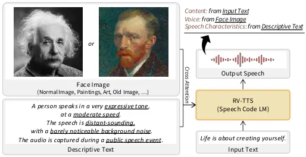
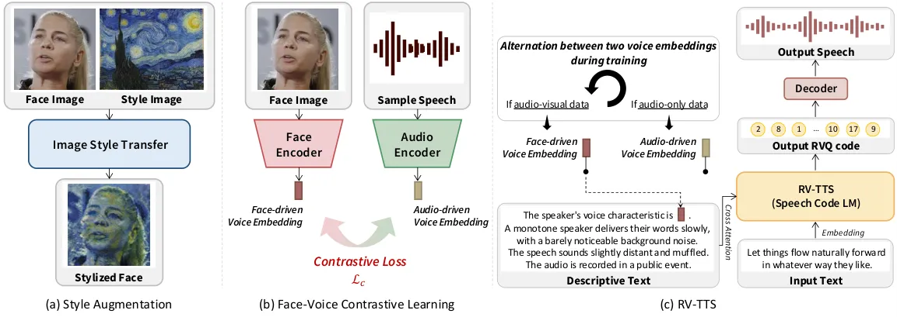

Kim Ma Chen Petridis Pantic Meta AIUK Imperial College LondonUK

# Revival with Voice: Multi-modal Controllable Text-to-Speech Synthesis

Minsu    Pingchuan    Honglie    Stavros    Maja Affiliation: 
Affiliation: 

###### Abstract

This paper explores multi-modal controllable Text-to-Speech Synthesis
(TTS) where the voice can be generated from face image, and the
characteristics of output speech (e.g., pace, noise level, distance,
tone, place) can be controllable with natural text description.
Specifically, we aim to mitigate the following three challenges in
face-driven TTS systems. 1) To overcome the limited audio quality of
audio-visual speech corpora, we propose a training method that
additionally utilizes high-quality audio-only speech corpora. 2) To
generate voices not only from real human faces but also from artistic
portraits, we propose augmenting the input face image with stylization. 3) To consider one-to-many possibilities in face-to-voice mapping and
ensure consistent voice generation at the same time, we propose to first
employ sampling-based decoding and then use prompting with generated
speech samples. Experimental results validate the proposed model’s
effectiveness in face-driven voice synthesis.

###### keywords

TTS, face-driven TTS, multi-modal TTS

## 1 Introduction

^(†)^(†) Samples are available:
[https://bit.ly/4k5VU6b](https://bit.ly/4k5VU6b). All experiments, data
collection, and processing activities were conducted by ICL. Meta was
involved solely in an advisory role and no experiments, data collection,
or processing activities were conducted on Meta infrastructure.

Text-to-Speech Synthesis (TTS) is one of the widely used technologies in
diverse real-world applications \[1, 2, 3, 4, 5, 6\]. With recent
developments, synthesized audio has become increasingly realistic and
natural, and even the voice of outputs can be cloned with a few seconds
of sample voices \[7, 8\].

In this paper, we explore an interesting extension of TTS, where the
voice is generated to match a given face image, even including artistic
portraits. This task can be applied to synthesize the voice of past
individuals or non-existent characters who are only known through
remaining artworks, old photos, or other visual records (e.g., Imagine
the Mona Lisa explaining the painting in her own voice, bringing a new
level of depth and intimacy to one of the world’s most famous works of
art). Going one step forward, we try to put controllability of the
speech characteristics (i.e., pace, noise-level, distance to mic, tone,
and the places of the recording) with natural text description.
Therefore, as illustrated in Fig. 1, the synthesized speech voice is
controlled by the input face image, while other speech characteristics
are determined by the given descriptive text, and the content of the
speech is controlled by the input text as usual.

To train these face-driven TTS models \[9, 10, 11\], we have to employ
audio-visual speech data where face and its speech are paired (e.g.,
LRS2 \[12\] and LRS3 \[13\]). However, most publicly available
large-scale audio-visual speech datasets are captured in public events,
which puts challenges in developing a high-quality face-driven TTS
model; 1) The data often contains noisy audio and includes stuttering,
whereas clean TTS data \[14, 15\] is essential for high-quality TTS
training. 2) The data is based on real humans, which means that the
model trained with this data may exhibit degraded performance when
tested with a face from an artwork. 3) Face-to-voice mapping is
ambiguous, as multiple voices can be imagined from a single face. These
challenges have led previous works \[16, 17\] to generate public
speech-like audio with noticeable background noise, to have limited
applicability to diverse face images, and to generate inconsistent voice
for the same speaker.



Figure 1: Overview of the proposed RV-TTS: The face image controls the
voice, the descriptive text controls speech characteristics, and the
input text determines the content of speech.

To mitigate these challenges, we adopt three main strategies. Firstly,
to improve speech quality, we propose employing not only large-scale
audio-visual speech datasets but also high-quality audio-only speech
datasets in model training through alternating voice embeddings. To this
end, the face encoder and the audio encoder are pre-trained using a
contrastive learning objective, such that the resulting face-driven
voice embedding and audio-driven voice embedding, which are embedded
through each encoder, can share the same latent space. Then, the
proposed model is conditioned on either one of the voice embedding
according to the sampled type of data; i.e., if the data is from
audio-visual speech dataset, use face-driven voice embedding, otherwise
use audio-driven voice embedding. Secondly, to bridge the gap between
artistic portraits and real human, we propose augmenting the input face
image with a pre-trained style transfer \[18\] where the input face
image is randomly stylized with different style images. Finally, to
reflect the multiple nature of face-to-voice mapping, we employ
sampling-based decoding to obtain multiple voices. Subsequently, to
produce a consistent voice, we use the generated sample as a prompt for
our speech code language model.



Figure 2: Illustration of the proposed RV-TTS. (a) The face image is
randomly stylized using a pre-trained style transfer model to reduce the
gap between real human faces and artistic portraits. (b) The face
encoder and audio encoder are pre-trained through contrastive learning
to share a common embedding space. (c) During training, the model
alternates between face-driven and audio-driven voice embeddings to
learn not only to associate face images with voices but also to
synthesize high-quality audio.

Based on the above strategies, we propose RV-TTS (Revival with Voice).
It takes three inputs, a face image, natural descriptive text, and input
text. The face image is encoded into a face-driven voice embedding by a
face encoder. The natural descriptive text is embedded through a
pre-trained language model \[19\]. Then, the descriptive text embedding
and the voice embedding are concatenated, and used to condition the
generation process through cross-attention. RV-TTS employs Residual
Vector Quantized (RVQ) code \[20\] as the speech features and learns
speech code language modeling.

Our contribution can be summarized as follows: 1) We propose a
multi-modal controllable text-to-speech synthesis model, where the voice
of output speech can be inferred from a facial image and the speech
characteristics can be controlled with natural descriptive text. 2) To
overcome the limited speech quality of current audio-visual speech
corpora, we enforce training by mixing both audio-visual and
high-quality audio-only databases by alternating the voice embeddings of
the two modalities. 3) To generate the voices of past individuals whose
voice recordings are no longer available, but whose faces have been
preserved through paintings or old photographs, we propose to augment
our training with stylization. 4) The proposed RV-TTS can imagine
multiple voices matched to the given face image, while it can generate
consistent voice through prompting.

## 2 Method

Let $`x`$ be input text which will be read by the TTS model, $`y`$ be
the ground-truth speech, $`c_{i}`$ be the face image, $`c_{a}`$ be the
sample utterance, and $`c_{t}`$ be the descriptive text. The objective
of our learning problem is to synthesize speech $`y`$ that reads the
input text $`x`$ with the voice characteristics of the conditioned face
image $`c_{i}`$, while also capturing the other speech attributes (i.e.,
pace, tone, noise level, distance, and place) described in $`c_{t}`$.

### 2.1 Architecture and Overview

The proposed TTS system follows \[21\] whose architecture is based on
that of MusicGen \[22\]. It is a speech language model, constructed
using a Transformer architecture with cross-attention layers \[23\],
that auto-regressively predicts 9-level RVQ codes of \[20\]. Each higher
level code is shifted to the right, forming the delay pattern. The
architecture of the face encoder is ResNet50 \[24\] and that of audio
encoder is ECAPA-TDNN \[25\]. As in \[21\], a pre-trained language
model, T5 \[19\], is used to encode the natural descriptive text,
$`c_{t}`$. The overall flow of the proposed RV-TTS is shown in Fig. 2c.
The input text $`x`$ is embedded through an embedding layer and passed
into the speech language model as inputs. The face image $`c_{i}`$ is
encoded into a face-driven voice embedding using the face encoder. The
descriptive text $`c_{t}`$ is embedded through a pre-trained language
model. Then, the descriptive text embedding and the face-driven voice
embedding are concatenated along the temporal dimension and passed into
the cross-attention layer of the speech language model. By conditioning
on all inputs, the speech language model predicts RVQ codes, which are
then converted into a raw waveform through decoder of RVQ model.

### 2.2 Style Augmentation

Paired face image and speech data is crucial for training a face-driven
TTS system. However, collecting such paired data for historical figures,
particularly those whose likenesses are preserved only in visual
records, is impossible. Therefore, previous literature has typically
utilized publicly available audio-visual speech data, which consists of
recordings of real-world individuals. Since the model is trained on
photorealistic face images, this creates a discrepancy between training
and inference when the model is applied to non-realistic faces (e.g.,
portraits), which limits its performance and applicability to diverse
faces.

To mitigate this discrepancy, we augment the face image during training
with diverse styles by employing neural style transfer models \[18\], as
shown in Fig. 2a. Specifically, the input face image is randomly passed
through a style transfer model, CAST \[26\], and stylized with a random
style image (e.g., paintings and sketches). Additionally, to simulate
old photographs, the images are also augmented with gray-scaling and
blurring.

### 2.3 Narrowing the Speech Quality Gap

Another consideration is that the audio quality of publicly available
large-scale audio-visual datasets is often compromised by diverse
background noise and reverberation. Consequently, this limits the
face-driven TTS system’s ability to learn high-quality audio synthesis,
unlike typical TTS systems that are usually trained on high-quality
datasets captured from reading speech \[27\]. To address this
limitation, our strategy is to also employ a high-quality audio-only
dataset, LibriTTS-R \[14, 28\], in the training of the face-driven TTS
model.

To this end, we first pre-train the face encoder and the audio encoder
to share their embeddings through contrastive learning \[29\] as shown
in Fig. 2b. Specifically, the face-driven voice embedding $`z_{i}`$ is
obtained using the face encoder from face image $`c_{i}`$ and similarly
the audio-driven voice embedding $`z_{a}`$ from the sample utterance
$`c_{a}`$ using the audio encoder. Then, if the $`z_{i}`$ and $`z_{a}`$
come from the same person, we maximize their similarity, otherwise
minimize using InfoNCE loss \[29, 30\] as follows:

```math
\mathcal{L}_{c}=-\frac{1}{N}\sum_{l=1}^{N}\log\frac{\exp(s(z_{i}^{l},z_{a}^{l})/\tau)}{\sum_{n=1}^{N}\exp(s(z_{i}^{l},z_{a}^{n})/\tau)}, \tag{1}
```

where the superscript is the speaker ID, $`\tau`$ is a learnable
temperature parameter, $`s(\cdot)`$ denotes the cosine similarity
function, and $`N`$ represents the total number of speakers in a mini
batch.

After pre-training the face and voice encoders through contrastive
learning, we can regard the two voice embeddings obtained from each
modality as sharing similar information. This means that we can use
either one of the embeddings as a condition to generate the target
voice. Concretely, when the data is sampled from an audio-visual
dataset, the face-driven voice embedding $`z_{i}`$ is passed to the TTS
model, while $`z_{a}`$ is passed if the data comes from an audio-only
dataset, as shown in Fig. 2c. By alternatively training the model with
both modalities, the model can learn not only to associate the target
voice with a given face image but also produce high-quality speech
(i.e., noise-clean and stuttering-free).

### 2.4 Diverse but Consistent Voice Generation

Inferring the voice by just watching a face is an ill-posed problem, as
multiple voices can potentially match a single face. However, previous
methods have not explored this one-to-many possibilities and attempted
to produce a single fixed voice for a given face image. Unfortunately,
it often results in inconsistent voices across multiple inferences, when
using different input text even with the same face image.

However, this limitation can be easily addressed in the proposed system.
Since the proposed RV-TTS is based on a speech language model, we can
generate different voices that match the input face through
sampling-based decoding. Furthermore, we can also generate consistent
voices across multiple inferences by providing the previously generated
sample as a prompt, which is also known as in-context learning
ability \[31, 8\]. Therefore, users can employ RV-TTS to produce diverse
sentences with their preferred voice using the following steps: 1)
Generate multiple sample speeches with the proposed system by providing
a simple input text (e.g., ‘voice candidate’) and the target face image. 2) Choose one plausible sample speech based on the user’s preference. 3)
Generate target speech with the proposed system by providing the
selected sample speech at the previous step, the target input text, and
the target face image. That is, by employing the selected sample speech
as prompt, the model can produce a consistent voice.

### 2.5 Natural Descriptive Text

To make RV-TTS be able to control speech characteristics using natural
descriptive text, descriptive labels are required for each speech. For
the natural descriptive text labels of LibriTTS-R, we can employ the
labels released by \[21\]. However, these texts contain gender-specific
words (e.g., She, He, Her, His), which might impede the model’s ability
to learn to associate voice with face images only. To resolve this
issue, we remove gender-specific words and replace them with neutral
words (e.g., A speaker, A person) before training. For LRS3 and
VoxCeleb2, since there are no natural descriptive texts available, we
generate labels using Data-Speech \[32\], which analyzes diverse audio
characteristics (e.g., SNR, pitch, speaking rate) and generates text.
Moreover, we added a sentence describing the audio as being recorded in
public speech events to inform the data is from broadcasts or TED talks.
Finally, to incorporate the face- or audio-driven voice embedding with
the natural descriptive text embedding, we insert the voice embedding
between the embeddings of ‘The speaker’s voice characteristic is’ and
the remaining natural descriptive text, as shown in Fig. 2c.

## 3 Experiments

### 3.1 Dataset

We employ audio-visual speech dataset, LRS3 and VoxCeleb2, and
audio-only high-quality speech dataset, LibriTTS-R, to train RV-TTS. For
evaluation, we employ the test set of LRS3 and artistic portraits, a
collection of 20 copyright-free images.

LRS3 \[13\] consists of over 400 hours of video collected from TED and
TEDx talks. It contains face video, speech, and transcription.
Evaluation is performed on the test set of LRS3.

VoxCeleb2 \[33\] is an unlabeled audio-visual speech data collected from
YouTube. We employ the English video only following \[34\] and generate
the transcription by using a pre-trained Automated Speech Recognition
(ASR) model \[35\] following \[36\]. The resulting data is about 1,300
hours.

LibriTTS-R \[14\] is an audio-only TTS dataset which is the sound
quality improved version of LibriTTS \[27\] by applying speech
restoration \[28\]. It contains 585 hours of audio.

### 3.2 Implementation Details

RV-TTS is composed of 24 Transformer layers with 16 heads, 1,024 hidden
dimension, 4,096 feed-forward dimension. The codebook size of RVQ
code \[20\] is 1,024 with 9 levels. The face encoder is initialized with
a pre-trained ArcFace \[37\] ResNet50 model, and the audio encoder is
initialized with a pre-trained ECAPA-TDNN \[25\] model whose input is
modified with RVQ codes instead of MFCCs. The face image is preprocessed
according to \[37\]. During the contrastive pre-training, a linear layer
with a hidden dimension of 256 is attached for both face and audio
encoders, and audio encoder is frozen except the attached linear layer.
From the video, one face image is randomly selected, and a random
segment of audio between 3 to 5 seconds is chosen. The contrastive
pre-training is performed with a batch size of 256, an initial learning
rate of $`5e^{-5}`$, cosine learning rate scheduler, and AdamW optimizer
\[38, 39\] for 30k steps on VoxCeleb2 dataset. For training RV-TTS, a
linear layer is employed to embed the voice embedding of 256 dimension
into 1,024. It is trained with a batch size of 24 and an initial
learning rate of $`5e^{-4}`$ for 500k steps on LRS3, VoxCeleb2, and
LibriTTS-R datasets. For style augmentation, the image is augmented with
a 50% chance among one of the following: style transferring,
gray-scaling, and blurring, each with a uniform probability. For style
images, copyright-free paintings, photos, and artworks are used. For
decoding, top 30 sampling is performed with a repetition penalty of 1.2.

### 3.3 Metrics

To evaluate the performance of the proposed face-driven TTS system, we
conduct human subjective evaluations as objective metrics often do not
accurately reflect perception \[40\]. We collect Mean Opinion Scores
(MOS) to assess the naturalness of the synthesized speech, Face Matching
Scores (FMS) to evaluate how well the predicted speech matches the input
face image, and Voice Consistency Scores (VCS) to measure the
consistency of the voice across different predicted speeches with the
same face image. The MOS and FMS scores were measured from 20 samples of
LRS3, while the VCS score was measured from 3 samples for each of 10
speakers (i.e., 30 samples), for each method, unless otherwise
specified.

### 3.4 Experimental Results

#### 3.4.1 Ablation study on each proposed component

Results for the ablation study are shown in Table 1. We remove one
component at a time to estimate its contribution to the final model. In
particular, we observe an absolute drop of 0.5 and 0.29 in both MOS and
FMS scores, respectively, when High-Quality (HQ) audio data (i.e.,
LibriTTS-R) are removed, which indicates that using clear audio data is
the most important component to improve the performance of the
face-driven TTS model. The performance further drops by 0.26 and 0.16 in
MOS and FMS by removing style augmentation, which suggests that training
with style augmentation can provide not only better face matching but
also improved naturalness in the generated speech. However, when
replacing contrastive learning with a pre-trained encoder \[37\] to
extract face embeddings, we observe the FMS score is reduced while MOS
score slightly improved. These results are in line with the hypothesis
that the use of contrastive learning are primarily contributes to
preserving face-voice association. To further confirm this, we
additionally measure the voice similarity (SIM) between the predicted
speech and the ground-truth speech by employing a pre-trained speaker
recognition model \[41\]. The results show that SIM degrades if
contrastive learning is not performed, indicating a loss of face-voice
association ability.

|          |            |             |                 |                 |      |
| -------- | ---------- | ----------- | --------------- | --------------- | ---- |
| Method   |            |             | MOS             | FMS             | SIM  |
| HQ audio | Style Aug. | Contrastive |                 |                 |      |
| ✓        | ✓          | ✓           | 4.11$`\pm`$0.18 | 3.73$`\pm`$0.32 | 0.11 |
| ✗        | ✓          | ✓           | 3.61$`\pm`$0.21 | 3.44$`\pm`$0.24 | 0.11 |
| ✗        | ✗          | ✓           | 3.35$`\pm`$0.20 | 3.28$`\pm`$0.20 | 0.11 |
| ✗        | ✓          | ✗           | 3.73$`\pm`$0.22 | 3.29$`\pm`$0.27 | 0.09 |

Table 1: Ablation study on each proposed component. The MOS and FMS
scores were measured from 30 samples of both LRS3 and artistic portraits
for each method.

|                                          |                 |                 |                 |
| ---------------------------------------- | --------------- | --------------- | --------------- |
| Method                                   | MOS             | FMS             | VCS             |
| $`\bullet`$ Random Voice Synthesis       |                 |                 |                 |
| Parler-TTS \[21\]                        | 3.68$`\pm`$0.34 | 1.88$`\pm`$0.18 | \-              |
| $`\bullet`$ Audio-driven Voice Synthesis |                 |                 |                 |
| YourTTS \[42\]                           | 2.78$`\pm`$0.27 | 3.09$`\pm`$0.33 | 4.42$`\pm`$0.35 |
| $`\bullet`$ Face-driven Voice Synthesis  |                 |                 |                 |
| FaceTTS \[16\]                           | 1.84$`\pm`$0.36 | 2.31$`\pm`$0.27 | 2.85$`\pm`$0.47 |
| FVTTS \[17\]                             | 1.60$`\pm`$0.25 | 2.38$`\pm`$0.25 | 3.45$`\pm`$0.52 |
| RV-TTS                                   | 4.14$`\pm`$0.20 | 3.86$`\pm`$0.35 | 3.96$`\pm`$0.19 |

Table 2: Human subjective evaluation score comparisons.

#### 3.4.2 Comparisons with previous methods

We compare our proposed RV-TTS with previous methods. In particular, we
employ Parler-TTS \[21\], a random voice synthesis model that depends on
the speaker’s name in the text description; YourTTS \[42\], an
audio-driven voice synthesis model; and FaceTTS \[16\] and FVTTS \[17\],
face-driven voice synthesis models. Results on LRS3 and artistic
portraits are shown in Table 2. We see that overall the proposed RV-TTS
model outperforms other works in both MOS and FMS scores, respectively,
which highlights that the proposed system can generate high-quality
audio with voices that are consistent and well-matched to the input
face. When comparing to one of the best previous face-driven TTS
methods, FaceTTS, we see that the proposed RV-TTS leads to a substantial
improvement of 2.30 in MOS and 1.45 in FMS, respectively, indicating its
high-quality speech synthesis capabilities. In terms of VCS, the
audio-driven voice synthesis method, YourTTS, achieved the best score.
Among face-driven TTS methods, the proposed RV-TTS outperforms previous
methods.

In order to better understand how the generated speech match the
provided face image, we perform a speaker identification test, where
participants are asked to select one face image out of two that best
matches the generated speech. A total of 78 samples were rated by 15
people. Identification accuracy in both LRS3 and artistic portraits are
shown in Fig. 3. It is clear that our proposed RV-TTS outperforms the
two previous face-driven TTS methods and achieved the highest accuracies
of 76% and 73% on LRS3 and artistic portraits, respectively. These
results highlight that the proposed RV-TTS can produce better voices not
only when the face image is photorealistic but also when it is an old
photo or artwork.

|                      |                                    |                        |                                |
| -------------------- | ---------------------------------- | ---------------------- | ------------------------------ |
| Feature              | Low                                | Moderate               | High                           |
| Pace (Speaking Rate) | slow 7.64                          | moderate 12.42         | fast 17.70                     |
| Noise (SI-SDR)       | almost noiseless 24.39             | slight noise 21.33     | very noise 19.37               |
| Distance (C50)       | very close 57.73                   | moderate distant 49.94 | very distant 47.33             |
| Tone (Pitch Std)     | monotone 32.66                     | \-                     | expressive & animated 91.46    |
| Place (C50 & SNR)    | not at public speech 57.73 & 51.57 | \-                     | at public speech 52.79 & 47.96 |

Table 3: Analysis on controllability using descriptive text.

Figure 3: Speaker identification test results comparisons.

#### 3.4.3 Analysis on controllability using descriptive text

To evaluate the controllability of RV-TTS, we measured each factor of
the controlled feature using corresponding metrics; Pace: Speaking Rate
that is the number of phonemes divided by the duration of speech, Noise:
Scale Invariant Signal Distortion Ratio (SI-SDR) \[43\], Distance:
Clarity using C50 \[44\], Tone: Standard deviation (Std) of pitch, Place
(i.e., Public space or not): C50 and Signal to Noise Ratio (SNR). We
estimate SI-SDR, SNR, and C50 by using pre-trained models \[45, 46\],
following \[21\]. The analysis results on LRS3 test set are shown in
Table 3. We can confirm that changing the words in the natural
descriptive text affects the corresponding metrics. For example, using
the word ‘monotone’ results in a mean Std of pitch of 32.66 Hz, while
using the phrase ‘expressive and animated tone’ results in a mean Std of
pitch of 91.46 Hz.

## 4 Conclusion

We proposed RV-TTS, a multi-modal controllable TTS model. By employing
style augmentation during training, the model can generate voices from
artistic portraits as well as normal human face images. By alternating
voice embeddings from different modalities, the model successfully
learns to associate faces with voices and generates high-quality audio.
The evaluation results confirm that RV-TTS outperforms previous
face-driven TTS methods and offers controllability using descriptive
text.

## References

- \[1\] J. Shen, R. Pang, R. J. Weiss _et al._, “Natural tts synthesis
  by conditioning wavenet on mel spectrogram predictions,” in
  _ICASSP_. IEEE, 2018, pp. 4779–4783.
- \[2\] I. Elias, H. Zen, J. Shen _et al._, “Parallel tacotron:
  Non-autoregressive and controllable tts,” in _ICASSP_. IEEE, 2021, pp.
  5709–5713.
- \[3\] Y. Ren, C. Hu, X. Tan _et al._, “Fastspeech 2: Fast and
  high-quality end-to-end text to speech,” in _ICLR_, 2021.
- \[4\] Z. Guo, Y. Leng, Y. Wu _et al._, “Prompttts: Controllable
  text-to-speech with text descriptions,” in _ICASSP_. IEEE, 2023, pp.
  1–5.
- \[5\] M. Kim, J. Choi, D. Kim _et al._, “Textless unit-to-unit
  training for many-to-many multilingual speech-to-speech translation,”
  _IEEE/ACM Transactions on Audio, Speech, and Language
  Processing_, 2024.
- \[6\] X. Tan, J. Chen, H. Liu _et al._, “Naturalspeech: End-to-end
  text-to-speech synthesis with human-level quality,” _IEEE Transactions
  on Pattern Analysis and Machine Intelligence_, 2024.
- \[7\] Y. Wu, X. Tan, B. Li _et al._, “Adaspeech 4: Adaptive text to
  speech in zero-shot scenarios,” in _Interspeech_, 2022.
- \[8\] C. Wang, S. Chen, Y. Wu _et al._, “Neural codec language models
  are zero-shot text to speech synthesizers,” _arXiv preprint
  arXiv:2301.02111_, 2023.
- \[9\] S. Goto, K. Onishi, Y. Saito _et al._, “Face2speech: Towards
  multi-speaker text-to-speech synthesis using an embedding vector
  predicted from a face image.” in _INTERSPEECH_, 2020, pp. 1321–1325.
- \[10\] J. H. Park, J.-G. Maeng, T. Bak _et al._, “Synthe-sees: Face
  based text-to-speech for virtual speaker,” in _ICASSP 2024-2024 IEEE
  International Conference on Acoustics, Speech and Signal Processing
  (ICASSP)_. IEEE, 2024, pp. 10 321–10 325.
- \[11\] W. Guan, Y. Li, T. Li _et al._, “Mm-tts: Multi-modal prompt
  based style transfer for expressive text-to-speech synthesis,” in
  _Proceedings of the AAAI Conference on Artificial Intelligence_,
  vol. 38, no. 16, 2024, pp. 18 117–18 125.
- \[12\] J. S. Chung, A. Senior, O. Vinyals _et al._, “Lip reading
  sentences in the wild,” in _CVPR_, 2017, pp. 3444–3450.
- \[13\] T. Afouras, J. S. Chung, and A. Zisserman, “Lrs3-ted: a
  large-scale dataset for visual speech recognition,” _arXiv preprint
  arXiv:1809.00496_, 2018.
- \[14\] Y. Koizumi, H. Zen, S. Karita _et al._, “Libritts-r: A restored
  multi-speaker text-to-speech corpus,” in _Interspeech_, 2023.
- \[15\] V. Pratap, Q. Xu, A. Sriram _et al._, “Mls: A large-scale
  multilingual dataset for speech research,” in _Interspeech_, 2020.
- \[16\] J. Lee, J. S. Chung, and S.-W. Chung, “Imaginary voice:
  Face-styled diffusion model for text-to-speech,” in _ICASSP_. IEEE,
  2023, pp. 1–5.
- \[17\] M. Lee, E. Park, and S. Hong, “Fvtts: Face based voice
  synthesis for text-to-speech,” in _Interspeech_, 2024, pp. 4953–4957.
- \[18\] L. A. Gatys, A. S. Ecker, and M. Bethge, “Image style transfer
  using convolutional neural networks,” in _CVPR_, 2016, pp. 2414–2423.
- \[19\] C. Raffel, N. Shazeer, A. Roberts _et al._, “Exploring the
  limits of transfer learning with a unified text-to-text transformer,”
  _Journal of machine learning research_, vol. 21, no. 140, pp.
  1–67, 2020.
- \[20\] R. Kumar, P. Seetharaman, A. Luebs _et al._, “High-fidelity
  audio compression with improved rvqgan,” _Advances in Neural
  Information Processing Systems_, vol. 36, 2024.
- \[21\] D. Lyth and S. King, “Natural language guidance of
  high-fidelity text-to-speech with synthetic annotations,” _arXiv
  preprint arXiv:2402.01912_, 2024.
- \[22\] J. Copet, F. Kreuk, I. Gat _et al._, “Simple and controllable
  music generation,” _Advances in Neural Information Processing
  Systems_, vol. 36, 2024.
- \[23\] A. Vaswani, N. Shazeer, N. Parmar _et al._, “Attention is all
  you need,” in _Advances in Neural Information Processing Systems_,
  vol. 30, 2017.
- \[24\] K. He, X. Zhang, S. Ren _et al._, “Deep residual learning for
  image recognition,” in _CVPR_, 2016, pp. 770–778.
- \[25\] B. Desplanques, J. Thienpondt, and K. Demuynck, “Ecapa-tdnn:
  Emphasized channel attention, propagation and aggregation in tdnn
  based speaker verification,” in _Interspeech_, 2020.
- \[26\] Y. Zhang, F. Tang, W. Dong _et al._, “Domain enhanced arbitrary
  image style transfer via contrastive learning,” in _ACM SIGGRAPH_,
  2022, pp. 1–8.
- \[27\] H. Zen, V. Dang, R. Clark _et al._, “Libritts: A corpus derived
  from librispeech for text-to-speech,” in _Interspeech_, 2019.
- \[28\] Y. Koizumi, H. Zen, S. Karita _et al._, “Miipher: A robust
  speech restoration model integrating self-supervised speech and text
  representations,” in _WASPAA_. IEEE, 2023.
- \[29\] A. v. d. Oord, Y. Li, and O. Vinyals, “Representation learning
  with contrastive predictive coding,” _arXiv preprint
  arXiv:1807.03748_, 2018.
- \[30\] T. Chen, S. Kornblith, M. Norouzi _et al._, “A simple framework
  for contrastive learning of visual representations,” in _International
  conference on machine learning_. PMLR, 2020, pp. 1597–1607.
- \[31\] T. Brown, B. Mann, N. Ryder _et al._, “Language models are
  few-shot learners,” _Advances in neural information processing
  systems_, vol. 33, pp. 1877–1901, 2020.
- \[32\] Y. Lacombe, V. Srivastav, and S. Gandhi, “Data-speech,”
  [https://github.com/ylacombe/dataspeech](https://github.com/ylacombe/dataspeech), 2024.
- \[33\] J. S. Chung, A. Nagrani, and A. Zisserman, “Voxceleb2: Deep
  speaker recognition,” in _Interspeech_, 2018.
- \[34\] B. Shi, W.-N. Hsu, K. Lakhotia _et al._, “Learning audio-visual
  speech representation by masked multimodal cluster prediction,” in
  _ICLR_, 2022.
- \[35\] A. Radford, J. W. Kim, T. Xu _et al._, “Robust speech
  recognition via large-scale weak supervision,” in _ICML_. PMLR, 2023,
  pp. 28 492–28 518.
- \[36\] P. Ma, A. Haliassos, A. Fernandez-Lopez _et al._, “Auto-avsr:
  Audio-visual speech recognition with automatic labels,” in
  _ICASSP_. IEEE, 2023, pp. 1–5.
- \[37\] J. Deng, J. Guo, N. Xue _et al._, “Arcface: Additive angular
  margin loss for deep face recognition,” in _CVPR_, 2019, pp.
  4690–4699.
- \[38\] D. P. Kingma, “Adam: A method for stochastic optimization,” in
  _ICLR_, 2015.
- \[39\] I. Loshchilov and F. Hutter, “Decoupled weight decay
  regularization,” in _ICLR_, 2019.
- \[40\] Y. Wang, R. Skerry-Ryan, D. Stanton _et al._, “Tacotron:
  Towards end-to-end speech synthesis,” in _Interspeech_, 2017.
- \[41\] S. Wang, Z. Chen, B. Han _et al._, “Advancing speaker embedding
  learning: Wespeaker toolkit for research and production,” _Speech
  Communication_, vol. 162, p. 103104, 2024.
- \[42\] E. Casanova, J. Weber, C. D. Shulby _et al._, “Yourtts: Towards
  zero-shot multi-speaker tts and zero-shot voice conversion for
  everyone,” in _ICML_. PMLR, 2022, pp. 2709–2720.
- \[43\] J. Le Roux, S. Wisdom, H. Erdogan _et al._, “Sdr–half-baked or
  well done?” in _ICASSP_. IEEE, 2019, pp. 626–630.
- \[44\] J. S. Bradley, R. Reich, and S. Norcross, “A just noticeable
  difference in c50 for speech,” _Applied Acoustics_, vol. 58, no. 2,
  pp. 99–108, 1999.
- \[45\] A. Kumar, K. Tan, Z. Ni _et al._, “Torchaudio-squim:
  Reference-less speech quality and intelligibility measures in
  torchaudio,” in _ICASSP_. IEEE, 2023, pp. 1–5.
- \[46\] M. Lavechin, M. Métais, H. Titeux _et al._, “Brouhaha:
  multi-task training for voice activity detection, speech-to-noise
  ratio, and C50 room acoustics estimation,” _ASRU_, 2023.
