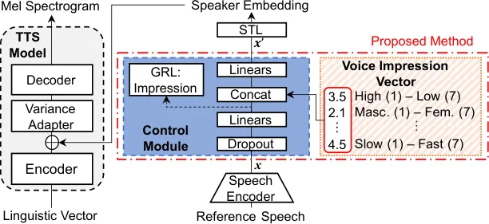
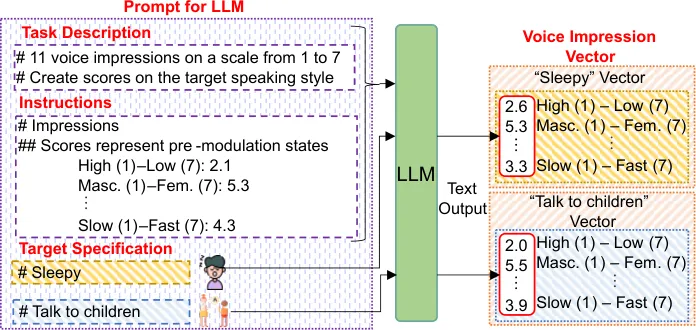
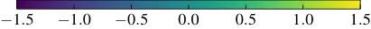

Fujita Horiguchi Ijima nocounter\]NTT, Inc.Japan

# Voice Impression Control in Zero-Shot TTS

Kenichi    Shota    Yusuke Affiliation: \[

###### Abstract

Para-/non-linguistic information in speech is pivotal in shaping the
listeners’ impression. Although zero-shot text-to-speech (TTS) has
achieved high speaker fidelity, modulating subtle para-/non-linguistic
information to control perceived voice characteristics, i.e.,
impressions, remains challenging. We have therefore developed a voice
impression control method in zero-shot TTS that utilizes a
low-dimensional vector to represent the intensities of various voice
impression pairs (e.g., dark–bright). The results of both objective and
subjective evaluations have demonstrated our method’s effectiveness in
impression control. Furthermore, generating this vector via a large
language model enables target-impression generation from a natural
language description of the desired impression, thus eliminating the
need for manual optimization.

###### keywords

speech synthesis, zero-shot TTS, speaker embeddings, voice impression

^(†)^(†)email: kenichi.fujita@ntt.com

## 1 Introduction

Speech contains both linguistic and para-/non-linguistic
information \[1\]. Para-/non-linguistic information adds variations to
the spoken content, shaping the listeners’ impressions. To achieve
human-like expressive speech synthesis, control over various voice
qualities, speaking styles, and perceived impressions is essential.
While advances in zero-shot text-to-speech (TTS) synthesis have enabled
natural-sounding speech generation from a few seconds of reference
speech \[2, 3, 4\], its controllability is still challenging. Most
zero-shot TTS systems struggle to control the impression of the
generated utterances and can only mimic the speaker’s characteristics
and the speaking style of the provided reference speech.

This challenge arises because the representations extracted from the
reference speech are often entangled with factors such as pitch, rhythm,
and speaking style, thereby hindering intuitive control. In response,
efforts have been made to disentangle prosody, content, and acoustic
details in speech representations \[5, 6\]. However, these methods only
disentangle above basic features, thus limiting intuitive control over
high-level voice impressions. Another promising approach involves
leveraging emotion-related auxiliary information \[7, 8, 9, 10, 11\].
Methods in this vein have demonstrated some effectiveness even in
zero-shot scenarios \[10, 12\]. However, emotions represent only a
narrow subset of the broader characteristics that shape voice
impressions, and as such, they are insufficient to control the full
range of impressions. Using simple voice qualities is similarly
insufficient \[13\].

For diverse speech control, Tachibana et al. \[14\] utilized voice
impressions to adapt parameters in an HMM-based TTS method. However,
parameter adaptation is unsuitable for zero-shot TTS. Recent text-based
conditioning methods \[15, 16, 17, 18\] also aim for diverse speech
control via various text descriptions, but most have focused on
controlling both speaker characteristics and styles, without targeting
style control for specific speakers. Furthermore, text-based description
is often insufficient for precise control of fine details in the
generated speech.

To address this limitation, we propose a zero-shot TTS method for voice
impression control. The key idea is to use a low-dimensional voice
impression vector in which each dimension represents the intensity of an
antonym pair describing impressions (e.g., ‘‘dark--bright’’). This
vector enables intuitive and flexible voice impression control. To
integrate speaker and voice impression information, we introduce a
control module that removes impression-related information from the
speaker representation and then reintroduces it based on the impression
vector. Audio examples are available on our demo page¹¹ 1
[https://ntt-hilab-gensp.github.io/is2025voiceimpression/](https://ntt-hilab-gensp.github.io/is2025voiceimpression/).

Figure 1: Overview of proposed method.

## 2 Proposed method

An overview of the proposed TTS method is shown in Fig. 1. We conducted
the training in two steps to ensure stability. In the first step, we
pre-train a zero-shot TTS model excluding the control module to obtain a
high-quality TTS model. In the second step, we incorporate the proposed
control module to integrate speaker and voice impression information. We
train only the control module while keeping the other modules frozen.
This section explains the backbone TTS model, voice impression vector,
control module, and voice impression vector generation via a large
language model (LLM).

### 2.1 Backbone zero-shot TTS model

The model utilizes the target speaker’s embedding extracted from
reference speech to condition the TTS model. To extract the speaker
embedding, we used a speech encoder and style token layer (STL) \[19\].
The speech encoder extracts representations using a self-supervised
learning (SSL) speech model \[4\] and aggregates them into a single
embedding $`\boldsymbol{x}`$ via a weighted sum \[20\], a bidirectional
LSTM, and an attention mechanism \[21, 22\]. The STL further transforms
the embedding $`\boldsymbol{x}`$ to ensure its stability, resulting in
the speaker embedding. Joint training of the TTS model and these modules
ensures that the generated speaker embedding is well-suited for the TTS
model.

### 2.2 Voice impression vector and control module

Controlling voice impression is challenging because various types of
speaker information—including impression information—are entangled in
the embedding $`\boldsymbol{x}`$ extracted using a pre-trained speech
encoder. To achieve flexible voice impression control, we propose two
key components to 1) remove impression information coming from the
embedding $`\boldsymbol{x}`$ and 2) reintroduce it via the impression
vector.

For the first purpose, we apply adversarial learning with a gradient
reversal layer (GRL) \[23\] to remove impression information from the
embedding $`\boldsymbol{x}`$, following the emotional TTS studies \[7,
10\]. We also apply dropout with a high-ratio (0.8 in this paper) to the
embedding $`\boldsymbol{x}`$ for disentanglement \[24, 25\]. This
encourages the system to rely on the impression vector for
impression-related information while using $`\boldsymbol{x}`$ solely to
preserve target speaker characteristics.

The impression vector utilized for the second purpose is a
low-dimensional vector in which each dimension quantifies the degree or
intensity of a certain impression pair. We use the following ten pairs
of antonyms to describe impressions covering common voice quality
expressions \[26, 27\]: A) High–Low pitched, B) Masculine–Feminine, C)
Clear–Hoarse, D) Calm–Restless, E) Powerful–Weak, F) Youthful–Elderly,
G) Thick–Thin, H) Tense–Relaxed, I) Dark–Bright, and J) Cold–Warm. To
expand the controllable aspects of voice impressions, we added another
pair, K) Slow–Fast, related to speaking rate.

### 2.3 Voice impression vector generation with automatic mapping from freely described impressions using LLM

The impression vector allows for fine-grained adjustments to the target
voice impression. However, manual tuning to obtain speech with the
desired impression is labor-intensive and requires expert knowledge,
especially when the desired impression significantly differs from the
source speech or when additional information (e.g., long-context
details) must be considered. Inspired by LLM-based text-guided image
generation \[28\], we propose leveraging an LLM to generate impression
vectors automatically (Fig. 2). The prompt comprises a task description,
instructions, and the target specification. Text-based instructions,
designed to improve the consistency of the LLM predictions, define each
dimension and its corresponding scores for the utterance prior to
modulation.

The inherent adaptability of LLMs enables vector generation using
text-only prompts, effectively incorporating additional elements such as
context, speaking style, and dialogue history. A previous TTS study
utilized LLMs to adjust low-level speech features such as pitch, energy,
and duration on the basis of context \[17\]. Our method expands the
application of LLMs to generate high-level features, i.e., voice
impression vectors. Unlike prompt-based TTS methods that generate speech
in a single step, our approach offers more granular control by allowing
minimal manual adjustments to the impression vector after an initial
global style approximation guided by the LLM.

Figure 2: Voice impression vector generation via a LLM. Prompt examples
are available on our demo page1.

|     |                    | A     | B     | C     | D     | E     | F     | G     | H     | I    | J    | K    |
| --- | ------------------ | ----- | ----- | ----- | ----- | ----- | ----- | ----- | ----- | ---- | ---- | ---- |
| A ) | High–Low pitched   | 1.00  |       |       |       |       |       |       |       |      |      |      |
| B ) | Masculine–Feminine | −0.67 | 1.00  |       |       |       |       |       |       |      |      |      |
| C ) | Clear–Hoarse       | −0.61 | 0.36  | 1.00  |       |       |       |       |       |      |      |      |
| D ) | Calm–Restless      | −0.44 | 0.13  | 0.07  | 1.00  |       |       |       |       |      |      |      |
| E ) | Powerful–Weak      | 0.49  | −0.17 | −0.56 | −0.25 | 1.00  |       |       |       |      |      |      |
| F ) | Youthful–Elderly   | 0.58  | −0.22 | −0.64 | −0.37 | 0.33  | 1.00  |       |       |      |      |      |
| G ) | Thick–Thin         | −0.80 | 0.67  | 0.48  | 0.35  | −0.19 | −0.55 | 1.00  |       |      |      |      |
| H ) | Tense–Relaxed      | 0.65  | −0.30 | −0.72 | −0.26 | 0.79  | 0.51  | −0.43 | 1.00  |      |      |      |
| I ) | Dark–Bright        | −0.77 | 0.35  | 0.67  | 0.35  | −0.67 | −0.56 | 0.61  | −0.80 | 1.00 |      |      |
| J ) | Cold–Warm          | −0.35 | 0.11  | 0.41  | −0.01 | −0.23 | −0.31 | 0.32  | −0.39 | 0.56 | 1.00 |      |
| K ) | Slow–Fast          | 0.02  | −0.21 | 0.30  | −0.04 | −0.13 | −0.37 | −0.02 | −0.17 | 0.11 | 0.16 | 1.00 |

Table 1: Correlation coefficients among dimensions in voice impression
vector. Values in bold indicate strong positive or negative correlation.

## 3 Experimental setup

### 3.1 Dataset

We used our in-house 1,800-hour \SI22\kHz Japanese speech database
comprising 20,270 speakers. It was split into two parts: 1,588,847
utterances from 20,222 speakers for training and 7,278 utterances from
48 speakers for validation. All utterances were labeled with an
11-dimensional voice impression vector (see details in Sect. 3.2).

### 3.2 Collection of voice impression vectors

The scores for each dimension A) through J) of the voice impression
vectors were obtained via subjective evaluation. Given the
impracticality of subjective evaluations for all utterances due to time
and cost constraints, we adopted automatic labeling using a three-step
process: crowdsourcing subjective scores, training an impression vector
estimator, and estimating vectors for all utterances. The K) Slow–Fast
scores were calculated by standardizing speech rates (in moras per
second) across the entire dataset. The data preparation process is
detailed below.

We began by collecting subjective evaluations from 1,154 speakers in the
dataset. Each speaker’s single utterance was rated on ten impression
pairs, namely A) through J). Although only one utterance was evaluated
per speaker, we can assume that each speaker’s voice impression remained
constant across other unevaluated utterances. This assumption is
supported by the design of the TTS dataset, in which the speakers were
instructed to maintain a consistent speaking style. Participants rated
each utterance on each impression pair using a 7-point Likert scale
(e.g., 1: dark to 7: bright). Each utterance was evaluated by at least
ten participants, and the average score for each pair was utilized as
its corresponding impression vector.

To automatically label the remaining data, we trained an impression
vector estimator using utterances and their corresponding impression
vectors obtained from the subjective evaluation. The estimator
architecture comprised an SSL model followed by a bidirectional LSTM and
an attention mechanism. For the SSL model, we used the publicly
available HuBERT Base \[29\] trained on ReazonSpeech \[30\]²² 2
[https://huggingface.co/rinna/japanese-hubert-base](https://huggingface.co/rinna/japanese-hubert-base).
The model was trained to minimize the mean squared error (MSE). The
training data comprised 146,809 utterances from 1,067 speakers and 6,151
validation data from 44 speakers. All these utterances respectively
belong to the training and validation data described in Sect. 3.1. The
estimator was trained for 30 epochs, and the epoch with the lowest
validation MSE was selected. For testing, we evaluated the model using
5,719 utterances from 43 speakers not included in the training or
validation data. The root MSE was 0.338, indicating high estimation
accuracy. After training, we applied the estimator to utterances that
had not been subjectively evaluated and obtained their impression
vectors. Note that the impression pairs are not independent. Table 1
lists the correlations among the dimensions, calculated using impression
vectors obtained from subjective evaluations instead of the estimated
data.

(a)

(b)

Figure 3: Objective evaluation results for single-dimension modulation
of the voice impression vector.

### 3.3 Training conditions

The TTS model was FastSpeech2 \[31\], as implemented in a previous
study \[32\], which features four and six feed-forward Transformer
blocks in the encoder and the decoder, respectively. The inputs were
303-dimensional linguistic vectors, while the target was an
80-dimensional log-mel spectrogram with a frame shift of \SI10.0ms. We
used HuBERT Base trained on ReazonSpeech2 as the SSL model, keeping its
parameters frozen. HuBERT processed raw audio input sampled at \SI16kHz
into a 768-dimensional vector sequence, which is further converted into
fixed-length 384-dimensional speaker embedding. In the control module,
the embedding $`\boldsymbol{x}`$ (384 dimensions) and voice impression
vectors (11 dimensions) were projected to 32 dimensions. Dropout was
applied with a rate of 0.8. These hyper-parameters were determined
empirically. For waveform generation, we employed HiFi-GAN (V1) \[33\].

To ensure stable training, we initially pre-trained the backbone TTS
model for 200k steps without the control module. We used the Adam
optimizer \[34\] with the Noam scheduler \[35\]. Subsequently, we
further trained the backbone TTS model using a GAN \[36, 37\] for an
additional 200k steps at a fixed learning rate of 0.001 to improve
quality. Finally, we inserted the control module and trained it with the
same training data for an additional 50k steps. During this stage, we
employed the same GAN with its associated loss function for adversarial
training, and all modules except the control module were frozen.

## 4 Results

### 4.1 Objective evaluation

We conducted three objective evaluations to verify impression
controllability and its effect on speaker similarity. We selected two
speakers—Speaker 1 (female) and Speaker 2 (male)—not present in training
or validation data, and chose one utterance from each as the reference
speech. This implies that the generation is in a zero-shot condition. We
generated 50 utterances per condition in each of the following
experiments. To evaluate the degree of change in impression, we
repurposed the impression estimator, originally prepared for data
generation.

First, we modulated one dimension of the impression vector corresponding
to the reference speech. The modulation ranged from −3 to +3 relative to
its original value. The proposed model takes a voice impression vector
itself as input, but from the perspective of impression controllability,
we report the results based on the modulation levels of the vector.
Figure 3 illustrates the changes in the impression of the modulated
dimensions. The consistent upward trend across all dimensions for both
Speaker 1 and Speaker 2 indicates that changes in the impression vector
correspond to changes in the impression.

(a)

(b)

Figure 4: Change in scores when two dimensions (E and H) are
simultaneously modulated.

Second, we examined simultaneous two-dimensional modulation because, in
many cases, we must modulate more than one dimension at the same time to
achieve the desired impression using manual or LLM modulation. We
selected dimensions E and H because of their high correlation (Table 1).
The modulation level ranged from −3 to +3. We then analyzed the changes
in the corresponding impression vector dimensions (E and H) estimated
from the generated speech. Figure 4 presents the results for Speaker 1,
where it is clear that even with the simultaneous modulation, the
generated speech consistently reflected the intended changes. Note that
the same tendency was observed for Speaker 2 and other dimensions. These
experiments demonstrate that our proposed method successfully alters the
impressions corresponding to the modulated dimensions.

Finally, we used Resemblyzer³³ 3
[https://github.com/resemble-ai/Resemblyzer](https://github.com/resemble-ai/Resemblyzer)
to evaluate the impact of modulation on speaker identity. In Fig. 5, we
analyzed how the cosine similarity between the generated utterance and
the reference speech transitioned as the modulation level changed from 0
to $`\pm 1`$, $`\pm 2`$, and $`\pm 3`$. For comparison, we also show the
average cosine similarity to different recorded speech of the same
speaker, as well as the distribution of cosine similarities to that of
different speakers of the same gender (20 female and 21 male speakers,
respectively). As shown, greater modulation reduced similarity; however,
modulated utterances were still more similar than those from different
speakers. This suggests that the proposed method achieves noticeable
changes in voice impression while minimizing deterioration in speaker
similarity. Some outliers are due to large changes in pitch, e.g.,
resulting from modulation in the B) Masculine–Feminine dimension.

(a)

(b)

Figure 5: Speaker similarity to target speaker’s reference speech
evaluated with Resemblyzer. “self” denotes generated utterances with and
without modulation, with levels of $`\pm 1`$, $`\pm 2`$, and $`\pm 3`$.
“self/others (rec)” denotes different recorded speech of the same
speaker and the recorded speech of different speakers of the same
gender, respectively.

|           |      | Modulation level |                  |                  |                  |
| --------- | ---- | ---------------- | ---------------- | ---------------- | ---------------- |
| Speaker   | Dim. | −3               | −1.5             | +1.5             | +3               |
| Speaker 1 | B    | $`3.39\pm 0.19`$ | $`3.89\pm 0.18`$ | $`4.14\pm 0.20`$ | $`4.33\pm 0.24`$ |
|           | E    | $`3.44\pm 0.14`$ | $`3.61\pm 0.11`$ | $`4.30\pm 0.12`$ | $`4.68\pm 0.13`$ |
|           | F    | $`3.35\pm 0.17`$ | $`3.61\pm 0.16`$ | $`5.03\pm 0.14`$ | $`5.70\pm 0.15`$ |
|           | I    | $`3.03\pm 0.17`$ | $`3.48\pm 0.14`$ | $`4.59\pm 0.14`$ | $`4.85\pm 0.19`$ |
| Speaker 2 | B    | $`3.45\pm 0.21`$ | $`3.71\pm 0.20`$ | $`4.46\pm 0.18`$ | $`4.71\pm 0.17`$ |
|           | E    | $`3.37\pm 0.14`$ | $`3.68\pm 0.10`$ | $`4.38\pm 0.12`$ | $`4.71\pm 0.16`$ |
|           | F    | $`3.86\pm 0.15`$ | $`3.97\pm 0.12`$ | $`4.08\pm 0.12`$ | $`4.54\pm 0.16`$ |
|           | I    | $`3.20\pm 0.15`$ | $`3.56\pm 0.12`$ | $`4.42\pm 0.12`$ | $`4.66\pm 0.14`$ |

Table 2: Results of subjective evaluation on voice impression scores
with 95% confidence interval.

### 4.2 Subjective evaluation

We conducted subjective evaluations of the controllability and
naturalness of the proposed method. Referring to Table 1, we selected
four weakly correlated dimensions: B) Masculine–Feminine, E)
Powerful–Weak, F) Youthful–Elderly, and I) Dark–Bright. We then
modulated each impression vector dimension using the values −3.0, −1.5,
+1.5, and +3.0. For each modulation level, we synthesized 12 sentences
for each speaker, Speaker 1 and Speaker 2. The experiments for
controllability and naturalness were conducted on a crowdsourcing
platform with 478 and 178 participants, respectively, and each utterance
was evaluated at least ten times.

To evaluate controllability, each participant was instructed to listen
to pairs of samples—each consisting of one with voice impression
modulation and one without—and rate the impression difference using a
7-point Likert scale (e.g., 1: dark to 7: bright). The order of the two
samples was randomized. Table 2 lists the results. The changes in voice
impression align with the respective modulations, with larger modulation
widths resulting in greater impression changes.

The naturalness was evaluated using a mean opinion score (MOS) on a
five-point scale (5: very natural to 1: very unnatural). Naturalness was
assessed to detect quality degradation introduced by the impression
modulation. The results in Table 3 show some degradation in naturalness
but most speech samples with low naturalness scores exhibited outlier
expressions, such as “feminine male,” “weak,” and “strongly dark/bright”
utterances. Compared to neutral utterances, their expressions could
convey less naturalness.

|           |      | Modulation level     |                      |                  |                      |                      |
| --------- | ---- | -------------------- | -------------------- | ---------------- | -------------------- | -------------------- |
| Speaker   | Dim. | −3                   | −1.5                 | 0                | +1.5                 | +3                   |
| Speaker 1 | B    | $`3.55\pm 0.22`$     | $`3.74\pm 0.18`$     | $`3.72\pm 0.18`$ | $`3.84\pm 0.19`$     | $`3.66\pm 0.19`$     |
|           | E    | $`3.62\pm 0.20`$     | $`3.72\pm 0.19`$     | $`3.72\pm 0.18`$ | $`\bf 3.36\pm 0.22`$ | $`\bf 3.18\pm 0.22`$ |
|           | F    | $`\bf 3.20\pm 0.19`$ | $`\bf 3.34\pm 0.20`$ | $`3.72\pm 0.18`$ | $`3.72\pm 0.19`$     | $`3.45\pm 0.22`$     |
|           | I    | $`\bf 3.02\pm 0.25`$ | $`\bf 3.18\pm 0.21`$ | $`3.72\pm 0.18`$ | $`3.55\pm 0.18`$     | $`\bf 2.71\pm 0.24`$ |
| Speaker 2 | B    | $`3.51\pm 0.18`$     | $`3.56\pm 0.16`$     | $`3.61\pm 0.14`$ | $`3.46\pm 0.18`$     | $`\bf 3.07\pm 0.20`$ |
|           | E    | $`\bf 3.35\pm 0.19`$ | $`3.64\pm 0.17`$     | $`3.61\pm 0.14`$ | $`\bf 3.21\pm 0.18`$ | $`\bf 2.88\pm 0.20`$ |
|           | F    | $`3.46\pm 0.20`$     | $`3.60\pm 0.16`$     | $`3.61\pm 0.14`$ | $`3.43\pm 0.18`$     | $`\bf 3.23\pm 0.17`$ |
|           | I    | $`\bf 3.18\pm 0.19`$ | $`\bf 3.33\pm 0.17`$ | $`3.61\pm 0.14`$ | $`3.38\pm 0.18`$     | $`\bf 2.78\pm 0.22`$ |

Table 3: Results of subjective evaluation on naturalness scores with 95%
confidence interval. Bold numbers indicate $`p<.05`$ in the difference
to No modulation (0).

| Target impression          | Speaker 1 |          | Speaker 2 |      | All  |          |
| -------------------------- | --------- | -------- | --------- | ---- | ---- | -------- |
| Sleepy                     | 98.5      | 1.5 vs.  | 91.0      | 9.0  | 94.6 | 5.4 vs.  |
| Urgent, attention grabbing | 67.4      | 32.6 vs. | 81.9      | 18.1 | 74.6 | 25.4 vs. |

Table 4: Preference scores (%) of AB test between LLM-based generation
(left) vs. no modulation (right). Bold numbers indicate the
significantly preferred method with $`p<.05`$.

### 4.3 Evaluation of voice impression vector generation using an LLM

We conducted a subjective evaluation of voice impression generation
using an LLM. We selected one utterance each from Speaker 1 and Speaker
2, and generated them to convey the impressions of “sleepy” and “urgent,
attention-grabbing,” respectively. These impressions were chosen because
their complexity exceeds the emotion-based methods or simple dimensional
adjustments in this study. Although we utilized simple expressions for
simplicity, more detailed contexts and scenarios could be specified. We
used ChatGPT-4o \[38\] for the LLM.

Subjective evaluations were conducted via crowdsourcing with 436
participants. In the test, participants listened to pairs of samples:
one generated using LLM and one without. For each pair, they selected
one sample that better matched the target impression. The experimental
results, summarized in Table 4, show a significant preference for the
sample with the target impression generated using LLM. These results
demonstrate that leveraging an LLM enables us to achieve the desired
voice expressions without direct vector modulation. Audio examples and
generated impression vectors from the LLM are available on our demo
page1.

## 5 Conclusion

We introduced a voice impression control method in zero-shot TTS
utilizing a voice impression vector. Objective and subjective
evaluations demonstrated that the proposed method controls voice
impression while preserving speaker similarity to the reference speech.
Moreover, our findings confirmed the feasibility of controlling voice
impressions with an LLM via the proposed vector. Future work will
involve voice impression constraints on neural audio codecs—similar to
the approach used in NaturalSpeech3 \[6\], which emphasizes prosody and
acoustic details—and evaluating the effectiveness.

## References

- \[1\] A. S. Cowen, H. A. Elfenbein, P. Laukka, and D. Keltner (2019)
  Mapping 24 emotions conveyed by brief human vocalization.. American
  Psychologist 74 (6), pp. 698. Cited by: §1.
- \[2\] E. Cooper, C. Lai, Y. Yasuda, F. Fang, X. Wang, N. Chen, and J.
  Yamagishi (2020) Zero-shot multi-speaker text-to-speech with
  state-of-the-art neural speaker embeddings. In Proc. ICASSP,
  pp. 6184–6188. Cited by: §1.
- \[3\] S. Chen, C. Wang, Y. Wu, Z. Zhang, L. Zhou, S. Liu, Z. Chen, Y.
  Liu, H. Wang, J. Li, L. He, S. Zhao, and F. Wei (2025) Neural codec
  language models are zero-shot text to speech synthesizers. TASLP 33,
  pp. 705–718. External Links:
  [Document](https://dx.doi.org/10.1109/TASLPRO.2025.3530270) Cited by:
  §1.
- \[4\] K. Fujita, T. Ashihara, H. Kanagawa, T. Moriya, and Y.
  Ijima (2023) Zero-shot text-to-speech synthesis conditioned using
  self-supervised speech representation model. In Proc. ICASSP Workshops
  (ICASSPW), pp. 1–5. Cited by: §1, §2.1.
- \[5\] A. Polyak, Y. Adi, J. Copet, E. Kharitonov, K. Lakhotia, W.
  Hsu, A. Mohamed, and E. Dupoux (2021) Speech resynthesis from discrete
  disentangled self-supervised representations. In Proc. Interspeech,
  pp. 3615–3619. Cited by: §1.
- \[6\] Z. Ju, Y. Wang, K. Shen, X. Tan, D. Xin, D. Yang, Y. Liu, Y.
  Leng, K. Song, S. Tang, Z. Wu, T. Qin, X. Li, W. Ye, S. Zhang, J.
  Bian, L. He, J. Li, and S. Zhao (2024) NaturalSpeech 3: zero-shot
  speech synthesis with factorized codec and diffusion models. In Proc.
  ICML, Cited by: §1, §5.
- \[7\] T. Li, X. Wang, Q. Xie, Z. Wang, and L. Xie (2022) Cross-speaker
  emotion disentangling and transfer for end-to-end speech synthesis.
  TASLP 30 (), pp. 1448–1460. Cited by: §1, §2.2.
- \[8\] S. Pan and L. He (2021) Cross-speaker style transfer with
  prosody bottleneck in neural speech synthesis. In Proc. Interspeech,
  pp. 4678–4682. Cited by: §1.
- \[9\] S. Sivaprasad, S. Kosgi, and V. Gandhi (2021) Emotional prosody
  control for speech generation. In Proc. Interspeech, pp. 4653–4657.
  External Links:
  [Document](https://dx.doi.org/10.21437/Interspeech.2021-307), ISSN
  2958-1796 Cited by: §1.
- \[10\] M. Kang, W. Han, S. J. Hwang, and E. Yang (2023) ZET-speech:
  zero-shot adaptive emotion-controllable text-to-speech synthesis with
  diffusion and style-based models. In Proc. Interspeech, pp. 4339–4343.
  External Links:
  [Document](https://dx.doi.org/10.21437/Interspeech.2023-754), ISSN
  2958-1796 Cited by: §1, §2.2.
- \[11\] K. Inoue, S. Hara, M. Abe, N. Hojo, and Y. Ijima (2021) Model
  architectures to extrapolate emotional expressions in DNN-based
  text-to-speech. Speech Communication 126, pp. 35–43. Cited by: §1.
- \[12\] D. Cho, H. Oh, S. Kim, and S. Lee (2025) EmoSphere++:
  emotion-controllable zero-shot text-to-speech via emotion-adaptive
  spherical vector. IEEE Transactions on Affective Computing (),
  pp. 1–16. Cited by: §1.
- \[13\] F. Rautenberg, M. Kuhlmann, F. Seebauer, J. Wiechmann, P.
  Wagner, and R. Haeb-Umbach (2025) Speech synthesis along perceptual
  voice quality dimensions. In Proc. ICASSP, Note: accepted Cited by:
  §1.
- \[14\] M. Tachibana, T. Nose, J. Yamagishi, and T. Kobayashi (2006) A
  technique for controlling voice quality of synthetic speech using
  multiple regression HSMM. In Proc. Interspeech, pp. 2438–2441. Cited
  by: §1.
- \[15\] Z. Guo, Y. Leng, Y. Wu, S. Zhao, and X. Tan (2023) PromptTTS:
  controllable text-to-speech with text descriptions. In Proc. ICASSP,
  pp. 1–5. Cited by: §1.
- \[16\] M. Kawamura, R. Yamamoto, Y. Shirahata, T. Hasumi, and K.
  Tachibana (2024) LibriTTS-P: a corpus with speaking style and speaker
  identity prompts for text-to-speech and style captioning. In Proc.
  Interspeech, pp. 1850–1854. Cited by: §1.
- \[17\] A. Sigurgeirsson and S. King (2024) Controllable speaking
  styles using a large language model. In Proc. ICASSP, Vol. ,
  pp. 10851–10855. Cited by: §1, §2.3.
- \[18\] D. Yang, S. Liu, R. Huang, C. Weng, and H. Meng (2024)
  InstructTTS: modelling expressive TTS in discrete latent space with
  natural language style prompt. TASLP 32, pp. 2913–2925. Cited by: §1.
- \[19\] Y. Wang, D. Stanton, Y. Zhang, R. Ryan, E. Battenberg, J.
  Shor, Y. Xiao, Y. Jia, F. Ren, and R. A. Saurous (2018) Style Tokens:
  unsupervised style modeling, control and transfer in end-to-end speech
  synthesis. In Proc. ICML, Vol. 80, pp. 5180–5189. Cited by: §2.1.
- \[20\] S. Chen, Y. Wu, C. Wang, S. Liu, Z. Chen, P. Wang, et
  al. (2022) Why does self-supervised learning for speech recognition
  benefit speaker recognition?. In Proc. Interspeech, pp. 3699–3703.
  Cited by: §2.1.
- \[21\] C. Raffel and D. P. W. Ellis (2016) Feed-forward networks with
  attention can solve some long-term memory problems. In Proc. ICLR
  Workshop, Cited by: §2.1.
- \[22\] A. Ando, S. Kobashikawa, H. Kamiyama, R. Masumura, Y. Ijima,
  and Y. Aono (2018) Soft-target training with ambiguous emotional
  utterances for DNN-based speech emotion classification. In Proc.
  ICASSP, pp. 4964–4968. Cited by: §2.1.
- \[23\] Y. Ganin and V. Lempitsky (2015) Unsupervised domain adaptation
  by backpropagation. In Proc. ICML, Vol. 37, pp. 1180–1189. Cited by:
  §2.2.
- \[24\] A. Jaiswal, R. Y. Wu, W. Abd-Almageed, and P. Natarajan (2018)
  Unsupervised adversarial invariance. In Proc. NeurIPS, Vol. 31. Cited
  by: §2.2.
- \[25\] R. Peri, M. Pal, A. Jati, K. Somandepalli, and S.
  Narayanan (2020) Robust speaker recognition using unsupervised
  adversarial invariance. In Proc. ICASSP, pp. 6614–6618. Cited by:
  §2.2.
- \[26\] M. Nagano, Y. Ijima, and S. Hiroya (2025) The influence of
  semantic primitives in an emotion-mediated willingness to buy model
  from advertising speech. Acoustical Science and Technology 46 (1),
  pp. 87–95. Cited by: §2.2.
- \[27\] H. Kido and H. Kasuya (1999) Extraction of everyday expression
  associated with voice quality of normal utterance. Journal of ASJ 55
  (6), pp. 405–411. Note: (In Japanese with English title) Cited by:
  §2.2.
- \[28\] L. Lian, B. Li, A. Yala, and T. Darrell (2024) LLM-grounded
  diffusion: enhancing prompt understanding of text-to-image diffusion
  models with large language models. TMLR. Note: Featured Certification
  Cited by: §2.3.
- \[29\] W. Hsu, B. Bolte, Y. H. Tsai, K. Lakhotia, R. Salakhutdinov,
  and A. Mohamed (2021) HuBERT: self-supervised speech representation
  learning by masked prediction of hidden units. TASLP 29,
  pp. 3451–3460. Cited by: §3.2.
- \[30\] Y. Yin, D. Mori, and S. Fujimoto (2023) ReazonSpeech: a free
  and massive corpus for Japanese ASR. In Proc. Annual Meeting of the
  Association for NLP, pp. 1134–1139. Cited by: §3.2.
- \[31\] Y. Ren, C. Hu, X. Tan, T. Qin, S. Zhao, Z. Zhao, and T.
  Liu (2020) FastSpeech 2: fast and high-quality end-to-end text to
  speech. In Proc. ICLR, Cited by: §3.3.
- \[32\] C. Chien, J. Lin, C. Huang, P. Hsu, and H. Lee (2021)
  Investigating on incorporating pretrained and learnable speaker
  representations for multi-speaker multi-style text-to-speech. In Proc.
  ICASSP, pp. 8588–8592. Cited by: §3.3.
- \[33\] J. Kong, J. Kim, and J. Bae (2020) HiFi-GAN: generative
  adversarial networks for efficient and high fidelity speech synthesis.
  In Proc. NeurIPS, Vol. 33, pp. 17022–17033. Cited by: §3.3.
- \[34\] D. P. Kingma and J. Ba (2015) Adam: a method for stochastic
  optimization. In Proc. ICLR, Cited by: §3.3.
- \[35\] A. Vaswani, N. Shazeer, N. Parmar, J. Uszkoreit, L.
  Jones, A. N. Gomez, et al. (2017) Attention is all you need. In Proc.
  NeurIPS, Vol. 30, pp. . Cited by: §3.3.
- \[36\] H. Kanagawa and Y. Ijima (2019) Multi-speaker modeling for
  DNN-based speech synthesis incorporating generative adversarial
  networks. In Proc. SSW, pp. 40–44. Cited by: §3.3.
- \[37\] X. B. Peng, A. Kanazawa, S. Toyer, P. Abbeel, and S.
  Levine (2019) Variational discriminator bottleneck: improving
  imitation learning, inverse RL, and GANs by constraining information
  flow. In Proc. ICLR, Cited by: §3.3.
- \[38\] OpenAI (2024) Hello GPT-4o. Note: Accessed:2024-02-14 Cited by:
  §4.3.
