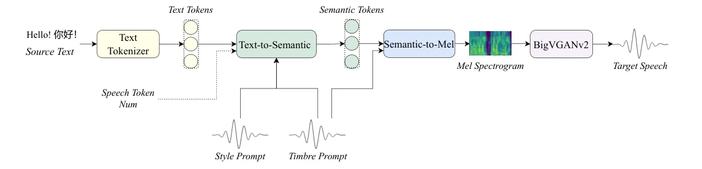
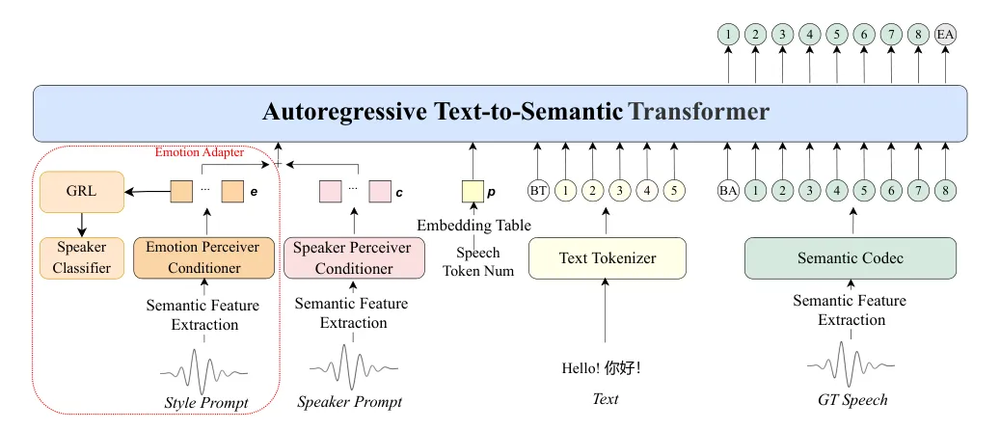
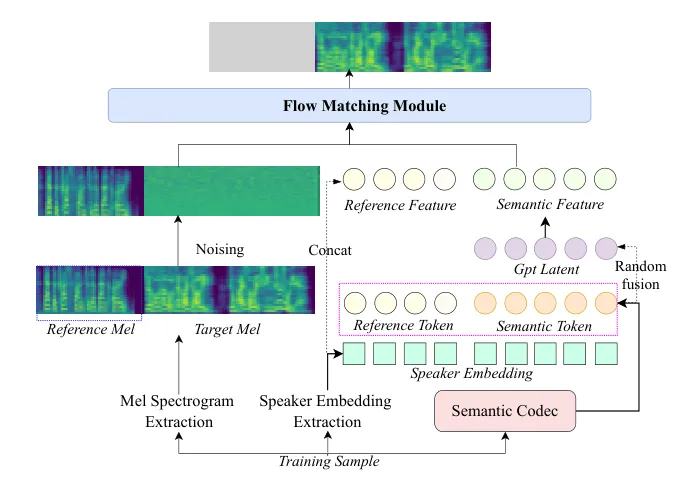
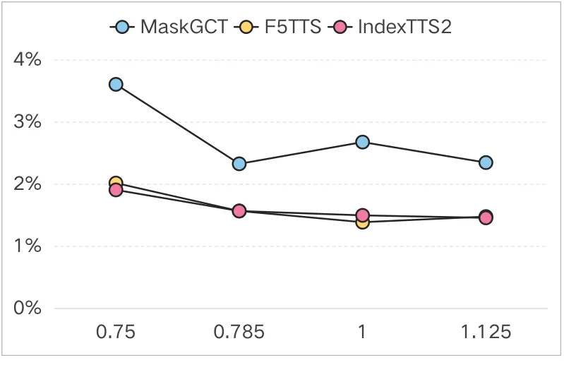
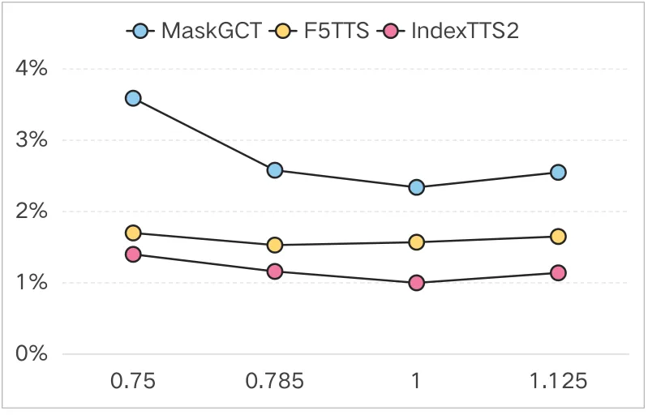

# IndexTTS2: A Breakthrough in Emotionally Expressive and Duration-Controlled Auto-Regressive Zero-Shot Text-to-Speech

Siyi Zhou    Yiquan Zhou    Yi He    Xun Zhou    Jinchao Wang    Wei
Deng    Jingchen Shu

###### Abstract

Existing autoregressive large-scale text-to-speech (TTS) models have
advantages in speech naturalness, but their token-by-token generation
mechanism makes it difficult to precisely control the duration of
synthesized speech. This becomes a significant limitation in
applications requiring strict audio-visual synchronization, such as
video dubbing. This paper introduces IndexTTS2, which proposes a novel,
general, and autoregressive model-friendly method for speech duration
control. The method supports two generation modes: one explicitly
specifies the number of generated tokens to precisely control speech
duration; the other freely generates speech in an autoregressive manner
without specifying the number of tokens, while faithfully reproducing
the prosodic features of the input prompt. Furthermore, IndexTTS2
achieves disentanglement between emotional expression and speaker
identity, enabling independent control over timbre and emotion. In the
zero-shot setting, the model can accurately reconstruct the target
timbre (from the timbre prompt) while perfectly reproducing the
specified emotional tone (from the style prompt). To enhance speech
clarity in highly emotional expressions, we incorporate GPT latent
representations and design a novel three-stage training paradigm to
improve the stability of the generated speech. Additionally, to lower
the barrier for emotional control, we designed a soft instruction
mechanism based on text descriptions by fine-tuning Qwen3, effectively
guiding the generation of speech with the desired emotional orientation.
Finally, experimental results on multiple datasets show that IndexTTS2
outperforms state-of-the-art zero-shot TTS models in terms of word error
rate, speaker similarity, and emotional fidelity. Audio samples are
available at:

https://index-tts.github.io/index-tts2.github.io/.

¹Artificial Intelligence Platform Department, bilibili, China

zhousiyi02@bilibili.com, zhouyiquan01@bilibili.com, heyi05@bilibili.com,
zhouxun@bilibili.com, wangjinchao@bilibili.com, xuanwu@bilibili.com,
shujingchen@bilibili.com,

## Introduction



Figure 1: The overview of IndexTTS2.

Recent advances in vector quantization (van den Oord, Vinyals, and
Kavukcuoglu 2017; Mentzer et al. 2023), Transformer architectures
(Vaswani et al. 2017; Touvron et al. 2023), and large-scale data have
enabled zero-shot TTS models to synthesize speech with timbre, prosody,
and emotion from minimal audio prompts (Shen et al. 2024; Casanova
et al. 2024; Du et al. 2024b). These models outperform traditional
systems (Ren et al. 2022; Kim et al. 2020) in naturalness and
flexibility, enabling applications like AI dubbing (Cong et al. 2025).
Current TTS models are categorized into autoregressive (AR) (Sahipjohn
et al. 2024; Li et al. 2025; Kim, Hong, and Choi 2023; Du et al. 2024a;
Zhou et al. 2024; Chen et al. 2024a; Wang et al. 2025; Guo et al. 2024)
and non-autoregressive (NAR) (Chen et al. 2025; Lee et al. 2024; Shen
et al. 2024; Yang et al. 2024; Wang et al. 2024; Le et al. 2023; Eskimez
et al. 2024) systems. AR-based zero-shot TTS models like XTTS (Casanova
et al. 2024), Cosyvoice (Du et al. 2024a; Du et al. 2024b), and SparkTTS
(Wang et al. 2025) show significant performance in terms of naturalness
and expressiveness owing to their random sampling strategy and
token-by-token generation. NAR-based models such as MaskGCT (Wang et al. 2024) and F5-TTS (Chen et al. 2024b) enable fast inference via parallel
decoding and support flexible parameter control (e.g., duration) through
human intervention or model autonomy. However, AR models face challenges
in duration control due to their sequential generation nature, limiting
their applicability in time-sensitive scenarios like automated dubbing.
Additionally, while TTS models excel in timbre reproduction, their
emotional expression remains limited by scarce training data. Existing
methods for emotional expression include emotion labels in training data
(Zhou et al. 2023; Qi et al. 2024), mapping natural language
descriptions with emotion audio via CLAP (Elizalde et al. 2023; Radford
et al. 2021), instruction fine-tuning (Du et al. 2024b), and reference
to emotional audio (Zhou et al. 2024), but these approaches lack
robustness in affective range and control precision.

We introduce IndexTTS2 (Figure 1), a novel zero-shot speech generation
model that addresses both fixed-duration speech generation and
natural-duration speech synthesis while enhancing emotional
expressiveness. The model comprises three core modules: the
Text-to-Semantic (T2S) module, the Semantic-to-Mel (S2M) module, and the
Vocoder. The T2S module employs an autoregressive transformer framework
to generate semantic tokens from text, timbre/style prompts, and an
optional speech token count. Under specified token count constraints, a
duration encoding mechanism ensures fixed-length token sequences with
preserved semantic integrity. For emotional modeling, the T2S module
extracts emotional features from style prompts and uses a Gradient
Reversal Layer (GRL) (Ganin et al. 2016; Ju et al. 2024) to eliminate
emotion-irrelevant information during training. A multi-stage training
strategy is adopted to overcome the lack of high-quality emotional data
and enhance expressive capabilities. To enable natural language emotion
control in speech synthesis, we further design a Text-to-Emotion (T2E)
module, distilling Deepseek-r1’s (Guo et al. 2025) emotion distribution
prediction ability into Qwen-3-1.7b (Yang et al. 2025) via Low-Rank
Adaptation (LoRA) (Sundaram, Du, and Zhao 2019; Devalal and Karthikeyan
2018; Bor, Vidler, and Roedig 2016), and combine these probabilities
with precomputed emotion embeddings to condition the T2S output. The S2M
module generates mel-spectrograms via a non-autoregressive architecture,
incorporating GPT latent representations to stabilize speech clarity
during intense emotional expressions. The Vocoder module utilizes
BigVGANv2 (Lee et al. 2023) to convert mel-spectrograms into audio
waveforms.

The key contributions of this work are:

- $`\bullet`$
  We propose a duration adaptation scheme for autoregressive TTS models.
  IndexTTS2 is the first autoregressive zero-shot TTS model to combine
  precise duration control with natural duration generation, and the
  method is scalable for any autoregressive large-scale TTS model.
- $`\bullet`$
  The emotional and speaker-related features are decoupled from the
  prompts, and a feature fusion strategy is designed to maintain
  semantic fluency and pronunciation clarity during emotionally rich
  expressions. Furthermore, a tool was developed for emotion control,
  utilising natural language descriptions for the benefit of users.
- $`\bullet`$
  To address the lack of highly expressive speech data, we propose an
  effective training strategy, significantly enhancing the emotional
  expressiveness of zeroshot TTS to State-of-the-Art (SOTA) level.
- $`\bullet`$
  We will publicly release the code and pre-trained weights to
  facilitate future research and practical applications.



Figure 2: Autoregressive Text-to-Semantic Module. When speech token num
is specified, precise control of the number of synthesized semantic
tokens is performed. The emotion adapter (red dashed lines) is employed
to extract emotional features from the style prompt, which are then used
as input to the Text-to-Semantic process for the reconstruction of
emotions.

## Related Work

#### Precise Duration Control for Large-Scale TTS.

Current zero-shot large-scale TTS models adopt autoregressive or
non-autoregressive paradigms, with non-autoregressive approaches
excelling in duration control via duration predictors based on
diffusion, transformers (Lee et al. 2024), flows (Kim, Hong, and Choi
2023), or language models (Yang et al. 2024). Methods like MaskGCT (Wang
et al. 2024) use flow modeling for phoneme-level duration predictors
based on diffusion, transformers (Lee et al. 2024), flows (Kim, Hong,
and Choi 2023), or language models (Yang et al. 2024). Methods like
MaskGCT (Wang et al. 2024) use flow modeling for phoneme-level
durations, while F5-TTS (Chen et al. 2024b) estimates durations via
text-speech length ratios. Autoregressive models (e.g., VoxInstruct
(Zhou et al. 2024), Takin (Chen et al. 2024a)) rely on natural language
instructions but face precision limitations. Techniques like CosyVoice
(Du et al. 2024a), Spark-TTS (Wang et al. 2025), DubWise (Sahipjohn
et al. 2024), and FleSpeech (Li et al. 2025) address token generation
control through specialized cues, attribute labels, cross-modal fusion,
or multimodal embeddings. This work introduces an enhanced
autoregressive TTS model with precise token number control to overcome
these challenges.

#### Emotionally Controllable Large-Scale TTS.

Emotion control in large-scale TTS leverages natural language
descriptions (e.g., Controlspeech (Ji et al. 2024)), with CosyVoice (Du
et al. 2024a) using preset instructions and EmoSphere++ (Cho et al. 2025) generating interpretable style embeddings. StyleTTS 2 (Li et al. 2023) employs diffusion-based style vectors, SC VALL-E (Kim, Hong, and
Choi 2023) integrates style networks, and Vevo (Zhang et al. 2025) uses
content-style token systems. Multimodal approaches like FleSpeech (Li
et al. 2025) embed textual, audio, and visual cues into unified
representations for precise regulation. This work enhances emotional
expressiveness via additional emotion features, enabling flexible
control through natural language or reference audio inputs.

## Proposed Method

We propose IndexTTS2, a cascaded autoregressive zero-shot TTS system
comprising three modules: the Text-to-Semantic (T2S) module,
Semantic-to-Mel (S2M) module, and BigVGANv2 vocoder, each trained
separately with tailored strategies to enhance emotional expressiveness.
The T2S module generates semantic tokens from target text, style/timbre
prompts, and an optional speech token count, while the S2M module
predicts mel-spectrograms using these tokens and the timbre prompt. The
BigVGANv2 vocoder then converts the mel-spectrograms into speech
waveforms. To enable natural language-based emotional control, we
introduce a Text-to-Emotion (T2E) module that produces an emotion vector
from input text, which is integrated into the T2S module via a dedicated
emotion vector interface. This design facilitates flexible, high-quality
emotional speech synthesis through explicit natural language
instructions or reference audio inputs.

### Autoregressive Text-to-Semantic Module (T2S)

We formulate T2S as an autoregressive semantic token prediction task. As
shown in Figure 2, the input sequence is constructed as
$`[c,p,e_{\langle BT\rangle},E_{text},e_{\langle BA\rangle},E_{sem}]`$,
where $`c`$ denotes speaker attributes, $`p`$ controls duration,
$`E_{text}`$ represents text embeddings, and $`E_{sem}`$ denotes the
embeddings of semantic tokens extracted from ground-truth speech via a
semantic codec. $`e_{\langle BT\rangle}`$ and $`e_{\langle BA\rangle}`$
function as dedicated boundary tokens, serving to demarcate the extents
of the text sequence and the semantic sequence, respectively. Our
architecture resembles IndexTTS (Deng et al. 2025) with key innovations
in duration and emotion control.

#### Duration Control:

Duration regulation is achieved through a dedicated embedding $`p`$
computed from the target semantic token length $`T`$, where
$`p=W_{\text{num}}h(T)`$. Here,
$`W_{\text{num}}\in\mathbb{R}^{L_{\text{speech}}\times D}`$ represents
an embedding table with $`L_{\text{speech}}`$ denoting the maximum
semantic sequence length and $`D`$ being the embedding dimensionality.
The function $`h(T)`$ returns a one-hot vector corresponding to $`T`$
(Rodríguez et al. 2018). In particular, we implemented a special trick.
We set the constraint $`W_{\text{sem}}=W_{\text{num}}`$ is imposed
between $`W_{\text{num}}`$ and the semantic positional embedding table
$`W_{\text{sem}}`$. This equation enables the autoregressive system to
precisely align positional information with target duration information
during generation, thereby accurately producing sequences of the desired
length.

#### Emotional Control:

Emotion synthesis integrates an emotion embedding $`e`$ into the
conditioning feature via the input sequence
$`[c+e,p,e_{\langle BT\rangle},E_{\text{text}},e_{\langle BA\rangle},E_{\text{sem}}]`$,
where $`e`$ is extracted from style prompts using a Conformer-based
emotion perceiver conditioner. To effectively capture the representation
of emotional rhythm, we employ the following design: the speaker feature
$`c`$ is derived from a pre-trained speaker perceiver conditioner
extractor and primarily encodes timbral characteristics. To minimize the
content overlap between $`e`$ and $`c`$ while enhancing feature
disentanglement, we employ a GRL during training. This adversarial
mechanism forces $`e`$ to exclusively capture emotional and rhythmic
attributes, remaining invariant to speaker-specific timbre
characteristics, thereby enabling more precise and robust control over
global emotional prosody generation.

#### Training and Inference:

Our training data is organized by speaker, with each speaker having at
least two utterances. For prompt and target partitioning, we divide
different utterances from the same speaker into prompts and training
targets. To enhance data diversity, we apply random speed perturbation
to both real speech and prompts using scaling coefficients $`r_{1}`$ and
$`r_{2}`$.

We employ a dedicated three-stage training strategy for the T2S module:

Stage 1: The model is trained on the full dataset using the input
sequence
$`[c,p,e_{\langle BT\rangle},E_{text},e_{\langle BA\rangle},E_{sem}]`$,
where $`c`$ is the speaker embedding and $`p`$ is the duration
embedding. To support both duration-controlled and free-form generation,
$`p`$ is randomly set to zero with a probability of 30%. This stage
establishes the model’s foundational capabilities.

Stage 2: We refine the emotion control module using the modified input
sequence
$`[c+e,p,e_{\langle BT\rangle},E_{\text{text}},e_{\langle BA\rangle},E_{\text{sem}}]`$,
where $`e`$ denotes the emotion embedding. In this stage, the speaker
perceiver conditioner (producing $`c`$) is frozen, while the emotion
perceiver conditioner remains trainable. To disentangle speaker identity
from emotional expression, a GRL and a speaker classifier are applied.
Training is conducted on a curated subset of 135 hours of high-quality
emotional speech. The joint loss function is defined as

```math
L_{\text{AR}}=-\frac{1}{T+1}\sum_{t=0}^{T}\log q(y_{t})-\alpha\log q(e), \tag{1}
```

where $`y_{T}`$ represents the end-of-sequence token
$`\textlangle EA\textrangle`$, $`q(y_{t})`$ denotes the posterior
probability of semantic tokens, $`q(e)`$ denotes the posterior
probability that $`e`$ originates from the target speaker and $`\alpha`$
is the loss coefficient.

Stage 3: To improve robustness, we freeze all feature conditioners and
perform fine-tuning on the full dataset.

During inference, duration control is achieved by setting
$`p=W_{\text{num}}h(T)`$, while free-form generation is enabled by using
$`p=\mathbf{0}`$. Emotional prosody can be directly manipulated by
providing a desired emotion vector $`e`$ as input.



Figure 3: Semantic-to-Mel module based on flow matching.

### Semantic-to-Mel Module (S2M)

As shown in Figure 3, the S2M module employs a non-regressive generation
framework based on flow matching (Lipman et al. 2023; Liu 2024; Peebles
and Xie 2023). The model synthesizes target mel-spectrograms by
combining prompt mel-spectrograms, speaker embeddings, and semantic
features. To address pronunciation issues in emotional speech
generation, we introduce GPT latent enhancement.

#### GPT Latent Enhancement:

Conditional flow matching learns an Ordinary Differential Equation
model (Chen et al. 2018) that maps samples from a noise distribution to
target mel-spectrograms, conditioned on timbre reference audio and
semantic codes generated by the T2S module.

To mitigate speech slurring in speech synthesis, especially when
synthesizing emotional speech, we introduce a novel approach leveraging
latent features from the GPT model, denoted as $`H_{\text{GPT}}`$, which
are extracted from the output of the final transformer layer in the T2S
module. Given that the T2S module is trained to convert text into rich
semantic representations using a large-scale dataset, we hypothesize
that $`H_{\text{GPT}}`$ encodes substantial textual and contextual
information. To exploit this, we fuse $`H_{\text{GPT}}`$ with the
semantic features via vector addition, forming an enhanced,
context-enriched representation. This fused feature is then used as
input to the S2M training process. Ablation studies validate that this
integration effectively reduces the word error rate in highly expressive
speech synthesis.

#### Training and Inference:

The S2M module is trained in a single stage. During training, each input
sentence is randomly split into a prompt segment and a target segment.
The mel-spectrograms corresponding to the target segment are fully
noised to form the source inputs for the diffusion process. Semantic
tokens generated by the T2S module are denoted as $`Q_{sem}`$. To
improve pronunciation robustness, a Multi-Layer Perceptron
(MLP) (Rosenblatt 1958; Rumelhart, Hinton, and Williams 1986) is
employed to randomly fuse the GPT hidden states $`H_{\text{GPT}}`$ and
the semantic tokens $`Q_{sem}`$ with 50% probability, forming the final
semantic representation $`Q_{fin}`$. Speaker embeddings, extracted via a
perceiver-based conditioner, are concatenated with $`Q_{fin}`$ to ensure
timbre consistency. The model is optimized using L1 loss (Koenker and
Bassett Jr 1978) between the predicted ($`y_{pred}`$) and target
($`y_{tar}`$) mel-spectrograms:

```math
\mathcal{L}_{L1}=\frac{1}{F\cdot D}\sum_{f=1}^{F}\sum_{d=1}^{D}|(y_{pred})_{f,d}-(y_{tar})_{f,d}|, \tag{2}
```

where $`F`$ denotes the number of frames and $`D`$ the dimensionality of
the mel-frequency bins. During inference, an ODE solver generates
mel-spectrograms from Gaussian noise, conditioned on the speaker
embeddings and the final semantic representation $`Q_{fin}`$.

### Text-to-Emotion (T2E)

We achieve the effect of natural language emotion control through the
following steps.

First, we define seven basic emotions: $`\mathcal{E}`$ = {Anger,
Happiness, Fear, Disgust, Sadness, Surprise, Neutral}. For each emotion
$`e_{i}\in\mathcal{E}`$, we extract embeddings from several relevant
emotional audio samples using the pre-trained emotion perceiver
conditioner in the T2S, forming a fixed emotion embedding set
$`\mathcal{V}`$.

Then, we use the large language model Deepseek-r1 as a teacher to map a
text input $`t`$ to a 7-dimensional emotion probability distribution:

```math
p=\text{Deepseek-r1}(t)\in\Delta^{7}, \tag{3}
```

where $`\Delta^{7}`$ is the 7-dimensional probability simplex
($`\sum_{i=1}^{7}p_{i}=1`$, $`p_{i}\geq 0`$). To enable efficient
inference with smaller models, we apply knowledge distillation to
transfer the teacher’s behavior to a smaller student model Qwen-3-1.7b.

We construct a training dataset of 1000 text-distribution pairs using
two types of prompts with Deepseek-r1:

- •
  Descriptive: “Please generate descriptive sentences that express
  {emotion}.”
- •
  Script-like: “Please generate script-like utterances that express
  {emotion}.”

For each generated sentence, we use a classification prompt to obtain
the corresponding emotion distribution:  
“Given the input sentence, return a JSON object with probabilities for
each of the 7 emotions. Probabilities must sum to 1 and be rounded to
two decimal places.”

Using this dataset, we fine-tune Qwen-3-1.7b via LoRA. The training
objective is to minimize the cross-entropy loss between the student
model’s predictions and the teacher-provided distributions:

```math
\min_{\phi}\mathbb{E}_{(t,p)\sim\mathcal{D}}\left[\text{CrossEntropy}\left(\text{Qwen-3}_{\theta+\phi}(t),p\right)\right], \tag{4}
```

where $`\theta`$ denotes the original parameters of Qwen-3-1.7b and
$`\phi`$ represents the LoRA parameters. $`t`$ refers to input text
samples from the dataset $`\mathcal{D}`$, while $`p`$ denotes the soft
probability distributions generated by the teacher model. After
training, the distilled Qwen-3-1.7b model can efficiently replace
Deepseek-r1 during inference with significantly reduced computational
cost.

Next step, the emotion vector $`e_{\text{input}}`$ is computed as a
weighted average over the emotion embedding set $`\mathcal{V}`$:

```math
e_{\text{input}}=\sum_{e\in\mathcal{E}}p_{e}\cdot\frac{1}{|\mathcal{V}_{e}|}\sum_{v\in\mathcal{V}_{e}}v. \tag{5}
```

Finally, this emotion vector is fed as a prompt into the T2S model,
enabling the generation of speech with the desired emotional
characteristics.

|                        |               |                |                      |                  |                  |                  |
| ---------------------- | ------------- | -------------- | -------------------- | ---------------- | ---------------- | ---------------- |
| Dataset                | Model         | SS$`\uparrow`$ | WER(%)$`\downarrow`$ | SMOS$`\uparrow`$ | PMOS$`\uparrow`$ | QMOS$`\uparrow`$ |
| LibriSpeech test-clean | Ground Truth  | 0.833          | 3.405                | 4.02\_(±0.22)    | 3.85\_(±0.26)    | 4.23\_(±0.12)    |
|                        | MaskGCT       | 0.790          | 7.759                | 4.12\_(±0.09)    | 3.98\_(±0.11)    | 4.19\_(±0.19)    |
|                        | F5-TTS        | 0.821          | 8.044                | 4.08\_(±0.21)    | 3.73\_(±0.27)    | 4.12\_(±0.13)    |
|                        | CosyVoice2    | 0.843          | 5.999                | 4.02\_(±0.22)    | 4.04\_(±0.28)    | 4.17\_(±0.25)    |
|                        | SparkTTS      | 0.756          | 8.843                | 4.06\_(±0.20)    | 3.94\_(±0.21)    | 4.15\_(±0.16)    |
|                        | IndexTTS      | 0.819          | 3.436                | 4.23\_(±0.14)    | 4.02\_(±0.18)    | 4.29\_(±0.22)    |
|                        | IndexTTS2     | 0.870          | 3.115                | 4.44\_(±0.12)    | 4.12\_(±0.17)    | 4.29\_(±0.14)    |
|                        | \- GPT latent | 0.887          | 3.334                | 4.33\_(±0.10)    | 4.10\_(±0.12)    | 4.17\_(±0.22)    |
| SeedTTS test-en        | Ground Truth  | 0.820          | 1.897                | 4.21\_(±0.19)    | 4.06\_(±0.25)    | 4.40\_(±0.15)    |
|                        | MaskGCT       | 0.824          | 2.530                | 4.35\_(±0.20)    | 4.02\_(±0.24)    | 4.50\_(±0.17)    |
|                        | F5-TTS        | 0.803          | 1.937                | 4.44\_(±0.14)    | 4.06\_(±0.21)    | 4.40\_(±0.12)    |
|                        | CosyVoice2    | 0.794          | 3.277                | 4.42\_(±0.26)    | 3.96\_(±0.24)    | 4.52\_(±0.15)    |
|                        | SparkTTS      | 0.755          | 1.543                | 3.96\_(±0.23)    | 4.12\_(±0.22)    | 3.89\_(±0.20)    |
|                        | IndexTTS      | 0.808          | 1.844                | 4.67\_(±0.16)    | 4.52\_(±0.14)    | 4.67\_(±0.19)    |
|                        | IndexTTS2     | 0.860          | 1.521                | 4.42\_(±0.19)    | 4.40\_(±0.13)    | 4.48\_(±0.15)    |
|                        | \- GPT latent | 0.879          | 1.616                | 4.40\_(±0.22)    | 4.31\_(±0.17)    | 4.42\_(±0.20)    |
| SeedTTS test-zh        | Ground Truth  | 0.776          | 1.254                | 3.81\_(±0.24)    | 4.04\_(±0.28)    | 4.21\_(±0.26)    |
|                        | MaskGCT       | 0.807          | 2.447                | 3.94\_(±0.22)    | 3.54\_(±0.26)    | 4.15\_(±0.15)    |
|                        | F5-TTS        | 0.844          | 1.514                | 4.19\_(±0.21)    | 3.88\_(±0.23)    | 4.38\_(±0.16)    |
|                        | CosyVoice2    | 0.846          | 1.451                | 4.12\_(±0.25)    | 4.33\_(±0.19)    | 4.31\_(±0.21)    |
|                        | SparkTTS      | 0.683          | 2.636                | 3.65\_(±0.26)    | 4.10\_(±0.25)    | 3.79\_(±0.18)    |
|                        | IndexTTS      | 0.781          | 1.097                | 4.10\_(±0.09)    | 3.73\_(±0.23)    | 4.33\_(±0.17)    |
|                        | IndexTTS2     | 0.865          | 1.008                | 4.44\_(±0.17)    | 4.46\_(±0.11)    | 4.54\_(±0.08)    |
|                        | \- GPT latent | 0.890          | 1.261                | 4.44\_(±0.13)    | 4.33\_(±0.15)    | 4.48\_(±0.17)    |
| AIShell-1 test         | Ground Truth  | 0.847          | 1.840                | 4.27\_(±0.19)    | 3.83\_(±0.25)    | 4.42\_(±0.07)    |
|                        | MaskGCT       | 0.598          | 4.930                | 3.92\_(±0.03)    | 2.67\_(±0.08)    | 3.67\_(±0.07)    |
|                        | F5-TTS        | 0.831          | 3.671                | 4.17\_(±0.30)    | 3.60\_(±0.25)    | 4.25\_(±0.22)    |
|                        | CosyVoice2    | 0.834          | 1.967                | 4.21\_(±0.23)    | 4.33\_(±0.19)    | 4.40\_(±0.21)    |
|                        | SparkTTS      | 0.593          | 1.743                | 3.48\_(±0.22)    | 3.96\_(±0.16)    | 3.79\_(±0.20)    |
|                        | IndexTTS      | 0.794          | 1.478                | 4.48\_(±0.18)    | 4.25\_(±0.19)    | 4.46\_(±0.07)    |
|                        | IndexTTS2     | 0.843          | 1.516                | 4.54\_(±0.11)    | 4.42\_(±0.17)    | 4.52\_(±0.17)    |
|                        | \- GPT latent | 0.868          | 1.791                | 4.33\_(±0.22)    | 4.27\_(±0.26)    | 4.40\_(±0.19)    |

Table 1: Zero-Shot Performance Comparison of Various Systems on
Different Datasets

## Experiments

### Experimental Settings

|                      |                |                      |                |                  |                  |                  |                  |
| -------------------- | -------------- | -------------------- | -------------- | ---------------- | ---------------- | ---------------- | ---------------- |
| Model                | SS$`\uparrow`$ | WER(%)$`\downarrow`$ | ES$`\uparrow`$ | SMOS$`\uparrow`$ | EMOS$`\uparrow`$ | PMOS$`\uparrow`$ | QMOS$`\uparrow`$ |
| MaskGCT              | 0.810          | 4.059                | 0.841          | 3.42\_(±0.36)    | 3.37\_(±0.42)    | 3.04\_(±0.40)    | 3.39\_(±0.37)    |
| F5-TTS               | 0.773          | 3.053                | 0.757          | 3.37\_(±0.40)    | 3.16\_(±0.32)    | 3.13\_(±0.30)    | 3.36\_(±0.29)    |
| CosyVoice2           | 0.803          | 1.831                | 0.802          | 3.13\_(±0.32)    | 3.09\_(±0.33)    | 2.98\_(±0.35)    | 3.28\_(±0.22)    |
| SparkTTS             | 0.673          | 2.299                | 0.832          | 3.01\_(±0.26)    | 3.16\_(±0.24)    | 3.21\_(±0.28)    | 3.04\_(±0.18)    |
| IndexTTS             | 0.649          | 1.136                | 0.660          | 3.17\_(±0.39)    | 2.74\_(±0.36)    | 3.15\_(±0.36)    | 3.56\_(±0.27)    |
| IndexTTS2            | 0.836          | 1.883                | 0.887          | 4.24\_(±0.19)    | 4.22\_(±0.12)    | 4.08\_(±0.20)    | 4.18\_(±0.10)    |
| \- GPT latent        | 0.869          | 2.766                | 0.888          | 4.15\_(±0.20)    | 4.15\_(±0.19)    | 4.02\_(±0.20)    | 4.03\_(±0.11)    |
| \- Training strategy | 0.773          | 1.362                | 0.689          | 3.44\_(±0.29)    | 2.82\_(±0.35)    | 3.83\_(±0.33)    | 3.69\_(±0.18)    |

Table 2: Performance Comparison of Various Systems on the Emotional Test
Dataset

|            |                  |                  |                  |                  |
| ---------- | ---------------- | ---------------- | ---------------- | ---------------- |
| Model      | SMOS$`\uparrow`$ | EMOS$`\uparrow`$ | PMOS$`\uparrow`$ | QMOS$`\uparrow`$ |
| CosyVoice2 | 2.973\_(±0.26)   | 3.339\_(±0.30)   | 3.679\_(±0.19)   | 3.429\_(±0.24)   |
| IndexTTS2  | 3.875\_(±0.21)   | 3.786\_(±0.24)   | 4.143\_(±0.13)   | 4.071\_(±0.15)   |

Table 3: Comparison of Natural Language-Based Emotion Control with
CosyVoice2

#### Datasets:

We trained our model using 55K hours of data, including 30K Chinese data
and 25K English data. Most of the data comes from Emilia dataset (He
et al. 2024), in addition to some audiobooks and purchasing data. A
total of 135 hours of emotional data came from 361 speakers, of which 29
hours came from the ESD dataset (Zhou et al. 2021) and the rest from
commercial purchases. To validate the fundamental capabilities of TTS
systems, we evaluated our model on four benchmarks: (1) SeedTTS test-en
 (Anastassiou et al. 2024), introduced in SeedTTS containing 1,000
utterances from the Common Voice dataset; (2) SeedTTS test-zh
 (Anastassiou et al. 2024), 2,000 utterances sourced from
DiDiSpeech (Guo et al. 2021); (3) LibriSpeech-test-clean (Panayotov
et al. 2015), 2,620 randomly selected utterances from the LibriSpeech
corpus; and (4) AISHELL-1 (Bu et al. 2017), 1,000 utterances randomly
sampled from the AISHELL-1 dataset. To better assess emotional modeling
capability, we recruited 12 speakers (5 males and 7 females) to record
an emotional test set. Each speaker recorded 3 sentences for each of the
7 emotional categories.

#### Evaluation Metrics:

Objectively, speech intelligibility is evaluated using word error rate
(WER), with FunASR (Gao et al. 2023) for Chinese content and Whisper
(Radford et al. 2023) for English. Speaker similarity (SS) is computed
as the cosine similarity between speaker embeddings from FunASR’s
pretrained speaker recognition model, while emotion similarity (ES) is
calculated using emotion representations from the open-source
emotion2vec (Ma et al. 2024) model. Subjective evaluation is conducted
through a multi-dimensional Mean Opinion Score (MOS) framework, where
Similarity MOS (SMOS), Prosody MOS (PMOS), Quality MOS (QMOS), and
Emotion MOS (EMOS) assess speaker similarity, prosody, audio quality,
and emotional fidelity respectively, each rated on a 1–5 scale.

#### Baseline:

We compared our model with state-of-the-art zeroshot TTS systems,
including MaskGCT (Wang et al. 2024), F5-TTS (Chen et al. 2024b),
CosyVocie2 (Du et al. 2024b), SparkTTS (Wang et al. 2025) and the
original IndexTTS (Deng et al. 2025) model. In addition, we conduct two
ablation experiments to validate the architectural design and training
methodology of IndexTTS2: (1) GPT latent enhancement removal. This
experiment ablates the GPT-derived latent feature enhancement to
evaluate its functional contribution in the S2M module. (2) Training
strategy ablation. This experiment ablates additional training
strategies to evaluate its contribution to highly expressive emotional
speech synthesis.

#### Training Hyperparameter Details:

We trained IndexTTS2 on 8 NVIDIA A100 80GB GPUs using the AdamW
optimizer with an initial learning rate of 2e-4. Our model was trained
for a total of three weeks. We used the same text tokenizer as IndexTTS
and adopted the semantic codec from the MaskGCT model.

### Experiment Results

#### Basic Competence Comparison:

We evaluated IndexTTS2 on standard test sets (LibriSpeech-test-clean,
SeedTTS test-zh/en, and AIShell-1 test)¹¹ 1 To ensure cross-dataset
evaluation consistency, we re-implemented some published experiments.
Observed minor performance variations—attributable to inherent model
fluctuations or using FunASR-provided speaker feature
replacements—remain within acceptable ranges, preserve overall rankings,
and validate original results.. As shown in Table 1, compared to five
representative models (MaskGCT, F5-TTS, CosyVoice2, SparkTTS, and the
original IndexTTS), IndexTTS2 achieves SOTA performance in objective
evaluation across most test sets, with only marginal underperformance on
AIShell-1 relative to the ground truth and IndexTTS. In subjective
evaluation, IndexTTS2 outperforms all baseline models except for a
slight underperformance against IndexTTS on SeedTTS test-en. Results
from the ablation experiment show that removing the GPT latent
enhancement consistently improves SS while degrading WER across
datasets, and the ablated model receives lower subjective scores across
the board compared to IndexTTS2. Notably, the subjective speaker
similarity MOS (SMOS) indicate that despite the slight drop in SS, the
enhanced model is perceived by human listeners as more similar to the
target speaker. These findings confirm the importance of GPT latents in
enhancing semantic clarity.

#### Emotional Performance Comparison:

We evaluated IndexTTS2’s emotional expressiveness on our constructed
emotional dataset using relevant metrics. As shown in Table 2, IndexTTS2
achieves the highest scores across all four subjective evaluation
dimensions, demonstrating superior emotional rendering capabilities.
Examining the objective metrics, compared to five baseline models,
IndexTTS2 shows leading performance in SS and ES, except for higher WER
than IndexTTS. In the ablation setting, while IndexTTS2 exhibits
slightly lower SS and ES than the variant without GPT latent
enhancement, the gap in SS is minimal and the difference in ES (0.001)
is practically insignificant; however, it maintains a clear advantage in
WER and achieves superior performance across all subjective metrics.
This indicates that the GPT latent enhancement in the S2M module play a
crucial role in maintaining speech clarity and articulation under high
emotional expressiveness. In contrast, removing the three-stage training
strategy severely degrades emotional expressiveness, resulting in
substantial performance drops across all metrics except WER. Overall,
these results demonstrate that IndexTTS2, with its multi-stage training
incorporating GRL-based emotion disentanglement and GPT fusion,
effectively balances emotional expressiveness with speech clarity,
achieving state-of-the-art performance in emotional speech synthesis
while maintaining exceptional textual accuracy.

#### Evaluation of Natural Language-Controlled Emotional Synthesis:

We evaluated the T2E module’s effectiveness for natural language emotion
control using a constructed test set (Table 3). The test set included
texts with half manually assigned emotion prompts and half using target
texts as prompts. Through double-blind human evaluation across four
metrics (timbre similarity, emotion similarity, rhythm and audio
quality), our approach outperformed CosyVoice2 in all aspects,
demonstrating superior natural language-based emotion control
capabilities. This confirms its enhanced ability to align speech
synthesis with specified emotional contexts while maintaining consistent
performance.

|                 |       |        |         |         |        |
| --------------- | ----- | ------ | ------- | ------- | ------ |
| Dataset         | \*1   | \*0.75 | \*0.875 | \*1.125 | \*1.25 |
| SeedTTS test-zh | 0.019 | 0.067  | 0.023   | 0.014   | 0.018  |
| SeedTTS test-en | 0.015 | 0      | 0.009   | 0.023   | 0.013  |

Table 4: Token Number Error Rate for Duration Control with Different
Settings(%)

|                 |           |                  |                  |                  |
| --------------- | --------- | ---------------- | ---------------- | ---------------- |
| Datasets        | Model     | SMOS$`\uparrow`$ | PMOS$`\uparrow`$ | QMOS$`\uparrow`$ |
| SeedTTS test-zh | GT        | 3.82\_(±0.23)    | 3.72\_(±0.19)    | 3.96\_(±0.06)    |
|                 | MaskGCT   | 4.04\_(±0.18)    | 4.16\_(±0.06)    | 3.66\_(±0.11)    |
|                 | F5-TTS    | 4.32\_(±0.15)    | 4.04\_(±0.15)    | 4.32\_(±0.16)    |
|                 | IndexTTS2 | 4.56\_(±0.08)    | 4.38\_(±0.12)    | 4.42\_(±0.02)    |
| SeedTTS test-en | GT        | 4.32\_(±0.26)    | 4.34\_(±0.05)    | 4.42\_(±0.11)    |
|                 | MaskGCT   | 4.54\_(±0.16)    | 4.24\_(±0.08)    | 4.44\_(±0.13)    |
|                 | F5-TTS    | 4.34\_(±0.18)    | 4.24\_(±0.06)    | 4.26\_(±0.09)    |
|                 | IndexTTS2 | 4.48\_(±0.09)    | 4.46\_(±0.18)    | 4.44\_(±0.05)    |

Table 5: MOS Scores for Different Models under Duration Control

#### Duration-Specified Speech Synthesis Evaluation:

We evaluated IndexTTS2’s duration control accuracy on SeedTTS test-zh
and test-en using five experimental setups with duration scalings
(original, 0.75×, 0.875×, 1.125×, and 1.25×). Results in Table 4 show
minimal token number error rates (\<0.02% for original durations and
\<0.03% for 0.875×/1.125×), with only a slight increase to 0.067% on
SeedTTS test-zh for larger scaling factors (0.75×). These findings
indicate an almost negligible gap between generated tokens and target
durations, demonstrating IndexTTS2’s precise control over speech
synthesis timing.



(a) SeedTTS test-en



(b) SeedTTS test-zh

Figure 4: Comparison of WER for duration control section.

We further assessed speech quality under duration control by comparing
WER. As shown in Figure 4, IndexTTS2 matches F5-TTS on test-en and
significantly outperforms MaskGCT. On test-zh, IndexTTS2 surpasses
F5-TTS by  0.5 pp and MaskGCT by  2 pp, with only a marginal drop in
performance under scaled durations. To investigate the prosodic
advantages of autoregressive modeling under fixed duration control, we
conducted a comparison between IndexTTS2 and non-autoregressive TTS
systems using SMOS, PMOS, and QMOS metrics. Results in Table 5 show that
IndexTTS2 achieves superior prosody and speech quality.

## Conclusion

In this work, we present IndexTTS2, a zero-shot speech synthesis system
that enhances duration modeling, emotional expressiveness, and phonetic
clarity via an innovative autoregressive architecture with optimized
training. Featuring a unique duration control for precise timing and a
mechanism to decouple emotional and speaker features, IndexTTS2
facilitates emotion-specific speech generation from reference audio. An
LLM-driven module matches emotion vectors for language-based modulation,
ensuring natural expression. Combined with specialized training and data
augmentation strategies, the model achieves SOTA-level performance in
high-expressive emotional restoration. Efficient in zero-shot settings,
IndexTTS2 produces expressive speech with controllable duration and
emotions, advancing voice solutions for animated dubbing and video
narration while pushing the boundaries of speech synthesis technology.

## References

- Anastassiou et al. (2024) Anastassiou, P.; Chen, J.; Chen, J.; Chen,
  Y.; Chen, Z.; Chen, Z.; Cong, J.; Deng, L.; Ding, C.; Gao, L.;
  et al. 2024. Seed-tts: A family of high-quality versatile speech
  generation models. _arXiv preprint arXiv:2406.02430_.
- Bor, Vidler, and Roedig (2016) Bor, M. C.; Vidler, J.; and
  Roedig, U. 2016. LoRa for the Internet of Things. In _Ewsn_,
  volume 16, 361–366.
- Bu et al. (2017) Bu, H.; Du, J.; Na, X.; Wu, B.; and Zheng, H. 2017.
  Aishell-1: An open-source mandarin speech corpus and a speech
  recognition baseline. In _2017 20th conference of the oriental chapter
  of the international coordinating committee on speech databases and
  speech I/O systems and assessment (O-COCOSDA)_, 1–5. IEEE.
- Casanova et al. (2024) Casanova, E.; Davis, K.; Gölge, E.; Göknar, G.;
  Gulea, I.; Hart, L.; Aljafari, A.; Meyer, J.; Morais, R.; Olayemi, S.;
  et al. 2024. XTTS: a Massively Multilingual Zero-Shot Text-to-Speech
  Model. _CoRR_.
- Chen et al. (2018) Chen, R. T.; Rubanova, Y.; Bettencourt, J.; and
  Duvenaud, D. K. 2018. Neural ordinary differential equations.
  _Advances in neural information processing systems_, 31.
- Chen et al. (2024a) Chen, S.; Feng, Y.; He, L.; He, T.; He, W.; Hu,
  Y.; Lin, B.; Lin, Y.; Pan, Y.; Tan, P.; et al. 2024a. Takin: A cohort
  of superior quality zero-shot speech generation models. _arXiv
  preprint arXiv:2409.12139_.
- Chen et al. (2025) Chen, W.; Yang, S.; Li, G.; and Wu, X. 2025.
  DrawSpeech: Expressive Speech Synthesis Using Prosodic Sketches as
  Control Conditions. In _ICASSP 2025-2025 IEEE International Conference
  on Acoustics, Speech and Signal Processing (ICASSP)_, 1–5. IEEE.
- Chen et al. (2024b) Chen, Y.; Niu, Z.; Ma, Z.; Deng, K.; Wang, C.;
  Zhao, J.; Yu, K.; and Chen, X. 2024b. F5-tts: A fairytaler that fakes
  fluent and faithful speech with flow matching. _arXiv preprint
  arXiv:2410.06885_.
- Cho et al. (2025) Cho, D.-H.; Oh, H.-S.; Kim, S.-B.; and Lee,
  S.-W. 2025. EmoSphere++: Emotion-controllable zero-shot text-to-speech
  via emotion-adaptive spherical vector. _IEEE Transactions on Affective
  Computing_.
- Cong et al. (2025) Cong, G.; Pan, J.; Li, L.; Qi, Y.; Peng, Y.;
  van den Hengel, A.; Yang, J.; and Huang, Q. 2025. Emodubber: Towards
  high quality and emotion controllable movie dubbing. In _Proceedings
  of the Computer Vision and Pattern Recognition Conference_,
  15863–15873.
- Deng et al. (2025) Deng, W.; Zhou, S.; Shu, J.; Wang, J.; and
  Wang, L. 2025. IndexTTS: An Industrial-Level Controllable and
  Efficient Zero-Shot Text-To-Speech System. _arXiv preprint
  arXiv:2502.05512_.
- Devalal and Karthikeyan (2018) Devalal, S.; and Karthikeyan, A. 2018.
  LoRa technology-an overview. In _2018 second international conference
  on electronics, communication and aerospace technology (ICECA)_,
  284–290. IEEE.
- Du et al. (2024a) Du, Z.; Chen, Q.; Zhang, S.; Hu, K.; Lu, H.; Yang,
  Y.; Hu, H.; Zheng, S.; Gu, Y.; Ma, Z.; et al. 2024a. Cosyvoice: A
  scalable multilingual zero-shot text-to-speech synthesizer based on
  supervised semantic tokens. _arXiv preprint arXiv:2407.05407_.
- Du et al. (2024b) Du, Z.; Wang, Y.; Chen, Q.; Shi, X.; Lv, X.; Zhao,
  T.; Gao, Z.; Yang, Y.; Gao, C.; Wang, H.; et al. 2024b. Cosyvoice 2:
  Scalable streaming speech synthesis with large language models. _arXiv
  preprint arXiv:2412.10117_.
- Elizalde et al. (2023) Elizalde, B.; Deshmukh, S.; Ismail, M. A.; and
  Wang, H. 2023. CLAP Learning Audio Concepts from Natural Language
  Supervision. In _IEEE International Conference on Acoustics, Speech
  and Signal Processing ICASSP 2023, Rhodes Island, Greece, June 4-10,
  2023_, 1–5. IEEE.
- Eskimez et al. (2024) Eskimez, S. E.; Wang, X.; Thakker, M.; Li, C.;
  Tsai, C.; Xiao, Z.; Yang, H.; Zhu, Z.; Tang, M.; Tan, X.; Liu, Y.;
  Zhao, S.; and Kanda, N. 2024. E2 TTS: Embarrassingly Easy Fully
  Non-Autoregressive Zero-Shot TTS. In _IEEE Spoken Language Technology
  Workshop, SLT 2024, Macao, December 2-5, 2024_, 682–689. IEEE.
- Ganin et al. (2016) Ganin, Y.; Ustinova, E.; Ajakan, H.; Germain, P.;
  Larochelle, H.; Laviolette, F.; March, M.; and Lempitsky, V. 2016.
  Domain-adversarial training of neural networks. _Journal of machine
  learning research_, 17(59): 1–35.
- Gao et al. (2023) Gao, Z.; Li, Z.; Wang, J.; Luo, H.; Shi, X.; Chen,
  M.; Li, Y.; Zuo, L.; Du, Z.; and Zhang, S. 2023. FunASR: A Fundamental
  End-to-End Speech Recognition Toolkit. In _24th Annual Conference of
  the International Speech Communication Association, Interspeech 2023,
  Dublin, Ireland, August 20-24, 2023_, 1593–1597. ISCA.
- Guo et al. (2025) Guo, D.; Yang, D.; Zhang, H.; Song, J.; Zhang, R.;
  Xu, R.; Zhu, Q.; Ma, S.; Wang, P.; Bi, X.; et al. 2025. Deepseek-r1:
  Incentivizing reasoning capability in llms via reinforcement learning.
  _arXiv preprint arXiv:2501.12948_.
- Guo et al. (2024) Guo, H.-H.; Hu, Y.; Liu, K.; Shen, F.-Y.; Tang, X.;
  Wu, Y.-C.; Xie, F.-L.; Xie, K.; and Xu, K.-T. 2024. Fireredtts: A
  foundation text-to-speech framework for industry-level generative
  speech applications. _arXiv preprint arXiv:2409.03283_.
- Guo et al. (2021) Guo, T.; Wen, C.; Jiang, D.; Luo, N.; Zhang, R.;
  Zhao, S.; Li, W.; Gong, C.; Zou, W.; Han, K.; et al. 2021. Didispeech:
  A large scale mandarin speech corpus. In _ICASSP 2021-2021 IEEE
  International Conference on Acoustics, Speech and Signal Processing
  (ICASSP)_, 6968–6972. IEEE.
- He et al. (2024) He, H.; Shang, Z.; Wang, C.; Li, X.; Gu, Y.; Hua, H.;
  Liu, L.; Yang, C.; Li, J.; Shi, P.; et al. 2024. Emilia: An extensive,
  multilingual, and diverse speech dataset for large-scale speech
  generation. In _2024 IEEE Spoken Language Technology Workshop (SLT)_,
  885–890. IEEE.
- Ji et al. (2024) Ji, S.; Zuo, J.; Wang, W.; Fang, M.; Zheng, S.; Chen,
  Q.; Jiang, Z.; Huang, H.; Wang, Z.; Cheng, X.; et al. 2024.
  Controlspeech: Towards simultaneous zero-shot speaker cloning and
  zero-shot language style control with decoupled codec. _arXiv preprint
  arXiv:2406.01205_.
- Ju et al. (2024) Ju, Z.; Wang, Y.; Shen, K.; Tan, X.; Xin, D.; Yang,
  D.; Liu, Y.; Leng, Y.; Song, K.; Tang, S.; Wu, Z.; Qin, T.; Li, X.-Y.;
  Ye, W.; Zhang, S.; Bian, J.; He, L.; Li, J.; and Zhao, S. 2024.
  NaturalSpeech 3: Zero-Shot Speech Synthesis with Factorized Codec and
  Diffusion Models. arXiv:2403.03100.
- Kim, Hong, and Choi (2023) Kim, D.; Hong, S.; and Choi, Y.-H. 2023. SC
  VALL-E: Style-Controllable Zero-Shot Text to Speech Synthesizer.
  _arXiv preprint arXiv:2307.10550_.
- Kim et al. (2020) Kim, J.; Kim, S.; Kong, J.; and Yoon, S. 2020.
  Glow-tts: A generative flow for text-to-speech via monotonic alignment
  search. _Advances in Neural Information Processing Systems_, 33:
  8067–8077.
- Koenker and Bassett Jr (1978) Koenker, R.; and Bassett Jr, G. 1978.
  Regression quantiles. _Econometrica: journal of the Econometric
  Society_, 33–50.
- Le et al. (2023) Le, M.; Vyas, A.; Shi, B.; Karrer, B.; Sari, L.;
  Moritz, R.; Williamson, M.; Manohar, V.; Adi, Y.; Mahadeokar, J.;
  et al. 2023. Voicebox: Text-guided multilingual universal speech
  generation at scale. _Advances in neural information processing
  systems_, 36: 14005–14034.
- Lee et al. (2024) Lee, K.; Kim, D. W.; Kim, J.; and Cho, J. 2024.
  Ditto-tts: Efficient and scalable zero-shot text-to-speech with
  diffusion transformer. _arXiv preprint arXiv:2406.11427_.
- Lee et al. (2023) Lee, S.; Ping, W.; Ginsburg, B.; Catanzaro, B.; and
  Yoon, S. 2023. BigVGAN: A Universal Neural Vocoder with Large-Scale
  Training. In _The Eleventh International Conference on Learning
  Representations, ICLR 2023, Kigali, Rwanda, May 1-5, 2023_.
- Li et al. (2025) Li, H.; Li, Y.; Wang, X.; Hu, J.; Xie, Q.; Yang, S.;
  and Xie, L. 2025. FleSpeech: Flexibly Controllable Speech Generation
  with Various Prompts. _arXiv preprint arXiv:2501.04644_.
- Li et al. (2023) Li, Y. A.; Han, C.; Raghavan, V.; Mischler, G.; and
  Mesgarani, N. 2023. Styletts 2: Towards human-level text-to-speech
  through style diffusion and adversarial training with large speech
  language models. _Advances in Neural Information Processing Systems_,
  36: 19594–19621.
- Lipman et al. (2023) Lipman, Y.; Chen, R. T. Q.; Ben-Hamu, H.; Nickel,
  M.; and Le, M. 2023. Flow Matching for Generative Modeling. In _The
  Eleventh International Conference on Learning Representations, ICLR
  2023, Kigali, Rwanda, May 1-5, 2023_.
- Liu (2024) Liu, S. 2024. Zero-shot Voice Conversion with Diffusion
  Transformers. _arXiv preprint arXiv:2411.09943_.
- Ma et al. (2024) Ma, Z.; Zheng, Z.; Ye, J.; Li, J.; Gao, Z.; Zhang,
  S.; and Chen, X. 2024. emotion2vec: Self-Supervised Pre-Training for
  Speech Emotion Representation. In Ku, L.; Martins, A.; and Srikumar,
  V., eds., _Findings of the Association for Computational Linguistics,
  ACL 2024, Bangkok, Thailand and virtual meeting, August 11-16, 2024_,
  15747–15760. Association for Computational Linguistics.
- Mentzer et al. (2023) Mentzer, F.; Minnen, D.; Agustsson, E.; and
  Tschannen, M. 2023. Finite scalar quantization: Vq-vae made simple.
  _arXiv preprint arXiv:2309.15505_.
- Panayotov et al. (2015) Panayotov, V.; Chen, G.; Povey, D.; and
  Khudanpur, S. 2015. Librispeech: an asr corpus based on public domain
  audio books. In _2015 IEEE international conference on acoustics,
  speech and signal processing (ICASSP)_, 5206–5210. IEEE.
- Peebles and Xie (2023) Peebles, W.; and Xie, S. 2023. Scalable
  diffusion models with transformers. In _Proceedings of the IEEE/CVF
  international conference on computer vision_, 4195–4205.
- Qi et al. (2024) Qi, T.; Zheng, W.; Lu, C.; Zong, Y.; and
  Lian, H. 2024. PAVITS: Exploring Prosody-Aware VITS for End-to-End
  Emotional Voice Conversion. In _IEEE International Conference on
  Acoustics, Speech and Signal Processing, ICASSP 2024, Seoul, Republic
  of Korea, April 14-19, 2024_, 12697–12701. IEEE.
- Radford et al. (2021) Radford, A.; Kim, J. W.; Hallacy, C.; Ramesh,
  A.; Goh, G.; Agarwal, S.; Sastry, G.; Askell, A.; Mishkin, P.; Clark,
  J.; Krueger, G.; and Sutskever, I. 2021. Learning Transferable Visual
  Models From Natural Language Supervision. In Meila, M.; and Zhang, T.,
  eds., _Proceedings of the 38th International Conference on Machine
  Learning, ICML 2021, 18-24 July 2021, Virtual Event_, 8748–8763. PMLR.
- Radford et al. (2023) Radford, A.; Kim, J. W.; Xu, T.; Brockman, G.;
  McLeavey, C.; and Sutskever, I. 2023. Robust speech recognition via
  large-scale weak supervision. In _International conference on machine
  learning_, 28492–28518. PMLR.
- Ren et al. (2022) Ren, Y.; Hu, C.; Tan, X.; Qin, T.; Zhao, S.; Zhao,
  Z.; and Liu, T.-Y. 2022. FastSpeech 2: Fast and High-Quality
  End-to-End Text to Speech.
- Rodríguez et al. (2018) Rodríguez, P.; Bautista, M. A.; Gonzalez, J.;
  and Escalera, S. 2018. Beyond one-hot encoding: Lower dimensional
  target embedding. _Image and Vision Computing_, 75: 21–31.
- Rosenblatt (1958) Rosenblatt, F. 1958. The perceptron: a probabilistic
  model for information storage and organization in the brain.
  _Psychological review_, 65(6): 386.
- Rumelhart, Hinton, and Williams (1986) Rumelhart, D. E.; Hinton,
  G. E.; and Williams, R. J. 1986. Learning representations by
  back-propagating errors. _nature_, 323(6088): 533–536.
- Sahipjohn et al. (2024) Sahipjohn, N.; Gudmalwar, A.; Shah, N.;
  Wasnik, P.; and Shah, R. R. 2024. DubWise: Video-guided speech
  duration control in multimodal LLM-based text-to-speech for dubbing.
  _arXiv preprint arXiv:2406.08802_.
- Shen et al. (2024) Shen, K.; Ju, Z.; Tan, X.; Liu, E.; Leng, Y.; He,
  L.; Qin, T.; Zhao, S.; and Bian, J. 2024. NaturalSpeech 2: Latent
  Diffusion Models are Natural and Zero-Shot Speech and Singing
  Synthesizers. In _The Twelfth International Conference on Learning
  Representations, ICLR 2024, Vienna, Austria, May 7-11, 2024_.
- Sundaram, Du, and Zhao (2019) Sundaram, J. P. S.; Du, W.; and
  Zhao, Z. 2019. A survey on LoRa networking: Research problems, current
  solutions, and open issues. _IEEE Communications Surveys & Tutorials_,
  22(1): 371–388.
- Touvron et al. (2023) Touvron, H.; Lavril, T.; Izacard, G.; Martinet,
  X.; Lachaux, M.; Lacroix, T.; Rozière, B.; Goyal, N.; Hambro, E.;
  Azhar, F.; Rodriguez, A.; Joulin, A.; Grave, E.; and Lample, G. 2023.
  LLaMA: Open and Efficient Foundation Language Models. _CoRR_,
  abs/2302.13971.
- van den Oord, Vinyals, and Kavukcuoglu (2017) van den Oord, A.;
  Vinyals, O.; and Kavukcuoglu, K. 2017. Neural Discrete Representation
  Learning. In _Advances in Neural Information Processing Systems 30:
  Annual Conference on Neural Information Processing Systems 2017,
  December 4-9, 2017, Long Beach, CA, USA_, 6306–6315.
- Vaswani et al. (2017) Vaswani, A.; Shazeer, N.; Parmar, N.; Uszkoreit,
  J.; Jones, L.; Gomez, A. N.; Kaiser, L.; and Polosukhin, I. 2017.
  Attention is All you Need. In _Advances in Neural Information
  Processing Systems 30: Annual Conference on Neural Information
  Processing Systems 2017, December 4-9, 2017, Long Beach, CA, USA_,
  5998–6008.
- Wang et al. (2025) Wang, X.; Jiang, M.; Ma, Z.; Zhang, Z.; Liu, S.;
  Li, L.; Liang, Z.; Zheng, Q.; Wang, R.; Feng, X.; et al. 2025.
  Spark-tts: An efficient llm-based text-to-speech model with
  single-stream decoupled speech tokens. _arXiv preprint
  arXiv:2503.01710_.
- Wang et al. (2024) Wang, Y.; Zhan, H.; Liu, L.; Zeng, R.; Guo, H.;
  Zheng, J.; Zhang, Q.; Zhang, X.; Zhang, S.; and Wu, Z. 2024. Maskgct:
  Zero-shot text-to-speech with masked generative codec transformer.
  _arXiv preprint arXiv:2409.00750_.
- Yang et al. (2025) Yang, A.; Li, A.; Yang, B.; Zhang, B.; Hui, B.;
  Zheng, B.; Yu, B.; Gao, C.; Huang, C.; Lv, C.; Zheng, C.; Liu, D.;
  Zhou, F.; Huang, F.; Hu, F.; Ge, H.; Wei, H.; Lin, H.; Tang, J.; Yang,
  J.; Tu, J.; Zhang, J.; Yang, J.; Yang, J.; Zhou, J.; Zhou, J.; Lin,
  J.; Dang, K.; Bao, K.; Yang, K.; Yu, L.; Deng, L.; Li, M.; Xue, M.;
  Li, M.; Zhang, P.; Wang, P.; Zhu, Q.; Men, R.; Gao, R.; Liu, S.; Luo,
  S.; Li, T.; Tang, T.; Yin, W.; Ren, X.; Wang, X.; Zhang, X.; Ren, X.;
  Fan, Y.; Su, Y.; Zhang, Y.; Zhang, Y.; Wan, Y.; Liu, Y.; Wang, Z.;
  Cui, Z.; Zhang, Z.; Zhou, Z.; and Qiu, Z. 2025. Qwen3 Technical
  Report. arXiv:2505.09388.
- Yang et al. (2024) Yang, D.; Wang, D.; Guo, H.; Chen, X.; Wu, X.; and
  Meng, H. 2024. Simplespeech: Towards simple and efficient
  text-to-speech with scalar latent transformer diffusion models. _arXiv
  preprint arXiv:2406.02328_.
- Zhang et al. (2025) Zhang, X.; Zhang, X.; Peng, K.; Tang, Z.; Manohar,
  V.; Liu, Y.; Hwang, J.; Li, D.; Wang, Y.; Chan, J.; et al. 2025. Vevo:
  Controllable zero-shot voice imitation with self-supervised
  disentanglement. _arXiv preprint arXiv:2502.07243_.
- Zhou et al. (2021) Zhou, K.; Sisman, B.; Liu, R.; and Li, H. 2021.
  Seen and Unseen Emotional Style Transfer for Voice Conversion with A
  New Emotional Speech Dataset. In _ICASSP 2021 - 2021 IEEE
  International Conference on Acoustics, Speech and Signal Processing
  (ICASSP)_, 920–924.
- Zhou et al. (2023) Zhou, K.; Sisman, B.; Rana, R.; Schuller, B. W.;
  and Li, H. 2023. Emotion Intensity and its Control for Emotional Voice
  Conversion. _IEEE Trans. Affect. Comput._, 14(1): 31–48.
- Zhou et al. (2024) Zhou, Y.; Qin, X.; Jin, Z.; Zhou, S.; Lei, S.;
  Zhou, S.; Wu, Z.; and Jia, J. 2024. Voxinstruct: Expressive human
  instruction-to-speech generation with unified multilingual codec
  language modelling. In _Proceedings of the 32nd ACM International
  Conference on Multimedia_, 554–563.
