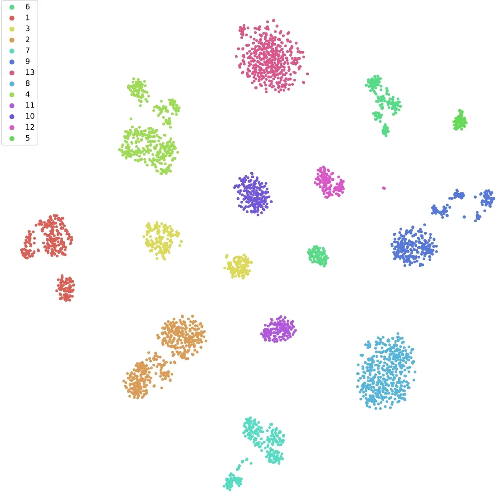
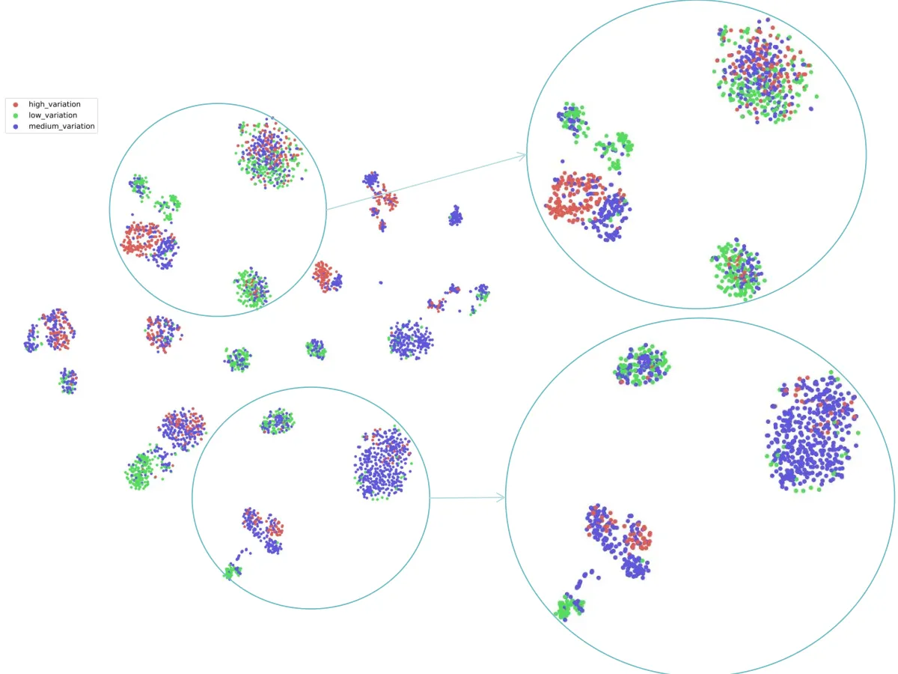
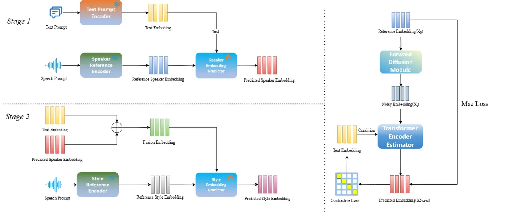
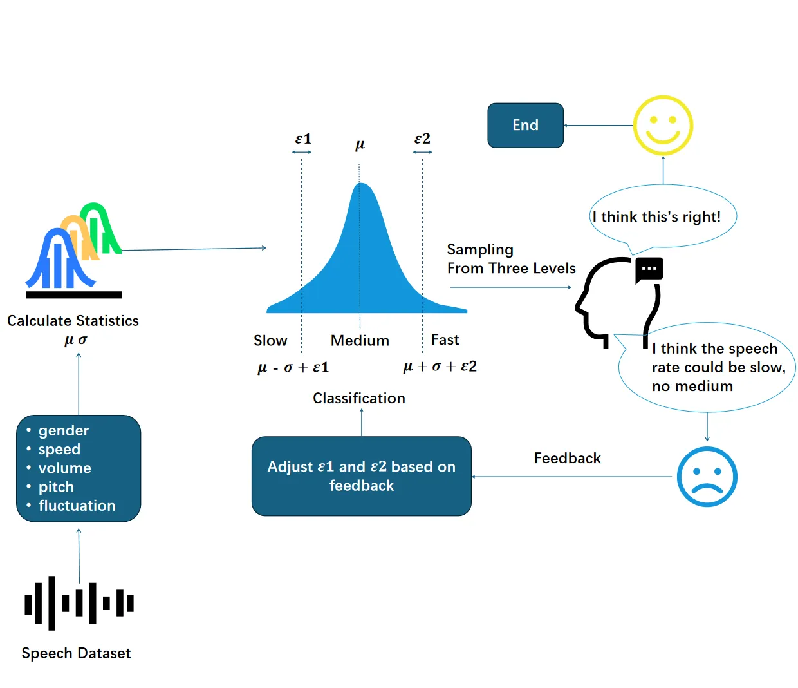

# HiStyle: Hierarchical Style Embedding Predictor for Text-Prompt-Guided Controllable Speech Synthesis

Ziyu Zhang    Hanzhao Li    Jingbin Hu    Wenhao Li    Lei Xie
Affiliation: Audio, Speech and Language Processing Group (ASLP@NPU),
School of Computer Science, Northwestern Polytechnical University,
Xi’an, China  
[http://www.npu-aslp.org/](http://www.npu-aslp.org/)
E-mail <ziyu_zhang@mail.nwpu.edu.cn>

###### Abstract

Controllable speech synthesis refers to the precise control of speaking
style by manipulating specific prosodic and paralinguistic attributes,
such as gender, volume, speech rate, pitch, and pitch fluctuation. With
the integration of advanced generative models, particularly large
language models (LLMs) and diffusion models, controllable text-to-speech
(TTS) systems have increasingly transitioned from label-based control to
natural language description-based control, which is typically
implemented by predicting global style embeddings from textual prompts.
However, this straightforward prediction overlooks the underlying
distribution of the style embeddings, which may hinder the full
potential of controllable TTS systems. In this study, we use t-SNE
analysis to visualize and analyze the global style embedding
distribution of various mainstream TTS systems, revealing a clear
hierarchical clustering pattern: embeddings first cluster by timbre and
subsequently subdivide into finer clusters based on style attributes.
Based on this observation, we propose HiStyle, a two-stage style
embedding predictor that hierarchically predicts style embeddings
conditioned on textual prompts, and further incorporate contrastive
learning to help align the text and audio embedding spaces.
Additionally, we propose a style annotation strategy that leverages the
complementary strengths of statistical methodologies and human auditory
preferences to generate more accurate and perceptually consistent
textual prompts for style control. Comprehensive experiments demonstrate
that when applied to the base TTS model, HiStyle achieves significantly
better style controllability than alternative style embedding predicting
approaches while preserving high speech quality in terms of naturalness
and intelligibility. Audio samples are available at
https://anonymous.4open.science/w/HiStyle-2517/.

###### Keywords: 

Style Controllable TTS Style Embedding Distribution Two-stage Embedding
Predictor Contrastive Learning.

## 1 Introduction

Speech synthesis has emerged as a critical technology in digital content
creation and human-computer interaction. The advent of advanced
generative models, particularly LLMs \[1, 2, 3, 4\] and diffusion
models \[5, 6, 7\], has driven significant breakthroughs in speech
synthesis, empowering TTS systems to generate human-like speech with
remarkable speech quality and prosodic naturalness.

In recent years, there has been a growing research focus on developing
style-controllable TTS systems that allow flexible control of speaking
style attributes, such as speech rate, pitch, and volume. A common
approach in prior work \[8, 9, 10\] is to use categorical labels, e.g.
speaking rate level or emotion category, to represent and control these
style attributes. However, such label-based methods are constrained by a
limited set of predefined style categories extracted from the training
corpus, which inherently limits the system’s ability to generalize to
new speaking styles not seen during training. To address this
limitation, subsequent studies \[11, 12, 13\] introduced
reference-audio-based style transfer, which uses acoustic representation
extracted from a reference audio to guide synthesis and thus avoids
constrained by predefined style categories. However, seeking suitable
style reference audios that precisely match user intent remains
time-consuming and often impractical.

To achieve more flexible and user-friendly style control, several
studies \[14, 15, 16, 17, 5\] have adopted natural language descriptions
for controllable speech synthesis, enabling intuitive control over
diverse speaking style attributes and avoiding the limitations of label-
and reference-based methods. Typically, these approaches achieve
controllable synthesis by predicting a global style embedding from a
text prompt. To realize this, previous studies have explored a variety
of prediction strategies. Early work \[18\] employed lightweight
projection networks for direct text-to-style embedding mapping, while
its simplistic architecture limited controllable performance. Subsequent
approaches leveraged diffusion-based variational networks to synthesize
style embeddings from text prompts \[16\], capitalizing on diffusion
models’ superior ability to capture and model speech style variations,
thereby achieving enhanced controllability. However, all these methods
treat style embedding prediction as a single-step mapping procedure and
therefore ignore the intrinsic hierarchical distribution of the style
embedding space, which may limit the controllability of the synthesized
speech. In the other hand, for the text prompt labeling aspect of
style-controllable datasets, most prior works \[5, 19, 20\] relied on
manually set thresholds for style attribute annotation, using
hand-crafted percentage-based criteria to define attribute labels. Such
approaches are inherently inflexible and fail to consider the alignment
between automatically assigned labels and actual human perceptual
judgments.

To address these challenges, we visualize and analyze the style
embedding distribution of various mainstream TTS systems, revealing that
style embeddings exhibit a clear hierarchical distribution: globally
grouped according to timbre and locally subdivided by specific style
attributes. Building on this insight, we design a novel hierarchical
two-stage style embedding predictor, named HiStyle, which first predict
coarse-grained global embeddings and then predict fine-grained style
embeddings. To further enhance the alignment between textual and
acoustic spaces, we incorporate a contrastive learning objective during
training. In addition, recognizing the limitations of fixed thresholds
in style annotation, we develop a new data annotation pipeline that
combines objective statistical methods with subjective human perceptual
feedback, helping generate more accurate and perceptually consistent
style labels.

In summary, the main contributions of this work are as follows:

- •
  We conduct a comprehensive visualization and analysis of the style
  embedding spaces in mainstream TTS systems, revealing their
  hierarchical organization: globally clustered by timbre and further
  subdivided by style attributes.
- •
  We propose HiStyle, a novel two-stage style embedding predictor with
  contrastive learning, which hierarchically predicts style embeddings
  conditioned on textual prompts and achieves significantly improved
  controllability and naturalness in speech synthesis.
- •
  We develop an improved data annotation pipeline that integrates
  statistical analysis with human perceptual evaluation, achieving more
  accurate and perceptually consistent style labeling for training and
  evaluation.

## 2 Preliminary Analysis

Contemporary text-prompt controllable TTS systems \[21\] commonly employ
global embeddings to control speech attributes (e.g., speech rate,
pitch, and timbre). These embeddings are typically extracted by
learnable audio encoders and subsequently predicted from prompt texts
during inference. Some studies \[16\] have employed Principal Component
Analysis (PCA) \[22\] to visualize the embedding space, revealing
distinct clustering patterns corresponding to speaker identity and
emotional characteristics. However, the precise relationship between the
embedding space and specific style attributes (e.g., speech rate and
pitch patterns) remains insufficiently characterized.



(a)



(b)

Figure 1: t-SNE visualization of global embeddings from
Transformer-based encoder: (a) Speaker-Level Clustering, (b) Pitch
Fluctuation-Level Sub-Clustering.

To better understand this internal structure, we select several
representative reference encoder architectures and extract their global
embeddings for visualization using t-SNE. We use various models to
extract global embeddings for different style attributes, including the
acoustic encoder based on ECAPA-TDNN \[23\], the pre-trained voiceprint
model \[24\], and the CNN-GRU-based encoder \[25\]. To observe the
distribution of different style attributes in the global embedding, we
construct a highly expressive and high-quality dataset with multiple
speakers and multiple speech attributes. Using this dataset, we input
speech samples into each encoder to extract the corresponding global
embeddings. Then, we apply t-SNE to project the high-dimensional
embeddings into a 2D space.

The Figure 1 shows the visualization result in the CNN-GRU-based
encoder. As shown in Figure , when we color the t-SNE visualization by
speaker identity, the embedding space partitions clearly into distinct
clusters corresponding to each speaker, indicating that the global
embedding is organized by speaker timbre. Next, we recolor the same
t-SNE cluster according to the pitch fluctuation attribute. As shown in
Figure , the embeddings do not exhibit distinct grouping across the
entire space. However, by comparing Figure  and Figure , we find that
the embeddings are further separated based on pitch fluctuation within
each speaker-specific cluster. This phenomenon suggests that the
embedding space has a clear hierarchical structure: embeddings are first
grouped by timbre at the global level and then further organized by
style attributes within each timbre cluster. We conduct the same
visualization procedure using the other encoder structures and other
attributes in the supplementary materials, observing the same
hierarchical clustering patterns.

## 3 HiStyle



Figure 2: Overview architecture of the HiStyle embedding predictor. The
subplot in the upper-left corner illustrates the prediction process of
our first stage. The Speaker Embedding Predictor takes the text prompt
embedding as a condition and uses the reference speaker embedding to
predict the predicted speaker embedding. Similarly, the subplot in the
lower-left corner represents the second stage, where the Style Embedding
Predictor takes the text prompt embedding along with the residual
connection of the intermediate result (predicted speaker embedding) from
the first stage as conditions, and leverages the fusion embedding to
predict the predicted style embedding. The subplot on the right depicts
the detailed architecture and training process of the two Embedding
Predictors.

Inspired by the hierarchical structure observed in the previous section,
we propose a novel hierarchical two-stage embedding predictor, as
illustrated in Figure 2. Our predictor consists of three key components:
the text prompt encoder, speaker embedding predictor and style embedding
predictor. First, the text prompt encoder comprising a pre-trained BERT
model followed by a linear projection encodes the input text description
into a text-prompt embedding\[26\]. Next, we implement a speaker
embedding predictor that predicts a global speaker-related embedding
conditioned on the text-prompt embedding. This predicted embedding
captures the speaker-related information comprising both timbre and
style information and serves as an intermediate representation\[21,
27\]. Then, we employ a style embedding predictor, which fuse the
predicted speaker embedding with the original text-prompt embedding
through a residual connection as condition to predict the final style
embedding\[28\].

We adopt a unified architecture for Speaker Embedding Predictor and
Style Embedding Predictor, all implemented within a conditional
diffusion model based on transformer blocks \[29\]. As illustrated in
Figure 2, this model structure consists of a forward diffusion module
for noise-adding and a transformer encoder-based estimator module for
denoising\[30\].

During training, the diffusion model adds Gaussian noise to the
ground-truth reference embedding $`\mathbf{x}_{0}`$, resulting in a
noisy feature $`\mathbf{x}_{t}`$. This can be formulated as

```math
\mathbf{x}_{t}=\sqrt{\bar{\alpha}_{t}}\,\mathbf{x}_{0}+\sqrt{1-\bar{\alpha}_{t}}\,\mathbf{z},\quad\mathbf{z}\sim\mathcal{N}(\mathbf{0},\mathbf{I}), \tag{1}
```

where $`\bar{\alpha}_{t}`$ denotes the noise schedule and $`\mathbf{z}`$
is standard Gaussian noise.

The global noisy reference embedding $`\mathbf{x}_{t}`$, together with
the text embedding and the current diffusion step, are concatenated and
fed into the transformer blocks. This architecture fuses all three
sources of information via multi-layer self-attention, yielding a global
contextual representation. Then the model predicts the reference
embedding $`\mathbf{x}_{0\_\text{pred}}`$ conditioned on this global
contextual representation.

The model is trained to minimize the Mean Squared Error (MSE) loss
between its prediction and the ground-truth reference embedding:

```math
\mathcal{L}_{\mathrm{MSE}}=\left\|\mathbf{x}_{0\_\text{pred}}-\mathbf{x}_{0}\right\|_{2}^{2}. \tag{2}
```

To further enhance the alignment between the textual and acoustic
embedding spaces, we additionally incorporate a contrastive learning
objective based on cosine similarity loss\[31, 32\]. For each training
batch, we construct positive pairs by matching each predicted embedding
with its corresponding text prompt embedding, and negative pairs by
associating it with the text prompt embeddings of other samples within
the same batch.

We define the cosine similarity loss as:

```math
\mathcal{L}_{\text{CL}}=1-\cos(\mathbf{z}_{\text{pred}},\mathbf{z}_{\text{ref}}), \tag{3}
```

where $`\mathbf{z}_{\text{pred}}`$ is the predicted embedding and
$`\mathbf{z}_{\text{ref}}`$ is the corresponding reference embedding.
For negative samples $`\mathbf{z}_{\text{neg}}`$, we optionally include
a repulsion term:

```math
\mathcal{L}_{\text{neg}}=\sum{i=1}^{N-1}\max\left(0,\cos(\mathbf{z}_{\text{pred}},\mathbf{z}_{\text{neg},i})-m\right), \tag{4}
```

where $`m`$ is a margin that pushes negative pairs to have similarity
below a threshold.

The final contrastive loss combines positive and negative terms:

```math
\mathcal{L}_{\text{contrastive}}=\mathcal{L}_{\text{CL}}+\lambda_{\text{neg}}\cdot\mathcal{L}_{\text{neg}}. \tag{5}
```

The overall training objective is:

```math
\mathcal{L}_{\text{total}}=\mathcal{L}_{\text{MSE}}+\lambda\cdot\mathcal{L}_{\text{contrastive}}, \tag{6}
```

where $`\lambda`$ and $`\lambda_{\text{neg}}`$ are hyperparameters that
balance the contribution of the contrastive terms.

During inference, the model starts from a random Gaussian noised
embedding and progressively denoise it using only the text embedding as
condition, ultimately generating a predicted reference style embedding
that aligns with the input text prompt.

Above we introduce the two-stage prediction approach and the specific
structure of each predictor, and below we will introduce how our
predictor can be applied to the TTS model for controllable speech
synthesis. Our proposed style embedding predictor is highly
generalizable and can be flexibly integrated into mainstream TTS
systems. The core idea is to design a speaker reference encoder and a
style reference encoder within the TTS model to extract corresponding
global speaker-related and style embeddings. These two embeddings are
then fed into our predictor, which hierarchically predicts the target
speaker embedding and target style embedding conditioned on the text
prompt. In practical implementation, the speaker reference encoder can
be flexibly chosen from various architectures, such as an ECAPA-TDNN
model or a pre-trained voiceprint model. While the style reference
encoder, on the other hand, can adopt architectures like
transformer-based models that are better suited for capturing complex
stylistic attributes.

## 4 Data Annotation

We leverage a high-quality internal dataset containing 2,000 hours of
expressive speech with over 20 distinct timbres and diverse styles to
provide rich stylistic variations. Our annotation pipeline integrates a
dual approach combining statistical analysis with human perceptual
evaluation, achieving both precise and perceptually consistent style
labeling. Our annotation pipeline consequently follows three key steps:

### 4.1 Attribute Value Computation

The first step involves quantifying speech style attributes into
measurable parameters, where we calculate gender, speech rate, volume,
pitch, and pitch fluctuation values\[33\].

For speech rate, we first use signal processing methods to trim the
silent segments at the beginning and end of the speech, then extract the
phoneme sequence and audio duration with internal tools. The relative
speech rate is defined as the total number of phonemes divided by the
total duration. In our analysis, we observe a significant difference in
calculated speech rate values between Chinese and English utterances,
even when the perceived speaking speed is similar. As shown in Table 1,
the average speech rate for English is notably higher than that for
Chinese, primarily due to differences in phoneme length between the two
languages. To ensure annotation accuracy, we therefore set separate
grading thresholds for Chinese and English speech.

| Language | Mean_value(s) | Std_value(s) |
| -------- | ------------- | ------------ |
| Chinese  | 14.63         | 4.94         |
| English  | 18.25         | 7.70         |

Table 1: Mean and standard deviation of computed speech rate for Chinese
and English utterances.

For gender, we fine-tune the ECAPA-TDNN\[24\] model on a large internal
gender-labeled dataset to ensure robust generalization, then use its
output probabilities for annotation. For pitch and its variability
(pitch fluctuation), we use PyWorld to extract the frame-level
fundamental frequency ($`F_{0}`$) contour for each audio. To ensure
accurate measurements, we remove abnormal zeros in the $`F_{0}`$ array
caused by unnatural pauses or noise. We then calculate the mean and
standard deviation of the remaining non-zero $`F_{0}`$ values, using
them as the pitch and fluctuation of each recording, respectively.

### 4.2 Statistic-based Classification

The second step aims to assign each style attribute to an appropriate
category, according to the precise values calculated in the first step.
The specific procedure is as follows:

For gender annotation, we assign the category with the highest
probability as the final gender label for each utterance. For the other
attributes, we adopt a strategy that combines objective statistical
thresholds with subjective auditory preference. Specifically, for speech
rate, pitch, and pitch fluctuation, we use a three-level classification
scheme. For each attribute, we compute the mean and standard deviation
across the relevant data groups, calculating separately by gender for
pitch and fluctuation, and separately by language for speech rate.
Initial thresholds are then set using $`\mu-\sigma`$ and $`\mu+\sigma`$
as boundaries, where $`\mu`$ and $`\sigma`$ are the mean and standard
deviation for each group, providing a sound statistical foundation for
grading.

### 4.3 Human Perception Adjustment



Figure 3: Iterative Annotation Pipeline Combining Statistical
Thresholding and Human Perception

To further align these calculated thresholds with human perception, we
design an iterative annotation workflow, as illustrated in Figure 3.
After using the initial thresholds to categorize utterances, we randomly
sample a set of borderline cases. Specifically, samples falling within a
±5% margin of each threshold boundary for perceptual evaluation. In each
iteration, we invite three annotators with basic speech knowledge to
independently listen to 50 utterances per attribute (randomly selected
and distributed across levels) and assign perceptual labels such as
“slow,” “medium,” or “fast” for speech rate. After collecting the
annotations, we analyze inter-annotator agreement and compare the
perceptual labels with the current threshold-based labels. If consistent
discrepancies are observed (for example, if more than 80% of listeners
consistently classify a threshold-defined “medium” utterance as “fast”),
we adjust the corresponding threshold accordingly. This process is
repeated for 2–3 rounds until the classification results achieve over
85% agreement with human perceptual judgments, ensuring that the final
attribute intervals are both statistically grounded and perceptually
reliable.

Finally, we combine all the attribute-level descriptions using a large
language model¹¹ 1 We use ChatGPT (gpt-3.5-turbo) as the LLM. to
generate fluent and contextually appropriate natural language sentences.
This approach ensures that the resulting style descriptions are
cohesive, richly detailed, and exhibit human-like expressiveness.

## 5 Experiment

### 5.1 Training Setup and Model Details

Datasets We utilize a high-quality internal dataset comprising 2,000
hours of expressive speech, spanning over 20 distinct timbres and a wide
range of style attribute levels. Using the annotation pipeline described
above, we label each utterance with a level of each style attribute and
combine these annotations into a descriptive sentence to serve as the
text prompt. And then we preserve 2,000 utterances as the test set and
use the remaining data for training.

Model and Training Details The diffusion encoder in our system,
including the speaker embedding predictor, and style embedding predictor
consisting of 12 layers, each with a hidden size of 512. Each diffusion
model contains approximately 30 million parameters. We train our
two-stage embedding predictor using the Adam optimizer with a learning
rate of $`2\times 10^{-4}`$, employing a warmup schedule followed by
cosine decay. The batch size is set to 128, and training is conducted on
8 NVIDIA A6000 GPUs.

### 5.2 Evaluation Metrics

Objective Metrics We first assess the accuracy of key speaking style
attributes, including gender, speech rate, volume, pitch, and
fluctuation. Gender accuracy is determined using an internal fine-tuned
gender classifier. For the remaining attributes, we utilize the style
annotation pipeline to annotate the synthesized speech, and then compare
these labels with the corresponding style attributes in the text prompt
to calculate the accuracy for each attribute. Additionally, we evaluate
the overall quality of the synthesized speech in terms of Word Error
Rate (WER), and UTMOS\[34\], following the evaluation protocols provided
by Seed-TTS-eval\[4\].

Subjective Metrics We use the Mean Opinion Score (MOS) to evaluate
speech naturalness (N-MOS) and style consistency (Style-MOS).

### 5.3 Effectiveness of HiStyle

In this section, we present a series of objective and subjective
experiments to evaluate the effectiveness of various style embedding
prediction strategies for speech style control. All methods are
implemented on a unified backbone: a SingleCodec-based TTS system that
utilizes a LLaMA\[35\] architecture as its language model. This backbone
is chosen for its simplicity and strong baseline performance. We compare
our method with five different approaches:

Text Prompt Only Following the implementation in PromptTTS\[15\], we
directly use the text-prompt embedding extracted by the prompt encoder
as the style embedding, without any audio supervision. The prediction
network is optimized only by speech synthesis loss.

Discriminative model Following the implementation in \[18\], we train a
lightweight projection module to map the text-audio embedding space,
taking the projected vector as the style embedding. The prediction
network is optimized by discriminative loss and speech synthesis loss.

Variation Network Following the implementation in PromptTTS2\[16\], we
employ a generative variation network to generate a reference-audio
embedding conditioned on the text-prompt embedding, using this
synthesized embedding as the style embedding. The prediction network is
optimized by generative loss and speech synthesis loss.

Query Encoder Following the implementation in FleSpeech\[36\], we use
the query encoder and diffusion network to map the text-to-audio
embedding space, the prediction network is optimized by diffusion loss
and speech synthesis loss.

HiStyle Our proposed method, which using two transformer encoder based
diffusion models to hierarchically predict style embeddings conditioned
on text prompts. The prediction network is optimized by MSE loss,
contrastive loss and speech synthesis loss.

| Model                | Accuracy(%)↑ |       |        |       |             | WER(%)↓ | UTMOS↑ | N-MOS↑      | Style-MOS↑  |
| -------------------- | ------------ | ----- | ------ | ----- | ----------- | ------- | ------ | ----------- | ----------- |
|                      | Gender       | Speed | Volume | Pitch | Fluctuation |         |        |             |             |
| Text Prompt Only     | 98.75        | 89.21 | 85.32  | 85.69 | 82.32       | 3.09    | 3.37   | 3.79 ± 0.03 | 3.45 ± 0.04 |
| Discriminative Model | 97.71        | 85.21 | 88.43  | 90.65 | 83.65       | 3.69    | 3.36   | 3.71 ± 0.08 | 3.48 ± 0.02 |
| Variation Network    | 98.27        | 92.56 | 93.33  | 88.21 | 86.58       | 4.29    | 3.38   | 3.69 ± 0.06 | 3.52 ± 0.05 |
| Query Encoder        | 97.66        | 90.48 | 91.58  | 91.86 | 83.31       | 3.82    | 3.45   | 3.83 ± 0.09 | 3.68 ± 0.03 |
| HiStyle              | 98.88        | 90.98 | 95.56  | 92.87 | 88.02       | 3.32    | 3.41   | 3.80 ± 0.08 | 3.71 ± 0.05 |

Table 2: Performance of Different Style Embedding Prediction Methods on
Objective and Subjective Metrics

As shown in Table 2, our proposed two-stage embedding predictor
consistently outperforms all compared approaches across multiple
objective metrics. In terms of style attribute controllability, our
method achieves the highest accuracy across key dimensions including
volume (95.56%), pitch (92.87%), and fluctuation (88.02%), indicating
its superior capability in capturing diverse speaking style
characteristics from text prompts. In addition, it achieves the highest
accuracy in gender prediction (98.88%), confirming the robustness of the
model in handling both linguistic and paralinguistic cues. Moreover, our
method maintains a low WER of 3.32% and a low UTMOS of 3.41,
demonstrating that enhanced controllability does not come at the cost of
speech intelligibility or naturalness. Additionally, for subjective
indicators, our method achieves a Style-MOS score of 3.71 ± 0.05, the
highest among all competing systems, demonstrating superior style
controllability and a stronger alignment between the intended and
perceived speaking style. In terms of naturalness, our method obtains a
N-MOS of 3.80 ± 0.08, which is competitive with the best performing
baseline (Query Encoder: 3.83 ± 0.09). Notably, our approach delivers
the best overall trade-off between style controllability and speech
naturalness.

In contrast, the Text Prompt Only approach shows the lowest performance
in all style dimensions except gender. This suggests that using text
prompts alone, without leveraging reference audio embeddings, is
insufficient for modeling the inherent variability in speaking styles,
resulting in poor controllability. The Discriminative Model delivers
modest performance, likely due to its overly simplistic projection
architecture, which limits its capacity to capture complex style
representations. The Variation Network demonstrates strong performance
in speed accuracy (92.56%) but suffers from the highest WER (4.29%),
revealing a clear trade-off between style precision and linguistic
consistency. Meanwhile, the Query Encoder yields more balanced results
across style dimensions but still falls short of our model in both
accuracy and perceptual quality. These comparisons highlight the
advantage of our hierarchical predicting strategy, which achieves both
controllable and intelligible speech synthesis.

### 5.4 Ablation Study

| Model                    | Accuracy(%)↑ |       |        |       |             | WER(%)↓ | UTMOS↑ | N-MOS↑      | Style-MOS↑  |
| ------------------------ | ------------ | ----- | ------ | ----- | ----------- | ------- | ------ | ----------- | ----------- |
|                          | Gender       | Speed | Volume | Pitch | Fluctuation |         |        |             |             |
| HiStyle                  | 98.78        | 90.84 | 95.43  | 91.97 | 88.72       | 3.25    | 3.39   | 3.86 ± 0.07 | 3.75 ± 0.03 |
| w/o Contrastive Learning | 94.49        | 88.10 | 90.43  | 89.78 | 83.67       | 3.96    | 3.29   | 3.78 ± 0.01 | 3.66 ± 0.06 |
| w/o Style Annotation     | 92.64        | 85.98 | 88.67  | 80.02 | 82.21       | 3.58    | 3.20   | 3.84 ± 0.06 | 3.68 ± 0.08 |
| w/o Both                 | 92.41        | 85.48 | 88.49  | 83.88 | 80.82       | 4.08    | 3.08   | 3.69 ± 0.04 | 3.62 ± 0.02 |

Table 3: Ablation Study on Contrastive Learning and Style Annotation
Strategy

Table 3 presents the ablation results of HiStyle across four
configurations (full model, without contrastive learning, without style
annotation, and without both). For objective evaluation, the full model
(HiStyle) achieves the best performance, excelling across all style
dimensions, particularly in gender (98.78%), speech rate (90.84%), and
volume (95.43%). Removing contrastive learning results in a decline in
all accuracy metrics, with gender accuracy dropping to 94.49%. While
omitting style annotation leads to a significant decrease in style
control accuracy (e.g., pitch drops to 80.02%), although the WER remains
at a moderate 3.58%. Removing both contrastive learning and style
annotation results in the worst performance, with a significant increase
in WER to 4.08%, emphasizing the complementarity and importance of
contrastive learning and style annotation.

In terms of subjective evaluation, HiStyle also shows excellent
performance in N-MOS and Style-MOS. The full model achieves the highest
scores in both N-MOS (3.86 ± 0.07) and Style-MOS (3.75 ± 0.03) among all
configurations, indicating that HiStyle excels not only in speech
naturalness but also in maintaining style consistency. Removing
contrastive learning causes a slight decline in both N-MOS and
Style-MOS, with scores of 3.78 ± 0.01 and 3.66 ± 0.06, respectively.
Omitting style annotation has a more significant impact, particularly on
Style-MOS, which drops to 3.68 ± 0.08. The configuration without both
contrastive learning and style annotation further reduces these metrics
to 3.69 ± 0.04 for N-MOS and 3.62 ± 0.02 for Style-MOS, highlighting the
importance of contrastive learning and style annotation in improving
both speech naturalness and style consistency.

## 6 Conclusions

In this study, we introduce HiStyle, a hierarchical two-stage style
embedding predictor for text-prompt-guided controllable speech
synthesis. Through an in-depth analysis of the global style embedding
distribution in text-to-speech systems, we identify a clear hierarchical
structure, with embeddings initially clustered by timbre and further
subdivided by specific style attributes. Leveraging this insight,
HiStyle is designed to predict both coarse-grained speaker embeddings
and fine-grained style embeddings. To further enhance alignment between
textual prompts and acoustic representations, we incorporate contrastive
learning, strengthening the connection between the text and audio
embedding spaces. Additionally, our novel style annotation strategy,
combining statistical methodologies and human perceptual evaluation,
facilitated the creation of accurate, perceptually consistent text
prompts for style control. Experimental results demonstrate that HiStyle
outperforms existing style embedding prediction methods in both
objective and subjective metrics, achieving superior style
controllability and maintaining high naturalness and intelligibility in
the generated speech. The proposed approach paves the way for more
versatile and user-friendly style-controllable speech synthesis systems.

## References

- \[1\] Chengyi Wang, Sanyuan Chen, Yu Wu, Ziqiang Zhang, Long Zhou,
  Shujie Liu, Zhuo Chen, Yanqing Liu, Huaming Wang, Jinyu Li, et al.,
  “Neural codec language models are zero-shot text to speech
  synthesizers,” arXiv preprint arXiv:2301.02111, 2023.
- \[2\] James Betker, “Better speech synthesis through scaling,” arXiv
  preprint arXiv:2305.07243, 2023.
- \[3\] Mateusz Łajszczak, Guillermo Cámbara, Yang Li, Fatih Beyhan,
  Arent Van Korlaar, Fan Yang, Arnaud Joly, Álvaro Martín-Cortinas,
  Ammar Abbas, Adam Michalski, et al., “Base tts: Lessons from building
  a billion-parameter text-to-speech model on 100k hours of data,” arXiv
  preprint arXiv:2402.08093, 2024.
- \[4\] Philip Anastassiou, Jiawei Chen, Jitong Chen, Yuanzhe Chen, Zhuo
  Chen, Ziyi Chen, Jian Cong, Lelai Deng, Chuang Ding, Lu Gao, et al.,
  “Seed-tts: A family of high-quality versatile speech generation
  models,” arXiv preprint arXiv:2406.02430, 2024.
- \[5\] Apoorv Vyas, Bowen Shi, Matthew Le, Andros Tjandra, Yi-Chiao Wu,
  Baishan Guo, Jiemin Zhang, Xinyue Zhang, Robert Adkins, William Ngan,
  et al., “Audiobox: Unified audio generation with natural language
  prompts,” arXiv preprint arXiv:2312.15821, 2023.
- \[6\] Sefik Emre Eskimez, Xiaofei Wang, Manthan Thakker, Canrun Li,
  Chung-Hsien Tsai, Zhen Xiao, Hemin Yang, Zirun Zhu, Min Tang, Xu Tan,
  et al., “E2 tts: Embarrassingly easy fully non-autoregressive
  zero-shot tts,” in 2024 IEEE Spoken Language Technology Workshop
  (SLT). IEEE, 2024, pp. 682–689.
- \[7\] Yushen Chen, Zhikang Niu, Ziyang Ma, Keqi Deng, Chunhui Wang,
  Jian Zhao, Kai Yu, and Xie Chen, “F5-tts: A fairytaler that fakes
  fluent and faithful speech with flow matching,” arXiv preprint
  arXiv:2410.06885, 2024.
- \[8\] Xiaoxue Gao, Chen Zhang, Yiming Chen, Huayun Zhang, and Nancy F
  Chen, “Emo-dpo: Controllable emotional speech synthesis through direct
  preference optimization,” in ICASSP 2025-2025 IEEE International
  Conference on Acoustics, Speech and Signal Processing (ICASSP). IEEE,
  2025, pp. 1–5.
- \[9\] Minchan Kim, Sung Jun Cheon, Byoung Jin Choi, Jong Jin Kim, and
  Nam Soo Kim, “Expressive text-to-speech using style tag,” arXiv
  preprint arXiv:2104.00436, 2021.
- \[10\] Jiaxuan Liu, Zhaoci Liu, Yajun Hu, Yingying Gao, Shilei Zhang,
  and Zhenhua Ling, “Diffstyletts: Diffusion-based hierarchical prosody
  modeling for text-to-speech with diverse and controllable styles,”
  arXiv preprint arXiv:2412.03388, 2024.
- \[11\] Yinghao Aaron Li, Cong Han, and Nima Mesgarani, “Styletts: A
  style-based generative model for natural and diverse text-to-speech
  synthesis,” IEEE Journal of Selected Topics in Signal
  Processing, 2025.
- \[12\] Zeqian Ju, Yuancheng Wang, Kai Shen, Xu Tan, Detai Xin,
  Dongchao Yang, Yanqing Liu, Yichong Leng, Kaitao Song, Siliang Tang,
  et al., “Naturalspeech 3: Zero-shot speech synthesis with factorized
  codec and diffusion models,” arXiv preprint arXiv:2403.03100, 2024.
- \[13\] Daegyeom Kim, Seongho Hong, and Yong-Hoon Choi, “Sc vall-e:
  Style-controllable zero-shot text to speech synthesizer,” arXiv
  preprint arXiv:2307.10550, 2023.
- \[14\] Dongchao Yang, Songxiang Liu, Rongjie Huang, Chao Weng, and
  Helen Meng, “Instructtts: Modelling expressive tts in discrete latent
  space with natural language style prompt,” IEEE/ACM Transactions on
  Audio, Speech, and Language Processing, 2024.
- \[15\] Zhifang Guo, Yichong Leng, Yihan Wu, Sheng Zhao, and Xu Tan,
  “Prompttts: Controllable text-to-speech with text descriptions,” in
  ICASSP 2023-2023 IEEE International Conference on Acoustics, Speech
  and Signal Processing (ICASSP). IEEE, 2023, pp. 1–5.
- \[16\] Yichong Leng, Zhifang Guo, Kai Shen, Xu Tan, Zeqian Ju, Yanqing
  Liu, Yufei Liu, Dongchao Yang, Leying Zhang, Kaitao Song, et al.,
  “Prompttts 2: Describing and generating voices with text prompt,”
  arXiv preprint arXiv:2309.02285, 2023.
- \[17\] Yongmao Zhang, Guanghou Liu, Yi Lei, Yunlin Chen, Hao Yin, Lei
  Xie, and Zhifei Li, “Promptspeaker: Speaker generation based on text
  descriptions,” in 2023 IEEE Automatic Speech Recognition and
  Understanding Workshop (ASRU). IEEE, 2023, pp. 1–7.
- \[18\] Zhengyang Chen, Xuechen Liu, Erica Cooper, Junichi Yamagishi,
  and Yanmin Qian, “Generating speakers by prompting listener
  impressions for pre-trained multi-speaker text-to-speech systems,”
  arXiv preprint arXiv:2406.08812, 2024.
- \[19\] Zeyu Jin, Jia Jia, Qixin Wang, Kehan Li, Shuoyi Zhou, Songtao
  Zhou, Xiaoyu Qin, and Zhiyong Wu, “Speechcraft: A fine-grained
  expressive speech dataset with natural language description,” in
  Proceedings of the 32nd ACM International Conference on Multimedia,
  2024, pp. 1255–1264.
- \[20\] Xinsheng Wang, Mingqi Jiang, Ziyang Ma, Ziyu Zhang, Songxiang
  Liu, Linqin Li, Zheng Liang, Qixi Zheng, Rui Wang, Xiaoqin Feng,
  et al., “Spark-tts: An efficient llm-based text-to-speech model with
  single-stream decoupled speech tokens,” arXiv preprint
  arXiv:2503.01710, 2025.
- \[21\] Yuxuan Wang, Daisy Stanton, Yu Zhang, RJ-Skerry Ryan, Eric
  Battenberg, Joel Shor, Ying Xiao, Ye Jia, Fei Ren, and Rif A Saurous,
  “Style tokens: Unsupervised style modeling, control and transfer in
  end-to-end speech synthesis,” in International conference on machine
  learning. PMLR, 2018, pp. 5180–5189.
- \[22\] Andrzej Maćkiewicz and Waldemar Ratajczak, “Principal
  components analysis (pca),” Computers & Geosciences, vol. 19, no. 3,
  pp. 303–342, 1993.
- \[23\] Hao-Han Guo, Yao Hu, Kun Liu, Fei-Yu Shen, Xu Tang, Yi-Chen Wu,
  Feng-Long Xie, Kun Xie, and Kai-Tuo Xu, “Fireredtts: A foundation
  text-to-speech framework for industry-level generative speech
  applications,” arXiv preprint arXiv:2409.03283, 2024.
- \[24\] Brecht Desplanques, Jenthe Thienpondt, and Kris Demuynck,
  “Ecapa-tdnn: Emphasized channel attention, propagation and aggregation
  in tdnn based speaker verification,” arXiv preprint
  arXiv:2005.07143, 2020.
- \[25\] Dake Guo, Jixun Yao, Xinfa Zhu, Kangxiang Xia, Zhao Guo, Ziyu
  Zhang, Yao Wang, Jie Liu, and Lei Xie, “The npu-hwc system for the
  iscslp 2024 inspirational and convincing audio generation challenge,”
  in 2024 IEEE 14th International Symposium on Chinese Spoken Language
  Processing (ISCSLP). IEEE, 2024, pp. 616–620.
- \[26\] Jacob Devlin, Ming-Wei Chang, Kenton Lee, and Kristina
  Toutanova, “Bert: Pre-training of deep bidirectional transformers for
  language understanding,” in Proceedings of the 2019 conference of the
  North American chapter of the association for computational
  linguistics: human language technologies, volume 1 (long and short
  papers), 2019, pp. 4171–4186.
- \[27\] Li-Wei Chen and Alexander Rudnicky, “Fine-grained style control
  in transformer-based text-to-speech synthesis,” in ICASSP 2022-2022
  IEEE International Conference on Acoustics, Speech and Signal
  Processing (ICASSP). IEEE, 2022, pp. 7907–7911.
- \[28\] Kaiming He, Xiangyu Zhang, Shaoqing Ren, and Jian Sun, “Deep
  residual learning for image recognition,” in Proceedings of the IEEE
  conference on computer vision and pattern recognition, 2016, pp.
  770–778.
- \[29\] Ashish Vaswani, Noam Shazeer, Niki Parmar, Jakob Uszkoreit,
  Llion Jones, Aidan N Gomez, Łukasz Kaiser, and Illia Polosukhin,
  “Attention is all you need,” Advances in neural information processing
  systems, vol. 30, 2017.
- \[30\] Jinglin Liu, Chengxi Li, Yi Ren, Feiyang Chen, and Zhou Zhao,
  “Diffsinger: Singing voice synthesis via shallow diffusion mechanism,”
  in Proceedings of the AAAI conference on artificial intelligence,
  2022, vol. 36, pp. 11020–11028.
- \[31\] Alec Radford, Jong Wook Kim, Chris Hallacy, Aditya Ramesh,
  Gabriel Goh, Sandhini Agarwal, Girish Sastry, Amanda Askell, Pamela
  Mishkin, Jack Clark, et al., “Learning transferable visual models from
  natural language supervision,” in International conference on machine
  learning. PmLR, 2021, pp. 8748–8763.
- \[32\] Aaron van den Oord, Yazhe Li, and Oriol Vinyals,
  “Representation learning with contrastive predictive coding,” arXiv
  preprint arXiv:1807.03748, 2018.
- \[33\] Dan Lyth and Simon King, “Natural language guidance of
  high-fidelity text-to-speech with synthetic annotations,” arXiv
  preprint arXiv:2402.01912, 2024.
- \[34\] Takaaki Saeki, Detai Xin, Wataru Nakata, Tomoki Koriyama,
  Shinnosuke Takamichi, and Hiroshi Saruwatari, “Utmos: Utokyo-sarulab
  system for voicemos challenge 2022,” arXiv preprint
  arXiv:2204.02152, 2022.
- \[35\] Hugo Touvron, Thibaut Lavril, Gautier Izacard, Xavier Martinet,
  Marie-Anne Lachaux, Timothée Lacroix, Baptiste Rozière, Naman Goyal,
  Eric Hambro, Faisal Azhar, et al., “Llama: Open and efficient
  foundation language models,” arXiv preprint arXiv:2302.13971, 2023.
- \[36\] Hanzhao Li, Yuke Li, Xinsheng Wang, Jingbin Hu, Qicong Xie,
  Shan Yang, and Lei Xie, “Flespeech: Flexibly controllable speech
  generation with various prompts,” arXiv preprint
  arXiv:2501.04644, 2025.
