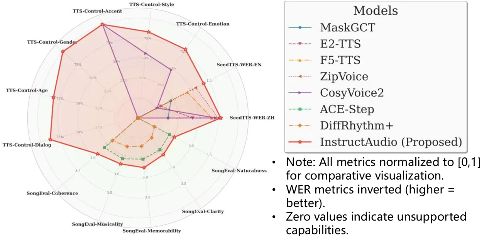
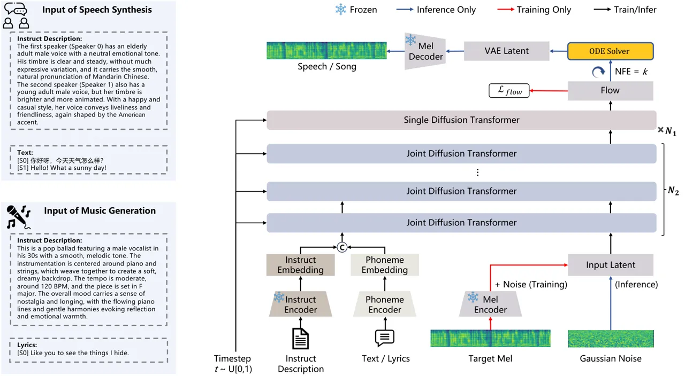

# InstructAudio: Unified speech and music generation with natural language instruction

Chunyu Qiang^(1,2), Kang Yin², Xiaopeng Wang², Yuzhe Liang², Jiahui
Zhao¹, Ruibo Fu³, Tianrui Wang¹, Cheng Gong¹, Chen Zhang², Longbiao
Wang¹, Jianwu Dang¹ ^(†)^(†)thanks: \$ˆ†\$Corresponding Author.

###### Abstract

Text-to-speech (TTS) and text-to-music (TTM) models face significant
limitations in instruction-based control. TTS systems usually depend on
reference audio for timbre, offer only limited text-level attribute
control, and rarely support dialogue generation. TTM systems are
constrained by input conditioning requirements that depend on expert
knowledge annotations. The high heterogeneity of these input control
conditions makes them difficult to joint modeling with speech synthesis.
Despite sharing common acoustic modeling characteristics, these two
tasks have long been developed independently, leaving open the challenge
of achieving unified modeling through natural language instructions. We
introduce InstructAudio, a unified framework that enables
instruction-based (natural language descriptions) control of acoustic
attributes including timbre (gender, age), paralinguistic (emotion,
style, accent), and musical (genre, instrument, rhythm, atmosphere). It
supports expressive speech, music, and dialogue generation in English
and Chinese. The model employs joint and single diffusion transformer
layers with a standardized instruction-phoneme input format, trained on
50K hours of speech and 20K hours of music data, enabling multi-task
learning and cross-modal alignment. Fig. 1 visualizes performance
comparisons with mainstream TTS and TTM models, demonstrating that
InstructAudio achieves optimal results on most metrics. To our best
knowledge, InstructAudio represents the first instruction-controlled
framework unifying speech and music generation. Audio samples are
available at:
[https://qiangchunyu.github.io/InstructAudio/](https://qiangchunyu.github.io/InstructAudio/)

###### Index Terms: 

Unified Audio Generation, Natural Language Instruction, TTS, TTM

^(†)^(†)address: ¹ Tianjin University, Tianjin, China  
² Kuaishou Technology, Beijing, China  
³ Institute of Automation, Chinese Academy of Sciences, Beijing, China

Figure 1: Comparing model capabilities across TTS and TTM tasks. The
chart shows normalized performance on 13 metrics: SeedTTS-WER \[3\],
TTS-Control, and SongEval \[34\]. InstructAudio (red line) uniquely
supports all evaluation dimensions, demonstrating best performance in
both TTS and TTM while providing comprehensive controllability across
multiple attributes.

## 1 Introduction

Text-based controllable generation of speech and music is an important
research topic in the field of audio generation. Recent developments in
TTS \[36, 15, 21, 29, 23, 9, 5, 26, 37, 10, 19\] have achieved
impressive results through zero-shot voice cloning and controllable
generation. TTM \[7, 12, 1, 2, 4\] has advanced with models such as
MusicGen \[7\] and ACE-Step \[12\], alongside commercial systems like
Suno\[1\] and Udio\[2\]. Despite these advances, instruction-controlled
speech and music generation remains a challenging problem in audio
processing.

Existing TTS models excel at either zero-shot voice cloning \[29, 8, 9,
5\] or style control\[14, 13\], but lack text-based control over
multiple acoustic attributes through natural language descriptions. For
instance, while CosyVoice \[8, 9\] and ControlSpeech \[14\] support
text-based emotion and style control, they require additional reference
audio for timbre attributes and cannot handle text-controlled dialogue
generation. Similarly, current TTM models exhibit limited control
capabilities. DiffRhythm+\[4\] supports text-based control of genre,
instrument, rhythm, and atmosphere but lacks singer timbre control
(e.g., gender and age). ACE-Step \[12\], one of the state-of-the-art
(SOTA) open-source music generation model, provides text-based control
for all acoustic attributes but focuses exclusively on music without
unified speech modeling capabilities. Speech and music generation are
typically treated as separate tasks (TTS & TTM), overlooking their
shared acoustic modeling abilities and control mechanisms. This
separation stems from the difficulty of aligning inputs across TTS and
TTM tasks, as speech control involves acoustic attributes such as timbre
and paralinguistics, while music generation requires musical attributes
such as genre, instrumentation, and rhythm.

Vevo2 \[35\] introduced the first unified speech and singing generation
framework, demonstrating that joint modeling leverages rich speech data
to improve singing quality while utilizing singing’s expressive
characteristics to enhance TTS. However, Vevo2 relies on reference audio
for acoustic attribute control rather than text instructions and
generates only vocals without instrumental music capabilities. UniAudio
\[33\] builds upon the VALL-E \[29\] framework to create a single model
capable of executing multiple tasks; however, it requires inconsistent
input formats across different tasks and necessitates task-specific
fine-tuning. AudioBox \[28\], a flow-matching-based unified model
supporting multiple tasks, pre-trains on speech, music, and sound effect
data but ultimately supports only speech and sound effect generation.
AudioLDM 2 \[18\] proposes a two-stage model applicable to speech,
sound, and music generation, yet requires different model architecture
hyperparameters for each task. Current approaches lack text-based
(natural language descriptions) control mechanisms, limiting their
ability to achieve unified speech and music generation. To address these
limitations, we propose InstructAudio, an instruction-controlled unified
framework for speech and music generation.

Our method makes three key contributions: a) We introduce a joint
modeling framework for speech and music generation based on a multimodal
diffusion transformer (MM-DiT) architecture. b) We achieve unified
text-based control over TTS and TTM through natural language
descriptions (a standardized instruction-phoneme input format),
encompassing timbre attributes (gender, age), paralinguistic attributes
(emotion, style, accent), and musical attributes (genre, instrument,
rhythm, atmosphere), while supporting dialogue speech generation. c)
Experimental results demonstrate best performance in instruction-based
TTS (best WER, speaker similarity, emotion similarity, classification
control accuracy, and distortion/error metrics) while maintaining
competitive TTM capabilities (best SongEval metrics), validating the
effectiveness of our unified approach.

Figure 2: InstructAudio achieves unified generation of both speech and
music through an MM-DiT architecture. This framework enables
multi-attribute control through natural language instructions. The input
format remains consistent across different tasks, comprising a natural
language instruction description along with corresponding text or
lyrics. Audio is represented using continuous latents extracted from a
pre-trained Mel-VAE. During inference, the VAE latent of the target
speech or music is obtained through an ODE solver.

## 2 Method

### 2.1 Overview

As illustrated in Fig. 2, InstructAudio introduces a novel approach for
unified speech and music generation, drawing inspiration from MM-Audio
\[6\] through its MM-DiT architecture. The model comprises two core
components: joint diffusion transformer layers and single diffusion
transformer layers. During training, the instruct encoder, mel-encoder,
and mel-decoder remain frozen as pretrained modules. The first-layer
joint diffusion transformer takes temporally concatenated instruct
embedding and phoneme embedding as text modal conditioning input, and
noised mel vae latents as audio modal input (see Section 2.4). Unlike
existing non-autoregressive architectures\[5, 37, 10\], InstructAudio
eliminates the need for text-upsampling alignment with audio
representations. For TTS, the model achieves multi-attribute control,
including gender, age, emotion, style, and accent, through natural
language instructions, and also supports two-speaker dialogue
generation. In TTM, it similarly enables multi-attribute control
covering singer timbre (e.g., gender and age), music genre,
instrumentation, melody, and emotional expression.

### 2.2 Unified Instruction-Guided Input

To enable the unified generation of speech and singing, we designed a
standardized instruction-phoneme input format that aligns both tasks, as
illustrated in Fig. 2. This format consists of two primary components:
an instruction description and a phoneme sequence. The instruction
description is a natural language prompt specifying the desired acoustic
attributes of the output. For speech synthesis, these attributes include
speaker characteristics such as gender, age, emotion, style, and accent.
In dialogue scenarios, we provide separate descriptions for each of the
two speakers and prepend special tokens, \[S0\] and \[S1\], to their
respective text inputs to differentiate the utterances. Similarly, for
music generation, the description specifies attributes like the singer’s
gender and age, music genre, instrumentation, melody, and emotion. For
both tasks, the input text (for speech) or lyrics (for music) is
converted into phonemes using a Grapheme-to-Phoneme (G2P) \[25\] model.
This unified representation allows a single model to seamlessly process
input for both speech and music generation.

### 2.3 Latent Audio Codec

The Latent Audio Codec extends our previous SecoustiCodec framework
\[24, 20, 22\] and comprises three core components: a mel-encoder,
mel-decoder, and discriminator. The VAE architecture enables the model
to learn continuous and complete distributions in the latent space,
significantly enhancing audio representation capabilities. This high
compression ratio facilitates efficient MM-DiT training while improving
reconstruction quality for both speech and music. Due to space
constraints, we omit the analysis of audio representation effects from
this work. For comprehensive results, readers are referred to Section
4.5 of our prior work on Kling-Foley\[30\].

### 2.4 Multimodal Diffusion Transformer Architecture

We employ conditional flow matching\[17\] with an MM-DiT architecture
based on Stable Diffusion 3\[11\], comprising $`N_{2}`$ Joint Diffusion
Transformer layers. To enhance speech and singing voice generation
quality, we incorporate $`N_{1}`$ additional Single Diffusion
Transformer layers for audio-only processing. The input instruction
embeddings $`\in\mathbb{R}^{B\times L_{1}\times D}`$ and phoneme
embeddings $`\in\mathbb{R}^{B\times L_{2}\times D}`$ are temporally
concatenated to form the text modality input
$`C_{\text{text}}\in\mathbb{R}^{B\times(L_{1}+L_{2})\times D}`$. The
linear interpolation path $`x_{t}`$ between Gaussian noise and VAE
latents serves as the audio modality input. The two modalities interact
through joint attention, where queries, keys, and values from both
modalities are concatenated and processed using scaled dot-product
attention. The output maintains input dimensionality and is split back
into respective modalities. In Single Diffusion Transformer layers, only
audio latents are processed, reducing joint attention to self-attention.
During training, flow matching optimizes the objective:
$`\mathbb{E}\big\|v_{\theta}(t,C_{\text{text}},x_{t})-u(t,x_{t})\big\|^{2}`$
where $`v_{\theta}`$ represents the learned conditional velocity field,
$`u`$ denotes the target conditional vector field, and $`t`$ is the time
step. During inference, an ODE solver generates the target VAE latents.

## 3 Experiments

### 3.1 Model Details and Datasets

InstructAudio comprises 1.34 billion parameters with a flow matching
feedforward dimension of 1024. The architecture includes 14 joint
diffusion transformer layers and 6 single diffusion transformer layers,
incorporating RoPE positional encoding \[27\]. We employ a
Zipformer-based\[37\] phoneme encoder with a feedforward dimension of
512 and utilize Qwen2.5-7B\[32\] as the instruct encoder. The mel
encoder processes 44.1kHz input waveforms and generates embeddings at 43
Hz, achieving 1024× downsampling relative to the input sampling rate.
Training is conducted on 32 NVIDIA Tesla A800 80GB GPUs with a batch
size of 16 per GPU, using the Adam optimizer \[16\] with an initial
learning rate of 1e-4.

We collect 50K hours of speech and 20K hours of music data from internet
sources, applying our internal data processing pipeline to generate
instruction descriptions and text/lyrics annotations. For speech data,
descriptions encompass gender, age, emotion, style, and accent
attributes. Music data descriptions include genre, instrument, gender,
age, rhythm, and atmosphere characteristics. Audio clips (2-20s)
maintain 1:1 Chinese-English and male-female ratios, with 90%+ neutral
emotions and 0.5% dialogue data, standardized to 44.1kHz sampling rate.

### 3.2 Compared Method and Evaluation Metrics

To evaluate our model’s unified speech and music generation
capabilities, we compare against SOTA models in each task. For TTS, we
benchmark fundamental capabilities against MaskGCT\[31\], E2-TTS\[10\],
F5-TTS\[5\], ZipVoice\[37\], CosyVoice1\[8\], and CosyVoice2\[9\] (Table
1), and instruction-based TTS performance against the current SOTA model
CosyVoice2 (Table 2). Notably, since InstructAudio is a purely
instruction-controlled model while the Seed-TTS benchmark comprises
natural emotional speech samples, we evaluate WER metrics using natural,
calm-style text descriptions with randomized speakers as control
conditions. For CosyVoice2, which lacks text-based control for timbre
attributes (gender, age), we provide reference audio that matches timbre
description during inference and map inputs to its supported short-form
control text (e.g., "Please speak very happy"). For music generation, we
compare with DiffRhythm+\[4\] and ACE-Step\[12\] (Table 3). Note that
DiffRhythm+ does not support music synthesis under 90 seconds;
therefore, we generate longer sequences and truncate them to create test
samples, which may introduce evaluation bias.

[TABLE]

- •
  Note: G&A = Gender&Age, E&S&A = Emotion&Style&Accent, Dial = Dialog.

Table 1: Comparison of TTS models on instruction control and word error
rate performance.

|                 |                                                      |        |         |        |        |        |                        |         |                                 |      |        |      |                 |             |
| --------------- | ---------------------------------------------------- | ------ | ------- | ------ | ------ | ------ | ---------------------- | ------- | ------------------------------- | ---- | ------ | ---- | --------------- | ----------- |
| Model           | Classification Control Accuracy Rate (%)$`\uparrow`$ |        |         |        |        |        | Similarity$`\uparrow`$ |         | Distortion/Error $`\downarrow`$ |      |        |      | MOS$`\uparrow`$ |             |
|                 | Gender                                               | Age    | Emotion | Style  | Accent | Dialog | Speaker                | Emotion | LSD                             | MCD  | MSEP   | MR   | QMOS            | NMOS        |
| Ground Truth    | 100.00                                               | 100.00 | 100.00  | 100.00 | 100.00 | 100.00 | 1.00                   | 1.00    | 0.00                            | 0.00 | 0.00   | 0.00 | –               | –           |
| CosyVoice2\[9\] | –                                                    | –      | 58.33   | 65.00  | 100.00 | –      | 0.68                   | 0.53    | 2.57                            | 7.11 | 547.87 | 0.46 | 3.90 ± 0.11     | 3.65 ± 0.22 |
| InstructAudio   | 100.00                                               | 86.67  | 83.33   | 86.67  | 100.00 | 90.00  | 0.76                   | 0.71    | 1.88                            | 5.71 | 437.58 | 0.33 | 3.73 ± 0.24     | 3.46 ± 0.32 |

Table 2: Performance comparison of instruction-based TTS on control
accuracy, similarity, distortion/error metrics, and subjective
evaluation.

[TABLE]

- •
  Note: Coh = Coherence, Mus = Musicality, Mem = Memorability, Cla =
  Clarity, Nat = Naturalness.

Table 3: Performance comparison of TTM on control accuracy, SongEval,
and subjective evaluation.

We employ comprehensive objective and subjective metrics to ensure
thorough evaluation. Objective metrics include Word Error Rate (WER)
using Seed-TTS\[3\], Speaker Similarity¹¹ 1
[https://github.com/resemble-ai/Resemblyzer](https://github.com/resemble-ai/Resemblyzer),
Emotion Similarity²² 2
[https://huggingface.co/emotion2vec](https://huggingface.co/emotion2vec),
Log-Spectral Distance (LSD), Mel-Cepstral Distortion (MCD), Mean Squared
Error of Pitch (MSEP), Voiced/Unvoiced Mismatch Rate (MR),
SongEval\[34\] music evaluation benchmark, and classification control
accuracy through perceptual consistency assessment. Subjective
evaluation employs Quality Mean Opinion Score (QMOS), Naturalness Mean
Opinion Score (NMOS), and Musicality Mean Opinion Score (MMOS),
conducted by professionally trained evaluators. Classification control
accuracy is evaluated through human listening tests, where annotators
select the perceptually consistent category from predefined options
(e.g., choosing among "child," "young/middle-aged," or "elderly" for age
attributes). For WER evaluation, we utilize the complete Seed-TTS
benchmark test set. For instruction-based TTS tasks, we construct a
manually annotated test set of 500 samples with natural language
descriptions covering multiple attributes (gender, age, emotion, style,
accent), selecting 100 samples for subjective evaluation. Similarly, for
music tasks, we create a 500-sample test set with natural language
descriptions of musical attributes (gender, age, genre, instrumentation,
melody, emotion), with 100 samples selected for subjective evaluation.
The distribution across categories within each attribute is uniform.
Notably, InstructAudio’s conditioning input consists of descriptive text
corresponding to ground truth, with similarity and distortion/error
calculations performed against ground truth.

### 3.3 Results and Analysis

Evaluation of TTS: Table 1 compares InstructAudio with mainstream TTS
models. MaskGCT, E2-TTS, F5-TTS, and ZipVoice do not support text-based
control capabilities. CosyVoice1 and CosyVoice2 only support emotion,
style, and accent control, requiring additional prompt speech for timbre
control. In contrast, InstructAudio supports comprehensive text-based
control including gender, age, emotion, style, and accent, while
uniquely enabling text-controlled dialogue synthesis (a capability
absent in other models). Although InstructAudio has the largest
parameter count (1.3B) among TTS models, it additionally supports music
generation. As shown in Table 3, mainstream music generation models like
DiffRhythm+ and ACE-Step also exceed 1B parameters. Notably,
InstructAudio achieves superior performance with the smallest training
dataset. On the Seed-TTS WER metric, InstructAudio achieves the best
results when conditioned on neutral emotion and calm style text control.
Control Capability: Table 2 evaluates text-based control TTS
capabilities by comparing against CosyVoice2, the current SOTA model.
For classification control accuracy, InstructAudio supports gender, age,
and dialogue control capabilities unavailable in CosyVoice2 (while
outperforming CosyVoice2 across all control categories). InstructAudio
achieves precise dialogue synthesis control, attaining 90% accuracy in a
capability that other models lack entirely. InstructAudio also
demonstrates superior speaker and emotion similarity. This advantage
stems from CosyVoice2’s reliance on additional prompt speech (random
speaker audio with matching gender and age) for timbre control, which
causes emotion leakage that compromises emotion control effectiveness.
InstructAudio outperforms CosyVoice2 across all distortion and error
metrics. While CosyVoice2 achieves a higher MOS score, it notably
requires reference audio as input conditioning. Text-only control
introduces TTS one-to-many mapping ambiguity, reducing average audio
quality and naturalness for InstructAudio outputs. However,
InstructAudio achieves comparable MOS results despite the unfair
disadvantage of missing input modality, while comprehensively
outperforming CosyVoice2 on all other metrics. Evaluation of TTM: Table
3 evaluates music generation capabilities against current SOTA models
ACE-Step and DiffRhythm+. For classification control accuracy, ACE-Step
achieves the best performance in genre and instrument categories, while
InstructAudio excels in gender, age, rhythm, and atmosphere control.
DiffRhythm+ scores poorly on gender and age due to its lack of singer
timbre control capabilities. InstructAudio achieves the best SongEval
scores across all metrics. ACE-Step obtains the highest QMOS score,
indicating superior perceived audio quality, while InstructAudio
achieves the best MMOS score. We acknowledge that our music evaluation
uses 5-20 second clips matching speech durations, which may disadvantage
models like ACE-Step and DiffRhythm+ that are optimized for longer music
generation. This comparison demonstrates that InstructAudio maintains
competitive music generation capabilities while achieving SOTA
text-based control TTS performance.

### 3.4 Discussion

While the text-only control mechanism achieves unified input formatting
for TTS and TTM tasks, it introduces inherent information loss compared
to audio modalities, resulting in one-to-many mapping ambiguity. This
leads to averaged audio quality and naturalness compared to reference
audio-based methods, as evidenced by lower NMOS scores in both TTS and
TTM tasks. Additionally, to enable joint speech-music modeling, we
constrain music generation to 5-20 second clips, limiting long-form
music generation capabilities. Our evaluation focuses on short segments
to match speech durations, which is detrimental to models like
DiffRhythm+ that are optimized for full-length music generation. These
limitations above, we expect to address in future work.

## 4 Conclusions and future work

This paper presents InstructAudio, an instruction-controlled unified
framework for speech and music generation based on a MM-DiT
architecture, demonstrating the effectiveness of joint TTS and TTM
modeling. Our main contributions include: (1) introducing the first
instruction-controlled unified framework for speech and music generation
that eliminates reference audio requirements in attribute control; (2)
achieving comprehensive controllability over timbre, paralinguistic, and
musical attributes through standardized instruction-phoneme input
formatting (natural language descriptions); and (3) demonstrating SOTA
performance in instruction-based TTS while maintaining competitive music
generation capabilities. Experimental validation confirms our approach’s
effectiveness, achieving optimal results across multiple metrics
including WER, similarity measures, and classification control accuracy.
InstructAudio demonstrates the viability of unified audio generation
frameworks. Future work will explore multimodal control mechanisms to
address quality and naturalness issues, support longer music generation,
and incorporate sound effect generation.

## References

- \[1\] S. AI (2024) Suno: ai music generation platform. Note:
  [https://suno.com](https://suno.com) Cited by: §1.
- \[2\] U. AI (2024) Udio: ai music creation platform. Note:
  [https://udio.com](https://udio.com) Cited by: §1.
- \[3\] P. Anastassiou, J. Chen, J. Chen, Y. Chen, Z. Chen, Z. Chen, J.
  Cong, L. Deng, C. Ding, L. Gao, et al. (2024) Seed-tts: a family of
  high-quality versatile speech generation models. arXiv preprint
  arXiv:2406.02430. Cited by: Figure 1, §3.2, Table 1.
- \[4\] H. Chen, Y. Jiang, G. Ma, C. Hao, S. Wang, J. Yao, Z. Ning, M.
  Meng, J. Luan, and L. Xie (2025) DiffRhythm+: controllable and
  flexible full-length song generation with preference optimization.
  arXiv preprint arXiv:2507.12890. Cited by: §1, §1, §3.2, Table 3.
- \[5\] Y. Chen, Z. Niu, Z. Ma, K. Deng, C. Wang, J. Zhao, K. Yu, and X.
  Chen (2024) F5-tts: a fairytaler that fakes fluent and faithful speech
  with flow matching. arXiv preprint arXiv:2410.06885. Cited by: §1, §1,
  §2.1, §3.2, Table 1.
- \[6\] H. K. Cheng, M. Ishii, A. Hayakawa, T. Shibuya, A. Schwing,
  and Y. Mitsufuji (2025) MMAudio: taming multimodal joint training for
  high-quality video-to-audio synthesis. In Proceedings of the Computer
  Vision and Pattern Recognition Conference, pp. 28901–28911. Cited by:
  §2.1.
- \[7\] J. Copet, F. Kreuk, I. Gat, T. Remez, D. Kant, G. Synnaeve, Y.
  Adi, and A. Défossez (2023) Simple and controllable music generation.
  Advances in Neural Information Processing Systems 36, pp. 47704–47720.
  Cited by: §1.
- \[8\] Z. Du, Q. Chen, S. Zhang, K. Hu, H. Lu, Y. Yang, H. Hu, S.
  Zheng, Y. Gu, Z. Ma, et al. (2024) Cosyvoice: a scalable multilingual
  zero-shot text-to-speech synthesizer based on supervised semantic
  tokens. arXiv preprint arXiv:2407.05407. Cited by: §1, §3.2, Table 1.
- \[9\] Z. Du, Y. Wang, Q. Chen, X. Shi, X. Lv, T. Zhao, Z. Gao, Y.
  Yang, C. Gao, H. Wang, et al. (2024) Cosyvoice 2: scalable streaming
  speech synthesis with large language models. arXiv preprint
  arXiv:2412.10117. Cited by: §1, §1, §3.2, Table 1, Table 2.
- \[10\] S. E. Eskimez, X. Wang, M. Thakker, C. Li, C. Tsai, Z. Xiao, H.
  Yang, Z. Zhu, M. Tang, X. Tan, et al. (2024) E2 tts: embarrassingly
  easy fully non-autoregressive zero-shot tts. In 2024 IEEE Spoken
  Language Technology Workshop (SLT), pp. 682–689. Cited by: §1, §2.1,
  §3.2, Table 1.
- \[11\] P. Esser, S. Kulal, A. Blattmann, R. Entezari, J. Müller, H.
  Saini, Y. Levi, D. Lorenz, A. Sauer, F. Boesel, et al. (2024) Scaling
  rectified flow transformers for high-resolution image synthesis. In
  Forty-first international conference on machine learning, Cited by:
  §2.4.
- \[12\] J. Gong, S. Zhao, S. Wang, S. Xu, and J. Guo (2025) Ace-step: a
  step towards music generation foundation model. arXiv preprint
  arXiv:2506.00045. Cited by: §1, §1, §3.2, Table 3.
- \[13\] Z. Guo, Y. Leng, Y. Wu, S. Zhao, and X. Tan (2023) Prompttts:
  controllable text-to-speech with text descriptions. In ICASSP
  2023-2023 IEEE International Conference on Acoustics, Speech and
  Signal Processing (ICASSP), pp. 1–5. Cited by: §1.
- \[14\] S. Ji, J. Zuo, W. Wang, M. Fang, S. Zheng, Q. Chen, Z.
  Jiang, H. Huang, Z. Wang, X. Cheng, et al. (2024) Controlspeech:
  towards simultaneous zero-shot speaker cloning and zero-shot language
  style control with decoupled codec. arXiv preprint arXiv:2406.01205.
  Cited by: §1.
- \[15\] E. Kharitonov, D. Vincent, Z. Borsos, R. Marinier, S.
  Girgin, O. Pietquin, M. Sharifi, M. Tagliasacchi, and N.
  Zeghidour (2023) Speak, read and prompt: high-fidelity text-to-speech
  with minimal supervision. arXiv preprint arXiv:2302.03540. Cited by:
  §1.
- \[16\] D. P. Kingma and J. Ba (2014) Adam: a method for stochastic
  optimization. CoRR abs/1412.6980. Cited by: §3.1.
- \[17\] Y. Lipman, R. T. Chen, H. Ben-Hamu, M. Nickel, and M. Le (2022)
  Flow matching for generative modeling. arXiv preprint
  arXiv:2210.02747. Cited by: §2.4.
- \[18\] H. Liu, Y. Yuan, X. Liu, X. Mei, Q. Kong, Q. Tian, Y. Wang, W.
  Wang, Y. Wang, and M. D. Plumbley (2024) Audioldm 2: learning holistic
  audio generation with self-supervised pretraining. IEEE/ACM
  Transactions on Audio, Speech, and Language Processing 32,
  pp. 2871–2883. Cited by: §1.
- \[19\] X. Qi, R. Fu, and et al (2025) DPI-tts: directional patch
  interaction for fast-converging and style temporal modeling in
  text-to-speech. In ICASSP 2025 - 2025 IEEE International Conference on
  Acoustics, Speech and Signal Processing (ICASSP), pp. 1–5. External
  Links:
  [Document](https://dx.doi.org/10.1109/ICASSP49660.2025.10889461) Cited
  by: §1.
- \[20\] C. Qiang, W. Geng, Y. Zhao, R. Fu, T. Wang, C. Gong, T.
  Wang, Q. Liu, J. Yi, Z. Wen, et al. (2025) VQ-ctap: cross-modal
  fine-grained sequence representation learning for speech processing.
  IEEE Transactions on Audio, Speech and Language Processing. Cited by:
  §2.3.
- \[21\] C. Qiang, H. Li, H. Ni, H. Qu, R. Fu, T. Wang, L. Wang, and J.
  Dang (2024) Minimally-supervised speech synthesis with conditional
  diffusion model and language model: a comparative study of semantic
  coding. In ICASSP 2024-2024 IEEE International Conference on
  Acoustics, Speech and Signal Processing (ICASSP), pp. 10186–10190.
  Cited by: §1.
- \[22\] C. Qiang, H. Li, Y. Tian, R. Fu, T. Wang, L. Wang, and J.
  Dang (2024) Learning speech representation from contrastive
  token-acoustic pretraining. In ICASSP 2024-2024 IEEE International
  Conference on Acoustics, Speech and Signal Processing (ICASSP),
  pp. 10196–10200. Cited by: §2.3.
- \[23\] C. Qiang, H. Li, Y. Tian, Y. Zhao, Y. Zhang, L. Wang, and J.
  Dang (2024) High-fidelity speech synthesis with minimal supervision:
  all using diffusion models. In ICASSP 2024-2024 IEEE International
  Conference on Acoustics, Speech and Signal Processing (ICASSP),
  pp. 10781–10785. Cited by: §1.
- \[24\] C. Qiang, H. Wang, C. Gong, T. Wang, R. Fu, T. Wang, R.
  Chen, J. Yi, Z. Wen, C. Zhang, et al. (2025) SecoustiCodec:
  cross-modal aligned streaming single-codecbook speech codec. arXiv
  preprint arXiv:2508.02849. Cited by: §2.3.
- \[25\] C. Qiang, P. Yang, H. Che, J. Xiao, X. Wang, and Z. Wang (2022)
  Back-translation-style data augmentation for mandarin chinese
  polyphone disambiguation. In 2022 Asia-Pacific Signal and Information
  Processing Association Annual Summit and Conference (APSIPA ASC),
  pp. 1915–1919. Cited by: §2.2.
- \[26\] S. Shi, R. Fu, and et al (2024) PPPR: Portable Plug-in Prompt
  Refiner for Text to Audio Generation. In Interspeech 2024,
  pp. 4898–4902. External Links:
  [Document](https://dx.doi.org/10.21437/Interspeech.2024-1771), ISSN
  2958-1796 Cited by: §1.
- \[27\] J. Su, M. Ahmed, Y. Lu, S. Pan, W. Bo, and Y. Liu (2024)
  Roformer: enhanced transformer with rotary position embedding.
  Neurocomputing 568, pp. 127063. Cited by: §3.1.
- \[28\] A. Vyas, B. Shi, M. Le, A. Tjandra, Y. Wu, B. Guo, J. Zhang, X.
  Zhang, R. Adkins, W. Ngan, et al. (2023) Audiobox: unified audio
  generation with natural language prompts. arXiv preprint
  arXiv:2312.15821. Cited by: §1.
- \[29\] C. Wang, S. Chen, Y. Wu, Z. Zhang, L. Zhou, S. Liu, Z. Chen, Y.
  Liu, H. Wang, J. Li, et al. (2023) Neural codec language models are
  zero-shot text to speech synthesizers. arXiv preprint
  arXiv:2301.02111. Cited by: §1, §1, §1.
- \[30\] J. Wang, X. Zeng, C. Qiang, R. Chen, S. Wang, L. Wang, W.
  Zhou, P. Cai, J. Zhao, N. Li, et al. (2025) Kling-foley: multimodal
  diffusion transformer for high-quality video-to-audio generation.
  arXiv preprint arXiv:2506.19774. Cited by: §2.3.
- \[31\] Y. Wang, H. Zhan, L. Liu, R. Zeng, H. Guo, J. Zheng, Q.
  Zhang, X. Zhang, S. Zhang, and Z. Wu (2024) Maskgct: zero-shot
  text-to-speech with masked generative codec transformer. arXiv
  preprint arXiv:2409.00750. Cited by: §3.2, Table 1.
- \[32\] A. Yang, B. Yang, B. Zhang, B. Hui, and e. al. Bo Zheng (2025)
  Qwen2.5:technical report. External Links: 2412.15115,
  [Link](https://arxiv.org/abs/2412.15115) Cited by: §3.1.
- \[33\] D. Yang, J. Tian, X. Tan, R. Huang, S. Liu, X. Chang, J.
  Shi, S. Zhao, J. Bian, X. Wu, et al. (2023) Uniaudio: an audio
  foundation model toward universal audio generation. arXiv preprint
  arXiv:2310.00704. Cited by: §1.
- \[34\] J. Yao, G. Ma, H. Xue, H. Chen, C. Hao, Y. Jiang, H. Liu, R.
  Yuan, J. Xu, W. Xue, et al. (2025) SongEval: a benchmark dataset for
  song aesthetics evaluation. arXiv preprint arXiv:2505.10793. Cited by:
  Figure 1, §3.2, Table 3.
- \[35\] X. Zhang, J. Zhang, Y. Wang, C. Wang, Y. Chen, D. Jia, Z. Chen,
  and Z. Wu (2025) Vevo2: bridging controllable speech and singing voice
  generation via unified prosody learning. arXiv preprint
  arXiv:2508.16332. Cited by: §1.
- \[36\] Z. Zhang, L. Zhou, C. Wang, S. Chen, Y. Wu, S. Liu, Z. Chen, Y.
  Liu, H. Wang, J. Li, et al. (2023) Speak foreign languages with your
  own voice: cross-lingual neural codec language modeling. arXiv
  preprint arXiv:2303.03926. Cited by: §1.
- \[37\] H. Zhu, W. Kang, Z. Yao, L. Guo, F. Kuang, Z. Li, W. Zhuang, L.
  Lin, and D. Povey (2025) ZipVoice: fast and high-quality zero-shot
  text-to-speech with flow matching. arXiv preprint arXiv:2506.13053.
  Cited by: §1, §2.1, §3.1, §3.2, Table 1.
