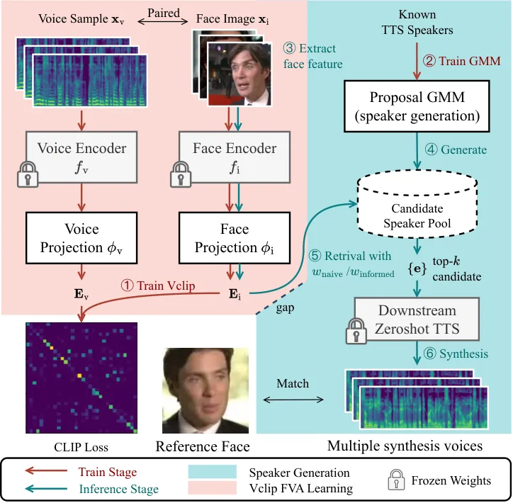

# VCLIP: Face-based Speaker Generation by Face-Voice Association Learning

Yao Shi    Yunfei Xu    Hongbin Suo    Yulong Wan    Haifeng Liu

###### Abstract

This paper discusses the task of face-based speech synthesis, a kind of
personalized speech synthesis where the synthesized voices are
constrained to perceptually match with a reference face image. Due to
the lack of TTS-quality audio-visual corpora, previous approaches suffer
from either low synthesis quality or domain mismatch induced by a
knowledge transfer scheme. This paper proposes a new approach called
Vclip that utilizes the facial-semantic knowledge of the CLIP encoder on
noisy audio-visual data to learn the association between face and voice
efficiently, achieving 89.63% cross-modal verification AUC score on
Voxceleb testset. The proposed method then uses a retrieval-based
strategy, combined with GMM-based speaker generation module for a
downstream TTS system, to produce probable target speakers given
reference images. Experimental results demonstrate that the proposed
Vclip system in conjunction with the retrieval step can bridge the gap
between face and voice features for face-based speech synthesis. And
using the feedback information distilled from downstream TTS helps to
synthesize voices that match closely with reference faces. Demos
available at sos1sos2sixteen.github.io/vclip.

###### Index Terms: 

Speech synthesis, Speaker generation, Face-voice association learning

^(†)^(†)address: ¹Data & AI Engineering System, OPPO, Beijing, China  
²University of Science and Technology of China, Hefei, China  
{shiyao1,xuyunfei,suohongbin,wanyulong,blade}@oppo.com

## 1 Introduction

Current research in speech synthesis persues not only accurate and
natural content delivery, but is also concerned with more advanced
scenarios such as personalized speaker voice or style control. Voice
personalization was largely formulated as a voice cloning task in
literature \[24\]. but conditioning the synthesized voice on other
modalities such as categorical labels \[23\], face imagery \[9, 15\] or
descriptive texts \[32\] has attracted growing interest within the
community, especially following the success of text-based image
generation methods. Of particular interest is the face imagery modality
among other cues for personalized synthesis voices, as speech and vision
naturally co-occurs in our everyday experience and such paired data is
easily obtained from large quantities of online videos \[1, 19, 5\]. The
connection between facial features and voice characteristics is
two-fold. Facial features reflect basic physiological conditions such as
sex, weight and age, which contribute to the physical production of
speech in the speakers’ vocal organs \[14\]. Psychologically speaking,
humans learn to associate certain face features with specific voice
qualities through their experiences, which is known as face-voice
concordance \[22\].

A major discrepency between face and voice conditioning for speech
synthesis is the quality of available datasets. While synthesis task
requires high quality audio for training, major audio-visual datasets
such as LRS3 \[1\] are generally noisy and cannot meet the requirements
of mainstream TTS needs. Owning to these limitations, common approaches
to face-based speech synthesis utilize a transfer learning scheme and
attempt to learn mappings from face to voice features with neural
networks. The transformed image features are used as proxies for speaker
embeddings \[9, 27, 17\] during downstream TTS inference. However,
synthesizing novel speakers based on out-of-domain \[16\] features
crosses two domain gaps. And the learned feature mapping does not
account for errors further accumulated after a face-based speaker
embedding is predicted, causing a lack of coordination between the
upstream mapping module and the downstream TTS module. These design
choices may contribute to performance degradation for TTS \[28\].
Moreover, it is our opinion that predicting the true speaker embedding
by deterministic mapping of the reference image is essentially
intractable, since face imagery alone does not provide enough
information for reconstruction of a person’s voice. Instead, different
voices could be said to suit a single reference face equally well. In
this regard, VoiceMe \[26\] proposed using a human-in-the-loop sampling
strategy to produce probable speaker embeddings for a face. This
technique also takes the end-to-end synthesis result of the downstream
TTS into account. However, it scales poorly due to its requirement for
intensive human interaction.

We therefore cast face-based speech synthesis as a conditional speaker
generation task \[23\] aiming to produce probable candidate synthesis
voices for reference faces. While \[26\] leverages crowd-sourced human
evaluators to link voices to faces, we aim to learn this association
efficiently from openly available paired audio-visual data. We propose
Vclip, a CLIP-like contrastive learning \[21\] scheme for distilling and
connecting the semantic knowlege of a pretrained CLIP image encoder and
a speaker encoder using low quality audio-visual data. We then propose a
retrival-based strategy for a GMM-based speaker generation model \[25\]
to produce probable speaker embeddings given reference images. This
procedure transfers the cross-modal association knowledge of Vclip into
an existing zeroshot TTS system trained on high quality data.
Furthermore, it can be extended to consider errors caused by the
specific downstream TTS system in a straightforward fashion.
Experimental findings demonstrate that a retrival step is crucial in
crossing the domain gap between face and voice features induced by a
constrastive learning scheme \[16\] in Vclip. And feedback information
distilled from the downstream TTS module helps to synthesize novel
voices that matches more closely with reference faces.

The proposed Vclip system achieves 89.63% AUC score on cross-modal
verification for a Voxceleb testset \[31\], surpassing a strong baseline
method \[4\]. Using this system as guidance, we demonstrate the proposed
strategy can produce synthesis voices that are highly correlated with
reference faces, as evidenced by both perceptual and automatic
evaluation studies.

## 2 Background

Face-voice association. Face and voice provide concordant and redundant
information for a range of personal attributes such as levels of
masculinity, age, weight etc. This establishes the real-world
feasibility of static face-voice matching by human evaluators, as
demonstrated in \[22\]. In the context of machine learning, Learnable
PINs \[18\] proposed a cross-modal feature learning task to link face
imagery to speech segments, known as face-voice association (FVA)
learning. In recent years, this task has drawn attentions from
researchers \[29, 31\], with Self-Lifting \[4\] being among the
state-of-the-art approaches. Self-Lifting employs an iterative learning
process to capture the relationship between face and voice from
unlabeled co-occuring audio-visual data, achieving SOTA results on
Voxceleb \[31\].

Face-based speech synthesis. Unlike traditional FVA learning, which is
formulated as a verification or retrieval task, Speech2face \[20\]
extends the problem to the generative domain, aiming to produce face
images given speech features. A major obstacle for reversing this
process for TTS is the lack of high quality audio-visual data for
training. Face2Speech \[9\] therefore couples a face-encoder’s embedding
space to an existing speaker encoder using SGE2E loss on noisy data.
They suggest using the infered face feature in place of speaker
embedding during synthesis, effectively transfering the pairing
knowledge learned from noisy data to TTS. Subsequent works \[17, 27\]
follow this route by proposing different designs for the coupling
module. In contrast, \[15\] trains TTS models with paired speech and
face input on LRS3 \[1\], an audio-visual dataset for lip-reading. But
the synthesis quality of this setup is severely limited by the poor
quality of the corpus. Given no high-quality large-scale audio-visual
corpus is openly available, we believe the transfer-based scheme is
still a must for face-based TTS.

Extending CLIP to the audio domain. CLIP is an Internet-scale pretrained
language-visual matching model with broad vision-related applications in
both discriminative and geneartive fields \[21, 8\]. Extending CLIP to
other modalities such as audio has been proposed in literature.
AudioCLIP \[10\] learns from co-occuring audio-visual data found in
videos, producing a tri-modal embedding space useful for audio-visual
event localization. Wav2CLIP \[30\] uses a LiT-style scheme \[33\] to
train an audio encoder against a CLIP image encoder for audio event
classification. However, to the best of our knowledge, no prior work has
linked CLIP features to speaker characteristics in speech.

## 3 Method

We propose a two-part method for face-based speaker generation. An
overview of this method is illustrated in fig.1. In the first part, a
matching system called Vclip is proposed to learn FVA knowledge from a
large amount of audio-visual data found in online speech videos. In the
second part, we propose a retrival procedure on novel speakers generated
by a GMM-based speaker generation module. This method considers both the
association knowledge provided by the trained Vclip module and the
errors caused by the downstream TTS module to generate a set of
high-quality target speaker embeddings for a reference face.



Figure 1: Overview of the proposed method. First a Vclip and speaker
generation model is trained (red, steps 1-2). Then image features
extracted from reference face image is used to retrive top-$`k`$
probable voices from a pool of generated candidate voices by using the
trained Vclip as a zeroshot scoring function (blue, steps 3-6).

### 3.1 Vclip for face-voice association

Similar to Wav2CLIP \[30\], Vclip is comprised of two separate modules
for face (denoted i) and voice (v) modals. Each module contains a
pretrained and frozen feature extractor network $`f_{\cdot}(\cdot)`$ for
input, and a projection network $`\phi_{\cdot}(\cdot)`$ to further
extract concordant information from respective features. We propose
using a CLIP image encoder as our face encoder $`f_{\text{i}}`$, as CLIP
is knwon to capture meaningful facial attributes \[8\] and performs well
on face recognition \[2\]. A simple MLP is used as the face feature
projection $`\phi_{\text{i}}`$. As for the voice encoder
$`f_{\text{v}}`$, a pretrained speaker verification network is utilized.
We employ a flow module \[6\] as the voice projection
$`\phi_{\text{v}}`$ to transform the distribution of pretrained speaker
representations to that of the projected face features.

given a minibatch of $`N`$ pairs of face-voice samples
$`(\textbf{X}_{\text{i}},\textbf{X}_{\text{v}})`$, the extracted
cross-modal representation of Vclip is given by
$`\mathbf{E}_{\text{i}}=\phi_{\text{i}}\circ f_{\text{i}}(\mathbf{X}_{\text{i}})`$
and
$`\mathbf{E}_{\text{v}}=\phi_{\text{v}}\circ f_{\text{v}}(\mathbf{X}_{\text{v}})`$
respectively. Here $`\circ`$ denote function composition. We train Vclip
using the CLIP constrastive loss given by eq.1, where
$`c=||\mathbf{E}_{\text{v}}||_{2}||\mathbf{E}_{\text{i}}||_{2}`$
represents the cosine similarity normalizer, $`\text{tr}(\cdot)`$
represents matrix trace, and $`\sigma_{\text{max}}`$ refers to the
softmax function. This formulation requires only co-occuring pairs, not
speaker identity labels, which conforms to the unsupervised setting in
previous FVA learning works \[4\].

```math
\displaystyle\mathcal{L} \displaystyle=\frac{1}{2N}(\text{tr}(\log\sigma_{\text{max}}(\frac{\mathbf{E}_{\text{v}}^{T}\mathbf{E}_{\text{i}}}{c}))+\text{tr}(\log\sigma_{\text{max}}(\frac{\mathbf{E}_{\text{i}}^{T}\mathbf{E}_{\text{v}}}{c}))) \tag{1}
```

The CLIP loss encourages projected features to be similar in terms of
cosine distance for positive pairs and vice versa. Therefore the learned
projections are pushed to extract information that are concordant in
both face and voice inputs. But similarity does not imply
interchangablility. It has been shown in \[16\] that a modality gap
exists for multi-modal models: Features from different source modals are
always embedded in separate subspaces. Therefore we conjecture that
treating face embeddings as a direct replacement for speaker embedding
does not lead to optimal result for face-based TTS.

### 3.2 Novel speaker generation with Vclip

The trained Vclip model contains necessary information to link voices to
faces. But a modality gap means face embeddings extracted by Vclip is an
out-of-distribution speaker embedding for TTS, which may degrade
synthesis quality \[28\]. To address this problem, we propose a
generate-and-retrive strategy that produce samples with high correlation
to the reference face inside the speaker embedding domain.

We start by modeling an unconditional distribution $`p(\mathbf{e})`$ for
speaker embeddings of known speakers in the downstream zeroshot TTS
embedding space using gaussian mixture models (GMM) following \[25\]. To
obtain probable speaker embedding samples for a given reference face
image $`\mathbf{x}_{\text{i}}`$, we employ Vclip as a zeroshot scoring
function $`w(\cdot;{\mathbf{x}_{\text{i}}})`$ w.r.t.
$`\mathbf{x}_{\text{i}}`$ for a pool of $`N`$ candidate samples
$`\{\mathbf{e}\}`$ drawn from $`p(\mathbf{e})`$. Samples with top-$`k`$
scores are selected as generated speakers.

Naïve Scoring. Assuming Vclip shares speaker representation with the
downstream TTS model (use TTS speaker encoder as $`f_{\text{v}}`$), a
naïve approach is to score the candidate samples $`\{\mathbf{e}\}`$
using the Vclip-projected $`\phi_{\text{v}}(\mathbf{e})`$ as the
retrival index, as in eq.2.

```math
\textstyle w_{\text{naive}}(\mathbf{e};\mathbf{x}_{\text{i}}):=\cos(\phi_{\text{v}}(\mathbf{e}),\phi_{\text{i}}\circ f_{\text{i}}(\mathbf{x}_{\text{i}})) \tag{2}
```

TTS signature informed scoring. It’s worth noting that the naïve
approach ignores the speaker mismatch between the input and output of
zeroshot TTS systems \[3\]. That is,
$`f_{\text{v}}\circ\text{tts}(\mathbf{e})\neq\mathbf{e}`$. Here
$`\text{tts}(\cdot)`$ denote the downstream TTS system whose input is
the target speaker embedding, text input is ignored here for simplicity.
In practice we may average on multiple sentences. We may account for
this deviation, and use brute-force durig scoring by considering
$`f_{\text{v}}\circ\text{tts}(\mathbf{e})`$ as a replacement for
$`\mathbf{e}`$ in eq.2. But performing synthesis on every candidate
$`\mathbf{e}`$ during sampling incurs too much cost. We note, given
Vclip model, the composition $`f_{\text{v}}\circ\text{tts}(\cdot)`$ is
determined solely by the TTS system. This mapping is characteristic of
the TTS system’s input-output speaker mismatch phenomenon. It captures
inevitable voice cloning errors given input embeddings that is inherent
to the TTS system in question. Indeed, a perfect zeroshot voice clone
would produce an identity mapping everywhere. In light of this, we opt
to distill an approximated version of this signature information into a
simple feedforward network $`\text{s}(\cdot)`$ with cosine embedding
loss
$`\mathcal{L}_{\text{signature}}=\sum_{\mathbf{e}\in\mathcal{E}}\cos(\text{s}(\mathbf{e}),f_{\text{v}}\circ\text{tts}(\mathbf{e}))`$.
We then define a TTS signature-informed scoring function
$`w_{\text{informed}}(\cdot)`$ in eq.3.

```math
w_{\text{informed}}(\mathbf{e};\mathbf{x}_{\text{i}}):=\cos(\phi_{\text{v}}\circ\text{s}(\mathbf{e}),\phi_{\text{i}}\circ f_{\text{i}}(\mathbf{x}_{\text{i}})) \tag{3}
```

### 3.3 Automatic evaluation of generated voices

We use a separate Vclip model as an automatic evaluator for assessing
face-voice matching quality of generated voices to their reference
faces. Given a pair $`(\mathbf{x}_{\text{i}},\mathbf{x}_{\text{v}})`$ of
face-voice sample, our method generates a set of $`k`$ probable speaker
embeddings $`\mathcal{E}`$ conditioned on the face reference
$`\mathbf{x}_{\text{i}}`$.

Voice reconstruction. We define v2v (eq.4) as the cosine similarity
between generated voices and the ground-truth voice of the reference
face. This metric captures the ability to reconstruct the original voice
behind a face from face image alone.

```math
\textstyle\text{v2v}:=\frac{1}{k}\sum_{\mathbf{e}\in\mathcal{E}}\cos(f_{\text{v}}\circ\text{tts}(\mathbf{e}),f_{\text{v}}(\mathbf{x}_{\text{v}})) \tag{4}
```

Face-voice matching. We define f2v (eq.5) as the cosine similarity
between generated voices and their reference face. This metric reflects
how well the proposed speakers in $`\mathcal{E}`$ matches with input
face in terms of the learned association relationship of the evaluator.

```math
\textstyle\text{f2v}:=\frac{1}{k}\sum_{\mathbf{e}\in\mathcal{E}}\cos(\phi_{\text{v}}\circ f_{\text{v}}\circ\text{tts}(\mathbf{e}),\phi_{\text{i}}\circ f_{\text{i}}(\mathbf{x}_{\text{i}})) \tag{5}
```

Speaker Generation Quality. As statitics of generated speakers should be
identical to real speakers for an ideal speaker generation
system \[23\], we model the statistical characteristics of known TTS
speakers’ embeddings with a 4-component GMM. The log-likelihood of
speaker embeddings extracted from synthesized utterances w.r.t. this
reference distribution serves as an indicator of the degree of
domain-mismatch in TTS.

## 4 Experiments

### 4.1 Experimental setup

Datasets. For FVA learning, unless otherwise stated, we use videos from
Voxceleb2-dev \[5\] as training and development data for the proposed
Vclip. 500 random speakers were kept from training and left for
development. For each video clip, we extract the first image frame and
the entire audio track as paired face-voice data. A preprocessed version
of Voxceleb1 \[19\] from \[4\] is used for testing. Note the exact
trials used in \[4\] are used for perforamance comparisons among FVA
methods. For zeroshot TTS, we use all 2130 train speakers from
LibriTTS-R \[13\], a high-quality restored version of LibriTTS, for
training.

Implementation. For FVA learning, we use the ViT-B/32 CLIP released by
openAI as the pretrained image encoder. And a H/ASP-based speaker
verification model \[11\] trained on Voxceleb2 is used as the pretrained
voice encoder. Both encoders share a 512-dimensional embedding space. A
ReLU-activated MLP \[30\] is used as our image projection layer
($`\phi_{\text{i}}`$) and a RealNVP \[6\] flow is used as the voice
projection layer ($`\phi_{\text{v}}`$). All Vclip models were trained on
a single NVIDIA V100 GPU with a batch-size of 1024, as we observe a
performance increase when training on large mini-batches \[33\]. The
models are trained until AUC scores for the development-set starts to
decrease. For zeroshot TTS, we train a vanilla multi-speaker VITS \[12\]
for all our experiments in this chapter. We follow \[25\] to implement a
100-component diagonal covariance GMM on principle components retaining
the first 99% data variance of knwon TTS speaker embeddings as our
speaker generation system.

### 4.2 FVA performance of Vclip

We use Area Under ROC Curve (AUC) in cross-modal verification to assess
the FVA performance of our Vclip model. Table 1 reports AUC scores for
Vox1 testset. Only a train partition of Vox1 is used for the closed
setting. Under open setting, Pins and Self-lifting is pretrained using
AVSpeech \[7\] and tuned on Vox1. As AVSpeech is not immediately
available to us, Vclip uses Vox2 for pretraining, which is roughly at
the same scale but has less identities. The evaluation results
demonstrate the proposed Vclip surpasses Self-Lifting and achieves best
performance under both data settings. Consistent with \[2\], our
preliminary experiments show that the supervised face recognition models
used in our baselines outperform CLIP in plain face recognition. We
attribute the performance gain observed here in FVA learning to the
semanticly rich CLIP feature, suggesting it provides more concordant
information with the voice features.

We further investigate the impact of some design choices in Vclip.
Table 2 reports the AUC scores for the final and three variant versions
of Vclip. The most significant deviation occurs when the batch-size is
reduced to 320, showing the CLIP loss requires large minibatches to gain
perforamance \[33\]. In constrast, replacing the CLIP loss with SGE2E
loss \[9\] with large batch-size also incurs a negative impact on the
system. This evidence supports the validity of the design choices we
made for the proposed Vclip model.

| system                | AUC(%)$`\uparrow`$ |              |
| --------------------- | ------------------ | ------------ |
|                       | closed dataset     | open dataset |
| Learnable PINs \[18\] | 81.88              | 84.70        |
| Self-Lifting \[4\]    | 86.70              | 89.40        |
| Vclip                 | 88.18              | 89.63        |

Table 1: Face-voice AUC results for Vox1-test

| system                           | AUC(%)$`\uparrow`$ |
| -------------------------------- | ------------------ |
| proposed                         | 88.78              |
| $`\text{bcsz}=320`$              | 86.54              |
| $`-`$CLIP loss                   | 87.14              |
| $`-\phi_{\text{v}}(\cdot)`$ flow | 88.16              |

Table 2: Ablation Study on Vclip.

### 4.3 Automatic evaluation on face-based speaker generation

| system                     | v2v (±std)  | f2v (±std)$`\uparrow`$ | likelihood$`\uparrow`$ |
| -------------------------- | ----------- | ---------------------- | ---------------------- |
| ref value                  | .588 (±.08) | .307 (±.13)            | 557.40 (±22.42)        |
| w/o retrival               | .131 (±.09) | .021 (±.21)            | 360.21 (±16.33)        |
| baseline                   | .229 (±.09) | .305 (±.13)            | 328.82 (±37.41)        |
| w/ $`w_{\text{naive}}`$    | .249 (±.10) | .301 (±.13)            | 518.78 (±13.84)        |
| w/ $`w_{\text{informed}}`$ | .254 (±.10) | .313 (±.13)            | 516.22 (±15.31)        |

Table 3: Automatic evaluation results for generated voices.

We use the metrics described in section 3.3 to perform automatic
evaluation on the generation quality of the proposed face-based TTS. A
separate Vclip trained on Vox1 is used to calculate the scores.

Baseline. Since works on face-based TTS has been conducted under vastly
different settings, fair comparisons cannot be performed for accurately
reproduced implementations. Following the main idea of \[9\], we
implemented a supervised variant of Vclip with SGE2E loss (Table 2, 3rd
entry.) as a strong feature-mapping baseline. During generation, the
projected face embedding
$`\phi_{\text{i}}\circ f_{\text{i}}(\mathbf{x}_{\text{i}})`$ is directly
used as the generated speaker embedding ($`k=1`$). Compared to \[9\],
this baseline benefits from the use of CLIP features as well as a
stronger zeroshot TTS system.

Setup. We sample $`M=500`$ positive face-voice pairs from Vox1 trials
and evaluate averaged (over $`k,M`$) v2v, f2v and the generated
speaker’s log-likelihood for each system. We use a hparam of $`k=10`$
and $`N=5000`$ for retrival. For ease of interpretation, we provide
reference values derived from the same testset for each metric. The ref
value for v2v is the cosine similarity of the TTS system on zeroshot
voice cloning task. And the ref value for f2v is the cosine similarity
of ground-truth face-voice pairs. The ref likelihood values is the
likelihood of known TTS speakers.

Results. The results are reported in table 3. We note all entries of v2v
values are low compared to the true voice clone result on the same TTS
system. This indicates the generated voices are far from a prediction of
the ground-truth voice behind a face in any case. However, the f2v
scores produced by our system are close, even surpass, their reference
value, implying that meaningful matches for the reference voice are
generated. A generate-and-retrive procedure with naïve scoring (w/
$`w_{\text{naive}}`$) performs on-par with our baseline in terms of f2v
scores, but has a close-to-reference likelihood value. This proves that
a speaker generation based strategy for face-base TTS closes the domain
gap induced by the mapping paradigm of baseline. Moreover, by
incooperating knowledge of the downstream TTS system with our proposed
TTS signature informed scoring into the procedure (w/
$`w_{\text{informed}}`$), a higher f2v result is achieved. This implies
the feedback information distilled from the downstream TTS module
complements our method and helps to retrive voices that matches more
closely with reference faces.

### 4.4 Subjective evaluation on face-based speaker generation

We conduct subjective studies on the perceptual naturalness and
matchness of our generated voices. 15 samples were evaluated by at least
12 evaluators for each entry in table 4 and 5.

Naturalness. We use a scale of 1-5 to measure the naturalness of our TTS
under different settings. We also include samples from Face-TTS \[15\]
directly trained on LRS3 for a quality comparison. The evaluation
results are reported in table 4. We observe no significant deviation
from plain voice-cloning occurs under our transfer learning setting. But
Face-TTS performs significantly worse, suggesting face-based TTS still
relies heavily on high-quality data for generating perceptually pleasing
speech.

Matching. The evaluators for FVA matching are tasked with scoring
match-MOS (m-MOS), the degree of well-matching between pairs of face and
voice stimuli. We use a scale of 1-4, ranging from “not match” to “match
well”, which is an inverted scale from the one used in \[9\]. The
results are reported in table 5. To aid interpretation, multiple
reference systems are constructed. The audio stimuli for the ground
truth entries are selected from recordings in Vox1. The voice clone
contains pairs of face images and zeroshot speech cloned from true-match
audios. finally, ours is a vclip w/ $`w_{\text{informed}}`$ system as
described in section 4.3. We observe that m-MOS for $`matched`$ pairs
are consistently above random-pairing baselines and the proposed method
attains comparable results to the voice clone baselines with oracle
information. This suggests that Vclip captures a true perceptually
meaningful FVA knowledge between face image and generated speaker
embeddings.

| task        | setting         | MOS (±$`95\%`$CI)$`\uparrow`$ |
| ----------- | --------------- | ----------------------------- |
| voice clone | known           | 4.01 (±0.12)                  |
|             | zeroshot        | 4.15 (±0.11)                  |
| face-based  | Face-TTS \[15\] | 2.46 (±0.19)                  |
|             | ours            | 4.14 (±0.10)                  |

Table 4: Subjective naturalness results.

| system               | m-MOS (±$`95\%`$CI)$`\uparrow`$ |              |
| -------------------- | ------------------------------- | ------------ |
|                      | matched pairs                   | random pairs |
| ground truth         | 3.46 (±0.10)                    | 1.96 (±0.16) |
| voice clone (oracle) | 3.33 (±0.10)                    | 2.31 (±0.17) |
| ours                 | 3.26 (±0.11)                    |              |

Table 5: Subjective face/voice matching results.

## 5 Discussions

Relation to text modal. As Vclip extends CLIP to the speech domain, it
is conceptually viable to transfer prompts of physical descriptions to
synthetic voice. Preliminary experiments suggests that generated voices
based on speaker prompts are sensitive only to simple concepts that
reflect the target voice’s gender. We find text conditioning without a
training-time constraint lacking in controllability and requires further
study.

Attribute mismatch. Although the proposed strategy effectively reduces
the domain gap of generated speaker embeddings. An attribute-level
mismatch is always present as audio-visual corpora collected in-the-wild
contain variations in language, ethnicity and environmental factors that
are lacking in reading-style TTS data. As a result, although the
proposed Vclip captures diverse variations across these factors (see our
online demo). Only those attributes that coincides with LibriTTS are
captured by an speaker embedding-centric TTS paradigm.

## 6 Conclusion

We propose a two-part method for face-based TTS by formulating the
problem as a conditional speaker generation task. In the first part, a
FVA method called Vclip is proposed. Vclip utilizes the sematically-rich
face representation of CLIP and a contrastive learning scheme to achieve
89.63% AUC score on a public FVA learning benchmark. In the second part,
we transfer the FVA knowledge of Vclip to a GMM-based speaker generation
model to produce highly probable novel speaker embeddings for an
existing zeroshot TTS system. This conditional speaker generation
procedure, combined with the feedback information distilled from the
downstream TTS model, achieves superior matching results to a
feature-mapping counterpart. For future research, we plan to investigate
more expressive downstream TTS methods to mitigate the attribute
mismatch issue that we encountered with traditional multi-speaker TTS
systems.

## References

- \[1\] T. Afouras, J. S. Chung, and A. Zisserman (2018) LRS3-ted: a
  large-scale dataset for visual speech recognition. arXiv:1809.00496.
  Cited by: §1, §1, §2.
- \[2\] A. Bhat and S. Jain (2023) Face recognition in the age of clip &
  billion image datasets. arXiv:2301.07315. Cited by: §3.1, §4.2.
- \[3\] E. Casanova, J. Weber, C. D. Shulby, A. C. Junior, E. Gölge,
  and M. A. Ponti Yourtts: towards zero-shot multi-speaker tts and
  zero-shot voice conversion for everyone. In ICML 2022, pp. 2709–2720.
  Cited by: §3.2.
- \[4\] G. Chen, D. Zhang, T. Liu, and X. Du Self-lifting: a novel
  framework for unsupervised voice-face association learning. In ICMR
  2022, pp. 527–535. Cited by: §1, §2, §3.1, §4.1, Table 1.
- \[5\] J. S. Chung, A. Nagrani, and A. Zisserman VoxCeleb2: deep
  speaker recognition. In INTERSPEECH 2018, B. Yegnanarayana (Ed.),
  pp. 1086–1090. Cited by: §1, §4.1.
- \[6\] L. Dinh, J. Sohl-Dickstein, and S. Bengio Density estimation
  using real NVP. In ICLR 2017, Cited by: §3.1, §4.1.
- \[7\] A. Ephrat, I. Mosseri, O. Lang, T. Dekel, K. Wilson, A.
  Hassidim, W. T. Freeman, and M. Rubinstein (2018) Looking to listen at
  the cocktail party: a speaker-independent audio-visual model for
  speech separation. arXiv:1804.03619. Cited by: §4.2.
- \[8\] R. Gal, O. Patashnik, H. Maron, A. H. Bermano, G. Chechik,
  and D. Cohen-Or (2022) StyleGAN-nada: clip-guided domain adaptation of
  image generators. ACM Transactions on Graphics (TOG) 41 (4), pp. 1–13.
  Cited by: §2, §3.1.
- \[9\] S. Goto, K. Onishi, Y. Saito, K. Tachibana, and K. Mori
  Face2Speech: towards multi-speaker text-to-speech synthesis using an
  embedding vector predicted from a face image.. In INTERSPEECH 2020,
  pp. 1321–1325. Cited by: §1, §1, §2, §4.2, §4.3, §4.4.
- \[10\] A. Guzhov, F. Raue, J. Hees, and A. Dengel Audioclip: extending
  clip to image, text and audio. In ICASSP 2022, pp. 976–980. Cited by:
  §2.
- \[11\] H. S. Heo, B. Lee, J. Huh, and J. S. Chung (2020) Clova
  baseline system for the voxceleb speaker recognition challenge 2020.
  arXiv:2009.14153. Cited by: §4.1.
- \[12\] J. Kim, J. Kong, and J. Son Conditional variational autoencoder
  with adversarial learning for end-to-end text-to-speech. In ICML 2021,
  pp. 5530–5540. Cited by: §4.1.
- \[13\] Y. Koizumi, H. Zen, S. Karita, Y. Ding, K. Yatabe, N.
  Morioka, M. Bacchiani, Y. Zhang, W. Han, and A. Bapna (2023)
  LibriTTS-r: a restored multi-speaker text-to-speech corpus.
  arXiv:2305.18802. Cited by: §4.1.
- \[14\] A. C. Lammert and S. S. Narayanan (2015) On short-time
  estimation of vocal tract length from formant frequencies. PloS one 10
  (7), pp. e0132193. Cited by: §1.
- \[15\] J. Lee, J. S. Chung, and S. Chung Imaginary voice: face-styled
  diffusion model for text-to-speech. In ICASSP 2023, pp. 1–5. Cited by:
  §1, §2, §4.4, Table 4.
- \[16\] V. W. Liang, Y. Zhang, Y. Kwon, S. Yeung, and J. Y. Zou Mind
  the gap: understanding the modality gap in multi-modal contrastive
  representation learning. Advances in NIPS 2022 35, pp. 17612–17625.
  Cited by: §1, §1, §3.1.
- \[17\] H. Lu, S. Weng, Y. Yen, H. Shuai, and W. Cheng Face-based voice
  conversion: learning the voice behind a face. In ACM MM 2021,
  pp. 496–505. Cited by: §1, §2.
- \[18\] A. Nagrani, S. Albanie, and A. Zisserman Learnable pins:
  cross-modal embeddings for person identity. In ECCV 2018, pp. 71–88.
  Cited by: §2, Table 1.
- \[19\] A. Nagrani, J. S. Chung, W. Xie, and A. Zisserman (2020)
  Voxceleb: large-scale speaker verification in the wild. Comput. Speech
  Lang. 60. External Links:
  [Link](https://doi.org/10.1016/j.csl.2019.101027),
  [Document](https://dx.doi.org/10.1016/j.csl.2019.101027) Cited by: §1,
  §4.1.
- \[20\] T. Oh, T. Dekel, C. Kim, I. Mosseri, W. T. Freeman, M.
  Rubinstein, and W. Matusik Speech2face: learning the face behind a
  voice. In CVPR 2019, pp. 7539–7548. Cited by: §2.
- \[21\] A. Radford, J. W. Kim, C. Hallacy, A. Ramesh, G. Goh, S.
  Agarwal, G. Sastry, A. Askell, P. Mishkin, J. Clark, et al. Learning
  transferable visual models from natural language supervision. In ICML
  2021, pp. 8748–8763. Cited by: §1, §2.
- \[22\] H. M. Smith, A. K. Dunn, T. Baguley, and P. C. Stacey (2016)
  Concordant cues in faces and voices: testing the backup signal
  hypothesis. Evolutionary Psychology 14 (1), pp. 1474704916630317.
  Cited by: §1, §2.
- \[23\] D. Stanton, M. Shannon, S. Mariooryad, R. Skerry-Ryan, E.
  Battenberg, T. Bagby, and D. Kao Speaker generation. In ICASSP 2022,
  pp. 7897–7901. Cited by: §1, §1, §3.3.
- \[24\] X. Tan, T. Qin, F. Soong, and T. Liu (2021) A survey on neural
  speech synthesis. arXiv:2106.15561. Cited by: §1.
- \[25\] H. Turner, G. Lovisotto, and I. Martinovic (2022) Generating
  identities with mixture models for speaker anonymization. Computer
  Speech & Language 72. Cited by: §1, §3.2, §4.1.
- \[26\] P. van Rijn, S. Mertes, D. Schiller, P. Dura, H.
  Siuzdak, P. M. C. Harrison, E. André, and N. Jacoby VoiceMe:
  Personalized voice generation in TTS. In INTERSPEECH 2022,
  pp. 2588–2592. External Links:
  [Document](https://dx.doi.org/10.21437/Interspeech.2022-10855) Cited
  by: §1, §1.
- \[27\] J. Wang, Z. Wang, X. Hu, X. Li, Q. Fang, and L. Liu
  Residual-guided personalized speech synthesis based on face image. In
  ICASSP 2022, pp. 4743. Cited by: §1, §2.
- \[28\] W. Wang, Y. Song, and S. Jha Generalizable Zero-Shot Speaker
  Adaptive Speech Synthesis with Disentangled Representations. In
  INTERSPEECH 2023, pp. 4454. External Links:
  [Document](https://dx.doi.org/10.21437/Interspeech.2023-368) Cited by:
  §1, §3.2.
- \[29\] P. Wen, Q. Xu, Y. Jiang, Z. Yang, Y. He, and Q. Huang Seeking
  the shape of sound: an adaptive framework for learning voice-face
  association. In CVPR 2021, pp. 16347–16356. Cited by: §2.
- \[30\] H. Wu, P. Seetharaman, K. Kumar, and J. P. Bello Wav2clip:
  learning robust audio representations from clip. In ICASSP 2022,
  pp. 4563–4567. Cited by: §2, §3.1, §4.1.
- \[31\] C. Xiong, D. Zhang, T. Liu, and X. Du (2019) Voice-face
  cross-modal matching and retrieval: a benchmark. arXiv:1911.09338.
  Cited by: §1, §2.
- \[32\] D. Yang, S. Liu, R. Huang, G. Lei, C. Weng, H. Meng, and D.
  Yu (2023) Instructtts: modelling expressive tts in discrete latent
  space with natural language style prompt. arXiv:2301.13662. Cited by:
  §1.
- \[33\] X. Zhai, X. Wang, B. Mustafa, A. Steiner, D. Keysers, A.
  Kolesnikov, and L. Beyer Lit: zero-shot transfer with locked-image
  text tuning. In CVPR 2022, pp. 18123–18133. Cited by: §2, §4.1, §4.2.
