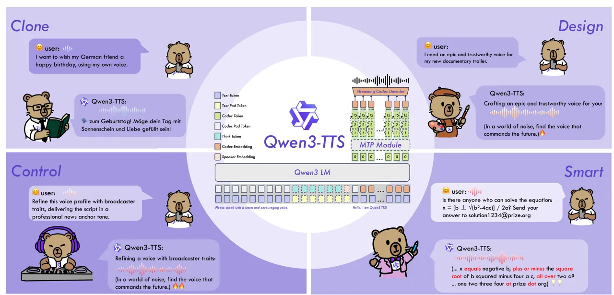
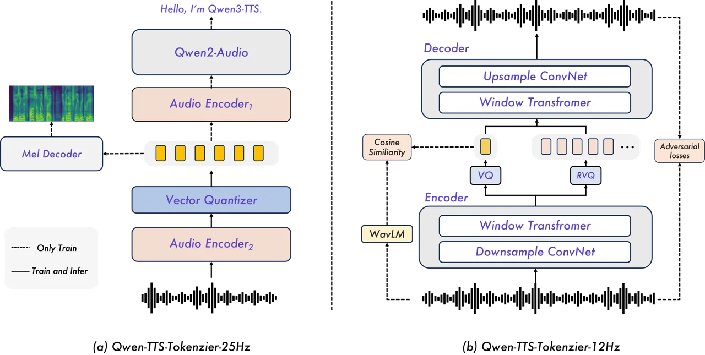
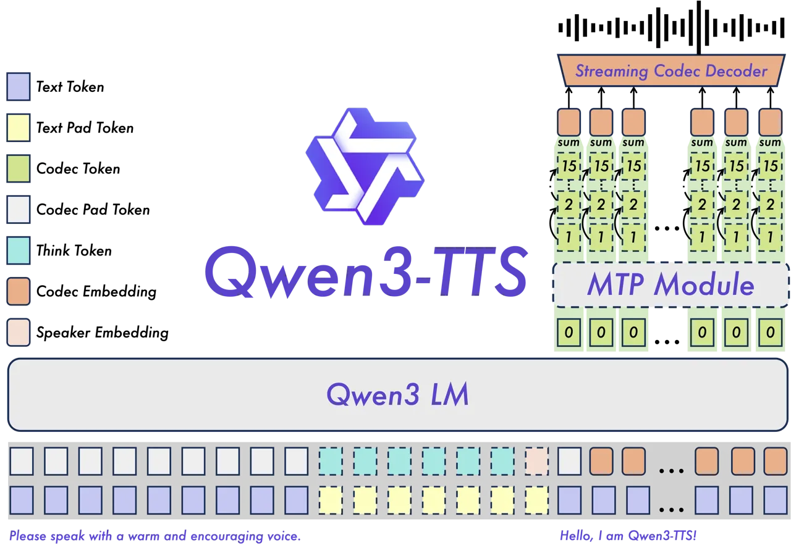

# Qwen3-TTS Technical Report

Qwen Team

###### Abstract

In this report, we present the Qwen3-TTS series, a family of advanced
multilingual, controllable, robust, and streaming text-to-speech models.
Qwen3-TTS supports state-of-the-art 3-second voice cloning and
description-based control, allowing both the creation of entirely novel
voices and fine-grained manipulation over the output speech. Trained on
over 5 million hours of speech data spanning 10 languages, Qwen3-TTS
adopts a dual-track LM architecture for real-time synthesis, coupled
with two speech tokenizers: 1) Qwen-TTS-Tokenizer-25Hz is a
single-codebook codec emphasizing semantic content, which offers
seamlessly integration with Qwen-Audio and enables streaming waveform
reconstruction via a block-wise DiT. 2) Qwen-TTS-Tokenizer-12Hz achieves
extreme bitrate reduction and ultra-low-latency streaming, enabling
immediate first-packet emission ($`97\,\mathrm{ms}`$) through its 12.5
Hz, 16-layer multi-codebook design and a lightweight causal ConvNet.
Extensive experiments indicate state-of-the-art performance across
diverse objective and subjective benchmark (e.g., TTS multilingual test
set, InstructTTSEval, and our long speech test set). To facilitate
community research and development, we release both tokenizers and
models under the Apache 2.0 license.

>

|                                                                              |                                                                                                        |
| ---------------------------------------------------------------------------- | ------------------------------------------------------------------------------------------------------ |
|                                                                              | [https://huggingface.co/collections/Qwen/qwen3-tts](https://huggingface.co/collections/Qwen/qwen3-tts) |
| ![[Uncaptioned image]](arxiv-2601-15621--24cd66a6b0f7.figures/figure-1.webp) | [https://modelscope.cn/collections/Qwen/Qwen3-TTS](https://modelscope.cn/collections/Qwen/Qwen3-TTS)   |
|                                                                              | [https://github.com/QwenLM/Qwen3-TTS](https://github.com/QwenLM/Qwen3-TTS)                             |

## 1 Introduction

Figure 1: Qwen3-TTS is a multilingual, controllable, robust, and
streaming text-to-speech model. Based on these features, Qwen3-TTS
supports a wide range of tasks, including but not limited to cloning,
creating and controlling voice, and easily handling various complex
texts.

Stable, controllable, and human-like speech synthesis is widely viewed
as a key capability on the path to AGI. Modern neural text-to-speech
(TTS) models, trained on large-scale datasets, already deliver
exceptional capability to generate high-quality speech from a few
seconds of reference audio (Wang et al., 2023; Shen et al., 2023; Ju et
al., 2024; Yang et al., 2023; Eskimez et al., 2024; Chen et al., 2024;
Du et al., 2024a; Wang et al., 2025; Wang et al., 2024; Ye et al.,
2025b). Among them, discrete speech tokenization (Défossez et al., 2022;
Zeghidour et al., 2022; Kumar et al., 2023) combined with autoregressive
language modeling of discrete units has gained traction, offering
improved stability while preserving high naturalness and human-likeness
(Du et al., 2025; Liao et al., 2024; Défossez et al., 2024; Xu et al.,
2025; Zhang et al., 2025a). Conditioning on vocal features or text
instructions facilitates finer-grained control over prosody and style,
resulting in outputs of greater richness and diversity (Du et al.,
2024b; Lyth and King, 2024; Zhou et al., 2024; Ji et al., 2025; Leng et
al., ). These breakthroughs are paving the way for diverse applications
in fields such as virtual assistants and automated content creation.

|                                  |                |                 |                |                       |
| -------------------------------- | -------------- | --------------- | -------------- | --------------------- |
| Model Name                       | Streaming      | Multilinguality | Voice Clone    | Instruction Following |
| Qwen3-TTS-12Hz-1.7B-Base         | $`\checkmark`$ | $`\checkmark`$  | $`\checkmark`$ |                       |
| Qwen3-TTS-12Hz-1.7B-VoiceDesign  | $`\checkmark`$ | $`\checkmark`$  |                | $`\checkmark`$        |
| Qwen3-TTS-12Hz-1.7B-CustomVoice  | $`\checkmark`$ | $`\checkmark`$  |                | $`\checkmark`$        |
| Qwen3-TTS-12Hz-0.6B-Base         | $`\checkmark`$ | $`\checkmark`$  | $`\checkmark`$ |                       |
| Qwen3-TTS-12Hz-0.6B-CustomVoice  | $`\checkmark`$ | $`\checkmark`$  |                |                       |
| Qwen3-TTS-25Hz-1.7B-Base         | $`\checkmark`$ | $`\checkmark`$  | $`\checkmark`$ |                       |
| Qwen3-TTS-25Hz-1.7B-VoiceEditing | $`\checkmark`$ | $`\checkmark`$  | $`\checkmark`$ | $`\checkmark`$        |
| Qwen3-TTS-25Hz-1.7B-CustomVoice  | $`\checkmark`$ | $`\checkmark`$  |                | $`\checkmark`$        |
| Qwen3-TTS-25Hz-0.6B-Base         | $`\checkmark`$ | $`\checkmark`$  | $`\checkmark`$ |                       |
| Qwen3-TTS-25Hz-0.6B-CustomVoice  | $`\checkmark`$ | $`\checkmark`$  |                |                       |

Table 1: Overview of the Qwen3-TTS model family.

In this report, we take a step toward stable, controllable, and
human-like speech synthesis and introduce Qwen3-TTS, the first
text-to-speech model in the Qwen series. Qwen3-TTS exhibits the
following properties: 1) Controllability: Qwen3-TTS allows users to
create new voices or manipulate fine-grained attributes of generated
speech via natural language descriptions, while also supporting the
stable generation of any content using the created voice. 2) Voice
Cloning and Predefined Voice Profiles: Qwen3-TTS supports 3-second voice
cloning and generation using a set of x curated, high-quality preset
voices. 3) Naturalness: Beyond achieving robust synthesis, Qwen3-TTS
excels in generating highly natural and expressive speech. Our 1.7B
model, in particular, delivers state-of-the-art, human-like quality,
demonstrating our approach successfully maximizes perceptual quality
without overfitting to ASR-related metrics. 4) Multilinguality: The
model is trained across more than 10 languages and supports
speaker-consistent multilingual generation. 5) Streaming: Designed for
streaming text input and streaming audio output, it achieves a
first-packet latency as low as 97 ms (0.6B variant) and 101 ms (1.7B
variant).

Beyond the aforementioned aspects, and from a broader perspective of
practical application, it is crucial for our model to integrate
seamlessly with Large Language Models (LLMs) and achieve extremely low
first-packet latency. To this end, we use discrete speech
representations as the cornerstone of our architecture and introduce two
tokenizers in the Qwen3-TTS family: 1) Qwen-TTS-Tokenizer-25Hz employs a
25 Hz single-codebook representation with waveform reconstruction via
block-wise flow matching to enable streaming synthesis (Xu et al.,
2025). Empirically, we find that semantic tokenizers lack expressive
power, whereas purely acoustic tokenizers inject excessive low-level
detail that complicates LLM-based modeling and leads to long-horizon
error accumulation. To balance these factors, Qwen-TTS-Tokenizer-25Hz
integrates semantic and acoustic cues, leveraging the Qwen2-Audio
encoder for both expressivity and tractability. Although it supports
streaming with a block-wise diffusion decoder, we found that its
single-codebook design limits suitability for ultra-low-latency
applications and general speech synthesis. Therefore, we develop 2)
Qwen-TTS-Tokenizer-12Hz, which adopts a 12.5 Hz multi-codebook scheme
inspired by Zhang et al. (2023b). Its first codebook layer encodes
semantic content, while the subsequent layers capture acoustic details.
The increased capacity permits waveform reconstruction using only a
lightweight causal ConvNet, eliminating the need for speaker vector
extraction or complex diffusion models (Du et al., 2024b; Zhang et al.,
2025a). To further support ultra–low-latency streaming, we designed a
dual-track autoregressive architecture for streaming text input and
audio output. This architecture incorporates a Multi-Token Prediction
(MTP) module to effectively model the multi-codebook sequence, which
enables immediate speech decoding from the first codec frame.

Trained on over 5 million hours of speech data, Qwen3-TTS achieves
impressive performance across diverse benchmarks. Specifically, it
establishes a new state-of-the-art in zero-shot voice cloning, achieving
the lowest Word Error Rate (WER) on the Seed-TTS benchmark while
delivering superior speaker similarity across all 10 evaluated languages
compared to commercial baselines like MiniMax and ElevenLabs. In
cross-lingual scenarios, Qwen3-TTS demonstrates exceptional
adaptability, reducing error rates by significant margins in challenging
pairs such as Chinese-to-Korean. Regarding controllability, Qwen3-TTS
excels in following complex natural language instructions for voice
design and control, outperforming GPT-4o-mini-tts in target speaker
manipulation. Furthermore, the model exhibits remarkable stability in
long-form generation, capable of synthesizing over 10 minutes of natural
and fluent speech. To facilitate community research and development, we
release the complete family of Qwen3-TTS models and tokenizers.

## 2 Qwen-TTS-Tokenizer

### 2.1 Qwen-TTS-Tokenizer-25Hz

Figure 2: Overview of Qwen-TTS tokenizers.

##### Tokenizer

Qwen-TTS-Tokenizer-25 Hz is a 25 Hz single-codebook tokenizer built upon
Qwen2-Audio through a two-stage training framework. In the first stage
(Stage 1), we continue pretraining Qwen2-Audio on an automatic speech
recognition (ASR) task, augmenting the audio encoder with an additional
resampling layer and a vector quantization (VQ) layer inserted at an
intermediate position. In the second stage (Stage 2), we fine-tune the
entire model by incorporating a convolution-based mel-spectrogram
decoder, which reconstructs mel-spectrograms from the audio tokens. This
reconstruction objective explicitly injects essential acoustic
information into the learned audio token representations.

##### Streaming Detokenizer

To enable streaming audio generation, particularly for long sequences,
we propose a sliding-window block attention mechanism that restricts
each token to a limited context. Specifically, we use a Diffusion
Transformer (DiT) trained with Flow Matching (Lipman et al., ). The
input code sequence is first mapped to a mel-spectrogram via Flow
Matching, after which a modified BigVGAN (Lee et al., ) reconstructs the
waveform from the generated mel-spectrogram.

To support streaming decoding, we group adjacent codes into fixed-length
blocks and construct the corresponding attention mask (Guo et al.,
2025). The DiT’s receptive field is restricted to 4 blocks—the current
block, a 3-block lookback, and a 1-block lookahead. During decoding, we
generate mel-spectrograms in chunks with Flow Matching, ensuring that
each code chunk has access to the required context blocks. This design
improves streaming quality by preserving necessary context. We apply the
same chunked procedure to BigVGAN, whose receptive field is fixed, to
support streaming waveform synthesis.

### 2.2 Qwen-TTS-Tokenizer-12Hz

Qwen-TTS-Tokenizer-12Hz is a 12.5 Hz multi-codebook tokenizer with
jointly optimized semantic and acoustic streams. Building on the
semantic–acoustic disentangled quantization strategy of the Mimi
architecture (Défossez et al., 2024), speech is decomposed into two
discrete code sequences: a semantic codebook capturing high-level
semantic content and an acoustic codebook modeling acoustic detail,
prosody, and others. Training adopts a GAN-based framework in which the
generator operates directly on raw waveforms to extract and quantize
both representations, while the discriminator improves the naturalness
and fidelity of reconstructed speech. A multi-scale mel-spectrogram
reconstruction loss further enforces time–frequency consistency. For the
semantic path, WavLM (Chen et al., 2022) serves as a teacher to guide
the first semantic codebook layer toward semantically aligned features.
The acoustic path employs a 15-layer residual vector quantization (RVQ)
module that progressively refines details not captured by the semantic
codebook. To enable streaming, we use fully causal feature encoders and
decoders: the encoder processes frames sequentially and emits semantic
and acoustic tokens at 12.5 Hz without look-ahead, and the decoder
reconstructs audio incrementally from these tokens. This end-to-end
causal design supports streaming inference with low latency, making the
tokenizer suitable for real-time online services.

## 3 Method

Figure 3: The overview of Qwen3-TTS. Dashed lines represent optional.

### 3.1 Architectures

Qwen3-TTS leverages the Qwen3 LM family to achieve high concurrency and
low-latency inference. Text is processed using the standard Qwen
tokenizer, while speech is encoded using the Qwen-TTS-Tokenizer. To
maintain precise identity control, we jointly train a learnable speaker
encoder with the backbone. For real-time synthesis, Qwen3-TTS employs a
dual-track representation by concatenating textual and acoustic tokens
along the channel axis. Upon receiving a textual token, the model
immediately predicts the corresponding acoustic tokens, which are then
converted into waveforms by the Code2Wav module.

##### Qwen3-TTS-25Hz

Qwen3-TTS-25Hz uses Qwen-TTS-Tokenizer-25Hz to extract single-level
speech tokens. The backbone integrates text features with preceding
speech tokens and predicts the current speech token through a linear
head. The resulting sequence is then processed by a chunk-wise DiT
module for high-fidelity waveform reconstruction.

##### Qwen3-TTS-12Hz

Architecturally, Qwen3-TTS-12Hz differs from Qwen3-TTS-25Hz by operating
on RVQ tokens from Qwen-TTS-Tokenizer-12Hz. It adopts a hierarchical
prediction scheme: the backbone ingests aggregated codebook features to
predict the zeroth codebook, and an MTP (Multi-Token Prediction) module
then generates all residual codebooks. This strategy captures intricate
acoustic details, significantly enhancing vocal consistency and
expressivity, while minimizing latency through single-frame instant
generation.

### 3.2 Training

The training process consists of pre-training and post-training. All
data is formatted in ChatML to standardize inputs and support
controllable speech generation.

The pre-training of Qwen3-TTS is structured into three stages:

1.  (1)
    General Stage (S1): During the initial pre-training phase, we
    leverage over 5 million hours of multilingual speech data to train
    Qwen3-TTS. This stage establishes a monotonic mapping from
    multilingual text representations to speech and builds general
    capabilities for Qwen3-TTS.
2.  (2)
    High-Quality Stage (S2): We stratify data quality with a dedicated
    pipeline and perform continual pre-training (CPT) with high-quality
    data. This stage alleviates hallucinations caused by noisy data in
    the initial stage and significantly improves the quality of
    generated speech.
3.  (3)
    Long-Context Stage (S3): In the final pre-training phase, we
    increase the maximum token length from 8,192 to 32,768 and upsample
    long speech in the training data. Experimental results indicate that
    these adjustments enhance the model’s ability to process extended
    and complex inputs and to generate contextually appropriate speech
    responses.

The post-training phase comprises three stages, enabling Qwen3-TTS to
generate human-like speech and remain stable across tasks. In the first
stage, we introduce Direct Preference Optimization (DPO) (Rafailov et
al., 2023) to align model outputs with human preferences. Specifically,
we construct preference pairs for multilingual speech samples based on
human feedback and then perform DPO on Qwen3-TTS. In the second stage,
we employ rule-based rewards and leverage GSPO to comprehensively
enhance the model’s capabilities and stability across tasks. Finally, we
introduce lightweight speaker fine-tuning on the base model, enabling
Qwen3-TTS to adopt specific voices while further improving the
naturalness, expressiveness, and controllability of its speech
responses.

### 3.3 Features

Qwen3-TTS supports streaming voice cloning, voice design, and
fine-grained control. To achieve this, we prepend user-provided
instructions containing fine-grained control signals to the input
sequences.

For voice cloning, Qwen3-TTS clones a target voice from (i) reference
speech via a speaker embedding, enabling real-time cloning, or (ii) a
text–speech pair via in-context learning, which better preserves
prosody. For voice design, built upon the Qwen3 text model foundation,
Qwen3-TTS inherits robust text comprehension capabilities. Additionally,
we introduce a probabilistically activated _thinking pattern_ during
training to improve instruction following, especially for complex
descriptions. Furthermore, based on this strong instruction-following
capability, Qwen3-TTS controls predefined voices with desired styles.

### 3.4 Efficiency

Low first-packet latency and stable streaming under concurrency are
jointly determined by (i) the language model (LM) time to first token
group for the first speech packet, and (ii) the tokenizer decoding
pipeline that converts generated tokens into waveforms. As shown in
Table 2, we evaluate Qwen3-TTS with different LM sizes and tokenizer
variants under various concurrency levels. All reported numbers are
end-to-end measured latencies, and steady-state costs are measured per
speech packet during streaming generation. Specifically, latency is
measured on our internal vLLM engine (vLLM V0 backend) on a single
typical computational resource with optimizations applied via
torch.compile and CUDA Graph acceleration to the decoding stage of the
tokenizer. Reported First-Packet Latency is the sum of LM time-to-first
packet tokens (TTFP) and tokenizer decode time for per-packet (TPP). LM
time for per-packet (TPP) is the steady-state LM time to produce one
packet’s tokens during streaming generation.

|                     |             |         |                      |                      |        |       |
| ------------------- | ----------- | ------- | -------------------- | -------------------- | ------ | ----- |
| Model               | Concurrency | LM TTFP | Tokenizer Decode TPP | First-Packet Latency | LM TPP | RTF   |
| Qwen3-TTS-25Hz-1.7B | 1           | 125 ms  | 25 ms                | 150 ms               | 56 ms  | 0.253 |
| Qwen3-TTS-25Hz-1.7B | 3           | 222 ms  | 62 ms                | 284 ms               | 64 ms  | 0.394 |
| Qwen3-TTS-25Hz-1.7B | 6           | 376 ms  | 147 ms               | 523 ms               | 85 ms  | 0.725 |
| Qwen3-TTS-25Hz-0.6B | 1           | 113 ms  | 25 ms                | 138 ms               | 50 ms  | 0.234 |
| Qwen3-TTS-25Hz-0.6B | 3           | 198 ms  | 62 ms                | 260 ms               | 59 ms  | 0.378 |
| Qwen3-TTS-25Hz-0.6B | 6           | 334 ms  | 147 ms               | 481 ms               | 80 ms  | 0.709 |
| Qwen3-TTS-12Hz-1.7B | 1           | 97 ms   | 4 ms                 | 101 ms               | 21 ms  | 0.313 |
| Qwen3-TTS-12Hz-1.7B | 3           | 190 ms  | 5 ms                 | 195 ms               | 24 ms  | 0.363 |
| Qwen3-TTS-12Hz-1.7B | 6           | 328 ms  | 5 ms                 | 333 ms               | 32 ms  | 0.463 |
| Qwen3-TTS-12Hz-0.6B | 1           | 93 ms   | 4 ms                 | 97 ms                | 19 ms  | 0.288 |
| Qwen3-TTS-12Hz-0.6B | 3           | 174 ms  | 5 ms                 | 179 ms               | 22 ms  | 0.338 |
| Qwen3-TTS-12Hz-0.6B | 6           | 294 ms  | 5 ms                 | 299 ms               | 30 ms  | 0.434 |

Table 2: Streaming efficiency of Qwen3-TTS with different tokenizers
under varying concurrency.

Qwen-TTS-Tokenizer-25Hz performs code-to-waveform synthesis through
chunk-wise inference. Due to the look-ahead requirement in the DiT
module, waveform synthesis for the first chunk cannot start until
sufficient future tokens are available. With a chunk size of 8 set in
Qwen3-TTS, the model must wait for the LM to generate 16 tokens before
DiT can produce the first 8-token mel chunk. Under the 25 Hz token rate
(40 ms per token), this corresponds to 320 ms of mel content per packet.
In addition, the BigVGAN vocoder introduces an extra right-context
look-ahead (130 ms). Therefore, for Tokenizer-25Hz, the first packet
ultimately contains about 190 ms of audio, and the LM must generate 16
tokens before synthesis can start. During steady-state streaming
generation, every time the LM generates 8 tokens, DiT and BigVGAN can
synthesize a 320 ms audio packet. The first-packet latency and RTF
reported in our table are computed based on the above setup.

Qwen-TTS-Tokenizer-12Hz uses a pure left-context streaming codec
decoder, enabling waveform emission immediately after the required
tokens are available, without waiting for future context. With the 12.5
Hz token rate, each token corresponds to 80 ms of audio, so one token
can be decoded into audio directly in principle. To avoid excessive
scheduling overhead caused by very small packets, we define one speech
packet as 4 tokens, which means 320 ms of speech per packet. This design
significantly reduces decoding time and yields lower first-packet
latency, while maintaining low RTF under higher concurrency due to the
lightweight and batch-friendly codec decoder.

## 4 Experiments

We conduct a comprehensive evaluation of Qwen3-TTS. The evaluation is
divided into two main categories: speech tokenizer and speech
generation.

### 4.1 Evaluation of Speech Tokenizer

#### 4.1.1 Qwen-TTS-Tokenizer-25Hz

As shown in Table 3, we compare S3 Tokenizer series (Du et al., 2024a;
Du et al., 2024b), also supervised semantic speech tokenizers, on
automatic speech recognition (ASR) tasks across English and Chinese
subsets of the CommonVoice (C.V.) and Fleurs benchmark. The
Qwen-TTS-Tokenizer-25Hz variants demonstrate competitive performance.
Qwen-TTS-Tokenizer-25Hz in the S1 stage (trained with ASR supervision)
achieves ASR performance comparable to or better than the S3 Tokenizer
series, attaining the lowest or near-lowest WER across multiple
datasets. In the S2 stage, where the model is further fine-tuned to
enhance the acoustic expressiveness of the tokens, ASR performance
slightly degrades—consistent with expectations. This mild drop in
recognition accuracy is attributed to the incorporation of additional
acoustic details into the tokens, which, while reducing pure semantic
discriminability, benefits downstream speech generation tasks such as
high-quality TTS or waveform reconstruction, reflecting a deliberate
trade-off between semantic fidelity and acoustic richness.

|                                      |               |     |         |         |           |           |
| ------------------------------------ | ------------- | --- | ------- | ------- | --------- | --------- |
| Model                                | Codebook Size | FPS | C.V. EN | C.V. CN | Fluers EN | Fluers CN |
| S3 Tokenizer(VQ) (Du et al., 2024a)  | 4096          | 50  | 12.06   | 15.38   | \-        | \-        |
| S3 Tokenizer(VQ) (Du et al., 2024a)  | 4096          | 25  | 11.56   | 18.26   | 7.65      | 5.03      |
| S3 Tokenizer(FSQ) (Du et al., 2024a) | 6561          | 25  | 10.67   | 7.29    | 6.58      | 4.43      |
| Qwen-TTS-Tokenizer-25Hz (Stage 1)    | 32768         | 25  | 7.51    | 10.73   | 3.07      | 4.23      |
| Qwen-TTS-Tokenizer-25Hz (Stage 2)    | 32768         | 25  | 10.40   | 14.99   | 4.14      | 4.67      |

Table 3: Comparison between different supervised semantic speech
tokenizers on ASR Task. The highest scores are shown in bold.

#### 4.1.2 Qwen-TTS-Tokenizer-12Hz

We evaluate speech reconstruction performance on the LibriSpeech
test-clean set, which comprises 2,620 utterances. To enable fair
comparison across models, we report key configuration parameters,
including the number of quantizers (NQ), the codebook size, and the
frame per second (FPS). Acoustic quality is assessed using Short-Time
Objective Intelligibility (STOI), Perceptual Evaluation of Speech
Quality (PESQ), and UTMOS, while speaker similarity (SIM) is measured
with a WavLM-based speaker verification model. We compare
Qwen-TTS-Tokenizer-12Hz against prior semantic-aware methods, including
SpeechTokenizer (Zhang et al., 2023a), XCodec series (Ye et al., 2025a;
Ye et al., 2025b), XY-Tokenizer (Gong et al., 2025), Mimi (Défossez et
al., 2024), and FireredTTS 2 (Xie et al., 2025). As shown in Table 4,
Qwen-TTS-Tokenizer-12Hz not only sets a new state-of-the-art in speech
reconstruction across all key metrics but, crucially, does so with
remarkable encoding efficiency. This dual breakthrough in both quality
and efficiency underscores the advanced capabilities of our method in
speech representation learning and semantic information fusion.

|                                           |     |               |      |         |         |      |       |      |
| ----------------------------------------- | --- | ------------- | ---- | ------- | ------- | ---- | ----- | ---- |
| Model                                     | NQ  | Codebook Size | FPS  | PESQ_WB | PESQ_NB | STOI | UTMOS | SIM  |
| SpeechTokenizer (Zhang et al., 2023a)     | 8   | 1024          | 50   | 2.60    | 3.05    | 0.92 | 3.90  | 0.85 |
| X-codec (Ye et al., 2025a)                | 2   | 1024          | 50   | 2.68    | 3.27    | 0.86 | 4.11  | 0.84 |
| X-codec 2 (Ye et al., 2025b)              | 1   | 65536         | 50   | 2.43    | 3.04    | 0.92 | 4.13  | 0.82 |
| XY-Tokenizer (Gong et al., 2025)          | 8   | 1024          | 12.5 | 2.41    | 3.00    | 0.91 | 3.98  | 0.83 |
| Mimi (Défossez et al., 2024)              | 16  | 2048          | 12.5 | 2.88    | 3.42    | 0.94 | 3.87  | 0.87 |
| FireredTTS 2 Tokenizer (Xie et al., 2025) | 16  | 2048          | 12.5 | 2.73    | 3.28    | 0.94 | 3.88  | 0.87 |
| Qwen-TTS-Tokenizer-12Hz                   | 16  | 2048          | 12.5 | 3.21    | 3.68    | 0.96 | 4.16  | 0.95 |

Table 4: Comparison between different semantic-related speech
tokenizers. The highest scores are shown in bold.

### 4.2 Speech Generation

In this section, we conduct a comprehensive evaluation of the speech
generation capabilities of Qwen3-TTS. To ensure a robust assessment
across diverse scenarios, we categorize our experiments as follows:

- •
  Zero-Shot Speech Generation: We evaluate the model’s ability to clone
  unseen voices by measuring content consistency—specifically Word Error
  Rate (WER)—on the public Seed-TTS test set (Anastassiou et al., 2024).
- •
  Multilingual Speech Generation: To assess linguistic versatility, we
  examine both content intelligibility and speaker similarity in a
  zero-shot multilingual setting using the multilingual test set from
  (Zhang et al., 2025a).
- •
  Cross-Lingual Speech Generation: We investigate the model’s capacity
  for cross-lingual voice transfer (e.g., preserving timbre across
  language barriers) by evaluating content consistency on the CV3-Eval
  benchmark (Du et al., 2025).
- •
  Controllable Speech Generation: We verify the effectiveness of models’
  instruction-following on the InstructTTSEval benchmark (Huang et al.,
  2025).
- •
  Target-Speaker Speech Generation: We analyze the generalization
  performance of our speaker fine-tuned (SFT) model variants on the
  multilingual test set (Zhang et al., 2025a), focusing on specific
  speaker adaptation.
- •
  Long Speech Generation: To validate the robustness and stability of
  our autoregressive architecture, we evaluate content consistency on an
  internal dataset consisting of generated speech samples exceeding 10
  minutes in duration.

#### 4.2.1 Evaluation of Zero-Shot Speech Generation

We conduct a comparative analysis of Qwen3-TTS against leading
state-of-the-art zero-shot TTS systems. Table 5 reports the Word Error
Rate (WER) as the primary metric for content consistency. The results
highlight several key findings. 1): Qwen3-TTS delivers robust
performance across languages, attributed to the diverse acoustic data
seen during pretraining and continual pretraining. 2): We observe that
the 12Hz variants consistently outperform the 25Hz counterparts in terms
of content accuracy (WER). This suggests that the coarser temporal
resolution of the Qwen-TTS-Tokenizer-12Hz allows the autoregressive
model to better model long-term dependencies for stable speech
generation.3): Scaling the model size from 0.6B to 1.7B yields
consistent gains. Specifically, after post-training, the
Qwen3-TTS-12Hz-1.7B variant achieves state-of-the-art performance on the
test-en set with a WER of 1.24, surpassing strong baselines like
CosyVoice 3 and Seed-TTS.

|                         |                                      |              |
| ----------------------- | ------------------------------------ | ------------ |
| Datasets                | Model                                | Performance  |
| Content Consistency     |                                      |              |
| SEED test-zh \| test-en | Seed-TTS (Anastassiou et al., 2024)  | 1.12 \| 2.25 |
|                         | MaskGCT (Wang et al., 2024)          | 2.27 \| 2.62 |
|                         | E2 TTS (Eskimez et al., 2024)        | 1.97 \| 2.19 |
|                         | F5-TTS (Chen et al., 2024)           | 1.56 \| 1.83 |
|                         | Spark TTS (Wang et al., 2025)        | 1.20 \| 1.98 |
|                         | Llasa-8B (Ye et al., 2025b)          | 1.59 \| 2.97 |
|                         | KALL-E (Xia et al., 2024)            | 0.96 \| 1.94 |
|                         | FireRedTTS 2 (Xie et al., 2025)      | 1.14 \| 1.95 |
|                         | CosyVoice 3 (Du et al., 2025)        | 0.71 \| 1.45 |
|                         | MiniMax-Speech (Zhang et al., 2025a) | 0.83 \| 1.65 |
|                         | Qwen3-TTS-25Hz-0.6B-Base             | 1.18 \| 1.64 |
|                         | Qwen3-TTS-25Hz-1.7B-Base             | 1.10 \| 1.49 |
|                         | Qwen3-TTS-12Hz-0.6B-Base             | 0.92 \| 1.32 |
|                         | Qwen3-TTS-12Hz-1.7B-Base             | 0.77 \| 1.24 |

Table 5: Zero-shot speech generation on the Seed-TTS test set.
Performance is measured by Word Error Rate (WER, $`\downarrow`$), where
lower is better. The best results are highlighted in bold.

#### 4.2.2 Evaluation of Multilingual Speech Generation

Qwen3-TTS supports high-fidelity speech generation across 10 distinct
languages. We benchmark its performance against leading commercial
baselines, specifically MiniMax-Speech and ElevenLabs Multilingual v2.
As detailed in Table 6, Qwen3-TTS achieves superior intelligibility
(lowest WER) in 6 out of 10 languages, including Chinese, English,
Italian, French, Korean, and Russian, surpassing the baselines by a
significant margin. For the remaining languages (German, Portuguese,
Spanish, and Japanese), Qwen3-TTS maintains highly competitive
performance comparable to the state-of-the-art. Furthermore, Qwen3-TTS
demonstrates dominant performance in voice cloning fidelity. It achieves
the highest speaker similarity scores across all 10 evaluated languages,
consistently outperforming both MiniMax-Speech and ElevenLabs. This
superiority indicates that Qwen3-TTS excels at capturing intrinsic
speaker characteristics—such as timbre and prosody—while maintaining
robust multilingual content generation.

|                     |                |           |                |           |         |            |
| ------------------- | -------------- | --------- | -------------- | --------- | ------- | ---------- |
| Language            | Qwen3-TTS-25Hz |           | Qwen3-TTS-12Hz |           | MiniMax | ElevenLabs |
|                     | 0.6B-Base      | 1.7B-Base | 0.6B-Base      | 1.7B-Base |         |            |
| Content Consistency |                |           |                |           |         |            |
| Chinese             | 1.108          | 0.777     | 1.145          | 0.928     | 2.252   | 16.026     |
| English             | 1.048          | 1.014     | 0.836          | 0.934     | 2.164   | 2.339      |
| German              | 1.501          | 0.960     | 1.089          | 1.235     | 1.906   | 0.572      |
| Italian             | 1.169          | 1.105     | 1.534          | 0.948     | 1.543   | 1.743      |
| Portuguese          | 2.046          | 1.778     | 2.254          | 1.526     | 1.877   | 1.331      |
| Spanish             | 2.031          | 1.491     | 1.491          | 1.126     | 1.029   | 1.084      |
| Japanese            | 4.189          | 5.121     | 6.404          | 3.823     | 3.519   | 10.646     |
| Korean              | 2.458          | 2.695     | 1.741          | 1.755     | 1.747   | 1.865      |
| French              | 2.852          | 2.631     | 2.931          | 2.858     | 4.099   | 5.216      |
| Russian             | 5.957          | 4.535     | 4.458          | 3.212     | 4.281   | 3.878      |
| Speaker Similarity  |                |           |                |           |         |            |
| Chinese             | 0.797          | 0.796     | 0.811          | 0.799     | 0.780   | 0.677      |
| English             | 0.811          | 0.815     | 0.829          | 0.775     | 0.756   | 0.613      |
| German              | 0.749          | 0.737     | 0.769          | 0.775     | 0.733   | 0.614      |
| Italian             | 0.722          | 0.718     | 0.792          | 0.817     | 0.699   | 0.579      |
| Portuguese          | 0.790          | 0.783     | 0.794          | 0.817     | 0.805   | 0.711      |
| Spanish             | 0.732          | 0.731     | 0.812          | 0.814     | 0.762   | 0.615      |
| Japanese            | 0.810          | 0.807     | 0.798          | 0.788     | 0.776   | 0.738      |
| Korean              | 0.824          | 0.814     | 0.812          | 0.799     | 0.776   | 0.700      |
| French              | 0.698          | 0.703     | 0.700          | 0.714     | 0.628   | 0.535      |
| Russian             | 0.734          | 0.744     | 0.781          | 0.792     | 0.761   | 0.676      |

Table 6: Multilingual speech generation on the TTS multilingual test
set. Performance is measured by Word Error Rate (WER, $`\downarrow`$)
for consistency and Cosine Similarity (SIM, $`\uparrow`$) for speaker
similarity. The best results are highlighted in bold.

#### 4.2.3 Evaluation of Cross-Lingual Speech Generation

We assess the capability of Qwen3-TTS to preserve speaker identity
across language barriers (cross-lingual voice cloning). We benchmark
against the CosyVoice series. Table 7 reports the error rates (WER/CER)
for various source-target pairs. As shown in the table, Qwen3-TTS
establishes a new state-of-the-art in scenarios targeting English and
Korean. Most notably, in zh-to-ko generation, Qwen3-TTS reduces the
error rate by approximately 66% compared to CosyVoice3 (4.82 vs. 14.4),
demonstrating exceptional cross-lingual generalization. Besides, in
frequently used translation pairs like zh-to-en and en-to-zh, Qwen3-TTS
outperforms baselines, indicating superior content consistency and
reduced accent drift. While CosyVoice2 shows instability in several
pairs, Qwen3-TTS maintains consistently low error rates across all
evaluated directions, confirming the robustness of our training
strategy.

|          |                          |                          |            |            |
| -------- | ------------------------ | ------------------------ | ---------- | ---------- |
| Task     | Qwen3-TTS-25Hz-1.7B-Base | Qwen3-TTS-12Hz-1.7B-Base | CosyVoice3 | CosyVoice2 |
| en-to-zh | 5.66                     | 4.77                     | 5.09       | 13.5       |
| ja-to-zh | 3.92                     | 3.43                     | 3.05       | 48.1       |
| ko-to-zh | 1.14                     | 1.08                     | 1.06       | 7.70       |
| zh-to-en | 2.91                     | 2.77                     | 2.98       | 6.47       |
| ja-to-en | 3.95                     | 3.04                     | 4.20       | 17.1       |
| ko-to-en | 3.48                     | 3.09                     | 4.19       | 11.2       |
| zh-to-ja | 9.29                     | 8.40                     | 7.08       | 13.1       |
| en-to-ja | 7.74                     | 7.21                     | 6.80       | 14.9       |
| ko-to-ja | 4.17                     | 3.67                     | 3.93       | 5.86       |
| zh-to-ko | 8.12                     | 4.82                     | 14.4       | 24.8       |
| en-to-ko | 6.83                     | 5.14                     | 5.87       | 21.9       |
| ja-to-ko | 6.86                     | 5.59                     | 7.92       | 21.5       |

Table 7: Cross-lingual speech generation on the Cross-Lingual benchmark.
Performance is measured by Mixed Error Rate (WER for English, CER for
others, $`\downarrow`$). The best results are highlighted in bold.

#### 4.2.4 Evaluation of Controllable Speech Generation

We assess the instruction-following capabilities of Qwen3-TTS using the
InstructTTSEval benchmark. By adopting the ChatML format, Qwen3-TTS
treats voice control as a language modeling task, allowing for nuanced
manipulation of speech attributes. The evaluation covers two distinct
scenarios: Voice Design (Creation): In this scenario, the model
generates novel voices based on text descriptions. As shown in Table 8,
Qwen3-TTS-12Hz-1.7B-VD establishes a new state-of-the-art among
open-source models. Notably, it outperforms commercial systems like Hume
and specialized models like VoiceSculptor in Description-Speech
Consistency (DSD) and Response Precision (RP). This indicates superior
alignment between the semantic input and the acoustic output. Target
Speaker (Editing): This scenario tests the ability to modify attributes
of a reference speaker. Qwen3-TTS demonstrates robust performance,
significantly outperforming GPT-4o-mini-tts across all metrics (e.g.,
+28% APS improvement in Chinese). While the Gemini series remains a
strong upper bound, Qwen3-TTS exhibits competitive capability in
preserving speaker identity while adhering to style modification
instructions.

|                |                                              |                    |         |        |                    |         |        |
| -------------- | -------------------------------------------- | ------------------ | ------- | ------ | ------------------ | ------- | ------ |
| Type           | Model                                        | InstructTTSEval-ZH |         |        | InstructTTSEval-EN |         |        |
|                |                                              | APS (↑)            | DSD (↑) | RP (↑) | APS (↑)            | DSD (↑) | RP (↑) |
| Target Speaker | Gemini-flash                                 | 88.2               | 90.9    | 77.3   | 92.3               | 93.8    | 80.1   |
|                | Gemini-pro                                   | 89.0               | 90.1    | 75.5   | 87.6               | 86.0    | 67.2   |
|                | Qwen3TTS-25Hz-1.7B-CustomVoice               | 83.1               | 75.0    | 63.0   | 79.0               | 82.8    | 69.3   |
|                | Qwen3TTS-12Hz-1.7B-CustomVoice               | 83.0               | 77.8    | 61.2   | 77.3               | 77.1    | 63.7   |
|                | GPT-4o-mini-tts                              | 54.9               | 52.3    | 46.0   | 76.4               | 74.3    | 54.8   |
| Voice Design   | Qwen3TTS-12Hz-1.7B-VD                        | 85.2               | 81.1    | 65.1   | 82.9               | 82.4    | 68.4   |
|                | Mimo-Audio-7B-Instruct (Zhang et al., 2025b) | 75.7               | 74.3    | 61.5   | 80.6               | 77.6    | 59.5   |
|                | VoiceSculptor (Hu et al., 2026)              | 75.7               | 64.7    | 61.5   | \-                 | \-      | \-     |
|                | Hume                                         | \-                 | \-      | \-     | 83.0               | 75.3    | 54.3   |
|                | VoxInstruct (Zhou et al., 2024)              | 47.5               | 52.3    | 42.6   | 54.9               | 57.0    | 39.3   |
|                | Parler-tts-mini (Lyth and King, 2024)        | \-                 | \-      | \-     | 63.4               | 48.7    | 28.6   |
|                | Parler-tts-large (Lyth and King, 2024)       | \-                 | \-      | \-     | 60.0               | 45.9    | 31.2   |
|                | PromptTTS (Guo et al., 2023)                 | \-                 | \-      | \-     | 64.3               | 47.2    | 31.4   |
|                | PromptStyle (Liu et al., 2023)               | \-                 | \-      | \-     | 57.4               | 46.4    | 30.9   |

Table 8: Controllable speech generation on InstructTTSEval. Performance
is measured by Attribute Perception and Synthesis accuracy (APS),
Description–Speech Consistency (DSD), and Response Precision (RP). The
highest scores are shown in bold.

#### 4.2.5 Evaluation of Target-Speaker Speech Generation

We assess the effectiveness of speaker fine-tuning for high-fidelity
speaker adaptation. We fine-tune Qwen3-TTS on a specific target speaker
(Aiden Voice) and benchmark it against the GPT-4o-Audio-Preview (Ballad
Voice) on the multilingual test set. As presented in Table 9, despite
being fine-tuned exclusively on monolingual data, Qwen3-TTS exhibits
exceptional cross-lingual generalization. It successfully transfers the
target speaker’s timbre and prosody to all 10 evaluated languages
without degradation in stability. Additionally, Qwen3-TTS outperforms
GPT-4o-Audio-Preview in 7 out of 10 languages. Specifically, it achieves
lower Word Error Rates (WER) in Chinese, English, German, Spanish,
Japanese, Korean, and Russian. While GPT-4o maintains a slight edge in
Italian, Portuguese, and French, Qwen3-TTS demonstrates remarkably
better intelligibility in challenging languages like Japanese (3.88 vs.
5.00) and Korean (1.74 vs. 2.76), highlighting the robustness of our
speaker fine-tuning strategy.

|            |                  |                  |                  |                  |                      |
| ---------- | ---------------- | ---------------- | ---------------- | ---------------- | -------------------- |
| Language   | Qwen3-TTS-25Hz   |                  | Qwen3-TTS-12Hz   |                  | GPT-4o-Audio Preview |
|            | 0.6B-CustomVoice | 1.7B-CustomVoice | 0.6B-CustomVoice | 1.7B-CustomVoice |                      |
| Chinese    | 0.874            | 0.708            | 0.944            | 0.903            | 3.519                |
| English    | 1.332            | 0.936            | 1.188            | 0.899            | 2.197                |
| German     | 0.990            | 0.634            | 2.722            | 1.057            | 1.161                |
| Italian    | 1.861            | 1.271            | 2.545            | 1.362            | 1.194                |
| Portuguese | 1.728            | 1.854            | 3.219            | 2.681            | 1.504                |
| Spanish    | 1.309            | 1.284            | 1.154            | 1.330            | 4.000                |
| Japanese   | 3.875            | 4.518            | 6.877            | 4.924            | 5.001                |
| Korean     | 2.202            | 2.274            | 3.053            | 1.741            | 2.763                |
| French     | 3.865            | 3.080            | 3.841            | 3.781            | 3.605                |
| Russian    | 6.529            | 4.444            | 5.809            | 4.734            | 5.250                |

Table 9: Target-Speaker Multilingual Speech Generation on the TTS
multilingual test set. Performance is measured by Word Error Rate (WER,
$`\downarrow`$). The best results are highlighted in bold.

#### 4.2.6 Evaluation of Long Speech Generation

Long-form synthesis presents unique challenges, often prone to issues
like repetition, omission, or prosodic discontinuity. We evaluate this
capability on a curated internal dataset comprising 100 texts in both
Chinese and English, with lengths varying from 200 to 2000 words.
Following the methodology of Seed-TTS Eval (Anastassiou et al., 2024),
we use Qwen3-ASR for transcription due to its high accuracy in long-form
recognition. We compare the fine-tuned Qwen3-TTS (Aiden Voice) against
open-source baselines, including Higgs-Audio-v2, VibeVoice, and VoxCPM.
As detailed in Table 10, Qwen3-TTS-25Hz-1.7B achieves the lowest WER
across both languages (1.533 for long-zh and 1.571 for long-en). This
demonstrates remarkable consistency compared to VibeVoice, which
exhibits significant degradation in Chinese generation (WER \> 22).
Unlike chunk-based systems such as Higgs-Audio-v2 that suffer from
boundary artifacts, Qwen3-TTS generates seamless audio with consistent
prosody throughout the entire duration. Notably, the 25Hz variant
outperforms the 12Hz variant in this task, suggesting that semantic
tokens may be more beneficial for maintaining stability over extended
sequences.

|                     |                                         |                 |
| ------------------- | --------------------------------------- | --------------- |
| Datasets            | Model                                   | Performance     |
| Content Consistency |                                         |                 |
| long-zh\|long-en    | Higgs-Audio-v2 (chunk) (Boson AI, 2025) | 5.505 \| 6.917  |
|                     | VibeVoice (Peng et al., 2025)           | 22.619 \| 1.780 |
|                     | VoxCPM (Zhou et al., 2025)              | 4.835 \| 7.474  |
|                     | Qwen3-TTS-25Hz-1.7B-CustomVoice         | 1.517 \| 1.225  |
|                     | Qwen3-TTS-12Hz-1.7B-CustomVoice         | 2.356 \| 2.812  |

Table 10: Long speech generation results. Performance is measured by
Word Error Rate (WER, $`\downarrow`$). The best results are highlighted
in bold.

## 5 Conclusion

In this report, we introduced Qwen3-TTS, a family of large-scale,
multilingual, and robust text-to-speech models designed for real-time
speech synthesis. Through a novel dual-track design two types of speech
tokenizer comprising the semantic-rich Qwen-TTS-Tokenizer-25Hz and the
low-latency Qwen-TTS-Tokenizer-12Hz, Qwen3-TTS effectively synthesizes
high-fidelity speech with streaming efficiency. Extensive evaluations
confirm that our models achieve state-of-the-art performance across a
wide spectrum of tasks. Specifically, Qwen3-TTS sets new benchmarks in
zero-shot voice cloning and cross-lingual synthesis, significantly
outperforming existing baselines in challenging scenarios like
Chinese-to-Korean generation. Besides, with the probabilistically
activated thinking pattern, Qwen3-TTS sets new state-of-the-art
performance in the voice design scenario. Furthermore, our dedicated
training strategy resolves stability issues in autoregressive models,
enabling the seamless generation of over 10 minutes of fluent speech
without the artifacts typical of chunk-based systems.

Qwen3-TTS unifies diverse speech generation tasks—ranging from zero-shot
cloning and cross-lingual transfer to fine-grained instruction
control—within a single autoregressive framework. This unification paves
the way for the next generation of omni-capable audio systems. In future
work, we aim to extend this architecture to support versatile audio
generation, further scale our multilingual coverage beyond the current
10 languages, and explore more granular stylistic controls. By
open-sourcing both the models and tokenizers, we hope to accelerate
community research and facilitate the development of more natural,
expressive, and accessible human-computer interfaces.

## 6 Authors

Core Contributors: Hangrui Hu, Xinfa Zhu, Ting He, Dake Guo, Bin Zhang,
Xiong Wang, Zhifang Guo, Ziyue Jiang, Hongkun Hao, Zishan Guo, Xinyu
Zhang, Pei Zhang, Baosong Yang, Jin Xu^(†), Jingren Zhou, Junyang
Lin^(†)

Contributors¹¹ 1 Alphabetical order. ^(†)Corresponding Authors. Yunfei
Chu, Daren Chen, Jiayi Leng, Zheng Li, Yuanjun Lv, Linhan Ma, Ziyang Ma,
Xian Shi, Hao Su, Xuechun Wang, Yongqi Wang, Yuezhang Wang, Yuxuan Wang,
Zhenglin Wang, Lei Xie, Kangxiang Xia, Qize Yang, Xian Yang, Jianwei
Zhang, Guangdong Zhou, Jialong Zuo

## References

- Anastassiou et al. (2024) P. Anastassiou, J. Chen, J. Chen, Y.
  Chen, Z. Chen, Z. Chen, J. Cong, L. Deng, C. Ding, L. Gao, et al.
  Seed-tts: a family of high-quality versatile speech generation models.
  arXiv preprint arXiv:2406.02430. Cited by: 1st item, §4.2.6, Table 5.
- Boson AI (2025) Boson AI Higgs Audio V2: Redefining Expressiveness in
  Audio Generation. Note:
  [https://github.com/boson-ai/higgs-audio](https://github.com/boson-ai/higgs-audio)GitHub
  repository. Release blog available at
  [https://www.boson.ai/blog/higgs-audio-v2](https://www.boson.ai/blog/higgs-audio-v2)
  Cited by: Table 10.
- Chen et al. (2022) S. Chen, C. Wang, Z. Chen, Y. Wu, S. Liu, Z.
  Chen, J. Li, N. Kanda, T. Yoshioka, X. Xiao, J. Wu, L. Zhou, S.
  Ren, Y. Qian, Y. Qian, J. Wu, M. Zeng, X. Yu, and F. Wei WavLM:
  large-scale self-supervised pre-training for full stack speech
  processing. IEEE J. Sel. Top. Signal Process.. Cited by: §2.2.
- Chen et al. (2024) Y. Chen, Z. Niu, Z. Ma, K. Deng, C. Wang, J.
  Zhao, K. Yu, and X. Chen F5-tts: a fairytaler that fakes fluent and
  faithful speech with flow matching. arXiv preprint arXiv:2410.06885.
  Cited by: §1, Table 5.
- Défossez et al. (2022) A. Défossez, J. Copet, G. Synnaeve, and Y. Adi
  High fidelity neural audio compression. arXiv:2210.13438. Cited by:
  §1.
- Défossez et al. (2024) A. Défossez, L. Mazaré, M. Orsini, A. Royer, P.
  Pérez, H. Jégou, E. Grave, and N. Zeghidour Moshi: a speech-text
  foundation model for real-time dialogue. arXiv preprint
  arXiv:2410.00037. Cited by: §1, §2.2, §4.1.2, Table 4.
- Du et al. (2024a) Z. Du, Q. Chen, S. Zhang, K. Hu, H. Lu, Y. Yang, H.
  Hu, S. Zheng, Y. Gu, Z. Ma, et al. Cosyvoice: a scalable multilingual
  zero-shot text-to-speech synthesizer based on supervised semantic
  tokens. arXiv preprint arXiv:2407.05407. Cited by: §1, §4.1.1, Table
  3, Table 3, Table 3.
- Du et al. (2025) Z. Du, C. Gao, Y. Wang, F. Yu, T. Zhao, H. Wang, X.
  Lv, H. Wang, C. Ni, X. Shi, et al. Cosyvoice 3: towards in-the-wild
  speech generation via scaling-up and post-training. arXiv preprint
  arXiv:2505.17589. Cited by: §1, 3rd item, Table 5.
- Du et al. (2024b) Z. Du, Y. Wang, Q. Chen, X. Shi, X. Lv, T. Zhao, Z.
  Gao, Y. Yang, C. Gao, H. Wang, et al. CosyVoice 2: scalable streaming
  speech synthesis with large language models. arXiv preprint
  arXiv:2412.10117. Cited by: §1, §1, §4.1.1.
- Eskimez et al. (2024) S. E. Eskimez, X. Wang, M. Thakker, C. Li, C.
  Tsai, Z. Xiao, H. Yang, Z. Zhu, M. Tang, X. Tan, et al. E2 tts:
  embarrassingly easy fully non-autoregressive zero-shot tts. In 2024
  IEEE Spoken Language Technology Workshop (SLT), pp. 682–689. Cited by:
  §1, Table 5.
- Gong et al. (2025) Y. Gong, L. Jin, R. Deng, D. Zhang, X. Zhang, Q.
  Cheng, Z. Fei, S. Li, and X. Qiu XY-tokenizer: mitigating the
  semantic-acoustic conflict in low-bitrate speech codecs. CoRR
  abs/2506.23325. Cited by: §4.1.2, Table 4.
- Guo et al. (2025) D. Guo, J. Yao, L. Ma, H. Wang, and L. Xie
  StreamFlow: streaming flow matching with block-wise guided attention
  mask for speech token decoding. CoRR abs/2506.23986. Cited by: §2.1.
- Guo et al. (2023) Z. Guo, Y. Leng, Y. Wu, S. Zhao, and X. Tan
  Prompttts: controllable text-to-speech with text descriptions. In IEEE
  International Conference on Acoustics, Speech and Signal Processing
  ICASSP 2023, Rhodes Island, Greece, June 4-10, 2023, pp. 1–5. Cited
  by: Table 8.
- Hu et al. (2026) J. Hu, H. Chen, L. Ma, D. Guo, Q. Zhan, W. Li, H.
  Zhang, K. Xia, Z. Zhang, W. Tian, et al. VoiceSculptor: your voice,
  designed by you. arXiv preprint arXiv:2601.10629. Cited by: Table 8.
- Huang et al. (2025) K. Huang, Q. Tu, L. Fan, C. Yang, D. Zhang, S.
  Li, Z. Fei, Q. Cheng, and X. Qiu InstructTTSEval: benchmarking complex
  natural-language instruction following in text-to-speech systems. CoRR
  abs/2506.16381. Cited by: 4th item.
- Ji et al. (2025) S. Ji, Q. Chen, W. Wang, J. Zuo, M. Fang, Z.
  Jiang, H. Huang, Z. Wang, X. Cheng, S. Zheng, et al. ControlSpeech:
  towards simultaneous and independent zero-shot speaker cloning and
  zero-shot language style control. In Proceedings of the 63rd Annual
  Meeting of the Association for Computational Linguistics (Volume 1:
  Long Papers), pp. 6966–6981. Cited by: §1.
- Ju et al. (2024) Z. Ju, Y. Wang, K. Shen, X. Tan, D. Xin, D. Yang, Y.
  Liu, Y. Leng, K. Song, S. Tang, et al. Naturalspeech 3: zero-shot
  speech synthesis with factorized codec and diffusion models. arXiv
  preprint arXiv:2403.03100. Cited by: §1.
- Kumar et al. (2023) R. Kumar, P. Seetharaman, A. Luebs, I. Kumar,
  and K. Kumar High-fidelity audio compression with improved rvqgan.
  Advances in Neural Information Processing Systems 36, pp. 27980–27993.
  Cited by: §1.
- \[19\] S. Lee, W. Ping, B. Ginsburg, B. Catanzaro, and S. Yoon
  BigVGAN: A universal neural vocoder with large-scale training. In ICLR
  2023, Cited by: §2.1.
- \[20\] Y. Leng, Z. Guo, K. Shen, Z. Ju, X. Tan, E. Liu, Y. Liu, D.
  Yang, K. Song, L. He, et al. PromptTTS 2: describing and generating
  voices with text prompt. In The Twelfth International Conference on
  Learning Representations, Cited by: §1.
- Liao et al. (2024) S. Liao, Y. Wang, T. Li, Y. Cheng, R. Zhang, R.
  Zhou, and Y. Xing Fish-speech: leveraging large language models for
  advanced multilingual text-to-speech synthesis. External Links:
  2411.01156, [Link](https://arxiv.org/abs/2411.01156) Cited by: §1.
- \[22\] Y. Lipman, R. T. Q. Chen, H. Ben-Hamu, M. Nickel, and M. Le
  Flow matching for generative modeling. In ICLR 2023, Cited by: §2.1.
- Liu et al. (2023) G. Liu, Y. Zhang, Y. Lei, Y. Chen, R. Wang, L. Xie,
  and Z. Li PromptStyle: controllable style transfer for text-to-speech
  with natural language descriptions. In 24th Annual Conference of the
  International Speech Communication Association, Interspeech 2023,
  Dublin, Ireland, August 20-24, 2023, N. Harte, J. Carson-Berndsen,
  and G. Jones (Eds.), pp. 4888–4892. Cited by: Table 8.
- Lyth and King (2024) D. Lyth and S. King Natural language guidance of
  high-fidelity text-to-speech with synthetic annotations. arXiv
  preprint arXiv:2402.01912. Cited by: §1, Table 8, Table 8.
- Peng et al. (2025) Z. Peng, J. Yu, W. Wang, Y. Chang, Y. Sun, L.
  Dong, Y. Zhu, W. Xu, H. Bao, Z. Wang, S. Huang, Y. Xia, and F. Wei
  VibeVoice technical report. CoRR abs/2508.19205. Cited by: Table 10.
- Rafailov et al. (2023) R. Rafailov, A. Sharma, E. Mitchell, C. D.
  Manning, S. Ermon, and C. Finn Direct preference optimization: your
  language model is secretly a reward model. In NeurIPS, Cited by: §3.2.
- Shen et al. (2023) K. Shen, Z. Ju, X. Tan, Y. Liu, Y. Leng, L. He, T.
  Qin, S. Zhao, and J. Bian Naturalspeech 2: latent diffusion models are
  natural and zero-shot speech and singing synthesizers. arXiv preprint
  arXiv:2304.09116. Cited by: §1.
- Wang et al. (2023) C. Wang, S. Chen, Y. Wu, Z. Zhang, L. Zhou, S.
  Liu, Z. Chen, Y. Liu, H. Wang, J. Li, et al. Neural codec language
  models are zero-shot text to speech synthesizers. arXiv preprint
  arXiv:2301.02111. Cited by: §1.
- Wang et al. (2025) X. Wang, M. Jiang, Z. Ma, Z. Zhang, S. Liu, L.
  Li, Z. Liang, Q. Zheng, R. Wang, X. Feng, et al. Spark-tts: an
  efficient llm-based text-to-speech model with single-stream decoupled
  speech tokens. arXiv preprint arXiv:2503.01710. Cited by: §1, Table 5.
- Wang et al. (2024) Y. Wang, H. Zhan, L. Liu, R. Zeng, H. Guo, J.
  Zheng, Q. Zhang, X. Zhang, S. Zhang, and Z. Wu Maskgct: zero-shot
  text-to-speech with masked generative codec transformer. arXiv
  preprint arXiv:2409.00750. Cited by: §1, Table 5.
- Xia et al. (2024) K. Xia, X. Zhu, J. Yao, W. Tian, W. Li, and L. Xie
  KALL-e: autoregressive speech synthesis with next-distribution
  prediction. CoRR abs/2412.16846. Cited by: Table 5.
- Xie et al. (2025) K. Xie, F. Shen, J. Li, F. Xie, X. Tang, and Y. Hu
  FireRedTTS-2: towards long conversational speech generation for
  podcast and chatbot. CoRR abs/2509.02020. Cited by: §4.1.2, Table 4,
  Table 5.
- Xu et al. (2025) J. Xu, Z. Guo, J. He, H. Hu, T. He, S. Bai, K.
  Chen, J. Wang, Y. Fan, K. Dang, et al. Qwen2. 5-omni technical report.
  arXiv preprint arXiv:2503.20215. Cited by: §1, §1.
- Yang et al. (2023) D. Yang, J. Tian, X. Tan, R. Huang, S. Liu, X.
  Chang, J. Shi, S. Zhao, J. Bian, X. Wu, et al. Uniaudio: an audio
  foundation model toward universal audio generation. arXiv preprint
  arXiv:2310.00704. Cited by: §1.
- Ye et al. (2025a) Z. Ye, P. Sun, J. Lei, H. Lin, X. Tan, Z. Dai, Q.
  Kong, J. Chen, J. Pan, Q. Liu, Y. Guo, and W. Xue Codec does matter:
  exploring the semantic shortcoming of codec for audio language model.
  In AAAI-25, Sponsored by the Association for the Advancement of
  Artificial Intelligence, February 25 - March 4, 2025, Philadelphia,
  PA, USA, pp. 25697–25705. Cited by: §4.1.2, Table 4.
- Ye et al. (2025b) Z. Ye, X. Zhu, C. Chan, X. Wang, X. Tan, J. Lei, Y.
  Peng, H. Liu, Y. Jin, Z. Dai, H. Lin, J. Chen, X. Du, L. Xue, Y.
  Chen, Z. Li, L. Xie, Q. Kong, Y. Guo, and W. Xue Llasa: scaling
  train-time and inference-time compute for llama-based speech
  synthesis. CoRR abs/2502.04128. Cited by: §1, §4.1.2, Table 4, Table 5.
- Zeghidour et al. (2022) N. Zeghidour, A. Luebs, A. Omran, J. Skoglund,
  and M. Tagliasacchi SoundStream: an end-to-end neural audio codec.
  IEEE ACM Trans. Audio Speech Lang. Process.. Cited by: §1.
- Zhang et al. (2025a) B. Zhang, C. Guo, G. Yang, H. Yu, H. Zhang, H.
  Lei, J. Mai, J. Yan, K. Yang, M. Yang, et al. Minimax-speech:
  intrinsic zero-shot text-to-speech with a learnable speaker encoder.
  arXiv preprint arXiv:2505.07916. Cited by: §1, §1, 2nd item, 5th item,
  Table 5.
- Zhang et al. (2025b) D. Zhang, G. Wang, J. Xue, K. Fang, L. Zhao, R.
  Ma, S. Ren, S. Liu, T. Guo, W. Zhuang, et al. MiMo-audio: audio
  language models are few-shot learners. arXiv preprint
  arXiv:2512.23808. Cited by: Table 8.
- Zhang et al. (2023a) X. Zhang, D. Zhang, S. Li, Y. Zhou, and X. Qiu
  SpeechTokenizer: unified speech tokenizer for speech large language
  models. CoRR abs/2308.16692. Cited by: §4.1.2, Table 4.
- Zhang et al. (2023b) X. Zhang, D. Zhang, S. Li, Y. Zhou, and X. Qiu
  Speechtokenizer: unified speech tokenizer for speech large language
  models. arXiv preprint arXiv:2308.16692. Cited by: §1.
- Zhou et al. (2024) Y. Zhou, X. Qin, Z. Jin, S. Zhou, S. Lei, S.
  Zhou, Z. Wu, and J. Jia VoxInstruct: expressive human
  instruction-to-speech generation with unified multilingual codec
  language modelling. In Proceedings of the 32nd ACM International
  Conference on Multimedia, MM 2024, Melbourne, VIC, Australia, 28
  October 2024 - 1 November 2024, J. Cai, M. S. Kankanhalli, B.
  Prabhakaran, S. Boll, R. Subramanian, L. Zheng, V. K. Singh, P.
  César, L. Xie, and D. Xu (Eds.), pp. 554–563. Cited by: §1, Table 8.
- Zhou et al. (2025) Y. Zhou, G. Zeng, X. Liu, X. Li, R. Yu, Z. Wang, R.
  Ye, W. Sun, J. Gui, K. Li, Z. Wu, and Z. Liu VoxCPM: tokenizer-free
  TTS for context-aware speech generation and true-to-life voice
  cloning. CoRR abs/2509.24650. Cited by: Table 10.
