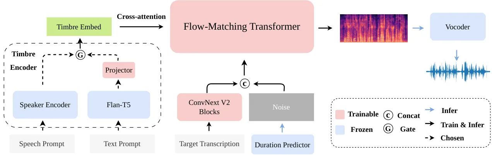

Zheng Wu Zhang Wu Xu

# CAST-TTS: A Simple Cross-Attention Framework for Unified Timbre Control in TTS

Zihao    Wen    Chao    Mengyue    Xuenan

###### Abstract

Current Text-to-Speech (TTS) systems typically use separate models for
speech-prompted and text-prompted timbre control. While unifying both
control signals into a single model is desirable, the challenge of
cross-modal alignment often results in overly complex architectures and
training objective. To address this challenge, we propose CAST-TTS, a
simple yet effective framework for unified timbre control. Features are
extracted from speech prompts and text prompts using pre-trained
encoders. The multi-stage training strategy efficiently aligns the
speech and projected text representations within a shared embedding
space. A single cross-attention mechanism then allows the model to use
either of these representations to control the timbre. Extensive
experiments validate that the unified cross-attention mechanism is
critical for achieving high-quality synthesis. CAST-TTS achieves
performance comparable to specialized single-input models while
operating within a unified architecture. The demo page can be accessed
at
[https://HiRookie9.github.io/CAST-TTS-Page](https://HiRookie9.github.io/CAST-TTS-Page)

###### keywords

text-to-speech synthesis, Timbre Control, computational paralinguistics

^(†)^(†)address: ¹ Shanghai AI Lab, China  
² MoE Key Lab of Artificial Intelligence, X-LANCE Lab, Shanghai Jiao
Tong University, China ^(†)^(†)email: rookie9@sjtu.edu.cn,
wsntxxn@gmail.com^(†)^(†) Under review at Interspeech 2026.

## 1 Introduction

In recent years, Text-to-Speech (TTS) systems have made significant
progress, enabling the generation of speech with high naturalness and
fidelity. Recent TTS models often possess zero-shot voice cloning
capabilities, allowing them to mimic a speaker’s timbre from a short
speech prompt \[1, 2, 3, 4\]. By training on a speech-infilling task,
zero-shot TTS models based on flow-matching have shown strong
performance  \[1, 2, 5\].

A parallel line of research explores the use of text prompts to control
speaker characteristics \[6, 7\]. In contrast to speech prompts, textual
captions provide a more coarse-grained but flexible approach to
controlling speaker timbre. Large language models (LLMs) and expert
systems are involved in automatic data annotation pipelines,
facilitating the construction of large-scale, open-source
datasets \[8\]. In representative works such as Parler-TTS \[6\] and
CapSpeech \[7\], textual captions are first encoded by a pre-trained
text encoder. The resulting embeddings then condition the synthesis
model through a cross-attention mechanism, which has proven effective
for accurate timbre attribute control. The effectiveness of this
conditioning mechanism has also been demonstrated in Text-to-Image (T2I)
and Text-to-Audio (T2A) models \[9, 10\].

Models that exclusively use either a speech prompt or a text prompt
often fail to meet the diverse needs of users across different
scenarios. Consequently, prior research has begun to explore the
combination of these two forms. StyleFusion TTS \[11\] integrates style
descriptions with audio prompts, but it requires both inputs
simultaneously during inference. FleSpeech offers a more flexible
solution, enabling various combinations of audio, text, and even facial
inputs to enhance adaptability \[12\]. However, FleSpeech employs a
complex architecture comprising an autoregressive language model, a
flow-matching backbone, and a diffusion-based prompt encoder. The design
necessitates optimizing several loss functions simultaneously for
semantic prediction, feature reconstruction, and prompt alignment,
thereby increasing the risk of training instability.

In this work, we introduce CAST-TTS, a framework empolying
Cross-Attention mechanism combining either Speech or Text prompts. For
text prompts, we use Flan-T5 \[13\] to encode the descriptive text. The
resulting features are then projected into the shared timbre embedding
space via a lightweight projector. For speech prompts, we follow the
procedure of E2-TTS-x1 \[2\]. An original speech utterance is randomly
split into prompt and target. Montreal Forced Aligner (MFA) is used to
obtain transcriptions for the target part \[14\]. For the speaker timbre
encoding, we employ a pre-trained speaker encoder \[15\] to extract
embeddings from the prompt part. This design eliminates the masking
strategy in E2-TTS and results in a consistent conditioning paradigm of
the timbre under speech and text prompt scenarios.



Figure 1: An overview of CAST-TTS. The timbre encoder converts speech or
text prompts into timbre embeddings, which condition the synthesis model
through a cross-attention mechanism.

Following established practices, the target text transcription is first
encoded by a ConvNeXt V2 module, then concatenated with noisy
latent \[16\]. Separately, speaker information from either modality is
incorporated into the model via cross-attention. We adopt a multi-stage
training strategy to optimize and align the shared timbre embedding
space. In summary, our contributions are as follows:

- •
  A simple architecture that uses cross-attention to fuse speech prompt
  conditions. This removes the requirement for complex masking and is
  aligned with text prompts conditioning.
- •
  A unified framework capable of handling both speech and textual
  modalities by projecting text embeddings into speech-based timbre
  embedding space with a multi-stage training strategy.
- •
  Extensive ablation studies and comparative results that validate our
  design choices and demonstrate the effectiveness of the unified model.

## 2 CAST-TTS

CAST-TTS is a non-autoregressive (NAR) TTS system designed to integrate
speech-prompted and text-prompted timbre control within a single
framework. To achieve this, a unified timbre encoder is employed to
encode the inputs of both modalities into a shared embedding space. We
further design a multi-stage training strategy to optimize the
cross-modal feature alignment.

### 2.1 Architecture

As illustrated in Figure 1, CAST-TTS mainly consists of a timbre encoder
and a Transformer flow-matching backbone. The timbre encoder processes
either a speech prompt or a text prompt, to generate an embedding that
controls speaker timbre. The Transformer backbone predicts the target
mel-spectrogram, which is subsequently converted into an audio waveform
by a BigVGAN vocoder \[17\].

The timbre encoder comprises two parts: the speech branch and the text
branch. The speech branch is a speaker encoder that transforms the input
speech prompt into a timbre embedding sequence
$`\mathbf{T}\in\mathbb{R}^{T\times D}`$. Based on a comparison of
different models in Section 4.2.1, we select the encoder of a
WavLM-based \[18\] ECAPA-TDNN  \[15\]. In the text branch, the input
caption is encoded by a Flan-T5 encoder \[13\]. A linear projector then
maps the text embeddings into the timbre embedding space, since speech
prompts inherently contain richer and more fine-grained speaker
information than textual descriptions. This directional alignment
designates the rich speech embedding space as the unified conditioning
space, forcing the text features to align with the more expressive
speech modality.

The input text transcription is first converted into a sequence of
character embeddings, then padded with filler tokens to match the length
of the target mel-spectrogram. We employ ConvNeXt V2 blocks for
character encoding, given the proven ability in prior works \[1\].

The Transformer backbone incorporates several Transformer blocks with
long skip connections between blocks. Zero-initialized adaptive Layer
Norm (adaLN-zero) is used to stabilize training. The Transformer
backbone receives three inputs: the noisy mel-spectrogram
$`\mathbf{M}`$, character embeddings $`\mathbf{C}`$, and timbre
embeddings $`\mathbf{T}`$. First, the noisy mel-spectrogram is
concatenated with the character embeddings. Within each block of the
Transformer, the latent representation is encoded through
self-attention. Subsequently, it interacts with the timbre embedding via
cross-attention, followed by a final feed-forward network (FFN).

### 2.2 Training

CAST-TTS is trained with flow-matching loss. This objective trains a
neural network $`v_{\theta}`$ to parameterize a velocity field that
defines a continuous-time flow between the data distribution
$`\mathbf{x}_{0}\sim p_{\text{data}}(x_{0})`$ and a standard Gaussian
prior $`\mathbf{x}_{1}\sim\mathcal{N}(0,\mathbf{I})`$:

```math
\displaystyle\frac{d\mathbf{x}_{\tau}}{d\tau} \displaystyle=v_{\theta}(\mathbf{x}_{\tau},\tau)
```

```math
\displaystyle\mathbf{x}_{\tau} \displaystyle=(1-\tau)\cdot\mathbf{x}_{0}+\tau\cdot\mathbf{x}_{1},\quad\tau\in[0,1]
```

```math
\displaystyle\mathcal{L}_{\mathrm{FM}} \displaystyle=\mathbb{E}_{\tau,\mathbf{x}_{0},\mathbf{x}_{1}}\left\lVert v_{\theta}(\mathbf{x}_{\tau},\tau,\mathbf{C},\mathbf{T})-(\mathbf{x}_{1}-\mathbf{x}_{0})\right\lVert^{2}
```

where $`\theta`$ denotes model parameters, $`\tau`$ is the flow step,
and $`\mathcal{L}_{\mathrm{FM}}`$ is the flow-matching training loss.
Throughout the training process, the pre-trained speaker encoder and the
Flan-T5 text encoder remain frozen.

|        |                  |                       |          |               |        |                        |          |
| ------ | ---------------- | --------------------- | -------- | ------------- | ------ | ---------------------- | -------- |
|        |                  | Objective Evaluations |          |               |        | Subjective Evaluations |          |
| Prompt | Model            | WER(%)↓               | SPK-Sim↑ | Style-ACC(%)↑ | UTMOS↑ | N-MOS↑                 | Sim-MOS↑ |
| Speech | F5-TTS-v1        | 2.31                  | 75.4     | \-            | 3.87   | 4.13                   | 4.17     |
|        | MaskGCT          | 3.54                  | 74.5     | \-            | 3.90   | 3.73                   | 3.93     |
|        | ZipVoice-L       | 1.77                  | 66.7     | \-            | 4.26   | 3.90                   | 4.01     |
|        | CAST-TTS         | 2.05                  | 78.4     | \-            | 3.91   | 3.86                   | 4.09     |
| Text   | CapSpeech-NAR    | 5.11                  | \-       | 88.93         | 4.06   | 4.08                   | 4.05     |
|        | Parler-TTS-Large | 5.53                  | \-       | 82.04         | 3.80   | 3.46                   | 3.52     |
|        | CAST-TTS         | 3.89                  | \-       | 91.15         | 4.01   | 4.03                   | 4.11     |

Table 1: Objective and subjective evaluation results. The arrows (↓↑)
indicate whether lower or higher scores are better.

CAST-TTS is trained in three distinct stages. This process utilizes two
distinct data formats: speech-prompted pairs and text-prompted pairs,
which are detailed further in Section 3.1:

- •
  Speech Synthesis Pre-training: We first train the ConvNeXt V2 blocks
  and Transformer layers using only the speech-prompted dataset. This
  stage equips the model with a basic ability to generate coherent
  speech conditioned on timbre embeddings.
- •
  Text Condition Alignment: Next, we freeze the pre-trained components
  and train only the projector on the text-prompted dataset. This
  efficiently aligns the text representation space with the established
  speech-derived timbre embedding space.
- •
  Joint Fine-tuning: Finally, all trainable components are jointly
  fine-tuned on the combined dataset. This stage refines the alignment
  between both modalities and enhances overall synthesis quality and
  controllability.

### 2.3 Inference

CAST-TTS generates target speech based on a target transcription
$`T_{gen}`$ and a speech or text prompt. Since NAR models cannot
inherently predict audio duration, an external duration predictor is
required to determine the length of the output speech. For speech
prompt, we employ Whisper-large-v3 extracting the reference
transcription $`T_{ref}`$ \[19\]. Following previous works, we estimate
target duration based on the ratio of character counts in $`T_{ref}`$
and $`T_{gen}`$. For text prompt, we leverage the pre-trained duration
predictor from CapSpeech, which accepts both the transcription and the
prompt to estimate the total duration of the target speech \[7\]. During
inference, classifier-free guidance (CFG) is employed to improve the
generation quality \[20\]:

```math
\displaystyle v_{\theta}^{\text{CFG}}(\mathbf{x}_{\tau},\mathbf{C},\mathbf{T})=(1-w)v_{\theta}(\mathbf{x}_{\tau},\varnothing,\varnothing)+wv_{\theta}(\mathbf{x}_{\tau},\mathbf{C},\mathbf{T})
```

where $`w`$ is the guidance scale.

## 3 Experiments

### 3.1 Datasets

Since CAST-TTS synthesizes speech conditioned on speech or text prompts,
the training data comprises two corresponding types of data pairs.

LibriTTS-R dataset \[21\] is selected for speech-prompted training. We
obtain word-level alignments for each utterance using the MFA model,
following the methodology of E2-TTS-x1 \[2\]. For each sample, we
determine a random split timestamp. The audio segment preceding this
timestamp serves as the speech prompt. The remaining audio segment and
its corresponding transcription become the target and input
respectively.

For natural language conditioning, we mainly use the LibriTTS-R subset
of CapTTS dataset \[7\]. A part of GigaSpeech is included to add child,
teen, and elderly speakers \[22\], since LibriTTS-R lacks speakers of
these ages. CapTTS employs specialized models to annotate discrete
labels for speaker attributes: gender, accent, pitch, tonal
expressiveness and speaking rate. Subsequently, LLM is used to generate
descriptive captions from these labels.

In total, the training data is comprised of approximately 1360 hours of
audio, including $`\sim`$282K speech-prompted data pairs and
$`\sim`$434K text-prompted data pairs.

### 3.2 Experimental Setup

The Transformer backbone follows CapSpeech, with 22 layers, 16 attention
heads and a hidden size of 1024. The training details in three stages
are:

- •
  Stage 1: 400K steps with a peak learning rate of 7.5e-5.
- •
  Stage 2: 200K steps with a peak learning rate of 1.5e-5.
- •
  Stage 3: 100K steps with a peak learning rate of 2.5e-5.

The learning rate takes a linear decay schedule with a weight decay of
0.01. During inference, the CFG scale is set to 3.0.

### 3.3 Evaluation

We evaluate the model’s performance on two distinct test sets, each
targeting a different conditioning modality. For speech-prompted
evaluation, we choose LibriSpeech-PC test-clean \[23\]. For
text-prompted evaluation, we use the CapTTS test subsets corresponding
to the LibriTTS-R and GigaSpeech audio.

Objective metrics include Word Error Rate (WER), Speaker Similarity
(SPK-Sim), Style-ACC and UTMOS. WER is computed using whisper-large-v3
along with the Whisper text normalizer. TitaNet \[24\] is used for
SPK-Sim evaluation, computing the similarity of speaker embeddings
between prompt and generated speech. Style-ACC is the average accuracy
of age, gender, pitch, expressiveness of tone, and speed. The reliance
on hard thresholds for classifying continuous predictions makes the
baseline metrics for pitch, expressiveness, and speed sensitive to minor
value changes near the boundaries. We therefore relax the evaluation
criterion by allowing predictions to fall within adjacent categories,
which is more stable and representative. UTMOS is used for evaluating
audio quality \[25\].

Subjective metrics include the Mean Opinion Score (MOS) to evaluate
speech naturalness (N-MOS) and similarity (Sim-MOS). 10 highly educated
raters without hearing loss are invited to score 10 random samples from
each of the test dataset.

## 4 Results

### 4.1 Generation Performance

For the speech-prompted synthesis task, we benchmark our CAST-TTS
against several leading models: F5-TTS-v1 \[1\], MaskGCT \[3\], and the
LibriTTS-trained version of ZipVoice (denoted as ZipVoice-L) \[4\]. The
results in Table 1 demonstrate that CAST-TTS achieves the highest
SPK-SIM among all models and delivers competitive WER and UTMOS scores.
F5-TTS-v1 demonstrates a clear advantage in the subjective ratings,
likely due to its training on the large-scale Emilia dataset. Notably,
CAST-TTS achieves performance on par with the other competing TTS
systems. This indicates that CAST-TTS possesses strong synthesis
performance and excellent speaker-cloning capabilities.

|               |            |               |          |        |             |               |        |
| ------------- | ---------- | ------------- | -------- | ------ | ----------- | ------------- | ------ |
|               |            | Speech Prompt |          |        | Text Prompt |               |        |
| Model         | Feature    | WER(%)↓       | SPK-Sim↑ | UTMOS↑ | WER(%)↓     | Style-ACC(%)↑ | UTMOS↑ |
| CAST-SA       | Melspec    | 3.74          | 35.8     | 3.97   | 4.17        | 81.25         | 3.78   |
|               | ECAPA-TDNN | 5.48          | 43.0     | 4.00   | 6.56        | 90.00         | 3.91   |
| CAST-SACA     | Melspec    | 2.67          | 35.5     | 3.95   | 4.52        | 90.10         | 3.89   |
|               | ECAPA-TDNN | 3.18          | 41.2     | 4.06   | 4.93        | 90.26         | 3.90   |
| CAST-CA       | ECAPA-TDNN | 3.13          | 69.5     | 3.82   | 4.47        | 89.01         | 3.91   |
| CAST-TTS-BASE | ECAPA-TDNN | 2.87          | 75.4     | 3.87   | 4.03        | 87.96         | 3.85   |
| CAST-TTS-TV   |            | 2.85          | 77.2     | 3.79   | 4.08        | 87.98         | 3.81   |
| CAST-TTS      |            | 2.05          | 78.4     | 3.91   | 3.89        | 91.15         | 4.01   |

Table 2: Ablation study on model architectures. We evaluate the impact
of different methods under both speech and text prompted conditions.

In the text-prompted synthesis task, CAST-TTS is compared against
CapSpeech-NAR \[7\] and Parler-TTS-Large  \[6\]. CAST-TTS achieves the
best results in both WER and Style-ACC, while also yielding a strong
UTMOS score. For subjective metrics, CAST-TTS also exhibits highly
competitive performance. These results highlight the superior
performance of CAST-TTS in generating high-fidelity speech that
accurately reflects the guidance of text-based style captions.

### 4.2 Ablation Study

To validate our method, we conduct ablation studies investigating the
effects of the speaker feature, the fusion mechanism, and the training
strategy.

#### 4.2.1 Speaker Features

To investigate the effectiveness of feature representation for the
speech prompt, we compare three different features, all integrated into
the backbone via the cross-attention mechanism. Mel-spectrogram is
usually fused with the noisy latent by concatenation followed by
self-attention, rather than cross-attention in prior works. ECAPA-TDNN
and TitaNet features are extracted from pre-trained speaker verification
models. For a fair comparison of SPK-Sim, we compute scores using
TitaNet and ECAPA-TDNN respectively, denoted as Sim-T and Sim-E.

| Feature    | WER(%)↓ | Sim-T↑ | Sim-E↑ |
| ---------- | ------- | ------ | ------ |
| Melspec    | 3.41    | 47.9   | 32.8   |
| TitaNet    | 3.50    | 80.9   | 64.4   |
| ECAPA-TDNN | 2.51    | 80.0   | 72.8   |

Table 3: Ablation results for speech features.

As shown in Table 3, the mel-spectrogram yields a substantially lower
SPK-SIM score compared to both dedicated speaker features, since
mel-spectrogram contains a mixture of acoustic and semantic information.
In contrast, speaker features are explicitly trained to disentangle and
represent only the speaker-relevant acoustic characteristics, which
allows the model to learn the target speaker identity more directly and
effectively from the speech prompt. Since ECAPA-TDNN features
demonstrate more robust overall performance across the metrics than
TitaNet features, we select the encoder of ECAPA-TDNN as the speaker
encoder for CAST-TTS.

#### 4.2.2 Fusion Mechanism

We conduct an ablation study to investigate the optimal mechanism for
fusing the speech and text prompt embeddings. We design and compare
three distinct architectures:

- •
  CAST-SA: This approach concatenates the timbre embedding with the
  noisy latent, relying on self-attention for fusion. We test it with
  both mel-spectrogram and ECAPA-TDNN features, since mel-spectrogram is
  a common choice for this fusion style in prior works \[1, 2\].
- •
  CAST-SACA: This model represents an intuitive hybrid approach. It
  fuses the speech prompt via concatenation and self-attention, while
  integrating the text prompt embedding using cross-attention.
- •
  CAST-CA: This is our proposed architecture, which uses cross-attention
  to uniformly fuse both the speech and text prompt representation.

All models are trained for 400K steps on the full dataset for a fair
comparison. The results are shown in Table 2. Overall, CAST-SACA models
perform better than CAST-SA. Regarding features, while mel-spectrogram
yields a lower WER, ECAPA-TDNN is superior across nearly all other
indicators. CAST-CA achieves highly competitive WER, Style-ACC, and
UTMOS scores while demonstrating a clear advantage in SPK-SIM. This
validates the effectiveness of using cross-attention as the primary
mechanism for integrating timbre features.

#### 4.2.3 Training Strategy

We investigate three training strategies to validate our proposed
approach. First, we train CAST-TTS-CA directly in an end-to-end fashion
as a baseline (CAST-TTS-BASE). Second, we evaluate CAST-TTS-TV, which
prepends a learnable task vector to the timbre embedding to explicitly
differentiate between modality types. The third method is our proposed
multi-stage training strategy. To ensure a fair comparison, all models
are trained for a total of 700K steps.

As shown in Table 2, CAST-TTS-TV exhibits no improved performance over
the CAST-TTS-BASE baseline after incorporating a task vector. This
result suggests that explicit distinction between the two tasks does not
yield better performance. The superior performance of CAST-TTS across
all metrics highlights the advantages of our training strategy. This
approach allows the model to first establish a robust speech synthesis
foundation and then efficiently align the text modality to the
pre-trained space before a final joint refinement.

## 5 Conclusion

A unified model supporting both speech and text prompts offers
significant flexibility for TTS, yet existing solutions are often
architecturally complex due to the inherent difficulty of cross-modal
alignment. To address this issue, we propose CAST-TTS: a simple
cross-attention framework for unified timbre control. We extract
features from the input speech or text prompt using pre-trained
encoders, mapping the text embedding into a unified timbre embedding
space with a simple projector. To fuse these control signals, we employ
cross-attention and propose a multi-stage training strategy for
optimized cross-modal alignment. CAST-TTS achieves strong results on
both speech-prompted and text-prompted synthesis tasks. Due to
limitations in our dataset, it currently lacks control over attributes
such as emotion and accent, which we identify as important directions
for our future work.

## 6 Generative AI Use Disclosure

In this work, generative AI was exclusively utilized to fix grammatical
mistakes and adjust terminology, while all core research activities,
including study design, data collection, analysis, and scientific
reasoning, were conducted independently by the authors.

## References

- \[1\] Y. Chen, Z. Niu, Z. Ma, K. Deng, C. Wang, J. JianZhao, K. Yu,
  and X. Chen (2025) F5-tts: a fairytaler that fakes fluent and faithful
  speech with flow matching. In Proceedings of the 63rd Annual Meeting
  of the Association for Computational Linguistics (Volume 1: Long
  Papers), pp. 6255–6271. Cited by: §1, §2.1, 1st item, §4.1.
- \[2\] S. E. Eskimez, X. Wang, M. Thakker, C. Li, C. Tsai, Z. Xiao, H.
  Yang, Z. Zhu, M. Tang, X. Tan, et al. (2024) E2 tts: embarrassingly
  easy fully non-autoregressive zero-shot tts. In 2024 IEEE spoken
  language technology workshop (SLT), pp. 682–689. Cited by: §1, §1,
  §3.1, 1st item.
- \[3\] Y. Wang, H. Zhan, L. Liu, R. Zeng, H. Guo, J. Zheng, Q.
  Zhang, X. Zhang, S. Zhang, and Z. Wu (2024) Maskgct: zero-shot
  text-to-speech with masked generative codec transformer. arXiv
  preprint arXiv:2409.00750. Cited by: §1, §4.1.
- \[4\] H. Zhu, W. Kang, Z. Yao, L. Guo, F. Kuang, Z. Li, W. Zhuang, L.
  Lin, and D. Povey (2025) Zipvoice: fast and high-quality zero-shot
  text-to-speech with flow matching. arXiv preprint arXiv:2506.13053.
  Cited by: §1, §4.1.
- \[5\] M. Le, A. Vyas, B. Shi, B. Karrer, L. Sari, R. Moritz, M.
  Williamson, V. Manohar, Y. Adi, J. Mahadeokar, et al. (2023) Voicebox:
  text-guided multilingual universal speech generation at scale.
  Advances in neural information processing systems 36, pp. 14005–14034.
  Cited by: §1.
- \[6\] Y. Lacombe, V. Srivastav, and S. Gandhi (2024) Parler-tts.
  GitHub. Note:
  [https://github.com/huggingface/parler-tts](https://github.com/huggingface/parler-tts)
  Cited by: §1, §4.1.
- \[7\] H. Wang, J. Hai, D. Chong, K. Thakkar, T. Feng, D. Yang, J.
  Lee, T. Thebaud, L. M. Velazquez, J. Villalba, et al. (2025)
  Capspeech: enabling downstream applications in style-captioned
  text-to-speech. arXiv preprint arXiv:2506.02863. Cited by: §1, §2.3,
  §3.1, §4.1.
- \[8\] D. Lyth and S. King (2024) Natural language guidance of
  high-fidelity text-to-speech with synthetic annotations. arXiv
  preprint arXiv:2402.01912. Cited by: §1.
- \[9\] R. Rombach, A. Blattmann, D. Lorenz, P. Esser, and B.
  Ommer (2022) High-resolution image synthesis with latent diffusion
  models. In Proceedings of the IEEE/CVF conference on computer vision
  and pattern recognition, pp. 10684–10695. Cited by: §1.
- \[10\] J. Hai, Y. Xu, H. Zhang, C. Li, H. Wang, M. Elhilali, and D.
  Yu (2025) EzAudio: enhancing text-to-audio generation with efficient
  diffusion transformer. In Proc. Interspeech 2025, pp. 4233–4237. Cited
  by: §1.
- \[11\] Z. Chen, X. Li, Z. Ai, and S. Xu (2024) Stylefusion tts:
  multimodal style-control and enhanced feature fusion for zero-shot
  text-to-speech synthesis. In Chinese Conference on Pattern Recognition
  and Computer Vision (PRCV), pp. 263–277. Cited by: §1.
- \[12\] H. Li, Y. Li, X. Wang, J. Hu, Q. Xie, S. Yang, and L.
  Xie (2025) Flespeech: flexibly controllable speech generation with
  various prompts. arXiv preprint arXiv:2501.04644. Cited by: §1.
- \[13\] H. W. Chung, L. Hou, S. Longpre, B. Zoph, Y. Tay, W. Fedus, Y.
  Li, X. Wang, M. Dehghani, S. Brahma, et al. (2024) Scaling
  instruction-finetuned language models. Journal of Machine Learning
  Research 25 (70), pp. 1–53. Cited by: §1, §2.1.
- \[14\] M. McAuliffe, M. Socolof, S. Mihuc, M. Wagner, and M.
  Sonderegger (2017) Montreal forced aligner: trainable text-speech
  alignment using kaldi. In Proc. Interspeech 2017, pp. 498–502. Cited
  by: §1.
- \[15\] B. Desplanques, J. Thienpondt, and K. Demuynck (2020)
  ECAPA-TDNN: Emphasized Channel Attention, propagation and aggregation
  in TDNN based speaker verification. In Interspeech 2020,
  pp. 3830–3834. Cited by: §1, §2.1.
- \[16\] S. Woo, S. Debnath, R. Hu, X. Chen, Z. Liu, I. S. Kweon, and S.
  Xie (2023) Convnext v2: co-designing and scaling convnets with masked
  autoencoders. In Proceedings of the IEEE/CVF conference on computer
  vision and pattern recognition, pp. 16133–16142. Cited by: §1.
- \[17\] S. G. Lee, W. Ping, B. Ginsburg, B. Catanzaro, and S.
  Yoon (2023) BIGVGAN: a universal neural vocoder with large-scale
  training. In 11th International Conference on Learning
  Representations, ICLR 2023, Cited by: §2.1.
- \[18\] S. Chen, C. Wang, Z. Chen, Y. Wu, S. Liu, Z. Chen, J. Li, N.
  Kanda, T. Yoshioka, X. Xiao, et al. (2022) Wavlm: large-scale
  self-supervised pre-training for full stack speech processing. IEEE
  Journal of Selected Topics in Signal Processing 16 (6), pp. 1505–1518.
  Cited by: §2.1.
- \[19\] A. Radford, J. W. Kim, T. Xu, G. Brockman, C. McLeavey, and I.
  Sutskever (2023) Robust speech recognition via large-scale weak
  supervision. In International conference on machine learning,
  pp. 28492–28518. Cited by: §2.3.
- \[20\] J. Ho and T. Salimans Classifier-free diffusion guidance. In
  NeurIPS 2021 Workshop on Deep Generative Models and Downstream
  Applications, Cited by: §2.3.
- \[21\] Y. Koizumi, H. Zen, S. Karita, Y. Ding, K. Yatabe, N.
  Morioka, M. Bacchiani, Y. Zhang, W. Han, and A. Bapna (2023)
  LibriTTS-r: a restored multi-speaker text-to-speech corpus. In Proc.
  Interspeech 2023, pp. 5496–5500. Cited by: §3.1.
- \[22\] G. Chen, S. Chai, G. Wang, J. Du, W. Zhang, C. Weng, D. Su, D.
  Povey, J. Trmal, J. Zhang, et al. (2021) GigaSpeech: an evolving,
  multi-domain asr corpus with 10,000 hours of transcribed audio. In
  Proc. Interspeech 2021, pp. 3670–3674. Cited by: §3.1.
- \[23\] A. Meister, M. Novikov, N. Karpov, E. Bakhturina, V. Lavrukhin,
  and B. Ginsburg (2023) Librispeech-pc: benchmark for evaluation of
  punctuation and capitalization capabilities of end-to-end asr models.
  In 2023 IEEE automatic speech recognition and understanding workshop
  (ASRU), pp. 1–7. Cited by: §3.3.
- \[24\] N. R. Koluguri, T. Park, and B. Ginsburg (2022) Titanet: neural
  model for speaker representation with 1d depth-wise separable
  convolutions and global context. In ICASSP 2022-2022 IEEE
  international conference on acoustics, speech and signal processing
  (ICASSP), pp. 8102–8106. Cited by: §3.3.
- \[25\] T. Saeki, D. Xin, W. Nakata, T. Koriyama, S. Takamichi, and H.
  Saruwatari (2022) UTMOS: utokyo-sarulab system for voicemos challenge 2022. Interspeech 2022. Cited by: §3.3.
