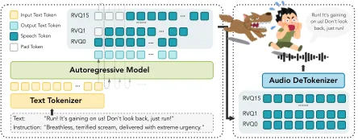
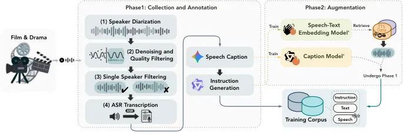
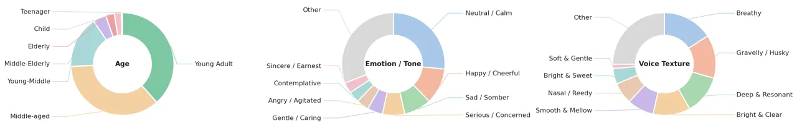

\checkdata

\[![[Uncaptioned
image]](arxiv-2603-28086v1--78bca96c2971.figures/figure-1.webp) Homepage\][https://mosi.cn/models/moss-voice-generator](https://mosi.cn/models/moss-voice-generator)
\checkdata\[![[Uncaptioned
image]](arxiv-2603-28086v1--78bca96c2971.figures/figure-2.webp) Online
Demo\][https://huggingface.co/spaces/OpenMOSS-Team/MOSS-VoiceGenerator](https://huggingface.co/spaces/OpenMOSS-Team/MOSS-VoiceGenerator)
\checkdata\[![[Uncaptioned
image]](arxiv-2603-28086v1--78bca96c2971.figures/figure-3.webp) Hugging
Face\][https://huggingface.co/OpenMOSS-Team/MOSS-VoiceGenerator](https://huggingface.co/OpenMOSS-Team/MOSS-VoiceGenerator)
\checkdata\[![[Uncaptioned
image]](arxiv-2603-28086v1--78bca96c2971.figures/figure-4.webp) GitHub\][https://huggingface.co/collections/OpenMOSS-Team/moss-tts](https://huggingface.co/collections/OpenMOSS-Team/moss-tts)

# MOSS-VoiceGenerator: Create Realistic Voices with Natural Language Descriptions

SII-OpenMOSS Team^(\*)

###### Abstract

Voice design from natural language aims to generate speaker timbres
directly from free-form textual descriptions, allowing users to create
voices tailored to specific roles, personalities, and emotions. Such
controllable voice creation benefits a wide range of downstream
applications—including storytelling, game dubbing, role-play agents, and
conversational assistants, making it a significant task for modern
Text-to-Speech models. However, existing models are largely trained on
carefully recorded studio data, which produces speech that is clean and
well-articulated, yet lacks the lived-in qualities of real human voices.
To address these limitations, we present MOSS-VoiceGenerator, an
open-source instruction-driven voice generation model that creates new
timbres directly from natural language prompts. Motivated by the
hypothesis that exposure to real-world acoustic variation produces more
perceptually natural voices, we train on large-scale expressive speech
data sourced from cinematic content. Subjective preference studies
demonstrate its superiority in overall performance,
instruction-following, and naturalness compared to other voice design
models.

^(\*)^(\*)footnotetext: Full contributors can be found in the
Contributors section.

## 1 Introduction

In recent years, Text-to-Speech (TTS) systems have progressed from
merely producing natural and high-fidelity speech toward supporting
controllable and expressive speech generation \[1, 2, 3, 4\]. These
advances enable a shift from traditional TTS or voice-cloning (VC) to
natural language–based instruction following task. By allowing users to
control vocal characteristics, such as emotion, speaking style, and
character persona, through free-form text descriptions, this paradigm
substantially lowers the barrier to voice customization for non-expert
users, which broadens the applicability of TTS to downstream scenarios
such as audiobooks, game dubbing, role-play agents, and conversational
assistants.

A growing body of work has explored instruction-driven voice generation,
yet current approaches differ considerably in their degree of
controllability, generalizability, and dependence on reference audio.
Early efforts in this direction still rely on reference speakers to
anchor the generated timbre. Yang et al. \[5\] introduces natural
language style prompts for expressive TTS, but the model is still
trained on a closed set of speakers, limiting generalization and
preventing open-set timbre design. Audiobox \[6\] leverages pretrained
CLAP \[7\] embeddings to condition audio generation on text
descriptions; however, CLAP models are typically trained on
coarse-grained descriptions and struggle to capture fine-grained timbre
nuances. VoxInstruct \[8\] and EmoVoice \[9\] leverage LLM understanding
by concatenating style descriptions with synthesis text for fine-grained
control, but still require reference speaker audio rather than
generating timbres from scratch. Moving toward fully reference-free
generation, VoiceSculptor \[10\] takes a step further by integrating
instruction-based voice design with high-fidelity voice cloning in a
unified framework, enabling controllable timbre generation from natural
language descriptions with iterative refinement via Retrieval-Augmented
Generation (RAG). MIMO-Audio \[11\] enhances controllability through
massive pretraining followed by instruction tuning, demonstrating the
promise of the LLM-based paradigm for open-domain voice design. The
Qwen3-TTS family \[12\] also introduces models focused on voice design,
further advancing the field and offering additional options for
expressive and customizable speech synthesis. On the commercial side,
several APIs—including Elevenlabs, MiniMax, GPT-4o-TTS, and Gemini—have
begun offering voice design or editing functionalities, reflecting
growing market demand for instruction-driven timbre generation and
customizable voice synthesis.

Despite significant recent progress in controllable speech synthesis,
many existing models rely on studio-recorded high-quality audio,
resulting in voices that sound clean and polished but lack the
"lived-in" realism of everyday speech. The subtle imperfections of real
speech, such as natural breath patterns, rhythmic irregularity, and
spontaneous emotional coloring, remain largely absent, leaving a
perceptible gap between synthesized voices and authentic human
expression. To address this, we introduce MOSS-VoiceGenerator, a fully
open-source instruction-driven TTS model that generates realistic and
expressive speech directly from natural language descriptions, without
requiring any reference audio. By leveraging large-scale in-the-wild
cinematic data and the strong instruction-following capabilities of
decoder-only language models, MOSS-VoiceGenerator produces voices with
greater naturalness and diversity.

Our main contributions are as follows:

- •
  We present MOSS-VoiceGenerator, a fully open-source instruction-driven
  TTS model that generates realistic and expressive speech directly from
  natural language descriptions, without requiring any reference audio.
- •
  We construct a data pipeline suitable for instruction-based tasks,
  along with a richly annotated dataset sourced from cinematic content.
  Our developed embedding model and annotation model can effectively
  enable cost-effective data augmentation.
- •
  Extensive evaluations show that MOSS-VoiceGenerator performs
  exceptionally well in subjective evaluations and achieves competitive
  performance in objective evaluations.

## 2 MOSS-VoiceGenerator

### 2.1 Model Architecture

As illustrated in Fig. 1, the architecture of MOSS-VoiceGenerator
follows the design of MOSS-TTS \[13\] with the delay pattern and
utilizes the MOSS-Audio-Tokenizer \[14\] for audio tokenization. In our
implementation, we only use the first 16 layers of the RVQ codebooks for
training. The voice description and synthesis text are concatenated and
input into the language model (LM). During inference, a time-delay shift
is applied, where each codebook layer’s tokens are shifted forward by
$`j-1`$ frames relative to the first layer. After generating output
until the end-of-sequence (EOS) token, the audio tokens are decoded into
the final waveform.

This discrete autoregressive architecture offers several key benefits
for the task. It unifies speech generation with language modeling as a
sequence prediction task, allowing for the direct reuse of LLM training
paradigms and inference frameworks. Autoregressive modeling naturally
captures long-range dependencies, ensuring global prosody and timbre
consistency. Additionally, the discrete framework eliminates the need
for iterative inference, unlike diffusion or flow-matching models,
leading to simpler and more efficient deployment. Finally, the shared
sequence space for both speech and text tokens makes joint
instruction-speech modeling more seamless, enhancing the model’s
instruction-following capabilities.

Figure 1: Illustration of the MOSS-VoiceGenerator inference. The voice
description and text are concatenated and fed into a causal language
model with delay-pattern generation; the output audio tokens are decoded
by MOSS-Audio-Tokenizer.

### 2.2 Data Collection

As shown in Fig. 2, the data collection process includes two phases:

#### Phase 1: Collection and Annotation of Cinematic Data

Motivated by the hypothesis that exposure to real-world acoustic
variation produces more perceptually natural speech, we adopt a
bottom-up approach in collecting audio from movies, TV dramas, and
episodic series, as opposed to relying on scripted studio recordings.
This type of content inherently offers diverse scenes, characters, and
expressive speaking styles, providing a richer source of acoustic
variation than controlled recording environments.

The data processing pipeline involves the following stages:

- •
  Speaker Diarization: We adopt DiariZen \[15, 16, 17\] to identify and
  segment audio by different speakers.
- •
  Denoising and Quality Filtering: We apply MossFormer2_SE_48K \[18\]
  for noise reduction and use DNSMOS \[19\] to filter out low-quality
  audio. MossFormer2_SE_48K is particularly effective at extracting
  clean speech from challenging acoustic conditions, including
  significant background noise, music tracks, and speech-overlaid BGM,
  making it particularly suited for processing noisy and music-infused
  audio sources.

  To ensure the quality of the audio data, we set a DNSMOS threshold of
  $`\geq`$ 3.0 for quality filtering. Cinematic data often contains
  substantial background noise, and without denoising, only around 5% of
  the samples meet the DNSMOS 3.0 threshold. After applying
  MossFormer2_SE_48K for denoising, the retention rate increases to
  approximately 45%–50%. Although this denoising process may result in
  minor quality loss (e.g., occasional breath noises or slight loss of
  high-frequency details), our priority is to maximize sample retention
  and preserve the diversity of speech, particularly given the scarcity
  of high-quality cinematic data.

- •
  Single Speaker Filtering: Given the potential inaccuracies in
  diarization, especially in distinguishing speakers with similar voices
  (e.g., speakers of the same gender), we leverage
  MOSS-Transcribe-Diarize \[20\], which excels at producing accurate
  per-speaker transcriptions in multi-speaker conversations, to identify
  and retain only single-speaker segments. This ensures that the model
  does not learn to generate inconsistent voice tones during speech
  synthesis.
- •
  ASR Transcription: Through multiple iterations of ASR models, we
  eventually select Qwen3-Omni-30B-A3B-Instruct \[21\] for
  transcription. This model performs well in recognizing numbers,
  symbols, and standard punctuation, which is essential for capturing
  the emotional nuances in speech. We also apply simple rule-based
  filtering to remove empty and duplicate entries, which are usually
  caused by pure music or noise, leading to model collapse. Given that
  the corpus primarily consists of Chinese and English audio, we use
  Whisper-large-v3 \[22\] to filter out non-Chinese and non-English
  languages. This decision is driven by the need for the model to
  effectively learn from a focused dataset, as introducing additional
  languages could compromise the quality and accuracy of transcriptions
  in the current scope. While our focus is on Chinese and English, we
  are committed to expanding this capability in the future to support
  low-resource languages, aiming to improve inclusivity and model
  robustness in TTS models.

The resulting dataset consists of approximately 5,000 hours of audio,
which we then annotate using Gemini-2.5 Pro \[23\] to generate detailed
captions. These captions are converted into natural language timbre
instructions using Qwen3-32B-A3B-Instruct \[24\].

Figure 2: Data collection pipeline for MOSS-VoiceGenerator. Phase 1
annotates cinematic audio via speaker diarization, denoising and quality
filtering, single-speaker filtering, and ASR transcription, followed by
speech captioning and timbre instruction generation. Phase 2 augments
the corpus by training a speech-text embedding model for retrieval from
internal TTS data and a fine-tuned caption model for scalable
annotation.

#### Phase 2: Data Augmentation

In Phase 2, we scale up the dataset through two complementary
strategies:

- •
  Fine-Tuning a Speech Caption Model: We fine-tune
  Qwen3-Omni-30B-A3B-Thinking \[21\] on the Phase 1 data to train a
  dedicated speech caption model, which will be used for automatic
  annotation of large-scale audio in the next steps.
- •
  Style-Guided Audio Mining: We also train a speech-text alignment
  embedding model \[25\], which maps style instructions and speech audio
  into a shared embedding space, enabling text-based retrieval of audio
  clips that match a given style description. Because much of our
  internal TTS base training corpus consists of relatively neutral
  speech (e.g., audiobook narration), directly sampling from it would
  yield predominantly flat, expressively homogeneous data. We further
  leverage GPT-5 \[26\] to generate a diverse set of _stylistically
  rich_ text-based timbre instructions. By using these style-oriented
  instructions as queries against the shared embedding space, we can
  surface recordings that exhibit salient expressive characteristics
  from within this otherwise neutral collection. For each instruction,
  we retrieve the top 50 matches ranked by cosine similarity and
  immediately remove them from the candidate pool before processing the
  next instruction, ensuring that no audio clip is selected more than
  once across different queries. This targeted mining adds approximately
  10,000 hours of stylistically diverse audio data that complements the
  cinematic sources in Phase 1.

The newly matched audio is processed following the same steps as Phase
1, except that for cost efficiency, we replace the captioning model with
the internal, custom-trained caption model developed during the
fine-tuning process. To further supplement coverage, we incorporate
additional data from other internal sources, mainly crowdsourced dubbing
recordings, annotated using the same custom-trained caption model,
yielding the final dataset of approximately 25,000 hours.

#### Dataset Statistics

The final dataset comprises approximately 25,000 hours of unique audio
across Chinese (18,025 hours) and English (7,047 hours). To better
understand the composition of our corpus, we uniformly sample 150K
utterances from each language and profile them along three perceptual
dimensions: speaker age, emotion/tone, and voice texture, as illustrated
in Fig. 3. The resulting slices confirm that the data captures a
naturally diverse range of everyday speaking characteristics—skewing
toward young-adult and middle-aged speakers, predominantly
neutral-to-positive tones, and a broad palette of voice textures.

Figure 3: A snapshot of the training corpus profiled along three
perceptual dimensions based on the caption results. The distributions
reveal broad, naturalistic coverage of everyday speaking styles.

### 2.3 Training Strategy

MOSS-VoiceGenerator starts from the Qwen3 \[24\] checkpoint weights, and
is trained end-to-end on our curated instruction-text-speech dataset.
The model receives a structured input composed of a natural language
timbre instruction and a target transcript, concatenated via a fixed
chat template and encoded by the LLM’s native text tokenizer. The
training objective is standard next-token prediction loss over the codec
token sequence, conditioned on the text input. All model parameters are
updated during training; we do not apply parameter-efficient methods
such as LoRA.

#### Model Scale

We compare the 1.7B and 8B backbone sizes under the same training
recipe. The 1.7B model achieves comparable instruction-following quality
to the 8B model, while demonstrating better generation diversity. We
suspect that the data volume might not have been sufficient, and thus,
we attempted to mix in approximately 10,000 hours of TTS-base data
(without instructions, pure text-speech pairs). However, we observed no
significant gain in either objective benchmarks or human evaluation. As
a result, we decided to adopt the 1.7B model, trained exclusively on
instruction data, as the final released configuration.

#### English Prosody Augmentation

Due to the limited scale of the English subset ($`\sim`$7,047 hours vs.
$`\sim`$18,025 hours for Chinese), early checkpoints exhibited unstable
English prosody characterized by frequent unnatural pauses. To address
this, we apply instruction rewriting to all English samples: for each
audio clip, we generate two semantically equivalent but lexically
distinct instruction variants, thereby doubling the effective English
training signal without requiring additional audio collection. This
augmentation substantially improves English prosody stability in the
final model.

## 3 Evaluation

### 3.1 Objective Evaluation

We evaluate MOSS-VoiceGenerator on InstructTTSEval \[27\], a public
benchmark designed to assess TTS models’ ability to follow complex
natural-language style instructions. InstructTTSEval comprises 6,000
test cases (3 tasks $`\times`$ 2 languages $`\times`$ 1,000 samples)
drawn from movies, TV dramas, and variety shows, each paired with a
reference audio clip. The benchmark defines three evaluation tasks of
increasing abstraction:

- •
  APS (Acoustic-Parameter Specification): Instructions explicitly
  specify all 12 acoustic attributes (pitch, speed, emotion, gender,
  age, clarity, fluency, accent, texture, tone, volume, personality),
  testing direct fine-grained control.
- •
  DSD (Descriptive-Style Directive): APS instructions are rewritten by
  an LLM into free-form natural language descriptions with random
  attribute omissions, testing generalization to incomplete and
  unstructured inputs.
- •
  RP (Role-Play): Instructions provide abstract role and scenario
  descriptions (e.g., “a nervous interview applicant”), requiring the
  model to infer appropriate vocal characteristics from context.

To prevent test-set contamination, we ensure that our training corpus
does not overlap with the InstructTTSEval evaluation set. Additionally,
we perform fuzzy matching on each transcript in the InstructTTSEval set
to ensure that no test data from InstructTTSEval appears in our training
data.

We compare against gemini-2.5-pro-preview-tts (hereafter referred to as
Gemini-TTS-Pro), GPT-4o-mini-TTS, VoxInstruct, MIMO-Audio-7B-Instruct,
VoiceSculptor, and Qwen3-TTS-VD. Note that Gemini-TTS-Pro and
GPT-4o-mini-TTS only support fixed voice editing rather than free-form
instruction-driven voice design, and VoxInstruct requires reference
audio. Results for Gemini-TTS-Pro, GPT-4o-mini-TTS, and VoxInstruct are
taken directly from the InstructTTSEval benchmark paper, while results
for VoiceSculptor, MIMO-Audio-7B-Instruct, and Qwen3-TTS-VD are sourced
from their respective technical reports. As shown in Tab. 1,
MOSS-VoiceGenerator demonstrates competitive performance within the
open-source landscape.

|                        |                    |      |      |                    |      |      |
| ---------------------- | ------------------ | ---- | ---- | ------------------ | ---- | ---- |
| Model                  | InstructTTSEval-EN |      |      | InstructTTSEval-ZH |      |      |
|                        | APS                | DSD  | RP   | APS                | DSD  | RP   |
| Gemini-TTS-Pro         | 87.6               | 86.0 | 67.2 | 89.0               | 90.1 | 75.5 |
| GPT-4o-mini-TTS        | 76.4               | 74.3 | 54.8 | 54.9               | 52.3 | 46.0 |
| VoxInstruct            | 54.9               | 57.0 | 39.3 | 47.5               | 52.3 | 42.6 |
| VoiceSculptor-VD       | \-                 | \-   | \-   | 75.7               | 64.7 | 61.5 |
| MIMO-Audio-7B-Instruct | 80.6               | 77.6 | 59.5 | 75.7               | 74.3 | 61.5 |
| Qwen3-TTS-VD           | 78.4               | 78.8 | 72.0 | 84.3               | 82.9 | 77.4 |
| MOSS-VoiceGenerator    | 68.2               | 82.0 | 68.7 | 78.0               | 80.0 | 74.0 |

Table 1: Instruction-following accuracy (%) on InstructTTSEval.

### 3.2 Subjective Evaluation

For subjective evaluation, we conduct a pairwise preference study on the
same 100 instruction–speech pairs (50 Chinese, 50 English) drawn from an
internal test set distinct from InstructTTSEval, covering diverse styles
and roles. For each pair, human listeners are presented with the outputs
of MOSS-VoiceGenerator and a baseline model generated from the same
instruction, with audio presentation order randomized; listeners are
blind to which model produced each output. They indicate their
preference on three dimensions: Overall Performance, Instruction
Following, and Naturalness. These dimensions are selected for their
relevance to real-world use cases and are critical for evaluating the
quality of the generated voices:

- •
  Overall Performance: _Given two audio outputs generated from the same
  instruction, which one would you ultimately prefer?_ This dimension
  reflects the holistic quality of the audio, encompassing factors such
  as human-likeness, emotional expressiveness, audio fidelity,
  naturalness of prosody, clarity of articulation, speaker consistency,
  and overall listening experience.
- •
  Instruction Following: _Which output better follows the instruction?_
  Instructions may specify attributes such as gender, age, voice
  characteristics, emotion, accent, etc. For instructions involving
  specific characters or scenarios, this dimension also considers
  whether the voice matches your subjective expectation of that
  character or scene.
- •
  Naturalness: _Which output sounds more like real human speech?_ This
  dimension evaluates how closely the generated audio resembles natural
  human speech in terms of rhythm, pacing, intonation, and
  conversational quality.

Each item is annotated by three independent crowdsourced workers
(100–300 items per worker, 1 RMB per item); the final label is
determined by majority vote. For each pair, each annotator scores only
one of the dimensions to ensure focus and minimize bias. This approach
allows for a thorough and unbiased evaluation of each dimension
independently.

We compare against Qwen3-TTS-VD, MiniMax Voice Design, and
MiMo-Audio-7B-Instruct—models that provide publicly accessible voice
design interfaces, suitable for pairwise listening studies. We exclude
Gemini-TTS-Pro and GPT-4o-mini-TTS from the preference study, as these
models offer preset voices rather than free-form voice design, which
makes a direct comparison invalid. For Qwen3-TTS-VD and MiniMax, we use
their respective APIs, with all models set to their default
configurations, aside from the input voice descriptions and text.
Similarly, MIMO-Audio-7B-Instruct is evaluated using the default
settings as specified in its official tutorial. All models are evaluated
with a single inference run.

Figure 4: Pairwise preference results (Win / Tie / Lose) of
MOSS-VoiceGenerator against three baselines across three evaluation
dimensions. Each bar reports the percentage of comparisons won, tied, or
lost. MOSS-VoiceGenerator consistently wins on all three dimensions
against all baselines.

As shown in Fig. 4, MOSS-VoiceGenerator outperforms all three baselines
across the three evaluation dimensions. In our analysis,
MOSS-VoiceGenerator excels at generating everyday conversational voices
that exhibit natural pauses, hesitations, and rhythmic variations,
clearly distinguishing them from the steady, broadcast-style delivery
typical of newsreader speech. Furthermore, the model convincingly
reproduces a wide range of authentic vocal traits—from the voices of the
elderly and children to laughter, sobbing, awkwardness, and
anger—delivering a level of realism that feels genuinely spontaneous
rather than studio-recorded. These capabilities make MOSS-VoiceGenerator
particularly well-suited for applications that demand expressive and
immersive speech, such as audiobook narration, film dubbing, and
emotionally nuanced voice assistants.

## 4 Conclusions

We presented MOSS-VoiceGenerator, an open-source instruction-driven TTS
model that synthesizes realistic, expressive speech directly from
natural language descriptions, without relying on any reference audio.
To train this model, we carefully source speech data from TV dramas and
films, and construct a large-scale in-the-wild corpus with fine-grained
annotation, capturing a remarkably diverse range of speaker identities,
emotions, and acoustic conditions. Benefiting from this expressive and
diverse training corpus, MOSS-VoiceGenerator demonstrates strong voice
design capabilities, and excels in subjective evalutaion, including
overall quality, instruction-following accuracy, and speech naturalness.
We fully open-source our model, data pipeline, and evaluation toolkit,
and hope this work provides the community with a practical and
extensible foundation for advancing controllable, expressive TTS
research.

## 5 Limitations

MOSS-VoiceGenerator has several limitations. First, the language
coverage is currently limited to Chinese and English. While the model
performs well on these languages, extension to low-resource languages
remains a focus for future work. Second, while the English training
corpus is sizable, it is still substantially smaller than the Chinese
corpus. Despite using instruction rewriting augmentation, this
discrepancy can sometimes result in weaker prosody in certain
English-speaking styles, highlighting the need for further corpus
expansion. Third, our denoising-before-filtering pipeline, while
increasing data retention, may introduce mild artifacts, such as
residual breath noise or high-frequency smoothing. These artifacts can
degrade performance in certain cases, though disentangling their
perceptual impact from model capacity effects remains challenging.
Finally, the model’s output can occasionally lack stability. We plan to
enhance robustness in future versions to ensure more consistent and
reliable generation across a wider range of inputs.

## Contributors

Contributors:  
Kexin Huang^(∗), Liwei Fan, Botian Jiang, Yaozhou Jiang, Qian Tu, Jie
Zhu, Yuqian Zhang, Yiwei Zhao, Chenchen Yang, Zhaoye Fei, Shimin Li,
Xiaogui Yang, Qinyuan Cheng

Advisors:  
Xipeng Qiu^(§)

Affiliations:  
Shanghai Innovation Institute  
MOSI Intelligence  
Fudan University

^(†)^(†)footnotetext: ^(∗)Project lead:
[kxhuang24@m.fudan.edu.cn](mailto:kxhuang24@m.fudan.edu.cn).
^(§)Corresponding author:
[xpqiu@fudan.edu.cn](mailto:xpqiu@fudan.edu.cn).

## References

- \[1\] Chengyi Wang, Sanyuan Chen, Yu Wu, Ziqiang Zhang, Long Zhou,
  Shujie Liu, Zhuo Chen, Yanqing Liu, Huaming Wang, Jinyu Li, et al.
  Neural codec language models are zero-shot text to speech
  synthesizers. _arXiv preprint arXiv:2301.02111_, 2023.
- \[2\] Philip Anastassiou, Jiawei Chen, Jitong Chen, Yuanzhe Chen, Zhuo
  Chen, Ziyi Chen, Jian Cong, Lelai Deng, Chuang Ding, Lu Gao, et al.
  Seed-tts: A family of high-quality versatile speech generation models.
  _arXiv preprint arXiv:2406.02430_, 2024.
- \[3\] Siyi Zhou, Yiquan Zhou, Yi He, Xun Zhou, Jinchao Wang, Wei Deng,
  and Jingchen Shu. Indextts2: A breakthrough in emotionally expressive
  and duration-controlled auto-regressive zero-shot text-to-speech.
  _arXiv preprint arXiv:2506.21619_, 2025.
- \[4\] Zhihao Du, Yuxuan Wang, Qian Chen, Xian Shi, Xiang Lv, Tianyu
  Zhao, Zhifu Gao, Yexin Yang, Changfeng Gao, Hui Wang, et al. Cosyvoice
  2: Scalable streaming speech synthesis with large language models.
  _arXiv preprint arXiv:2412.10117_, 2024.
- \[5\] Dongchao Yang, Songxiang Liu, Rongjie Huang, Chao Weng, and
  Helen Meng. Instructtts: Modelling expressive tts in discrete latent
  space with natural language style prompt. _IEEE/ACM Transactions on
  Audio, Speech, and Language Processing_, 32:2913–2925, 2024.
- \[6\] Apoorv Vyas, Bowen Shi, Matthew Le, Andros Tjandra, Yi-Chiao Wu,
  Baishan Guo, Jiemin Zhang, Xinyue Zhang, Robert Adkins, William Ngan,
  et al. Audiobox: Unified audio generation with natural language
  prompts. _arXiv preprint arXiv:2312.15821_, 2023.
- \[7\] Yusong Wu, Ke Chen, Tianyu Zhang, Yuchen Hui, Taylor
  Berg-Kirkpatrick, and Shlomo Dubnov. Large-scale contrastive
  language-audio pretraining with feature fusion and keyword-to-caption
  augmentation. In _ICASSP 2023-2023 IEEE International Conference on
  Acoustics, Speech and Signal Processing (ICASSP)_, pages 1–5.
  IEEE, 2023.
- \[8\] Yixuan Zhou, Xiaoyu Qin, Zeyu Jin, Shuoyi Zhou, Shun Lei,
  Songtao Zhou, Zhiyong Wu, and Jia Jia. Voxinstruct: Expressive human
  instruction-to-speech generation with unified multilingual codec
  language modelling. In _Proceedings of the 32nd ACM International
  Conference on Multimedia_, pages 554–563, 2024.
- \[9\] Guanrou Yang, Chen Yang, Qian Chen, Ziyang Ma, Wenxi Chen, Wen
  Wang, Tianrui Wang, Yifan Yang, Zhikang Niu, Wenrui Liu, et al.
  Emovoice: Llm-based emotional text-to-speech model with freestyle text
  prompting. In _Proceedings of the 33rd ACM International Conference on
  Multimedia_, pages 10748–10757, 2025.
- \[10\] Jingbin Hu, Huakang Chen, Linhan Ma, Dake Guo, Qirui Zhan,
  Wenhao Li, Haoyu Zhang, Kangxiang Xia, Ziyu Zhang, Wenjie Tian, et al.
  Voicesculptor: Your voice, designed by you. _arXiv preprint
  arXiv:2601.10629_, 2026a.
- \[11\] Dong Zhang, Gang Wang, Jinlong Xue, Kai Fang, Liang Zhao, Rui
  Ma, Shuhuai Ren, Shuo Liu, Tao Guo, Weiji Zhuang, et al. Mimo-audio:
  Audio language models are few-shot learners. _arXiv preprint
  arXiv:2512.23808_, 2025.
- \[12\] Hangrui Hu, Xinfa Zhu, Ting He, Dake Guo, Bin Zhang, Xiong
  Wang, Zhifang Guo, Ziyue Jiang, Hongkun Hao, Zishan Guo, Xinyu Zhang,
  Pei Zhang, Baosong Yang, Jin Xu, Jingren Zhou, and Junyang Lin.
  Qwen3-tts technical report. _arXiv preprint arXiv:2601.15621_, 2026b.
- \[13\] Yitian Gong, Botian Jiang, Yiwei Zhao, Yucheng Yuan, Kuangwei
  Chen, Yaozhou Jiang, Cheng Chang, Dong Hong, Mingshu Chen, Ruixiao Li,
  Yiyang Zhang, Yang Gao, Hanfu Chen, Ke Chen, Songlin Wang, Xiaogui
  Yang, Yuqian Zhang, Kexin Huang, ZhengYuan Lin, Kang Yu, Ziqi Chen,
  Jin Wang, Zhaoye Fei, Qinyuan Cheng, Shimin Li, and Xipeng Qiu.
  Moss-tts technical report, 2026a. URL
  [https://arxiv.org/abs/2603.18090](https://arxiv.org/abs/2603.18090).
- \[14\] Yitian Gong, Kuangwei Chen, Zhaoye Fei, Xiaogui Yang, Ke Chen,
  Yang Wang, Kexin Huang, Mingshu Chen, Ruixiao Li, Qingyuan Cheng,
  Shimin Li, and Xipeng Qiu. Moss-audio-tokenizer: Scaling audio
  tokenizers for future audio foundation models, 2026b. URL
  [https://arxiv.org/abs/2602.10934](https://arxiv.org/abs/2602.10934).
- \[15\] Jiangyu Han, Petr Pálka, Marc Delcroix, Federico Landini, Johan
  Rohdin, Jan Cernockỳ, and Lukáš Burget. Efficient and generalizable
  speaker diarization via structured pruning of self-supervised models.
  _arXiv preprint arXiv:2506.18623_, 2025a.
- \[16\] Jiangyu Han, Federico Landini, Johan Rohdin, Anna Silnova,
  Mireia Diez, Jan Cernocky, and Lukas Burget. Fine-tune before
  structured pruning: Towards compact and accurate self-supervised
  models for speaker diarization. _arXiv preprint arXiv:2505.24111_,
  2025b.
- \[17\] Jiangyu Han, Federico Landini, Johan Rohdin, Anna Silnova,
  Mireia Diez, and Lukáš Burget. Leveraging self-supervised learning for
  speaker diarization. In _ICASSP 2025-2025 IEEE International
  Conference on Acoustics, Speech and Signal Processing (ICASSP)_, pages
  1–5. IEEE, 2025c.
- \[18\] Shengkui Zhao, Yukun Ma, Chongjia Ni, Chong Zhang, Hao Wang,
  Trung Hieu Nguyen, Kun Zhou, Jiaqi Yip, Dianwen Ng, and Bin Ma.
  Mossformer2: Combining transformer and rnn-free recurrent network for
  enhanced time-domain monaural speech separation, 2023.
- \[19\] Chandan KA Reddy, Vishak Gopal, and Ross Cutler. Dnsmos: A
  non-intrusive perceptual objective speech quality metric to evaluate
  noise suppressors. In _ICASSP 2021-2021 IEEE International Conference
  on Acoustics, Speech and Signal Processing (ICASSP)_, pages 6493–6497.
  IEEE, 2021.
- \[20\] MOSI. AI, :, Donghua Yu, Zhengyuan Lin, Chen Yang, Yiyang
  Zhang, Hanfu Chen, Jingqi Chen, Ke Chen, Liwei Fan, Yi Jiang, Jie Zhu,
  Muchen Li, Wenxuan Wang, Yang Wang, Zhe Xu, Yitian Gong, Yuqian Zhang,
  Wenbo Zhang, Songlin Wang, Zhiyu Wu, Zhaoye Fei, Qinyuan Cheng, Shimin
  Li, and Xipeng Qiu. Moss transcribe diarize technical report, 2026.
  URL
  [https://arxiv.org/abs/2601.01554](https://arxiv.org/abs/2601.01554).
- \[21\] Jin Xu, Zhifang Guo, Hangrui Hu, Yunfei Chu, Xiong Wang,
  Jinzheng He, Yuxuan Wang, Xian Shi, Ting He, Xinfa Zhu, Yuanjun Lv,
  Yongqi Wang, Dake Guo, He Wang, Linhan Ma, Pei Zhang, Xinyu Zhang,
  Hongkun Hao, Zishan Guo, Baosong Yang, Bin Zhang, Ziyang Ma, Xipin
  Wei, Shuai Bai, Keqin Chen, Xuejing Liu, Peng Wang, Mingkun Yang,
  Dayiheng Liu, Xingzhang Ren, Bo Zheng, Rui Men, Fan Zhou, Bowen Yu,
  Jianxin Yang, Le Yu, Jingren Zhou, and Junyang Lin. Qwen3-omni
  technical report. _arXiv preprint arXiv:2509.17765_, 2025.
- \[22\] Alec Radford, Jong Wook Kim, Tao Xu, Greg Brockman, Christine
  McLeavey, and Ilya Sutskever. Robust speech recognition via
  large-scale weak supervision, 2022. URL
  [https://arxiv.org/abs/2212.04356](https://arxiv.org/abs/2212.04356).
- \[23\] Gheorghe Comanici, Eric Bieber, Mike Schaekermann, Ice Pasupat,
  Noveen Sachdeva, Inderjit Dhillon, Marcel Blistein, Ori Ram, Dan
  Zhang, Evan Rosen, et al. Gemini 2.5: Pushing the frontier with
  advanced reasoning, multimodality, long context, and next generation
  agentic capabilities. _arXiv preprint arXiv:2507.06261_, 2025.
- \[24\] Qwen Team. Qwen3 technical report, 2025. URL
  [https://arxiv.org/abs/2505.09388](https://arxiv.org/abs/2505.09388).
- \[25\] Liwei Fan, Chenchen Yang, Kexin Huang, Jun Zhan, Zhaoye Fei,
  Shimin Li, Qinyuan Cheng, Yaqian Zhou, and Xipeng Qiu. Speech-clap:
  Towards style-aware speech representation.
- \[26\] Aaditya Singh, Adam Fry, Adam Perelman, Adam Tart, Adi Ganesh,
  Ahmed El-Kishky, Aidan McLaughlin, Aiden Low, AJ Ostrow, Akhila
  Ananthram, et al. Openai gpt-5 system card. _arXiv preprint
  arXiv:2601.03267_, 2025.
- \[27\] Kexin Huang, Qian Tu, Liwei Fan, Chenchen Yang, Dong Zhang,
  Shimin Li, Zhaoye Fei, Qinyuan Cheng, and Xipeng Qiu. Instructttseval:
  Benchmarking complex natural-language instruction following in
  text-to-speech systems. _arXiv preprint arXiv:2506.16381_, 2025.
