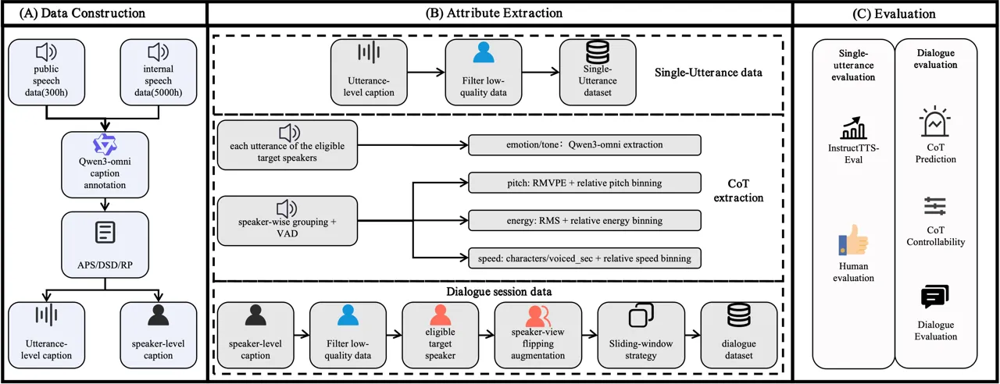

# CapTalk: Unified Voice Design for Single-Utterance and Dialogue Speech Generation

Xiaosu Su Affiliation: University of Chinese Academy of Sciences,
Beijing, China email: <suxiaosu@iie.ac.cn> , Zihan Sun
Affiliation: Hello Group Inc., Beijing, China email:
<sun.zihan@hellogroup.com> , Peilei Jia Affiliation: Hello Group Inc.,
Beijing, China email: <jia.peilei@hellogroup.com> and Jun Gao
Affiliation: Hello Group Inc., Beijing, China email:
<gao.jun@hellogroup.com>

###### Abstract.

Voice design from natural language descriptions is emerging as a new
task in text-to-speech multimodal generation, aiming to synthesize
speech with target timbre and speaking style without relying on
reference audio. However, existing methods mainly focus on
single-utterance generation, leaving conversational voice design largely
unexplored. In this work, we extend voice design to dialogue, enabling
better target speaker modeling and turn-level expressive control in
natural conversational settings. We propose CapTalk, a unified
caption-conditioned text-audio autoregressive framework for both
single-utterance and dialogue voice design. CapTalk uses utterance-level
captions for single-utterance voice design and speaker-level captions
for dialogue speaker modeling, and further introduces a CoT control
sequence in dialogue to explicitly plan turn-level dynamic attributes.
To resolve the conflict between stable timbre preservation and
context-adaptive expression, we propose a hierarchical variational
conditioning module with an utterance-level speaker encoder to better
balance stable timbre preservation and context-adaptive expression. This
enables timbre reuse while keeping expression adaptive to the current
utterance and, in dialogue, the surrounding context. We also build a
comprehensive evaluation protocol for both single-utterance and dialogue
settings. Experiments show that CapTalk achieves state-of-the-art
performance on a single-utterance voice design benchmark and delivers
better expression controllability and contextual appropriateness in
multi-turn dialogue. Audio samples are available at:
https://anonymous.4open.science/api/repo/Captalk-D601/file/index.html.

###### Keywords: 

voice design, controllable speech generation, dialogue speech
generation, caption-conditioned generation

## 1. Introduction

Recent advances in large-scale multimodal foundation models have
reshaped the interaction paradigm of generative artificial intelligence.
In image generation, video generation, and other cross-modal generation
tasks, natural language has become the most flexible control
interface(Team et al., 2025b; Team et al., 2026; Seedance et al., 2025).
A similar trend is now emerging in speech generation, where voice design
aims to synthesize a target voice directly from natural language
descriptions, rather than merely reproducing an existing speaker. In
this setting, the goal is not only to generate natural and intelligible
speech, but also to control who is speaking and how they speak(Hu et
al., 2026b; Hu et al., 2026a; Liu et al., 2023). For example, a user may
describe a target voice as “a calm middle-aged man with a low and steady
voice,” “an energetic young woman speaking brightly and quickly,” or “a
police officer loudly scolding a criminal.”

However, compared with visual generation, natural language-driven voice
design has emerged much later. Although modern neural TTS systems have
achieved substantial progress in naturalness, intelligibility, and
zero-shot voice cloning, they still lack a unified and flexible natural
language interface for controlling fine-grained attributes such as age,
timbre, style, emotion, and character identity(Wang et al., 2025; Chen
et al., 2024; Du et al., 2024a; Du et al., 2024b; Anastassiou et al.,
2024; Zhou et al., 2025; Xie et al., 2025b; Chen et al., 2025). Early
works such as PromptTTS(Guo et al., 2022), PromptTTS2(Leng et al.,
2023), InstructTTS(Yang et al., 2023), and VoxInstruct(Zhou et al., 2024) have demonstrated the feasibility of using textual descriptions as
a control interface for speech, but they still mainly focus on
label-based control and do not fully support open-ended voice design
with explicit modeling of speaker identity, timbre, and speaking style.

The recent surge of voice design research has been driven by progress in
speech understanding. In earlier controllable speech synthesis, systems
mainly relied on explicit labels, templated prompts, or implicit style
vectors(Wang et al., 2018). A major bottleneck was the lack of
sufficiently strong speech understanding models that could reliably
translate complex speaker attributes, timbre characteristics, and
expressive styles into high-quality natural language descriptions,
making it difficult to construct large-scale language-driven training
data. With the development of models such as Qwen3-Omni,
Qwen3-Omni-Captioner(Xu et al., 2025), Kimi-Audio(KimiTeam et al.,
2025), Step-Audio 2(Wu et al., 2025), and MiMo-Audio(Team et al.,
2025a), extracting speaker attributes, style descriptions, and
expressive states from audio has become much more feasible. This
progress has directly enabled a series of recent voice design works,
including FlexiVoice(Chen et al., 2026), VoiceSculptor(Hu et al.,
2026b), Qwen3TTS-12Hz-1.7B-VD(Hu et al., 2026a), MiMo-V2-TTS(Team et
al., 2025a), Ming-omni-tts-0.5B(Inclusion AI, 2026), and Fish Speech S2
Pro(Liao et al., 2026). Despite their diversity, these works still
mainly focus on single-utterance generation, and the naturalness of
generated speech in voice design settings remains an open challenge.
Moreover, for multi-turn dialogue, which is closer to real-world
interaction, systematic study is still limited.

Unlike single-utterance generation, dialogue speech generation must not
only preserve speaker identity and timbre consistency, but also
dynamically adjust turn-level expression and prosodic realization
according to the dialogue context. This requires modeling both stable
speaker timbre and turn-level expressive variation: the former is better
characterized by speaker-level global conditioning, while the latter
needs to be explicitly modeled at the current turn(Xie et al., 2025a;
Nguyen et al., 2023; Défossez et al., 2024). A central open problem,
however, is how to preserve a satisfactorily designed timbre for ongoing
generation. Once a desired voice has been crafted through text-guided
design, it must be reliably reused across diverse utterances and
dialogue contexts. VoiceSculptor addresses this through a two-stage
"voice design + cloning" pipeline, in which the designed voice is first
rendered into a reference utterance and then reproduced via speaker
cloning. This cloning-based strategy, however, introduces a fundamental
entanglement: while reference audio provides stable timbre cues, it
inevitably carries utterance-specific emotion, tone, and prosody,
causing the cloned output to conflate the target timbre with transient
expressive characteristics of the reference. Consequently, achieving
both stable timbre preservation and context-adaptive expressive control
within a unified generation framework remains an open challenge.

Beyond model design, evaluation is another major bottleneck for this
line of research. Existing public benchmarks provide an important
starting point for single-utterance voice design, but they mainly focus
on single-utterance speech and often rely on large models to
automatically judge consistency between generated speech and textual
descriptions(Huang et al., 2025). However, natural conversational speech
is equally important for real human-computer interaction scenarios. When
the task shifts to more natural and less exaggerated speech, as well as
context-driven multi-turn dialogue generation, the coverage of existing
benchmarks and their agreement with human perception remain limited(Feng
et al., 2025). We further observe that automatic evaluation is sensitive
to audio style distribution. Therefore, while existing benchmarks remain
useful references, they should be complemented by evaluation protocols
better suited to natural conversational speech and multi-turn
dialogue(Liao et al., 2026; Lin et al., 2026).

To address these issues, we propose CapTalk, a unified
caption-conditioned text-audio autoregressive framework for both
single-utterance and dialogue voice design. The main contributions of
this work are summarized as follows:

1\. We propose CapTalk, a unified caption-conditioned text-audio
autoregressive framework that supports both single-utterance and
dialogue voice design under the same discrete token modeling paradigm.
In particular, utterance-level captions are used for single-utterance
voice design, while speaker-level captions are used to model stable
speaker timbre and long-term speaking traits in dialogue, and a CoT
control sequence is further introduced for turn-level expressive
control.

2\. To address the open problem of preserving a satisfactorily designed
timbre while keeping generated expression adaptive to the current
utterance and dialogue context, we introduce a Factorized Hierarchical
Variational Autoencoder (FHVAE)-inspired hierarchical variational
conditioning mechanism that consists of an utterance-level speaker
encoder. Specifically, an utterance-level speaker embedding defines the
prior of a pooled segment latent, and KL regularization between the
segment posterior and this utterance-conditioned prior reinforces stable
timbre and voice attributes while attenuating segment-specific affective
variation. This allows a desired timbre to be preserved and reused
across utterances while keeping generated expression aligned with the
current text semantics and, in dialogue, the surrounding context within
a unified generation framework.

3\. To address the limited coverage of existing voice design evaluation
under natural conversational speech and multi-turn dialogue, we build a
comprehensive evaluation protocol for both single-utterance and dialogue
settings, including single-utterance human evaluation as well as
dialogue-oriented CoT prediction, controllability, and comparative
evaluation.


Figure 1. Overview of CapTalk. (a) Hierarchical variational timbre
conditioning. The bottom part shows the unified caption-conditioned
text-audio autoregressive framework for both single-utterance and
dialogue voice design.Overview of CapTalk with hierarchical variational
timbre conditioning and a unified caption-conditioned text-audio
autoregressive generation framework.

## 2. Related Work

Voice design has recently emerged as a new direction in text-to-speech
research, aiming to control speech generation from natural language
descriptions rather than predefined style labels or reference audio.
Prior work has explored how textual prompts can specify timbre, speaking
style, and expressive attributes, enabling more flexible control over
speech synthesis(Guo et al., 2022; Leng et al., 2023; Yang et al., 2023;
Zhou et al., 2024; Liu et al., 2023). Earlier expressive TTS systems
typically relied on latent style embeddings or global style tokens
instead of natural-language descriptions(Wang et al., 2018). More recent
systems further combine language-based control with zero-shot TTS or
voice cloning. For example, FlexiVoice decouples natural language
instructions from speech references, while VoiceSculptor adopts a
two-stage design-then-clone pipeline(Chen et al., 2026; Hu et al.,
2026b). Despite their effectiveness, these approaches mainly focus on
single-utterance generation.

Beyond these voice-design-focused systems, related developments also
appear in broader controllable TTS and unified audio generation
frameworks. Qwen3TTS-12Hz-1.7B-VD supports both short-reference voice
cloning and natural language-based voice design, while MiMo-V2-TTS
extends natural language style control to more open expressive
scenarios(Hu et al., 2026a; Team et al., 2025a). Related ideas also
appear in unified audio generation systems: Ming-omni-tts-0.5B models
speech, music, and sound within a shared framework, and Fish Speech S2
Pro supports multi-speaker and multi-turn generation with
instruction-following control(Inclusion AI, 2026; Liao et al., 2026). In
parallel, factorized hierarchical variational models such as FHVAE
explicitly separate stable factors from variations, providing useful
inspiration for disentangling stable speaker identity and timbre from
local acoustic realization(Hsu and Glass, 2018; Xie et al., 2021).

## 3. Architecture

### 3.1. Overview

As shown in Fig. 1, CapTalk is a unified caption-conditioned text-audio
autoregressive framework for both single-utterance and dialogue
generation. It consists of a speech tokenizer, a dual-transformer
text-to-speech model, and a hierarchical variational timbre conditioning
module consists of an utterance-level speaker encoder and segment-level
latent encoders. The tokenizer converts 16 kHz speech into discrete
acoustic tokens at 12.5 Hz with 16 codebooks, following recent
codec-based speech generation systems(Zeghidour et al., 2022; Défossez
et al., 2023). The text-to-speech model processes captions, an
utterance-level speaker embedding, speaker tags, text, and, when
available, dialogue context and CoT control signals in a unified
text-audio autoregressive backbone.(Wei et al., 2023b; Hu et al., 2025;
Ma et al., 2025).

The text-to-speech model consists of a backbone Transformer and a
lightweight decoder Transformer, where both Transformers are based on
the Qwen architecture(Qwen et al., 2025). The backbone Transformer
models the unified text-speech interleaved sequence and autoregressively
predicts the first codebook of each acoustic frame, while the smaller
decoder Transformer predicts the remaining codebooks conditioned on the
backbone hidden states, the generated first-layer codebook, and the
acoustic-side latent conditions $`z_{2}`$ and $`z_{1}`$. Let
$`a_{t}=\{a_{t}^{1},\ldots,a_{t}^{K}\}`$ denote the discrete acoustic
tokens of the $`t`$-th frame, where $`K=16`$ is the number of codebooks,
and let $`x_{<t}`$ denote the unified text-audio prefix sequence before
frame $`t`$. We factorize the frame-level probability as

```math
p(a_{t})=p(a_{t}^{1}\mid x_{<t})\prod_{k=2}^{K}p(a_{t}^{k}\mid x_{<t},a_{t}^{1},\ldots,a_{t}^{k-1}). \tag{1}
```

The overall model has approximately 1.5B parameters, where the backbone
Transformer accounts for the majority and the decoder Transformer,
speaker encoder, and hierarchical variational encoders are comparatively
lightweight.

### 3.2. Single-Utterance and Dialogue Modeling

CapTalk uses a unified caption-conditioned text-audio autoregressive
backbone for both single-utterance and dialogue generation, while
incorporating hierarchical variational timbre conditioning into both
settings. Concretely, an utterance-level speaker condition
$`e_{\mathrm{spk}}`$ is injected into the backbone to provide stable
global speaker information.

##### Single-Utterance Modeling

For the single-utterance setting, the backbone input sequence is

```math
X^{\mathrm{single}}_{\mathrm{LLM}}=[c_{\mathrm{cap}},e_{\mathrm{spk}},c_{\mathrm{txt}},a]. \tag{2}
```

Here, $`X^{\mathrm{single}}_{\mathrm{LLM}}`$ denotes the backbone input
sequence for the single-utterance branch, $`c_{\mathrm{cap}}`$ denotes
the caption token subsequence, $`e_{\mathrm{spk}}`$ denotes the
utterance-level speaker embedding injected into the backbone,
$`c_{\mathrm{txt}}`$ denotes the target text token subsequence with a
speaker tag, and $`a`$ denotes the multi-codebook acoustic token
sequence of the target speech. In this setting, $`c_{\mathrm{cap}}`$ is
instantiated from utterance-level captions.

Accordingly, the base training objective of the single-utterance branch
is

```math
L^{\mathrm{base}}_{\mathrm{single}}=2\big((1-\alpha)L_{c0}+\alpha L_{\mathrm{dec}}\big)+0.01L_{\mathrm{txt}}. \tag{3}
```

Here, $`\alpha\in[0,1]`$ controls the trade-off between the
first-codebook loss and the decoder loss, $`L_{c0}`$ denotes the
cross-entropy loss for predicting the first codebook over all target
acoustic frames, $`L_{\mathrm{dec}}`$ denotes the cross-entropy loss for
predicting the remaining codebooks on a randomly sampled subset of
target acoustic frames, and $`L_{\mathrm{txt}}`$ denotes the
cross-entropy loss on the supervised target text tokens.

##### Dialogue Modeling

For the dialogue setting, the model aims to generate response speech
that is consistent with both the target speaker identity and the
turn-level speaking style, given the target speaker caption, dialogue
history, and the current target text. To this end, the dialogue branch
further introduces CoT tokens for explicit control of turn-level dynamic
attributes, including emotion, tone, pitch, energy, and speaking rate.
The backbone input sequence is

```math
X^{\mathrm{dialogue}}_{\mathrm{LLM}}=[c_{\mathrm{cap}},e_{\mathrm{spk}},c_{\mathrm{ctx}},c_{\mathrm{txt}},c_{\mathrm{cot}},a]. \tag{4}
```

Here, $`X^{\mathrm{dialogue}}_{\mathrm{LLM}}`$ denotes the backbone
input sequence for the dialogue branch, $`c_{\mathrm{cap}}`$ denotes the
target speaker caption token subsequence, $`e_{\mathrm{spk}}`$ denotes
the utterance-level speaker embedding, $`c_{\mathrm{ctx}}`$ denotes the
dialogue-context subsequence from the contexts, $`c_{\mathrm{txt}}`$
denotes the current target-text subsequence with the target speaker tag,
$`c_{\mathrm{cot}}`$ denotes the CoT token subsequence, and $`a`$
denotes the target acoustic token sequence. In this setting,
$`c_{\mathrm{cap}}`$ is instantiated from speaker-level captions.

Accordingly, the base training objective of the dialogue branch is

```math
L^{\mathrm{base}}_{\mathrm{dialogue}}=2\big((1-\alpha)L_{c0}+\alpha L_{\mathrm{dec}}\big)+0.01L_{\mathrm{txt}}+2.0L_{\mathrm{cot}}. \tag{5}
```

Here, $`L_{c0}`$ and $`L_{\mathrm{dec}}`$ are defined in the same way as
in the single-utterance branch, $`L_{\mathrm{txt}}`$ denotes the
cross-entropy loss on the supervised target text tokens, and
$`L_{\mathrm{cot}}`$ denotes the cross-entropy loss on the CoT tokens.

##### Overall Objective

For both settings, the hierarchical variational timbre conditioning
module introduces latent prediction losses and KL regularization terms.
The final training objective is

```math
L=L_{\mathrm{base}}+\lambda_{\mathrm{spk}}L_{\mathrm{spk\mbox{-}lat}}+\lambda_{\mathrm{rec}}L_{\mathrm{rec}}+\lambda_{\mathrm{KL}}^{z_{2}}L_{\mathrm{KL}}^{z_{2}}+\lambda_{\mathrm{KL}}^{z_{1}}L_{\mathrm{KL}}^{z_{1}}, \tag{6}
```

where $`L_{\mathrm{base}}`$ denotes either
$`L^{\mathrm{base}}_{\mathrm{single}}`$ or
$`L^{\mathrm{base}}_{\mathrm{dialogue}}`$ depending on the training
branch, $`L_{\mathrm{spk\mbox{-}lat}}`$ denotes the latent prediction
loss for $`e_{\mathrm{spk}}`$, $`L_{\mathrm{rec}}`$ denotes the latent
reconstruction loss for $`z_{2}`$ and $`z_{1}`$,
$`L_{\mathrm{KL}}^{z_{2}}`$ and $`L_{\mathrm{KL}}^{z_{1}}`$ denote the
KL regularization terms for $`z_{2}`$ and $`z_{1}`$, where $`z_{2}`$ and
$`z_{1}`$ are hierarchical variational timbre conditioning module
posteriors, and $`\lambda_{\mathrm{spk}}`$, $`\lambda_{\mathrm{rec}}`$,
$`\lambda_{\mathrm{KL}}^{z_{2}}`$, and $`\lambda_{\mathrm{KL}}^{z_{1}}`$
are scalar loss weights.



Figure 2. Overview of data construction and evaluation. (A)
Qwen3-Omni-based caption annotation for public and internal speech data.
(B) Single-utterance and dialogue data construction with dialogue CoT
extraction. (C) Evaluation for single-utterance and dialogue voice
design.data_processing

### 3.3. Factorized Hierarchical Variational Timbre Conditioning

To reduce the entanglement between stable timbre and utterance-specific
expression in reference speech, we introduce a hierarchical variational
conditioning module inspired by the core factorization idea of FHVAE.
Our design is based on two temporal assumptions. First, within a full
utterance, speaker timbre and voice attributes such as gender, age, and
vocal texture remain approximately constant, whereas emotion and tone
may vary over time. Second, within a short segment, emotion and tone can
be treated as locally stationary. Under these assumptions, a pooled
full-utterance representation preserves stable speaker factors while
smoothing time-varying affective factors, whereas a pooled segment
representation retains the same stable speaker factors together with a
segment-local snapshot of emotion and tone.

Accordingly, we use two granularities of latent conditioning. A speaker
encoder with global temporal pooling extracts an utterance-level speaker
embedding $`e_{\mathrm{spk}}`$ from the full reference utterance. In
parallel, short segments are encoded into a pooled latent $`z_{2}`$ and
a frame-level latent $`z_{1}`$. Because $`z_{2}`$ is obtained from
pooled segment representations, it tends to capture factors that are
locally constant within the segment, including timbre, speaker
attributes, and the local affective state. By contrast, $`z_{1}`$
captures finer-grained frame-level variation such as phonetic content
and prosody. The key idea is then to regularize the segment posterior
$`q(z_{2}\mid s)`$ toward an utterance-conditioned prior
$`p(z_{2}\mid e_{\mathrm{spk}})`$. Since $`e_{\mathrm{spk}}`$ and
$`z_{2}`$ share stable speaker information but do not represent emotion
and tone at the same temporal granularity, this KL regularization
encourages the shared stable component to be preserved while attenuating
segment-specific affective variation in $`z_{2}`$.

Let $`\mathcal{S}(a^{\mathrm{ref}})=\{s^{(m)}\}_{m=1}^{M}`$ denote the
set of short segments extracted from a reference speech sample
$`a^{\mathrm{ref}}`$. We first extract the utterance-level speaker
embedding from the full utterance:

```math
e_{\mathrm{spk}}=\mathrm{SpeakerEnc}(a^{\mathrm{ref}}), \tag{7}
```

where $`\mathrm{SpeakerEnc}(\cdot)`$ denotes a speaker encoder with
global temporal pooling.

For notational simplicity, we write the hierarchical posterior for a
generic segment $`s\in\mathcal{S}(a^{\mathrm{ref}})`$ and average the
corresponding losses over all segments from the same reference
utterance. The hierarchical posterior is

```math
q_{\phi}(z_{1},z_{2}\mid s)=q_{\phi_{2}}(z_{2}\mid s)\cdot q_{\phi_{1}}(z_{1}\mid s,z_{2}), \tag{8}
```

where $`q_{\phi_{2}}(z_{2}\mid s)`$ is the posterior of the pooled
segment latent and $`q_{\phi_{1}}(z_{1}\mid s,z_{2})`$ is the posterior
of the frame-level latent conditioned on both the segment and $`z_{2}`$.
Here, $`z_{2}\in\mathbb{R}^{d_{2}}`$ denotes the pooled segment latent,
and $`z_{1}`$ denotes the frame-level latent used in the acoustic
generation pathway. Their Gaussian posteriors are defined as

```math
q_{\phi_{2}}(z_{2}\mid s)=\mathcal{N}\!\big(g_{\mu_{z_{2}}}(s),\;\operatorname{diag}(g_{\sigma_{z_{2}}}^{2}(s))\big), \tag{9}
```

```math
q_{\phi_{1}}(z_{1}\mid s,z_{2})=\mathcal{N}\!\big(g_{\mu_{z_{1}}}(s,z_{2}),\;\operatorname{diag}(g_{\sigma_{z_{1}}}^{2}(s,z_{2}))\big), \tag{10}
```

where $`g_{\mu_{z_{2}}}(\cdot)`$ and $`g_{\sigma_{z_{2}}}(\cdot)`$ are
the mean and scale predictors for $`z_{2}`$, and
$`g_{\mu_{z_{1}}}(\cdot,\cdot)`$ and $`g_{\sigma_{z_{1}}}(\cdot,\cdot)`$
are the mean and scale predictors for $`z_{1}`$.

We use a standard normal prior for $`z_{1}`$ and an
utterance-conditioned prior for $`z_{2}`$:

```math
\mu_{\mathrm{spk}}=f_{\eta}(e_{\mathrm{spk}}), \tag{11}
```

```math
p(z_{2}\mid e_{\mathrm{spk}})=\mathcal{N}(\mu_{\mathrm{spk}},I),\qquad p(z_{1})=\mathcal{N}(0,I), \tag{12}
```

where $`f_{\eta}(\cdot)`$ projects the utterance-level speaker embedding
to the mean of the prior distribution for $`z_{2}`$, and $`I`$ is the
identity covariance matrix.

The corresponding KL regularizers are

```math
L_{\mathrm{KL}}^{z_{2}}=\frac{1}{M}\sum_{m=1}^{M}D_{\mathrm{KL}}\!\left(q_{\phi_{2}}(z_{2}\mid s^{(m)})\;\|\;p(z_{2}\mid e_{\mathrm{spk}})\right), \tag{13}
```

```math
L_{\mathrm{KL}}^{z_{1}}=\frac{1}{M}\sum_{m=1}^{M}D_{\mathrm{KL}}\!\left(q_{\phi_{1}}(z_{1}\mid s^{(m)},z_{2})\;\|\;\mathcal{N}(0,I)\right). \tag{14}
```

The term $`L_{\mathrm{KL}}^{z_{2}}`$ encourages the pooled segment
latent $`z_{2}`$ to remain close to the utterance-level speaker
representation whenever the two agree, thereby reinforcing stable
timbre-related information while discouraging segment-specific variation
that is not consistent across the full utterance.

To enable inference without reference speech, we further predict the
utterance-level from textual conditions:

```math
\hat{e}_{\mathrm{spk}}=f_{\psi}(h_{\mathrm{cap}}),\qquad \tag{15}
```

where $`f_{\psi}(\cdot)`$ is prediction head, $`h_{\mathrm{cap}}`$
denotes the last hidden states of the caption segment. We align them
with the corresponding training-time representations by

```math
L_{\mathrm{spk-lat}}=\left\|\hat{e}_{\mathrm{spk}}-\operatorname{sg}(e_{\mathrm{spk}})\right\|_{2}^{2}, \tag{16}
```

where $`\operatorname{sg}(\cdot)`$ denotes the stop-gradient operator
and $`\|\cdot\|_{2}^{2}`$ denotes the squared Euclidean distance.

At training time, $`e_{\mathrm{spk}}`$ is injected into the backbone
Transformer as a stable timbre condition. At inference time, the model
supports both caption-guided generation, where
$`\hat{e}_{\mathrm{spk}}`$ is predicted from textual conditions, and
timbre-reuse generation, where a previously obtained
$`e_{\mathrm{spk}}`$ is fixed to preserve the designed timbre.

## 4. Task Formulation, Data Construction, and Evaluation Protocol

This section introduces the data construction, attribute extraction, and
evaluation protocol for both single-utterance and multi-turn dialogue
voice design. The overall pipeline is illustrated in Fig. 2. We first
describe the data sources and caption construction; we then introduce
the CoT design and attribute extraction procedure for dialogue; finally,
we build a comprehensive evaluation protocol for both single-utterance
and dialogue generation.

### 4.1. Data Sources and Caption Construction

We use both public and internal datasets. The single-utterance
experiments are conducted on 300 hours of public data and 5000 hours of
internal data. The dialogue experiments use full two-speaker dialogue
sessions from a subset of the internal speech corpus. Overall, the data
cover both acted-style speech and natural conversational speech.

In the caption annotation stage, we use Qwen3-Omni, a multimodal model,
to generate natural-language descriptions and construct two types of
captions: utterance-level captions for individual speech samples, which
describe utterance-level expressive characteristics, and speaker-level
captions for speaker-aggregated speech, which characterize relatively
stable speaker attributes and long-term speaking traits. For
speaker-level captions, we sample ten speech segments from the same
speaker and jointly input them into Qwen3-Omni to generate the
description. In the speaker-level description design, we still retain
dynamic attributes such as pitch variations and volume variations.

To unify speaker description formats, we follow the three description
styles in InstructTTSEval, namely Acoustic-Parameter Specification
(APS), Descriptive-Style Directive (DSD), and Role-Play (RP). In
InstructTTSEval, APS consists of explicit instructions covering twelve
features: gender, pitch, speaking rate, volume, age, clarity, fluency,
accent, timbre texture, emotion, tone, and personality. DSD rewrites
such structured instructions into free-form natural-language
descriptions, while RP describes roles or scenarios that imply a target
speaking style. For both the single-utterance and dialogue settings, we
generate all three caption styles for each sample, namely APS, DSD, and
RP. During training, these three caption variants are all used as
conditioning inputs, so that each underlying sample can contribute
multiple caption-conditioned training instances.

For the single-utterance setting, we use only utterance-level captions
as conditioning inputs. After caption construction, we further filter
out low-quality samples and retain the remaining utterance-caption pairs
to form the final single-utterance dataset.

For the dialogue setting, we use only speaker-level captions as speaker
conditions. Dialogue data are organized with full two-speaker sessions
as the basic units. Starting from the speaker-level captions, we further
filter low-quality data and determine the eligible target speakers in
each session. Here, an eligible target speaker refers to a speaker whose
utterances are of sufficient quality to be used as supervised target
speech in training. If only one speaker in a dialogue session passes the
quality filter, that speaker is treated as the only eligible target
speaker, while the other speaker is used only as the context speaker. If
both speakers pass the quality filter, both are treated as eligible
target speakers and contribute training samples from two speaker views:
in one view, speaker A is selected as the target speaker and speaker B
provides the dialogue context, while in the other view, speaker B is
selected as the target speaker and speaker A provides the dialogue
context. If neither speaker passes the quality filter, the dialogue
session is discarded. Based on the eligible target speakers, we then
convert each dialogue session into training samples. In addition,
because many dialogue sessions are too long to fit into a single
training sequence, we apply a sliding-window strategy over dialogue
turns. Specifically, we use a window size of 20 turns and split each
long dialogue session into multiple dialogue segments, which together
form the final dialogue dataset.

### 4.2. CoT Design and Attribute Extraction

After determining the eligible target speakers, we extract CoT-style
attributes from each target utterance used for supervision. The current
CoT consists of five attributes: emotion, tone, pitch, energy, and
speaking rate, arranged in the fixed order \<emotion\>\<tone\>\<pitch\>
\<energy\>\<speed\>. Among them, emotion and tone describe high-level
turn-wise expressive states, while pitch, energy, and speaking rate
characterize lower-level prosodic realization. We model the latter as
speaker-internal relative prosody rather than absolute comparisons
across speakers.

The choice of these five attributes follows a hierarchical view of
dialogue expression. Emotion and tone act as high-level expressive
factors that reflect the speaker’s affective state and communicative
intent at the current turn(Ma et al., 2023; Gao et al., 2024; Zhou et
al., 2021). In turn, they are typically realized through lower-level
prosodic variation, which we model using pitch, energy, and speaking
rate(Raitio et al., 2020; Ladd, 2008). This design yields a compact CoT
representation that links high-level dialogue expression to its
lower-level acoustic realization.

In practice, emotion and tone are extracted from each utterance of the
eligible target speakers by Qwen3-Omni. For pitch, energy, and speaking
rate, we first group speech by speaker and apply VAD to retain only
speech-active segments, so that the extracted attributes can be
normalized relative to each speaker’s own speaking baseline. For pitch,
we extract voiced-frame F0 trajectories with RMVPE(Wei et al., 2023a),
use the median F0 as the utterance-level pitch value, and map it into a
semitone space with 440 Hz as reference. A speaker-specific median
semitone value is then used as the baseline to derive relative pitch
deviation, which is discretized into normal, slightly high/low,
noticeably high/low, and extremely high/low. For energy, RMS is computed
on the voiced-only waveform and normalized by the speaker-level median
RMS, then discretized into normal, slightly louder/quieter, noticeably
louder/quieter, and extremely louder/quieter. For speaking rate,
punctuation, symbols, and spaces are removed from the text, and a
character-level rate is computed as “number of characters / voiced_sec”.
This is then normalized by the speaker-level median speaking rate and
discretized into normal, slightly faster/slower, noticeably
faster/slower, and extremely faster/slower. Therefore, pitch, energy,
and speaking rate all characterize deviations relative to each speaker’s
normal speaking state rather than absolute attributes across speakers.

| Model                 | APS   | DSD   | RP    | AVG   |
| --------------------- | ----- | ----- | ----- | ----- |
| Qwen3TTS-12Hz-1.7B-VD | 87.10 | 76.00 | 55.20 | 72.77 |
| Ming-omni-tts-0.5B    | 84.90 | 72.20 | 53.90 | 70.33 |
| VoiceSculptor         | 73.77 | 65.40 | 47.60 | 62.26 |
| Fish Speech S2 Pro    | 29.61 | 50.80 | 42.60 | 41.00 |
| CapTalk-1.5B (Ours)   | 84.10 | 75.40 | 61.70 | 73.73 |

Table 1. Results on the InstructTTSEval-ZH Benchmark.

### 4.3. Evaluation Protocol and Benchmark Analysis

Evaluation for voice design is still at an early stage. We first adopt
InstructTTSEval as a public benchmark for single-utterance controllable
speech evaluation, but its setting does not fully match the target
scenarios considered in this work. First, the benchmark mainly relies on
large models to automatically judge the consistency between generated
speech and textual descriptions, without sufficient human validation.
Second, it mainly focuses on single-utterance speech and does not cover
context dependence, target speaker consistency, or turn-level style
control in multi-turn dialogue. In addition, natural conversational
speech is typically flatter and more restrained, so relying solely on
existing automatic benchmarks may not fully reflect model performance in
this setting. Therefore, we treat the existing benchmark as a starting
point for single-utterance automatic evaluation, and further complement
it with human evaluation and a dialogue-specific evaluation protocol.

For the single-utterance task, we retain InstructTTSEval as an automatic
evaluation reference and additionally conduct human subjective
evaluation to compensate for its limited coverage in natural
conversational speech. Specifically, we score generated speech on a 1–5
scale from seven aspects: overall description consistency, identity
consistency, timbre consistency, expressive-style consistency,
role-intent consistency, control stability, and MOS naturalness.
Detailed definitions of these evaluation aspects are provided in
Appendix B.1.

For the dialogue task, since no existing benchmark provides a
corresponding setting, we further propose an extended evaluation
protocol with three components. First, we evaluate the plausibility of
CoT prediction for the current turn. Since multiple CoT combinations may
be reasonable under the same context, this task is not suitable for
exact matching against a unique ground-truth answer. Instead, we combine
Gemini-based evaluation and human evaluation to assess whether the
predicted CoT is consistent with contextual semantics, role state, and
turn-level expressive needs, and report the corresponding accuracy
metrics(Jia et al., 2024). Second, we evaluate CoT controllability by
changing only one CoT attribute while fixing the text, context, and
random seed, and then examining whether the generated speech changes as
expected along the target dimension. For emotion and tone, we use
Qwen3-Omni for posterior extraction; for pitch, energy, and speaking
rate, we use the same relative prosody extraction method as in training
for quantitative evaluation. Finally, we conduct overall dialogue
evaluation to analyze the practical contribution of CoT control to
generation quality. Specifically, we train an additional model variant
without CoT input and compare it with the full model under the same
dialogue context to assess whether CoT provides perceptible gains for
dialogue generation.

Overall, we complement existing single-utterance benchmarks with human
evaluation and extend evaluation to dialogue-specific CoT prediction,
CoT controllability, and overall dialogue quality, thereby forming a
more suitable evaluation framework for our task setting.

| Model                 | Overall | Identity | Timbre | Express. | Role | Stabil. | MOS  |
| --------------------- | ------- | -------- | ------ | -------- | ---- | ------- | ---- |
| Ming-omni-tts-0.5B    | 3.95    | 4.22     | 4.03   | 4.06     | 3.88 | 4.27    | 3.91 |
| Qwen3TTS-12Hz-1.7B-VD | 4.20    | 3.78     | 4.15   | 4.12     | 3.85 | 4.35    | 3.82 |
| VoiceSculptor         | 3.00    | 3.15     | 2.89   | 2.74     | 2.81 | 3.25    | 2.87 |
| Fish Speech S2 Pro    | 2.07    | 2.19     | 2.02   | 1.82     | 1.86 | 2.29    | 2.11 |
| CapTalk (Ours)        | 4.24    | 3.98     | 3.59   | 4.10     | 4.17 | 4.38    | 4.20 |

Table 2. Human evaluation results for single-utterance voice design. All
metrics are rated on a 1–5 scale. MOS denotes human-rated naturalness.
Best results are in bold.

| Evaluation Category | Metric       | Emotion | Tone   | Pitch  | Energy | Speed  |
| ------------------- | ------------ | ------- | ------ | ------ | ------ | ------ |
| CoT Prediction      | Accuracy     | 0.7850  | 0.7675 | 0.8375 | 0.8250 | 0.9125 |
| CoT Controllability | Success Rate | 0.7675  | 0.7675 | 0.8400 | 0.8550 | 0.8675 |

Table 3. Automatic evaluation results for dialogue voice design.

| Model Setting            | Gemini | Human Pairwise Preference |
| ------------------------ | ------ | ------------------------- |
| Dialogue Eval. (w/ CoT)  | 72%    | 65.5%                     |
| Dialogue Eval. (w/o CoT) | 28%    | 34.5%                     |

Table 4. Context coherence comparison in dialogue evaluation.

## 5. Experiments

### 5.1. Comparative Experiments

To verify the effectiveness of our method in both single-utterance and
multi-turn dialogue voice design, we systematically compare it with
representative voice design and controllable TTS models. Since the
single-utterance and dialogue settings differ in both task form and
evaluation objective, we evaluate them separately: the single-utterance
setting uses a public benchmark and human evaluation, while the dialogue
setting adopts an extended evaluation protocol targeting CoT control and
context-aware generation.

#### 5.1.1. Single-Utterance Comparison

In the single-utterance setting, we first evaluate on the
InstructTTSEval-ZH benchmark, which measures controllability from three
aspects, namely APS, DSD, and RP, and uses their average (AVG) as the
overall metric. We compare our method with Qwen3TTS-12Hz-1.7B-VD,
Ming-omni-tts-0.5B, VoiceSculptor, and Fish Speech S2 Pro. As shown in
Table 1, existing models perform relatively stably on APS and DSD, but
generally show a clear drop on RP, indicating that role-level intent and
persona modeling from natural language remain challenging. Our method
achieves the best RP score and the highest overall performance,
surpassing the second-best Qwen3TTS-12Hz-1.7B-VD. Although
Qwen3TTS-12Hz-1.7B-VD leads on APS and DSD, its RP score drops notably,
whereas our method achieves more balanced performance across all three
dimensions.

Since the public benchmark cannot fully reflect performance in natural
conversational speech, we further report human subjective evaluation in
Table 2. As shown in Table 2, CapTalk achieves the best overall score,
role-intent consistency, control stability, and MOS, indicating that it
better balances naturalness and high-level instruction following under
more conversational conditions. One possible explanation for the
relatively lower timbre-consistency score is that our single-utterance
training data are dominated by natural conversational speech, whose
fine-grained timbre variation is typically less salient than that of
acted-style speech. As a result, the model may learn naturalness and
high-level role/style intent more effectively than subtle timbre texture
under text-only voice design.

| Data Scale | Type             | APS   | DSD   | RP    | AVG   |
| ---------- | ---------------- | ----- | ----- | ----- | ----- |
| 300h       | Acted            | 82.78 | 71.41 | 49.10 | 67.76 |
| 1500h      | Conversat.       | 70.20 | 57.80 | 41.20 | 56.40 |
| 3000h      | Conversat.       | 74.00 | 62.40 | 46.80 | 61.07 |
| 5000h      | Conversat.       | 79.10 | 68.30 | 55.10 | 67.50 |
| 5000h+300h | Conversat.+Acted | 84.10 | 75.40 | 61.70 | 73.73 |

Table 5. Scaling law results for single-utterance voice design on
InstructTTSEval-ZH.

| Data Scale              | Evaluation Category | Emotion | Tone   | Pitch  | Energy | Speed  |
| ----------------------- | ------------------- | ------- | ------ | ------ | ------ | ------ |
| 17,258 sess., 3373 h    | CoT Prediction      | 0.7325  | 0.6950 | 0.8050 | 0.7875 | 0.8825 |
| 24,198 sess., 4482.35 h | CoT Prediction      | 0.7550  | 0.7225 | 0.8250 | 0.8025 | 0.9000 |
| 32,171 sess., 6270.68 h | CoT Prediction      | 0.7850  | 0.7675 | 0.8375 | 0.8250 | 0.9125 |
| 17,258 sess., 3373 h    | CoT Controllability | 0.7025  | 0.6900 | 0.7800 | 0.8125 | 0.8275 |
| 24,198 sess., 4482.35 h | CoT Controllability | 0.7375  | 0.7300 | 0.8125 | 0.8350 | 0.8475 |
| 32,171 sess., 6270.68 h | CoT Controllability | 0.7675  | 0.7675 | 0.8400 | 0.8550 | 0.8675 |

Table 6. Scaling law results for dialogue voice design under CoT
prediction and CoT controllability evaluation.

#### 5.1.2. Dialogue Comparison

Following the evaluation protocol described in Section 4.3, we evaluate
dialogue voice design from three perspectives. For CoT prediction
plausibility, Gemini-assisted and human evaluation on 400 samples show
that our model achieves reasonable prediction accuracy across all five
attributes (Table 3), with pitch, energy, and speed being the most
accurate. For CoT controllability, the controlled generation experiments
confirm that varying a single CoT attribute produces the expected change
in the corresponding acoustic dimension (Table 3). For overall dialogue
quality, Table 4 shows that the model with CoT is preferred over the
variant without CoT by both Gemini (72% vs. 28%) and human evaluators
(65.5% vs. 34.5%), confirming that explicit CoT planning improves
context coherence in dialogue generation. Detailed dialogue evaluation
materials are provided in Appendix B.2, including the dialogue
evaluation protocol, the details of CoT prediction evaluation, and
additional human-evaluation details.

##### Cross-System Dialogue Comparison.

| Model       | SIM$`\uparrow`$ | Context Coherence$`\uparrow`$ | MOS$`\uparrow`$ |
| ----------- | --------------- | ----------------------------- | --------------- |
| Fish S2 Pro | 0.806           | 3.61                          | 3.80            |
| CapTalk     | 0.808           | 4.18                          | 4.12            |

Table 7. Cross-system dialogue comparison between CapTalk and Fish
Speech S2 Pro. SIM measures cross-turn target-speaker timbre consistency
in dialogue; Context Coherence and MOS are human ratings (1–5).

We further compare CapTalk with Fish Speech S2 Pro on 40 multi-turn
dialogues (Table 7). In this dialogue setting, SIM is used to judge
whether multiple generated utterances of the target speaker sound as if
they are spoken by the same person, and therefore primarily reflects
cross-turn timbre consistency. Concretely, for each dialogue session, we
extract speaker embeddings from all generated target-speaker utterances
using a pretrained WavLM model(Chen et al., 2021) and compute their
average pairwise cosine similarity. Higher SIM indicates stronger
consistency of the target speaker’s timbre across turns. Context
coherence and MOS are evaluated through human rating on a 1–5 scale.
CapTalk achieves higher scores on all three metrics than Fish Speech S2
Pro, indicating that the hierarchical variational timbre conditioning
better preserves target-speaker timbre across dialogue turns, while
explicit CoT planning contributes to better context coherence and
naturalness.

### 5.2. Scaling Law Experiments

We further study how data scale and style coverage affect voice design
in both single-utterance and multi-turn dialogue settings.

#### 5.2.1. Scaling Law in Single-Utterance Voice Design

In the single-utterance setting, we train on acted, conversational, and
mixed-scale data and evaluate on InstructTTSEval-ZH (Table 5).
Performance depends on both data scale and style composition: 1500-hour
conversational data underperforms 300-hour acted data, whereas 5000-hour
conversational data improves substantially, and adding 300 hours of
acted speech yields the best result (AVG 73.73). This suggests that
natural conversational data provides broader coverage, while acted
speech is useful for stronger expressive attributes.

#### 5.2.2. Scaling Law in Dialogue Voice Design

In the dialogue setting, we train on 17,258, 24,198, and 32,171 sessions
and report CoT prediction and controllability in Table 6. Performance
improves steadily with data scale across all five attributes, indicating
that dialogue voice design benefits directly from large-scale
contextualized multi-speaker data.

### 5.3. Ablation Study

| Type                        | APS   | DSD   | RP    | AVG   |
| --------------------------- | ----- | ----- | ----- | ----- |
| Baseline (w/o caption_loss) | 79.10 | 68.30 | 55.10 | 67.50 |
| w/ caption_loss             | 77.20 | 69.10 | 54.40 | 66.90 |

Table 8. Ablation study on explicit caption_loss supervision in the
single-utterance setting.

We study the effect of explicit caption_loss supervision in the
single-utterance setting, while the dialogue no-CoT ablation is reported
in the comparative experiments. Table 8 shows that adding caption_loss
slightly improves DSD from 68.30 to 69.10, but reduces APS from 79.10 to
77.20, RP from 55.10 to 54.40, and the overall AVG from 67.50 to 66.90.
These results suggest that explicit caption supervision is not
beneficial overall in our setting, and we therefore disable caption_loss
in the final model.

## 6. Conclusion

We propose CapTalk, a unified caption-conditioned text-audio
autoregressive framework for both single-utterance and dialogue voice
design. CapTalk uses caption-based conditioning for voice design, with
utterance-level captions in the single-utterance setting and
speaker-level captions for target speaker modeling in dialogue, and
further introduces a CoT control sequence for turn-level dynamic
expression planning. Inspired by the core factorization idea of FHVAE,
our hierarchical variational conditioning module consists of an
utterance-level speaker encoder, using an utterance-conditioned prior
over the pooled segment latent to reinforce stable timbre and voice
attributes while suppressing segment-specific affective variation. This
enables timbre reuse while keeping expression adaptive to dialogue
context. Experiments show that CapTalk achieves state-of-the-art overall
performance on single-utterance voice design and delivers better
expression controllability, and context coherence in multi-turn
dialogue. We also build a comprehensive evaluation protocol covering
both settings. We plan to release caption annotations and a subset of
data upon acceptance to facilitate future research.

## References

- Anastassiou et al. (2024) P. Anastassiou, J. Cheng, D. Huang, D.
  Li, H. Liu, Y. Liu, et al. Seed-TTS: a family of high-quality
  versatile speech generation models. arXiv preprint arXiv:2406.02430.
  Cited by: §1.
- Chen et al. (2026) D. Chen, X. Zhang, Y. Wang, K. Dai, L. Ma, and Z.
  Wu FlexiVoice: enabling flexible style control in zero-shot tts with
  natural language instructions. arXiv preprint arXiv:2601.04656. Cited
  by: §1, §2.
- Chen et al. (2024) S. Chen, S. Peng, Y. Wu, Z. Zhang, C. Wang, S. Liu,
  and F. Wei VALL-E 2: neural codec language models are human parity
  zero-shot text to speech synthesizers. arXiv preprint
  arXiv:2406.05370. Cited by: §1.
- Chen et al. (2021) S. Chen, C. Wang, Z. Chen, Y. Wu, S. Liu, Z.
  Chen, J. Li, N. Kanda, T. Yoshioka, X. Xiao, J. Wu, L. Zhou, S.
  Ren, Y. Qian, Y. Qian, Y. Gong, and F. Wei WavLM: large-scale
  self-supervised pre-training for full stack speech processing. arXiv
  preprint arXiv:2110.13900. Cited by: Appendix C, §5.1.2.
- Chen et al. (2025) Y. Chen, Z. Niu, Z. Ma, K. Deng, C. Wang, J.
  Zhao, K. Yu, and X. Chen F5-tts: a fairytaler that fakes fluent and
  faithful speech with flow matching. arXiv preprint arXiv:2410.06885.
  Cited by: §1.
- Défossez et al. (2023) A. Défossez, J. Copet, G. Synnaeve, and Y. Adi
  High fidelity neural audio compression. Transactions on Machine
  Learning Research. Cited by: §3.1.
- Défossez et al. (2024) A. Défossez, L. Mazaré, M. Orsini, A. Royer, P.
  Pérez, H. Jégou, E. Grave, and N. Zeghidour Moshi: a speech-text
  foundation model for real-time dialogue. arXiv preprint
  arXiv:2410.00037. Cited by: §1.
- Du et al. (2024a) Z. Du, Q. Chen, S. Shi, K. Li, and H. Wen CosyVoice:
  a scalable multilingual zero-shot text-to-speech synthesizer based on
  supervised semantic tokens. arXiv preprint arXiv:2407.05407. Cited by:
  §1.
- Du et al. (2024b) Z. Du, Y. Wang, Q. Chen, X. Shi, X. Lv, T. Zhao, Z.
  Gao, Y. Yang, C. Gao, H. Wang, F. Yu, H. Liu, Z. Sheng, Y. Gu, C.
  Deng, W. Wang, S. Zhang, Z. Yan, and J. Zhou CosyVoice 2: scalable
  streaming speech synthesis with large language models. arXiv preprint
  arXiv:2412.10117. Cited by: §1.
- Feng et al. (2025) T. Feng, J. Lee, A. Xu, Y. Lee, T. Lertpetchpun, X.
  Shi, H. Wang, T. Thebaud, L. Moro-Velazquez, D. Byrd, N. Dehak, and S.
  Narayanan Vox-profile: a speech foundation model benchmark for
  characterizing diverse speaker and speech traits. arXiv preprint
  arXiv:2505.14648. Cited by: §1.
- Gao et al. (2024) X. Gao, C. Zhang, Y. Chen, H. Zhang, and N. F. Chen
  Emo-dpo: controllable emotional speech synthesis through direct
  preference optimization. arXiv preprint arXiv:2409.10157. Cited by:
  §4.2.
- Guo et al. (2022) Z. Guo, Y. Leng, Y. Wu, S. Zhao, and X. Tan
  PromptTTS: controllable text-to-speech with text descriptions. arXiv
  preprint arXiv:2211.12171. Cited by: §1, §2.
- Hsu and Glass (2018) W. Hsu and J. Glass Scalable factorized
  hierarchical variational autoencoder training. arXiv preprint
  arXiv:1804.03201. Cited by: §2.
- Hu et al. (2026a) H. Hu, X. Zhu, T. He, D. Guo, B. Zhang, X. Wang, Z.
  Guo, Z. Jiang, H. Hao, Z. Guo, X. Zhang, P. Zhang, B. Yang, J. Xu, J.
  Zhou, and J. Lin Qwen3-tts technical report. arXiv preprint
  arXiv:2601.15621. Cited by: §1, §1, §2.
- Hu et al. (2026b) J. Hu, H. Chen, L. Ma, D. Guo, Q. Zhan, W. Li, H.
  Zhang, K. Xia, Z. Zhang, W. Tian, C. Wang, J. Liang, S. Guo, Z.
  Yang, B. Wu, B. Zhang, P. Zhu, P. Xie, C. Xie, Q. Zhang, J. Liu,
  and L. Xie VoiceSculptor: your voice, designed by you. arXiv preprint
  arXiv:2601.10629. Cited by: §1, §1, §2.
- Hu et al. (2025) K. Hu, Z. Chen, C. H. Yang, P. Żelasko, O.
  Hrinchuk, V. Lavrukhin, J. Balam, and B. Ginsburg Chain-of-thought
  prompting for speech translation. arXiv preprint arXiv:2409.11538.
  Cited by: §3.1.
- Huang et al. (2025) K. Huang, Q. Tu, L. Fan, C. Yang, D. Zhang, S.
  Li, Z. Fei, Q. Cheng, and X. Qiu InstructTTSEval: benchmarking complex
  natural-language instruction following in text-to-speech systems.
  arXiv preprint arXiv:2506.16381. Cited by: §1.
- Inclusion AI (2026) Inclusion AI Ming-omni-tts: simple and efficient
  unified generation of speech, music, and sound with precise control.
  Note:
  [https://github.com/inclusionAI/Ming-omni-tts](https://github.com/inclusionAI/Ming-omni-tts)GitHub
  repository, accessed 2026-04-01 Cited by: §1, §2.
- Jia et al. (2024) J. Jia, A. Komma, T. Leffel, X. Peng, A. Nagesh, T.
  Soliman, A. Galstyan, and A. Kumar Leveraging llms for dialogue
  quality measurement. arXiv preprint arXiv:2406.17304. Cited by: §4.3.
- KimiTeam et al. (2025) KimiTeam, D. Ding, Z. Ju, Y. Leng, S. Liu, T.
  Liu, Z. Shang, K. Shen, W. Song, X. Tan, H. Tang, Z. Wang, C. Wei, Y.
  Xin, X. Xu, J. Yu, Y. Zhang, X. Zhou, Y. Charles, J. Chen, Y. Chen, Y.
  Du, W. He, Z. Hu, G. Lai, Q. Li, Y. Liu, W. Sun, J. Wang, Y. Wang, Y.
  Wu, Y. Wu, D. Yang, H. Yang, Y. Yang, Z. Yang, A. Yin, R. Yuan, Y.
  Zhang, and Z. Zhou Kimi-audio technical report. arXiv preprint
  arXiv:2504.18425. Cited by: §1.
- Ladd (2008) D. R. Ladd Intonational phonology. 2 edition, Cambridge
  University Press. External Links: ISBN 9780521861175,
  [Document](https://dx.doi.org/10.1017/CBO9780511808814) Cited by:
  §4.2.
- Leng et al. (2023) Y. Leng, Z. Guo, K. Shen, X. Tan, Z. Ju, Y. Liu, Y.
  Liu, D. Yang, L. Zhang, K. Song, L. He, X. Li, S. Zhao, T. Qin, and J.
  Bian PromptTTS 2: describing and generating voices with text prompt.
  arXiv preprint arXiv:2309.02285. Cited by: §1, §2.
- Liao et al. (2026) S. Liao, Y. Wang, S. Liu, Y. Cheng, R. Zhang, T.
  Li, S. Li, Y. Zheng, X. Liu, Q. Wang, Z. Zhou, J. Liu, X. Chen, and D.
  Han Fish audio s2 technical report. arXiv preprint arXiv:2603.08823.
  Cited by: §1, §1, §2.
- Lin et al. (2026) Y. Lin, H. Chou, T. Wei, K. Chen, and H. Lee Do you
  hear what i mean? quantifying the instruction-perception gap in
  instruction-guided expressive text-to-speech systems. arXiv preprint
  arXiv:2509.13989. Cited by: §1.
- Liu et al. (2023) G. Liu, Y. Zhang, Y. Lei, Y. Chen, R. Wang, Z. Li,
  and L. Xie PromptStyle: controllable style transfer for text-to-speech
  with natural language descriptions. arXiv preprint arXiv:2305.19522.
  Cited by: §1, §2.
- Ma et al. (2025) Z. Ma, Z. Chen, Y. Wang, E. S. Chng, and X. Chen
  Audio-cot: exploring chain-of-thought reasoning in large audio
  language model. arXiv preprint arXiv:2501.07246. Cited by: §3.1.
- Ma et al. (2023) Z. Ma, Z. Zheng, J. Ye, J. Li, Z. Gao, S. Zhang,
  and X. Chen Emotion2vec: self-supervised pre-training for speech
  emotion representation. arXiv preprint arXiv:2312.15185. Cited by:
  §4.2.
- Nguyen et al. (2023) T. A. Nguyen, E. Kharitonov, J. Copet, Y. Adi, W.
  Hsu, A. Abdelrahman, M. Rivière, and E. Dupoux Generative spoken
  dialogue language modeling. Transactions of the Association for
  Computational Linguistics 11, pp. 250–266. External Links:
  [Document](https://dx.doi.org/10.1162/tacl%5Fa%5F00545) Cited by: §1.
- Qwen et al. (2025) Qwen, A. Yang, B. Yang, B. Zhang, B. Hui, B.
  Zheng, B. Yu, C. Li, D. Liu, F. Huang, H. Wei, H. Lin, J. Yang, J.
  Tu, J. Zhang, J. Yang, J. Yang, J. Zhou, J. Lin, K. Dang, K. Lu, K.
  Bao, K. Yang, L. Yu, M. Li, M. Xue, P. Zhang, Q. Zhu, R. Men, R.
  Lin, T. Li, T. Tang, T. Xia, X. Ren, X. Ren, Y. Fan, Y. Su, Y.
  Zhang, Y. Wan, Y. Liu, Z. Cui, Z. Zhang, and Z. Qiu Qwen2.5 technical
  report. arXiv preprint arXiv:2412.15115. Cited by: §3.1.
- Raitio et al. (2020) T. Raitio, R. Rasipuram, and D. Castellani
  Controllable neural text-to-speech synthesis using intuitive prosodic
  features. arXiv preprint arXiv:2009.06775. Cited by: §4.2.
- Seedance et al. (2025) T. Seedance, H. Chen, S. Chen, X. Chen, Y.
  Chen, Y. Chen, Z. Chen, F. Cheng, T. Cheng, X. Cheng, X. Chi, J.
  Cong, J. Cui, Q. Cui, Q. Dong, J. Fan, J. Fang, Z. Fang, C. Feng, H.
  Feng, M. Gao, Y. Gao, D. Guo, Q. Guo, B. Hao, Q. Hao, B. He, Q. He, T.
  Hoang, R. Hu, X. Hu, W. Huang, Z. Huang, Z. Huang, D. Ji, S. Jiang, W.
  Jiang, Y. Jiang, Z. Jiang, A. Kim, J. Kong, Z. Lai, S. Lao, Y.
  Leng, A. Li, F. Li, G. Li, H. Li, J. Li, L. Li, M. Li, S. Li, T.
  Li, X. Li, X. Li, X. Li, X. Li, Y. Li, Y. Li, Y. Li, C. Liang, H.
  Liang, J. Liang, Y. Liang, Z. Liang, W. Liao, Y. Liao, H. Lin, K.
  Lin, S. Lin, X. Lin, Z. Lin, F. Ling, F. Liu, G. Liu, J. Liu, J.
  Liu, J. Liu, S. Liu, S. Liu, S. Liu, S. Liu, X. Liu, X. Liu, Y.
  Liu, Z. Liu, Z. Liu, J. Lyu, L. Lyu, Q. Lyu, H. Mu, X. Nie, J.
  Ning, X. Pan, Y. Peng, L. Qin, X. Qu, Y. Ren, K. Shen, G. Shi, L.
  Shi, Y. Song, Y. Song, F. Sun, L. Sun, R. Sun, Y. Sun, Z. Sun, W.
  Tang, Y. Tang, Z. Tao, F. Wang, F. Wang, J. Wang, J. Wang, K. Wang, K.
  Wang, Q. Wang, R. Wang, S. Wang, S. Wang, T. Wang, W. Wang, X.
  Wang, Y. Wang, Y. Wang, Y. Wang, Y. Wang, Z. Wang, G. Wei, W. Wei, D.
  Wu, G. Wu, H. Wu, J. Wu, J. Wu, R. Wu, X. Wu, Y. Wu, R. Xia, L.
  Xiang, F. Xiao, X. Xiao, P. Xie, S. Xie, S. Xu, J. Xue, S. Yan, B.
  Yang, C. Yang, J. Yang, R. Yang, T. Yang, Y. Yang, Y. Yang, Z.
  Yang, Z. Yang, S. Yao, Y. Yao, Z. Ye, B. Yu, J. Yu, C. Yuan, L.
  Yuan, S. Zeng, W. Zeng, X. Zeng, Y. Zeng, C. Zhang, H. Zhang, J.
  Zhang, K. Zhang, L. Zhang, L. Zhang, M. Zhang, T. Zhang, W. Zhang, X.
  Zhang, X. Zhang, Y. Zhang, Y. Zhang, Z. Zhang, F. Zhao, H. Zhao, Y.
  Zhao, H. Zheng, J. Zheng, X. Zheng, Y. Zheng, Y. Zheng, J. Zhou, J.
  Zhu, K. Zhu, S. Zhu, W. Zhu, B. Zou, and F. Zuo Seedance 1.5 pro: a
  native audio-visual joint generation foundation model. arXiv preprint
  arXiv:2512.13507. Cited by: §1.
- Team et al. (2025a) C. Team, D. Zhang, G. Wang, J. Xue, K. Fang, L.
  Zhao, R. Ma, S. Ren, S. Liu, T. Guo, W. Zhuang, X. Zhang, X. Song, Y.
  Yan, Y. He, Cici, B. Shen, C. Zhu, C. Ma, C. Chen, H. Chen, J. Li, L.
  Li, M. Zhu, P. Li, Q. Wang, S. Deng, W. Xiong, W. Huang, W. Yang, Y.
  Jiang, Y. Yang, Y. Tian, Y. Ma, Y. Yu, Z. Zhang, Z. Yue, B. Xiao, B.
  Xia, B. Gao, B. Ye, C. Cai, C. Liu, C. He, C. Li, D. Zhu, D. Zhang, F.
  Shi, G. Wang, H. Zhang, H. Lv, H. Li, H. Tian, H. Qu, H. Xu, H.
  Zhang, H. Liu, J. Duo, J. Zuo, J. Wei, J. Xiao, J. Dong, J. Shi, J.
  Hu, K. Bao, K. Zhou, L. Zhang, M. Chen, N. Chen, P. Zhang, Q. Chen, Q.
  Wang, R. Li, S. Liu, S. Wang, S. Li, S. Yu, S. Cao, S. Chen, S. Gu, W.
  Wang, W. Ma, X. Deng, X. Yong, X. Zhang, X. Wang, Y. Song, Y. Zhao, Y.
  Zhao, Y. Gao, Y. Cheng, Y. Tu, Y. Wang, Z. Huang, Z. Tang, Z. Lin, Z.
  Song, Z. Xu, Z. Zheng, and Z. Jiang MiMo-audio: audio language models
  are few-shot learners. arXiv preprint arXiv:2512.23808. Cited by: §1,
  §2.
- Team et al. (2025b) G. Team, A. Kamath, J. Ferret, S. Pathak, N.
  Vieillard, R. Merhej, S. Perrin, T. Matejovicova, A. Ramé, M.
  Rivière, L. Rouillard, T. Mesnard, G. Cideron, J. Grill, S. Ramos, E.
  Yvinec, M. Casbon, E. Pot, I. Penchev, G. Liu, F. Visin, K.
  Kenealy, L. Beyer, X. Zhai, A. Tsitsulin, R. Busa-Fekete, A. Feng, N.
  Sachdeva, B. Coleman, Y. Gao, B. Mustafa, I. Barr, E. Parisotto, D.
  Tian, M. Eyal, C. Cherry, J. Peter, D. Sinopalnikov, S.
  Bhupatiraju, R. Agarwal, M. Kazemi, D. Malkin, R. Kumar, D. Vilar, I.
  Brusilovsky, J. Luo, A. Steiner, A. Friesen, A. Sharma, A.
  Sharma, A. M. Gilady, A. Goedeckemeyer, A. Saade, A. Feng, A.
  Kolesnikov, A. Bendebury, A. Abdagic, A. Vadi, A. György, A. S.
  Pinto, A. Das, A. Bapna, A. Miech, A. Yang, A. Paterson, A. Shenoy, A.
  Chakrabarti, B. Piot, B. Wu, B. Shahriari, B. Petrini, C. Chen, C. L.
  Lan, C. A. Choquette-Choo, C. Carey, C. Brick, D. Deutsch, D.
  Eisenbud, D. Cattle, D. Cheng, D. Paparas, D. S. Sreepathihalli, D.
  Reid, D. Tran, D. Zelle, E. Noland, E. Huizenga, E. Kharitonov, F.
  Liu, G. Amirkhanyan, G. Cameron, H. Hashemi, H. Klimczak-Plucińska, H.
  Singh, H. Mehta, H. T. Lehri, H. Hazimeh, I. Ballantyne, I.
  Szpektor, I. Nardini, J. Pouget-Abadie, J. Chan, J. Stanton, J.
  Wieting, J. Lai, J. Orbay, J. Fernandez, J. Newlan, J. Ji, J.
  Singh, K. Black, K. Yu, K. Hui, K. Vodrahalli, K. Greff, L. Qiu, M.
  Valentine, M. Coelho, M. Ritter, M. Hoffman, M. Watson, M.
  Chaturvedi, M. Moynihan, M. Ma, N. Babar, N. Noy, N. Byrd, N. Roy, N.
  Momchev, N. Chauhan, N. Sachdeva, O. Bunyan, P. Botarda, P.
  Caron, P. K. Rubenstein, P. Culliton, P. Schmid, P. G. Sessa, P.
  Xu, P. Stanczyk, P. Tafti, R. Shivanna, R. Wu, R. Pan, R. Rokni, R.
  Willoughby, R. Vallu, R. Mullins, S. Jerome, S. Smoot, S. Girgin, S.
  Iqbal, S. Reddy, S. Sheth, S. Põder, S. Bhatnagar, S. R. Panyam, S.
  Eiger, S. Zhang, T. Liu, T. Yacovone, T. Liechty, U. Kalra, U.
  Evci, V. Misra, V. Roseberry, V. Feinberg, V. Kolesnikov, W. Han, W.
  Kwon, X. Chen, Y. Chow, Y. Zhu, Z. Wei, Z. Egyed, V. Cotruta, M.
  Giang, P. Kirk, A. Rao, K. Black, N. Babar, J. Lo, E. Moreira, L. G.
  Martins, O. Sanseviero, L. Gonzalez, Z. Gleicher, T. Warkentin, V.
  Mirrokni, E. Senter, E. Collins, J. Barral, Z. Ghahramani, R.
  Hadsell, Y. Matias, D. Sculley, S. Petrov, N. Fiedel, N. Shazeer, O.
  Vinyals, J. Dean, D. Hassabis, K. Kavukcuoglu, C. Farabet, E.
  Buchatskaya, J. Alayrac, R. Anil, D. Lepikhin, S. Borgeaud, O.
  Bachem, A. Joulin, A. Andreev, C. Hardin, R. Dadashi, and L. Hussenot
  Gemma 3 technical report. arXiv preprint arXiv:2503.19786. Cited by:
  §1.
- Team et al. (2026) K. Team, J. Chen, Y. Ding, Z. Fang, K. Gai, K.
  He, X. He, J. Hua, M. Lao, X. Li, H. Liu, J. Liu, X. Liu, F. Shi, X.
  Shi, P. Sun, S. Tang, P. Wan, T. Wen, Z. Wu, H. Zhang, R. Zhao, Y.
  Zhang, and Y. Zhou Kling-motioncontrol technical report. arXiv
  preprint arXiv:2603.03160. Cited by: §1.
- Wang et al. (2025) C. Wang, S. Chen, Y. Wu, Z. Zhang, L. Zhou, S.
  Liu, Z. Chen, Y. Liu, H. Wang, J. Li, L. He, S. Zhao, and F. Wei
  VALL-E: neural codec language models are zero-shot text to speech
  synthesizers. IEEE/ACM Transactions on Audio, Speech, and Language
  Processing 33, pp. 705–718. External Links:
  [Document](https://dx.doi.org/10.1109/TASLP.2025.3530270) Cited by:
  §1.
- Wang et al. (2018) Y. Wang, D. Stanton, Y. Zhang, R. Skerry-Ryan, E.
  Battenberg, J. Shor, Y. Xiao, Y. Jia, F. Ren, and R. A. Saurous Style
  tokens: unsupervised style modeling, control and transfer in
  end-to-end speech synthesis. In International Conference on Machine
  Learning (ICML), pp. 5180–5189. Cited by: §1, §2.
- Wei et al. (2023a) H. Wei, X. Cao, T. Dan, and Y. Chen RMVPE: a robust
  model for vocal pitch estimation in polyphonic music. In Proc.
  Interspeech, pp. 5421–5425. External Links:
  [Document](https://dx.doi.org/10.21437/Interspeech.2023-528) Cited by:
  §4.2.
- Wei et al. (2023b) J. Wei, X. Wang, D. Schuurmans, M. Bosma, B.
  Ichter, F. Xia, E. Chi, Q. Le, and D. Zhou Chain-of-thought prompting
  elicits reasoning in large language models. arXiv preprint
  arXiv:2201.11903. Cited by: §3.1.
- Wu et al. (2025) B. Wu, C. Yan, C. Hu, C. Yi, C. Feng, F. Tian, F.
  Shen, G. Yu, H. Zhang, J. Li, M. Chen, P. Liu, W. You, X. T. Zhang, X.
  Li, X. Yang, Y. Deng, Y. Huang, Y. Li, Y. Zhang, Z. You, B. Li, C.
  Wan, H. Hu, J. Zhen, S. Chen, S. Yuan, X. Zhang, Y. Jiang, Y. Zhou, Y.
  Yang, B. Li, B. Ma, C. Song, D. Pang, G. Hu, H. Sun, K. An, N.
  Wang, S. Gao, W. Ji, W. Li, W. Sun, X. Wen, Y. Ren, Y. Ma, Y. Lu, B.
  Wang, B. Li, C. Miao, C. Liu, C. Xu, D. Shi, D. Hu, D. Wu, E. Liu, G.
  Huang, G. Yan, H. Zhang, H. Nie, H. Jia, H. Zhou, J. Sun, J. Wu, J.
  Wu, J. Yang, J. Yang, J. Lin, K. Li, L. Yang, L. Shi, L. Zhou, L.
  Gu, M. Li, M. Li, M. Li, N. Wu, Q. Han, Q. Tan, S. Pang, S. Fan, S.
  Liu, T. Cao, W. Lu, W. He, W. Xie, X. Zhao, X. Li, Y. Yu, Y. Yang, Y.
  Liu, Y. Lu, Y. Wang, Y. Ding, Y. Liang, Y. Lu, Y. Luo, Y. Yin, Y.
  Zhan, Y. Zhang, Z. Yang, Z. Zhang, B. Jiao, D. Jiang, H. Shum, J.
  Chen, J. Li, X. Zhang, and Y. Zhu Step-audio 2 technical report. arXiv
  preprint arXiv:2507.16632. Cited by: §1.
- Xie et al. (2025a) K. Xie, F. Shen, J. Li, F. Xie, X. Tang, and Y. Hu
  FireRedTTS-2: towards long conversational speech generation for
  podcast and chatbot. arXiv preprint arXiv:2509.02020. Cited by: §1.
- Xie et al. (2025b) T. Xie, Y. Rong, P. Zhang, W. Wang, and L. Liu
  Towards controllable speech synthesis in the era of large language
  models: a systematic survey. arXiv preprint arXiv:2412.06602. Cited
  by: §1.
- Xie et al. (2021) Y. Xie, T. Arildsen, and Z. Tan Disentangled speech
  representation learning based on factorized hierarchical variational
  autoencoder with self-supervised objective. In 2021 IEEE 31st
  International Workshop on Machine Learning for Signal Processing
  (MLSP), pp. 1–6. External Links:
  [Document](https://dx.doi.org/10.1109/mlsp52302.2021.9596320) Cited
  by: §2.
- Xu et al. (2025) J. Xu, Z. Guo, H. Hu, Y. Chu, X. Wang, J. He, Y.
  Wang, X. Shi, T. He, X. Zhu, Y. Lv, Y. Wang, D. Guo, H. Wang, L.
  Ma, P. Zhang, X. Zhang, H. Hao, Z. Guo, B. Yang, B. Zhang, Z. Ma, X.
  Wei, S. Bai, K. Chen, X. Liu, P. Wang, M. Yang, D. Liu, X. Ren, B.
  Zheng, R. Men, F. Zhou, B. Yu, J. Yang, L. Yu, J. Zhou, and J. Lin
  Qwen3-omni technical report. arXiv preprint arXiv:2509.17765. Cited
  by: §1.
- Yang et al. (2023) D. Yang, S. Liu, R. Huang, C. Weng, and H. Meng
  InstructTTS: modelling expressive tts in discrete latent space with
  natural language style prompt. arXiv preprint arXiv:2301.13662. Cited
  by: §1, §2.
- Zeghidour et al. (2022) N. Zeghidour, A. Luebs, A. Omran, J. Skoglund,
  and M. Tagliasacchi SoundStream: an end-to-end neural audio codec.
  IEEE/ACM Transactions on Audio, Speech, and Language Processing 30,
  pp. 495–507. External Links:
  [Document](https://dx.doi.org/10.1109/TASLP.2021.3129994) Cited by:
  §3.1.
- Zhou et al. (2021) K. Zhou, B. Sisman, R. Liu, and H. Li Seen and
  unseen emotional style transfer for voice conversion with a new
  emotional speech dataset. arXiv preprint arXiv:2010.14794. Cited by:
  §4.2.
- Zhou et al. (2025) S. Zhou, Y. Zhou, Y. He, X. Zhou, J. Wang, W. Deng,
  and J. Shu IndexTTS2: a breakthrough in emotionally expressive and
  duration-controlled auto-regressive zero-shot text-to-speech. arXiv
  preprint arXiv:2506.21619. Cited by: §1.
- Zhou et al. (2024) Y. Zhou, X. Qin, Z. Jin, S. Zhou, S. Lei, S.
  Zhou, Z. Wu, and J. Jia VoxInstruct: expressive human
  instruction-to-speech generation with unified multilingual codec
  language modelling. In Proceedings of the 32nd ACM International
  Conference on Multimedia, MM ’24, pp. 554–563. External Links:
  [Document](https://dx.doi.org/10.1145/3664647.3681680) Cited by: §1,
  §2.

## Appendix A Limitations and Future Work

Although our method achieves promising results in both single-utterance
and multi-turn dialogue voice design, several limitations remain. First,
our data annotation pipeline relies heavily on the audio understanding
and caption generation capabilities of Qwen3-Omni, whose description
quality still has inherent limitations; this in turn affects the
accuracy and stability of caption conditions. Second, our training data
mainly consists of natural conversational speech (casual chat style),
whose emotional intensity and expressive range are typically weaker than
those of acted-style speech, leaving room for improvement in more
expressive settings.

We identify three directions for future work. First, we plan to explore
multi-model cross-validation and human-in-the-loop correction to improve
caption quality and reduce description bias. Second, constructing a
larger-scale voice design corpus with broader coverage of age, accent,
and expressive style would benefit generalization. Third, building on
the evaluation protocol proposed in this work, we plan to develop a
high-quality, publicly available benchmark specifically designed for
voice design, covering both single-utterance and dialogue scenarios with
human-validated annotations, to provide a more reliable evaluation
foundation for the community.

## Appendix B Additional Evaluation Details

### B.1. Single-Utterance Human Evaluation

For single-utterance voice design, human evaluation is conducted from
the following seven aspects, each rated on a 1–5 scale.

##### Overall Description Consistency.

This metric evaluates the overall consistency between the generated
audio and the caption description from a holistic listening perspective.

##### Identity Consistency.

This metric evaluates whether the generated audio matches the caption in
terms of basic identity-related attributes, including perceived gender,
age, and accent/regional characteristics.

##### Timbre Consistency.

This metric evaluates whether the generated audio matches the caption in
terms of timbre-related properties, including voice quality, timbre
texture, brightness, thickness, breathiness, and hoarseness.

##### Expressive-Style Consistency.

This metric evaluates whether the generated audio matches the caption in
terms of expression, including emotion, prosody, and speaking style,
i.e., how the utterance is delivered.

##### Role-Intent Consistency.

This metric evaluates whether the generated audio reflects the
higher-level role perception, scene perception, and expressive intent
described in the caption.

##### Control Stability.

This metric evaluates the consistency of generated outputs in terms of
vocal characteristics and expressive style across multiple generations
under the same caption.

##### MOS (Naturalness).

This metric evaluates whether the generated audio sounds natural and
human-like, regardless of the caption condition. Annotators rate each
sample on a 1–5 scale, and the final MOS is obtained by averaging scores
across annotators and samples.

### B.2. Dialogue Evaluation Protocol

Table 9 summarizes the dialogue evaluation protocol.

| Evaluation Category            | Purpose                                                                    | Method                                                                                                                              | Reported Results             |
| ------------------------------ | -------------------------------------------------------------------------- | ----------------------------------------------------------------------------------------------------------------------------------- | ---------------------------- |
| CoT Prediction Evaluation      | Evaluate whether the predicted CoT for the current utterance is reasonable | Gemini-assisted evaluation and human evaluation are used to judge whether the predicted CoT is consistent with the dialogue context | Accuracy                     |
| CoT Controllability Evaluation | Evaluate the effectiveness of CoT-based control                            | Controlled generation is performed by fixing the text, context, and random seed while changing only one CoT attribute at a time     | Success Rate                 |
| Overall Dialogue Evaluation    | Evaluate whether introducing CoT brings benefits to dialogue generation    | Gemini-assisted evaluation and human pairwise evaluation are used to compare dialogue generation with and without CoT               | Context Coherence Preference |

Table 9. Summary of the dialogue evaluation protocol.

#### B.2.1. Details of CoT Prediction Evaluation

For the dialogue setting, we do not treat exact matching between
predicted CoT and ground-truth CoT as the only evaluation criterion.
Instead, we evaluate whether the predicted CoT is reasonable given the
target speaker profile, dialogue history, and target utterance. This
design is motivated by the fact that, in dialogue, a single target
utterance may admit multiple reasonable stylistic interpretations.
Therefore, comparison against a single annotated answer may
underestimate the actual CoT prediction ability of the model.

Specifically, for each target turn, the model predicts a CoT
representation composed of emotion, tone, pitch, energy, and speed based
on the caption, dialogue history, and current text. The predicted CoT is
then judged for plausibility with access to the target speaker profile,
the most recent four turns of dialogue text and their corresponding
audio, the current target text. During evaluation, the judge model is
not provided with the ground-truth CoT, so as to avoid direct bias from
reference labels.

Evaluation samples are stratified and randomly sampled from the
validation set. We select 100 sessions in total. For each session, four
target turns are further selected to cover the early, early-middle,
late-middle, and late parts of the dialogue, so as to ensure a balanced
position distribution within each session. This yields 400 evaluation
samples in total.

For automatic evaluation, Gemini is used as the judge model. For each
sample, Gemini gives a binary plausible/implausible judgment for each of
the five CoT attributes and also outputs an overall judgment. In the
main paper, we primarily report the plausibility rate of the five
attribute dimensions, while the overall judgment is used as an auxiliary
indicator. In addition, we conduct human evaluation on a smaller subset
to verify the reliability of the automatic evaluation.

To validate the reliability of Gemini-based evaluation, we further
perform human evaluation. Specifically, 30 samples are stratified and
randomly selected from the CoT prediction evaluation set, and 15
annotators independently judge whether the predicted CoT is reasonable.
The annotators are given access to the target speaker caption, the most
recent four turns of dialogue text and their corresponding audio, the
current target text, and the predicted CoT; the ground-truth CoT is not
provided.

The evaluation criterion is the same as that used in automatic
evaluation, namely, whether the predicted CoT can be regarded as a
reasonable interpretation of the current utterance given the dialogue
history and speech context. Annotators provide binary judgments for the
five CoT attributes as well as the overall result. Final results are
obtained by majority voting and are used for comparison with
Gemini-based evaluation.

##### Gemini Prompt.

The Gemini prompt used for CoT plausibility evaluation is shown below.

> System role: You are an expert in Chinese dialogue speech style
> analysis.
>
> Task: Determine whether the “model-predicted CoT” is reasonable based
> on the target speaker profile, dialogue history, the current target
> utterance text, and multiple audio segments provided in order.
>
> Goal: Your goal is not to check whether the prediction exactly matches
> a unique ground-truth answer, but whether it can be considered a
> reasonable, natural, and context-consistent interpretation of the
> current target utterance and its audio.
>
> Audio order: The first several audio segments correspond to historical
> dialogue turns. The last audio segment corresponds to the current
> target utterance. Your judgment should focus on whether the predicted
> CoT for the current target utterance is reasonable, while also
> considering dialogue relations, emotional flow, and tone continuity
> from the history.
>
> CoT dimensions: emotion: whether the predicted emotion of the current
> target utterance is reasonable; tone: whether the predicted tone /
> discourse function is reasonable; pitch: whether the predicted pitch
> trend is reasonable; energy: whether the predicted energy / loudness
> is reasonable; speed: whether the predicted speaking rate is
> reasonable; overall: true only if all five dimensions are reasonable;
> otherwise false.
>
> Judging principles: If a dimension clearly conflicts with the
> perceptual impression of the current target utterance audio, output
> false. If a dimension clearly conflicts with the dialogue relation
> implied by the history, output false. If a dimension is broadly
> consistent with both the audio and the history, output true. It may
> differ from human annotation and still be true, as long as it is a
> reasonable interpretation. Ignore factors unrelated to CoT, such as
> audio quality, naturalness, minor mispronunciations, or ASR
> deviations. Prioritize the current target utterance audio, and then
> use the dialogue history as supporting context.
>
> Output format: Please output strict JSON only, without any extra
> explanation: { “emotion”: true, “tone”: false, “pitch”: true,
> “energy”: false, “speed”: true }
>
> Sample to be evaluated: \<Insert sample here\>

#### B.2.2. Additional Human Evaluation Details

To further improve the reliability of our experimental results, we
provide additional details of the human evaluation setup and score
aggregation procedure.

For single-utterance human evaluation, we randomly sampled 45 test cases
and invited 25 annotators to independently rate the outputs of each
model. The evaluation dimensions include overall description
consistency, identity consistency, timbre consistency, expressive-style
consistency, role-intent consistency, control stability, and MOS
naturalness. All dimensions were rated on a 1–5 scale, and the final
score of each model was obtained by averaging the ratings across
annotators and samples.

For CoT prediction evaluation in dialogue, in addition to Gemini-based
automatic evaluation, we further conducted human verification on the
30-sample subset described in Section B.2.1, with 15 annotators
independently judging whether the predicted CoT was reasonable. The
annotators provided binary judgments for each of the five CoT attributes
as well as the overall result, and the final decision was obtained by
majority voting.

For overall dialogue evaluation, we randomly sampled 15 dialogue cases
and invited 20 annotators to perform human pairwise comparison under the
same dialogue context. For each case, we synthesized the full dialogue
session for both the full model and the w/o-CoT variant. The target
speaker was selected from eligible_target_speakers, while the other
speaker was kept as dialogue history/reference. Annotators then judged
which system produced target-speaker turns that were more coherent with
the full session context. For pairwise comparisons such as w/ CoT versus
w/o CoT, the presentation order was randomized to reduce position bias,
and the final preference was determined by majority voting. We report
the resulting human pairwise preference on context coherence.

## Appendix C Analysis of Hierarchical Variational Timbre Conditioning

This appendix provides additional empirical analysis for the factorized
hierarchical variational timbre conditioning module proposed in
Section 3.3. The central claim of that module is that the
utterance-level speaker embedding $`e_{\text{spk}}`$, together with the
KL regularization between the segment posterior $`q(z_{2}\mid s)`$ and
the utterance-conditioned prior $`p(z_{2}\mid e_{\text{spk}})`$, enables
a desired timbre to be _preserved and reused_ across diverse utterances
while keeping expression adaptive to the local context. Here we directly
probe this property and use it to interpret the human-evaluated timbre
score of CapTalk in Table 2.

The human-evaluated timbre consistency reported in Table 2 (3.59 for
CapTalk) is lower than that of several baselines. We attribute this not
to a deficiency of the hierarchical variational module, but to a
structural property of caption-conditioned voice design that is often
overlooked in evaluation: voice design is intrinsically a one-to-many
task. Given a caption such as “a calm middle-aged man with a low and
steady voice”, many concrete voices are equally valid realizations. In
our human evaluation, each generation independently samples a new
$`\hat{e}_{\text{spk}}`$ from the caption-conditioned distribution, so
different samples for the same caption may correspond to different
specific voices within the same caption-consistent voice space.
Annotators tend to perceive such sample-level variability as timbre
inconsistency, which deflates the timbre score even when the module
itself preserves timbre faithfully under a fixed designed voice.

To probe whether the hierarchical variational timbre conditioning module
actually delivers the timbre-reuse property claimed in Section 3.3, we
conduct a _timbre reuse_ analysis that directly contrasts the two
inference modes supported by the module. For each caption, we evaluate
two settings: (i) _Fixed $`e_{\text{spk}}`$_, where
$`\hat{e}_{\text{spk}}`$ is predicted once from the caption and then
reused across all subsequent utterances, corresponding to the practical
voice-design-then-reuse usage enabled by the module; and (ii) _Resampled
$`e_{\text{spk}}`$_, where $`\hat{e}_{\text{spk}}`$ is independently
re-predicted for every utterance, corresponding to the protocol
implicitly assumed by per-sample human rating. For each setting, we
generate multiple utterances with diverse text content, extract speaker
embeddings from the generated speech using a pretrained WavLM
model (Chen et al., 2021), and compute the average pairwise cosine
similarity (SIM) across utterances of the same designed voice. Higher
SIM indicates stronger cross-utterance timbre consistency. We emphasize
that the per-sample human evaluation in Table 2 corresponds to the
_Resampled_ setting, not the _Fixed_ setting: each rated sample uses an
independently re-predicted $`\hat{e}_{\text{spk}}`$. The 3.59 timbre
score should therefore be read against the 0.42 SIM in the resampled
mode, while the 0.92 SIM in the fixed mode reflects a complementary
inference path of the same module that human raters never accessed.

| Setting                                      | Cross-utterance SIM $`\uparrow`$ |
| -------------------------------------------- | -------------------------------- |
| Fixed $`e_{\text{spk}}`$ (timbre reuse)      | 0.92                             |
| Resampled $`e_{\text{spk}}`$ (per-utterance) | 0.42                             |

Table 10. Timbre reuse analysis. SIM is the average pairwise cosine
similarity between WavLM speaker embeddings extracted from generated
utterances of the same designed voice.

As shown in Table 10, the fixed-$`e_{\text{spk}}`$ setting achieves a
cross-utterance SIM of 0.92, substantially higher than the 0.42 obtained
under the resampled setting, confirming that once a designed voice is
fixed, the hierarchical variational timbre conditioning module preserves
it consistently across utterances. The lower timbre score in Table 2
therefore primarily reflects the inherent variability of
caption-conditioned sampling rather than a weakness in timbre modeling.
This observation also suggests that future evaluation protocols for
voice design should explicitly distinguish two complementary axes:
_caption-conditioned diversity_, which characterizes how broadly the
model covers the space of caption-consistent voices, and _designed-voice
reuse consistency_, which characterizes how stably a single designed
voice can be preserved across utterances and dialogue contexts. The
hierarchical variational timbre conditioning module proposed in
Section 3.3 is specifically aimed at the latter, and the timbre reuse
analysis above provides direct empirical evidence of its effectiveness,
complementing the architectural motivation given in the main text.

## Appendix D Examples of Single-Utterance and Dialogue Captions

Although we generate the same three surface styles (APS, DSD, and RP) in
both the single-utterance and dialogue settings, the semantic scope of
the caption is fundamentally different. In the single-utterance setting,
the caption is tied to one specific recording and is intended to
describe how that utterance is spoken, including its local expressive
realization. In the dialogue setting, the caption is used as a reusable
speaker condition attached to the target speaker across many turns in
the same session. The transient turn-level state of the current
utterance is instead represented separately by the CoT sequence
described in Section 4.2. In this sense, the single-utterance caption
mainly answers “how is this utterance spoken?”, whereas the dialogue
caption mainly answers “what kind of speaker is this across the
dialogue?”.

Table 11 provides representative examples of the three caption styles
used in our data construction. For APS captions, we further note an
important difference between the two settings. In the single-utterance
setting, APS captions may include utterance-level expressive
information. In the dialogue setting, however, the speaker-level APS
caption is designed to capture relatively stable speaker traits only.
Therefore, emotion and tone are not extracted into the dialogue APS
caption; instead, they are modeled separately by the CoT sequence
together with other turn-level dynamic attributes. This separation helps
avoid mixing persistent speaker identity with transient turn-wise
expression in the same caption.

| Style | Single-utterance caption                                                                                                                                                                                                                                                                                                                                                                                                                                                                                                                                                                                                                                                                                                                                                                  | Dialogue caption                                                                                                                                                                                                                                                                                                                                                                                                                                                                                                                                                                                                                                                                                                                                                                                                                                                                                                                                      |
| ----- | ----------------------------------------------------------------------------------------------------------------------------------------------------------------------------------------------------------------------------------------------------------------------------------------------------------------------------------------------------------------------------------------------------------------------------------------------------------------------------------------------------------------------------------------------------------------------------------------------------------------------------------------------------------------------------------------------------------------------------------------------------------------------------------------- | ----------------------------------------------------------------------------------------------------------------------------------------------------------------------------------------------------------------------------------------------------------------------------------------------------------------------------------------------------------------------------------------------------------------------------------------------------------------------------------------------------------------------------------------------------------------------------------------------------------------------------------------------------------------------------------------------------------------------------------------------------------------------------------------------------------------------------------------------------------------------------------------------------------------------------------------------------- |
| APS   | Gender: Female. Age: Teenager. Pitch: Female pitch range, relatively high at the beginning, naturally falling in the middle, and slightly rising at the end of the sentence. Speaking rate: The overall speaking rate tends to be relatively fast, with a compact rhythm and frequent local speed changes. Volume: The overall loudness is moderate, but some segments within the utterance are relatively louder, with a moderate dynamic range. Clarity: Clear articulation, standard pronunciation, and complete final consonants. Fluency: Fluent delivery, with no obvious pauses or filler words. Accent: Standard Mandarin. Timbre texture: Bright timbre with a slight childlike quality, soft and warm. Personality: Lively, cheerful, good at guiding others, and approachable. | Gender: Male. Age: Middle-aged. Pitch: The pitch center tends to be moderately low, with strong F0 stability and solid chest resonance. Speaking rate: The overall speaking rate tends to be medium-slow, with a steady rhythm, though it becomes slightly faster in some narrative segments. Volume: The overall loudness is moderate, with a relatively narrow dynamic range and little loudness variation across segments. Clarity: Clear articulation, accurate placement, and complete final consonants. Fluency: Fluent and coherent speech, with occasional minor discourse fillers. Accent: A noticeable northern accent, with relatively hard pronunciation and flatter intonation. Timbre texture: Slightly rough voice quality with mild graininess, with resonance concentrated in the oral and chest cavities. Personality: Easygoing and natural, with a willingness to narrate and a tendency to share reflections from everyday life. |
| DSD   | This is a young adult male voice with a somewhat dark and slightly husky timbre, as if he has just woken up or is in a low mood. He speaks at an unhurried pace, giving the impression of being immersed in his own memories.                                                                                                                                                                                                                                                                                                                                                                                                                                                                                                                                                             | This voice sounds like that of a middle-aged northern man with some life experience. His timbre is steady and slightly husky, and he speaks at an unhurried pace with an easygoing manner. He sounds like someone who enjoys chatting with others and remains curious about new things.                                                                                                                                                                                                                                                                                                                                                                                                                                                                                                                                                                                                                                                               |
| RP    | An experienced team leader is reminding the group to prepare mentally for the high-intensity challenge ahead. The tone is solemn and authoritative, emphasizing the importance of focus and psychological readiness.                                                                                                                                                                                                                                                                                                                                                                                                                                                                                                                                                                      | An experienced elder woman is patiently analyzing a complicated interpersonal relationship. Her speech carries both life experience and practical reminders, and her tone is gentle yet firm, as if she were guiding a younger person through confusion.                                                                                                                                                                                                                                                                                                                                                                                                                                                                                                                                                                                                                                                                                              |

Table 11. Illustrative comparison between single-utterance and dialogue
captions.

Two observations are worth highlighting. First, even when the surface
style is matched (APS-to-APS, DSD-to-DSD, and RP-to-RP),
single-utterance captions still contain more local information about the
current recording, while dialogue captions are comparatively better
suited to reusable speaker-level characterization. Second, dialogue
generation requires a cleaner separation between stable speaker traits
and turn-wise expressive variation. This is why we pair speaker-level
captions with CoT rather than asking a single caption to simultaneously
encode both long-term speaker identity and the short-term state of every
turn.
