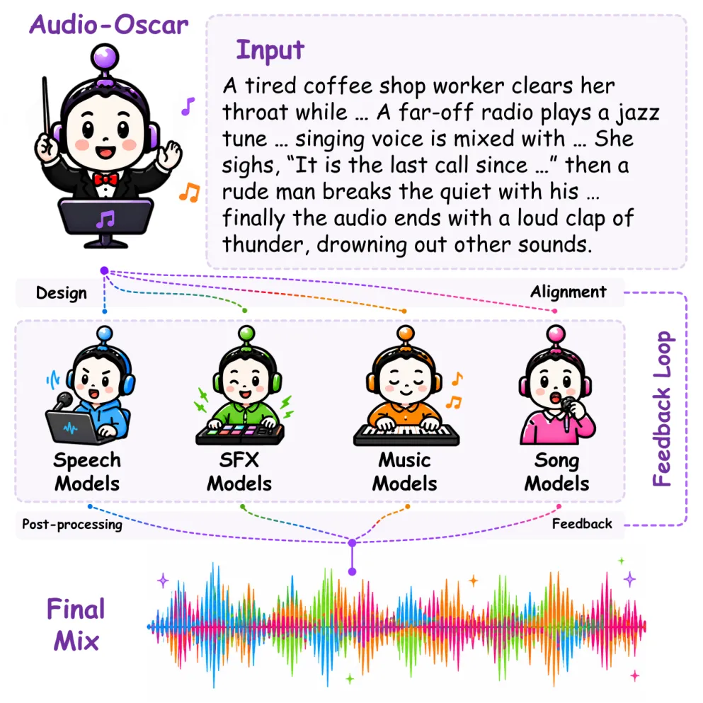
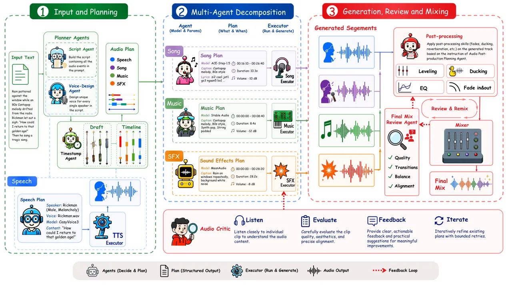
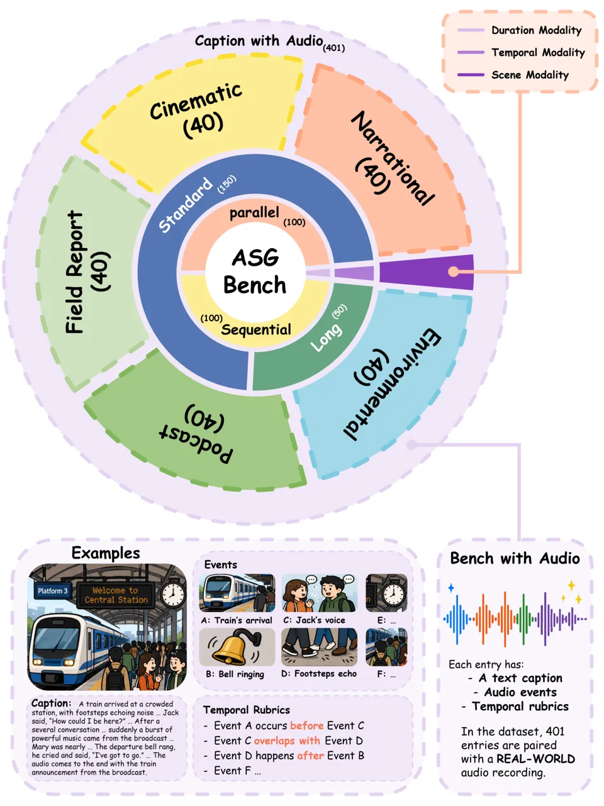
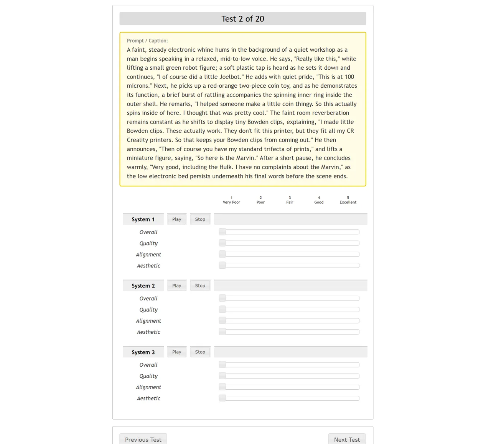

# Audio-Oscar: A Multi-Agent System for Complex Audio Scene Generation, Orchestration, and Refinement

Yifan Duan Affiliation: MoE Key Lab of Artificial Intelligence, X-LANCE
Lab, Shanghai Jiao Tong University Affiliation: Shanghai Innovation
Institute Email: [ziyehitsz@163.com](mailto:)    Qixiang Xu
Affiliation: MoE Key Lab of Artificial Intelligence, X-LANCE Lab,
Shanghai Jiao Tong University Email: [chenxie95@sjtu.edu.cn](mailto:)   
Hengtao Wu Affiliation: MoE Key Lab of Artificial Intelligence, X-LANCE
Lab, Shanghai Jiao Tong University    Zhanxun Liu Affiliation: MoE Key
Lab of Artificial Intelligence, X-LANCE Lab, Shanghai Jiao Tong
University Affiliation: Shanghai Innovation Institute
Affiliation: Shanghai AI Laboratory    Wenhao Guan Affiliation: Shanghai
Innovation Institute Affiliation: Xiamen University    Junxi Liu
Affiliation: MoE Key Lab of Artificial Intelligence, X-LANCE Lab,
Shanghai Jiao Tong University    Ziyang Ma Affiliation: MoE Key Lab of
Artificial Intelligence, X-LANCE Lab, Shanghai Jiao Tong University
Affiliation: Shanghai Innovation Institute    Kelu Xu Affiliation: State
Key Laboratory of Complex & Critical Software Environment, China    Xie
Chen Affiliation: MoE Key Lab of Artificial Intelligence, X-LANCE Lab,
Shanghai Jiao Tong University Affiliation: Shanghai Innovation Institute

###### Abstract

In recent years, audio generation has made significant progress in tasks
such as text-to-speech (TTS), text-to-audio (TTA) and text-to-music
(TTM). However, generating long-form and controllable audio from complex
audio scene descriptions remains a significant challenge, as such scenes
often require coordinated speech, sound effects, music, songs, temporal
structure, and post-production. In this work, we introduce Audio-Oscar,
a multi-agent framework for generating audio from complex descriptions.
Audio-Oscar coordinates a set of specialist agents, each responsible for
a different aspect of the audio scene, including character modeling and
voice design, speech generation, fine-grained timeline planning, model
selection, non-speech generation, and audio post-production. Audio-Oscar
further incorporates feedback-driven refinement. In addition, to address
the lack of suitable benchmarks for evaluating audio generation from
complex audio scene descriptions, we construct ASG-Bench, an Audio Scene
Generation Benchmark containing both scene descriptions paired with
reference audio and text-only scene descriptions. Each scene is
annotated with target audio events and temporal statements to evaluate
whether the generated audio faithfully realizes the required scene
content and temporal structure. Experimental results show that
Audio-Oscar can effectively generate audio that matches complex scene
descriptions. Project samples are available at
[https://audiooscar.github.io/](https://audiooscar.github.io/). Our code
is available at
[https://github.com/ziye26/Audio-Oscar](https://github.com/ziye26/Audio-Oscar).

## 1 Introduction

Audio is an important component of multimedia content and plays an
important role in scenarios such as videos and podcasts. In recent
years, with the rapid development of various generative models, audio
generation has made significant progress in tasks like text-to-speech
(TTS), text-to-audio (TTA) and text-to-music (TTM) Chen et al. (2025);
Hu et al. (2026); Liu et al. (2024); Evans et al. (2025); Yuan et al.
(2026). The models can now effectively generate high-quality speech,
environmental sounds and music content Du et al. (2025); Li et al.
(2025); Gong et al. (2026). However, in complex audio scenarios, audio
is often composed of a combination of multiple sound elements, such as
speech, background music, ambient sounds and event sound effects.
Existing audio generation models often focus on single task generation
and are unable to meet the demands of generating complex audio.



Figure 1: Overview of Audio-Oscar. Given an audio scene description as
input, it coordinates multiple agents and employs different models for
generation, composition, and refinement to produce the final audio
output.

Increasingly, recent works have attempted to use a unified model to
cover different types of audio generation, including speech, music, and
environmental sounds, and have begun to show preliminary capabilities to
generate complex mixed audio Liu et al. (2024); Yang et al. (2024a);
Vyas et al. (2023); AI et al. (2025). Meanwhile, recent speech
generation research has also started to extend toward fuller and richer
acoustic scene modeling. For example, Any2Speech Song et al. (2026)
further introduces the modeling of acoustic contexts such as background
sounds and environmental ambience, enabling the generated outputs to
present more complete acoustic scenes.

LLM-based agents have developed rapidly and have been widely applied to
solve various complex tasks Yao et al. (2023); Yang et al. (2024b); Lian
et al. (2025). Recent research has begun to explore using agents to
address audio generation tasks. Early works such as AudioGPT Huang et
al. (2023b) utilized large language models (LLMs) as a universal
interactive interface to resolve different types of audio generation
tasks. WavJourney Liu et al. (2025a) leveraged LLMs for compositional
audio creation. Meanwhile, a wide range of agent-based methods have been
proposed and have achieved great success in tasks such as podcast
generation, audiobook production, and video dubbing Rong et al. (2025);
Xiao et al. (2025); Rong et al. (2026); Ren et al. (2026). However,
these methods often rely on predefined voice or voice library, face
challenges in accurately planning timelines for complex audio scene
descriptions, and often lack the capability to autonomously perform
audio post-processing.

Directly generating final audio from complex audio scene descriptions
remains a significant challenge. To address this challenge, we propose
Audio-Oscar, a framework that Orchestrates multiple Specialized agents
for Complex Audio scene generation and Refinement. Audio-Oscar
transforms complex scene descriptions into a structured generation
process through role and voice modeling, fine-grained timeline planning,
and expert model orchestration for different audio types. It further
incorporates an audio post-production agent and feedback-driven
refinement to improve the naturalness and overall quality of the
generated audio. In addition, to address the lack of suitable benchmarks
for evaluating audio generation from complex scene descriptions, we
introduce the Audio Scene Generation Benchmark (ASG-Bench). ASG-Bench
includes audio scene descriptions with reference audio as well as
text-only scene descriptions. Each scene is annotated with target audio
events and temporal statements to evaluate whether the generated audio
faithfully realizes the required scene content and temporal structure.
Our experiments show that Audio-Oscar can effectively generate audio
that reflects complex scene descriptions.

Our contributions are as follows:

- •
  We propose Audio-Oscar, a multi-agent collaborative system that uses
  specialized agents for scene orchestration, audio synthesis,
  post-production, and mixing to generate audio based solely on complex
  audio scene text descriptions.
- •
  We propose ASG-Bench, a benchmark designed to evaluate the ability of
  models and systems to generate extended audio from complex audio scene
  descriptions.
- •
  Our experimental results demonstrate that Audio-Oscar can effectively
  generate complex, long-form audio that faithfully follows the given
  descriptions.

## 2 Related Works

### 2.1 Audio Generation Models

Recent advances in TTS, TTA, and TTM have achieved remarkable success.
Recent progress in TTS has achieved breakthroughs in zero-shot
expressivity, streaming latency, and long-form synthesis Chen et al.
(2025); Peng et al. (2025); Du et al. (2025); Hu et al. (2026). TTA
models have demonstrated great capabilities in generating high-quality
audio that is well aligned with textual prompts, while also improving
inference efficiency Liu et al. (2024); Li et al. (2025); Evans et al.
(2025); Cheng et al. (2025). Meanwhile, TTM models have shown strong
capabilities in generating high-quality music with coherent structures
and improved controllability over lyrics, instrumentation, and
style Yuan et al. (2026); Gong et al. (2026); Copet et al. (2023); Liu
et al. (2025b). However, these specialized models often remain
restricted to single task generation. Building on these advances, recent
audio-generation architectures have begun to synthesize speech, music,
and sound effects within a unified modeling framework Qiang et al.
(2026); AI et al. (2025). However, when applied to more complex audio
scenarios, existing models still face challenges in maintaining
long-form compositional coherence and modeling persistent yet
dynamically evolving environmental sounds.

To expand modality coverage and interactivity, recent work like
Any2Speech Song et al. (2026) extends speech synthesis toward borderless
long-audio generation, using structured semantic controls to model
acoustic environments and scene-level context. Furthermore, joint
video-audio generation has achieved remarkable cross-modal
synchronization, enabling the generation of high-quality and complex
audio SII-GAIR et al. (2026); Seedance et al. (2026). Despite this
progress, these models are often restricted to generating only short
clips, requiring storyboard switching or external techniques for longer
durations. Moreover, they produce inherently mixed audio without clear
track separation, severely complicating subsequent post-production.

### 2.2 Audio Generation Agents



Figure 2: Overview of Audio-Oscar. Given a complex audio scene
description, Audio-Oscar decomposes the generation process into multiple
coordinated stages, including speaking role extraction and voice design,
speech planning and generation, timeline construction and refinement,
non-speech audio planning and generation, edit-aware mixing, and
feedback-driven refinement.

Driven by the rapid advancements in Large Language Models (LLMs),
autonomous agents have experienced exponential development and
widespread adoption across numerous fields Yao et al. (2023); Yang et
al. (2024b); Lian et al. (2025). In the acoustic domain, this emergence
of LLM-based agents has opened a new paradigm for compositional audio
generation by orchestrating foundational models for complex tasks Huang
et al. (2023b). Notably, WavJourney Liu et al. (2025a) pioneered this
space by decomposing complex audio scenes into executable scripts,
demonstrating that LLMs can logically plan combinations of speech,
music, and sound effects. Subsequent multi-agent systems have introduced
role-specific collaboration to tackle long-form podcast generation Xiao
et al. (2025), developed a video-to-audio agentic system Rong et al.
(2025), achieved word-level temporal alignment for emotional
audiobooks Rong et al. (2026) and integrated closed-loop self-reflection
mechanisms for interactive audio storytelling Ren et al. (2026).

However, existing agentic systems still struggle to directly generate
audio from complex audio scene descriptions and often lack
post-production capabilities for audio refinement. These limitations
motivate Audio-Oscar, a multi-agent framework designed to generate
complex audio from audio scene descriptions.

## 3 Overview

Audio-Oscar is a multi-agent system for complex audio scene generation.
As shown in Figure 2, it decomposes an input scene description into a
structured production workflow rather than generating the entire scene
in a single pass. The system first normalizes the input, builds speaking
role and voice profiles, and generates speech audio at the utterance
level. The measured speech durations then serve as temporal anchors for
drafting and refining a full audio timeline that jointly schedules
speech, sound effects, music, and songs.

Given the refined timeline, Audio-Oscar routes different audio segments
to specialized generation modules, applies critic-guided repair for
low-quality sound effects when needed, and augments the timeline with
segment-level post-production instructions. The generated segments are
finally mixed into a complete scene-level audio output, with a final
audit-and-remix step for local post-production refinement. This design
enables our system to effectively generate complex audio scenes.

## 4 Method

In this section, we provide a detailed overview of the generation
process in Audio-Oscar. More details about the agents involved in this
process are provided in Appendix A.

### 4.1 Role Modeling and Voice Design

Given an input audio scene description $`x`$, Audio-Oscar first
identifies the speaking roles and constructs role-level voice profiles.
The Speaker Role Profiling Agent extracts the set of speakers

```math
\mathcal{R}=\{r_{i}\}_{i=1}^{M}
```

from the input description and produces a profile for each speaker:

```math
v_{i}=\mathcal{A}_{\mathrm{role}}(r_{i},x),
```

where $`v_{i}`$ contains character names, character description, and
voice characteristics. These profiles provide speaker-level conditions
for downstream speech generation.

Audio-Oscar then invokes a voice-design model to synthesize a reference
voice for each role:

```math
c_{i}=\mathcal{A}_{\mathrm{voice}}(v_{i}),
```

where $`c_{i}`$ denotes the generated reference audio. This stage allows
the system to maintain consistent speaker identities across
multi-speaker scenes.

### 4.2 Speech Planning and Generation

As the actual duration of generated speech is difficult to predict
precisely during planning, Audio-Oscar first plans and generates the
speech at the utterance level to enable more reliable temporal control.
The speech event planning agent extracts explicit dialogue or spoken
narration from the input and constructs a set of speech elements

```math
\mathcal{E}_{\mathrm{sp}}=\{e_{i}^{\mathrm{sp}}\}_{i=1}^{N_{\mathrm{sp}}}.
```

Each speech element is represented as

```math
e_{i}^{\mathrm{sp}}=(s_{i},q_{i},r_{i})
```

where $`s_{i}`$ is a stable segment identifier, $`q_{i}`$ is the
utterance text, and $`r_{i}`$ is the speaker. For each speech element,
the speech generation planner selects a suitable TTS model and
generation parameters according to the utterance text, speaker, input
scene, and model capabilities. The selected TTS model then generates the
speech. After synthesis, each speech result is augmented with its
generated duration:

```math
\hat{e}_{i}^{\mathrm{sp}}=(s_{i},q_{i},r_{i},d_{i})
```

where $`d_{i}`$ is the measured duration of the synthesized speech.
These speech results are later passed to the audio planning stage, which
places them on the global timeline by choosing start times and deriving
end times.

### 4.3 Audio Timeline Planning and Refinement

Given the generated speech results, Audio-Oscar constructs a full audio
timeline that combines speech and non-speech events. Following Rong et
al. (2025), we categorize non-speech audio into three types: sound
effects (SFX), music, and songs, and define type-specific fields with
reference to AudioGenie.

The audio timeline drafting agent takes the input scene description and
the synthesized speech results
$`\hat{\mathcal{E}}_{\mathrm{sp}}=\{\hat{e}_{i}^{\mathrm{sp}}\}_{i=1}^{N_{\mathrm{sp}}}`$
as constraints, and produces an initial timeline:

```math
\mathcal{T}^{(0)}=\mathcal{A}_{\mathrm{audio}}(x,\hat{\mathcal{E}}_{\mathrm{sp}})=\{z_{i}\}_{i=1}^{N}.
```

Each element $`z_{i}`$ specifies an audio event in the timeline,
including its audio type, start time, end time, duration, and other
information such as volume and description.

Speech results are treated as protected elements. The agent preserves
all content and use their actual durations. It only chooses their start
times and the end times are derived from the measured durations. For
each speech segment, the planner decides whether forced alignment is
needed to construct a more precise timeline.

After the draft timeline is produced, a timestamp refinement agent
repairs and refines the schedule:

```math
\mathcal{T}=\mathcal{A}_{\mathrm{time}}(x,\mathcal{T}^{(0)},\hat{\mathcal{E}}_{\mathrm{sp}}).
```

This stage uses the scene description as the source of narrative intent,
the draft timeline as the base plan, and the speech results as trusted
constraints. It may add, remove, or correct non-speech events when they
are supported by the input scene. The refinement stage improves pacing,
pauses, overlaps, and temporal coherence while preserving the relative
order of semantically ordered events when required.

### 4.4 Non-speech Generation and Post-production Planning

After timestamp refinement, Audio-Oscar generates the non-speech audio
elements specified in the refined timeline. Let

```math
\mathcal{E}_{\mathrm{ns}}=\mathcal{T}\setminus\hat{\mathcal{E}}_{\mathrm{sp}}
```

denote the set of non-speech elements, including sound effects, music,
and songs. For each element $`z_{i}`$, the system constructs an
executable generation request.

Audio-Oscar employs specialized generation agents for different
non-speech audio types. Given a planned non-speech element $`z_{i}`$,
the corresponding agent selects an appropriate generation model and
prepares model-specific generation parameters according to its audio
type, textual description, target duration, and other information. The
selected model then produces the audio

```math
\hat{y}_{i}=g_{i}(p_{i},d_{i},\rho_{i}),
```

where $`p_{i}`$ is the generation prompt or description, $`d_{i}`$ is
the target duration, and $`\rho_{i}`$ denotes auxiliary generation
constraints.

Specifically, sound effects are handled by a text-to-audio generation
agent, which converts the planned event description and duration
requirement into a suitable prompt for a text-to-audio model. Music
elements are processed by a music generation agent, which selects a
suitable music model and prepares controls for style, mood and duration.
Song elements are handled by a song generation agent, which prepares
related controls such as lyrical content, vocal style, and accompaniment
requirements before invoking the corresponding song generation model.

For sound effect generation, Audio-Oscar can further use an audio critic
to evaluate generated candidates:

```math
\kappa_{i}=\mathcal{A}_{\mathrm{critic}}(z_{i},\hat{y}_{i}),
```

where $`\kappa_{i}`$ contains quality, semantic alignment, aesthetic
scores, and suggestions. If a generated clip falls below a predefined
threshold, the system uses critic feedback to revise the generation plan
by rewriting the prompt, switching to a more suitable TTA model, or
adjusting model parameters, and then retries generation for a bounded
number of iterations.

Before final mixing, Audio-Oscar invokes an audio post-production
planning agent to augment the refined timeline with post-production
instructions. The agent analyzes the scene intent, temporal layout, and
relationships among segments, and adds sparse post-production
instructions for individual segments, such as gain adjustment, volume
envelope, compression and reverberation. These instructions are consumed
by the mixer to improve balance, transitions, spatial impression, and
overall scene coherence.

### 4.5 Mixing and Final Editing

After speech and non-speech generation, Audio-Oscar combines all
generated audio segments according to the timeline to produce a complete
scene-level audio output.

Audio-Oscar performs a final editing stage after the initial mix. In
this stage, the final mix review agent reviews the complete mixed audio
in conjunction with the original scene description and the current
timeline plan.

This stage targets scene-level issues that become apparent only after
mixing, such as imbalanced loudness, abrupt transitions, masking between
foreground and background elements, or insufficient spatial coherence.
The final mix review agent proposes sparse per-segment remix patches to
volume and edit metadata. If valid final edits are produced, Audio-Oscar
applies the patches to the audio plan and remixes the audio to obtain a
refined final output. If no effective edit is needed, the initial mixed
audio is kept as the final output.

## 5 Experiment

Method T2ABench AudioTime Cnt-acc $`\uparrow`$ Ord-acc $`\uparrow`$
TS-acc $`\uparrow`$ Ordering $`\downarrow`$ Duration $`\downarrow`$
Frequency $`\downarrow`$ Timestamp $`\uparrow`$ AudioGen Kreuk et al.
(2023) 5.40 6.00 18.40 0.91 3.73 1.58 0.54 AudioLDM Liu et al. (2023)
4.00 3.40 11.60 0.97 3.41 1.54 0.41 AudioLDM-2 Liu et al. (2024) 7.40
1.20 13.40 0.96 3.40 1.64 0.54 Tango 2 Majumder et al. (2024) 4.60 10.20
18.80 0.86 3.70 1.52 0.61 Make-An-Audio2 Huang et al. (2023a) 4.00 19.80
18.80 0.76 3.40 1.42 0.56 Stable Audio Open Evans et al. (2025) 9.80
6.00 21.80 0.98 3.07 1.46 0.53 MMAudio Cheng et al. (2025) 4.80 2.40
21.40 0.98 3.33 1.54 0.50 AudioX Tian et al. (2026) 12.40 23.60 28.20
0.34 1.30 0.74 0.81 Audio-Oscar 22.60 69.80 20.20 0.79 1.44 1.08 0.54

Table 1: Evaluation of instruction-following T2A ability on T2ABench and
AudioTime. Except for our Audio-Oscar, all reported results are from
AudioX Tian et al. (2026).

Method LLM Thinking Event (%) $`\uparrow`$ Temporal (%) $`\uparrow`$
LALM-based Score Quality $`\uparrow`$ Alignment $`\uparrow`$ Aesthetic
$`\uparrow`$ Paired Reference Audio – – 93.62 95.26 4.25 4.54 4.26
Any2Speech – – 80.38 84.54 4.17 3.82 3.78 WavJourney DeepSeek-V4-Flash ✗
87.26 92.09 3.84 3.90 3.57 Audio-Oscar DeepSeek-V4-Flash ✗ 92.14 93.36
4.13 4.23 3.96 Audio-Oscar DeepSeek-V4-Flash ✓ 92.04 93.78 4.03 4.20
3.88 Audio-Oscar Qwen-122B-A10B ✗ 90.25 93.56 4.18 4.31 4.01 Audio-Oscar
Qwen-397B-A17B ✗ 91.31 93.72 4.11 4.20 3.95 Text Any2Speech – – 51.65
41.16 3.53 2.63 2.74 WavJourney DeepSeek-V4-Flash ✗ 72.33 76.13 3.66
3.50 3.28 Audio-Oscar DeepSeek-V4-Flash ✗ 84.34 82.92 4.06 4.12 3.93
Audio-Oscar DeepSeek-V4-Flash ✓ 81.94 81.48 3.49 3.74 3.36 Audio-Oscar
Qwen-122B-A10B ✗ 79.98 79.51 4.04 4.12 3.93 Audio-Oscar Qwen-397B-A17B ✗
83.80 81.79 3.95 4.11 3.86

Table 2: Evaluation of event fidelity, temporal consistency, and
LALM-based audio score on ASG-Bench. LLM denotes the large language
model used as the backbone of each method. The best results are
highlighted in bold, and the second-best results are underlined.

### 5.1 ASG-Bench



Figure 3: Overview of ASG-Bench, a benchmark for evaluating audio
generation from complex audio scene descriptions. Each sample is
annotated with expected audio events and temporal statements, supporting
the assessment of whether generated audio faithfully captures both the
scene content and temporal structure described in the prompt.

The effective evaluation of audio generation from complex audio scene
descriptions remains a challenging problem, mainly due to the lack of
benchmark datasets and the inherent difficulty of assessing generation
quality. Based on this, we propose ASG-Bench, as illustrated in
Figure 3. The dataset is composed of two parts: a reference-audio
subset, where audio scene descriptions are paired with reference audio
recordings, and a text-only subset, which contains audio scene
descriptions without reference audio. Specifically, the reference-audio
subset is constructed based on Omni-Cloze Ma et al. (2026). In addition,
each description is annotated with the expected audio events and
temporal assertions, which are used for the preliminary evaluation of
the quality of the generated audio. More details about this benchmark
can be found in Appendix C.

### 5.2 Experimental Setup

##### Implementation Details

In our experiments, we select a set of open-source models. Specifically,
for the LLM-based agents, we use DeepSeek-V4-Flash DeepSeek-AI (2026),
Qwen3.5-122B-A10B, and Qwen3.5-397B-A17B Qwen Team (2026). For the
critic model, we employ a quantized version of
Qwen3-Omni-30B-A3B-Instruct Xu et al. (2025). For voice design, we use
Qwen3-TTS-12Hz-1.7B-VoiceDesign Hu et al. (2026). For text-to-speech
synthesis, we use VoxCPM2 Team (2026b); Zhou et al. (2025) and CosyVoice
3 Du et al. (2025); for text-to-audio generation, we adopt MMAudio Cheng
et al. (2025) and Stable Audio Open Evans et al. (2025). For song
generation, we use ACE-Step v1.5 with its 1.7B LM planner Gong et al.
(2026). In addition, we employ Qwen3-ForcedAligner-0.6B Shi et al.
(2026) for precise timestamp alignment, and further use Demucs for vocal
source separation in generated songs Rouard et al. (2023); Défossez
(2021). Except for the LLM-based agents accessed via official APIs, all
the above models are deployed locally on RTX 4090 GPUs. In particular,
Qwen3-TTS-VoiceDesign and VoxCPM2 are served using vLLM-Omni Yin et al.
(2026). During inference, the temperature of all LLMs is set to 0.1.
More details are provided in Appendix B

##### Benchmark and Metrics

For text-to-audio evaluation, we focus on its instruction-following
capability. We therefore evaluate Audio-Oscar on T2A-bench Tian et al.
(2026) and AudioTime Xie et al. (2025). These benchmarks focus on
fine-grained controllability, including event counting, ordering,
duration, frequency, and timestamp-related constraints. We follow the
evaluation protocol used in AudioX and compare Audio-Oscar with the
reported baseline results Tian et al. (2026).

To assess Audio-Oscar’s ability to generate long-form audio that
faithfully reflects complex audio scene descriptions, we evaluate it on
ASG-Bench. We use Qwen3.5-Omni-Plus as the audio understanding
evaluator Team (2026a). Specifically, we first examine whether the audio
events in each description are present in the generated audio, and
whether the temporal statements are satisfied. We report the coverage
rates of these events and temporal statements to measure event coverage
and temporal consistency. In addition, we adopt a 1-5 rating scale and
ask the evaluator to score each generated audio sample along three
dimensions: audio quality for fidelity and listening clarity, scene
alignment for consistency with the target description, and aesthetic
appeal for overall naturalness and artistic quality. Detailed evaluation
prompts and implementation details are provided in Appendix C.

### 5.3 Main Results

##### Instruction-following text-to-audio generation

Table 1 reports the results on T2A-Bench and AudioTime. To ensure
consistency across experiments, we use Stable Audio Open as the only TTA
generation model. On T2A-Bench, Audio-Oscar achieves the best Cnt-acc
and Ord-acc, showing the benefit of explicit scene planning for
compositional event organization. It also obtains near-perfect category
accuracy, since event categories are explicitly parsed and routed during
planning; we therefore focus the main table on counting, ordering, and
timestamp metrics. However, its TS-acc remains below AudioX, indicating
that precise timestamp control is still limited by the underlying T2A
generator. On AudioTime, Audio-Oscar obtains competitive results on
duration and frequency metrics. This suggests that planning-based
decomposition helps with temporal attributes such as duration and
repetition. Nevertheless, it still lags behind AudioX on ordering and
timestamp metrics, showing that fine-grained temporal grounding remains
a limitation. Moreover, compared with the original results of Stable
Audio Open on both benchmarks, our method achieves clear improvements,
further showing the effectiveness of our system.

##### Complex Audio Scene Generation

Table 2 reports the results on ASG-Bench. We compare Audio-Oscar with
WavJourney Liu et al. (2025a) and Any2Speech Song et al. (2026). For
WavJourney, we use DeepSeek-V4-Flash in non-reasoning mode. More
experimental details can be found in Appendix B. We further present the
performance of Audio-Oscar when different LLMs are used as the agent. As
shown by the experimental results, Audio-Oscar achieves great
performance on ASG-Bench when using different LLMs. For the subset with
reference audio, Audio-Oscar achieves audio-event and temporal-statement
scores that are close to those of the reference audio across multiple
LLM settings, demonstrating its ability to faithfully capture target
scene events and preserve temporal structure. Meanwhile, Audio-Oscar
also achieves higher LALM-based scores than the baseline systems,
approaching the quality of reference audio. On the more challenging
text-only subset, Audio-Oscar also achieves strong results across
different LLM backbones and clearly outperforms the compared methods. We
also observe that enabling the thinking mode for DeepSeek does not
improve performance. This may suggest that disabling the thinking mode
can reduce inference cost while maintaining competitive performance in
our pipeline.

##### Human Evaluation

We conduct a human evaluation to assess the quality of the audio
generated by our method. Specifically, we perform a subjective listening
study using mean opinion scores (MOS). Human listeners evaluate each
audio sample along three dimensions: Quality, Alignment, and Aesthetic.
They are asked to provide an overall score for each generated audio
sample. We randomly sample 10 examples from each subset of ASG-Bench,
resulting in a total of 20 audio samples for human evaluation. We
collect scores from 10 participants, with each participant asked to rate
the samples on a 1–5 scale. More details are provided in Appendix B.5.
As shown in Figure 4, our method also achieves strong performance in the
subjective evaluation. Compared with other methods, our method obtains
clearly higher subjective scores, demonstrating its ability to generate
audio scenes that better align with human subjective preferences.

Figure 4: Human Subjective Evaluation Scores for Sampled Examples from
ASG-Bench. WavJourney and our method are evaluated using
DeepSeek-V4-Flash with reasoning mode disabled.

##### Runtime Analysis

We further evaluate the runtime of Audio-Oscar by randomly sampling 10
examples from ASG-Bench and measuring the average generation time under
different LLMs. As shown in Figure 5, Audio-Oscar requires 156.40–329.90
seconds per sample depending on different LLMs, whereas WavJourney
requires 95.62 seconds per sample. The additional runtime is expected as
Audio-Oscar performs role modeling and voice design, timeline
refinement, critic-guided repair and post-production planning. Since
runtime depends on scene complexity, the generated timeline structure,
API latency, and generation models, these results are intended only as a
reference.

Figure 5: Average generation time of WavJourney and Audio-Oscar on
randomly sampled ASG-Bench examples. DeepSeek refers to
DeepSeek-V4-Flash. Unless otherwise specified, all LLMs are used in
non-thinking mode.

## 6 Conclusion

In this work, we introduce Audio-Oscar, a multi-agent system designed
for complex audio scene generation. Starting from an audio scene
description, Audio-Oscar decomposes generation into a structured
production workflow, including role modeling and voice design, event and
timeline planning, timeline scheduling, model orchestration, and audio
post-production. By integrating structured planning, model orchestration
and audio post-production into a unified pipeline, Audio-Oscar is able
to handle audio scenes involving dialogue, environmental sounds, music,
songs, and complex temporal relationships. We also introduce ASG-Bench.
The benchmark is designed around complex audio scene descriptions and
aims to assess whether a model or system can accurately understand and
generate final audio that is consistent with the input description. Our
experimental results show that Audio-Oscar can effectively generate
complex audio scenes.

## Limitations

Audio-Oscar uses a Voice-Design TTS model in its pipeline to create and
assign customized voices for different characters, improving consistency
and controllability in multi-character speech generation. However,
compared with real recorded human voices, these generated voices may
still be limited in authenticity, naturalness, and subtle emotional
expressiveness.

In addition, when handling especially long audio requests, the planning
stage of Audio-Oscar may sometimes arrange the content as a single long
generation segment. Such a segment can exceed the stable capability
range of the underlying generation model, which may affect temporal
alignment and overall audio quality. For certain transient or extreme
audio events, such as door slams, impacts, or explosions, the planner
may also assign an overly short duration. If the duration is too short,
the generation model may struggle to capture the full attack, body, and
decay of the sound, resulting in audio that is less clear or realistic.

Finally, for the evaluation phase, our benchmark relies on large models
for rubric-based scoring. Thus, the reliability of our evaluation is
currently bounded by the capabilities of the evaluator models, though
its effectiveness will steadily scale and improve alongside future
advancements in audio foundation models.

## Ethics Statement

This work aims to generate long-form audio that better aligns with
users’ scenario descriptions by leveraging multi-agent collaboration to
autonomously plan the audio generation pipeline, including timeline
arrangement, the selection and invocation of different open-source
models, and necessary audio post-production. We currently use
open-source models and encourage users to carefully consider potential
copyright issues when using the system. Given the risk of misuse, users
are expected to ensure that both their input content and the generated
outputs comply with applicable norms and ethical standards.

## References

- AI et al. (2025) I. AI, B. Gong, C. Zou, C. Zheng, C. Zhou, C. Yan, C.
  Jin, C. Shen, D. Zheng, F. Wang, F. Xu, G. Yao, J. Zhou, J. Chen, J.
  Sun, J. Liu, J. Zhu, J. Peng, K. Ji, K. Song, K. Ren, L. Wang, L.
  Ru, L. Xie, L. Tan, L. Xue, L. Wang, M. Bai, N. Gao, P. Chen, Q.
  Guo, Q. Zhang, Q. Xu, R. Liu, R. Xiong, S. Gao, T. Liu, T. Li, W.
  Chai, X. Xiao, X. Wang, X. Chen, X. Lu, X. Li, X. Dong, X. Yu, Y.
  Yuan, Y. Gao, Y. Sun, Y. Chen, Y. Wu, Y. Lyu, Z. Ma, Z. Feng, Z.
  Fang, Z. Qiu, Z. Huang, and Z. He Ming-omni: a unified multimodal
  model for perception and generation. External Links: 2506.09344,
  [Link](https://arxiv.org/abs/2506.09344) Cited by: §1, §2.1.
- Bain et al. (2023) M. Bain, J. Huh, T. Han, and A. Zisserman Whisperx:
  time-accurate speech transcription of long-form audio. arXiv preprint
  arXiv:2303.00747. Cited by: §C.2.2.
- Chen et al. (2025) Y. Chen, Z. Niu, Z. Ma, K. Deng, C. Wang, J.
  JianZhao, K. Yu, and X. Chen F5-tts: a fairytaler that fakes fluent
  and faithful speech with flow matching. In Proceedings of the 63rd
  Annual Meeting of the Association for Computational Linguistics
  (Volume 1: Long Papers), pp. 6255–6271. Cited by: §1, §2.1.
- Cheng et al. (2025) H. K. Cheng, M. Ishii, A. Hayakawa, T. Shibuya, A.
  Schwing, and Y. Mitsufuji Mmaudio: taming multimodal joint training
  for high-quality video-to-audio synthesis. In Proceedings of the
  Computer Vision and Pattern Recognition Conference, pp. 28901–28911.
  Cited by: §B.1, §2.1, §5.2, Table 1.
- Copet et al. (2023) J. Copet, F. Kreuk, I. Gat, T. Remez, D. Kant, G.
  Synnaeve, Y. Adi, and A. Défossez Simple and controllable music
  generation. Advances in neural information processing systems 36,
  pp. 47704–47720. Cited by: §B.3, §2.1.
- DeepSeek-AI (2026) DeepSeek-AI DeepSeek-v4: towards highly efficient
  million-token context intelligence. Cited by: §C.2.2, §5.2.
- Défossez (2021) A. Défossez Hybrid spectrogram and waveform source
  separation. In Proceedings of the ISMIR 2021 Workshop on Music Source
  Separation, Cited by: §B.1, §5.2.
- Du et al. (2025) Z. Du, C. Gao, Y. Wang, F. Yu, T. Zhao, H. Wang, X.
  Lv, H. Wang, C. Ni, X. Shi, K. An, G. Yang, Y. Li, Y. Chen, Z. Gao, Q.
  Chen, Y. Gu, M. Chen, Y. Chen, S. Zhang, W. Wang, and J. Ye CosyVoice
  3: towards in-the-wild speech generation via scaling-up and
  post-training. External Links: 2505.17589,
  [Link](https://arxiv.org/abs/2505.17589) Cited by: §1, §2.1, §5.2.
- Evans et al. (2025) Z. Evans, J. D. Parker, C. Carr, Z. Zukowski, J.
  Taylor, and J. Pons Stable audio open. In ICASSP 2025-2025 IEEE
  International Conference on Acoustics, Speech and Signal Processing
  (ICASSP), pp. 1–5. Cited by: §B.1, §B.1, §1, §2.1, §5.2, Table 1.
- Gong et al. (2026) J. Gong, Y. Song, W. Zhao, S. Wang, S. Xu, J. Guo,
  and X. Yang ACE-step 1.5: pushing the boundaries of open-source music
  generation. arXiv preprint arXiv:2602.00744. Cited by: §B.1, §1, §2.1,
  §5.2.
- Hsu et al. (2021) W. Hsu, B. Bolte, Y. H. Tsai, K. Lakhotia, R.
  Salakhutdinov, and A. Mohamed Hubert: self-supervised speech
  representation learning by masked prediction of hidden units. IEEE/ACM
  transactions on audio, speech, and language processing 29,
  pp. 3451–3460. Cited by: §B.3.
- Hu et al. (2026) H. Hu, X. Zhu, T. He, D. Guo, B. Zhang, X. Wang, Z.
  Guo, Z. Jiang, H. Hao, Z. Guo, X. Zhang, P. Zhang, B. Yang, J. Xu, J.
  Zhou, and J. Lin Qwen3-tts technical report. External Links:
  2601.15621, [Link](https://arxiv.org/abs/2601.15621) Cited by: §B.1,
  §1, §2.1, §5.2.
- Huang et al. (2023a) J. Huang, Y. Ren, R. Huang, D. Yang, Z. Ye, C.
  Zhang, J. Liu, X. Yin, Z. Ma, and Z. Zhao Make-an-audio 2:
  temporal-enhanced text-to-audio generation. External Links: 2305.18474
  Cited by: Table 1.
- Huang et al. (2023b) R. Huang, M. Li, D. Yang, J. Shi, X. Chang, Z.
  Ye, Y. Wu, Z. Hong, J. Huang, J. Liu, Y. Ren, Z. Zhao, and S. Watanabe
  AudioGPT: understanding and generating speech, music, sound, and
  talking head. External Links: 2304.12995,
  [Link](https://arxiv.org/abs/2304.12995) Cited by: §1, §2.2.
- Kreuk et al. (2023) F. Kreuk, G. Synnaeve, A. Polyak, U. Singer, A.
  Défossez, J. Copet, D. Parikh, Y. Taigman, and Y. Adi AudioGen:
  textually guided audio generation. External Links: 2209.15352,
  [Link](https://arxiv.org/abs/2209.15352) Cited by: §B.3, Table 1.
- Li et al. (2025) X. Li, J. Liu, Y. Liang, Z. Niu, W. Chen, and X. Chen
  Meanaudio: fast and faithful text-to-audio generation with mean flows.
  arXiv preprint arXiv:2508.06098. Cited by: §1, §2.1.
- Lian et al. (2025) N. Lian, Y. Wang, H. Yao, J. Wang, B. Chen, Y.
  Wang, M. Zhang, and S. Xia From verbatim to gist: distilling pyramidal
  multimodal memory via semantic information bottleneck for long-horizon
  video agents. arXiv preprint arXiv:2603.01455. Cited by: §1, §2.2.
- Liu et al. (2023) H. Liu, Z. Chen, Y. Yuan, X. Mei, X. Liu, D.
  Mandic, W. Wang, and M. D. Plumbley AudioLDM: text-to-audio generation
  with latent diffusion models. Proceedings of the International
  Conference on Machine Learning, pp. 21450–21474. Cited by: Table 1.
- Liu et al. (2024) H. Liu, Y. Yuan, X. Liu, X. Mei, Q. Kong, Q.
  Tian, Y. Wang, W. Wang, Y. Wang, and M. D. Plumbley Audioldm 2:
  learning holistic audio generation with self-supervised pretraining.
  IEEE/ACM Transactions on Audio, Speech, and Language Processing 32,
  pp. 2871–2883. Cited by: §1, §1, §2.1, Table 1.
- Liu et al. (2025a) X. Liu, Z. Zhu, H. Liu, Y. Yuan, Q. Huang, M.
  Cui, J. Liang, Y. Cao, Q. Kong, M. D. Plumbley, and W. Wang
  WavJourney: compositional audio creation with large language models.
  IEEE Transactions on Audio, Speech and Language Processing 33 (),
  pp. 2830–2844. External Links:
  [Document](https://dx.doi.org/10.1109/TASLPRO.2025.3574867) Cited by:
  Appendix A, §B.3, §1, §2.2, §5.3.
- Liu et al. (2025b) Z. Liu, S. Ding, Z. Zhang, X. Dong, P. Zhang, Y.
  Zang, Y. Cao, D. Lin, and J. Wang Songgen: a single stage
  auto-regressive transformer for text-to-song generation. arXiv
  preprint arXiv:2502.13128. Cited by: §2.1.
- Ma et al. (2026) Z. Ma, R. Xu, Z. Xing, Y. Chu, Y. Wang, J. He, J.
  Xu, P. Heng, K. Yu, J. Lin, E. S. Chng, and X. Chen Omni-captioner:
  data pipeline, models, and benchmark for omni detailed perception. In
  The Fourteenth International Conference on Learning Representations,
  Cited by: §C.2.2, §5.1.
- Majumder et al. (2024) N. Majumder, C. Hung, D. Ghosal, W. Hsu, R.
  Mihalcea, and S. Poria Tango 2: aligning diffusion-based text-to-audio
  generations through direct preference optimization. External Links:
  2404.09956, [Link](https://arxiv.org/abs/2404.09956) Cited by: Table
  1.
- OpenAI et al. (2024) OpenAI, J. Achiam, S. Adler, S. Agarwal, L.
  Ahmad, I. Akkaya, F. L. Aleman, D. Almeida, J. Altenschmidt, S.
  Altman, S. Anadkat, R. Avila, I. Babuschkin, S. Balaji, V. Balcom, P.
  Baltescu, H. Bao, M. Bavarian, J. Belgum, I. Bello, J. Berdine, G.
  Bernadett-Shapiro, C. Berner, L. Bogdonoff, O. Boiko, M. Boyd, A.
  Brakman, G. Brockman, T. Brooks, M. Brundage, K. Button, T. Cai, R.
  Campbell, A. Cann, B. Carey, C. Carlson, R. Carmichael, B. Chan, C.
  Chang, F. Chantzis, D. Chen, S. Chen, R. Chen, J. Chen, M. Chen, B.
  Chess, C. Cho, C. Chu, H. W. Chung, D. Cummings, J. Currier, Y.
  Dai, C. Decareaux, T. Degry, N. Deutsch, D. Deville, A. Dhar, D.
  Dohan, S. Dowling, S. Dunning, A. Ecoffet, A. Eleti, T. Eloundou, D.
  Farhi, L. Fedus, N. Felix, S. P. Fishman, J. Forte, I. Fulford, L.
  Gao, E. Georges, C. Gibson, V. Goel, T. Gogineni, G. Goh, R.
  Gontijo-Lopes, J. Gordon, M. Grafstein, S. Gray, R. Greene, J.
  Gross, S. S. Gu, Y. Guo, C. Hallacy, J. Han, J. Harris, Y. He, M.
  Heaton, J. Heidecke, C. Hesse, A. Hickey, W. Hickey, P. Hoeschele, B.
  Houghton, K. Hsu, S. Hu, X. Hu, J. Huizinga, S. Jain, S. Jain, J.
  Jang, A. Jiang, R. Jiang, H. Jin, D. Jin, S. Jomoto, B. Jonn, H.
  Jun, T. Kaftan, Ł. Kaiser, A. Kamali, I. Kanitscheider, N. S.
  Keskar, T. Khan, L. Kilpatrick, J. W. Kim, C. Kim, Y. Kim, J. H.
  Kirchner, J. Kiros, M. Knight, D. Kokotajlo, Ł. Kondraciuk, A.
  Kondrich, A. Konstantinidis, K. Kosic, G. Krueger, V. Kuo, M.
  Lampe, I. Lan, T. Lee, J. Leike, J. Leung, D. Levy, C. M. Li, R.
  Lim, M. Lin, S. Lin, M. Litwin, T. Lopez, R. Lowe, P. Lue, A.
  Makanju, K. Malfacini, S. Manning, T. Markov, Y. Markovski, B.
  Martin, K. Mayer, A. Mayne, B. McGrew, S. M. McKinney, C. McLeavey, P.
  McMillan, J. McNeil, D. Medina, A. Mehta, J. Menick, L. Metz, A.
  Mishchenko, P. Mishkin, V. Monaco, E. Morikawa, D. Mossing, T. Mu, M.
  Murati, O. Murk, D. Mély, A. Nair, R. Nakano, R. Nayak, A.
  Neelakantan, R. Ngo, H. Noh, L. Ouyang, C. O’Keefe, J. Pachocki, A.
  Paino, J. Palermo, A. Pantuliano, G. Parascandolo, J. Parish, E.
  Parparita, A. Passos, M. Pavlov, A. Peng, A. Perelman, F. de Avila
  Belbute Peres, M. Petrov, H. P. de Oliveira Pinto, Michael,
  Pokorny, M. Pokrass, V. H. Pong, T. Powell, A. Power, B. Power, E.
  Proehl, R. Puri, A. Radford, J. Rae, A. Ramesh, C. Raymond, F.
  Real, K. Rimbach, C. Ross, B. Rotsted, H. Roussez, N. Ryder, M.
  Saltarelli, T. Sanders, S. Santurkar, G. Sastry, H. Schmidt, D.
  Schnurr, J. Schulman, D. Selsam, K. Sheppard, T. Sherbakov, J.
  Shieh, S. Shoker, P. Shyam, S. Sidor, E. Sigler, M. Simens, J.
  Sitkin, K. Slama, I. Sohl, B. Sokolowsky, Y. Song, N.
  Staudacher, F. P. Such, N. Summers, I. Sutskever, J. Tang, N.
  Tezak, M. B. Thompson, P. Tillet, A. Tootoonchian, E. Tseng, P.
  Tuggle, N. Turley, J. Tworek, J. F. C. Uribe, A. Vallone, A.
  Vijayvergiya, C. Voss, C. Wainwright, J. J. Wang, A. Wang, B. Wang, J.
  Ward, J. Wei, C. Weinmann, A. Welihinda, P. Welinder, J. Weng, L.
  Weng, M. Wiethoff, D. Willner, C. Winter, S. Wolrich, H. Wong, L.
  Workman, S. Wu, J. Wu, M. Wu, K. Xiao, T. Xu, S. Yoo, K. Yu, Q.
  Yuan, W. Zaremba, R. Zellers, C. Zhang, M. Zhang, S. Zhao, T.
  Zheng, J. Zhuang, W. Zhuk, and B. Zoph GPT-4 technical report.
  External Links: 2303.08774, [Link](https://arxiv.org/abs/2303.08774)
  Cited by: §B.3.
- Peng et al. (2025) Z. Peng, J. Yu, W. Wang, Y. Chang, Y. Sun, L.
  Dong, Y. Zhu, W. Xu, H. Bao, Z. Wang, S. Huang, Y. Xia, and F. Wei
  VibeVoice technical report. External Links: 2508.19205,
  [Link](https://arxiv.org/abs/2508.19205) Cited by: §2.1.
- Qiang et al. (2026) C. Qiang, X. Wang, K. Yin, Y. Liang, Y. Guo, T.
  Ma, Z. Zhang, T. Wang, C. Gong, Y. Chen, R. Fu, C. Zhang, L. Wang,
  and J. Dang UniSonate: a unified model for speech, music, and sound
  effect generation with text instructions. External Links: 2604.22209,
  [Link](https://arxiv.org/abs/2604.22209) Cited by: §2.1.
- Qwen Team (2026) Qwen Team Qwen3.5: towards native multimodal agents.
  External Links: [Link](https://qwen.ai/blog?id=qwen3.5) Cited by:
  §5.2.
- Ren et al. (2026) Y. Ren, X. Xu, Z. Zhang, W. Wu, B. Li, and C. Zhang
  AuDirector: a self-reflective closed-loop framework for immersive
  audio storytelling. External Links: 2605.11866,
  [Link](https://arxiv.org/abs/2605.11866) Cited by: §1, §2.2.
- Rong et al. (2025) Y. Rong, J. Wang, G. Lei, S. Yang, and L. Liu
  Audiogenie: a training-free multi-agent framework for diverse
  multimodality-to-multiaudio generation. In Proceedings of the 33rd ACM
  International Conference on Multimedia, pp. 8872–8881. Cited by: §A.1,
  Appendix A, §1, §2.2, §4.3.
- Rong et al. (2026) Y. Rong, S. Yang, C. Li, D. Yu, and L. Liu Dopamine
  audiobook: a training-free mllm agent for emotional and immersive
  audiobook generation. IEEE Transactions on Audio, Speech and Language
  Processing. Cited by: §1, §2.2.
- Rouard et al. (2023) S. Rouard, F. Massa, and A. Défossez Hybrid
  transformers for music source separation. In ICASSP 23, Cited by:
  §B.1, §5.2.
- Seedance et al. (2026) T. Seedance, D. Chen, L. Chen, X. Chen, Y.
  Chen, Z. Chen, Z. Chen, F. Cheng, T. Cheng, Y. Cheng, M. Chi, X.
  Chi, J. Cong, Q. Cui, F. Ding, Q. Dong, Y. Du, H. Duanmu, J. Fan, J.
  Fang, J. Fang, Z. Fang, C. Feng, Y. Gao, D. Gu, D. Guo, H. Guo, Q.
  Guo, B. Hao, H. Hao, H. He, J. He, Q. He, T. Hoang, H. Hu, R. Hu, Y.
  Hu, J. Huang, W. Huang, Z. Huang, Z. Huang, J. Jin, M. Jing, A.
  Kim, S. Lao, Y. Leng, B. Li, G. Li, H. Li, H. Li, J. Li, M. Li, X.
  Li, X. Li, Y. Li, Y. Li, Y. Li, Y. Li, C. Liang, H. Liang, J.
  Liang, Y. Liang, W. Liao, J. H. Lien, S. Lin, X. Lin, F. Ling, Y.
  Ling, F. Liu, J. Liu, J. Liu, J. Liu, S. Liu, S. Liu, W. Liu, X.
  Liu, Z. Liu, R. Lu, L. Lyu, J. Ma, T. Ma, X. Nie, J. Ning, J. Pan, X.
  Pan, R. Peng, X. Qu, Y. Ren, Y. Shen, G. Shi, L. Shi, Y. Song, F.
  Sun, L. Sun, R. Sun, W. Tang, B. Tao, Z. Tao, D. Wang, F. Wang, H.
  Wang, K. Wang, Q. Wang, R. Wang, S. Wang, S. Wang, W. Wang, X.
  Wang, Y. Wang, Y. Wang, Y. Wang, Y. Wang, Z. Wang, Z. Wang, G. Wei, M.
  Wei, D. Wu, G. Wu, H. Wu, H. Wu, J. Wu, J. Wu, R. Wu, S. Wu, X. Wu, X.
  Wu, Y. Wu, R. Xia, X. Xia, X. Xiao, S. Xu, B. Yang, J. Yang, R.
  Yang, T. Yang, Y. Yang, Z. Yang, Z. Yang, F. Ye, B. Yi, X. Yin, Y.
  You, L. Yuan, W. Zeng, X. Zeng, Y. Zeng, S. Zhai, Z. Zhai, B.
  Zhang, C. Zhang, H. Zhang, J. Zhang, M. Zhang, P. Zhang, S. Zhang, X.
  Zhang, X. Zhang, X. Zhang, X. Zhang, Y. Zhang, Z. Zhang, H. Zhao, H.
  Zhao, L. Zhao, Y. Zhao, G. Zheng, J. Zheng, X. Zheng, Z. Zheng, K.
  Zhu, and F. Zuo Seedance 2.0: advancing video generation for world
  complexity. External Links: 2604.14148,
  [Link](https://arxiv.org/abs/2604.14148) Cited by: §2.1.
- Shi et al. (2026) X. Shi, X. Wang, Z. Guo, Y. Wang, P. Zhang, X.
  Zhang, Z. Guo, H. Hao, Y. Xi, B. Yang, J. Xu, J. Zhou, and J. Lin
  Qwen3-asr technical report. External Links: 2601.21337,
  [Link](https://arxiv.org/abs/2601.21337) Cited by: §B.1, §5.2.
- SII-GAIR et al. (2026) SII-GAIR, Sand. ai, :, E. Chern, H. Teng, H.
  Sun, H. Wang, H. Pan, H. Jia, J. Su, J. Li, J. Yu, L. Liu, L. Li, L.
  Ye, M. Hu, Q. Wang, Q. Qi, S. Chern, T. Bu, T. Wang, T. Xu, T.
  Zhang, T. Mi, W. Xu, W. Zhang, W. Zhang, X. Yi, X. Cai, X. Kang, Y.
  Ma, Y. Liu, Y. Zhang, Y. Huang, Y. Lin, Z. Tao, Z. Liu, Z. Zhang, Z.
  Cen, Z. Yu, Z. Wang, Z. Hu, Z. Zhou, Z. Guo, Y. Cao, and P. Liu Speed
  by simplicity: a single-stream architecture for fast audio-video
  generative foundation model. External Links: 2603.21986,
  [Link](https://arxiv.org/abs/2603.21986) Cited by: §2.1.
- Song et al. (2026) X. Song, D. Wu, D. Zhou, P. Cheng, H. Ding, Y.
  He, J. Wang, S. Shen, S. Lv, L. Fan, H. Su, Y. Wang, S. Wang, M. Meng,
  and J. Luan Borderless long speech synthesis. External Links:
  2603.19798, [Link](https://arxiv.org/abs/2603.19798) Cited by: §B.2,
  §1, §2.1, §5.3.
- Suno (2023) Suno Bark. Note:
  [https://github.com/suno-ai/bark](https://github.com/suno-ai/bark)
  Cited by: §B.3.
- Team (2026a) Q. Team Qwen3.5-omni technical report. arXiv preprint
  arXiv:2604.15804. Cited by: §C.2.2, §C.4, §5.2.
- Team (2026b) V. Team VoxCPM2: tokenizer-free tts for multilingual
  speech generation, creative voice design, and true-to-life cloning.
  GitHub. Cited by: §5.2.
- Tian et al. (2026) Z. Tian, Z. Liu, Y. Jin, R. Yuan, L. Xue, X.
  Tan, Q. Chen, W. Xue, and Y. Guo AudioX: a unified framework for
  anything-to-audio generation. In The Fourteenth International
  Conference on Learning Representations, External Links:
  [Link](https://openreview.net/forum?id=qjJWxK3yWo) Cited by: §B.4,
  §5.2, Table 1, Table 1.
- Vyas et al. (2023) A. Vyas, B. Shi, M. Le, A. Tjandra, Y. Wu, B.
  Guo, J. Zhang, X. Zhang, R. Adkins, W. Ngan, J. Wang, I. Cruz, B.
  Akula, A. Akinyemi, B. Ellis, R. Moritz, Y. Yungster, A.
  Rakotoarison, L. Tan, C. Summers, C. Wood, J. Lane, M. Williamson,
  and W. Hsu Audiobox: unified audio generation with natural language
  prompts. External Links: 2312.15821 Cited by: §1.
- Xiao et al. (2025) Y. Xiao, L. He, H. Guo, F. Xie, and T. Lee
  Podagent: a comprehensive framework for podcast generation. In
  Findings of the Association for Computational Linguistics: ACL 2025,
  pp. 23923–23937. Cited by: §1, §2.2.
- Xie et al. (2025) Z. Xie, X. Xu, Z. Wu, and M. Wu Audiotime: a
  temporally-aligned audio-text benchmark dataset. In ICASSP 2025-2025
  IEEE International Conference on Acoustics, Speech and Signal
  Processing (ICASSP), pp. 1–5. Cited by: §B.4, §5.2.
- Xu et al. (2025) J. Xu, Z. Guo, H. Hu, Y. Chu, X. Wang, J. He, Y.
  Wang, X. Shi, T. He, X. Zhu, Y. Lv, Y. Wang, D. Guo, H. Wang, L.
  Ma, P. Zhang, X. Zhang, H. Hao, Z. Guo, B. Yang, B. Zhang, Z. Ma, X.
  Wei, S. Bai, K. Chen, X. Liu, P. Wang, M. Yang, D. Liu, X. Ren, B.
  Zheng, R. Men, F. Zhou, B. Yu, J. Yang, L. Yu, J. Zhou, and J. Lin
  Qwen3-omni technical report. External Links: 2509.17765,
  [Link](https://arxiv.org/abs/2509.17765) Cited by: §B.1, §5.2.
- Yang et al. (2024a) D. Yang, J. Tian, X. Tan, R. Huang, S. Liu, X.
  Chang, J. Shi, S. Zhao, J. Bian, Z. Zhao, X. Wu, and H. Meng UniAudio:
  an audio foundation model toward universal audio generation. External
  Links: 2310.00704, [Link](https://arxiv.org/abs/2310.00704) Cited by:
  §1.
- Yang et al. (2024b) J. Yang, C. E. Jimenez, A. Wettig, K. Lieret, S.
  Yao, K. Narasimhan, and O. Press Swe-agent: agent-computer interfaces
  enable automated software engineering. Advances in Neural Information
  Processing Systems 37, pp. 50528–50652. Cited by: §1, §2.2.
- Yao et al. (2023) S. Yao, J. Zhao, D. Yu, N. Du, I. Shafran, K.
  Narasimhan, and Y. Cao ReAct: synergizing reasoning and acting in
  language models. In International Conference on Learning
  Representations (ICLR), Cited by: §1, §2.2.
- Yin et al. (2026) P. Yin, J. Zhu, H. Gao, C. Zheng, Y. Huang, T.
  Zhou, R. Yang, W. Liu, W. Chen, C. Guo, D. Deng, Z. Mo, C. Wang, J.
  Cheng, R. Wang, and H. Liu VLLM-omni: fully disaggregated serving for
  any-to-any multimodal models. External Links: 2602.02204,
  [Link](https://arxiv.org/abs/2602.02204) Cited by: §5.2.
- Yuan et al. (2026) R. Yuan, H. Lin, S. Guo, G. Zhang, J. Pan, Y.
  Zang, H. Liu, Y. Liang, W. Ma, X. Du, X. Du, Z. Ye, T. Zheng, Z.
  Jiang, Y. Ma, M. Liu, Z. Tian, Z. Zhou, L. Xue, X. Qu, Y. LI, S.
  Wu, T. Shen, Z. Ma, J. Zhan, C. Wang, Y. Wang, X. Chi, X. Zhang, Z.
  Yang, XiangzhouWang, S. Liu, L. Mei, P. Li, J. Wang, J. Yu, G.
  Pang, X. Li, Z. Wang, X. Zhou, L. Yu, E. Benetos, Y. Chen, C. Lin, X.
  Chen, G. Xia, Z. Zhang, C. Zhang, W. Chen, X. Zhou, X. Qiu, R.
  Dannenberg, J. Liu, J. Yang, W. Huang, W. Xue, X. Tan, and Y. Guo YuE:
  scaling open foundation models for long-form music generation. In The
  Fourteenth International Conference on Learning Representations,
  External Links: [Link](https://openreview.net/forum?id=hZy6YG2Ij8)
  Cited by: §1, §2.1.
- Zhou et al. (2025) Y. Zhou, G. Zeng, X. Liu, X. Li, R. Yu, Z. Wang, R.
  Ye, W. Sun, J. Gui, K. Li, Z. Wu, and Z. Liu VoxCPM: tokenizer-free
  tts for context-aware speech generation and true-to-life voice
  cloning. External Links: 2509.24650,
  [Link](https://arxiv.org/abs/2509.24650) Cited by: §5.2.

## Appendix A Audio-Oscar

In Audio-Oscar’s pipeline, following prior related work Liu et al.
(2025a); Rong et al. (2025), we consistently employ structured JSON as
the output format and use it to pass information across different stages
of the system.

### A.1 Agents in Audio-Oscar

##### Scene Intake Agent

The Scene Intake Agent is an optional module that converts user input
into a canonical scene description for downstream audio planning. The
agent supports two modes. In script mode, it conservatively normalizes
an existing audio description by improving punctuation, paragraphing,
sentence flow, and clarity, while strictly preserving the original
language as well as all explicitly stated sound events, dialog and
constraints. No deletion, modification, or addition is allowed. In idea
mode, the agent expands a brief user idea into a fuller audio scene
description by making only reasonable and scene-consistent elaborations,
thereby providing downstream agents with a generation-ready description.
In our evaluation, we use only the script mode, while the idea mode is
included solely as an extended functionality.

##### Speaker Role Profiling Agent

The Speaker Role Profiling Agent extracts speaking roles from the scene
description and constructs role profiles. For each detected role, the
agent outputs a role identifier, a role description, a stable voice
description, and a short sentence for zero-shot voice reference. For
voice descriptions, we require the model to focus primarily on stable
acoustic attributes such as gender, age, pitch, speaking rate,
articulation clarity, and accent, while avoiding scene-specific emotions
or utterance-level performance variations. These role profiles provide
the basis for speaker identity modeling and voice design in subsequent
TTS generation.

##### Speech Event Planning Agent

The Speech Event Planning Agent generates a complete speech plan
required for subsequent TTS generation based on the scene description
and the extracted speaker profiles. It is responsible for identifying
all speech events in the input and assigning each utterance to its
corresponding speaking role. The agent is constrained to preserve the
original dialogue and is not allowed to create new dialogue or rewrite
existing utterances. The final output is a structured list of speech
segments, where each segment contains the speaker name and the exact
text to be synthesized.

##### Audio Timeline Planning Agents

First, the Audio Timeline Drafting Agent determines which non-speech
events are needed in the scene and assigns each segment an audio type,
acoustic description, start time, duration, and initial volume. It also
arranges non-speech sounds around the generated speech segments. Speech
segments are treated as fixed events, their speaker names, text, and
durations are preserved, and the agent is only responsible for
scheduling their start time and end time. In addition, the agent marks
speech segments that require forced alignment when necessary, so that
finer-grained word-level timing information can be obtained in cases
involving nearby detailed sound effects, interruptions, or overlapping
events. The Timestamp Refinement Agent then repairs and refines the
draft timeline. It takes the scene description, the draft timeline,
trusted speech durations, and available forced-alignment information as
input, and improves pacing, pauses, overlaps, backgrounds, and temporal
coherence. The agent may only add, remove, or correct non-speech events
supported by the scene description, while ensuring that every speech
segment is fully preserved and appears exactly once. The final output is
a complete audio timeline.

##### Non-speech Generation Planning Agents

The agents convert the audio timeline into executable generation plans
for different types of non-speech audio. Follow Rong et al. (2025),
Audio-Oscar assigns expert agents to sound effects, music, and songs,
respectively, with each agent processing only the segments of the
corresponding type in the timeline. The TTA Generation Planning Agent is
responsible for sound effects. For each segment, it selects an
appropriate TTA model and generation parameters, and reformulates the
segment description into a suitable generation prompt to the model. When
critic feedback is available, this agent can also repair generation
results with low scores by modifying the prompt, switching models, or
adjusting parameters, but it is not allowed to alter the timeline or the
semantic meaning of the events. The Music Generation Planning Agent
handles non-lyrical music segments, such as background music. It selects
suitable models and parameters for each music segment and converts the
segment into a complete, generatable music description. Meanwhile, it
preserves all timeline-related information. The Song Generation Planning
Agent is responsible for song segments that require singing or lyrical
content. For each song segment, it selects an appropriate song
generation model and parameters, and produces the style tags, lyrics, or
singing descriptions required by the song generation model. Like the
other generation planning agents, it strictly preserves the timeline and
only completes the model inputs required for song generation.

##### Audio Critic and TTA Repair Agent

The Audio Critic and the TTA Repair Agent provides feedback-driven
quality control and iterative refinement for generated sound effects.
Given a planned audio event and its generated audio clip, the Audio
Critic listens to the clip and scores it from 0 to 1 along three
dimensions: quality, which measures audio fidelity, clarity,
naturalness; alignment, which measures whether the generated audio
matches the target audio description; and aesthetics, which measures the
usability and pleasantness of the clip. If any score falls below a
predefined threshold, the critic returns revision suggestions. The TTA
Repair Planner then uses this feedback to revise low-scoring generation
plans by rewriting the generation prompt, switching to a more suitable
TTA model, or adjusting model parameters. This enables iterative
improvement of low-quality or semantically misaligned sound effects.

##### Audio Post-production Planning Agent

Audio-Oscar invokes an Audio Post-production Planning Agent to
supplement the refined audio timeline with segment-level editing
instructions. This agent analyzes the scene, temporal layout, and
relationships among segments, and attaches sparse post-production
metadata to individual segments. Currently, The supported operations
include gain adjustment, fade-in and fade-out, crossfade, volume
envelope, ducking, panning, equalization, compression, and
reverberation. This agent only specifies how each generated segment
should be shaped in the final mix.

##### Final Mix Review Agent

After the initial mix is generated, Audio-Oscar can invoke a Final Mix
Audit Agent to perform an additional review pass. This agent is based on
an audio-capable omni model. It listens to the complete mixed audio and
compares it with both the planned scene intent and the actual mixer
manifest. The agent receives segment-level context that includes the
original plan and the mixer-applied results, and identifies only
actionable mix-level issues, such as abrupt boundaries, inappropriate
dryness or reverberation, and poor loudness balance. It outputs sparse
per-segment remix patches only for existing segments. The allowed
updates are limited to volume adjustments and post-production edit
fields. The mixer then applies these patches to produce an optimized
final audio output, improving the balance, transitions, and overall
coherence of the final mix.

## Appendix B Experiments

### B.1 Implementations Configuration

When evaluating T2ABench and AudioTime, we skip the Scene Intake Agent
to ensure consistency across inputs. In contrast, for ASG-Bench, we
retain the use of the Scene Intake Agent. During evaluation on
ASG-Bench, we use the following models: for voice design, we select
Qwen3-TTS-12Hz-1.7B-VoiceDesign Hu et al. (2026). For sound effects
generation, we use MMAudio with the large_44k_v2 variant Cheng et al.
(2025) and Stable Audio Open with the stabilityai/stable-audio-open-1.0
checkpoint Evans et al. (2025), both using their official default
inference parameters. For music generation, considering that the
required audio is primarily background or instrumental music, we use the
same Stable Audio Open checkpoint as before Evans et al. (2025). For
song generation, we use ACE-Step v1.5 with its 1.7B LM model for
planning and base DiT model for execution Gong et al. (2026). In
addition, we continue to use Qwen3-ForcedAligner-0.6B Shi et al. (2026),
Demucs Rouard et al. (2023); Défossez (2021) and
Qwen3-Omni-30B-A3B-Instruct-AWQ-4bit Xu et al. (2025). For the use of
Demucs, we introduce an additional parameter, pure_vocal, into the
model-selection parameters of ACE-Step for Song Generation Planning
Agent. When this parameter is set to true by the agent, the generated
song is automatically routed to Demucs for post-processing, where the
vocal stem is separated from the accompaniment to obtain a vocal-only
output. For critic-guided TTA repair, we set the repair threshold to 0.7
and allow at most three repair retries.

When evaluating T2ABench and AudioTime, we use only Stable Audio
Open Evans et al. (2025) for sound effects generation to ensure
comparability. Meanwhile, we keep all other pipelines and models
unchanged, so as to evaluate the performance of our system under
realistic deployment settings.

### B.2 Details of Any2Speech Evaluation

To the best of our knowledge, Any2Speech Song et al. (2026) did not
provide a public API at the time our experiments were conducted. We
therefore evaluated it through its publicly available web interface.
Any2Speech provides a scene-setting option in its interface. To make the
comparison fair and to prevent the system from directly reading
environmental descriptions as audiobook-style narration, we prepend a
short task instruction to each benchmark prompt: "Generate vivid scenes,
not an audiobook." The original scene description from ASG-Bench is then
appended after this instruction. We collect the generated audio outputs
for all 601 examples in ASG-Bench.

This protocol allows us to compare the final audio quality and the
instruction-following ability of Any2Speech with other systems. However,
it does not provide a reliable measurement of generation latency. Since
Any2Speech is accessed through a web interface rather than a
controllable local or programmatic API, the observed runtime may include
request scheduling, server-side availability, network transmission, and
interface-related overhead. These factors are not directly comparable
with the controlled execution time of Audio-Oscar and WavJourney.
Therefore, we exclude Any2Speech from the time consumption comparison.

### B.3 Details of WavJourney Evaluation

While WavJourney Liu et al. (2025a) provides a comprehensive open-source
framework for evaluation, we introduced several modifications to the
original pipeline to ensure fairness and architectural consistency
during benchmarking.

First, we upgraded the foundational models to align with modern
baselines. For TTS, the original HuBERT-Bark Hsu et al. (2021); Suno
(2023) pipeline was replaced with CosyVoice3 to enable direct reference
audio input and superior synthesis quality. For TTA and TTM, we
consolidated the separate AudioGen Kreuk et al. (2023) and
MusicGen Copet et al. (2023) components into Stable Audio Open.
Furthermore, the central LLM for planning was switched from GPT-4 OpenAI
et al. (2024) to DeepSeek-V4-Flash in non-reasoning mode.

Second, we adapted the voice timbre matching logic. Since WavJourney
requires reference audio for speech synthesis, we utilized the audio
generated during the voice design phase of our Audio-Oscar framework as
the reference timbre library. Because both frameworks employ LLMs for
dynamic persona planning, discrepancies often arise in character counts
and naming conventions. To resolve this, we implemented an LLM-based
semantic alignment mechanism that performs matchings between
WavJourney’s planned target characters and our timbre library,
guaranteeing consistent voice assignment for every role. To ensure a
fair comparison, the timbre library for each setting is also generated
by our framework using DeepSeek-V4-Flash in non-reasoning mode, matching
the planning LLM configuration used in the adapted WavJourney pipeline.

Additionally, we resolved several operational anomalies in the original
pipeline, such as language mismatches and invalid planning parameters.
These issues were mitigated through prompt optimization and runtime
dynamic validation. Ultimately, we successfully evaluated the modified
WavJourney framework on 601 samples from the ASG-Bench dataset,
collecting both the generated audio and their corresponding time
consumption metrics for empirical comparison.

### B.4 Instruction-Following Text-to-Audio Benchmarks

To further evaluate the instruction-following ability of Audio-Oscar for
controllable text-to-audio generation, we conduct additional experiments
on T2A-bench Tian et al. (2026) and AudioTime Xie et al. (2025).
T2A-bench is designed to evaluate fine-grained text-to-audio
controllability with natural-language prompts, covering category
generation, event counting, event ordering, and timestamp control.
AudioTime focuses on temporal audio-text alignment and evaluates whether
the generated audio follows temporal instructions involving ordering,
duration, frequency, and timestamps.

For these benchmarks, we evaluate the non-speech audio generation
pathway of Audio-Oscar. Given each benchmark prompt, the system treats
it as a sound-event generation request and generates the corresponding
audio scene. We adhere to the official evaluation protocols of the two
benchmarks. For T2A-bench, we report count accuracy, ordering accuracy,
and timestamp accuracy. We omit the category subset of T2A-bench from
the main table. This subset mainly evaluates whether the generated audio
contains the sound category specified in the prompt. Since Audio-Oscar
explicitly extracts the target category during the planning stage before
routing the request to the audio generation module, evaluating this
subset would render the task trivial, failing to provide a rigorous and
meaningful assessment of the model’s inherent instruction-following
behavior. For AudioTime, we report the STEAM metrics for ordering,
duration, frequency, and timestamp control. All generated audio clips
are saved with the file names required by the official evaluation
scripts, and no reference audio from the test sets is used during
generation.

### B.5 Details of Human Subjective Evaluation

We conducted a subjective listening study to assess the audio generated
by our method. To conduct the subjective evaluation, we sampled 10
examples from each subset of ASG-Bench, resulting in a total of 20 audio
samples for human evaluation. For the text-only subset, we leveraged its
comprehensive categorization to construct a carefully balanced sample
set, including two examples per scene modality, five examples per
temporal modality, five examples per language, and a mixture of four
long and six short audio clips. For the subset with reference audio, we
randomly sampled 10 examples for evaluation. Human listeners evaluated
each audio sample along three dimensions: Quality, Alignment, and
Aesthetic, and also provided an overall score. The instructions shown to
participants are presented below. An illustration of the evaluation
platform is shown in Figure 6.

[⬇](data:text/plain;base64,VGhhbmsgeW91IGZvciBwYXJ0aWNpcGF0aW5nIGluIHRoaXMgYXVkaW8gZXZhbHVhdGlvbi4gUGxlYXNlIHJlYWQgdGhlIGluc3RydWN0aW9ucyBjYXJlZnVsbHkgYmVmb3JlIHN0YXJ0aW5nLgoKSW5zdHJ1Y3Rpb25zOgotIFVzZSBoaWdoLXF1YWxpdHkgaGVhZHBob25lcyBhbmQgYSBnb29kIHNvdW5kY2FyZC4KLSBFYWNoIHBhZ2Ugc2hvd3MgYSB0ZXh0IHByb21wdCBkZXNjcmliaW5nIGEgc2NlbmUsIGZvbGxvd2VkIGJ5IHRocmVlIGF1ZGlvIHNhbXBsZXMgZ2VuZXJhdGVkIGJ5IGRpZmZlcmVudCBzeXN0ZW1zLgotIExpc3RlbiB0byBhbGwgdGhyZWUgc2FtcGxlcyBjYXJlZnVsbHkuIFlvdSBtYXkgcmVwbGF5IHRoZW0gYXMgbWFueSB0aW1lcyBhcyBuZWVkZWQuCi0gUmF0ZSBlYWNoIHNhbXBsZSBvbiB0aGUgZm9sbG93aW5nIGZvdXIgZGltZW5zaW9ucyB1c2luZyBhIDEtLTUgc2NhbGU6CgogIE92ZXJhbGw6IFlvdXIgb3ZlcmFsbCBpbXByZXNzaW9uIG9mIHRoZSBhdWRpbyBxdWFsaXR5LgogIFF1YWxpdHk6IEF1ZGlvIGZpZGVsaXR5LCBjbGFyaXR5LCBub2lzZSBsZXZlbCwgZGlzdG9ydGlvbi9hcnRpZmFjdHMsIGludGVsbGlnaWJpbGl0eSwgYW5kIGxpc3RlbmluZyBjb21mb3J0LgogIEFsaWdubWVudDogU2VtYW50aWMsIHRlbXBvcmFsLCBzcGF0aWFsLCBhbmQgc2NlbmUtY29oZXJlbmNlIGNvbnNpc3RlbmN5IGJldHdlZW4gdGhlIGdlbmVyYXRlZCBhdWRpbyBhbmQgdGhlIGNhcHRpb24vaW5wdXQgc2NlbmUuCiAgQWVzdGhldGljOiBPdmVyYWxsIGFydGlzdGljIGFwcGVhbCwgbmF0dXJhbG5lc3Mgb2YgdGhlIHNvdW5kIGRlc2lnbiwgZW1vdGlvbmFsIGltcGFjdCwgYW5kIHBsZWFzYW50bmVzcy4KClNjb3Jpbmcgc2NhbGU6CjEgPSBWZXJ5IFBvb3IKMiA9IFBvb3IKMyA9IEZhaXIKNCA9IEdvb2QKNSA9IEV4Y2VsbGVudA==)

Thank you for participating in this audio evaluation. Please read the
instructions carefully before starting.

Instructions:

\- Use high-quality headphones and a good soundcard.

\- Each page shows a text prompt describing a scene, followed by three
audio samples generated by different systems.

\- Listen to all three samples carefully. You may replay them as many
times as needed.

\- Rate each sample on the following four dimensions using a 1–5 scale:

Overall: Your overall impression of the audio quality.

Quality: Audio fidelity, clarity, noise level, distortion/artifacts,
intelligibility, and listening comfort.

Alignment: Semantic, temporal, spatial, and scene-coherence consistency
between the generated audio and the caption/input scene.

Aesthetic: Overall artistic appeal, naturalness of the sound design,
emotional impact, and pleasantness.

Scoring scale:

1 = Very Poor

2 = Poor

3 = Fair

4 = Good

5 = Excellent



Figure 6: Illustration of the human evaluation platform. Participants
are shown a text prompt and three generated audio samples, and are asked
to rate each sample along four dimensions.

## Appendix C ASG-Bench

### C.1 Overview

Evaluating audio generation models against complex, naturalistic audio
scene descriptions presents two challenges: the scarcity of dedicated
benchmark datasets and the inherent difficulty of assessing generation
quality in the audio domain. Existing benchmarks either focus on
isolated sound events, single-track speech synthesis, or music
generation, leaving a critical gap in the evaluation of models capable
of producing multi-track, temporally rich audio scenes that interweave
speech, sound effects, music, and environmental ambience.

To address this gap, we introduce ASG-Bench, a comprehensive benchmark
dataset comprising 601 audio scene descriptions. The dataset is
organized into two complementary subsets: Captions with Audio Files,
containing 401 entries each paired with a real-world audio recording,
and Text-only Caption, containing 200 text-only descriptions, evenly
distributed between Chinese and English (100 each). Each entry is
meticulously annotated with expected audio events and temporal
assertions, enabling preliminary yet structured evaluation of generated
audio quality.

### C.2 Dataset Taxonomy

#### C.2.1 Audio Scene Caption (200 Items)

The Audio Scene Caption subset is constructed along four independent
dimensions: scene modality, temporal modality, language, and duration.
The design ensures linear independence across all dimensional
combinations, yielding a balanced and comprehensive evaluation corpus.

##### Scene Modality

We categorize audio scenes into five modality classes, with 40 entries
per class. Cinematic scenes resemble film or action drama excerpts,
typically involving rich sonic layers such as dialogue, ambient effects,
and background score. Narrational scenarios are characteristic of
audiobooks or narrated documentaries, where a primary speaker describes
or tells a story. Environmental entries capture everyday or natural
environments (e.g., street markets, forests, offices) where ambient
sound dominates. Podcast/Broadcast refers to formal or semi-formal
spoken content with moderate production, often involving multiple
speakers or call-in formats. Field Reporting designates on-the-spot
recordings of real-world events, capturing authentic and unscripted
acoustic environments.

##### Temporal Modality

We identify two temporal patterns, Parallel and Sequential, with 100
entries per class. In parallel class, multiple audio events occur
concurrently and interweave, testing the model’s ability to orchestrate
foreground-background mixing. In sequential class, audio events occur in
a clearly ordered manner with distinct transitions, testing timestamp
planning and event alignment.

##### Language

The corpus is bilingual, with 100 entries in Chinese and 100 in English.
The two language subsets are balanced across all other dimensional
categories.

##### Duration

We define two duration regimes, Standard and Long. For caption-based
audio duration estimation, standard audio clips ranging from 10 to 20
seconds while long audio clips ranging from 45 to 60 seconds. This is
specifically reflected in the caption as the size of the text length and
the number of speech events. Note that Long-duration entries cannot be
Parallel, as the concurrent interweaving of multiple audio streams
inherently constrains temporal duration—maintaining coherent
foreground-background interleaving over 45–60 seconds is practically
infeasible without temporal segmentation, which would violate the
Parallel definition.

#### C.2.2 Audio Scene Caption with Reference Audios

The subset with reference audios of ASG-Bench is constructed based on
Omni-Cloze Ma et al. (2026). Specifically, we first extract audios from
the corresponding Omni-Cloze videos to obtain real audio files, and then
filter the resulting clips by retaining only those with durations
between 20 and 60 seconds. We then replace the blanks in the original
passage with their correct answers to get reference video descriptions.
To prioritize samples with richer audio information, we count the number
of cloze questions involving the audio modality in each sample, sort the
samples in descending order accordingly. Then, we use WhisperX to
automatically transcribe the extracted audio, providing speech-content
references for subsequent audio scene caption generation Bain et al.
(2023). Finally, we employ Qwen3.5-Omni-Plus to generate the audio
descriptions Team (2026a). The model takes the reference video
description, the extracted audio, and the transcribed speech as input,
and produces the final audio scene description.

After obtaining the audio scene descriptions, we further use an LLM to
derive the audio events that should be present in the audio, as well as
temporal statements that the audio should satisfy. Specifically, we use
DeepSeek-V4-Pro for this annotation DeepSeek-AI (2026). We then conduct
a round of human annotation, where annotators subjectively assess the
consistency between each audio scene description and the corresponding
audio, assigning a score from 1 to 5. The annotators also verify the
correctness of each extracted audio event and temporal statement.
Finally, we filter out samples with consistency scores below 4 and
remove audio events and temporal statements judged to be incorrect. The
distribution of audio clips, temporal assertions, and audio events
across different duration intervals is shown in Figure 7.

Figure 7: Distribution of Audios, Audio Events and Temporal Statements
Across Duration Intervals

### C.3 Content Structure

Each entry in ASG-Bench contains three core components: a text caption,
a set of audio events, and a set of temporal statements. The Audio Scene
Caption with Files subset additionally includes a reference audio file.
An example is shown in Table 3.

##### Text Caption

The caption is a coherent natural-language description of an audio
scene. A key annotation principle is that temporal information must be
embedded naturally and unobtrusively: over-explicit phrasing (e.g., "the
wind starts exactly when Jack finishes and ends when singing begins")
encourages rigid pattern matching but ignores natural expression, while
complete omission (e.g., "Jack is speaking, the wind is blowing, someone
is singing") leaves the model unable to infer event relationships. A
well-formed caption naturally integrates temporal cues: "Jack finished
speaking, then a gust of wind swept through, followed by the sound of
singing."

##### Audio Events

Each caption yields a set of atomic audio events (e.g., spoken lines,
wind, music). Events serve as the primary evaluation metric, measuring
whether the generated audio reproduces the expected sound content.

##### Temporal Assertions

Relationships between events are captured via three assertion types: A
after B, A before B, and A overlaps with B. These constitute a secondary
evaluation metric, assessing whether the generated audio preserves the
intended temporal structure.

[TABLE]

Table 3: An example entry in ASG-Bench. Each entry consists of a
natural-language text caption, a set of audio events, and temporal
statements describing relationships among events.

### C.4 Evaluation Methodology

ASG-Bench uses Qwen3.5-Omni-Plus as the audio understanding
evaluator Team (2026a). Given a generated audio clip, the evaluator is
provided with the target caption and the corresponding evaluation
annotations, and is instructed to judge only what is actually audible in
the generated audio. All evaluations in this work are conducted through
the official API, with the temperature set to 0.1. Each sample is
evaluated once. Since the evaluation is performed via the official API,
a small number of samples may fail during evaluation because the model
output is flagged as containing harmful content. In such cases, we
repeatedly evaluate the sample, although a few cases may still
consistently fail under certain conditions.

We evaluate generated audio from two complementary perspectives. First,
for Event Coverage, the evaluator checks each annotated audio event
independently and returns a binary judgment indicating whether the event
is audible or whether an acoustically equivalent event is clearly
present in the generated audio. The final event score is computed as the
average pass rate over all annotated events. Second, for Temporal
Consistency, the evaluator checks each temporal statement independently.
These statements describe relations such as before, after, or overlap
between events, and the evaluator determines whether each relation is
satisfied in the generated audio. The final temporal score is computed
as the average pass rate over all temporal statements.

In addition, we conduct a LALM-based evaluation. The evaluator assigns
scores on a 1–5 scale along three dimensions: Quality, measuring audio
fidelity, clarity, artifacts, and listening comfort; Alignment,
measuring semantic, temporal, spatial, and scene-level consistency with
the input description; and Aesthetic, measuring artistic appeal,
naturalness of sound design, emotional impact, and pleasantness. The
prompts used for evaluation are shown below.

[⬇](data:text/plain;base64,WW91IGFyZSBldmFsdWF0aW5nIGEgZ2VuZXJhdGVkIGF1ZGlvIHNhbXBsZSBmb3IgYSBUZXh0LXRvLUF1ZGlvIChUMkEpIHRhc2suCllvdSB3aWxsIHJlY2VpdmUgdGhlIHRhcmdldCBhdWRpbyBjYXB0aW9uIGFuZCBhIG51bWJlcmVkIGxpc3Qgb2YgcmVxdWlyZWQgYXVkaW8gZXZlbnRzLiBBbmQgeW91IHdpbGwgcmVjZWl2ZSB0aGUgZ2VuZXJhdGVkIGF1ZGlvLgpZb3VyIGpvYiBpcyB0byBsaXN0ZW4gdG8gdGhlIGdlbmVyYXRlZCBhdWRpbyBhbmQganVkZ2Ugd2hldGhlciBlYWNoIHJlcXVpcmVkIGF1ZGlvIGV2ZW50IGlzIHByZXNlbnQgaW4gdGhlIGdlbmVyYXRlZCBhdWRpby4gVXNlIHRoZSBhdWRpbyBjYXB0aW9uIG9ubHkgYXMgY29udGV4dCBmb3Igd2hhdCB0aGUgVDJBIHN5c3RlbSB3YXMgYXNrZWQgdG8gY3JlYXRlLiBEbyBub3QgbWFyayBhbiBldmVudCBhcyBwYXNzZWQganVzdCBiZWNhdXNlIGl0IGFwcGVhcnMgaW4gdGhlIGNhcHRpb24gb3IgZXZlbnQgbGlzdC4KSnVkZ2luZyBydWxlczoKLSBwYXNzZWQ9dHJ1ZSBtZWFucyB0aGUgZXZlbnQgaXMgYXVkaWJsZSBpbiB0aGUgZ2VuZXJhdGVkIGF1ZGlvLCBvciBhbiBhY291c3RpY2FsbHkgZXF1aXZhbGVudCBldmVudCBpcyBjbGVhcmx5IHByZXNlbnQuCi0gcGFzc2VkPWZhbHNlIG1lYW5zIHRoZSBldmVudCBpcyBtaXNzaW5nLCByZXBsYWNlZCBieSBhIG1lYW5pbmdmdWxseSBkaWZmZXJlbnQgc291bmQsIG9yIGNhbm5vdCBiZSByZWFzb25hYmx5IGNvbmZpcm1lZC4KLSBLZWVwIGVhY2ggcmVhc29uIHNob3J0IGFuZCBncm91bmRlZCBpbiB3aGF0IHlvdSBoZWFyZC4KLSBjb25maWRlbmNlIG11c3QgYmUgb25lIG9mOiBoaWdoLCBtZWRpdW0sIGxvdy4KUmV0dXJuIHN0cmljdCBKU09OIG9ubHkuIERvIG5vdCB1c2UgTWFya2Rvd24gb3IgY29kZSBmZW5jZXMuIFRoZSBKU09OIHNjaGVtYSBpczoKewogICJpdGVtcyI6IFsKICAgIHsKICAgICAgImluZGV4IjogMSwKICAgICAgImV2ZW50IjogImV2ZW50IHRleHQgY29waWVkIGZyb20gdGhlIGlucHV0IiwKICAgICAgInBhc3NlZCI6IHRydWUsCiAgICAgICJyZWFzb24iOiAic2hvcnQgcmVhc29uIiwKICAgICAgImNvbmZpZGVuY2UiOiAiaGlnaCIKICAgIH0KICBdCn0KYXVkaW9fY2FwdGlvbjoKe2F1ZGlvX2NhcHRpb259CmF1ZGlvX2V2ZW50czoKe2F1ZGlvX2V2ZW50c30=)

You are evaluating a generated audio sample for a Text-to-Audio (T2A)
task.

You will receive the target audio caption and a numbered list of
required audio events. And you will receive the generated audio.

Your job is to listen to the generated audio and judge whether each
required audio event is present in the generated audio. Use the audio
caption only as context for what the T2A system was asked to create. Do
not mark an event as passed just because it appears in the caption or
event list.

Judging rules:

\- passed=true means the event is audible in the generated audio, or an
acoustically equivalent event is clearly present.

\- passed=false means the event is missing, replaced by a meaningfully
different sound, or cannot be reasonably confirmed.

\- Keep each reason short and grounded in what you heard.

\- confidence must be one of: high, medium, low.

Return strict JSON only. Do not use Markdown or code fences. The JSON
schema is:

{

"items": \[

{

"index": 1,

"event": "event text copied from the input",

"passed": true,

"reason": "short reason",

"confidence": "high"

}

\]

}

audio_caption:

{audio_caption}

audio_events:

{audio_events}

[⬇](data:text/plain;base64,WW91IGFyZSBldmFsdWF0aW5nIGEgZ2VuZXJhdGVkIGF1ZGlvIHNhbXBsZSBmb3IgYSBUZXh0LXRvLUF1ZGlvIChUMkEpIHRhc2suCgpZb3Ugd2lsbCByZWNlaXZlIHRoZSB0YXJnZXQgYXVkaW8gY2FwdGlvbiBhbmQgYSBudW1iZXJlZCBsaXN0IG9mIHRlbXBvcmFsIG9yIHJlbGF0aW9uIHN0YXRlbWVudHMuIEFuZCB5b3Ugd2lsbCByZWNlaXZlIHRoZSBnZW5lcmF0ZWQgYXVkaW8uCgpZb3VyIGpvYiBpcyB0byBsaXN0ZW4gdG8gdGhlIGdlbmVyYXRlZCBhdWRpbyBhbmQganVkZ2Ugd2hldGhlciBlYWNoIHN0YXRlbWVudCBpcyBzYXRpc2ZpZWQgYnkgdGhlIGdlbmVyYXRlZCBhdWRpby4gVXNlIHRoZSBhdWRpbyBjYXB0aW9uIG9ubHkgYXMgY29udGV4dCBmb3Igd2hhdCB0aGUgVDJBIHN5c3RlbSB3YXMgYXNrZWQgdG8gY3JlYXRlLiBEbyBub3QgbWFyayBhIHN0YXRlbWVudCBhcyBwYXNzZWQganVzdCBiZWNhdXNlIGl0IGFwcGVhcnMgcGxhdXNpYmxlIGZyb20gdGhlIGNhcHRpb24uCgpKdWRnaW5nIHJ1bGVzOgotIHBhc3NlZD10cnVlIG1lYW5zIHRoZSBnZW5lcmF0ZWQgYXVkaW8gY2xlYXJseSBzYXRpc2ZpZXMgdGhlIHN0YXRlbWVudC4KLSBwYXNzZWQ9ZmFsc2UgbWVhbnMgdGhlIGdlbmVyYXRlZCBhdWRpbyBkb2VzIG5vdCBzYXRpc2Z5IHRoZSBzdGF0ZW1lbnQsIHRoZSByZWxldmFudCBzb3VuZHMgYXJlIG1pc3NpbmcsIG9yIHRoZSBzdGF0ZW1lbnQgY2Fubm90IGJlIHJlYXNvbmFibHkgY29uZmlybWVkLgotIEp1ZGdlIGVhY2ggc3RhdGVtZW50IGluZGVwZW5kZW50bHkuCi0gS2VlcCBlYWNoIHJlYXNvbiBncm91bmRlZCBpbiB3aGF0IHlvdSBoZWFyZC4KLSBjb25maWRlbmNlIG11c3QgYmUgb25lIG9mOiBoaWdoLCBtZWRpdW0sIGxvdy4KClJldHVybiBzdHJpY3QgSlNPTiBvbmx5LiBEbyBub3QgdXNlIE1hcmtkb3duIG9yIGNvZGUgZmVuY2VzLiBUaGUgSlNPTiBzY2hlbWEgaXM6CnsKICAiaXRlbXMiOiBbCiAgICB7CiAgICAgICJpZCI6ICJUMSIsCiAgICAgICJzdGF0ZW1lbnQiOiAic3RhdGVtZW50IHRleHQgY29waWVkIGZyb20gdGhlIGlucHV0IiwKICAgICAgInBhc3NlZCI6IHRydWUsCiAgICAgICJyZWFzb24iOiAic2hvcnQgcmVhc29uIiwKICAgICAgImNvbmZpZGVuY2UiOiAiaGlnaCIKICAgIH0KICBdCn0KCmF1ZGlvX2NhcHRpb246CnthdWRpb19jYXB0aW9ufQoKc3RhdGVtZW50czoKe3N0YXRlbWVudHN9)

You are evaluating a generated audio sample for a Text-to-Audio (T2A)
task.

You will receive the target audio caption and a numbered list of
temporal or relation statements. And you will receive the generated
audio.

Your job is to listen to the generated audio and judge whether each
statement is satisfied by the generated audio. Use the audio caption
only as context for what the T2A system was asked to create. Do not mark
a statement as passed just because it appears plausible from the
caption.

Judging rules:

\- passed=true means the generated audio clearly satisfies the
statement.

\- passed=false means the generated audio does not satisfy the
statement, the relevant sounds are missing, or the statement cannot be
reasonably confirmed.

\- Judge each statement independently.

\- Keep each reason grounded in what you heard.

\- confidence must be one of: high, medium, low.

Return strict JSON only. Do not use Markdown or code fences. The JSON
schema is:

{

"items": \[

{

"id": "T1",

"statement": "statement text copied from the input",

"passed": true,

"reason": "short reason",

"confidence": "high"

}

\]

}

audio_caption:

{audio_caption}

statements:

{statements}

[⬇](data:text/plain;base64,WW91IGFyZSBldmFsdWF0aW5nIGEgZ2VuZXJhdGVkIGF1ZGlvIHNhbXBsZSBmb3IgYSBzdWJqZWN0aXZlIFRleHQtdG8tQXVkaW8gTU9TIHN0dWR5LgoKWW91IHdpbGwgcmVjZWl2ZSB0aGUgdGFyZ2V0IHN0b3J5L2F1ZGlvIGNhcHRpb24gYW5kIHRoZSBnZW5lcmF0ZWQgYXVkaW8uCgpQbGVhc2UgbGlzdGVuIHRvIHRoZSBnZW5lcmF0ZWQgYXVkaW8gYW5kIHNjb3JlIHRoZXNlIHRocmVlIGRpbWVuc2lvbnMgb24gYSAxLTUgc2NhbGU6Ci0gUXVhbGl0eTogYXVkaW8gZmlkZWxpdHksIGNsYXJpdHksIG5vaXNlIGxldmVsLCBkaXN0b3J0aW9uL2FydGlmYWN0cywgaW50ZWxsaWdpYmlsaXR5LCBhbmQgbGlzdGVuaW5nIGNvbWZvcnQuCi0gQWxpZ25tZW50OiBzZW1hbnRpYywgdGVtcG9yYWwsIHNwYXRpYWwsIGFuZCBzY2VuZS1jb2hlcmVuY2UgY29uc2lzdGVuY3kgYmV0d2VlbiB0aGUgZ2VuZXJhdGVkIGF1ZGlvIGFuZCB0aGUgY2FwdGlvbi9pbnB1dCBzY2VuZS4KLSBBZXN0aGV0aWM6IG92ZXJhbGwgYXJ0aXN0aWMgYXBwZWFsLCBuYXR1cmFsbmVzcyBvZiB0aGUgc291bmQgZGVzaWduLCBlbW90aW9uYWwgaW1wYWN0LCBhbmQgcGxlYXNhbnRuZXNzLgoKU2NvcmluZyBzY2FsZToKMSA9IHZlcnkgcG9vcgoyID0gcG9vcgozID0gZmFpcgo0ID0gZ29vZAo1ID0gZXhjZWxsZW50CgpVc2UgdGhlIGNhcHRpb24gYXMgdGhlIHRhcmdldCBjb250ZW50LiBKdWRnZSB3aGF0IGlzIGFjdHVhbGx5IGF1ZGlibGUgaW4gdGhlIGdlbmVyYXRlZCBhdWRpby4gS2VlcCByZWFzb25zIGdyb3VuZGVkIGluIHdoYXQgeW91IGhlYXJkLgoKUmV0dXJuIHN0cmljdCBKU09OIG9ubHkuIERvIG5vdCB1c2UgTWFya2Rvd24gb3IgY29kZSBmZW5jZXMuIFRoZSBKU09OIHNjaGVtYSBpczoKewogICJxdWFsaXR5IjogewogICAgInJlYXNvbiI6ICJyZWFzb24iLAogICAgInNjb3JlIjogMQogIH0sCiAgImFsaWdubWVudCI6IHsKICAgICJyZWFzb24iOiAicmVhc29uIiwKICAgICJzY29yZSI6IDEKICB9LAogICJhZXN0aGV0aWMiOiB7CiAgICAicmVhc29uIjogInJlYXNvbiIsCiAgICAic2NvcmUiOiAxCiAgfQp9CgpjYXB0aW9uOgp7Y2FwdGlvbn0=)

You are evaluating a generated audio sample for a subjective
Text-to-Audio MOS study.

You will receive the target story/audio caption and the generated audio.

Please listen to the generated audio and score these three dimensions on
a 1-5 scale:

\- Quality: audio fidelity, clarity, noise level, distortion/artifacts,
intelligibility, and listening comfort.

\- Alignment: semantic, temporal, spatial, and scene-coherence
consistency between the generated audio and the caption/input scene.

\- Aesthetic: overall artistic appeal, naturalness of the sound design,
emotional impact, and pleasantness.

Scoring scale:

1 = very poor

2 = poor

3 = fair

4 = good

5 = excellent

Use the caption as the target content. Judge what is actually audible in
the generated audio. Keep reasons grounded in what you heard.

Return strict JSON only. Do not use Markdown or code fences. The JSON
schema is:

{

"quality": {

"reason": "reason",

"score": 1

},

"alignment": {

"reason": "reason",

"score": 1

},

"aesthetic": {

"reason": "reason",

"score": 1

}

}

caption:

{caption}
