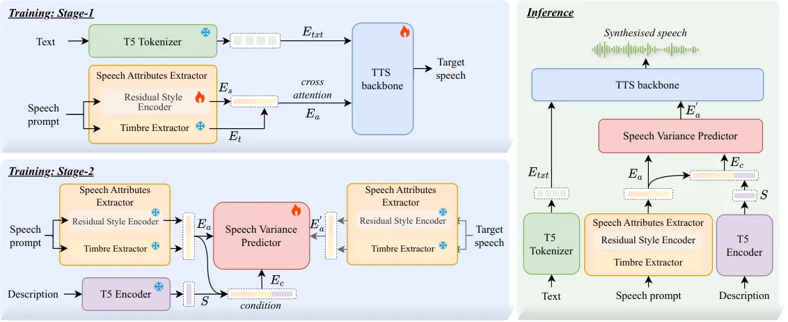

Zhou Zhou Yang Hu Zhong Wang Wu

# FineCombo-TTS: Collaborative and Precise Controllable Speech Synthesis Using Text Descriptions and Reference Speech

Shuoyi    Yixuan    Peiji    Yifan    Yicheng    Zhisheng    Zhiyong

###### Abstract

Controllable text-to-speech (TTS) has become a key research focus.
However, methods based on either reference speech or text descriptions
lack flexibility and precise control, and recent joint approaches remain
loosely coupled, with speech modeling timbre and text controlling global
style. We propose FineCombo-TTS, a unified framework for speech
synthesis grounded in reference speech and guided by text descriptions,
enabling flexible and precise control over acoustic attributes. Instead
of explicit attribute disentanglement, we learn a unified acoustic
representation and introduce a Conditional Flow Matching (CFM)-based
Speech Variance Predictor to model fine-grained reference-to-target
transformations guided by text descriptions. To support relative
attribute control, we construct FineEdit, a structured paired dataset
that explicitly encodes source-to-target attribute variations.
Experiments demonstrate that our approach achieves flexible, precise,
and expressive controllable TTS.¹¹ 1 The demo and dataset are available
at
[https://thuhcsi.github.io/interspeech2026-FineCombo-TTS](https://thuhcsi.github.io/interspeech2026-FineCombo-TTS).

###### keywords

text-to-speech, controllable TTS, conditional flow matching

^(†)^(†)address: ¹ Shenzhen International Graduate School, Tsinghua
University, Shenzhen, China  
² Inner Mongolia University Hohhot, China  
³ Tencent, Shenzhen, China^(†)^(†)email: zhousy23@mails.tsinghua.edu.cn

## 1 Introduction

In recent years, text-to-speech (TTS) technology has achieved near
human-level naturalness and intelligibility \[1, 2, 3\], shifting
research toward higher-level goals such as expressive and controllable
synthesis. Existing controllable methods can be divided into three
categories: 1) reference speech-based, 2) text description-based, and 3)
joint speech-description control. Reference speech-based approaches \[4,
5, 6\] enable zero-shot voice cloning but are highly dependent on the
quality of the reference speech, limiting practical flexibility. Text
description-based methods \[7, 8, 9\] provide greater control freedom
but often struggle to capture fine-grained acoustic nuances through
textual prompts alone. Recent joint-control methods \[10, 11, 12\]
attempt to combine both modalities but still operate in a segregated
manner, with reference speech typically limited to timbre and text
descriptions crudely overwriting global style, resulting in limited
cross-modal collaboration.

Figure 1: The proposed FineCombo-TTS enables precise control over the
timbre, prosody, and emotion of the source (reference) speech.

Therefore, we aim to build a controllable TTS model that supports
reference-aware and preference-driven speech synthesis—preserving the
acoustic characteristics of a selected reference speech while enabling
precise, text-guided control of specific attributes, thereby providing
both precise controllability and practical flexibility. However,
achieving such joint control is limited by both data and modeling
challenges. Most description-based datasets consist of isolated
speech–text pairs describing absolute acoustic properties. Consequently,
models learn attribute–acoustic correspondences tied to the training
distribution, rather than attribute variations relative to a given
reference speech. This highlights the need for structured
reference–target pairs that explicitly encode relative attribute
transformations. In addition, precise control is hindered by the strong
entanglement among timbre, prosody, and emotion in natural speech.
Explicit disentanglement is difficult and often introduces information
leakage or structural redundancy, making stable and flexible control
hard to achieve.

To address these issues, we construct FineEdit, a paired dataset of
triplets ⟨source speech, control description, target speech⟩, where the
source provides an acoustic baseline, the control description specifies
the desired attribute modification, and the target reflects the
corresponding variation. As shown in Fig. 1, FineEdit covers timbre,
prosody, and emotion, enabling description-guided control grounded in
reference speech. On the modeling side, we establish a unified acoustic
attribute latent space, where speech attribute embeddings combine timbre
information with residual style components. We further introduce a
Conditional Flow Matching (CFM)-based Speech Variance Predictor to model
attribute transformations conditioned on both reference representations
and text descriptions. This module learns a fine-grained, one-to-many
mapping from reference-grounded attributes to controlled target
variations, enabling controllable and high-fidelity speech synthesis
without explicit disentanglement.



Figure 2: The overall architecture of FineCombo-TTS.

By integrating the structured paired dataset with our modeling
framework, the proposed approach achieves reference-grounded and
preference-driven controllable speech synthesis. In particular, our
model supports joint control with both reference speech and text
descriptions, as well as single-condition scenarios, enabling zero-shot
voice cloning and description-driven speech generation. The main
contributions are summarized as follows:

- •
  We propose FineCombo-TTS, the first controllable TTS architecture that
  jointly leverages reference speech and text descriptions to enable
  flexible and precise control.
- •
  We introduce a CFM-based Speech Variance Predictor that operates in a
  unified acoustic attribute latent space, modeling fine-grained
  reference-to-target attribute transformations conditioned on text
  descriptions.
- •
  We construct FineEdit, the first large-scale paired dataset of ⟨source
  speech, control description, target speech⟩ triplets for relative
  attribute control. Experiments validate the effectiveness of both the
  dataset and the proposed framework.

## 2 Methodology

The architecture of our proposed model is illustrated in Figue 2. The
model comprises three modules: a Speech Attributes Extractor, a Speech
Variance Predictor, and a TTS backbone. The Speech Attributes Extractor
encodes prompt speech into a unified embedding $`E_{a}`$ via a timbre
extractor and residual style encoder, capturing key acoustic
characteristics. The CFM-based Speech Variance Predictor refines
$`E_{a}`$ conditioned on both the text encoding $`S`$ from T5
Encoder\[13\]²² 2
[google/flan-t5-small](https://huggingface.co/google/flan-t5-small) and
the source attributes. Finally, the TTS backbone takes text embeddings
$`E_{txt}`$ and the target attribute $`E_{a}^{\prime}`$ to
autoregressively generate multi-layer acoustic tokens, which are
reconstructed using the Descript Audio Codec (DAC\[14\]).

### 2.1 Speech Attributes Extraction

To avoid the difficulty of explicit attribute disentanglement, we retain
the natural coupling of acoustic factors and extract a unified speech
attribute embedding. Specifically, we adopt the timbre extractor from
pretrained FACodec³³ 3
[github.com/lifeiteng/naturalspeech3_facodec](https://github.com/lifeiteng/naturalspeech3_facodec)\[15\]
to obtain a speaker-related timbre embedding $`E_{t}`$, leveraging
large-scale pretraining for robust timbre representation. To further
capture detailed style information, we adopt a residual style encoder
based on the Mel-Style Encoder in \[16\], which combines convolutional
layers and self-attention to model both local and global patterns in the
mel-spectrogram, producing a residual style embedding $`E_{s}`$. The
final unified attribute embedding is constructed by concatenating the
two components $`E_{a}=concat(E_{t},E_{s})`$.

### 2.2 Speech Variance Modeling with CFM

We design a Speech Variance Predictor that conditions on both text
descriptions and reference speech, enabling precise attribute
transformation without explicit disentanglement. Inspired by conditional
generative frameworks such as diffusion and flow matching used in image
editing\[17, 18, 19\], we adopt Conditional Flow Matching (CFM)\[20\] to
model reference-to-target attribute variations. Text descriptions are
encoded by a pretrained T5 model, and a cross-attention module derives
the sentence-level representation $`S`$. The predictor then conditions
on the concatenation of description semantic representation $`S`$ and
the source speech attribute embedding $`E_{a}`$.

During training, we use the source speech attribute embedding $`E_{a}`$
as $`x_{0}`$ and the target embedding $`E_{a}^{\prime}`$ as $`x_{1}`$
from the FineEdit paired dataset, which differ only in the specified
acoustic attribute. For tasks that require only description control
without reference speech, the source speech attribute embedding is
replaced with a random noise. Linear interpolation generates
intermediate states:

```math
x_{t}=tx_{1}+(1-t)x_{0},\quad u_{t}=x_{1}-x_{0}, \tag{1}
```

where $`t\in[0,1]`$ and $`u_{t}`$ denotes the target velocity. A UNet
backbone estimates the velocity field $`v_{t}`$, conditioned on
$`E_{c}=(E_{a},S)`$:

```math
v_{t}=V_{t}(x_{t},t\mid E_{c}). \tag{2}
```

The training objective minimizes the MSE between $`v_{t}`$ and
$`u_{t}`$:

```math
\mathcal{L}_{CFM}=\mathbb{E}_{t,x_{0},x_{1}}|v_{t}-u_{t}|^{2}. \tag{3}
```

Inspired by the success of Classifier-Free Guidance (CFG)\[21\] in
speech generation models such as VoxInstruct \[11\], we incorporate CFG
in Speech Variance Predictor to amplify the influence of text
descriptions on attribute refinement. During training, we randomly drop
the text condition $`S`$ with a fixed probability, yielding the
null-conditioned embedding $`E_{c}^{\prime}=[E_{a},\emptyset]`$. At
inference, the guidance scale $`\alpha`$ is employed to strengthen the
text-driven transformation of speech attributes:

```math
\hat{V_{t}}(x_{t},t\mid E_{c})=\alpha V_{t}(x_{t},t\mid E_{c})+(1-\alpha)V_{t}(x_{t},t\mid E_{c}^{\prime}), \tag{4}
```

### 2.3 TTS Backbone

Inspired by LM-based TTS models, we adopt a decoder-only Transformer
codec language model as the TTS backbone. The input text is tokenized
into $`E_{txt}`$ and prepended as conditioning tokens. The speech
attribute embedding $`E_{a}`$ is injected through cross-attention in
each Transformer block, with text features as queries and $`E_{a}`$ as
keys and values for attribute-aware modulation. Following
MusicGen \[22\] and ParlerTTS \[23\], we employ a delay pattern to
jointly predict multi-layer acoustic tokens in a fully autoregressive
manner, which facilitates coherent prosody modeling across layers and
time steps. The model generates acoustic tokens with probability
$`P(A|E_{txt},E_{a};\theta_{TTS})`$. To improve text–speech alignment
and reduce omissions or repetitions, we apply classifier-free guidance
(CFG) on the text condition. During training, $`E_{txt}`$ is randomly
dropped. At inference, a guidance scale $`\beta`$ strengthens adherence
to the textual content:

```math
\log\hat{P}(A\mid E_{txt},E_{a})=\beta\log P(A\mid E_{txt},E_{a})+(1-\beta)\log P(A\mid\emptyset,E_{a}). \tag{5}
```

### 2.4 Training Strategy

Our model is trained in two stages (Fig. 2). In the first stage, the
FACodec timbre extractor is frozen, while the residual style encoder and
TTS backbone are jointly trained on large-scale text–speech datasets,
followed by fine-tuning on a smaller emotional dataset to improve
expressiveness. This stage establishes stable speech generation and
learns a robust unified speech attribute embedding for zero-shot
scenarios. In the second stage, the Speech Variance Predictor is trained
separately on the paired dataset, where text descriptions guide
reference-to-target attribute transformations to enable precise and
controllable synthesis.

## 3 Dataset: FineEdit

Existing speech–description datasets provide only isolated speech–text
pairs describing absolute acoustic properties, which are insufficient
for learning reference-conditioned attribute transformations. To address
this limitation, we construct FineEdit, a structured paired English
speech dataset designed to model relative attribute variations. Each
sample forms a triplet $`\langle`$source speech, control description,
target speech$`\rangle`$, where source and target differ in only one
attribute—prosody, emotion, or timbre—while other factors remain
consistent. The control description explicitly specifies the relative
change. Table 1 summarizes the three subsets.

### 3.1 Prosody Paired Speech Subset

For prosody control, we ensure identical speaker identity and text
content while varying only prosodic attributes (speed and pitch). Based
on LibriTTS-R \[24\], we generate controlled prosody variants using
FFmpeg by adjusting speed and pitch parameters. Each utterance yields
multiple versions (original, pitch-high/low, speed-fast/slow), and all
pairwise combinations are constructed as source–target pairs. Each pair
is annotated with a prosody-change description specifying the relative
adjustment (e.g., ”Change the prosody, speed up the speech rate, raise
the pitch.”).

### 3.2 Emotion Paired Speech Subset

For emotion control, speaker identity is fixed while emotional
expression varies. We use the Emotional Speech Database (ESD) \[25\],
which contains 10 speakers across five emotions (Happy, Sad, Angry,
Surprised, Neutral). For each speaker, utterances with different
emotions are paired to form source–target combinations, where the
textual content is not required to be identical, and each pair is
annotated with a target-style description (e.g., “Change the style,
speak with an angry emotion.”).

### 3.3 Timbre Paired Speech Subset

For timbre control, we construct cross-speaker pairs while keeping
overall prosody and style as consistent as possible. The target speaker
description serves as the control annotation prefixed with “Change the
timbre”. To increase data diversity and ensure that timbre variations
remain stable across different affective conditions, we divide the
dataset into emotion-neutral and emotion-rich subsets:

Emotion-neutral subset: Built from LibriTTS-R \[24\], whose audiobook
style ensures relatively consistent emotion, we group utterances with
similar prosody(e.g. pitch-high, speed-fast) using speaker and prosody
annotations from LibriTTS-P\[26\] and create cross-speaker pairs. The
target speaker description serves as the control text for timbre
transfer.

Emotion-rich subset: Using ESD \[25\] with prosody and emotion
annotations from TextrolSpeech \[27\], we group utterances with similar
prosody and emotion (e.g. pitch-high, speed-fast, emotion-happy) and
construct cross-speaker pairs. We additionally provide manual speaker
descriptions to support more expressive timbre control.

| Dataset Type | Prosody | Emotion | Timbre | Text | Num of pairs |
| ------------ | ------- | ------- | ------ | ---- | ------------ |
| Prosody Pair | ✓       | \-      | \-     | \-   | 634,956      |
| Emotion Pair | \-      | ✓       | \-     | ✓    | 80,000,000   |
| Timbre Pair  | \-      | \-      | ✓      | ✓    | 16,392,828   |

Table 1: Summary of Attribute Control in FineEdit Paired Speech Subsets.
$`\checkmark`$ means the target attribute is modified; $`-`$ means it
remains unchanged.

## 4 Experiment

|                   |                   |                   |                   |                  |                                      |       |                                 |       |
| ----------------- | ----------------- | ----------------- | ----------------- | ---------------- | ------------------------------------ | ----- | ------------------------------- | ----- |
| Model             | MOS-S$`\uparrow`$ | MOS-I$`\uparrow`$ | WER$`\downarrow`$ | SECS$`\uparrow`$ | Uncontrolled Variation$`\downarrow`$ |       | Controlled Accuracy$`\uparrow`$ |       |
| Speed             | Pitch             | Speed             | Pitch             |                  |                                      |       |                                 |       |
| VoxInstruct-Joint | 2.00 $`\pm`$ 0.38 | 3.26 $`\pm`$ 0.37 | 11.12             | 56.79            | 19.00                                | 42.81 | 91.35                           | 63.81 |
| FineCombo-TTS     | 4.04 $`\pm`$ 0.34 | 4.05 $`\pm`$0.31  | 12.87             | 70.20            | 14.62                                | 6.71  | 98.00                           | 93.33 |

Table 2: Experimental results of prosody control.

| Model             | Emotion Control   |                   |                   |                  |                       | Timbre Control    |                   |                   |                 |                       |
| ----------------- | ----------------- | ----------------- | ----------------- | ---------------- | --------------------- | ----------------- | ----------------- | ----------------- | --------------- | --------------------- |
|                   | MOS-S$`\uparrow`$ | MOS-I$`\uparrow`$ | WER$`\downarrow`$ | SECS$`\uparrow`$ | Emotion-A$`\uparrow`$ | MOS-P$`\uparrow`$ | MOS-I$`\uparrow`$ | WER$`\downarrow`$ | FPC$`\uparrow`$ | Emotion-S$`\uparrow`$ |
| VoxInstruct-Joint | 2.64 $`\pm`$ 0.24 | 2.96 $`\pm`$ 0.34 | 20.18             | 63.99            | 47.00                 | 3.04 $`\pm`$ 0.36 | 3.32 $`\pm`$ 0.32 | 19.24             | 47.46           | 52.15                 |
| FineCombo-TTS     | 3.34 $`\pm`$ 0.36 | 3.83 $`\pm`$ 0.18 | 11.22             | 66.56            | 85.00                 | 3.66 $`\pm`$ 0.32 | 3.75 $`\pm`$ 0.27 | 18.59             | 52.67           | 55.38                 |

Table 3: Experimental results of emotion control and timbre control.
Emotion-A means emotion accuracy; Emotion-S means the similarity between
emotion embeddings.

### 4.1 Experiment Setup

In training stage 1, we pre-train on Multilingual LibriSpeech (MLS, 45k
hours) \[28\] and LibriTTS-R (585 hours) \[29\], and then fine-tune on
EmoVoice-DB (45 hours) \[30\] and TextrolSpeech (330 hours) \[27\] for
emotion modeling. In stage 2, we train the Speech Variance Predictor
using 236K description–speech pairs from TextrolSpeech for
description-only control, together with about 600K pairs per FineEdit
subset for precise joint control with both reference speech and text.

The TTS backbone is a 12-layer Transformer decoder, and the CFM
framework employs a 1D UNet as the predictor. To enable unconditional
CFG training, we randomly mask text or description sequences with
probability 0.1, and set the CFG strength to $`\alpha=\beta=2`$ during
inference. All experiments are conducted on 8×NVIDIA A100 GPUs. In stage
1, we train for 250K steps with a batch size of 32 and a learning rate
of $`1\text{e}^{-4}`$, followed by fine-tuning on emotional datasets for
70K steps with a learning rate of $`5\text{e}^{-4}`$. In stage 2, the
Speech Variance Predictor is trained for 140K steps with a learning rate
of $`1\text{e}^{-4}`$.

Since no prior model achieves joint processing of reference speech and
text descriptions, we adapt an existing open-source SOTA framework for
fair comparison. Specifically, we re-implement VoxInstruct \[11\] as
VoxInstruct-Joint. On top of the original fully LLM-based architecture,
we modify it to support joint control by prepending the acoustic tokens
of the reference speech to the input sequence. To ensure fairness,
VoxInstruct-Joint is trained on the same data as our method, including
FineEdit, under an identical training strategy.

### 4.2 Experiment Results

We evaluate controllability on prosody, emotion, and timbre using both
reference speech and textual descriptions. Test data are sampled from
FineEdit and unseen during training. Evaluation combines subjective
metrics—MOS-S (speaker similarity), MOS-I (instruction following), and
MOS-P (prosodic consistency)—with objective metrics: WER⁴⁴ 4
[openai/whisper-large-v3](https://huggingface.co/openai/whisper-large-v3)
for intelligibility, SECS⁵⁵ 5
[microsoft/wavlm-base-plus-sv](https://huggingface.co/microsoft/wavlm-base-plus-sv)
for speaker encoder cosine similarity, FPC for pitch correlation, and
Emotion-A/S⁶⁶ 6
[emotion2vec/emotion2vec_plus_large](https://huggingface.co/emotion2vec/emotion2vec_plus_large)
for emotion accuracy and embedding similarity. For joint-control
analysis, we also report Controlled Accuracy, which measures whether the
synthesized attribute change matches the instruction, and Uncontrolled
Variation, which quantifies how much non-target attributes deviate from
the reference (lower is better).

For prosody control (Table 2), FineCombo-TTS achieves higher MOS-I and
Controlled Accuracy than VoxInstruct, confirming stronger instruction
following. Meanwhile, MOS-S and SECS remain high, indicating that timbre
is preserved, and Uncontrolled Variation in speed and pitch is much
lower, showing that specific attributes can be modified precisely
without degrading others.

For emotion control (Table 3, left), FineCombo-TTS reaches an emotion
accuracy of 85%, significantly outperforming VoxInstruct. At the same
time, high MOS-S and SECS demonstrate that the speaker’s timbre remains
well preserved during emotion transfer.

For timbre control (Table 3, right), FineCombo-TTS achieves MOS-I of
3.75 for timbre instructions and surpasses the baseline in MOS-P, FPC,
and Emotion-S. This demonstrates effective timbre modification while
maintaining prosody and emotional style, validating the benefit of
CFM-based conditional control.

### 4.3 Ablation Studies

Different CFG Strategy We evaluate the CFG strategy on the emotion
control task with multi-CFG with text CFG value of 2.0 and description
CFG value of 1.5. As shown in Table 4, strengthening description CFG
improves instruction following, raising emotion accuracy from 81% to
86%, though SECS decreases slightly since stronger emotion expression
can reduce timbre similarity. Moreover, adding text CFG lowers WER from
14.17 to 9.06, enhancing intelligibility and naturalness. Overall,
multi-CFG achieves better instruction adherence while maintaining a good
balance between speaker similarity and naturalness.

| Model                           | WER$`\downarrow`$ | SECS$`\uparrow`$ | Emotion-A$`\uparrow`$ |
| ------------------------------- | ----------------- | ---------------- | --------------------- |
| w/o CFG on description and text | 14.17             | 71.08            | 76.00                 |
| w/o CFG on description          | 9.06              | 72.53            | 81.00                 |
| proposed                        | 8.82              | 69.16            | 86.00                 |

Table 4: Ablation study on different CFG strategy.

Ablation of Residual Style Encoder In our model, we adopt the
pre-trained FACodec timbre extractor for speaker information and
introduce a residual style encoder for detailed style modeling. We
assess the contribution of the residual style encoder in the first-stage
zero-shot experiments. As shown in Table 5, incorporating the residual
style encoder leads to improvements in both speaker similarity and
speech quality, indicating its positive contribution to modeling speaker
style.

| Model                      | MCD$`\downarrow`$ | SECS$`\uparrow`$ |
| -------------------------- | ----------------- | ---------------- |
| w/o residual style encoder | 11.08             | 90.00            |
| proposed                   | 10.83             | 90.20            |

Table 5: Ablation study of residual style encoder.

## 5 Conclusion

In this paper, we propose FineCombo-TTS, a controllable TTS framework
that tightly integrates reference speech and text descriptions for
precise and flexible speech synthesis. Unlike prior pseudo-collaborative
approaches, our method unifies both modalities within a shared acoustic
attribute space, enabling reference-grounded and text-guided attribute
transformation. We introduce a CFM-based Speech Variance Predictor to
model fine-grained reference-to-target attribute variations without
explicit disentanglement. To support such relative control learning, we
also construct FineEdit, a structured paired dataset that explicitly
encodes attribute differences between source and target speech.

## 6 Generative AI Use Disclosure

During the preparation of this manuscript, the authors used generative
AI tools exclusively for the purpose of language editing and manuscript
polishing to improve readability. These tools were not used to generate
any core scientific ideas, experimental data, or technical
contributions. All authors have thoroughly reviewed and approved the
final version of the manuscript, and assume full responsibility for the
integrity and entirety of its content.

## 7 Acknowledgments

This work was supported by National Natural Science Foundation of China
(62076144) and National Social Science Foundation of China (13&ZD189).

## References

- \[1\] Y. Ren, C. Hu, X. Tan, T. Qin, S. Zhao, Z. Zhao, and T.
  Liu (2020) Fastspeech 2: fast and high-quality end-to-end text to
  speech. arXiv preprint arXiv:2006.04558. Cited by: §1.
- \[2\] Y. Ren, Y. Ruan, X. Tan, T. Qin, S. Zhao, Z. Zhao, and T.
  Liu (2019) Fastspeech: fast, robust and controllable text to speech.
  Advances in neural information processing systems. Cited by: §1.
- \[3\] Y. Wang, R. Skerry-Ryan, D. Stanton, Y. Wu, R. J. Weiss, N.
  Jaitly, Z. Yang, Y. Xiao, Z. Chen, S. Bengio, et al. (2017) Tacotron:
  towards end-to-end speech synthesis. arXiv preprint arXiv:1703.10135.
  Cited by: §1.
- \[4\] C. Wang, S. Chen, Y. Wu, Z. Zhang, L. Zhou, S. Liu, Z. Chen, Y.
  Liu, H. Wang, J. Li, et al. (2023) Neural codec language models are
  zero-shot text to speech synthesizers. arXiv preprint
  arXiv:2301.02111. Cited by: §1.
- \[5\] E. Kharitonov, D. Vincent, Z. Borsos, R. Marinier, S. Girgin, O.
  Pietquin, M. Sharifi, M. Tagliasacchi, and N. Zeghidour (2023) Speak,
  read and prompt: high-fidelity text-to-speech with minimal
  supervision. Transactions of the Association for Computational
  Linguistics, pp. 1703–1718. Cited by: §1.
- \[6\] S. Lei, Y. Zhou, L. Chen, D. Luo, Z. Wu, X. Wu, S. Kang, T.
  Jiang, Y. Zhou, Y. Han, et al. (2024) Improving language model-based
  zero-shot text-to-speech synthesis with multi-scale acoustic prompts.
  In ICASSP 2024-2024 IEEE International Conference on Acoustics, Speech
  and Signal Processing (ICASSP), pp. 12662–12666. Cited by: §1.
- \[7\] Z. Guo, Y. Leng, Y. Wu, S. Zhao, and X. Tan (2023) Prompttts:
  controllable text-to-speech with text descriptions. In ICASSP
  2023-2023 IEEE International Conference on Acoustics, Speech and
  Signal Processing (ICASSP), pp. 1–5. Cited by: §1.
- \[8\] D. Yang, S. Liu, R. Huang, C. Weng, and H. Meng (2024)
  Instructtts: modelling expressive tts in discrete latent space with
  natural language style prompt. IEEE/ACM Transactions on Audio, Speech,
  and Language Processing, pp. 2913–2925. Cited by: §1.
- \[9\] G. Liu, Y. Zhang, Y. Lei, Y. Chen, R. Wang, Z. Li, and L.
  Xie (2023) Promptstyle: controllable style transfer for text-to-speech
  with natural language descriptions. arXiv preprint arXiv:2305.19522.
  Cited by: §1.
- \[10\] S. Ji, Q. Chen, W. Wang, J. Zuo, M. Fang, Z. Jiang, H.
  Huang, Z. Wang, X. Cheng, S. Zheng, et al. (2025) ControlSpeech:
  towards simultaneous and independent zero-shot speaker cloning and
  zero-shot language style control. In the 63rd Annual Meeting of the
  Association for Computational Linguistics (Volume 1: Long Papers),
  pp. 6966–6981. Cited by: §1.
- \[11\] Y. Zhou, X. Qin, Z. Jin, S. Zhou, S. Lei, S. Zhou, Z. Wu,
  and J. Jia (2024) Voxinstruct: expressive human instruction-to-speech
  generation with unified multilingual codec language modelling. In the
  32nd ACM International Conference on Multimedia, pp. 554–563. Cited
  by: §1, §2.2, §4.1.
- \[12\] H. Li, Y. Li, X. Wang, J. Hu, Q. Xie, S. Yang, and L.
  Xie (2025) Flespeech: flexibly controllable speech generation with
  various prompts. arXiv preprint arXiv:2501.04644. Cited by: §1.
- \[13\] H. W. Chung, L. Hou, S. Longpre, B. Zoph, Y. Tay, W. Fedus, Y.
  Li, X. Wang, M. Dehghani, S. Brahma, et al. (2024) Scaling
  instruction-finetuned language models. Journal of Machine Learning
  Research (70), pp. 1–53. Cited by: §2.
- \[14\] R. Kumar, P. Seetharaman, A. Luebs, I. Kumar, and K.
  Kumar (2023) High-fidelity audio compression with improved rvqgan.
  Advances in Neural Information Processing Systems, pp. 27980–27993.
  Cited by: §2.
- \[15\] Z. Ju, Y. Wang, K. Shen, X. Tan, D. Xin, D. Yang, Y. Liu, Y.
  Leng, K. Song, S. Tang, et al. (2024) Naturalspeech 3: zero-shot
  speech synthesis with factorized codec and diffusion models. arXiv
  preprint arXiv:2403.03100. Cited by: §2.1.
- \[16\] D. Min, D. B. Lee, E. Yang, and S. J. Hwang (2021)
  Meta-stylespeech: multi-speaker adaptive text-to-speech generation. In
  International Conference on Machine Learning, pp. 7748–7759. Cited by:
  §2.1.
- \[17\] V. T. Hu, W. Zhang, M. Tang, P. Mettes, D. Zhao, and C.
  Snoek (2024) Latent space editing in transformer-based flow matching.
  In AAAI conference on artificial intelligence, pp. 2247–2255. Cited
  by: §2.2.
- \[18\] B. Kawar, S. Zada, O. Lang, O. Tov, H. Chang, T. Dekel, I.
  Mosseri, and M. Irani (2023) Imagic: text-based real image editing
  with diffusion models. In IEEE/CVF conference on computer vision and
  pattern recognition, pp. 6007–6017. Cited by: §2.2.
- \[19\] V. T. Hu, W. Yin, P. Ma, Y. Chen, B. Fernando, Y. M. Asano, E.
  Gavves, P. Mettes, B. Ommer, and C. G. Snoek (2023) Motion flow
  matching for human motion synthesis and editing. arXiv preprint
  arXiv:2312.08895. Cited by: §2.2.
- \[20\] Y. Lipman, R. T. Chen, H. Ben-Hamu, M. Nickel, and M. Le (2022)
  Flow matching for generative modeling. arXiv preprint
  arXiv:2210.02747. Cited by: §2.2.
- \[21\] J. Ho and T. Salimans (2022) Classifier-free diffusion
  guidance. arXiv preprint arXiv:2207.12598. Cited by: §2.2.
- \[22\] J. Copet, F. Kreuk, I. Gat, T. Remez, D. Kant, G. Synnaeve, Y.
  Adi, and A. Défossez (2023) Simple and controllable music generation.
  Advances in Neural Information Processing Systems, pp. 47704–47720.
  Cited by: §2.3.
- \[23\] D. Lyth and S. King (2024) Natural language guidance of
  high-fidelity text-to-speech with synthetic annotations. arXiv
  preprint arXiv:2402.01912. Cited by: §2.3.
- \[24\] Y. Koizumi, H. Zen, S. Karita, Y. Ding, K. Yatabe, N.
  Morioka, M. Bacchiani, Y. Zhang, W. Han, and A. Bapna (2023)
  Libritts-r: a restored multi-speaker text-to-speech corpus. arXiv
  preprint arXiv:2305.18802. Cited by: §3.1, §3.3.
- \[25\] K. Zhou, B. Sisman, R. Liu, and H. Li (2022) Emotional voice
  conversion: theory, databases and esd. Speech Communication, pp. 1–18.
  Cited by: §3.2, §3.3.
- \[26\] M. Kawamura, R. Yamamoto, Y. Shirahata, T. Hasumi, and K.
  Tachibana (2024) Libritts-p: a corpus with speaking style and speaker
  identity prompts for text-to-speech and style captioning. arXiv
  preprint arXiv:2406.07969. Cited by: §3.3.
- \[27\] S. Ji, J. Zuo, M. Fang, Z. Jiang, F. Chen, X. Duan, B. Huai,
  and Z. Zhao (2024) Textrolspeech: a text style control speech corpus
  with codec language text-to-speech models. In ICASSP 2024-2024 IEEE
  International Conference on Acoustics, Speech and Signal Processing
  (ICASSP), pp. 10301–10305. Cited by: §3.3, §4.1.
- \[28\] V. Pratap, Q. Xu, A. Sriram, G. Synnaeve, and R.
  Collobert (2020) Mls: a large-scale multilingual dataset for speech
  research. arXiv preprint arXiv:2012.03411. Cited by: §4.1.
- \[29\] J. Kearns (2014) Librivox: free public domain audiobooks.
  Reference Reviews, pp. 7–8. Cited by: §4.1.
- \[30\] G. Yang, C. Yang, Q. Chen, Z. Ma, W. Chen, W. Wang, T. Wang, Y.
  Yang, Z. Niu, W. Liu, et al. (2025) Emovoice: llm-based emotional
  text-to-speech model with freestyle text prompting. arXiv preprint
  arXiv:2504.12867. Cited by: §4.1.
