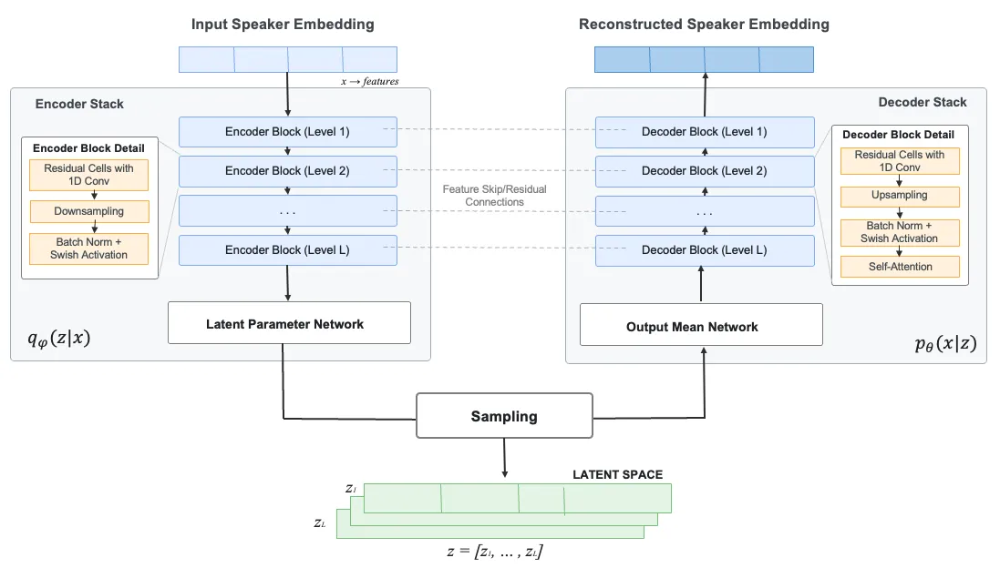

# NouveauVoice: Generating Novel Pseudo Speakers for Voice Anonymization

Meiying Melissa Chen, Anastasia Kuznetsova, Zhenyu Wang and Zhiyao Duan
Affiliation: Department of Electrical and Computer Engineering,
University of Rochester  
Rochester NY, USA  
meiying.chen@rochester.edu

###### Abstract

Advanced neural technologies in speech synthesis and voice conversion
(VC) have introduced severe risks to personal privacy, necessitating
robust Speaker Anonymization Systems (SAS). Existing SAS approaches
modify voice characteristics in the hand-crafted feature space or
speaker embedding space, often struggling to provide sufficient identity
variance across generated voices. In this paper, we propose
NouveauVoice, a novel pseudo-speaker generation framework based on a
Hierarchical Deep Variational Autoencoder (NVAE). Integrated as a
standalone plug-in module on top of state-of-the-art architectures
(FACodec and CosyVoice2), our approach leverages tractable sampling and
the Evidence Lower Bound (ELBO) objective to synthesize highly
expressive pseudo-speaker embeddings with significantly enhanced speaker
diversity. Evaluating our framework under a protocol similar to the
VoicePrivacy Challenge alongside Maximum Mean Discrepancy (MMD)
analysis, we demonstrate that NouveauVoice achieves strong identity
concealment, yielding an Equal Error Rate (EER) exceeding 38% against an
automatic speaker verification attacker model. Our system shows a
reasonable trade-off between strict anonymity, rich pseudo-speaker
diversity, and downstream speech utility, such as intelligibility and
emotional expressiveness.

###### Index Terms: 

Voice Conversion, NVAE, Speaker Generation

## I Introduction

Advanced neural technologies, while providing great convenience in
speech and audio production pipelines, pose significant challenges to
personal privacy. Modern text-to-speech (TTS) systems \[15, 6, 36, 4\]
with voice conversion (VC) capabilities, large language models (LLMs)
based on discrete speech tokenizers \[37, 13, 1, 21\] and numerous
standalone VC systems \[27, 12, 39, 4, 16, 14\] can accurately clone a
target speaker’s identity with arbitrary content, making them
susceptible to misuse. Furthermore, identity leakage from insufficiently
concealed speech may allow a perpetrator to reveal sensitive
information, e.g., in HIPAA-protected settings where specific
attributes, such as accent or pathological conditions, can compromise
anonymity. Consequently, speaker anonymization systems (SAS) remain a
critical area of active research.

We distinguish between two primary architectures for SAS. First, digital
signal processing (DSP) based systems \[25, 30\] are straightforward to
implement by leveraging shifts in frequency formants, pitch, and other
inherent acoustic signal characteristics. However, these methods remain
highly vulnerable to sophisticated adversarial attacks, such as
automatic speaker verification (ASV) systems retrained on anonymized
data to uncover original speaker identities \[20\].

Second, more advanced Deep Neural Network (DNN) based SAS frameworks
comprise the recent baselines for the VoicePrivacy Challenge \[31, 32\].
These include Generative Adversarial Network (GAN) based pseudo-speaker
generation (B3) and Neural Audio Codec (NAC) systems that utilize a pool
of random prompts to condition an autoregressive decoder, modifying the
acoustic tokens that encode speaker identity (B4) \[32\]. More recently,
Large Language Model (LLM) based SAS, such as StreamVoiceAnon \[18\],
utilize acoustic features or speech tokens from the target voice as
prompts. Notably, \[18\] employs a pseudo-speaker selection strategy
that extracts speaker embeddings from a reference prompt pool, averages
them, and injects Gaussian noise to enhance privacy. While highly
efficient for streaming configurations, such pooling methods do not
explicitly guarantee rich speaker diversity or natural acoustic
variability across the generated pseudo-identities.

The main principles for speaker anonymization that we focus on in this
paper are: i) Speaker privacy protection. Generated pseudo-speakers
should be dissimilar to the original speaker; ii) Speaker diversity.
Pseudo-speakers should have unique speaker identity to maintain the
diversity of anonymized speech across different speakers; iii)
Distribution similarity. The distribution of pseudo-speakers should be
close to the original speaker distribution to maintain the naturalness
of the original speech. These requirements are also concisely formulated
in \[23\] and \[20\].

Following these principles, we propose NouveauVoice, a novel approach
for pseudo-speaker generation based on a Hierarchical Deep Variational
Autoencoder (NVAE) \[33\] that fits the DNN-based SAS paradigm.
NouveauVoice is trained independently as a standalone plug-in module and
validated across two state-of-the-art voice conversion backends: FACodec
\[15\] and CosyVoice2 \[6\]. The training of the proposed NVAE is guided
by the Evidence Lower Bound (ELBO) objective \[33\] to enforce the
distribution similarity to the original speaker.

We conduct a comprehensive evaluation of NouveauVoice for pseudo-speaker
generation following the evaluation strategy similar to Voice Privacy
Challenge \[31, 32\] as well as speaker diversity evaluation via Maximum
Mean Discrepancy (MMD). The proposed system shows over  38 % Equal Error
Rate (EER) against an ASV attacker model indicating strong anonymization
capacity, while showing a reasonable trade-off between anonymity and
intelligibility.

The contributions of this paper are as follows:

- •
  The proposed approach is a convenient plug-in module that can turn
  existing VC systems into SAS;
- •
  It offers fast and tractable generation of pseudo-speakers focusing on
  the speaker diversity requirement;
- •
  Allows flexible control over anonymization strength.

## II Method

Voice conversion (VC) is a generative speech processing framework that
allows to change the personality of the source speaker to any desirable
target identity. However, under privacy protection scenarios, the
identity of neither source, nor target speaker may not be discovered to
avoid malicious use of the speaker identities. Thus, we propose
NouveauVoice, the hierarchical pseudo-speaker generator based on Nouveau
Variational Auto Encoder (NVAE) \[33\], to model the speaker embedding
distribution.

### II-A NVAE Pseudo-Speaker Generator

NVAE was first introduced by \[33\] for high-quality image generation.
Its encoder transforms the input feature vector $`x`$ into the latent
vector $`z`$, which is partitioned into disjoint groups of latent
sub-vectors from coarser levels to finer levels,
$`z=(z_{1},\ldots,z_{L})`$, where $`L`$ is the total number of latent
groups and each $`z_{l}`$ represents the latent vector for group $`l`$.
The generative model $`p_{\theta}(x|z)`$ is parametrized by $`\theta`$
via deep neural decoder and is represented by a series of conditional
products:

```math
p_{\theta}(x,z)=p_{\theta}(x|z)\prod_{l=1}^{L}p_{\theta}(z_{l}|z_{<l}), \tag{1}
```

where $`p_{\theta}(z_{1}|z_{<l})=p_{\theta}(z_{1})`$ forms the base case
prior, $`z_{<l}\equiv(z_{1},\ldots,z_{l-1})`$ represents all
coarser-level latents, $`p_{\theta}(x|z)`$ is the observation model, and
$`p_{\theta}(z_{l}|z_{<l})`$ is the conditional prior for $`z_{l}`$
given latents from coarser levels $`z_{<l}`$.

The encoder $`q_{\phi}(z|x)=\prod_{l=1}^{L}q_{\phi}(z_{l}|z_{<l},x)`$
(where $`\phi`$ denotes the encoder parameters) shares the
autoregressive ordering of the prior. A deterministic pass extracts
fearues from $`x`$, the groups are then sampled from coarse to fine,
with each approximate posterior $`q_{\phi}(z_{l}|z_{<l},x)`$
conditioning on the coarser, already sampled groups
$`z_{<l}\equiv(z_{1},\ldots,z_{l-1})`$.

NVAE stabilizes training via spectral regularization and residual cells
with skip connections. The model optimizes the Evidence Lower Bound
(ELBO):

```math
\begin{split}&\mathcal{L}(\theta,\phi;x)=\mathbb{E}_{q_{\phi}(z|x)}\left[\log p_{\theta}(x|z)\right]\\
\quad-&\sum_{l=1}^{L}\mathbb{E}_{q_{\phi}(z_{<l}|x)}\left[D_{\text{KL}}(q_{\phi}(z_{l}|z_{<l},x)\|p_{\theta}(z_{l}|z_{<l}))\right],\end{split} \tag{2}
```

where the first term represents the reconstruction likelihood and the
second term contains the KL divergence between the approximate posterior
$`q_{\phi}(z_{l}|z_{<l},x)`$ and conditional prior
$`p_{\theta}(z_{l}|z_{<l})`$ at each level $`l`$.

The expressivity of the model is supported by depth-wise convolutions
increasing their receptive field with every layer, that helps to model
long-range dependencies as well as fine-grained speaker nuances.
Residual connections along with spectral regularization not only tame
numerical instability of the VAE but also explicitly ensures the
closeness of the posterior approximation to a real speaker distribution,
which is one of the requirements for a good speaker anonymization
system.

To accommodate speaker embeddings in the training data, we replace 2D
convolutional layers with 1D equivalents, apply quantile-based
normalization \[19\] to speaker embeddings, and introduce free-bits
regularization \[17\] with KL coefficient warmup \[11\] to prevent
posterior collapse.



Fig. 1: NouveauVoice generator overview. Left side shows the encoder
structure, while right side depicts the decoder structure. Dashed lines
between encoder and decoder blocks denote residual connections.

### II-B NouveauVoice Training and Inference

Figure 1 shows NouveauVoice generator architecture and training scheme.
During the training phase, speaker embeddings are passed to the NVAE
multi-level CNN encoder stack consisting of 8 groups and each containing
cells with two BN-Swish Conv1D layers (kernel size 3, stride 1 or 2)
\[33\], where downsampling cells expand the receptive field
progressively with depth. Encoded hierarchical latent variables
$`(z_{1}\dots z_{L})`$, which is jointly parameterized by encoder and
decoder features through residual connections, and passed to the decoder
for reconstruction. The ELBO objective (2) is calculated between the
input speaker embeddings and their reconstruction.

During inference, latent codes $`z_{1},\dots,z_{L}`$ are sampled
sequentially through the trained hierarchical structure. At the highest
level, a latent code $`z_{1}`$ is drawn from the unconditional prior
$`p_{\theta}(z_{1})`$. Then each subsequent latent code is sampled
conditionally based on the previously generated groups, represented as
$`p_{\theta}(z_{l}|z_{<l})`$. Finally, the complete latent
representation $`z=(z_{1},\dots,z_{L})`$ is passed through a decoder to
generate the pseudo speaker embedding in the original speaker embedding
space.

## III Experimental Setup

In this work, we conduct two experiments to evaluate the performance and
structural utility of the NVAE framework for pseudo-speaker generation.
The first experiment evaluates the robustness of the generated speaker
embeddings for anonymization when integrated into different VC systems.
The second experiment investigates how the hierarchical architecture of
the NVAE can be leveraged to provide configurable levels of privacy
protection.

### III-A Experiment 1

To demonstrate the cross-system generalizability and privacy-utility
trade-off of NouveauVoice, our first experimental configuration
leverages two distinct, state-of-the-art voice conversion systems as
synthesis engines: FACodec \[15\] and CosyVoice2 \[6\].

FACodec \[15\] is a factorized neural speech codec used for the inherent
embedding setup. It explicitly decomposes the speech waveform into three
distinct subspaces modeled by individual vector quantizers (VQ) \[34\]:
prosody, content, and acoustic detail. To prevent information leakage
between these branches, FACodec utilizes gradient reversal layer (GRL)
\[9\] and an adversarial training framework. Additionally, a standalone
timbre extractor is employed, which aids in retaining speaker-specific
characteristics and ensuring clean latent space disentanglement. Due to
this modular decomposition of speech components, FACodec possesses a
strong zero-shot VC capability, allowing us to evaluate novel speaker
embeddings without any data-specific fine-tuning. Further, we refer to
this model as FACodec-NV.

In the training phase of NouveauVoice pseudo-speaker generator we use
FACodec’s speaker encoder to extract speaker embeddings from the
train-clean-100 and train-clean-360 subsets of the LibriTTS \[38\]. In
total, the training set resulted in approximately 150k embeddings.
During inference, discrete content tokens are extracted from the source
speech via FACodec and concatenated with a novel pseudo-speaker
embedding sampled from NouveauVoice generator. This combined
representation is then fed into the FACodec’s decoder for anonymization.

CosyVoice2 \[6\] is a zero-shot text-to-speech (TTS) and voice
conversion (VC) model that factorizes speech generation into three
successive modules: a supervised semantic tokenizer, a unified
text-speech language model, and a chunk-aware causal flow-matching
decoder. To provide timbre information during the language model stage,
the system employs a CAM++ speaker embedding \[35\], which is
pre-trained on a speaker verification task. We integrate our NVAE model
into the CosyVoice2 architecture by replacing the original CAM++ speaker
embedding with the NouveauVoice output. The training and inference
processes for this integrated system, denoted as CosyVoice-NV follow the
same procedures described for the FACodec-NV model. For our experiments,
we utilize the official implementation and pre-trained checkpoints \[8\]
for both the main CosyVoice2 model and CAM++ submodule.

As a baseline for speaker embedding generation, we fit a Gaussian
Mixture Model (GMM) \[28, 29\] with $`k=16`$ components and diagonal
covariance with per-dimension variance to the training set of speaker
embeddings \[26\]. We draw 1000 samples from the fitted GMM and use them
as speaker embeddings for speech synthesis. These generated samples were
subsequently used as speaker embeddings for the FAcodec and Cosyvoice
speaker module to synthesize audio waveforms, those models are denoted
as FACodec-GMM and Cosyvoice-GMM respectively.

### III-B Experiment 2

To evaluate how different latent groups contribute to speaker identity,
we designed a progressive replacement experiment. A speaker’s voice is
first encoded into 8 latent groups $`(z_{1},\dots,z_{8})`$ using the
trained NVAE model, where earlier groups capture coarser, more global
aspects of identity. To produce anonymized speech, we replace the first
$`N`$ groups with samples drawn from the prior distribution (i.e., noise
with no speaker-specific information), while keeping the remaining
groups intact. We denote the resulting embedding as $`\tilde{x}^{(N)}`$.
At $`N=0`$, $`\tilde{x}^{(0)}`$, serves as a reconstruction baseline
where all groups are preserved and the original identity is fully
retained. As $`N`$ increases from 1 to 8, progressively more groups are
replaced, stronger anonymization is achieved. At $`N=8`$,
$`\tilde{x}^{(8)}`$, all groups are replaced entirely, producing a fully
anonymized embedding. This design allows us to study the contribution of
each hierarchical level to speaker identity in a controlled manner,
identifying the minimum number of groups that must be replaced to
achieve effective anonymization¹¹ 1 The demo will be available on GitHub
page upon acceptance.

## IV Evaluation

Our evaluation protocol builds upon the VoicePrivacy Challenge (VPC)
guidelines \[31, 32\], pairing its downstream utility metrics with an
uninformed attacker model for privacy validation. Speaker
re-identification risks are quantified using the Equal Error Rate (EER)
as the primary objective privacy metric. To evaluate downstream utility
and naturalness, we measure two objective metrics: the Word Error Rate
(WER) on an Automatic Speech Recognition (ASR) task to assess speech
intelligibility, and the Unweighted Average Recall (UAR) on a Speech
Emotion Recognition (SER) system to verify the preservation of emotional
intent in the generated pseudo-speakers.

### IV-A Privacy

For privacy evaluation via EER we employ an uninformed attacker system.
In this scenario, we employ an Automatic Speaker Verification (ASV)
system based on the ECAPA-TDNN architecture \[5\] with 512 channels in
its convolutional layers. This model is pre-trained on the VoxCeleb
dataset \[22\] using the SpeechBrain toolkit²² 2
https://huggingface.co/speechbrain/spkrec-ecapa-voxceleb.

During evaluation, the attacker attempts to perform speaker
re-identification by utilizing this model to extract fixed-dimensional
speaker embeddings from both the original, unprotected enrollment
utterances and the anonymized trial utterances. The cosine similarity
score is then computed for each enrollment-trial pair. By varying the
decision threshold across these similarity scores, the Equal Error Rate
(EER) is calculated as the point where the False Acceptance Rate (FAR)
and False Rejection Rate (FRR) converge, serving as our primary metric
for identity concealment.

For the evaluation protocol, we randomly select 1,000 samples from the
LibriTTS test-clean dataset\[38\] to serve as user-provided data,
denoted as trial utterances. We then process these through our tested
systems to generate 1,000 anonymized utterances. A higher EER indicates
greater privacy protection, with the maximum possible (random chance)
EER bounded at 50%.

### IV-B Utility

To assess the anonymization system’s ability to retain linguistic
content, we employ an automatic speech recognition (ASR) system
structured around the wav2vec 2.0 architecture \[2\]. Specifically, we
utilize a speechbrain model³³ 3
https://huggingface.co/speechbrain/asr-wav2vec2-librispeech that
leverages a wav2vec2-large-960h-lv60-self foundation model⁴⁴ 4
https://huggingface.co/facebook/wav2vec2-large-960h-lv60-self as a
feature extractor, paired with a downstream Connectionist Temporal
Classification (CTC) decoder. The entire joint network is fine-tuned on
the 960-hour LibriSpeech \[24\] corpus.

For evaluation, we decode the same 1,000 LibriTTS \[38\] trial
utterances used in our speaker verification experiments. For every
anonymized trial utterance, the ASR system generates a predicted word
sequence. Intelligibility is then quantified via the Word Error Rate
(WER) against the ground-truth transcripts. A lower WER indicates
superior linguistic content preservation, verifying that the
anonymization process does not corrupt semantic information.

Emotion preservation is evaluated using the Unweighted Average Recall
(UAR). We employ a wav2vec2-based SER model⁵⁵ 5
https://huggingface.co/superb/wav2vec2-base-superb-er fine-tuned on the
SUPERB benchmark \[7\], which includes the IEMOCAP dataset \[3\] for
training. To evaluate the anonymized speech, we randomly sample 1,000
utterances from IEMOCAP, evenly distributed across four emotion classes:
neutral, anger, happiness, and sadness. We synthesize each utterance
through our anonymization system, perform emotion classification on the
output. Emotion recognition performance is then quantified using the
standard UAR metric: the sum of the class-wise recalls ($`R_{i}`$)
divided by the total number of classes ($`N_{class}`$):

```math
UAR=\frac{\sum_{i=1}^{N_{class}}R_{i}}{N_{class}}. \tag{3}
```

The recall $`R_{i}`$ for each class $`i`$ is computed as the number of
true positives divided by the total number of samples in that class. A
higher UAR indicates better emotion preservation.

### IV-C Speaker Diversity

We evaluate the diversity and distributional alignment of the generated
speaker embeddings using two metrics: Top-k Cosine Similarity and
Maximum Mean Discrepancy (MMD) \[10\].

First, to assess speaker diversity, we compute the average Top-5 Cosine
Similarity. For each of the 1,000 original speaker embeddings, we
identify its 5 nearest neighbors with the highest cosine similarity
within the dataset, and compute their mean cosine similarity. We repeat
this process for the 1,000 embeddings generated under each experimental
condition. A lower average cosine similarity indicates greater diversity
among the speaker embeddings.

Second, we use MMD to measure the statistical divergence between the
generated and original embedding distributions. Because the speaker
embeddings are optimized in an angular margin space, we first apply
$`L_{2}`$ normalization to all embeddings, mapping the Euclidean
distances used by the Radial Basis Function (RBF) kernel⁶⁶ 6
https://scikit-learn.org/stable/modules/generated/sklearn.metrics.pairwise.rbf_kernel.html
onto cosine similarity. Across all evaluated models, the intra-group
MMD, which compares original embeddings to original and generated to
generated, yielded consistently negligible values near zero. We
therefore report only the cross-group metric (original vs. generated) in
Table II as the primary measure of distributional divergence. The higher
the more difference of the distributions.

## V Results

### V-A Robustness against a semi-informed attacker

|           |       | EER $`\uparrow`$ (%) | WER $`\downarrow`$ (%) | UAR $`\uparrow`$ (%) |
| --------- | ----- | -------------------- | ---------------------- | -------------------- |
| Orig      |       | 0.00                 | 2.28                   | 66.74                |
| Cosyvoice | Recon | 7.88                 | 3.99                   | 42.37                |
|           | GMM   | 36.20                | 4.29                   | 41.88                |
|           | NV    | 36.40                | 4.29                   | 42.53                |
| FACodec   | Recon | 6.26                 | 4.50                   | 36.58                |
|           | GMM   | 42.30                | 9.90                   | 38.59                |
|           | NV    | 38.26                | 7.56                   | 40.36                |

TABLE I: Privacy and utility evaluation results of original utterances
(Orig), their reconstructions with two voice conversion systems (Recon)
and anonymized utterances using the proposed NVAE pseudo speaker
generator denoted as NV and the baseline GMM-based pseudo speaker
generator. Best results marked in bold.

Fig. 2: Effect of the number ($`N`$) of randomized groups of the NVAE
latents on privacy (EER$`\uparrow`$) and utility (WER$`\downarrow`$ &
UAR$`\uparrow`$).

Table I reports the privacy and utility metrics for the unprocessed
ground-truth audio ($`Orig`$), the reconstruction without anonymization
($`Recon`$), the GMM-based anonymization baseline, and the proposed
NouveauVoice (NV) model.

The original recordings (Orig) provide perfect verifiability (0.00% EER)
and set the references for intelligibility (2.28% WER) and emotion
(66.74% UAR). Passing audio through the reconstruction pipeline alone
($`Recon`$) raises the EER slightly and leaves intelligibility largely
intact, but drops the UAR significantly (to 42.37% for CosyVoice and
36.58% for FACodec). This indicates that the large part of emotional
information loss stems from the generation models rather than the
anonymization process itself.

CosyVoice-NV matches or exceeds the CosyVoice-GMM baseline across all
metrics. The two methods provide comparable privacy (36.40% vs. 36.20%
EER) and identical intelligibility (4.29% WER), while NVAE retains
marginally more emotional expression (42.53% vs. 41.88% UAR) and
performs on par with the $`Recon`$ baseline.

The comparison on FACodec models presents a clearer privacy-utility
trade-off. FACodec-GMM shows higher anonymity (42.30% vs. 38.26% EER)
but faces a pronounced cost to utility. The intelligibility degrades to
9.90% WER (compared to 7.56% for FACodec-NV), and its emotion
preservation is lower too (38.59% vs. 40.36% UAR). Relatively,
FACodec-NVAE exchanges 9.55% decrease in EER for 23.64% decrease in WER
and 4.39% increase in UAR, yielding a more favorable overall balance.

### V-B Controlling anonymization strength

To understand how the strength of anonymization can be controlled in
NVAE layers, Figure 2 reports performance as the NVAE hierarchy is
progressively activated, as described in Section III-B.

For CosyVoice-NV, privacy increases smoothly and monotonically with the
number of active layers, rising from 7.88% EER at $`\tilde{x}^{(0)}`$ to
36.40% at $`\tilde{x}^{(8)}`$, while utility remains mostly flat
throughout. The majority of privacy gain is realized by the first three
layers. The EER jumps by 13.8 and 10.8 points at $`\tilde{x}^{(1)}`$ and
$`\tilde{x}^{(2)}`$, after which randomizing additional layers brings
diminishing improvements. CosyVoice-NV therefore enables a flexible,
controllable tradeoff in which speaker anonymity can be strengthened at
almost no cost to intelligibility or emotional expressiveness.

FACodec-NV shows an anonymization pattern similar to CosyVoice-NV, where
the privacy plateaus at $`\tilde{x}^{(2)}`$. However, intelligibility is
preserved only up to $`\tilde{x}^{(2)}`$ (4.52% WER) before degrading
sharply and exceeding 7% from $`\tilde{x}^{(3)}`$ and onward. This
highlights a tradeoff between anonymization strength and intelligibility
performance. This reveals $`\tilde{x}^{(2)}`$ as the optimal setting for
FACodec, as it captures most of the available privacy (35.60% EER) while
keeping intelligibility near the reconstruction baseline (4.50% WER).

### V-C Diversity and Distributional Alignment of Generated Embeddings

Table II demonstrates that the proposed NVAE models achieve
substantially greater speaker embedding diversity than the GMM
baselines. Across both FACodec-NV and CosyVoice2-NV, deeper NVAE layers
shows progressively lower Top-5 Cosine Similarity, with CosyVoice2-NV
reaching as low as 0.40 compared to the original 0.75.

By comparison, the GMM baselines keep the speakers very similar to the
original and match the overall data distribution better, as shown by
their lower MMD scores. However, they don’t provide much diversity gain.
This result shows that generating new, varied voices inherently pushes
the embeddings further away from the original distribution.

|                 |                                       |        |
| --------------- | ------------------------------------- | ------ |
| Configuration   | Top-5 Cosine Similarity               | MMD    |
|                 | (Mean $`\pm`$ SD)                     |        |
| FACodec-NV      | \[Orig Similarity: $`0.84\pm 0.06`$\] |        |
|    Layer 0      | $`0.80\pm 0.07`$                      | 0.0053 |
|    Layer 1      | $`0.68\pm 0.07`$                      | 0.0680 |
|    Layer 2      | $`0.68\pm 0.07`$                      | 0.0642 |
|    Layer 3      | $`0.68\pm 0.07`$                      | 0.1086 |
|    Layer 4      | $`0.68\pm 0.07`$                      | 0.1086 |
|    Layer 6      | $`0.67\pm 0.07`$                      | 0.1064 |
|    Layer 8      | $`0.66\pm 0.06`$                      | 0.1022 |
|    GMM Baseline | $`0.80\pm 0.07`$                      | 0.0153 |
| CosyVoice2-NV   | \[Orig Similarity: $`0.75\pm 0.05`$\] |        |
|    Layer 0      | $`0.77\pm 0.07`$                      | 0.0043 |
|    Layer 1      | $`0.71\pm 0.04`$                      | 0.0130 |
|    Layer 2      | $`0.49\pm 0.03`$                      | 0.1318 |
|    Layer 3      | $`0.46\pm 0.03`$                      | 0.1555 |
|    Layer 4      | $`0.44\pm 0.03`$                      | 0.1436 |
|    Layer 6      | $`0.40\pm 0.03`$                      | 0.1603 |
|    Layer 8      | $`0.42\pm 0.03`$                      | 0.1690 |
|    GMM Baseline | $`0.74\pm 0.06`$                      | 0.0722 |

TABLE II: Comparison of Speaker Similarity and Diversity Metrics Across
Varied NVAE Layers and GMM Baselines

## VI Conclusion and Future Work

We propose NouveauVoice, a novel pseudo-speaker generation framework
based on a Hierarchical Deep Variational Autoencoder. Designed as a
standalone plug-in module, it integrates seamlessly with
state-of-the-art architectures with minimal training. The framework
generates highly expressive, diverse pseudo-speaker embeddings for use
in the anonymization process. Evaluation results demonstrate that
NouveauVoice achieves strong identity protection while successfully
preserving speech intelligibility and utility. Furthermore, our ablation
study shows that by controlling the number of layers in the NVAE, one
can achieve different levels of anonymization, offering a flexible
privacy-utility tradeoff. Future work includes developing an
attribute-controlled (age, gender, accent) speaker generation model
using guided latent space sampling.

## VII Acknowledgments

The authors acknowledge the use of generative AI tools (such as Large
Language Models) solely for English language editing, grammatical
correction, and structural rephrasing of the manuscript during the
writing process. All technical content, experimental designs, and
conclusions remain entirely the responsibility of the authors.

## References

- \[1\] R. Aihara, Y. Masuyama, F. G. Germain, G. Wichern, and J. Le
  Roux (2026) Exploring Disentangled Neural Speech Codecs from
  Self-Supervised Representations. In IEEE International Conference on
  Acoustics, Speech, and Signal Processing Workshops (ICASSPW), Cited
  by: §I.
- \[2\] A. Baevski, Y. Zhou, A. Mohamed, and M. Auli (2020) Wav2vec 2.0:
  a framework for self-supervised learning of speech representations.
  Advances in neural information processing systems 33, pp. 12449–12460.
  Cited by: §IV-B.
- \[3\] C. Busso, M. Bulut, C. Lee, A. Kazemzadeh, E. Mower, S.
  Kim, J. N. Chang, S. Lee, and S. S. Narayanan (2008) IEMOCAP:
  interactive emotional dyadic motion capture database. Language
  Resources and Evaluation 42 (4), pp. 335–359. Cited by: §IV-B.
- \[4\] M. Chen and Z. Duan (2022) Controlvc: zero-shot voice conversion
  with time-varying controls on pitch and speed. arXiv preprint
  arXiv:2209.11866. Cited by: §I.
- \[5\] B. Desplanques, J. Thienpondt, and K. Demuynck (2020)
  Ecapa-tdnn: emphasized channel attention, propagation and aggregation
  in tdnn based speaker verification. arXiv preprint arXiv:2005.07143.
  Cited by: §IV-A.
- \[6\] Z. Du, Y. Wang, Q. Chen, X. Shi, X. Lv, T. Zhao, Z. Gao, Y.
  Yang, C. Gao, H. Wang, et al. (2024) Cosyvoice 2: scalable streaming
  speech synthesis with large language models. arXiv preprint
  arXiv:2412.10117. External Links:
  [Link](https://github.com/FunAudioLLM/CosyVoice) Cited by: §I, §I,
  §III-A, §III-A.
- \[7\] S. Y. et al. (2021) SUPERB: Speech Processing Universal
  PERformance Benchmark. In Proc. Interspeech 2021, pp. 1194–1198. Cited
  by: §IV-B.
- \[8\] FunAudioLLM (2024) CosyVoice. Note: Accessed: 2024-12-05
  External Links: [Link](https://github.com/FunAudioLLM/CosyVoice) Cited
  by: §III-A.
- \[9\] Y. Ganin and V. Lempitsky (2015) Unsupervised domain adaptation
  by backpropagation. In International conference on machine learning,
  pp. 1180–1189. Cited by: §III-A.
- \[10\] A. Gretton, K. M. Borgwardt, M. J. Rasch, B. Schölkopf, and A.
  Smola (2012) A kernel two-sample test. The journal of machine learning
  research 13 (1), pp. 723–773. Cited by: §IV-C.
- \[11\] I. Higgins, L. Matthey, A. Pal, C. Burgess, X. Glorot, M.
  Botvinick, S. Mohamed, and A. Lerchner (2017) Beta-vae: learning basic
  visual concepts with a constrained variational framework. In
  International Conference on Learning Representations, Cited by: §II-A.
- \[12\] W. Huang, S. Yang, T. Hayashi, and T. Toda (2022) A comparative
  study of self-supervised speech representation based voice conversion.
  IEEE Journal of Selected Topics in Signal Processing 16 (6),
  pp. 1308–1318. Cited by: §I.
- \[13\] Z. Huang, S. McIntosh, D. Saito, and N. Minematsu (2026)
  Kanade: a simple disentangled tokenizer for spoken language modeling.
  arXiv preprint arXiv:2602.00594. Cited by: §I.
- \[14\] S. Hussain, P. Neekhara, J. Huang, J. Li, and B.
  Ginsburg (2023) Ace-VC: adaptive and controllable voice conversion
  using explicitly disentangled self-supervised speech representations.
  In ICASSP 2023-2023 IEEE International Conference on Acoustics, Speech
  and Signal Processing (ICASSP), pp. 1–5. Cited by: §I.
- \[15\] Z. Ju, Y. Wang, K. Shen, X. Tan, D. Xin, D. Yang, Y. Liu, Y.
  Leng, K. Song, S. Tang, et al. (2024) Naturalspeech 3: zero-shot
  speech synthesis with factorized codec and diffusion models. arXiv
  preprint arXiv:2403.03100. Cited by: §I, §I, §III-A, §III-A.
- \[16\] H. Kameoka, T. Kaneko, K. Tanaka, and N. Hojo (2018)
  Stargan-VC: non-parallel many-to-many voice conversion using star
  generative adversarial networks. In 2018 IEEE Spoken Language
  Technology Workshop (SLT), pp. 266–273. Cited by: §I.
- \[17\] D. P. Kingma, T. Salimans, R. Jozefowicz, X. Chen, I.
  Sutskever, and M. Welling (2016) Improved variational inference with
  inverse autoregressive flow. Advances in neural information processing
  systems 29. Cited by: §II-A.
- \[18\] N. Kuzmin, S. Liu, K. A. Lee, and E. S. Chng (2026)
  Stream-voice-anon: enhancing utility of real-time speaker
  anonymization via neural audio codec and language models. arXiv
  preprint arXiv:2601.13948. External Links:
  [Link](https://arxiv.org/abs/2601.13948) Cited by: §I.
- \[19\] I. Merad and S. Gaïffas (2023) Robust stochastic optimization
  via gradient quantile clipping. arXiv preprint arXiv:2309.17316. Cited
  by: §II-A.
- \[20\] X. Miao, Y. Liang, L. Xie, M. Wang, and J. Wei (2023) Speaker
  anonymization using orthogonal householder neural network. IEEE/ACM
  Transactions on Audio, Speech, and Language Processing 31 (),
  pp. 3681–3694. Cited by: §I, §I.
- \[21\] P. Mousavi, G. Maimon, A. Moumen, D. Petermann, J. Shi, H.
  Wu, H. Yang, A. Kuznetsova, A. Ploujnikov, R. Marxer, B.
  Ramabhadran, B. Elizalde, L. Lugosch, J. Li, C. Subakan, P.
  Woodland, M. Kim, H. Lee, S. Watanabe, Y. Adi, and M. Ravanelli (2025)
  Discrete audio tokens: more than a survey!. Transactions on Machine
  Learning Research. Note: External Links: ISSN 2835-8856,
  [Link](https://openreview.net/forum?id=eqNchtvc6v) Cited by: §I.
- \[22\] A. Nagrani, J. S. Chung, and A. Zisserman (2017) VoxCeleb: a
  large-scale speaker identification dataset. In INTERSPEECH, Cited by:
  §IV-A.
- \[23\] P. Noé, J. Bonastre, D. Matrouf, N. Tomashenko, A. Nautsch,
  and N. Evans (2020) Speech pseudonymisation assessment using voice
  similarity matrices. In Proceedings of the Annual Conference of the
  International Speech Communication Association (INTERSPEECH),
  pp. 1698–1702. Cited by: §I.
- \[24\] V. Panayotov, G. Chen, D. Povey, and S. Khudanpur (2015)
  Librispeech: an asr corpus based on public domain audio books. In 2015
  IEEE International Conference on Acoustics, Speech and Signal
  Processing (ICASSP), Vol. , pp. 5206–5210. Cited by: §IV-B.
- \[25\] J. Patino, N. Tomashenko, M. Todisco, A. Nautsch, and N.
  Evans (2021) Speaker Anonymisation Using the McAdams Coefficient. In
  Interspeech 2021, pp. 1099–1103. External Links: ISSN 2958-1796 Cited
  by: §I.
- \[26\] F. Pedregosa, G. Varoquaux, A. Gramfort, V. Michel, B.
  Thirion, O. Grisel, M. Blondel, P. Prettenhofer, R. Weiss, V. Dubourg,
  et al. (2011) Scikit-learn: machine learning in python. Journal of
  machine learning research 12, pp. 2825–2856. Cited by: §III-A.
- \[27\] K. Qian, Y. Zhang, S. Chang, X. Yang, and M.
  Hasegawa-Johnson (2019) AutoVC: zero-shot voice style transfer with
  only autoencoder loss. In Proceedings of the 36th International
  Conference on Machine Learning, Proceedings of Machine Learning
  Research, Vol. 97, pp. 5210–5219. Cited by: §I.
- \[28\] D. A. Reynolds et al. (2009) Gaussian mixture models..
  Encyclopedia of biometrics 741 (659-663), pp. 3. Cited by: §III-A.
- \[29\] D. Stanton, M. Shannon, S. Mariooryad, R. Skerry-Ryan, E.
  Battenberg, T. Bagby, and D. Kao (2022) Speaker generation. In ICASSP
  2022-2022 IEEE International Conference on Acoustics, Speech and
  Signal Processing (ICASSP), pp. 7897–7901. Cited by: §III-A.
- \[30\] L. Tavi, T. Kinnunen, and R. González Hautamäki (2026)
  Improving speaker de-identification with functional data analysis of
  f0 trajectories. Speech Commun. 140 (C), pp. 1–10. External Links:
  ISSN 0167-6393, [Link](https://doi.org/10.1016/j.specom.2022.03.010)
  Cited by: §I.
- \[31\] N. Tomashenko, X. Miao, P. Champion, S. Meyer, X. Wang, E.
  Vincent, M. Panariello, N. Evans, J. Yamagishi, and M. Todisco (2024)
  The VoicePrivacy 2024 challenge evaluation plan. External Links:
  2404.02677 Cited by: §I, §I, §IV.
- \[32\] N. Tomashenko, X. Miao, P. Champion, S. Meyer, X. Wang, E.
  Vincent, M. Panariello, N. Evans, J. Yamagishi, and M. Todisco (2026)
  The third VoicePrivacy challenge: preserving emotional expressiveness
  and linguistic content in voice anonymization. External Links:
  2601.11846 Cited by: §I, §I, §IV.
- \[33\] A. Vahdat and J. Kautz (2020) NVAE: a deep hierarchical
  variational autoencoder. Advances in neural information processing
  systems 33, pp. 19667–19679. Cited by: §I, §II-A, §II-B, §II.
- \[34\] A. van den Oord, O. Vinyals, and K. Kavukcuoglu (2017) Neural
  discrete representation learning. In Advances in Neural Information
  Processing Systems, Vol. 30, pp. 6306–6315. Cited by: §III-A.
- \[35\] H. Wang, S. Zheng, Y. Chen, L. Cheng, and Q. Chen (2023) Cam++:
  a fast and efficient network for speaker verification using
  context-aware masking. arXiv preprint arXiv:2303.00332. Cited by:
  §III-A.
- \[36\] X. Wang, M. Jiang, Z. Ma, Z. Zhang, S. Liu, L. Li, Z. Liang, Q.
  Zheng, R. Wang, X. Feng, W. Bian, Z. Ye, S. Cheng, R. Yuan, Z.
  Zhao, X. Zhu, J. Pan, L. Xue, P. Zhu, Y. Chen, Z. Li, X. Chen, L.
  Xie, Y. Guo, and W. Xue (2025) Spark-tts: an efficient llm-based
  text-to-speech model with single-stream decoupled speech tokens.
  External Links: 2503.01710, [Link](https://arxiv.org/abs/2503.01710)
  Cited by: §I.
- \[37\] Z. Yang, S. Shimizu, Y. Yu, and C. Chu (2025) When large
  language models meet speech: a survey on integration approaches. In
  Findings of the Association for Computational Linguistics: ACL 2025,
  pp. 20298–20315. Cited by: §I.
- \[38\] H. Zen, V. Dang, R. Clark, Y. Zhang, R. J. Weiss, Y. Jia, Z.
  Chen, and Y. Wu (2019) Libritts: a corpus derived from librispeech for
  text-to-speech. arXiv preprint arXiv:1904.02882. Cited by: §III-A,
  §IV-A, §IV-B.
- \[39\] X. Zhang, X. Zhang, K. Peng, Z. Tang, V. Manohar, Y. Liu, J.
  Hwang, D. Li, Y. Wang, J. Chan, et al. (2025) Vevo: controllable
  zero-shot voice imitation with self-supervised disentanglement. arXiv
  preprint arXiv:2502.07243. Cited by: §I.
