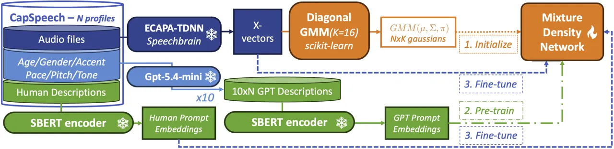
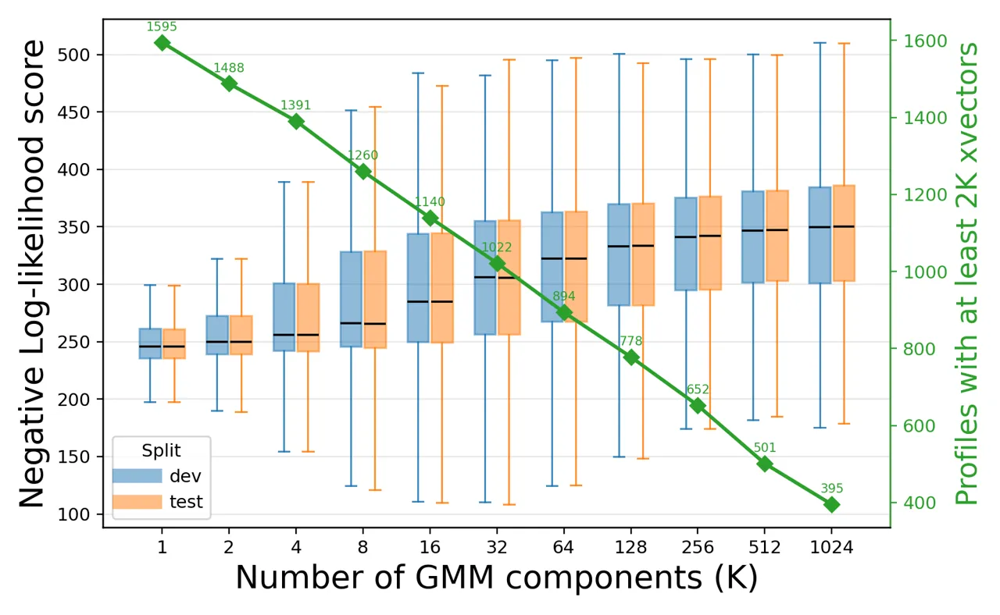
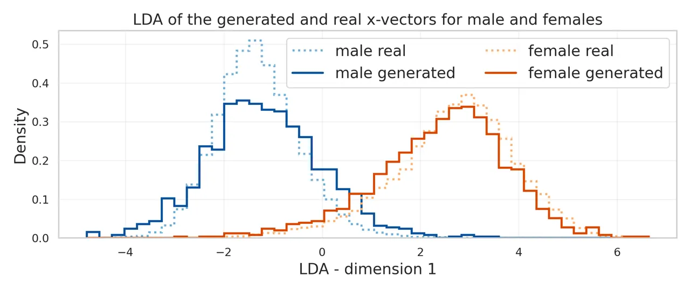
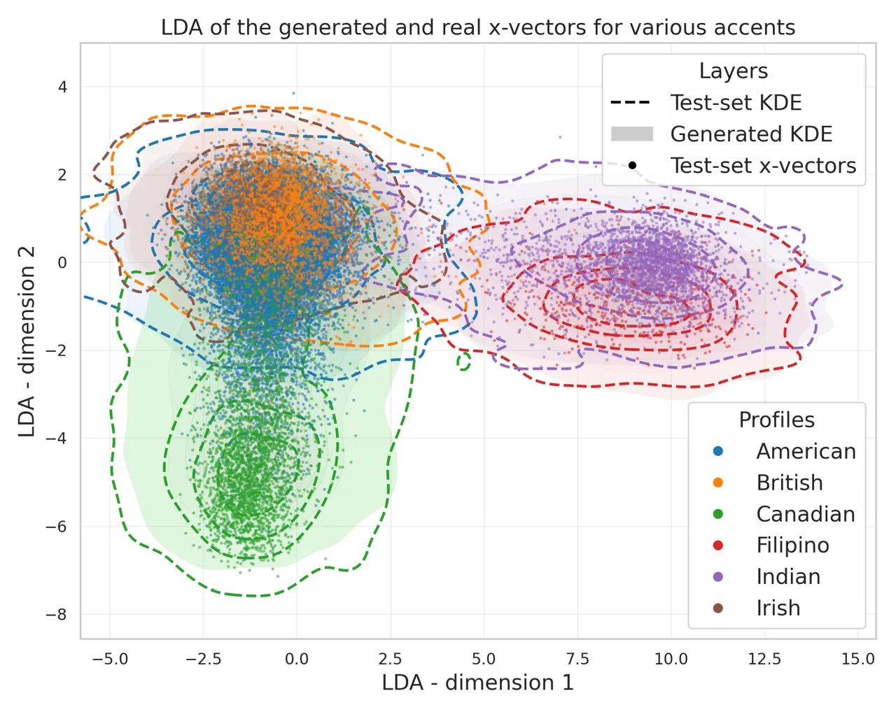

# ProPS: Prompted Profile Synthesis for Natural Language-Conditioned Speaker Embedding Distributions

Thomas Thebaud¹², Junhyeok Lee¹, Laureano Moro-Velazquez¹³, Jesus
Villalba Lopez¹, Najim Dehak¹ ^(†)^(†)thanks: Work done at the Johns
Hopkins University. Affiliation: ¹Department of Electrical and Computer
Engineering, Johns Hopkins University, Baltimore, MD, USA
Affiliation: ²AMIAD, Palaiseau, France. Email:
thomas.thebaud@polytechnique.edu Affiliation: ³Department of Signal
Theory and Communications, Universidad Carlos III de Madrid (UC3M),
Leganes, Spain

###### Abstract

Speaker embeddings, or x-vectors, are widely used to represent speaker
identity and speaker-related attributes, but existing embedding
extractors are typically descriptive rather than generative: they map an
observed speech segment to an x-vector, which is then used for
downstream applications. We introduce ProPS, Prompted Profile Synthesis,
a framework for generating distributions of speaker embeddings
conditioned on natural language prompts such as ”a thirties male speaker
with an Indian accent”. ProPS converts human-written profile
descriptions into sentence embeddings and uses a mixture density network
trained on a large-scale dataset to predict a Gaussian mixture model in
the x-vector space. The model is trained by maximizing the likelihood
that real speaker embeddings match the requested profile, and its
generated distributions are evaluated by negative log-likelihood on
held-out x-vectors and by attribute classification accuracies on sampled
synthetic x-vectors. Experiments show that ProPS produces
profile-conditioned distributions and generates x-vectors that preserve
requested speaker attributes such as age, gender, accent, and prosodic
characteristics. This design enables controllable speaker-profile
synthesis for speech generation systems like Text-To-Speech (TTS) or
Voice Conversion (VC) while anchoring generated distributions in
observed speaker-embedding structure.

###### Index Terms: 

X-vectors, mixture density networks, controllable generation, synthetic
speakers, natural language prompts

## I Introduction

Human voices carry information beyond linguistic content, including
speaker identity, demographic background, accent, speaking style,
prosody, and recording conditions. A large body of work has studied how
to extract, represent, compare, and profile speaker identities from
speech signals. As speech technologies become increasingly generative
and controllable, modeling not only individual identities but also
broader speaker profiles becomes an important research problem.

Neural speaker embeddings, commonly referred to as x-vectors \[1\], are
now the dominant representation for speaker information. They map speech
segments to fixed-dimensional vectors that capture speaker-related
characteristics while abstracting away from the raw waveform. X-vectors
and related embeddings are widely used in speaker verification \[1\],
diarization \[2\], voice conversion \[3\], anonymization \[4\],
text-to-speech \[5\], speaker profiling \[6\], and healthcare
applications \[7\]. In generative systems, they often serve as compact
conditioning variables for synthesizing, converting, or adapting speech
toward a desired voice identity.

When reference audio is available, an enrollment utterance can be used
to extract the desired x-vector. Without such audio, controllable
generation of new speaker identities remains limited. Existing
approaches often sample synthetic embeddings from distributions fitted
to training x-vectors, such as Gaussian mixture models or PLDA-style
priors. While these methods can generate new points in speaker space,
their controllability is constrained by the labels, structure, and
biases of the data used to estimate the distribution.

We propose ProPS, Prompted Profile Synthesis, a framework for natural
language-conditioned generation of x-vector distributions. Instead of
sampling x-vectors from an unconditional or weakly conditioned speaker
prior, ProPS takes a text prompt describing a speaker profile (such as
”a young female speaker with an Indian accent and a fast pace”) and
generates a Gaussian mixture model in the x-vector space. The prompt is
embedded using a sentence encoder, and a mixture density network maps
this representation to a profile-conditioned distribution over speaker
embeddings. In this way, ProPS treats natural language as a flexible
control interface for speaker-profile synthesis, enabling users to
describe desired speaker characteristics directly rather than selecting
from a fixed set of predefined classes.

Our contributions are as follows:

1.  1.  We introduce the task of natural language-conditioned
        speaker-distribution synthesis, where a free-form textual
        description is used to generate a full distribution over x-vectors
        rather than sampling a single speaker embedding.
2.  2.  We propose ProPS, a prompt-conditioned mixture density network that
        maps sentence-level text embeddings to Gaussian mixture models in
        the x-vector space.¹¹ 1
        [https://huggingface.co/ThomasThebaud/PROPS_K16](https://huggingface.co/ThomasThebaud/PROPS_K16)
3.  3.  We leverage the large-scale CapSpeech \[8\] speaker-profile data to
        learn associations between natural language descriptions, speaker
        attributes, prosodic characteristics, and observed x-vector
        distributions.
4.  4.  We evaluate the generated x-vector distributions using held-out
        negative log-likelihood and downstream attribute classifiers,
        measuring both distributional fit and controllability with respect
        to gender, age, accent, and prosodic characteristics.

## II Related Work

### II-A Speaker Embeddings

Speaker embeddings provide compact fixed-dimensional representations of
speaker identity and related characteristics. Early systems relied on
i-vectors, which modeled speakers in a low-dimensional latent space
derived from Gaussian mixture model supervectors and became a standard
approach for speaker verification \[9\]. Deep neural speaker embeddings,
or x-vectors, later improved robustness and verification performance by
training neural networks to discriminate among speakers \[1\]. More
recent architectures such as ECAPA-TDNN further improved speaker
representation learning through channel attention, propagation, and
multi-layer feature aggregation, producing embeddings widely used in
speaker recognition, voice conversion, speech synthesis, and other
speaker-conditioned generation tasks \[10\].

### II-B Mixture Density Networks

Mixture Density Networks (MDNs) were introduced by Bishop \[11\] to
model multimodal conditional distributions by combining neural networks
with Gaussian mixture models. Originally motivated by inverse problems
such as robot inverse kinematics, MDNs address situations where multiple
valid outputs may correspond to the same input, a setting in which
conventional regression networks tend to predict only the conditional
mean. This property makes MDNs particularly well suited to
speaker-profile synthesis, where a single textual description may
correspond to many plausible speaker identities.

### II-C Natural Language Representations

Transformer architectures have reshaped natural language processing by
enabling large-scale self-supervised learning of contextualized token
representations through self-attention \[12\]. BERT demonstrated that
bidirectional transformer pretraining on large text corpora could
produce transferable representations for many downstream NLP
tasks \[13\]. Sentence-BERT (SBERT) extended this paradigm to
sentence-level representation learning by using a Siamese transformer
architecture optimized for semantic similarity, producing
fixed-dimensional embeddings that capture sentence meaning and can be
efficiently compared with vector operations \[14\]. These properties
make SBERT embeddings well suited for natural language conditioning in
downstream generative models.

### II-D Generating X-vectors from natural language prompts

PromptSpeaker \[15\] is closely related to our work, as it also
addresses the generation of speaker embeddings from natural language
descriptions. In this approach, a prompt encoder maps each textual
description to the parameters of a Gaussian distribution in a semantic
latent space, and semantic embeddings sampled from this distribution are
then transformed into x-vectors through an invertible Glow model \[16\].
This formulation enables multiple speaker embeddings to be generated
from the same prompt, but the diversity of the generated x-vectors is
controlled indirectly through sampling in the semantic space and is
constrained by a single Gaussian distribution. In contrast, ProPS
directly models a prompt-conditioned Gaussian mixture distribution in
x-vector space, providing explicit control over the generated
speaker-embedding distribution. Such control is important for downstream
voice conversion and text-to-speech applications, where generated voices
should not only match the requested profile but also remain diverse and
distinct from existing speakers.



Fig. 1: Overview of the training pipeline of ProPS.

## III Method

### III-A Problem Formulation

Let $`p`$ denote a natural language prompt describing a speaker profile,
and let $`e=f_{\mathrm{text}}(p)\in\mathbb{R}^{d_{t}}`$ be the
corresponding text embedding. Let $`x\in\mathbb{R}^{D}`$ denote an
ECAPA-TDNN speaker embedding extracted from a speech segment. The goal
is to learn a conditional density:

```math
q_{\theta}(x\mid p)=q_{\theta}(x\mid e) \tag{1}
```

where $`q_{\theta}`$ is a GMM predicted by a neural network. For a
$`K`$-component GMM:

```math
q_{\theta}(x\mid e)=\sum_{k=1}^{K}\pi_{k}(e)\mathcal{N}\left(x;\mu_{k}(e),\mathrm{diag}(\sigma_{k}^{2}(e))\right) \tag{2}
```

where $`\pi_{k}(e)`$ are non-negative mixture weights that sum to one,
$`\mu_{k}(e)`$ are component means, and $`\sigma_{k}(e)`$ are diagonal
standard deviations.

Given a training set of profile descriptions and matching real
x-vectors, the model is trained by minimizing negative log likelihood:

```math
\mathcal{L}_{\mathrm{NLL}}(\theta)=-\frac{1}{N}\sum_{i=1}^{N}\log q_{\theta}(x_{i}\mid e_{i}). \tag{3}
```

Optional regularization terms encourage stable mixture weights, useful
entropy, and bounded variance, but the primary objective is likelihood
of real x-vectors under the prompt-conditioned distribution.

### III-B Dataset and Profile Description Protocol

#### III-B1 Dataset

We train and evaluate ProPS on CapSpeech \[8\], a large-scale
speaker-profile dataset assembled from GigaSpeech \[17\], the English
subsets of CommonVoice \[18\], MLS \[19\], and Emilia \[20\]. CapSpeech
associates speech segments with structured speaker-profile metadata,
including demographic attributes such as age, gender, and accent, as
well as prosodic descriptors such as pitch, pace, and tone. Each audio
segment is also associated with a human-written description.

#### III-B2 Profile characteristics

The full dataset contains more than 31k hours of speech and 9372k
segments (of which 9275k are in the train split, 48k are in the
development, and 48k are in the test split). We select only profiles
with at least 100 corresponding segments, yielding 942 profiles spanning
gender, age, accent, pitch, pace, and tone attributes. They include:

- •
  Pitch: very low, low, slightly low, moderate, slightly high, high,
  very high
- •
  Age: teenager, young adult, middle-aged adult, elderly
- •
  Gender: female, male
- •
  Pace: slowly, slightly slow, moderate speed, slightly fast, fast, very
  fast
- •
  Tone: very monotone, monotone, slightly expressive and animated,
  expressive and animated, very expressive and animated
- •
  Accent: American, Australian, Belgian, Brazilian, British, Canadian,
  Cantonese, Czech, English, Filipino, French, German, Hungarian,
  Indian, Irish, Italian, Japanese, New Zealand, Norwegian, Russian,
  Scottish, Slovenian, Welsh

#### III-B3 Generated descriptions

To connect structured profiles with free-form natural language, we use
both generated descriptions and human-written descriptions. We generate
textual descriptions for each unique profile by submitting the
corresponding attribute combination to ChatGPT (model
gpt-5.4-mini-2026-03-17) \[21\] and requesting 10 concise yet distinct
natural-language descriptions of the same speaker profile. For example,
a structured profile containing gender=male, age=thirties,
accent=Indian, and pace=measured may be rendered as "a thirties male
with an Indian accent speaking with a measured tone". The 10
GPT-generated descriptions for each profile will later be referred to as
descriptions 1 through 10.

#### III-B4 Embedding extraction

Prior to training, the semantic and speaker embeddings are extracted
using their corresponding encoders. Each natural language description,
both human-written and GPT-generated, is encoded with a pre-trained
sentence BERT \[14\] (SBERT model all-MiniLM-L6-v2), yielding
384-dimensional semantic embeddings. Each spoken utterance is encoded
using a pretrained ECAPA-TDNN model \[10\] from the speechbrain
toolkit \[22\] with dimensionality $`D=192`$.

### III-C Proposed Architecture

Assume that the training set contains $`N`$ unique speaker profiles. For
each profile, we precompute a diagonal-covariance GMM with $`K`$
Gaussian components from the x-vectors associated with that profile. The
collection of these profile-level GMMs defines a shared component bank
with $`N\times K`$ Gaussian components. Each component has a mean vector
$`\mu\in\mathbb{R}^{D}`$ and a diagonal standard deviation vector
$`\sigma\in\mathbb{R}^{D}`$, where $`D=192`$ is the x-vector
dimensionality.

Given a natural language prompt, ProPS first computes an SBERT embedding
$`e\in\mathbb{R}^{384}`$. This embedding is fed into a three-layer
multilayer perceptron with hidden dimensions 1024, 2048, and 1024. The
MLP outputs $`N\times K`$ logits, which are transformed with a softmax
to obtain mixture weights over the full component bank
$`\pi(e)=\mathrm{softmax}\left(\mathrm{MLP}_{\theta}(e)\right)`$ with
$`\pi(e)\in\mathbb{R}^{NK}`$. The Gaussian means and diagonal standard
deviations of the MDN are trainable parameters, initialized from the
precomputed profile GMMs: $`\mu\in\mathbb{R}^{NK\times D}`$ and
$`\sigma\in\mathbb{R}^{NK\times D}`$. The resulting conditional density
is therefore

```math
q_{\theta}(x\mid e)=\sum_{j=1}^{NK}\pi_{j}(e)\mathcal{N}\left(x;\mu_{j},\mathrm{diag}(\sigma_{j}^{2})\right). \tag{4}
```

In this architecture, the text encoder and MLP learn how a natural
language prompt should select and combine components from the bank of
observed speaker-profile distributions. The component means and
variances provide an initialization grounded in real x-vector
statistics, while the learned mixture weights provide prompt-level
controllability.

### III-D Three-Stage Training Procedure

The training proceeds in three stages:

#### III-D1 Initialization: Profile-wise GMMs

First, for each of the $`N`$ profiles in the training set, we collect
all associated x-vectors and fit a diagonal-covariance GMM using
scikit-learn \[23\]. Each profile GMM contains $`K`$ Gaussian components
and estimates profile-specific mixture weights, means, and diagonal
standard deviations directly from real x-vectors. The resulting $`N`$
profile GMMs define a shared component bank with $`N\times K`$ Gaussian
components. Their means and diagonal standard deviations are used to
initialize the trainable MDN parameters $`\mu`$ and $`\sigma`$.

#### III-D2 Pre-training: Setting the Mixture Weights

Second, we train the MLP to predict mixture weights over the full
$`N\times K`$ component bank from semantic prompt embeddings. For each
profile, GPT-generated descriptions 3 through 10 are used as training
prompts. The SBERT embedding $`e`$ of each description is passed through
the MLP, which outputs a distribution $`\pi(e)`$ over all $`N\times K`$
Gaussian components. The target distribution is constructed from the
precomputed GMM of the corresponding profile: the $`K`$ components
associated with that profile receive their precomputed mixture weights,
while all other components receive zero weight. Validation is performed
using GPT-generated description 2 on the development set. This stage
teaches $`\mathrm{MLP}_{\theta}(e)`$ to map paraphrased profile
descriptions to the appropriate region of the component bank.

#### III-D3 Fine-tuning: End-to-End Training with Human Descriptions

Third, the MDN is fine-tuned end-to-end using human-written descriptions
and their associated x-vectors. Each training example consists of a
natural language speaker description and a corresponding target
x-vector. The description is encoded with SBERT, passed through the MLP
to produce prompt-conditioned mixture weights, and the likelihood of the
target x-vector is computed under the resulting GMM. The model is
optimized by minimizing the negative log-likelihood loss in Eq. 3.
During fine-tuning, the model updates both the prompt-conditioned
mixture weights and the Gaussian parameters to improve the fit between
generated speaker-profile distributions and observed x-vectors. This
final stage aligns the model with real human descriptions and encourages
the generated distributions to preserve both demographic and prosodic
speaker characteristics.

### III-E Inference

At inference time, ProPS takes a natural-language prompt describing the
desired speaker profile. The prompt is encoded with SBERT and passed
through the trained MLP to obtain mixture weights over the $`N\times K`$
Gaussian component bank. Together with the fine-tuned means and diagonal
standard deviations, these weights define a prompt-conditioned GMM in
the x-vector space. Synthetic speaker embeddings are then generated by
sampling from this GMM. The generated x-vectors can be used directly for
downstream analysis or as conditioning representations for
speaker-dependent speech generation systems.

## IV Experimental Setup

### IV-A Training Configuration

All experiments are run either on CPU nodes or on NVIDIA GTX 1080 Ti
GPUs. The ProPS MDN is initialized from the profile-level GMMs described
in Section III. Unless otherwise specified, these GMMs are computed on
the CapSpeech training set with $`K=16`$ diagonal Gaussian components
per profile. The resulting means and diagonal standard deviations
initialize the Gaussian component bank of the MDN, while the MLP is
trained to predict the corresponding mixture weights from natural
language prompt embeddings.

Training proceeds in two neural optimization stages. First, the MDN is
pretrained for 100 epochs using the GPT-generated profile descriptions
and a cross-entropy loss on the precomputed GMM mixture weights. This
stage uses a learning rate of $`10^{-4}`$ and is run until the
development loss converges. Second, the initialized MDN is fine-tuned
for 100 epochs on the CapSpeech training set using human speaker
descriptions and their associated x-vectors. This fine-tuning stage uses
a negative log-likelihood loss and a learning rate of $`10^{-5}`$.
Training is stopped after convergence of the NLL on the development set.
The training and evaluation code is available on GitHub²² 2
[https://github.com/thomasthebaud/PROPS](https://github.com/thomasthebaud/PROPS).

### IV-B Choosing the Number of Gaussian Components

The number of Gaussian components $`K`$ controls the expressiveness of
the profile-level GMMs used to initialize ProPS. A small value of $`K`$
may underfit the diversity of x-vectors within a profile, while a large
value of $`K`$ may overfit individual training samples and reduce the
number of profiles for which a valid GMM can be estimated. To select an
appropriate value, we fit independent profile-level GMMs on the
CapSpeech training set with $`K\in\{2^{N}|N\in[\![0,8]\!]\}`$. For each
value of $`K`$, we compute the negative log-likelihood of held-out
development and test x-vectors under the corresponding
profile-conditioned GMMs.

Because we use diagonal covariance matrices, each Gaussian component
must be estimated from a sufficient number of x-vectors. We therefore
require at least two x-vectors per Gaussian component, meaning that a
profile is considered valid for a given $`K`$ only if it contains at
least $`2K`$ training x-vectors. As $`K`$ increases, the number of valid
profiles decreases. We report both the development and test NLL and the
number of valid training profiles for each value of $`K`$.

### IV-C Impact of Each Training Stage

We performed an ablation study to quantify the contribution of each
stage of the ProPS pipeline. Specifically, we compare the four steps of
model training using development and test negative log-likelihood:

1.  1.  Random GMMs: the randomly initialized GMMs with $`K=16`$ and
        diagonal covariances. This model is independent of the prompt.
2.  2.  Precomputed GMMs: the GMMs trained on each individual profile. Each
        GMM is scored against the vectors matching its profile, but no
        description is used.
3.  3.  Pretrained MDN: the pretrained network is evaluated both on the
        human-written description from CapSpeech and the unseen GPT
        descriptions (index 0 for the test and 1 for the dev).
4.  4.  Fine-tuned MDN: the final system is evaluated on the same prompts as
        the Pretrained system, but it has also seen human prompts during
        finetuning.

We expect the random model to obtain the worst NLL, since it is not
anchored in the observed x-vector distribution. The precomputed GMMs
should provide a strong likelihood baseline. The pretrained MDN should
slightly degrade performance, as it learns to match natural-language
prompts to the correct GMMs. Finally, the fine-tuned MDN should improve
the NLL on the human descriptions.

### IV-D Evaluation of Speaker-Characteristic Accuracy

We evaluate whether the generated x-vectors preserve the requested
speaker characteristics using downstream attribute classifiers. For each
characteristic, such as gender, age, accent, pitch, pace, or tone, we
construct minimal natural language prompts that specify only that
characteristic. For example, for the gender characteristic, we use
prompts such as ”a male speaker” and ”a female speaker.” Each prompt is
passed through the trained ProPS model to generate a
characteristic-conditioned GMM.

To measure whether the generated distribution encodes the requested
attribute, we train a support vector machine classifier on real
development-set x-vectors. The classifier is trained separately for each
characteristic, for example, to distinguish male from female speakers
for gender classification. For independent classes (gender and accent)
we use a SVC, but for classes that present an order of labels (age,
pace, pitch, tone), we attribute each class to a number and train a SVR
model. SVR predictions are rounded/clipped to the nearest class before
computing accuracy. We first evaluate the classifier on real test-set
x-vectors to estimate the accuracy achievable on real held-out speech
embeddings. We then sample 10,000 synthetic x-vectors from each
generated GMM and evaluate the same classifier on these generated
samples.

## V Results

### V-A Effect of the Number of Gaussian Components

We first study the effect of the number of Gaussian components in the
profile-level GMMs. We compare values $`K\in\{2^{n}:n=0,\ldots,8\}`$ and
evaluate train, development, and test negative log-likelihood. As shown
in Fig. 2, increasing $`K`$ improves the fit to held-out x-vectors but
reduces the number of profiles with enough data for training. Since the
NLL stabilizes for $`K\geq 16`$, we use $`K=16`$ in the remaining
experiments to balance likelihood and profile coverage. Models trained
with other values of $`K`$ did not show meaningful differences in the
following experiments and are therefore omitted.



Fig. 2: Log-likelihood of the dev and test sets as a function of the
number of Gaussian components per profile. Models are compared for
$`1\leq K\leq 1024`$. For each $`K`$, the number of profiles with at
least $`2K`$ segments is also shown in green.

### V-B Effect of the Fine-tuning

We evaluate the contribution of the different initialization and
training stages by comparing log-likelihood scores on development and
test x-vectors. Table I reports the LL obtained when the conditioning
prompt is either GPT-generated or human-written. For the test set, we
use the held-out GPT-generated description number 1 and the
human-written CapSpeech descriptions. For the development set, we use
GPT-generated description 2 and the human-written CapSpeech
descriptions. A Welch’s T-test is performed using the SciPy
toolkit \[24\] between consecutive lines of results to verify whether
the differences are significant.

| Model            | Test  |       | Dev   |       |
| ---------------- | ----- | ----- | ----- | ----- |
|                  | GPT 1 | Human | GPT 2 | Human |
| Precomputed GMMs | 303.8 | 303.1 | 303.6 | 302.9 |
| Pretrained MDN   | 304.2 | 303.5 | 304.0 | 303.4 |
| Fine-tuned MDN   | 305.3 | 309.1 | 303.7 | 308.9 |

TABLE I: LL scores$`\uparrow`$ between the real x-vectors and the
distributions computed from GPT-generated prompts and human-written
prompts, by different models. Highest results in bold, Underlined
results are significantly different from the line above (here
p-value$`\leq 10^{-3}`$)

The precomputed GMMs already provide a strong likelihood baseline, as
expected given the existing literature on modeling speaker behavior with
GMMs \[25, 26, 27\]. However, this baseline does not include any
controllability, which will be added in the next training stage.

The pretrained MDN performs similarly to the GPT descriptions,
indicating that the pretraining efficiently matched the artificial
prompts to the correct GMMs. The human-written descriptions show a
non-significantly lower likelihood, suggesting that the GPT descriptions
generated from the characteristics were semantically close to the
human-written descriptions.

Fine-tuning brought a significant improvement in the human descriptions
and a non-significant drop in the GPT-generated descriptions of the test
set, compared with the dev set (p-value=0.21).

### V-C Qualitative Analysis of Generated X-Vector Distributions

Additionally, we provide LDA visualizations of the generated x-vectors
compared to real x-vectors for various groups. For a given
characteristic (accent=british, for example), we provide a simplified
description (”a person with a british accent”) to the fine-tuned model,
get the predicted GMM, and sample 10,000 generated x-vectors from it. An
LDA is trained on all the real x-vectors of the dev set corresponding to
the set of categories selected, and the generated and real x-vectors
from the test set are projected into this LDA. Figure 3 shows the
histogram of the male and female x-vectors on the LDA dimension, while
Figure 4 shows the distribution of the real and generated x-vectors for
the American, Canadian, British, Filipino, Indian, Indian and Irish
accents on the first 2 dimensions of the LDA. A subset of accents has
been selected, the ones with over 250 samples in the test set, to help
with the readability. Both figures show a clear separation of the
different groups of x-vectors, as well as a close match between the
generated distributions and the real x-vectors.



Fig. 3: LDA visualization of generated and real x-vector distributions
for males and females. The LDA is trained on the real dev-set x-vectors.

| Characteristic | Real | Generated | $`\#`$ classes | Classifier |
| -------------- | ---- | --------- | -------------- | ---------- |
| Gender         | 99.1 | 98.4      | 2              | SVC        |
| Age            | 59.8 | 65.4      | 4              | SVR        |
| Accent         | 93.4 | 91.6      | 23             | SVC        |
| Tone           | 21.9 | 23.8      | 5              | SVR        |
| Pitch          | 37.5 | 28.2      | 7              | SVR        |
| Pace           | 37.4 | 31.6      | 5              | SVR        |

TABLE II: Speaker-characteristic classification accuracy. Real accuracy
measures performance on the real x-vectors of the test set, Generated
accuracy measures performance on x-vectors sampled from generated GMMs.

### V-D Speaker-Characteristic Accuracy

Table II shows the classification accuracy obtained for each speaker
characteristic on real and generated x-vectors. Overall, the generated
samples preserve the requested characteristics well when those
characteristics are strongly encoded in the x-vector space. For gender
and accents, the SVM reaches high accuracies on real and generated
x-vectors, showing that ProPS almost perfectly preserves the requested
information. Age is also well preserved despite a lower accuracy.
Interestingly, generated x-vectors obtain higher accuracy than real
ones, suggesting that the generated age-conditioned GMMs may produce
cleaner or more prototypical age distributions than the real held-out
data, although age remains less separable than gender or accent.

The prosodic characteristics are more challenging. For the tone, both
real and generated accuracies are much lower, close to chance for a
five-class problem. This suggests that tone is poorly represented in the
x-vector space or that the SVM is unable to reliably recover it. Pitch
and pace show moderate real-test accuracies, but the generated
accuracies drop by 9.3 and 5.8 absolute points, respectively. These gaps
indicate that ProPS does not reliably preserve prosodic attributes,
unlike demographic or accent-related attributes. This may reflect the
fact that x-vectors are primarily optimized for speaker identity rather
than detailed prosodic control, and that pitch and pace may be more
sensitive to utterance-level variation than to stable speaker-profile
structure. Overall, the results show that ProPS can generate
controllable x-vectors for gender, accent, and age, but less reliable
representations for finer-grained prosodic characteristics.



Fig. 4: LDA visualization of generated and real x-vector distributions
for the following accents: American, British, Canadian, Filipino,
Indian, Irish. The LDA is trained on the real dev-set x-vectors.

## VI Conclusion

We presented ProPS, a framework for generating speaker-embedding
distributions from natural language descriptions. ProPS maps free-form
prompts to Gaussian mixture models in x-vector space using SBERT
embeddings and a mixture density network initialized from profile-wise
GMMs estimated on CapSpeech. Experiments show that the proposed approach
provides a strong match to real x-vector distributions, with $`K=16`$
offering a practical trade-off between likelihood and profile coverage.
The ablation study confirms the contribution of each training stage: GMM
initialization anchors the model in real speaker space, pretraining
associates generated prompts with profile components, and fine-tuning on
human descriptions improves likelihood for realistic inputs.

Generated distributions preserve key speaker characteristics, especially
gender, accent, and age, demonstrating that natural language can provide
an effective control interface for speaker-profile synthesis in
embedding space. In contrast, prosodic attributes such as pace, pitch,
and tone are less reliably controlled, which is consistent with the fact
that x-vectors are primarily designed to encode speaker identity rather
than dynamic speaking style.

The method remains limited by the coverage and quality of CapSpeech
profile labels and descriptions, and may inherit dataset biases or
perform poorly for rare or ambiguous profiles. In addition, the current
experiments are restricted to English data, limiting the range of usable
descriptors and multilingual generalization. Future work will integrate
ProPS-generated embeddings into downstream speech generation systems,
evaluate perceptual quality and controllability after waveform
generation, and explore richer multilingual speaker representations that
better capture prosody and style.

## Acknowledgment

Generative AI tools were used during the preparation of this manuscript
to assist with drafting, reformulation, and organization. All technical
content, experimental design, benchmark implementation, results, and
scientific claims were defined, verified, and edited by the authors.

This work was supported by the Office of the Director of National
Intelligence (ODNI), Intelligence Advanced Research Projects Activity
(IARPA), via the ARTS Program under contract D2023-2308110001. The views
and conclusions contained herein are those of the authors and should not
be interpreted as necessarily representing the official policies, either
expressed or implied, of ODNI, IARPA, or the U.S. Government. The U.S.
Government is authorized to reproduce and distribute reprints for
governmental purposes notwithstanding any copyright annotation therein.

## References

- \[1\] D. Snyder, D. Garcia-Romero, G. Sell, D. Povey, and S.
  Khudanpur (2018) X-vectors: robust dnn embeddings for speaker
  recognition. In 2018 IEEE international conference on acoustics,
  speech and signal processing (ICASSP), pp. 5329–5333. External Links:
  [Document](https://dx.doi.org/10.1109/ICASSP.2018.8461375) Cited by:
  §I, §II-A.
- \[2\] P. Pálka, J. Han, M. Delcroix, N. Tawara, and L. Burget (2026)
  Vbx for end-to-end neural and clustering-based diarization. In ICASSP
  2026-2026 IEEE International Conference on Acoustics, Speech and
  Signal Processing (ICASSP), pp. 17472–17476. Cited by: §I.
- \[3\] K. Qian, Y. Zhang, S. Chang, X. Yang, and M.
  Hasegawa-Johnson (2019) Autovc: zero-shot voice style transfer with
  only autoencoder loss. In International Conference on Machine
  Learning, pp. 5210–5219. Cited by: §I.
- \[4\] B. M. L. Srivastava, M. Maouche, M. Sahidullah, E. Vincent, A.
  Bellet, M. Tommasi, N. Tomashenko, X. Wang, and J. Yamagishi (2022)
  Privacy and utility of x-vector based speaker anonymization. IEEE/ACM
  Transactions on Audio, Speech, and Language Processing 30,
  pp. 2383–2395. Cited by: §I.
- \[5\] E. Cooper, C. Lai, Y. Yasuda, F. Fang, X. Wang, N. Chen, and J.
  Yamagishi (2020) Zero-shot multi-speaker text-to-speech with
  state-of-the-art neural speaker embeddings. In ICASSP 2020-2020 IEEE
  International Conference on Acoustics, Speech and Signal Processing
  (ICASSP), pp. 6184–6188. Cited by: §I.
- \[6\] Y. Yang, T. Thebaud, and N. Dehak (2025) Demographic attributes
  prediction from speech using wavlm embeddings. In 2025 59th Annual
  Conference on Information Sciences and Systems (CISS), pp. 1–6. Cited
  by: §I.
- \[7\] A. Favaro, Y. Tsai, A. Butala, T. Thebaud, J. Villalba, N.
  Dehak, and L. Moro-Velázquez (2023) Interpretable speech features vs.
  dnn embeddings: what to use in the automatic assessment of parkinson’s
  disease in multi-lingual scenarios. Computers in Biology and Medicine
  166, pp. 107559. Cited by: §I.
- \[8\] H. Wang, J. Hai, D. Chong, K. Thakkar, T. Feng, D. Yang, J.
  Lee, T. Thebaud, L. M. Velazquez, J. Villalba, et al. (2025)
  Capspeech: enabling downstream applications in style-captioned
  text-to-speech. arXiv preprint arXiv:2506.02863. Cited by: item 3,
  §III-B1.
- \[9\] N. Dehak, P. J. Kenny, R. Dehak, P. Dumouchel, and P.
  Ouellet (2010) Front-end factor analysis for speaker verification.
  IEEE Transactions on Audio, Speech, and Language Processing 19 (4),
  pp. 788–798. Cited by: §II-A.
- \[10\] B. Desplanques, J. Thienpondt, and K. Demuynck (2020)
  Ecapa-tdnn: emphasized channel attention, propagation and aggregation
  in tdnn based speaker verification. arXiv preprint arXiv:2005.07143.
  Cited by: §II-A, §III-B4.
- \[11\] C. M. Bishop (1994) Mixture density networks. Cited by: §II-B.
- \[12\] A. Vaswani, N. Shazeer, N. Parmar, J. Uszkoreit, L.
  Jones, A. N. Gomez, Ł. Kaiser, and I. Polosukhin (2017) Attention is
  all you need. Advances in neural information processing systems 30.
  Cited by: §II-C.
- \[13\] J. Devlin, M. Chang, K. Lee, and K. Toutanova (2019) Bert:
  pre-training of deep bidirectional transformers for language
  understanding. In Proceedings of the 2019 conference of the North
  American chapter of the association for computational linguistics:
  human language technologies, volume 1 (long and short papers),
  pp. 4171–4186. Cited by: §II-C.
- \[14\] N. Reimers and I. Gurevych (2019) Sentence-bert: sentence
  embeddings using siamese bert-networks. In Proceedings of the 2019
  Conference on Empirical Methods in Natural Language Processing,
  External Links: [Link](https://arxiv.org/abs/1908.10084) Cited by:
  §II-C, §III-B4.
- \[15\] Y. Zhang, G. Liu, Y. Lei, Y. Chen, H. Yin, L. Xie, and Z.
  Li (2023) Promptspeaker: speaker generation based on text
  descriptions. In 2023 IEEE Automatic Speech Recognition and
  Understanding Workshop (ASRU), pp. 1–7. Cited by: §II-D.
- \[16\] D. P. Kingma and P. Dhariwal (2018) Glow: generative flow with
  invertible 1x1 convolutions. Advances in neural information processing
  systems 31. Cited by: §II-D.
- \[17\] G. Chen, S. Chai, G. Wang, J. Du, W. Zhang, C. Weng, D. Su, D.
  Povey, J. Trmal, J. Zhang, et al. (2021) Gigaspeech: an evolving,
  multi-domain asr corpus with 10,000 hours of transcribed audio. arXiv
  preprint arXiv:2106.06909. Cited by: §III-B1.
- \[18\] R. Ardila, M. Branson, K. Davis, M. Henretty, M. Kohler, J.
  Meyer, R. Morais, L. Saunders, F. M. Tyers, and G. Weber (2019) Common
  voice: a massively-multilingual speech corpus. arXiv preprint
  arXiv:1912.06670. Cited by: §III-B1.
- \[19\] V. Pratap, Q. Xu, A. Sriram, G. Synnaeve, and R.
  Collobert (2020) Mls: a large-scale multilingual dataset for speech
  research. arXiv preprint arXiv:2012.03411. Cited by: §III-B1.
- \[20\] H. He, Z. Shang, C. Wang, X. Li, Y. Gu, H. Hua, L. Liu, C.
  Yang, J. Li, P. Shi, et al. (2024) Emilia: an extensive, multilingual,
  and diverse speech dataset for large-scale speech generation. In 2024
  IEEE Spoken Language Technology Workshop (SLT), pp. 885–890. Cited by:
  §III-B1.
- \[21\] OpenAI, J. Achiam, S. Adler, S. Agarwal, L. Ahmad, et
  al. (2024) GPT-4 technical report. External Links: 2303.08774,
  [Link](https://arxiv.org/abs/2303.08774) Cited by: §III-B3.
- \[22\] M. Ravanelli, T. Parcollet, P. Plantinga, A. Rouhe, S.
  Cornell, L. Lugosch, C. Subakan, N. Dawalatabad, A. Heba, J. Zhong, J.
  Chou, S. Yeh, S. Fu, C. Liao, E. Rastorgueva, F. Grondin, W. Aris, H.
  Na, Y. Gao, R. D. Mori, and Y. Bengio (2021) SpeechBrain: a
  general-purpose speech toolkit. Note: arXiv:2106.04624 External Links:
  2106.04624 Cited by: §III-B4.
- \[23\] O. Kramer (2016) Scikit-learn. In Machine learning for
  evolution strategies, pp. 45–53. Cited by: §III-D1.
- \[24\] P. Virtanen, R. Gommers, T. E. Oliphant, M. Haberland, T.
  Reddy, D. Cournapeau, E. Burovski, P. Peterson, W. Weckesser, J.
  Bright, et al. (2020) SciPy 1.0: fundamental algorithms for scientific
  computing in python. Nature methods 17 (3), pp. 261–272. Cited by:
  §V-B.
- \[25\] J. McLaughlin, D. A. Reynolds, and T. P. Gleason (1999) A study
  of computation speed-ups of the gmm-ubm speaker recognition system..
  In EUROSPEECH, Vol. 99, pp. 1215–1218. Cited by: §V-B.
- \[26\] R. Zheng, S. Zhang, and B. Xu (2004) Text-independent speaker
  identification using gmm-ubm and frame level likelihood normalization.
  In 2004 International Symposium on Chinese Spoken Language Processing,
  pp. 289–292. Cited by: §V-B.
- \[27\] M. T. Al-Kaltakchi, W. L. Woo, S. S. Dlay, and J. A.
  Chambers (2017) Comparison of i-vector and gmm-ubm approaches to
  speaker identification with timit and nist 2008 databases in
  challenging environments. In 2017 25th European signal processing
  conference (EUSIPCO), pp. 533–537. Cited by: §V-B.
