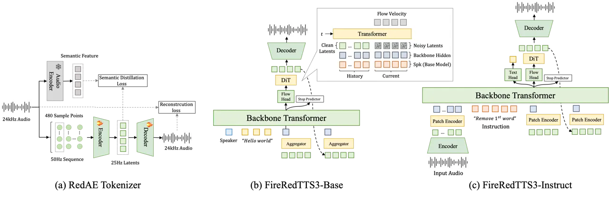

# FireRedTTS3: Unified Speech Generation and Editing with Semantically Enriched Speech Representations

Feiyu Shen    Kun Xie    Yichen Wu    Ziqi Dai    Yichen Han    Junjie
Li Affiliation: Xuelong Geng, Fenglong Xie, Lei Xie, Xu Tang, Yao Hu
Affiliation: \[6pt\] Xiaohongshu

###### Abstract

Recent continuous autoregressive TTS models operate directly on
continuous speech representations, preserving rich acoustic details
while leveraging the instruction-following capabilities of text LLMs.
This paradigm opens new possibilities for voice cloning,
instruction-controlled voice design, and speech editing, but remains
susceptible to error accumulation during autoregressive generation.
Existing solutions often require additional semantic modules,
multi-stage tokenizer training pipelines, or complex autoregressive
architectures. In this work, we propose FireRedTTS3, a simple yet
effective speech generation and editing framework that mitigates error
accumulation at the representation level. Specifically, we leverage a
frozen Audio Encoder trained on diverse speech understanding tasks as a
semantic teacher to regularize the audio feature space. This improves
text-speech alignment and stabilizes autoregressive generation while
keeping the overall system simple. FireRedTTS3 provides two variants:
FireRedTTS3-Base for multilingual and multi-dialect zero-shot voice
cloning, and FireRedTTS3-Instruct for unified voice cloning,
instruction-controlled voice design, and speech editing. Experiments
show that FireRedTTS3-Base achieves the best average speech
intelligibility and speaker similarity among compared systems on
Seed-TTS-Eval and MiniMax-MLS-Test, while FireRedTTS3-Instruct
outperforms competing systems on InstructTTSEval and
Ming-Freeform-Audio-Edit. These results demonstrate that semantically
enriched continuous speech representations, combined with a simple
architecture, enable stable, controllable, and high-fidelity speech
generation and editing. Code and models are available at
[https://github.com/FireRedTeam/FireRedTTS3](https://github.com/FireRedTeam/FireRedTTS3).

## 1 Introduction

Current text-to-speech (TTS) systems have achieved impressive
performance in zero-shot voice cloning. However, user demands are
increasingly moving beyond cloning toward instruction-controlled voice
design and flexible speech editing. These tasks require models to ground
natural language instructions in speech properties, modify content or
acoustic attributes with precise localization, and faithfully preserve
unedited regions. Meeting these requirements depends on speech
representations that encode both semantic information and acoustic
details, together with generation models capable of following natural
language instructions and mapping user intents to concrete operations.

Existing approaches still fall short of these requirements.
Flow-matching-based methods \[1, 2, 3, 4, 5, 6, 7\] can generate
high-quality audio from textual transcriptions or descriptions. However,
they rely on pretrained text encoders for text understanding, and their
non-autoregressive architectures limit their ability to leverage text
LLMs for instruction-following. Another line of work \[8, 9, 10, 11, 12,
13, 14, 15, 16, 17, 18, 19, 20, 21\] discretizes speech into tokens
using vector quantization (VQ) \[22\] or residual vector quantization
(RVQ) \[23\]. This enables autoregressive modeling and allows speech
models to benefit from LLM-based instruction tuning. However,
quantization inevitably removes fine-grained acoustic details and can
cause distortions in acoustically sensitive tasks such as speech
editing.

To retain fine-grained acoustic details while preserving autoregressive
modeling, continuous autoregressive methods \[24, 25, 26, 27, 28\]
bypass quantization and directly model continuous speech
representations. By reformulating discrete token prediction as latent
denoising, they reuse the autoregressive modeling paradigm and can
inherit the instruction-following capabilities of text LLMs; we refer to
this formulation as the LLM-DiT framework. This paradigm opens up new
possibilities for instruction-controlled speech generation and editing.
However, continuous features are defined in an unbounded space, where
small prediction errors can accumulate across autoregressive steps and
cause severe degradation, such as timbre shifts and prosody
collapse \[29, 30\].

Prior work \[25, 26, 28, 31, 32\] addresses this issue in two
directions: enhancing text-speech alignment with semantically enriched
continuous representations, and regularizing the continuous feature
space in subsequent autoregressive modeling. For the first direction,
Ming-UniAudio \[26\] extracts semantic features from VAE features with
an additional module; VibeVoice \[25\] uses a separate semantic VAE to
guide LLM modeling; and dots.tts \[28\] adds an ASR objective during VAE
training for explicit semantic supervision. For the second direction,
VoxCPM \[31, 32\] introduces an FSQ \[33\] bottleneck to regularize
continuous features in autoregressive modeling. Although effective, the
former often requires additional semantic modules or multi-stage
tokenizer training pipelines, while the latter increases architectural
complexity.

In this work, we propose FireRedTTS3, an LLM-DiT speech synthesis
framework that mitigates error accumulation at the representation level,
without additional semantic modules, multi-stage tokenizer training
pipelines, or complex architectures. We develop two variants:
FireRedTTS3-Base, which supports zero-shot voice cloning across 24
languages and 21 Chinese dialects; and FireRedTTS3-Instruct, which
unifies voice cloning, instruction-controlled voice design, and speech
editing within a single model.

Our main contributions are summarized as follows.

- •
  Semantically enriched continuous representations. We introduce RedAE,
  a continuous speech tokenizer that incorporates semantic supervision
  from a frozen Audio Encoder pretrained on diverse speech understanding
  tasks. This design injects semantic information into the latent space
  without additional semantic modules or multi-stage tokenizer training.
  The resulting representations stabilize downstream LLM-DiT modeling,
  enabling FireRedTTS3 to maintain a simple autoregressive architecture.
- •
  Robust multilingual and multi-dialect voice cloning. FireRedTTS3-Base
  enables zero-shot voice cloning across 24 languages and 21 Chinese
  dialects. It achieves the best average speech intelligibility and
  speaker similarity among the compared systems on both
  Seed-TTS-Eval \[34\] and MiniMax-MLS-Test \[35\] benchmarks.
- •
  Unified instruction-controlled speech generation and editing.
  FireRedTTS3-Instruct unifies zero-shot voice cloning,
  instruction-controlled voice design, and instruction-controlled speech
  editing within a single model. It achieves the best performance on
  InstructTTSEval \[36\] and Ming-Freeform-Audio-Edit, highlighting its
  potential as a unified framework for instruction-based speech
  generation and manipulation.

## 2 Method

FireRedTTS3 consists of two key components: the RedAE Tokenizer, a
semantically enriched speech tokenizer, and a lightweight LLM-DiT
generation framework. We instantiate this design into two variants:
FireRedTTS3-Base, which targets multilingual and multi-dialect voice
cloning, and FireRedTTS3-Instruct, which enables instruction-controlled
voice design and speech editing.



Figure 1: An overview of FireRedTTS3, including (a) the RedAE Tokenizer
with semantic supervision, (b) FireRedTTS3-Base for multilingual and
multi-dialect voice cloning, and (c) FireRedTTS3-Instruct for voice
cloning, instruction-controlled voice design, and speech editing.

### 2.1 RedAE Tokenizer

RedAE provides semantically enriched continuous speech representations
for stable LLM-DiT modeling. It learns a latent space that preserves
acoustic details for reconstruction, while using semantic features from
a pretrained Audio Encoder to improve text alignment.

As shown in Figure 1(a), RedAE adopts a hybrid autoencoder architecture
with an Encoder, a Decoder, and a frozen Audio Encoder. The input 24 kHz
waveform is segmented into non-overlapping 480-sample frames, yielding a
50 Hz sequence. Two cascaded Qwen3 \[37\]-style Transformers then
process the sequence: the first performs contextual modeling at 50 Hz,
and the second downsamples it to 25 Hz through attention-based pooling.
Specifically, every two consecutive frames are grouped into a patch with
a learnable special token prepended, whose hidden state is used as the
25 Hz RedAE representation.

To preserve reconstruction fidelity, RedAE omits KL
regularization \[38\], avoiding acoustic over-compression, and
introduces semantic distillation to stabilize downstream LLM-DiT
modeling. We first train FireRedAudio, an audio understanding model, on
diverse tasks such as ASR and speaker verification. This enables its
Audio Encoder to capture linguistic semantics and speaker-related
acoustic cues. During RedAE training, the Audio Encoder is frozen and
serves as a semantic teacher; after tokenizer training, it is discarded
and not used in downstream LLM-DiT modeling. We minimize the MSE between
the 25 Hz RedAE representations and the teacher features, encouraging
the latents to be semantically grounded. The Decoder, also a Qwen3-style
Transformer, upsamples the 25 Hz latents to 50 Hz and predicts the STFT
spectrum, which is converted to a 24 kHz waveform via iSTFT.

With the Audio Encoder frozen as the semantic teacher, RedAE jointly
optimizes its Encoder and Decoder in a single training stage, without
any additional trainable semantic branch or multi-stage tokenizer
pipeline. Specifically, RedAE is trained under a GAN framework, with
discriminators following X-Codec \[16\]. The objective includes both the
discriminator loss $`\mathcal{L}_{dis}`$ and the generator loss
$`\mathcal{L}_{gen}`$, where

```math
\mathcal{L}_{gen}=\lambda_{adv}\mathcal{L}_{adv}+\lambda_{mel}\mathcal{L}_{mel}+\lambda_{fm}\mathcal{L}_{fm}+\lambda_{sem}\mathcal{L}_{sem}. \tag{1}
```

Here, $`\mathcal{L}_{adv}`$, $`\mathcal{L}_{mel}`$,
$`\mathcal{L}_{fm}`$, and $`\mathcal{L}_{sem}`$ denote the adversarial,
multi-scale Mel reconstruction, feature matching, and semantic
supervision losses, respectively. To improve generalization, RedAE is
trained for 550k steps on 32 H800 GPUs using 500k hours of diverse
audio, consisting of clean speech (50%), noisy speech (25%), sound
effects (10%), and music (15%).

### 2.2 FireRedTTS3

Built on RedAE representations, FireRedTTS3 adopts a lightweight LLM-DiT
framework. Instead of frame-level autoregression, it models latent
patches to reduce sequence length while preserving local context \[24\].
As shown in Figure 1(b) and (c), FireRedTTS3-Base and
FireRedTTS3-Instruct share three components: an Aggregator, a Backbone
Transformer, and a DiT module. The Aggregator compresses RedAE
representations into latent patches, the Backbone autoregressively
models text tokens and latent patches, and the DiT generates RedAE
latents conditioned on Backbone hidden states.

The Aggregator is a full-attention Transformer. It compresses 25 Hz
RedAE representations into 6.25 Hz patches using the attention-based
pooling described in Section 2.1. The Backbone Transformer is
initialized from a pretrained Qwen3 \[37\] text model to inherit
text-understanding capabilities. Its final-layer hidden states condition
the DiT module and are also used by a binary classifier for stop
prediction.

The DiT module is also a full-attention Transformer, with timesteps
injected through AdaLN \[39\]. It performs patch-level denoising
conditioned on Backbone hidden states. At each autoregressive step, its
input consists of a noisy 4-frame current patch and 8 frames of clean
historical latents, concatenated with their corresponding Backbone
conditions. FireRedTTS3-Base additionally uses a speaker embedding to
improve speaker consistency. For classifier-free guidance (CFG), we
randomly drop the Backbone condition with a probability of 0.1 during
training. When speaker conditioning is used, the speaker condition is
dropped with the same probability. Clean historical latents are always
retained to maintain temporal continuity.

FireRedTTS3-Base is designed for multilingual and multi-dialect
zero-shot voice cloning. Its Backbone Transformer is initialized from
Qwen3-1.7B-Base¹¹ 1
[https://huggingface.co/Qwen/Qwen3-1.7B-Base](https://huggingface.co/Qwen/Qwen3-1.7B-Base).
To improve speaker similarity, we extract speaker embeddings using the
pretrained CAM++²² 2
[https://modelscope.cn/models/iic/speech_campplus_sv_en_voxceleb_16k](https://modelscope.cn/models/iic/speech_campplus_sv_en_voxceleb_16k) \[40\]
model. The speaker embedding is prepended to the Backbone input sequence
and also serves as a speaker condition for the DiT module. A language
tag is prepended to the input text to indicate the target language.

FireRedTTS3-Base is optimized with a flow-matching loss and a
stop-prediction loss:

```math
\mathcal{L}_{base}=\mathcal{L}_{flow}+\lambda_{stop}\mathcal{L}_{stop}. \tag{2}
```

Training is conducted in two stages. The first stage uses 2.6M hours of
Chinese and English speech for 170k steps to establish zero-shot voice
cloning capability. The second stage continues training on 560k hours of
speech covering 24 languages and 21 Chinese dialects, extending the
model to multilingual and multi-dialect voice cloning.

FireRedTTS3-Instruct unifies voice cloning, instruction-controlled voice
design, and speech editing. Its Backbone Transformer is initialized from
Qwen3-1.7B³³ 3
[https://huggingface.co/Qwen/Qwen3-1.7B](https://huggingface.co/Qwen/Qwen3-1.7B)
to inherit its instruction-following capabilities. We adopt the ChatML
format and use task-specific system prompts to distinguish different
tasks.

For instruction-controlled voice design and speech editing, the model
first converts the input instruction into a structured textual plan,
which then guides speech synthesis. Specifically, for voice design, the
plan converts free-form instructions into a sequence of 12 concrete
acoustic attributes. For speech editing, it expands the instruction into
the target transcription and an edit-region mask, enabling localized
modifications while preserving unedited regions \[26\]. We retain the
text head of Qwen3-1.7B to support this intermediate planning process.
Unlike the Base model, the Instruct model does not use explicit speaker
embeddings or language tags.

The Instruct model is optimized with a flow-matching loss, a text loss,
and a stop-prediction loss:

```math
\mathcal{L}_{inst}=\mathcal{L}_{flow}+\mathcal{L}_{text}+\lambda_{stop}\mathcal{L}_{stop}. \tag{3}
```

FireRedTTS3-Instruct follows the same first-stage training procedure as
the Base model. In the second stage, it is further trained on 330k hours
of voice design and speech editing data for 40k steps, enabling
instruction-controlled speech generation and editing.

## 3 Results

### 3.1 Experimental Setup

We evaluate FireRedTTS3-Base and FireRedTTS3-Instruct on four benchmarks
covering multilingual voice cloning, instruction-controlled voice
design, and speech editing. For intelligibility, we report word error
rate (WER) or character error rate (CER) depending on the language.
Speaker similarity is measured with a fine-tuned WavLM-Large \[41\]
model.

Seed-TTS-Eval⁴⁴ 4
[https://github.com/BytedanceSpeech/seed-tts-eval](https://github.com/BytedanceSpeech/seed-tts-eval)
evaluates Chinese and English zero-shot voice cloning, including
Test-EN, Test-ZH, and Test-Hard. We use Whisper-large-v3 \[42\] for
English WER, Paraformer-ZH \[43\] for Chinese CER, and WavLM-Large for
speaker similarity.

MiniMax-MLS-Test⁵⁵ 5
[https://huggingface.co/datasets/MiniMaxAI/TTS-Multilingual-Test-Set](https://huggingface.co/datasets/MiniMaxAI/TTS-Multilingual-Test-Set)
evaluates multilingual voice cloning across 24 languages. We use
Paraformer-ZH for Mandarin Chinese and Whisper-large-v3 for the other
languages. CER is reported for Chinese, Cantonese, Japanese, Korean,
Arabic, Vietnamese, Hindi, Thai, and Greek, while WER is reported for
the remaining languages.

InstructTTSEval⁶⁶ 6
[https://huggingface.co/datasets/CaasiHUANG/InstructTTSEval](https://huggingface.co/datasets/CaasiHUANG/InstructTTSEval)
evaluates instruction-controlled voice design in Chinese and English,
covering three instruction types: acoustic-parameter specification
(APS), descriptive-style directive (DSD), and role-play (RP). Since the
official evaluation toolkit uses Gemini-2.5-pro-preview, which is
inaccessible, we use Gemini-2.5-pro \[44\] to score the consistency
between generated speech and input instructions for all compared
systems.

Ming-Freeform-Audio-Edit⁷⁷ 7
[https://github.com/inclusionAI/Ming-Freeform-Audio-Edit](https://github.com/inclusionAI/Ming-Freeform-Audio-Edit)
evaluates instruction-controlled speech editing, covering both semantic
and acoustic editing tasks. Semantic editing includes insertion,
deletion, and substitution, evaluated in both the basic setting with
template-based instructions and the open setting with free-form
instructions. Acoustic editing evaluates the control of speaking rate,
pitch, and volume. For semantic editing, we report WER/CER, editing
accuracy, and speaker similarity. For acoustic editing, we report
WER/CER and speaker similarity, and additionally use relative duration
error (RDE) for speaking rate control and relative amplitude error (RAE)
for volume control.

### 3.2 Zero-shot Voice Cloning on Seed-TTS-Eval

|                                               |                      |                    |                      |                    |                      |                    |                          |                    |
| --------------------------------------------- | -------------------- | ------------------ | -------------------- | ------------------ | -------------------- | ------------------ | ------------------------ | ------------------ |
| Model                                         | Test-EN              |                    | Test-ZH              |                    | Test-Hard            |                    | Average                  |                    |
|                                               | WER(%)$`\downarrow`$ | SIM(%)$`\uparrow`$ | CER(%)$`\downarrow`$ | SIM(%)$`\uparrow`$ | CER(%)$`\downarrow`$ | SIM(%)$`\uparrow`$ | WER/CER(%)$`\downarrow`$ | SIM(%)$`\uparrow`$ |
| CosyVoice3-1.5B                               | 2.22                 | 72.0               | 1.12                 | 78.1               | 5.83                 | 75.8               | 3.06                     | 75.3               |
| DiTAR                                         | 1.69                 | 73.5               | 1.02                 | 75.3               | –                    | –                  | –                        | –                  |
| F5-TTS                                        | 2.00                 | 67.0               | 1.53                 | 76.0               | 8.67                 | 71.3               | 4.10                     | 71.4               |
| FireRedTTS2                                   | 1.95                 | 66.5               | 1.14                 | 73.6               | 8.98                 | 70.3               | 4.02                     | 70.1               |
| IndexTTS2                                     | 2.23                 | 70.6               | 1.03                 | 76.5               | 7.12                 | 75.5               | 3.46                     | 74.2               |
| MegaTTS3\[45\]                                | 2.79                 | 77.1               | 1.52                 | 79.0               | –                    | –                  | –                        | –                  |
| MiniMax-Speech                                | 1.65                 | 69.2               | 0.83                 | 78.3               | –                    | –                  | –                        | –                  |
| Qwen3-TTS\[46\]                               | 1.23                 | 71.7               | 1.22                 | 77.0               | 6.76                 | 74.8               | 3.07                     | 74.5               |
| Seed-TTS                                      | 2.25                 | 76.2               | 1.12                 | 79.6               | 7.59                 | 77.6               | 3.65                     | 77.8               |
| VibeVoice                                     | 3.04                 | 68.9               | 1.16                 | 74.4               | –                    | –                  | –                        | –                  |
| VoxCPM2                                       | 1.84                 | 75.3               | 0.97                 | 79.5               | 8.13                 | 75.3               | 3.65                     | 76.7               |
| dots.tts(Pre.)\*                              | 1.80                 | 77.0               | 0.97                 | 80.4               | 6.65                 | 78.8               | 3.14                     | 78.7               |
| FireRedTTS3-Base                              | 1.64                 | 77.2               | 1.01                 | 80.9               | 6.50                 | 78.4               | 3.04                     | 78.8               |
| \* (Pre.) denotes the pretraining checkpoint. |                      |                    |                      |                    |                      |                    |                          |                    |

Table 1: Zero-shot voice cloning results on Seed-TTS-Eval. Bold and
underline denote the best and second-best results, respectively. All
results are obtained using the official evaluation scripts.

As shown in Table 1, FireRedTTS3-Base achieves the lowest average error
rate and the highest average speaker similarity among the compared
systems. For intelligibility, it ranks second on Test-EN and Test-Hard
and remains competitive on Test-ZH. For speaker similarity, it obtains
the best SIM scores on both Test-ZH and Test-EN, and ranks second on
Test-Hard.

These results indicate that the semantically enriched RedAE
representations serve as a stable modeling target for the LLM-DiT
framework, facilitating robust text-speech alignment. Moreover, because
RedAE representations avoid the acoustic information loss introduced by
quantization, the model can preserve more acoustic details, leading to
superior voice cloning similarity.

### 3.3 Multilingual Zero-shot Voice Cloning

|            |                          |            |         |             |                |             |                                   |            |         |             |                |             |
| ---------- | ------------------------ | ---------- | ------- | ----------- | -------------- | ----------- | --------------------------------- | ---------- | ------- | ----------- | -------------- | ----------- |
|            | CER/WER(%)$`\downarrow`$ |            |         |             |                |             | Speaker Similarity(%)$`\uparrow`$ |            |         |             |                |             |
| Language   | MiniMax                  | ElevenLabs | VoxCPM2 | FishAudioS2 | dots.tts(Pre.) | FireRedTTS3 | MiniMax                           | ElevenLabs | VoxCPM2 | FishAudioS2 | dots.tts(Pre.) | FireRedTTS3 |
| Arabic     | 1.67                     | 1.67       | 13.05   | 3.50        | 37.91          | 1.75        | 73.6                              | 70.6       | 79.1    | 75.0        | 77.5           | 78.9        |
| Cantonese  | 34.11                    | 51.51      | 38.58   | 30.67       | 37.91          | 40.32       | 77.8                              | 67.0       | 83.5    | 80.5        | 84.7           | 83.9        |
| Chinese    | 2.25                     | 16.03      | 1.14    | 0.73        | 1.08           | 0.91        | 78.0                              | 67.7       | 82.5    | 81.6        | 82.3           | 84.2        |
| Czech      | 3.88                     | 2.11       | 24.13   | 2.84        | 5.05           | 3.17        | 79.6                              | 68.5       | 78.3    | 79.8        | 83.8           | 86.1        |
| Dutch      | 1.14                     | 0.80       | 0.91    | 0.99        | 1.20           | 1.15        | 73.8                              | 68.0       | 80.8    | 73.0        | 81.4           | 84.3        |
| English    | 2.16                     | 2.34       | 2.29    | 1.62        | 1.06           | 2.12        | 75.6                              | 61.3       | 85.4    | 79.7        | 86.9           | 86.8        |
| Finnish    | 4.67                     | 2.96       | 2.63    | 3.33        | 3.44           | 3.10        | 83.5                              | 75.9       | 89.0    | 81.9        | 88.0           | 89.9        |
| French     | 4.10                     | 5.22       | 4.53    | 3.05        | 3.82           | 5.28        | 62.8                              | 53.5       | 73.5    | 69.8        | 78.2           | 81.0        |
| German     | 1.91                     | 0.57       | 0.68    | 0.55        | 1.03           | 0.69        | 73.3                              | 61.4       | 80.3    | 76.7        | 79.5           | 83.3        |
| Greek      | 2.02                     | 0.99       | 2.84    | 5.74        | 2.97           | 1.24        | 82.6                              | 73.3       | 86.0    | 79.5        | 87.6           | 89.3        |
| Hindi      | 6.96                     | 5.83       | 19.70   | 14.64       | 14.32          | 7.02        | 81.8                              | 73.0       | 85.6    | 82.1        | 84.5           | 87.2        |
| Indonesian | 1.24                     | 1.06       | 1.08    | 1.46        | 2.71           | 1.42        | 72.9                              | 66.0       | 80.0    | 76.3        | 80.8           | 83.3        |
| Italian    | 1.54                     | 1.74       | 1.56    | 1.27        | 3.16           | 2.28        | 69.9                              | 57.9       | 78.0    | 74.7        | 84.5           | 83.6        |
| Japanese   | 3.52                     | 10.65      | 4.63    | 2.76        | 7.16           | 3.60        | 77.6                              | 73.8       | 82.8    | 79.6        | 83.1           | 82.8        |
| Korean     | 1.75                     | 1.87       | 1.96    | 1.18        | 5.30           | 2.42        | 77.6                              | 70.0       | 83.3    | 81.7        | 84.3           | 86.6        |
| Polish     | 1.42                     | 0.77       | 1.14    | 1.26        | 2.72           | 1.22        | 80.2                              | 72.9       | 88.4    | 81.9        | 87.3           | 89.8        |
| Portuguese | 1.88                     | 1.33       | 1.94    | 1.14        | 1.64           | 1.79        | 80.5                              | 71.1       | 83.7    | 78.1        | 83.1           | 86.3        |
| Romanian   | 2.88                     | 1.35       | 21.58   | 10.74       | 3.36           | 1.93        | 80.9                              | 69.9       | 79.7    | 73.3        | 86.2           | 86.2        |
| Russian    | 4.28                     | 3.88       | 3.63    | 2.40        | 3.64           | 3.28        | 76.1                              | 67.6       | 81.1    | 79.0        | 83.0           | 84.7        |
| Spanish    | 1.03                     | 1.08       | 1.44    | 0.91        | 0.96           | 1.21        | 76.2                              | 61.5       | 83.1    | 77.6        | 83.9           | 86.3        |
| Thai       | 2.70                     | 73.94      | 2.96    | 4.23        | 7.45           | 1.87        | 80.0                              | 58.8       | 84.0    | 78.6        | 83.8           | 83.3        |
| Turkish    | 1.52                     | 0.70       | 0.82    | 0.87        | 5.45           | 0.92        | 77.9                              | 59.6       | 87.1    | 83.5        | 87.4           | 86.6        |
| Ukrainian  | 1.08                     | 1.00       | 6.32    | 2.30        | 1.61           | 0.55        | 73.0                              | 64.7       | 79.8    | 74.7        | 80.5           | 79.8        |
| Vietnamese | 0.88                     | 73.42      | 3.31    | 7.41        | 3.85           | 0.86        | 74.3                              | 36.9       | 80.6    | 74.0        | 80.7           | 81.3        |
| Average    | 3.77                     | 10.95      | 6.79    | 4.40        | 6.60           | 3.75        | 76.6                              | 65.5       | 82.3    | 78.0        | 83.5           | 84.8        |

Table 2: Per-language intelligibility and speaker similarity on
MiniMax-MLS-Test reported in %. Bold and underline indicate the best and
second-best results, respectively. The high Cantonese CER is attributed
to the limited recognition capability of Whisper-large-v3.

As shown in Table 2, FireRedTTS3-Base achieves the lowest average error
rate across all 24 languages and ranks first or second in 8 languages.
The high Cantonese error rates observed across all systems are mainly
due to the limited Cantonese recognition capability of Whisper-large-v3,
and therefore may not faithfully reflect synthesis quality. Notably,
Portuguese and Ukrainian are not covered in the training data of either
the Audio Encoder or RedAE. Nevertheless, FireRedTTS3-Base achieves
competitive error rates on both languages, demonstrating the
generalization capability of RedAE representations to unseen languages.

In terms of speaker similarity, FireRedTTS3-Base ranks first or second
in 22 out of 24 languages and achieves the highest average similarity
score. These results further confirm the advantage of RedAE
representations in preserving acoustic details across different
languages.

### 3.4 Instruction-Controlled Voice Design

|                           |                    |                    |                   |                    |                    |                   |
| ------------------------- | ------------------ | ------------------ | ----------------- | ------------------ | ------------------ | ----------------- |
| Model                     | InstructTTSEval-ZH |                    |                   | InstructTTSEval-EN |                    |                   |
|                           | APS(%)$`\uparrow`$ | DSD(%)$`\uparrow`$ | RP(%)$`\uparrow`$ | APS(%)$`\uparrow`$ | DSD(%)$`\uparrow`$ | RP(%)$`\uparrow`$ |
| MOSS-VoiceGenerator\[47\] | 71.6               | 72.5               | 61.3              | 58.8               | 71.8               | 61.6              |
| VoiceSculptor-VD\[48\]    | 74.6               | 63.5               | 62.0              | –                  | –                  | –                 |
| Ming-Omni-TTS-16B-A3B     | 84.6               | 70.7               | 56.0              | –                  | –                  | –                 |
| Qwen3-TTS-VD\[46\]        | 83.7               | 81.7               | 65.8              | 76.4               | 81.4               | 64.2              |
| FireRedTTS3-Instruct      | 85.8               | 82.0               | 69.7              | 80.7               | 82.3               | 72.0              |

Table 3: Instruction-following accuracy on InstructTTSEval. Since
Gemini-2.5-pro-preview used by the official evaluation toolkit is
inaccessible, all results are evaluated with Gemini-2.5-pro. APS, DSD,
and RP denote acoustic-parameter specification, descriptive-style
directive, and role-play, respectively. Bold denotes the best result.

As shown in Table 3, FireRedTTS3-Instruct achieves the best results on
both Chinese and English across APS, DSD, and RP tasks. For APS, the
intermediate textual planning step extracts explicit acoustic attributes
from complex parameter-style instructions. For DSD and RP, it translates
abstract style descriptions or role specifications into concrete
acoustic attributes. This reduces the ambiguity of natural language
instructions before speech generation. Beyond instruction parsing,
FireRedTTS3 further learns a stable mapping from textual acoustic
descriptions to acoustic attributes in RedAE representations, enabling
effective control over specific acoustic dimensions.

### 3.5 Instruction-Controlled Speech Editing

[TABLE]

Table 4: Instruction-controlled acoustic editing results on
Ming-Freeform-Audio-Edit. Bold denotes the best result.

For acoustic editing, as shown in Table 4, FireRedTTS3 demonstrates
effective control over speaking rate, pitch, and volume. It achieves the
desired acoustic modifications while maintaining high speech fidelity.

As shown in Table 5, for semantic editing, FireRedTTS3 performs
consistently on deletion, insertion, and substitution tasks, and
generalizes well to open-ended scenarios with free-form instructions.
Its lower overall and unedited-region WERs, higher editing accuracy, and
stable speaker similarity indicate that it can accurately perform target
edits while preserving the remaining content and speaker
characteristics.

|              |            |                              |                             |                               |
| ------------ | ---------- | ---------------------------- | --------------------------- | ----------------------------- |
| Task         | Setting    | Metric                       | Ming-UniAudio-Edit ZH \| EN | FireRedTTS3-Instruct ZH \| EN |
| Deletion     | basic      | WER(%) $`\downarrow`$        | 11.89 \| 14.85              | 10.51 \| 14.46                |
|              |            | SIM$`\uparrow`$              | 0.78 \| 0.76                | 0.78 \| 0.79                  |
|              |            | ACC(%)$`\uparrow`$           | 100.00 \| 82.22             | 100.00 \| 97.78               |
|              |            | no-edit WER(%)$`\downarrow`$ | 11.49 \| 24.26              | 10.30 \| 23.97                |
|              | open       | WER(%)$`\downarrow`$         | 22.92 \| 27.60              | 16.31 \| 18.62                |
|              |            | SIM$`\uparrow`$              | 0.81 \| 0.74                | 0.81 \| 0.78                  |
|              |            | ACC(%) $`\uparrow`$          | 82.92 \| 85.00              | 89.32 \| 89.50                |
|              |            | no-edit WER(%)$`\downarrow`$ | 17.50 \| 35.21              | 11.69 \| 27.08                |
| Insertion    | basic      | WER(%)$`\downarrow`$         | 3.42 \| 6.63                | 3.62 \| 6.84                  |
|              |            | SIM$`\uparrow`$              | 0.83 \| 0.79                | 0.83 \| 0.83                  |
|              |            | ACC(%)$`\uparrow`$           | 80.00 \| 71.43              | 81.18 \| 76.40                |
|              |            | no-edit WER(%)$`\downarrow`$ | 3.52 \| 17.70               | 3.80 \| 18.23                 |
|              | open       | WER(%)$`\downarrow`$         | 3.89 \| 7.59                | 4.79 \| 9.05                  |
|              |            | SIM$`\uparrow`$              | 0.83 \| 0.79                | 0.84 \| 0.83                  |
|              |            | ACC(%)$`\uparrow`$           | 79.31 \| 62.31              | 79.31 \| 65.83                |
|              |            | no-edit WER(%)$`\downarrow`$ | 4.10 \| 18.84               | 5.22 \| 20.22                 |
| Substitution | basic      | WER(%)$`\downarrow`$         | 4.52 \| 8.99                | 2.92 \| 5.63                  |
|              |            | SIM$`\uparrow`$              | 0.82 \| 0.78                | 0.83 \| 0.80                  |
|              |            | ACC(%)$`\uparrow`$           | 78.62 \| 59.78              | 87.42 \| 75.42                |
|              |            | no-edit WER(%)$`\downarrow`$ | 4.63 \| 19.28               | 3.19 \| 17.05                 |
|              | open       | WER (%) $`\downarrow`$       | 4.56 \| 7.64                | 3.52 \| 6.54                  |
|              |            | SIM$`\uparrow`$              | 0.83 \| 0.77                | 0.83 \| 0.80                  |
|              |            | ACC(%)$`\uparrow`$           | 76.62 \| 65.62              | 86.15 \| 71.48                |
|              |            | no-edit WER(%)$`\downarrow`$ | 4.75 \| 18.39               | 3.85 \| 18.42                 |
| Average      | basic+open | WER(%)$`\downarrow`$         | 8.53 \| 12.22               | 6.97 \| 10.22                 |
|              |            | SIM$`\uparrow`$              | 0.82 \| 0.77                | 0.82 \| 0.80                  |
|              |            | ACC(%)$`\uparrow`$           | 82.91 \| 71.06              | 87.27 \| 78.91                |
|              |            | no-edit WER(%)$`\downarrow`$ | 7.67 \| 22.28               | 6.49 \| 20.90                 |

Table 5: Instruction-controlled semantic editing results on
Ming-Freeform-Audio-Edit. Bold denotes the best result.

These results suggest that RedAE representations combine strong semantic
modeling with rich acoustic detail preservation. They allow a simple
LLM-DiT framework to achieve effective feature alignment and accurately
localize both semantic and acoustic editing targets. Meanwhile, they
help preserve unedited regions with high fidelity.

## 4 Conclusions

In this work, we propose FireRedTTS3, which mitigates error accumulation
in continuous autoregressive modeling through semantically enriched
speech representations. We achieve this by introducing RedAE, a
continuous speech tokenizer that injects semantic information from a
frozen Audio Encoder pretrained on diverse speech understanding tasks.
This semantic supervision improves text-speech alignment and stabilizes
subsequent autoregressive modeling. Furthermore, RedAE keeps tokenizer
training simple: its Encoder and Decoder are jointly optimized in a
single stage, without additional semantic modules or multi-stage
training pipelines. Built on the RedAE representations, FireRedTTS3
further adopts a simple LLM-DiT architecture and provides two variants.
FireRedTTS3-Base supports multilingual and multi-dialect zero-shot voice
cloning, while FireRedTTS3-Instruct extends the same framework to
instruction-controlled voice design, as well as semantic and acoustic
speech editing. Experimental results show that FireRedTTS3 achieves
strong performance across all evaluated tasks, demonstrating the
effectiveness of semantically enriched speech representations for stable
and controllable speech generation and editing.

## References

- \[1\] Y. Chen, Z. Niu, Z. Ma, K. Deng, C. Wang, J. Zhao, K. Yu, and X.
  Chen (2024) F5-tts: a fairytaler that fakes fluent and faithful speech
  with flow matching. arXiv preprint arXiv:2410.06885. Cited by: §1.
- \[2\] S. E. Eskimez, X. Wang, M. Thakker, C. Li, C. Tsai, Z. Xiao, H.
  Yang, Z. Zhu, M. Tang, X. Tan, et al. (2024) E2 tts: embarrassingly
  easy fully non-autoregressive zero-shot tts. In 2024 IEEE spoken
  language technology workshop (SLT), pp. 682–689. Cited by: §1.
- \[3\] M. Le, A. Vyas, B. Shi, B. Karrer, L. Sari, R. Moritz, M.
  Williamson, V. Manohar, Y. Adi, J. Mahadeokar, et al. (2023) Voicebox:
  text-guided multilingual universal speech generation at scale.
  Advances in neural information processing systems 36, pp. 14005–14034.
  Cited by: §1.
- \[4\] S. Mehta, R. Tu, J. Beskow, É. Székely, and G. E. Henter (2024)
  Matcha-tts: a fast tts architecture with conditional flow matching. In
  International Conference on Acoustics, Speech and Signal Processing,
  pp. 11341–11345. Cited by: §1.
- \[5\] C. Hung, N. Majumder, Z. Kong, A. Mehrish, A. Zadeh, C. Li, R.
  Valle, B. Catanzaro, and S. Poria (2026) Tangoflux: super fast and
  faithful text to audio generation with flow matching and clap-ranked
  preference optimization. In International Conference on Learning
  Representations, Vol. 2026, pp. 150793–150816. Cited by: §1.
- \[6\] H. Liu, Y. Yuan, X. Liu, X. Mei, Q. Kong, Q. Tian, Y. Wang, W.
  Wang, Y. Wang, and M. D. Plumbley (2024) Audioldm 2: learning holistic
  audio generation with self-supervised pretraining. IEEE/ACM
  Transactions on Audio, Speech, and Language Processing 32,
  pp. 2871–2883. Cited by: §1.
- \[7\] J. Gong, S. Zhao, S. Wang, S. Xu, and J. Guo (2025) Ace-step: a
  step towards music generation foundation model. arXiv preprint
  arXiv:2506.00045. Cited by: §1.
- \[8\] Z. Du, Q. Chen, S. Zhang, K. Hu, H. Lu, Y. Yang, H. Hu, S.
  Zheng, Y. Gu, Z. Ma, et al. (2024) Cosyvoice: a scalable multilingual
  zero-shot text-to-speech synthesizer based on supervised semantic
  tokens. arXiv preprint arXiv:2407.05407. Cited by: §1.
- \[9\] Z. Du, Y. Wang, Q. Chen, X. Shi, X. Lv, T. Zhao, Z. Gao, Y.
  Yang, C. Gao, H. Wang, et al. (2024) Cosyvoice 2: scalable streaming
  speech synthesis with large language models. arXiv preprint
  arXiv:2412.10117. Cited by: §1.
- \[10\] Z. Du, C. Gao, Y. Wang, F. Yu, T. Zhao, H. Wang, X. Lv, H.
  Wang, C. Ni, X. Shi, et al. (2025) Cosyvoice 3: towards in-the-wild
  speech generation via scaling-up and post-training. arXiv preprint
  arXiv:2505.17589. Cited by: §1.
- \[11\] W. Deng, S. Zhou, J. Shu, J. Wang, and L. Wang (2025) Indextts:
  an industrial-level controllable and efficient zero-shot
  text-to-speech system. arXiv preprint arXiv:2502.05512. Cited by: §1.
- \[12\] S. Zhou, Y. Zhou, Y. He, X. Zhou, J. Wang, W. Deng, and J.
  Shu (2025) Indextts2: a breakthrough in emotionally expressive and
  duration-controlled auto-regressive zero-shot text-to-speech. arXiv
  preprint arXiv:2506.21619. Cited by: §1.
- \[13\] Y. Li, X. Zhou, J. Wang, L. Wang, Y. Wu, S. Zhou, Y. Zhou,
  and J. Shu (2026) IndexTTS 2.5 technical report. arXiv preprint
  arXiv:2601.03888. Cited by: §1.
- \[14\] H. Guo, Y. Hu, K. Liu, F. Shen, X. Tang, Y. Wu, F. Xie, K. Xie,
  and K. Xu (2024) Fireredtts: a foundation text-to-speech framework for
  industry-level generative speech applications. arXiv preprint
  arXiv:2409.03283. Cited by: §1.
- \[15\] H. Guo, Y. Hu, F. Shen, X. Tang, Y. Wu, F. Xie, and K.
  Xie (2025) Fireredtts-1s: an upgraded streamable foundation
  text-to-speech system. arXiv preprint arXiv:2503.20499. Cited by: §1.
- \[16\] Z. Ye, P. Sun, J. Lei, H. Lin, X. Tan, Z. Dai, Q. Kong, J.
  Chen, J. Pan, Q. Liu, et al. (2025) Codec does matter: exploring the
  semantic shortcoming of codec for audio language model. In Proceedings
  of the AAAI Conference on Artificial Intelligence, Vol. 39,
  pp. 25697–25705. Cited by: §1, §2.1.
- \[17\] Z. Ye, X. Zhu, C. Chan, X. Wang, X. Tan, J. Lei, Y. Peng, H.
  Liu, Y. Jin, Z. Dai, et al. (2025) Llasa: scaling train-time and
  inference-time compute for llama-based speech synthesis. arXiv
  preprint arXiv:2502.04128. Cited by: §1.
- \[18\] Y. Gong, L. Jin, R. Deng, D. Zhang, X. Zhang, Q. Cheng, Z.
  Fei, S. Li, and X. Qiu (2025) Xy-tokenizer: mitigating the
  semantic-acoustic conflict in low-bitrate speech codecs. arXiv
  preprint arXiv:2506.23325. Cited by: §1.
- \[19\] Y. Gong, K. Chen, Z. Fei, X. Yang, K. Chen, Y. Wang, K.
  Huang, M. Chen, R. Li, Q. Cheng, et al. (2026) Moss-audio-tokenizer:
  scaling audio tokenizers for future audio foundation models. arXiv
  preprint arXiv:2602.10934. Cited by: §1.
- \[20\] K. Xie, F. Shen, J. Li, F. Xie, X. Tang, and Y. Hu (2025)
  Fireredtts-2: towards long conversational speech generation for
  podcast and chatbot. arXiv preprint arXiv:2509.02020. Cited by: §1.
- \[21\] S. Liao, Y. Wang, S. Liu, Y. Cheng, R. Zhang, T. Li, S. Li, Y.
  Zheng, X. Liu, Q. Wang, et al. (2026) Fish audio s2 technical report.
  arXiv preprint arXiv:2603.08823. Cited by: §1.
- \[22\] R. Gray (1984) Vector quantization. IEEE Assp Magazine 1 (2),
  pp. 4–29. Cited by: §1.
- \[23\] A. Vasuki and P. T. Vanathi (2006) A review of vector
  quantization techniques. IEEE Potentials 25 (4), pp. 39–47. Cited by:
  §1.
- \[24\] D. Jia, Z. Chen, J. Chen, C. Du, J. Wu, J. Cong, X. Zhuang, C.
  Li, Z. Wei, Y. Wang, et al. (2025) Ditar: diffusion transformer
  autoregressive modeling for speech generation. arXiv preprint
  arXiv:2502.03930. Cited by: §1, §2.2.
- \[25\] Z. Peng, J. Yu, W. Wang, Y. Chang, Y. Sun, L. Dong, Y. Zhu, W.
  Xu, H. Bao, Z. Wang, et al. (2026) Vibevoice: expressive podcast
  generation with next-token diffusion. In The Fourteenth International
  Conference on Learning Representations, Cited by: §1, §1.
- \[26\] C. Yan, C. Jin, D. Huang, H. Yu, H. Peng, H. Zhan, J. Gao, J.
  Peng, J. Chen, J. Zhou, et al. (2025) Ming-uniaudio: speech llm for
  joint understanding, generation and editing with unified
  representation. arXiv preprint arXiv:2511.05516. Cited by: §1, §1,
  §2.2.
- \[27\] I. AI (2026) Ming-omni-tts: simple and efficient unified
  generation of speech, music, and sound with precise control. External
  Links: [Link](https://github.com/inclusionAI/Ming-omni-tts) Cited by:
  §1.
- \[28\] dots.tts Team (2026) Dots.tts technical report. External Links:
  2606.07080 Cited by: §1, §1.
- \[29\] M. Pasini, J. Nistal, S. Lattner, and G. Fazekas (2024)
  Continuous autoregressive models with noise augmentation avoid error
  accumulation. arXiv preprint arXiv:2411.18447. Cited by: §1.
- \[30\] H. Wang, H. Lu, J. Deng, H. Xu, Y. Chen, X. Chen, Z. Li, S.
  Peng, S. Kang, and X. Liu (2026) SemaVoice: semantic-aware continuous
  autoregressive speech synthesis. arXiv preprint arXiv:2605.16964.
  Cited by: §1.
- \[31\] Y. Zhou, G. Zeng, X. Liu, X. Li, R. Yu, Z. Wang, R. Ye, W.
  Sun, J. Gui, K. Li, et al. (2025) Voxcpm: tokenizer-free tts for
  context-aware speech generation and true-to-life voice cloning. arXiv
  preprint arXiv:2509.24650. Cited by: §1.
- \[32\] Y. Zhou, G. Zeng, X. Liu, X. Li, R. Yu, J. Gui, J. Wu, Z.
  Wang, X. Shen, R. Ye, et al. (2026) Voxcpm2 technical report. arXiv
  preprint arXiv:2606.06928. Cited by: §1.
- \[33\] F. Mentzer, D. Minnen, E. Agustsson, and M. Tschannen (2024)
  Finite scalar quantization: vq-vae made simple. In International
  Conference on Learning Representations, Vol. 2024, pp. 51772–51783.
  Cited by: §1.
- \[34\] P. Anastassiou, J. Chen, J. Chen, Y. Chen, Z. Chen, Z. Chen, J.
  Cong, L. Deng, C. Ding, L. Gao, et al. (2024) Seed-tts: a family of
  high-quality versatile speech generation models. arXiv preprint
  arXiv:2406.02430. Cited by: 2nd item.
- \[35\] B. Zhang, C. Guo, G. Yang, H. Yu, H. Zhang, H. Lei, J. Mai, J.
  Yan, K. Yang, M. Yang, et al. (2025) Minimax-speech: intrinsic
  zero-shot text-to-speech with a learnable speaker encoder. arXiv
  preprint arXiv:2505.07916. Cited by: 2nd item.
- \[36\] K. Huang, Q. Tu, L. Fan, C. Yang, D. Zhang, S. Li, Z. Fei, Q.
  Cheng, and X. Qiu (2025) Instructttseval: benchmarking complex
  natural-language instruction following in text-to-speech systems.
  arXiv preprint arXiv:2506.16381. Cited by: 3rd item.
- \[37\] A. Yang, A. Li, B. Yang, B. Zhang, B. Hui, B. Zheng, B. Yu, C.
  Gao, C. Huang, C. Lv, et al. (2025) Qwen3 technical report. arXiv
  preprint arXiv:2505.09388. Cited by: §2.1, §2.2.
- \[38\] C. Doersch (2016) Tutorial on variational autoencoders. arXiv
  preprint arXiv:1606.05908. Cited by: §2.1.
- \[39\] W. Peebles and S. Xie (2023) Scalable diffusion models with
  transformers. In 2023 IEEE/CVF International Conference on Computer
  Vision (ICCV), pp. 4172–4182. Cited by: §2.2.
- \[40\] H. Wang, S. Zheng, Y. Chen, L. Cheng, and Q. Chen (2023) Cam++:
  a fast and efficient network for speaker verification using
  context-aware masking. arXiv preprint arXiv:2303.00332. Cited by:
  §2.2.
- \[41\] S. Chen, C. Wang, Z. Chen, Y. Wu, S. Liu, Z. Chen, J. Li, N.
  Kanda, T. Yoshioka, X. Xiao, et al. (2022) Wavlm: large-scale
  self-supervised pre-training for full stack speech processing. IEEE
  Journal of Selected Topics in Signal Processing 16 (6), pp. 1505–1518.
  Cited by: §3.1.
- \[42\] A. Radford, J. W. Kim, T. Xu, G. Brockman, C. McLeavey, and I.
  Sutskever (2023) Robust speech recognition via large-scale weak
  supervision. In International conference on machine learning,
  pp. 28492–28518. Cited by: §3.1.
- \[43\] Z. Gao, S. Zhang, I. McLoughlin, and Z. Yan (2022) Paraformer:
  fast and accurate parallel transformer for non-autoregressive
  end-to-end speech recognition. arXiv preprint arXiv:2206.08317. Cited
  by: §3.1.
- \[44\] G. Comanici, E. Bieber, M. Schaekermann, I. Pasupat, N.
  Sachdeva, I. Dhillon, M. Blistein, O. Ram, D. Zhang, E. Rosen, et
  al. (2025) Gemini 2.5: pushing the frontier with advanced reasoning,
  multimodality, long context, and next generation agentic capabilities.
  arXiv preprint arXiv:2507.06261. Cited by: §3.1.
- \[45\] Z. Jiang, Y. Ren, R. Li, S. Ji, Z. Ye, C. Zhang, B.
  Jionghao, X. Yang, J. Zuo, Y. Zhang, et al. (2025) Sparse alignment
  enhanced latent diffusion transformer for zero-shot speech synthesis.
  arXiv preprint arXiv:2502.18924. Cited by: Table 1.
- \[46\] H. Hu, X. Zhu, T. He, D. Guo, B. Zhang, X. Wang, Z. Guo, Z.
  Jiang, H. Hao, Z. Guo, X. Zhang, P. Zhang, B. Yang, J. Xu, J. Zhou,
  and J. Lin (2026) Qwen3-tts technical report. arXiv preprint
  arXiv:2601.15621. Cited by: Table 1, Table 3.
- \[47\] K. Huang, L. Fan, B. Jiang, Y. Jiang, Q. Tu, J. Zhu, Y.
  Zhang, Y. Zhao, C. Yang, Z. Fei, S. Li, X. Yang, Q. Cheng, and X.
  Qiu (2026) MOSS-voicegenerator: create realistic voices with natural
  language descriptions. External Links: 2603.28086,
  [Link](https://arxiv.org/abs/2603.28086) Cited by: Table 3.
- \[48\] J. Hu, H. Chen, L. Ma, D. Guo, Q. Zhan, W. Li, H. Zhang, K.
  Xia, Z. Zhang, W. Tian, C. Wang, J. Liang, S. Guo, Z. Yang, B. Wu, B.
  Zhang, P. Zhu, P. Xie, C. Xie, Q. Zhang, J. Liu, and L. Xie (2026)
  VoiceSculptor: your voice, designed by you. External Links:
  2601.10629, [Link](https://arxiv.org/abs/2601.10629) Cited by: Table 3.
