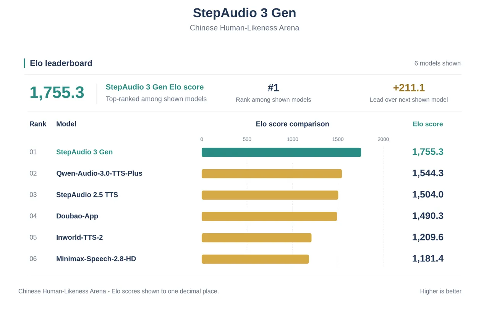
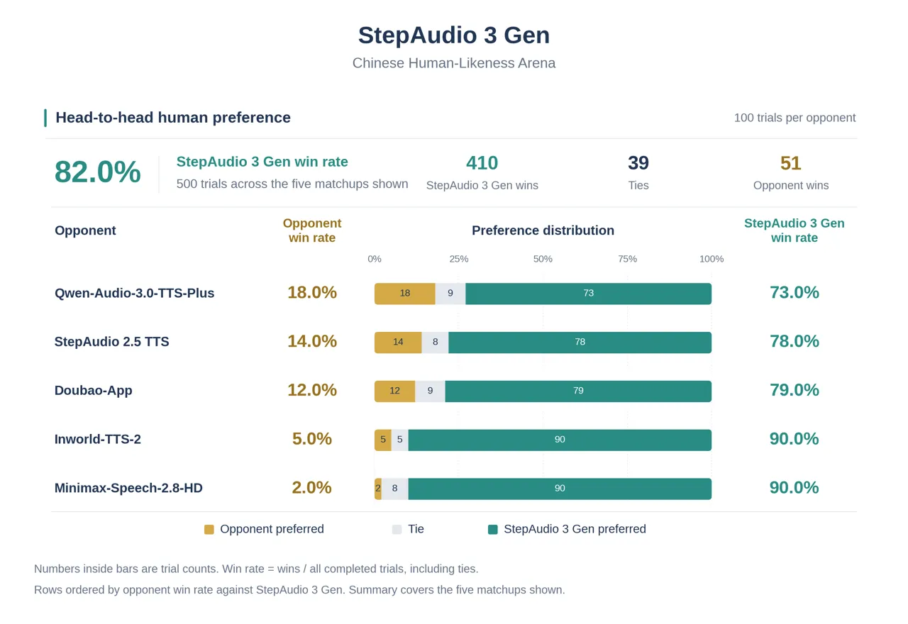
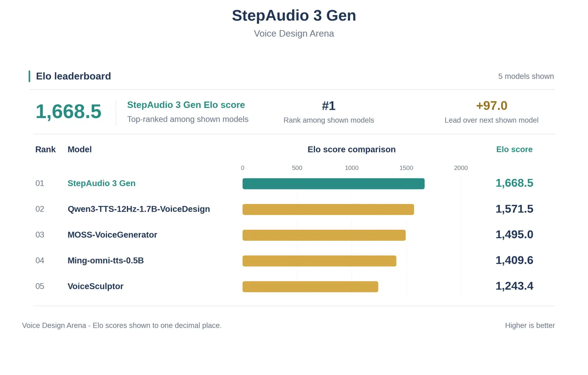
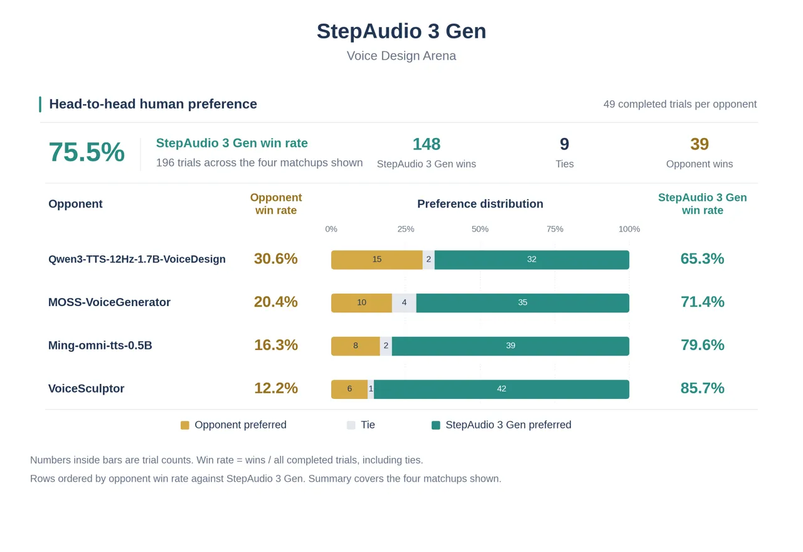

# ![[Uncaptioned image]](arxiv-2609-12945v1--5dbc3368bdc9.figures/figure-1.webp) StepAudio 3 Gen Technical Report

StepFun-Audio Team

###### Abstract

We introduce StepAudio 3 Gen, a general-purpose audio generation model
that supports zero-shot text-to-speech (TTS), voice design, vocal
generation, sound effects, music, vibe speech, and mixtures of multiple
audio types within a unified framework. At its core, StepAudio 3 Gen is
a discrete autoregressive generator that models audio directly over
residual vector quantization (RVQ) tokens, departing from the diffusion
Transformer-based continuous generation paradigm prevalent in recent
general audio models. Its StepAudio Tokenizer represents general audio
at 12.5 Hz in a shared $`16\times 2048`$ residual code space, jointly
quantizing semantic and waveform-level acoustic features so that each
code layer preserves both types of information. For generation, the
backbone predicts the first codebook along the time axis using
autoregressive modeling, while a lightweight causal Transformer
completes the remaining fifteen codebooks along the codebook axis. Our
study further identifies three key design principles: (1)
interference-aware progressive pretraining for acquiring audio
capabilities while preserving the textual abilities of the large
language model, (2) RVQ Adaptor for effectively incorporating
multi-codebook acoustic representations, and (3) discrete autoregressive
modeling over a shared representation across general audio domains. With
progressive pretraining, multi-task instruction training, and supervised
fine-tuning, StepAudio 3 Gen achieves state-of-the-art performance on
both TTS and voice design, while retaining strong generation
capabilities across speech, vocals, sound effects, and music. Audio
samples are available at
[https://stepaudiollm.github.io/step-audio-3-gen/](https://stepaudiollm.github.io/step-audio-3-gen/).

   

|     |
| --- |
|     |

## 1 Introduction

Audio generation is increasingly expected to cover the full range of
sounds that appear in real applications: intelligible and expressive
speech, environmental sounds and sound effects, music, and singing.
These domains have traditionally progressed along separate tracks.
Text-to-speech (TTS) systems optimize linguistic fidelity, speaker
similarity, and prosodic control \[1, 2, 3\]; text-to-audio systems
synthesize non-speech events and acoustic scenes from captions \[4, 5\];
and text-to-music and singing systems focus on musical structure,
timbre, and long-range coherence \[6, 7, 8\]. Specialization has
produced strong models in each domain, but it also leaves applications
that need several kinds of audio with incompatible representations,
conditioning formats, and generation pipelines.

Recent work has therefore moved toward unified audio generation. One
family models audio in a continuous latent space and uses diffusion or
flow matching to synthesize speech, sound, music, or their mixtures \[9,
10, 11, 12\]. Another family converts audio into discrete units and
applies language-model-style sequence modeling across tasks and
modalities \[13, 14, 15, 16\]. Continuous models offer an effective
route to parallel acoustic rendering, whereas discrete models make audio
compatible with the vocabulary, causal objective, and interleaved
context of a language model. The latter property is especially
attractive when the goal is not only to generate several audio domains,
but also to place audio understanding, generation, and text intelligence
in one model. Most closely related, UniAudio 2.0 combines a text-based
large language model (LLM), factorized reasoning and reconstruction
tokens, specialized layers, a local autoregressive decoder, and
multi-stage training \[16\]. It separates reasoning from reconstruction
and uses a flow-based reconstruction decoder; we study one
semantic-acoustic hierarchy based on residual vector quantization (RVQ)
with a shared backbone and discrete acoustic prediction.

High-fidelity RVQ represents each frame with multiple codebook IDs.
Flattening them along time makes the sequence prohibitively long, while
using only a coarse semantic token loses acoustic detail. Two
organizations avoid naive flattening. Time-depth models use a temporal
Transformer for cross-frame structure and a smaller local Transformer
for the codebooks within each frame \[17, 14, 18\]. Delayed patterns
instead shift parallel codebook streams by different temporal offsets,
allowing one Transformer to predict all RVQ layers without lengthening
the sequence, as in MusicGen \[7\]. In our setting, however, this would
require a multi-stream audio output interface and make the pretrained
LLM directly predict every residual layer and receive all acoustic
losses. We choose time-depth modeling so the LLM handles the
semantically concentrated first codebook and long-range planning, while
a small module contains residual acoustic modeling and its gradients.

Even with this decomposition, adding audio tokens to a text LLM is not
neutral. The sum of many newly initialized RVQ embeddings need not match
the statistics of pretrained text embeddings, and the residual-codebook
objective supplies many acoustic predictions for every temporal
decision. Joint optimization can force the backbone to absorb both
effects before the audio modules become useful, trading inherited
language intelligence for audio capability. Prior audio LLMs address
related forgetting risks through staged alignment, frozen modules, or
text-data rehearsal \[19, 20, 18, 16\]; our design targets these two
interference channels explicitly.

In this report, we present a unified audio language model built on
StepAudio Tokenizer, a 12.5-Hz residual vector-quantized tokenizer
shared by speech, environmental sound, music, and singing. Each frame is
represented by 16 codebooks of size 2,048. The tokenizer jointly
quantizes semantic and acoustic features, while semantic distillation
and quantizer dropout encourage information useful for temporal planning
to concentrate in the early codebooks. The first codebook is
incorporated into the LLM vocabulary and predicted autoregressively
along the time axis. At every generated audio frame, the corresponding
LLM hidden state and the first codebook ID condition a four-layer
Transformer, which autoregressively predicts the 15 residual codebooks
along the depth axis. The complete RVQ frame is then decoded by the
neural codec. Thus, text and audio share a causal sequence model, and
acoustic detail is generated entirely in the discrete code space without
a diffusion or flow-matching acoustic renderer.

We address interference at both the representation and optimization
levels. On the input side, the summed embeddings of the complete RVQ
frame pass through a token-wise, zero-initialized residual module,
termed the RVQ Adaptor, before being added to the ordinary token
embedding. The RVQ Adaptor gives audio inputs a modality-specific
transformation into the LLM input space without inserting a separate
sequence encoder or replacing the shared backbone. On the optimization
side, we use a four-stage pretraining curriculum. We first align the
audio input under a frozen backbone, then learn audio understanding
jointly with replayed text. Generation is introduced while the
conditioning hidden states of the randomly initialized residual-code
predictor are detached from the LLM, preventing its 15-codebook loss
from immediately reshaping the backbone. Only after the predictor has
converged do we restore end-to-end gradients during a low-learning-rate,
long-context cool-down. From the second stage onward, text occupies half
of each optimizer step. A subsequent multi-task instruction-tuning stage
broadens generation from speech and spoken interaction to
caption-conditioned sound, music, and singing.

The system is controlled through a unified instruction format that
organizes each request into three fields: ROLE defines the speaker
identity and voice characteristics; DIRECTOR describes the acoustic
scene and generation intent; and SCRIPT arranges speech and sound events
along the time axis, prefixing each spoken segment with a speaker tag
and optionally a (description) marker, while sound effects and music are
denoted as \[description\] entries to make the relative ordering of
events explicit. This design enables a single instruction to define
multiple characters and their relationships, specify timbre, speaking
style, emotion, accent, and paralinguistic features such as laughter,
breathing, and pauses, while also supporting the generation and temporal
arrangement of sound effects, environmental sound, and background music.

Our main contributions are as follows:

- •
  Interference-aware progressive pretraining. We develop a four-stage
  recipe that progressively introduces audio alignment, understanding,
  generation, and end-to-end acoustic conditioning. Frozen-backbone
  alignment, 50% text replay, and temporary gradient detachment at the
  residual code predictor are combined to acquire audio capabilities
  while retaining the inherited textual capabilities of the LLM.
- •
  RVQ Adaptor. We introduce a zero-initialized, token-wise residual
  adaptor that reconciles multi-codebook audio embeddings with the
  pretrained token-embedding space. It enables the model to consume the
  full acoustic representation needed for understanding and continuation
  while limiting the burden on the shared backbone.
- •
  Discrete autoregressive modeling across general audio. We build a
  shared LLM based generator for speech, singing, music, sound effects,
  and mixed audio using a single 12.5-Hz, 16-codebook RVQ
  representation. A time–depth architecture separates temporal
  prediction from within-frame codebook prediction, generating audio
  entirely in discrete code space without a diffusion- or flow-based
  acoustic renderer.

## 2 Model Architecture

Our model has two components: the StepAudio Tokenizer, which discretizes
audio from the supported domains into 12.5 Hz RVQ codes and reconstructs
24 kHz waveforms from them, and an LLM backbone that treats these codes
as an extension of its vocabulary and models text and audio in one
autoregressive stream. Generation is thus next-token prediction over the
joint text–audio sequence, with the tokenizer’s decoder turning the
predicted codes back into sound.

Figure 1: Overview of the StepAudio 3 Gen architecture. At each audio
frame, the LLM predicts $`c_{0}`$, and the RVQ Code Predictor conditions
on the LLM hidden state and $`c_{0}`$ to predict
$`c_{1},\ldots,c_{15}`$. All sixteen codes form the full RVQ frame used
for waveform decoding. $`\oplus`$ denotes element-wise addition: at
audio positions, the RVQ Adaptor output is added to the corresponding
token embedding (§2.2).

### 2.1 StepAudio Tokenizer

StepAudio Tokenizer is a 12.5 Hz audio tokenizer that discretizes
speech, music, and general audio into a single shared multi-codebook
space and reconstructs waveforms at 24 kHz. Following the X-Codec line
of work \[21, 22\], we guide the codec toward a balance between semantic
and acoustic information by quantizing the two jointly: a frozen
self-supervised learning (SSL) encoder provides semantic features, while
a convolutional encoder with SnakeBeta activations \[23\] extracts
acoustic features directly from the raw waveform at 50 Hz; the two
representations are fused along the channel axis, temporally compressed
to 12.5 Hz by a strided convolution, and discretized by a single shared
quantizer, so that every code layer carries semantic content and
acoustic detail at once rather than being dedicated to a single
modality. Quantization is performed by a $`16\times 2048`$ residual
vector quantizer — 16 layers with 2048 entries per codebook, using
factorized, cosine-similarity codebook lookup \[24\].

To enable streaming synthesis, the decoder is fully causal: a
Vocos-style Transformer backbone \[25\] with rotary position embeddings
(RoPE) and 25-frame sliding-window attention feeds an inverse short-time
Fourier transform (ISTFT) head that emits 24 kHz audio, so the waveform
is reconstructed incrementally from tokens under a bounded receptive
field and without look-ahead, supporting low-latency real-time online
services. Training objectives and the two-stage recipe are described in
§4.1.

### 2.2 LLM Backbone

We retain the pretrained decoder-only Transformer architecture while
extending its token embeddings and output vocabulary to support audio.
Text and audio share a single autoregressive stream: the coarsest RVQ
codebook (the 0th codebook) is promoted into the main language-model
vocabulary as 2048 contiguous audio tokens, so a single language-model
(LM) head predicts natural-language tokens and the top-level audio code
alike and the two modalities can be interleaved freely.

On the input side, an audio frame is not read from a single vocabulary
embedding. Each of its 16 codebooks (cb0 through cb15) has its own
embedding table, and the 16 looked-up vectors are summed into one frame
embedding, which then passes through the RVQ Adaptor — a token-wise
stack of residual blocks with pre-normalization and Swish-gated linear
units (SwiGLU) that maps the summed audio embeddings into the LLM input
space. Its output is added element-wise, at audio positions only, to the
token embedding of the codebook-0 audio token; codebook 0 is therefore
represented twice on the input side — once in the expanded main
vocabulary (as the audio token) and once through its own table inside
the summed frame. Text positions carry no audio codes, so they receive
nothing from this pathway and are left untouched. This position gating
confines the added audio pathway to audio positions.

Of the 16 codebooks in an audio frame, the LM head emits only the first;
the remaining 15 residual codebooks are produced by the RVQ Code
Predictor — a lightweight causal Transformer operating along the
codebook axis. It is given two prefixes: the backbone hidden state at
the audio position (linearly projected to the predictor width) and
codebook 0, the code the main LM has just chosen; from these it
autoregressively emits codebooks 1 through 15, feeding each decoded code
back as input. A stop-gradient toggle on the hidden-state prefix lets
the residual-acoustic objective train the predictor alone during the
main generation stage and then propagate into the backbone during the
final joint cool-down. For waveform reconstruction, codebook 0 is
retained and combined with the fifteen predicted residual codes to form
the complete 16-codebook RVQ frame. In Figure 1, $`c_{k}`$ abbreviates
$`c_{t,k}`$ for a single frame $`t`$.

Writing $`c_{t,0},\ldots,c_{t,15}`$ for the sixteen codebooks of frame
$`t`$ and $`\mathbf{z}_{t}`$ for the backbone hidden state at that
position, the generation path factorizes as

```math
\displaystyle p(c_{t,0},\ldots,c_{t,15}\mid\mathbf{z}_{<t},\mathbf{c}_{<t})\;=\;\underbrace{p(c_{t,0}\mid\mathbf{z}_{<t},\mathbf{c}_{<t})}_{\text{main LM head}}\;\prod_{k=1}^{15}\;\underbrace{p(c_{t,k}\mid\mathbf{z}_{t},\,c_{t,0},\ldots,c_{t,k-1})}_{\text{RVQ code predictor}} \tag{1}
```

The factorization is exact rather than an approximation of the joint
over one frame, because the earlier codebooks of past frames do not
reach the predictor through a separate path: all sixteen looked-up
vectors are summed into the frame embedding of §2.2, so
$`\mathbf{z}_{t}`$ already encodes $`\mathbf{c}_{<t}`$ through the
backbone. What the factorization does give up is the reverse direction —
the predictor’s output does not feed back into the backbone — which is
why the two halves are trained jointly only once the predictor has
converged.

Training optimizes the sum of a token-level term over text and codebook
0 and a term over the fifteen residual codebooks:

```math
\displaystyle\mathcal{L}\;=\;\mathcal{L}_{\mathrm{tok}}\;+\;\lambda\,\mathcal{L}_{\mathrm{sp}},\qquad\mathcal{L}_{\mathrm{tok}}=-\sum\log p(c_{t,0},x_{t}),\qquad\mathcal{L}_{\mathrm{sp}}=-\sum_{t}\sum_{k=1}^{15}\log p(c_{t,k}\mid\cdot), \tag{2}
```

where $`\mathcal{L}_{\mathrm{sp}}`$ sums rather than averages over
depth, and $`\lambda`$ is the only weight changed between stages (§4.2).
Because codebook 0 occupies the model’s own vocabulary, its loss and
accuracy are read off the main LM head and not off the predictor:

```math
\displaystyle c_{t,0}\in\{0,\ldots,2047\}\quad\Longleftrightarrow\quad\mathrm{id}(c_{t,0})\in[V,\,V+2048), \tag{3}
```

with $`V`$ the text vocabulary size, which is what lets the two
modalities share one softmax.

## 3 Data

Our training data is organized into two stages: broad-coverage
pretraining and task-oriented post-training. Pretraining combines text
with diverse speech, vocal, music, and sound data to establish unified
audio understanding and generation capabilities, while post-training
uses carefully curated, task-specific corpora to further improve
generation quality, naturalness, and controllability across different
audio domains.

### 3.1 Pretraining Data

To introduce general-audio generation without eroding the backbone’s
textual competence, we build a generation-centric mixture while
retaining the text corpus. Its audio sources span speech, singing,
music, and environmental sounds, organized into TTS, singing synthesis,
lyrics-conditioned music, caption-conditioned sound generation, and
speech-to-speech translation. We also include automatic speech
recognition (ASR), speech-to-text translation, audio captioning,
paralinguistic question answering (QA), accent/dialect identification,
and interleaved multi-turn speech dialogue. These understanding tasks
anchor RVQ representations in language and expose controllable
attributes such as timbre, emotion, and accent. Audio is encoded at 12.5
Hz with 16 RVQ codebooks of 2,048 entries each; generation samples
interleave one text token with two audio frames. Across four stages,
training consumes approximately 2.7T LLM tokens. From Stage 2 onward,
text supplies half of each optimizer step, with the generation stages
using a $`3\!:\!1\!:\!2`$ mixture of text, TTS, and interleaved
dialogue.

### 3.2 Post-training Data

#### 3.2.1 Speech to Audio

##### Text to Speech.

To bring TTS closer to the way people naturally speak, we place
additional emphasis on natural conversational speech in our supervised
fine-tuning (SFT) data. While StepAudio 2.5 TTS \[26\] emphasizes global
and inline instruction control, StepAudio 3 Gen focuses more on the
tone, rhythm, and spontaneous vocal behaviors found in real
conversations. To this end, we employ our StepAudio R1.5 \[27\] for
TTS-oriented audio captioning, describing the recording context, noise
level, and speaker characteristics to guide the selection of natural
conversational speech. We also introduce an ASR model optimized for
recognizing paralinguistic phenomena to transcribe and verify candidate
audio while preserving expressive cues such as tone and hesitation.
Through this pipeline, we curate 1,500 hours of speech data for SFT to
elicit more human-like delivery, helping the model learn natural
speaking patterns conditioned on the surrounding text.

##### Speech to Vocal.

To address the scarcity of large-scale paired speech–singing data, we
construct pseudo-paired training data for speech2vocal using two
complementary approaches, both designed to match speaker timbre across
speech and singing. In the first approach, TTS-based voice cloning, we
use the StepAudio TTS model to generate speech conditioned on a singing
reference, preserving the reference timbre. In the second, singing voice
conversion (SVC), we convert singing to the timbre of a target speaker
and pair it with that speaker’s speech, expanding the coverage of
speakers and timbres. We then filter the resulting pairs using the
Production Quality (PQ) and Content Enjoyment (CE) scores from Audiobox
Aesthetics \[28\], singing mean opinion score (MOS) predictions from
SingMOS \[29\], and the timbre similarity between synthesized and target
audio, retaining only samples that meet both audio-quality and
timbre-similarity criteria.

#### 3.2.2 Text to Audio

##### Voice Design.

We construct the voice-design SFT corpus from recorded and synthesized
speech, covering a wide range of expressive styles and acoustic
conditions. The recorded portion includes both natural conversational
and performed speech, spanning everyday and spontaneous conversations,
character dialogue, and professional voice-over across diverse recording
environments. We further incorporate synthesized speech to expand
coverage of underrepresented combinations of voice characteristics,
speaking styles, and acoustic scenarios, including conversation,
narration, and speech–music mixtures.

##### Vocal data.

We first separate full songs, remove tracks that are speech-dominated,
contain little singing, have low lyric-alignment coverage, or fail
overall quality checks, and extract candidate segments at lyric-line
boundaries using multiple gating criteria. We then evaluate the
candidate segments produced by the two separation routes using Audiobox
Aesthetics PQ/CE scores, SingMOS predictions, loudness, and spectral
bandwidth. We cross-check their quality scores and ASR transcriptions
and apply joint thresholds to obtain the final vocal dataset.

##### Music data.

For music generation, we construct a text-conditioned instrumental music
corpus covering diverse scenarios, moods, genres, instrumentations,
rhythmic patterns, and production styles. We use the StepAudio Music
Model to generate instrumental tracks from text prompts specifying the
target musical content and intended use cases. For each generated track,
we then create diverse Chinese and English textual conditions, including
concise descriptions, detailed descriptions, and conversational
requests. Detailed descriptions emphasize instrumentation, rhythm, and
production style, whereas conversational requests focus on user
preferences and usage contexts. This multi-form prompt design provides
training supervision across different levels of musical description and
user intent.

##### Sound data.

To construct large-scale and diverse training data for sound-effect
generation, we combine sound-effect recordings obtained from diverse
corpora and sound-effect libraries with synthesized speech-sound
mixtures. We standardize heterogeneous metadata and enrich the
recordings with multi-level annotations covering sound events, sources,
acoustic attributes, scenes, and temporal structure. We retain samples
with usable source-level descriptions and filter out recordings
containing speech, personally identifiable information, or other
unsuitable content. For the retained recordings, we preserve source and
licensing metadata where available. For speech-sound mixtures, we sample
scene skeletons specifying speakers, speech segments, sound effects, and
ambience, and use our text-based large language model to complete the
speech content, speaking styles, sound descriptions, durations, and
temporal relations. Speech and non-speech sounds are then generated as
separate stems using dedicated synthesis models. Finally, we remove
failed or potentially inaudible sources, normalize and align the
remaining stems, and mix them with gains adjusted by source prominence
and distance to preserve the intended foreground–background structure.

## 4 Training

Training proceeds in two parts. We first train the StepAudio Tokenizer
to obtain a compact and semantically grounded discrete representation
that preserves both linguistic structure and acoustic detail. We then
initialize from a pretrained text LLM and progressively introduce audio
understanding and generation through a four-stage pretraining recipe
designed to integrate the audio modality while minimizing interference
with the backbone’s inherited textual capabilities.

### 4.1 Tokenizer Training

We train the RVQ with a quantizer dropout \[30\] of 0.5, which drives
the lower layers to encode coarse-grained, semantically aligned
information while the deeper layers progressively refine the details
left behind; the ratio is deliberately moderate, as a larger dropout
further strengthens the coarse layers but slightly degrades full-depth
reconstruction. Semantic grounding is enforced by a distillation branch
that regresses the SSL encoder teacher features from the quantized
latent; since this objective is applied under quantizer dropout,
semantically aligned information is concentrated in the earliest
codebooks.

Training adopts a generative adversarial network (GAN) framework \[30,
31\] in which the generator operates end-to-end on raw waveforms to
extract, quantize, and resynthesize audio, while a multi-period waveform
discriminator \[32\] and a multi-resolution spectral discriminator
improve the naturalness and fidelity of reconstructed audio,
complemented by feature-matching, multi-scale mel-spectrogram \[24\],
and residual-quantization commitment losses that enforce time–frequency
consistency and stable codebook usage.

The tokenizer is trained in two stages: large-scale pretraining on
roughly 700k hours of speech, music, and sound events with a
modality-balanced sampler, followed by a decoder-only refinement stage
in which the encoder, quantizer, and semantic branch are frozen and only
the acoustic decoder and discriminators are updated – improving
reconstruction quality while leaving the token space untouched, so
models already trained on these tokens remain compatible.

### 4.2 LLM Pretraining

|       |                        |                     |                                          |              |
| ----- | ---------------------- | ------------------- | ---------------------------------------- | ------------ |
| Stage | Focus                  | Batch Size (tokens) | LR                                       | LR scheduler |
| 1     | modality alignment     | $`4.19`$M           | $`2\times 10^{-4}\to 2\times 10^{-5}`$   | cosine       |
| 2     | audio understanding    | $`12.58`$M          | $`2\times 10^{-5}`$                      | constant     |
| 3     | generation, detached   | $`12.58`$M          | $`2\times 10^{-5}`$                      | constant     |
| 4     | long-context cool-down | $`25.17`$M          | $`2\times 10^{-5}\to 1.5\times 10^{-5}`$ | cosine       |

Table 1: Four-stage pretraining recipe. Batch size is measured in tokens
per optimizer step, where one temporal LLM step counts as one token.
Thus, audio represented at 12.5 Hz contributes 12.5 tokens per second,
although each audio token contains 16 RVQ codebook IDs. LR denotes
learning rate.

We initialize from a pretrained text LLM, which serves as the
pretraining backbone, and adopt a four-stage paradigm consuming
approximately 2.7T tokens. Preserving the textual ability of the
backbone is a second objective throughout: Stage 1 trains only the
adaptor under a frozen backbone, Stage 3 detaches the RVQ code
predictor, and from Stage 2 onward the original text corpus makes up
half of every optimizer step.

Stage 1: Modality Alignment. The first stage aligns audio
representations with a frozen LLM using ASR and speech-to-text
translation data, in which only the textual output is supervised. We
train only the input-side audio embedding and adaptor, holding the
backbone, the LM head, and the code predictor at zero learning rate,
while the token embedding receives a $`0.1\times`$ multiplier so that
the newly added audio-code rows can adapt. As the down projections of
the adaptor are zero-initialized, the module is an exact identity map at
initialization; together with the frozen backbone this makes the drift
in textual ability strictly zero, so no text replay is needed here.

Stage 2: Audio Understanding. The full model is then unfrozen and
trained on audio-understanding tasks mixed one-to-one with the text
corpus, still without supervising any audio target. The learning rate
drops to a constant $`2\times 10^{-5}`$, forming a plateau that later
stages continue from without re-warming, while the from-scratch modules
retain a $`10\times`$ multiplier and are excluded from weight decay.

Stage 3: Generation with a Detached Code Predictor. Stage 3 is the main
pretraining run and introduces generation, with the mixture set to
text : TTS : interleaved dialogue $`=3\!:\!1\!:\!2`$ so that the text
share stays at $`50\%`$ and TTS accounts for $`1/6`$ of every
micro-batch, or one third of the audio-generation streams. Here the
conditioning input of the code predictor is detached from the backbone
hidden states: supervision over the 15 residual codebooks is far
stronger in magnitude than the token-level objective, yet the predictor
is still randomly initialized, so its gradient would reshape the
representation built over the previous two stages. Once detached, the
residual acoustic part trains the predictor alone while the backbone
stays driven by the token-level objective, which decouples learning
acoustic detail from learning the semantic and prosodic plan and serves
as a second safeguard for textual ability. Stage 3 uses $`\lambda=1.0`$.
Because $`\mathcal{L}_{\mathrm{sp}}`$ sums rather than averages over the
fifteen residual codebooks, the acoustic term can be substantially
larger than the token-level term. Detachment prevents it from directly
updating the backbone in this stage; after detachment is removed, the
same weighting can cause it to dominate backbone updates.

Stage 4: Long-Context Joint Cool-down. The detachment is finally
removed, so the residual acoustic part propagates into the backbone and
its hidden states are shaped to serve as good acoustic conditioning as
well. This is deferred to last because the predictor is by now well
converged and because the low cool-down learning rate limits the extent
to which its gradients alter the backbone representations. The same run
lowers $`\lambda`$ from $`1.0`$ to $`0.1`$: with the depth loss now
reaching the backbone, the two terms are brought to comparable magnitude
rather than leaving the sum over fifteen codebooks an order of magnitude
above the token-level objective. We extend the sequence length from
$`16{,}384`$ to $`32{,}768`$ using context parallelism, which at 12.5 Hz
covers roughly 44 minutes of audio and suffices for long-form synthesis
and multi-turn dialogue.

### 4.3 Post-training

Supervised Fine-tuning. Building on the pretrained model, we run
full-parameter fine-tuning to further improve its instruction-following
and speech-generation abilities. The joint configuration from the end of
pretraining is carried over: the detachment stays off and the speech
loss, kept at $`\lambda=0.1`$, continues to propagate through the code
predictor into the backbone. The SFT corpus contains approximately 5,000
hours of audio, spanning music, sound effects, voice design, singing,
and speech. The music and text-conditioned singing subsets are generated
with StepAudio Music Model. The audio embedding, the adaptor, and the
code predictor retain a $`10\times`$ learning-rate multiplier, while the
remaining parameters are fine-tuned at the base rate. Training uses a
sequence length of 16,384 and a batch size of 64, with a cosine schedule
from $`1.0\times 10^{-5}`$ to $`1.0\times 10^{-6}`$.

Reinforcement Learning. After supervised fine-tuning, we apply Group
Relative Policy Optimization (GRPO)\[33\] to further improve instruction
following. The training data follow the same task taxonomy and
conditioning formats as the SFT data, covering TTS, Voice Design, vocal,
music, and sound generation, as well as speech-and-sound mixtures.
Speech-containing examples include an exact transcript in addition to
role and style requirements, while the other tasks use concrete
descriptions of acoustic events and performance characteristics.
Ambiguous or weakly verifiable instructions are removed to reduce reward
noise.

For each generated audio $`y_{i}`$, an audio understanding model \[27\]
first produces a caption $`c_{i}`$. A text LLM compares $`c_{i}`$ with
the original instruction $`x`$ and returns an instruction-consistency
score between 0 and 100. We independently score each instruction–caption
pair four times and use the mean $`\bar{s}_{i}`$ to reduce evaluation
variance. For speech examples with target transcript $`t`$, an ASR model
produces $`\hat{t}_{i}`$, from which we compute either character error
rate (CER) or word error rate (WER), denoted by $`e_{i}`$. The reward is

```math
\displaystyle R_{i}=\frac{\bar{s}_{i}}{100}\begin{cases}\exp(-\tau e_{i}),&e_{i}\leq 0.5,\\
0,&e_{i}>0.5,\end{cases}\qquad\bar{s}_{i}=\frac{1}{4}\sum_{k=1}^{4}s_{i}^{(k)}. \tag{4}
```

Here, $`\tau=3`$ controls the exponential penalty on the recognition
error. For tasks without a target transcript, the ASR term is set to
one. This multiplicative reward prevents an output with severely
incorrect linguistic content from receiving a high score solely because
its acoustic style matches the instruction.

For every instruction, we sample $`G=16`$ candidate audio sequences.
GRPO uses their group-relative rewards without training a separate value
model. Given the group mean $`\mu_{R}`$ and standard deviation
$`\sigma_{R}`$, the advantage is
$`\hat{A}_{i}=(R_{i}-\mu_{R})/(\sigma_{R}+\eta)`$, where $`\eta`$ is a
small constant for numerical stability. Inspired by the dynamic sampling
strategy of DAPO \[34\], groups with $`\sigma_{R}<\delta`$ are
discarded, where $`\delta=0.02`$ is the minimum within-group reward
standard deviation retained for training. Such groups contain little
reliable preference signal. The policy is optimized with

```math
\displaystyle J_{\mathrm{GRPO}}(\theta)=\mathbb{E}\!\left[\frac{1}{G}\sum_{i=1}^{G}\frac{1}{16|y_{i}|}\sum_{t}\sum_{\ell=0}^{15}\min\!\left(\rho_{i,t,\ell}\hat{A}_{i},\operatorname{clip}\!\left(\rho_{i,t,\ell},1-\epsilon_{\mathrm{clip}},1+\epsilon_{\mathrm{clip}}\right)\hat{A}_{i}\right)\right]-\beta D_{\mathrm{KL}}\!\left(\pi_{\theta}\,\|\,\pi_{\mathrm{ref}}\right), \tag{5}
```

where $`t`$ indexes the generated audio positions and
$`\ell\in\{0,\ldots,15\}`$ indexes the RVQ codebook (one base codebook
plus 15 residual codebooks). Here $`\rho_{i,t,\ell}`$ is the token-level
importance ratio between the updated policy $`\pi_{\theta}`$ and the
rollout policy for each codebook token, $`\epsilon_{\mathrm{clip}}`$ is
the clipping range, and $`\pi_{\mathrm{ref}}`$ is the SFT reference
policy.

We use a small Kullback–Leibler (KL) divergence coefficient $`\beta`$,
relying primarily on policy clipping to constrain updates, and train
with a learning rate from $`10^{-6}`$ to $`10^{-7}`$.

## 5 Evaluation

Our evaluation is organized around three questions: whether the proposed
RVQ Adaptor effectively integrates multi-codebook audio representations
into the pretrained LLM, whether the interference-aware progressive
pretraining strategy preserves the LLM’s textual capabilities, and
whether the resulting model delivers strong generation quality and
controllability. We first evaluate the effectiveness of the RVQ Adaptor
and the interference-aware progressive pretraining strategy, and then
focus on two core generation capabilities. For TTS, we assess perceived
human-likeness through subjective human evaluation; for voice design, we
evaluate both instruction-following performance on an objective
benchmark and human preference through subjective evaluation.

### 5.1 RVQ Adaptor

We compare systems with and without the RVQ Adaptor after pretraining to
evaluate the effect of aligning audio embeddings with the pretrained
LLM’s token embedding space on its audio-language capabilities. The
evaluation covers 1) automatic speech recognition (ASR) on the AISHELL-1
test set \[35\] and the LibriSpeech test-clean set \[36\], measured by
character error rate (CER) and word error rate (WER), respectively; 2)
audio understanding and reasoning on MMAU \[37\], measured by accuracy; 3) bidirectional English–Chinese speech-to-text translation on CoVoST
\[38\], measured by BLEU; and 4) knowledge question answering on
SpeechMMLU \[39\], measured by accuracy in the text-to-speech (T2S)
setting. As shown in Table 2, the system equipped with the RVQ Adaptor
consistently outperforms its counterpart across all reported metrics,
indicating stronger overall audio-language capabilities.

|                 |                        |                        |                       |                          |             |                       |
| --------------- | ---------------------- | ---------------------- | --------------------- | ------------------------ | ----------- | --------------------- |
| System          | AISHELL-1              | LibriSpeech            | MMAU                  | CoVoST BLEU $`\uparrow`$ |             | SpeechMMLU (T2S)      |
|                 | CER (%) $`\downarrow`$ | WER (%) $`\downarrow`$ | Acc. (%) $`\uparrow`$ | En$`\to`$Zh              | Zh$`\to`$En | Acc. (%) $`\uparrow`$ |
| w/o RVQ Adaptor | 5.25                   | 6.00                   | 40.70                 | 12.05                    | 5.99        | 12.13                 |
| w/ RVQ Adaptor  | 3.00                   | 3.41                   | 51.70                 | 30.56                    | 18.59       | 58.76                 |

Table 2: Comparison of systems with and without the RVQ Adaptor on audio
benchmarks after pretraining.

### 5.2 Interference-aware progressive pretraining

To evaluate the effectiveness of our interference-aware progressive
pretraining strategy in preserving the pretrained LLM’s text-domain
capabilities after pretraining, we compare it with a three-stage
baseline on text benchmarks. The baseline does not use the RVQ Adaptor
and follows three stages: ASR training, audio understanding and
generation training, and a final cool-down stage. The evaluation
assesses knowledge and reasoning capabilities using FinEval \[40\],
C-Eval \[41\], MMLU \[42\], CMMLU \[43\], MATH \[44\], GSM8K \[45\], and
BBH \[46\], together with code generation performance on HumanEval
\[47\]. We report accuracy for FinEval, C-Eval, MMLU, and CMMLU; exact
match (EM) for MATH, GSM8K, and BBH; and Pass@1 for HumanEval. As shown
in Table 3, our interference-aware progressive pretraining strategy
consistently outperforms the baseline across all text benchmarks,
indicating better retention of the pretrained LLM’s knowledge and
reasoning capabilities.

|                    |                       |                       |                       |                       |                     |                     |                     |                         |
| ------------------ | --------------------- | --------------------- | --------------------- | --------------------- | ------------------- | ------------------- | ------------------- | ----------------------- |
| System             | FinEval               | C-Eval                | MMLU                  | CMMLU                 | MATH                | GSM8K               | BBH                 | HumanEval               |
|                    | Acc. (%) $`\uparrow`$ | Acc. (%) $`\uparrow`$ | Acc. (%) $`\uparrow`$ | Acc. (%) $`\uparrow`$ | EM (%) $`\uparrow`$ | EM (%) $`\uparrow`$ | EM (%) $`\uparrow`$ | Pass@1 (%) $`\uparrow`$ |
| Baseline           | 65.86                 | 66.34                 | 64.99                 | 66.69                 | 36.62               | 67.94               | 59.61               | 47.56                   |
| Interference-aware | 71.68                 | 71.92                 | 69.20                 | 71.73                 | 45.07               | 74.05               | 67.03               | 54.27                   |

Table 3: Comparison of the baseline and our interference-aware
progressive pretraining on text benchmarks after pretraining.

### 5.3 TTS

Given our emphasis on human-like delivery in TTS, we specifically
evaluate how closely the generated speech resembles real human speech.
We conduct an Arena-style pairwise evaluation, where raters judge the
overall listening impression and select the sample that sounds more like
a real person speaking naturally. This holistic judgment is intended to
capture prosody, rhythm, expressiveness, and spontaneous speaking
behaviors, with ties allowed when no clear preference exists.

We favor subjective comparison over objective metrics such as character
error rate (CER) and speaker similarity (SS), which capture only limited
aspects of TTS performance. A model with flat prosody can still achieve
a low CER as long as the content is correctly conveyed, while SS
primarily reflects speaker identity and timbre rather than expressive
delivery. These metrics therefore do not adequately reflect the
human-like expressiveness targeted by our model.

We construct a Chinese human-likeness evaluation set from text extracted
from real human speech. We use one voice from each competing TTS model
for comparison with StepAudio 3 Gen. The six systems are evaluated
through Arena-style pairwise comparisons, with 1,500 comparisons in
total. Each comparison is recorded as a win, tie, or loss. Based on
these outcomes, we report both Elo ratings over the full evaluation pool
and direct head-to-head results against five leading commercial TTS
systems.

We aggregate the pairwise outcomes using Elo ratings, with higher scores
indicating stronger preference within the evaluation pool. Figure 22(a)
shows that StepAudio 3 Gen achieves the highest Elo rating of 1755.33,
outperforming five leading commercial TTS systems:
Qwen-Audio-3.0-TTS-Plus \[48\], Doubao-App \[49\], MiniMax-Speech-2.8-HD
\[50\], Inworld-TTS-2 \[51\], and StepAudio 2.5 TTS \[26\].



(a) Elo rankings of models on the Chinese human-likeness test set under
human evaluation.



(b) Head-to-head results for StepAudio 3 Gen against baseline models on
the Chinese human-likeness test set.

Figure 2: Human evaluation on the Chinese human-likeness test set.

Figure 22(b) further presents direct head-to-head results between
StepAudio 3 Gen and five leading commercial TTS systems, with 100
comparisons per opponent. StepAudio 3 Gen achieves an aggregate win rate
of 82.0%, with win rates ranging from 73.0% to 90.0% across individual
opponents, maintaining a clear majority in every matchup. As preference
in this evaluation is defined by the overall perceived human-likeness of
the generated speech, these results demonstrate a consistent advantage
of StepAudio 3 Gen across all five competing systems.

### 5.4 Voice Design

InstructTTSEval benchmark. We evaluate style following on the full
InstructTTSEval benchmark \[52\]: 1,000 Chinese and 1,000 English texts,
each evaluated under Acoustic-Parameter Specification (APS),
Descriptive-Style Directive (DSD), and Role-Play (RP), for a total of
6,000 generated utterances per system. Gemini 3.1 Pro \[53\]
(gemini-3.1-pro-preview) judges each audio against its original
benchmark instruction and returns a binary style-consistency decision.
Scores are the percentages of valid judgments marked consistent for each
condition; AVG is their unweighted mean.

The baseline systems include Qwen3-TTS-12Hz-1.7B-VoiceDesign \[54\],
MOSS-VoiceGenerator \[55\], Ming-omni-tts-0.5B \[56\], and VoiceSculptor
\[57\]. Table 4 reports Gemini style-consistency scores on the full
benchmark. Among the evaluated systems, StepAudio 3 Gen achieves the
best Chinese performance across APS, DSD, and RP, with an average score
of 85.2%, and also attains the best English performance with an average
score of 77.7%.

InstructTTSEval-EN InstructTTSEval-ZH APS$`\uparrow`$ DSD$`\uparrow`$
RP$`\uparrow`$ AVG$`\uparrow`$ APS$`\uparrow`$ DSD$`\uparrow`$
RP$`\uparrow`$ AVG$`\uparrow`$ Qwen3-TTS-12Hz-1.7B-VoiceDesign 74.7 83.8
61.9 73.5 79.0 86.7 56.2 74.0 MOSS-VoiceGenerator 59.5 79.0 56.1 64.9
63.7 78.1 53.4 65.1 Ming-omni-tts-0.5B 71.6 67.7 55.9 65.1 75.2 83.8
54.0 71.0 VoiceSculptor - - - - 49.2 62.5 45.9 52.5 StepAudio 3 Gen
(Ours) 82.4 85.5 65.2 77.7 88.5 91.5 75.5 85.2

Table 4: StepAudio 3 Gen style-consistency scores on the full
InstructTTSEval benchmark (2,000 texts under three conditions, totaling
6,000 generated utterances). Scores are percentages; higher is better.
For each language, AVG is the unweighted mean of APS, DSD, and RP.



(a) Elo rankings of models on the voice design task under blind human
evaluation.



(b) Head-to-head results for StepAudio 3 Gen against baseline models on
the voice design task.

Figure 3: Human evaluation on the voice design task.

Human Preference Evaluation on Voice Design. We conduct a blind human
preference evaluation on the voice design task to assess the models’
instruction-following capability. We employ an Elo-based battle
mechanism to evaluate five models with voice design capabilities. A
total of 490 head-to-head comparisons covering both Chinese and English
were conducted across all models, with Elo scores dynamically calculated
based on match outcomes. As shown in Figure 3(a), StepAudio 3 Gen ranks
first with an Elo score of 1668.5, demonstrating superior human
preference performance on the voice design task compared to current
mainstream models. Figure 3(b) further presents direct head-to-head
results for StepAudio 3 Gen against baseline models on the voice design
task. StepAudio 3 Gen achieves an aggregate win rate of 75.5%, with win
rates ranging from 65.3% to 85.7% across individual opponents. As
preference in this evaluation is defined by overall listening impression
and instruction-following quality, these results demonstrate a
consistent advantage of StepAudio 3 Gen on the voice design task.

## 6 Extensions

StepAudio 3 Gen models speech and general audio within a single shared
RVQ token space. The same discrete autoregressive framework supports the
TTS and voice design capabilities evaluated above, as well as vocals,
music, sound effects, and complex audio scenes presented in this
section. All of these capabilities are modeled and generated entirely in
the shared discrete code space, without introducing task-specific
tokenizers or diffusion- or flow-based acoustic renderers. By jointly
training the RVQ representation and generator across diverse audio
domains, the model learns semantic and acoustic structures beyond speech
and develops solid general-audio generation capabilities. We highlight
several representative capabilities below.

##### Vocal Generation.

StepAudio 3 Gen supports both text to vocal and speech to vocal
generation. For text to vocal generation, users can specify the target
voice, lyrics, musical key, and vocal style through natural language
prompts, allowing the model to jointly control vocal identity,
linguistic content, pitch characteristics, and expressive delivery. For
speech to vocal generation, the input speech serves as a reference for
the target voice, while the lyrics, musical key, and singing style are
specified separately to generate singing in the reference speaker’s
voice.

##### Music Generation.

The model supports long-form instrumental music generation from natural
language prompts describing genre, mood, instrumentation, rhythmic
characteristics, production style, and intended use. StepAudio 3 Gen can
generate coherent musical pieces exceeding 60 seconds while maintaining
overall musical structure and stylistic consistency over extended
durations.

##### Sound Generation.

StepAudio 3 Gen supports both isolated sound-effect generation and
complex acoustic-scene generation. It can synthesize individual sound
events from concise descriptions, while also handling more complex
prompts involving multiple sound sources, layered events, ambience, and
interactions among acoustic events. The model further supports temporal
arrangement of sound events, allowing prompts to specify their ordering,
relative timing, and co-occurrence within a scene.

##### Vibe Speech.

StepAudio 3 Gen can generate vibe speech within composite acoustic
scenes, jointly modeling spoken content, speaking style, atmosphere,
background sound, and contextual cues. It also supports multi-speaker
dialogue and interactions among multiple speakers and sound sources,
enabling the generation of complex conversational scenes with coherent
acoustic environments.

## 7 Conclusion

We present StepAudio 3 Gen as a step toward unified general-purpose
audio generation within a discrete autoregressive framework. Rather than
relying on separate generation paradigms for different audio domains,
our results show that a shared semantic–acoustic representation can
support diverse audio generation tasks within a single LLM-based
architecture. Our experiments further suggest three practical lessons:
audio capabilities should be introduced progressively to mitigate
interference with the pretrained LLM, multi-codebook acoustic
representations can be effectively integrated through a lightweight RVQ
Adaptor, and discrete autoregressive modeling can scale beyond speech to
general audio without a continuous acoustic renderer. StepAudio 3 Gen
achieves state-of-the-art results on TTS and voice design, while also
demonstrating solid generation capabilities in vocals, music, sound, and
vibe speech. Taken together, these findings demonstrate that discrete
autoregressive modeling provides a practical and scalable alternative to
prevailing continuous-generation approaches for building unified audio
models.

## Contributors

Contributors are listed alphabetically by first name.

Bin Lin  
Bo Zhao  
Boyang Wang  
Boyang Zhang  
Boyong Wu  
Chao Yan  
Chen Geng  
Chen Wu  
Cheng Yi  
Chengli Feng  
Chenglin Zhu  
DanNi Wan  
Daxin Jiang  
Dongqing Pang  
Fei Tian  
Feng Tian  
Future Li  
Gang Yu  
Guanglong Yang  
Jia Peng  
Jiahao Song  
Jiamin Fan  
Jiangjie Zhen  
Jianzheng Gao  
Jun Chen  
Li Xie  
Lifang Zhang  
Lingli Ji  
Liying Shi  
Lun Cai  
Min Xu  
Na Wang  
Peilin Li  
Peng Yang  
Pengfei Tan  
Qingjian Lin  
Ruijie Xiong  
Runze Li  
Shenghua Hu  
Shi Qiu  
Siqi Tu  
Siyi Zhou  
Tianjiao Deng  
Wanying Lu  
Weiming Niu  
Wen Sun  
WenWen Qu  
Xiangyu Zhang  
Xianwei Zhang  
XiaoSu Su  
Xing Chen  
Xinyu Liu  
Xuerui Yang  
Yang Li  
Yang Yang  
Yechang Huang  
Yibo Zhu  
Yifan Zhang  
Yiyang Xu  
Yu Fu  
Yu Luo  
Yu Zhou  
Yumang Wang  
Yunzhou Ju  
Yuxiang Yang  
Zekai Liu  
Zengwei Yao  
Zhenwei Mou  
Zheqi Dai  
Zhiyue Wu  
Zichao Zhou

## References

- \[1\] C. Wang, S. Chen, Y. Wu, Z. Zhang, L. Zhou, S. Liu, Z. Chen, Y.
  Liu, H. Wang, J. Li, L. He, S. Zhao, and F. Wei (2025) VALL-E: neural
  codec language models are zero-shot text to speech synthesizers.
  IEEE/ACM Transactions on Audio, Speech, and Language Processing 33,
  pp. 705–718. External Links:
  [Document](https://dx.doi.org/10.1109/TASLP.2025.3530270) Cited by:
  §1.
- \[2\] Z. Guo, Y. Leng, Y. Wu, S. Zhao, and X. Tan (2022) PromptTTS:
  controllable text-to-speech with text descriptions. External Links:
  2211.12171 Cited by: §1.
- \[3\] D. Yang, S. Liu, R. Huang, C. Weng, and H. Meng (2023)
  InstructTTS: modelling expressive tts in discrete latent space with
  natural language style prompt. External Links: 2301.13662 Cited by:
  §1.
- \[4\] F. Kreuk, G. Synnaeve, A. Polyak, U. Singer, A. Défossez, J.
  Copet, D. Parikh, Y. Taigman, and Y. Adi (2022) AudioGen: textually
  guided audio generation. arXiv preprint arXiv:2209.15352. Cited by:
  §1.
- \[5\] H. Liu, Z. Chen, Y. Yuan, X. Mei, X. Liu, D. Mandic, W. Wang,
  and M. D. Plumbley (2023) AudioLDM: text-to-audio generation with
  latent diffusion models. External Links: 2301.12503,
  [Link](https://arxiv.org/abs/2301.12503) Cited by: §1.
- \[6\] A. Agostinelli, T. I. Denk, Z. Borsos, J. Engel, M. Verzetti, A.
  Caillon, Q. Huang, A. Jansen, A. Roberts, M. Tagliasacchi, M.
  Sharifi, N. Zeghidour, and C. Frank (2023) MusicLM: generating music
  from text. arXiv preprint arXiv:2301.11325. External Links:
  [Link](https://arxiv.org/abs/2301.11325) Cited by: §1.
- \[7\] J. Copet, F. Kreuk, I. Gat, T. Remez, D. Kant, G. Synnaeve, Y.
  Adi, and A. Défossez (2023) Simple and controllable music generation.
  In Proceedings of the 37th International Conference on Neural
  Information Processing Systems, pp. 47704–47720. Cited by: §1, §1.
- \[8\] J. Liu, C. Li, Y. Ren, F. Chen, and Z. Zhao (2021) DiffSinger:
  singing voice synthesis via shallow diffusion mechanism. arXiv
  preprint arXiv:2105.02446. Cited by: §1.
- \[9\] A. Vyas, B. Shi, M. Le, A. Tjandra, Y. Wu, B. Guo, J. Zhang, X.
  Zhang, R. Adkins, W. Ngan, et al. (2023) Audiobox: unified audio
  generation with natural language prompts. arXiv preprint
  arXiv:2312.15821. Cited by: §1.
- \[10\] Z. Tian, Y. Jin, Z. Liu, R. Yuan, X. Tan, Q. Chen, W. Xue,
  and Y. Guo (2025) AudioX: diffusion transformer for anything-to-audio
  generation. arXiv preprint arXiv:2503.10522. Cited by: §1.
- \[11\] X. Xu, J. Mei, Z. Zheng, Y. Tao, Z. Xie, Y. Zhang, H. Liu, Y.
  Wu, M. Yan, W. Wu, et al. (2025) UniFlow-Audio: unified flow matching
  for audio generation from omni-modalities. arXiv preprint
  arXiv:2509.24391. Cited by: §1.
- \[12\] J. Dai, X. Duan, X. Fan, Y. Feng, J. Li, X. Li, Y. Li, L.
  Min, Y. Shi, X. Song, Y. Wang, C. Wen, M. Wu, B. Xiang, H. Zhang, H.
  Zhao, and R. Zheng (2026) Qwen-Audio-3.0-Gen-Preview technical report.
  arXiv preprint arXiv:2607.27011. Cited by: §1.
- \[13\] Z. Borsos, R. Marinier, D. Vincent, E. Kharitonov, O.
  Pietquin, M. Sharifi, D. Roblek, O. Teboul, D. Grangier, M.
  Tagliasacchi, and N. Zeghidour (2023) AudioLM: a language modeling
  approach to audio generation. External Links: 2209.03143,
  [Link](https://arxiv.org/abs/2209.03143) Cited by: §1.
- \[14\] D. Yang, J. Tian, X. Tan, R. Huang, S. Liu, X. Chang, J.
  Shi, S. Zhao, J. Bian, Z. Zhao, X. Wu, and H. Meng (2023) UniAudio: an
  audio foundation model toward universal audio generation. External
  Links: 2310.00704, [Link](https://arxiv.org/abs/2310.00704) Cited by:
  §1, §1.
- \[15\] J. Zhan, J. Dai, J. Ye, Y. Zhou, D. Zhang, Z. Liu, X. Zhang, R.
  Yuan, G. Zhang, L. Li, H. Yan, J. Fu, T. Gui, T. Sun, Y. Jiang, and X.
  Qiu (2024) AnyGPT: unified multimodal LLM with discrete sequence
  modeling. External Links: 2402.12226,
  [Link](https://arxiv.org/abs/2402.12226) Cited by: §1.
- \[16\] D. Yang, Y. Wang, D. Chong, S. Liu, X. Wu, and H. Meng (2026)
  UniAudio 2.0: a unified audio language model with text-aligned
  factorized audio tokenization. External Links: 2602.04683,
  [Link](https://arxiv.org/abs/2602.04683) Cited by: §1, §1.
- \[17\] D. Lee, C. Kim, S. Kim, M. Cho, and W. Han (2022)
  Autoregressive image generation using residual quantization. arXiv
  preprint arXiv:2203.01941. Cited by: §1.
- \[18\] A. Défossez, L. Mazaré, M. Orsini, A. Royer, P. Pérez, H.
  Jégou, E. Grave, and N. Zeghidour (2024) Moshi: a speech-text
  foundation model for real-time dialogue. External Links: 2410.00037,
  [Link](https://arxiv.org/abs/2410.00037) Cited by: §1, §1.
- \[19\] D. Zhang, S. Li, X. Zhang, J. Zhan, P. Wang, Y. Zhou, and X.
  Qiu (2023) SpeechGPT: empowering large language models with intrinsic
  cross-modal conversational abilities. External Links: 2305.11000,
  [Link](https://arxiv.org/abs/2305.11000) Cited by: §1.
- \[20\] X. Wang, Y. Li, C. Fu, Y. Shen, L. Xie, K. Li, X. Sun, and L.
  Ma (2024) Freeze-Omni: a smart and low latency speech-to-speech
  dialogue model with frozen LLM. External Links: 2411.00774,
  [Link](https://arxiv.org/abs/2411.00774) Cited by: §1.
- \[21\] Z. Ye, P. Sun, J. Lei, H. Lin, X. Tan, Z. Dai, Q. Kong, J.
  Chen, J. Pan, Q. Liu, et al. (2025) Codec does matter: exploring the
  semantic shortcoming of codec for audio language model. In Proceedings
  of the AAAI Conference on Artificial Intelligence, Vol. 39,
  pp. 25697–25705. Cited by: §2.1.
- \[22\] Z. Ye, X. Zhu, C. Chan, X. Wang, X. Tan, J. Lei, Y. Peng, H.
  Liu, Y. Jin, Z. Dai, H. Lin, J. Chen, X. Du, L. Xue, Y. Chen, Z.
  Li, L. Xie, Q. Kong, Y. Guo, and W. Xue (2025) Llasa: scaling
  train-time and inference-time compute for llama-based speech
  synthesis. External Links: 2502.04128,
  [Link](https://arxiv.org/abs/2502.04128) Cited by: §2.1.
- \[23\] S. Lee, W. Ping, B. Ginsburg, B. Catanzaro, and S. Yoon (2023)
  BigVGAN: a universal neural vocoder with large-scale training. In
  International Conference on Learning Representations (ICLR), Cited by:
  §2.1.
- \[24\] R. Kumar, P. Seetharaman, A. Luebs, I. Kumar, and K.
  Kumar (2023) High-fidelity audio compression with improved rvqgan. In
  Advances in Neural Information Processing Systems (NeurIPS), Cited by:
  §2.1, §4.1.
- \[25\] H. Siuzdak (2024) Vocos: closing the gap between time-domain
  and fourier-based neural vocoders for high-quality audio synthesis. In
  International Conference on Learning Representations (ICLR), Cited by:
  §2.1.
- \[26\] B. Lin, B. Zhao, B. Wu, et al. (2026) StepAudio 2.5 technical
  report. arXiv preprint arXiv:2605.23463. External Links:
  [Link](https://arxiv.org/abs/2605.23463) Cited by: §3.2.1, §5.3.
- \[27\] Y. Zhang, X. T. Zhang, D. Liu, et al. (2026) Step-Audio-R1.5
  technical report. arXiv preprint arXiv:2604.25719. External Links:
  [Link](https://arxiv.org/abs/2604.25719) Cited by: §3.2.1, §4.3.
- \[28\] A. Tjandra, Y. Wu, B. Guo, J. Hoffman, B. Ellis, A. Vyas, B.
  Shi, S. Chen, M. Le, N. Zacharov, C. Wood, A. Lee, and W. Hsu (2025)
  Meta audiobox aesthetics: unified automatic quality assessment for
  speech, music, and sound. arXiv preprint arXiv:2502.05139. Cited by:
  §3.2.1.
- \[29\] South-Twilight (n.d.) SingMOS: a MOS predictor for singing.
  Note: Official GitHub repositoryAccessed: 2026-09-11 External Links:
  [Link](https://github.com/South-Twilight/SingMOS) Cited by: §3.2.1.
- \[30\] N. Zeghidour, A. Luebs, A. Omran, J. Skoglund, and M.
  Tagliasacchi (2022) SoundStream: an end-to-end neural audio codec.
  IEEE/ACM Transactions on Audio, Speech, and Language Processing 30,
  pp. 495–507. Cited by: §4.1, §4.1.
- \[31\] A. Défossez, J. Copet, G. Synnaeve, and Y. Adi (2023) High
  fidelity neural audio compression. Transactions on Machine Learning
  Research (TMLR). Cited by: §4.1.
- \[32\] J. Kong, J. Kim, and J. Bae (2020) HiFi-gan: generative
  adversarial networks for efficient and high fidelity speech synthesis.
  In Advances in Neural Information Processing Systems (NeurIPS), Cited
  by: §4.1.
- \[33\] Z. Shao, P. Wang, Q. Zhu, R. Xu, J. Song, X. Bi, H. Zhang, M.
  Zhang, Y. K. Li, Y. Wu, and D. Guo (2024) DeepSeekMath: pushing the
  limits of mathematical reasoning in open language models. External
  Links: 2402.03300, [Link](https://arxiv.org/abs/2402.03300) Cited by:
  §4.3.
- \[34\] Q. Yu, Z. Zhang, R. Zhu, Y. Yuan, X. Zuo, Y. Yue, W. Dai, T.
  Fan, G. Liu, L. Liu, X. Liu, H. Lin, Z. Lin, B. Ma, G. Sheng, Y.
  Tong, C. Zhang, M. Zhang, W. Zhang, H. Zhu, J. Zhu, J. Chen, J.
  Chen, C. Wang, H. Yu, Y. Song, X. Wei, H. Zhou, J. Liu, W. Ma, Y.
  Zhang, L. Yan, M. Qiao, Y. Wu, and M. Wang (2025) DAPO: an open-source
  llm reinforcement learning system at scale. External Links:
  2503.14476, [Link](https://arxiv.org/abs/2503.14476) Cited by: §4.3.
- \[35\] H. Bu, J. Du, X. Na, B. Wu, and H. Zheng (2017) Aishell-1: an
  open-source mandarin speech corpus and a speech recognition baseline.
  In 2017 20th conference of the oriental chapter of the international
  coordinating committee on speech databases and speech I/O systems and
  assessment (O-COCOSDA), pp. 1–5. Cited by: §5.1.
- \[36\] V. Panayotov, G. Chen, D. Povey, and S. Khudanpur (2015)
  Librispeech: an asr corpus based on public domain audio books. In 2015
  IEEE international conference on acoustics, speech and signal
  processing (ICASSP), pp. 5206–5210. Cited by: §5.1.
- \[37\] S. Sakshi, U. Tyagi, S. Kumar, A. Seth, R. Selvakumar, O.
  Nieto, R. Duraiswami, S. Ghosh, and D. Manocha (2025) Mmau: a massive
  multi-task audio understanding and reasoning benchmark. In
  International Conference on Learning Representations, Vol. 2025,
  pp. 84929–84964. Cited by: §5.1.
- \[38\] C. Wang, A. Wu, J. Gu, and J. Pino (2021) Covost 2 and
  massively multilingual speech translation. In Proc. Interspeech 2021,
  pp. 2247–2251. Cited by: §5.1.
- \[39\] D. Zhang, G. Wang, J. Xue, K. Fang, L. Zhao, R. Ma, S. Ren, S.
  Liu, T. Guo, W. Zhuang, et al. (2025) MiMo-Audio: audio language
  models are few-shot learners. arXiv preprint arXiv:2512.23808. Cited
  by: §5.1.
- \[40\] X. Guo, H. Xia, Z. Liu, H. Cao, Z. Yang, Z. Liu, S. Wang, J.
  Niu, C. Wang, Y. Wang, et al. (2025) Fineval: a chinese financial
  domain knowledge evaluation benchmark for large language models. In
  Proceedings of the 2025 Conference of the Nations of the Americas
  Chapter of the Association for Computational Linguistics: Human
  Language Technologies (Volume 1: Long Papers), pp. 6258–6292. Cited
  by: §5.2.
- \[41\] Y. Huang, Y. Bai, Z. Zhu, J. Zhang, J. Zhang, T. Su, J. Liu, C.
  Lv, Y. Zhang, Y. Fu, et al. (2023) C-eval: a multi-level
  multi-discipline chinese evaluation suite for foundation models.
  Advances in neural information processing systems 36, pp. 62991–63010.
  Cited by: §5.2.
- \[42\] D. Hendrycks, C. Burns, S. Basart, A. Zou, M. Mazeika, D. Song,
  and J. Steinhardt (2020) Measuring massive multitask language
  understanding. arXiv preprint arXiv:2009.03300. Cited by: §5.2.
- \[43\] H. Li, Y. Zhang, F. Koto, Y. Yang, H. Zhao, Y. Gong, N. Duan,
  and T. Baldwin (2024) Cmmlu: measuring massive multitask language
  understanding in chinese. In Findings of the Association for
  Computational Linguistics: ACL 2024, pp. 11260–11285. Cited by: §5.2.
- \[44\] D. Hendrycks, C. Burns, S. Kadavath, A. Arora, S. Basart, E.
  Tang, D. Song, and J. Steinhardt (2021) Measuring mathematical problem
  solving with the math dataset. arXiv preprint arXiv:2103.03874. Cited
  by: §5.2.
- \[45\] K. Cobbe, V. Kosaraju, M. Bavarian, M. Chen, H. Jun, L.
  Kaiser, M. Plappert, J. Tworek, J. Hilton, R. Nakano, et al. (2021)
  Training verifiers to solve math word problems. arXiv preprint
  arXiv:2110.14168. Cited by: §5.2.
- \[46\] M. Suzgun, N. Scales, N. Schärli, S. Gehrmann, Y. Tay, H. W.
  Chung, A. Chowdhery, Q. Le, E. H. Chi, D. Zhou, et al. (2023)
  Challenging big-bench tasks and whether chain-of-thought can solve
  them. In Findings of the Association for Computational Linguistics:
  ACL 2023, pp. 13003–13051. Cited by: §5.2.
- \[47\] M. Chen, J. Tworek, H. Jun, Q. Yuan, H. P. D. O. Pinto, J.
  Kaplan, H. Edwards, Y. Burda, N. Joseph, G. Brockman, et al. (2021)
  Evaluating large language models trained on code. arXiv preprint
  arXiv:2107.03374. Cited by: §5.2.
- \[48\] B. Xiang, C. Wen, H. Zhao, H. Wang, H. Wang, J. Jin, J. Cui, J.
  Chen, M. Nie, T. Zhao, W. Li, X. Lv, X. Li, Y. Xiang, and Y.
  Zhou (2026) Qwen-Audio-3.0-TTS: freely controllable and highly robust
  speech synthesis with multi-stage training paradigm. arXiv preprint
  arXiv:2607.23938. Cited by: §5.3.
- \[49\] ByteDance (n.d.) Doubao. Note: Official product
  overviewAccessed: 2026-09-10 External Links:
  [Link](https://www.doubao.com/legal/feature_intro) Cited by: §5.3.
- \[50\] MiniMax (n.d.) MiniMax Speech 2.8. Note: Official model
  documentationIncludes the speech-2.8-hd model. Accessed: 2026-09-10
  External Links:
  [Link](https://platform.minimax.io/docs/guides/models-intro) Cited by:
  §5.3.
- \[51\] Inworld AI (n.d.) Inworld Realtime TTS-2. Note: Official
  product pageAccessed: 2026-09-10 External Links:
  [Link](https://inworld.ai/tts/) Cited by: §5.3.
- \[52\] K. Huang, Q. Tu, L. Fan, C. Yang, D. Zhang, S. Li, Z. Fei, Q.
  Cheng, and X. Qiu (2025) InstructTTSEval: benchmarking complex
  natural-language instruction following in text-to-speech systems.
  External Links: 2506.16381 Cited by: §5.4.
- \[53\] Google (2026) Gemini 3.1 Pro Preview. Note: Gemini API model
  documentationModel identifier: gemini-3.1-pro-preview. Accessed:
  2026-09-10 External Links:
  [Link](https://ai.google.dev/gemini-api/docs/models/gemini-3.1-pro-preview)
  Cited by: §5.4.
- \[54\] H. Hu, X. Zhu, T. He, et al. (2026) Qwen3-TTS technical report.
  arXiv preprint arXiv:2601.15621. Note: Evaluated variant:
  Qwen3-TTS-12Hz-1.7B-VoiceDesign External Links:
  [Link](https://arxiv.org/abs/2601.15621) Cited by: §5.4.
- \[55\] K. Huang, L. Fan, B. Jiang, et al. (2026) MOSS-VoiceGenerator:
  create realistic voices with natural language descriptions. arXiv
  preprint arXiv:2603.28086. External Links:
  [Link](https://arxiv.org/abs/2603.28086) Cited by: §5.4.
- \[56\] inclusionAI (n.d.) Ming-omni-tts-0.5B. Note: Official Hugging
  Face model cardAccessed: 2026-09-11 External Links:
  [Link](https://huggingface.co/inclusionAI/Ming-omni-tts-0.5B) Cited
  by: §5.4.
- \[57\] J. Hu, H. Chen, L. Ma, et al. (2026) VoiceSculptor: your voice,
  designed by you. arXiv preprint arXiv:2601.10629. External Links:
  [Link](https://arxiv.org/abs/2601.10629) Cited by: §5.4.
