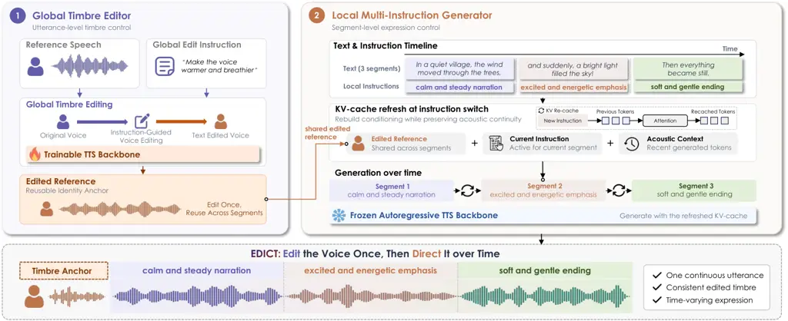
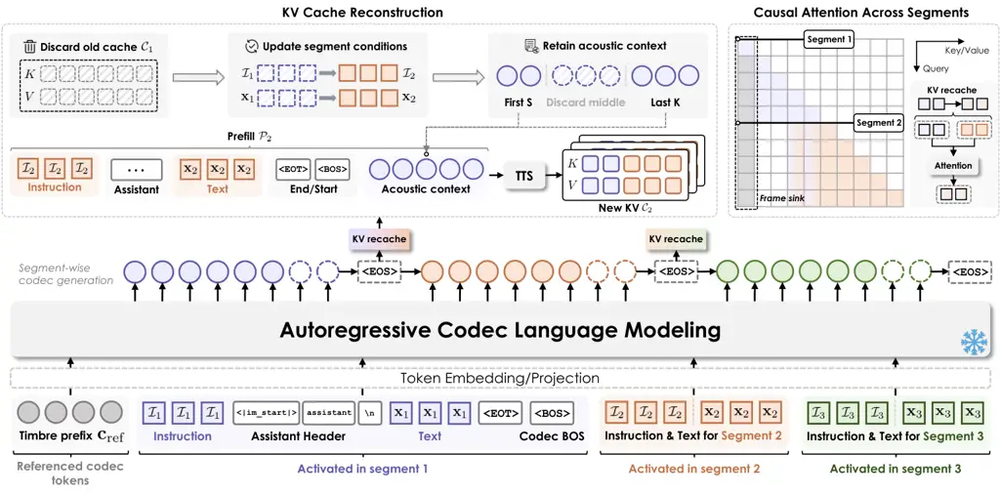
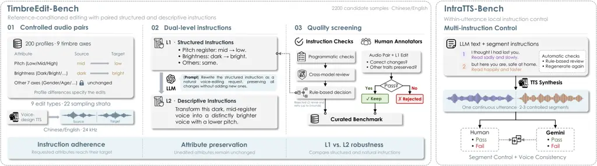
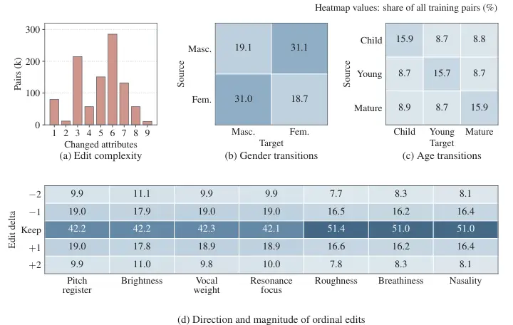
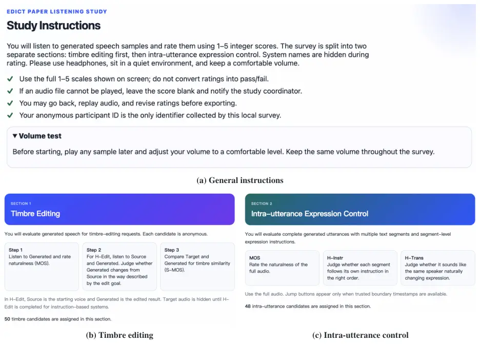
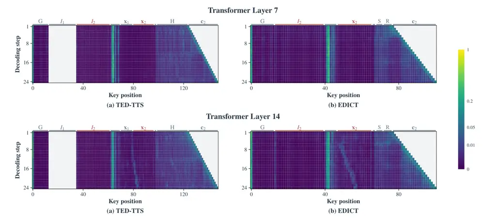
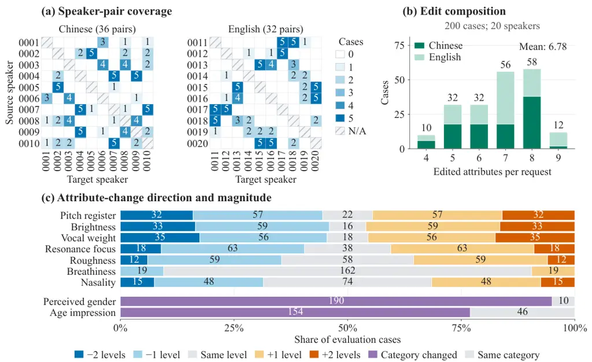

# Edit Who Speaks, Control How They Speak: Global Timbre Editing and Local Instruction Control for TTS

Junchuan Zhao Affiliation: National University of Singapore    Chenglin
Xu ^(†)^(†)thanks: Corresponding authors. Affiliation: LIGHTSPEED    Wei
Zeng Affiliation: National University of Singapore    Haoyang Li
Affiliation: Nanyang Technological University    Yiwen Guo    Ye Wang
Affiliation: National University of Singapore Affiliation: Independent
Researcher

###### Abstract

Instruction-based text-to-speech (TTS) offers control over voice
characteristics and speech expression through interfaces including voice
cloning and text-based voice design. Voice cloning reproduces a
reference voice, whereas text-based voice design creates a voice from a
natural-language description. However, neither interface directly
enables users to modify the timbre of a given reference and synthesize
speech with the modified voice. Meanwhile, utterance-level expressive
instructions leave changes across individual text segments
underspecified. We introduce EDICT, a framework that unifies global
timbre editing and local expressive control by using an edited acoustic
reference to anchor voice identity across segments. To enable synthesis
with an instruction-edited voice, EDICT combines reference audio with
structured timbre edits to generate an edited reference in codec-token
space. This representation serves as a shared voice anchor for a frozen
TTS backbone, allowing segment-specific natural-language instructions to
guide expression. To accommodate instruction changes while supporting
acoustic continuity, EDICT rebuilds the KV cache at each segment
boundary, refreshing instruction conditioning while retaining bounded
acoustic context from previously generated speech. Evaluations on our
proposed TimbreEdit-Bench and IntraTTS-Bench demonstrate improved timbre
editing and a favorable balance between local instruction adherence,
speaker consistency, and transition quality. Audio demos are available¹¹
1
[https://danny-nus.github.io/EDICT-demopage/](https://danny-nus.github.io/EDICT-demopage/).

|     |
| --- |
|     |

## 1 Introduction

Instruction-based TTS not only synthesizes speech from the given text
but also allows users to explicitly control voice characteristics and
speech delivery (Guo et al., 2023; Yang et al., 2024; Zhang et al.,
2026). Narration and dialog often require control at two temporal
scopes: voice characteristics should remain consistent throughout an
utterance, while speech delivery may vary across individual text
segments. For example, a brighter version of a reference voice may serve
as a shared voice anchor throughout an utterance, while the delivery
changes from calm to excited and finally to soft. We study TTS requests
that combine _global_ editing of a reference voice with _local_
instructions for successive segments of one utterance.

At the global level, existing approaches specify a target voice either
through an acoustic reference, as in voice cloning, or through a textual
description, as in voice design (Wang et al., 2023; Leng et al., 2024;
Hu et al., 2026a; Lee et al., 2026; Zhao et al., 2025).
Reference-conditioned editing provides a complementary interface: users
specify changes relative to an existing voice, while unspecified
attributes are intended to remain unchanged. Based on text-guided voice
conversion and editing (Hai et al., 2024; Anastassiou et al., 2024b;
Huang et al., 2024), we use the resulting edited voice as a shared
conditioning reference for synthesizing new text under changing delivery
instructions, thereby integrating timbre editing into the TTS pipeline.

At the local level, segment-specific instructions must align with their
text spans while preserving the globally edited voice characteristics
and maintaining natural transitions. Most instruction-based TTS systems
use a single prompt for the entire utterance, while only a few support
the association of individual text spans with their own instructions
within an utterance. TED-TTS establishes segment-aware emotion and
duration control, but its masking mechanism does not refresh the
acoustic history, allowing cached key–value (KV) states to carry
preceding conditions into later segments and cause _control leakage_ (Wu
et al., 2024; Jeong et al., 2025; Lemerle et al., 2025; Liang et al.,
2026). Retaining the full history may weaken new instructions, whereas
discarding it removes the context needed for natural continuation. Kang
et al. mitigate _style self-referencing_ through KV-cache swapping and
sliding-window attention, but focus on a single source-to-target
transition and report a trade-off between transition strength and
speaker similarity (Kang et al., 2026). EDICT rebuilds the cache at
every boundary from the current instruction, edited reference, and
bounded acoustic context, enabling repeated instruction switching while
preserving identity and natural transitions.

We introduce EDICT, a controllable TTS framework whose trainable timbre
editor maps a global request to attribute operations and edits the
source voice, producing a codec reference shared across all segments of
a frozen TTS backbone. To mitigate control leakage, EDICT reconstructs
the KV cache at instruction boundaries by recomputing selected initial
and recent acoustic states conditioned on the next text, instruction,
and shared reference. Initial context provides voice cues, while recent
context supports continuity. We propose TimbreEdit-Bench and
IntraTTS-Bench to evaluate, respectively, requested voice edits and
preservation of unspecified attributes, and local instruction following
with consistent speaker identity and natural transitions. Experiments on
Qwen3-TTS-VoiceDesign (Qwen3-TTS-VD) and CosyVoice 2 assess KV cache
reconstruction across backbones and its combination with timbre editing,
showing improved instruction following over the respective baselines for
timbre editing and intra-utterance control.

In summary, this paper makes the following contributions:

- •
  Reference-conditioned timbre editing for TTS. We develop a timbre
  editor that modifies a source voice through relative instructions,
  producing a reusable codec reference for new texts and delivery
  conditions.
- •
  Segment-level control through KV cache reconstruction. We reconstruct
  the retained acoustic context under new instructions to mitigate
  control leakage and balance local adherence with continuity, without
  additional backbone training.
- •
  Bilingual benchmarks and compositional evaluation. We introduce
  TimbreEdit-Bench and IntraTTS-Bench to evaluate global timbre editing,
  local instruction control, and their composition through objective
  metrics, listening tests, and ablations.

## 2 Related Work

#### Language-based voice and style control.

Early work represented speaking style through learned latent tokens
(Wang et al., 2018). PromptTTS, InstructTTS, PromptStyle, and
TextrolSpeech control voice and delivery through descriptions (Guo et
al., 2023; Yang et al., 2024; Liu et al., 2023; Ji et al., 2024). More
recent systems use language models to condition speech generation on
voice and delivery instructions (Zhou et al., 2024; Du et al., 2025; Hu
et al., 2026a; Yang et al., 2025b; Zhang et al., 2026). ControlSpeech
and FlexiVoice combine voice references with language-based style
control; ReStyle-TTS adjusts style relative to a reference, and Vevo
separates timbre and style prompts (Ji et al., 2025; Chen et al., 2026;
Li et al., 2026a; Zhang et al., 2025).

#### Reference-anchored voice editing.

Voice cloning specifies voices acoustically (Wang et al., 2023; Le et
al., 2023; Du et al., 2024), while voice design specifies them textually
(Leng et al., 2024; Shimizu et al., 2024; Hu et al., 2026b). Voice
editing applies instructed changes to a source voice (Huang et al.,
2024). VoxEditor represents relative attribute edits (Sheng et al.,
2025); DreamVoice and TES-VC use text-guided conversion (Hai et al.,
2024; Jin et al., 2025); VoiceShop supports selective voice changes
(Anastassiou et al., 2024b). Recent systems integrate editing with TTS
or unify generation and editing (Pei et al., 2026; Hai et al., 2026;
Wang et al., 2026a). EDICT produces a reusable edited codec reference
for subsequent TTS under changing local instructions. We evaluate
requested changes and preservation separately, since target-voice
matching does not establish preservation of unspecified attributes.

#### Local control and acoustic history.

Time-varying style and local prosody (Chen and Rudnicky, 2022; Lenglet
et al., 2023; Wu et al., 2024; Jeong et al., 2025) have expanded to
word-level styles, emotion trajectories, and timing control (Wang et
al., 2025a; Liu et al., 2026; Zhou et al., 2026b; Mai et al., 2026;
Lemerle et al., 2025). For training-free control, TED-TTS uses
segment-aware causal masking and monotonic alignment (Liang et al.,
2026). Kang et al. address acoustic _style self-referencing_ through
KV-cache swapping and sliding-window attention for a source-to-target
transition (Kang et al., 2026). EDICT recomputes retained acoustic
states at successive instruction switches and uses an edited reference
throughout the utterance. Appendix A defines the tasks and comparison
scope.

## 3 Methodology



Figure 1: EDICT combines global voice editing with local delivery
control. The trainable editor uses the source voice and global edit
instruction to generate an edited codec reference. This reference
conditions every segment of the frozen TTS backbone, whose KV cache is
rebuilt at instruction boundaries using selected acoustic context. The
segments form one continuous utterance.

### 3.1 Task Formulation and Overview

At inference, an LLM parses the global request into attribute
operations, the timbre editor produces an edited codec reference shared
across segments, and a frozen TTS backbone generates the segments
sequentially while rebuilding its KV cache at local-instruction
boundaries. Specifically, given a reference codec sequence
$`\mathbf{c}_{\mathrm{ref}}`$, a timbre-edit request
$`\mathcal{I}_{\mathrm{edit}}`$, and $`N`$ text–instruction pairs
$`\{(\mathbf{x}_{k},\mathcal{I}_{k})\}_{k=1}^{N}`$, EDICT generates
successive segments in a shared edited voice. As shown in Figure 1, a
learned editor $`p_{\theta}`$ and a frozen TTS model $`p_{\phi}`$ form a
two-stage cascade:

```math
\displaystyle\mathbf{c}^{\prime}_{\mathrm{ref}}\sim p_{\theta}\!\left(\cdot\mid\mathbf{c}_{\mathrm{ref}},\mathbf{z}_{\mathrm{edit}},\mathbf{x}_{\mathrm{edit}}\right),\quad\mathbf{c}_{1:N}\sim p_{\phi}\!\left(\cdot\mid\mathbf{c}^{\prime}_{\mathrm{ref}},\{(\mathbf{x}_{k},\mathcal{I}_{k})\}_{k=1}^{N}\right), \tag{1}
```

where $`\mathbf{z}_{\mathrm{edit}}`$ encodes the requested attribute
operations and $`\mathbf{x}_{\mathrm{edit}}`$ specifies the text spoken
in the edited reference. The edited codec reference conditions every
segment, while local instructions change their delivery.
Segment-boundary reconstruction produces one continuous codec stream for
waveform decoding.

### 3.2 Reference-Conditioned Timbre Editing

#### Attribute-based instruction encoding.

Following work on relative voice editing and perceptual voice-quality
control (Sheng et al., 2025; Rautenberg et al., 2025), we encode edits
along nine attributes: perceived gender, age impression, pitch register,
brightness, vocal weight, resonance focus, roughness, breathiness, and
nasality. Gender and age are categorical; the others use three ordered
levels, with definitions and values in Table 9 (Appendix B). At
inference, an LLM maps structured or descriptive
$`\mathcal{I}_{\mathrm{edit}}`$ to operations specifying direction and
magnitude for ordinal changes, target categories for categorical
changes, and \<keep\> for unmentioned attributes. For example,
\<brightness*up_1\> denotes low-to-mid or mid-to-high, while
\<brightness_up_2\> denotes low-to-high. Operations are serialized in a
fixed attribute order into $`\mathbf{z}*{\mathrm{edit}}`$ and
interpreted together with the acoustic reference. During training,
profile differences determine the operations.

#### Paired supervision.

Qwen3-14B (Yang et al., 2025a) describes source and target profiles, and
Qwen3-TTS-VD (Hu et al., 2026a) synthesizes their Chinese and English
speech under a shared neutral-delivery requirement. The requested edits
and keep operations are derived from differences between the source and
target profiles. Training tuples
$`(\mathbf{c}_{\mathrm{ref}},\mathbf{z}_{\mathrm{edit}},\mathbf{x}_{\mathrm{edit}},\mathbf{c}_{\mathrm{tgt}})`$
cover single-attribute and compositional edits with same or different
texts, within and across languages. The target transcript specifies the
edited reference’s content, allowing it to differ from the source.
Appendix B details construction and filtering.

#### Training.

We initialize the editor from Qwen3-TTS-Base (Hu et al., 2026a) and
perform supervised fine-tuning (SFT) to predict target codecs
conditioned on
$`g=(\mathbf{c}_{\mathrm{ref}},\mathbf{z}_{\mathrm{edit}},\mathbf{x}_{\mathrm{edit}})`$,
using teacher-forced cross-entropy over all codebooks at target audio
positions. We then apply reward-weighted DPO (Rafailov et al., 2023)
with auxiliary SFT, denoted wDPO. Candidates sampled from the frozen SFT
model $`p_{\mathrm{ref}}`$ are scored by WavLM speaker-embedding cosine
similarity to the paired target (Chen et al., 2022). These scores
determine preference pairs $`(\mathbf{c}_{g}^{+},\mathbf{c}_{g,j}^{-})`$
and positive reward-gap weights $`w_{g,j}`$. Defining
$`q_{\theta}(\mathbf{c}\mid g)=\log[p_{\theta}(\mathbf{c}\mid g)/p_{\mathrm{ref}}(\mathbf{c}\mid g)]`$,
we minimize:

```math
\mathcal{L}_{\mathrm{wDPO}}=-\frac{\sum_{(g,j)\in\mathcal{B}}w_{g,j}\log\sigma\!\left(\beta\left[q_{\theta}(\mathbf{c}_{g}^{+}\mid g)-q_{\theta}(\mathbf{c}_{g,j}^{-}\mid g)\right]\right)}{\sum_{(g,j)\in\mathcal{B}}w_{g,j}}+\lambda_{\mathrm{SFT}}\mathcal{L}_{\mathrm{SFT}}, \tag{2}
```

where $`\mathcal{B}`$ is a minibatch of preference pairs, $`\sigma`$ is
the sigmoid, $`\beta`$ scales the preference logit, and
$`\mathcal{L}_{\mathrm{SFT}}`$ is the codec cross-entropy on chosen
candidates. Preference pairs and weights remain fixed during
post-training. Appendix D.1 details candidate sampling, pair selection,
and training settings.



Figure 2: Segment-boundary KV cache reconstruction. Each non-final
\<EOS\> triggers a fresh prefill containing the next instruction and
text, the shared edited reference, and acoustic inputs from the first
$`S`$ and most recent $`K`$ generated positions. The upper-left panel
shows replacement of the old cache; the upper-right panel shows causal
attention after reconstruction. The lower timeline illustrates
successive instruction switches within one codec stream.

### 3.3 Segment-Level Instruction Control

The edited reference $`\mathbf{c}^{\prime}_{\mathrm{ref}}`$ remains
fixed across segments, while $`\mathcal{I}_{k}`$ controls each segment’s
emotion, speaking rate, or prosody. This stage uses a frozen
autoregressive TTS backbone and requires no additional training.
Figure 2 shows how generation proceeds across instruction boundaries.
Segment-aware masks such as those in TED-TTS (Liang et al., 2026)
restrict direct access to other segments’ conditions, but historical
acoustic states may still encode those conditions. Drawing on LongLive’s
recaching strategy (Yang et al., 2025c), we reconstruct these states
under the next instruction.

#### KV cache reconstruction.

A non-final \<EOS\> triggers replacement of
$`(\mathcal{I}_{k},\mathbf{x}_{k})`$ with
$`(\mathcal{I}_{k+1},\mathbf{x}_{k+1})`$. We assemble a fresh prefill
$`\mathcal{P}_{k+1}`$ containing the new instruction, shared edited
reference, new text, and native template and boundary tokens. We then
append acoustic input embeddings for the first $`S`$ and most recent
$`K`$ generated codec positions. The old KV cache is discarded, and a
causal forward pass through the frozen model reconstructs the entire
prefill cache:

```math
\mathcal{C}_{k+1}=\operatorname{Prefill}_{\phi}(\mathcal{P}_{k+1})=\left\{\left(\mathbf{K}_{\mathcal{P}_{k+1}}^{(\ell)},\mathbf{V}_{\mathcal{P}_{k+1}}^{(\ell)}\right)\right\}_{\ell=1}^{L}, \tag{3}
```

where $`L`$ is the number of Transformer layers. Acoustic input
embeddings are reused, but their keys and values are recomputed under
the updated conditions. Initial context retains evidence from the
utterance’s start; recent context supplies immediate continuation
history. Reconstruction bounds the retained history, while the cache
grows normally within each segment. Section 5.5 tests the role of each
context source and compares reconstruction with reuse of the old KV
states.

#### Continuous decoding.

For a single attention head, let $`j`$ index an acoustic input position
processed after the reconstructed prefill. The query
$`\mathbf{q}_{k+1,j}`$ attends to the rebuilt prefill and the current
segment’s acoustic inputs through position $`j`$ (layer indices
omitted):

```math
\operatorname{Attn}(\mathbf{q}_{k+1,j})=\operatorname{softmax}\!\left(\frac{\mathbf{q}_{k+1,j}[\mathbf{K}_{\mathcal{P}_{k+1}};\mathbf{K}_{k+1,\leq j}]^{\top}}{\sqrt{d_{h}}}\right)[\mathbf{V}_{\mathcal{P}_{k+1}};\mathbf{V}_{k+1,\leq j}], \tag{4}
```

where $`[\,;\,]`$ denotes concatenation along the sequence dimension,
$`d_{h}`$ is the head dimension, and
$`(\mathbf{K}_{k+1,\leq j},\mathbf{V}_{k+1,\leq j})`$ contains the
current segment’s KV states through input position $`j`$. These
positions are already observed inputs; the attention output is used to
predict the next codec frame. History omitted from the cache remains in
the output codec stream. Non-final \<EOS\> markers trigger
reconstruction without entering the acoustic output; the final \<EOS\>
ends generation. All segments are decoded into one waveform.
Appendix D.2 details decoding, and Appendix G visualizes attention
patterns.

## 4 Experiments



Figure 3: Benchmark construction and evaluation. Left: TimbreEdit-Bench
pairs source and target voices with editing instructions. Right:
IntraTTS-Bench aligns delivery instructions with successive text
segments.

### 4.1 Data and Benchmarks

#### Training data.

We construct 1M directed editing pairs from a synthetic Chinese–English
speech bank generated by Qwen3-TTS-VD using nine-attribute timbre
profiles. We use 5,800 profiles for training and hold out 200, excluding
held-out profiles from both sides of every training pair. Edit
operations are derived from source–target profile differences, covering
single-attribute and compositional edits within and across languages.
Offline post-training conditions are sampled from the same training
pairs. Appendix B details the construction and data distributions.

#### Evaluation benchmarks.

TimbreEdit-Bench contains 1,955 source–target pairs from 200 held-out
profiles across nine edit categories. Three annotators screen for
audible edits, attribute preservation, and audio quality; retained pairs
have semantically matched structured and descriptive instructions.
IntraTTS-Bench contains 997 requests with two or three text segments and
corresponding delivery instructions to evaluate local control and
continuity. Both benchmarks cover Chinese and English. Figure 3
summarizes the workflow, and Appendix C details construction and
screening.

### 4.2 Implementation Details

We initialize the editor from Qwen3-TTS-12Hz-1.7B-Base and fine-tune all
parameters, including codec predictors. SFT is followed by one round of
wDPO using preference pairs constructed from 20K training conditions,
with $`M=16`$ sampled candidates per condition. We set the DPO scale
$`\beta=0.1`$ and auxiliary SFT coefficient
$`\lambda_{\mathrm{SFT}}=0.01`$. Qwen3-14B parses editing requests.
Local generation uses frozen Qwen3-TTS-VD, with CosyVoice 2 as a second
backbone and default context $`(S,K)=(4,5)`$. For local control, Concat.
synthesizes segments independently, Joint prompts the complete utterance
in one pass, and our TED-TTS adaptation switches segment conditions
through attention masking and monotonic alignment without KV cache
reconstruction. Appendix D provides the remaining training settings and
baseline and ablation configurations.

### 4.3 Evaluation Metrics

Chinese CER and English WER assess intelligibility; UTMOS (Saeki et al., 2022) and DNSMOS OVRL (Reddy et al., 2022) estimate perceptual quality.
WavLM (Chen et al., 2022) and ERes2Net (Chen et al., 2023) measure
target/source similarity (SIM-T/R); WavLM also measures inter-segment
similarity (SIM-I). Following InstructTTSEval (Huang et al., 2025),
Gemini 3.1 Pro evaluates instruction compliance (SegAcc), requested
emotion (EmoAcc), transitions (Trans), and attribute-level editing
(Up/Down, Category, and Preservation). Human evaluation uses five-point
ratings of naturalness (N-MOS), edit accuracy (Edit-MOS), target
similarity (S-MOS), instruction following (Instr-MOS), and transitions
(Trans-MOS), with 95% confidence intervals from audio-item
bootstrapping. Appendix D provides training settings, baseline and
ablation configurations.

## 5 Results

|                                   |             |                           |                   |                    |                   |       |                        |                   |       |                        |
| --------------------------------- | ----------- | ------------------------- | ----------------- | ------------------ | ----------------- | ----- | ---------------------- | ----------------- | ----- | ---------------------- |
| System                            | Instruction | Content and quality       |                   |                    | WavLM             |       |                        | ERes2Net          |       |                        |
|                                   |             | WER/CER (%)$`\downarrow`$ | UTMOS$`\uparrow`$ | DNSMOS$`\uparrow`$ | SIM-T$`\uparrow`$ | SIM-R | $`\Delta\uparrow`$     | SIM-T$`\uparrow`$ | SIM-R | $`\Delta\uparrow`$     |
| Instruction-conditioned systems   |             |                           |                   |                    |                   |       |                        |                   |       |                        |
| Qwen3-TTS-VD                      | Structured  | 4.5 / 0.3                 | 3.861             | 3.946              | 0.701             | 0.871 | $`\underline{-0.170}`$ | 0.450             | 0.745 | $`\underline{-0.295}`$ |
|                                   | Descriptive | 3.0 / 0.3                 | 3.830             | 3.965              | 0.676             | 0.832 | $`\underline{-0.156}`$ | 0.435             | 0.714 | $`\underline{-0.279}`$ |
| Qwen3-TTS-Base                    | Structured  | 5.1 / 1.9                 | 3.742             | 3.805              | 0.632             | 0.950 | $`-0.318`$             | 0.431             | 0.845 | $`-0.414`$             |
|                                   | Descriptive | 3.3 / 1.1                 | 3.756             | 3.776              | 0.637             | 0.950 | $`-0.313`$             | 0.434             | 0.849 | $`-0.415`$             |
| CosyVoice 2                       | Structured  | 6.9 / 4.2                 | 3.941             | 4.065              | 0.646             | 0.918 | $`-0.272`$             | 0.396             | 0.825 | $`-0.429`$             |
|                                   | Descriptive | 7.9 / 2.5                 | 4.021             | 4.104              | 0.644             | 0.937 | $`-0.293`$             | 0.419             | 0.854 | $`-0.435`$             |
| EDICT-Stage I                     | Structured  | 4.1 / 1.7                 | 3.830             | 3.942              | 0.819             | 0.620 | 0.199                  | 0.653             | 0.442 | 0.211                  |
|                                   | Descriptive | 4.0 / 1.1                 | 3.816             | 3.963              | 0.793             | 0.598 | 0.195                  | 0.648             | 0.441 | 0.207                  |
| Target-reference voice conversion |             |                           |                   |                    |                   |       |                        |                   |       |                        |
| FreeVC                            | N/A         | 3.2 / 2.0                 | 3.911             | 3.968              | 0.873             | 0.671 | 0.202                  | 0.570             | 0.387 | 0.183                  |
| Seed-VC                           | N/A         | 3.0 / 2.5                 | 3.342             | 3.893              | 0.957             | 0.659 | 0.298                  | 0.889             | 0.463 | 0.427                  |

Table 1: Objective results on TimbreEdit-Bench. WER/CER reports English
WER / Chinese CER in percent. SIM-T/R denotes target/source similarity;
$`\Delta=\mathrm{SIM\text{-}T}-\mathrm{SIM\text{-}R}`$. Best and
second-best scores within each instruction form are bold and underlined,
with CER and WER ranked separately; SIM-R is unranked. Target-reference
voice conversion receives target audio and is evaluated separately on a
same-text subset, with its best similarity and $`\Delta`$ scores in
bold.

### 5.1 Timbre Editing

Table 1 shows that EDICT-Stage I (Section 3.2) achieves the highest
SIM-T among instruction-conditioned systems under both instruction
forms, with gains on both ERes2Net and WavLM, the training-reward
encoder. Unlike these baselines, its outputs are closer to the target
than the source, with competitive predicted quality but not consistently
the lowest recognition error. FreeVC (Li et al., 2023) and Seed-VC
receive target-speaker audio and are evaluated on a separate same-text
subset, providing an upper-bound setting with directly available target
timbre. Our setting instead infers target timbre from source audio and
an editing instruction. Results with human-recorded ESD references
appear in Appendix H.1. Since target similarity does not establish
attribute preservation, Table 2 evaluates requested operations and
unchanged attributes separately. EDICT-Stage I leads in edit direction
and categorical accuracy under both instruction forms, while
Qwen3-TTS-VD better preserves unchanged attributes but follows edits
less reliably, highlighting a trade-off between edit accuracy and
preservation. Up/Down measures direction rather than magnitude;
Appendix H.2 details the protocol.

| System         | Instruction | Up Acc.$`\uparrow`$ | Down Acc.$`\uparrow`$ | Category Acc.$`\uparrow`$ | Preservation$`\uparrow`$ |
| -------------- | ----------- | ------------------- | --------------------- | ------------------------- | ------------------------ |
| Qwen3-TTS-VD   | Structured  | 67.0                | 64.3                  | 53.2                      | 83.3                     |
|                | Descriptive | 60.0                | 63.0                  | 49.8                      | 85.0                     |
| Qwen3-TTS-Base | Structured  | 62.3                | 54.5                  | 46.4                      | 45.7                     |
|                | Descriptive | 66.0                | 54.5                  | 50.0                      | 45.6                     |
| CosyVoice 2    | Structured  | 68.1                | 65.5                  | 57.7                      | 68.2                     |
|                | Descriptive | 72.2                | 73.3                  | 69.0                      | 66.2                     |
| EDICT-Stage I  | Structured  | 70.8                | 80.6                  | 89.3                      | 66.7                     |
|                | Descriptive | 77.9                | 79.1                  | 91.7                      | 70.1                     |

Table 2: Attribute-operation accuracy (%) on 500 TimbreEdit-Bench
requests. Gemini compares source and generated audio without the target
recording. Up/Down assesses ordinal direction, Category assesses
categorical targets, and Preservation assesses unchanged attributes.
Best and second-best scores within each instruction form are bold and
underlined.

### 5.2 Intra-Utterance Instruction Control

Table 3 exhibits a consistent trend across Qwen3-TTS-VD and CosyVoice 2:
the system with individual synthesis and concatenation (Concat.) yields
the strongest segment-level and emotion accuracy but weaker transitions,
while Joint favors speaker consistency over local instruction adherence.
EDICT-Stage II achieves the best transitions and consistently improves
SegAcc, EmoAcc, and SIM-I over TED-TTS across both backbones. Despite
the different absolute control scores of the two backbones, EDICT-Stage
II consistently improves SegAcc, EmoAcc, and transition quality over
TED-TTS. It indicats that the benefit of KV cache reconstruction extends
beyond Qwen3-TTS-VD. This improvement comes with higher WER/CER than the
Joint setting, but only modest increases over TED-TTS. Speaker
consistency remains comparable to TED-TTS, while predicted speech
quality changes only slightly. Overall, KV cache reconstruction improves
local instruction adherence and transition quality with a modest
trade-off in content fidelity. Appendix H.3 reports complementary
MED-TTS results.

| System                        | Control (%)        |                    |                   | Consistency       | Content and quality       |                   |                    |
| ----------------------------- | ------------------ | ------------------ | ----------------- | ----------------- | ------------------------- | ----------------- | ------------------ |
|                               | SegAcc$`\uparrow`$ | EmoAcc$`\uparrow`$ | Trans$`\uparrow`$ | SIM-I$`\uparrow`$ | WER/CER (%)$`\downarrow`$ | UTMOS$`\uparrow`$ | DNSMOS$`\uparrow`$ |
| Qwen3-TTS-VD (Concat.)        | 92.44              | 92.66              | 60.68             | 0.658             | 4.5 / 0.9                 | 3.266             | 3.939              |
| Qwen3-TTS-VD (Joint)          | 66.80              | 66.37              | 70.66             | 0.922             | 3.8 / 1.3                 | 3.794             | 3.952              |
| Qwen3-TTS-VD (TED-TTS)        | 74.25              | 74.02              | 78.03             | 0.911             | 4.5 / 1.7                 | 3.655             | 3.853              |
| Qwen3-TTS-VD (EDICT-Stage II) | 82.30              | 83.60              | 82.00             | 0.915             | 5.1 / 1.8                 | 3.631             | 3.930              |
| CosyVoice 2 (Concat.)         | 62.43              | 62.73              | 31.80             | 0.917             | 6.5 / 3.6                 | 3.916             | 3.866              |
| CosyVoice 2 (Joint)           | 49.68              | 50.19              | 69.71             | 0.939             | 5.4 / 3.1                 | 3.877             | 3.897              |
| CosyVoice 2 (TED-TTS)         | 58.10              | 58.00              | 63.94             | 0.920             | 7.5 / 4.6                 | 4.021             | 3.828              |
| CosyVoice 2 (EDICT-Stage II)  | 60.56              | 60.10              | 76.20             | 0.924             | 8.1 / 5.5                 | 3.978             | 3.844              |

Table 3: Intra-utterance instruction control on IntraTTS-Bench. SegAcc,
EmoAcc, and Trans measure instruction adherence, emotion realization,
and transition quality in percent. SIM-I measures inter-segment speaker
similarity; WER/CER reports English WER / Chinese CER in percent. Best
and second-best scores within each backbone are bold and underlined,
with CER and WER ranked separately.

### 5.3 Joint Timbre and Delivery Control

We combine the reference or edited audio from TimbreEdit-Bench with the
texts and delivery instructions from IntraTTS-Bench. Qwen3-TTS-VD
(Joint) and Qwen3-TTS-VD (Concat.) take the original reference audio and
a global editing instruction as input. EDICT Stage I + Concat. and the
EDICT pipeline use the same edited reference, followed by either
independent synthesis and concatenation or continuous generation with KV
cache reconstruction, respectively. Table 4 highlights the importance
and complementary contributions of the two stages. Compared with
Qwen3-TTS-VD (Concat.), incorporating the timbre editor (EDICT Stage I)
improves target matching, but independently synthesized segments and
concatenation (Concat.) still exhibit weak transitions in EDICT Stage
I + Concat.. By further replacing the Concat. with KV cache
reconstruction, EDICT improves temporal continuity and speaker
consistency, albeit at the cost of lower segment-level accuracy and a
higher recognition error rate. The EDICT system achieves the highest
target similarity and predicted perceptual quality, while maintaining
speaker consistency close to that of Qwen3-TTS-VD (Joint). These results
demonstrate that an edited reference can effectively guide local
delivery changes within a single utterance, although KV cache
reconstruction does not fully preserve the segment-level accuracy
achieved by independent synthesis.

| Configuration           | Control (%)        |                   | Content and quality       |                   |                    | Consistency       | SIM-T$`\uparrow`$ |          |
| ----------------------- | ------------------ | ----------------- | ------------------------- | ----------------- | ------------------ | ----------------- | ----------------- | -------- |
|                         | SegAcc$`\uparrow`$ | Trans$`\uparrow`$ | WER/CER (%)$`\downarrow`$ | UTMOS$`\uparrow`$ | DNSMOS$`\uparrow`$ | SIM-I$`\uparrow`$ | WavLM             | ERes2Net |
| Qwen3-TTS-VD (Joint)    | 60.19              | 70.07             | 3.6 / 1.2                 | 3.339             | 3.869              | 0.918             | 0.683             | 0.395    |
| Qwen3-TTS-VD (Concat.)  | 86.43              | 56.69             | 4.5 / 0.8                 | 3.669             | 3.895              | 0.884             | 0.694             | 0.405    |
| EDICT Stage I + Concat. | 91.17              | 58.47             | 4.8 / 1.1                 | 3.296             | 3.739              | 0.881             | 0.749             | 0.598    |
| EDICT                   | 81.62              | 83.45             | 5.1 / 1.9                 | 3.795             | 3.921              | 0.917             | 0.788             | 0.609    |

Table 4: Joint timbre and delivery control with Qwen3-TTS-VD. Requests
combine TimbreEdit-Bench voice edits with IntraTTS-Bench texts and
delivery instructions. SIM-T compares the complete output with the
target voice; SIM-I measures inter-segment speaker similarity. WER/CER
reports English WER / Chinese CER in percent. Best and second-best
scores are bold and underlined, with CER and WER ranked separately.

### 5.4 Subjective Evaluation

Figure 4 presents the results of the subjective listening tests. For
timbre editing, EDICT Stage I achieves the highest mean ratings for edit
accuracy and target similarity among instruction-conditioned systems,
while maintaining naturalness comparable to Qwen3-TTS-VD. Seed-VC
attains higher target similarity, but it is conditioned directly on the
target audio rather than a textual instruction. For intra-utterance
control, Concat. performs best in instruction following but receives the
lowest transition-quality rating, highlighting the discontinuities
introduced by independent segment synthesis. EDICT Stage II outperforms
TED-TTS in both instruction following and transition quality, while
achieving naturalness and transition quality close to those of Joint.
These subjective ratings draw same conclusions as in the objective
evaluations.

Figure 4: Subjective evaluation of timbre editing and local control.
Bars show mean five-point ratings from 19 listeners; error bars are
computed from 95% bootstrap confidence intervals over audio items. Each
system has 10 items in (a) and 12 in (b). EDICT is highlighted in coral;
all variants in (b) use Qwen3-TTS-VD. $`\dagger`$Seed-VC receives target
audio and is not rated for instruction-based edit accuracy.

### 5.5 Ablation Studies

#### Timbre-editor training.

Table 5 shows that more SFT data improves target matching for structured
instructions, but gives mixed results for descriptive instructions. A
larger candidate pool improves DPO’s SIM-T under both instruction forms.
wDPO achieves the highest SIM-T, but yields higher Chinese CER than SFT
(1M), with mixed changes in predicted speech quality. Appendix H.2
provides further ablations.

| Configuration   | Instruction | WER/CER (%)$`\downarrow`$ | UTMOS$`\uparrow`$ | DNSMOS$`\uparrow`$ | SIM-T$`\uparrow`$ |          |
| --------------- | ----------- | ------------------------- | ----------------- | ------------------ | ----------------- | -------- |
|                 |             |                           |                   |                    | WavLM             | ERes2Net |
| SFT (0.5M)      | Structured  | 3.9 / 1.5                 | 3.689             | 3.895              | 0.736             | 0.498    |
|                 | Descriptive | 4.2 / 1.5                 | 3.708             | 3.885              | 0.698             | 0.481    |
| SFT (1M)        | Structured  | 4.1 / 0.9                 | 3.936             | 3.896              | 0.757             | 0.561    |
|                 | Descriptive | 3.9 / 0.9                 | 3.666             | 3.913              | 0.693             | 0.556    |
| DPO ($`M=4`$)   | Structured  | 5.1 / 1.5                 | 3.885             | 3.962              | 0.761             | 0.552    |
|                 | Descriptive | 4.6 / 1.4                 | 3.768             | 3.909              | 0.711             | 0.543    |
| DPO ($`M=16`$)  | Structured  | 4.5 / 1.7                 | 3.786             | 3.867              | 0.778             | 0.626    |
|                 | Descriptive | 4.1 / 1.6                 | 3.724             | 3.906              | 0.726             | 0.634    |
| wDPO ($`M=16`$) | Structured  | 4.1 / 1.7                 | 3.830             | 3.942              | 0.819             | 0.653    |
|                 | Descriptive | 4.0 / 1.1                 | 3.816             | 3.963              | 0.793             | 0.648    |

Table 5: Timbre-editor training ablations on TimbreEdit-Bench. All
post-training variants start from SFT (1M). $`M`$ denotes the candidate
count per condition; wDPO includes auxiliary SFT as defined in
Equation 2. SIM-T measures target-voice similarity; WER/CER reports
English WER / Chinese CER in percent. Best and second-best scores within
each instruction form are bold and underlined, with CER and WER ranked
separately.

#### KV cache reconstruction.

Table 6 compares reconstruction with retaining or truncating the
existing cache. Reconstruction improves all three control metrics over
both alternatives, indicating that shortening the cache alone does not
account for the gains. Removing initial context improves local accuracy
but weakens speaker consistency; removing recent context sharply
degrades transitions. These complementary effects support using initial
context for voice stability and recent context for continuation.
Reconstruction also produces higher recognition error than the
persistent cache, consistent with the cost in content fidelity seen in
the main comparison. Appendix H.3 reports context-length sweeps.

|                     |                    |                    |                   |                   |                           |                   |                    |
| ------------------- | ------------------ | ------------------ | ----------------- | ----------------- | ------------------------- | ----------------- | ------------------ |
| Configuration       | Control (%)        |                    |                   | Consistency       | Content and quality       |                   |                    |
|                     | SegAcc$`\uparrow`$ | EmoAcc$`\uparrow`$ | Trans$`\uparrow`$ | SIM-I$`\uparrow`$ | WER/CER (%)$`\downarrow`$ | UTMOS$`\uparrow`$ | DNSMOS$`\uparrow`$ |
| Persistent KV cache | 54.25              | 54.02              | 68.00             | 0.918             | 3.9 / 0.8                 | 3.555             | 3.953              |
| Truncated KV cache  | 58.05              | 56.70              | 64.94             | 0.892             | 4.4 / 1.1                 | 3.278             | 3.905              |
| EDICT-Stage II      | 82.30              | 83.60              | 82.00             | 0.915             | 5.1 / 1.8                 | 3.631             | 3.930              |
| w/o initial context | 89.29              | 89.00              | 79.99             | 0.863             | 4.3 / 1.4                 | 3.585             | 3.896              |
| w/o recent context  | 81.15              | 82.26              | 55.32             | 0.875             | 4.2 / 1.1                 | 3.548             | 3.830              |

Table 6: KV cache reconstruction ablations on IntraTTS-Bench. All
variants use Qwen3-TTS-VD. The full configuration retains the first
$`S=4`$ and most recent $`K=5`$ acoustic positions; the context
ablations remove one of these groups. Persistent and truncated caches
reuse old KV states, whereas EDICT recomputes them. Best and second-best
scores are bold and underlined, with WER and CER ranked separately.

## 6 Conclusion

In this paper, we present EDICT, a framework for combining
reference-conditioned timbre editing with intra-utterance instruction
control in text-to-speech synthesis. An attribute-based timbre editor
produces an edited reference that anchors the shared voice, while
segment-wise KV cache reconstruction updates local delivery conditions
and retains selected acoustic context. We introduce TimbreEdit-Bench and
IntraTTS-Bench to evaluate these complementary forms of control.
Objective evaluations, subjective listening tests, and ablation studies
demonstrate improved timbre-edit accuracy and target-voice matching,
alongside a favorable balance between local instruction adherence, voice
consistency, and natural transitions. Joint-control experiments further
show that edited references can support successive delivery changes
within a single utterance. Future work will expand the timbre-editing
data to cover more diverse voice characteristics and editing requests,
and explore applications in conversational speech generation.

### AI use statement

We used generative AI tools to assist in constructing synthetic training
data and benchmarks, including instruction generation and request
parsing, as detailed in Appendix C. Generative AI was also used in the
automatic evaluation of generated speech; the corresponding judge
prompts, evaluation protocols, and human verification procedures are
described in Appendix E. In addition, LLMs were used for language
refinement. All generated materials, evaluation procedures, and
manuscript content were reviewed and validated by the authors, who take
full responsibility for the final content of this work.

## References

- Anastassiou et al. (2024a) P. Anastassiou, J. Chen, J. Chen, Y.
  Chen, Z. Chen, Z. Chen, J. Cong, L. Deng, C. Ding, L. Gao, et al.
  Seed-tts: a family of high-quality versatile speech generation models.
  arXiv preprint arXiv:2406.02430. Cited by: Appendix A.
- Anastassiou et al. (2024b) P. Anastassiou, Z. Tang, K. Peng, D.
  Jia, J. Li, M. Tu, Y. Wang, Y. Wang, and M. Ma Voiceshop: a unified
  speech-to-speech framework for identity-preserving zero-shot voice
  editing. arXiv preprint arXiv:2404.06674. Cited by: §1, §2.
- Chen et al. (2026) D. Chen, X. Zhang, Y. Wang, K. Dai, L. Ma, and Z.
  Wu FlexiVoice: Enabling Flexible Style Control in Zero-Shot TTS with
  Natural Language Instructions. In International Conference on Learning
  Representations (ICLR), Cited by: Table 8, §2.
- Chen and Rudnicky (2022) L. Chen and A. I. Rudnicky Fine-grained style
  control in transformer-based text-to-speech synthesis. In IEEE
  International Conference on Acoustics, Speech and Signal Processing,
  ICASSP 2022, Virtual and Singapore, May 23–27, 2022, pp. 7907–7911.
  External Links:
  [Document](https://dx.doi.org/10.1109/ICASSP43922.2022.9747747) Cited
  by: §2.
- Chen et al. (2022) S. Chen, C. Wang, Z. Chen, Y. Wu, S. Liu, Z.
  Chen, J. Li, N. Kanda, T. Yoshioka, X. Xiao, et al. Wavlm: large-scale
  self-supervised pre-training for full stack speech processing. IEEE
  Journal of Selected Topics in Signal Processing 16 (6), pp. 1505–1518.
  Cited by: §D.1, §3.2, §4.3.
- Chen et al. (2023) Y. Chen, S. Zheng, H. Wang, L. Cheng, Q. Chen,
  and J. Qi An enhanced res2net with local and global feature fusion for
  speaker verification. In 24th Annual Conference of the International
  Speech Communication Association, Interspeech 2023, Dublin, Ireland,
  August 20-24, 2023, pp. 2228–2232. External Links:
  [Document](https://dx.doi.org/10.21437/INTERSPEECH.2023-1294) Cited
  by: §4.3.
- Chen et al. (2025) Y. Chen, Z. Niu, Z. Ma, K. Deng, C. Wang, J.
  Zhao, K. Yu, and X. Chen F5-TTS: A fairytaler that fakes fluent and
  faithful speech with flow matching. In Proceedings of the 63rd Annual
  Meeting of the Association for Computational Linguistics (Volume 1:
  Long Papers), ACL 2025, Vienna, Austria, July 27 - August 1, 2025,
  pp. 6255–6271. External Links:
  [Document](https://dx.doi.org/10.18653/V1/2025.ACL-LONG.313) Cited by:
  Appendix A.
- Du et al. (2025) Z. Du, C. Gao, Y. Wang, F. Yu, T. Zhao, H. Wang, X.
  Lv, H. Wang, C. Ni, X. Shi, et al. Cosyvoice 3: towards in-the-wild
  speech generation via scaling-up and post-training. arXiv preprint
  arXiv:2505.17589. Cited by: §2.
- Du et al. (2024) Z. Du, Y. Wang, Q. Chen, X. Shi, X. Lv, T. Zhao, Z.
  Gao, Y. Yang, C. Gao, H. Wang, et al. Cosyvoice 2: scalable streaming
  speech synthesis with large language models. arXiv preprint
  arXiv:2412.10117. Cited by: Table 8, §2.
- Guo et al. (2023) Z. Guo, Y. Leng, Y. Wu, S. Zhao, and X. Tan
  Prompttts: controllable text-to-speech with text descriptions. In IEEE
  International Conference on Acoustics, Speech and Signal Processing
  ICASSP 2023, Rhodes Island, Greece, June 4-10, 2023, pp. 1–5. External
  Links:
  [Document](https://dx.doi.org/10.1109/ICASSP49357.2023.10096285) Cited
  by: §1, §2.
- Hai et al. (2026) J. Hai, K. Thakkar, K. Chen, Y. Wang, J. Su, R.
  Kumar, M. Elhilali, and Z. Jin VoiceDesigner: text-to-voice generation
  and editing via unified diffusion modeling and data augmentation.
  arXiv preprint arXiv:2608.13613. Cited by: §2.
- Hai et al. (2024) J. Hai, K. Thakkar, H. Wang, Z. Qin, and M. Elhilali
  DreamVoice: text-guided voice conversion. In 25th Annual Conference of
  the International Speech Communication Association, Interspeech 2024,
  Kos, Greece, September 1-5, 2024, External Links:
  [Document](https://dx.doi.org/10.21437/INTERSPEECH.2024-1432) Cited
  by: Table 8, §1, §2.
- Hu et al. (2026a) H. Hu, X. Zhu, T. He, D. Guo, B. Zhang, X. Wang, Z.
  Guo, Z. Jiang, H. Hao, Z. Guo, et al. Qwen3-tts technical report.
  arXiv preprint arXiv:2601.15621. Cited by: Table 8, Table 8, Appendix
  B, §1, §2, §3.2, §3.2.
- Hu et al. (2026b) J. Hu, H. Chen, L. Ma, D. Guo, Q. Zhan, W. Li, H.
  Zhang, K. Xia, Z. Zhang, W. Tian, et al. Voicesculptor: your voice,
  designed by you. arXiv preprint arXiv:2601.10629. Cited by: Table 8,
  §2.
- Huang et al. (2025) K. Huang, Q. Tu, L. Fan, C. Yang, D. Zhang, S.
  Li, Z. Fei, Q. Cheng, and X. Qiu Instructttseval: benchmarking complex
  natural-language instruction following in text-to-speech systems.
  arXiv preprint arXiv:2506.16381. Cited by: §4.3.
- Huang et al. (2024) R. Huang, R. Hu, Y. Wang, Z. Wang, X. Cheng, Z.
  Jiang, Z. Ye, D. Yang, L. Liu, P. Gao, and Z. Zhao InstructSpeech:
  following speech editing instructions via large language models. In
  Forty-first International Conference on Machine Learning, ICML 2024,
  Vienna, Austria, July 21-27, 2024, Proceedings of Machine Learning
  Research, Vol. 235, pp. 19886–19903. Cited by: §1, §2.
- Hussain et al. (2025) S. S. Hussain, P. Neekhara, X. Yang, E.
  Casanova, S. Ghosh, R. Fejgin, M. T. Desta, R. Valle, and J. Li
  Koel-tts: enhancing LLM based speech generation with preference
  alignment and classifier free guidance. In Proceedings of the 2025
  Conference on Empirical Methods in Natural Language Processing, EMNLP
  2025, Suzhou, China, November 4-9, 2025, pp. 21219–21234. External
  Links: [Document](https://dx.doi.org/10.18653/V1/2025.EMNLP-MAIN.1076)
  Cited by: §D.1.
- Jeong et al. (2025) J. Jeong, Y. Lee, M. Kwon, and Y. Uh TTS-ctrlnet:
  time varying emotion aligned text-to-speech generation with
  controlnet. arXiv preprint arXiv:2507.04349. Cited by: §1, §2.
- Ji et al. (2025) S. Ji, Q. Chen, W. Wang, J. Zuo, M. Fang, Z.
  Jiang, H. Huang, Z. Wang, X. Cheng, S. Zheng, and Z. Zhao
  ControlSpeech: towards simultaneous and independent zero-shot speaker
  cloning and zero-shot language style control. In Proceedings of the
  63rd Annual Meeting of the Association for Computational Linguistics,
  Volume 1: Long Papers, ACL 2025, Vienna, Austria, July 27–August 1,
  2025, pp. 6966–6981. External Links:
  [Document](https://dx.doi.org/10.18653/V1/2025.ACL-LONG.346) Cited by:
  §2.
- Ji et al. (2024) S. Ji, J. Zuo, M. Fang, Z. Jiang, F. Chen, X.
  Duan, B. Huai, and Z. Zhao TextrolSpeech: A text style control speech
  corpus with codec language text-to-speech models. In IEEE
  International Conference on Acoustics, Speech and Signal Processing,
  ICASSP 2024, Seoul, Republic of Korea, April 14-19, 2024,
  pp. 10301–10305. External Links:
  [Document](https://dx.doi.org/10.1109/ICASSP48485.2024.10445879) Cited
  by: §2.
- Jin et al. (2025) J. Jin, Z. Yang, Y. Zhou, and Z. Wu In this
  environment, as that speaker: a text-driven framework for
  multi-attribute speech conversion. In 26th Annual Conference of the
  International Speech Communication Association, Interspeech 2025,
  Rotterdam, The Netherlands, August 17–21, 2025, External Links:
  [Document](https://dx.doi.org/10.21437/INTERSPEECH.2025-2697) Cited
  by: §2.
- Jin et al. (2024) Z. Jin, J. Jia, Q. Wang, K. Li, S. Zhou, S. Zhou, X.
  Qin, and Z. Wu SpeechCraft: A fine-grained expressive speech dataset
  with natural language description. In Proceedings of the 32nd ACM
  International Conference on Multimedia, MM 2024, Melbourne, VIC,
  Australia, 28 October 2024 - 1 November 2024, pp. 1255–1264. External
  Links: [Document](https://dx.doi.org/10.1145/3664647.3681674) Cited
  by: Appendix B.
- Ju et al. (2024) Z. Ju, Y. Wang, K. Shen, X. Tan, D. Xin, D. Yang, E.
  Liu, Y. Leng, K. Song, S. Tang, Z. Wu, T. Qin, X. Li, W. Ye, S.
  Zhang, J. Bian, L. He, J. Li, and S. Zhao NaturalSpeech 3: zero-shot
  speech synthesis with factorized codec and diffusion models. In
  Forty-first International Conference on Machine Learning, ICML 2024,
  Vienna, Austria, July 21-27, 2024, Proceedings of Machine Learning
  Research, Vol. 235, pp. 22605–22623. Cited by: Appendix A.
- Kang et al. (2026) J. Kang, Y. Lee, Y. Park, and K. Shim Unlocking
  fine-grained and within-utterance speaking style control in
  prompt-based text-to-speech models. arXiv preprint arXiv:2605.27376.
  Cited by: §1, §2.
- Lan et al. (2026) T. Lan, Y. Guo, M. Deng, J. Wang, W. Wang, and C.
  Feng Controllable timbre cloning and style replication with reference
  speech examples for multimodal human-computer interaction.
  Neurocomputing 670, pp. 132529. External Links:
  [Document](https://dx.doi.org/10.1016/J.NEUCOM.2025.132529) Cited by:
  Appendix A.
- Le et al. (2023) M. Le, A. Vyas, B. Shi, B. Karrer, L. Sari, R.
  Moritz, M. Williamson, V. Manohar, Y. Adi, J. Mahadeokar, and W. Hsu
  Voicebox: text-guided multilingual universal speech generation at
  scale. In Advances in Neural Information Processing Systems 36: Annual
  Conference on Neural Information Processing Systems 2023, NeurIPS
  2023, New Orleans, LA, USA, December 10 - 16, 2023, Cited by: §2.
- Lee et al. (2026) Y. Lee, H. Park, J. Park, and J. Lee FC-TTS: style
  and timbre control in zero-shot text-to-speech with disentangled
  speech representations. In Proceedings of the 64th Annual Meeting of
  the Association for Computational Linguistics (Volume 1: Long Papers),
  ACL 2026, San Diego, California, United States, July 2-7, 2026,
  pp. 3772–3791. External Links:
  [Document](https://dx.doi.org/10.18653/V1/2026.ACL-LONG.173) Cited by:
  Appendix A, §1.
- Lemerle et al. (2025) T. Lemerle, N. Obin, and A. Roebel Lina-Style:
  Word-Level Style Control in TTS via Interleaved Synthetic Data. In
  13th Speech Synthesis Workshop (SSW), pp. 35–39. External Links:
  [Document](https://dx.doi.org/10.21437/SSW.2025-6) Cited by: §1, §2.
- Leng et al. (2024) Y. Leng, Z. Guo, K. Shen, Z. Ju, X. Tan, E. Liu, Y.
  Liu, D. Yang, L. Zhang, K. Song, L. He, X. Li, S. Zhao, T. Qin, and J.
  Bian PromptTTS 2: describing and generating voices with text prompt.
  In The Twelfth International Conference on Learning Representations,
  ICLR 2024, Vienna, Austria, May 7-11, 2024, Cited by: §1, §2.
- Lenglet et al. (2023) M. Lenglet, O. Perrotin, and G. Bailly Local
  style tokens: fine-grained prosodic representations for TTS expressive
  control. In 12th ISCA Speech Synthesis Workshop, SSW 2023, Grenoble,
  France, August 26–28, 2023, pp. 120–126. External Links:
  [Document](https://dx.doi.org/10.21437/SSW.2023-19) Cited by: §2.
- Li et al. (2026a) H. Li, C. Jin, C. Li, W. Guan, Z. Huang, and X. Chen
  ReStyle-tts: relative and continuous style control for zero-shot
  speech synthesis. In Findings of the Association for Computational
  Linguistics, ACL 2026, San Diego, California, United States, July 2–7,
  2026, pp. 9257–9269. External Links:
  [Document](https://dx.doi.org/10.18653/V1/2026.FINDINGS-ACL.451) Cited
  by: §2.
- Li et al. (2026b) H. Li, C. Xu, J. Zhao, Y. Cao, L. Xue, Y. Guo,
  and E. S. Chng Preference optimization for non-verbal vocalization
  synthesis. arXiv preprint arXiv:2608.24163. Cited by: §D.1, §D.1.
- Li et al. (2023) J. Li, W. Tu, and L. Xiao Freevc: towards
  high-quality text-free one-shot voice conversion. In IEEE
  International Conference on Acoustics, Speech and Signal Processing
  ICASSP 2023, Rhodes Island, Greece, June 4-10, 2023, pp. 1–5. External
  Links:
  [Document](https://dx.doi.org/10.1109/ICASSP49357.2023.10095191) Cited
  by: §5.1.
- Liang et al. (2026) Q. Liang, Y. Liu, R. Wei, N. Lu, J. Zhao, and Y.
  Wang TED-TTS: training-free intra-utterance emotion and duration
  control for text-to-speech synthesis. In Proceedings of the 64th
  Annual Meeting of the Association for Computational Linguistics
  (Volume 1: Long Papers), ACL 2026, San Diego, California, United
  States, July 2-7, 2026, pp. 23485–23508. External Links:
  [Document](https://dx.doi.org/10.18653/V1/2026.ACL-LONG.1077) Cited
  by: Table 8, §H.3, §1, §2, §3.3.
- Liu et al. (2023) G. Liu, Y. Zhang, Y. Lei, Y. Chen, R. Wang, L. Xie,
  and Z. Li PromptStyle: controllable style transfer for text-to-speech
  with natural language descriptions. In 24th Annual Conference of the
  International Speech Communication Association, Interspeech 2023,
  Dublin, Ireland, August 20–24, 2023, pp. 4888–4892. External Links:
  [Document](https://dx.doi.org/10.21437/INTERSPEECH.2023-1779) Cited
  by: §2.
- Liu et al. (2026) T. Liu, Z. Song, T. Wang, Z. Li, C. Xu, and Y. Guo
  EmoTra-tts: smooth intra-utterance emotion transitions for speech
  synthesis. arXiv preprint arXiv:2608.23791. Cited by: §2.
- Liu et al. (2024) Z. Liu, M. Lu, S. Zhang, B. Liu, H. Guo, Y.
  Yang, J. H. Blanchet, and Z. Wang Provably mitigating overoptimization
  in RLHF: your SFT loss is implicitly an adversarial regularizer. In
  Advances in Neural Information Processing Systems 37: Annual
  Conference on Neural Information Processing Systems 2024, NeurIPS
  2024, Vancouver, BC, Canada, December 10 - 15, 2024, Cited by: §D.1.
- Ma et al. (2024) Z. Ma, Z. Zheng, J. Ye, J. Li, Z. Gao, S. Zhang,
  and X. Chen Emotion2vec: self-supervised pre-training for speech
  emotion representation. In Findings of the Association for
  Computational Linguistics, ACL 2024, Bangkok, Thailand and virtual
  meeting, August 11-16, 2024, Findings of ACL, Vol. ACL 2024,
  pp. 15747–15760. External Links:
  [Document](https://dx.doi.org/10.18653/V1/2024.FINDINGS-ACL.931) Cited
  by: §H.3, §H.3.
- Mai et al. (2026) J. Mai, X. Xing, and X. Xu Magic-tts: fine-grained
  controllable speech synthesis with explicit local duration and pause
  control. arXiv preprint arXiv:2604.21164. Cited by: §2.
- Pei et al. (2026) H. Pei, S. Liu, Y. Liu, J. Yu, Y. Qian, G. Huang, S.
  Zhao, and Y. Lu A unified neural codec language model for selective
  editable text to speech generation. arXiv preprint arXiv:2601.12480.
  Cited by: §2.
- Qiang et al. (2026) C. Qiang, K. Yin, X. Wang, Y. Liang, J. Zhao, R.
  Fu, T. Wang, C. Gong, C. Zhang, L. Wang, et al. Instructaudio: unified
  speech and music generation with natural language instruction. In
  ICASSP 2026-2026 IEEE International Conference on Acoustics, Speech
  and Signal Processing (ICASSP), pp. 17722–17726. Cited by: Appendix A.
- Rafailov et al. (2023) R. Rafailov, A. Sharma, E. Mitchell, C. D.
  Manning, S. Ermon, and C. Finn Direct preference optimization: your
  language model is secretly a reward model. In Advances in Neural
  Information Processing Systems 36: Annual Conference on Neural
  Information Processing Systems 2023, NeurIPS 2023, New Orleans, LA,
  USA, December 10 - 16, 2023, Cited by: §3.2.
- Rautenberg et al. (2025) F. Rautenberg, M. Kuhlmann, F. Seebauer, J.
  Wiechmann, P. Wagner, and R. Haeb-Umbach Speech synthesis along
  perceptual voice quality dimensions. In 2025 IEEE International
  Conference on Acoustics, Speech and Signal Processing, ICASSP 2025,
  Hyderabad, India, April 6-11, 2025, pp. 1–5. External Links:
  [Document](https://dx.doi.org/10.1109/ICASSP49660.2025.10888012) Cited
  by: §3.2.
- Reddy et al. (2022) C. K. A. Reddy, V. Gopal, and R. Cutler Dnsmos
  P.835: A non-intrusive perceptual objective speech quality metric to
  evaluate noise suppressors. In IEEE International Conference on
  Acoustics, Speech and Signal Processing, ICASSP 2022, Virtual and
  Singapore, 23-27 May 2022, pp. 886–890. External Links:
  [Document](https://dx.doi.org/10.1109/ICASSP43922.2022.9746108) Cited
  by: §4.3.
- Saeki et al. (2022) T. Saeki, D. Xin, W. Nakata, T. Koriyama, S.
  Takamichi, and H. Saruwatari UTMOS: utokyo-sarulab system for voicemos
  challenge 2022. In 23rd Annual Conference of the International Speech
  Communication Association, Interspeech 2022, Incheon, Korea, September
  18-22, 2022, pp. 4521–4525. External Links:
  [Document](https://dx.doi.org/10.21437/INTERSPEECH.2022-439) Cited by:
  §4.3.
- Shen et al. (2026) F. Shen, K. Xie, Y. Wu, Z. Dai, Y. Han, J. Li, X.
  Geng, F. Xie, L. Xie, X. Tang, et al. FireRedTTS3: unified speech
  generation and editing with semantically enriched speech
  representations. arXiv preprint arXiv:2608.17492. Cited by: Table 8.
- Sheng et al. (2025) Z. Sheng, L. Liu, Y. Ai, J. Pan, and Z. Ling Voice
  attribute editing with text prompt. IEEE Transactions on Audio, Speech
  and Language Processing 33, pp. 1641–1652. Cited by: Table 8, §2,
  §3.2.
- Shimizu et al. (2024) R. Shimizu, R. Yamamoto, M. Kawamura, Y.
  Shirahata, H. Doi, T. Komatsu, and K. Tachibana PromptTTS++:
  controlling speaker identity in prompt-based text-to-speech using
  natural language descriptions. In IEEE International Conference on
  Acoustics, Speech and Signal Processing, ICASSP 2024, Seoul, Republic
  of Korea, April 14-19, 2024, pp. 12672–12676. External Links:
  [Document](https://dx.doi.org/10.1109/ICASSP48485.2024.10448173) Cited
  by: §2.
- Song et al. (2026) Z. Song, T. Liu, T. Wang, C. Xu, S. Y. Guo, and H.
  Li Diagnose, then refine: a closed-loop tts system with
  audiollm-guided correction. arXiv preprint arXiv:2608.28970. Cited by:
  Appendix A.
- Wang et al. (2023) C. Wang, S. Chen, Y. Wu, Z. Zhang, L. Zhou, S.
  Liu, Z. Chen, Y. Liu, H. Wang, J. Li, et al. Neural codec language
  models are zero-shot text to speech synthesizers. arXiv preprint
  arXiv:2301.02111. Cited by: §1, §2.
- Wang et al. (2026a) H. Wang, B. Li, S. Lian, X. Gu, J. Peng, D.
  Zheng, C. Zhang, and K. Yu Dots. tts. edit: precisely controlled
  speech editing with a continuous autoregressive model. arXiv preprint
  arXiv:2608.02673. Cited by: §2.
- Wang et al. (2026b) H. Wang, J. Hai, D. Chong, K. Thakkar, T. Feng, D.
  Yang, J. Lee, T. Thebaud, L. Moro-Velázquez, J. Villalba, et al.
  Capspeech: enabling downstream applications in style-captioned
  text-to-speech. IEEE Transactions on Audio, Speech and Language
  Processing. Cited by: Appendix B.
- Wang et al. (2025a) T. Wang, H. Wang, M. Ge, C. Gong, C. Qiang, Z.
  Ma, Z. Huang, G. Yang, X. Wang, E. Chng, X. Chen, L. Wang, and J. Dang
  Word-level emotional expression control in zero-shot text-to-speech
  synthesis. In Advances in Neural Information Processing Systems 38:
  Annual Conference on Neural Information Processing Systems 2025,
  NeurIPS 2025, San Diego, CA, USA, December 2-7, 2025 / Mexico City,
  Mexico, November 30 - December 5, 2025, Cited by: Table 8, §2.
- Wang et al. (2025b) X. Wang, M. Jiang, Z. Ma, Z. Zhang, S. Liu, L.
  Li, Z. Liang, Q. Zheng, R. Wang, X. Feng, et al. Spark-tts: an
  efficient llm-based text-to-speech model with single-stream decoupled
  speech tokens. arXiv preprint arXiv:2503.01710. Cited by: Table 8.
- Wang et al. (2018) Y. Wang, D. Stanton, Y. Zhang, R. J.
  Skerry-Ryan, E. Battenberg, J. Shor, Y. Xiao, Y. Jia, F. Ren,
  and R. A. Saurous Style tokens: unsupervised style modeling, control
  and transfer in end-to-end speech synthesis. In Proceedings of the
  35th International Conference on Machine Learning, ICML 2018,
  Stockholmsmässan, Stockholm, Sweden, July 10–15, 2018, Proceedings of
  Machine Learning Research, Vol. 80, pp. 5167–5176. Cited by: §2.
- Wu et al. (2024) H. Wu, X. Wang, S. E. Eskimez, M. Thakker, D.
  Tompkins, C. Tsai, C. Li, Z. Xiao, S. Zhao, J. Li, and N. Kanda Laugh
  now cry later: controlling time-varying emotional states of
  flow-matching-based zero-shot text-to-speech. In IEEE Spoken Language
  Technology Workshop, SLT 2024, Macao, December 2-5, 2024, pp. 690–697.
  External Links:
  [Document](https://dx.doi.org/10.1109/SLT61566.2024.10832181) Cited
  by: §1, §2.
- Yan et al. (2025) C. Yan, B. Wu, P. Yang, P. Tan, G. Hu, L. Xie, Y.
  Zhang, F. Tian, X. Yang, X. Zhang, et al. Step-audio-editx technical
  report. arXiv preprint arXiv:2511.03601. Cited by: Table 8.
- Yang et al. (2025a) A. Yang, A. Li, B. Yang, B. Zhang, B. Hui, B.
  Zheng, B. Yu, C. Gao, C. Huang, C. Lv, et al. Qwen3 technical report.
  arXiv preprint arXiv:2505.09388. Cited by: Appendix B, §3.2.
- Yang et al. (2024) D. Yang, S. Liu, R. Huang, C. Weng, and H. Meng
  InstructTTS: modelling expressive TTS in discrete latent space with
  natural language style prompt. IEEE ACM Trans. Audio Speech Lang.
  Process. 32, pp. 2913–2925. External Links:
  [Document](https://dx.doi.org/10.1109/TASLP.2024.3402088) Cited by:
  §1, §2.
- Yang et al. (2025b) G. Yang, C. Yang, Q. Chen, Z. Ma, W. Chen, W.
  Wang, T. Wang, Y. Yang, Z. Niu, W. Liu, F. Yu, Z. Du, Z. Gao, S.
  Zhang, and X. Chen EmoVoice: llm-based emotional text-to-speech model
  with freestyle text prompting. In Proceedings of the 33rd ACM
  International Conference on Multimedia, MM 2025, Dublin, Ireland,
  October 27-31, 2025, pp. 10748–10757. External Links:
  [Document](https://dx.doi.org/10.1145/3746027.3754829) Cited by: §2.
- Yang et al. (2025c) S. Yang, W. Huang, R. Chu, Y. Xiao, Y. Zhao, X.
  Wang, M. Li, E. Xie, Y. Chen, Y. Lu, et al. Longlive: real-time
  interactive long video generation. arXiv preprint arXiv:2509.22622.
  Cited by: §3.3.
- Zhang et al. (2026) J. Zhang, Q. Xu, Q. Guo, D. Yang, L. Miao, Q.
  Wang, and Y. Song Poly-instructtts: learning in-the-wild expressive
  speech synthesis from open-ended instructions. arXiv preprint
  arXiv:2608.20387. Cited by: §1, §2.
- Zhang et al. (2025) X. Zhang, X. Zhang, K. Peng, Z. Tang, V.
  Manohar, Y. Liu, J. Hwang, D. Li, Y. Wang, J. Chan, Y. Huang, Z. Wu,
  and M. Ma Vevo: controllable zero-shot voice imitation with
  self-supervised disentanglement. In The Thirteenth International
  Conference on Learning Representations, ICLR 2025, Singapore, April
  24-28, 2025, Cited by: §2.
- Zhao et al. (2025) J. Zhao, X. Wang, and Y. Wang Prosody-adaptable
  audio codecs for zero-shot voice conversion via in-context learning.
  In 26th Annual Conference of the International Speech Communication
  Association, Interspeech 2025, Rotterdam, The Netherlands, 17-21
  August 2025, External Links:
  [Document](https://dx.doi.org/10.21437/INTERSPEECH.2025-464) Cited by:
  Appendix A, §1.
- Zhao et al. (2026) J. Zhao, W. Zeng, T. Lyu, and Y. Wang Comelsinger:
  discrete token-based zero-shot singing synthesis with structured
  melody control and guidance. IEEE Transactions on Audio, Speech and
  Language Processing. Cited by: Appendix A.
- Zhou et al. (2022) K. Zhou, B. Sisman, R. Liu, and H. Li Emotional
  voice conversion: theory, databases and ESD. Speech Commun. 137,
  pp. 1–18. External Links:
  [Document](https://dx.doi.org/10.1016/J.SPECOM.2021.11.006) Cited by:
  §H.1.
- Zhou et al. (2026a) S. Zhou, Y. Zhou, Y. He, X. Zhou, J. Wang, W.
  Deng, and J. Shu IndexTTS2: A breakthrough in emotionally expressive
  and duration-controlled auto-regressive zero-shot text-to-speech. In
  Fortieth AAAI Conference on Artificial Intelligence, Thirty-Eighth
  Conference on Innovative Applications of Artificial Intelligence,
  Sixteenth Symposium on Educational Advances in Artificial
  Intelligence, AAAI 2026, Singapore, January 20-27, 2026,
  pp. 35139–35148. External Links:
  [Document](https://dx.doi.org/10.1609/AAAI.V40I41.40820) Cited by:
  Table 8.
- Zhou et al. (2026b) Y. Zhou, Y. Hong, and Y. Feng Sequential
  trajectories and simultaneous blending: multi-emotion modeling for
  instruction-following tts. arXiv preprint arXiv:2608.30325. Cited by:
  §2.
- Zhou et al. (2024) Y. Zhou, X. Qin, Z. Jin, S. Zhou, S. Lei, S.
  Zhou, Z. Wu, and J. Jia VoxInstruct: expressive human
  instruction-to-speech generation with unified multilingual codec
  language modelling. In Proceedings of the 32nd ACM International
  Conference on Multimedia, MM 2024, Melbourne, VIC, Australia, 28
  October 2024 - 1 November 2024, pp. 554–563. External Links:
  [Document](https://dx.doi.org/10.1145/3664647.3681680) Cited by: Table
  8, §2.
- Zhou et al. (2026c) Y. Zhou, G. Zeng, X. Liu, X. Li, R. Yu, J. Gui, J.
  Wu, Z. Wang, X. Shen, R. Ye, et al. Voxcpm2 technical report. arXiv
  preprint arXiv:2606.06928. Cited by: Table 8.

## Appendices

This appendix provides the task definitions, data construction,
implementation details, evaluation protocols, and additional analyses.
The contents below link to each section and subsection.

A Appendix A Task Taxonomy and Method Comparison.A

B Appendix B Timbre-Editing Training Data.B

C Appendix C Benchmark Construction.C

C.1 C.1 TimbreEdit-Bench.C.1

C.2 C.2 IntraTTS-Bench.C.2

D Appendix D Implementation Details.D

D.1 D.1 Timbre-Editor Training.D.1

D.2 D.2 Segment-Level Decoding.D.2

D.3 D.3 Baseline and Ablation Configurations.D.3

E Appendix E Automatic Evaluation Protocols.E

F Appendix F Subjective Listening Test.F

G Appendix G Attention Analysis of KV Cache Reconstruction.G

H Appendix H Supplementary Experimental Results.H

H.2 H.2 Timbre Editing with TimbreEdit-Bench.H.2

H.3 H.3 Intra-Utterance Instruction Control.H.3

## Appendix A Task Taxonomy and Method Comparison

| Task                      | Control input                         | Control target              | Scope          |
| ------------------------- | ------------------------------------- | --------------------------- | -------------- |
| Speech content editing    | Recording + revised text              | Spoken content              | Selected span  |
| Timbre editing            | Reference + edit instruction          | Selected timbre attributes  | Utterance      |
| Voice cloning             | Reference speech                      | Voice identity              | Utterance      |
| Voice design              | Description / attribute specification | Voice characteristics       | Utterance      |
| Global expressive control | Utterance-level instruction           | Emotion, rate, prosody, etc | Utterance      |
| Local expressive control  | Span-specific instructions            | Emotion, rate, prosody, etc | Word / segment |

Table 7: Taxonomy of speech control tasks. Typical control inputs,
control targets, and temporal scope are shown. Inputs are not
exhaustive, and tasks may overlap.

#### Task distinctions.

Table 7 distinguishes six related tasks by their typical inputs,
targets, and temporal scope. Speech content editing changes the words in
an existing recording; timbre editing changes specified voice attributes
while aiming to retain others. Voice cloning and design specify a voice
through an acoustic exemplar and a description, respectively. Global and
local expressive control apply delivery conditions to an utterance or to
individual spans. Instructions are an interface across these tasks, not
a separate task.

#### Scope of the capability comparison.

Table 8 records capabilities of the named models in the cited settings.
Its timbre-modification column includes both source-voice editing and
target-voice conversion; a positive entry does not establish selective
preservation of unspecified attributes. Intra-utterance control concerns
delivery assigned to words or segments, excluding content edits and
paralinguistic insertions. Superscripts identify restricted scope or
additional training. EDICT’s voice-cloning and voice-design capabilities
are inherited from its backbone and are not evaluated here; this work
evaluates reference-conditioned editing and segment-level delivery
control. Section 2 discusses the related methods. Additional related
methods explore several complementary settings. Reference-conditioned
synthesis includes NaturalSpeech 3 (Ju et al., 2024), Seed-TTS
(Anastassiou et al., 2024a), and F5-TTS (Chen et al., 2025). FC-TTS and
Control-TTS separately control timbre and style through speech
references (Lee et al., 2026; Lan et al., 2026), while (Zhao et al.,
2025; Zhao et al., 2026) supports prosody or pitch control with timbre
preservation in voice conversion and synthesis. LoopTTS (Song et al., 2026) corrects local prosodic defects through diagnosis and
instruction-conditioned re-synthesis. InstructAudio (Qiang et al., 2026)
extends natural-language control to both speech and music generation.

[TABLE]

Legend. ✓: reported within the stated scope; ✗: not explicitly reported
in the cited setting. Voice design includes description- or
attribute-guided generation without input audio. Timbre modification
includes source-voice editing and conversion. Intra-utterance control
concerns delivery assigned to words or text spans; vocalization
insertion and content edits are excluded.

^(a) Word-level emphasis after additional fine-tuning.

^(b) Phrase-level emphasis and laughter tags.

^(c) Description-conditioned generation without a voice reference.

^(d) DreamVC only, excluding DreamVG; target-voice conversion does not
establish selective attribute preservation.

^(e) Voice-related style tags, such as older, child, and girl.

^(f) Timbre-related editing is limited here to pitch alteration.

^(g) Cloning and voice design are supported by the EDICT system but are
not evaluated in this work.

Table 8: Comparison of speech generation and editing methods.
Capabilities refer to the named models in the cited settings.
Superscripts specify restricted scope or additional training.

## Appendix B Timbre-Editing Training Data

#### Attribute schema.

Table 9 defines the nine attributes used for profile generation and edit
encoding in Section 3.2. Categorical edits specify target values, while
ordinal edits specify signed level changes. Unchanged attributes receive
keep operations.

|                  |                            |                                                |
| ---------------- | -------------------------- | ---------------------------------------------- |
| Attribute        | Values                     | Perceptual description                         |
| Perceived gender | Masculine, Feminine        | Perceived vocal masculinity or femininity.     |
| Age impression   | Child, Young adult, Mature | Perceived age conveyed by the voice.           |
| Pitch register   | Low, Mid, High             | Typical pitch range of the voice.              |
| Brightness       | Dark, Neutral, Bright      | Perceived prominence of high-frequency energy. |
| Vocal weight     | Thin, Medium, Thick        | Perceived fullness and body of the voice.      |
| Resonance focus  | Head, Balanced, Chest      | Resonance perceived as head- or chest-focused. |
| Roughness        | Smooth, Moderate, Rough    | Perceived irregularity in voicing.             |
| Breathiness      | Clear, Slight, Breathy     | Audible breath noise during phonation.         |
| Nasality         | Oral, Slight, Nasal        | Perceived strength of nasal resonance.         |

Table 9: Perceptual attribute schema for timbre editing. Perceived
gender and age impression are categorical; the seven remaining
attributes use ordinal levels 1–3 in the listed order.

#### Speech-bank construction.

SpeechCraft (Jin et al., 2024) and CapSpeech (Wang et al., 2026b)
provide speech paired with natural-language descriptions. However, these
resources primarily describe the characteristics of individual speech
samples, whereas our task requires source–target pairs specifying which
voice attributes to change and which to preserve. We therefore construct
editing supervision from a synthetic speech bank organized by the
nine-attribute timbre schema introduced in Section 3.2. For each of
6,000 profiles, Qwen3-14B (Yang et al., 2025a)²² 2
[https://huggingface.co/Qwen/Qwen3-14B](https://huggingface.co/Qwen/Qwen3-14B)
produces a natural-language voice description, which we combine with a
shared neutral-delivery instruction to reduce variation in non-timbre
factors. This instruction specifies a normal speaking rate, medium
loudness, and natural pauses, without whispering, shouting, exaggerated
acting, or a regional accent. The text pool comprises 1,500
Chinese–English parallel pairs. Each profile is assigned 20 text pairs:
five shared across all profiles and 15 selected from the pool. We
synthesize both language versions with Qwen3-TTS-VD (Hu et al.,
2026a),³³ 3
[https://huggingface.co/Qwen/Qwen3-TTS-12Hz-1.7B-VoiceDesign](https://huggingface.co/Qwen/Qwen3-TTS-12Hz-1.7B-VoiceDesign)
producing 240,000 recordings. Filtering is based on generation status
and duration; no ASR-based transcript checks or perceptual attribute
screening are applied. Removing 206 recordings longer than 15 seconds
leaves 239,794 recordings totaling 518.23 hours, with a mean duration of
7.78 seconds. All durations are derived from codec frame counts at
12 Hz. We reserve 200 profiles for constructing TimbreEdit-Bench and use
the remaining 5,800 for training, excluding held-out recordings from
both sides of every training pair. Figure 5 summarizes the recording
durations and attribute distributions.

Figure 5: Synthetic speech-bank statistics. (a) Retained recording
durations in 0.5-second bins. (b,c) Perceived gender and age impression.
(d) Distributions of the seven ordinal attributes; levels 1–3 follow the
schema in Table 9. Profile percentages are normalized within the
training (5,800) and held-out (200) subsets. Young denotes young adult.

#### Training-pair construction.

We form directed editing pairs from recordings associated with different
training profiles. The source recording provides the reference voice,
while the target recording and its transcript provide synthesis
supervision. Edit operations are determined by the paired profiles:
signed level differences for ordinal attributes, target categories for
changed categorical attributes, and keep operations for unchanged
attributes. Reusing recordings across pairs yields one million training
examples spanning 826,835 distinct directed profile pairs. Same-text
pairs account for 51.9% of examples, different-text pairs within a
language for 40.9%, and cross-language pairs for 7.2%. The target
language is nearly balanced between Chinese (500,236 examples) and
English (499,764 examples). Together, the pairs use 229,420 distinct
recordings totaling 495.37 hours, counting each recording once across
the source and target sets. The combined source and target duration
averages 13.44 seconds per pair. Accumulated over all pairs, this
amounts to 3,732.51 hours, with reused recordings counted at each
occurrence.

#### Edit coverage.

The training pairs cover both single-attribute and compositional edits,
including changes of one or two levels in either direction for ordinal
attributes. Of the one million pairs, 80,000 change a single attribute
and 920,000 change multiple attributes, with an average of 4.92 changed
attributes per pair. Every pair specifies at least one change; the
training set contains no all-keep examples. Figure 6 shows the
distribution of edit complexity, categorical transitions, and ordinal
edit operations. These statistics characterize the intended edits
derived from profiles; they do not measure how accurately the
synthesized audio realizes them.



Figure 6: Edit coverage across one million training pairs. (a) Number of
changed attributes per pair. (b,c) Source-to-target transitions for
perceived gender and age impression. (d) Signed target-minus-source
differences for ordinal attributes; Keep denotes no change. Heatmaps use
a shared color scale and show percentages of all pairs. Each complete
matrix in (b,c) and each column in (d) sums to 100% before rounding.
Young denotes young adult.

## Appendix C Benchmark Construction

Figure 3 summarizes the two complementary evaluation tasks.

### C.1 TimbreEdit-Bench

#### Pair and instruction construction.

We construct 2,200 candidate editing pairs from the 200 held-out timbre
profiles described in Section 4.1. The pairs span nine categories of
single-attribute and compositional edits, including age, acoustic, and
cross-gender changes. Each example provides source and target
recordings, a synthesis text, and two instruction forms. Structured
instructions specify profile-derived attribute changes, which an LLM
rewrites as natural descriptive requests using the template summarized
in Prompt C.2. Programmatic checks and a separate LLM verifier assess
direction, attribute coverage, intensity, and fluency; rejected
candidates are revised with feedback. Each descriptive variant must
preserve every requested attribute change, its direction, and its target
category or intensity, together with any explicit preservation
requirements. The acceptance rule permits no omitted or added attribute
operations, reversed directions, or altered target categories or
intensities, regardless of edit complexity. Candidates that violate
these requirements are rejected and revised.

#### Screening and composition.

Three annotators screen the candidate pairs. Using the recordings,
instruction, and attribute descriptions, they assess whether the
requested changes are audible, unmodified attributes remain consistent,
and audio quality permits a reliable judgment. The retained benchmark
comprises 1,955 pairs: 975 with Chinese speech and 980 with English
speech, including 358 single-attribute and 1,597 compositional edits.
Source and target recordings average 6.40 and 6.38 seconds,
respectively. Prompt C.2 is condensed for presentation; the full
template is preserved in the construction materials.

### C.2 IntraTTS-Bench

#### Example construction and validation.

We jointly generate a coherent utterance, two or three consecutive text
segments, and a delivery instruction for each segment, conditioned on
language and topic (dialogue, observation, or vivid description).
Prompt C.2 summarizes the generation template, which requests natural
changes in emotion, rate, pauses, emphasis, intonation, or energy while
excluding timbre and speaker-identity edits. Programmatic checks
validate metadata, segment counts, nonempty fields, and text lengths,
and reject prohibited identity-related terms. They also require the
concatenated segments to reproduce the full text after whitespace
normalization. These checks are repeated when merging the collection.
Shared voice references are assigned separately during synthesis.

#### Dataset composition.

IntraTTS-Bench contains 997 requests (497 Chinese and 500 English),
including 598 two-segment and 399 three-segment examples, for a total of
2,393 segments and 1,396 adjacent boundaries. Dialogue, observation, and
vivid description account for 333, 334, and 330 requests, respectively.
Figure 7 summarizes the request composition and segment lengths. The
condensed template in Prompt C.2 retains the input fields, generation
constraints, and output structure; the complete version is preserved in
the construction materials.

Figure 7: IntraTTS-Bench composition. (a,b) Request counts by segment
count and topic, split by language. (c,d) Segment lengths in bins of
width two, normalized within each language. Chinese lengths count
non-whitespace characters, including punctuation; English lengths count
whitespace-separated words.


## Appendix D Implementation Details

### D.1 Timbre-Editor Training

We initialize the timbre editor from Qwen3-TTS-12Hz-1.7B-Base and
fine-tune all parameters. SFT runs for 50 epochs on 1M pairs using AdamW
with a learning rate of $`4\times 10^{-6}`$, an effective batch size of
1,024, weight decay of 0.1, and cosine decay with 10% warmup. During
initial SFT, the residual-codebook loss has a weight of 0.3, and
conditioning dropout is set to 0.1. We then perform one round of wDPO
with auxiliary SFT. The frozen SFT model samples $`M=16`$ candidates for
each of 20K editing conditions drawn from the training pairs, excluding
all 200 held-out profiles from both source and target sides.
Post-training uses a constant learning rate of $`10^{-6}`$, eight
conditions per update, DPO scale $`\beta=0.1`$, and auxiliary SFT
coefficient $`\lambda_{\mathrm{SFT}}=0.01`$. Qwen3-14B parses editing
instructions, and a frozen Qwen3-TTS-VD model performs multi-instruction
generation.

#### Preference-pair construction.

Preference optimization has been explored for text and speaker fidelity
in TTS (Hussain et al., 2025) and for non-verbal vocalization synthesis
(Li et al., 2026b). In our method, for each editing condition $`g`$, we
compute a score $`s_{g,i}`$ for decoded candidate $`i`$ as the cosine
similarity between its speaker embedding and that of the paired target
recording, using a frozen WavLM encoder (Chen et al., 2022). We select
the highest-scoring valid candidate $`\mathbf{c}_{g}^{+}`$, with score
$`s_{g}^{+}`$, and require $`s_{g}^{+}\geq 0.70`$. An eligible rejected
candidate $`\mathbf{c}_{g,j}^{-}`$ must be valid and satisfy
$`s_{g,j}^{-}\geq 0.35`$ and
$`\Delta_{g,j}=s_{g}^{+}-s_{g,j}^{-}\geq 0.15`$. We pair each chosen
candidate with up to four eligible candidates having the lowest scores.
Conditions with no eligible pair are excluded. These preferences are
determined by target-speaker similarity and do not directly account for
intelligibility or attribute preservation.

#### Pair weighting and loss computation.

Each retained pair is assigned a fixed weight based on its reward gap:

```math
w_{g,j}=\operatorname{clip}\!\left(\frac{\Delta_{g,j}}{0.2},\,0.5,\,2.0\right). \tag{5}
```

The preference term in Equation 2 is normalized by the sum of pair
weights in each minibatch. We use the frozen SFT sampling model as the
reference $`p_{\mathrm{ref}}`$. For both $`p_{\theta}`$ and
$`p_{\mathrm{ref}}`$, we evaluate each chosen and rejected codec
sequence under teacher forcing with its editing condition $`g`$. The
auxiliary SFT term applies teacher-forced codec cross-entropy to the
chosen sequences under the same conditions, following prior work on
supervised regularization for preference optimization (Liu et al., 2024;
Li et al., 2026b). The candidate pool, similarity scores, preference
pairs, and weights remain fixed throughout post-training.

### D.2 Segment-Level Decoding

Generation resumes from the reconstructed cache, which grows as newly
generated acoustic frames are fed back into the model. Equation 4
describes attention to the rebuilt prefill and the active segment’s
acoustic inputs through the current input position. As illustrated in
the upper-right panel of Figure 2, standard causal attention is
preserved: subsequent queries access the reconstructed prefill and the
growing segment history. Intermediate acoustic history excluded during
reconstruction is no longer available in the cache, but its codec frames
remain in the output sequence. Non-final \<EOS\> markers trigger
reconstruction without entering the acoustic output, whereas the final
\<EOS\> terminates generation. The codec sequences from successive
segments form a single stream that is decoded into the final waveform.
Appendix G visualizes attention during cache reconstruction and
subsequent decoding.

### D.3 Baseline and Ablation Configurations

#### Baseline implementations.

- •
  Timbre editing. Qwen3-TTS-VD and Qwen3-TTS-Base receive the source
  reference through in-context learning, together with the editing
  instruction and target text. CosyVoice 2 uses the source recording as
  its speech prompt and receives the edit through its instruction
  interface. We evaluate both structured and descriptive instructions.
  FreeVC and Seed-VC instead receive source and target-reference audio
  without editing instructions, and are evaluated separately on a
  same-text subset.
- •
  Intra-utterance control. The Concat. baseline independently
  synthesizes each segment with its local instruction and directly
  concatenates the waveforms, without crossfading or added silence. The
  Joint baseline generates the complete utterance in one pass, with an
  instruction explicitly mapping delivery conditions to text spans. We
  adapt TED-TTS to each backbone, using online monotonic alignment to
  switch segment-specific conditions through attention masking while
  retaining causal acoustic history, without KV cache reconstruction.
- •
  Joint control. Qwen3-TTS-VD (Joint) and Qwen3-TTS-VD (Concat.) receive
  the original reference, global edit request, and local delivery
  instructions. Each Concat. request includes the global edit and the
  corresponding local instruction. Editor + EDICT Stage I + Concat. and
  EDICT use the same precomputed edited reference, followed by
  independent segment synthesis or continuous generation with cache
  reconstruction, respectively.

#### Ablation configurations.

- •
  Timbre-editor training. We compare SFT on 0.5M and 1M editing pairs.
  Both DPO baselines start from the 1M-pair SFT checkpoint, use uniform
  pair weights with auxiliary SFT, and share the same candidate pool,
  with $`M=4`$ subsampled from $`M=16`$. DPO-RP ($`M=16`$) uses the
  following score for candidate ranking and margin filtering:

  ```math
  s_{i}^{\mathrm{RP}}=s_{i}^{\mathrm{tgt}}-\lambda\max\!\left(0,s_{i}^{\mathrm{src}}-\tau\right),\qquad\tau=0.75,\quad\lambda\in\{0.1,0.2\}, \tag{6}
  ```

  where $`s_{i}^{\mathrm{tgt}}`$ and $`s_{i}^{\mathrm{src}}`$ are WavLM
  speaker-embedding cosine similarities to the target and source,
  respectively. The eligibility thresholds and standard DPO loss remain
  unchanged. All DPO and wDPO variants include auxiliary SFT.
  Learning-rate and training-budget differences prevent isolating the
  effect of the scoring rule. The additional wDPO round starts from the
  first-round policy and uses $`M=16`$ newly sampled candidates with the
  target-only reward.

- •
  KV cache reconstruction. All variants use Qwen3-TTS-VD. Persistent KV
  cache retains the previous acoustic KV states across segment switches.
  Truncated KV cache retains only the initial $`S`$ and most recent
  $`K`$ acoustic positions but reuses their existing KV states. EDICT
  instead reconstructs the cache under the updated conditions. The full
  configuration uses $`(S,K)=(4,5)`$; removing initial or recent context
  gives $`(0,5)`$ or $`(4,0)`$, respectively, while retaining
  reconstruction.

## Appendix E Automatic Evaluation Protocols

#### Objective metrics.

We transcribe both languages with Whisper large-v3. Normalization
removes punctuation and whitespace for Chinese, and lowercases and
removes punctuation for English. Utterance-level CER and WER are
averaged separately by language. Speech quality is assessed with UTMOS
and DNSMOS (OVRL). Speaker similarity uses WavLM⁴⁴ 4
[https://huggingface.co/microsoft/wavlm-base-plus-sv](https://huggingface.co/microsoft/wavlm-base-plus-sv)
and ERes2Net⁵⁵ 5
[https://modelscope.cn/models/iic/speech_eres2net_sv_zh-cn_16k-common](https://modelscope.cn/models/iic/speech_eres2net_sv_zh-cn_16k-common).
SIM-T/R compare complete generated and reference recordings;
joint-control SIM-T uses the paired TimbreEdit-Bench target recording.
For SIM-I, we use generation-provided segments when available and forced
alignment to segment jointly generated audio. Similarities are averaged
over all unordered segment pairs within each utterance, then across
utterances.

#### LLM-based evaluation.

We use Gemini 3.1 Pro⁶⁶ 6
[https://ai.google.dev/gemini-api/docs/models](https://ai.google.dev/gemini-api/docs/models).
with temperature zero, without revealing system identities. For SegAcc
and EmoAcc, the judge receives the complete utterance and its ordered
segment texts and instructions, and makes separate pass/fail judgments
of instruction following and emotion realization. Prompt E specifies
these criteria and the required output. Emotion-eligible segments are
identified from the instructions and held fixed across systems. A
separate call assesses speaker continuity and natural connection at each
boundary, allowing audible but natural changes in delivery. Prompt E
gives the boundary evaluation criteria. For attribute-operation
evaluation, the judge receives source and generated audio, attribute
definitions, and benchmark-annotated operations, but no target audio.
Prompt E defines separate judgments for ordinal direction, categorical
targets, and explicit keep operations. For each operation type,
pass/fail outcomes are averaged over applicable attributes within a
request, then across eligible requests. The condensed templates below
summarize the evaluation criteria.


#### Human verification of audio-LLM judgments.

| Criterion | Valid annotations |     |        | Agreement (%) |           |           |
| --------- | ----------------- | --- | ------ | ------------- | --------- | --------- |
|           | H1                | H2  | Gemini | H1–H2         | H1–Gemini | H2–Gemini |
| SegAcc    | 197               | 198 | 200    | 90.4          | 83.8      | 85.9      |
| EmoAcc    | 197               | 198 | 200    | 85.8          | 83.2      | 85.4      |
| Trans     | 99                | 100 | 100    | 91.9          | 93.9      | 96.0      |

Table 10: Human–Gemini agreement on intra-utterance control. Valid
counts refer to segment-level judgments for SegAcc and EmoAcc, and
boundary-level judgments for Trans. Agreement (%) uses jointly valid
items for each pair.

| Criterion    | Valid annotations |     |        | Agreement (%) |           |           |
| ------------ | ----------------- | --- | ------ | ------------- | --------- | --------- |
|              | H1                | H2  | Gemini | H1–H2         | H1–Gemini | H2–Gemini |
| Up           | 100               | 100 | 100    | 81.0          | 79.0      | 76.0      |
| Down         | 100               | 100 | 100    | 73.0          | 67.0      | 66.0      |
| Category     | 100               | 100 | 100    | 82.0          | 84.0      | 78.0      |
| Preservation | 100               | 100 | 100    | 74.0          | 72.0      | 70.0      |

Table 11: Human–Gemini agreement on timbre editing. Each annotator
provides 100 valid judgments per criterion. Agreement (%) is computed
from paired pass/fail labels.

Two human annotators (H1 and H2) independently assess the same items
using the binary criteria applied to Gemini. For instruction following
and emotion realization, Gemini provides 200 valid segment-level
judgments per criterion, while H1 and H2 provide 197 and 198,
respectively. For transitions, Gemini and H2 each provide 100 valid
boundary judgments, and H1 provides 99. Pairwise agreement is computed
only over items with valid labels from both members of the corresponding
pair. As shown in Table 10, human–Gemini agreement ranges from 83.2% to
96.0%, with the highest agreement on transition quality. For timbre
editing, all three annotators provide 100 valid judgments per criterion,
covering edit direction, categorical targets, and attribute
preservation. Table 11 reports pairwise agreement for these criteria.
Agreement is lower for downward edits and preservation in both
human–human and human–Gemini comparisons. This pattern suggests that
these fine-grained timbre judgments are less consistent than the
evaluated intra-utterance criteria.

## Appendix F Subjective Listening Test



Figure 8: Instructions shown to listening-test participants. Panel (a)
gives general guidance on playback and rating; panels (b) and (c)
describe the timbre-editing and intra-utterance control tasks,
respectively. System identities are hidden.


Figure 9: Listening-test interfaces. Panel (a) collects naturalness,
edit accuracy, and target timbre similarity ratings in sequence; the
target reference is revealed only after edit accuracy is rated. Panel
(b) collects naturalness, instruction following, and transition quality
ratings for the complete utterance. All criteria use five-point scales.

#### Survey procedure.

The survey covers timbre editing and intra-utterance instruction
control, with system identities hidden from participants. The study
involves 19 participants. For timbre editing, we evaluate 10 generated
audio samples per system, totaling 50 samples across five systems. For
intra-utterance control, we evaluate 12 samples per system, totaling 48
samples across four systems. All criteria use integer ratings from 1 to
5, with higher scores indicating better performance. Participants review
the general and task-specific guidelines shown in Figure 8. They use
headphones in a quiet environment at a comfortable, consistent volume.
They may replay recordings and revise their responses. No rating is
selected by default; playback failures are left unrated. We report mean
item-level listener averages with 95% percentile intervals from 10,000
item-bootstrap resamples. Symmetric error bars use the larger deviation
from the mean to either interval bound.

#### Timbre editing.

Panel (a) of Figure 9 shows the three-step rating interface.
Participants first assess generated-speech naturalness, then compare the
source and generated voices against the editing instruction. The target
reference is revealed after edit accuracy has been rated, allowing
target similarity to be assessed separately. The three criteria are:

- •
  Naturalness (N-MOS). Rate the naturalness of the generated speech,
  considering pronunciation, rhythm, and synthesis artifacts,
  independently of personal voice preference or instruction following.
  The scale ranges from _1: very unnatural_, _2: somewhat unnatural_,
  _3: fair_, _4: mostly natural_, to _5: very natural_.
- •
  Edit accuracy (Edit-MOS). Judge how well the generated voice realizes
  the requested changes relative to the source, including explicit
  preservation requirements. Audio quality and target similarity are
  assessed separately. The scale ranges from _1: almost not completed_,
  _2: slightly completed_, _3: partially completed_, _4: mostly
  completed_, to _5: fully completed_.
- •
  Target timbre similarity (S-MOS). Compare the generated and target
  voices, focusing on timbre rather than linguistic content, expression,
  or recording quality. The scale ranges from _1: very different_, _2:
  somewhat dissimilar_, _3: moderately similar_, _4: quite similar_, to
  _5: very similar_.

Target-reference voice conversion is rated for naturalness and target
similarity only.

#### Intra-utterance instruction control.

Participants listen to the complete generated utterance while reviewing
its ordered segment texts and delivery instructions. Panel (b) of
Figure 9 shows this interface. Naturalness uses the same N-MOS scale.
Two additional criteria receive one rating each for the full utterance:

- •
  Instruction following (Instr-MOS). Judge whether the requested
  delivery attributes, such as emotion, speaking rate, and prosody, are
  realized at the corresponding text spans. An expression appearing in
  the wrong segment does not fulfill the instruction. The scale ranges
  from _1: most instructions unmet or misplaced_, _2: only a small part
  followed_, _3: partially followed with important mismatches_, _4:
  mostly followed with minor deviations_, to _5: all segments follow
  their instructions_.
- •
  Transition quality (Trans-MOS). Judge whether the utterance sounds
  like the same person naturally changing expression as instructed. High
  ratings require both voice continuity and appropriate expression
  changes; unchanged delivery alone is insufficient. Natural pauses and
  instruction-appropriate changes in pitch, energy, or rate are
  acceptable, whereas audible splices, unnatural gaps, truncation, and
  apparent speaker changes lower the rating. The scale ranges from _1:
  severe continuity or transition failures_, _2: clear problems_, _3:
  noticeable flaws_, _4: natural transitions with minor flaws_, to _5:
  smooth, appropriate expression changes with a consistent voice_.

Throughout the paper, we use N-MOS, Edit-MOS, Instr-MOS, and Trans-MOS.
The original survey interface labels these criteria MOS, H-Edit,
H-Instr, and H-Trans, respectively.

## Appendix G Attention Analysis of KV Cache Reconstruction

#### Attention across segment transitions.

Figure 10 compares TED-TTS and EDICT decoding on the same two-segment
request. We visualize Transformer layers 7 and 14 (zero-indexed),
averaging attention weights over all 16 heads within each layer. In
TED-TTS decoding, the previous segment’s instruction is masked, while
preceding acoustic states remain in the cache. EDICT instead constructs
a new context from the updated instruction and text, together with
selected initial and recent acoustic inputs. The maps show subsequent
decoding attention over this reconstructed context and newly generated
audio positions. This distinction concerns both context selection and
representation computation: masking old instructions does not itself
recompute the acoustic states previously conditioned on them.



Figure 10: Attention across segment transitions. Rows show zero-indexed
Transformer layers 7 and 14; columns compare TED-TTS and EDICT on the
same request, using separate rollouts. We average attention over all 16
heads in each layer. $`G`$ denotes the global instruction,
$`I_{k}/\mathbf{x}_{k}`$ the segment instruction/text, $`H`$ the
preceding audio, $`S/R`$ the initial/recent context, and
$`\mathbf{c}_{2}`$ the new segment’s audio positions. Gray cells are
masked or unavailable. All panels share a power color scale with
$`\gamma=0.35`$.

#### Attention during cache reconstruction.

Figure 11 shows the complete prefill alongside subsequent decoding. The
dashed box marks retained acoustic input positions, whose
representations are recomputed under the new segment conditions as part
of the full prefill. Subsequent decoding attends to the rebuilt context
and newly appended audio positions. The accompanying replay panels
contrast old KV under old conditions with reconstruction under updated
conditions. This comparison is diagnostic: the old-KV branch receives no
new segment instruction or text, and only codec0 inputs, rather than all
residual codebooks, are fixed across branches. These visualizations
illustrate the computation underlying our method; the quantitative cache
ablations in Section 5.5 assess its effects on generation quality and
control.

Figure 11: Attention during KV cache reconstruction. Each layer group
shows replay with (a) old KV states and old conditions, (b)
reconstructed KV states and new conditions, and (c) the full prefill
followed by decoding. The dashed coral box marks retained acoustic
inputs whose KV states are recomputed; solid lines separate prefill from
decoding. Layers 7 and 14 are zero-indexed, with attention averaged over
all 16 heads. The replay comparison changes both cache and conditions,
so it does not isolate reconstruction alone.

## Appendix H Supplementary Experimental Results

This section provides additional experimental results, with audio
demonstrations available at
[https://danny-nus.github.io/EDICT-demopage/](https://danny-nus.github.io/EDICT-demopage/).

### H.1 Timbre Editing with Real Speech Reference

Since both our timbre editor’s training data and the reference voices in
TimbreEdit-Bench are synthetic, we construct an additional evaluation
set from human-recorded ESD dataset Zhou et al. (2022) to assess whether
the learned editing capability extends to real speech references. This
set focuses on real human voice compositional edits involving changes to
multiple timbre attributes.

#### Evaluation set construction.



Figure 12: Statistics of the ESD evaluation set. (a) Speaker-pair
coverage. (b) Number of edited attributes per request. (c)
Attribute-change distributions. In-bar numbers indicate case counts.

We use neutral recordings from 20 Mandarin and English speakers in ESD
and manually annotate each speaker using our nine-attribute timbre
representation. To construct compositional editing requests, we select
speaker pairs with large differences in their annotated timbre
attributes. Each case pairs recordings of the same sentence spoken by
two different speakers in the same language. Editing requests are
derived from the source–target annotation differences, specifying which
attributes to modify and which to preserve. The resulting set contains
200 pairs, evenly divided between Mandarin and English, with its
statistics information summarized in Figure 12.

#### Results and discussion.

|                                   |             |                           |                   |                    |                   |       |                        |                   |       |                        |
| --------------------------------- | ----------- | ------------------------- | ----------------- | ------------------ | ----------------- | ----- | ---------------------- | ----------------- | ----- | ---------------------- |
| System                            | Instruction | Content and quality       |                   |                    | WavLM             |       |                        | ERes2Net          |       |                        |
|                                   |             | WER/CER (%)$`\downarrow`$ | UTMOS$`\uparrow`$ | DNSMOS$`\uparrow`$ | SIM-T$`\uparrow`$ | SIM-R | $`\Delta\uparrow`$     | SIM-T$`\uparrow`$ | SIM-R | $`\Delta\uparrow`$     |
| (a) English                       |             |                           |                   |                    |                   |       |                        |                   |       |                        |
| Instruction-conditioned systems   |             |                           |                   |                    |                   |       |                        |                   |       |                        |
| Qwen3-TTS-VD                      | Structured  | 5.3                       | 4.219             | 3.487              | 0.510             | 0.714 | $`\underline{-0.204}`$ | 0.383             | 0.531 | $`\underline{-0.148}`$ |
|                                   | Descriptive | 6.1                       | 4.162             | 3.400              | 0.483             | 0.709 | $`\underline{-0.226}`$ | 0.385             | 0.533 | $`\underline{-0.148}`$ |
| Qwen3-TTS-Base                    | Structured  | 4.7                       | 4.358             | 3.387              | 0.396             | 0.934 | $`-0.538`$             | 0.301             | 0.770 | $`-0.469`$             |
|                                   | Descriptive | 5.3                       | 4.345             | 3.421              | 0.389             | 0.948 | $`-0.559`$             | 0.297             | 0.787 | $`-0.490`$             |
| CosyVoice 2                       | Structured  | 6.5                       | 3.992             | 3.607              | 0.446             | 0.792 | $`-0.346`$             | 0.271             | 0.745 | $`-0.474`$             |
|                                   | Descriptive | 8.6                       | 4.085             | 3.595              | 0.467             | 0.809 | $`-0.342`$             | 0.279             | 0.784 | $`-0.505`$             |
| EDICT-Stage I                     | Structured  | 5.3                       | 4.142             | 3.639              | 0.767             | 0.491 | 0.276                  | 0.594             | 0.330 | 0.264                  |
|                                   | Descriptive | 5.6                       | 4.138             | 3.539              | 0.728             | 0.486 | 0.242                  | 0.547             | 0.326 | 0.221                  |
| Target-reference voice conversion |             |                           |                   |                    |                   |       |                        |                   |       |                        |
| FreeVC                            | N/A         | 12.4                      | 4.243             | 3.602              | 0.820             | 0.525 | $`0.295`$              | 0.643             | 0.316 | $`0.327`$              |
| Seed-VC                           | N/A         | 8.4                       | 4.138             | 3.688              | 0.902             | 0.488 | 0.414                  | 0.798             | 0.330 | 0.468                  |
| (b) Mandarin                      |             |                           |                   |                    |                   |       |                        |                   |       |                        |
| Instruction-conditioned systems   |             |                           |                   |                    |                   |       |                        |                   |       |                        |
| Qwen3-TTS-VD                      | Structured  | 2.1                       | 3.867             | 3.590              | 0.530             | 0.763 | $`\underline{-0.233}`$ | 0.481             | 0.616 | $`\underline{-0.135}`$ |
|                                   | Descriptive | 2.1                       | 3.874             | 3.561              | 0.515             | 0.758 | $`\underline{-0.243}`$ | 0.485             | 0.614 | $`\underline{-0.129}`$ |
| Qwen3-TTS-Base                    | Structured  | 2.4                       | 3.938             | 3.466              | 0.426             | 0.970 | $`-0.544`$             | 0.269             | 0.770 | $`-0.501`$             |
|                                   | Descriptive | 1.9                       | 3.956             | 3.428              | 0.411             | 0.968 | $`-0.557`$             | 0.306             | 0.774 | $`-0.468`$             |
| CosyVoice 2                       | Structured  | 6.3                       | 3.657             | 3.712              | 0.444             | 0.901 | $`-0.457`$             | 0.244             | 0.742 | $`-0.498`$             |
|                                   | Descriptive | 6.7                       | 3.701             | 3.723              | 0.421             | 0.939 | $`-0.518`$             | 0.245             | 0.774 | $`-0.529`$             |
| EDICT-Stage I                     | Structured  | 3.5                       | 3.857             | 3.726              | 0.798             | 0.552 | 0.246                  | 0.583             | 0.269 | 0.314                  |
|                                   | Descriptive | 3.8                       | 3.849             | 3.727              | 0.762             | 0.555 | 0.207                  | 0.536             | 0.271 | 0.265                  |
| Target-reference voice conversion |             |                           |                   |                    |                   |       |                        |                   |       |                        |
| FreeVC                            | N/A         | 2.4                       | 3.795             | 3.761              | 0.862             | 0.482 | $`0.380`$              | 0.631             | 0.293 | $`0.338`$              |
| Seed-VC                           | N/A         | 1.3                       | 3.361             | 3.855              | 0.947             | 0.475 | 0.472                  | 0.809             | 0.277 | 0.532                  |

Table 12: Objective results on the ESD evaluation set. WER/CER reports
English WER or Mandarin CER. SIM-T/R denotes target/source similarity;
$`\Delta=\mathrm{SIM\text{-}T}-\mathrm{SIM\text{-}R}`$. Best and
second-best scores within each language and instruction form are bold
and underlined; SIM-R is unranked. Target-reference VC is shown
separately, with its best similarity and $`\Delta`$ scores in bold.

Table 12 shows that EDICT-Stage I consistently outperforms the
instruction-conditioned baselines in target-speaker similarity across
languages and instruction forms, with agreement between the two speaker
encoders. Among these systems, only EDICT-Stage I achieves positive
target–source similarity margins in every condition, indicating that its
outputs are, on average, closer to the target than to the source in
speaker-embedding space. This advantage persists under descriptive
instructions, despite lower target similarity than under structured
instructions. EDICT-Stage I also achieves the highest DNSMOS in three of
the four language–instruction conditions. These results support the
transfer of timbre-editing capability from synthetic training data to
real speech references on this evaluation set.

### H.2 Timbre Editing with TimbreEdit-Bench

#### Attribute-level editing and preservation.

To complement the target-voice similarity results in Section 5.1, we
evaluate whether individual attributes change as requested or remain
unchanged. On a fixed subset of 500 TimbreEdit-Bench requests, Gemini
assigns pass/fail judgments to applicable attribute operations. Up/Down
accuracy assesses ordinal edit direction rather than magnitude, Category
accuracy assesses the requested gender and age categories, and
Preservation assesses attributes marked as unchanged. Scores are
averaged over applicable operations within each request and then across
eligible requests. As shown in Table 2, EDICT-Stage I achieves the
highest Up, Down, and Category accuracy under both instruction forms.
Qwen3-TTS-VD obtains the highest preservation scores but lower edit
accuracy, highlighting that preservation alone does not establish
successful editing. EDICT-Stage I’s remaining preservation gap indicates
that accurately applying requested changes does not yet guarantee that
all other attributes remain unaffected.

#### Extended timbre-editor ablations.

|                                   |             |                           |                   |                    |                   |                   |
| --------------------------------- | ----------- | ------------------------- | ----------------- | ------------------ | ----------------- | ----------------- |
| Configuration                     | Instruction | Content and quality       |                   |                    | WavLM             | ERes2Net          |
|                                   |             | WER/CER (%)$`\downarrow`$ | UTMOS$`\uparrow`$ | DNSMOS$`\uparrow`$ | SIM-T$`\uparrow`$ | SIM-T$`\uparrow`$ |
| (a) SFT data scale                |             |                           |                   |                    |                   |                   |
| SFT (0.5M)                        | Structured  | 3.9 / 1.5                 | 3.689             | 3.895              | 0.736             | 0.498             |
|                                   | Descriptive | 4.2 / 1.5                 | 3.708             | 3.885              | 0.698             | 0.481             |
| SFT (1M)                          | Structured  | 4.1 / 0.9                 | 3.936             | 3.896              | 0.757             | 0.561             |
|                                   | Descriptive | 3.9 / 0.9                 | 3.666             | 3.913              | 0.693             | 0.556             |
| (b) Post-training from SFT 1M     |             |                           |                   |                    |                   |                   |
| DPO ($`M=4`$)                     | Structured  | 5.1 / 1.5                 | 3.885             | 3.962              | 0.761             | 0.552             |
|                                   | Descriptive | 4.6 / 1.4                 | 3.768             | 3.909              | 0.711             | 0.543             |
| DPO ($`M=16`$)                    | Structured  | 4.5 / 1.7                 | 3.786             | 3.867              | 0.778             | 0.626             |
|                                   | Descriptive | 4.1 / 1.6                 | 3.724             | 3.906              | 0.726             | 0.634             |
| wDPO ($`M=16`$)                   | Structured  | 4.1 / 1.7                 | 3.830             | 3.942              | 0.819             | 0.653             |
|                                   | Descriptive | 4.0 / 1.1                 | 3.816             | 3.963              | 0.793             | 0.648             |
| (c) Preference-score variants     |             |                           |                   |                    |                   |                   |
| DPO-RP ($`\lambda=0.1`$)          | Structured  | 4.6 / 1.9                 | 3.764             | 3.880              | 0.798             | 0.631             |
|                                   | Descriptive | 4.1 / 1.8                 | 3.625             | 3.891              | 0.746             | 0.614             |
| DPO-RP ($`\lambda=0.2`$)          | Structured  | 4.4 / 1.3                 | 3.688             | 3.877              | 0.783             | 0.616             |
|                                   | Descriptive | 3.9 / 1.2                 | 3.722             | 3.908              | 0.757             | 0.592             |
| (d) Additional optimization round |             |                           |                   |                    |                   |                   |
| wDPO (round 2)                    | Structured  | 3.8 / 1.5                 | 3.754             | 3.897              | 0.806             | 0.645             |
|                                   | Descriptive | 3.7 / 1.3                 | 3.653             | 3.880              | 0.812             | 0.631             |

Table 13: Extended timbre-editor training ablations on TimbreEdit-Bench.
SIM-T measures target-voice similarity; WER/CER reports English WER /
Chinese CER in percent. Best and second-best scores within each
instruction form are bold and underlined, with CER and WER ranked
separately.

Table 13 examines SFT data scale, post-training objectives, preference
scoring, and an additional optimization round. More SFT data improves
target similarity for structured instructions but gives mixed results
for descriptive instructions. A larger candidate pool improves DPO’s
target matching, while wDPO achieves the highest SIM-T among
single-round configurations across both instruction forms and speaker
encoders. Compared with DPO ($`M=16`$), DPO-RP improves WavLM
similarity, but its ERes2Net results are mixed. Both RP variants remain
below wDPO; differences in pair weighting, learning rate, and training
budget prevent attributing this gap solely to the source-similarity
penalty. A second wDPO round reduces English WER and improves
descriptive WavLM similarity, but reduces ERes2Net similarity and
predicted speech quality under both instruction forms. We therefore
retain single-round wDPO as the default to balance target matching and
speech quality. We examine the auxiliary SFT coefficient below.

#### Effect of auxiliary SFT regularization.

We vary the auxiliary SFT coefficient
$`\lambda_{\mathrm{SFT}}\in\{0,0.01,0.05,0.20\}`$ in wDPO; zero removes
the auxiliary SFT term. As shown in Figure 13,
$`\lambda_{\mathrm{SFT}}=0.01`$ achieves the highest WavLM target-voice
similarity under both instruction forms and the highest ERes2Net
similarity for descriptive instructions. Larger coefficients can reduce
English WER and improve UTMOS, but do not consistently improve target
matching. We use $`\lambda_{\mathrm{SFT}}=0.01`$ as the default to
prioritize target-voice similarity for downstream synthesis, accepting
higher recognition error than the lowest-error configurations.

Figure 13: Sensitivity to the auxiliary SFT coefficient in wDPO on
TimbreEdit-Bench. Solid and dashed curves denote structured and
descriptive instructions, respectively. Shading marks the default
$`\lambda_{\mathrm{SFT}}=0.01`$. The horizontal axis is linear up to
$`0.01`$ and logarithmic thereafter.

### H.3 Intra-Utterance Instruction Control

#### Effect of acoustic context length.

| Initial context $`S`$ | 0     | 1     | 2     | 3     | 4     | 5     |
| --------------------- | ----- | ----- | ----- | ----- | ----- | ----- |
| SIM-I$`\uparrow`$     | 0.872 | 0.885 | 0.902 | 0.899 | 0.912 | 0.915 |
| EmoSim$`\uparrow`$    | 0.856 | 0.850 | 0.842 | 0.837 | 0.836 | 0.821 |

Table 14: Effect of initial acoustic context on a 500-request
IntraTTS-Bench subset. With Qwen3-TTS-VD and $`K=5`$, we vary the number
$`S`$ of initial acoustic positions retained during reconstruction.
SIM-I measures speaker consistency; EmoSim measures emotion-embedding
similarity to independently synthesized reference segments. Bold marks
the default configuration, rather than the highest score.

| Recent context $`K`$ | 1     | 2     | 3     | 4     | 5     | 6     | 7     | 8     | 9     | 10    |
| -------------------- | ----- | ----- | ----- | ----- | ----- | ----- | ----- | ----- | ----- | ----- |
| SIM-I$`\uparrow`$    | 0.876 | 0.895 | 0.903 | 0.911 | 0.912 | 0.912 | 0.915 | 0.917 | 0.916 | 0.912 |
| EmoSim$`\uparrow`$   | 0.837 | 0.842 | 0.838 | 0.832 | 0.836 | 0.831 | 0.825 | 0.819 | 0.821 | 0.817 |

Table 15: Effect of recent acoustic context on a 500-request
IntraTTS-Bench subset. With Qwen3-TTS-VD and $`S=4`$, we vary the number
$`K`$ of recent acoustic positions retained during reconstruction. SIM-I
measures speaker consistency; EmoSim measures emotion-embedding
similarity to independently synthesized reference segments. Bold marks
the default configuration, rather than the highest score.

Tables 14 and 15 examine the effects of initial and recent acoustic
context, respectively, on a 500-request subset of IntraTTS-Bench. We
measure speaker consistency using SIM-I and emotional alignment using
EmoSim, the cosine similarity between emotion2vec embeddings Ma et al.
(2024) of each generated segment and a reference segment independently
synthesized by Qwen3-TTS-VD from the same text and local instruction.
Segment scores are averaged within each utterance and then across
utterances. With $`K=5`$, increasing $`S`$ generally improves speaker
consistency but reduces EmoSim. With $`S=4`$, SIM-I largely plateaus
beyond $`K=4`$, while larger context windows tend to yield lower EmoSim.
These trends suggest a trade-off between voice consistency and alignment
with the independently synthesized emotional references, with
$`(S,K)=(4,5)`$ providing a compromise.

#### Evaluation on MED-TTS.

| Language | System         | WER/CER$`\downarrow`$ | Emo2v$`\uparrow`$ | SIM-I$`\uparrow`$ | TCD$`\downarrow`$ | OVRL$`\uparrow`$ | UTMOS$`\uparrow`$ |
| -------- | -------------- | --------------------- | ----------------- | ----------------- | ----------------- | ---------------- | ----------------- |
| English  | Concat.        | 1.18                  | 88.33             | 0.667             | 0.467             | 3.799            | 3.550             |
|          | Joint          | 0.30                  | 59.47             | 0.929             | 0.487             | 3.754            | 4.040             |
|          | TED-TTS        | 0.69                  | 80.91             | 0.919             | 0.463             | 3.676            | 3.875             |
|          | EDICT-Stage II | 1.09                  | 85.81             | 0.932             | 0.357             | 3.739            | 3.863             |
| Chinese  | Concat.        | 1.74                  | 85.56             | 0.589             | 0.488             | 3.665            | 3.528             |
|          | Joint          | 1.57                  | 61.48             | 0.856             | 0.425             | 3.692            | 3.763             |
|          | TED-TTS        | 2.68                  | 76.32             | 0.843             | 0.449             | 3.698            | 3.698             |
|          | EDICT-Stage II | 2.47                  | 79.96             | 0.838             | 0.392             | 3.679            | 3.721             |

Table 16: Intra-utterance emotion control on 500 MED-TTS examples.
WER/CER denotes English WER or Chinese CER in percent. Emo2v is a
segment-level emotion classification accuracy in percent; SIM-I measures
inter-segment speaker similarity. TCD is reported as
$`10^{-3}\mathrm{TCD}`$, and OVRL denotes DNSMOS OVRL. Best and
second-best scores within each language are bold and underlined.

|         |                         |                |                       |                   |                   |                   |                  |                   |
| ------- | ----------------------- | -------------- | --------------------- | ----------------- | ----------------- | ----------------- | ---------------- | ----------------- |
|         | Text category           | System         | WER/CER$`\downarrow`$ | Emo2v$`\uparrow`$ | SIM-I$`\uparrow`$ | TCD$`\downarrow`$ | OVRL$`\uparrow`$ | UTMOS$`\uparrow`$ |
| English | Emotional Dialogue      | Concat.        | 2.93                  | 90.18             | 0.659             | 0.452             | 3.807            | 3.462             |
|         |                         | Joint          | 0.46                  | 65.22             | 0.912             | 0.463             | 3.708            | 3.752             |
|         |                         | TED-TTS        | 0.34                  | 84.58             | 0.913             | 0.487             | 3.622            | 3.719             |
|         |                         | EDICT-Stage II | 1.23                  | 88.58             | 0.927             | 0.342             | 3.699            | 3.750             |
|         | Observational Narrative | Concat.        | 0.43                  | 84.62             | 0.652             | 0.469             | 3.820            | 3.525             |
|         |                         | Joint          | 0.12                  | 58.68             | 0.939             | 0.508             | 3.818            | 4.197             |
|         |                         | TED-TTS        | 1.00                  | 82.69             | 0.921             | 0.473             | 3.691            | 3.967             |
|         |                         | EDICT-Stage II | 1.31                  | 81.18             | 0.933             | 0.369             | 3.768            | 3.912             |
|         | Novelistic Description  | Concat.        | 0.18                  | 90.19             | 0.690             | 0.480             | 3.770            | 3.663             |
|         |                         | Joint          | 0.32                  | 54.51             | 0.936             | 0.489             | 3.736            | 4.171             |
|         |                         | TED-TTS        | 0.73                  | 75.46             | 0.923             | 0.430             | 3.715            | 3.939             |
|         |                         | EDICT-Stage II | 0.73                  | 87.67             | 0.936             | 0.360             | 3.750            | 3.927             |
| Chinese | Emotional Dialogue      | Concat.        | 1.10                  | 81.85             | 0.586             | 0.542             | 3.593            | 3.395             |
|         |                         | Joint          | 0.84                  | 61.48             | 0.827             | 0.408             | 3.622            | 3.611             |
|         |                         | TED-TTS        | 2.04                  | 78.97             | 0.799             | 0.418             | 3.656            | 3.559             |
|         |                         | EDICT-Stage II | 2.03                  | 76.26             | 0.808             | 0.399             | 3.632            | 3.627             |
|         | Observational Narrative | Concat.        | 2.26                  | 84.63             | 0.584             | 0.455             | 3.700            | 3.664             |
|         |                         | Joint          | 1.87                  | 62.41             | 0.874             | 0.435             | 3.744            | 3.825             |
|         |                         | TED-TTS        | 3.24                  | 75.93             | 0.856             | 0.462             | 3.711            | 3.783             |
|         |                         | EDICT-Stage II | 3.37                  | 79.96             | 0.844             | 0.417             | 3.726            | 3.776             |
|         | Novelistic Description  | Concat.        | 1.86                  | 90.20             | 0.597             | 0.467             | 3.702            | 3.525             |
|         |                         | Joint          | 2.00                  | 60.55             | 0.867             | 0.433             | 3.710            | 3.853             |
|         |                         | TED-TTS        | 2.76                  | 74.06             | 0.874             | 0.466             | 3.727            | 3.752             |
|         |                         | EDICT-Stage II | 2.01                  | 83.66             | 0.862             | 0.360             | 3.679            | 3.760             |

Table 17: MED-TTS results by language and text category. WER/CER denotes
English WER or Chinese CER in percent. Emo2v is a segment-level emotion
classification accuracy in percent; SIM-I measures inter-segment speaker
similarity. TCD is reported as $`10^{-3}\mathrm{TCD}`$, and OVRL denotes
DNSMOS OVRL. Best and second-best scores within each language and
category are bold and underlined.

We extend the evaluation in Section 5.2 to 500 examples from
MED-TTS (Liang et al., 2026),⁷⁷ 7
[https://huggingface.co/datasets/Chanson-0803/MED-TTS](https://huggingface.co/datasets/Chanson-0803/MED-TTS)
using their segment texts and emotion instructions. Following TED-TTS’s
text-prompt protocol, Emo2v measures segment-level emotion
classification accuracy with the pretrained emotion2vec+ large model (Ma
et al., 2024). After ASR alignment, predicted emotions are compared with
target labels over the protocol’s five emotion categories. Emo2v reports
percentage accuracy, unlike the embedding similarity measured by EmoSim.
Table 16 compares Concat., Joint, TED-TTS, and EDICT under this
protocol. To additionally assess local acoustic continuity, we report
Transition Cepstral Discontinuity (TCD), a reference-free boundary
metric. For each internal boundary $`b`$, we average MFCC vectors within
the 250 ms windows immediately before and after it and compute

```math
\mathrm{TCD}_{b}=\frac{10\sqrt{2}}{\ln 10}\left\|\bar{\mathbf{m}}_{b}^{\mathrm{left}}-\bar{\mathbf{m}}_{b}^{\mathrm{right}}\right\|_{2}, \tag{7}
```

where the two vectors represent the mean MFCCs on either side. We
average scores over evaluated boundaries and report
$`10^{-3}\mathrm{TCD}`$. Lower values indicate smaller local spectral
changes; this is a continuity proxy rather than a direct measure of
transition naturalness, since phonetic content and intended expression
changes also affect the score. The aggregate results show the same
trade-off as IntraTTS-Bench: Concat. provides the strongest emotion
control but low speaker similarity, while Joint favors speaker
consistency. EDICT-Stage II improves emotion accuracy over TED-TTS in
both languages with comparable speaker similarity. Chinese CER
decreases, but English WER increases. EDICT also obtains the lowest TCD
in both languages. Table 17 shows that its English emotion gains occur
in Emotional Dialogue and Novelistic Description; TED-TTS remains
slightly stronger on Observational Narrative. EDICT-Stage II has the
lowest TCD in all three categories of both languages, indicating smaller
boundary spectral changes.
